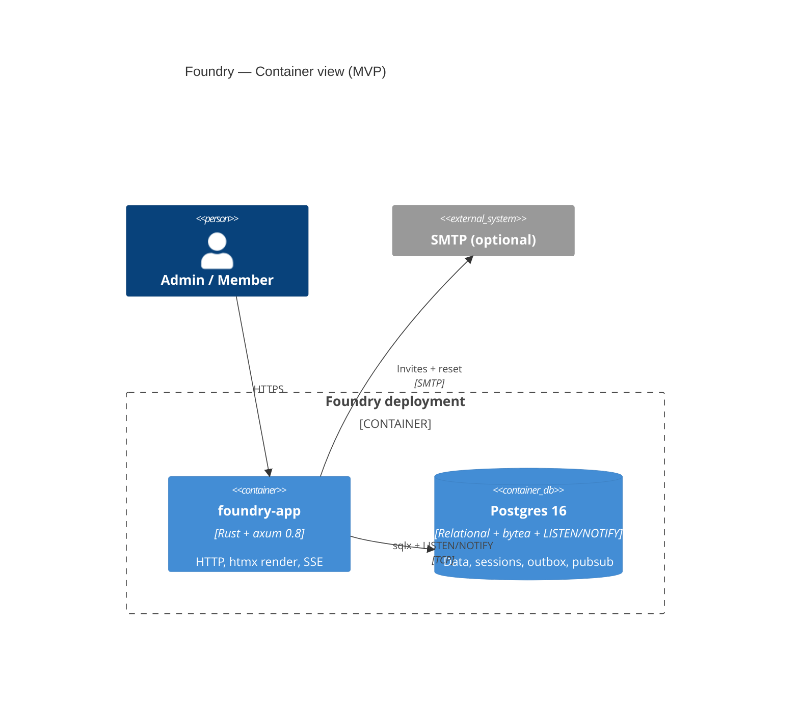

# Foundry

[](LICENSE)

**Foundry** is a self-hostable issue tracker for small product teams who
want Linear-style ergonomics without surrendering their data to a SaaS.
One Postgres, one binary, one `docker compose up`.

The MVP ships the inner loop a four-to-eight-person team needs: a
workspace with teams and projects, server-rendered issue boards, htmx
fragments for fast keyboard-driven interaction, durable sessions in
Postgres (no Redis, no encrypted-cookie surprises), and AGPL-3.0 to
keep it that way. The realtime story (SSE + LISTEN/NOTIFY) is wired
through the data model on day one and lights up in slice 2.

This repository is built outside-in. Each user story is a thin
end-to-end slice: a Gherkin scenario in
`docs/feature/foundry-backend-mvp/distill/features/` drives a Rust
implementation across a small set of strongly-isolated crates
(`foundry-core`, `foundry-store`, `foundry-auth`, `foundry-realtime`,
`foundry-app`). The acceptance harness lives in `foundry-acceptance`.

## Quick start

```sh
cp .env.example .env
docker compose up -d
# Tail the foundry log for the admin claim URL:
docker compose logs foundry | grep '\[BOOTSTRAP\]'
# Open the URL in a browser and complete admin claim.
```

That URL is one-shot, 30-minute TTL, never logged after first use.

## Architecture at a glance



Full design lives under `docs/feature/foundry-backend-mvp/design/`.

## Development

Prerequisites: Rust 1.85 (via `rust-toolchain.toml`), Docker.

```sh
cargo build --all                          # build the workspace
cargo test --workspace                     # unit + integration tests
cargo test -p foundry-acceptance           # cucumber suite (fast subset)
cargo test -p foundry-acceptance -- --tags "@docker-compose and not @manual"
                                           # the slow US-01 install set
cargo clippy --all-targets -- -D warnings  # lint
cargo fmt --all                            # format
```

See `CONTRIBUTING.md` for the inner-loop discipline and links to the
nWave methodology docs in `docs/`.

## License

[AGPL-3.0-only](LICENSE). If you operate Foundry as a network service,
the AGPL requires offering corresponding source to your users.
