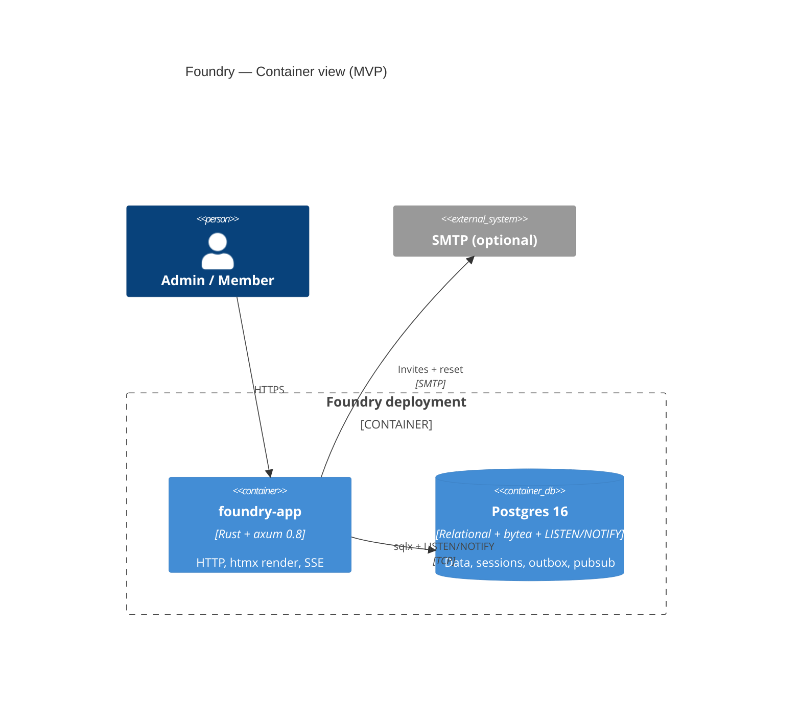

# Foundry

[](LICENSE)
[](https://github.com/Canzan/foundry/pkgs/container/foundry)
[](.github/workflows/ci.yml)

**Foundry** is a self-hostable issue tracker for small product teams who
want Linear-style ergonomics without surrendering their data to a SaaS.
One Postgres, one binary, one `docker compose up`.

The MVP ships the inner loop a four-to-eight-person team needs: a
workspace with teams and projects, server-rendered issue boards, htmx
fragments for fast keyboard-driven interaction, durable sessions in
Postgres (no Redis, no encrypted-cookie surprises), and AGPL-3.0 to
keep it that way. The realtime story (SSE + LISTEN/NOTIFY) is wired
through the data model on day one and lights up in slice 2.

This repository is built outside-in. Each user story is a thin
end-to-end slice: a Gherkin scenario in
`docs/feature/foundry-backend-mvp/distill/features/` drives a Rust
implementation across a small set of strongly-isolated crates
(`foundry-core`, `foundry-store`, `foundry-auth`, `foundry-realtime`,
`foundry-app`). The acceptance harness lives in `foundry-acceptance`.

## Quickstart

### Prerequisites

A new contributor needs exactly two things on the host before the first
command runs:

- **Rust 1.91** or newer, managed by [`rustup`](https://rustup.rs).
  The workspace pins the toolchain in `rust-toolchain.toml`, so `rustup`
  auto-installs the exact version on your first `cargo` invocation — no
  manual step required.
- **A reachable Docker daemon** — Docker Desktop, OrbStack, Colima, or
  system Docker on Linux. On macOS with Colima or OrbStack, see
  [DEVELOPER.md](./DEVELOPER.md#docker-on-macos-colima--orbstack--lima)
  for the one-line `DOCKER_HOST` export the acceptance harness needs.

The full acceptance suite additionally exercises the system `pg_dump` /
`pg_restore` binaries (slice-3 backup/restore lane). These must be
**version 16 or newer** — the test database is Postgres 16, and `pg_dump`
refuses to dump a server newer than itself. Install with
`brew install libpq && brew link --force libpq` (macOS — `brew upgrade libpq`
if you have an older one) or `apt-get install postgresql-client-16`
(Debian/Ubuntu). The default fast `cargo test` does **not** need them.

### From clone to green tests

```sh
git clone https://github.com/Canzan/foundry.git
cd foundry
cp .env.example .env
docker compose up -d postgres
cargo build --release --bin foundry   # @real-io scenarios spawn this binary
cargo test -p foundry-acceptance --release
```

The `cargo build` step compiles the `foundry` binary that the realtime /
subprocess (`@real-io`) acceptance scenarios spawn — `cargo test
-p foundry-acceptance` alone won't build it. The final command boots an
ephemeral Postgres via testcontainers for the test suite (separate from
the `docker compose` postgres above, which is for running the app) and
runs the cucumber acceptance suite. Expect a final `[Summary]` line with
every scenario passing — the count grows as new feature slices land:

```
[Summary]
NNN scenarios (NNN passed)
```

No `DATABASE_URL` or other Foundry environment variable needs to be set
on the host — the test harness provisions its own database.

### Run the app locally

Once the tests are green, bring the full stack up and grab the one-shot
admin-claim URL from the logs:

```sh
docker compose up -d --wait
docker compose logs foundry | grep '\[BOOTSTRAP\]'
```

Open the printed URL in a browser to complete the initial admin claim.
The URL is one-shot, has a 30-minute TTL, and is never logged again
after first use. The app listens on `http://localhost:3000` by default.

### Hot-reload for development

For the inner edit → save → reload loop, install `cargo-watch` once and
run the app under it:

```sh
cargo install cargo-watch
cargo watch -x 'run --bin foundry'
```

`cargo watch` rebuilds and restarts the binary on every save. The app
remains at `http://localhost:3000`; refresh the browser to see template
or handler changes. For a fuller account of the development inner loop
(test gates, crate boundaries, CI replication), see the
[Developer Guide](./DEVELOPER.md). New contributors should start with
[CONTRIBUTING.md](./CONTRIBUTING.md).

## Architecture at a glance



Full design lives under `docs/feature/foundry-backend-mvp/design/`.

## Observability (opt-in)

For an out-of-the-box Prometheus + Loki + Grafana stack alongside
Foundry, layer the observability overlay:

```sh
docker compose -f docker-compose.yml -f docker-compose.observability.yml up -d
# Grafana on http://localhost:3001 (anonymous viewer; admin/admin to log in).
```

The bundled "Foundry Overview" dashboard shows request rate, p95
latency by route, error rate, active SSE subscribers, Postgres pool
depth, and recent error-level logs — plus outbox backlog depth,
unclaimed admin bootstrap tokens, per-migration apply latency, realtime
LISTEN disconnects, and startup-probe failures. Operators with an
existing observability stack can instead scrape `foundry:9090/metrics`
directly.

## Kubernetes

The MVP ships docker-compose as the primary deploy artifact
(ADR-102). Plain-YAML Kubernetes manifests are available under
[`deploy/k8s/`](deploy/k8s/) for operators already on K8s; first-class
Helm support is the v0.4 target.

## License

[AGPL-3.0-only](LICENSE). If you operate Foundry as a network service,
the AGPL requires offering corresponding source to your users.
