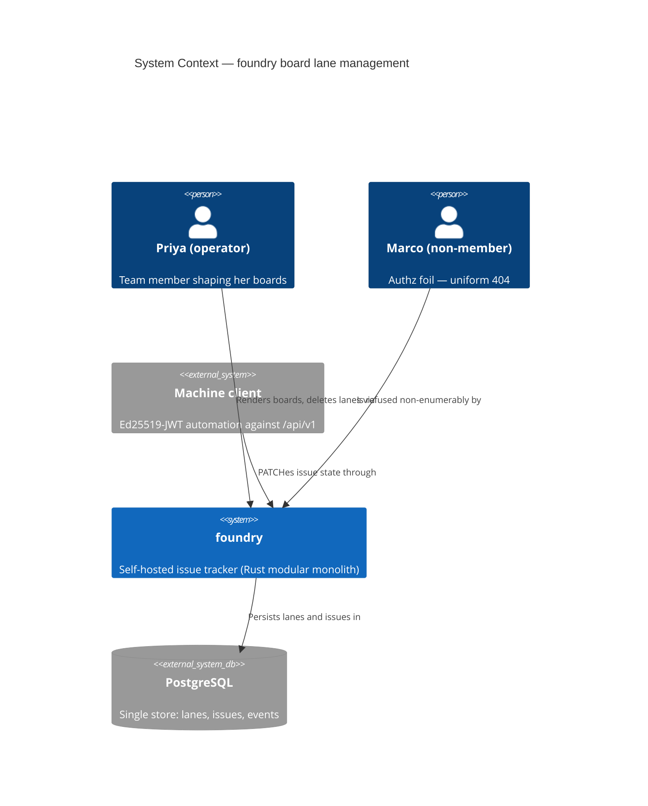
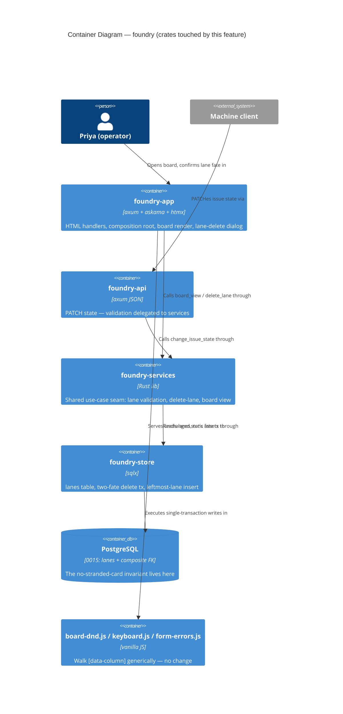
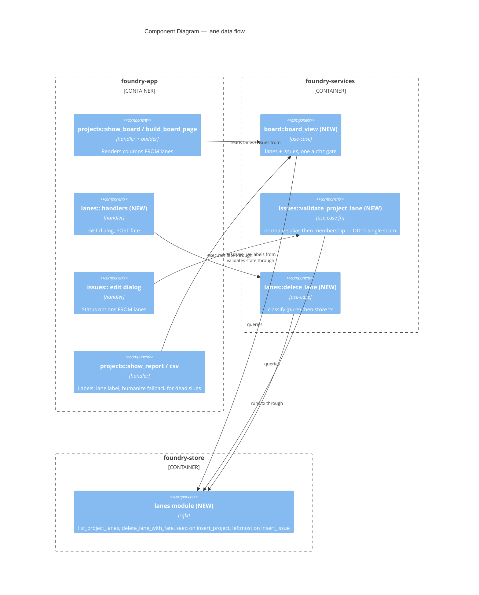

# Architecture Design — board-lane-management

Wave: DESIGN | Agent: nw-solution-architect (Morgan) | Mode: Propose (autonomous) | Date: 2026-08-22

## Context contract checklist

| Artifact | Status |
|---|---|
| `docs/feature/board-lane-management/feature-delta.md` (D1–D11, 4 stories) | ✓ read |
| `docs/feature/board-lane-management/slices/slice-01..04` | ✓ read |
| `docs/product/architecture/brief.md` (slugs-are-identity, ADR-modal-close-001, auth seams, crate graph) | ✓ read |
| `docs/product/jobs.yaml` → `job-board-lane-shaping` | ✓ read |
| Codebase: `projects.rs`, `board.html`, `issue_edit_modal.html`, `board-dnd.js`, migrations 0001/0012/0013, `foundry-api` PATCH path, report/CSV, `rename_project`, `delete_issue_cascade`, `normalize_state` | ✓ read |
| Migrations verified at 0014 → this feature owns **0015** | ✓ |

## 1. Quality drivers and constraint analysis

Priorities (established, not re-asked): **correctness > testability > maintainability**. Homelab
scale — no caching, no sharding, single Postgres, single-digit operators.

**The bottleneck, quantified.** The lane set is expressed as compile-time constants in exactly
three places — `DEFAULT_COLUMNS` (`projects.rs:49`) + `column_label_to_state` (`projects.rs:934`),
the `issues.state` CHECK (`0001_init.sql:71-72`), and `normalize_state`
(`foundry-services/src/issues.rs:60`) — and echoed in two more: the edit-dialog `<option>` list
(`issue_edit_modal.html:13-18`) and `humanize_state` (`comments.rs:820`). 100% of the feature is
blocked by these five static expressions; every other surface (dnd, keyboard nav, 0012 ordering,
0013 events, API wire shape) already treats the lane as an opaque string. **The design therefore
optimises for: convert those five expressions to data, leave every string-opaque surface
byte-untouched.** This is what makes ADR-board-lane-001's linkage choice (§3) nearly
ripple-free, and it is the data behind the D11 walking-skeleton claim.

## 2. C4

### 2.1 System Context (L1)



### 2.2 Container (L2) — the existing crate graph, unchanged



No new container, no new crate, no new dependency edge. Dependency direction stays
`app → api → svc → store → core`, enforced by `cargo xtask check-arch` + `deny.toml`.

### 2.3 Component (L3) — board/lane surface inside foundry-app + foundry-services

Warranted: the ripple touches 6+ components and the acceptance suite scrapes their seams.



## 3. Lane data model — decision summary (full analysis: `data-models.md`, ADR-board-lane-001)

**Chosen: Option B — `issues.state` remains the lane slug; a new `lanes` table becomes its
referent via a composite FK `(project_id, state) → lanes(project_id, slug)`; the static CHECK
and the `DEFAULT 'backlog'` are dropped.**

Alternatives considered (rejected rationale in ADR-board-lane-001):

| Option | Verdict |
|---|---|
| A. `issues.lane_id UUID` FK, retire `state` | Rejected — rewrites 0012's `(project_id, state, position)` partition, 0013 event values, `data-column` slugs, the API `state` wire field, and every state-string query, for zero user-visible benefit. 2–3× the code delta of B. |
| B. `state` stays the slug; composite FK to `lanes` | **Chosen** — the five static expressions become data; every string-opaque surface is untouched; the DB enforces "zero laneless issues" (KPI 2 guardrail) and the FK is the strand-guard in the two-fate delete tx. |
| C. `lanes` table, app-layer validation only (no FK) | Rejected — surrenders the DB-level invariant; the US-BLM-04 confirm-time race then rests on application discipline alone, which is exactly the class of silent lie D7 exists to prevent. |

Simplest-solution check: C is simpler than B by one constraint; it is rejected because it cannot
prove KPI 2 ("zero invisible issues, permanently") by query — the invariant would be a
convention, not a fact. B is the simplest design that makes the invariant structural.

## 4. Migration 0015 — `0015_project_lanes.sql`

Forward-only, additive, one-shot; runs on live homelab data. Steps, in one migration transaction:

1. `CREATE TABLE lanes` (DDL in `data-models.md` §1). `id` seeded with `gen_random_uuid()`
   (PG13+ built-in; app-side inserts keep the house UUIDv7 idiom).
2. **Grandfather seed** (D5), idempotent by construction (`ON CONFLICT (project_id, slug) DO NOTHING`):
   - every existing project: `backlog/Backlog/0`, `todo/Todo/1`, `in_progress/In-Progress/2`,
     `done/Done/3` — labels byte-equal to today's rendered headers, order identical → first
     render is byte-identical for boards without cancelled issues (US-BLM-01 scenario 1);
   - `cancelled/Cancelled/4` **only** where `EXISTS (SELECT 1 FROM issues i WHERE i.project_id
     = p.id AND i.state = 'cancelled')` — the one deliberate visible outcome (D11).
3. `ALTER TABLE issues DROP CONSTRAINT issues_state_check;` (Postgres auto-name for the inline
   CHECK in 0001 — DELIVER verifies the name against `pg_constraint` before relying on it).
4. `ALTER TABLE issues ALTER COLUMN state DROP DEFAULT;` — the landing rule moves to code (D6);
   an INSERT that forgets to pass `state` now fails loudly instead of silently minting `backlog`.
5. `ALTER TABLE issues ADD CONSTRAINT fk_issues_lane FOREIGN KEY (project_id, state)
   REFERENCES lanes (project_id, slug);` — **this ADD is the migration's built-in verification**:
   Postgres validates every existing row, so a project holding an issue in a state step 2 failed
   to seed aborts the migration atomically. Nothing is deleted, nothing reinterpreted.

Zero-shuffle discipline (0012 precedent): no `issues` row is updated at all — positions, states,
numbers all untouched. Verify-after query (DoD "provable by query", also the KPI 2 guard):

```sql
SELECT count(*) FROM issues i
 WHERE NOT EXISTS (SELECT 1 FROM lanes l
                    WHERE l.project_id = i.project_id AND l.slug = i.state);
-- MUST be 0; post-0015 the FK makes a nonzero result unreachable.
```

Earned-Trust note: the migration's contract is demonstrated empirically, not assumed — step 5
IS the probe (it exercises the real data), and the acceptance suite re-runs the guard query
after every scenario (DoD).

## 5. Request/response flows

### 5.1 Board render (US-BLM-01/02)

`GET /team/{team}/project/{slug}` → `show_board` → `foundry_services::board::board_view`
(one `resolve_member_project`-style gate; returns `lanes` ordered by `position ASC` + the same
`BoardIssue` rows as today) → `build_board_page(lanes, …)` replaces the `DEFAULT_COLUMNS` loop:
column slug = `lane.slug`, header = `lane.label`, card filter `issue.state == lane.slug`
(the `column_label_to_state` mapping and the const are **deleted**). Markup contract unchanged:
`section.column[data-column="{slug}"]` — `board-dnd.js` and `keyboard.js` walk it generically
and need no change. The board wrapper gains `id="board-columns"` (§5.3 OOB target).

### 5.2 Lane-delete dialog (US-BLM-03/04) — GET

Trigger (per rendered column header, template-only):

```html
<button type="button" class="lane-delete" data-lane-delete="{{ column.slug }}"
        aria-label="Delete lane {{ column.label }}"
        hx-get="/team/{{ team_slug }}/project/{{ project_slug }}/lanes/{{ column.slug }}/delete"
        hx-target="#modal-root" hx-swap="innerHTML">&times;</button>
```

The GET is a **safe read** (it mutates nothing) so it carries no `_csrf`; the confirm POST is
the mutating request and does (DISCUSS correction #3 below refines D10's wording). Handler:
resolve team → membership → project → lane; any refusal (foreign, absent, non-member,
signed-out on the fragment route) = uniform `resource_not_found_page` (D10). On success render
`partials/delete_lane_modal.html` with live count `N` and survivors. Dialog arms:

- `N == 0` — confirm-only: copy "Delete lane '{label}'? It holds no issues. This cannot be
  undone." One submit `name="fate" value="delete"`.
- `N ≥ 1` — fate dialog: copy "Delete lane '{label}' — it holds {N} issues."; destination
  `<select name="destination">` listing survivors in board order, leftmost survivor
  preselected; two submits `name="fate" value="move"` ("Move all {N} to …") and
  `name="fate" value="delete"` ("Delete all {N} permanently — this cannot be undone").

Close: `button.modal-close[data-action="close-modal"]` only — template-only wiring, no
listener (BR-4, ADR-modal-close-001). The dialog is `div.modal[data-modal="delete-lane"]`
with `[data-error-slot]` inside the form (form-errors.js contract).

### 5.3 Lane-delete confirm — POST (both fates)

`POST /team/{team}/project/{slug}/lanes/{lane}/delete` — form fields `_csrf`, `fate`
(`move|delete`), `destination` (required iff `fate=move`; htmx submits the clicked button's
name/value). CSRF middleware pre-handler (existing). Flow: authz gate (uniform 404 on refusal)
→ `foundry_services::lanes::delete_lane` → `Store::delete_lane_with_fate` — **one transaction**
(full TOCTOU analysis in `data-models.md` §5):

1. `SELECT … FROM lanes WHERE project_id=$1 AND slug=$2 FOR UPDATE` — absent → treat as the
   uniform non-enumerable 404 (covers the double-submit race).
2. Lane count for the project — `1` → refuse `LastLane` (nothing written).
3. Resolve **confirm-time membership**: `SELECT id, number FROM issues WHERE project_id AND
   state = dying ORDER BY position ASC, number DESC FOR UPDATE`.
4. Fate arm:
   - **move**: validate destination exists and ≠ dying (else `UnknownDestination` → 422);
     read destination count `C` (0012 contiguity invariant ⇒ occupied positions are
     `0..C-1`); set each card `state = destination, position = C + idx` preserving order;
     per card: one 0013 `status` event (`old = dying slug`, `new = destination slug`,
     `actor = operator`) + one `IssueUpdated` outbox row — same-tx parity with
     `reposition_issue_with_outbox` (store/lib.rs:1608-1634).
   - **delete**: `DELETE FROM issues WHERE id = ANY($ids)` — the `delete_issue_cascade` shape
     (attachments.rs:184): comments, attachments, change events cascade away; no outbox, no
     tombstone (D7).
5. `DELETE FROM lanes WHERE id = $lane_id` — the FK makes this statement the strand-guard: a
   card that raced into the dying lane after step 3 blocks/aborts this delete with an FK
   violation; the store retries the whole operation (bounded, 3 attempts) so the late card is
   re-resolved and moved/deleted with the rest (US-BLM-04 scenario 5). Exhausted retries →
   `Internal` (500) — honest failure, nothing partially applied.
6. Commit. Return survivors + counts.

Response (success): primary target `#modal-root` `innerHTML` receives the empty remainder
(dialog closes); the body carries the refreshed board columns as an out-of-band swap —
`<div class="board" id="board-columns" hx-swap-oob="true">…</div>` — the house OOB idiom the
edit-dialog card-replace already uses. Column gone without a reload; reload re-renders from
lane data (persisted).

### 5.4 Error flows

| Condition | Status | Shape |
|---|---|---|
| Last lane (`count == 1`) | 422 | bare error fragment "A board needs at least one lane" → form-errors.js routes into the dialog's `[data-error-slot]`; lane untouched |
| Unknown/dying destination on move | 422 | bare fragment into `[data-error-slot]` |
| Unknown lane on ANY state write (dialog save, dnd POST, API PATCH) | 422 | existing `invalid_state` validation shape per adapter (HTML fragment / JSON error) — one seam (§6.4) |
| Non-member / signed-out / foreign / absent (GET and POST lane routes) | 404 | uniform `resource_not_found_page` — never 401/403 (D10) |
| Missing `_csrf` | (middleware) | existing CSRF refusal, pre-handler |
| FK-race retries exhausted | 500 | internal error; transaction fully rolled back |
| ×/Esc cancel | — | `closeTopLayer()`; zero writes, zero events (US-BLM-04 scenario 4) |

## 6. The ripple surfaces (D8), end-to-end

1. **Board column render** — §5.1. `DEFAULT_COLUMNS` + `column_label_to_state` deleted.
2. **dnd drop targets** — no JS change: `board-dnd.js` reads `[data-column]` and posts the slug;
   slugs are lane slugs. The POST lands in `change_issue_state` → per-project validation.
3. **Edit-dialog Status options** — `issue_edit_modal.html` hardcoded `<option>`s (lines 13-18)
   become a loop over `IssueEditView.lanes` (board order, current state selected). A project
   with a Cancelled lane now offers it (US-BLM-01 scenario 3); one without does not.
4. **`/api/v1` PATCH validation** — no route/wire change. `normalize_state` keeps its alias
   folding (`in-progress`→`in_progress`, `canceled`→`cancelled`) but membership moves to the
   new `validate_project_lane(store, project_id, input)` inside `change_issue_state` — the
   DD10 single seam: HTML dialog, dnd POST and JSON PATCH accept/refuse identically, 422
   `invalid_state`.
5. **Report/CSV labels** — live lanes render their `lanes.label`; a slug present only in
   history (its lane deleted, e.g. `todo` after Todo is removed) falls back to
   `humanize_state` — the historical-label renderer for a closed, unmintable slug set (D9: no
   add ⇒ the five slugs and their labels are fixed). CSV stores raw slugs as today (column
   contract unchanged). See DISCUSS refinement #2.
6. **New-issue landing** — `insert_issue_with_outbox` resolves the project's leftmost lane
   (`ORDER BY position ASC LIMIT 1`) inside its existing transaction and INSERTs `state`
   explicitly (the column DEFAULT is gone). `CreatedIssue.state` returns the **actual** landing
   slug — the hardcoded `"backlog"` echo at services/issues.rs:124 was a seventh static-list
   consumer (DISCUSS correction #1).

## 7. Extension points for D9 successors (noted, NOT built)

- **Add lane**: `lanes` rows are ordinary data; an `insert_lane(project_id, slug, label,
  position)` port slots in with no schema change. Slug minting would reuse
  `foundry_core::slugify` (single definition, check-arch enforced).
- **Rename lane**: `label` is a mutable display column by construction; `slug` is immutable
  identity — the names-are-labels invariant already covers lanes.
- **Reorder lane**: `UNIQUE (project_id, position)` is declared `DEFERRABLE INITIALLY
  IMMEDIATE` precisely so a future reorder can renumber inside one transaction with
  `SET CONSTRAINTS … DEFERRED` — without this, reorder would need the two-pass renumber dance.
- Nothing in the delete flow assumes the four/five known slugs; only the migration and the
  creation seed enumerate them.

## 8. Earned Trust — probes and enforcement

Dependencies this design leans on, and how each is demonstrated (not assumed):

| Trusted thing | The lie it could tell | Probe |
|---|---|---|
| Composite-FK RESTRICT semantics under concurrent insert (READ COMMITTED) | A concurrently filed card survives the lane delete stranded | Gold test in the HTTP lane: file an issue into the dying lane between dialog GET and confirm POST (deterministic in-test sequencing), assert zero laneless issues by the §4 guard query (US-BLM-04 scenario 5) |
| `issues_state_check` auto-generated constraint name | 0015 fails on a differently-named CHECK | DELIVER verifies via `pg_constraint` on a live-data copy before merge (DoD: "0015 applies cleanly to a database with live data") |
| Byte-identical grandfather render | Silent board shuffle on upgrade | US-BLM-01 scenario 1 as the migration gate (DoD), mirroring 0012's zero-shuffle discipline |
| htmx submitter name/value inclusion (`fate` buttons) | Fate never reaches the server | `@needs-browser` fantoccini scenario clicks each fate button and asserts the observable outcome |
| Postgres deadlock detection + bounded retry (cross-lane AB/BA deletes) | Two crossing deletes wedge or half-apply | Second gold test (reviewer iteration 1): two concurrent deletes of different lanes with crossing move destinations (A→B, B→A); assert both succeed or one fails cleanly — never partial state, zero laneless issues after both |

Enforcement tooling (architecture rules erode without teeth): extend `cargo xtask check-arch`
with a rule in the `slugify`-ban idiom — **fail the build if a static array/match enumerating
lane slugs (`"backlog"`, `"todo"`, …) reappears under `crates/foundry-app/src` or
`crates/foundry-api/src` outside `#[cfg(test)]`** (the store's creation-seed template and
`humanize_state`'s historical fallback are the two documented exemptions). Exact matcher shape
is the crafter's; the rule and its exemptions are this design's contract.

## 9. Quality gates (ISO 25010 mapping, abridged)

- **Functional correctness**: FK invariant + confirm-time membership + same-tx 0013 events.
- **Reliability**: single-transaction fate; bounded retry; cancel writes nothing.
- **Security**: existing team-membership gate; uniform non-enumerable 404; `_csrf` on the
  mutating POST; no new authz axis (D10).
- **Maintainability/testability**: pure classification heart (`classify_lane_delete`, the
  `classify_rename` idiom) property-testable without a store double; ports listed in
  `component-boundaries.md`; mutation ≥80% on touched code.
- **Performance**: one extra indexed query per board render / state write (`lanes` by
  `project_id`) — negligible at homelab scale; no caching added (established constraint).

## 10. DISCUSS corrections / refinements (code over brief, recorded)

1. **Seventh static-list consumer**: `CreatedIssue.state = "backlog"` hardcoded
   (`foundry-services/src/issues.rs:124`) — the JSON create response would echo a lane the
   project may not have. Folded into ripple surface 6.
2. **D8 "report labels derive from the lane set" is refined**: labels for lanes that no longer
   exist (history rows referencing a deleted lane's slug) *cannot* derive from lane data — the
   design pins: live lanes → `lanes.label`; historical/dead slugs → `humanize_state` fallback.
   Since D9 forbids minting new slugs, the fallback is total and byte-stable.
3. **D10 wording**: the delete *trigger* is a safe htmx GET (fetches the dialog, mutates
   nothing) and carries no `_csrf`; only the confirm POST is mutating and does. The
   non-enumerable-404 contract applies to both GET and POST on the lane routes.
4. **Intra-workspace non-member divergence, deliberate**: `show_board` maps a same-workspace
   non-member to a 403 page; the lane routes map the same principal to the uniform 404 per
   D10's explicit pin. Recorded so the asymmetry reads as chosen, not accidental.

## 11. Handoff annotations

- **DISTILL (acceptance-designer)**: scraper markers in `component-boundaries.md` §4; the
  known premise-break (`UNRENDERED_STATE = "cancelled"`,
  `keyboard_shortcut_bindings.rs:3891`) must be re-premised or retired.
- **DELIVER (nw-software-crafter, OOP/imperative)**: port signatures in
  `component-boundaries.md`; pure classification heart for property tests; check-arch rule §8.
- **External integrations**: none — no third-party API is touched; no contract-test
  annotation required for platform-architect.
