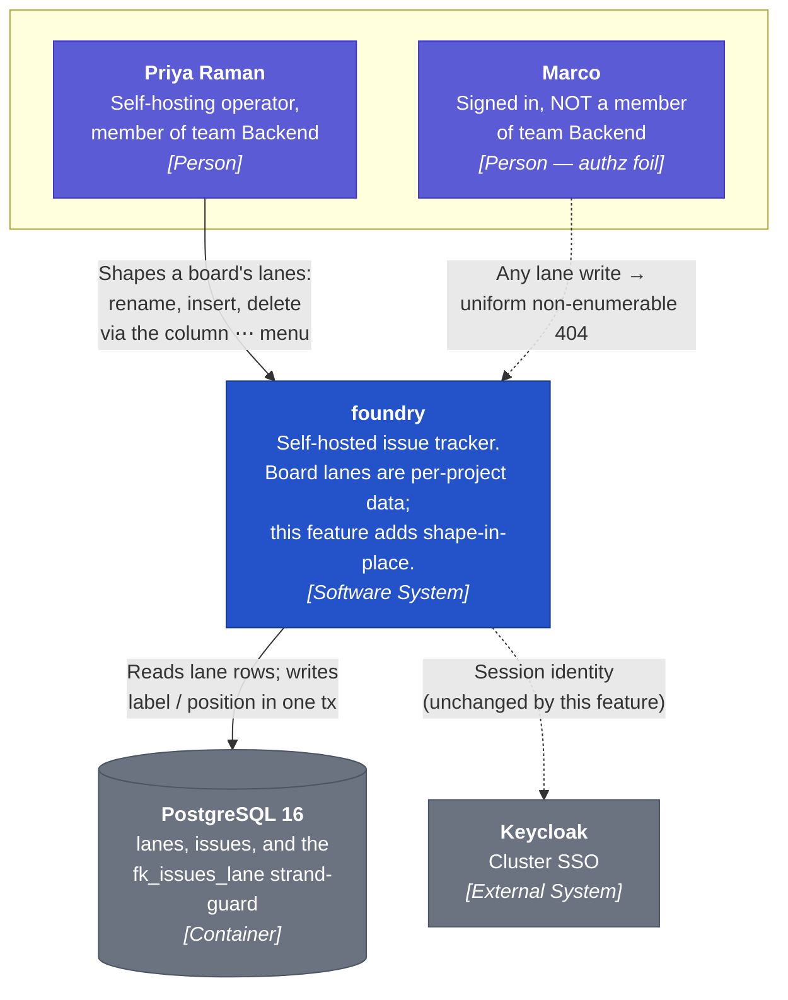
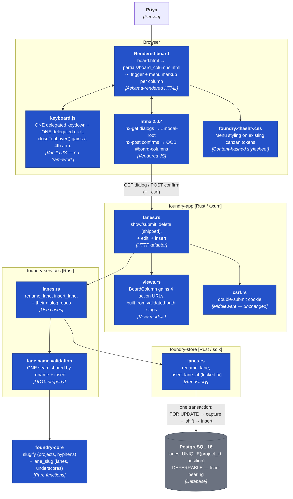

# Architecture Design — board-lane-overflow-menu

DESIGN wave, 2026-09-02. Consumes `../feature-delta.md` (DISCUSS: D1–D14,
US-BLO-01/02/03). Paradigm: **unchanged** — Rust is multi-paradigm, but this
repo has 48 features of established practice (imperative core, ports-and-adapters
crate split, `nw-software-crafter` in DELIVER). Re-litigating it here would be
noise, and no paradigm section is written to `CLAUDE.md`.

## 1. The D8 spike — RESOLVED, and the answer is better than DISCUSS assumed

DISCUSS carried one open technical question (D8): can a mid-board lane insert
shuffle positions under `UNIQUE (project_id, position) DEFERRABLE INITIALLY
IMMEDIATE` without a migration? It was ranked this feature's only real
uncertainty, and slice 03 was gated on answering it.

**It was run, not reasoned about**, against a disposable `postgres:16-alpine`
container (the exact tag `harness.rs:76` pins to production) carrying a faithful
reproduction of the 0015 `lanes` shape, the `fk_issues_lane` composite FK, and
live-shaped data: 3 projects, 2–5 lanes each, 8 issues referencing lanes.

| # | Test | Result |
|---|---|---|
| 1 | Naive `UPDATE lanes SET position = position + 1 WHERE position >= n`, constraint left `IMMEDIATE`, then `INSERT` | **PASSES.** Committed clean; positions contiguous. |
| 2 | The *identical* statement against a **non-deferrable** `UNIQUE (project_id, position)` | **FAILS** — `duplicate key value violates unique constraint`. |
| 3 | Insert after the last lane (no shuffle) | Passes. |
| 4 | Two concurrent inserts at the same anchor, **no explicit lock** | One commits; the loser aborts with a **raw `duplicate key` error**. No corruption, but a 500-shaped failure. |
| 5b | Two concurrent inserts, **`FOR UPDATE` on the project's lanes + anchor resolved by identity inside the lock** | **Both commit, cleanly serialized.** Positions 0–6 contiguous and unique. Zero issue rows touched. |
| 6 | `UPDATE lanes SET label = ...` | `slug`, `position` and every `issues.state` provably unchanged. |
| 7 | Two lanes given the **same label**; then an insert whose **slug** collides | Duplicate labels **allowed**; duplicate slug refused by the DB with a raw error. |
| 8 | `INSERT ... slug = 'in-progress'` (a hyphen — `foundry_core::slugify`'s output shape) | **Rejected** by `lanes_slug_check`. |

### What this changes

**`DEFERRABLE INITIALLY IMMEDIATE` does not mean "checked immediately per row".**
It means *checked after each **statement***. That is precisely why test 1 passes
and test 2 fails: at end-of-statement the shifted positions are already unique.
DISCUSS assumed a `SET CONSTRAINTS ... DEFERRED` window would be needed. **It is
not.** No `SET CONSTRAINTS` call is required anywhere in this feature.

Three consequences, all binding:

1. **No migration. The schema counter stays at 0015** (AC-3.9 satisfied, and not by luck).
2. **The `DEFERRABLE` keyword on `0015:22` is load-bearing for this feature.** Test 2 is the proof: the same statement fails without it. A future "tidy-up" migration dropping `DEFERRABLE` would silently break lane insert. This gets an ADR and a guard (§6).
3. **Concurrency needs an explicit lock, which DISCUSS did not ask about.** Test 4 shows the unguarded path hands the operator a raw Postgres error. Test 5b shows the shipped house idiom (`FOR UPDATE`, already used by `delete_lane_with_fate` per ADR-BOARD-LANE-002) fixes it completely.

### The trap the spike caught by accident

The first attempt at test 5 computed the insert position *from the anchor lane
after the shift had already moved it*, and both transactions failed. The
correction is a design rule, not a coding detail:

> **The anchor's position is captured BEFORE the shift, and the anchor is
> resolved by lane *identity* (slug) inside the lock — never from a position
> number captured when the dialog was rendered.**

This is the same shape as the predecessor's D7 ("the dialog's card count is
advisory copy only; the fate binds at confirm time"). A position captured at
dialog-render time is stale the moment another operator inserts a lane, and
"insert before Done" must keep meaning *before Done*, not *at slot 3*.

## 2. C4 — System Context



## 3. C4 — Container



## 4. C4 — Component: the menu as `closeTopLayer()`'s fourth arm

This is the subsystem that earns a component diagram, because it is the one
place this feature can violate a standing architectural rule (BR-4).

`keyboard.js` today derives its layer stack from the DOM on **every** press and
stores nothing (ADR-003 §2) — `helpIsOpen()` and `modalIsOpen()` ask their hosts
whether they are holding anything. `Escape` has exactly one owner,
`closeTopLayer()`; a second `Escape` listener would peel two layers per press,
which is BR-4's named failure.

```mermaid
graph TB
    key["<b>ONE document keydown listener</b><br/>keyboard.js:855"]
    click["<b>ONE document click listener</b><br/>keyboard.js:870 — delegated,<br/>survives htmx swaps"]

    ctl["<b>closeTopLayer()</b><br/>the single Escape owner (BR-4)<br/>ordered arms, DOM-derived, never stored"]

    a1["1. helpIsOpen() → closeHelp()<br/><i>#kb-overlay-root</i>"]
    a2["2. modalIsOpen() → closeModal()<br/><i>#modal-root childElementCount &gt; 0</i>"]
    a3["<b>3. menuIsOpen() → closeMenu()</b><br/><i>NEW — queries the open menu in the DOM</i>"]
    a4["4. searchIsOpen() → closeSearch()"]
    a5["5. empty stack → no-op<br/><i>never navigate, never touch selection</i>"]

    t1["[data-action='close-modal']<br/><i>shipped</i>"]
    t2["<b>[data-action='toggle-lane-menu']</b><br/><i>NEW — opens/closes</i>"]
    t3["<b>click outside an open menu</b><br/><i>NEW — same listener, one more branch</i>"]

    key -->|"key === 'Escape'"| ctl
    ctl --> a1 --> a2 --> a3 --> a4 --> a5
    click --> t1 --> a2
    click --> t2 --> a3
    click --> t3 --> a3

    classDef new fill:#2452c9,stroke:#1a3a91,color:#fff
    classDef old fill:#6b7280,stroke:#4b5563,color:#fff
    class a3,t2,t3 new
    class key,click,ctl,a1,a2,a4,a5,t1 old
```

**Design rules this pins (ADR-BOARD-LANE-005):**

1. The menu becomes **arm 3** of the existing `closeTopLayer()`, placed below the
   modal and above the search panel. It registers **no** `Escape` listener —
   BR-4 stays unviolable by construction, exactly as `close-modal` did.
2. `menuIsOpen()` is **DOM-derived** — it queries for the open menu element, the
   way `modalIsOpen()` asks `#modal-root.childElementCount`. **No `var openMenu`.**
   This is not stylistic: the OOB `#board-columns` refresh replaces the whole
   column subtree, so a stored handle would point at a detached node and turn
   `Escape` into a silent no-op with a menu on screen — the exact failure ADR-003 §2
   describes.
3. Menu open/close is **client-side only** — no request, no server state, matching D11.
4. Menu and dialog are **mutually exclusive**: choosing an item closes the menu
   and lets htmx swap the dialog into `#modal-root`. The arm ordering is therefore
   defensive rather than load-bearing, but it must still be deterministic.
5. Both new click behaviours (toggle, click-outside) are **branches of the existing
   delegated click listener** at `keyboard.js:870`. No second listener is added.
6. `closeMenu()` returns focus to the `⋯` trigger of the menu it closed, resolved
   from the DOM.

## 5. Write paths

### 5.1 Rename (US-BLO-02) — the trivial one

```
GET  /team/{t}/project/{p}/lanes/{lane}/edit   → lanes::show_edit_lane_dialog
POST /team/{t}/project/{p}/lanes/{lane}/edit   → lanes::submit_edit_lane
```

Single-statement `UPDATE lanes SET label = $1 WHERE project_id = $2 AND slug = $3`.
No transaction needed beyond the implicit one; no lock (last write wins on a
display label is acceptable at homelab scale, and no invariant depends on it).
Spike test 6 confirms `slug`, `position` and every `issues.state` are untouched.

Duplicate labels are **allowed** (spike test 7 — two lanes both "Doing"
committed fine). This is AC-2.6, and it is correct: labels are display, slugs
are identity.

### 5.2 Insert (US-BLO-03) — the one with the invariant

```
GET  /team/{t}/project/{p}/lanes/{lane}/insert/{side}   → lanes::show_insert_lane_dialog
POST /team/{t}/project/{p}/lanes/{lane}/insert/{side}   → lanes::submit_insert_lane
```

`{side}` ∈ `before` | `after`; anything else is the uniform non-enumerable 404
(never a 400 — an unknown side must not be distinguishable from an unknown lane).

One transaction, in this exact order — the shape proven by spike test 5b:

```sql
BEGIN;
  -- 1. serialize on this project's lane set (ADR-BOARD-LANE-002 house idiom)
  SELECT 1 FROM lanes WHERE project_id = $1 ORDER BY position FOR UPDATE;

  -- 2. resolve the anchor by IDENTITY, inside the lock; NULL → NotFound → 404
  --    (never from a position captured at dialog-render time)
  SELECT position INTO at FROM lanes WHERE project_id = $1 AND slug = $2;

  -- 3. 'after' means at + 1; capture BEFORE any shift
  at := at + (side = 'after')::int;

  -- 4. pre-check the minted slug INSIDE the lock, so the operator gets the
  --    D7 refusal copy and never a raw duplicate-key error (spike test 7)
  --    → LaneSlugTaken → 422 into [data-error-slot]

  -- 5. shift. Safe ONLY because the constraint is DEFERRABLE
  --    (end-of-statement check — spike tests 1 vs 2)
  UPDATE lanes SET position = position + 1 WHERE project_id = $1 AND position >= at;

  -- 6. land at the captured slot
  INSERT INTO lanes (project_id, slug, label, position) VALUES ($1, $3, $4, at);
COMMIT;
```

Zero `issues` rows are written; zero `0013` change events (AC-3.3) — confirmed
by spike tests 5b and 6, which left all 8 issue rows in their original states.

### 5.3 Lane slug minting (ADR-BOARD-LANE-004)

`foundry_core::slugify` **cannot be reused** — spike test 8 proves its output
shape (`in-progress`) is rejected by `lanes_slug_check`, which demands
`^[a-z][a-z0-9_]*$`. A sibling `foundry_core::lane_slug` is added:

| Input | Slug | Note |
|---|---|---|
| `Staging` | `staging` | |
| `In Progress` | `in_progress` | non-alnum runs → single `_`; matches the shipped seed exactly |
| `Code Review!!` | `code_review` | trailing `_` trimmed |
| `2024 Review` | `lane_2024_review` | `^[a-z]` anchor forces a prefix (§6) |
| `...` / `!!!` / `   ` | *(empty)* | → **refused inline**, D7 |

The **digit-leading prefix is a deliberate, disclosed deviation** from D7's
"never auto-mutate". D7 forbids silently resolving a *collision* (`done_2`),
because a suffixed slug drifts from its label forever. A `lane_` prefix on a
digit-leading name is different in kind: it is *normalisation to satisfy a CHECK*,
the label is preserved verbatim, and the slug is never shown to the operator. The
alternative — refusing "2024 Review" as an invalid lane name — is user-hostile
for a legitimate name. The other alternative, relaxing the CHECK to `^[a-z0-9]`,
would need migration 0016 and is rejected on that ground alone.

`lane_slug` lives in `foundry-core`, not `foundry-app` — `fn slugify(` under
`crates/foundry-app/src` is a `check-arch` build failure, and slug minting is a
pure domain function regardless.

## 6. Guarding the load-bearing `DEFERRABLE`

Spike test 2 makes this concrete: strip `DEFERRABLE` from `0015:22` and lane
insert breaks with a duplicate-key error, while every existing test stays green
(nothing today shifts positions). That is a latent trap of exactly the kind this
repo's `check-arch` rules exist to close (the no-static-lane-list rule; the
`fn slugify(` rule; the asset-integrity rule).

**Recommendation for DELIVER:** a `check-arch` rule asserting the `lanes`
position constraint is declared `DEFERRABLE` in the migration set, failing the
build with a message naming this feature. Cheap (a grep over
`crates/foundry-store/migrations/`), and it converts a silent runtime break into
a build failure — the same trade the other three rules already make.

## 7. Reuse vs. new

| Concern | Decision | Rationale |
|---|---|---|
| Dialog frame, CSRF, error-slot routing | **Reuse** `delete_lane_modal.html` shape verbatim | Shipped and proven; D5 |
| Escape / close mechanism | **Reuse** `closeTopLayer()` + delegated click | BR-4; adding a listener is the one thing forbidden |
| Layer-open state | **New** arm, DOM-derived | Must not store a handle across OOB swaps |
| Project slug minting | **Do NOT reuse** `slugify` | Spike test 8 — wrong separator, fails the CHECK |
| Transaction locking | **Reuse** the `FOR UPDATE` idiom from `delete_lane_with_fate` | ADR-BOARD-LANE-002; spike test 5b |
| Position shuffling | **New**, but no new schema | Spike tests 1–2 |
| Lane name validation | **New**, one seam shared by rename + insert | DD10 property, Driving Port 3 |
| `BoardColumn` action URLs | **Extend** the view model | `board_columns()` already builds `edit_url`/`state_url` for cards — house idiom |
| Board column markup | **Extend** `board_columns.html` once | Shared with the OOB partial; D14 |

## 8. Residual risks

| Risk | Severity | Mitigation |
|---|---|---|
| A future migration drops `DEFERRABLE`, silently breaking insert | HIGH | ADR-BOARD-LANE-003 + the §6 `check-arch` rule |
| A dev stores the open-menu handle instead of deriving it; `Escape` no-ops after an OOB swap | MEDIUM | ADR-BOARD-LANE-005 rule 2; a browser scenario that opens a menu, triggers an OOB refresh, then presses `Escape` |
| Anchor position captured at dialog-render time rather than in-lock | MEDIUM | §1 rule; the concurrent-insert scenario is the oracle |
| Menu CSS ships without the stylesheet re-hash | MEDIUM | DoD item; the repo has been bitten by a stale hash row before |
| Raw duplicate-key error reaching the operator on slug collision | LOW | §5.2 step 4 pre-checks inside the lock (spike test 7 showed the raw error otherwise) |
| HTTP-lane CSRF injection masking a real browser 403 | LOW | Inherited from `fix-comment-delete-csrf`: prove CSRF in the browser lane, not only HTTP |
