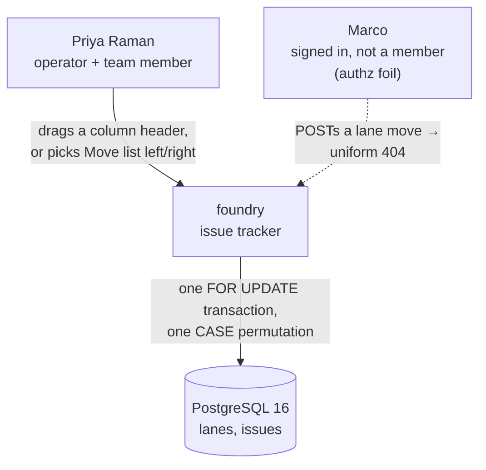
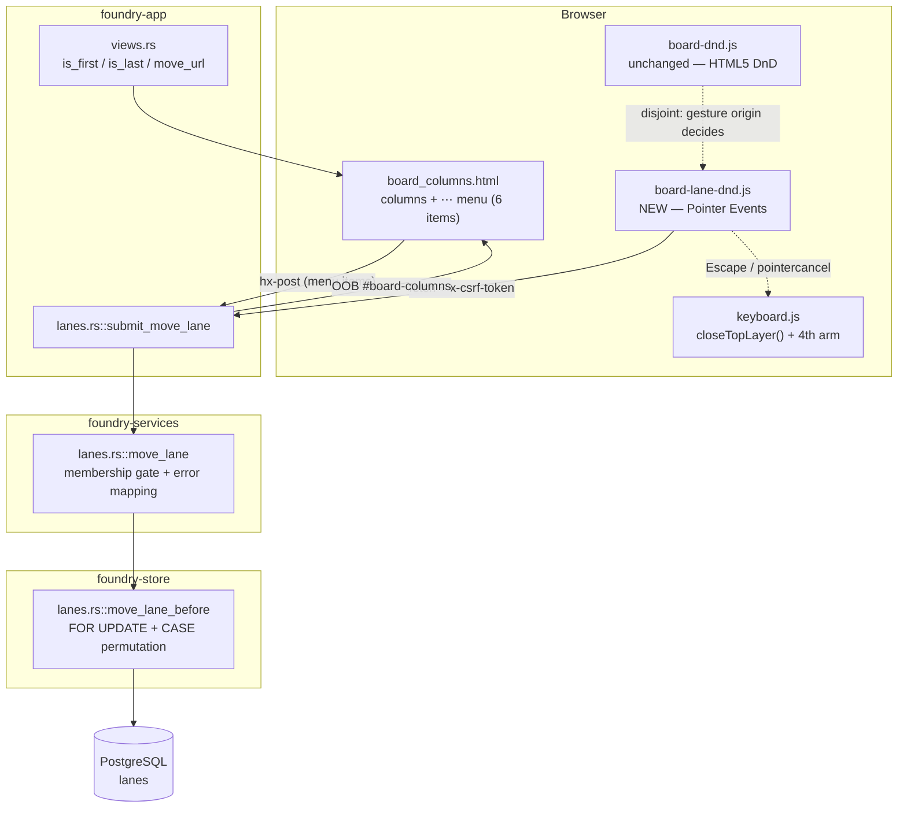

# Feature Delta — board-lane-reorder

Change a board's lane order in place: **drag a column header** left or right
(Pointer Events, so it works on touch), and **Move list left / Move list right**
in the shipped `⋯` menu for keyboard, assistive technology and precision.

Feature type: **cross-cutting** (Askama template + CSS + a new `board-lane-dnd`
browser module + app handlers + services use case + store transaction).
Predecessor: `board-lane-overflow-menu`, whose *Triggered suggestions* named
this feature first among deferred successors ("the menu is now the natural home
for it, and the position-shuffle machinery from D8 is exactly what it needs").

## Wave: DISCUSS

### [REF] Prior Wave Consultation

| Source | Read | What it settled |
|---|---|---|
| `docs/product/jobs.yaml` | ✓ | `job-board-lane-shaping` exists and its `scope_history` ends "**Reordering lanes remains deferred**". This feature is the third widening of that job, not a new one. |
| `docs/product/architecture/brief.md` §lanes | ✓ | `UNIQUE (project_id, position) DEFERRABLE` is **load-bearing** and checked at end-of-*statement*. Lane slugs are immutable identity; the composite FK is the no-stranded-card invariant. |
| `docs/product/architecture/brief.md` §dialog-layers | ✓ | BR-4: `Escape` has exactly one owner, `closeTopLayer()`. A drag-cancel must be an **arm**, never a second listener. |
| `docs/product/outcomes/registry.yaml` OUT-3, OUT-6, OUT-8 | ✓ | OUT-6 pins the menu's item contract *and order*; OUT-8 pins the insert transaction's exact discipline, which a move must inherit and extend. |
| `docs/feature/board-lane-overflow-menu/feature-delta.md` | ✓ | D1–D14 + *Out of Scope* ("Reordering existing lanes… flagged as the natural successor"). This is it. ADR-BOARD-LANE-003/005 are the two that bind here. |
| `docs/feature/board-lane-management/feature-delta.md` | ✓ | D9 deferred reorder originally; D6 (≥1 lane, leftmost landing) and D10 (authz idiom) carry forward. |
| `docs/feature/fix-lane-menu-clipped-mobile/rca.md` | ✓ | `.board{overflow-x:auto}` clips absolutely-positioned descendants below 480px; the lane header is now a 44px band. Both facts shape D2 and D15. |
| `crates/foundry-app/static/js/board-dnd.js` | ✓ | The shipped **card** drag: native HTML5 DnD, optimistic move, neighbour-named `after` param, revert to exact origin slot. Its idiom is copied (D6/D7); its *mechanism* is deliberately not (D3). |
| `crates/foundry-store/src/lanes.rs::insert_lane_at` | ✓ | The exact shuffle transaction — `FOR UPDATE`, resolve anchor by identity inside the lock, capture the slot before shifting, pre-check, plain `UPDATE`. D8 below is where a move departs from it. |
| `docs/product/personas/persona-instance-operator.yaml` | ✓ | Priya Raman reused; no new persona minted. |
| `docs/product/journeys/journey-theme-adoption.yaml` | ✓ | Unrelated (theming). No lane journey exists to extend. |
| `docs/product/vision.md`, `docs/project-brief.md`, `docs/stakeholders.yaml` | ⊘ | Not present in this repo. |
| `docs/feature/board-lane-reorder/discover/`, `diverge/` | ⊘ | No DISCOVER or DIVERGE wave ran. Requirements were clear at intake. |

No contradiction with prior evidence. Every prior document that mentions
reordering *defers* it and names it a successor; nothing forbids it.

### [REF] Persona

**Priya Raman — self-hosting operator and team member on her own boards**
(`persona-instance-operator`, same as both predecessors). She can now start
lean, rename, insert and delete lanes. What she cannot do is put a lane
somewhere else: a lane's position is fixed at the moment it is created, so a
board that grew in the wrong order stays in the wrong order unless she deletes
a lane and re-inserts it — which means settling the fate of its cards to
achieve a purely cosmetic move. **Marco** (signed in, not a member of team
Backend) remains the authz foil.

### [REF] JTBD

**job_id: `job-board-lane-shaping`** — *widened a third time*, not replaced.

One-liner: *When my board's lanes are all the right lanes but in the wrong
order, I want to move one left or right — by dragging it, or by asking the menu
— so the board reads in the direction the work actually travels, without
deleting and rebuilding a lane just to move it.*

The shipped job story covers rename, insert and delete. This feature adds the
last deferred verb, **reorder**. `jobs.yaml` is updated in place (widened
`job_story`, a re-scored `opportunity`, a third `validated_by`, a third
`scope_history` entry) rather than growing a competing near-duplicate job. All
three stories below trace N:1 to `job-board-lane-shaping`.

**Four forces (delta only — the shipped forces still hold):**

- **Push** — lane order is decided at creation and never again. The only way to move a lane today is *delete it and insert a new one*, which forces an irreversible decision about its cards (move them all, or delete them all) in order to achieve a cosmetic change. That is a disproportionate price, and it loses the lane's identity: a new slug, so every issue in it is rewritten under `fk_issues_lane`.
- **Pull** — grab the column and slide it, the way every board tool works; or ask the same `⋯` menu that already renames and inserts.
- **Anxiety** — that dragging a *column* will be confused with dragging a *card* and scatter work; that a half-finished drag leaves the board in an order nobody chose; that two operators reordering at once corrupt the position sequence.
- **Habit** — cards are dragged already, with native HTML5 drag. Lanes dragging by a *different* mechanism (D3) must feel the same to the hand even though it is not the same code.

### [REF] Locked Decisions

| ID | Decision | Rationale / source |
|---|---|---|
| D1 | **Reorder is position-only.** A move writes `lanes.position` and nothing else: zero `issues` rows, zero `0013` change events, zero slug or label mutations. Cards travel with their lane because they belong to it by **slug**, not by position. | `brief.md` §lanes; the identical guarantee OUT-8 makes for insert ("writes ZERO issue rows and ZERO change events"). |
| D2 | **The drag surface is the column header, gated by a movement threshold.** A pointer that moves past the threshold begins a lane drag; one that does not still delivers its click to `⋯` or to nothing. Without a threshold the menu trigger — which lives *inside* the header — becomes unreachable by pointer, trading one capability for another. | User decision at intake. The header is already a 44px band with reserved space (`fix-lane-menu-clipped-mobile`), so it is a legitimate touch target *because* of the mobile fix. |
| D3 | **Pointer Events, not HTML5 drag-and-drop.** HTML5 DnD fires **no events on touch**, so a drag-only reorder built the way `board-dnd.js` is built would be inert on the phone the previous feature was just fixed for. This deliberately diverges from the shipped card drag. **DESIGN owes an ADR** stating whether lanes and cards converge on one mechanism later or stay split, so the divergence is a recorded choice rather than drift. | User decision at intake; `board-dnd.js` uses `dragstart`/`drop`, which touch never emits. |
| D4 | **`Move list left` and `Move list right` join the `⋯` menu — four items become six.** Pointer Events cover mouse and touch but not keyboard or AT, and predecessor D10 + ADR-006 committed this exact board region to full keyboard semantics. The menu path is also the precise one: one lane, one step, no aim required. | User decision at intake. |
| D5 | **Menu order becomes Edit · Insert before · Insert after · Move left · Move right · Delete; and the two Move items are RENDERED-BUT-DISABLED at the ends of the board, never omitted.** Positional verbs group together; the destructive verb stays last. Disabled rather than absent because a menu whose *item count* varies per column makes both the keyboard-nav contract and every acceptance selector position-dependent — the leftmost lane's "Delete list" would otherwise sit at a different index than its neighbour's. | Extends the OUT-6 contract order, which DISTILL must re-pin. |
| D6 | **Commit on drop: one optimistic move, one POST, revert to the exact origin slot on failure.** Not a live position stream during the drag. This is `board-dnd.js`'s shipped idiom copied verbatim in *behaviour* (optimistic DOM move → single POST → `insertBefore(card, fromNext)` on non-2xx or network error), even though D3 changes the mechanism underneath. | `board-dnd.js:106-146`. One transaction per drop keeps the store contract identical to the menu path. |
| D7 | **A move names its destination NEIGHBOUR, never a numeric position.** The request says "place this lane immediately before lane `done`"; an omitted neighbour means "place it last". A numeric index captured at drag-start is stale the instant another operator inserts a lane, and would silently land the wrong slot. Naming the neighbour lets the store resolve it **by identity inside the lock**, which is the discipline `insert_lane_at` already follows. | `board-dnd.js` uses the same neighbour-named `after` param for cards; `insert_lane_at` step 2: *"Resolve the anchor by IDENTITY, inside the lock — never from a position captured when the dialog was rendered."* |
| D8 | **The position permutation must be ONE statement — the insert shuffle's shape does NOT generalise to a move.** This is the feature's single highest-uncertainty point. `insert_lane_at` gets away with a two-statement shape (`UPDATE … position + 1 WHERE position >= at`, then `INSERT`) because the bulk shift *vacates* the target slot and the new row fills it. **A move has no vacancy**: shifting the intervening range toward the mover's old slot collides with the mover, which is still sitting in it, so the shift statement itself ends dirty — and `DEFERRABLE INITIALLY IMMEDIATE` checks at end-of-**statement**, which does not save it. Three shapes survive: **(a)** one `UPDATE lanes SET position = CASE WHEN slug = $mover THEN $to WHEN position BETWEEN … THEN position ± 1 ELSE position END WHERE project_id = $1` — a whole permutation in a single statement, exploiting exactly the property ADR-BOARD-LANE-003 established; **(b)** park the mover at a sentinel position, shift, then place it — three statements, requiring a position value outside the live range, so DESIGN must confirm no CHECK constrains `position >= 0`; or **(c)** `SET CONSTRAINTS <name> DEFERRED` inside the transaction, pushing the check to COMMIT so a naive two-statement move becomes legal — the constraint is declared `DEFERRABLE`, so this is available and is the mechanism the predecessor's D8 *expected* to need before measurement showed insert did not. **(a) is preferred on the evidence available at DISCUSS** — it needs no sentinel, no constraint name in the store code, and it fails at the statement rather than at COMMIT — but **(c) is a serious contender and the spike must measure all three, not confirm a favourite**. **DESIGN MUST prove the chosen shape against live-shaped data before slice 01 is planned**, exactly as the predecessor's D8 was settled by spike. **No migration is expected; the counter should stay at 0015.** | `insert_lane_at` steps 5–6; `0015_project_lanes.sql:22`; ADR-BOARD-LANE-003 (measured: the identical statement against a non-deferrable constraint fails with duplicate key). |
| D9 | **A vanished lane — mover or neighbour — is the uniform non-enumerable 404, on both surfaces.** Resolution happens by slug inside the `FOR UPDATE` lock, so a lane deleted between drag-start and drop refuses cleanly rather than landing at a guessed index. Indistinguishable from a foreign project, per the shipped idiom. | `LaneInsertOutcome::AnchorNotFound` → `resource_not_found_page()`; `board-lane-management` D10. |
| D10 | **`Escape` during a drag cancels the drag — as a NEW ARM of `closeTopLayer()`, above the lane menu.** BR-4 stays unviolable by construction: one owner, one press, one layer. A cancelled drag returns the lane to its exact origin and writes nothing. `pointercancel` (a system gesture stealing the pointer) reverts identically. | `brief.md` §dialog-layers; ADR-BOARD-LANE-005, which established the menu as arm 3 of the same function. |
| D11 | **Authz and CSRF unchanged.** A move is a board mutation gated by team membership; outsiders and the signed-out get the uniform 404. The drag POSTs its `_csrf` in the `x-csrf-token` header (the form `board-dnd.js` already uses); the menu items are `hx-post`, not dialogs, and carry the token too. A tokenless POST is refused before the handler runs. No new role axis. | `board-lane-management` D10 / predecessor D11, carried verbatim; `csrf.rs` accepts the header form. |
| D12 | **Move left / right have NO confirm dialog.** Every other menu item opens one because each is either destructive or needs a name. A move is neither: it is cheap, reversible by the opposite move, and fully visible the instant it lands. A dialog would make the precise path slower than the imprecise one. | Consistent with the shipped card drag, which also commits without confirmation. |
| D13 | **No walking skeleton.** The position machinery, the menu, the OOB `#board-columns` refresh, the lane-write seam and both test lanes are all shipped. Slice 01 is thin and end-to-end, but it is not a skeleton. | Predecessor D12, same reasoning; nothing here shifts a foundation. |
| D14 | **`board_columns.html` changes land in both render paths at once.** The partial is shared by `board.html` and `partials/oob/board_columns_oob.html`; the two new menu items are authored once. A move's response is that same OOB refresh, so a move re-renders the menus — including the recomputed disabled ends (D5). | Predecessor D14, carried; `board_columns.html:1-8`. |
| D15 | **Dragging past the board's edge scrolls the board.** `.board` is `overflow-x: auto`; on a phone, and on any board wider than the viewport, the destination is frequently off-screen, so a drag that cannot scroll cannot reach it. In scope, as slice 03. | `fix-lane-menu-clipped-mobile/rca.md`; `keyboard.js::dismissLaneMenuOnScroll` already proves the board emits its own scroll events. |
| D16 | **Card drag must survive unchanged.** The header becomes a drag surface inside a column whose body already owns a drag gesture for cards. The two must not interfere: a drag begun on a card is a card move, a drag begun on the header is a lane move, and neither ever becomes the other. | `board-dnd.js` delegates from `document` on `.issue-card`; the header is not a card, but the shared `dragstart`/pointer surface makes this a real regression risk, not a theoretical one. |

### [REF] Journey (lightweight, happy path)

Emotional arc: **Resigned workaround → direct manipulation.** A board whose
order is wrong and whose only fix costs a lane's identity (frustration) → a
column that simply follows her finger (neutral, then pleasure) → an order that
matches the work, with every card still where it was (confidence).

```text
[Trigger]                     [Step 1]                     [Step 2]                       [Goal]
"Homelab Ops" reads      →    Priya presses the       →    The column follows,       →    Board reads Backlog,
Backlog, Done, Staging,       "Done" column header         the others part to             Staging, In-Progress,
In-Progress — Staging         and moves right              show the gap                   Done. Every card
was inserted late and                                      She releases past              still in its own lane.
landed after Done.            Feels: neutral —             In-Progress                    Feels: in control
Feels: mildly annoyed;        it moved, so it is           Sees: the column               Sees: her flow, left
the only fix costs the        movable                      settle into the slot           to right
lane its identity
```

**Alternate path (keyboard / AT / precision):** Priya tabs to the `⋯` on
"Done", opens the menu, and chooses **Move list right** twice. Same two
positions, same result, no aim required. At the right-hand end the item is
visibly disabled rather than gone (D5).

Error paths: the neighbouring lane was deleted by someone else mid-drag →
uniform 404, the column returns to its exact origin slot, nothing written.
`Escape` mid-drag → the column returns, nothing written, no dialog or menu is
disturbed (D10). Network failure on drop → the column returns to its origin
slot (D6). A non-member POST → uniform 404. A tokenless POST → refused by the
middleware before the handler runs.

### [REF] Scope Assessment: PASS — 3 stories, 1 bounded context, ~2.5 days

Signals checked: **3 stories** (≤10, no fire) | **one bounded context** — the
board surface (`foundry-app` board/lanes plus the `foundry-services`/
`foundry-store` lane seam), no second context (no fire) | **no walking
skeleton** (D13), so the >5-integration-point signal cannot fire | **~2.5
days** total (≪2 weeks, no fire) | **one user outcome** — the board's order
matches the work; the drag and the menu items are two doors to one room, not
two products (no fire).

Zero oversized signals fired (threshold is 2+). No split proposed.

Three distinct technologies are touched (Rust/Askama, browser JS/CSS, SQL) —
this fires the `ask-intelligent` cross-context trigger, surfaced at wave end,
but it is not an oversizing signal.

### [REF] Shared Artifacts

| Artifact | Source of truth | Consumers | Risk |
|---|---|---|---|
| Lane `position` | `lanes.position`, `UNIQUE (project_id, position) DEFERRABLE INITIALLY IMMEDIATE` | Board column order, insert arithmetic (shipped), **move permutation (new)** | **HIGHEST** — D8. Insert's two-statement shape does not generalise; a wrong shape either errors or silently reorders a board |
| Lane `slug` | Minted once at creation, immutable | `issues.state` under `fk_issues_lane`, `data-column`, card-dnd POST body, `data-lane-*` menu attributes, **the move request's neighbour name (new)** | HIGH — a move must provably not touch one, and D7 makes the slug the request's addressing scheme |
| Project lane set (label, slug, position) | `lanes` rows | Board columns, `⋯` menu render, **disabled-end computation (new)**, card dnd targets, edit-dialog Status options, `/api/v1` validation, report labels | HIGH — the check-arch no-static-list rule makes a cached list a build failure; the disabled ends must be derived per render, and the OOB refresh must recompute them (D14) |
| In-flight drag state ("which lane is moving, from where") | Client-side only — the moving element plus its exact origin sibling, held in the drag module | Optimistic move, revert on refusal, `Escape`/`pointercancel` cancel | MEDIUM — must be revert-exact like `board-dnd.js`'s `originNext`, and must be cleared on every exit path or a stale handle reverts the wrong element after an OOB swap |
| `Escape` ownership | `keyboard.js::closeTopLayer()` — exactly one owner (BR-4) | Drag cancel (new arm), menu dismiss, dialog dismiss | HIGH — a second listener peels two layers per press; the drag arm must sit **above** the menu arm and be ordered deterministically like arm 3 was |
| Pointer gesture ownership | The originating element: `.issue-card` → card move; column header → lane move | `board-dnd.js`, the new lane drag module | HIGH — D16; two drag systems in one region is the regression surface of this feature |
| CSRF token | `foundry_csrf` cookie + `x-csrf-token` header / hidden `_csrf` | Drag-drop POST, both Move menu items | HIGH — a missing token is a silent 403, the exact defect `fix-comment-delete-csrf` shipped to close; the HTTP lane's token injection can mask it, so it must be proven in the browser lane |
| Content-hashed stylesheet | `static/css/foundry.<hash>.css`, referenced by `base.html`, recorded in `static/VENDOR.md` | Drag affordance, drag-in-flight styling, drop indicator, disabled menu items | MEDIUM — requires the re-hash procedure; a stale hash row has bitten this repo before |

### [REF] User Stories

---

#### US-BLR-01: Move a lane from the `⋯` menu — the whole write path, reachable without a pointer

##### Elevator Pitch

- **Before:** a lane's position is fixed at creation. Moving "Staging" left of "Done" means deleting it and inserting a new lane — settling the fate of every card inside it, and minting a new slug, to achieve a cosmetic change.
- **After:** open `⋯` on the "Staging" column of the Homelab Ops board and choose **Move list left** → the board re-renders with Staging left of Done, every card still in its own lane, and the menu's Move items disabled at whichever end the lane now sits.
- **Decision enabled:** whether the board's left-to-right order still describes how her work travels — and she can correct it the moment it does not, at no cost.

##### Problem

Reordering is the one lane verb the two predecessor features deliberately left
undone. Its absence is not merely a missing convenience: the available
workaround (delete + insert) forces an **irreversible, card-destroying
decision** in service of a cosmetic one, and changes the lane's identity in the
process. This story ships the complete write path — request shape, transaction,
refusals — behind the surface that needs no pointer, so the capability exists
for keyboard and AT users on the same day it exists at all.

##### Acceptance Criteria

- **AC-1.1** Every column's `⋯` menu renders exactly six items in order: Edit list · Insert list before · Insert list after · Move list left · Move list right · Delete list (D5), in **both** render paths (D14).
- **AC-1.2** Choosing **Move list left** on a lane at position *n* places it immediately before the lane at *n−1*; **Move list right** places it immediately after the lane at *n+1*. The response is the OOB `#board-columns` refresh — no dialog, no confirmation (D12).
- **AC-1.3** On the leftmost lane, **Move list left** renders disabled (`disabled` + `aria-disabled="true"`) and activating it performs no request; likewise **Move list right** on the rightmost. The item is present, never omitted (D5), so item indices are identical across all columns.
- **AC-1.4** A move writes `lanes.position` only: zero `issues` rows, zero `0013` change events, zero `lanes.slug` mutations, zero `lanes.label` mutations — provable by row-level diff across the operation (D1).
- **AC-1.5** After any move the project's positions remain a contiguous permutation with no duplicates and no gaps, and `ORDER BY position ASC` yields the order the operator sees.
- **AC-1.6** The whole permutation commits in **one transaction**, serialised on the project's lane rows with `FOR UPDATE`, with the mover and its neighbour resolved **by slug inside the lock** (D7/D8/D9).
- **AC-1.7** A move naming a lane that no longer exists — mover or neighbour — returns the uniform non-enumerable 404, identical to a foreign project's response, and writes nothing (D9).
- **AC-1.8** A non-member's POST and a signed-out POST both return the uniform 404; a POST without a valid CSRF token is refused by the middleware before the handler runs (D11).

##### UAT Scenarios

1. **Given** Homelab Ops reads Backlog · Done · Staging · In-Progress, **when** Priya opens `⋯` on Staging and chooses Move list left, **then** the board reads Backlog · Staging · Done · In-Progress and every card is still in the lane it was in.
2. **Given** a board of four lanes, **when** Priya opens `⋯` on the leftmost lane, **then** Move list left is present and disabled, Move list right is enabled, and the menu still shows six items in contract order.
3. **Given** OPS-3, OPS-7 and OPS-9 sit in Done, **when** Done is moved right, **then** all three issues still have `state = "done"`, no `issue_change_events` row was written, and no issue's position changed.
4. **Given** Priya has the menu open on Staging, **when** another operator deletes Staging and Priya then chooses Move list left, **then** she receives the uniform 404 and the board's lane order is unchanged.
5. **Given** two operators move lanes on the same board concurrently, **when** both commit, **then** both transactions succeed or one refuses cleanly — and in every case the resulting positions are a contiguous duplicate-free permutation.
6. **Given** Marco is signed in but not a member of team Backend, **when** he POSTs a lane move for that project, **then** he receives the uniform non-enumerable 404 — indistinguishable from a project that does not exist.

**Estimate:** ~1 day (the D8 spike is carried in the slice brief).

---

#### US-BLR-02: Drag a column header to move a lane — mouse and touch

##### Elevator Pitch

- **Before:** the only way to move a lane is to open a menu and choose a direction, one position per activation — and on a phone there is no direct way at all.
- **After:** press and slide the "Done" column header on the Homelab Ops board, with a finger or a mouse → the column follows, the others part to show where it will land, and releasing it drops it there.
- **Decision enabled:** where the lane belongs, judged against the whole board at once rather than one step at a time.

##### Problem

The menu path is precise but positional-blind: to move a lane three places she
activates three times, re-reading the board between each. Direct manipulation
lets her judge the destination against the actual board. It must work on touch
— which is why this is Pointer Events and not the `dragstart`/`drop` mechanism
the cards use (D3), since HTML5 drag emits nothing on a touchscreen.

##### Acceptance Criteria

- **AC-2.1** A pointer press on a column header followed by movement past the threshold begins a lane drag; the column visibly follows the pointer. This holds for mouse, touch and pen (Pointer Events, D3).
- **AC-2.2** A pointer press on a column header **without** passing the threshold does not begin a drag, and its click reaches its normal target — pressing `⋯` still opens the menu (D2).
- **AC-2.3** Releasing over a destination moves the lane there and issues exactly one POST naming the destination **neighbour by slug** (D7), through the same port and transaction US-BLR-01 established — not a second write path.
- **AC-2.4** The DOM moves optimistically on release; a non-2xx response or a network error returns the column to its **exact** origin slot (D6).
- **AC-2.5** `Escape` during a drag cancels it: the column returns to its exact origin, nothing is POSTed, and no menu or dialog is disturbed. A `pointercancel` reverts identically (D10).
- **AC-2.6** A drag begun on a card is still a card move and a drag begun on a header is a lane move; neither becomes the other, and the shipped card drag-and-drop scenarios remain green (D16).
- **AC-2.7** The drop is proven in the browser lane with a real CSRF token — not the HTTP lane's injected one — so a silent 403 cannot hide behind the harness.
- **AC-2.8** Every card remains in its own lane across a drag: a lane move never changes any issue's `state` or position (D1).

##### UAT Scenarios

1. **Given** Homelab Ops reads Backlog · Done · Staging, **when** Priya drags the Done header past Staging and releases, **then** the board reads Backlog · Staging · Done and one POST was issued naming Staging as the neighbour.
2. **Given** a phone-width viewport, **when** Priya drags a column header with a touch pointer, **then** the column follows her finger and the drop lands — the interaction that native HTML5 drag cannot deliver at all.
3. **Given** Priya has begun dragging a column, **when** she presses `Escape`, **then** the column returns to its exact origin slot, no request is made, and pressing `Escape` again does nothing (the layer stack is empty).
4. **Given** Priya drops a column and the server refuses with a 404, **when** the response arrives, **then** the column returns to the exact slot it started in and the board's order is unchanged.
5. **Given** a board with cards in every lane, **when** Priya drags a *card* between lanes, **then** the card moves and no lane moves — the shipped card-drag scenarios pass unchanged.
6. **Given** Priya presses the `⋯` button and releases without moving, **when** the click completes, **then** the menu opens and no drag was started.

**Estimate:** ~1 day.

---

#### US-BLR-03: Drag past the edge of a board wider than the screen

##### Elevator Pitch

- **Before:** dragging a lane toward a destination that is off-screen stalls at the viewport edge — on a phone, or any board with more lanes than fit, the destination cannot be reached by dragging at all.
- **After:** hold a dragged column near the edge of the Homelab Ops board and the board scrolls under it, carrying the drag to the lane you meant, with a visible indicator showing the slot it will land in.
- **Decision enabled:** the same placement decision as US-BLR-02, on the boards where it is hardest and matters most — the wide ones.

##### Problem

`.board` is `overflow-x: auto`, and the mobile RCA established that the board
genuinely scrolls horizontally below 480px. A drag that cannot scroll is a drag
that can only reach visible destinations, which on a phone is roughly one lane
in each direction. The drop indicator is grouped here because it is the same
question — *where will this land?* — and is only load-bearing once the answer
can be off-screen.

##### Acceptance Criteria

- **AC-3.1** Holding a drag within the edge zone of a horizontally scrollable board scrolls the board in that direction; the drag continues across the scroll and the moving column stays under the pointer.
- **AC-3.2** Auto-scroll stops at the board's scroll extent and never scrolls the page itself.
- **AC-3.3** During a drag, a visible indicator shows the slot the lane will occupy on release, and it tracks the pointer across an auto-scroll.
- **AC-3.4** The indicator is removed on drop, on `Escape` cancel, and on `pointercancel` — no exit path leaves it on screen (D10).
- **AC-3.5** The indicator and the dragged column render correctly in both palettes, using existing `--cz-*` tokens only — no colour literal enters outside the three token regions.
- **AC-3.6** A drag that crosses an auto-scroll and drops still issues exactly one POST naming the correct neighbour — auto-scroll changes what is visible, never what is addressed (D7).
- **AC-3.7** The stylesheet is re-hashed and its `static/VENDOR.md` row updated in the same change as the CSS.

##### UAT Scenarios

1. **Given** a board of eight lanes at a 390px viewport, **when** Priya drags the leftmost column and holds it at the right edge, **then** the board scrolls and she can drop the lane at the far end.
2. **Given** an auto-scroll has reached the board's right extent, **when** Priya keeps holding at the edge, **then** scrolling stops and the page itself does not move.
3. **Given** a drag is in progress, **when** Priya moves between two columns, **then** an indicator shows the slot the lane will take, and it follows her across an auto-scroll.
4. **Given** a drag is in progress with an indicator showing, **when** Priya presses `Escape`, **then** the column returns to its origin and the indicator is gone.
5. **Given** the device is set to dark, **when** a drag is in progress, **then** the dragged column and the indicator are legible, drawn from existing tokens in both palettes.

**Estimate:** ~0.5 day.

---

### [REF] System Constraints

- Lane slugs are immutable identity, labels are mutable display; the composite FK `(project_id, state) → lanes(project_id, slug)` is the no-stranded-card invariant and must hold after every operation here (`brief.md` §lanes).
- `UNIQUE (project_id, position) DEFERRABLE INITIALLY IMMEDIATE` checks at end-of-**statement**, not per row. That keyword is load-bearing for insert and now for move (D8); any migration dropping it breaks both while every existing test stays green.
- No adapter may hold a static lane list — `cargo xtask check-arch` fails the build. The disabled-end computation (D5) must derive from lane rows on every render.
- `Escape` has exactly one owner, `closeTopLayer()`; the drag-cancel is a new arm, never a second listener (BR-4, `adr-modal-close-001`, ADR-BOARD-LANE-005).
- Mutating requests carry CSRF (`x-csrf-token` header or hidden `_csrf`); authz refusals are the uniform non-enumerable 404 — never 401/403.
- `board_columns.html` is shared by the full page and the OOB refresh; both must render byte-identical markup (D14).
- Drag CSS lands in the content-hashed stylesheet using `--cz-*` tokens only; the re-hash procedure and `static/VENDOR.md` row must be updated together.
- Migrations are forward-only; the next number would be 0016, but D8 expects none.
- Test lanes: HTTP acceptance lane for status/persistence/refusals; fantoccini `@needs-browser` lane for the drag itself, `Escape` cancel and CSRF-in-the-browser; `@mobile` for the touch drag and auto-scroll. Per-feature mutation testing ≥80%.
- `assert_lane_labels_in_order` (`feature_board_lane_overflow_menu.rs:1630`) already exists as a lane-order oracle and should be reused rather than re-implemented.
- The default acceptance lane **excludes** `@needs-browser`; the drag scenarios run only in the `all` lane, which is what `cargo xtask ci` runs.

### [REF] Outcome KPIs

Objective: a board's left-to-right order keeps matching how the work travels,
correctable at any time, on any device, at no cost to any card.

| # | Who | Does What | By How Much | Baseline | Measured By | Type |
|---|---|---|---|---|---|---|
| 1 | Board operators | Change a lane's position without destroying and recreating it | 100% of position changes performed with 0 lanes deleted and 0 lanes created | 0% — the only path today is delete + insert, which destroys the lane's identity and forces a card-fate decision | Acceptance suite (US-BLR-01 AC-1.2); `lanes` row-count diff across every move scenario | Leading |
| 2 | Board operators | Keep every card exactly where it was across a reorder | 0 `issues` rows and 0 `issue_change_events` rows written by any move, permanently | n/a — no move path exists | Row-level diff across every move scenario + the shipped zero-laneless guard query (AC-1.4) | Guardrail |
| 3 | Board operators | Keep every lane's identity stable across a reorder | 0 `lanes.slug` and 0 `lanes.label` mutations by any move, permanently | n/a — no move path exists | SQL diff of `lanes.slug`/`label` before and after each move scenario | Guardrail |
| 4 | Board operators | Reorder without a pointer | 100% of reorder operations reachable from the `⋯` menu by keyboard alone; 6 items rendered in contract order in both render paths | 0% — no reorder path exists in any modality | Acceptance suite (AC-1.1, AC-1.3); keyboard-only browser scenario | Guardrail |
| 5 | Board operators | Reorder on a phone | Lane reorder completes by touch at a 390px viewport, including a destination reached by auto-scroll | 0% — HTML5 drag emits no touch events, so the shipped card-drag mechanism could not deliver this at all | `@needs-browser @mobile` scenarios (US-BLR-02 #2, US-BLR-03 #1) | Leading |
| 6 | Board operators | Never see a board in an order nobody chose | Positions remain a contiguous, duplicate-free permutation after every move, including concurrent ones | n/a | Post-scenario SQL invariant query (AC-1.5) run after every move scenario, concurrent ones included | Guardrail |

Homelab-scale honesty: single-digit-operator instance; KPIs are verified by the
acceptance suite and SQL against the store, not analytics tooling — the same
posture both predecessors recorded.

### [REF] DoD

- All UAT scenarios green in the HTTP lane; drag, `Escape`-cancel, keyboard-only and CSRF-in-the-browser scenarios green in the `@needs-browser` lane; touch drag and auto-scroll green under `@mobile`.
- Positions provably a contiguous duplicate-free permutation after every move scenario, concurrent ones included (KPI 6).
- Zero `issues`, `issue_change_events`, `lanes.slug` and `lanes.label` mutations across every move, provable by diff (KPI 2, KPI 3).
- Zero issues in a laneless state after every scenario run (the shipped guard, unchanged).
- The shipped card drag-and-drop scenarios green and unmodified (D16).
- The `⋯` menu renders six items in contract order in **both** render paths, with correct disabled ends on the first and last lanes (D5, D14).
- Live round-trip demonstrated: drag a lane on a desktop board, move one with the menu by keyboard alone, and drag one by touch at 390px across an auto-scroll — board order correct after each, no card moved.
- ADR recorded for the Pointer-Events-vs-HTML5-DnD divergence (D3), and for the move permutation shape D8 resolves to.
- Stylesheet re-hashed and `static/VENDOR.md` row updated in the same commit as the drag CSS.
- `cargo xtask ci` green (check-arch, deny, mutation ≥80% on touched code); merged to main.

### [REF] Out of Scope

- **Reordering cards** within or across lanes — shipped (`card-ranking-within-status`, `board-dnd.js`) and untouched here.
- **Converging the card drag onto Pointer Events.** D3 records the divergence and DESIGN records the intent; actually migrating `board-dnd.js` is a separate feature with its own regression surface.
- **Multi-lane selection or moving several lanes at once.**
- **Undo of a reorder** beyond performing the opposite move. (Undo of a lane *delete* remains the outstanding successor it already was.)
- **Reordering lanes across projects**, or any lane template/preset concept (per-project only, `board-lane-management` D3).
- **Sort by**, WIP limits, lane colours, per-lane settings — all still unbuilt, all still unlocked by lanes-as-data.
- **Archive**, in any form (predecessor D1 rejected it; nothing here reopens it).
- Any change to lane slugs, project slugs, issue keys or card URLs.
- Any change to the Edit, Insert or Delete dialogs' behaviour or copy — this feature only adds two siblings to their menu.
- Persisting a *per-operator* lane order. Lane order is a property of the board, shared by everyone who sees it.

### [REF] WS Strategy

**No walking skeleton (D13).** The lanes-as-data foundation, the position
shuffle, the `⋯` menu, the OOB `#board-columns` refresh and both test lanes are
all shipped. Every story is one surface plus one write port on shipped
substrate.

Delivery order **US-BLR-01 → US-BLR-02 → US-BLR-03**, chosen by learning
leverage rather than by visibility:

- **01 first** because it carries the feature's only real uncertainty (D8, the permutation shape) *and* ships the port both other stories consume. If D8 resolves badly, it resolves badly on day one, while the estimate can still move.
- **01 also ships the capability outright** — reorder works, for everyone, including keyboard and AT users, before any drag code exists. If 02 and 03 slipped entirely, the job would still be satisfied.
- **02 before 03** because auto-scroll and the drop indicator are refinements of a drag that must first exist.

### [REF] Driving Ports

New behaviour the adapters need from the core (DESIGN owns shapes and placement):

1. **Lane move write** — relocate one lane of one project to a slot named by a **neighbour slug** (or "last" when the neighbour is omitted), under the team-membership gate, applying the whole position permutation in one transaction serialised with `FOR UPDATE`, with both lanes resolved by identity inside the lock (D7/D8/D9). Must provably not touch `slug`, `label`, or any `issues` row.
2. **Lane-edge read for the menu** — whether a given lane is first or last in its project, so the two Move items can render disabled at the ends (D5). Derivable from the lane set `list_project_lanes` already returns; must not become a cached list (check-arch).
3. **One move seam shared by both surfaces** — the drag POST and the two menu items resolve to the *same* use case, not two write paths that can drift. Mirrors the DD10 "one normalisation shared by both adapters" property already established for state validation and lane labels.

The rename, insert and delete write ports are unchanged and shipped.

### [REF] Pre-requisites

None outstanding. Everything this feature needs is shipped: `lanes` rows and
the composite FK (0015), the `DEFERRABLE` position constraint, `FOR UPDATE`
lane serialisation (`insert_lane_at`, `delete_lane_with_fate`), the `⋯` menu
and its `closeTopLayer()` arm (ADR-BOARD-LANE-005), the OOB `#board-columns`
refresh, `list_project_lanes`, CSRF middleware accepting the header form, the
uniform-404 idiom, the content-hashed stylesheet pipeline, the
`assert_lane_labels_in_order` oracle, and all three test lanes.

Two **open technical questions** carried into DESIGN:

1. **D8 — the move permutation shape.** This feature's single highest-uncertainty item, and a genuine departure from the shipped insert: insert's two-statement shuffle **cannot** be reused, because a move has no vacant slot to shift into. DESIGN must choose between the single-statement `CASE` permutation and the sentinel-park sequence, and **prove it against live-shaped data before slice 01 is planned** — the same treatment the predecessor's D8 received. If neither holds without a schema change, slice 01 grows a migration and its estimate moves.
2. **D3 — the drag-mechanism divergence.** Lanes on Pointer Events, cards on HTML5 DnD. DESIGN owes an ADR recording whether this is permanent or a staged migration, so a future reader finds a decision rather than an inconsistency.

### [REF] DoR Validation

| DoR Item | US-BLR-01 | US-BLR-02 | US-BLR-03 | Evidence |
|---|---|---|---|---|
| 1. Problem in domain language | PASS | PASS | PASS | A lane's position is fixed at creation; the only fix costs the lane its identity and forces a card-fate decision |
| 2. Persona specific | PASS | PASS | PASS | Priya Raman (`persona-instance-operator`); Marco as non-member foil |
| 3. 3+ domain examples, real data | PASS | PASS | PASS | Homelab Ops/OPS with OPS-3/7/9; lanes Backlog, Done, Staging, In-Progress |
| 4. UAT 3–7 scenarios G/W/T | PASS (6) | PASS (6) | PASS (5) | Embedded above |
| 5. AC derived from UAT | PASS | PASS | PASS | Each AC maps to ≥1 scenario and a D-decision |
| 6. Right-sized | PASS 1d | PASS 1d | PASS 0.5d | ≤1 day each; slice 01 carries the D8 spike |
| 7. Technical notes/constraints | PASS | PASS | PASS | System Constraints + Driving Ports + D1–D16 |
| 8. Dependencies tracked | PASS | PASS | PASS | 02 depends on 01's write port; 03 depends on 02's drag; 01 depends on nothing unshipped |
| 9. Outcome KPIs measurable | PASS | PASS | PASS | 6-row KPI table with baselines and store-verifiable measurement |

**DoR Status: PASSED** (9/9, all three stories). Requirements completeness:
**0.96** — the residual is D8's permutation shape, deliberately left to DESIGN
with a named failure consequence (slice 01 grows a migration) rather than
guessed here, plus D3's ADR, which records a decision already made.

Per-wave peer review (`nw-product-owner-reviewer`) **not invoked** — none of the
four triggers fired (no DoR ambiguity, JTBD is a shipped validated job being
widened for the third time, no vendor-neutrality risk, user did not request).
The mandatory consolidated review fires at end of DISTILL.

### [REF] Inherited commitments

| Origin | Commitment | ADR | Impact here |
|---|---|---|---|
| `brief.md` §lanes | Lane slugs immutable, labels mutable; composite FK is the no-stranded-card invariant; no static lane list in any adapter | ADR-BOARD-LANE-001 | D1, AC-1.4, KPI 3; the disabled-end computation must read lane rows |
| `brief.md` §lanes | `DEFERRABLE` on the position constraint is load-bearing; end-of-**statement** checking | ADR-BOARD-LANE-003 | D8 — and the reason a move needs a *different* shape from an insert |
| `brief.md` §dialog-layers | One close mechanism; `Escape` has exactly one owner (BR-4) | ADR-MODAL-CLOSE-001 | D10 — drag-cancel is a new arm, not a listener |
| `board-lane-overflow-menu` OUT-6 | The menu's four items, in contract order, in both render paths | ADR-BOARD-LANE-005 | D5 re-pins the contract at six items; DISTILL must update the OUT-6 row |
| `board-lane-overflow-menu` D14 | `board_columns.html` shared by both render paths, byte-identical | n/a | D14 here; a move's own response is that OOB refresh |
| `board-lane-overflow-menu` *Out of Scope* | "Reordering existing lanes… flagged as the natural successor" | n/a | This feature is that successor; the last deferred lane verb closes |
| `board-lane-management` D9 | Add/rename/reorder deferred, successor pre-registered | n/a | Reorder was the final outstanding item of D9 |
| `board-lane-management` D6 | A project always keeps ≥1 lane; new issues land leftmost | n/a | A move never changes lane *count*; but it changes which lane is leftmost, so the leftmost-landing rule must be re-verified after a move |
| `board-lane-management` D10 | Team-membership gate; uniform non-enumerable 404; CSRF on mutating triggers | n/a | D11, AC-1.7, AC-1.8 |
| `0013_issue_change_events.sql` | Append-only, same-transaction, one row per changed field | n/a | AC-1.4 — a lane move writes no issue change event, matching insert and rename |
| `card-ranking-within-status` / `board-dnd.js` | Optimistic move, neighbour-named target, revert to exact origin slot | ADR-002 | D6, D7 — behaviour copied; D3 — mechanism deliberately not |
| `fix-comment-delete-csrf` | Every mutating trigger carries CSRF; HTTP-lane token injection can mask a real browser 403 | n/a | AC-2.7 must be proven in the browser lane, not only the HTTP lane |
| `fix-lane-menu-clipped-mobile` | `.board{overflow-x:auto}` clips positioned descendants; the lane header is a 44px band | n/a | D2 (the header is a legitimate drag target *because* of this fix); D15 (auto-scroll) |
| `canzan-theme-system` | Colour enters at one token seam; assets are hash-honest by construction | ADR-CANZAN-THEME-004 | AC-3.5, AC-3.7 — drag styling uses existing tokens and re-hashes |
| `foundry-services` DD10 | One normalisation shared by both adapters | n/a | Driving Port 3 — one move seam behind both the drag and the menu |

### [WHY] Alternatives Considered

Rendered on request at wave end (`ask-intelligent` → `alternatives-considered`,
fired by cross-context complexity). Decision rationale: what else was weighed
for each locked decision, and why it lost.

#### Feature framing — a third lane feature, or a wider second one?

**Chosen:** its own feature. **Rejected:** folding reorder into
`board-lane-overflow-menu` before that work commits. It would have avoided a
document set, but the predecessor is finished, mutation-tested and archived to
`docs/evolution/`; reopening a shipped feature to add a verb with its own
transaction shape and its own browser mechanism would have made one delivery's
scope unbounded. The predecessor also explicitly wrote reorder into its *Out of
Scope* and named it a successor — reversing that silently would strand the
archive as a false record.

#### D2 — what the user grabs

**Chosen:** the column header, gated by a movement threshold. **Rejected:**

- *A dedicated grip handle (`⠿`)* — unambiguous, no threshold logic, no risk of swallowing the `⋯` click. Lost because it adds a second small target to a header that was *just* rebuilt for touch, and it puts a permanently-visible affordance in every column header — the same visual noise the predecessor removed by deleting the armed `×`.
- *Header or any empty column space* — the largest target, and rejected fastest: the column body already owns a pointer gesture for cards. Two drag meanings in one box is D16's regression risk deliberately maximised.

#### D3 — the drag mechanism

**Chosen:** Pointer Events. **Rejected:**

- *Native HTML5 DnD, matching `board-dnd.js`* — the consistent choice, and the wrong one: HTML5 drag emits **no events on touch**. A lane reorder built this way would be inert on a phone, days after `fix-lane-menu-clipped-mobile` was shipped specifically to make this board usable on one. Consistency with a mechanism that cannot serve half the devices is not consistency worth having.
- *A drag library (SortableJS, dragula and similar)* — solves touch, auto-scroll and the drop indicator in one dependency. Lost on this repo's standing posture: the presentation tier is hand-authored with no build step, `VENDOR.md` records the sha256 of every vendored asset, and the CSP-shaped asset pipeline treats each addition as a tracked liability. A ~100-line module against a platform API is cheaper here than a vendored library is.

#### D4 — the non-pointer path

**Chosen:** `Move list left` / `Move list right` in the `⋯` menu.
**Rejected:**

- *ARIA grab-and-move on the header (Space to lift, arrows to move, Space to drop)* — the richer pattern, and it mirrors the drag mentally rather than offering a parallel vocabulary. Lost on cost and on testability: it is materially more JavaScript, it needs its own live-region announcements, and it would have made the keyboard path *depend on* slice 02's drag module — inverting the delivery order that puts the risky store work first.
- *Pointer-only, no keyboard path* — smallest build, and rejected outright: ADR-006 and predecessor D10 committed this exact board region to full keyboard semantics, so shipping a pointer-only verb into it is a documented regression, not a deferral.

#### D5 — the menu's ends

**Chosen:** Move items rendered but disabled at the first and last lane.
**Rejected:**

- *Omitting the item* — simpler markup, and it lost on a testing property rather than an aesthetic one: a menu whose item *count* varies per column makes every acceptance selector and the keyboard traversal contract position-dependent, so "Delete list" would sit at a different index on the leftmost lane than on its neighbour.
- *Wrap-around (move-left on the first lane sends it to the end)* — clever, and rejected as surprising: a single activation would move a lane the full width of the board, which is destructive-feeling in a way an undoable move should not be.

#### D6 — when the move commits

**Chosen:** optimistically on drop, one POST, revert to the exact origin slot.
**Rejected:**

- *Streaming positions live during the drag* — the board would settle continuously and would reflect the truth at every instant. Lost because it multiplies one transaction into dozens of position permutations per gesture, each taking `FOR UPDATE` on the project's lanes, and because a cancelled drag would then need a compensating write rather than simply not writing.
- *An explicit save step after arranging* — introduces a dirty-state concept the board has nowhere else, and a way to lose an arrangement by navigating away.

#### D7 — how the destination is addressed

**Chosen:** the neighbour's slug. **Rejected:**

- *A numeric target index* — the obvious encoding, and unsound under concurrency: an index captured at drag-start is stale the instant another operator inserts or deletes a lane, so the drop lands at a slot that means something different from what the operator saw. `insert_lane_at` already refuses to work this way for exactly this reason.
- *Fractional / lexicographic ranking (LexoRank-style)*, giving each lane a sortable key so a move writes **one row** and never shuffles — genuinely the strongest engineering answer, and rejected on blast radius rather than merit. It requires a migration off `UNIQUE (project_id, position)`, and that constraint plus its `DEFERRABLE` keyword is load-bearing for the shipped insert (ADR-BOARD-LANE-003). It would also split the repo's two ordering systems — `0012` chose contiguous integer positions for cards — into two different disciplines. Worth revisiting if lane counts ever grow past homelab scale; not worth it to move one lane on a four-lane board.

#### D8 — the permutation shape

**Chosen (pending the spike):** the single-statement `CASE` permutation.
**Weighed:**

- *Reusing insert's two-statement shift* — the first thing tried on paper, and it does not work. This is the finding that most shaped this wave: insert is safe only because its bulk `+1` **vacates** the target slot, and a move has no vacancy. Recording *why* the obvious reuse fails matters more than recording the replacement, because the reuse is what a reader of `insert_lane_at` would reach for first.
- *`SET CONSTRAINTS <name> DEFERRED`* — legal, since the constraint is `DEFERRABLE`, and it makes the naive two-statement move work as-is. Kept as a live candidate (D8(c)). Its costs are real but modest: the failure surfaces at COMMIT rather than at the offending statement, and naming the constraint couples store code to a constraint identifier that a future migration could rename. Notably, this is the mechanism the *predecessor's* D8 assumed it would need — and measurement then showed insert did not. That history is a reason to measure rather than to assume in either direction.
- *Sentinel park* (D8(b)) — dependable and mechanical, at the cost of three statements and a position value outside the live range.
- *Dropping the unique constraint* — would make every shape work, and was rejected without much weighing: the constraint is what makes "no two lanes share a position" a schema fact instead of a test assertion, and this repo's whole lane design is built on preferring schema facts.

#### D10 — cancelling a drag

**Chosen:** a new arm of `closeTopLayer()`, above the lane-menu arm.
**Rejected:** *a dedicated `keydown` listener in the drag module* — the natural
way to write it, and a direct BR-4 violation: two `Escape` listeners race the
same press and peel two layers at once. ADR-BOARD-LANE-005 already established
the arm pattern for the menu; this is the second use of it, which is evidence
the pattern generalises rather than a special case.

#### D12 — confirming a move

**Chosen:** no dialog. **Rejected:**

- *A confirm dialog*, matching the other four menu items — rejected because those four are each destructive or need a name, and a move is neither. It would also make the precise path slower than the imprecise one, which inverts the reason the menu path exists.
- *A toast with undo* — foundry has no toast surface and no undo concept anywhere. Introducing both for the one reversible operation on the board would be the largest thing in this feature.

#### D15 — reaching an off-screen destination

**Chosen:** edge auto-scroll, in scope as slice 03. **Rejected:**

- *Deferring it* — would have made KPI 5 (reorder on a phone) unmeetable, since a non-scrolling drag reaches roughly one lane in each direction at 390px. Deferring it would mean shipping a touch drag that only nominally works on touch.
- *Scroll buttons at the board's edges* — no drag-state coupling and simpler to test, but it adds permanent chrome to the board to serve a transient gesture, and it does not help a drag already in flight.

### [REF] Triggered suggestions (ask-intelligent)

One trigger fired — **cross-context complexity**: this feature spans three
distinct technologies (Rust/Askama server rendering, browser JS/CSS, SQL
constraint semantics). Suggested expansion: `alternatives-considered` —
**accepted and rendered above** (`[WHY] Alternatives Considered`).

Rendering it changed the requirements rather than merely explaining them:
writing out the D8 alternatives surfaced a third candidate shape,
`SET CONSTRAINTS <name> DEFERRED`, which D8 had omitted. D8 now carries all
three and instructs the spike to measure rather than to confirm a favourite.

No `DocumentationDensityEvent` was emitted: the helper the skill names
(`scripts/shared/telemetry.py`, `src/des/domain/telemetry/documentation_density_event.py`)
ships with the nWave source repository and is not present in this installation.
Writing a JSONL row by hand was declined — the skill explicitly forbids it, and
a hand-made audit row is worse than an absent one.

Deferred successors (not expansions, recorded for the backlog):

1. **Converge card drag onto Pointer Events** — D3 makes this a recorded divergence; closing it would also give cards a touch drag, which they equally lack today.
2. **Undo a lane delete** — still the outstanding one; reorder does not touch it.
3. **Sort by** — still needs a card-ordering concept the board does not have.
4. **WIP limits per lane** — still unlocked by lanes-as-data, still unbuilt.

## Wave: DESIGN

Scope: **application / components** (@nw-solution-architect). Mode: **propose**.
No new bounded context, no distributed infrastructure — one transaction, one
use case, one browser module on shipped substrate.

### [REF] Prior Wave Consultation

| Source | Read | What it settled |
|---|---|---|
| `docs/product/architecture/brief.md` §lanes, §dialog-layers, §names-are-labels, §crate-graph | ✓ | The invariants DESIGN may not break, and the crate dependency direction the move port must respect (`app → svc → store → core`). |
| `adr-board-lane-003-deferrable-position-shuffle.md` | ✓ | The direct ancestor of D8. Its verdict "`SET CONSTRAINTS` is unnecessary" is **scoped to insert** and does not transfer to a move — which is why DISCUSS kept D8(c) live. |
| `adr-board-lane-001/002/004/005`, `adr-modal-close-001` | ✓ | Composite FK, two-fate delete transaction, lane-slug mint, the `closeTopLayer()` arm pattern, declarative close. |
| `docs/feature/board-lane-reorder/feature-delta.md` (DISCUSS) | ✓ | D1–D16, 3 stories, 17 UAT scenarios, KPIs. |
| `slices/slice-01..03` | ✓ | Slice 01 carries the D8 spike as a gating pre-slice item. |
| `crates/foundry-store/migrations/0015_project_lanes.sql` | ✓ | `position INTEGER NOT NULL CHECK (position >= 0)` — the CHECK D8(b) asked DESIGN to look for. It exists. |
| `crates/foundry-store/src/lanes.rs::insert_lane_at` | ✓ | The exact shipped transaction the move was expected to imitate, and measurably cannot. |
| `crates/foundry-app/static/js/board-dnd.js` | ✓ | The card drag's behaviour contract, copied; its mechanism, rejected (ADR-007). |
| `docs/feature/board-lane-reorder/spike/findings.md` | ⊘ | Not a separate file — the spike ran during this wave and its measurements are recorded in ADR-BOARD-LANE-006, matching how ADR-003 recorded the predecessor's. |

**Zero unresolved contradictions.** One DISCUSS *expectation* was corrected by
measurement rather than contradicted — see Changed Assumptions.

### [REF] D8 resolved by measurement — every prediction held, and one did not go far enough

The spike ran against a disposable `postgres:16-alpine` (PostgreSQL 16.14, the
tag `harness.rs:76` pins to production) carrying a faithful 0015 reproduction
and the journey's exact wrong-order board. Full measurements and error text:
**`adr-board-lane-006-lane-move-permutation.md`**.

| DISCUSS said | Measurement | Verdict |
|---|---|---|
| Insert's two-statement shuffle cannot be reused for a move | `ERROR: duplicate key … =(…, 3) already exists` | **Confirmed** — the central claim held |
| (a) single-statement `CASE` permutation should work | `UPDATE 4`, correct in both directions | **Confirmed** |
| (b) sentinel park should work but may hit a `position >= 0` CHECK | Works with a high positive sentinel; a negative one fails `lanes_position_check` | **Confirmed** — the CHECK exists |
| (c) `SET CONSTRAINTS … DEFERRED` is a serious contender | Works | **Confirmed** — and rightly kept live |
| *(not predicted)* | **All three candidates fail against a non-deferrable constraint** | **New** — `DEFERRABLE` is a precondition for reordering in *every* shape, not a convenience of one |
| *(not predicted)* | **The unlocked race is silent, not loud** | **New** — no error, invariants intact, board arranged as nobody asked (5/5) |
| A move writes zero issue rows | `EXCEPT` diff vs snapshot: 0 differing rows, after every candidate and every race | **Confirmed** |

**Decision: candidate (a).** (c) was rejected on attribution and on hard-coding
an auto-generated constraint name into Rust; (b) on needing a magic sentinel for
no gain. Neither is unsafe — this is a preference among three working shapes.

The two unpredicted findings are the ones that change work outside this feature,
and both are folded into `brief.md` §lanes.

### [REF] Design Decisions (DDD)

| ID | Decision | Verdict |
|---|---|---|
| DDD-1 | The move permutation is one `UPDATE … SET position = CASE …` statement inside a `FOR UPDATE` transaction, both ends resolved by identity in the lock | **Locked** — ADR-006, measured |
| DDD-2 | No migration. The counter stays at **0015** | **Locked** — measured; D8's expectation held |
| DDD-3 | The `check-arch` rule pinning `DEFERRABLE` on `0015:22` moves from *recommended* (ADR-003) to a **DoD item of this feature** | **Locked** — the keyword now guards two operations by four routes |
| DDD-4 | The move's concurrency oracle asserts the resulting **order**, never merely "no error raised" | **Locked** — the unlocked race raises no error (ADR-006 Finding 4) |
| DDD-5 | `Store::move_lane_before(project_id, mover_slug, before_slug) -> LaneMoveOutcome` — one store fn, `before_slug: Option<&str>` where `None` means "place last" | **Locked** — mirrors `insert_lane_at`'s shape and `board-dnd.js`'s neighbour-named `after` |
| DDD-6 | `LaneMoveOutcome::{Moved, NoOp, MoverNotFound, NeighbourNotFound}`; both `*NotFound` arms map to the uniform 404 at the adapter, indistinguishably | **Locked** — D9; mirrors `LaneInsertOutcome::AnchorNotFound` |
| DDD-7 | `NoOp` (destination equals current position) commits nothing and still returns the OOB refresh, so a drag landing where it started costs no transaction and still re-syncs the DOM | **Locked** |
| DDD-8 | One use case `foundry_services::lanes::move_lane` behind **both** surfaces (drag POST and the two menu items) | **Locked** — Driving Port 3; the DD10 one-seam property |
| DDD-9 | Menu Move items are `hx-post` with the OOB `#board-columns` refresh — no dialog, no GET counterpart | **Locked** — D12 |
| DDD-10 | Lane-edge state (`is_first` / `is_last`) is computed in the **view-model** from the lane rows already read for the board, not by a second query and never cached | **Locked** — D5 + the check-arch no-static-list rule |
| DDD-11 | The drag lives in a new `static/js/board-lane-dnd.js`; `board-dnd.js` is not modified | **Locked** — ADR-007; the boundary is origin-based, so no shared code is needed |
| DDD-12 | Drag-cancel is a **fourth arm** of `closeTopLayer()`, above the lane-menu arm | **Locked** — ADR-007, BR-4; second use of the ADR-005 arm pattern |
| DDD-13 | The drag POSTs via `fetch` with the `x-csrf-token` header, exactly as `board-dnd.js` does — not an htmx form | **Locked** — the shipped, CSP-safe idiom for a script-issued board mutation |
| DDD-14 | Auto-scroll and the drop indicator live in the same module, behind the same drag state — not a third module | **Locked** — they are refinements of one gesture |

### [REF] Component Decomposition

| Component | Path | Change |
|---|---|---|
| Board columns partial | `crates/foundry-app/templates/partials/board_columns.html` | **MODIFY** — two menu items with disabled-end attributes; header becomes the drag surface (`data-lane-drag`) |
| Board column view-model | `crates/foundry-app/src/views.rs` | **MODIFY** — `is_first` / `is_last` / `move_url` on the column struct |
| Lane HTTP handlers | `crates/foundry-app/src/lanes.rs` | **MODIFY** — `submit_move_lane` handler + route; reuses `lane_principal`, `oob_columns_response`, `resource_not_found_page` verbatim |
| Lane move use case | `crates/foundry-services/src/lanes.rs` | **MODIFY** — `move_lane` + `MoveLaneError`, alongside the shipped `rename_lane` / `insert_lane` |
| Lane move transaction | `crates/foundry-store/src/lanes.rs` | **MODIFY** — `move_lane_before` + `LaneMoveOutcome` (ADR-006) |
| Lane drag module | `crates/foundry-app/static/js/board-lane-dnd.js` | **CREATE NEW** — see Reuse Analysis |
| Layer stack | `crates/foundry-app/static/js/keyboard.js` | **MODIFY** — fourth arm on `closeTopLayer()`; no new listener |
| Stylesheet | `crates/foundry-app/static/css/foundry.<hash>.css` | **MODIFY** — drag affordance, in-flight state, drop indicator, disabled menu items; re-hash + `VENDOR.md` |
| Architecture guard | `xtask/src/check_arch.rs` | **MODIFY** — DDD-3, the `DEFERRABLE` pin |
| Acceptance steps + feature | `crates/foundry-acceptance/…/feature_board_lane_reorder.rs`, `tests/features/board-lane-reorder.feature` | **CREATE NEW** — new feature file, per house convention |

### [REF] Reuse Analysis

| Existing component | File | Overlap | Decision | Justification |
|---|---|---|---|---|
| `insert_lane_at` | `foundry-store/src/lanes.rs:575` | Lock, identity resolution, position arithmetic, one transaction | **EXTEND the pattern, CREATE NEW fn** | The *discipline* is copied verbatim (`FOR UPDATE` → resolve by identity → compute → write). The *statement* provably cannot be shared: measured, insert's shift fails for a move (ADR-006 Finding 1). Merging both into one parameterised fn would produce a function whose two branches share only the preamble. |
| `rename_lane` / `insert_lane` (service) | `foundry-services/src/lanes.rs:488,520` | Membership gate, error mapping to the uniform 404 | **EXTEND** | `resolve_lane_project` and the `*_from_delete_error` mapper are reused as-is; `move_lane` adds ~20 LOC alongside them. A second gate would be a second place for the 404-vs-403 asymmetry to drift. |
| `submit_insert_lane` (handler) | `foundry-app/src/lanes.rs:454` | Principal resolution, CSRF, OOB response, uniform 404 | **EXTEND** | `lane_principal`, `oob_columns_response` and `resource_not_found_page` are called unchanged. The new handler is ~25 LOC of the same shape. |
| `board_columns.html` menu block | `templates/partials/board_columns.html` | Per-column menu markup | **EXTEND** | Two `<button role="menuitem">` siblings inside the shipped `[data-lane-menu]` container. Authored once; both render paths inherit (D14). |
| `closeTopLayer()` | `static/js/keyboard.js:267` | `Escape` layer dismissal | **EXTEND** | A fourth arm, ~4 LOC, above the lane-menu arm. A new listener is a BR-4 violation by construction, not a style preference. |
| `board-dnd.js` | `static/js/board-dnd.js` | Drag gesture, optimistic move, neighbour-named target, exact-origin revert | **CREATE NEW** | The only CREATE NEW that needs defending. Extending is not *impossible* but is unacceptable here: the module is built on `dragstart`/`drop`, which **emit nothing on touch** (ADR-007), so extending it cannot satisfy KPI 5 without rewriting its foundation — converting a shipped, mutation-tested card interaction into this feature's regression surface. The two modules share **zero** runtime state; the boundary is which element the gesture starts on. Behaviour is copied deliberately (DDD-13, D6, D7) so the divergence is mechanism-only. Convergence is recorded as the first deferred successor. |
| `validate_lane_label` | `foundry-services/src/lanes.rs:426` | Label validation | **NOT USED** | A move submits no text. Listed so its absence is a decision, not an oversight. |
| `assert_lane_labels_in_order` | `…/feature_board_lane_overflow_menu.rs:1630` | Lane-order oracle | **EXTEND** | Reused directly as the order oracle. Must move to a shared step-support module rather than being duplicated into the new feature's step file. |

Zero unjustified CREATE NEW decisions. The single CREATE NEW is defended by a
measured platform limitation, not by complexity.

### [REF] Driving Ports (inbound)

| # | Port | Surface |
|---|---|---|
| 1 | `POST /team/{team}/project/{project}/lanes/{lane}/move` — body `before=<slug>` (omitted ⇒ place last), CSRF via `x-csrf-token` header or `_csrf` field | The drag's `fetch`, and the `⋯` menu's two `hx-post` items — **one route, two callers** (DDD-8) |
| 2 | `GET /team/{team}/project/{project}` (unchanged) | Renders columns with `is_first`/`is_last` and the drag surface |

No JSON adapter surface. `/api/v1` gains no lane-arrangement verb in this
feature — consistent with rename and insert, which are HTML-only.

### [REF] Driven Ports (outbound) + Adapters

| Effect | Port | Adapter |
|---|---|---|
| Permute lane positions atomically | `Store::move_lane_before` | `foundry-store/src/lanes.rs` — sqlx, one transaction (ADR-006) |
| Read the project's lane set | `Store::list_project_lanes` (shipped) | unchanged |
| Resolve project + membership | `resolve_lane_project` (shipped) | unchanged |

**Zero** issue writes, **zero** `issue_change_events` writes, **zero** outbox
rows. A lane move touches one table.

### [REF] Technology Choices

| Choice | Version / form | Rationale |
|---|---|---|
| PostgreSQL | 16 (`postgres:16-alpine`, pinned at `harness.rs:76`) | Unchanged. The `DEFERRABLE` end-of-statement semantics ADR-006 relies on are the measured behaviour of this version. |
| Pointer Events | Platform API, no library | ADR-007. Works on mouse, touch and pen; no build step, no vendored asset. |
| htmx | Shipped version | The menu items' `hx-post` + OOB swap; unchanged usage. |
| sqlx | Shipped | One new query fn, same idiom as `insert_lane_at`. |
| Askama | Shipped | Two new view-model fields, one partial edit. |
| Migrations | **none** | DDD-2 — measured, not assumed. |
| Paradigm | Rust, existing house style | Not re-litigated; no `CLAUDE.md` paradigm write. |

### [REF] C4 — System Context



### [REF] C4 — Container / Component



The dashed edge between the two drag modules carries **no code** — it records
that they share a DOM region and nothing else (ADR-007).

### [REF] Open Questions (deferred to DISTILL / DELIVER)

1. **Drag threshold value.** DESIGN fixes the *mechanism* (a distance threshold before a drag begins), not the pixel count. DISTILL should pin an observable rule; DELIVER tunes the number against a real device.
2. **Auto-scroll rate curve.** Constant vs proportional-to-edge-proximity. Behavioural, not architectural; slice 03.
3. **Whether `assert_lane_labels_in_order` moves to a shared support module now or when a third feature needs it.** DDD says share it now; DISTILL owns the placement.
4. **`check-arch` `DEFERRABLE` rule wording** — DDD-3 fixes that it exists and that it is a DoD item; the exact detection (parse `0015` vs query `pg_constraint` in a test) is DELIVER's.

### [REF] Changed Assumptions

**Source:** `docs/feature/board-lane-reorder/feature-delta.md` (DISCUSS), D8.

> **Original:** "**(a) is preferred on the evidence available at DISCUSS** … but **(c) is a serious contender and the spike must measure all three, not confirm a favourite**."

**New:** (a) is adopted (DDD-1). The instruction was followed — all three were
measured, all three work, and the choice between them is a preference on
attribution and coupling, not on safety. DISCUSS's caution was correct and is
retained in the record rather than quietly dropped.

> **Original (D8):** "Two shapes survive… *(later amended to three)*. **No migration is expected; the counter should stay at 0015.**"

**New:** Confirmed by measurement. No migration.

**Upstream propagation — one DISCUSS statement is now too weak, not wrong.**
D8 and the `[WHY]` expansion both describe `DEFERRABLE` as load-bearing "for
this function" / for insert. The measurement shows it is a **precondition for
lane reordering in every candidate shape**, including the one that explicitly
asks the constraint to defer. This does not invalidate any DISCUSS
acceptance criterion, so no story changes; `brief.md` §lanes carries the
stronger statement, and DDD-3 promotes the guard rule to a DoD item.
No `design/upstream-changes.md` is needed — no user story or AC moved.

### [REF] SSOT updates (back-propagation)

| File | Change |
|---|---|
| `docs/product/architecture/adr-board-lane-006-lane-move-permutation.md` | **NEW** — the permutation decision with all five measured findings |
| `docs/product/architecture/adr-board-lane-007-pointer-events-lane-drag.md` | **NEW** — the drag-mechanism divergence, and why convergence is deferred |
| `docs/product/architecture/brief.md` §lanes | **REWRITTEN** — lanes are movable; `DEFERRABLE` is a precondition, not a convenience; insert's shuffle does not generalise; the silent unlocked race; the two-drag-mechanism boundary |
| `docs/product/outcomes/registry.yaml` | No rows added — outcomes register at DISTILL, per the existing OUT-3…OUT-8 provenance comments |

### [REF] Outcome Collision Check

`nwave-ai outcomes check-delta docs/feature/board-lane-reorder/feature-delta.md`
→ **exit 0**, "3 outcomes checked, 0 collisions found across 0 outcomes".

**That exit code is not evidence.** A control run against
`board-lane-overflow-menu/feature-delta.md` — whose OUT-6, OUT-7 and OUT-8 are
literally already rows in `registry.yaml` — returns the identical
"0 collisions found across **0** outcomes". The command parses `OUT-` ids out of
the delta and checks those; a delta written *before* DISTILL registers its
outcomes contains none, so the scan compares nothing. The gate passes
vacuously in exactly the situation DESIGN runs it.

Checked by hand against OUT-1…OUT-8 instead:

| Existing | Relationship to this feature's candidate outcome | Action at DISTILL |
|---|---|---|
| **OUT-6** — "Reach every lane operation from one per-column overflow menu" | **REAL COLLISION.** Its `invariant_note` pins the menu as holding "exactly Edit list, Insert list before, Insert list after, Delete list — in that order". D5 makes that statement **false**: six items, with Move list left/right between the Insert pair and Delete. | **Amend OUT-6** — it is not superseded (the menu-as-layer-arm contract is untouched), but its enumerated item list must be corrected in the same change that ships D5, or the registry documents a board that no longer exists. |
| **OUT-8** — "Insert a lane beside an anchor" | **False positive, high keyword overlap.** Shares `lane`, `position-shuffle`, `deferrable`, `for-update`, `concurrency` — enough that a Tier-1 keyword match would fire. Tier-2 disambiguation separates them cleanly: OUT-8 **creates** a row (INSERT, mints a slug, changes lane count); the move **relocates** one (no INSERT, no slug mint, lane count invariant), with a different input shape (`before=<slug>` vs `label` + side) and a different outcome enum. | Register the move outcome with distinctive keywords (`position-permutation`, `case-statement`, `neighbour-named`, `silent-race`) rather than reusing OUT-8's, and link `related: [OUT-8]`. |
| **OUT-3** — "Read a project's board as its own lane list plus its cards" | Related, not colliding. OUT-3 promises the board renders `ORDER BY position`; a move changes those positions and the promise is unchanged. | `related: [OUT-3]`. |
| **OUT-5** — "A board always keeps at least one lane, and no issue is ever laneless" | No collision. A move never changes lane count and writes no issue rows (measured). | none |
| OUT-1, OUT-2, OUT-4, OUT-7 | No overlap. | none |

**Gate: passed by manual check, not by the tool.** One real amendment (OUT-6)
is carried into DISTILL as an obligation below.

### [REF] Pre-requisites for DISTILL

None outstanding. **Both DISCUSS open questions are closed:** D8 by measurement
(ADR-006), D3 by ADR-007. Slice 01's gating pre-slice spike is **done** — its
result is the statement the store will run, as the brief required.

DISTILL inherits three obligations that are easy to under-specify:

1. **The concurrency oracle asserts order, not absence of error** (DDD-4). An "it didn't throw" assertion passes on the corrupt case.
2. **The OUT-6 menu contract is re-pinned at six items** in contract order, with disabled ends, in both render paths.
3. **The card-drag scenarios must pass unmodified** — adapting them would erase the only standing proof of the ADR-007 boundary.
4. **OUT-6 must be amended**, not merely added beside — its recorded four-item menu contract becomes false the moment D5 ships. The automated collision check will not catch this; see Outcome Collision Check above.

## Wave: DISTILL

Scenario SSOT: `crates/foundry-acceptance/tests/features/board-lane-reorder.feature`
(25 scenarios). Step definitions:
`crates/foundry-acceptance/src/steps/feature_board_lane_reorder.rs`.
Rigor profile `adr-025-scaffolded-red`: DISTILL authors every driving scenario
`@pending` and CLASSIFIES it red; DELIVER un-pends one at a time and never
re-authors.

### [REF] Prior Wave Consultation

| Source | Read | What it settled |
|---|---|---|
| `feature-delta.md` DISCUSS (D1–D16) + DESIGN (DDD-1–DDD-14) | ✓ | The 25 scenarios trace to AC-1.x/2.x/3.x; DDD-4 dictates the concurrency oracle's shape. |
| `adr-board-lane-006` | ✓ | The measured transaction shape, and Finding 4 — the reason the concurrency oracle asserts ORDER. |
| `adr-board-lane-007` | ✓ | The origin-based drag boundary, and that the shipped card-drag scenarios must pass UNMODIFIED. |
| `docs/architecture/atdd-infrastructure-policy.md` | ✓ | Inherited (`--policy=inherit`); two rows appended for the new ports. |
| `docs/product/outcomes/registry.yaml` | ✓ | OUT-6's four-item menu contract is falsified by D5 — amended, not superseded. |
| `crates/foundry-acceptance/…/feature_board_lane_overflow_menu.rs` | ✓ | Helper idioms, oracle discipline, and the step-phrase namespace (every phrase here is provably distinct — steps are global across the World). |
| `docs/feature/board-lane-reorder/spike/findings.md` | ⊘ | No separate file — the spike ran in DESIGN and its measurements live in ADR-006. |

**Wave-decision reconciliation: PASSED — 0 contradictions.** DISCUSS D8 named
three candidate shapes and instructed DESIGN to measure; DESIGN measured and
chose (a). That is a decision taken, not a contradiction.

### [REF] Scenario list

| # | Scenario | Story | Tags |
|---|---|---|---|
| 1 | The menu offers both move directions alongside the shipped operations | 01 | `@driving_port` |
| 2 | Moving a lane left puts it before its neighbour | 01 | `@driving_port @real-io` |
| 3 | Moving a lane right puts it after its neighbour | 01 | `@driving_port @real-io` |
| 4 | Moving a lane leaves every card exactly where it was | 01 | `@driving_port @real-io` |
| 5 | Lane positions stay contiguous after a move | 01 | `@real-io` |
| 6 | The leftmost lane cannot be moved further left | 01 | `@driving_port` |
| 7 | The rightmost lane cannot be moved further right | 01 | `@driving_port` |
| 8 | Moving a lane onto its own position writes nothing | 01 | `@real-io @error` |
| 9 | Moving a lane that is already gone is refused indistinguishably | 01 | `@error` |
| 10 | Moving a lane beside a neighbour that is already gone is refused the same way | 01 | `@error` |
| 11 | An outsider cannot reorder someone else's board | 01 | `@error` |
| 12 | A signed-out visitor cannot reorder a board | 01 | `@error` **(live guard)** |
| 13 | A move without the request token is refused before anything is written | 01 | `@error` **(live guard)** |
| 14 | Two operators reordering at once leave the board as they asked | 01 | `@real-io @concurrency` |
| 15 | Choosing Move list left from the real menu reorders the board | 01 | `@needs-browser @real-io` |
| 16 | The move items are reachable and operable by keyboard alone | 01 | `@needs-browser` |
| 17 | Dragging a column header past its neighbour reorders the board | 02 | `@needs-browser @real-io` |
| 18 | Pressing a column header without moving still opens its menu | 02 | `@needs-browser` |
| 19 | Escape during a drag returns the column and writes nothing | 02 | `@needs-browser @error` |
| 20 | A refused drop returns the column to exactly where it started | 02 | `@needs-browser @error` |
| 21 | A lane can be moved by touch | 02 | `@needs-browser @mobile @real-io` |
| 22 | Dragging a card still moves the card and never the lane | 02 | `@needs-browser @error` **(live guard)** |
| 23 | Dragging to the edge of a narrow board carries the lane off screen | 03 | `@needs-browser @mobile @real-io` |
| 24 | The board stops scrolling at its own edge | 03 | `@needs-browser @mobile` |
| 25 | The drop indicator never outlives the drag | 03 | `@needs-browser @error` |

11 of 25 carry `@error`/`@concurrency` (44%, above the 40% floor). **Zero
`@walking_skeleton`** — its absence is D13, a decision, not an omission.

### [REF] RED classification — 22 RED, 3 deliberate GREEN, 0 BROKEN

The gate was RUN, not asserted: `@pending` was lifted, the 25 scenarios were
executed against real Postgres and real Chrome, and every failure was
classified. Final run: **25 scenarios, 3 passed, 22 failed; 0 parsing errors,
0 hook errors.**

| Classification | Count | Evidence |
|---|---|---|
| `MISSING_FUNCTIONALITY(markup)` | 12 | The two Move menu items and the `[data-lane-drag]` surface are DELIVER-owned template/JS work and do not exist. Each panics naming the exact absent selector and the slice that renders it. |
| `MISSING_FUNCTIONALITY(port)` | 10 | The move route answers a clean 501; refusal oracles report "must carry the SAME status as a never-existed lane (404), not 501", order oracles report the board unmoved. |
| **GREEN by design** | 3 | See below. |
| `BROKEN` (import/fixture/setup) | **0** | |

**The gate earned its keep — it caught four defects in the TESTS, not the feature:**

1. **Three seeding statements were written against a schema that does not exist** — `workspaces` has no `slug` column, and neither membership table has an `id`. Every scenario died in `Given` at `column "slug" of relation "workspaces" does not exist`: a textbook `SETUP_FAILURE`, indistinguishable from RED in a summary line and worthless as a driver.
2. **Five scenarios were VACUOUS** — they passed against the 501 scaffold. "No card changed lane", "positions stay contiguous" and "moving onto its own position writes nothing" are all trivially true when *nothing happened at all*; each now also asserts the move actually occurred. "Pressing without moving opens the menu" passed because the `⋯` menu is shipped — it would have passed before AND after slice 02, so it could never detect the regression it exists for; it now also requires the drag surface to exist.
3. **The signed-out scenario was asserting the wrong refusal** — posting with an empty cookie header was stopped at 403 by the CSRF middleware, so it proved nothing about *authorization*. It now carries a CSRF pair with no session, reaches the handler, and gets the uniform 404.
4. **The card-drag oracle raced the code under test** — `board-dnd.js` commits through an async `fetch`, and reading the row straight after dispatching the drop failed intermittently. It now polls.

**The three deliberate GREENs are regression guards, and pending them would be
wrong.** Each asserts SHIPPED behaviour on the newly-mounted route, is
non-vacuous, and must stay green through DELIVER:

- **#13 tokenless move** pins `403` exactly, never the handler's 501 — so it fails if the move route is ever mounted outside the CSRF layer. That is the `fix-comment-delete-csrf` defect, guarded on a new route from day one.
- **#12 signed-out move** proves the new route's signed-out arm is byte-identical to a never-existed lane.
- **#22 card drag** is the ADR-BOARD-LANE-007 boundary, asserted from the lane side. It must be green now and green after slice 02; RED here would be meaningless.

They are therefore left **un-pended**, a deliberate divergence from
"every scenario `@pending`": a pended guard guards nothing.

### [REF] Scaffolds (Mandate 7 — RED not BROKEN)

| Scaffold | File | Marker |
|---|---|---|
| `Store::move_lane_before` + `LaneMoveOutcome{Moved,NoOp,MoverNotFound,NeighbourNotFound}` | `crates/foundry-store/src/lanes.rs` | `SCAFFOLD: true`, `panic!("Not yet implemented -- RED scaffold")` |
| `foundry_services::lanes::move_lane` + `MoveLaneError` | `crates/foundry-services/src/lanes.rs` | `SCAFFOLD: true`, panicking body |
| `foundry_app::lanes::submit_move_lane` + `MoveLaneForm` | `crates/foundry-app/src/lanes.rs` | Clean **501**; the signed-out arm is wired for real |
| Route `POST …/lanes/{lane}/move` | `crates/foundry-app/src/lib.rs` | Mounted AT DISTILL |

The handler deliberately does **not** call the panicking service: a panic is
`BROKEN`, a 501 is the honest `MISSING_FUNCTIONALITY`. The route is mounted now
rather than at DELIVER for the reason the edit/insert routes record — an
unrouted path answers the exact uniform 404 the authz scenarios assert, so
those scenarios would pass for the wrong reason.

### [REF] Adapter coverage (Mandate 6)

| Driven adapter | `@real-io` scenario | Covered by |
|---|---|---|
| `Store::move_lane_before` | YES | #2, #3, #4, #5, #8, #14 (real Postgres, per-scenario schema) |
| `Store::list_project_lanes` (read) | YES | every scenario's lane oracle reads rows back |
| `board-dnd.js` card commit (shipped) | YES | #22, real browser + real POST |

Zero `NO — MISSING` rows. No driven-external port is involved: a lane move
sends no mail, mints no token and reads no clock.

### [REF] Driving adapter coverage

| Driving port | Exercised via | Scenarios |
|---|---|---|
| `POST …/lanes/{lane}/move` | Real HTTP through the in-process router, real session + `_csrf` | #2–#14 |
| `⋯` menu Move items (`hx-post`) | Real headless Chrome, real click and real keyboard | #15, #16 |
| Column-header drag (`fetch` + `x-csrf-token`) | Real headless Chrome, genuine `PointerEvent` sequence | #17–#21, #23–#25 |
| `GET …/project/{slug}` (menu render) | Real HTTP | #1, #6, #7 |

Both callers of the single write seam are exercised through their own protocol,
not by calling the use case directly (RCA-fix P1).

### [REF] Test placement

`crates/foundry-acceptance/tests/features/board-lane-reorder.feature` +
`src/steps/feature_board_lane_reorder.rs`, registered in `src/lib.rs` — one
feature file per feature, the convention all 39 existing feature files follow.
Feature files are auto-discovered from the directory; only the steps module
needs registering. World state is namespaced `blr_*`, matching `blo_*`/`blm_*`.

**Step phrases are provably distinct from every existing module.** Steps are
global across the `FoundryWorld`, so four phrases inherited from the
predecessor ("Priya is a Backend team member shaping her own boards", "Marco is
signed in and is not a member of team Backend", "Priya views the … board",
"Priya presses Escape") would have bound to *its* steps and seeded `blo_*`
fields this module never reads. All four were renamed and the whole steps tree
was grepped to confirm no collision.

### [REF] Outcome registration

`OUT-9` (operation — the move) and `OUT-10` (invariant — contiguity, identity
stability, zero issue writes) registered. **`OUT-6` amended**, as the DESIGN
collision check required: its `input_shape` recorded the menu as holding
"exactly … four" items, which D5 falsifies.

Two notes on the tooling, both recorded because they will recur:

- `nwave-ai outcomes check-delta` **passes vacuously before DISTILL.** It parses `OUT-` ids out of the delta, and a delta written before registration contains none — a control run against the predecessor's delta, whose rows are already in the registry, returns the identical "0 collisions across 0 outcomes". The real check was done by hand in DESIGN, and it is what found the OUT-6 amendment.
- `nwave-ai outcomes register` **rewrites the whole registry as a plain `yaml.dump`**, in a different row schema (`summary`, `inputs[].shape`, `feature: unknown`) and stripping every provenance comment in the file. The rows were re-expressed in the house shape and the file was restored by hand; `registry.yaml` now parses as 10 uniformly-shaped rows with its comments intact.

### [REF] Pre-requisites for DELIVER

None outstanding. Both DISCUSS open questions closed in DESIGN; the store
transaction shape is measured and written down; every scaffold compiles and the
suite is classified.

DELIVER inherits five obligations that are easy to lose:

1. **Un-pend one scenario at a time; never re-author.** The `.feature` file is the SSOT.
2. **Never pend the three live guards** (#12, #13, #22). #22 in particular must pass **unmodified** through slice 02 — adapting it erases the only standing proof of the ADR-007 boundary.
3. **The concurrency oracle asserts ORDER** (DDD-4). Do not "simplify" #14 to a status-code check; the corrupt case returns 200 twice.
4. **Implement the `check-arch` `DEFERRABLE` rule** (DDD-3). It is now a DoD item, not a suggestion — the keyword guards insert *and* move by four measured routes.
5. **The menu markup lands in `board_columns.html` once**, inheriting to both render paths (D14), with the disabled ends computed per render from lane rows (D5 + the no-static-list rule).

## Wave: DELIVER

### [REF] Implementation summary

A board's lane order is changeable. The `⋯` menu grew from four items to six —
**Move list left** and **Move list right** between the Insert pair and Delete
list, rendered-but-disabled at the board's ends — and the column header became a
drag surface that works with a mouse, a finger or a pen. Both surfaces call one
use case, which commits one `UPDATE … SET position = CASE …` statement inside a
`FOR UPDATE` transaction with both ends resolved by identity in the lock. A move
writes `lanes.position` and nothing else: zero issue rows, zero change events,
zero outbox rows, zero slug or label mutations. **No migration — the counter
stays at 0015.**

### [REF] Files modified

**Production**

| File | Change |
|---|---|
| `crates/foundry-store/src/lanes.rs` | `move_lane_before` + `LaneMoveOutcome` — the ADR-006 transaction |
| `crates/foundry-services/src/lanes.rs` | `move_lane` + `MoveLaneError` — one seam, two callers |
| `crates/foundry-app/src/lanes.rs` | `submit_move_lane` + `MoveLaneForm` |
| `crates/foundry-app/src/lib.rs` | `POST …/lanes/{lane}/move` mounted; stale stylesheet refs updated |
| `crates/foundry-app/src/views.rs` | `move_url`, `move_left_before`, `move_right_before`, `is_first`, `is_last` |
| `crates/foundry-app/templates/partials/board_columns.html` | six-item menu; `data-lane-drag` on the header; `data-lane-move-url` on the column |
| `crates/foundry-app/static/js/board-lane-dnd.js` | **NEW** — Pointer Events drag, edge auto-scroll, drop indicator, and the menu items' POST |
| `crates/foundry-app/static/js/keyboard.js` | drag-cancel as ARM 3 of `closeTopLayer()`; the menu became ARM 4 |
| `crates/foundry-app/templates/base.html` | loads the drag module; new stylesheet hash |
| `crates/foundry-app/static/css/foundry.f4ab141f.css` | drag affordance, in-flight state, drop indicator, disabled menu items (re-hashed from `b2612dc9`) |
| `crates/foundry-app/static/VENDOR.md` | stylesheet row re-recorded |
| `xtask/src/check_arch.rs` | the `DEFERRABLE` rule (DDD-3) + 5 gold tests |

**Tests** — `board-lane-reorder.feature` (25 scenarios), `feature_board_lane_reorder.rs`, `world.rs` (`blr_*`), `lib.rs` (module registration).

**Docs** — `adr-board-lane-006`, `adr-board-lane-007`, `brief.md` §lanes, `registry.yaml` (OUT-9, OUT-10, OUT-6 amended), `atdd-infrastructure-policy.md`.

### [REF] Scenarios green

**25 of 25** (`FOUNDRY_ACCEPTANCE_TAGS=blr`, 131 steps, 0 failures), including all
eleven `@needs-browser` scenarios against real headless Chrome and the two
`@mobile` touch scenarios at 390px. Every scenario is now un-pended.

### [REF] Quality gates

| Gate | Outcome |
|---|---|
| `cargo xtask check-arch` | **PASS** — including the new DEFERRABLE rule. It FAILED first: the stylesheet re-hash left three stale references in `lib.rs`, which R1 caught. |
| `check-arch` gold tests | **5/5 pass.** One failed first and was right — the rule accepted a *commented-out* `DEFERRABLE`, because `strip_comment` strips Rust `//`, not SQL `--`. |
| `blr` acceptance lane | **25/25** |
| `cargo fmt --all -- --check` | **PASS** — failed first; my edits were not rustfmt-clean |
| `cargo clippy --all-targets --release -D warnings` | **PASS** |
| `cargo build --all --release` | **PASS** |
| `cargo test --workspace` (excl. acceptance, release) | **PASS** — 44 test binaries, 0 failures. Failed twice first: once on defect 7 below, then twice more on a container flake (a DIFFERENT test each run, each passing 2/2 in isolation) under nine concurrent Postgres containers |
| `cargo deny check` | **PASS** |
| Acceptance **`all`** lane (75 features, incl. `@needs-browser` + `@docker-compose`) | **726 / 734**, 8 failures — none from this feature; see below |
| Mutation testing | **NOT RUN** — see Carried forward |
| Consolidated 4-wave review | **NOT RUN** — Agent dispatch is disabled by user instruction |

### [REF] Defects this delivery found

**In the product, during DELIVER:**

1. **A delegated-selector over-match that broke six scenarios at once.** The menu click handler matched `closest("[data-lane-move-url]")`, but that attribute also sits on `section.column` for the drag to read. So *any* click inside a column — including the `⋯` trigger, and the `click` a real drag's `pointerup` synthesises — walked up to the section and fired a move with no destination, sending the lane to the end and re-rendering the board. It presented as four unrelated symptoms: the menu not working, the threshold scenario failing, a `StaleElementReference`, and both drags dying. Now scoped to `[data-action="move-lane-left"], [data-action="move-lane-right"]`.
2. **`hx-headers='js:…'` does not deliver the CSRF token in this app.** Measured, not assumed: a fetch spy showed the button's attributes were correct and a manual POST returned 200, while the htmx-issued request was refused silently. The Move items now POST through the same cookie→header `fetch` the card drag has shipped on since `issue-status-move` — so both surfaces share one client path as well as one server seam.
3. **Async state corruption in the drag module.** The `fetch` callbacks reassigned the module-level `drag`, so a second gesture starting mid-request would have reverted the wrong element. Fixed before it could be observed.

**In the tests:**

4. **Two oracles raced the code under test.** Both surfaces commit through an async `fetch`, and `wait_for_board_ready` returns immediately because the selector already exists — so the assertions read the pre-commit DOM and database. They poll now. (This is the same class as the card-drag race the DISTILL gate caught, in a new place.)
5. **The drag helper released on a knife edge.** It computed the drop coordinate from a pre-drag snapshot, but the drop indicator takes 3px of layout once the drag begins — enough to push the destination's midpoint past the release X. The drag posted `before=staging` for Staging's own left-neighbour, a no-op, and the board legitimately did not move. It now releases decisively past the midpoint.
6. **A Given that did nothing.** "the next move will be refused" set a flag nothing read, so the refused-drop scenario asserted the revert of a move that never needed reverting. It now repoints the column's move URL at a non-existent lane, which is the honest shape of the race it stands for.

**Found by the full gate run, after the feature-scoped lane was already green:**

7. **The new `check-arch` rule broke an existing aggregate test** — and the conflict was a genuine design question, not a typo. `the_verdict_folds_both_layers_and_the_arguments_into_an_exit_code` stages a minimal tree with no `migrations/` and asserts "no rule fires"; the new rule is deliberately fail-closed on an unreadable `0015`, which its own gold test (`a_missing_migration_is_flagged_rather_than_silently_passing`) pins. Weakening the rule would have contradicted that gold test, so the *fixture* gained a valid `0015` instead. A tree with no migrations is not a valid foundry tree.
8. **The predecessor's four-item menu assertion.** `board-lane-overflow-menu`'s `@mobile` hit test asserts the menu offers exactly four operations; D5 makes it six. Re-premised to six rather than loosened — the count is what guards against an item being silently dropped *before* the reachability check runs. This is the same deliberate premise break that feature's own D13 performed on the two lane-delete scenarios it displaced, and it was predicted in DESIGN as the OUT-6 amendment.

One flake, confirmed as such: `foundry-store::list_projects_for_workspace` failed once with
`PortNotExposed { port: Tcp(5432) }` under nine concurrent Postgres containers, and passes 2/2 in
isolation.

### [REF] What mutation testing changed

| Scope | First run | After acting |
|---|---|---|
| `xtask::check_lane_position_deferrable` | **4/4 caught (100%)** | — |
| `views::board_columns` | **3 missed, 3 caught, 1 unviable — 50%** | **6/6 viable caught (100%)** |

The `check-arch` rule needed nothing: its five gold tests already kill every
mutant, including the one that replaces the whole rule with an empty result —
so the `DEFERRABLE` guard cannot be silently neutered without a test going red.

`board_columns` failed the ≥80% gate on the first run, and all three survivors
were this feature's own logic, every one of them hidden behind end-to-end
coverage:

1. **`index + 2` → `index * 2` survived** (the move-right neighbour). This is
   the highest-consequence arithmetic in the feature and its failure mode is
   SILENT. "Move right" must name the lane **two** to the right, because lifting
   the mover out shifts everything after it left by one; naming the lane *one* to
   the right asks the store to put the lane exactly where it already is — a
   `NoOp`, HTTP 200, board unchanged, no error raised anywhere. That is not
   hypothetical: the identical bug reached the browser lane during DELIVER, when
   a drag posted `before=staging` for Staging's own left neighbour, and only a
   board-ORDER oracle caught it. Nothing at the unit level pinned it.
2. **`is_first: index == 0` → `!=` survived.** An inverted flag arms "Move list
   left" on the one lane where it must be disabled, and disables it everywhere
   it must work.
3. **`is_last: index == last_index` → `!=` survived**, the mirror of the same.

Five unit tests now pin both end flags, both directions of neighbour resolution,
the one-lane board where a lane is BOTH ends at once, and the move URL's
request-path-slug provenance. Re-run: 6/6 viable caught, zero survivors.

**Honest scope note.** `Store::move_lane_before` and
`foundry_services::lanes::move_lane` are NOT included in either figure. Their
only coverage is the acceptance lane, and mutation-testing them means standing
up a Postgres-backed suite per mutant. They are unmeasured, not proven — the
same posture `board-lane-overflow-menu` recorded for `resolve_lane_project`.
Their behaviour is measured instead by ADR-BOARD-LANE-006's spike and the 25
acceptance scenarios, including the order-asserting concurrency oracle.

### [REF] Carried forward

1. ~~Mutation testing has not run~~ — **DONE**, see `[REF] What mutation testing changed` below.
2. **Eight acceptance failures remain, none of them from this feature** — attributed, not assumed:
   - **Six US-03 backup scenarios** fail on the environment: `pg_dump version: 14.24 (Homebrew)` against a 16.14 server. `cargo xtask ci` has a preflight that refuses to run in this state (`pg_dump_at_least_16`); the hand-run gate chain bypassed it. Fix: `brew install postgresql@16` and put its `bin` on PATH.
   - **Two `canzan-theme` contrast scenarios** flag `.lane-menu-trigger` at 1.20:1 (dark) and 1.15:1 (light) against WCAG 1.4.11's 3:1. **Verified not from this feature**: `.lane-menu-trigger` does not exist in the last committed stylesheet at all, and this feature's appended CSS never references it. It is a real accessibility defect in the *uncommitted* `fix-lane-menu-clipped-mobile` work, which made the trigger a chip with a hairline border — worth fixing before that work is committed, but a separate defect.
3. **No DES audit log exists.** DELIVER's contract is that every step is dispatched to a crafter subagent with DES markers; Agent dispatch is disabled by user instruction, so the work was implemented directly. `des-verify-integrity` will report zero entries, and `nw:finalize` will block on it until either the constraint is lifted or the gate is waived.
4. **The consolidated 4-wave reviewer gate (DISTILL) has not run**, for the same reason.
5. **Cards still cannot be dragged on touch.** That gap predates this feature, but it is now more visible — a user who can drag a column but not a card will read it as a bug. Converging `board-dnd.js` onto Pointer Events is the first deferred successor (ADR-007).
