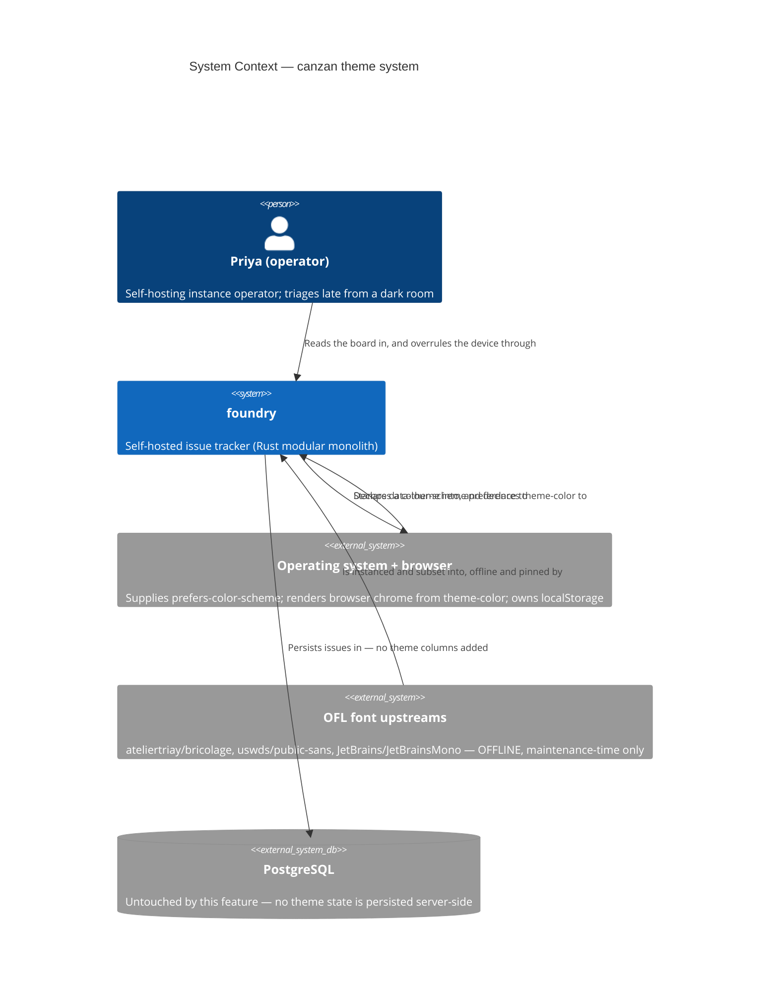
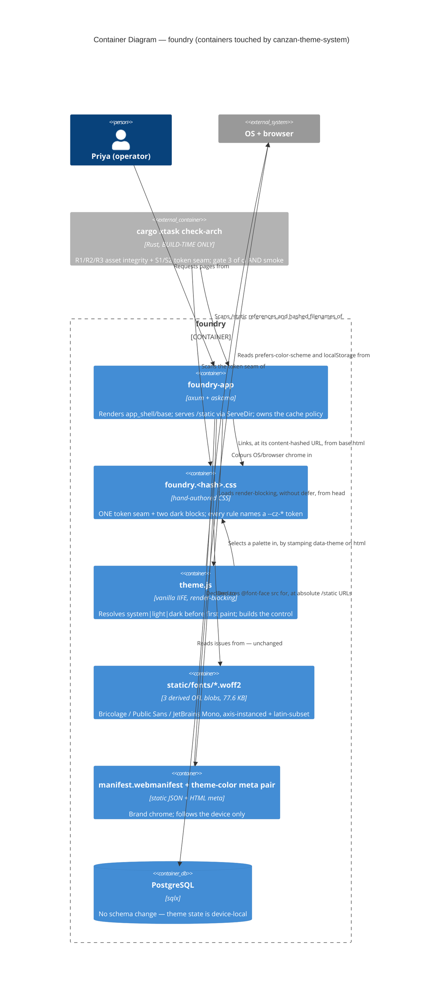
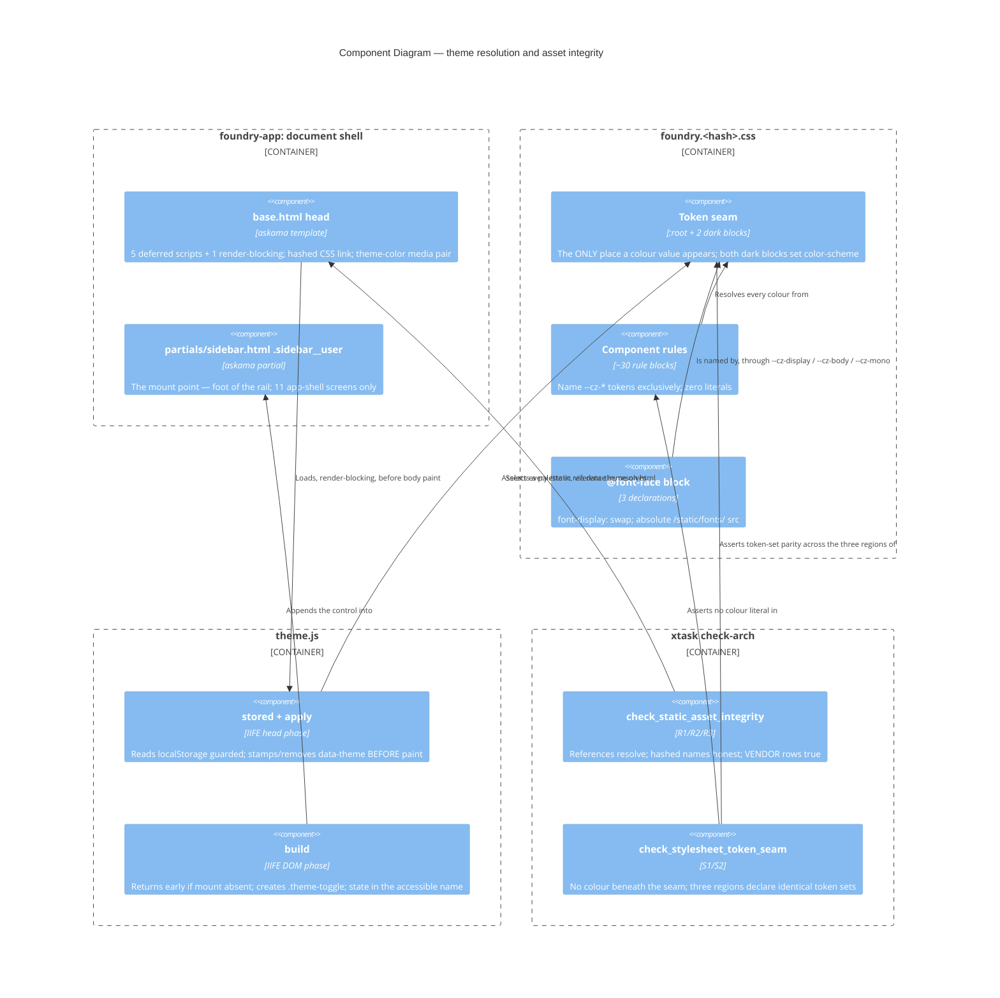

# Architecture Design — canzan-theme-system

Wave: DESIGN | Agent: nw-solution-architect (Morgan) | Mode: Propose (autonomous) | Date: 2026-08-29

## Context contract checklist

| Artifact | Status |
|---|---|
| `docs/feature/canzan-theme-system/feature-delta.md` (929 lines; D-01…D-14, US-CTS-01…04, System Constraints, KPIs 1–7, DoR) | ✓ read in full |
| `docs/feature/canzan-theme-system/intake.md` (token contract, typography, component specs, mechanism) | ✓ read |
| `docs/feature/canzan-theme-system/slices/slice-01..04` | ✓ read |
| `docs/feature/canzan-theme-system/canzan-net-reference.css` (pinned, minified) | ✓ grepped — display/mono weights, token block, shadow values |
| `docs/product/architecture/brief.md` | ✓ read — no section governs presentation; this wave adds one |
| `crates/foundry-app/static/VENDOR.md` | ✓ read — the integrity model this feature must extend |
| `crates/foundry-app/static/css/foundry.8ce38566.css` (637 lines) | ✓ read — literal audit, weight audit, dead rules |
| `crates/foundry-app/templates/base.html`, `partials/sidebar.html` | ✓ read |
| `crates/foundry-app/src/lib.rs:248-254, 300-373, 407-411` | ✓ read — `static_dir`, cache policy, `ServeDir` mount |
| `xtask/src/check_arch.rs` (1284 lines), `xtask/src/main.rs` | ✓ read — rule shape, `--root`, `ci`/`smoke` wiring |
| `docs/feature/htmx-web-tier/design/assets.md:79-132` | ✓ read — Decision #4a and the unbuilt asset-resolution probe |
| `docs/feature/web-tier-extraction/design/boundary-guard.md:47-118` | ✓ read — the three orthogonal layers |
| `crates/foundry-acceptance/.../feature_a_programmatic.rs:1456-1702` | ✓ read — injected-violation gold-test harness |
| `canzan-lift/src/ui/assets/theme.js` (137 lines) | ✓ read in full — the port source |
| Upstream OFL licence texts (3 families) | ✓ verified — see ADR-001 |

Development paradigm: **settled, not re-litigated.** 47 prior features shipped
through the OOP/imperative branch; this feature contains no Rust domain logic.
No `## Development Paradigm` section is written.

## 1. Quality drivers and constraint analysis

Priorities, taken from DISCUSS rather than re-asked, in order:
**accessibility** (NFR-WEBB-A11Y-02 is a hard gate) > **testability** (the render
contract *is* the acceptance suite's selector set) > **maintainability** (a
637-line hand-authored stylesheet with no build step) > **operational
simplicity** (single operator, self-hosted, air-gap-friendly). Explicitly *not*
drivers: scalability, fault tolerance, throughput. Team size: one.

### The bottleneck, quantified

This feature is a **re-authoring**, not a rename, and the numbers say so:

| Measure | Value | Evidence |
|---|---|---|
| Colour literals outside `:root` | **46** across 30 rules | literal audit of `foundry.8ce38566.css` |
| Rule blocks using **zero** tokens | 4 groups — rail `:438-518`, dashboard `:205-294`, modal backdrop, overlay `:524-565` | ibid. |
| Competing accent hues | **3** (`#2452c9`, `#5b5bd6`/`#3a3ad1`, `#4f46e5`) | `:18`, `:462,491,492`, `:271` |
| Dead rules with no markup | `.site-header`, `.site-header .brand` (`:56-69`) | 0 matches across 32 templates |
| Hand-maintained hash sites | **5** (file name, `base.html:6`, `VENDOR.md:17`, `lib.rs:329,346,365`) | ✓ |
| Automated guards over any of the above | **0** | `check_arch.rs:56-64` — eight rules, none touches `static/` |

So ~100 % of the visual work is blocked on one structural fact — colour is
scattered across 30 rules instead of bound once — and ~100 % of the *risk* is
concentrated in a different one: **five hand-maintained references, re-hashed
three times across four slices, watched by nothing.**

The design therefore optimises for two things and declines to optimise for
anything else:

1. **Collapse colour to one seam** so a palette becomes a re-binding of names
   (ADR-CANZAN-THEME-004).
2. **Put a watcher on every act of faith** this tier takes — the asset
   references, the content hashes, the provenance rows, the duplicated dark
   blocks (ADR-CANZAN-THEME-003, -004).

### Constraint-free opportunity

The largest *unforced* finding of this wave: the naive font path costs **~210 KB**
and **fails KPI 7's 150 KB guardrail by 40 %**, while offline axis-instancing
brings it to a measured **77,608 B** with the identity fully intact. That is a
63 % reduction available for zero runtime complexity and no build step — the
cheapest quality win in the feature (ADR-CANZAN-THEME-001).

## 2. C4

### 2.1 System Context (L1)



The dashed edge is the whole point of D3/`VENDOR.md:4`: the font upstreams are a
**maintenance-time** dependency resolved by a human running a pinned recipe, never
a runtime one. At runtime foundry makes **zero** cross-origin requests (KPI 7,
US-CTS-03 S2).

### 2.2 Container (L2)



**No new crate, no new dependency edge, no schema change.** The crate graph in
`brief.md:103-122` is untouched; dependency direction stays
`app → api → svc → store → core`. `check-arch` is drawn as a container because
it becomes load-bearing for this tier's correctness, and dashed because it runs
at build time only.

### 2.3 Component (L3) — the presentation surface inside `foundry-app`

Warranted: six components, four of them new, and the seams between them are
exactly what DELIVER must not blur.



## 3. Decisions

Four ADRs, all in `docs/product/architecture/`:

| ADR | Decision | Alternatives rejected |
|---|---|---|
| [**001**](../../../product/architecture/adr-canzan-theme-001-font-axis-instancing-and-subsetting.md) | Ship all three families, axis-instanced + latin-subset: **77,608 B** measured, vs 210 KB naive and a 150 KB guardrail | verbatim (fails KPI 7); drop Bricolage (fails KPI 6); two statics (37,436 B — *larger*); keep `wght` wide; keep `opsz` live; single mono weight |
| [**002**](../../../product/architecture/adr-canzan-theme-002-derived-asset-provenance-model.md) | A third `VENDOR.md` row shape for **derived** assets: recipe-as-provenance, executable at `tools/fonts/derive-fonts.sh`, with **integrity and provenance separated** into two claims of different strength | output-hash only; commit source TTFs (+850 KB, doesn't achieve offline audit); claim byte-reproducibility; reuse "authored-in-tree" (licensing misstatement); regenerate in CI (a build step) |
| [**003**](../../../product/architecture/adr-canzan-theme-003-asset-integrity-guard-in-check-arch.md) | The asset guard is a **`check-arch` rule deriving its own input set** — R1 references resolve, R2 hashed names honest, R3 VENDOR rows true | `#[test]` in foundry-app (unverifiable — can't be pointed at a planted tree); separate `check-assets` command (3× wiring); `build.rs`; acceptance-only; accept the risk |
| [**004**](../../../product/architecture/adr-canzan-theme-004-token-seam-and-dark-block-parity.md) | One colour seam, enforced — S1 no literal beneath it, S2 the three token regions declare **identical name sets** | manual grep (the mechanism that let 46 literals accumulate); stylelint (needs Node, DB6); acceptance sweep alone; merge the dark blocks (impossible in CSS) |

### 3.1 Two decisions taken here rather than in an ADR

**`theme.js` is unhashed under `/static/js/`, and therefore revalidates before
first paint.** `static_cache_control_value` (`lib.rs:300-310`) gives
`/static/js/*` `no-cache` — deliberately, because app JS at a non-hashed URL was
once pinned stale for a year (`lib.rs:317-325`). `theme.js` joins that group,
matching the four existing IIFEs. Consequence: because the tag is
render-blocking, every navigation costs **one conditional GET before paint**
(~2.6 KB, same-origin, typically a 304). This is a latency cost, **not a flash
risk** — the browser blocks rather than paints, so KPI 2 ("0 light frames per
navigation") is unaffected. The alternative — content-hash `theme.js` and widen
the policy function to give hashed JS `immutable` — was rejected for this feature
because it adds a sixth hand-maintained hash site and Rust changes to a feature
that claims essentially none, for a saving measured in single-digit milliseconds
on a LAN. Recorded as a follow-up worth revisiting if foundry is ever served over
a high-latency link.

**The stylesheet's `@font-face src` uses absolute `/static/fonts/…` URLs, not
relative ones.** Required by ADR-003 R1: one uniform matcher then covers every
`/static` reference site in the repo and the guard needs no relative-path
resolution logic.

## 4. Earned Trust — what this tier assumes, and what proves it

Every dependency below can lie. Each row names the probe; a row without one is an
act of faith made on the operator's behalf.

| Dependency | How it lies | Probe | Owner |
|---|---|---|---|
| `localStorage` | Throws on first touch (site data blocked) | Every access try/catch-guarded; **US-CTS-04 S5** drives a real storage-blocked profile and asserts the mode still applies | DISCUSS D-06 ✓ |
| Scripting | Absent entirely | Control is **built in JS**, so it is absent rather than dead; **US-CTS-04 S4** drives `new_session_without_scripting` | DISCUSS ✓ |
| Font network | Blob never arrives | `font-display: swap` + system fallback stack; **US-CTS-03 S5** asserts no invisible text, **S6** asserts no reflow | DISCUSS D-14 ✓ |
| **Filesystem / `ServeDir`** | A referenced `/static/…` path does not exist | **R1** + gold test that renames a blob and asserts the guard reddens | **NEW — ADR-003** |
| **The content hash** | Filename says `8ce38566` while the bytes hash to something else — stale-cached for a year at an immutable URL | **R2**, recomputed from the bytes; gold test appends a byte without renaming | **NEW — ADR-003** |
| **`VENDOR.md` rows** | A recorded sha256 no longer recomputes | **R3** | **NEW — ADR-003** |
| **The duplicated dark block** | Declares a token set that has silently diverged; breaks only for system-dark users | **S2** token-set parity across all three regions | **NEW — ADR-004** |
| **The subsetting toolchain** | Is assumed byte-reproducible and is not | **Re-run `derive-fonts.sh` on a second machine at DELIVER and record what happened** — a three-step audit with a documented fallback, not an assumption | **NEW — ADR-002** |
| Browser `prefers-color-scheme` | — | Nothing to probe; the browser is the authority | n/a |

**Self-application (Principle 12c).** The guards are themselves probed: **each of
the five rules — R1, R2, R3, S1, S2 — gets its own** injected-violation gold test
that stages a temp tree, plants the defect, calls the **rule function directly**,
and asserts it fires **and names the offender** — with a paired assertion that it
stays silent on a clean tree. Five rules, five tests. A guard with no gold test is
a claim.

R3's test (plant a `VENDOR.md` row carrying a wrong sha256; assert it fires and
names the row) was **missing from an earlier draft** — a real defect, since R3 is
the rule that machine-checks ADR-002's provenance model. It is called out here
because omitting it would have shipped the font strategy's load-bearing integrity
claim as an unverified assertion.

**They are `xtask` unit tests, not acceptance scenarios** — the `#[cfg(test)]`
module beside `check_arch.rs`, which already unit-tests the AST detectors against
staged fixture trees (`xtask/Cargo.toml:19-21` carries `tempfile` for exactly
this). `check-arch` has no driving port; it is a pure function of a directory, so
a cucumber scenario was the wrong shape. This also puts them in the fast unit lane
rather than behind Postgres and chromedriver.

**This is a correction, recorded rather than silently applied.** This section
originally specified new acceptance files. DISTILL Decision 4 ruled infrastructure
outside acceptance scope — correctly — which left five new rules with no
verification owner at all. The placement was corrected to `xtask` unit tests, and
the tests are now a **DELIVER obligation carried by ADR-003 (§9), not by
DISTILL**, landing in the same commit as the rules they verify.

## 5. Slice → architecture map

| Slice | Story | Architectural content | Gates it must clear |
|---|---|---|---|
| **S01** | US-CTS-01 | Introduces the token seam and both dark blocks; retires 8 foundry tokens; deletes `.site-header`; brand-chrome media pair | S1, S2 first go green here; R1+R2 on re-hash #1 |
| **S02** | US-CTS-02 | Retires the remaining literals (dashboard, modal, overlay, `.actions`); `--cz-shadow` bound and re-bound | S1 must be **fully** green at the end of S02 — this is the slice that earns it; re-hash #2 |
| **S03** | US-CTS-03 | **FIRST task: re-measure Bricolage at `opsz=24`** (see below). Then three type tokens; `@font-face` block; three derived blobs + 3 OFL files; four `VENDOR.md` rows incl. the new derived shape; `tools/fonts/` | R1 (font paths), R3 (new rows), byte budget ≤150 KB; re-hash #3 |
| **S04** | US-CTS-04 | `theme.js` port (exactly two differing lines); render-blocking head tag; `.theme-toggle*`; authored-in-tree VENDOR row | R1 (`/static/js/theme.js`), R3; KPI 2 |
| **Guard** | — | The `check-arch` rules and their 4 `xtask` unit gold tests | Land with **S01**, so every later re-hash is protected. See §4, §8 |

One hard dependency edge, as DISCUSS found: S02 and S04 consume S01's token
block and dark blocks. S03 is independent.

### 5.1 The estimate moved, and DESIGN says so

DISCUSS scoped this feature at **3.5 days** across four slices. That estimate was
taken before the guard was decided, and it does not cover it. Honest revision:

| Work | Estimate |
|---|---|
| S01–S04 as DISCUSS scoped them | 3.5 d |
| `check_static_asset_integrity` (R1/R2/R3) + `check_stylesheet_token_seam` (S1/S2) | 0.5–0.75 d |
| **5** injected-violation gold tests (one per rule) as `xtask` unit tests beside `check_arch.rs`, reusing the existing `tempfile` fixture-tree idiom | 0.25 d |
| `tools/fonts/derive-fonts.sh` + the reproducibility probe — **net new only**; the three derivations and the `VENDOR.md` rows were already inside S03's 1 day | 0.25 d |
| **Revised total** | **≈4.25–4.75 d** |

Peer review produced an independent bottom-up estimate of **≈3.7 d**, costing the
guard work at 4–9 hours. That is the optimistic bound and it is not unreasonable
for someone fluent in the eight rules already in `check_arch.rs`. Moving the gold
tests out of the cucumber suite and into `xtask` unit tests (§4) narrows the gap:
they no longer need a staged tree *and* a subprocess assertion *and* ~40 lines of
duplicated harness. **Plan for 4.25 days, treat 3.7 as the floor and 4.5 as the
ceiling.**

An earlier draft of this section said 5.25 d. That double-counted the font
derivation and the `VENDOR.md` rows, which DISCUSS had already priced inside
S03's 1 day; only the script and the reproducibility probe are genuinely new. The
correction is recorded rather than silently applied.

Either way it is a **~20–35 % increase** and it should be seen rather than
absorbed. The scope-assessment table in feature-delta scored "estimated effort >2
weeks" as not fired; it still is not, and no other signal fires, so the feature
does not split.

If the schedule cannot take it, the correct trade is to **defer a whole rule,
never to separate a rule from its gold test**: land R1+R2 (with their gold tests)
alongside S01, where they immediately protect three re-hashes, and let S1+S2 (with
theirs) land with S02, which is the slice that actually earns a literal-free file.
A rule shipped without its gold test is a claim rather than a check, and would
contradict ADR-003's own reasoning — so that split is not available.

## 6. Quality attributes (ISO 25010, the four that apply)

- **Usability / accessibility** — the driver. Both palettes measured against
  NFR-WEBB-A11Y-02 in both light and dark; `--cz-faint` rebound to a passing
  value while preserving canzan.net's three-tier structure (D-04); ratios
  recorded inline beside the tokens; selection ring stays an `outline` so it
  survives forced-colours and reads without colour vision; `.theme-toggle` joins
  the ≥44 px mobile rule and meets ≥24×24 at desktop; the control's accessible
  name carries active **and** next state.
- **Maintainability** — the seam is the whole design. Colour has one home, and
  S1/S2 keep it there. Type has three tokens instead of three ad-hoc stacks.
- **Testability** — zero selector churn (D-11): `.theme-toggle*` are the only
  additions, and **no existing scenario or assertion under
  `crates/foundry-acceptance/` is changed**. The step-module registration lines
  (`pub mod` in `src/lib.rs`, the force-link in `tests/acceptance.rs`) are
  explicitly excepted: registering a step module structurally requires them, and
  an unregistered module never compiles into the test binary — which is the
  green-over-nothing this repo refuses. This feature's diff to existing
  acceptance files is **3 registration lines**. The guard's gold tests add none
  of them, since they are `xtask` unit tests (§4).
- **Performance efficiency** — added cold-load payload **≈80 KB** (77.6 KB fonts
  + ~2.6 KB `theme.js`) against a 150 KB guardrail; zero cross-origin requests;
  one blocking conditional GET for `theme.js`, documented in §3.1.

Not addressed, deliberately: scalability, fault tolerance, availability. This
feature adds no server behaviour, no state and no failure mode that a restart
does not clear.

## 7. External integrations and contract testing

**No new runtime external integration.** This feature's defining network property
is the *absence* of one: US-CTS-03 S2 asserts every font request is same-origin
and none reaches `fonts.gstatic.com`.

The only external dependency is **offline and maintenance-time**: three GitHub
upstreams, pinned to immutable refs (two tags, one commit sha — Bricolage has no
releases). Consumer-driven contract testing (Pact et al.) does not apply — there
is no provider API and no wire contract. The equivalent obligation, and the one
platform-architect should carry into DEVOPS, is **ADR-002's Tier-2 provenance
audit**: pinned input sha256, pinned tool versions, an intermediate hash that is
compressor-independent, and a documented fallback when woff2 bytes differ.

## 8. Architecture enforcement

```
Style: modular monolith, ports-and-adapters (unchanged — no crate, no edge, no schema)
Language: Rust (guard) over CSS/HTML/Rust (subject)
Tool: cargo xtask check-arch — the house AST/source-walk scanner. No Node (DB6).
Wiring: xtask/src/main.rs — run_ci gate 3 (:191-195) AND run_smoke (:270-308),
        so both rules bite on the fast pre-commit loop, not only in CI.

Rules to enforce (5 new, joining the 8 existing at check_arch.rs:56-64):
  R1  every /static/... reference in crates/foundry-app resolves on disk
  R2  every <stem>.<8hex>.<ext> filename equals its own sha256 prefix
  R3  every VENDOR.md row's recorded sha256 recomputes
  S1  no colour literal outside :root and the two dark blocks
  S2  the three token regions declare an identical set of --* names

Scope exclusions, each evidence-forced (ADR-003):
  - crates/foundry-acceptance/ is NOT scanned: it holds deliberate non-resolving
    fixtures (feature_b_web_tier.rs:486, :495)
  - #[cfg(test)] is NOT region-skipped: the three protected hash literals live
    inside it (lib.rs:312-373)
  - an extracted path needs a file extension: projects.rs:1048 holds a
    deliberate hash-agnostic prefix

Gold tests (Principle 12c): 5 injected-violation UNIT tests — ONE PER RULE, no
exceptions — in xtask's #[cfg(test)] module beside check_arch.rs, staging a temp
tree via the existing tempfile dev-dependency and calling each rule function
DIRECTLY: asserting it returns a violation naming the offending file:line, and
stays silent on a clean tree.
  R1  rename the hashed CSS        -> names base.html + the dangling path
  R2  append a byte, do not rename -> names the file
  R3  wrong sha256 in a VENDOR row -> names the row
  S1  colour literal below the seam-> names file:line
  S2  token missing from one region-> names the token + the region
NOT acceptance scenarios: check-arch has no driving port, and DISTILL Decision 4
places infrastructure outside acceptance scope. DELIVER obligation.

Acceptance-suite impact: no existing SCENARIO OR ASSERTION is changed. Step-module
registration lines (pub mod in src/lib.rs, force-link in tests/acceptance.rs) are
excepted — they are structurally required for a step module to compile into the
test binary. This feature's diff to existing acceptance files is 3 such lines.
```

## 9. Handoff

**To acceptance-designer (DISTILL).** The render contract is frozen; the only new
selectors are `.theme-toggle`, `.theme-toggle__glyph`, `.theme-toggle__mode`. The
22 UAT scenarios in feature-delta are the acceptance surface. The guard rules are
**not** in acceptance scope — their gold tests are `xtask` unit tests (§4, §8),
per DISTILL Decision 4. No existing scenario or assertion is changed; only
step-module registration lines are touched. Test lanes: HTTP for
head/asset/markup facts; `@needs-browser` fantoccini for palette, computed style,
toggle interaction and the scripting-disabled path.

**To software-crafter (DELIVER).** Four slices in order S01→S02→S03→S04, with the
guard rules landing alongside S01. This document specifies boundaries and
contracts, not implementation: the CSS rule bodies, the Rust matcher internals
and the shell script's structure are yours. Four obligations this design cannot
discharge and DELIVER must:

0. **Write the five gold tests — one per rule: R1, R2, R3, S1, S2** — as `xtask`
   unit tests, in the same commit as the rules they verify (ADR-003, ADR-004).
   **R3's is the one most easily forgotten and the least safe to forget**: it
   machine-checks ADR-002's provenance model, so without it the font strategy's
   load-bearing integrity claim ships unverified. This obligation moved to DELIVER
   when DISTILL correctly ruled infrastructure out of acceptance scope, and it
   must not fall through the gap: `brief.md` now asserts these guards "are shown
   to bite rather than assumed to". A rule without its gold test is a claim.

1. **Re-measure the Bricolage blob at `opsz=24` — the FIRST task of S03, before
   any stylesheet work.** The only figure in hand is 29,764 B at `opsz=14`;
   `opsz=24` is **extrapolated, not measured**, and while the optical-sizing
   reasoning is sound, variable-font architecture permits size-specific glyphs and
   hinting. Sequencing it first makes a miss cheap. Ceiling 32,768 B; if exceeded,
   descend ADR-001's **pre-authorised ladder** — `opsz=20`, then `opsz=14` (a
   measured, known-good 29,764 B) — and record the rung taken. Do **not** stop and
   escalate for a few hundred bytes; only rung 3 (both fallbacks over ceiling) is
   worth halting for, because that would mean the byte-neutrality assumption is
   false rather than tight. **Record the actual measured figure in `VENDOR.md`
   beside the row** either way, so the next person knows whether the assumption
   held.
2. **Re-take the input sha256 against the pinned upstream refs** — the
   measurements fetched from `google/fonts@main`, a moving ref (ADR-002) — and
   confirm the `fonts/variable/…` paths resolve in the authoritative repos.
3. **Re-run `derive-fonts.sh` in a second, materially different environment and
   record whether it reproduced byte-for-byte** (ADR-002). A container
   (`python:3.14-slim`) is sufficient and expected — the variable under test is
   the compiled brotli, not the host. Do not assume; measure and write down what
   happened. A varying step 3 is a compressor difference and is merely recorded;
   a varying **step 2** invalidates the stable-anchor model and is worth stopping
   for.

**Mutation testing.** DISCUSS is right that the scope is near-empty for the
stylesheet work. It is *not* empty for the guard: `check_static_asset_integrity`
and `check_stylesheet_token_seam` are new Rust with real branching, and they fall
inside the repo's ≥80 % per-feature gate. DELIVER should report the guard's kill
rate honestly rather than recording the feature as unmutatable.
