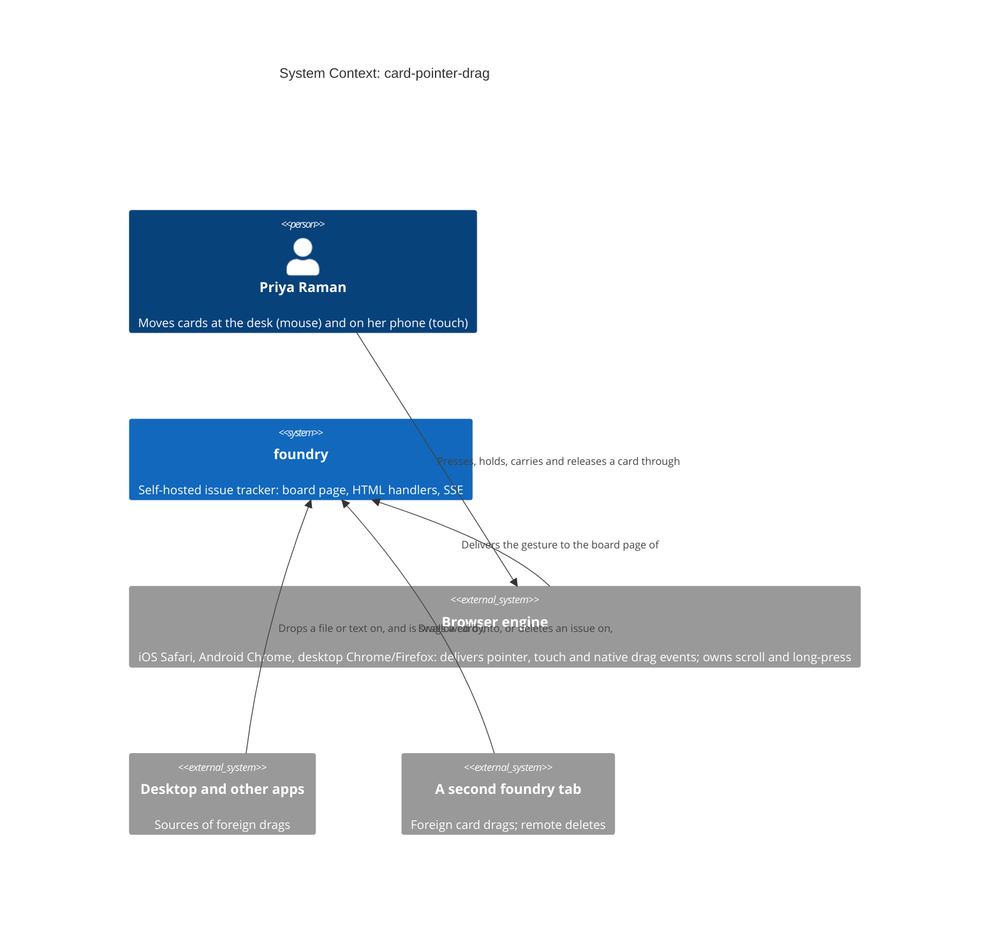
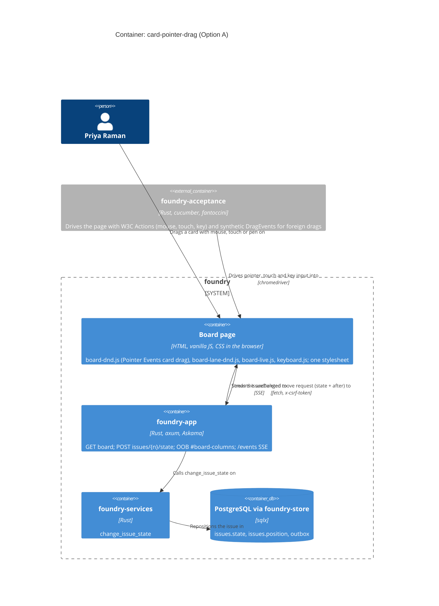
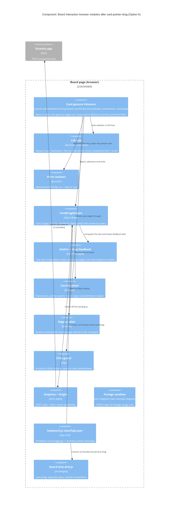
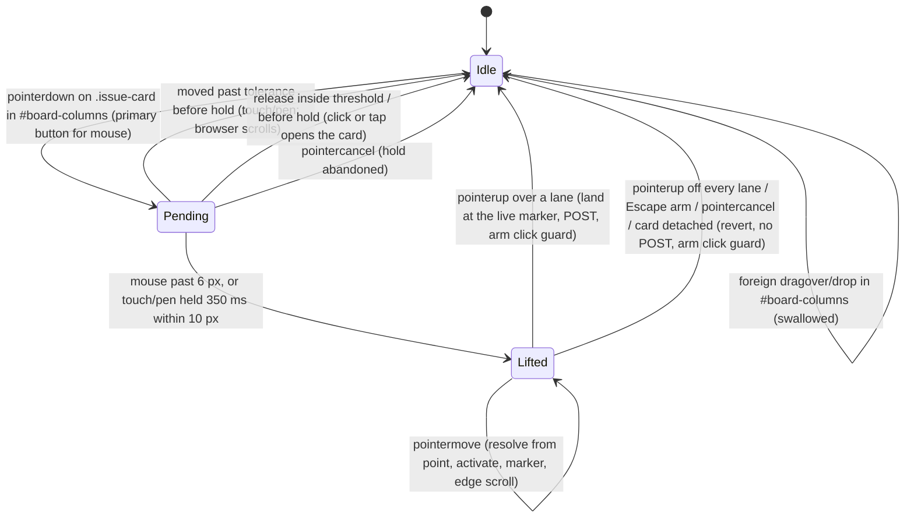

<!-- markdownlint-disable MD024 -->
# Feature Delta — card-pointer-drag

Move the board's card drag onto **Pointer Events** so a card can be dragged by
touch and pen as well as by mouse. On a phone, press and hold a card to lift it.
A quick swipe still scrolls the board and a tap still opens the card. With a
mouse the lift stays immediate once the pointer passes a movement threshold,
so a click still opens the card. Everything `card-drag-drop-feedback` shipped
stays as it is. Native HTML5 drag-and-drop stays on the board for one job only:
swallowing foreign drags.

Feature type: **cross-cutting**. It touches the browser module `board-dnd.js`,
the stylesheet, the card template (`partials/issue_card.html` and its second
copy at `issues.rs:731`), one new arm in `keyboard.js::closeTopLayer()`, and
the acceptance test **driver**. The server protocol does not change.
Predecessors: `board-lane-reorder`, whose ADR-BOARD-LANE-007 names this feature
as its first deferred successor, and `card-drag-drop-feedback`, which set the
behaviour contract this feature must keep.

## Wave: DISCUSS

### [REF] Prior Wave Consultation

| Source | Read | What it settled |
|---|---|---|
| `docs/product/jobs.yaml` `job-board-card-move` | ✓ | The job exists and is validated. Its `habit` force ("feedback must add to that gesture, not change it: same drop semantics, same request, same revert") becomes this feature's parity constraint. The job is **widened** to touch, not replaced (back-propagated below). |
| `docs/product/journeys/journey-card-drag-drop.yaml` | ✓ | Five mouse steps and five error paths. This wave adds a `touch` variant. Two mouse-step phrases now describe the retired mechanism and are corrected by a changelog note, not rewritten. |
| `docs/product/personas/persona-instance-operator.yaml` | ✓ | Priya Raman is reused. The file records "mouse and keyboard" only; **no prior wave records her using a phone**. The phone context is from the user's intake and from `fix-lane-menu-clipped-mobile` / board-lane-reorder KPI 5 (390px). It is a stated use, not a persona characteristic. The persona file is not edited. |
| `docs/product/architecture/brief.md` §"The board card drag session" | ✓ | Invariants 1-8, the state diagram and the ubiquitous language are all written in `dragstart`/`dragover` terms. "Board Interaction deliberately holds two drag models, one per gesture family." DESIGN must restate them (Contradiction C5). |
| `adr-board-lane-007-pointer-events-lane-drag.md` | ✓ | "Why not converge now": a rewrite with its own regression surface (ranking semantics, `after` protocol, exact-origin revert), kept off another feature's critical path. That reason no longer applies: this feature **is** the rewrite, with nothing else on its path. The "boundary that must hold" loses its first leg (different event families) once both drags are Pointer Events (D13). |
| `adr-board-card-001` / `adr-board-card-002` (via `brief.md` + `board-dnd.js` header) | ✓ | Delegation on `document`, identity-only origin, event-time lane resolution, a single absolutely positioned `[data-card-drop-marker][data-before-key]`, landing at the live marker, `data-card-drop-target`, teardown by DOM query on every exit. All kept (D10). |
| `docs/product/kpi-contracts.yaml` `card-drag-drop-feedback` | ✓ | CDF-KPI-1..8 are hard gates on every ci-github run. CDF-KPI-8's instrument, "`git diff aa8a6f6` on those files empty", covers **step modules** as well as feature files. This feature has to change two step modules (Contradiction C4). |
| `docs/product/outcomes/registry.yaml` OUT-13/14/15 | ✓ | OUT-13's input shape reads "Native HTML5 drag events … dragstart on article.issue-card". DISTILL must amend OUT-13 and OUT-14 to pointer input. OUT-15 (placeholder via `:has()`) is mechanism-free and unaffected. |
| `docs/evolution/2026-09-14-card-drag-drop-feedback.md` | ✓ | 35 declarations / 54 examples, all `@needs-browser` `@cdf`, driven by synthetic `DragEvent`s. Lesson 3: automation real-mouse drags are unreliable, so the feel check belongs to the user. Successor "a touch or keyboard card move (D14)" is this feature, touch half only. |
| `docs/evolution/2026-09-04-board-lane-reorder.md` | ✓ | Lesson 3: the synthetic `click` that follows a drag's `pointerup` fired a stray move. The same trap here would open the card's edit dialog after every drag (D6, AC-1.5). There are 2 `@mobile` touch scenarios at 390px as precedent. |
| `docs/feature/board-lane-reorder/feature-delta.md`, `docs/feature/card-drag-drop-feedback/feature-delta.md` | ✓ | Format precedent; D-table style; the Homelab Ops (OPS) and Identity Platform (AUTH) fixtures. |
| `static/js/board-dnd.js`, `static/js/board-lane-dnd.js`, `static/js/keyboard.js:267-305` | ✓ | The lane module is the precedent: `THRESHOLD = 6`, `EDGE_ZONE = 48`, `EDGE_STEP = 14`, `pointercancel` revert, Escape as arm 3 via `[data-lane-dragging]` + `foundry:cancel-lane-drag`, primary-button filter for mouse. |
| `templates/partials/issue_card.html`, `board_columns.html` | ✓ | **What a click or tap does today:** the card `<article>` carries `hx-get="{{ card.edit_url }}" hx-target="#modal-root"`, so a click (a tap too) opens the issue's **edit dialog**. It also carries `draggable="true"` (OQ-4). The header `<h3 data-lane-drag>` is a sibling of the cards, not their ancestor. |
| `static/css/foundry.f7c36a08.css` | ✓ | `.board { overflow-x: auto }` **only below 480px**. `.column` has no height limit and no `overflow-y`, so **a lane never scrolls on its own; a long lane lengthens the page**. "Vertical lane scroll" therefore means page scroll (D14, OQ-6). `[data-lane-drag]` has `touch-action: pan-y; user-select: none`. |
| `crates/foundry-acceptance/src/support/browser_harness.rs:1089-1400`, `steps/feature_card_drag_drop_feedback.rs`, `feature_board_lane_reorder.rs:1137`, `keyboard_shortcut_bindings.rs:3043` | ✓ | One synthetic-drag kit (`drag_start` / `drag_over` / `drag_drop` / `drag_end` / `drag_start_foreign`, `DragSpot`). Two older inline `DragEvent` scripts it never absorbed. Escape is driven as `dragend`, because a page receives no key events during a native drag. |
| `tests/features/*.feature` (every `drag` mention) | ✓ | Browser-driven card drags exist in exactly three files: `card-drag-drop-feedback.feature`, `board-lane-reorder.feature` (card-vs-lane guard) and `keyboard-shortcut-bindings.feature:328`. `issue-status-move`, `card-ranking-within-status`, `board-lane-management:114` and `board-lane-overflow-menu:135` are HTTP-lane POSTs and are unaffected, **except** `issue-status-move.feature:49`, whose oracle asserts `draggable="true"` (OQ-4). `form-error-display-contract.feature:98` is `@pending`. |
| `.nwave/des-config.json`, `~/.nwave/global-config.json` | ✓ | Density **lean**, expansion **ask-intelligent**. |
| `docs/feature/card-pointer-drag/discover/`, `diverge/` | ⊘ | No DISCOVER or DIVERGE wave ran. Requirements came in clear at intake, and ADR-007 is the evidence base. |
| `docs/product/vision.md`, `docs/project-brief.md`, `docs/stakeholders.yaml` | ⊘ | Not present in this repo. |

Nine prior-SSOT statements are contradicted or superseded by this feature.
Each is listed under *Contradictions with prior SSOT*, and none blocks DISCUSS.

### [REF] Persona

**Priya Raman** (`persona-instance-operator`). At her desk she drags cards
daily with the mouse. Since `card-drag-drop-feedback` that drag is trustworthy:
the lane lights, a line shows the slot, and drops survive in-place refreshes.
Away from the desk she opens the Identity Platform board on her phone at 390px.
There she can drag a **lane** header with her thumb (board-lane-reorder) but
not a **card**. Her only touch path is to open AUTH-41, change Status and Save,
which cannot choose a slot and always lands the card at the top. She reads the
difference as a bug (ADR-007 *Consequences* predicted exactly this). **Marco**
is not needed, because no authz surface changes.

### [REF] JTBD

**job_id: `job-board-card-move`**, **widened** to touch and pen. It is not a new
job: the outcome (a card in the lane and slot she means, seen before release,
trusted after) is identical. Only the device changes. `jobs.yaml` gains a wider
`job_story`, a touch clause in `dimensions.functional`, `forces.touch_delta`,
`opportunity.touch_note`, a second `validated_by` and a `scope_history`.

One-liner: *When a card is in the wrong lane or slot and I only have my phone,
I want to press, hold and carry it to exactly the gap I mean, and see the lane
and slot before I let go, without losing swipe-to-scroll or tap-to-open, so the
board is right now rather than when I am back at a desk.*

| Force (delta; the shipped forces still hold) | |
|---|---|
| **Push** | No card gesture exists on touch. The header right above the card drags, so the board looks half-broken. The Status-field workaround cannot choose a slot. |
| **Pull** | Press, hold, feel it lift, carry, release: every mobile board app works this way. It shows the same lit lane and marker as the desktop. |
| **Anxiety** | A swipe grabs a card. A tap starts a drag. A drag opens the card's dialog. A system gesture mid-drag strands a half-moved card. The desktop drag, which works, gets worse. |
| **Habit** | Mouse: immediate lift, Escape cancels. Touch: swipe scrolls, tap opens. The new gesture must take nothing away from either. |

All three stories trace N:1 to `job-board-card-move`.

### [REF] Locked Decisions

| ID | Decision | Rationale / source |
|---|---|---|
| D1 | **Cross-cutting, brownfield, protocol unchanged.** Browser module, CSS, card template(s), one `closeTopLayer()` arm, and the acceptance driver. No handler, service, store or migration change. The POST stays `POST /team/{t}/project/{p}/issues/{n}/state` with `state` and `after` (omitted at the top) and the `x-csrf-token` header, byte-identical. | User decision (intake); `brief.md` invariant 8. |
| D2 | **Full convergence: cards drag on Pointer Events for mouse, touch and pen.** One card-drag mechanism serves every pointer. There is no second touch-only path beside a surviving HTML5 mouse path. | User decision (intake). ADR-007's "why not converge now" reasons were about sequencing inside another feature, and none of them applies here. |
| D3 | **HTML5 drag-and-drop remains ONLY to swallow foreign drags inside `#board-columns`,** exactly as `card-drag-drop-feedback` shipped (`brief.md` invariant 7, CDF D4, OUT-13's foreign clause). A file, a text selection, or a native drag from another tab is claimed and swallowed: no activation, no marker, no request, no navigation, on a fresh load and after a replace. A native `dragstart` on this page no longer opens a card session. | User decision (intake). |
| D4 | **The Gherkin stays byte-identical; the test DRIVER is re-pointed.** Every shipped scenario that drags a card now drives **pointer** input. Every scenario that drags something foreign stays on synthetic `DragEvent`. The classification is in *Test-driver re-pointing* below. `git diff` on every shipped `.feature` file is empty at every slice gate, and that empty diff is the behavioural proof of parity. Step and harness **code** may change only to re-point input. No oracle may be weakened or removed. | User decision (intake); ADR-007 "pass unmodified, not adapted". Contradiction C4 records how this meets CDF-KPI-8. |
| D5 | **Touch and pen lift by PRESS-AND-HOLD.** On `pointerType` `touch` or `pen`, a card lifts only after the pointer stays down on it for the hold duration (~300-400 ms; the exact value is a DESIGN/measurement question, OQ-1) without moving past a small hold tolerance. Movement past the tolerance before the hold completes is a **scroll**: the browser keeps the gesture and no card lifts. Release before the hold completes without moving is a **tap**: the card's edit dialog opens, as today. | User decision (intake). |
| D6 | **Mouse lifts immediately past a movement threshold, and a click still opens the card.** A primary-button press that moves past the threshold (the lane precedent is 6 px; DESIGN may change it on evidence) lifts the card. A press released inside the threshold is a click and opens the edit dialog. **A drag never opens the edit dialog**: the synthetic `click` after a drag's `pointerup` is suppressed. Non-primary mouse buttons never start a drag. | User decision (intake); board-lane-reorder evolution lesson 3 (stray post-`pointerup` click); `board-lane-dnd.js:205`. |
| D7 | **Lightweight UX depth.** `journey-card-drag-drop.yaml` gains a `touch` variant with a happy path, scroll-vs-drag, tap-vs-drag, and cancel/`pointercancel` error paths. There is no separate journey file. | User decision (intake). |
| D8 | **No walking skeleton.** Protocol, POST, revert, feedback and placeholders are all shipped. Every slice is thin and end-to-end on shipped substrate. | User decision (intake). |
| D9 | **JTBD on:** trace to `job-board-card-move` (widened); persona `persona-instance-operator`. | User decision (intake). |
| D10 | **Everything `card-drag-drop-feedback` shipped is preserved, as behaviour, under the new input.** Lane activation `data-card-drop-target` on exactly the lane under the pointer. The single absolutely positioned `[data-card-drop-marker]` with `data-before-key`. Landing at the live marker (marker = landing = `after`, one computation). The empty-lane placeholder shown by `:has()` with zero writers. Replace-proof by construction: listeners delegated on `document`, lanes resolved from the live document at event time, origin held as identity only. Exact-origin revert on non-2xx or network error. Teardown by DOM query on every exit. | User must-preserve list; ADR-BOARD-CARD-001/002/003; `brief.md` invariants 2-6, 8. |
| D11 | **Escape cancels a card drag through a NEW ARM of `keyboard.js::closeTopLayer()`,** never a `keydown` listener in the drag module (BR-4). HTML5 DnD gave Escape for free (CDF D5). Pointer Events do not. The arm finds the in-flight card drag by a DOM marker, as arm 3 does for lanes, and sits beside the lane-drag arm, above the lane menu. The two drag arms are mutually exclusive in practice (one pointer, one session), and DESIGN fixes their order deterministically. A cancelled drag returns the card to its exact origin slot, POSTs nothing, and leaves no lit lane, no marker and no carried card. | User must-preserve list; `keyboard.js:276-289`; ADR-BOARD-LANE-005/007. |
| D12 | **`pointercancel` reverts exactly as Escape does.** A system gesture, an incoming call, a notification shade, or the browser claiming the gesture for a scroll after the lift, all take the pointer. The card goes back to its exact origin with no request and no residue. This is a real exit path that HTML5 DnD hid (ADR-007 *Consequences*). | User must-preserve list; `board-lane-dnd.js:301-309`. |
| D13 | **The origin-based boundary with the lane drag holds, on two legs instead of three.** A gesture that starts on `.issue-card` is a card move. One that starts on `[data-lane-drag]` is a lane move. Neither becomes the other. ADR-007's first leg, *different event families*, **disappears**, because both modules now listen for `pointerdown` on `document`. The boundary now rests on leg 2 (each module ignores a `pointerdown` whose origin is not its own element, and neither element contains the other) and leg 3 (thresholds). The shipped `board-lane-reorder.feature` card-vs-lane guard stays unmodified as the standing proof, and a new scenario asserts the boundary from the card side. **DESIGN owes an ADR superseding ADR-007's "permanent divergence" and restating the boundary.** | User must-preserve list; ADR-007 §"How the boundary actually holds". |
| D14 | **Edge auto-scroll while carrying a card.** Horizontal: the board (`#board-columns`, `overflow-x: auto` below 480px) scrolls under a card held near its left or right edge, so a lane off-screen on a 390px phone is reachable. Vertical: lanes do not scroll internally (measured: `.column` has no `overflow-y`), so a long lane extends the page. A card held near the top or bottom viewport edge scrolls the **page**. Without it, a finger that is already carrying a card cannot reach an off-screen slot in a long lane. DISCUSS recommends vertical page auto-scroll **in scope** (slice 03). DESIGN confirms or returns it to the user (OQ-6). Auto-scroll changes what is visible, never what the marker addresses. | User must-preserve list ("consider vertical lane scroll"); `foundry.css:346-376, 1137`. |
| D15 | **The lifted card is visibly carried under the pointer.** HTML5 DnD drew a browser drag image for free, and Pointer Events draw nothing. From the lift until any exit, a visible representation of the card follows the pointer, the origin slot stays legible, and neither blocks lane or slot resolution under the pointer. On touch the lift is announced visibly the moment it happens. Ghost or real node, offset from the finger, and whether haptics are used are all DESIGN's call (OQ-7, OQ-10). | Consequence of D2; journey step `t2`. |
| D16 | **One pointer, one session.** Only the pointer that lifted a card drives it. Other pointers are ignored during a drag, whether a second finger or a mouse while touching. At most one card session exists (`brief.md` invariant 2). A second pointer the browser turns into a pinch arrives as `pointercancel` and follows D12. | `brief.md` invariant 2; `board-lane-dnd.js` `pointerId` filter. |
| D17 | **No keyboard card move and no live-region announcement.** The edit dialog's Status field remains the non-pointer path (`issue-status-move` D3, CDF D14). This feature closes the touch half of CDF's successor only. | CDF D14; scope discipline. |
| D18 | **CSS: tokens only, re-hashed per slice.** Every CSS change renames `foundry.<hash>.css` across `base.html`, the `lib.rs` tests and `static/VENDOR.md` in the same change. No colour literal outside the three token regions (check-arch S1). | CDF D13; precedent `1d91ad8`. |
| D19 | **Synthetic input proves wiring; a real device proves feel.** The WebDriver lane can prove "no lift, no request" for a touch pointer that moves before the hold completes. It **cannot** prove that the browser really scrolled, that iOS showed no callout, or that the hold feels right. Every touch slice names a **manual dogfood on a real iOS Safari and a real Android Chrome device** and records it in its delivery notes. The desktop feel check stays with the user (CDF evolution lesson 3). | CDF D12 generalised; memory: automation real-pointer drags are unreliable. |
| D20 | **No drag library, no new dependency.** A hand-authored module against a platform API. | ADR-007 alternatives; `VENDOR.md` + check-arch R1-R3 posture. |

### [REF] Journey (lightweight)

SSOT: `docs/product/journeys/journey-card-drag-drop.yaml`. The mouse steps 1-5
are unchanged in meaning. The **`touch` variant** (`t1`-`t4`) is new.

Arc: **Problem Relief.** Resigned (the phone cannot move a card) → deliberate
(hold) → in control (lifted, carried) → oriented (lit lane, marker, same as
desktop) → confident (landed; swipe and tap still work).

```text
+-- AUTH (390px) ------------+      +-- AUTH (390px) ------------+
| BACKLOG        IN-PROGRE> |      | IN-PROGRESS#   DONE        |
| +----------+   +--------  |      | # AUTH-3   #   AUTH-7      |
| | AUTH-41 *|   | AUTH-3   |  ->  | #========  # <- marker     |
| +----------+   | AUTH-12  |      | # AUTH-12  #  +=========+  |
| | AUTH-43  |   | AUTH-19  |      | # AUTH-19  #  | AUTH-41 |<-thumb
|  thumb holds ~350 ms      |      | ############  +=========+  |
+---------------------------+      +----------------------------+
 t1 Press and hold: nothing          t2-t3 Lifted; carried to the right
 lifts until the hold completes      edge, the board scrolls, In-Progress
                                     lights, the line opens after AUTH-3
```

| Path | What Priya sees |
|---|---|
| **Happy (touch)** | Hold AUTH-41 → it lifts → carry right, the board scrolls → In-Progress lit, line after AUTH-3 → release → AUTH-41 sits between AUTH-3 and AUTH-12, nothing lit, no dialog opened, same after a reload. |
| **Happy (mouse)** | Exactly as today: press AUTH-41, move past the threshold, it follows the cursor, same lit lane, same line, same landing. A click without moving opens the edit dialog. |
| Swipe, not drag | A fast swipe across AUTH-41 scrolls the board. Nothing lifts, nothing lights, no request. |
| Tap, not drag | A tap on AUTH-41 opens its edit dialog, as today. |
| Escape (keyboard attached) | The card returns to its exact origin. Nothing lit, no marker, no carried card, no request. A second Escape does nothing (empty stack). |
| `pointercancel` (call, OS gesture, pinch) | Same as Escape. |
| Release over the page header or off every lane | Same as Escape (CDF's `cancelled` path). |
| Refused (uniform 404) or network failure | Exact origin slot, placeholders as before (CDF's `refused` path, unchanged). |
| A file dragged in from Finder | Swallowed as today: nothing lights, nothing moves, the tab stays (D3). |

### [REF] Scope Assessment: PASS — 3 stories, 1 bounded context, ~2.75 days

**3 stories** (≤10). **One bounded context**, Board Interaction (the board
page's browser tier), plus the acceptance harness that drives it. No server
context is touched (D1). **No walking skeleton** (D8). **~2.75 days**, well
under 2 weeks. **One outcome**: a card moves to the slot she means on any
pointer. The three stories are the mouse, touch and far-reach views of that
outcome. Zero oversizing signals fired, so no split is proposed.

The regression surface is large for its size: ~37 browser scenarios re-driven
(see the table below). That is why slice 01 is parity-only and why D4 makes the
Gherkin diff the gate.

### [REF] Test-driver re-pointing (which shipped scenarios change driver)

| Shipped scenario(s) | What is dragged | Driver after this feature |
|---|---|---|
| `card-drag-drop-feedback.feature` — every scenario that drags a card: `:60`, `:70` (outline ×4), `:97`, `:105`, `:144`, `:156`, `:163`, `:171`, `:177` (outline), `:188` (outline), `:208`, `:215` (outline), `:232`, `:239`, `:248` (outline), `:260`, `:268`, `:275`, `:282` (outline), `:304`, `:312` (outline), `:330`, `:337`, `:344`, `:352`, `:360` rows 1-2, `:389` | A card on this page | **Pointer events.** The kit's `drag_start` / `drag_over` / `drag_drop` / `drag_end` become pointerdown (+ threshold travel) / pointermove / pointerup. The live-geometry `DragSpot` resolution is kept. "presses Escape" becomes a **real Escape key press** reaching the new `closeTopLayer()` arm (no longer `dragend`). "releases it over the page header" becomes pointerup there. "the drag reports the same pointer position several more times" becomes repeated pointermove at one point. |
| `card-drag-drop-feedback.feature:89` (header reorder guard) | A lane header, then a card | The header drag is already pointer (unchanged). The card drag re-points. |
| `card-drag-drop-feedback.feature:112` (swallow outline ×5), `:130` (card from another tab), `:201`, `:297`, `:360` row 3 | A file, a text selection, another tab's card | **Stays synthetic `DragEvent`** (D3). These prove the retained HTML5 swallow. |
| `card-drag-drop-feedback.feature:136` (cancelled drag, then a file) | A card, then a file | **Mixed.** The card half is pointer plus a real Escape key; the file half stays `DragEvent`. |
| `card-drag-drop-feedback.feature:373`, `:382` (remote delete) | Nothing (SSE) | Unaffected. DISTILL confirms no drag in their Givens. |
| `board-lane-reorder.feature` card-vs-lane guard (`feature_board_lane_reorder.rs:1137` `drag_a_card`) | A card | **Pointer.** This is the D13 boundary proof. Its inline `DragEvent` script is replaced. |
| `keyboard-shortcut-bindings.feature:328` (`keyboard_shortcut_bindings.rs:3043`) | AUTH-2 with the mouse | **Pointer** (`pointerType: mouse`). |
| `issue-status-move`, `card-ranking-within-status`, `board-lane-management:114`, `board-lane-overflow-menu:135` | None (HTTP POST) | Unaffected, **except** `issue-status-move.feature:49`, whose oracle asserts `draggable="true"` (OQ-4). |
| `form-error-display-contract.feature:98` (`@pending`) | A card | Out of scope. Whoever un-pends it drives pointer input. |

### [REF] Shared Artifacts

| Artifact | Source of truth | Consumers | Risk |
|---|---|---|---|
| Card session (card, origin identity, pointerId, lifted?) | One per page, opened only by a pointer lift on an `.issue-card` inside `#board-columns` | Activation, marker, carried card, revert, Escape arm, `pointercancel`, click suppression | **HIGHEST**: every exit must clear it (D11, D12), or a stale session reverts or suppresses the wrong thing |
| Lane under the pointer | **The point** (`clientX/Y`) resolved against the live document at event time | Activation, marker, landing | **HIGH**: on touch, pointer events are implicitly **captured** to the pointerdown target, so `event.target` stays the card for the whole gesture. The shipped `event.target.closest(LANE)` idiom stops working. DESIGN must resolve from the point (OQ-5) |
| `${after_key}` / marker | One slot computation (`slotFor`) | Marker, landing, POST `after` | HIGH: unchanged rule (D10). The carried card must not be what sits under the point |
| Hold duration and hold tolerance | One constant pair in the card module | Touch/pen lift; tap-vs-hold; swipe-vs-hold | HIGH: too short grabs swipes, too long feels dead (OQ-1) |
| `touch-action` on cards | Stylesheet | Whether a swipe that starts on a card scrolls, and whether a post-lift move can be kept from scrolling | **HIGHEST, feasibility**: `touch-action` is read at pointerdown and cannot change mid-gesture (OQ-2) |
| Escape ownership | `keyboard.js::closeTopLayer()` (BR-4) | Card-drag arm (new), lane-drag arm, menu, modal, help, search | HIGH: a second listener peels two layers |
| Pointer-gesture ownership | Origin element: `.issue-card` → card; `[data-lane-drag]` → lane | `board-dnd.js`, `board-lane-dnd.js` | HIGH: both now on `pointerdown`, so leg 1 of ADR-007 is gone (D13) |
| Card click → edit dialog | `issue_card.html` `hx-get` (and `issues.rs:731`) | Tap, click, and the post-drag synthetic click | HIGH: a drag that opens the dialog is a daily annoyance (D6) |
| `draggable="true"` | `issue_card.html` + `issues.rs:731` | Native drag (now unwanted for own cards), `issue-status-move.feature:49` oracle | MEDIUM: OQ-4 |
| Board scroll | `#board-columns` `scrollLeft` (≤480px); page scroll | Edge auto-scroll; marker geometry | MEDIUM: marker must track across a scroll |
| CSRF token | `foundry_csrf` cookie → `x-csrf-token` | The drop POST (unchanged) | LOW |
| Stylesheet | `static/css/foundry.<hash>.css` | `base.html`, `lib.rs` tests, `VENDOR.md` | MEDIUM: rename per slice (D18) |

### [REF] User Stories

---

#### US-CPD-01: Drag a card with the mouse exactly as today, on the mechanism that also works on touch

`job_id: job-board-card-move` · Slice 01

##### Elevator Pitch

- **Before:** the card drag runs on the browser's native drag-and-drop, which cannot serve a phone. The board carries two drag mechanisms that a future change can drift apart.
- **After:** on the Identity Platform board, press AUTH-41 in Backlog with the mouse and move it between AUTH-3 and AUTH-12 in In-Progress. AUTH-41 follows the cursor, In-Progress lights, and a line opens after AUTH-3. Release, and AUTH-41 sits there and stays there after a reload. A plain click on AUTH-41 still opens its edit dialog, and Escape mid-drag puts it back.
- **Decision enabled:** which lane and slot AUTH-41 belongs in, judged exactly as she judges it today. Nothing she relies on at the desk changes.

##### Problem

Priya's desk drag works and she trusts it. The touch drag she wants cannot sit
on the same native mechanism. Rebuilding the card drag underneath her is only
acceptable if she cannot tell. The same lift, the same lit lane, the same line
and landing, the same revert, the same click-to-open, the same Escape.

##### Domain Examples

1. **Happy path.** AUTH-41 from Backlog to between AUTH-3 and AUTH-12 in In-Progress. The POST carries `state=in_progress&after=AUTH-3` with the `x-csrf-token` header, byte-identical to today's.
2. **Click still opens.** Priya clicks OPS-7 on Homelab Ops without moving. Its edit dialog opens. She presses and moves 3 px, then releases: still a click, the dialog opens. She drags OPS-7 to Done: no dialog opens.
3. **Escape and refresh.** She deletes AUTH-42 from its popup (the board refreshes in place), drags AUTH-41 over Done, then presses Escape. AUTH-41 is back in its Backlog slot, nothing lit, no marker, no request. A second Escape does nothing.

##### UAT Scenarios

The ~37 shipped scenarios in *Test-driver re-pointing* are this story's primary
UAT and run **unmodified**. The scenarios below are new.

```gherkin
@us-cpd-01 @needs-browser
Scenario: A click on a card still opens it, and a drag never does
  Given the Identity Platform board is open in a browser
  When Priya clicks AUTH-41 without moving the mouse
  Then AUTH-41's edit dialog opens
  When she closes it and drags AUTH-41 into In-Progress
  Then AUTH-41 is in In-Progress and no edit dialog is open

@us-cpd-01 @needs-browser
Scenario: A press that barely moves is still a click
  Given the Identity Platform board is open in a browser
  When Priya presses AUTH-41, moves the mouse 3 pixels and releases
  Then AUTH-41's edit dialog opens and no move request is sent

@us-cpd-01 @needs-browser @error
Scenario: Escape during a card drag puts the card back and peels only that layer
  Given Priya is dragging AUTH-41 over Done with the mouse
  When she presses Escape
  Then AUTH-41 is back in its slot in Backlog, no lane is lit, no marker shows and no request is sent
  And pressing Escape again changes nothing on the board

@us-cpd-01 @needs-browser
Scenario: A drag begun on a card never moves a lane
  Given Homelab Ops reads Backlog, Staging, In-Progress and Done
  When Priya drags OPS-3 from Backlog across the In-Progress header and drops it in Done
  Then OPS-3 is in Done and the lanes still read Backlog, Staging, In-Progress, Done

@us-cpd-01 @needs-browser
Scenario: Only the primary mouse button drags a card
  Given the Identity Platform board is open in a browser
  When Priya presses AUTH-41 with the right mouse button and moves it into In-Progress
  Then AUTH-41 is still in Backlog and no move request is sent
```

##### Acceptance Criteria

- **AC-1.1** Every shipped scenario classified as *card* or *mixed* in *Test-driver re-pointing* is green under pointer input, and `git diff` on every shipped `.feature` file is empty (D4).
- **AC-1.2** Every scenario classified as *foreign* is green on synthetic `DragEvent`: the retained HTML5 swallow is intact, fresh and after a replace (D3).
- **AC-1.3** The drop POST is byte-identical to the shipped one: URL, `state`, `after` (omitted at the top), `x-csrf-token` (D1).
- **AC-1.4** A primary-button press released inside the movement threshold opens the card's edit dialog and sends no move. A non-primary button never starts a drag (D6).
- **AC-1.5** No drag of any length opens the edit dialog. The synthetic click after the drag's release is suppressed, and only that click (D6).
- **AC-1.6** Escape during a card drag reverts to the exact origin, POSTs nothing, and leaves 0 lit lanes, 0 markers and 0 carried cards. It is handled by a `closeTopLayer()` arm, and the drag module has no `keydown` listener (D11). A mouse `pointercancel` does the same (D12).
- **AC-1.7** A drag that begins on a card and crosses a lane header moves the card and never a lane. The shipped `board-lane-reorder` card-vs-lane guard is green and unmodified (D13).
- **AC-1.8** While lifted, a visible card follows the cursor, and lane and slot resolution under the cursor is unaffected by it (D15).
- **AC-1.9** The stylesheet is renamed to its new content hash across `base.html`, the `lib.rs` tests and `VENDOR.md` in the same change, if this slice touches CSS (D18).

**Estimate:** ~1 day. Most of the driver work sits in the one harness kit. The
two inline `DragEvent` scripts (`feature_board_lane_reorder.rs:1137`,
`keyboard_shortcut_bindings.rs:3043`) are the only other driver edits.

---

#### US-CPD-02: Press and hold a card on a phone to lift it, while a swipe still scrolls and a tap still opens

`job_id: job-board-card-move` · Slice 02

##### Elevator Pitch

- **Before:** on her phone Priya cannot drag a card at all, although the lane header right above it drags. Moving AUTH-41 means open it, change Status, Save, and it lands at the top of the lane, not where she meant.
- **After:** on the Identity Platform board at 390px, hold a thumb on AUTH-41 for about a third of a second. It visibly lifts. Carry it into In-Progress between AUTH-3 and AUTH-12: the lane lights and the line opens. Lift the thumb, and AUTH-41 sits there with no dialog opened. A quick swipe across a card scrolls the board. A tap opens the card.
- **Decision enabled:** which lane and slot a card belongs in, decided from the phone at the moment she notices it is wrong, instead of remembering to fix it at a desk.

##### Problem

HTML5 drag-and-drop gives the phone nothing. A finger on a card already means
two things on this board: swipe to scroll and tap to open. A third meaning,
drag, has to be told apart from both without making either worse. Press and
hold is the convention that does this.

##### Domain Examples

1. **Happy path.** At 390px, Priya holds AUTH-41 for ~350 ms. It lifts. She carries it down into In-Progress between AUTH-3 and AUTH-12 and releases. `state=in_progress&after=AUTH-3`; a reload agrees.
2. **Swipe.** She swipes left across OPS-7 on Homelab Ops to bring Done into view. The board scrolls, OPS-7 does not lift, and nothing is lit or sent.
3. **Tap.** She taps OPS-9 briefly. Its edit dialog opens. She holds OPS-9, it lifts, and she releases in place without moving: no dialog opens, and the card is still in its slot.
4. **Pen.** On a tablet with a stylus she holds AUTH-19 and drags it to the top of In-Progress. It behaves exactly as by finger.

##### UAT Scenarios

```gherkin
@us-cpd-02 @needs-browser @mobile
Scenario: Holding a card lifts it and it can be dropped at an exact slot by touch
  Given the Identity Platform board is open at a phone-width viewport
  And In-Progress holds AUTH-3, AUTH-12 and AUTH-19 in that order
  When Priya holds AUTH-41 with a touch pointer until it lifts
  And she carries it between AUTH-3 and AUTH-12 and lifts her finger
  Then In-Progress reads AUTH-3, AUTH-41, AUTH-12, AUTH-19
  And the move request names AUTH-3 as the card above
  And no edit dialog is open

@us-cpd-02 @needs-browser @mobile
Scenario: A touch that moves before the hold completes lifts nothing
  Given Homelab Ops is open at a phone-width viewport
  When Priya puts a touch pointer on OPS-7 and moves it sideways before the hold completes
  Then OPS-7 has not lifted, no lane is lit, no marker shows and no move request is sent

@us-cpd-02 @needs-browser @mobile
Scenario: A tap on a card still opens it
  Given Homelab Ops is open at a phone-width viewport
  When Priya taps OPS-9 and lifts her finger before the hold completes
  Then OPS-9's edit dialog opens and no move request is sent

@us-cpd-02 @needs-browser @mobile
Scenario: While lifted, the lane under the finger lights and the marker shows the slot
  Given Priya has lifted AUTH-41 with a touch pointer
  When she carries it over In-Progress between AUTH-3 and AUTH-12
  Then In-Progress is shown as activated and no other lane is
  And exactly one marker shows between AUTH-3 and AUTH-12

@us-cpd-02 @needs-browser @mobile
Scenario: A second finger during a drag does not take the card
  Given Priya has lifted AUTH-41 with one touch pointer and carried it over In-Progress
  When a second touch pointer goes down on Done and moves
  Then AUTH-41 is still carried by the first pointer and Done is not activated
```

##### Acceptance Criteria

- **AC-2.1** For `pointerType` touch or pen, a card lifts only after the pointer stays within the hold tolerance for the hold duration. Both values are single constants set by DESIGN (OQ-1) (D5).
- **AC-2.2** A touch or pen pointer that moves past the hold tolerance before the hold completes lifts nothing, lights nothing, shows no marker, sends nothing, and does not prevent the browser's scroll. The **real scroll** is proven at dogfood on iOS Safari and Android Chrome (D19).
- **AC-2.3** A touch or pen release before the hold completes, without passing the tolerance, opens the card's edit dialog as a click does. A release after the lift never opens it, even when released in the origin slot (D5, D6).
- **AC-2.4** After the lift, moving the finger carries the card and does not scroll the board or the page, except by the edge auto-scroll of US-CPD-03. The carried card stays under the finger (D15, OQ-2).
- **AC-2.5** On a real iOS Safari and a real Android Chrome, holding a card shows no text selection, no callout or link preview, no context menu and no native drag (OQ-3, OQ-4). This is a dogfood AC and cannot be observed in the WebDriver lane.
- **AC-2.6** Activation, marker, landing, POST and revert are identical to the mouse path. There is no second touch-only code path for them (D2, D10).
- **AC-2.7** Only the lifting pointer drives the drag. Other pointers are ignored (D16).
- **AC-2.8** A swipe that starts on a lane header still scrolls or lane-drags exactly as `board-lane-reorder` shipped. The card rules do not reach the header (D13).
- **AC-2.9** Stylesheet re-hash in the same change (D18).

**Estimate:** ~1 day, **after** the OQ-2/3/4 pre-slice spike on real devices
(below). If the spike finds no `touch-action` strategy that lets a swipe on a
card scroll while a post-lift move does not, the slice stops and returns to the
user (the fallback is a trade-off, not a fix: see OQ-2).

---

#### US-CPD-03: Carry a card to a lane or slot that is off-screen, and never strand it

`job_id: job-board-card-move` · Slice 03

##### Elevator Pitch

- **Before (after slice 02):** on a 390px phone Priya can lift AUTH-41, but only about one lane fits on screen. Done is off to the right, and the bottom of a 20-card Backlog is below the fold. A finger carrying a card cannot also scroll, so the destination is out of reach. An incoming call mid-drag could leave the card half-moved.
- **After:** carry AUTH-41 to the right edge of the board and hold it there. The board scrolls until Done is in view, Done lights, and the line opens. Hold near the bottom edge and the page scrolls down the long lane. If a call comes in mid-drag, AUTH-41 is back in its origin slot with nothing left lit.
- **Decision enabled:** where a card belongs on the whole board, not only on the part that fits on a phone screen, with the certainty that an interrupted drag has changed nothing.

##### Problem

A touch drag that cannot scroll can only reach what is visible, and on a phone
that is about one lane. The lane drag solved the horizontal half
(board-lane-reorder slice 03). Cards also need the vertical half, because lanes
grow down the page. Touch also adds an exit path the desk never has: the system
taking the pointer.

##### Domain Examples

1. **Off-screen lane.** Homelab Ops at 390px with eight lanes. OPS-3 is carried from Backlog to the right edge. The board scrolls, and OPS-3 drops into Done, the far lane. `state=done`.
2. **Long lane.** Backlog holds 20 cards. AUTH-43 is carried to the bottom edge. The page scrolls, and the marker reaches "below AUTH-60", the end slot.
3. **Interrupted.** Mid-carry over In-Progress, a phone call takes the screen (`pointercancel`). AUTH-41 is back between its original neighbours in Backlog. No lane is lit, there is no marker, no carried card, and no request.

##### UAT Scenarios

```gherkin
@us-cpd-03 @needs-browser @mobile
Scenario: Holding a carried card at the board's edge scrolls to an off-screen lane
  Given Homelab Ops has eight lanes and is open at a phone-width viewport
  And Priya has lifted OPS-3 in Backlog with a touch pointer
  When she holds it at the right edge of the board until Done is in view and releases over Done
  Then OPS-3 is in Done, and still there after a reload

@us-cpd-03 @needs-browser @mobile
Scenario: Auto-scroll stops at the board's end
  Given Priya is carrying OPS-3 at the right edge and the board has scrolled to its end
  When she keeps holding at the edge
  Then the board scrolls no further and the marker still follows her finger

@us-cpd-03 @needs-browser @mobile
Scenario: Holding a carried card near the bottom reaches the end of a long lane
  Given Backlog on the Identity Platform board holds 20 cards, the last below the fold
  And Priya has lifted AUTH-43 with a touch pointer
  When she holds it near the bottom of the screen until the end of Backlog is in view
  Then the marker shows below the last card and on release AUTH-43 is last in Backlog

@us-cpd-03 @needs-browser @mobile @error
Scenario: The system taking the pointer mid-drag puts the card back and leaves nothing behind
  Given Priya is carrying AUTH-41 over In-Progress with a touch pointer
  When the system takes the pointer away from Priya
  Then AUTH-41 is back in its exact slot in Backlog
  And no lane is lit, no marker shows, no carried card remains and no move request is sent

@us-cpd-03 @needs-browser @mobile @error
Scenario: Releasing a carried card off every lane changes nothing
  Given Priya is carrying AUTH-41 with a touch pointer
  When she lifts her finger over the page header
  Then AUTH-41 is back in its slot in Backlog, nothing is lit and no request is sent
```

##### Acceptance Criteria

- **AC-3.1** A carried card held within the edge zone of a horizontally scrollable board scrolls the board in that direction. The drag continues across the scroll, and the carried card stays under the pointer (D14).
- **AC-3.2** Horizontal auto-scroll stops at the board's scroll extent.
- **AC-3.3** A carried card held near the top or bottom viewport edge scrolls the page vertically, if OQ-6 confirms it in scope, and stops at the page's extent (D14).
- **AC-3.4** Across any auto-scroll the marker and activation track the pointer. The drop sends exactly one POST whose `after` is the marker's slot: auto-scroll changes what is visible, never what is addressed (D10).
- **AC-3.5** `pointercancel` at any point after the lift reverts to the exact origin, POSTs nothing, and leaves 0 lit lanes, 0 markers and 0 carried cards. A `pointercancel` **before** the lift simply abandons the hold (D12).
- **AC-3.6** Release over no lane (page header, outside `#board-columns`) behaves as the mouse `cancelled` path (CDF D5 as behaviour).
- **AC-3.7** Auto-scroll works identically for a mouse drag on a narrow desktop window (the mechanism is shared, D2).

**Estimate:** ~0.75 day. The horizontal half copies `board-lane-dnd.js::autoScroll`'s
proven shape. The vertical half is new.

---

### [REF] System Constraints

- Presentation tier: hand-authored JS, no build step, no Node (DB6), no dependency (D20). Assets are content-hashed and recorded in `static/VENDOR.md`.
- `Escape` has exactly one owner, `closeTopLayer()` (BR-4, ADR-MODAL-CLOSE-001, ADR-BOARD-LANE-005). The card-drag cancel is an arm.
- No listener is bound to a node inside `#board-columns`. Everything is delegated on `document` and resolved from the live document at event time (ADR-BOARD-CARD-001). This now includes `pointerdown/move/up/cancel`.
- `board_columns.html` is shared by the full page and the OOB refresh. The card markup has **two** sources, `partials/issue_card.html` and `issues.rs:731`, and any change to one must land in both.
- Colour enters only through `--cz-*` tokens (check-arch S1). Every CSS change re-hashes (D18).
- The POST contract is frozen (D1). Authz and CSRF are unchanged and stay the uniform non-enumerable 404.
- Test lanes: `@needs-browser` runs only in `all` / `cargo xtask ci`, and **only with `FOUNDRY_XTASK_INCLUDE_DOCKER=1`**, otherwise the browser lane is silently skipped. `@mobile` is the 390px lane. Per-feature mutation testing ≥80%. With no JS unit runner, named hand-seeded faults are the CDF precedent.
- Browser floor: Pointer Events are universal in the supported engines. `:has()` (placeholder) keeps its CDF floor.

### [REF] Outcome KPIs

Objective: a card moves to the lane and slot Priya means, on any pointer, and
the desk drag loses nothing.

| # | Who | Does what | By how much | Baseline | Measured by | Type |
|---|---|---|---|---|---|---|
| 1 | Priya on a phone | Moves a card to an exact lane and slot by touch | 100% of `@mobile` touch-drag scenarios green; real-device dogfood: 5/5 holds on iOS Safari and 5/5 on Android Chrome land at the marker, and a reload agrees | 0%: no card gesture exists on touch | `@us-cpd-02` / `@us-cpd-03` scenarios; slice 02/03 dogfood log | Leading (north star) |
| 2 | Priya at the desk | Drags exactly as before | 100% of the ~37 re-driven shipped scenarios green; `git diff` on every shipped `.feature` = empty; POST body byte-identical; CDF-KPI-1..7 values held | CDF-KPI-8: 100% (HTML5) | Slice gates; the diff; fetch-spy body assertion | Guardrail |
| 3 | Priya on a phone | Scrolls the board by swiping across cards | 0 lifts and 0 requests from a touch that moves before the hold completes, in 100% of those scenarios; dogfood: 20 swipes across cards → 0 accidental lifts on each device | Swipes always scroll (no drag exists) | `@us-cpd-02` swipe scenario; dogfood tally | Guardrail |
| 4 | Priya, any pointer | Opens a card by tap or click, and never by a drag | 100% of taps and sub-threshold clicks open the edit dialog; 0 dialogs opened by any drag | Click opens; no touch drag | `@us-cpd-01` / `@us-cpd-02` scenarios; dogfood | Guardrail |
| 5 | Priya, any pointer | Never finds a card stranded or feedback left on screen | 0 lit lanes, 0 markers, 0 carried cards, and the card in its exact origin, after 100% of Escape / `pointercancel` / off-lane release / refusal exits | CDF-KPI-7: 0 residue (mouse, HTML5 exits) | Exit-path scenarios (CDF outlines re-driven + `@us-cpd-03` error scenarios); named faults | Guardrail |
| 6 | Priya on a phone | Reaches an off-screen lane or slot while carrying | 100% of auto-scroll scenarios; dogfood: a far-lane drop on an 8-lane board at 390px on each device | 0% (no touch drag) | `@us-cpd-03` scenarios; dogfood | Leading |
| 7 | Priya on a phone | Stops deferring card moves to the desk | ≥1 card moved by touch on each of 5 working days after slice 02 is on her instance; 0 "moved it later at the desk" entries | Every phone-noticed move deferred (no gesture) | Priya's 5-day log in slice-02 delivery notes (soft, owed) | Leading (behavioural) |

Homelab-scale honesty: a single-operator instance with no analytics. KPIs 1-6
are acceptance and dogfood measurements, and KPI 7 is Priya's own log, the
same posture as CDF-KPI-2.

### [REF] DoD

- Every `@us-cpd-*` scenario is green. Every re-driven shipped scenario is green with `git diff` on shipped `.feature` files empty (KPI 2).
- Foreign-drag scenarios are green on `DragEvent` (D3).
- The real-device dogfood on iOS Safari and Android Chrome is recorded per slice (D19). The desktop mouse feel check is recorded in Chrome and Firefox.
- An ADR supersedes ADR-007's "permanent divergence" and restates the gesture boundary (D13). `brief.md` §Board Interaction (invariants, state diagram, ubiquitous language) is restated in pointer terms. DISTILL amends OUT-13/14.
- The CDF-KPI-8 instrument is re-scoped to feature files and recorded in `kpi-contracts.yaml` (C4).
- Stylesheet re-hash per CSS-touching slice. Card markup changed in both sources if at all.
- `FOUNDRY_XTASK_INCLUDE_DOCKER=1 cargo xtask ci` is green. Named-fault mutation ≥80% on touched code.

### [REF] Out of Scope

- A keyboard card move and live-region announcements (D17).
- Any server, protocol, ranking or store change (D1).
- Widening the foreign-drop swallow beyond `#board-columns` (CDF OQ-3 stays a user decision).
- Haptic feedback as a requirement (OQ-10 may add it as an enhancement).
- Multi-card selection or multi-drag.
- Changes to the lane drag beyond sharing its conventions (threshold, edge zone), including the `.lane-drop-indicator` contrast successor.
- The pre-existing new-issue ordering bug (`position DEFAULT 0`).
- Dragging a card between browser tabs (it was never a move; it stays a swallowed foreign drag).

### [REF] WS Strategy

**No walking skeleton (D8).** Delivery order **01 → 02 → 03**:

- **01 first: largest regression surface, and the only slice every later slice depends on.** It swaps the mechanism under ~37 green scenarios while changing none of them. If parity cannot be reached with the Gherkin untouched, the feature stops on day one with the HTML5 drag still shipping.
- **02 carries the highest feasibility uncertainty** (OQ-2/3/4: can a swipe on a card scroll while a post-lift move does not, on real iOS and Android?). It is de-risked by a **pre-slice spike during DESIGN**, run in parallel with slice 01's build, so that the uncertainty resolves before slice 02 is planned. That is the same treatment board-lane-reorder gave its D8.
- **03 last:** auto-scroll and touch cancel paths refine a touch drag that must first exist.

### [REF] Driving Ports

Board Interaction's driving ports are user gestures and one key. The server
port is unchanged.

1. **Pointer gesture on a card** (`pointerdown` → `pointermove` → `pointerup` / `pointercancel`, delegated on `document`, scoped to `.issue-card` inside `#board-columns`). This one port serves mouse (threshold lift) and touch/pen (hold lift).
2. **Escape key** through `keyboard.js::closeTopLayer()` (new card-drag arm).
3. **Native drag events inside `#board-columns`** (retained, foreign-only swallow).
4. **Unchanged:** `POST /team/{t}/project/{p}/issues/{n}/state` (`state`, `after`, `x-csrf-token`), consumed as-is.

### [REF] Pre-requisites

Everything is shipped: the drop POST, ranking, exact-origin revert, activation,
marker, placeholder, replace-proof delegation (CDF); the Pointer Events
precedent, `closeTopLayer()` drag arm, `@mobile` 390px lane and edge
auto-scroll (board-lane-reorder); the drag kit in `browser_harness.rs`.

**Open questions for DESIGN.** OQ-2, OQ-3 and OQ-4 are gating for slice 02 via
the spike.

1. **OQ-1: hold duration and hold tolerance.** 300-400 ms suggested. Measure against platform long-press (iOS ~500 ms callout, Android `ViewConfiguration` long-press ~400-500 ms). The hold should fire **before** the OS long-press, or the OS gesture must be suppressed. Tolerance of the order of 8-10 px.
2. **OQ-2: `touch-action` strategy on cards (gating).** `touch-action` is read at `pointerdown` and cannot change mid-gesture. Candidates: (a) `touch-action: auto` (or `pan-x pan-y`) on cards plus a **non-passive `touchmove` listener that calls `preventDefault()` only after the lift**. This is the usual technique, and it needs Touch Events beside Pointer Events. (b) `touch-action: none` on cards, which kills swipe-to-scroll that starts on a card and violates D5. (c) Axis-restricted `pan-y` like the lane header, which keeps vertical scroll but loses horizontal board scroll from a card on a 390px board. Measure (a) on real iOS Safari and Android Chrome. If only (b)/(c) work, the trade-off goes back to the user.
3. **OQ-3: OS long-press conflicts (gating).** iOS text selection / magnifier / callout, Android context menu (`contextmenu` fires on long-press). Candidates: `-webkit-touch-callout: none`, `user-select: none` on cards (native drag already makes card text unselectable, so the desk cost is likely nil, but verify), and `contextmenu` suppression during a hold. Verify the `<article hx-get>` card is not treated as a link for preview.
4. **OQ-4: `draggable="true"` (gating).** Keep it and cancel `dragstart` for own cards, or remove it from both card sources? (1) A real mouse press-and-move on a draggable card starts a native drag, which fires `pointercancel` and kills the pointer drag, so the native drag must be prevented either way. (2) **ADR-007's premise "HTML5 DnD emits no events on touch" may no longer hold on current mobile engines** (recent iOS Safari and Android Chrome can start a native drag from a long-press on a draggable element). If so, a draggable card would start a native drag mid-hold. This is unverified here and must be measured. (3) Removing the attribute changes the oracle of `issue-status-move.feature:49` ("each issue card is marked draggable"). Its Gherkin wording would then be false, so **removal needs a user decision** under D4. Keeping it plus a cancelled `dragstart` keeps that scenario true.
5. **OQ-5: pointer capture and lane resolution.** Touch pointers are implicitly captured to the `pointerdown` target, so `event.target.closest(LANE)` stays the origin card. Resolve lane and slot from `elementFromPoint(clientX, clientY)` (with the carried card excluded, e.g. `pointer-events: none`). Decide whether to `setPointerCapture` explicitly for mouse as well, for uniform behaviour when the cursor leaves the window. Restate `brief.md` invariant 4 ("resolved at event time") as "resolved from the point at event time".
6. **OQ-6: vertical page auto-scroll in scope?** DISCUSS recommends yes (D14). Lanes do not scroll internally, so this is page scroll. Confirm, or return it to the user. It conflicts with nothing shipped: the lane drag's "never scrolls the page" rule was for horizontal lane moves.
7. **OQ-7: the carried-card visual.** A clone ghost vs the real node translated. Offset from the finger (a thumb hides the card). Origin-slot affordance. Interaction with `slotFor` skipping the dragged card and with CDF's M6 own-slot oracle.
8. **OQ-8: the ADR.** Supersede ADR-007's "for now, permanent" and its boundary leg 1, and record the two-leg boundary (D13). Decide whether the card and lane modules share any code now (threshold, edge scroll) or stay "separate ways" by choice.
9. **OQ-9: driver fidelity.** Synthetic `PointerEvent` dispatch (the lane precedent) vs W3C WebDriver **Actions** with `pointerType: mouse|touch`. Now that the card drag is not a native drag, real Actions may drive it, which is stronger evidence than CDF could have. Chrome touch Actions may also produce a real scroll, which could automate part of AC-2.2. Measure before choosing, and remember the memory note that automation drags can deliver zero events: arm a recorder first.
10. **OQ-10: lift feedback on touch.** Visual only, or also `navigator.vibrate` (not available on iOS)?
11. **OQ-11: the closeTopLayer arm order** between the card-drag and lane-drag arms. They are mutually exclusive by D16, but the order must be deterministic and covered by the `@layered` precedent.

### [REF] Contradictions with prior SSOT

| # | Prior statement | Where | Resolution |
|---|---|---|---|
| C1 | "The divergence is deliberate and, for now, permanent." | ADR-BOARD-LANE-007 Decision | Superseded by D2. DESIGN writes the superseding ADR (OQ-8). |
| C2 | Boundary leg 1: "Different event families … `board-dnd.js` listens for `dragstart`/`dragover`/`drop`." | ADR-007 §How the boundary holds | No longer true. The boundary rests on legs 2 and 3 (D13). |
| C3 | "HTML5 drag-and-drop emits no events on touch" (stated absolutely). | ADR-007 Context; board-lane-reorder D3 | Possibly outdated for current iOS/Android. Unverified here; measured in OQ-4. It does not change D2 (convergence is the user's call regardless), but it matters for `draggable`. |
| C4 | CDF-KPI-8 instrument: "`git diff aa8a6f6` … empty" on shipped feature files **and step modules**; "those two shipped steps are NOT changed" (harness comment). | `kpi-contracts.yaml`; `browser_harness.rs:1099` | Step drivers `feature_board_lane_reorder.rs:1137` and `keyboard_shortcut_bindings.rs:3043` must change (D4). The instrument is re-scoped to `.feature` files. DEVOPS/DISTILL update the contract. |
| C5 | Board Interaction "deliberately holds two drag models, one per gesture family"; invariants 1, 2, 4, 7 and the state diagram are in `dragstart`/`dragover`/`dragend` terms. | `brief.md` §307-404 | DESIGN restates them in pointer terms (lift, carry, release, cancel). Invariant 7 (foreign swallow) keeps its HTML5 wording. |
| C6 | CDF D5: "`Escape` here is the browser's native drag cancel: no `keydown` listener … contrasts with board-lane-reorder D10, whose Pointer Events drag needed an arm." | CDF feature-delta | Reversed by D11: card drags now need the arm too. |
| C7 | CDF D14: "Pointer gesture only … It adds no touch drag." | CDF feature-delta | Superseded for touch by this feature. The keyboard half stands (D17). |
| C8 | OUT-13 input shape: "Native HTML5 drag events … dragstart on article.issue-card". OUT-14: "A card drag session's dragover at pointer Y". | `outcomes/registry.yaml` | DISTILL amends both to pointer input. OUT-13's foreign clause is unchanged. |
| C9 | Journey step 1 "Only a dragstart on an .issue-card …"; delta journey table "The card lifts (browser drag image)". | `journey-card-drag-drop.yaml`; CDF delta | Corrected by a changelog note in the journey (no rewrite, per repo practice). |

### [REF] DoR Validation

| DoR item | US-CPD-01 | US-CPD-02 | US-CPD-03 | Evidence |
|---|---|---|---|---|
| 1. Problem in domain language | PASS | PASS | PASS | No card gesture on a phone while the lane header drags; the desk drag must not change underneath her |
| 2. Persona specific | PASS | PASS | PASS | Priya Raman on a 390px phone and at the desk; phone context sourced from intake + KPI 5 precedent, not invented into the persona file |
| 3. 3+ domain examples, real data | PASS (3) | PASS (4) | PASS (3) | AUTH-3/12/19/41/42/43, OPS-3/7/9, 8-lane Homelab Ops, 20-card Backlog |
| 4. UAT 3-7 scenarios G/W/T | PASS (5 new + ~37 re-driven shipped) | PASS (5) | PASS (5) | Embedded above |
| 5. AC derived from UAT | PASS | PASS | PASS | Each AC maps to ≥1 scenario and a D-decision |
| 6. Right-sized | PASS ~1d | PASS ~1d (post-spike) | PASS ~0.75d | ≤1 day each; slice 02's spike is DESIGN-time |
| 7. Technical notes / constraints | PASS | PASS | PASS | System Constraints; Shared Artifacts; OQ-1..11 |
| 8. Dependencies tracked | PASS | PASS | PASS | 02 and 03 depend on 01's pointer session; 02 is gated on the OQ-2/3/4 spike; OQ-4 may need a user decision (flagged) |
| 9. Outcome KPIs measurable | PASS | PASS | PASS | 7-row KPI table with baselines, targets, instruments |

**DoR Status: PASSED** (9/9, all three stories), with two conditions DESIGN
must clear before slice 02 is planned: the real-device spike (OQ-2/3/4), and a
user decision if OQ-4 resolves to removing `draggable="true"`. Requirements
completeness **~0.93**. The residual is the touch feasibility question, which
is deliberately left to measurement, with a named stop-and-return consequence.

Per-wave peer review (`nw-product-owner-reviewer`) was **not invoked**. The
job is validated and widened, the scope is user-locked, and the parent
orchestrator owns the review gate.

### [REF] Triggered suggestions (ask-intelligent)

Fired, not rendered:

1. **Cross-context complexity**: browser JS/CSS, Askama template plus a Rust-rendered card copy, the `keyboard.js` layer stack, and the Rust acceptance harness. Suggested expansion: `alternatives-considered` (full convergence vs touch-only Pointer path beside HTML5 mouse; hold vs handle vs long-press-menu "Move to…"; ghost vs real node).
2. **Reversal of an accepted decision**: ADR-007's permanent divergence, and CDF D5/D14. Suggested expansion: `migration-notes` / superseded-decision rationale.
3. **Large regression surface under a mechanism swap**: ~37 re-driven scenarios, two contract instruments (CDF-KPI-8, OUT-13/14). Suggested expansion: `test-migration-plan` (per-scenario driver mapping beyond the table above).
4. **Platform-specific behaviour not verifiable in CI** (iOS/Android long-press, `touch-action`). Suggested expansion: `device-verification-matrix` for dogfood.

Deferred successors (backlog, not expansions): a keyboard card move (D17);
`.lane-drop-indicator` contrast; sharing drag conventions between the two
modules if OQ-8 declines it now.

## Wave: DESIGN

Scope: **application / components** (@nw-solution-architect). Mode: **propose**.
Date 2026-09-25. No server, protocol or schema change (D1). One bounded context
(Board Interaction, browser tier) plus the acceptance driver.

**Status: DECIDED (2026-09-25). The user picked Option A; every DDD is Locked.**
A user direction arrived after DISCUSS: *"Use the most compatible way to do drag
and drop. Consider htmx, and look into using the latest version."* That turned
D20 ("no drag library") from a constraint into an open option, and made
**real-device compatibility** the top quality attribute. Three options were
presented. The user's decisions are recorded below.

### [REF] User decisions (2026-09-25)

| Question | Decision |
|---|---|
| OQ-D1 (mechanism) | **Option A**: hand-rolled Pointer Events. |
| OQ-D0 (priority order) | Resolved by OQ-D1. D4 (shipped Gherkin byte-identical) **stays binding**. There is no device bake-off against SortableJS, and the hedge is not run. |
| OQ-D2 (`draggable`) | **Keep `draggable`, block `dragstart` on own cards** (spike variant C). `issue-status-move.feature:49` is unchanged. |
| OQ-D3 (Gherkin re-authoring for B/C) | Moot: B and C were not chosen. |
| OQ-D4 (htmx) | **Record `htmx-4-migration` as a successor feature.** There is no 2.0.x patch bump now, and htmx stays 2.0.4 here. |
| OQ-D5 (enforcement) | **Yes**: a `check-arch` rule with gold tests that no `board-*.js` has a `keydown` listener, as a DoD item (DDD-22). |

Slice 02 remains **gated on the user running the `spike/probe.html` device
checklist** on real iOS Safari and Android Chrome (DDD-13).

### [REF] Prior Wave Consultation

| Source | Read | What it settled |
|---|---|---|
| This file, `## Wave: DISCUSS` (D1-D20, US-CPD-01..03, OQ-1..11, C1-C9) | ✓ | The behaviour contract (D10), the Gherkin-byte-identical gate (D4), the exit paths (D11, D12), the device-proof rule (D19). D20 is re-opened by the user direction above (Changed Assumptions). |
| `spike/findings.md` + `spike/probe.html` | ✓ | **Measured evidence**, Chrome 153, trusted CDP input. Q1: a native drag from a `draggable` card kills the pointer stream (`pointercancel`, no `pointerup`). Q3: `touch-action: auto` + post-lift non-passive `touchmove` pd lets a swipe scroll and a lifted move not scroll. Q4: under implicit touch capture the target stays the origin card; `elementFromPoint` is the answer. Q6: a post-drag `click` fires on a same-card release and on a still hold-release; touch drags past slop produce none. Q7: W3C Actions (fantoccini `MouseActions`/`TouchActions`) are the right driver. What emulation cannot tell: iOS `touchmove` pd, OS long-press, native drag from long-press. |
| `slices/slice-01..03` | ✓ | 01 parity-only (the regression gate), 02 touch hold (gated on the device checklist), 03 edge scroll + cancel. The slice shapes survive every option. |
| `brief.md` §lanes (two drag mechanisms), §dialog layers (BR-4), Domain Model §card drag session (invariants 1-8, state diagram, UL, C4, shipped inventory) | ✓ | Extended, not recreated (see SSOT updates). |
| `adr-board-lane-007` | ✓ | Superseded in part by ADR-BOARD-CARD-004 (accepted 2026-09-25): the permanent divergence and boundary leg 1. Its drag-library rejection rested on the vendoring posture, which the user has now re-opened. |
| `adr-board-card-001` / `-002` / `-003` | ✓ | Delegation on `document`, identity-only origin, event-time resolution, zero-footprint marker, landing at the live marker, CSS placeholder. ADR-001's rejected alternative *"re-bind after every replace (`htmx:afterSwap`, plus a callback from `applyBoard`)"* is the decisive fact against a per-list library (Options). **ADR-BOARD-CARD-003 is taken** (placeholder), so the new ADR is **ADR-BOARD-CARD-004**. |
| `static/js/board-dnd.js`, `board-lane-dnd.js`, `keyboard.js:267-305`, `board-live.js` | ✓ | The session, the lane precedent (`THRESHOLD 6`, `EDGE_ZONE 48`, `EDGE_STEP 14`, `pointerId` filter, `pointercancel`, arm 3), `applyBoard`'s plain `replaceWith` (no htmx processing, so no `htmx:load`), `board-live.js`'s per-frame re-query. |
| `static/VENDOR.md` | ✓ | htmx 2.0.4 is the only vendored runtime; three row shapes; R1-R3. A SortableJS row would be *upstream-verbatim*, the same shape as htmx. |
| `templates/partials/board_columns.html`, `issue_card.html` | ✓ | A lane is `section.column` holding `h3[data-lane-drag]`, `.lane-menu-wrap`, `p.empty`, then cards: a list library would see four kinds of child. The card carries `draggable="true"` and `hx-get` (click opens the edit dialog). |
| `tests/features/card-drag-drop-feedback.feature`, `board-lane-reorder.feature` | ✓ | Read line by line to count which scenarios each option forces to change (Options). |
| `docs/feature/board-lane-reorder/feature-delta.md` `## Wave: DESIGN` | ✓ | Format precedent. |

### [REF] Quality attributes (ranked, from the user direction and D4/D10)

1. **Real-device compatibility**: iOS Safari, Android Chrome, desktop mouse and pen. Swipe scrolls, tap opens, hold lifts, lifted moves do not scroll, the OS long-press does not interfere.
2. **Preserving shipped behaviour**: marker, lane activation, landing at the marker, exact revert, drag after an OOB refresh with no re-wiring, the byte-identical `state`+`after` POST with `x-csrf-token`, foreign-drag swallow, the lane/card boundary. Gate: `git diff` on every shipped `.feature` is empty (D4).
3. **Testability in the acceptance harness**: trusted W3C Actions (spike Q7), deterministic oracles, no polling-timed races.
4. **Maintenance and vendoring posture**: `VENDOR.md` sha256 rows, `check-arch` R1-R3, no build step (DB6).

### [REF] Options

Three options were evaluated against the four ranked attributes. htmx has no
drag-and-drop of its own; htmx's official "Sortable" example
(https://htmx.org/examples/sortable/) integrates **SortableJS**, so "consider
htmx" means options B and C.

**Evidence status.** SortableJS 1.15.7 facts in the task brief are cited as
given. Statements below about Sortable's *internals* (click guard, cancel API,
the fallback's interval-driven drag-over, the global `touchmove` guard) are the
architect's reading of Sortable's source, **not verified against the 1.15.7
blob** (no web access in this wave). Each is marked *(verify)* and becomes a
DELIVER measurement if the user picks B or C.

#### Option A: hand-rolled Pointer Events (DISCUSS plan + spike recommendations)

`board-dnd.js` is rewritten onto `pointerdown/move/up/cancel`, delegated on
`document`. Mouse lifts past 6 px; touch and pen lift after a 350 ms hold within
10 px. Cards stay `touch-action: auto`; one non-passive `touchmove` listener
prevents the default only while a lifted session exists. Lane and slot are
resolved with `elementFromPoint`. A one-shot click guard is armed on a lifted
release and reset on the next `pointerdown`. Own cards never start a native drag.
The session, `slotFor`, the marker, activation, `Origin`, `dropInto` and
`moveBody` are kept as they are. Only the event source under them changes.

- **Compatibility:** it uses the same platform techniques a drag library's touch mode uses (see B). The Chrome half is measured (spike Q3, Q4, Q6). The iOS half (WebKit honouring `touchmove` pd after a still hold) is **unmeasured for every option**, and the device checklist is the gate.
- **Contract:** preserved by construction. Only the listeners change. Zero shipped Gherkin edits (D4). The one exception is conditional: `issue-status-move.feature:49` changes only if the user chooses to remove `draggable` (DDD-4).
- **Testability:** event-driven, with no timers except the hold. W3C Actions drive it directly.
- **Posture:** no new asset. `VENDOR.md` and R1-R3 are unchanged.
- **Cost:** ~2.75 days, as DISCUSS estimated. Every edge case is ours to get right: the click trap, `pointercancel`, the hold. The spike has already mapped each one.

#### Option B: SortableJS 1.15.7 for cards, vendored, htmx-initialised

One `Sortable` per `section.column` with `group` (cards cross lanes),
`draggable: ".issue-card"`, `forceFallback: true`, `delay` + `delayOnTouchOnly`
(the hold), `touchStartThreshold` 3-5 px, `scroll`/`bubbleScroll` (auto-scroll),
and `onEnd` POSTing through the existing `fetch`. The instances are created in
`htmx.onLoad()` (the htmx example's pattern). **The concrete collisions:**

1. **Sortable moves the DOM live during the drag.** The dragged card itself is the placeholder, and it is re-inserted into the hovered lane on every move. That contradicts ADR-BOARD-CARD-002: a zero-footprint marker, cards that never shift, and landing at the marker as one datum. Oracles made false (`card-drag-drop-feedback.feature`):
   - `:215` *"no card and no column has moved or changed size"* (outline ×2): the card is physically in Done while hovering.
   - The marker family, whose step oracles count `[data-card-drop-marker]` and read `data-before-key`: `:231` (only marker on the board), `:238` (lands where the marker showed), `:247` (outline ×2, both ends), `:259` (never offered its own slot), `:267` (still pointer), `:275` (marker moves lanes), `:281` (outline ×4, marker never outlives the drag), `:297` (foreign shows no marker + positive control), `:304` (marker after refresh), `:311` (outline ×2, 3:1 contrast of the marker).
   - **Total: 11 scenario declarations / 17 examples**: US-CDF-02 `:215` (1 decl / 2 ex) plus the ten US-CDF-03 marker declarations (15 ex). US-CDF-01 and US-CDF-04 scenarios are **not** counted; their oracles are read after the drop. These are scenarios whose Gherkin or oracle must change, which D4 forbids without a user decision. The alternative is to **disable Sortable's sorting** (`onMove` → `false` on every move) and hand-roll activation, marker and landing on top. Sortable is then reduced to a ghost, a hold timer and auto-scroll, which is a 40 KB-class dependency doing the smallest part of the job.
2. **Per-list binding is the bug class ADR-BOARD-CARD-001 removed.** Sortable binds to each `section.column` at init. `#board-columns` is replaced by five actions (popup delete, lane edit/insert/delete OOB, `applyBoard`). The htmx-driven four raise `htmx:load` (so `htmx.onLoad` re-inits), but **`applyBoard` is a bare `replaceWith` and raises nothing**, so it needs a hand-wired hook. ADR-001 lists exactly this, *"re-bind after every replace (`htmx:afterSwap`, plus a callback from `applyBoard`)"*, as a rejected alternative: *"the RCA's fault with more steps … the next trigger someone adds is the next silent refusal."* A replace that lands mid-drag also leaves Sortable driving a detached lane.
3. **`after` key protocol:** producible. Compute it from the DOM after `onEnd` with the existing `neighbourAbove(card)`, not from `newIndex` (a lane has `h3`, the menu wrapper and `p.empty` as siblings; `newDraggableIndex` exists but is an index, and D1/ADR-002 name neighbours, never indices). The POST stays our `fetch`. **htmx's `hx-post` from the example must not be used**: it changes the request (form serialisation, `HX-*` headers), and `board_columns.html` records that `hx-headers='js:…'` "measurably did not deliver the CSRF token".
4. **Escape / `closeTopLayer`:** Sortable has **no public cancel-drag API** *(verify)*. An arm would have to fake a release (dispatch a synthetic `pointerup` into Sortable's handler) and then revert in `onEnd`, which couples BR-4's owner to Sortable's internals. Scenarios at risk: `:136`, `:188` row 2, `:281` row 2, `:360` row 1, and the new US-CPD-01 Escape scenario.
5. **`pointercancel`:** Sortable ends a cancelled pointer as a drop *(verify)*, so `onEnd` fires with the live-moved position. Telling a cancel from a drop needs our own `pointercancel` listener beside Sortable's.
6. **Click suppression:** Sortable guards the next `click` after a fallback drag with a document capture listener *(verify)*. Spike Q6 found that touch drags past slop produce **no** click, so a set-and-wait guard eats the user's *next* real tap. The spike's recommendation is exactly to reset on the next `pointerdown`, which is ours to add either way.
7. **Touch scroll suppression:** Sortable keeps a global non-passive `touchmove` guard that prevents the default while a drag is active or awaiting its delay *(verify)*. That is **the same technique as A's OQ-2(a)**. Sortable's large real-device deployment is therefore circumstantial evidence that the technique works on iOS Safari. It **supports A** as much as B: it does not give B a compatibility property A lacks.
8. **Testability:** the fallback evaluates the drag-over on a ~50 ms interval *(verify)*, not per event, so an Actions sequence that releases soon after moving can drop before the target is recomputed. That is a timing race in the lane known for flaky subprocess timing.
9. **htmx 2.0.4 / 4.x:** Sortable is htmx-independent. Only the init hook touches htmx. `htmx.onLoad` exists in 2.x. htmx 4 reshapes the event model *(verify)*, so the hook is a migration point. A (document delegation) has **zero** htmx coupling.
10. **Posture:** one new *upstream-verbatim* `VENDOR.md` row (`vendor/sortable.<ver>.min.js`, MIT, sha256), a `<script>` in `base.html`, and R1-R3 enrolment. This is cheap and fits the pipeline. It is not the reason to decline B.

#### Option C: SortableJS for both cards and lanes (retire `board-lane-dnd.js`)

This is the only single-mechanism answer. It inherits all of B, and worse:

- The lane list's host *is* `#board-columns`, the very node every replace swaps. Each replace destroys the lane Sortable instance.
- The lane drag shows an in-flow **drop indicator** and moves on release. Sortable moves lanes live. `board-lane-reorder.feature:255` and `:263` ("a drop indicator marks where the lane will land … no drop indicator remains") change. `:207` (Escape) hits the missing cancel API. `:199` (a press without moving opens the ⋯ menu) depends on Sortable's threshold vs our 6 px.
- It rewrites a shipped, touch-proven, mutation-tested module for **no user-visible gain**. KPI 5 of board-lane-reorder is already green on touch.
- **Gherkin impact:** B's 11 declarations / 17 examples, **plus 2** in `board-lane-reorder.feature` (`:255`, `:263`). The ~11 browser lane scenarios `:175-:270` become regression surface.

#### Trade-off table

| Quality attribute (rank) | A: hand-rolled Pointer Events | B: SortableJS (cards) | C: SortableJS (cards + lanes) |
|---|---|---|---|
| 1 Real-device compatibility | Same techniques as Sortable's touch mode. Chrome measured; iOS gated by the device checklist | Same techniques; wide deployment is indirect evidence for **both** A and B. iOS still unmeasured on this board | As B |
| 2 Preserve shipped behaviour | **Kept by construction**; 0 Gherkin changes (+1 only if `draggable` is removed) | **11 decl / 17 ex change**, or disable Sortable's sorting; Escape via faked release; re-init after every replace (ADR-001's rejected alternative) | B **+ 2** lane scenarios; lane host is the replaced node |
| 3 Testability | Event-driven, deterministic under W3C Actions | ~50 ms interval drag-over *(verify)*: release-timing races | As B, for lanes too |
| 4 Vendoring posture | No change | +1 upstream-verbatim row; R1-R3 cover it | As B |
| Effort | ~2.75 d (DISCUSS) | ~2.5-3.5 d, plus a Gherkin re-authoring decision | B + a lane-module rewrite (~+1.5 d) |
| htmx coupling | None | `htmx.onLoad` + `applyBoard` hook | As B, plus on the lane list |

#### Recommendation: **Option A**, with one cheap hedge (the user chose A on 2026-09-25 and declined the hedge)

Decisive reasons:

1. **Compatibility is not what separates them.** Sortable's touch mode rests on the same platform techniques A uses: pointer/touch events instead of HTML5 DnD, a hold delay on touch, a non-passive `touchmove` guard, and `elementFromPoint` under a hidden ghost. The one real unknown, whether iOS Safari honours `touchmove` pd after a still hold, is **the same unknown for both**, and the device checklist settles it for both. Sortable's field record is evidence the technique works, and A inherits that evidence without the dependency.
2. **B breaks the contract the user asked to keep.** Live DOM sorting contradicts the zero-footprint marker and landing at the marker (11 scenario declarations / 17 examples). Keeping them means switching off the feature that makes Sortable worth vendoring.
3. **B re-opens a fixed bug class.** Per-list instances must be re-created after every in-place board replace, including `applyBoard`'s non-htmx swap. That is the alternative ADR-BOARD-CARD-001 rejected after `rca-drag-after-board-replace.md`.

**Hedge, if the user wants compatibility proven rather than argued:** before
slice 02 is planned, add a second pane to `spike/probe.html` that runs a vendored
SortableJS 1.15.7 on the same 4×12 board. Run device-checklist steps 1-6 and 10
on both panes on the same iOS and Android devices. If Sortable passes a step
that A fails on WebKit, the user re-decides with data (OQ-D1). The cost is about
an hour of device time.

**On htmx 4:** it belongs in **its own successor feature**, not this one (DDD-20).

**Performance.** Per `pointermove`, the work is one `elementFromPoint`, one lane
query and one rect read per card in the hovered lane (the shipped `dragover`
cost, ADR-002: negligible at board scale). The rule: the handler writes the DOM
only on a change, and a `requestAnimationFrame` coalesces moves if the device
feel check shows jank. Battery measurement is out of proportion for a gesture
lasting seconds on a single-operator instance. It is not planned.
Sortable does comparable per-move work.

**Evidence status of the recommendation.** Reasons 2 and 3 follow from
Sortable's documented model (live sorting; one instance per list element) and
from this repo's shipped contract. Reason 1 is an **argument**, not a
measurement: no device run exists for either option. The `(verify)` items in B
are open risks and are not load-bearing in the recommendation.

### [REF] Design Decisions (DDD)

**Locked**: these hold under A, B and C.

| ID | Decision | Source |
|---|---|---|
| DDD-1 | **HTML5 drag-and-drop no longer starts a card move.** It remains only to swallow foreign drags inside `#board-columns` (document `dragover`/`drop`, `dropEffect "none"`), fresh and after a replace. The swallow does not depend on cards being draggable (spike Q1). | D2, D3 |
| DDD-2 | **An own card never starts a native drag.** A native drag cancels the pointer stream (spike Q1: `pointercancel`, no `pointerup`). *How* is DDD-19. `pointerdown.preventDefault()` is rejected: it also kills compat mouse events, focus and selection (spike Q1 D). | D2, spike Q1 |
| DDD-3 | **Lane and slot resolve from the point**: `document.elementFromPoint(clientX, clientY)` at event time, with the carried visual at `pointer-events: none`. `null` means no lane. `event.target` is never used for lane resolution during a session, because touch captures it to the origin card. Explicit `setPointerCapture` is not used. | OQ-5, spike Q4 |
| DDD-4 | **Touch posture:** cards stay `touch-action: auto`, and one non-passive `touchmove` on `document` pd's only while a session is **lifted**. Cards get `user-select: none` and `-webkit-touch-callout: none`, and `contextmenu` is pd'd while a hold or session exists. If the device checklist step 5 fails on WebKit, the slice stops and the `none`/`pan-y` trade-off returns to the user (DISCUSS OQ-2). | OQ-2, OQ-3, spike Q3, Q5 |
| DDD-5 | **Lift constants:** mouse 6 px (the lane precedent); touch/pen hold **350 ms within 10 px**. 10 px < Chrome's ~15 px `touchmove` slop, so no scroll can start before the hold decides. The hold stays under the ~500 ms OS long-press. Tolerance is tracked on `pointermove`. The final values are a device feel call, recorded in slice-02 notes. | OQ-1, spike Q3 a" |
| DDD-6 | **One-shot click guard:** armed on the release of any *lifted* session (mouse and touch), consumed by the next `click` (capture phase), and **reset on the next `pointerdown`**. It never relies on the click's target. A release that never lifted delivers its click (tap/click opens the dialog). | D6, AC-1.5, AC-2.3, spike Q6 |
| DDD-7 | **Escape is a new `closeTopLayer()` arm**, directly above the lane-drag arm (arm 3), below modal and help. It finds the drag by a DOM marker on `<html>` (`data-card-dragging`), not on a node inside `#board-columns` (a replace would detach that), and dispatches `foundry:cancel-card-drag`. The drag module has no `keydown` listener. The order is deterministic, and the two arms are mutually exclusive by D16. | D11, OQ-11, ADR-LANE-005 |
| DDD-8 | **`pointercancel` after the lift reverts exactly as Escape does. Before the lift it abandons the hold.** A release off every lane, or a session whose card was detached by a replace mid-drag (`!card.isConnected`), ends as *cancelled*. Nothing is POSTed, and the live board is already server truth. | D12, AC-3.5, ADR-CARD-001 rule 4 |
| DDD-9 | **One pointer, one session:** the session records `pointerId`, and every other pointer is ignored. | D16 |
| DDD-10 | **The move POST is the shipped `fetch`**, byte-identical (`state`, `after` from `neighbourAbove` after landing, `x-csrf-token` from `foundry_csrf`). Never an htmx `hx-post`. | D1, board-lane-reorder DDD-13 |
| DDD-11 | **Vertical page auto-scroll is in scope** (slice 03), alongside horizontal board auto-scroll (the `EDGE_ZONE 48 / EDGE_STEP 14` precedent). It changes what is visible, never what the marker addresses. | OQ-6 → confirmed |
| DDD-12 | **The acceptance driver is re-pointed to trusted W3C Actions**: fantoccini `MouseActions` for mouse card drags, `TouchActions` for `@mobile` touch (a W3C `pause` of ≥ 400 ms is the hold), and `KeyActions` Escape for "presses Escape". Foreign drags stay synthetic `DragEvent` (`drag_start_foreign`). The page event recorder is armed before every drag assertion. `DragSpot` live-geometry resolution is kept as the source of Actions coordinates. Timeouts are budgeted at ~33 ms per touch step. | OQ-9, D4, spike Q7 |
| DDD-13 | **The device checklist in `spike/findings.md` (steps 1-11) is mandatory** on a real iOS Safari and a real Android Chrome before slice 02 is planned. It is repeated as the slice-02/03 dogfood, with OS/browser versions recorded. Step 5 on iOS is the gate. | D19 |
| DDD-14 | **ADR-BOARD-CARD-004 supersedes ADR-BOARD-LANE-007's "permanent divergence"** and boundary leg 1. It is drafted as **Proposed**; its Decision text is final when the user picks an option. The boundary rests on origin (leg 2) and thresholds (leg 3). | D13, OQ-8 |
| DDD-15 | **Lift feedback is visual**: at the moment of the lift the carried visual appears and the origin is marked lifted. `navigator.vibrate` is not used (iOS has none), so a haptic-only cue would split the platforms. It stays a backlog enhancement. | OQ-10, OQ-7 (visual detail in DDD-17) |

**Locked by the user's decisions (2026-09-25).** These were proposed as DDD-P1..P6
while the options were open. The former ID is kept in brackets for traceability.

| ID | Decision | Source |
|---|---|---|
| DDD-16 (was P1) | **Mechanism: Option A.** `board-dnd.js` is rewritten onto Pointer Events. The session, `slotFor`, marker, activation, `Origin`, `dropInto` and `moveBody` are kept. SortableJS (B, C) is rejected. | User, OQ-D1; ADR-BOARD-CARD-004 |
| DDD-17 (was P2) | **Carried visual: a clone ghost** (`position: fixed`, `pointer-events: none`, offset up-left of the pointer so a thumb does not hide it), appended to `body`, removed by teardown query. The origin card **stays in its slot**, dimmed (`[data-card-lifted]`), so `slotFor`'s own-slot skip and CDF M6 are unchanged and no card moves until the drop. | Follows from DDD-16; OQ-7 |
| DDD-18 (was P3) | **The two drag modules stay separate and share conventions, not code** (6 px, 48/14 edge, arm pattern, `pointerId` filter). They are separate ways by choice. | Follows from DDD-16; OQ-8 |
| DDD-19 (was P4) | **Cards keep `draggable="true"`, and `dragstart` on own cards in `#board-columns` is prevented** (spike Q1 variant C). `issue-status-move.feature:49` is unchanged. If device step 4 or 8 shows a native drag or `pointercancel` from a long-press, the question returns to the user; it is not resolved silently. | User, OQ-D2 |
| DDD-20 (was P5) | **htmx stays at 2.0.4. The htmx 4 migration is recorded as the successor feature `htmx-4-migration`**, and there is no 2.0.x patch bump now. The reasons: htmx 4 has no drag-and-drop; it is a cross-cutting `hx-*` migration; it is published as npm `next` until early 2027; and Option A has zero htmx coupling. | User, OQ-D4 |
| DDD-21 (was P6) | **No new vendored asset.** `VENDOR.md` is touched only by the stylesheet re-hash (D18). | Follows from DDD-16 |
| DDD-22 (new) | **A `check-arch` rule, BR-4 single Escape owner:** no `crates/foundry-app/static/js/board-*.js` may contain a `keydown` listener. The input set is found by scanning the glob, not from a list. The rule carries an injected-violation gold test (a failing case and a passing case) in the R1-R3 style. It is a **DoD item of this feature**, as board-lane-reorder DDD-3 made the `DEFERRABLE` pin a DoD item. **The rule must match listener registrations, not the word:** `board-lane-dnd.js:312` already carries `keydown` inside a `//` comment explaining why it has no listener, so a substring match would fail on day one. That is the same trap as the `DEFERRABLE` rule's SQL `--` comment, so the gold tests need a commented-out case too. | User, OQ-D5 |

### [REF] Component Decomposition (Option A; B/C deltas noted)

| Component | Path | Change |
|---|---|---|
| Card drag module | `crates/foundry-app/static/js/board-dnd.js` | **MODIFY (rewrite of the event layer)**: pointer listeners on `document`; lift rule; point resolver; ghost; click guard; edge scroller; `foundry:cancel-card-drag`; `touchmove`/`contextmenu` guards; own-card `dragstart` pd; foreign swallow retained. Session, `slotFor`, feedback, `Origin`, `dropInto` and `moveBody` kept. *B: replaced by a Sortable init + adapter; C: also absorbs lanes.* |
| Layer stack | `crates/foundry-app/static/js/keyboard.js` | **MODIFY**: one arm (`html[data-card-dragging]`) above arm 3. No new listener. |
| Lane drag module | `crates/foundry-app/static/js/board-lane-dnd.js` | **UNCHANGED** (A, B). *C: retired.* |
| Live board | `crates/foundry-app/static/js/board-live.js` | **UNCHANGED**. It removes cards by key; a removed dragged card ends the session as cancelled (DDD-8). |
| Card markup (×2) | `templates/partials/issue_card.html`, `src/issues.rs:731` | **UNCHANGED** (DDD-19: keep `draggable`). |
| Architecture guard | `xtask/src/check_arch.rs` | **MODIFY**: DDD-22, no `keydown` listener in `static/js/board-*.js`, with an injected-violation gold test. A DoD item. |
| Stylesheet | `static/css/foundry.<hash>.css` | **MODIFY**: card `user-select`/`-webkit-touch-callout`; ghost; lifted-origin dim; tokens only; re-hash + `base.html` + `lib.rs` tests + `VENDOR.md` (D18). |
| Acceptance driver | `crates/foundry-acceptance/src/support/browser_harness.rs` drag kit; `steps/feature_board_lane_reorder.rs:1137`; `steps/keyboard_shortcut_bindings.rs:3043` | **MODIFY**: W3C Actions (DDD-12). `drag_start_foreign` unchanged. |
| Vendor | `static/vendor/` + `VENDOR.md` | *B/C only:* **CREATE** the Sortable blob + row. |

### [REF] Reuse Analysis

| Existing component | File | Overlap | Decision | Justification |
|---|---|---|---|---|
| `board-dnd.js` session, `slotFor`, `activate`, `showMarker`/`keepOneMarkerIn`, `Origin.restore`, `dropInto`, `moveBody`, `neighbourAbove` | `static/js/board-dnd.js:57-324` | All of the behaviour contract (D10) | **EXTEND** (A) | These functions take a lane, a Y and a card, and are already input-agnostic. Only the five `drag*` listeners in `init()` (`:326-419`) are replaced. Rewriting the rest would put ~37 green scenarios at risk for no gain. *B: ~half of this is discarded or fought (live sort vs marker).* |
| `board-dnd.js` foreign swallow (`dragover`/`drop` with no session) | `:365-401` | Invariant 7 | **EXTEND** | Kept verbatim. Card-session branches are removed from these listeners, and `dragstart` becomes a pd for own cards (DDD-19). |
| `board-lane-dnd.js` | `static/js/board-lane-dnd.js` | Pointer session, threshold, `pointerId` filter, `pointercancel`, `autoScroll`, Escape arm | **REFERENCE, do not share code** (A/B) | The conventions are copied (DDD-18). Code is not shared: the axis, footprint (indicator vs marker) and lift rule (no hold on the header) differ, and one shared helper would couple two independently tested modules for ~15 lines. *C: CREATE NEW via Sortable, retiring this module (rejected).* |
| `keyboard.js::closeTopLayer()` | `static/js/keyboard.js:267-305` | Escape ownership | **EXTEND** | One arm, ~5 LOC, the third use of the ADR-005 pattern. A listener in the drag module violates BR-4 by construction. |
| `board-live.js` | `static/js/board-live.js` | Removes cards during a drag | **UNCHANGED** | Holds no node. A dragged card it removes is detected at release (`isConnected`) and ends as cancelled. |
| `applyBoard` | `board-lane-dnd.js:144` | A board replace outside htmx | **UNCHANGED** (A) | Delegation makes it irrelevant. *B/C: it would need a re-init hook, the ADR-001 rejected alternative.* |
| `browser_harness.rs` drag kit (`drag_start`/`drag_over`/`drag_drop`/`drag_end`, `DragSpot`) | `:1126-1400` | Card drag driver | **EXTEND** | `DragSpot` → coordinates is reused. Only the dispatch changes from a synthetic `DragEvent` script to `MouseActions`/`TouchActions`. `drag_start_foreign` is untouched. The `KeyActions` precedent is at `:864`. |
| Inline `DragEvent` scripts | `feature_board_lane_reorder.rs:1137`, `keyboard_shortcut_bindings.rs:3043` | Card drag driver | **REPLACE with the kit** | Absorbing them into the one kit removes two drivers (C4). |
| `spike/probe.html` | `docs/feature/card-pointer-drag/spike/` | Device checklist harness | **EXTEND** (hedge only) | A Sortable pane is added only if the user takes the hedge (OQ-D1). It is never served by the app. |

**Zero CREATE NEW under Option A.**

### [REF] Driving Ports

1. **Pointer gesture on a card**: `pointerdown` → `pointermove` → `pointerup` | `pointercancel`, delegated on `document`, scoped to `.issue-card` inside `#board-columns`. Mouse lifts by threshold, touch/pen by hold.
2. **Escape**: `keyboard.js::closeTopLayer()` new arm → `foundry:cancel-card-drag`.
3. **Native drag events inside `#board-columns`**: foreign-only swallow, plus `dragstart` pd on own cards.
4. **`click` (capture) after a lifted release**: consumed once by the guard.

### [REF] Driven Ports + Adapters

| Effect | Port | Adapter | Earned Trust: what can lie, and the probe |
|---|---|---|---|
| Persist a move | `POST …/issues/{n}/state` (`state`, `after`, `x-csrf-token`) | `dropInto` → `fetch` | Unchanged. The fetch spy asserts the byte-identical body (AC-1.3). A non-2xx or network error goes to `Origin.restore()`. |
| Read and write the board DOM | Published Language (`data-column`, `data-issue-key`, `data-state-url`, `p.empty`) | Query at event time | A replace mid-drag detaches the card. Probe: `card.isConnected` at release (DDD-8). |
| Hit-test the point | `document.elementFromPoint` | Point resolver | Returns `null` at the viewport edge (spike Q4), and returns the ghost if it is hit-testable. Probe: `pointer-events: none` on the ghost, and a positive-control scenario (the lane lights under the ghost). |
| Suppress the browser's scroll after the lift | non-passive `touchmove` pd | `touchmove` guard | **WebKit may not honour it** (spike "cannot tell" 3). Probe: device step 5. Runtime safe-fail: if the browser claims the gesture anyway it arrives as `pointercancel`, which reverts with no request (DDD-8). The failure is visible and safe, never a wrong move. |
| Board and page scroll | `#board-columns.scrollLeft`, `window.scrollBy` | Edge scroller | Clamped at the extent (AC-3.2). The marker is recomputed after every scroll step. |
| Input in CI | W3C Actions via chromedriver | Harness kit | **Automation can deliver zero events** (memory note). Probe: an armed recorder asserts ≥1 `pointermove` before any oracle. Foreign drags stay synthetic by design. |

**Enforcement.** The browser tier has no type checker. Principle-11 enforcement
is by acceptance scenarios, as ADR-BOARD-CARD-001 records (D15 there: the user
declined a `check-arch` listener rule). This feature adds one narrower
structural rule, which the user accepted (OQ-D5, DDD-22): **no `static/js/board-*.js`
contains a `keydown` listener** (BR-4). It carries an injected-violation gold test
in the R1-R3 style. The CDF D15 decision, which declined a load-time
per-node listener rule, is untouched.

### [REF] Technology Choices

| Choice | Version / licence | Rationale | Status |
|---|---|---|---|
| Pointer Events + Touch Events (`touchmove` guard only) | Platform API | Universal in the supported engines. Measured in Chrome 153 (spike). | Locked |
| `document.elementFromPoint` | Platform API | The only reliable resolver under implicit touch capture (spike Q4). | Locked |
| SortableJS | 1.15.7 (Feb 2026), MIT, no deps | **Evaluated and rejected** (Options B/C; user OQ-D1). | Rejected |
| htmx | **2.0.4**, unchanged (0BSD) | No DnD in any version. 4.0.0 (2026-08-28) goes to the successor feature `htmx-4-migration`. | Locked (DDD-20) |
| fantoccini Actions | 0.21.5 (shipped), MIT/Apache-2.0 | `MouseActions`/`TouchActions`/`KeyActions`; `KeyActions` already used at `browser_harness.rs:864`. | Locked |
| Paradigm | OO (project `CLAUDE.md`) | Not re-litigated. | — |

No external service integrations, so no contract-test annotation for DEVOPS.

### [REF] C4 — System Context



### [REF] C4 — Container



### [REF] C4 — Component (board browser modules, Option A)



The listener layer is the only part that is new. Everything from `session` down
is the shipped code. Under B, `plisten`, `lift`, `resolve`, `ghost` and
`scroll` are Sortable. `slot`/feedback conflict with its live sort, and `kb`
must fake a release.

### [REF] Session state (Option A)



### [REF] Open Questions (to the user, DISTILL and DELIVER)

**For the user:** OQ-D0..D5 are **answered** (see User decisions). One user
action is still open: **run the `spike/probe.html` device checklist** on real
iOS Safari and Android Chrome before slice 02 is planned (DDD-13). If step 4 or
8 shows a native drag from a long-press on a draggable card, DDD-19 returns to
the user.

**For DISTILL:** scenario tags for the Actions-driven card drags; the recorder
pre-assertion as a shared Given; OUT-13/OUT-14 amendment to pointer input
(DISCUSS C8); the CDF-KPI-8 instrument re-scoped to `.feature` files (C4).

**For DELIVER:** the final hold/tolerance values after device feel (DDD-5);
ghost offset; auto-scroll rate curve (constant, as the lane precedent, unless
the device feel says otherwise).

### [REF] Changed Assumptions

**Source:** this file, `## Wave: DISCUSS`, D20.

> **Original (D20):** "**No drag library, no new dependency.** A hand-authored module against a platform API."

**New:** re-opened by the user's post-DISCUSS direction ("Use the most compatible
way to do drag and drop. Consider htmx, and look into using the latest
version"). A drag library became a legitimate option (B, C), judged on
compatibility first. The user's pick (A, 2026-09-25) reaches the same place D20
did, for a **different reason**: the contract and replace-proof arguments, not
the vendoring posture. D20's reason is demoted to rank 4.

**Source:** `adr-board-lane-007-pointer-events-lane-drag.md`.

> **Original (Decision):** "**Lanes drag on Pointer Events. Cards keep HTML5 drag-and-drop. The divergence is deliberate and, for now, permanent.**"

> **Original (boundary leg 1):** "**Different event families.** `board-lane-dnd.js` listens for `pointerdown`/`pointermove`/`pointerup`; `board-dnd.js` listens for `dragstart`/`dragover`/`drop`. A card drag never emits a `pointerdown` the lane module acts on, because of (2)."

> **Original (Context):** "**HTML5 drag-and-drop emits no events on touch input.**"

**New:** cards leave HTML5 DnD under every option (D2). Leg 1 is gone, and the
boundary rests on origin (leg 2) and thresholds (leg 3), proven by the unchanged
`board-lane-reorder.feature:230` guard plus the new US-CPD-01 card-side
scenario. The "no events on touch" premise is **unverified either way** on
current mobile engines (spike Q2: emulation runs no long-press); device steps 4
and 8 settle it. ADR-BOARD-CARD-004 (Accepted 2026-09-25) carries the
supersession. ADR-007 itself gets a dated status note only.

**Source:** `brief.md` §Domain Model. *"It is built in-house only because the
presentation tier takes no dependencies (ADR-BOARD-LANE-007 rejected drag
libraries)."* **New:** a library was evaluated and rejected on the contract and
replace-proofing (ADR-004), not on the dependency posture. The brief is rewritten
accordingly.

### [REF] SSOT updates

| File | Change | Status |
|---|---|---|
| `docs/product/architecture/adr-board-card-004-pointer-events-card-drag.md` | **NEW**: Status **Accepted (2026-09-25, user decision)**; Option A; B, C, htmx 4 and the status quo as alternatives; supersedes ADR-007 in part | Written this wave |
| `docs/product/architecture/adr-board-lane-007-pointer-events-lane-drag.md` | Dated status note: "Superseded by ADR-BOARD-CARD-004" (in part). Decision text untouched | Written this wave |
| `docs/product/architecture/brief.md` §lanes (drag mechanisms) + Domain Model §card drag session | **Rewritten for Option A**: one Pointer Events model per drag family, the boundary on origin and thresholds, invariants 1-8 in pointer terms, the state diagram, UL rows (*lift*, *hold*, *carried ghost*, *click guard*), subdomain rationale, and a DESIGN-time component view beside the shipped inventory. The shipped inventory is kept as the historical record until DELIVER finalize replaces it | Written this wave |
| `xtask/src/check_arch.rs` (DDD-22) | New structural rule + gold test | DELIVER (DoD) |
| `docs/product/outcomes/registry.yaml` OUT-13/OUT-14 | Amend to pointer input (DISCUSS C8) | DISTILL |
| `docs/product/kpi-contracts.yaml` CDF-KPI-8 | Re-scope the instrument to `.feature` files (C4) | DISTILL/DEVOPS |
| `static/VENDOR.md` | Stylesheet re-hash only | DELIVER |

### [REF] Outcome Collision Check

`nwave-ai outcomes check-delta` was **not run**. This wave had no shell tool.
The board-lane-reorder precedent shows that the command passes vacuously on a
pre-DISTILL delta (no `OUT-` ids to compare), so a manual note stands in:
OUT-13/OUT-14 are **amended, not collided with** (DISCUSS C8). OUT-15
(placeholder via `:has()`) is unaffected. No new outcome is registered before
DISTILL.

### [REF] Peer review (solution-architect-reviewer, iteration 1)

**Verdict: rejected pending revisions** (1 critical, 3 high). Handled as
follows. The review was not re-run: the remaining items need the **user**, not a
second architect pass.

| Finding | Severity | Resolution |
|---|---|---|
| Device compatibility is unmeasured; the A/B/C pick is provisional until iOS/Android run | Critical | **Agreed, and already the design's stance.** The mechanism is PROPOSED, not Locked. The device checklist cannot be run by a docs-only wave; it is a user action with real phones (DDD-13). Made explicit: the hedge is a pre-condition if the user ranks compatibility over parity (OQ-D0). |
| Recommendation favours A against a compatibility-first direction (bias) | High | Partly accepted. A and B are now stated as argued-equal on compatibility, and A wins on contract and replace-proofing, not on convenience. Vendoring was explicitly not a deciding factor. The user is asked to confirm the priority order (OQ-D0). |
| `(verify)` claims used as rejection reasons | High | Accepted. The ADR now rests only on Sortable's documented model (live sort, per-list instances). The cancel API and interval drag-over are listed as open risks, not reasons. |
| Parity-first inverts compatibility-first | High | Surfaced as OQ-D0 for the user. D4 is a user lock from DISCUSS, and the architect cannot relax it. |
| Gherkin count imprecise | Medium | **Corrected**: the count was 12/19 and is **11 declarations / 17 examples**, now itemised by story. |
| No power/performance analysis | Medium | A performance note was added. Battery measurement was declined as disproportionate. |

**After the user's pick (2026-09-25):** Option A is Locked, but **it stays
provisional on the device checklist**, as the critical finding required. If
step 5 fails on iOS Safari (a lifted move still scrolls), slice 02 stops and
the mechanism question returns to the user with the device evidence.

### [REF] Pre-requisites for DISTILL

1. ~~The user picks an option~~: done (Option A; every DDD Locked).
2. The device checklist has run on real iOS Safari and Android Chrome (DDD-13). It gates **slice 02**, not slice 01, so DISTILL for slice 01 may start now.
3. DDD-22 (the `check-arch` rule with a gold test) is a DoD item, and DISTILL/DELIVER carry it.

### [REF] Deferred successors (recorded 2026-09-25)

- **`htmx-4-migration`**: move the vendored htmx 2.0.4 to 4.x (fetch transport, explicit attribute inheritance, morph swaps) across every `hx-*` surface. It should be scheduled once 4.x becomes npm `latest` (expected early 2027). No 2.0.x patch bump is taken meanwhile. It is not this feature's scope, and no feature directory is opened for it yet (DDD-20).
- Carried from DISCUSS: a keyboard card move (D17); `.lane-drop-indicator` contrast; haptic lift feedback (DDD-15).
