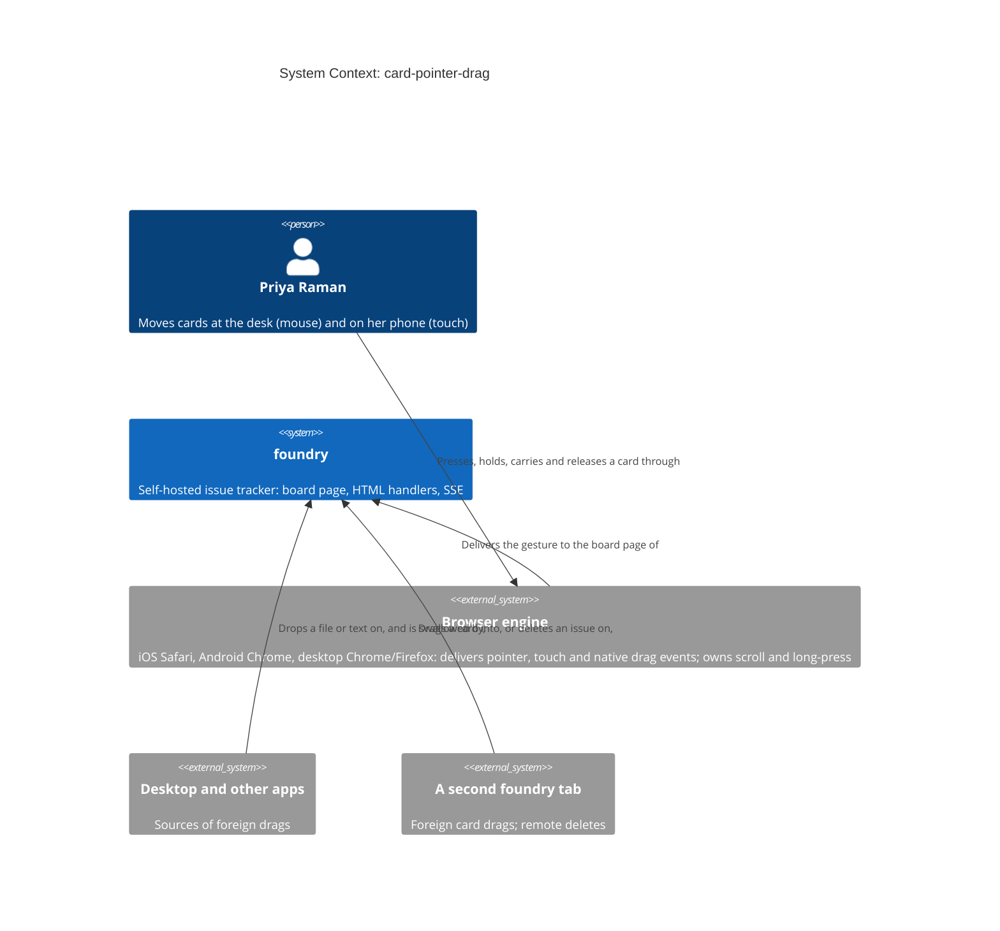
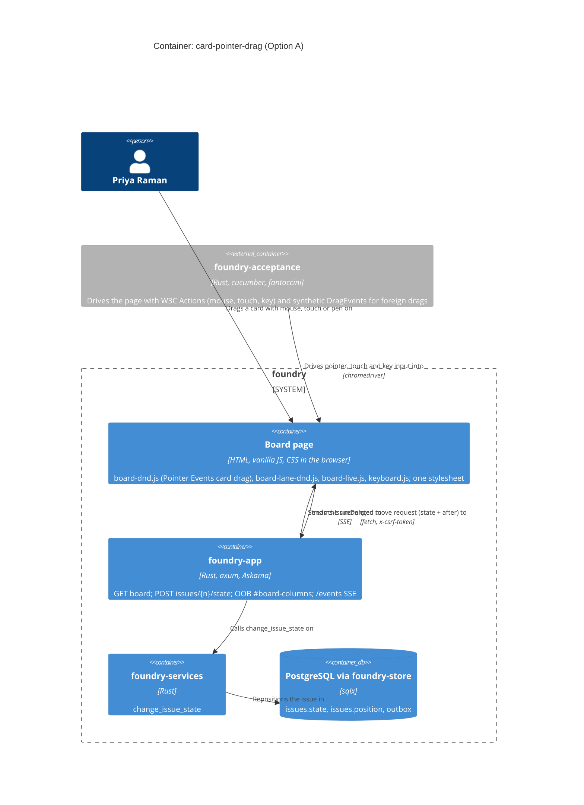
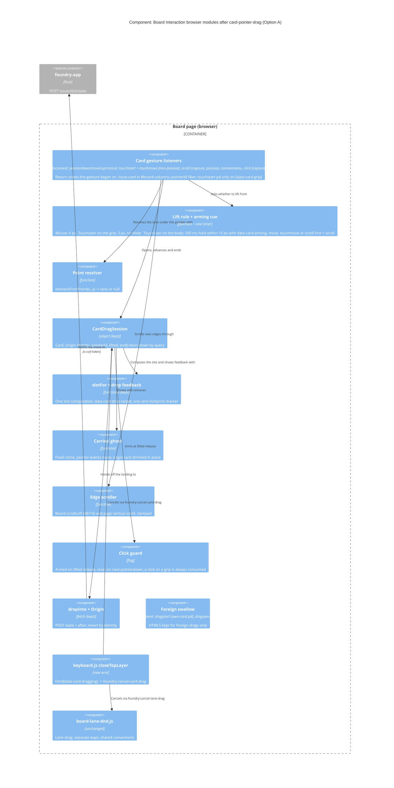

<!-- markdownlint-disable MD024 -->
# Feature Delta — card-pointer-drag

Move the board's card drag onto **Pointer Events** so a card can be dragged by
touch and pen as well as by mouse. On a phone, drag a card by its grip, or
press and hold its body to lift it (D5 as amended 2026-09-29).
A quick swipe still scrolls the board and a tap still opens the card. With a
mouse the lift stays immediate once the pointer passes a movement threshold,
so a click still opens the card. Everything `card-drag-drop-feedback` shipped
stays as it is. Native HTML5 drag-and-drop stays on the board for one job only:
swallowing foreign drags.

Feature type: **cross-cutting**. It touches the browser module `board-dnd.js`,
the stylesheet, the card template (`partials/issue_card.html` and its second
copy at `issues.rs:731`), one new arm in `keyboard.js::closeTopLayer()`, and
the acceptance test **driver**. The server protocol does not change.
Predecessors: `board-lane-reorder`, whose ADR-BOARD-LANE-007 names this feature
as its first deferred successor, and `card-drag-drop-feedback`, which set the
behaviour contract this feature must keep.

## Wave: DISCUSS

### [REF] Prior Wave Consultation

| Source | Read | What it settled |
|---|---|---|
| `docs/product/jobs.yaml` `job-board-card-move` | ✓ | The job exists and is validated. Its `habit` force ("feedback must add to that gesture, not change it: same drop semantics, same request, same revert") becomes this feature's parity constraint. The job is **widened** to touch, not replaced (back-propagated below). |
| `docs/product/journeys/journey-card-drag-drop.yaml` | ✓ | Five mouse steps and five error paths. This wave adds a `touch` variant. Two mouse-step phrases now describe the retired mechanism and are corrected by a changelog note, not rewritten. |
| `docs/product/personas/persona-instance-operator.yaml` | ✓ | Priya Raman is reused. The file records "mouse and keyboard" only; **no prior wave records her using a phone**. The phone context is from the user's intake and from `fix-lane-menu-clipped-mobile` / board-lane-reorder KPI 5 (390px). It is a stated use, not a persona characteristic. The persona file is not edited. |
| `docs/product/architecture/brief.md` §"The board card drag session" | ✓ | Invariants 1-8, the state diagram and the ubiquitous language are all written in `dragstart`/`dragover` terms. "Board Interaction deliberately holds two drag models, one per gesture family." DESIGN must restate them (Contradiction C5). |
| `adr-board-lane-007-pointer-events-lane-drag.md` | ✓ | "Why not converge now": a rewrite with its own regression surface (ranking semantics, `after` protocol, exact-origin revert), kept off another feature's critical path. That reason no longer applies: this feature **is** the rewrite, with nothing else on its path. The "boundary that must hold" loses its first leg (different event families) once both drags are Pointer Events (D13). |
| `adr-board-card-001` / `adr-board-card-002` (via `brief.md` + `board-dnd.js` header) | ✓ | Delegation on `document`, identity-only origin, event-time lane resolution, a single absolutely positioned `[data-card-drop-marker][data-before-key]`, landing at the live marker, `data-card-drop-target`, teardown by DOM query on every exit. All kept (D10). |
| `docs/product/kpi-contracts.yaml` `card-drag-drop-feedback` | ✓ | CDF-KPI-1..8 are hard gates on every ci-github run. CDF-KPI-8's instrument, "`git diff aa8a6f6` on those files empty", covers **step modules** as well as feature files. This feature has to change two step modules (Contradiction C4). |
| `docs/product/outcomes/registry.yaml` OUT-13/14/15 | ✓ | OUT-13's input shape reads "Native HTML5 drag events … dragstart on article.issue-card". DISTILL must amend OUT-13 and OUT-14 to pointer input. OUT-15 (placeholder via `:has()`) is mechanism-free and unaffected. |
| `docs/evolution/2026-09-14-card-drag-drop-feedback.md` | ✓ | 35 declarations / 54 examples, all `@needs-browser` `@cdf`, driven by synthetic `DragEvent`s. Lesson 3: automation real-mouse drags are unreliable, so the feel check belongs to the user. Successor "a touch or keyboard card move (D14)" is this feature, touch half only. |
| `docs/evolution/2026-09-04-board-lane-reorder.md` | ✓ | Lesson 3: the synthetic `click` that follows a drag's `pointerup` fired a stray move. The same trap here would open the card's edit dialog after every drag (D6, AC-1.5). There are 2 `@mobile` touch scenarios at 390px as precedent. |
| `docs/feature/board-lane-reorder/feature-delta.md`, `docs/feature/card-drag-drop-feedback/feature-delta.md` | ✓ | Format precedent; D-table style; the Homelab Ops (OPS) and Identity Platform (AUTH) fixtures. |
| `static/js/board-dnd.js`, `static/js/board-lane-dnd.js`, `static/js/keyboard.js:267-305` | ✓ | The lane module is the precedent: `THRESHOLD = 6`, `EDGE_ZONE = 48`, `EDGE_STEP = 14`, `pointercancel` revert, Escape as arm 3 via `[data-lane-dragging]` + `foundry:cancel-lane-drag`, primary-button filter for mouse. |
| `templates/partials/issue_card.html`, `board_columns.html` | ✓ | **What a click or tap does today:** the card `<article>` carries `hx-get="{{ card.edit_url }}" hx-target="#modal-root"`, so a click (a tap too) opens the issue's **edit dialog**. It also carries `draggable="true"` (OQ-4). The header `<h3 data-lane-drag>` is a sibling of the cards, not their ancestor. |
| `static/css/foundry.f7c36a08.css` | ✓ | `.board { overflow-x: auto }` **only below 480px**. `.column` has no height limit and no `overflow-y`, so **a lane never scrolls on its own; a long lane lengthens the page**. "Vertical lane scroll" therefore means page scroll (D14, OQ-6). `[data-lane-drag]` has `touch-action: pan-y; user-select: none`. |
| `crates/foundry-acceptance/src/support/browser_harness.rs:1089-1400`, `steps/feature_card_drag_drop_feedback.rs`, `feature_board_lane_reorder.rs:1137`, `keyboard_shortcut_bindings.rs:3043` | ✓ | One synthetic-drag kit (`drag_start` / `drag_over` / `drag_drop` / `drag_end` / `drag_start_foreign`, `DragSpot`). Two older inline `DragEvent` scripts it never absorbed. Escape is driven as `dragend`, because a page receives no key events during a native drag. |
| `tests/features/*.feature` (every `drag` mention) | ✓ | Browser-driven card drags exist in exactly three files: `card-drag-drop-feedback.feature`, `board-lane-reorder.feature` (card-vs-lane guard) and `keyboard-shortcut-bindings.feature:328`. `issue-status-move`, `card-ranking-within-status`, `board-lane-management:114` and `board-lane-overflow-menu:135` are HTTP-lane POSTs and are unaffected, **except** `issue-status-move.feature:49`, whose oracle asserts `draggable="true"` (OQ-4). `form-error-display-contract.feature:98` is `@pending`. |
| `.nwave/des-config.json`, `~/.nwave/global-config.json` | ✓ | Density **lean**, expansion **ask-intelligent**. |
| `docs/feature/card-pointer-drag/discover/`, `diverge/` | ⊘ | No DISCOVER or DIVERGE wave ran. Requirements came in clear at intake, and ADR-007 is the evidence base. |
| `docs/product/vision.md`, `docs/project-brief.md`, `docs/stakeholders.yaml` | ⊘ | Not present in this repo. |

Nine prior-SSOT statements are contradicted or superseded by this feature.
Each is listed under *Contradictions with prior SSOT*, and none blocks DISCUSS.

### [REF] Persona

**Priya Raman** (`persona-instance-operator`). At her desk she drags cards
daily with the mouse. Since `card-drag-drop-feedback` that drag is trustworthy:
the lane lights, a line shows the slot, and drops survive in-place refreshes.
Away from the desk she opens the Identity Platform board on her phone at 390px.
There she can drag a **lane** header with her thumb (board-lane-reorder) but
not a **card**. Her only touch path is to open AUTH-41, change Status and Save,
which cannot choose a slot and always lands the card at the top. She reads the
difference as a bug (ADR-007 *Consequences* predicted exactly this). **Marco**
is not needed, because no authz surface changes.

### [REF] JTBD

**job_id: `job-board-card-move`**, **widened** to touch and pen. It is not a new
job: the outcome (a card in the lane and slot she means, seen before release,
trusted after) is identical. Only the device changes. `jobs.yaml` gains a wider
`job_story`, a touch clause in `dimensions.functional`, `forces.touch_delta`,
`opportunity.touch_note`, a second `validated_by` and a `scope_history`.

One-liner: *When a card is in the wrong lane or slot and I only have my phone,
I want to press, hold and carry it to exactly the gap I mean, and see the lane
and slot before I let go, without losing swipe-to-scroll or tap-to-open, so the
board is right now rather than when I am back at a desk.*

| Force (delta; the shipped forces still hold) | |
|---|---|
| **Push** | No card gesture exists on touch. The header right above the card drags, so the board looks half-broken. The Status-field workaround cannot choose a slot. |
| **Pull** | Press, hold, feel it lift, carry, release: every mobile board app works this way. It shows the same lit lane and marker as the desktop. |
| **Anxiety** | A swipe grabs a card. A tap starts a drag. A drag opens the card's dialog. A system gesture mid-drag strands a half-moved card. The desktop drag, which works, gets worse. |
| **Habit** | Mouse: immediate lift, Escape cancels. Touch: swipe scrolls, tap opens. The new gesture must take nothing away from either. |

All three stories trace N:1 to `job-board-card-move`.

### [REF] Locked Decisions

| ID | Decision | Rationale / source |
|---|---|---|
| D1 | **Cross-cutting, brownfield, protocol unchanged.** Browser module, CSS, card template(s), one `closeTopLayer()` arm, and the acceptance driver. No handler, service, store or migration change. The POST stays `POST /team/{t}/project/{p}/issues/{n}/state` with `state` and `after` (omitted at the top) and the `x-csrf-token` header, byte-identical. | User decision (intake); `brief.md` invariant 8. |
| D2 | **Full convergence: cards drag on Pointer Events for mouse, touch and pen.** One card-drag mechanism serves every pointer. There is no second touch-only path beside a surviving HTML5 mouse path. | User decision (intake). ADR-007's "why not converge now" reasons were about sequencing inside another feature, and none of them applies here. |
| D3 | **HTML5 drag-and-drop remains ONLY to swallow foreign drags inside `#board-columns`,** exactly as `card-drag-drop-feedback` shipped (`brief.md` invariant 7, CDF D4, OUT-13's foreign clause). A file, a text selection, or a native drag from another tab is claimed and swallowed: no activation, no marker, no request, no navigation, on a fresh load and after a replace. A native `dragstart` on this page no longer opens a card session. | User decision (intake). |
| D4 | **The Gherkin stays byte-identical; the test DRIVER is re-pointed.** Every shipped scenario that drags a card now drives **pointer** input. Every scenario that drags something foreign stays on synthetic `DragEvent`. The classification is in *Test-driver re-pointing* below. `git diff` on every shipped `.feature` file is empty at every slice gate, and that empty diff is the behavioural proof of parity. Step and harness **code** may change only to re-point input. No oracle may be weakened or removed. | User decision (intake); ADR-007 "pass unmodified, not adapted". Contradiction C4 records how this meets CDF-KPI-8. |
| D5 | ~~**Touch and pen lift by PRESS-AND-HOLD.** On `pointerType` `touch` or `pen`, a card lifts only after the pointer stays down on it for the hold duration (~300-400 ms; the exact value is a DESIGN/measurement question, OQ-1) without moving past a small hold tolerance. Movement past the tolerance before the hold completes is a **scroll**: the browser keeps the gesture and no card lifts. Release before the hold completes without moving is a **tap**: the card's edit dialog opens, as today.~~ **Amended 2026-09-29 after the DDD-13 device run: touch and pen lift from a GRIP at once, or from the card BODY by a 500 ms hold.** Every card has a grip, a strip on its right edge. A touch or pen on the grip lifts the card after a few pixels of travel, with no hold and no timing, and the gesture never scrolls. A tap on the grip opens nothing: the grip belongs to the drag. On the rest of the card (the body), the card lifts only after the pointer stays within the hold tolerance for **500 ms**, and a visible **arming cue** shows over the hold. Movement past the tolerance before the hold completes is a **scroll**, and a release before it is a **tap** that opens the edit dialog, as before. **Accepted trade-off:** a swipe whose thumb rests on the body for 500 ms or more before moving lifts the card instead of scrolling. See *Amendment 2026-09-29*. | User decision (intake). Amended by the user, 2026-09-29: `spike/findings.md` §"Device checklist result (DDD-13)" and §"Iterations after the decision". |
| D6 | **Mouse lifts immediately past a movement threshold, and a click still opens the card.** A primary-button press that moves past the threshold (the lane precedent is 6 px; DESIGN may change it on evidence) lifts the card. A press released inside the threshold is a click and opens the edit dialog. **A drag never opens the edit dialog**: the synthetic `click` after a drag's `pointerup` is suppressed. Non-primary mouse buttons never start a drag. | User decision (intake); board-lane-reorder evolution lesson 3 (stray post-`pointerup` click); `board-lane-dnd.js:205`. |
| D7 | **Lightweight UX depth.** `journey-card-drag-drop.yaml` gains a `touch` variant with a happy path, scroll-vs-drag, tap-vs-drag, and cancel/`pointercancel` error paths. There is no separate journey file. | User decision (intake). |
| D8 | **No walking skeleton.** Protocol, POST, revert, feedback and placeholders are all shipped. Every slice is thin and end-to-end on shipped substrate. | User decision (intake). |
| D9 | **JTBD on:** trace to `job-board-card-move` (widened); persona `persona-instance-operator`. | User decision (intake). |
| D10 | **Everything `card-drag-drop-feedback` shipped is preserved, as behaviour, under the new input.** Lane activation `data-card-drop-target` on exactly the lane under the pointer. The single absolutely positioned `[data-card-drop-marker]` with `data-before-key`. Landing at the live marker (marker = landing = `after`, one computation). The empty-lane placeholder shown by `:has()` with zero writers. Replace-proof by construction: listeners delegated on `document`, lanes resolved from the live document at event time, origin held as identity only. Exact-origin revert on non-2xx or network error. Teardown by DOM query on every exit. | User must-preserve list; ADR-BOARD-CARD-001/002/003; `brief.md` invariants 2-6, 8. |
| D11 | **Escape cancels a card drag through a NEW ARM of `keyboard.js::closeTopLayer()`,** never a `keydown` listener in the drag module (BR-4). HTML5 DnD gave Escape for free (CDF D5). Pointer Events do not. The arm finds the in-flight card drag by a DOM marker, as arm 3 does for lanes, and sits beside the lane-drag arm, above the lane menu. The two drag arms are mutually exclusive in practice (one pointer, one session), and DESIGN fixes their order deterministically. A cancelled drag returns the card to its exact origin slot, POSTs nothing, and leaves no lit lane, no marker and no carried card. | User must-preserve list; `keyboard.js:276-289`; ADR-BOARD-LANE-005/007. |
| D12 | **`pointercancel` reverts exactly as Escape does.** A system gesture, an incoming call, a notification shade, or the browser claiming the gesture for a scroll after the lift, all take the pointer. The card goes back to its exact origin with no request and no residue. This is a real exit path that HTML5 DnD hid (ADR-007 *Consequences*). | User must-preserve list; `board-lane-dnd.js:301-309`. |
| D13 | **The origin-based boundary with the lane drag holds, on two legs instead of three.** A gesture that starts on `.issue-card` is a card move. One that starts on `[data-lane-drag]` is a lane move. Neither becomes the other. ADR-007's first leg, *different event families*, **disappears**, because both modules now listen for `pointerdown` on `document`. The boundary now rests on leg 2 (each module ignores a `pointerdown` whose origin is not its own element, and neither element contains the other) and leg 3 (thresholds). The shipped `board-lane-reorder.feature` card-vs-lane guard stays unmodified as the standing proof, and a new scenario asserts the boundary from the card side. **DESIGN owes an ADR superseding ADR-007's "permanent divergence" and restating the boundary.** | User must-preserve list; ADR-007 §"How the boundary actually holds". |
| D14 | **Edge auto-scroll while carrying a card.** Horizontal: the board (`#board-columns`, `overflow-x: auto` below 480px) scrolls under a card held near its left or right edge, so a lane off-screen on a 390px phone is reachable. Vertical: lanes do not scroll internally (measured: `.column` has no `overflow-y`), so a long lane extends the page. A card held near the top or bottom viewport edge scrolls the **page**. Without it, a finger that is already carrying a card cannot reach an off-screen slot in a long lane. DISCUSS recommends vertical page auto-scroll **in scope** (slice 03). DESIGN confirms or returns it to the user (OQ-6). Auto-scroll changes what is visible, never what the marker addresses. | User must-preserve list ("consider vertical lane scroll"); `foundry.css:346-376, 1137`. |
| D15 | **The lifted card is visibly carried under the pointer.** HTML5 DnD drew a browser drag image for free, and Pointer Events draw nothing. From the lift until any exit, a visible representation of the card follows the pointer, the origin slot stays legible, and neither blocks lane or slot resolution under the pointer. On touch the lift is announced visibly the moment it happens. *Amended 2026-09-29:* a body hold also shows its arming cue before the lift (D5); a grip lift has no hold, so it has no cue. Ghost or real node, offset from the finger, and whether haptics are used are all DESIGN's call (OQ-7, OQ-10). | Consequence of D2; journey step `t2`. |
| D16 | **One pointer, one session.** Only the pointer that lifted a card drives it. Other pointers are ignored during a drag, whether a second finger or a mouse while touching. At most one card session exists (`brief.md` invariant 2). A second pointer the browser turns into a pinch arrives as `pointercancel` and follows D12. | `brief.md` invariant 2; `board-lane-dnd.js` `pointerId` filter. |
| D17 | **No keyboard card move and no live-region announcement.** The edit dialog's Status field remains the non-pointer path (`issue-status-move` D3, CDF D14). This feature closes the touch half of CDF's successor only. | CDF D14; scope discipline. |
| D18 | **CSS: tokens only, re-hashed per slice.** Every CSS change renames `foundry.<hash>.css` across `base.html`, the `lib.rs` tests and `static/VENDOR.md` in the same change. No colour literal outside the three token regions (check-arch S1). | CDF D13; precedent `1d91ad8`. |
| D19 | **Synthetic input proves wiring; a real device proves feel.** The WebDriver lane can prove "no lift, no request" for a touch pointer that moves before the hold completes. It **cannot** prove that the browser really scrolled, that iOS showed no callout, or that the hold feels right. Every touch slice names a **manual dogfood on a real iOS Safari and a real Android Chrome device** and records it in its delivery notes. The desktop feel check stays with the user (CDF evolution lesson 3). *Amended 2026-09-29:* the lazy-swipe misfire on the card body (a thumb that rests, then swipes) is also device-only. Emulation and the iOS Simulator start moving at once and cannot reproduce it (`spike/findings.md`). | CDF D12 generalised; memory: automation real-pointer drags are unreliable. |
| D20 | **No drag library, no new dependency.** A hand-authored module against a platform API. | ADR-007 alternatives; `VENDOR.md` + check-arch R1-R3 posture. |

### [REF] Journey (lightweight)

SSOT: `docs/product/journeys/journey-card-drag-drop.yaml`. The mouse steps 1-5
are unchanged in meaning. The **`touch` variant** (`t1`-`t4`) is new.

Arc: **Problem Relief.** Resigned (the phone cannot move a card) → deliberate
(hold) → in control (lifted, carried) → oriented (lit lane, marker, same as
desktop) → confident (landed; swipe and tap still work).

```text
+-- AUTH (390px) ------------+      +-- AUTH (390px) ------------+
| BACKLOG        IN-PROGRE> |      | IN-PROGRESS#   DONE        |
| +----------+   +--------  |      | # AUTH-3   #   AUTH-7      |
| | AUTH-41 *|   | AUTH-3   |  ->  | #========  # <- marker     |
| +----------+   | AUTH-12  |      | # AUTH-12  #  +=========+  |
| | AUTH-43  |   | AUTH-19  |      | # AUTH-19  #  | AUTH-41 |<-thumb
|  thumb holds ~350 ms      |      | ############  +=========+  |
+---------------------------+      +----------------------------+
 t1 Press and hold: nothing          t2-t3 Lifted; carried to the right
 lifts until the hold completes      edge, the board scrolls, In-Progress
                                     lights, the line opens after AUTH-3
```

*Amended 2026-09-29 (D5):* t1 is now one of two paths. The grip on AUTH-41's
right edge lifts it at once. A thumb on the card's text lifts it after a 500 ms
hold, with the card arming (scaling down slightly and dimming) over the hold.
The "~350 ms" in the sketch above is superseded.

| Path | What Priya sees |
|---|---|
| **Happy (touch, grip)** | Thumb on AUTH-41's grip, move → it lifts at once → carry right, the board scrolls → In-Progress lit, line after AUTH-3 → release → AUTH-41 sits between AUTH-3 and AUTH-12, nothing lit, no dialog opened, same after a reload. *(Added 2026-09-29.)* |
| **Happy (touch, body hold)** | Hold AUTH-41's text → it arms over 500 ms, then lifts → carry and release as above. *(Was "Hold AUTH-41 → it lifts"; amended 2026-09-29.)* |
| Grip tap | A tap on AUTH-41's grip opens nothing, lifts nothing and sends nothing. *(Added 2026-09-29.)* |
| Resting thumb, then swipe (accepted trade-off) | Her thumb rests on AUTH-41's text for 500 ms or more, then swipes. The card arms, then lifts instead of scrolling. She releases it off every lane or back in place, and nothing changes. *(Added 2026-09-29.)* |
| **Happy (mouse)** | Exactly as today: press AUTH-41, move past the threshold, it follows the cursor, same lit lane, same line, same landing. A click without moving opens the edit dialog. |
| Swipe, not drag | A fast swipe across AUTH-41's text scrolls the board. Nothing lifts, nothing lights, no request. |
| Tap, not drag | A tap on AUTH-41's text opens its edit dialog, as today. |
| Escape (keyboard attached) | The card returns to its exact origin. Nothing lit, no marker, no carried card, no request. A second Escape does nothing (empty stack). |
| `pointercancel` (call, OS gesture, pinch) | Same as Escape. |
| Release over the page header or off every lane | Same as Escape (CDF's `cancelled` path). |
| Refused (uniform 404) or network failure | Exact origin slot, placeholders as before (CDF's `refused` path, unchanged). |
| A file dragged in from Finder | Swallowed as today: nothing lights, nothing moves, the tab stays (D3). |

### [REF] Scope Assessment: PASS — 3 stories, 1 bounded context, ~2.75 days

**3 stories** (≤10). **One bounded context**, Board Interaction (the board
page's browser tier), plus the acceptance harness that drives it. No server
context is touched (D1). **No walking skeleton** (D8). **~2.75 days**, well
under 2 weeks. **One outcome**: a card moves to the slot she means on any
pointer. The three stories are the mouse, touch and far-reach views of that
outcome. Zero oversizing signals fired, so no split is proposed.

The regression surface is large for its size: ~37 browser scenarios re-driven
(see the table below). That is why slice 01 is parity-only and why D4 makes the
Gherkin diff the gate.

### [REF] Test-driver re-pointing (which shipped scenarios change driver)

| Shipped scenario(s) | What is dragged | Driver after this feature |
|---|---|---|
| `card-drag-drop-feedback.feature` — every scenario that drags a card: `:60`, `:70` (outline ×4), `:97`, `:105`, `:144`, `:156`, `:163`, `:171`, `:177` (outline), `:188` (outline), `:208`, `:215` (outline), `:232`, `:239`, `:248` (outline), `:260`, `:268`, `:275`, `:282` (outline), `:304`, `:312` (outline), `:330`, `:337`, `:344`, `:352`, `:360` rows 1-2, `:389` | A card on this page | **Pointer events.** The kit's `drag_start` / `drag_over` / `drag_drop` / `drag_end` become pointerdown (+ threshold travel) / pointermove / pointerup. The live-geometry `DragSpot` resolution is kept. "presses Escape" becomes a **real Escape key press** reaching the new `closeTopLayer()` arm (no longer `dragend`). "releases it over the page header" becomes pointerup there. "the drag reports the same pointer position several more times" becomes repeated pointermove at one point. |
| `card-drag-drop-feedback.feature:89` (header reorder guard) | A lane header, then a card | The header drag is already pointer (unchanged). The card drag re-points. |
| `card-drag-drop-feedback.feature:112` (swallow outline ×5), `:130` (card from another tab), `:201`, `:297`, `:360` row 3 | A file, a text selection, another tab's card | **Stays synthetic `DragEvent`** (D3). These prove the retained HTML5 swallow. |
| `card-drag-drop-feedback.feature:136` (cancelled drag, then a file) | A card, then a file | **Mixed.** The card half is pointer plus a real Escape key; the file half stays `DragEvent`. |
| `card-drag-drop-feedback.feature:373`, `:382` (remote delete) | Nothing (SSE) | Unaffected. DISTILL confirms no drag in their Givens. |
| `board-lane-reorder.feature` card-vs-lane guard (`feature_board_lane_reorder.rs:1137` `drag_a_card`) | A card | **Pointer.** This is the D13 boundary proof. Its inline `DragEvent` script is replaced. |
| `keyboard-shortcut-bindings.feature:328` (`keyboard_shortcut_bindings.rs:3043`) | AUTH-2 with the mouse | **Pointer** (`pointerType: mouse`). |
| `issue-status-move`, `card-ranking-within-status`, `board-lane-management:114`, `board-lane-overflow-menu:135` | None (HTTP POST) | Unaffected, **except** `issue-status-move.feature:49`, whose oracle asserts `draggable="true"` (OQ-4). |
| `form-error-display-contract.feature:98` (`@pending`) | A card | Out of scope. Whoever un-pends it drives pointer input. |

### [REF] Shared Artifacts

| Artifact | Source of truth | Consumers | Risk |
|---|---|---|---|
| Card session (card, origin identity, pointerId, lifted?) | One per page, opened only by a pointer lift on an `.issue-card` inside `#board-columns` | Activation, marker, carried card, revert, Escape arm, `pointercancel`, click suppression | **HIGHEST**: every exit must clear it (D11, D12), or a stale session reverts or suppresses the wrong thing |
| Lane under the pointer | **The point** (`clientX/Y`) resolved against the live document at event time | Activation, marker, landing | **HIGH**: on touch, pointer events are implicitly **captured** to the pointerdown target, so `event.target` stays the card for the whole gesture. The shipped `event.target.closest(LANE)` idiom stops working. DESIGN must resolve from the point (OQ-5) |
| `${after_key}` / marker | One slot computation (`slotFor`) | Marker, landing, POST `after` | HIGH: unchanged rule (D10). The carried card must not be what sits under the point |
| Hold duration and hold tolerance | One constant pair in the card module | Touch/pen **body** lift; tap-vs-hold; swipe-vs-hold; the arming cue's timing | HIGH: too short grabs swipes, too long feels dead (OQ-1). *Amended 2026-09-29:* duration resolved at 500 ms; no value separates a resting-thumb swipe from a hold, so the grip carries reliability |
| Grip *(added 2026-09-29)* | Card markup, both sources (`issue_card.html`, `issues.rs:731`); how is DESIGN's | Touch/pen immediate lift; grip tap (opens nothing); the mouse, if DESIGN extends it | HIGH: a card rendered without it (one source missed, or the OOB refresh) has no reliable touch path |
| Arming cue *(added 2026-09-29)* | Stylesheet, driven by the hold state | Body hold only | MEDIUM: must clear on every abort (move, release, `pointercancel`), or a card stays dimmed |
| `touch-action` on cards | Stylesheet | Whether a swipe that starts on a card scrolls, and whether a post-lift move can be kept from scrolling | **HIGHEST, feasibility**: `touch-action` is read at pointerdown and cannot change mid-gesture (OQ-2) |
| Escape ownership | `keyboard.js::closeTopLayer()` (BR-4) | Card-drag arm (new), lane-drag arm, menu, modal, help, search | HIGH: a second listener peels two layers |
| Pointer-gesture ownership | Origin element: `.issue-card` → card; `[data-lane-drag]` → lane | `board-dnd.js`, `board-lane-dnd.js` | HIGH: both now on `pointerdown`, so leg 1 of ADR-007 is gone (D13) |
| Card click → edit dialog | `issue_card.html` `hx-get` (and `issues.rs:731`) | Tap, click, and the post-drag synthetic click | HIGH: a drag that opens the dialog is a daily annoyance (D6) |
| `draggable="true"` | `issue_card.html` + `issues.rs:731` | Native drag (now unwanted for own cards), `issue-status-move.feature:49` oracle | MEDIUM: OQ-4 |
| Board scroll | `#board-columns` `scrollLeft` (≤480px); page scroll | Edge auto-scroll; marker geometry | MEDIUM: marker must track across a scroll |
| CSRF token | `foundry_csrf` cookie → `x-csrf-token` | The drop POST (unchanged) | LOW |
| Stylesheet | `static/css/foundry.<hash>.css` | `base.html`, `lib.rs` tests, `VENDOR.md` | MEDIUM: rename per slice (D18) |

### [REF] User Stories

---

#### US-CPD-01: Drag a card with the mouse exactly as today, on the mechanism that also works on touch

`job_id: job-board-card-move` · Slice 01

##### Elevator Pitch

- **Before:** the card drag runs on the browser's native drag-and-drop, which cannot serve a phone. The board carries two drag mechanisms that a future change can drift apart.
- **After:** on the Identity Platform board, press AUTH-41 in Backlog with the mouse and move it between AUTH-3 and AUTH-12 in In-Progress. AUTH-41 follows the cursor, In-Progress lights, and a line opens after AUTH-3. Release, and AUTH-41 sits there and stays there after a reload. A plain click on AUTH-41 still opens its edit dialog, and Escape mid-drag puts it back.
- **Decision enabled:** which lane and slot AUTH-41 belongs in, judged exactly as she judges it today. Nothing she relies on at the desk changes.

##### Problem

Priya's desk drag works and she trusts it. The touch drag she wants cannot sit
on the same native mechanism. Rebuilding the card drag underneath her is only
acceptable if she cannot tell. The same lift, the same lit lane, the same line
and landing, the same revert, the same click-to-open, the same Escape.

##### Domain Examples

1. **Happy path.** AUTH-41 from Backlog to between AUTH-3 and AUTH-12 in In-Progress. The POST carries `state=in_progress&after=AUTH-3` with the `x-csrf-token` header, byte-identical to today's.
2. **Click still opens.** Priya clicks OPS-7 on Homelab Ops without moving. Its edit dialog opens. She presses and moves 3 px, then releases: still a click, the dialog opens. She drags OPS-7 to Done: no dialog opens.
3. **Escape and refresh.** She deletes AUTH-42 from its popup (the board refreshes in place), drags AUTH-41 over Done, then presses Escape. AUTH-41 is back in its Backlog slot, nothing lit, no marker, no request. A second Escape does nothing.

##### UAT Scenarios

The ~37 shipped scenarios in *Test-driver re-pointing* are this story's primary
UAT and run **unmodified**. The scenarios below are new.

```gherkin
@us-cpd-01 @needs-browser
Scenario: A click on a card still opens it, and a drag never does
  Given the Identity Platform board is open in a browser
  When Priya clicks AUTH-41 without moving the mouse
  Then AUTH-41's edit dialog opens
  When she closes it and drags AUTH-41 into In-Progress
  Then AUTH-41 is in In-Progress and no edit dialog is open

@us-cpd-01 @needs-browser
Scenario: A press that barely moves is still a click
  Given the Identity Platform board is open in a browser
  When Priya presses AUTH-41, moves the mouse 3 pixels and releases
  Then AUTH-41's edit dialog opens and no move request is sent

@us-cpd-01 @needs-browser @error
Scenario: Escape during a card drag puts the card back and peels only that layer
  Given Priya is dragging AUTH-41 over Done with the mouse
  When she presses Escape
  Then AUTH-41 is back in its slot in Backlog, no lane is lit, no marker shows and no request is sent
  And pressing Escape again changes nothing on the board

@us-cpd-01 @needs-browser
Scenario: A drag begun on a card never moves a lane
  Given Homelab Ops reads Backlog, Staging, In-Progress and Done
  When Priya drags OPS-3 from Backlog across the In-Progress header and drops it in Done
  Then OPS-3 is in Done and the lanes still read Backlog, Staging, In-Progress, Done

@us-cpd-01 @needs-browser
Scenario: Only the primary mouse button drags a card
  Given the Identity Platform board is open in a browser
  When Priya presses AUTH-41 with the right mouse button and moves it into In-Progress
  Then AUTH-41 is still in Backlog and no move request is sent
```

##### Acceptance Criteria

- **AC-1.1** Every shipped scenario classified as *card* or *mixed* in *Test-driver re-pointing* is green under pointer input, and `git diff` on every shipped `.feature` file is empty (D4).
- **AC-1.2** Every scenario classified as *foreign* is green on synthetic `DragEvent`: the retained HTML5 swallow is intact, fresh and after a replace (D3).
- **AC-1.3** The drop POST is byte-identical to the shipped one: URL, `state`, `after` (omitted at the top), `x-csrf-token` (D1).
- **AC-1.4** A primary-button press released inside the movement threshold opens the card's edit dialog and sends no move. A non-primary button never starts a drag (D6).
- **AC-1.5** No drag of any length opens the edit dialog. The synthetic click after the drag's release is suppressed, and only that click (D6).
- **AC-1.6** Escape during a card drag reverts to the exact origin, POSTs nothing, and leaves 0 lit lanes, 0 markers and 0 carried cards. It is handled by a `closeTopLayer()` arm, and the drag module has no `keydown` listener (D11). A mouse `pointercancel` does the same (D12).
- **AC-1.7** A drag that begins on a card and crosses a lane header moves the card and never a lane. The shipped `board-lane-reorder` card-vs-lane guard is green and unmodified (D13).
- **AC-1.8** While lifted, a visible card follows the cursor, and lane and slot resolution under the cursor is unaffected by it (D15).
- **AC-1.9** The stylesheet is renamed to its new content hash across `base.html`, the `lib.rs` tests and `VENDOR.md` in the same change, if this slice touches CSS (D18).

**Estimate:** ~1 day. Most of the driver work sits in the one harness kit. The
two inline `DragEvent` scripts (`feature_board_lane_reorder.rs:1137`,
`keyboard_shortcut_bindings.rs:3043`) are the only other driver edits.

---

#### US-CPD-02: Drag a card on a phone by its grip, or hold it to lift it, while a swipe still scrolls and a tap still opens

`job_id: job-board-card-move` · Slice 02 · *Amended 2026-09-29 (D5): was "Press and hold a card on a phone to lift it, …"*

##### Elevator Pitch

- **Before:** on her phone Priya cannot drag a card at all, although the lane header right above it drags. Moving AUTH-41 means open it, change Status, Save, and it lands at the top of the lane, not where she meant.
- **After:** on the Identity Platform board at 390px, put a thumb on AUTH-41's grip, the dotted strip on its right edge, and move. It lifts at once. Carry it into In-Progress between AUTH-3 and AUTH-12: the lane lights and the line opens. Lift the thumb, and AUTH-41 sits there with no dialog opened. Holding the card's text for half a second works too: the card shrinks slightly and dims as the hold arms, then lifts. A quick swipe across a card's text scrolls the board. A tap on it opens the card.
- **Decision enabled:** which lane and slot a card belongs in, decided from the phone at the moment she notices it is wrong, instead of remembering to fix it at a desk.

##### Problem

HTML5 drag-and-drop gives the phone nothing. A finger on a card already means
two things on this board: swipe to scroll and tap to open. A third meaning,
drag, has to be told apart from both without making either worse. Press and
hold is the convention that does this.

*Amended 2026-09-29.* On Priya's real iPhone, hold alone could not do it. Her
thumb often rests on a card for 400 ms to 1 s before a swipe moves, so no hold
duration tells a lazy swipe from a hold (14 of 30 swipes lifted at 350 ms;
`spike/findings.md`). A grip gives the drag its own place on the card, where a
finger means only drag. The card's text keeps the hold, at 500 ms with a
visible cue, for when she reaches for the text instead.

##### Domain Examples

1. **Happy path (grip).** At 390px, Priya puts her thumb on AUTH-41's grip and moves. It lifts at once. She carries it down into In-Progress between AUTH-3 and AUTH-12 and releases. `state=in_progress&after=AUTH-3`; a reload agrees. *(Amended 2026-09-29: was a ~350 ms hold.)*
2. **Body hold.** She holds her thumb on AUTH-43's text. Over half a second the card shrinks slightly and dims, then lifts. She drops it at the top of Done. *(Added 2026-09-29.)*
3. **Swipe.** She swipes left across OPS-7's text on Homelab Ops to bring Done into view. The board scrolls, OPS-7 does not lift, and nothing is lit or sent.
4. **Tap.** She taps OPS-9's text briefly. Its edit dialog opens. She taps OPS-9's grip: nothing opens and nothing moves. She holds OPS-9's text, it lifts, and she releases in place without moving: no dialog opens, and the card is still in its slot. *(Grip tap added 2026-09-29.)*
5. **Pen.** On a tablet with a stylus she drags AUTH-19 by its grip to the top of In-Progress. It behaves exactly as by finger, and so does a pen hold on the text.
6. **Resting thumb (accepted trade-off).** Reading the board, her thumb rests on AUTH-12's text for most of a second, then she swipes up. AUTH-12 arms and lifts instead of the page scrolling. She lets go over the page header, and AUTH-12 is back in its slot with nothing sent. *(Added 2026-09-29.)*

##### UAT Scenarios

*Amended 2026-09-29 (D5).* A DISCUSS-level sketch; DISTILL owns the executable
wording. The first scenario was "Holding a card lifts it and it can be dropped
at an exact slot by touch". It now drags by the grip, and the hold moves to its
own scenario.

```gherkin
@us-cpd-02 @needs-browser @mobile
Scenario: A card dragged by its grip lifts at once and drops at an exact slot by touch
  Given the Identity Platform board is open at a phone-width viewport
  And In-Progress holds AUTH-3, AUTH-12 and AUTH-19 in that order
  When Priya puts a touch pointer on AUTH-41's grip and moves it without holding
  And she carries it between AUTH-3 and AUTH-12 and lifts her finger
  Then In-Progress reads AUTH-3, AUTH-41, AUTH-12, AUTH-19
  And the move request names AUTH-3 as the card above
  And no edit dialog is open

@us-cpd-02 @needs-browser @mobile
Scenario: Holding a card's text arms it visibly, then lifts it
  Given Homelab Ops is open at a phone-width viewport
  When Priya holds a touch pointer still on OPS-7's text
  Then OPS-7 shows it is arming before it lifts
  And after half a second OPS-7 is lifted and can be carried

@us-cpd-02 @needs-browser @mobile
Scenario: A touch on a card's text that moves before the hold completes lifts nothing
  Given Homelab Ops is open at a phone-width viewport
  When Priya puts a touch pointer on OPS-7's text and moves it sideways before the hold completes
  Then OPS-7 has not lifted, no longer shows it is arming, no lane is lit, no marker shows and no move request is sent

@us-cpd-02 @needs-browser @mobile
Scenario: A tap on a card's text still opens it
  Given Homelab Ops is open at a phone-width viewport
  When Priya taps OPS-9's text and lifts her finger before the hold completes
  Then OPS-9's edit dialog opens and no move request is sent

@us-cpd-02 @needs-browser @mobile
Scenario: A tap on a card's grip opens nothing
  Given Homelab Ops is open at a phone-width viewport
  When Priya taps OPS-9's grip without moving
  Then no edit dialog opens, OPS-9 is still in its slot and no move request is sent

@us-cpd-02 @needs-browser @mobile
Scenario: While lifted, the lane under the finger lights and the marker shows the slot
  Given Priya has lifted AUTH-41 with a touch pointer
  When she carries it over In-Progress between AUTH-3 and AUTH-12
  Then In-Progress is shown as activated and no other lane is
  And exactly one marker shows between AUTH-3 and AUTH-12

@us-cpd-02 @needs-browser @mobile
Scenario: A second finger during a drag does not take the card
  Given Priya has lifted AUTH-41 with one touch pointer and carried it over In-Progress
  When a second touch pointer goes down on Done and moves
  Then AUTH-41 is still carried by the first pointer and Done is not activated
```

##### Acceptance Criteria

*Amended 2026-09-29 (D5).* AC-2.1 to AC-2.6 now name the card **body** or the
**grip** where the rule differs. AC-2.10 to AC-2.14 are new. The numbering of
AC-2.1 to AC-2.9 is unchanged.

- **AC-2.1** For `pointerType` touch or pen on the card **body**, a card lifts only after the pointer stays within the hold tolerance for the hold duration, **500 ms** (OQ-1, resolved 2026-09-29). The tolerance is a single constant set by DESIGN (D5).
- **AC-2.2** A touch or pen pointer on the body that moves past the hold tolerance before the hold completes lifts nothing, lights nothing, shows no marker, sends nothing, clears the arming cue, and does not prevent the browser's scroll. The **real scroll** is proven at dogfood on iOS Safari and Android Chrome (D19).
- **AC-2.3** A touch or pen release on the body before the hold completes, without passing the tolerance, opens the card's edit dialog as a click does. A release after the lift never opens it, whether the lift came from the grip or the body, and even when released in the origin slot (D5, D6).
- **AC-2.4** After the lift, moving the finger carries the card and does not scroll the board or the page, except by the edge auto-scroll of US-CPD-03. The carried card stays under the finger (D15, OQ-2).
- **AC-2.5** On a real iOS Safari and a real Android Chrome, holding a card's body or pressing its grip shows no text selection, no callout or link preview, no context menu and no native drag, and the grip lifts without waiting for the OS (OQ-3, OQ-4). This is a dogfood AC and cannot be observed in the WebDriver lane.
- **AC-2.6** Activation, marker, landing, POST and revert are identical to the mouse path, whether the lift came from the grip or the body. There is no second touch-only code path for them (D2, D10).
- **AC-2.7** Only the lifting pointer drives the drag. Other pointers are ignored (D16).
- **AC-2.8** A swipe that starts on a lane header still scrolls or lane-drags exactly as `board-lane-reorder` shipped. The card rules do not reach the header (D13).
- **AC-2.9** Stylesheet re-hash in the same change (D18).
- **AC-2.10** *(added 2026-09-29)* A touch or pen on a card's **grip** lifts the card once it has travelled a few pixels (the threshold is DESIGN's), with no hold and no timer. A gesture that starts on the grip never scrolls the board or the page, except by the edge auto-scroll of US-CPD-03 (D5).
- **AC-2.11** *(added 2026-09-29)* A touch or pen **tap on the grip**, released before any lift, opens no dialog, moves nothing and sends nothing (D5).
- **AC-2.12** *(added 2026-09-29)* Over a body hold, a visible **arming cue** shows from the press to the lift: the card gradually scales down slightly and dims, then shows as lifted. A move past the tolerance, a release or a `pointercancel` before the lift clears the cue at once and leaves the card as it was. The cue uses tokens only (D18).
- **AC-2.13** *(added 2026-09-29)* **Every card has a grip**, in both card sources (`issue_card.html` and `issues.rs:731`), on a fresh load and after an in-place refresh. How the grip is rendered is DESIGN's.
- **AC-2.14** *(added 2026-09-29)* At the slice-02 dogfood, the lazy-swipe misfire rate on the body at 500 ms is measured on a real iPhone and recorded (KPI 3). It is not a pass/fail gate; a rate the user finds unacceptable returns D5 to the user. This is a dogfood AC.

**Estimate:** ~1.25 days (amended 2026-09-29 from ~1 day: the grip markup in
two sources and the arming cue). The OQ-2/3/4 spike has run: the post-lift
`touchmove` guard works on WebKit, and the whole-card hold failed its premise
(see *Amendment 2026-09-29*).

---

#### US-CPD-03: Carry a card to a lane or slot that is off-screen, and never strand it

`job_id: job-board-card-move` · Slice 03

##### Elevator Pitch

- **Before (after slice 02):** on a 390px phone Priya can lift AUTH-41, but only about one lane fits on screen. Done is off to the right, and the bottom of a 20-card Backlog is below the fold. A finger carrying a card cannot also scroll, so the destination is out of reach. An incoming call mid-drag could leave the card half-moved.
- **After:** carry AUTH-41 to the right edge of the board and hold it there. The board scrolls until Done is in view, Done lights, and the line opens. Hold near the bottom edge and the page scrolls down the long lane. If a call comes in mid-drag, AUTH-41 is back in its origin slot with nothing left lit.
- **Decision enabled:** where a card belongs on the whole board, not only on the part that fits on a phone screen, with the certainty that an interrupted drag has changed nothing.

##### Problem

A touch drag that cannot scroll can only reach what is visible, and on a phone
that is about one lane. The lane drag solved the horizontal half
(board-lane-reorder slice 03). Cards also need the vertical half, because lanes
grow down the page. Touch also adds an exit path the desk never has: the system
taking the pointer.

##### Domain Examples

1. **Off-screen lane.** Homelab Ops at 390px with eight lanes. OPS-3 is carried from Backlog to the right edge. The board scrolls, and OPS-3 drops into Done, the far lane. `state=done`.
2. **Long lane.** Backlog holds 20 cards. AUTH-43 is carried to the bottom edge. The page scrolls, and the marker reaches "below AUTH-60", the end slot.
3. **Interrupted.** Mid-carry over In-Progress, a phone call takes the screen (`pointercancel`). AUTH-41 is back between its original neighbours in Backlog. No lane is lit, there is no marker, no carried card, and no request.

##### UAT Scenarios

```gherkin
@us-cpd-03 @needs-browser @mobile
Scenario: Holding a carried card at the board's edge scrolls to an off-screen lane
  Given Homelab Ops has eight lanes and is open at a phone-width viewport
  And Priya has lifted OPS-3 in Backlog with a touch pointer
  When she holds it at the right edge of the board until Done is in view and releases over Done
  Then OPS-3 is in Done, and still there after a reload

@us-cpd-03 @needs-browser @mobile
Scenario: Auto-scroll stops at the board's end
  Given Priya is carrying OPS-3 at the right edge and the board has scrolled to its end
  When she keeps holding at the edge
  Then the board scrolls no further and the marker still follows her finger

@us-cpd-03 @needs-browser @mobile
Scenario: Holding a carried card near the bottom reaches the end of a long lane
  Given Backlog on the Identity Platform board holds 20 cards, the last below the fold
  And Priya has lifted AUTH-43 with a touch pointer
  When she holds it near the bottom of the screen until the end of Backlog is in view
  Then the marker shows below the last card and on release AUTH-43 is last in Backlog

@us-cpd-03 @needs-browser @mobile @error
Scenario: The system taking the pointer mid-drag puts the card back and leaves nothing behind
  Given Priya is carrying AUTH-41 over In-Progress with a touch pointer
  When the system takes the pointer away from Priya
  Then AUTH-41 is back in its exact slot in Backlog
  And no lane is lit, no marker shows, no carried card remains and no move request is sent

@us-cpd-03 @needs-browser @mobile @error
Scenario: Releasing a carried card off every lane changes nothing
  Given Priya is carrying AUTH-41 with a touch pointer
  When she lifts her finger over the page header
  Then AUTH-41 is back in its slot in Backlog, nothing is lit and no request is sent
```

##### Acceptance Criteria

- **AC-3.1** A carried card held within the edge zone of a horizontally scrollable board scrolls the board in that direction. The drag continues across the scroll, and the carried card stays under the pointer (D14).
- **AC-3.2** Horizontal auto-scroll stops at the board's scroll extent.
- **AC-3.3** A carried card held near the top or bottom viewport edge scrolls the page vertically, if OQ-6 confirms it in scope, and stops at the page's extent (D14).
- **AC-3.4** Across any auto-scroll the marker and activation track the pointer. The drop sends exactly one POST whose `after` is the marker's slot: auto-scroll changes what is visible, never what is addressed (D10).
- **AC-3.5** `pointercancel` at any point after the lift reverts to the exact origin, POSTs nothing, and leaves 0 lit lanes, 0 markers and 0 carried cards. A `pointercancel` **before** the lift simply abandons the hold (D12).
- **AC-3.6** Release over no lane (page header, outside `#board-columns`) behaves as the mouse `cancelled` path (CDF D5 as behaviour).
- **AC-3.7** Auto-scroll works identically for a mouse drag on a narrow desktop window (the mechanism is shared, D2).

**Estimate:** ~0.75 day. The horizontal half copies `board-lane-dnd.js::autoScroll`'s
proven shape. The vertical half is new.

---

### [REF] System Constraints

- Presentation tier: hand-authored JS, no build step, no Node (DB6), no dependency (D20). Assets are content-hashed and recorded in `static/VENDOR.md`.
- `Escape` has exactly one owner, `closeTopLayer()` (BR-4, ADR-MODAL-CLOSE-001, ADR-BOARD-LANE-005). The card-drag cancel is an arm.
- No listener is bound to a node inside `#board-columns`. Everything is delegated on `document` and resolved from the live document at event time (ADR-BOARD-CARD-001). This now includes `pointerdown/move/up/cancel`.
- `board_columns.html` is shared by the full page and the OOB refresh. The card markup has **two** sources, `partials/issue_card.html` and `issues.rs:731`, and any change to one must land in both.
- Colour enters only through `--cz-*` tokens (check-arch S1). Every CSS change re-hashes (D18).
- The POST contract is frozen (D1). Authz and CSRF are unchanged and stay the uniform non-enumerable 404.
- Test lanes: `@needs-browser` runs only in `all` / `cargo xtask ci`, and **only with `FOUNDRY_XTASK_INCLUDE_DOCKER=1`**, otherwise the browser lane is silently skipped. `@mobile` is the 390px lane. Per-feature mutation testing ≥80%. With no JS unit runner, named hand-seeded faults are the CDF precedent.
- Browser floor: Pointer Events are universal in the supported engines. `:has()` (placeholder) keeps its CDF floor.
- *Added 2026-09-29, iOS facts measured on the device (`spike/findings.md`), constraints for DESIGN, not a design:* with `draggable="true"`, iOS runs its own long-press drag (`dragstart` ~660 ms) and holds a grip touch until it ends, unless the grip's `touchstart` is prevented (`probe-v4.html`). With `draggable` off, iOS still drags the card's **text**. Own-card `dragstart` prevention (DDD-19) covers the body. The post-lift `touchmove` guard (OQ-2(a)) works on WebKit.

### [REF] Outcome KPIs

Objective: a card moves to the lane and slot Priya means, on any pointer, and
the desk drag loses nothing.

| # | Who | Does what | By how much | Baseline | Measured by | Type |
|---|---|---|---|---|---|---|
| 1 | Priya on a phone | Moves a card to an exact lane and slot by touch | 100% of `@mobile` touch-drag scenarios green; real-device dogfood: 5/5 grip drags and 5/5 body holds on iOS Safari and on Android Chrome land at the marker, and a reload agrees *(amended 2026-09-29: was 5/5 holds)* | 0%: no card gesture exists on touch | `@us-cpd-02` / `@us-cpd-03` scenarios; slice 02/03 dogfood log | Leading (north star) |
| 2 | Priya at the desk | Drags exactly as before | 100% of the ~37 re-driven shipped scenarios green; `git diff` on every shipped `.feature` = empty; POST body byte-identical; CDF-KPI-1..7 values held | CDF-KPI-8: 100% (HTML5) | Slice gates; the diff; fetch-spy body assertion | Guardrail |
| 3 | Priya on a phone | Scrolls the board by swiping across card text | 0 lifts and 0 requests from a touch on the body that moves before the 500 ms hold completes, in 100% of those scenarios; dogfood: 20 prompt swipes across card text → 0 lifts on each device. **Accepted trade-off:** a swipe whose thumb rests ≥ 500 ms before moving may lift; that lazy-swipe misfire rate is measured and recorded at the slice-02 dogfood, not gated (AC-2.14) *(amended 2026-09-29: was "20 swipes → 0 accidental lifts")* | Swipes always scroll (no drag exists). D5 device run, whole-card hold at 350 ms: 14/30 swipes lifted | `@us-cpd-02` swipe scenario; dogfood tally, prompt and resting swipes counted apart | Guardrail |
| 4 | Priya, any pointer | Opens a card by tap or click, and never by a drag | 100% of taps on card text and sub-threshold clicks open the edit dialog; 0 dialogs opened by any drag or by a tap on the grip *(amended 2026-09-29)* | Click opens; no touch drag | `@us-cpd-01` / `@us-cpd-02` scenarios; dogfood | Guardrail |
| 5 | Priya, any pointer | Never finds a card stranded or feedback left on screen | 0 lit lanes, 0 markers, 0 carried cards, and the card in its exact origin, after 100% of Escape / `pointercancel` / off-lane release / refusal exits | CDF-KPI-7: 0 residue (mouse, HTML5 exits) | Exit-path scenarios (CDF outlines re-driven + `@us-cpd-03` error scenarios); named faults | Guardrail |
| 6 | Priya on a phone | Reaches an off-screen lane or slot while carrying | 100% of auto-scroll scenarios; dogfood: a far-lane drop on an 8-lane board at 390px on each device | 0% (no touch drag) | `@us-cpd-03` scenarios; dogfood | Leading |
| 7 | Priya on a phone | Stops deferring card moves to the desk | ≥1 card moved by touch on each of 5 working days after slice 02 is on her instance; 0 "moved it later at the desk" entries | Every phone-noticed move deferred (no gesture) | Priya's 5-day log in slice-02 delivery notes (soft, owed) | Leading (behavioural) |

Homelab-scale honesty: a single-operator instance with no analytics. KPIs 1-6
are acceptance and dogfood measurements, and KPI 7 is Priya's own log, the
same posture as CDF-KPI-2.

### [REF] DoD

- Every `@us-cpd-*` scenario is green. Every re-driven shipped scenario is green with `git diff` on shipped `.feature` files empty (KPI 2).
- Foreign-drag scenarios are green on `DragEvent` (D3).
- The real-device dogfood on iOS Safari and Android Chrome is recorded per slice (D19). The desktop mouse feel check is recorded in Chrome and Firefox.
- An ADR supersedes ADR-007's "permanent divergence" and restates the gesture boundary (D13). `brief.md` §Board Interaction (invariants, state diagram, ubiquitous language) is restated in pointer terms. DISTILL amends OUT-13/14.
- The CDF-KPI-8 instrument is re-scoped to feature files and recorded in `kpi-contracts.yaml` (C4).
- Stylesheet re-hash per CSS-touching slice. Card markup changed in both sources if at all.
- `FOUNDRY_XTASK_INCLUDE_DOCKER=1 cargo xtask ci` is green. Named-fault mutation ≥80% on touched code.

### [REF] Out of Scope

- A keyboard card move and live-region announcements (D17).
- Any server, protocol, ranking or store change (D1).
- Widening the foreign-drop swallow beyond `#board-columns` (CDF OQ-3 stays a user decision).
- Haptic feedback as a requirement (OQ-10 may add it as an enhancement).
- Multi-card selection or multi-drag.
- Changes to the lane drag beyond sharing its conventions (threshold, edge zone), including the `.lane-drop-indicator` contrast successor.
- The pre-existing new-issue ordering bug (`position DEFAULT 0`).
- Dragging a card between browser tabs (it was never a move; it stays a swallowed foreign drag).

### [REF] WS Strategy

**No walking skeleton (D8).** Delivery order **01 → 02 → 03**:

- **01 first: largest regression surface, and the only slice every later slice depends on.** It swaps the mechanism under ~37 green scenarios while changing none of them. If parity cannot be reached with the Gherkin untouched, the feature stops on day one with the HTML5 drag still shipping.
- **02 carries the highest feasibility uncertainty** (OQ-2/3/4: can a swipe on a card scroll while a post-lift move does not, on real iOS and Android?). It is de-risked by a **pre-slice spike during DESIGN**, run in parallel with slice 01's build, so that the uncertainty resolves before slice 02 is planned. That is the same treatment board-lane-reorder gave its D8.
- **03 last:** auto-scroll and touch cancel paths refine a touch drag that must first exist.

### [REF] Driving Ports

Board Interaction's driving ports are user gestures and one key. The server
port is unchanged.

1. **Pointer gesture on a card** (`pointerdown` → `pointermove` → `pointerup` / `pointercancel`, delegated on `document`, scoped to `.issue-card` inside `#board-columns`). This one port serves mouse (threshold lift) and touch/pen (grip lift at once, or body hold lift; amended 2026-09-29).
2. **Escape key** through `keyboard.js::closeTopLayer()` (new card-drag arm).
3. **Native drag events inside `#board-columns`** (retained, foreign-only swallow).
4. **Unchanged:** `POST /team/{t}/project/{p}/issues/{n}/state` (`state`, `after`, `x-csrf-token`), consumed as-is.

### [REF] Pre-requisites

Everything is shipped: the drop POST, ranking, exact-origin revert, activation,
marker, placeholder, replace-proof delegation (CDF); the Pointer Events
precedent, `closeTopLayer()` drag arm, `@mobile` 390px lane and edge
auto-scroll (board-lane-reorder); the drag kit in `browser_harness.rs`.

**Open questions for DESIGN.** OQ-2, OQ-3 and OQ-4 are gating for slice 02 via
the spike.

1. **OQ-1: hold duration and hold tolerance.** 300-400 ms suggested. Measure against platform long-press (iOS ~500 ms callout, Android `ViewConfiguration` long-press ~400-500 ms). The hold should fire **before** the OS long-press, or the OS gesture must be suppressed. Tolerance of the order of 8-10 px. **Resolved 2026-09-29 (user, on the device):** the card body lifts after a **500 ms** hold with an arming cue, and the grip lifts at once with no hold. The tolerance stays DESIGN's (10 px was used on the device). Evidence: `spike/findings.md` §"Device checklist result (DDD-13)" (no hold duration separates a resting-thumb swipe from a hold) and §"Iterations after the decision" (`probe-v6.html`: 5 of 5 body holds lifted at ~503 ms and landed where aimed; `probe-v5.html`: 13 of 13 grip drags landed). The lazy-swipe misfire rate at 500 ms is owed at the slice-02 dogfood (AC-2.14).
2. **OQ-2: `touch-action` strategy on cards (gating).** `touch-action` is read at `pointerdown` and cannot change mid-gesture. Candidates: (a) `touch-action: auto` (or `pan-x pan-y`) on cards plus a **non-passive `touchmove` listener that calls `preventDefault()` only after the lift**. This is the usual technique, and it needs Touch Events beside Pointer Events. (b) `touch-action: none` on cards, which kills swipe-to-scroll that starts on a card and violates D5. (c) Axis-restricted `pan-y` like the lane header, which keeps vertical scroll but loses horizontal board scroll from a card on a 390px board. Measure (a) on real iOS Safari and Android Chrome. If only (b)/(c) work, the trade-off goes back to the user.
3. **OQ-3: OS long-press conflicts (gating).** iOS text selection / magnifier / callout, Android context menu (`contextmenu` fires on long-press). Candidates: `-webkit-touch-callout: none`, `user-select: none` on cards (native drag already makes card text unselectable, so the desk cost is likely nil, but verify), and `contextmenu` suppression during a hold. Verify the `<article hx-get>` card is not treated as a link for preview.
4. **OQ-4: `draggable="true"` (gating).** Keep it and cancel `dragstart` for own cards, or remove it from both card sources? (1) A real mouse press-and-move on a draggable card starts a native drag, which fires `pointercancel` and kills the pointer drag, so the native drag must be prevented either way. (2) **ADR-007's premise "HTML5 DnD emits no events on touch" may no longer hold on current mobile engines** (recent iOS Safari and Android Chrome can start a native drag from a long-press on a draggable element). If so, a draggable card would start a native drag mid-hold. This is unverified here and must be measured. (3) Removing the attribute changes the oracle of `issue-status-move.feature:49` ("each issue card is marked draggable"). Its Gherkin wording would then be false, so **removal needs a user decision** under D4. Keeping it plus a cancelled `dragstart` keeps that scenario true.
5. **OQ-5: pointer capture and lane resolution.** Touch pointers are implicitly captured to the `pointerdown` target, so `event.target.closest(LANE)` stays the origin card. Resolve lane and slot from `elementFromPoint(clientX, clientY)` (with the carried card excluded, e.g. `pointer-events: none`). Decide whether to `setPointerCapture` explicitly for mouse as well, for uniform behaviour when the cursor leaves the window. Restate `brief.md` invariant 4 ("resolved at event time") as "resolved from the point at event time".
6. **OQ-6: vertical page auto-scroll in scope?** DISCUSS recommends yes (D14). Lanes do not scroll internally, so this is page scroll. Confirm, or return it to the user. It conflicts with nothing shipped: the lane drag's "never scrolls the page" rule was for horizontal lane moves.
7. **OQ-7: the carried-card visual.** A clone ghost vs the real node translated. Offset from the finger (a thumb hides the card). Origin-slot affordance. Interaction with `slotFor` skipping the dragged card and with CDF's M6 own-slot oracle.
8. **OQ-8: the ADR.** Supersede ADR-007's "for now, permanent" and its boundary leg 1, and record the two-leg boundary (D13). Decide whether the card and lane modules share any code now (threshold, edge scroll) or stay "separate ways" by choice.
9. **OQ-9: driver fidelity.** Synthetic `PointerEvent` dispatch (the lane precedent) vs W3C WebDriver **Actions** with `pointerType: mouse|touch`. Now that the card drag is not a native drag, real Actions may drive it, which is stronger evidence than CDF could have. Chrome touch Actions may also produce a real scroll, which could automate part of AC-2.2. Measure before choosing, and remember the memory note that automation drags can deliver zero events: arm a recorder first.
10. **OQ-10: lift feedback on touch.** Visual only, or also `navigator.vibrate` (not available on iOS)?
11. **OQ-11: the closeTopLayer arm order** between the card-drag and lane-drag arms. They are mutually exclusive by D16, but the order must be deterministic and covered by the `@layered` precedent.

### [REF] Contradictions with prior SSOT

| # | Prior statement | Where | Resolution |
|---|---|---|---|
| C1 | "The divergence is deliberate and, for now, permanent." | ADR-BOARD-LANE-007 Decision | Superseded by D2. DESIGN writes the superseding ADR (OQ-8). |
| C2 | Boundary leg 1: "Different event families … `board-dnd.js` listens for `dragstart`/`dragover`/`drop`." | ADR-007 §How the boundary holds | No longer true. The boundary rests on legs 2 and 3 (D13). |
| C3 | "HTML5 drag-and-drop emits no events on touch" (stated absolutely). | ADR-007 Context; board-lane-reorder D3 | Possibly outdated for current iOS/Android. Unverified here; measured in OQ-4. It does not change D2 (convergence is the user's call regardless), but it matters for `draggable`. |
| C4 | CDF-KPI-8 instrument: "`git diff aa8a6f6` … empty" on shipped feature files **and step modules**; "those two shipped steps are NOT changed" (harness comment). | `kpi-contracts.yaml`; `browser_harness.rs:1099` | Step drivers `feature_board_lane_reorder.rs:1137` and `keyboard_shortcut_bindings.rs:3043` must change (D4). The instrument is re-scoped to `.feature` files. DEVOPS/DISTILL update the contract. |
| C5 | Board Interaction "deliberately holds two drag models, one per gesture family"; invariants 1, 2, 4, 7 and the state diagram are in `dragstart`/`dragover`/`dragend` terms. | `brief.md` §307-404 | DESIGN restates them in pointer terms (lift, carry, release, cancel). Invariant 7 (foreign swallow) keeps its HTML5 wording. |
| C6 | CDF D5: "`Escape` here is the browser's native drag cancel: no `keydown` listener … contrasts with board-lane-reorder D10, whose Pointer Events drag needed an arm." | CDF feature-delta | Reversed by D11: card drags now need the arm too. |
| C7 | CDF D14: "Pointer gesture only … It adds no touch drag." | CDF feature-delta | Superseded for touch by this feature. The keyboard half stands (D17). |
| C8 | OUT-13 input shape: "Native HTML5 drag events … dragstart on article.issue-card". OUT-14: "A card drag session's dragover at pointer Y". | `outcomes/registry.yaml` | DISTILL amends both to pointer input. OUT-13's foreign clause is unchanged. |
| C9 | Journey step 1 "Only a dragstart on an .issue-card …"; delta journey table "The card lifts (browser drag image)". | `journey-card-drag-drop.yaml`; CDF delta | Corrected by a changelog note in the journey (no rewrite, per repo practice). |

### [REF] DoR Validation

| DoR item | US-CPD-01 | US-CPD-02 | US-CPD-03 | Evidence |
|---|---|---|---|---|
| 1. Problem in domain language | PASS | PASS | PASS | No card gesture on a phone while the lane header drags; the desk drag must not change underneath her |
| 2. Persona specific | PASS | PASS | PASS | Priya Raman on a 390px phone and at the desk; phone context sourced from intake + KPI 5 precedent, not invented into the persona file |
| 3. 3+ domain examples, real data | PASS (3) | PASS (6; was 4, amended 2026-09-29) | PASS (3) | AUTH-3/12/19/41/42/43, OPS-3/7/9, 8-lane Homelab Ops, 20-card Backlog |
| 4. UAT 3-7 scenarios G/W/T | PASS (5 new + ~37 re-driven shipped) | PASS (7; was 5, amended 2026-09-29) | PASS (5) | Embedded above |
| 5. AC derived from UAT | PASS | PASS | PASS | Each AC maps to ≥1 scenario and a D-decision. AC-2.13 (grip on every card) and AC-2.14 (dogfood tally) are oracle/dogfood ACs, as AC-2.5 and AC-2.9 already were |
| 6. Right-sized | PASS ~1d | PASS ~1.25d (was ~1d; amended 2026-09-29) | PASS ~0.75d | ≤1.25 days each; slice 02's spike has run |
| 7. Technical notes / constraints | PASS | PASS | PASS | System Constraints; Shared Artifacts; OQ-1..11 |
| 8. Dependencies tracked | PASS | PASS | PASS | 02 and 03 depend on 01's pointer session; 02 is gated on the OQ-2/3/4 spike; OQ-4 may need a user decision (flagged) |
| 9. Outcome KPIs measurable | PASS | PASS | PASS | 7-row KPI table with baselines, targets, instruments |

**DoR Status: PASSED** (9/9, all three stories), with two conditions DESIGN
must clear before slice 02 is planned: the real-device spike (OQ-2/3/4), and a
user decision if OQ-4 resolves to removing `draggable="true"`. Requirements
completeness **~0.93**. The residual is the touch feasibility question, which
is deliberately left to measurement, with a named stop-and-return consequence.

Per-wave peer review (`nw-product-owner-reviewer`) was **not invoked**. The
job is validated and widened, the scope is user-locked, and the parent
orchestrator owns the review gate.

### [REF] Triggered suggestions (ask-intelligent)

Fired, not rendered:

1. **Cross-context complexity**: browser JS/CSS, Askama template plus a Rust-rendered card copy, the `keyboard.js` layer stack, and the Rust acceptance harness. Suggested expansion: `alternatives-considered` (full convergence vs touch-only Pointer path beside HTML5 mouse; hold vs handle vs long-press-menu "Move to…"; ghost vs real node).
2. **Reversal of an accepted decision**: ADR-007's permanent divergence, and CDF D5/D14. Suggested expansion: `migration-notes` / superseded-decision rationale.
3. **Large regression surface under a mechanism swap**: ~37 re-driven scenarios, two contract instruments (CDF-KPI-8, OUT-13/14). Suggested expansion: `test-migration-plan` (per-scenario driver mapping beyond the table above).
4. **Platform-specific behaviour not verifiable in CI** (iOS/Android long-press, `touch-action`). Suggested expansion: `device-verification-matrix` for dogfood.

Deferred successors (backlog, not expansions): a keyboard card move (D17);
`.lane-drop-indicator` contrast; sharing drag conventions between the two
modules if OQ-8 declines it now.

### [REF] Amendment 2026-09-29: grip and body hold

**Decision (user, 2026-09-29).** On touch and pen, every card has a grip on its
right edge that drags at once, and the card body lifts after a 500 ms hold with
a visible arming cue. The mouse is unchanged: whole card, 6 px, a click opens
(slice 01 as shipped). This amends D5, D15, D19, OQ-1, US-CPD-02, KPIs 1, 3
and 4, the journey's `touch` variant and `slices/slice-02-touch-press-and-hold.md`.

**Evidence.** `spike/findings.md` §"Device checklist result (DDD-13)" and
§"Iterations after the decision". iPhone 13 Pro Max, iOS 26.7, Safari and Brave.
The whole-card 350 ms hold lifted in 14 of 30 swipes. In each, the thumb rested
407-1085 ms before it moved. First-move times spread evenly from 25 to 1085 ms,
so no hold duration separates a resting swipe from a hold. On the same phone,
`probe-v5.html` landed 13 of 13 grip drags, and `probe-v6.html` landed 5 of 5
body holds at ~503 ms. The user: "works great".

**Trade-off, accepted by the user.** A swipe whose thumb rests on card text for
500 ms or more before moving lifts the card instead of scrolling. The grip is
the always-reliable path, and the arming cue makes a coming lift visible, so
Priya can move off in time. A mistaken lift costs nothing: release off every
lane or in place, and nothing changes. The misfire rate at 500 ms has not been
re-measured. It is owed at the slice-02 dogfood (AC-2.14, KPI 3).

**Scope.** Still PASS: 3 stories, 1 bounded context, now ~3 days (slice 02 is
~1.25 days).

**What DESIGN must now do.**

1. Replace the whole-card touch/pen hold in DDD-4, DDD-5 and the lift rule
   (component and state diagrams): grip lifts past a small travel with no timer;
   body lifts at 500 ms within the tolerance.
2. Design the grip: markup in both card sources, its `touch-action`, and how it
   escapes the iOS long-press drag (System Constraints, 2026-09-29 bullet). The
   card markup is no longer "UNCHANGED".
3. Design the arming cue and its teardown on every abort.
4. Rewrite the DDD-13 checklist for the grip + hold model, as the slice-02 and
   slice-03 dogfood, with prompt and resting swipes counted apart.
5. Answer the open questions below.

**What DISTILL must now do.** Re-derive the slice-02 scenarios from the
amended US-CPD-02 sketch: a grip drag, a grip tap, the body hold with its cue,
the body swipe and tap, and a grip-present oracle on every card, fresh and
after a refresh. Every touch hold in the driver must wait past 500 ms. Re-amend
OUT-13's input shape, which records "touch-pen 350 ms within 10 px".

**Open questions for DESIGN (added 2026-09-29).**

1. **OQ-12: grip visual and width.** The tokens for the dotted separator and the
   ⠇⠇ glyph, and the exact width. The user liked ~48 px on the right edge, full
   card height. Check it leaves the card's text readable at 390px.
2. **OQ-13: a mouse click on the grip.** Should it also open nothing, for
   consistency with touch, or open the card as the rest of the card does (D6)?
3. **OQ-14: grip accessibility.** D17 excludes a keyboard move, so the grip has
   no keyboard role. Decorative and `aria-hidden` is the likely answer. Confirm
   it adds no tab stop and no screen-reader noise.
4. **OQ-15: where the grip shows.** On every pointer and width, or only for
   coarse pointers (`@media (pointer: coarse)`)? A hybrid device (touch laptop,
   tablet with a mouse) needs an answer either way. AC-2.13 requires it in the
   markup of every card; whether it is visible is this question.
5. **OQ-16: arming-cue styling under D18.** Scale and dim over the hold (the
   probe used scale .96 and a dim), with no colour literal. Whether it honours
   `prefers-reduced-motion`.

## Wave: DESIGN

Scope: **application / components** (@nw-solution-architect). Mode: **propose**.
Date 2026-09-25. No server, protocol or schema change (D1). One bounded context
(Board Interaction, browser tier) plus the acceptance driver.

**Status: DECIDED (2026-09-25). The user picked Option A; every DDD is Locked.**
A user direction arrived after DISCUSS: *"Use the most compatible way to do drag
and drop. Consider htmx, and look into using the latest version."* That turned
D20 ("no drag library") from a constraint into an open option, and made
**real-device compatibility** the top quality attribute. Three options were
presented. The user's decisions are recorded below.

**Amended 2026-09-29: grip and body hold.** The DDD-13 device run failed the
whole-card hold on its premise (DISCUSS *Amendment 2026-09-29*): no hold
duration tells a resting-thumb swipe from a hold. The user chose a new touch and
pen model and proved it on an iPhone with `spike/probe-v6.html`. Every card has a
grip that drags at once, and the card body lifts after a 500 ms hold with an
arming cue. The mouse is unchanged. Option A stands, and so does every DDD not
named here. This amendment changes DDD-4, DDD-5, DDD-12a, DDD-13, DDD-15 and
DDD-19, the Option A text, the component and state diagrams, the Component
Decomposition (the card markup now changes), OUT-13, ADR-BOARD-CARD-004 and
`brief.md`. It adds DDD-23 to DDD-29, which resolve OQ-12 to OQ-16. Superseded
text is struck through or annotated, not deleted. What DISTILL and DELIVER must
now do is under *Amendment 2026-09-29: consequences*.

### [REF] User decisions (2026-09-25)

| Question | Decision |
|---|---|
| OQ-D1 (mechanism) | **Option A**: hand-rolled Pointer Events. |
| OQ-D0 (priority order) | Resolved by OQ-D1. D4 (shipped Gherkin byte-identical) **stays binding**. There is no device bake-off against SortableJS, and the hedge is not run. |
| OQ-D2 (`draggable`) | **Keep `draggable`, block `dragstart` on own cards** (spike variant C). `issue-status-move.feature:49` is unchanged. |
| OQ-D3 (Gherkin re-authoring for B/C) | Moot: B and C were not chosen. |
| OQ-D4 (htmx) | **Record `htmx-4-migration` as a successor feature.** There is no 2.0.x patch bump now, and htmx stays 2.0.4 here. |
| OQ-D5 (enforcement) | **Yes**: a `check-arch` rule with gold tests that no `board-*.js` has a `keydown` listener, as a DoD item (DDD-22). |

Slice 02 remains **gated on the user running the `spike/probe.html` device
checklist** on real iOS Safari and Android Chrome (DDD-13). *Ran 2026-09-29 on
an iPhone (iOS 26.7, Safari and Brave): step 1 failed, step 5 passed. The user
then chose the grip and body hold (above). The checklist is rewritten for that
model under DDD-13.*

### [REF] Prior Wave Consultation

| Source | Read | What it settled |
|---|---|---|
| This file, `## Wave: DISCUSS` (D1-D20, US-CPD-01..03, OQ-1..11, C1-C9) | ✓ | The behaviour contract (D10), the Gherkin-byte-identical gate (D4), the exit paths (D11, D12), the device-proof rule (D19). D20 is re-opened by the user direction above (Changed Assumptions). |
| `spike/findings.md` + `spike/probe.html` | ✓ | **Measured evidence**, Chrome 153, trusted CDP input. Q1: a native drag from a `draggable` card kills the pointer stream (`pointercancel`, no `pointerup`). Q3: `touch-action: auto` + post-lift non-passive `touchmove` pd lets a swipe scroll and a lifted move not scroll. Q4: under implicit touch capture the target stays the origin card; `elementFromPoint` is the answer. Q6: a post-drag `click` fires on a same-card release and on a still hold-release; touch drags past slop produce none. Q7: W3C Actions (fantoccini `MouseActions`/`TouchActions`) are the right driver. What emulation cannot tell: iOS `touchmove` pd, OS long-press, native drag from long-press. |
| `slices/slice-01..03` | ✓ | 01 parity-only (the regression gate), 02 touch hold (gated on the device checklist), 03 edge scroll + cancel. The slice shapes survive every option. |
| `brief.md` §lanes (two drag mechanisms), §dialog layers (BR-4), Domain Model §card drag session (invariants 1-8, state diagram, UL, C4, shipped inventory) | ✓ | Extended, not recreated (see SSOT updates). |
| `adr-board-lane-007` | ✓ | Superseded in part by ADR-BOARD-CARD-004 (accepted 2026-09-25): the permanent divergence and boundary leg 1. Its drag-library rejection rested on the vendoring posture, which the user has now re-opened. |
| `adr-board-card-001` / `-002` / `-003` | ✓ | Delegation on `document`, identity-only origin, event-time resolution, zero-footprint marker, landing at the live marker, CSS placeholder. ADR-001's rejected alternative *"re-bind after every replace (`htmx:afterSwap`, plus a callback from `applyBoard`)"* is the decisive fact against a per-list library (Options). **ADR-BOARD-CARD-003 is taken** (placeholder), so the new ADR is **ADR-BOARD-CARD-004**. |
| `static/js/board-dnd.js`, `board-lane-dnd.js`, `keyboard.js:267-305`, `board-live.js` | ✓ | The session, the lane precedent (`THRESHOLD 6`, `EDGE_ZONE 48`, `EDGE_STEP 14`, `pointerId` filter, `pointercancel`, arm 3), `applyBoard`'s plain `replaceWith` (no htmx processing, so no `htmx:load`), `board-live.js`'s per-frame re-query. |
| `static/VENDOR.md` | ✓ | htmx 2.0.4 is the only vendored runtime; three row shapes; R1-R3. A SortableJS row would be *upstream-verbatim*, the same shape as htmx. |
| `templates/partials/board_columns.html`, `issue_card.html` | ✓ | A lane is `section.column` holding `h3[data-lane-drag]`, `.lane-menu-wrap`, `p.empty`, then cards: a list library would see four kinds of child. The card carries `draggable="true"` and `hx-get` (click opens the edit dialog). |
| `tests/features/card-drag-drop-feedback.feature`, `board-lane-reorder.feature` | ✓ | Read line by line to count which scenarios each option forces to change (Options). |
| `docs/feature/board-lane-reorder/feature-delta.md` `## Wave: DESIGN` | ✓ | Format precedent. |

### [REF] Quality attributes (ranked, from the user direction and D4/D10)

1. **Real-device compatibility**: iOS Safari, Android Chrome, desktop mouse and pen. Swipe scrolls, tap opens, hold lifts, lifted moves do not scroll, the OS long-press does not interfere. *(Amended 2026-09-29: the grip drags at once, and a body hold lifts.)*
2. **Preserving shipped behaviour**: marker, lane activation, landing at the marker, exact revert, drag after an OOB refresh with no re-wiring, the byte-identical `state`+`after` POST with `x-csrf-token`, foreign-drag swallow, the lane/card boundary. Gate: `git diff` on every shipped `.feature` is empty (D4).
3. **Testability in the acceptance harness**: trusted W3C Actions (spike Q7), deterministic oracles, no polling-timed races.
4. **Maintenance and vendoring posture**: `VENDOR.md` sha256 rows, `check-arch` R1-R3, no build step (DB6).

### [REF] Options

Three options were evaluated against the four ranked attributes. htmx has no
drag-and-drop of its own; htmx's official "Sortable" example
(https://htmx.org/examples/sortable/) integrates **SortableJS**, so "consider
htmx" means options B and C.

**Evidence status.** SortableJS 1.15.7 facts in the task brief are cited as
given. Statements below about Sortable's *internals* (click guard, cancel API,
the fallback's interval-driven drag-over, the global `touchmove` guard) are the
architect's reading of Sortable's source, **not verified against the 1.15.7
blob** (no web access in this wave). Each is marked *(verify)* and becomes a
DELIVER measurement if the user picks B or C.

#### Option A: hand-rolled Pointer Events (DISCUSS plan + spike recommendations)

`board-dnd.js` is rewritten onto `pointerdown/move/up/cancel`, delegated on
`document`. Mouse lifts past 6 px; ~~touch and pen lift after a 350 ms hold within
10 px~~ *(amended 2026-09-29, DDD-5: touch and pen lift from the grip after 3 px
of travel with no timer, or from the body after a 500 ms hold within 10 px)*.
Cards stay `touch-action: auto` *(the grip is `none`, DDD-24)*; one non-passive `touchmove` listener
prevents the default only while a lifted session exists. Lane and slot are
resolved with `elementFromPoint`. A one-shot click guard is armed on a lifted
release and reset on the next `pointerdown`. Own cards never start a native drag.
The session, `slotFor`, the marker, activation, `Origin`, `dropInto` and
`moveBody` are kept as they are. Only the event source under them changes.

- **Compatibility:** it uses the same platform techniques a drag library's touch mode uses (see B). The Chrome half is measured (spike Q3, Q4, Q6). The iOS half (WebKit honouring `touchmove` pd after a still hold) is **unmeasured for every option**, and the device checklist is the gate.
- **Contract:** preserved by construction. Only the listeners change. Zero shipped Gherkin edits (D4). The one exception is conditional: `issue-status-move.feature:49` changes only if the user chooses to remove `draggable` (DDD-4).
- **Testability:** event-driven, with no timers except the hold. W3C Actions drive it directly.
- **Posture:** no new asset. `VENDOR.md` and R1-R3 are unchanged.
- **Cost:** ~2.75 days, as DISCUSS estimated. Every edge case is ours to get right: the click trap, `pointercancel`, the hold. The spike has already mapped each one.

#### Option B: SortableJS 1.15.7 for cards, vendored, htmx-initialised

One `Sortable` per `section.column` with `group` (cards cross lanes),
`draggable: ".issue-card"`, `forceFallback: true`, `delay` + `delayOnTouchOnly`
(the hold), `touchStartThreshold` 3-5 px, `scroll`/`bubbleScroll` (auto-scroll),
and `onEnd` POSTing through the existing `fetch`. The instances are created in
`htmx.onLoad()` (the htmx example's pattern). **The concrete collisions:**

1. **Sortable moves the DOM live during the drag.** The dragged card itself is the placeholder, and it is re-inserted into the hovered lane on every move. That contradicts ADR-BOARD-CARD-002: a zero-footprint marker, cards that never shift, and landing at the marker as one datum. Oracles made false (`card-drag-drop-feedback.feature`):
   - `:215` *"no card and no column has moved or changed size"* (outline ×2): the card is physically in Done while hovering.
   - The marker family, whose step oracles count `[data-card-drop-marker]` and read `data-before-key`: `:231` (only marker on the board), `:238` (lands where the marker showed), `:247` (outline ×2, both ends), `:259` (never offered its own slot), `:267` (still pointer), `:275` (marker moves lanes), `:281` (outline ×4, marker never outlives the drag), `:297` (foreign shows no marker + positive control), `:304` (marker after refresh), `:311` (outline ×2, 3:1 contrast of the marker).
   - **Total: 11 scenario declarations / 17 examples**: US-CDF-02 `:215` (1 decl / 2 ex) plus the ten US-CDF-03 marker declarations (15 ex). US-CDF-01 and US-CDF-04 scenarios are **not** counted; their oracles are read after the drop. These are scenarios whose Gherkin or oracle must change, which D4 forbids without a user decision. The alternative is to **disable Sortable's sorting** (`onMove` → `false` on every move) and hand-roll activation, marker and landing on top. Sortable is then reduced to a ghost, a hold timer and auto-scroll, which is a 40 KB-class dependency doing the smallest part of the job.
2. **Per-list binding is the bug class ADR-BOARD-CARD-001 removed.** Sortable binds to each `section.column` at init. `#board-columns` is replaced by five actions (popup delete, lane edit/insert/delete OOB, `applyBoard`). The htmx-driven four raise `htmx:load` (so `htmx.onLoad` re-inits), but **`applyBoard` is a bare `replaceWith` and raises nothing**, so it needs a hand-wired hook. ADR-001 lists exactly this, *"re-bind after every replace (`htmx:afterSwap`, plus a callback from `applyBoard`)"*, as a rejected alternative: *"the RCA's fault with more steps … the next trigger someone adds is the next silent refusal."* A replace that lands mid-drag also leaves Sortable driving a detached lane.
3. **`after` key protocol:** producible. Compute it from the DOM after `onEnd` with the existing `neighbourAbove(card)`, not from `newIndex` (a lane has `h3`, the menu wrapper and `p.empty` as siblings; `newDraggableIndex` exists but is an index, and D1/ADR-002 name neighbours, never indices). The POST stays our `fetch`. **htmx's `hx-post` from the example must not be used**: it changes the request (form serialisation, `HX-*` headers), and `board_columns.html` records that `hx-headers='js:…'` "measurably did not deliver the CSRF token".
4. **Escape / `closeTopLayer`:** Sortable has **no public cancel-drag API** *(verify)*. An arm would have to fake a release (dispatch a synthetic `pointerup` into Sortable's handler) and then revert in `onEnd`, which couples BR-4's owner to Sortable's internals. Scenarios at risk: `:136`, `:188` row 2, `:281` row 2, `:360` row 1, and the new US-CPD-01 Escape scenario.
5. **`pointercancel`:** Sortable ends a cancelled pointer as a drop *(verify)*, so `onEnd` fires with the live-moved position. Telling a cancel from a drop needs our own `pointercancel` listener beside Sortable's.
6. **Click suppression:** Sortable guards the next `click` after a fallback drag with a document capture listener *(verify)*. Spike Q6 found that touch drags past slop produce **no** click, so a set-and-wait guard eats the user's *next* real tap. The spike's recommendation is exactly to reset on the next `pointerdown`, which is ours to add either way.
7. **Touch scroll suppression:** Sortable keeps a global non-passive `touchmove` guard that prevents the default while a drag is active or awaiting its delay *(verify)*. That is **the same technique as A's OQ-2(a)**. Sortable's large real-device deployment is therefore circumstantial evidence that the technique works on iOS Safari. It **supports A** as much as B: it does not give B a compatibility property A lacks.
8. **Testability:** the fallback evaluates the drag-over on a ~50 ms interval *(verify)*, not per event, so an Actions sequence that releases soon after moving can drop before the target is recomputed. That is a timing race in the lane known for flaky subprocess timing.
9. **htmx 2.0.4 / 4.x:** Sortable is htmx-independent. Only the init hook touches htmx. `htmx.onLoad` exists in 2.x. htmx 4 reshapes the event model *(verify)*, so the hook is a migration point. A (document delegation) has **zero** htmx coupling.
10. **Posture:** one new *upstream-verbatim* `VENDOR.md` row (`vendor/sortable.<ver>.min.js`, MIT, sha256), a `<script>` in `base.html`, and R1-R3 enrolment. This is cheap and fits the pipeline. It is not the reason to decline B.

#### Option C: SortableJS for both cards and lanes (retire `board-lane-dnd.js`)

This is the only single-mechanism answer. It inherits all of B, and worse:

- The lane list's host *is* `#board-columns`, the very node every replace swaps. Each replace destroys the lane Sortable instance.
- The lane drag shows an in-flow **drop indicator** and moves on release. Sortable moves lanes live. `board-lane-reorder.feature:255` and `:263` ("a drop indicator marks where the lane will land … no drop indicator remains") change. `:207` (Escape) hits the missing cancel API. `:199` (a press without moving opens the ⋯ menu) depends on Sortable's threshold vs our 6 px.
- It rewrites a shipped, touch-proven, mutation-tested module for **no user-visible gain**. KPI 5 of board-lane-reorder is already green on touch.
- **Gherkin impact:** B's 11 declarations / 17 examples, **plus 2** in `board-lane-reorder.feature` (`:255`, `:263`). The ~11 browser lane scenarios `:175-:270` become regression surface.

#### Trade-off table

| Quality attribute (rank) | A: hand-rolled Pointer Events | B: SortableJS (cards) | C: SortableJS (cards + lanes) |
|---|---|---|---|
| 1 Real-device compatibility | Same techniques as Sortable's touch mode. Chrome measured; iOS gated by the device checklist | Same techniques; wide deployment is indirect evidence for **both** A and B. iOS still unmeasured on this board | As B |
| 2 Preserve shipped behaviour | **Kept by construction**; 0 Gherkin changes (+1 only if `draggable` is removed) | **11 decl / 17 ex change**, or disable Sortable's sorting; Escape via faked release; re-init after every replace (ADR-001's rejected alternative) | B **+ 2** lane scenarios; lane host is the replaced node |
| 3 Testability | Event-driven, deterministic under W3C Actions | ~50 ms interval drag-over *(verify)*: release-timing races | As B, for lanes too |
| 4 Vendoring posture | No change | +1 upstream-verbatim row; R1-R3 cover it | As B |
| Effort | ~2.75 d (DISCUSS) | ~2.5-3.5 d, plus a Gherkin re-authoring decision | B + a lane-module rewrite (~+1.5 d) |
| htmx coupling | None | `htmx.onLoad` + `applyBoard` hook | As B, plus on the lane list |

#### Recommendation: **Option A**, with one cheap hedge (the user chose A on 2026-09-25 and declined the hedge)

Decisive reasons:

1. **Compatibility is not what separates them.** Sortable's touch mode rests on the same platform techniques A uses: pointer/touch events instead of HTML5 DnD, a hold delay on touch, a non-passive `touchmove` guard, and `elementFromPoint` under a hidden ghost. The one real unknown, whether iOS Safari honours `touchmove` pd after a still hold, is **the same unknown for both**, and the device checklist settles it for both. Sortable's field record is evidence the technique works, and A inherits that evidence without the dependency.
2. **B breaks the contract the user asked to keep.** Live DOM sorting contradicts the zero-footprint marker and landing at the marker (11 scenario declarations / 17 examples). Keeping them means switching off the feature that makes Sortable worth vendoring.
3. **B re-opens a fixed bug class.** Per-list instances must be re-created after every in-place board replace, including `applyBoard`'s non-htmx swap. That is the alternative ADR-BOARD-CARD-001 rejected after `rca-drag-after-board-replace.md`.

**Hedge, if the user wants compatibility proven rather than argued:** before
slice 02 is planned, add a second pane to `spike/probe.html` that runs a vendored
SortableJS 1.15.7 on the same 4×12 board. Run device-checklist steps 1-6 and 10
on both panes on the same iOS and Android devices. If Sortable passes a step
that A fails on WebKit, the user re-decides with data (OQ-D1). The cost is about
an hour of device time.

**On htmx 4:** it belongs in **its own successor feature**, not this one (DDD-20).

**Performance.** Per `pointermove`, the work is one `elementFromPoint`, one lane
query and one rect read per card in the hovered lane (the shipped `dragover`
cost, ADR-002: negligible at board scale). The rule: the handler writes the DOM
only on a change, and a `requestAnimationFrame` coalesces moves if the device
feel check shows jank. Battery measurement is out of proportion for a gesture
lasting seconds on a single-operator instance. It is not planned.
Sortable does comparable per-move work.

**Evidence status of the recommendation.** Reasons 2 and 3 follow from
Sortable's documented model (live sorting; one instance per list element) and
from this repo's shipped contract. Reason 1 is an **argument**, not a
measurement: no device run exists for either option. The `(verify)` items in B
are open risks and are not load-bearing in the recommendation.

### [REF] Design Decisions (DDD)

**Locked**: these hold under A, B and C.

| ID | Decision | Source |
|---|---|---|
| DDD-1 | **HTML5 drag-and-drop no longer starts a card move.** It remains only to swallow foreign drags inside `#board-columns` (document `dragover`/`drop`, `dropEffect "none"`), fresh and after a replace. The swallow does not depend on cards being draggable (spike Q1). | D2, D3 |
| DDD-2 | **An own card never starts a native drag.** A native drag cancels the pointer stream (spike Q1: `pointercancel`, no `pointerup`). *How* is DDD-19. `pointerdown.preventDefault()` is rejected: it also kills compat mouse events, focus and selection (spike Q1 D). | D2, spike Q1 |
| DDD-3 | **Lane and slot resolve from the point**: `document.elementFromPoint(clientX, clientY)` at event time, with the carried visual at `pointer-events: none`. `null` means no lane. `event.target` is never used for lane resolution during a session, because touch captures it to the origin card. Explicit `setPointerCapture` is not used. | OQ-5, spike Q4 |
| DDD-4 | **Touch posture:** cards stay `touch-action: auto`, and one non-passive `touchmove` on `document` pd's only while a session is **lifted**. Cards get `user-select: none` and `-webkit-touch-callout: none`, and `contextmenu` is pd'd while a hold or session exists. If the device checklist step 5 fails on WebKit, the slice stops and the `none`/`pan-y` trade-off returns to the user (DISCUSS OQ-2). **Amended 2026-09-29:** the card **body** keeps this posture. The **grip** is the exception (DDD-23 to DDD-25): `touch-action: none`, `-webkit-user-drag: none`, `user-select: none`, `-webkit-touch-callout: none`, and a non-passive `touchstart` delegated on `document` that calls `preventDefault()` only when the touch lands on a grip. `contextmenu` is pd'd while a body hold is arming or a session exists. Step 5 passed on WebKit (14 of 14 lifted gestures, every `touchmove` prevented, 0 px scrolled), so the stop-and-return clause did not fire. | OQ-2, OQ-3, spike Q3, Q5; `spike/findings.md` §"Device checklist result (DDD-13)", `probe-v4.html` |
| DDD-5 | **Lift constants:** mouse 6 px (the lane precedent); ~~touch/pen hold **350 ms within 10 px**~~. 10 px < Chrome's ~15 px `touchmove` slop, so no scroll can start before the hold decides. ~~The hold stays under the ~500 ms OS long-press. Tolerance is tracked on `pointermove`. The final values are a device feel call, recorded in slice-02 notes.~~ **Amended 2026-09-29 (user decision on device evidence).** The lift rule depends on the pointer type and on where the press began: **mouse**, 6 px anywhere on the card, the grip included (unchanged); **touch or pen on the grip**, 3 px of travel, no timer; **touch or pen on the body**, a **500 ms** hold within **10 px**. Before the hold completes, a `pointermove` or a `touchmove` past 10 px, or any `scroll` event, aborts it (DDD-26). The values are settled, not a feel call. The 500 ms hold no longer stays under the OS long-press; the OS gestures it would race (callout, context menu, native drag at ~655 ms) are suppressed instead (DDD-4, DDD-19). The lazy-swipe misfire rate at 500 ms is measured at the slice-02 dogfood (AC-2.14), not gated. | OQ-1, spike Q3 a"; amended: `spike/findings.md` §"Device checklist result (DDD-13)" (whole-card hold at 350 ms lifted 14 of 30 swipes), §"Iterations after the decision" (`probe-v5.html` 13/13 grip drags, `probe-v6.html` 5/5 body holds at ~503 ms) |
| DDD-6 | **One-shot click guard:** armed on the release of any *lifted* session (mouse and touch), consumed by the next `click` (capture phase), and **reset on the next `pointerdown`**. It never relies on the click's target. A release that never lifted delivers its click (tap/click opens the dialog). | D6, AC-1.5, AC-2.3, spike Q6 |
| DDD-7 | **Escape is a new `closeTopLayer()` arm**, directly above the lane-drag arm (arm 3), below modal and help. It finds the drag by a DOM marker on `<html>` (`data-card-dragging`), not on a node inside `#board-columns` (a replace would detach that), and dispatches `foundry:cancel-card-drag`. The drag module has no `keydown` listener. The order is deterministic, and the two arms are mutually exclusive by D16. | D11, OQ-11, ADR-LANE-005 |
| DDD-8 | **`pointercancel` after the lift reverts exactly as Escape does. Before the lift it abandons the hold.** A release off every lane, or a session whose card was detached by a replace mid-drag (`!card.isConnected`), ends as *cancelled*. Nothing is POSTed, and the live board is already server truth. | D12, AC-3.5, ADR-CARD-001 rule 4 |
| DDD-9 | **One pointer, one session:** the session records `pointerId`, and every other pointer is ignored. | D16 |
| DDD-10 | **The move POST is the shipped `fetch`**, byte-identical (`state`, `after` from `neighbourAbove` after landing, `x-csrf-token` from `foundry_csrf`). Never an htmx `hx-post`. | D1, board-lane-reorder DDD-13 |
| DDD-11 | **Vertical page auto-scroll is in scope** (slice 03), alongside horizontal board auto-scroll (the `EDGE_ZONE 48 / EDGE_STEP 14` precedent). It changes what is visible, never what the marker addresses. | OQ-6 → confirmed |
| DDD-12 | **The acceptance driver is re-pointed to trusted W3C Actions**: fantoccini `MouseActions` for mouse card drags, `TouchActions` for `@mobile` touch (a W3C `pause` of ≥ 400 ms is the hold), and `KeyActions` Escape for "presses Escape". Foreign drags stay synthetic `DragEvent` (`drag_start_foreign`). The page event recorder is armed before every drag assertion. `DragSpot` live-geometry resolution is kept as the source of Actions coordinates. Timeouts are budgeted at ~33 ms per touch step. | OQ-9, D4, spike Q7 |
| DDD-12a (amends DDD-12, 2026-09-26, DISTILL measurement U1) | **Touch is driven by CDP, not `TouchActions`.** Mouse and pen: W3C `MouseActions` / `PenActions`; Escape: `KeyActions`; touch: Chrome's `Input.dispatchTouchEvent` through the driver's CDP passthrough (a second finger is a second touch point; `touchCancel` is "the system takes the pointer"). Measured on chromedriver/Chrome 151: a W3C touch source cannot continue a gesture across `perform_actions` calls (later moves and the release are silently dropped) and W3C `pointerCancel` dispatches nothing. CDP touch events are the same trusted dispatch chromedriver uses under its touch actions. The rest of DDD-12 stands. *Amended 2026-09-29:* a touch or pen **body hold** now waits ≥ 700 ms (the 500 ms hold plus margin for ~33 ms per CDP step), and a "not yet lifted" read is taken ≤ 250 ms into it. A **grip** drag has no pause: press on the grip, move ≥ 4 px, carry (DDD-29). | DISTILL *Driver fidelity*, U1 |
| DDD-13 | ~~**The device checklist in `spike/findings.md` (steps 1-11) is mandatory** on a real iOS Safari and a real Android Chrome before slice 02 is planned. It is repeated as the slice-02/03 dogfood, with OS/browser versions recorded. Step 5 on iOS is the gate.~~ **Amended 2026-09-29.** The steps 1-11 run happened on an iPhone (iOS 26.7, Safari and Brave): step 5 passed, step 1 failed, and the user chose the grip and body hold. The checklist is **rewritten for that model** (*Device checklist, grip and body hold* below), on `spike/probe-v6.html`. It is mandatory on a real iOS Safari and a real Android Chrome, repeated as the slice-02 and slice-03 dogfood, with OS and browser versions recorded. The iOS half of the grip model is already proven (`probe-v5.html`, `probe-v6.html`); **Android Chrome has not run any step yet**. **Gate, stated plainly:** DISTILL for slice 02 may proceed now (its scenarios run in Chrome and do not depend on the device). The Android run of the checklist **gates the start of slice-02 DELIVER**, unless the user waives it to the slice-02 dogfood (U-1). | D19; `spike/findings.md` |
| DDD-14 | **ADR-BOARD-CARD-004 supersedes ADR-BOARD-LANE-007's "permanent divergence"** and boundary leg 1. It is drafted as **Proposed**; its Decision text is final when the user picks an option. The boundary rests on origin (leg 2) and thresholds (leg 3). | D13, OQ-8 |
| DDD-15 | **Lift feedback is visual**: at the moment of the lift the carried visual appears and the origin is marked lifted. `navigator.vibrate` is not used (iOS has none), so a haptic-only cue would split the platforms. It stays a backlog enhancement. *Amended 2026-09-29:* a body hold also shows an **arming cue** from the press to the lift (DDD-27). A grip lift has no hold, so it has no cue. | OQ-10, OQ-7 (visual detail in DDD-17), D15 as amended |

**Locked by the user's decisions (2026-09-25).** These were proposed as DDD-P1..P6
while the options were open. The former ID is kept in brackets for traceability.

| ID | Decision | Source |
|---|---|---|
| DDD-16 (was P1) | **Mechanism: Option A.** `board-dnd.js` is rewritten onto Pointer Events. The session, `slotFor`, marker, activation, `Origin`, `dropInto` and `moveBody` are kept. SortableJS (B, C) is rejected. | User, OQ-D1; ADR-BOARD-CARD-004 |
| DDD-17 (was P2) | **Carried visual: a clone ghost** (`position: fixed`, `pointer-events: none`, offset up-left of the pointer so a thumb does not hide it), appended to `body`, removed by teardown query. The origin card **stays in its slot**, dimmed (`[data-card-lifted]`), so `slotFor`'s own-slot skip and CDF M6 are unchanged and no card moves until the drop. | Follows from DDD-16; OQ-7 |
| DDD-18 (was P3) | **The two drag modules stay separate and share conventions, not code** (6 px, 48/14 edge, arm pattern, `pointerId` filter). They are separate ways by choice. | Follows from DDD-16; OQ-8 |
| DDD-19 (was P4) | **Cards keep `draggable="true"`, and `dragstart` on own cards in `#board-columns` is prevented** (spike Q1 variant C). `issue-status-move.feature:49` is unchanged. If device step 4 or 8 shows a native drag or `pointercancel` from a long-press, the question returns to the user; it is not resolved silently. **Amended 2026-09-29: the clause fired, and the decision holds.** On the iPhone, with `draggable="true"`, iOS fired a native `dragstart` ~655-660 ms into a still press (4 of 5 lifts). On the grip it held the touch in its own drag interaction for 571-1505 ms before any pointer event reached the page (`mousedown` + `dragstart` first; `probe-v3.html`). With `draggable` off, iOS still dragged the card's **text** (`types=text/html\|text/plain`), so removing the attribute would not remove the native drag, and it would falsify `issue-status-move.feature:49`. The outcome, decided with the grip model (user, 2026-09-29): keep `draggable="true"`; own-card `dragstart` prevention covers the **body** (the 500 ms hold lifts first, and the prevented `dragstart` cannot take the pointer); the grip's `touchstart` preventDefault (DDD-25) stops iOS from starting its drag interaction on the **grip** at all. `issue-status-move.feature:49` stays true. | User, OQ-D2; amended: `spike/findings.md` OQ-4 bullet, `probe-v3.html`/`probe-v4.html` |
| DDD-20 (was P5) | **htmx stays at 2.0.4. The htmx 4 migration is recorded as the successor feature `htmx-4-migration`**, and there is no 2.0.x patch bump now. The reasons: htmx 4 has no drag-and-drop; it is a cross-cutting `hx-*` migration; it is published as npm `next` until early 2027; and Option A has zero htmx coupling. | User, OQ-D4 |
| DDD-21 (was P6) | **No new vendored asset.** `VENDOR.md` is touched only by the stylesheet re-hash (D18). | Follows from DDD-16 |
| DDD-22 (new) | **A `check-arch` rule, BR-4 single Escape owner:** no `crates/foundry-app/static/js/board-*.js` may contain a `keydown` listener. The input set is found by scanning the glob, not from a list. The rule carries an injected-violation gold test (a failing case and a passing case) in the R1-R3 style. It is a **DoD item of this feature**, as board-lane-reorder DDD-3 made the `DEFERRABLE` pin a DoD item. **The rule must match listener registrations, not the word:** `board-lane-dnd.js:312` already carries `keydown` inside a `//` comment explaining why it has no listener, so a substring match would fail on day one. That is the same trap as the `DEFERRABLE` rule's SQL `--` comment, so the gold tests need a commented-out case too. | User, OQ-D5 |

**Added 2026-09-29 (grip and body hold).** Numbered after DDD-22; nothing is
renumbered. All Locked.

| ID | Decision | Source |
|---|---|---|
| DDD-23 | **The grip element (resolves OQ-14).** Each card gains one empty element as its **last child**, identical in both card sources (`partials/issue_card.html` and `issues.rs::render_issue_card`): `<span data-card-grip aria-hidden="true"></span>`, placed straight after `<span class="title">…</span>` with no whitespace, so both sources stay one line and substring-identical. One hook, `data-card-grip`, serves JS, CSS and tests, as `data-lane-drag` does for the lane header (no class: nothing else needs one, and a name like `issue-card__grip` would match substring card tests). It is a `span`, not a `button`: it has no keyboard action (D17), so it is **not a tab stop** (no `tabindex`) and has no role. `aria-hidden="true"` keeps it out of the accessibility tree; the card's own `hx-get` stays its accessible action. It holds **no text**: the glyph is drawn by CSS (DDD-24), so the card's `textContent` and `innerText` are unchanged and every key/title text oracle stays true. The ghost is a clone, so it carries the grip too. | D5 as amended, AC-2.13, OQ-14 |
| DDD-24 | **The grip's CSS (resolves OQ-12 and OQ-15).** **Shown on every card, at every width and for every pointer** (user, 2026-09-29; resolves OQ-15). No `pointer: coarse` query, so a hybrid device needs no answer. Geometry: the card becomes `position: relative`; the grip is absolutely positioned at `top: 0; right: 0; bottom: 0`, **48 px wide**, full card height. The card's right padding grows from 12 px to **56 px** (the grip plus the 8 px gutter the board already uses between cards); the ghost (`.card-drag-ghost`) takes the same right padding so it still looks like the card. **Separator:** `border-left: 1px dotted var(--cz-line-strong)`, a divider, which is what that token is for. **Glyph:** two columns of three dots (the ⠇⠇ look), drawn in a `::before` box with a `radial-gradient` background in `currentColor` (3 px dots, 6 px pitch), and the grip's `color` is `--cz-muted`. The dots carry the grip's identification, so they take the tier that clears WCAG 1.4.11's 3:1 (5.89:1 light, 6.38:1 dark on the page). The Braille character U+2807 was rejected: its font coverage varies (tofu in a minimal Linux Chrome, the acceptance lane's image), and a text glyph has metrics that could change a wrap. Only `var(--cz-*)`, `currentColor` and `transparent` appear, so check-arch S1 holds (D18). **Touch posture on the grip:** `touch-action: none`, `-webkit-user-drag: none`, `user-select: none` (with `-webkit-user-select`), `-webkit-touch-callout: none`, `cursor: grab` (the card's inline `cursor:pointer` does not reach it). **Readability at 390 px:** a lane there is 220 px (`min-width` below 480 px), so a card is 194 px. Its text column shrinks from 168 px to **124 px** (−44 px, −26%, about 17 characters of body text a line). Titles wrap onto more lines; nothing is truncated, and the grip grows with the card. Wider lanes lose the same 44 px, a smaller share. **Known limit:** a one-line card is ~42 px tall, so its grip is 48 × ~42 px. That passes WCAG 2.5.8 (24 px) but sits just under the 44 px platform guideline. ~~The card height is not raised for it; the dogfood checks one-line cards (DDD-13 checklist, step 4), and `min-height: 48px` on the card is the known fix.~~ **Amended 2026-09-29 (U-3):** every card gets `min-height: 48px`, so the grip is always at least 48 × 48 px; scenario #33 checks it. | D5, D18, OQ-12, OQ-15; `probe-v3.html` |
| DDD-25 | **Where the grip's `touchstart` listener lives: on `document`, non-passive, with an early return.** It is one more listener delegated on `document`, registered with `{ passive: false }` explicitly (Blink treats `document`-level touch listeners as passive by default and would ignore the `preventDefault()` with only a console warning). Its first statement returns unless the target is inside a `[data-card-grip]` of an own card in `#board-columns`; then it calls `preventDefault()` and nothing else. **The cost, weighed.** A non-passive touch listener on `document` makes the whole page a blocking touch region in Blink: the compositor waits for the main thread to run the handler before it can start a scroll. The handler itself costs microseconds (`closest()`, then return). The real cost is main-thread availability during a long task (an htmx swap, a `board-live.js` update). DDD-4 already puts a non-passive `touchmove` on `document` (the post-lift guard, proven on WebKit), so the first `touchmove` of every scroll already waits on the main thread for the same reason. The grip listener is an **additional** cost, not a free one: two non-passive `document` touch listeners in all, and one more main-thread wait of the same kind, at touchdown. It is modest because the page already has the first wait and the handler's work off a grip is one check. **Alternatives rejected:** (a) a listener on each grip, or on `#board-columns`: a node inside the replaced subtree, so every board replace would detach it (ADR-BOARD-CARD-001, the bug class it removed); (b) a listener on a stable board-page ancestor outside `#board-columns`: a small win that reintroduces a held node and an init-order condition; (c) registering the touch listeners only when the page has `#board-columns` at init: every navigation is a full load (no `hx-boost`), so this would work today, but it is an optimisation with no measured need, kept as the fallback if a device shows scroll-start latency on non-board pages; (d) CSS alone (`touch-action: none`, `-webkit-user-drag: none`): `probe-v3.html` had `touch-action: none` and still stalled 571-1505 ms, and `-webkit-user-drag` alone is unmeasured; (e) `draggable="false"` on the grip: unmeasured, and the drag source may still resolve to the draggable card; (f) removing `draggable` from the card: iOS then drags the text instead, and `issue-status-move.feature:49` breaks (DDD-19). **Why it is safe for the body:** the listener never prevents a `touchstart` off the grip, so a body swipe still scrolls and a body tap still produces its `click`. That is an oracle (DDD-29). On the grip, a prevented `touchstart` also suppresses the tap's compatibility mouse events and `click` on touch; the click guard (DDD-28) still covers mouse and pen. | D5, DDD-4, DDD-19, ADR-BOARD-CARD-001; `probe-v4.html` (the measured configuration) |
| DDD-26 | **The lift and abort rules (the detail of DDD-5).** A press is followed from `pointerdown` on an own card, primary contact only (mouse button 0, pen tip, any touch). It records the `pointerId`, its start point and whether it began on the grip. **Mouse:** lifts past 6 px, anywhere on the card; a release inside is a click (a click on the grip opens nothing, DDD-28). **Touch or pen on the grip:** lifts once it has travelled **3 px**, with no timer. It never scrolls (`touch-action: none`). A release first is a tap that opens nothing. 3 px, not 0, so a tap never flashes a ghost and pen jitter is not a drag. **Touch or pen on the body:** at `pointerdown` the arming cue starts (DDD-27) and one timer is set for the hold, **500 ms**. The timer lifts the card only if the press is still pending, still its own `pointerId`, and the card is still connected (`isConnected`; a board replace mid-hold abandons it). Before the timer fires, the hold is **aborted**, the cue cleared and the gesture left to the browser, by any of: a `pointermove` of this pointer past **10 px** from the start; a `touchmove` whose touch is past 10 px from the start (WebKit stops sending `pointermove` once it claims a pan); **any `scroll` event** on the page or the board (WebKit may claim the pan with little pointer traffic; a scroll before the lift means the browser took the gesture); a `pointercancel`. A release before the timer is a **tap** and opens the card. The `scroll` listener is delegated on `document`, capture phase (scroll does not bubble) and **passive**, so it costs nothing. It acts only on a pending body hold; after the lift, edge auto-scroll (slice 03) raises scroll events that it must ignore. Escape during a hold does nothing: nothing has lifted, so there is no layer to peel. After the lift, every rule is slice 01's and CDF's (activation, marker, landing, POST, revert, the Escape arm, `pointercancel`, the `touchmove` guard). Constants: `THRESHOLD` 6 (shipped), plus one each for the grip travel (3), the hold (500) and the hold tolerance (10). | D5, D16, AC-2.1, AC-2.2, AC-2.10; `probe-v6.html` (its abort paths are the measured ones) |
| DDD-27 | **The arming cue (resolves OQ-16).** While a body hold is pending, the card carries **`data-card-arming`**. CSS on `.issue-card[data-card-arming]` scales it to **0.96** and fades it to **opacity 0.7**, with `transition: transform, opacity` over the hold, `ease-in`, so the card winds down to the moment of the lift and then shows the lifted dim (`[data-card-lifted]`, opacity 0.4). **The duration comes from the hold constant:** at init `board-dnd.js` writes its hold once as a custom property on `<html>` (`--card-hold-ms: 500ms`), and the CSS reads `var(--card-hold-ms)`. The number 500 appears in one place, and the card's own inline style is never touched. **Clearing:** the transition sits only on the `[data-card-arming]` selector, so removing the attribute snaps the card back at once, with no reverse animation. It is removed, found by query (`[data-card-arming]`, the ADR-BOARD-CARD-002 rule 9 idiom), on every exit: the lift, an abort (move, `touchmove`, scroll), a release (tap), `pointercancel`, a new `pointerdown`, and the session's `end()` as a backstop. **At the lift the cue is cleared before the card is measured**, because `getBoundingClientRect()` includes the transform: a ghost measured mid-cue would be 4% too small. Invariant 3 extends to zero `[data-card-arming]` after every exit. **`prefers-reduced-motion: reduce`: dim only.** The scale is dropped (`transform: none`); the opacity still eases over the hold, because a gradual fade is not motion. **Departure from the probe, flagged for the dogfood:** `probe-v6.html` dimmed with `filter: brightness(.85)`. Brightness barely changes a near-black dark-palette card, and under reduced motion the dim is the whole cue, so the design uses opacity, the property the lifted state already uses. No colour appears, so S1 holds. | D15 as amended, AC-2.12, OQ-16, D18 |
| DDD-28 | **The grip click guard (resolves OQ-13).** A `click` whose target is inside a `[data-card-grip]` of an own card is consumed: `preventDefault()` and `stopPropagation()` in the **existing** capture-phase `click` listener (DDD-6), before htmx's `hx-get` on the card sees it. It is not one-shot and not reset by a press: it applies to every grip click, whatever the pointer. If the DDD-6 guard is armed at that moment, the same click also clears it. The keyboard path is unaffected: `Enter` on a selected card calls `card.click()`, whose target is the card, not the grip. **Why not an htmx trigger filter** (`hx-trigger="click[…]"` on the card): htmx evaluates filters with `eval`, which the CSP-safe pages do not allow, and it would add an attribute to both card sources. **Known side effect:** the stopped click never reaches `keyboard.js`'s document `click` listener, so a click on a grip does not dismiss an open lane ⋯ menu (a click anywhere else still does). DDD-6's post-drag click already has this property. | D5 as amended, D6, OQ-13 (user: a mouse click on the grip also opens nothing), AC-2.11 |
| DDD-29 | **DOM oracles for DISTILL.** Every new behaviour has a hook a scenario can read. **The grip:** exactly one `[data-card-grip]` per `.issue-card` in `#board-columns`, as its last child, with `aria-hidden="true"`, not focusable, and a computed `touch-action` of `none`. The card's computed `touch-action` stays `auto`. **Arming:** `.issue-card[data-card-arming]` exists only while a touch or pen body hold is pending; it is absent after every exit, and never set for a mouse press or a grip press. **Lifted:** unchanged, `html[data-card-dragging]` + `[data-card-lifted]` + one fixed carried copy (DDD-7, DDD-17). **Wiring:** the page recorder reads `touchstart.defaultPrevented` in the bubble phase: `true` for a touch on a grip, `false` for a touch on the body. **Timing, with margins that survive the lane:** a grip lift needs no pause (lifted after a ≥ 4 px move); a body hold reads "arming, not lifted" at ≤ 250 ms and "lifted, not arming" at ≥ 700 ms. **Reduced motion (optional):** with `prefers-reduced-motion: reduce` emulated (CDP `Emulation.setEmulatedMedia`), an arming card's computed `transform` is `none` and its opacity is below 1. | DDD-7, DDD-17, DDD-12a; AC-2.10 to AC-2.13 |

### [REF] Component Decomposition (Option A; B/C deltas noted)

| Component | Path | Change |
|---|---|---|
| Card drag module | `crates/foundry-app/static/js/board-dnd.js` | **MODIFY (rewrite of the event layer)**: pointer listeners on `document`; lift rule; point resolver; ghost; click guard; edge scroller; `foundry:cancel-card-drag`; `touchmove`/`contextmenu` guards; own-card `dragstart` pd; foreign swallow retained. Session, `slotFor`, feedback, `Origin`, `dropInto` and `moveBody` kept. *B: replaced by a Sortable init + adapter; C: also absorbs lanes.* *Added 2026-09-29 (slice 02):* the per-origin lift rule and hold aborts (DDD-26); the grip `touchstart` guard and a passive capture `scroll` listener, both on `document` (DDD-25, DDD-26); `data-card-arming` and `--card-hold-ms` (DDD-27); the grip branch of the click guard (DDD-28). |
| Layer stack | `crates/foundry-app/static/js/keyboard.js` | **MODIFY**: one arm (`html[data-card-dragging]`) above arm 3. No new listener. |
| Lane drag module | `crates/foundry-app/static/js/board-lane-dnd.js` | **UNCHANGED** (A, B). *C: retired.* |
| Live board | `crates/foundry-app/static/js/board-live.js` | **UNCHANGED**. It removes cards by key; a removed dragged card ends the session as cancelled (DDD-8). |
| Card markup (×2) | `templates/partials/issue_card.html`, `src/issues.rs:731` (`render_issue_card`; verified 2026-09-29) | ~~**UNCHANGED** (DDD-19: keep `draggable`).~~ **MODIFY (amended 2026-09-29, slice 02):** both sources gain the identical grip element as the card's last child (DDD-23). `draggable="true"` stays (DDD-19). `issues.rs` feeds three responses through `render_issue_card`: the new-issue OOB append (`render_issue_card_with_column_marker`), the status relocation (`render_card_relocation`) and the edit-save OOB replace (`render_issue_card_oob_replace`, which rewrites only the opening tag), so all three gain the grip with it. |
| Architecture guard | `xtask/src/check_arch.rs` | **MODIFY**: DDD-22, no `keydown` listener in `static/js/board-*.js`, with an injected-violation gold test. A DoD item. |
| Stylesheet | `static/css/foundry.<hash>.css` | **MODIFY**: card `user-select`/`-webkit-touch-callout`; ghost; lifted-origin dim; tokens only; re-hash + `base.html` + `lib.rs` tests + `VENDOR.md` (D18). *Added 2026-09-29 (slice 02):* the grip (DDD-24), the card's `position: relative` and 56 px right padding, the ghost's matching padding, and the arming cue with its reduced-motion rule (DDD-27). |
| Acceptance driver | `crates/foundry-acceptance/src/support/browser_harness.rs` drag kit; `steps/feature_board_lane_reorder.rs:1137`; `steps/keyboard_shortcut_bindings.rs:3043` | **MODIFY**: W3C Actions (DDD-12). `drag_start_foreign` unchanged. |
| Vendor | `static/vendor/` + `VENDOR.md` | *B/C only:* **CREATE** the Sortable blob + row. |

### [REF] Reuse Analysis

| Existing component | File | Overlap | Decision | Justification |
|---|---|---|---|---|
| `board-dnd.js` session, `slotFor`, `activate`, `showMarker`/`keepOneMarkerIn`, `Origin.restore`, `dropInto`, `moveBody`, `neighbourAbove` | `static/js/board-dnd.js:57-324` | All of the behaviour contract (D10) | **EXTEND** (A) | These functions take a lane, a Y and a card, and are already input-agnostic. Only the five `drag*` listeners in `init()` (`:326-419`) are replaced. Rewriting the rest would put ~37 green scenarios at risk for no gain. *B: ~half of this is discarded or fought (live sort vs marker).* |
| `board-dnd.js` foreign swallow (`dragover`/`drop` with no session) | `:365-401` | Invariant 7 | **EXTEND** | Kept verbatim. Card-session branches are removed from these listeners, and `dragstart` becomes a pd for own cards (DDD-19). |
| `board-lane-dnd.js` | `static/js/board-lane-dnd.js` | Pointer session, threshold, `pointerId` filter, `pointercancel`, `autoScroll`, Escape arm | **REFERENCE, do not share code** (A/B) | The conventions are copied (DDD-18). Code is not shared: the axis, footprint (indicator vs marker) and lift rule (no hold on the header) differ, and one shared helper would couple two independently tested modules for ~15 lines. *C: CREATE NEW via Sortable, retiring this module (rejected).* |
| `keyboard.js::closeTopLayer()` | `static/js/keyboard.js:267-305` | Escape ownership | **EXTEND** | One arm, ~5 LOC, the third use of the ADR-005 pattern. A listener in the drag module violates BR-4 by construction. |
| `board-live.js` | `static/js/board-live.js` | Removes cards during a drag | **UNCHANGED** | Holds no node. A dragged card it removes is detected at release (`isConnected`) and ends as cancelled. |
| `applyBoard` | `board-lane-dnd.js:144` | A board replace outside htmx | **UNCHANGED** (A) | Delegation makes it irrelevant. *B/C: it would need a re-init hook, the ADR-001 rejected alternative.* |
| `browser_harness.rs` drag kit (`drag_start`/`drag_over`/`drag_drop`/`drag_end`, `DragSpot`) | `:1126-1400` | Card drag driver | **EXTEND** | `DragSpot` → coordinates is reused. Only the dispatch changes from a synthetic `DragEvent` script to `MouseActions`/`TouchActions`. `drag_start_foreign` is untouched. The `KeyActions` precedent is at `:864`. |
| Inline `DragEvent` scripts | `feature_board_lane_reorder.rs:1137`, `keyboard_shortcut_bindings.rs:3043` | Card drag driver | **REPLACE with the kit** | Absorbing them into the one kit removes two drivers (C4). |
| `spike/probe.html` | `docs/feature/card-pointer-drag/spike/` | Device checklist harness | **EXTEND** (hedge only) | A Sortable pane is added only if the user takes the hedge (OQ-D1). It is never served by the app. |

**Zero CREATE NEW under Option A.**

### [REF] Driving Ports

1. **Pointer gesture on a card**: `pointerdown` → `pointermove` → `pointerup` | `pointercancel`, delegated on `document`, scoped to `.issue-card` inside `#board-columns`. Mouse lifts by threshold, touch/pen by hold. *(Amended 2026-09-29: touch/pen lift by 3 px of travel on the grip, or by a 500 ms hold on the body; DDD-26.)*
2. **Escape**: `keyboard.js::closeTopLayer()` new arm → `foundry:cancel-card-drag`.
3. **Native drag events inside `#board-columns`**: foreign-only swallow, plus `dragstart` pd on own cards.
4. **`click` (capture) after a lifted release**: consumed once by the guard. *Added 2026-09-29:* a click on a grip is always consumed (DDD-28).

### [REF] Driven Ports + Adapters

| Effect | Port | Adapter | Earned Trust: what can lie, and the probe |
|---|---|---|---|
| Persist a move | `POST …/issues/{n}/state` (`state`, `after`, `x-csrf-token`) | `dropInto` → `fetch` | Unchanged. The fetch spy asserts the byte-identical body (AC-1.3). A non-2xx or network error goes to `Origin.restore()`. |
| Read and write the board DOM | Published Language (`data-column`, `data-issue-key`, `data-state-url`, `p.empty`) | Query at event time | A replace mid-drag detaches the card. Probe: `card.isConnected` at release (DDD-8). |
| Hit-test the point | `document.elementFromPoint` | Point resolver | Returns `null` at the viewport edge (spike Q4), and returns the ghost if it is hit-testable. Probe: `pointer-events: none` on the ghost, and a positive-control scenario (the lane lights under the ghost). |
| Suppress the browser's scroll after the lift | non-passive `touchmove` pd | `touchmove` guard | **WebKit may not honour it** (spike "cannot tell" 3). Probe: device step 5. Runtime safe-fail: if the browser claims the gesture anyway it arrives as `pointercancel`, which reverts with no request (DDD-8). The failure is visible and safe, never a wrong move. |
| Board and page scroll | `#board-columns.scrollLeft`, `window.scrollBy` | Edge scroller | Clamped at the extent (AC-3.2). The marker is recomputed after every scroll step. |
| *(Added 2026-09-29)* Keep iOS's own drag interaction off the grip | non-passive `touchstart` pd on the grip, `-webkit-user-drag: none` | Grip `touchstart` guard (DDD-25) | **iOS lies by delay:** with `draggable="true"` it holds a grip touch 571-1505 ms for its own drag before any pointer event (`probe-v3.html`). Probe: the rewritten device checklist step 5 (grip lifts with no wait, no `dragstart` in the log). In CI, the recorder asserts the grip's `touchstart` was prevented and the body's was not (DDD-29). Safe-fail: without the guard the grip lifts late, it does not lift wrong. |
| *(Added 2026-09-29)* Know that the browser took a body touch for a scroll | `pointermove`, `touchmove`, `scroll` | Hold aborts (DDD-26) | **WebKit may claim the pan with little or no `pointermove`** (probe v2 finding), so no single signal is trusted: any of the three aborts the hold. Probe: device checklist steps 1 and 2 (prompt swipes: 0 lifts). Residual lie: a thumb that rests ≥ 500 ms, then swipes, lifts the card. It is accepted and measured (AC-2.14), and a mistaken lift is harmless (release anywhere off a lane, nothing changes). |
| *(Added 2026-09-29)* Two card sources stay one markup | `partials/issue_card.html`, `issues.rs::render_issue_card` | Server render | **Drift:** a grip in one source only would pass a fresh-load check and fail after a create or an edit save. Probe: DISTILL's grip-presence oracle covers a card from each source (consequences, N6). Recommended DELIVER enforcement: a unit test that renders one card through both sources and asserts the same markup. |
| Input in CI | W3C Actions via chromedriver | Harness kit | **Automation can deliver zero events** (memory note). Probe: an armed recorder asserts ≥1 `pointermove` before any oracle. Foreign drags stay synthetic by design. |

**Enforcement.** The browser tier has no type checker. Principle-11 enforcement
is by acceptance scenarios, as ADR-BOARD-CARD-001 records (D15 there: the user
declined a `check-arch` listener rule). This feature adds one narrower
structural rule, which the user accepted (OQ-D5, DDD-22): **no `static/js/board-*.js`
contains a `keydown` listener** (BR-4). It carries an injected-violation gold test
in the R1-R3 style. The CDF D15 decision, which declined a load-time
per-node listener rule, is untouched.

### [REF] Technology Choices

| Choice | Version / licence | Rationale | Status |
|---|---|---|---|
| Pointer Events + Touch Events (`touchmove` guard only) | Platform API | Universal in the supported engines. Measured in Chrome 153 (spike). *Amended 2026-09-29:* Touch Events are also used for the grip `touchstart` guard and the body-hold `touchmove` abort (DDD-25, DDD-26); measured on iOS 26.7. | Locked |
| `document.elementFromPoint` | Platform API | The only reliable resolver under implicit touch capture (spike Q4). | Locked |
| SortableJS | 1.15.7 (Feb 2026), MIT, no deps | **Evaluated and rejected** (Options B/C; user OQ-D1). | Rejected |
| htmx | **2.0.4**, unchanged (0BSD) | No DnD in any version. 4.0.0 (2026-08-28) goes to the successor feature `htmx-4-migration`. | Locked (DDD-20) |
| fantoccini Actions | 0.21.5 (shipped), MIT/Apache-2.0 | `MouseActions`/`TouchActions`/`KeyActions`; `KeyActions` already used at `browser_harness.rs:864`. | Locked |
| Paradigm | OO (project `CLAUDE.md`) | Not re-litigated. | — |

No external service integrations, so no contract-test annotation for DEVOPS.

### [REF] C4 — System Context


```mermaid
C4Context
  title System Context: card-pointer-drag
  Person(priya, "Priya Raman", "Moves cards at the desk (mouse) and on her phone (touch)")
  System(foundry, "foundry", "Self-hosted issue tracker: board page, HTML handlers, SSE")
  System_Ext(ua, "Browser engine", "iOS Safari, Android Chrome, desktop Chrome/Firefox: delivers pointer, touch and native drag events; owns scroll and long-press")
  System_Ext(desktop, "Desktop and other apps", "Sources of foreign drags")
  System_Ext(tab2, "A second foundry tab", "Foreign card drags; remote deletes")
  Rel(priya, ua, "Presses, holds, carries and releases a card through")
  Rel(ua, foundry, "Delivers the gesture to the board page of")
  Rel(desktop, foundry, "Drops a file or text on, and is swallowed by,")
  Rel(tab2, foundry, "Drags a card into, or deletes an issue on,")
```

### [REF] C4 — Container


```mermaid
C4Container
  title Container: card-pointer-drag (Option A)
  Person(priya, "Priya Raman")
  System_Boundary(f, "foundry") {
    Container(page, "Board page", "HTML, vanilla JS, CSS in the browser", "board-dnd.js (Pointer Events card drag), board-lane-dnd.js, board-live.js, keyboard.js; one stylesheet")
    Container(app, "foundry-app", "Rust, axum, Askama", "GET board; POST issues/{n}/state; OOB #board-columns; /events SSE")
    Container(svc, "foundry-services", "Rust", "change_issue_state")
    ContainerDb(db, "PostgreSQL via foundry-store", "sqlx", "issues.state, issues.position, outbox")
  }
  Container_Ext(harness, "foundry-acceptance", "Rust, cucumber, fantoccini", "Drives the page with W3C Actions (mouse, touch, key) and synthetic DragEvents for foreign drags")
  Rel(priya, page, "Drags a card with mouse, touch or pen on")
  Rel(page, app, "Sends the unchanged move request (state + after) to", "fetch, x-csrf-token")
  Rel(app, page, "Replaces #board-columns in", "OOB swap or applyBoard")
  Rel(app, page, "Streams IssueDeleted to", "SSE")
  Rel(app, svc, "Calls change_issue_state on")
  Rel(svc, db, "Repositions the issue in")
  Rel(harness, page, "Drives pointer, touch and key input into", "chromedriver")
```

### [REF] C4 — Component (board browser modules, Option A)


```mermaid
C4Component
  title Component: Board Interaction browser modules after card-pointer-drag (Option A)
  Container_Boundary(page, "Board page (browser)") {
    %% amended 2026-09-29: plisten gains touchstart (grip only) and scroll; lift was "Touch/pen: 350 ms hold within 10 px"
    Component(plisten, "Card gesture listeners", "document: pointerdown/move/up/cancel, touchstart + touchmove (non-passive), scroll (capture, passive), contextmenu, click (capture)", "Return unless the gesture began on .issue-card in #board-columns; pointerId filter; touchstart pd only on [data-card-grip]")
    Component(lift, "Lift rule + arming cue", "function + one timer", "Mouse: 6 px. Touch/pen on the grip: 3 px, no timer. Touch/pen on the body: 500 ms hold within 10 px with data-card-arming; move, touchmove or scroll first = scroll")
    Component(resolve, "Point resolver", "function", "elementFromPoint(x, y) -> lane or null")
    Component(session, "CardDragSession", "object (kept)", "Card, Origin identity, pointerId, lifted; end() tears down by query")
    Component(slot, "slotFor + drop feedback", "functions (kept)", "One slot computation; data-card-drop-target; one zero-footprint marker")
    Component(ghost, "Carried ghost", "function", "Fixed clone, pointer-events none; origin card dimmed in place")
    Component(scroll, "Edge scroller", "function", "Board scrollLeft (48/14) and page vertical scroll, clamped")
    Component(guard, "Click guard", "flag", "Armed on lifted release, reset on next pointerdown; a click on a grip is always consumed")
    Component(pending, "dropInto + Origin", "fetch (kept)", "POST state + after; revert by identity")
    Component(swallow, "Foreign swallow", "document: dragstart (own-card pd), dragover, drop", "HTML5 kept for foreign drags only")
    Component(kb, "keyboard.js closeTopLayer", "new arm", "html[data-card-dragging] -> foundry:cancel-card-drag")
    Component(lane, "board-lane-dnd.js", "unchanged", "Lane drag; separate ways, shared conventions")
  }
  Container_Ext(app, "foundry-app", "Rust", "POST issues/{n}/state")
  Rel(plisten, lift, "Asks whether to lift from")
  Rel(plisten, resolve, "Resolves the lane under the pointer with")
  Rel(plisten, session, "Opens, advances and ends")
  Rel(session, slot, "Computes the slot and shows feedback with")
  Rel(session, ghost, "Shows and removes")
  Rel(plisten, scroll, "Scrolls near edges through")
  Rel(session, guard, "Arms at lifted release")
  Rel(session, pending, "Hands off the landing to")
  Rel(pending, app, "POSTs the move to", "x-csrf-token")
  Rel(kb, session, "Cancels via foundry:cancel-card-drag")
  Rel(kb, lane, "Cancels via foundry:cancel-lane-drag")
```

The listener layer is the only part that is new. Everything from `session` down
is the shipped code. Under B, `plisten`, `lift`, `resolve`, `ghost` and
`scroll` are Sortable. `slot`/feedback conflict with its live sort, and `kb`
must fake a release.

### [REF] Session state (Option A)

```mermaid
stateDiagram-v2
  [*] --> Idle
  %% amended 2026-09-29 (DDD-26): was "Pending --> Lifted: mouse past 6 px, or touch/pen held 350 ms within 10 px"
  Idle --> Pending: pointerdown on .issue-card in #board-columns (primary button for mouse; a body touch/pen sets data-card-arming)
  Pending --> Idle: body touch/pen moved past 10 px, touchmove past 10 px, or any scroll, before the hold (browser scrolls; cue cleared)
  Pending --> Idle: release inside threshold / before hold (click or tap opens the card; a click or tap on the grip opens nothing)
  Pending --> Idle: pointercancel (hold abandoned, cue cleared)
  Pending --> Lifted: mouse past 6 px; touch/pen on the grip past 3 px; touch/pen on the body held 500 ms within 10 px (cue cleared, then lifted)
  Lifted --> Lifted: pointermove (resolve from point, activate, marker, edge scroll)
  Lifted --> Idle: pointerup over a lane (land at the live marker, POST, arm click guard)
  Lifted --> Idle: pointerup off every lane / Escape arm / pointercancel / card detached (revert, no POST, arm click guard)
  Idle --> Idle: foreign dragover/drop in #board-columns (swallowed)
```

### [REF] Open Questions (to the user, DISTILL and DELIVER)

**For the user:** OQ-D0..D5 are **answered** (see User decisions). One user
action is still open: **run the `spike/probe.html` device checklist** on real
iOS Safari and Android Chrome before slice 02 is planned (DDD-13). If step 4 or
8 shows a native drag from a long-press on a draggable card, DDD-19 returns to
the user. *(2026-09-29: run on an iPhone. It showed exactly that native drag;
the user chose the grip and body hold, and DDD-19 holds as amended. OQ-12 to
OQ-16 from DISCUSS are resolved by DDD-23, DDD-24, DDD-27 and DDD-28. Still
open for the user: see Amendment 2026-09-29: consequences, U-1 to U-4.)*

**For DISTILL:** scenario tags for the Actions-driven card drags; the recorder
pre-assertion as a shared Given; OUT-13/OUT-14 amendment to pointer input
(DISCUSS C8); the CDF-KPI-8 instrument re-scoped to `.feature` files (C4).

**For DELIVER:** ~~the final hold/tolerance values after device feel (DDD-5);~~
*(settled 2026-09-29: DDD-5, DDD-26)*; ghost offset; auto-scroll rate curve (constant, as the lane precedent, unless
the device feel says otherwise).

### [REF] Changed Assumptions

**Source:** this file, `## Wave: DISCUSS`, D20.

> **Original (D20):** "**No drag library, no new dependency.** A hand-authored module against a platform API."

**New:** re-opened by the user's post-DISCUSS direction ("Use the most compatible
way to do drag and drop. Consider htmx, and look into using the latest
version"). A drag library became a legitimate option (B, C), judged on
compatibility first. The user's pick (A, 2026-09-25) reaches the same place D20
did, for a **different reason**: the contract and replace-proof arguments, not
the vendoring posture. D20's reason is demoted to rank 4.

**Source:** `adr-board-lane-007-pointer-events-lane-drag.md`.

> **Original (Decision):** "**Lanes drag on Pointer Events. Cards keep HTML5 drag-and-drop. The divergence is deliberate and, for now, permanent.**"

> **Original (boundary leg 1):** "**Different event families.** `board-lane-dnd.js` listens for `pointerdown`/`pointermove`/`pointerup`; `board-dnd.js` listens for `dragstart`/`dragover`/`drop`. A card drag never emits a `pointerdown` the lane module acts on, because of (2)."

> **Original (Context):** "**HTML5 drag-and-drop emits no events on touch input.**"

**New:** cards leave HTML5 DnD under every option (D2). Leg 1 is gone, and the
boundary rests on origin (leg 2) and thresholds (leg 3), proven by the unchanged
`board-lane-reorder.feature:230` guard plus the new US-CPD-01 card-side
scenario. The "no events on touch" premise is **unverified either way** on
current mobile engines (spike Q2: emulation runs no long-press); device steps 4
and 8 settle it. ADR-BOARD-CARD-004 (Accepted 2026-09-25) carries the
supersession. ADR-007 itself gets a dated status note only.

**Source:** `brief.md` §Domain Model. *"It is built in-house only because the
presentation tier takes no dependencies (ADR-BOARD-LANE-007 rejected drag
libraries)."* **New:** a library was evaluated and rejected on the contract and
replace-proofing (ADR-004), not on the dependency posture. The brief is rewritten
accordingly.

### [REF] SSOT updates

| File | Change | Status |
|---|---|---|
| `docs/product/architecture/adr-board-card-004-pointer-events-card-drag.md` | **NEW**: Status **Accepted (2026-09-25, user decision)**; Option A; B, C, htmx 4 and the status quo as alternatives; supersedes ADR-007 in part | Written this wave |
| `docs/product/architecture/adr-board-lane-007-pointer-events-lane-drag.md` | Dated status note: "Superseded by ADR-BOARD-CARD-004" (in part). Decision text untouched | Written this wave |
| `docs/product/architecture/brief.md` §lanes (drag mechanisms) + Domain Model §card drag session | **Rewritten for Option A**: one Pointer Events model per drag family, the boundary on origin and thresholds, invariants 1-8 in pointer terms, the state diagram, UL rows (*lift*, *hold*, *carried ghost*, *click guard*), subdomain rationale, and a DESIGN-time component view beside the shipped inventory. The shipped inventory is kept as the historical record until DELIVER finalize replaces it | Written this wave |
| `xtask/src/check_arch.rs` (DDD-22) | New structural rule + gold test | DELIVER (DoD) |
| `docs/product/outcomes/registry.yaml` OUT-13/OUT-14 | Amend to pointer input (DISCUSS C8) | DISTILL |
| `docs/product/kpi-contracts.yaml` CDF-KPI-8 | Re-scope the instrument to `.feature` files (C4) | DISTILL/DEVOPS |
| `static/VENDOR.md` | Stylesheet re-hash only | DELIVER |
| `adr-board-card-004-pointer-events-card-drag.md` *(2026-09-29)* | Dated amendment section: the grip and body hold, the evidence, the alternatives now rejected. Status stays Accepted, noted as amended | Written (amendment) |
| `brief.md` §card drag session *(2026-09-29)* | State diagram lift line, invariants 1 and 3, UL (**Grip** and **Arming cue** added; **Lift** and **Hold** amended), the card-pointer-drag bullets | Written (amendment) |
| `outcomes/registry.yaml` OUT-13 *(2026-09-29)* | The input's lift phrase only, re-amended to the new rule | Written (amendment). **OUT-16** still reads "350 ms" and needs the grip clauses: DISTILL |

### [REF] Outcome Collision Check

`nwave-ai outcomes check-delta` was **not run**. This wave had no shell tool.
The board-lane-reorder precedent shows that the command passes vacuously on a
pre-DISTILL delta (no `OUT-` ids to compare), so a manual note stands in:
OUT-13/OUT-14 are **amended, not collided with** (DISCUSS C8). OUT-15
(placeholder via `:has()`) is unaffected. No new outcome is registered before
DISTILL.

### [REF] Peer review (solution-architect-reviewer, iteration 1)

**Verdict: rejected pending revisions** (1 critical, 3 high). Handled as
follows. The review was not re-run: the remaining items need the **user**, not a
second architect pass.

| Finding | Severity | Resolution |
|---|---|---|
| Device compatibility is unmeasured; the A/B/C pick is provisional until iOS/Android run | Critical | **Agreed, and already the design's stance.** The mechanism is PROPOSED, not Locked. The device checklist cannot be run by a docs-only wave; it is a user action with real phones (DDD-13). Made explicit: the hedge is a pre-condition if the user ranks compatibility over parity (OQ-D0). |
| Recommendation favours A against a compatibility-first direction (bias) | High | Partly accepted. A and B are now stated as argued-equal on compatibility, and A wins on contract and replace-proofing, not on convenience. Vendoring was explicitly not a deciding factor. The user is asked to confirm the priority order (OQ-D0). |
| `(verify)` claims used as rejection reasons | High | Accepted. The ADR now rests only on Sortable's documented model (live sort, per-list instances). The cancel API and interval drag-over are listed as open risks, not reasons. |
| Parity-first inverts compatibility-first | High | Surfaced as OQ-D0 for the user. D4 is a user lock from DISCUSS, and the architect cannot relax it. |
| Gherkin count imprecise | Medium | **Corrected**: the count was 12/19 and is **11 declarations / 17 examples**, now itemised by story. |
| No power/performance analysis | Medium | A performance note was added. Battery measurement was declined as disproportionate. |

**After the user's pick (2026-09-25):** Option A is Locked, but **it stays
provisional on the device checklist**, as the critical finding required. If
step 5 fails on iOS Safari (a lifted move still scrolls), slice 02 stops and
the mechanism question returns to the user with the device evidence.

### [REF] Device checklist, grip and body hold (DDD-13, amended 2026-09-29)

Replaces the steps 1-11 list in `spike/findings.md` for slice 02 and slice 03.
Run it on a real iOS Safari **and** a real Android Chrome, and record the OS and
browser version, Pass/Fail per step, and the tallies of steps 1-3.

**Harness.** `cd docs/feature/card-pointer-drag/spike && python3 serve.py` (port
8000; `python3 serve.py <port>` to change it). On the phone open
`http://<laptop-LAN-IP>:8000/probe-v6.html?beacon=1&run=<device>-<step>`. Every
log line is beaconed to `serve.py` and appended to `spike/probe-log.txt`, tagged
with the `run` label, so each step's gestures can be summarised apart. The
probe's defaults are the design: `draggable` on, cards `touch-action: auto`, a
grip on every card, the post-lift `touchmove` guard, `contextmenu` and own-card
`dragstart` prevented, no-select and no-callout, a 500 ms hold with the arming
cue. (The probe's grip carries `role="img"` for its log; production's is
`aria-hidden`, DDD-23. The probe dims by brightness; production by opacity,
DDD-27.) **iOS Simulator:** `spike/ios-sim/` (see its `README.md`) drives
MobileSafari with XCUITest on iOS 18.6 and 27.0. It can re-check the wiring of
steps 1, 4 and 6 to 9, but its touches move at once, so it cannot reproduce a
resting thumb (step 3) or iOS's drag-interaction stall (step 4). It never
replaces the device (D19).

1. **Prompt swipes up across card text** (move at once), 20 times. Expect: the page scrolls; `hold aborted` and no `LIFT`. Pass: 0 lifts.
2. **Prompt swipes left across card text**, 10 times. Expect: the board scrolls; no `LIFT`. Pass: 0 lifts.
3. **Resting swipes:** rest the thumb on card text for about a second, then swipe up, 20 times. **Counted apart from step 1, not pass/fail** (AC-2.14, KPI 3): record lifts / 20, and that every mistaken lift released off a lane changed nothing.
4. **Grip drags:** thumb on a grip, move at once, carry diagonally into another lane, release; 10 times. Expect: `LIFT … via grip` within the first few pixels, with no wait; no `dragstart` or `mousedown` before it; every `touchmove` `PREVENTED`; page and board scroll 0; no `pointercancel`; the drop lands in the lane under the finger. Pass: 10/10. At the in-app dogfood, include three grips on **one-line cards** (DDD-24 known limit).
5. **Grip taps**, 10 times. Expect: no `click` on the card, no `LIFT`; in the app, no edit dialog.
6. **Body holds:** hold card text still, carry into another lane, release; 5 times. Expect: the card shrinks slightly and dims over about half a second, then shows as lifted; `LIFT … via hold 500ms` at ~500 ms; no selection, magnifier, callout, link preview, context menu or `dragstart`; no scroll while carrying; the drop lands where aimed. Pass: 5/5.
7. **The arming cue clears:** start a hold, then (a) swipe away before the lift, (b) lift the finger before the lift; 3 times each. Expect: the card snaps back to full size and full opacity at once. (a) scrolls; (b) logs a `click` (in the app, opens the card).
8. **Body taps**, 5 times. Expect: `click @c…`, no `LIFT`, no dimmed card left.
9. **Lifted release in place:** lift by the grip, then by a body hold, and release without moving. Expect: no unsuppressed `click`; the card stays in its slot.
10. **Second finger during a lifted drag** (once from the grip, once from a body hold): a second finger goes down on another lane and moves. Expect: the first finger keeps the card, or, if the OS turns it into a pinch, `pointercancel` then `END pointercancel`. Nothing stays lifted, arming or highlighted.
11. **System gesture during a lifted drag:** pull the notification shade or Control Centre. Expect: `pointercancel`, `END pointercancel`; nothing stuck.
12. **Pen**, if a tablet with a stylus is at hand: repeat 4 and 6 with the pen.

At the in-app dogfood, add the desktop checks in Chrome and Firefox: a mouse click
on a grip opens nothing; a mouse press-and-move from a grip drags; a click on the
body opens the card (DDD-28).

### [REF] Amendment 2026-09-29: consequences

**DISTILL: slice-02 scenarios that change** (numbers from the DISTILL *Scenario list*).

| # | Today | Change |
|---|---|---|
| 13 | Holding a card lifts it and it can be dropped at an exact slot by touch | **Re-author as the grip drag** (N1): no pause, lifted after ≥ 4 px; board and page scroll unchanged; the grip's `touchstart` recorded as prevented. Keeps `@driving_port @real-io @kpi` |
| 14 | While lifted by touch, the lane lights, the marker shows, nothing scrolls | The Given lifts by a **body hold** (≥ 700 ms), not the grip. From the grip, "nothing scrolls" is vacuous (`touch-action: none`); only a body-hold lift makes the post-lift `touchmove` guard load-bearing, so the named fault "no `touchmove` guard" dies only here |
| 15 | A touch that moves before the hold completes scrolls and lifts nothing | Press on the **body** point. Add "no longer shows it is arming" (AC-2.2) and "the body's `touchstart` was not prevented". The positive control holds ≥ 700 ms |
| 16 | A tap still opens it, even right after a touch drag | The tap lands on the **body**. The Given drag may use the grip |
| 17 | Lifted by touch, released where it lifted, opens nothing | Lift by a **body hold** (a still hold-release is where spike Q6 saw a `click`). A grip-lift row is optional |
| 18 | A second finger does not take the card | The Given may lift by the grip (no timing) |
| 19 | A touch drop the server refuses puts the card back | The Given may lift by the grip |
| 20 | A pen lifts a card by holding | Keep as the pen **body hold** (≥ 700 ms). The pen grip drag is new (N7) |

Slice 03 (#21-#26): the "lifted / carrying … with a touch pointer" Givens lift by
the **grip**, which removes timing from them. **#25** stays a body hold interrupted
before the lift: it waits past 500 ms for "nothing lifted", asserts no
`[data-card-arming]` is left, and its positive control holds ≥ 700 ms.

**New scenarios** (`@us-cpd-02`; they ship with slice 02).

| N | Scenario | Oracles | AC / DDD |
|---|---|---|---|
| N1 | A card dragged by its grip lifts at once and drops at an exact slot by touch (#13 re-authored) | lifted with no pause; lane order and POST `after`; no scroll; no dialog | 2.10, 2.3, 2.6 |
| N2 | A tap on a card's grip opens nothing | no dialog, no lift, no request, card in its slot. Positive control: a tap on the same card's text straight afterwards opens it | 2.11; DDD-28 |
| N3 | A mouse click on a card's grip opens nothing, and a mouse drag from the grip still lifts | no dialog on the grip click; a 6 px press-and-move from the grip lifts. Positive control: a click on the body opens (desktop session) | OQ-13; DDD-26, DDD-28 |
| N4 | Holding a card's text arms it visibly, then lifts it | `[data-card-arming]` and not lifted at ≤ 250 ms; lifted and not arming at ≥ 700 ms; then carried and dropped at an exact slot (the body path of KPI 1) | 2.1, 2.12, 2.6; DDD-27 |
| N5 | The arming cue clears on every early exit (outline: moves sideways / lifts the finger / the system takes the touch) | zero `[data-card-arming]`, not lifted, nothing lit, no request. DISTILL may fold these into #15, the body tap and #25 as oracles instead | 2.2, 2.3, 2.12 |
| N6 | Every card has a grip: on a fresh load, after an in-place refresh, and on a card from the second source | one `[data-card-grip][aria-hidden="true"]` per card, last child, not a tab stop, computed `touch-action: none`. The in-place refresh (popup delete, OOB `#board-columns`) re-renders the **template**; the second source (`issues.rs::render_issue_card`) needs a card **created from the board's new-issue dialog** and one **saved from the edit dialog**. The markup half can run in the HTTP lane, without a browser | 2.13; DDD-23, DDD-24 |
| N7 | A pen on a card's grip drags it at once | as N1, pen (W3C `PenActions`) | 2.10 (pen) |
| N8 | *(optional)* With reduced motion, the arming cue only dims | computed `transform: none`, opacity < 1, while arming | DDD-27 |

**Driver.** A touch or pen body hold waits **≥ 700 ms**; a "not yet lifted" read is
taken at ≤ 250 ms. A **grip drag** is a CDP `touchStart` at the grip point, a
`touchMove` of ≥ 4 px, then the glide, with no pause. New press points:
`grip_press_point(key)` (the middle of the visible part of the grip) and a body
point (the middle of the visible part of the card, **less the grip**). Today's
`card_press_point` takes the middle of the whole visible card; on a card clipped at
its left edge that can fall inside the grip and turn a body tap into a grip tap, so
it is re-aimed at the body. The recorder also reads `touchstart.defaultPrevented`
in the bubble phase. An arming read sits between two CDP calls, which DDD-12a
already supports. The mouse grip click is a W3C mouse click at the grip point.

**Registry and KPIs (DISTILL).** OUT-16's output still says "lifts after a 350 ms
hold within 10 px" and has no grip clause: amend it. OUT-13's lift phrase is
re-amended here. CPD-KPI-1, -3 and -4 in `kpi-contracts.yaml` follow DISCUSS's
amended KPIs 1, 3 and 4. The RED classification re-runs for the re-authored
slice-02 set.

**Named faults to add (DELIVER).** Grip `touchstart` not prevented (N1's recorder
oracle); body `touchstart` prevented (#15, the body tap); grip threshold 0 (N2: a
tap lifts); grip click branch missing (N2 mouse half, N3); arming not cleared on
`pointercancel` (#25, N5); hold timer ignoring `isConnected`. The `scroll` abort has
no lane instrument: Chrome raises `pointercancel` when it claims a pan, so only the
device (steps 1-3) proves it.

**Does this touch slice 01 (shipped)?** Behaviour: **no shipped behaviour changes.**
A mouse press-and-move from the grip already drags under slice 01's code, because
the grip is inside `.issue-card` and the press resolves to the card. "A mouse click
on the grip opens nothing" is **new** behaviour (DDD-28), delivered in slice 02.
Scenarios: **none changes.** No slice-01 scenario and no re-driven shipped scenario
presses the right 48 px of a card: they press the middle of the visible card, or
use WebDriver element clicks, which also hit the middle. At 390 px that middle is at
97 px on a 194 px card, and the grip starts at 146 px. Visual: the grip shows on the
desktop too, so the slice-01 desktop feel check is repeated at the slice-02 gate.
**No slice-01 fix is needed.** The slice-02 roadmap carries these DELIVER tasks:
(1) the grip markup in both sources, plus a unit test that the two sources render
the same card markup; (2) the grip and arming CSS, with the re-hash; (3) the
per-origin lift rule, the hold aborts and `data-card-arming`; (4) the grip
`touchstart` guard; (5) the grip branch of the click guard; (6) the harness press
points, hold timing and `touchstart` recording.

**Tests that read card markup, checked 2026-09-29.**

| Test | What it reads | Risk |
|---|---|---|
| `feature_issue_status_move.rs:248-258` (`issue-status-move.feature:49`) | `draggable="true"` on every card | None: kept (DDD-19) |
| `feature_card_pointer_drag.rs:2127` (#10) | the card keeps `draggable="true"` | None |
| `feature_issue_edit_dialog.rs:374`, `feature_board_new_issue.rs:281, 358`, `feature_issue_change_history.rs:330` | card text with `contains`, card attributes | None: the grip holds no text and adds no attribute to the card |
| `feature_canzan_theme.rs:2380-2381, 3869` | the card's background and text colour | None |
| `feature_canzan_theme.rs::board_geometry` (`canzan-theme-system.feature:292`, cards "occupy the same positions" in the real and fallback typefaces) | card boxes | **At risk:** a 44 px narrower text column makes a different wrap under the fallback face more likely, which changes a card's height. Run it at the slice-02 gate |
| `browser_harness::card_press_point` | the middle of the visible card | **At risk** on a left-clipped card; re-aimed (Driver, above) |
| `lib.rs` stylesheet-hash tests | the stylesheet name | Re-hashed per D18, as every CSS slice |

No test compares the card markup byte for byte, and no test checks that the two
sources agree. That second test is the recommended addition (DELIVER task 1).

**Open for the user.**

- **U-1 Android Chrome is unmeasured.** No step of either checklist has run on Android. DDD-13 made both platforms the gate, and as amended it gates the start of slice-02 DELIVER (not DISTILL). Recommended: run the checklist above on `probe-v6.html` on an Android phone (about 15 minutes). The user may instead waive it to the slice-02 dogfood, accepting that an Android divergence would then be found after the build.
- **U-2 The arming cue dims by opacity (0.7), not brightness as on the probe** (DDD-27), so it reads on the dark palette and under reduced motion. Confirm at the dogfood.
- **U-3 A one-line card's grip is 48 × ~42 px** (DDD-24). If it feels small at the dogfood, every card gains `min-height: 48px`.
- **U-4 A click on a grip does not dismiss an open lane ⋯ menu** (DDD-28). Accept, or ask for the grip guard to close menus too.

**User resolutions (2026-09-29).** U-1: **waived to the slice-02 dogfood**. Android Chrome
is checked there, and slice-02 DELIVER may start. U-2: **opacity 0.7 accepted**. U-3: **every
card gains `min-height: 48px`** now, not at dogfood, so the grip always meets the 44 px
touch target (DDD-24). U-4: **accepted**; a grip click leaves an open lane menu open.

### [REF] Pre-requisites for DISTILL

1. ~~The user picks an option~~: done (Option A; every DDD Locked).
2. The device checklist has run on real iOS Safari and Android Chrome (DDD-13). It gates **slice 02**, not slice 01, so DISTILL for slice 01 may start now. *(2026-09-29: iOS ran and led to the grip and body hold. DISTILL re-derives slice 02 from the amended US-CPD-02 and the consequences above. Android is U-1.)*
3. DDD-22 (the `check-arch` rule with a gold test) is a DoD item, and DISTILL/DELIVER carry it.

### [REF] Deferred successors (recorded 2026-09-25)

- **`htmx-4-migration`**: move the vendored htmx 2.0.4 to 4.x (fetch transport, explicit attribute inheritance, morph swaps) across every `hx-*` surface. It should be scheduled once 4.x becomes npm `latest` (expected early 2027). No 2.0.x patch bump is taken meanwhile. It is not this feature's scope, and no feature directory is opened for it yet (DDD-20).
- Carried from DISCUSS: a keyboard card move (D17); `.lane-drop-indicator` contrast; haptic lift feedback (DDD-15).

## Wave: DISTILL

Quinn (@nw-acceptance-designer), 2026-09-26. Rigor `adr-025-scaffolded-red`,
no-commit mode. Density lean. `[lang-mode] rust` (`Cargo.toml`), `[policy-mode]
inherit`, `[port-mode] inherit` (no `tests/common/state_delta.rs`, the Rust
precedent of every prior feature: browser scenarios are layer 4+, where Mandate 8
allows traditional assertions). Decisions fixed by the caller: core feature scope,
the existing cucumber-rs suite, testcontainers Postgres + real headless Chrome,
real production services, no mocks at acceptance level, no infrastructure testing.

Scenario SSOT: `crates/foundry-acceptance/tests/features/card-pointer-drag.feature`
(feature tag `@cpd`, **27 scenarios, all `@pending @needs-browser`**). Steps:
`crates/foundry-acceptance/src/steps/feature_card_pointer_drag.rs`.

*Amended 2026-09-29 (re-run for slice 02 after the grip and body hold).* Slice
01 (12 scenarios) has shipped and is no longer `@pending`. Slice 02 is
re-authored as **16 declarations / 18 examples**, and slice 03's touch Givens
lift by the grip: **35 declarations / 37 examples** in all, 23 declarations
still `@pending`. Two of the new ones run without a browser. What changed, the
new RED gate and the un-pend order are in *[REF] Amendment 2026-09-29: grip and
body hold (DISTILL)* at the end of this section. Rows below that it supersedes
are struck through or annotated, not deleted.

### [REF] Prior Wave Consultation

| Source | Read | What it settled for DISTILL |
|---|---|---|
| This file, DISCUSS (D1-D20, US-CPD-01..03, AC-1.1..3.7, KPIs 1-7, C1-C9, the *Test-driver re-pointing* table) | ✓ | The scenario set (each story's UAT is the starting point), the D4 byte-identical Gherkin gate, the C4/C8 SSOT duties. |
| This file, DESIGN (DDD-1..22, all Locked; user decisions OQ-D0..D5) | ✓ | The DOM hooks the oracles read (DDD-7 `html[data-card-dragging]`, DDD-17 `[data-card-lifted]` + fixed ghost), the lift constants (DDD-5), the click guard (DDD-6), DDD-12's driver, DDD-19's cancelled `dragstart`, DDD-22's check-arch rule. |
| `slices/slice-01..03`, `spike/findings.md` | ✓ | Production data per slice; the measured traps: touch target stays the origin card (Q4, `elementFromPoint`), ~15 px `touchmove` slop, the click after a lifted release (Q6), ~33 ms per CDP touch dispatch, W3C `pause` 400 ms = hold (Q7). |
| `adr-board-card-004-pointer-events-card-drag.md`, `brief.md` | ✓ | Driving ports (no `## For Acceptance Designer` section; DESIGN *Driving Ports* stands in). |
| `docs/product/journeys/journey-card-drag-drop.yaml` (`touch` variant) | ✓ | Every `failure_modes` / `error_paths` entry mapped below (*Adapter coverage*). |
| `docs/product/outcomes/registry.yaml`, `docs/product/kpi-contracts.yaml` | ✓ | OUT-13/14 amended, OUT-16 registered; CDF-KPI-8 re-scoped; CPD-KPI-1..7 added (*Outcome registration*). |
| `docs/architecture/atdd-infrastructure-policy.md` | ✓ | Every port in scope has a row (in-process HTTP, Postgres, containerised Chrome). No row added; the new driver mechanism is recorded below. |
| `card-drag-drop-feedback` and `board-lane-reorder` `## Wave: DISTILL` | ✓ | Format, the "strip `@pending` for the run, restore by `cmp`" gate procedure, positive-control and "prove X existed" discipline, the three-reviewer precedent. |
| `card-drag-drop-feedback.feature`, `issue-status-move.feature`, `card-ranking-within-status.feature`, `board-lane-reorder.feature`; `feature_card_drag_drop_feedback.rs`, `browser_harness.rs` (DragEvent kit), `world.rs`, `lib.rs`, `tests/acceptance.rs` | ✓ | Reused by pattern; the kit is untouched. Step phrases were checked against the global registry (two DISCUSS phrasings collided and were reworded, *Upstream issues*). |
| `docs/feature/card-pointer-drag/{discuss,design,devops}/wave-decisions.md` | ⊘ | Not present (single `feature-delta.md` layout). No DEVOPS wave ran. |

**Wave-Decision Reconciliation: PASSED — 0 contradictions.** DESIGN re-opened
D20 (a drag library) and closed it on the same answer (Option A); OQ-4 resolved
to keep `draggable` (DDD-19), which keeps `issue-status-move.feature:49` true.
Both are decisions taken, not contradictions. One DESIGN statement is
**refuted by measurement** and recorded as an upstream issue, not a
contradiction: DDD-12's "`TouchActions` for `@mobile` touch" (see *Driver
fidelity*).

### [REF] Driver fidelity (OQ-9), measured

DESIGN called W3C touch Actions "highly likely but not proven" (spike Q7). DISTILL
ran them against the lane's own image (`selenium/standalone-chrome:latest` =
`cd778b6f38d9`, **Chrome 151.0.7922.108**, same bundled chromedriver) on the
spike's `probe.html`, driven by plain W3C/CDP HTTP calls with a capture-phase
recorder armed first (scripts in the session scratchpad, not the repo).

| Input | Result | Consequence |
|---|---|---|
| W3C **touch**, one `perform_actions` call (down, `pause` 450, up) | Trusted `pointerdown`/`touchstart` (pointerType `touch`); the probe's 350 ms hold **lifted**; tap → trusted `click` on the card | Touch reaches the page trusted |
| W3C touch, quick swipe (one call) | Trusted `pointercancel` (browser claimed the pan); **board `scrollLeft` 0 → 184-210, page `scrollY` 0 → 470** on a vertical swipe | A REAL scroll is observable in this lane (AC-2.2 partly automatable) |
| W3C touch **across calls** (down + hold in one call, moves / release in a later one) | **Every later move and release silently dropped**; the stale source then swallows the next touch call too. W3C `pointerCancel` is accepted and dispatches **nothing** | DDD-12's `TouchActions` cannot drive "lift, then assert, then carry": **touch goes through CDP instead** |
| CDP `Input.dispatchTouchEvent` via the driver passthrough (`/session/{id}/goog/cdp/execute`), one event per call | Trusted, spans calls: hold lifted, 5/5 moves delivered, `touchEnd` delivered; a **second finger** is a distinct pointer (#3) and the first stays lifted; `touchCancel` → trusted `pointercancel` + `touchcancel` | The touch driver. It is the dispatch chromedriver itself uses under W3C touch |
| W3C **mouse** on a `draggable` card, press + move 30 px | **A real HTML5 drag starts**: trusted `dragstart`, `pointercancel`, then `dragover` x8, `drop`, `dragend` | Contradicts the shipped harness comment "WebDriver pointer actions never start a NATIVE HTML5 drag". On HEAD a W3C mouse drag is served by the HTML5 path; DDD-19's cancelled `dragstart` is load-bearing in the lane too |
| W3C mouse, same, `dragstart` cancelled (DDD-19 variant C) | Uninterrupted `pointermove`, lift at 6 px, `pointerup`; click on `#board-columns` (the common ancestor) | Confirms spike Q1 C through the lane's driver |
| W3C mouse across calls + a W3C `Escape` key mid-drag | Moves and release delivered across calls; the page received the `keydown` | Mouse and keyboard stay W3C Actions |
| W3C mouse right button | `contextmenu`, no lift | The primary-button scenario is drivable |
| W3C **pen** across calls | pointerType `pen`, hold lifted, moves and release delivered; pen's compat mouse events also raise `dragstart` | Pen stays W3C Actions; DDD-19 covers the pen too |

**Verdict: not a blocker.** Trusted pointer input works for all three pointer
types in the container; W3C touch cannot span calls, so the harness drives
touch with CDP touch events (equally trusted). Recorded as upstream issue U1.

*Added 2026-09-29: the grip and body hold, measured on the reference.* The same
image (`cd778b6f38d9`, Chrome 151), a 390x844 mobile-emulated session, CDP
touch through the driver passthrough, against `spike/probe-v6.html` (the
device-proven reference of DDD-23..27), with a bubble-phase `touchstart`
recorder on `window` and the press time on the page's clock (scripts in the
session scratchpad, not the repo):

| Input | Result | Consequence |
|---|---|---|
| CDP `touchStart` on the card text, held 900 ms, reads every ~30 ms | Arming seen from the first read; last "not lifted" read at **486 ms**, first "lifted" at **522 ms**; no `pointercancel`, no `contextmenu`, no `dragstart` in the whole hold; carried afterwards with board and page scroll 0 | A >= 700 ms hold is safe in this lane (no Chrome long-press interferes), and the read density puts 2-3 reads inside a 400-480 ms window, which is what tells a 500 ms hold from a 350 ms one |
| CDP `touchStart` on the grip, one `touchMove` of 6 px, no pause | Lifted at the first read, **43 ms** after the press; the bubble-phase `touchstart` read `defaultPrevented = true` on the grip and `false` on the text | The grip path needs no pause, and "the board kept the touch" is observable as DDD-29 says |

### [REF] Scenario list with tags

`@cpd` on the feature; every scenario also carries `@needs-browser @pending`.
Touch scenarios run in the 390x844 `@mobile` session. No `@walking_skeleton`
(D8, a decision).

| # | Scenario | Story | Tags (besides `@cpd @needs-browser @pending`) | AC |
|---|---|---|---|---|
| 1 | A card dragged with the mouse lands exactly where it is released | 01 | `@driving_port @real-io @kpi` | 1.3, 1.5 (no dialog), reload |
| 2 | A card dropped at the top of a lane names no card above it | 01 | `@driving_port @real-io` | 1.3 (`after` omitted) |
| 3 | The card being dragged is carried under the mouse without hiding the lane beneath it | 01 | | 1.8, D10 |
| 4 | A drag released back over its own card does not open it | 01 | `@edge` | 1.5 (spike Q6 same-card click) |
| 5 | Right after a drag, a press that barely moves is still a click | 01 | | 1.4, 1.5 (guard reset, DDD-6) |
| 6 | Escape during a card drag puts the card back and peels only that layer | 01 | `@error` | 1.6 |
| 7 | Only the primary mouse button drags a card | 01 | `@error` | 1.4 |
| 8 | A drag begun on a card never moves a lane | 01 | `@error` | 1.7 (card side, D13) |
| 9 | A drag begun on a lane header never lifts a card | 01 | `@error` | 1.7 (lane side), 2.8 |
| 10 | A card never starts the browser's own drag, though it is still marked draggable | 01 | `@error` | DDD-2/19, 1.1 (`issue-status-move:49`) |
| 11 | A file from the desktop is still swallowed right after a pointer drag | 01 | `@error` | 1.2 (D3 after a pointer session) |
| 12 | A card can still be dragged after the board refreshes in place | 01 | `@real-io` | D10 replace-proof |
| ~~13~~ | ~~Holding a card lifts it and it can be dropped at an exact slot by touch~~ *(re-authored 2026-09-29 as N1, below)* | 02 | `@mobile @driving_port @real-io @kpi` | 2.1, 2.3, 2.6 |
| ~~14~~ | ~~While lifted by touch, the lane under the finger lights, the marker shows the slot and nothing scrolls~~ *(re-authored 2026-09-29)* | 02 | `@mobile` | 2.4, 2.6, DDD-3 |
| ~~15~~ | ~~A touch that moves before the hold completes scrolls the board and lifts nothing~~ *(re-authored 2026-09-29)* | 02 | `@mobile @error @kpi` | 2.2 (real scroll in Chrome) |
| ~~16~~ | ~~A tap on a card still opens it, even right after a touch drag~~ *(re-authored 2026-09-29)* | 02 | `@mobile @kpi` | 2.3 (guard reset on touch) |
| ~~17~~ | ~~A card lifted by touch and released where it lifted opens nothing and stays put~~ *(re-authored 2026-09-29)* | 02 | `@mobile @edge` | 2.3 |
| ~~18~~ | ~~A second finger during a touch drag does not take the card~~ *(Given re-authored 2026-09-29)* | 02 | `@mobile @error` | 2.7 (D16) |
| ~~19~~ | ~~A touch drop the server refuses puts the card back exactly~~ *(Given re-authored 2026-09-29)* | 02 | `@mobile @error @real-io` | 2.6 (journey `refused`) |
| ~~20~~ | ~~A pen lifts a card by holding, exactly as a finger does~~ *(re-authored 2026-09-29)* | 02 | | 2.1 (pen), 2.6 |
| 21 | Holding a carried card at the board's edge scrolls to an off-screen lane | 03 | `@mobile @driving_port @real-io @kpi` | 3.1, 3.4 |
| 22 | Auto-scroll stops at the board's end | 03 | `@mobile @edge` | 3.2 |
| 23 | Holding a carried card near the bottom reaches the end of a long lane | 03 | `@mobile @kpi` | 3.3, 3.4 |
| 24 | The system taking the pointer mid-drag puts the card back and leaves nothing behind | 03 | `@mobile @error @kpi` | 3.5 (after lift) |
| 25 | A hold the system interrupts before the card lifts leaves nothing to undo | 03 | `@mobile @error` | 3.5 (before lift) |
| 26 | Releasing a carried card off every lane changes nothing | 03 | `@mobile @error @kpi` | 3.6 |
| 27 | A mouse drag in a narrow window reaches an off-screen lane too | 03 | | 3.7 |

| Slice / story | Scenarios | `@error` | `@edge` |
|---|---|---|---|
| 01 / US-CPD-01 | 12 | 6 | 1 |
| 02 / US-CPD-02 | ~~8~~ 16 declarations / 18 examples *(2026-09-29)* | ~~3~~ 5 | 1 |
| 03 / US-CPD-03 | 7 | 3 | 1 |
| **Total** | ~~**27**~~ **35 declarations / 37 examples** *(2026-09-29)* | ~~**12 (44%)**~~ **14 (40% of declarations)** | **3** (non-happy ~~15/27 = 56%~~ 17/35 = 49%, plus the grip-markup and cue oracles) |

The slice-02 rows as re-authored on 2026-09-29 are in *[REF] Amendment
2026-09-29: grip and body hold (DISTILL)* at the end of this section, which is
now the authoritative slice-02 list. Slice 03's titles are unchanged; only its
Givens moved to the grip (#21-#24, #26) or to the card's text (#25).

**AC not covered by a scenario, and why.** AC-1.1 and AC-1.2 are the ~37
re-driven shipped scenarios (D4), not new ones: DELIVER slice 01's gate. AC-1.9,
2.9 (stylesheet re-hash) are `lib.rs` tests + check-arch. AC-2.5 (no callout,
selection, context menu on iOS/Android) is dogfood-only (D19, DDD-13). The
AC-1.6 clause "the drag module has no `keydown` listener" is DDD-22's check-arch
rule (*check-arch keydown rule*). A mouse `pointercancel` (AC-1.6 last sentence)
has no trusted trigger in this lane (Chrome raises it only when a native drag
takes over, which DDD-19 prevents); the touch cancel (#24) exercises the same
single revert path (DDD-8), and the mouse case is a named fault for DELIVER.

**Oracle discipline, applied before any run.**
- *Anti-vacuity by positive control:* #7, #9, #15, #25 would be green on HEAD
  only because nothing lifts yet; each ends with "... straight afterwards does
  lift", so each is RED for the right reason and discriminating after DELIVER.
  #5, #11, #16 open with a real pointer drag as their Given for the same reason.
- *"Nothing remains" only after "it existed":* the Givens of #6, #24, #26 prove
  the carried card, the lit lane and the marker (`prove_carried_over`) and the
  oracle refuses to run otherwise; #19 records all three just before the release.
- *Exact slot, not lane:* "back in its exact slot" compares `(lane, above,
  below)` read at the lift.
- *ORDER oracles:* every landing reads the whole lane, on screen and after a
  reload; the edge scenarios assert marker = landing = POST `after` (#21, #23, #27).
- *Driver vs feature:* every lift failure reads the recorder first. No trusted
  `pointerdown` → `BROKEN(driver)`; trusted input with no lift →
  `MISSING_FUNCTIONALITY`, with the recorder's counts in the message.
- *Scroll oracles are real:* #15 asserts the board's `scrollLeft` grew (measured
  possible, above); #14 asserts neither the board nor the page moved while
  lifted (spike Q3's control scrolled 285 px without the guard).

### [REF] RED classification

**Gate PASSED: 27 scenarios — 27 RED (MISSING_FUNCTIONALITY), 0 BROKEN, 0
false-GREEN, 0 expected-GREEN.** Totals: 27 scenarios (27 failed), 151 steps
(124 passed, 27 failed), 0 parse errors, 0 hook errors, 0 unmatched or ambiguous
steps.

Observed 2026-09-26 on HEAD `c683a1a` (working tree: this feature's test files
and docs only; no production file changed). Lane:
`FOUNDRY_ACCEPTANCE_TAGS=cpd cargo test -p foundry-acceptance --test acceptance`
with the file's `@pending` tags stripped for the run and restored from a copy,
proved identical with `cmp`. Browser: `selenium/standalone-chrome:latest` =
`cd778b6f38d9` (Chrome 151.0.7922.108). **Run inside a Linux container** (U5):
`rust:1.91-slim-bookworm` on the Docker host network, `FOUNDRY_BROWSER_DRIVER_HOST=host.docker.internal`,
`FOUNDRY_BROWSER_HOST_GATEWAY=172.17.0.1`; testcontainers Postgres as usual.
Compile gates in the same container: `cargo fmt --check` EXIT 0, `cargo clippy
-p foundry-acceptance --all-targets --locked -- -D warnings` EXIT 0.

**The probe is every scenario (OQ-9).** Each lift failure first reads the page
recorder, so a RED line proves trusted input reached the page. Verbatim, #1:

> `MISSING_FUNCTIONALITY: AUTH-41 did not lift after a primary press moved past the 6 px threshold with a mouse (US-CPD-01, DDD-5/7/17). Drag in flight on the page = false, origin marked lifted = false, carried copies = 0. The driver DID deliver trusted input: page recorder (trusted/all): [dragstart=1/1 pointercancel=1/1 pointerdown=1/1 pointermove=3/3]; pointer types seen: ["mouse"]; native drags: [{"cancelled": false, "key": "AUTH-41", "trusted": true}]`

That line is HEAD's HTML5 module caught in the act: the trusted press-and-move
starts the browser's own drag and Chrome takes the pointer (`pointercancel`),
exactly spike Q1 variant A, which DDD-19 removes. The touch line reads
`[pointerdown=1/1 touchstart=1/1]; pointer types seen: ["touch"]` and the pen line
`[pointerdown=1/1 pointermove=1/1]; ["pen"]`.

| # | Scenario | Class | First failing step → reason |
|---|---|---|---|
| 1, 2, 12 | Lands where released / top of a lane / after a refresh | RED x3 | the When's mouse lift: no lift, native drag + `pointercancel` (#12: the popup delete and in-place refresh passed first) |
| 3, 4 | Carried under the mouse / released over its own card | RED x2 | Given `Priya has lifted AUTH-41 with the mouse` |
| 5, 11 | Press barely moves after a drag / file after a drag | RED x2 | Given `Priya has just dragged AUTH-43 into Done with the mouse` |
| 6 | Escape | RED | Given `Priya is dragging AUTH-41 over Done with the mouse` |
| 7 | Only the primary button | RED | Positive control. Right button: not lifted, Backlog unchanged, no request (all passed), then `the same move with the primary button does lift AUTH-41` → no lift |
| 8 | Card never moves a lane | RED | the When's lift of OPS-3 |
| 9 | Lane header never lifts a card | RED | Positive control. The trusted header drag reordered the lanes (`Backlog, Done, In-Progress`), no card lifted or moved, no card request (all passed), then `a card dragged straight afterwards still lifts` → no lift |
| 10 | Never the browser's own drag | RED | `the board let the browser start its own drag of a card (dragstart not cancelled)`, recorder `dragstart=1/1 pointercancel=1/1` |
| 13, 14, 17, 18, 19 | Touch drop / lit lane + no scroll / lifted release in place / second finger / refused | RED x5 | Given `Priya has lifted AUTH-41 by holding it with a touch pointer`: trusted touch, no lift |
| 15 | Swipe | RED | Positive control. The swipe **really scrolled the board** (`scrollLeft` grew), nothing lifted, lit or sent (all passed), then `holding OPS-3 still straight afterwards does lift it` → no lift |
| 16 | Tap after a touch drag | RED | Given `Priya has just carried AUTH-43 into In-Progress by touch` |
| 20 | Pen | RED | Given `Priya has lifted AUTH-19 by holding it with a pen` |
| 21, 22, 23 | Edge to an off-screen lane / stops at the end / long lane | RED x3 | the touch lift Given (the 8-lane and 20-card preconditions passed: Done starts off-screen at 390 px) |
| 24, 26 | System takes the pointer / release off every lane | RED x2 | Given `Priya is carrying AUTH-41 over In-Progress with a touch pointer` |
| 25 | Hold interrupted before the lift | RED | Positive control. The CDP cancel arrived trusted (`pointercancel` recorded), nothing lifted after the hold time (passed), then `holding AUTH-41 again straight afterwards does lift it` → no lift |
| 27 | Mouse edge scroll, narrow window | RED | Given `Priya has lifted OPS-3 with the mouse` (the 440 px window put Done off-screen) |

By story: US-CPD-01 **12 RED**, US-CPD-02 **8 RED**, US-CPD-03 **7 RED**.

**What the run did and did not execute.** 22 scenarios stop at the lift, so
their later steps compiled clean but have not yet run against a lifting board;
DELIVER's first un-pend is their first execution, and a failure there that is not
about the feature is a test bug to fix, never a reason to weaken an oracle. The
steps that DID run green: the Background, all five board-opening variants (desk,
phone, pen, narrow window, eight lanes), the long-Backlog seeding, the
deleted-elsewhere seeding, the popup delete with a proven in-place refresh, the
right-button gesture and its three oracles, the trusted header drag and its two
oracles, the native-drag press-and-move, the swipe and its two oracles (a real
scroll), and the brief touch + CDP cancel and its oracle.

**Before the gate ran, two driver defects were found and fixed** (by the OQ-9
probe, not by the lane): W3C touch across calls (U1, now CDP), and out-of-viewport
W3C moves (`move target out of bounds` rejects the WHOLE action and silently
swallows the next call), which `perform_pointer` now prevents by clamping every
point into the viewport. **A first lane attempt was BROKEN and not accepted:** the
host-network container reached neither `127.0.0.1` nor `172.17.0.1` published
ports on Docker Desktop (`the browser container did not report ready on
127.0.0.1:<port> within 90s`, x27); measured with a reachability probe
(`host.docker.internal:<published>` and `<container-ip>:4444` work, the other two
do not), fixed with the `FOUNDRY_BROWSER_DRIVER_HOST` knob, re-run above. The
eight Chrome containers and the Postgres container that attempt leaked (a panic
inside `OnceCell::get_or_init` retries per scenario) were removed.

**Regression: the `cdf` lane.** `FOUNDRY_ACCEPTANCE_TAGS=cdf` in the same
container, after the `cpd` run: **54 scenarios (54 passed), 400 steps (400
passed), EXIT 0**, the shipped baseline exactly. Production code is untouched and
the shipped DragEvent kit still drives HEAD; the harness additions are new
functions plus two environment knobs whose defaults are the old behaviour.

### [REF] Scaffolds

**None, by design** (DDD-16/21: the change is `board-dnd.js`, `keyboard.js` and
the stylesheet, which DELIVER owns; no Rust production module is added or
imported). Zero `SCAFFOLD: true` markers. The RED is the missing browser
behaviour, observed through the DESIGN-pinned hooks.

Test infrastructure added (not production):

| File | Change |
|---|---|
| `crates/foundry-acceptance/src/support/browser_harness.rs` | EXTEND. Trusted pointer driver: `PointerKind`, `PointerStep`, `perform_pointer` (mouse/pen → W3C Actions; touch → CDP `Input.dispatchTouchEvent`, per-session touch-point bookkeeping), `viewport`, `spot_point` (re-uses the kit's `DragSpot` resolver), `card_press_point`, `install_pointer_recorder` / `pointer_record` / `PointerRecord`, `system_cancels_touch`, and two environment knobs for a containerised run, `FOUNDRY_BROWSER_HOST_GATEWAY` (default `host-gateway`) and `FOUNDRY_BROWSER_DRIVER_HOST` (default `127.0.0.1`), both unchanged when unset. The DragEvent kit is untouched; the shipped functions change only where they build the driver URL (`driver_host()`) and the container's `--add-host`. |
| `crates/foundry-acceptance/src/steps/feature_card_pointer_drag.rs` | CREATE. Self-contained (own seeding, own `world.cpd` state), so no shipped step module changes before DELIVER re-points them. |
| *2026-09-29:* `browser_harness.rs` | EXTEND. `card_press_point` **re-aimed at the card body** (the visible card less its `[data-card-grip]`; a card with no grip is all body, so HEAD's points are unchanged); new `grip_press_point` (`None` when a card has no grip) and `emulate_reduced_motion` (CDP `Emulation.setEmulatedMedia`); the recorder also stamps `lastDown.at` (page clock) and `lastDown.onGrip`, and records every `touchstart` in the bubble phase as `{key, onGrip, prevented, trusted}` (`PointerRecord::touchstarts`). |
| *2026-09-29:* `feature_card_pointer_drag.rs` | EXTEND. `lift_by_grip` (press the grip, move 6 px, no pause; reads how soon it lifted on the page clock), `hold_body` / `lift_by_hold` (press the text, sample `HoldSample` every ~20 ms until the press is 700 ms old; a body-hold lift fails if any read before 480 ms shows it lifted), `press_grip_briefly` (a 2 px wobble, then the release), `tap_text`, the grip-markup report (live DOM and server HTML alike), HTTP steps that sign Priya in and post the new-issue and edit dialogs with `HX-Request: true`; `HOLD_MS` 450 -> 700. |
| `crates/foundry-acceptance/src/world.rs` | EXTEND: one field, `cpd: CpdState` |
| `crates/foundry-acceptance/src/lib.rs`, `tests/acceptance.rs` | Register and force-link the module |

### [REF] Adapter coverage

| Adapter | `@real-io` scenario | Covered by |
|---|---|---|
| `board-dnd.js` card gesture (Pointer Events, to be written) | YES | #1, #2, #12, #13, #21 (real script, trusted input, real POST) |
| `fetch` → `POST …/issues/{n}/state` → `change_issue_state` | YES | #1, #2, #13, #20 (body byte-for-byte, `x-csrf-token` = `foundry_csrf` cookie, 200, reload order) |
| Server refusal (uniform 404) → `Origin.restore` | YES | #19 (real store-level delete, real 404, exact slot) |
| `keyboard.js::closeTopLayer()` card-drag arm | YES | #6 (a real Escape key; a second Escape is a no-op) |
| Native HTML5 swallow (retained) | YES | #10 (own-card `dragstart` cancelled), #11 (file after a pointer drag) |
| htmx OOB `#board-columns` (popup delete) | YES | #12 |
| `board-lane-dnd.js` header drag | YES | #9 (and the shipped BLR guard, re-pointed) |
| Browser scroll (board `scrollLeft`, page scroll) | YES | #15 (real swipe scroll), #14, #21, #22, #23 |

Zero `NO — MISSING` rows.

**Journey `touch` failure modes → scenarios.** t1 OS long-press: dogfood only
(D19); native drag mid-hold: #10 (+ device steps 4/8). t2 first move scrolls: #14.
t3 stalls at the edge: #21, #22, #23, #27. t4 release read as a tap: #4, #17.
Error paths: swipe-not-drag #15; tap-not-drag #16 (and #5 for the mouse);
pointercancel #24, #25; release-off-board #26; refused #19.

### [REF] Driving adapter coverage

| Driving port (DESIGN) | Exercised through its own protocol by |
|---|---|
| Pointer gesture on a card (mouse / touch / pen) | Every scenario: trusted W3C mouse/pen Actions and CDP touch events into the real page, after a real WebDriver sign-in |
| Escape → `closeTopLayer()` arm | #6: a W3C key action, mid-drag, with the mouse still down |
| Native drag events in `#board-columns` | #10 (the browser's own `dragstart`, raised by a trusted mouse press-and-move), #11 (synthetic foreign `DragEvent`) |
| `click` after a lifted release | #1, #4, #13, #17, #26 (no dialog), #5, #16 (click/tap still opens) |
| `POST …/issues/{n}/state` (unchanged) | #1, #2, #13, #19, #20, #21, #23, #27 |

There is no CLI or `/api/v1` surface for this feature.

### [REF] Test placement

`crates/foundry-acceptance/tests/features/card-pointer-drag.feature` +
`src/steps/feature_card_pointer_drag.rs`, registered in `src/lib.rs` and
force-linked in `tests/acceptance.rs`: the one-feature-file-plus-one-step-module
precedent of every shipped feature. Rust row of the polyglot matrix: `@pending`
is the skip marker and every lane excludes it. Step phrases are workspace-wide in
cucumber-rs's single registry and were grepped against every module (two
collisions avoided, U3).

*2026-09-29:* the same file and module. #31 and #32 (a grip on every card, read
from the server's page and from its in-place card updates) carry no
`@needs-browser`: once un-pended they run in the default lane, as
`issue-status-move.feature:49` reads `draggable` from the served board. The HTTP
steps live in the cpd module (own sign-in, `HX-Request: true`), so no shipped
step module changes.

### [REF] Driver re-pointing plan (DELIVER slice 01)

DISTILL does **not** re-point the shipped driver: the shipped card-drag
scenarios are green against HEAD's HTML5 module, and re-pointing them now would
turn them red before the production change exists. DELIVER slice 01 re-points
them in the SAME change that moves `board-dnd.js` onto Pointer Events. Gate:
`git diff` on every shipped `.feature` empty, every re-driven scenario green,
every foreign scenario green on `DragEvent`.

Use the harness functions DISTILL added (above). Mapping
(`feature_card_drag_drop_feedback.rs` unless noted):

| Shipped step fn / helper | Today (DragEvent kit) | After slice 01 | Oracle |
|---|---|---|---|
| `start_drag` | `drag_start` | arm `install_pointer_recorder`; `perform_pointer(Mouse, [To(card_press_point), Down, Glide(+8,+6,4)])`; keep `cdf_origin`, `cdf_moves_before` | unchanged |
| `drag_over(spot)` | `drag_over` → `dragover.defaultPrevented` into `cdf_over_claimed` | `perform_pointer(Mouse, [Glide(spot_point(spot), 8)])`; `cdf_over_claimed` := the lane under the pointer carries `[data-card-drop-target]` | "X accepts the drag" is observed at the lit lane instead of `dragover`: the same claim, at the user-visible hook |
| `drop_here` | `drag_drop(SamePoint)` (only on a claimed dragover) | `perform_pointer(Mouse, [Up])`; `cdf_drop_claimed` := that lane was lit at the release | "a drop lands only on a lane that took it" is kept |
| `end_drag` | `drag_end` | nothing after `Up`; after Escape it is the release that follows | unchanged |
| `release_accepted`, `drag_and_drop`, `given_dragging_over`, `given_marker_between`, `given_cancelled_drag`, `when_hover_then_cancel`, `when_drags_*` | compose the kit | compose the re-pointed helpers | unchanged |
| `when_drag_ends` "presses Escape" | `dragend`, no drop | `browser_harness::press_key("Escape")` (reaches the new arm), then `Up` | revert + zero residue |
| `when_drag_ends` / `when_leaves_every_lane` "releases it over / moves it over the page header" | header `dragover` / `dragend` | `Glide(spot_point(PageHeader))`, then `Up` | unchanged |
| `when_leaves_every_lane` "carries it out of the browser window" | `dragleave` with a null `relatedTarget` | `Glide` to the viewport edge (x = 0) and hold. **Flag:** W3C moves are clamped to the viewport, so "out of the window" becomes "to its edge". If that does not light nothing, the Gherkin is at stake and the question returns to the user (D4); it is never reworded silently | nothing lit |
| `when_pointer_passes_over_card` (DDD-8f, read between `dragleave` and `dragover`) | `dragenter` + `dragleave` | a `Glide` across the card inside the lane, reading activation after every tick | the lane stays lit over its own cards (M9) |
| `when_still_pointer` ("reports the same position several more times") | 5 x `dragover` at `SamePoint` | `Jitter(600)` at the point, reading markers per tick. **Chrome dispatches no `pointermove` for a zero-distance move, so a literal repeat is vacuous**; a 1 px jitter is what a still hand reports | readings identical |
| `when_foreign_drop`, `when_foreign_over`, `begin_foreign` | foreign DragEvents | **unchanged** (D3) | unchanged |
| `when_drags_from_other_tab` | `drag_start` in the second tab + foreign text in the first | **unchanged** (D3). After DDD-19 the second tab's own `dragstart` is cancelled; the step ignores that return value | unchanged |
| `feature_board_lane_reorder.rs:1137` `drag_a_card` | inline `DragEvent` script | `perform_pointer(Mouse, [To(card), Down, Glide(lane end, 8), Up])` | card moves, never the lane |
| `keyboard_shortcut_bindings.rs:3043` `hiroshi_drags_auth2_to_another_column` | inline `DragEvent` script | the same mouse drag to the first other column's top | `__kbDraggedInto`, old slot |

Stays on `DragEvent`: `card-drag-drop-feedback.feature:112` (x5), `:130`, `:201`,
`:297`, `:360` row 3, the file half of `:136`.

**Two things DELIVER must not be surprised by.** (1) On HEAD, a W3C mouse drag of
a card already moves it, through the HTML5 path (measured above). Re-pointing
the driver BEFORE `dragstart` is cancelled would therefore keep most shipped
scenarios green for the wrong reason; re-point and cancel in the same step. (2)
Touch is CDP, not `TouchActions` (U1).

### [REF] check-arch keydown rule (DDD-22): specified, not written

`xtask/src/check_arch.rs` gold tests call the rule function
(`check_lane_position_deferrable(tree.path())` is the pattern), so a RED-first
gold test needs the function to exist, which is production logic in `xtask/src`
(out of bounds for DISTILL), and a failing `mod tests` would redden every
`cargo test` run in the meantime. The rule and its gold tests are DELIVER's (DoD
item). Specification:

- `fn check_board_modules_have_no_keydown_listener(root: &Path) -> Vec<String>`,
  wired into `source_violations` and named in `run`'s PASSED line.
- Input set: every `crates/foundry-app/static/js/board-*.js`, found by listing the
  directory (never a hard-coded list).
- Strip `//` line comments and `/* … */` block comments before matching (the
  `strip_css_block_comments` idea, for JS). Then flag a line matching any of
  `addEventListener\(\s*["'`]keydown["'`]`, `\.onkeydown\s*=`,
  `on\(\s*["']keydown["']`. One violation per match: file, 1-based line, the
  BR-4 reason ("Escape has one owner, `keyboard.js::closeTopLayer()`").

| Gold test | Staged tree | Expected |
|---|---|---|
| `shipped_board_modules_pass` | the real `board-dnd.js` and `board-lane-dnd.js` (`:312` carries `keydown` inside a `//` comment) | 0 |
| `a_keydown_listener_in_a_board_module_is_flagged` | `board-dnd.js` + `document.addEventListener("keydown", onKey);` | 1, names `board-dnd.js:<line>` |
| `a_commented_out_keydown_listener_is_not_flagged` | `// document.addEventListener("keydown", onKey);` | 0 |
| `a_block_commented_keydown_listener_is_not_flagged` | `/* window.addEventListener('keydown', f) */` over two lines | 0 |
| `an_onkeydown_assignment_is_flagged` | `window.onkeydown = f;` | 1 |
| `a_new_board_module_is_scanned` | a new `board-foo.js` with a keydown listener | 1 (proves the glob) |
| `keyboard_js_is_out_of_scope` | `keyboard.js` with its keydown listener | 0 |
| `the_word_keydown_in_a_string_is_not_a_listener` | `console.log("no keydown here")` | 0 |
| `a_missing_js_directory_is_flagged` | no `static/js` | 1 (never pass vacuously) |

### [REF] Outcome registration

Hand-edited in the registry's own row shape (`nwave-ai outcomes register`
rewrites the whole file and strips its comments; board-lane-reorder DISTILL).
`registry.yaml` parses: 16 rows.

| id | Change | What it pins |
|---|---|---|
| **OUT-13** | **Amended** (C8) | Input: the card gesture is Pointer Events (mouse 6 px / ~~touch-pen 350 ms within 10 px~~ touch-pen 3 px from the grip or a 500 ms hold within 10 px on the body, *re-amended by DESIGN 2026-09-29*, `pointerup`/`pointercancel`/the Escape arm) after any in-place replace; own-card `dragstart` cancelled. Foreign clause and output unchanged. `amended:` note added |
| **OUT-14** | **Amended** (C8) | Input: a lifted session's point-resolved `pointermove` (DDD-3), including across edge auto-scroll. Output unchanged (marker = landing = `after`) |
| **OUT-16** | **New** (invariant) | One card gesture means exactly one of open, scroll or move: the lift rule per pointer type, the one-shot click guard reset on the next press, primary button only, one pointer per session, zero lift residue after every exit. Artifact: `card-pointer-drag.feature` |
| **OUT-16** | **Amended 2026-09-29** | ~~Touch/pen: lifts after a 350 ms hold within 10 px~~. The lift depends on where the press began: the grip (3 px, no hold, `touchstart` prevented, a tap opens nothing) or the body (500 ms within 10 px with `[data-card-arming]`, cleared on every early exit; `touchstart` never prevented); a mouse click on the grip opens nothing; every card from both sources carries one grip. Summary, input and keywords (`grip`, `arming-cue`) amended; `amended:` note added. `registry.yaml` parses: 16 rows |

**KPIs** (`docs/product/kpi-contracts.yaml`): **CDF-KPI-8 re-scoped** (C4) with a
dated `rescoped:` block: the byte-identical guarantee covers the shipped
`.feature` files; a step module may change only to re-point input. A new
`card-pointer-drag` block carries **CPD-KPI-1..7** (DISCUSS KPIs 1-7) with
scenario links, gate and `status: owed`. No DEVOPS wave ran, so these are
DISTILL's instrument links, not a DEVOPS contract. *2026-09-29:* CPD-KPI-1, -3
and -4 follow DISCUSS's amended KPIs 1, 3 and 4 (grip drags and body holds
counted apart; prompt and resting swipes counted apart, the lazy-swipe rate
recorded, not gated; a tap or click on the grip opens nothing), each with a
dated `amended:` line and its instrument re-pointed at the re-authored
scenarios.

### [REF] Infrastructure policy (`--policy=inherit`)

No row added (every port has one). The new mechanism, for the Chrome row or a
new *Driving* row if the user wants it recorded:

| Port | Mechanism | Note |
|---|---|---|
| Card pointer gesture — card-pointer-drag | W3C Actions for mouse/pen/keyboard; CDP `Input.dispatchTouchEvent` through the driver passthrough for touch (a second finger = a second touch point; `touchCancel` = the system taking the pointer); a capture-phase page recorder armed before every gesture | chromedriver 151's W3C touch cannot span `perform_actions` calls and its `pointerCancel` is a no-op (measured). Real feel stays the slice dogfood (D19, DDD-13) |

### [REF] Upstream issues

1. **U1 (DESIGN DDD-12, refuted in part by measurement).** W3C `TouchActions`
   cannot continue a gesture across `perform_actions` calls in chromedriver 151,
   and W3C `pointerCancel` dispatches nothing. Touch is driven by CDP touch events
   instead (same trusted dispatch). DDD-12 should read "mouse, pen and keys: W3C
   Actions; touch: CDP `Input.dispatchTouchEvent`".
2. **U2 (shipped harness comment, wrong).** `browser_harness.rs` says "WebDriver's
   pointer actions never start a NATIVE HTML5 drag in Chrome". On Chrome 151 they
   do (trusted `dragstart` → `drop` → `dragend`). Comment corrected in DISTILL
   (after the review); the fact changes the re-pointing order (plan, point 1).
3. **U3 (DISCUSS UAT wording).** Two UAT phrasings collide with shipped steps in
   the global registry: "she presses Escape" (CDF `when_drag_ends`) and "the
   system takes the pointer away from Priya" (BLR). Reworded to "she presses Escape
   on the keyboard" and "an incoming call takes the touch away from Priya". The
   DISCUSS "A click on a card still opens it, and a drag never does" (two Whens)
   became #1/#4/#5, one When each. "Priya is carrying …" Givens name the pointer.
4. **U4 (CDF re-drive).** "carries it out of the browser window" and "the drag
   reports the same pointer position several more times" cannot be driven
   literally with W3C input (clamped moves; no event for a zero-distance move).
   The plan above says how, and when the question goes back to the user.
5. **U5 (environment, this run).** The macOS host's `syspolicyd` was wedged: no
   freshly linked binary could start (cargo build scripts sat in `_dyld_start` for
   70+ minutes; a one-line C program never ran; another session's lanes were
   stuck the same way). The compile gates and lanes were run inside a Linux
   `rust:1.91-slim-bookworm` container on the Docker host network, with two
   harness knobs (unset = unchanged): `FOUNDRY_BROWSER_HOST_GATEWAY=172.17.0.1`
   (the browser container reaches the app) and
   `FOUNDRY_BROWSER_DRIVER_HOST=host.docker.internal` (the suite reaches the
   browser container's published port on Docker Desktop). `sudo killall
   syspolicyd` restores the host; the lanes then run as before.

### [REF] Pre-requisites for DELIVER

1. The DDD-13 device checklist on real iOS Safari and Android Chrome before
   slice 02 (unchanged from DESIGN). *2026-09-29:* iOS ran; Android was waived to
   the slice-02 dogfood (U-1), so slice-02 DELIVER may start.
2. Un-pend per slice (`@us-cpd-01` first), never re-author. Run a story with
   `FOUNDRY_ACCEPTANCE_TAGS=us-cpd-01 cargo test -p foundry-acceptance --release --test acceptance`
   (or `=cpd`), with Docker up and, on this host, a warm binary.
3. Slice 01 re-points the shipped driver per the plan in the same step that
   cancels own-card `dragstart`; the shipped `.feature` diff stays empty (CDF-KPI-8
   as re-scoped).
4. DDD-22's check-arch rule + gold tests per the specification above (DoD).
5. Named faults for the mutation gate, at minimum: lift threshold 0; hold timer not
   cleared on `pointercancel` (#25 kills it); click guard never reset (#5, #16);
   no `touchmove` guard (#14); `event.target` lane resolution (#13, #14); no
   `pointerId` filter (#18); ghost left behind (#3, #24, #26); `dragstart` not
   cancelled (#10); mouse `pointercancel` not reverting (no trusted trigger in the
   lane, so a named fault is its only instrument). *Amended 2026-09-29:* "no
   `touchmove` guard" dies only in #14 (lifted by a body hold; a grip lift cannot
   scroll), and "`event.target` lane resolution" in #13 and #14 still holds. The
   grip and body-hold faults are listed in *Amendment 2026-09-29 (DISTILL)*.
6. *Added 2026-09-29.* On this host a **release** build currently needs
   `CARGO_PROFILE_RELEASE_BUILD_OVERRIDE_STRIP=false` (U6): the freshly linked
   `sqlx-macros` proc-macro dylib, stripped under `strip = "symbols"`, fails to
   load (`mis-aligned LINKEDIT string pool`). Debug builds are unaffected.

### [REF] Consolidated review (end of DISTILL)

Three reviewers ran in parallel, not four. No DEVOPS wave ran for this feature, so
there is no `## Wave: DEVOPS` section for the platform reviewer (Forge) to read. The
board-lane-reorder precedent made the same call: a verdict on an absent wave would
look like coverage without being any.

| Reviewer | Wave | Verdict |
|---|---|---|
| Eclipse (`nw-product-owner-reviewer`) | DISCUSS | **approved**: 0 blockers, 1 high, 2 medium; DoR 9/9; every AC traced to a scenario or a named instrument |
| Atlas (`nw-solution-architect-reviewer`) | DESIGN | **conditionally_approved**: 1 critical, 2 high, 1 medium, all documentation drift between DESIGN and DISTILL's measurements |
| Sentinel (`nw-acceptance-designer-reviewer`) | DISTILL | **approved**: 0 blockers, 0 high, 0 low; positive controls, "prove it existed" guards and exact-slot oracles confirmed |

| Finding | Severity | Resolution |
|---|---|---|
| DDD-12 still says `TouchActions`; DISTILL measured that they cannot span calls (U1) | Critical (DESIGN) | **Agreed, fixed.** DDD-12a added to the DESIGN table (dated, citing U1); DDD-12 left as written for traceability. ADR-004 carries the same driver note |
| The amendment was not in the SSOT | High (DESIGN) | Same fix |
| ADR-004 "Accepted" + "Provisional" is ambiguous | High (DESIGN) | **Agreed, fixed.** ADR-004 Status now reads "Accepted, contingent on device evidence for touch": slice 01 proceeds, the device checklist gates slice 02 planning |
| The shipped harness comment says W3C mouse never starts a native drag (U2) | Medium (DESIGN) | **Agreed, fixed in DISTILL.** Comment corrected (test code only) |
| No dedicated "alternatives considered" section in DISCUSS | High (DISCUSS) | **Not changed.** The alternatives are in DESIGN's *Options* A/B/C with a trade-off table and in ADR-004 *Alternatives*; D2, OQ-2 and OQ-4 name the DISCUSS-level ones. A third copy adds nothing |
| AC-3.3 conditional on OQ-6 | Medium (DISCUSS) | **Already resolved upstream**: DDD-11 put vertical page auto-scroll in scope. Slice-03 brief now says so |
| DDD-22 not referenced from the slice-01 DoD | Medium (DISCUSS) | **Agreed, fixed.** Slice-01 brief points to the DDD-22 specification |

After the fixes the step module and harness were re-checked (`cargo fmt --check`,
`cargo clippy -p foundry-acceptance --all-targets --locked -- -D warnings`). The
only step-code change after the RED run was that the carried-copy probe now counts
any visible fixed-position element showing a card key outside the board, dialog
host and keyboard overlay, instead of requiring `.issue-card`/`[data-issue-key]`.
That is broader, so it cannot make a "nothing carried" oracle pass more easily,
and it leaves the choice of class and attributes to DELIVER (DDD-17).

### [REF] Amendment 2026-09-29: grip and body hold (DISTILL)

Quinn (@nw-acceptance-designer), 2026-09-29, re-run for slice 02 and the slice-03
Givens after DISCUSS (D5, US-CPD-02 AC-2.1..2.14) and DESIGN (DDD-4/5/12a/13/19
amended, DDD-23..29, *Amendment 2026-09-29: consequences*, U-1..U-4 resolved).
No-commit mode. No production file touched.

**Reconciliation: PASSED, 0 contradictions.** DISCUSS D5 (grip + 500 ms body
hold) and DESIGN DDD-23..29 agree; U-3 (every card `min-height: 48px`) overrides
DDD-24's "the card height is not raised", and the scenarios follow U-3, the
later user decision. No DEVOPS wave.

**What changed in the executable spec.** Only `card-pointer-drag.feature`
(slice-02 block re-authored, slice-03 Givens amended, two header comments). The
12 shipped slice-01 scenarios are byte-identical (checked by diffing the block
against `HEAD`), and `git diff` on every other `.feature` is empty. #1-#12 keep
their numbers; slice 02 keeps #13-#20 and adds #28-#35; N5 is folded into #15,
#16 and #25 as oracles, as DESIGN allowed.

| # | Scenario | Tags (besides `@cpd @us-cpd-02 @pending`) | AC / DDD | Was |
|---|---|---|---|---|
| 13 | A card dragged by its grip lifts at once and drops at an exact slot by touch | `@needs-browser @mobile @driving_port @real-io @kpi` | 2.10, 2.3, 2.6; DDD-25/26 | #13 (N1): the grip, no pause; lifted within 300 ms of the press; grip `touchstart` prevented; no scroll; reload |
| 30 | Holding a card's text arms it visibly, then lifts it, and it drops at an exact slot | `@needs-browser @mobile @kpi` | 2.1, 2.12, 2.6; DDD-27 | N4: arming and not lifted at <= 250 ms, still arming (scaled, dimmed) and not lifted at 400-480 ms, lifted and not arming at >= 700 ms; drop; reload |
| 14 | While lifted by a hold on its text, the lane under the finger lights, the marker shows the slot and nothing scrolls | `@needs-browser @mobile` | 2.4, 2.6; DDD-3/4 | #14, lifted by a body hold (the only lift where the `touchmove` guard is load-bearing) |
| 15 | A touch on a card's text that moves before the hold completes scrolls the board and lifts nothing | `@needs-browser @mobile @error @kpi` | 2.2, 2.12; DDD-25/26 | #15 on the body; + "no longer shows it is arming" (N5), + the body `touchstart` not prevented; positive control holds 700 ms |
| 16 | A tap on a card's text still opens it, even right after a touch drag | `@needs-browser @mobile @kpi` | 2.3, 2.12 | #16; Given drags by the grip; + "no longer shows it is arming" (N5) |
| 28 | A tap on a card's grip opens nothing, while a tap on its text still does | `@needs-browser @mobile @error @kpi` | 2.11; DDD-26/28 | N2; the tap wobbles 2 px (a grip threshold of 0-2 px lifts); positive control on the text |
| 17 | A card lifted by a hold on its text and released where it lifted opens nothing and stays put | `@needs-browser @mobile @edge` | 2.3 | #17, body hold |
| 18 | A second finger during a touch drag does not take the card | `@needs-browser @mobile @error` | 2.7 | #18, Given by the grip |
| 19 | A touch drop the server refuses puts the card back exactly | `@needs-browser @mobile @error @real-io` | 2.6 | #19, Given by the grip |
| 20 | A pen lifts a card by holding its text, exactly as a finger does | `@needs-browser` | 2.1 (pen), 2.6 | #20, pen body hold >= 700 ms |
| 34 | A pen on a card's grip drags it at once, exactly as a finger does | `@needs-browser` | 2.10 (pen) | N7, W3C `PenActions`; lifted within 300 ms |
| 29 | A mouse click on a card's grip opens nothing, while a mouse drag from the grip still lifts the card | `@needs-browser @error` | OQ-13; DDD-26/28 | N3, desk session; positive controls: a grip drag lifts, a body click opens |
| 31 | Every card on a freshly loaded board carries a grip | `@real-io` (HTTP, no browser) | 2.13; DDD-23 | N6, card source 1 (template) |
| 32 | A card that reaches the board without a reload carries a grip too (outline x3: new issue, edit save, status change) | `@real-io` (HTTP, no browser) | 2.13; DDD-23 | N6, card source 2 (`issues.rs::render_issue_card` via `render_issue_card_with_column_marker`, `render_issue_card_oob_replace`, `render_card_relocation`); precondition: the answer is the `hx-swap-oob` in-place update |
| 33 | Every card keeps a full-height grip after the board refreshes in place | `@needs-browser @mobile` | 2.13; DDD-24/29, U-3 | N6, template after the popup-delete OOB refresh; 48 px wide, full height, cards >= 48 px tall; computed `touch-action` grip `none`, card `auto`; not a tab stop |
| 35 | With reduced motion, a card being held only dims | `@needs-browser @mobile` | DDD-27 | N8 (cheap: one CDP call); `transform: none` while arming, opacity < 1 by 300 ms |

Slice 03, amended Givens (titles, Whens and Thens unchanged otherwise): #21,
#22 `Priya has lifted OPS-3 by its grip with a touch pointer`; #23 the same for
AUTH-43; #24, #26 `Priya is carrying AUTH-41 over In-Progress by its grip with a
touch pointer`; **#25** stays a body hold interrupted before the lift: `Priya
has put a touch pointer on AUTH-41's text without holding it long enough to
lift` (100 ms, arming read), the "hold time has passed" oracle waits 900 ms, a
new `And AUTH-41 no longer shows it is arming`, and the positive control
`holding AUTH-41's text again straight afterwards does lift it` holds 700 ms.
#27 (mouse, narrow window) is unchanged.

Counts: slice 02 has 16 declarations / 18 examples, `@error` 5 (#15, #18,
#19, #28, #29), `@edge` 1 (#17). The whole file: 35 declarations / 37 examples,
`@error` 14 (40%), non-happy 17 (49%).

**Step phrases.** Reused where the meaning held (the carry, release, lane-order,
request, marker, residue and reload phrases). Re-worded where the meaning
changed, so no step silently means something new: "by holding it" became "by
holding its text", "by touch" became "by its grip", "taps AUTH-41" became "taps
AUTH-41's text", the swipe and the interrupted hold name the card's text, and
"carrying … with a touch pointer" became "… by its grip with a touch pointer"
(the slice-01 "dragging … with the mouse" phrasing of the same step is
untouched). All 203 step lines of the file were checked against the global
registry of 2134 step definitions: each matches exactly one (U3 lesson).

#### [REF] RED classification, re-run 2026-09-29

**Gate PASSED: 25 of 25 new-set examples RED (MISSING_FUNCTIONALITY), 0
BROKEN, 0 false-GREEN.** Totals for the un-pended `cpd` run: 37 scenarios
(12 passed, 25 failed), 239 steps (214 passed, 25 failed), 0 parse errors, 0
hook errors, 0 unmatched or ambiguous steps. The 12 passes are slice 01, shipped.

Observed on HEAD `0a27b73` plus this working tree (DISCUSS/DESIGN docs and this
feature's test files; no production file changed). Run on the macOS host (no
container this time): `FOUNDRY_ACCEPTANCE_TAGS=cpd
CARGO_PROFILE_RELEASE_BUILD_OVERRIDE_STRIP=false cargo test -p foundry-acceptance
--release --test acceptance`, with the file's `@pending` tags stripped for the
run and restored from a copy, proved identical with `cmp`. Browser
`selenium/standalone-chrome:latest` = `cd778b6f38d9` (Chrome 151). Compile
gates: `cargo fmt --check` clean, `cargo clippy -p foundry-acceptance
--all-targets --locked -- -D warnings` clean.

| # | Class | First failing step → reason |
|---|---|---|
| 13, 16, 18, 19, 34 | RED x5 | the grip Given (#16: `has just carried AUTH-43 … by its grip`): `MISSING_FUNCTIONALITY: AUTH-41 has no grip ([data-card-grip]) to press` |
| 28, 29 | RED x2 | the When (`taps AUTH-41's grip` / `clicks AUTH-41's grip with the mouse`): no grip |
| 30 | RED | `a quarter of a second in, AUTH-41 shows it is arming`: read at 222 ms, `arming: false, lifted: false`; recorder `pointerdown=1/1 touchstart=1/1`, pointer type `touch`, `touchstart` on the text not prevented (the When's 700 ms hold ran; reads every ~20 ms) |
| 14, 17 | RED x2 | the body-hold Given: `did not lift after a press held still on its text for 700 ms`; trusted touch delivered |
| 20 | RED | the pen body-hold Given: same, trusted pen delivered |
| 15 | RED | `OPS-3 no longer shows it is arming`: the arming cue never showed, so its absence proves nothing. The steps before it passed: the swipe **really scrolled the board**, and nothing lifted, lit or was sent |
| 31 | RED | `every card on the page she receives carries one grip`: no card has one (all 7 listed) |
| 32 x3 | RED x3 | `the card the board receives for it carries one grip`: the new-issue card, the edit-save card and the relocated card have none. The precondition passed each time: 200 and an `hx-swap-oob` fragment, so the second source was reached |
| 33 | RED | `every card on the board carries one grip`, after the popup delete refreshed the board in place (that Given passed) |
| 35 | RED | `AUTH-41 dims while it arms`: never arming (reduced motion emulated; the 700 ms hold ran) |
| 21, 22, 23 | RED x3 | the grip Given (the 8-lane and 20-card preconditions passed) |
| 24, 26 | RED x2 | `Priya is carrying AUTH-41 over In-Progress by its grip with a touch pointer`: no grip |
| 25 | RED | `AUTH-41 no longer shows it is arming`: never armed. Before it, the CDP cancel arrived trusted and nothing lifted, lit or was sent after 900 ms (passed) |
| 27 | RED | unchanged: the mouse lift works (slice 01), the edge auto-scroll does not (`scrollLeft 0 -> 0 of 1464`) |

**Does each body-hold scenario tell 500 ms from 350 ms?** HEAD has no touch
lift at all (slice 01 is mouse-only), so no body-hold scenario is GREEN today.
The risk is a DELIVER that ships 350 ms. **#30** tells them apart directly: it
requires "still arming, not lifted" in the 400-480 ms window (the reference
measured reads at ~30 ms spacing, so 2-3 reads land in it). **Every body-hold
lift** (#14, #17, #20, the positive controls of #15 and #25) also fails if any
read before 480 ms shows the card lifted: a 500 ms timer started at the press
cannot lift earlier, so this check has no false alarm. #15, #16 and #25 do not
depend on the hold length. The grip scenarios (#13, #34) tell "no hold" from
"a hold" by requiring the lift within 300 ms of the press.

**Not executed on HEAD.** 15 of the 25 stop at the grip or hold gesture itself
(#27 at the edge scroll, 9 at the first grip or arming oracle), so their later
steps (the grip carry, the arming reads at 400-480 ms and >= 700 ms, the grip
geometry and `touch-action`, the claimed-touch oracle) compile, match exactly
one step each, and have not yet run against a board that has the behaviour.
The reference run above exercised the same gestures and reads against
`probe-v6.html`. DELIVER's first un-pend is their first execution, and a
failure there that is not about the feature is a test bug to fix, never a
reason to weaken an oracle.

**Guard sets (shipped behaviour, after the harness change).** Same host, same
binary, one tag at a time with `@pending` in place: `us-cpd-01` **12/12**
scenarios (102/102 steps); `cdf` **54/54** (400/400); `blr` **26/26**
(141/141); `kb` **38/38** (261/261). All EXIT 0. `card_press_point` now aims at
the body, and on HEAD (no grip) that is the old point, so no shipped oracle
moved. The un-pended `cpd` run was repeated after the last step-code change
(the "no lifted read before 480 ms" check): the same 25 failures with the same
reasons, 0 BROKEN.

#### [REF] Named faults for the mutation gate (slice 02 as amended)

| Fault (DESIGN's six first) | Killed by |
|---|---|
| Grip `touchstart` not prevented | #13 `the board claimed her touch on the grip` |
| Body `touchstart` prevented | #15 `the board left her touch on OPS-3's text to the browser` (and its real scroll); #16 and #28's positive control (no click, no dialog) |
| Grip threshold 0 | #28: the tap wobbles 2 px, so thresholds 0-2 lift and `has not lifted` fails |
| Grip click branch missing | #29 (mouse click on the grip opens the dialog); touch is covered by the prevented `touchstart` anyway |
| Arming not cleared on `pointercancel` | #25 `no longer shows it is arming` |
| Hold timer ignoring `isConnected` | **No lane instrument.** Firing it needs an in-place board replace while a finger is held still on a card, and no user gesture can replace the board with the finger down; a test-injected replace would be synthetic. It stays a named fault that DELIVER must seed and verify by reading, or record as an accepted survivor |
| Hold of 350 ms (or anything < 480 ms) instead of 500 ms | #30 (400-480 ms read) and every body-hold lift (no lifted read before 480 ms) |
| Grip lifts only on a hold | #13, #34 (lifted within 300 ms) |
| Arming cue never set, or not cleared on a move abort / a tap / the lift | #30, #15, #16, #30's `once the half-second hold is up … no longer shows it is arming` |
| Grip missing from `issues.rs::render_issue_card` | #32 (all three rows) |
| Grip missing from `issue_card.html` | #31, #33 |
| Grip `touch-action` not `none`, or card not `auto`; grip not full height; card under 48 px (U-3) | #33 |
| Reduced-motion rule missing | #35 |
| The `scroll` abort (DDD-26) | No lane instrument, as DESIGN noted: Chrome raises `pointercancel` when it claims a pan. The device (checklist steps 1-3) proves it |

#### [REF] Un-pend order for DELIVER (slice 02 as amended)

The three roadmap steps, with the scenarios each should turn GREEN. Un-pend in
the order listed; a scenario never moves to an earlier step.

1. **02-01, a grip on every card** (DELIVER tasks 1 and 2 of the consequences:
   the grip markup in both sources plus the two-sources unit test; the grip CSS,
   the card's `position: relative`, 56 px right padding, `min-height: 48px`
   (U-3), the ghost's padding; re-hash). Un-pend **#31, #32 (x3), #33**. The
   first two run in the default lane without a browser.
2. **02-02, the grip drags at once, and a tap or click on it opens nothing**
   (tasks 3 for the grip branch of the lift rule, 4 the grip `touchstart`
   guard, 5 the grip branch of the click guard). Un-pend **#13** first (the grip
   path end to end), then **#28, #29, #34, #18, #19**.
3. **02-03, the body hold with its arming cue** (task 3 for the body: the
   500 ms timer, the aborts, `data-card-arming`, `--card-hold-ms`; the arming
   CSS and its reduced-motion rule, with a second re-hash). Un-pend **#30**
   first, then **#14, #17, #20, #15, #16, #35**. #16 waits for 02-03 because
   it asserts the arming cue cleared after the tap.

Slice 03 then un-pends #21-#24, #26 and #27 on its own features (they need
02-02's grip lift), and **#25 needs 02-03** (the arming cue).

#### [REF] Upstream issues (added 2026-09-29)

6. **U6 (environment, this run).** A `--release` build on this host failed:
   the freshly linked `sqlx-macros` proc-macro dylib would not load
   (`dlopen … mis-aligned LINKEDIT string pool`) under `[profile.release] strip
   = "symbols"`, after a `cargo clean` of that package too. Building with
   `CARGO_PROFILE_RELEASE_BUILD_OVERRIDE_STRIP=false` (no stripping of proc
   macros and build scripts only) works; the shipped binaries are still
   stripped. Not a repo change; recorded so DELIVER does not lose an hour to it.
7. **U7 (DESIGN DDD-24 vs U-3).** DDD-24's text still says a one-line card's
   grip is 48 x ~42 px and "the card height is not raised"; the user resolved
   U-3 to `min-height: 48px` on every card. #33 asserts U-3. DDD-24 could be
   annotated to match.
8. **U8 (the `isConnected` fault).** DESIGN names it as a mutation-gate fault;
   no acceptance scenario can fire it with real input (above). DELIVER decides
   how it is instrumented.

### [REF] Inherited commitments

| Origin | Commitment | DDD | Impact |
|--------|------------|-----|--------|
| DISCUSS#D4 | Shipped Gherkin byte-identical; only the driver changes | DDD-12 | No shipped `.feature` or step module was edited; the re-pointing plan gives DELIVER the exact per-step mapping and the order constraint |
| DISCUSS#D19 | Synthetic input proves wiring; a real device proves feel | DDD-13 | AC-2.5 and the hold feel are dogfood-only; #15 adds an automated real-scroll check in Chrome |
| DESIGN#DDD-12 | Trusted W3C Actions driver, recorder armed first | DDD-12 | Mouse/pen/keys are W3C Actions; touch is CDP (measured, U1); every lift failure reports the recorder |
| DESIGN#DDD-17 | Clone ghost, origin dimmed in its slot | DDD-17 | "Lifted" = `html[data-card-dragging]` + `[data-card-lifted]` + a fixed carried copy; all three must be gone after every exit |
| DESIGN#DDD-22 | check-arch keydown rule is a DoD item | DDD-22 | Specified with nine gold tests including the commented-out case; implemented in DELIVER |
| DISCUSS#C4 / C8 | CDF-KPI-8 re-scoped; OUT-13/14 amended | n/a | Done in `kpi-contracts.yaml` and `registry.yaml`; OUT-16 registered |
| DISCUSS#D5 (amended 2026-09-29) | Grip drags at once; body lifts after a 500 ms hold with an arming cue; a grip tap or click opens nothing; every card has a grip | DDD-23..29 | Slice 02 re-authored (16 declarations / 18 examples), slice-03 Givens by the grip, OUT-16 and CPD-KPI-1/3/4 amended, all 25 new-set examples RED for the missing grip or hold |

## Wave: DELIVER

Apex (@nw-platform-architect), DELIVER Phase 7 finalize, 2026-10-03. **Sources:**
`deliver/roadmap.json`, `deliver/execution-log.json`, `deliver/slice-01..03-delivery-notes.md`
and `git log c683a1a^..fc7ce42`. This section is pointers. The detail lives in the slice
notes. Evolution archive: `docs/evolution/2026-10-03-card-pointer-drag.md`.

### [REF] Implementation Summary

There are 9 roadmap steps in 3 phases, one phase per slice, run 01 → 03. Every step is
COMMIT/PASS, with one commit per step. `des-verify-integrity` exits 0.
- **Slice 01, mouse parity** (`e92e6dd`, `6b711a2`, `d56f245`, `a9958d2`; in v0.5.0):
  - the DDD-22 check-arch rule;
  - the atomic swap of the card drag onto Pointer Events, with the three shipped drivers
    re-pointed in the same change;
  - the click guard and the card/lane boundary;
  - the foreign swallow after a session, and the `pointercancel` revert.
- **Slice 02, grip and body hold** (`1bcf72d`, `45f8e7a`, `666e085`):
  - the grip in both card sources;
  - the grip drag with its `touchstart` claim and click branch;
  - the 500 ms body hold with the arming cue and its aborts.
- **Slice 03, carry far and cancel** (`7e51169`, `2850ec2`):
  - the edge scroller, sideways on the board and vertically on the page;
  - 03-02, interruptions. It needed **no production change**, and named faults prove its
    scenarios discriminate.
- **After the close:** `7045cd3` (harness fidelity, test-only) and `fc7ce42` (L1-L3
  refactor: the `Press` type, constructor-initialised `CardDragSession`, and
  `assert_no_move_sent`).

The server protocol is unchanged (D1, DDD-10). The shipped components and what was
deferred are in `brief.md` § "Shipped component inventory (card-pointer-drag)".

**Open questions at close:**
- OQ-1 to OQ-16 are resolved (DESIGN DDD-1..29; the amendment).
- U-1 is closed by the slice-02 dogfood. U-2 and U-3 are unticked in the slice-02 notes.
  U-4 is accepted.
- DISTILL U8 (the `isConnected` fault) is an accepted survivor, verified by reading.

### [REF] Files Modified

From the 13 feature code commits, `524737b` (DISTILL) through `fc7ce42`.
`git diff c683a1a^ fc7ce42` also carries other features' work (keycloak-sso D3a,
release-version-footer, list-users), so it is not used as this list.

| Path | Change |
|---|---|
| `crates/foundry-app/static/js/board-dnd.js` | Event layer rewritten (426 → 850 lines): `Press`, the lift rule, the point resolver, ghost, click guard, touch/scroll/contextmenu guards, edge scroller, own-card `dragstart` pd. `CardDragSession`, `Origin`, `slotFor`, feedback, `dropInto` and `moveBody` kept |
| `crates/foundry-app/static/js/keyboard.js` | Arm 3a: `html[data-card-dragging]` → `foundry:cancel-card-drag` (+11) |
| `crates/foundry-app/templates/partials/issue_card.html`, `crates/foundry-app/src/issues.rs` | The grip span in both card sources, plus the unit test `board_template_and_server_rendered_card_are_identical` |
| `crates/foundry-app/static/css/foundry.f7c36a08.css` → `foundry.6b3e4436.css` | Ghost, lifted dim, grip, card padding and `min-height`, arming cue, reduced motion. Re-hashed in 01-02, 02-01 and 02-03. `f9143163` was release-version-footer's |
| `crates/foundry-app/templates/base.html`, `crates/foundry-app/src/lib.rs`, `crates/foundry-app/static/VENDOR.md` | Stylesheet name and hash only (D18) |
| `xtask/src/check_arch.rs` | DDD-22 `no-board-keydown` rule plus gold tests (+308) |
| `crates/foundry-acceptance/tests/features/card-pointer-drag.feature` | **New**: 35 declarations / 37 examples. DELIVER only removed `@pending` |
| `crates/foundry-acceptance/src/steps/feature_card_pointer_drag.rs` | **New** step module (DISTILL; strengthened in `7045cd3`, refactored in `fc7ce42`) |
| `crates/foundry-acceptance/src/support/browser_harness.rs` | The trusted-input kit: W3C Actions, CDP touch, recorder (DISTILL and amendment) |
| `crates/foundry-acceptance/src/steps/feature_card_drag_drop_feedback.rs`, `feature_board_lane_reorder.rs`, `keyboard_shortcut_bindings.rs` | Driver re-pointing only (re-scoped CDF-KPI-8). Every oracle kept, foreign drags still `DragEvent` |
| `crates/foundry-acceptance/src/{lib.rs,world.rs}`, `tests/acceptance.rs` | `mod` line, world state, force-link |

**Docs and SSOT**, across the waves: ADR-BOARD-CARD-004 (new); the ADR-BOARD-LANE-007
status note; `brief.md`; `jobs.yaml`; `journey-card-drag-drop.yaml`; `kpi-contracts.yaml`;
`outcomes/registry.yaml`. **Changed at this finalize:** this section; the evolution doc;
the `brief.md` inventory; the ADR-004 status note; the `kpi-contracts.yaml` measured
values.

### [REF] Scenarios Green

| Scope | Result |
|---|---|
| `@us-cpd-01` | 12/12 (102 steps) |
| `@us-cpd-02` | 16 declarations / 18 examples: 18/18 (151 steps) |
| `@us-cpd-03` | 7/7 (62 steps) |
| **`cpd`** | **37/37 scenarios, 315/315 steps**, 0 `@pending` tags. Re-run after `fc7ce42` |
| Re-driven shipped suites | cdf 54/54 (400), blr 26/26 (141), kb 38/38 (261), us-cts-03 5/5 (36) |
| Default lane | 654/654 scenarios, 4522/4522 steps (03-02) |
| All tags, `FOUNDRY_XTASK_INCLUDE_DOCKER=1 cargo xtask ci` | **880/880 scenarios, 6187/6187 steps**, browser lane run, at `2850ec2` (03-02) and again on the final tip `fc7ce42` |

The `.feature` header (line 7) still says every scenario is scaffolded `@pending`. That is
stale and is not edited here.

### [REF] DoD Check

Against *DISCUSS / [REF] DoD*, plus the DESIGN DoD item DDD-22.

| # | DoD item | Status | Evidence |
|---|---|---|---|
| 1 | Every `@us-cpd-*` green; re-driven shipped scenarios green; shipped `.feature` diff empty (KPI 2) | **MET** | `cpd` 37/37. cdf 54/54, blr 26/26, kb 38/38. The only `.feature` change is the new `card-pointer-drag.feature` |
| 2 | Foreign-drag scenarios green on `DragEvent` (D3) | **MET** | CDF swallow outline and other-tab scenarios inside cdf 54/54. `cpd` #11 (a file straight after a pointer drag), with its discriminating fault in the slice-01 notes |
| 3 | Real-device dogfood on iOS Safari and Android Chrome recorded per slice (D19); desktop mouse feel recorded in Chrome and Firefox | **PARTLY MET, the rest OWED** | Slice 02: **PASSED, reported by the user 2026-10-02**. Tallies, OS and browser versions are not recorded yet (`slice-02-delivery-notes.md`). Slice 03: **OWED** (`slice-03-delivery-notes.md`). Desktop Chrome and Firefox feel, including the Firefox click guard: **OWED** (slice-01 checklist unticked) |
| 4 | ADR supersedes ADR-007's divergence (D13); `brief.md` restated in pointer terms; OUT-13/14 amended | **MET** | ADR-BOARD-CARD-004 (Accepted, implemented note 2026-10-03); the ADR-007 status note; brief invariants, state diagram, UL, and now the shipped inventory; `registry.yaml` OUT-13/14 amended, OUT-16 new |
| 5 | CDF-KPI-8 instrument re-scoped in `kpi-contracts.yaml` (C4) | **MET** | `rescoped:` block, 2026-09-26 |
| 6 | Stylesheet re-hash per CSS-touching slice; card markup in both sources | **MET** | `438142d2` (01), `7fa13f60` and `6b3e4436` (02). Slice 03 had no CSS change. Both sources carry the grip, held identical by a unit test. check-arch "hashed name = own sha256 prefix" green |
| 7 | `FOUNDRY_XTASK_INCLUDE_DOCKER=1 cargo xtask ci` green; named-fault mutation ≥80% | **MET** | 880/880 at `2850ec2` and at the final tip `fc7ce42`. 34/39 = 87.2% (*Quality Gates*) |
| D | DDD-22 check-arch `keydown` rule with gold tests | **MET** | `e92e6dd`; green at every gate |

### [REF] Demo Evidence

**This is a UI feature, so there are no CLI demos.** Each story's elevator-pitch demo is
a browser scenario. The evidence is those scenarios running green against the real
release binary, real Postgres and real headless Chrome 151, with trusted input, not
invented commands:

| Story | Elevator-pitch demo | Green run |
|---|---|---|
| US-CPD-01 (mouse parity) | A mouse drag lifts past 6 px, lights the lane, shows the marker and lands there. A click opens the card; a drag never does. Escape puts it back | `FOUNDRY_ACCEPTANCE_TAGS=us-cpd-01` 12/12, plus the re-driven cdf 54/54 |
| US-CPD-02 (touch and pen) | A thumb on the grip drags at once. A hold on the text arms, then lifts. A swipe scrolls, and a tap opens | `us-cpd-02` 18/18, including #15's real board scroll in Chrome |
| US-CPD-03 (carry far, never strand) | Held at the edge, the board or page scrolls to the off-screen lane, and the card lands at the marker. A system cancel or an off-lane release leaves nothing behind | `us-cpd-03` 7/7, with the harness holding truly still (`7045cd3`) |

**What the scenarios cannot show, by D19:** real feel, real iOS and Android scroll, and
the lazy-swipe rate. That is the device dogfood:
- slice 02: PASSED, reported by the user, with tallies owed;
- slice 03: owed;
- the desktop Chrome and Firefox checks: owed.

The checklists are in the slice notes. Stakeholder sign-off is the user's to give.

### [REF] Quality Gates

| Gate | Outcome | Evidence |
|---|---|---|
| Phase 3 refactor (L1-L3; L4-L6 none) | Done, behaviour-preserving | `fc7ce42`. `cpd` 37/37, cdf 54/54, blr 26/26, kb 38/38, check-arch and smoke green |
| Phase 4 adversarial review | **APPROVED, no findings** | `nw-software-crafter-reviewer` |
| Phase 5 mutation (per-feature, ≥80%) | **34/39 = 87.2%, PASS** | Each distinct named fault counted once, at its latest result. The equivalent clamp is excluded (85.0% if counted). Five survivors are documented in the slice notes. Measured before `fc7ce42` |
| Phase 6 integrity | `des-verify-integrity` exit 0, 9 steps, 41 events | Mixed-form log: 01-01..02-03 legacy 5-phase, 03-01/03-02 3-phase (`des-config.json` `tdd_phases` moved to [RED, GREEN, COMMIT] on 2026-10-03) |
| Full CI | **GREEN**, 880/880 | At `2850ec2` (03-02 close) and re-run on the final tip `fc7ce42` after the harness strengthening and refactor: exit 0, 880/880 scenarios, 6187/6187 steps, browser lane run |
| check-arch / smoke | Green | `no-board-keydown`, hash honesty and S1 included. Smoke needs `CARGO_PROFILE_RELEASE_BUILD_OVERRIDE_STRIP=false` on this host (DISTILL U6) |

### [REF] Pre-requisites for Finalize

1. **Untracked or modified docs must be `git add`ed explicitly:**
   - `docs/evolution/2026-10-03-card-pointer-drag.md` (new);
   - this file;
   - `docs/product/architecture/brief.md`;
   - `docs/product/architecture/adr-board-card-004-pointer-events-card-drag.md`;
   - `docs/product/kpi-contracts.yaml`;
   - `deliver/slice-02-delivery-notes.md` (already modified).
2. **Push.** Slice 03, `7045cd3` and `fc7ce42` are ahead of `origin/main`. Pushing is
   the orchestrator's job.
3. **Session markers and `deliver/.develop-progress.json`** are the orchestrator's.
   `spike/probe-log.txt` is untracked and is left alone.
4. **Phase B migration: nothing to migrate.** This feature uses the single
   `feature-delta.md` layout, with no `design/`, `distill/` or `discuss/` directory and no
   `design/adrs/`. ADR-004 already lives in `docs/product/architecture/`. The workspace is
   kept as delivery history.
5. **Owed by the user:**
   - the slice-03 device checklist;
   - the slice-02 tallies, versions and lazy-swipe count;
   - the desktop Chrome and Firefox feel, including the Firefox click guard;
   - U-2 and U-3;
   - the CPD-KPI-7 5-day log.
6. **Stale text, not edited here:**
   - the `.feature` header line 7 (`@pending`);
   - the slice-02 file name `slices/slice-02-touch-press-and-hold.md`, which predates the
     grip.
