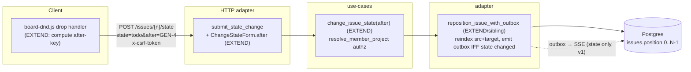
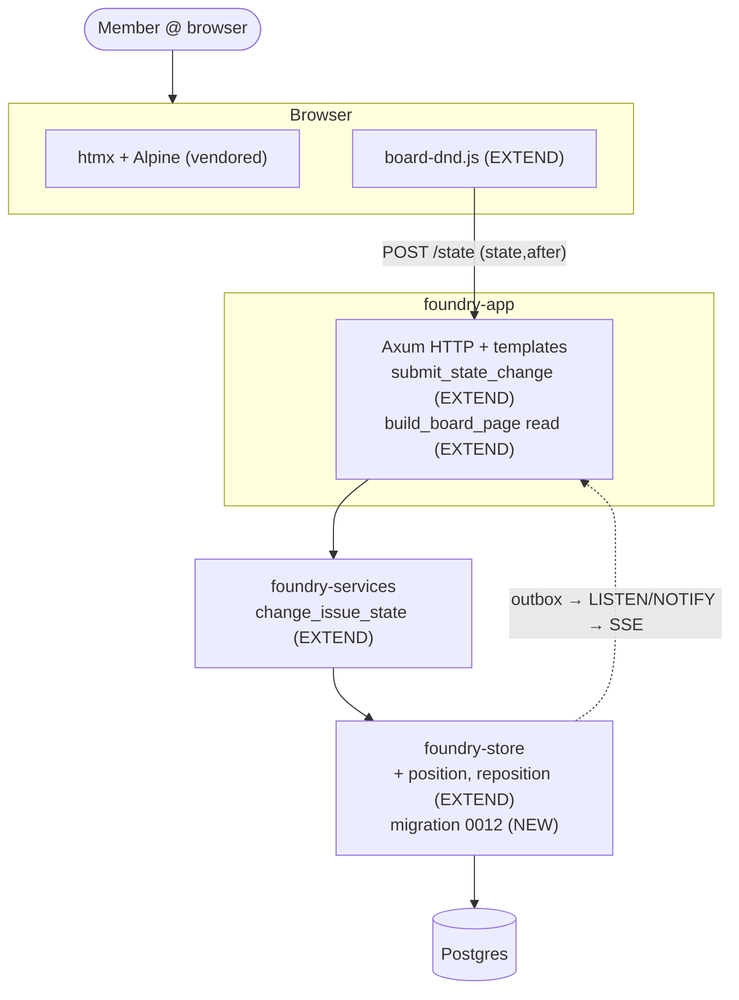

# Architecture — card-ranking-within-status

**Scope**: Application / components (extends the modular monolith; ports-and-adapters).
**Mode**: Propose (rank model + persist path user-ratified 2026-07-06).
**Paradigm**: unchanged — imperative Rust, ports-and-adapters (`foundry-services` use-cases → `foundry-store`
adapter; `foundry-app` HTTP adapter; `board-dnd.js` client enhancement). No `CLAUDE.md` paradigm change.

## Problem

The board has no persisted per-status ordering: `list_issues_by_project` reads `ORDER BY number DESC`
(`foundry-store/src/lib.rs:1246`), `build_board_page` filters that order into columns (`projects.rs:591`), and
the drop handler always `appendChild`s to the column end (`board-dnd.js:79`). We add a **persisted, shared,
per-`(project, state)` order** that a member sets by dropping a card at an exact slot — within a status (US-01)
or into another status (US-02).

## Ratified decisions (from Propose)

| ODD | Decision | ADR |
|-----|----------|-----|
| ODD-1 rank model | **Contiguous `position INTEGER` per `(project, state)`**, reindexed in one transaction per move. | ADR-001 |
| ODD-2 persist path | **Extend `POST /issues/{n}/state`** with an optional `after` neighbour key. `board-dnd.js` always sends `state` + `after`. | ADR-002 |
| ODD-3 wire format | **Neighbour issue key** (`after=<key>`; absent/empty ⇒ top of column) — race-robust, reuses the card's existing `data-issue-key`. | ADR-002 |
| ODD-4 realtime | **State-only broadcast in v1** (as today); rank/position is NOT broadcast — other viewers converge on next board load. Mirrors the `update_issue_details` precedent (`lib.rs:1323-1332`). | ADR-002 |
| ODD-5 migration + default slot | **`0012`** adds `position`, backfills via `row_number() OVER (PARTITION BY project_id, state ORDER BY number DESC)` (zero-shuffle); a **new issue lands at the top of Backlog** (position 0, column shifted +1) to preserve today's newest-first feel. | ADR-001 |
| ODD-6 a11y | **Keyboard reorder deferred** to a follow-up; v1 drag is mouse/touch only. Documented gap. | — |

## Data model

`issues` gains `position INTEGER NOT NULL DEFAULT 0`. **Invariant**: for every `(project_id, state)` the set of
`position` values is exactly the contiguous permutation `0..N-1`. Every move re-establishes the invariant for
BOTH the source `(project, old_state)` and the target `(project, new_state)` in a single transaction. Read order:
`ORDER BY position ASC, number DESC` (deterministic tiebreak; the existing per-state filter preserves it).

Index: extend the state index to cover ordering — `idx_issues_project_state` → `(project_id, state, position)`
(covers both the state filter and the ordered scan).

## Move flow (Component view)

On drop, `board-dnd.js` reads the `data-issue-key` of the card now immediately above the dropped card in the
target column and sends `after=<that key>` (absent ⇒ dropped at top). The optimistic client move + revert-on-
failure + `x-csrf-token` header are unchanged from `issue-status-move`.

Server (one transaction):
1. Resolve the issue by `key_prefix + number` → `(issue_id, project_id, old_state, old_position)`; `None` ⇒
   uniform non-enumerable refusal (ADR-003 lineage).
2. Resolve `after` key → its `position` in the target `(project, new_state)`; target index = `after.position + 1`
   (or `0` when absent). Unknown `after` key in the target ⇒ treat as top OR refuse (DELIVER: refuse to avoid a
   silent mis-drop).
3. Reindex: close the gap in the source column, open a slot in the target column, set the moved row's
   `state = new_state` and `position = target index`. Source and target both contiguous afterward.
4. Emit the `IssueUpdated` outbox row **iff `new_state != old_state`** (v1 rank-not-broadcast — see ADR-002).

## C4 — Container (unchanged topology; deltas annotated)

## Reuse Analysis (HARD GATE)

| Existing Component | File | Overlap | Decision | Justification |
|--------------------|------|---------|----------|---------------|
| Drop handler | `static/js/board-dnd.js:63` | drop target + POST state | **EXTEND** | add after-key computation + `after=` param; ~20 LOC vs a new DnD file |
| Board read | `foundry-store/src/lib.rs:1238` | reads/orders board issues | **EXTEND** | `ORDER BY position ASC, number DESC`; add `position` to backfill; no new read method |
| State write | `foundry-store/src/lib.rs:1273` (`update_issue_state_with_outbox`) | state write + outbox in a tx | **EXTEND (sibling)** | add position reindex + **conditional** emit; the current method can't express position and emits unconditionally, which would broadcast a bogus move on a pure reorder |
| State use-case | `foundry-services/src/issues.rs:100` (`change_issue_state`) | authz + normalize + delegate | **EXTEND** | thread optional `after` through; reuse `resolve_member_project` + `normalize_state` |
| Handler + form | `foundry-app/src/issues.rs:139` (`submit_state_change` / `ChangeStateForm`) | the `/state` endpoint | **EXTEND** | add `after: Option<String>` (serde default) + forward; success response unchanged (DnD only checks `response.ok`) |
| Create path | `foundry-store` `insert_issue_with_outbox` | new-issue insert | **EXTEND** | insert at top of Backlog (position 0, shift the column) in the same tx |
| Card markup | `foundry-app/src/issues.rs:532` (`render_issue_card` / `issue_card.html`) | card attrs | **REUSE (no change)** | `after` uses the existing `data-issue-key`; no new card attribute |
| Board bucketing | `foundry-app/src/projects.rs:587` (`build_board_page`) | filter issues → columns | **REUSE (no change)** | the per-state `.filter()` preserves the query's order — ordering the query is sufficient |
| Migration | `crates/foundry-store/migrations/` | — | **CREATE NEW** | `0012` adds `position` + backfill; first schema change since `0011`, unavoidable |

No unjustified CREATE NEW (the migration is inherently new schema).

## Technology choices

No new dependencies. Postgres integer column + `row_number()` backfill; sqlx transaction (already the idiom in
`update_issue_state_with_outbox`); vanilla JS (extend the existing self-contained, CSP-safe `board-dnd.js`).

## Open questions (deferred to DISTILL/DELIVER)

- Unknown-`after`-key handling (top vs non-enumerable refuse) — recommend **refuse** to avoid a silent mis-drop.
- Exact reindex SQL (gap-shift `UPDATE … WHERE position >= $` vs a `row_number()` recompute of the affected
  column) — DELIVER picks the minimal correct diff; DESIGN only fixes the contiguity invariant + single-tx.
- Concurrency: two simultaneous moves in one column. v1 = last-writer-wins under the row/column write; the tx +
  contiguity recompute keeps the column valid (no corruption), worst case a lost intended slot → re-drag. A
  `SELECT … FOR UPDATE` on the column is the escalation if it ever bites (note, not v1 requirement).
