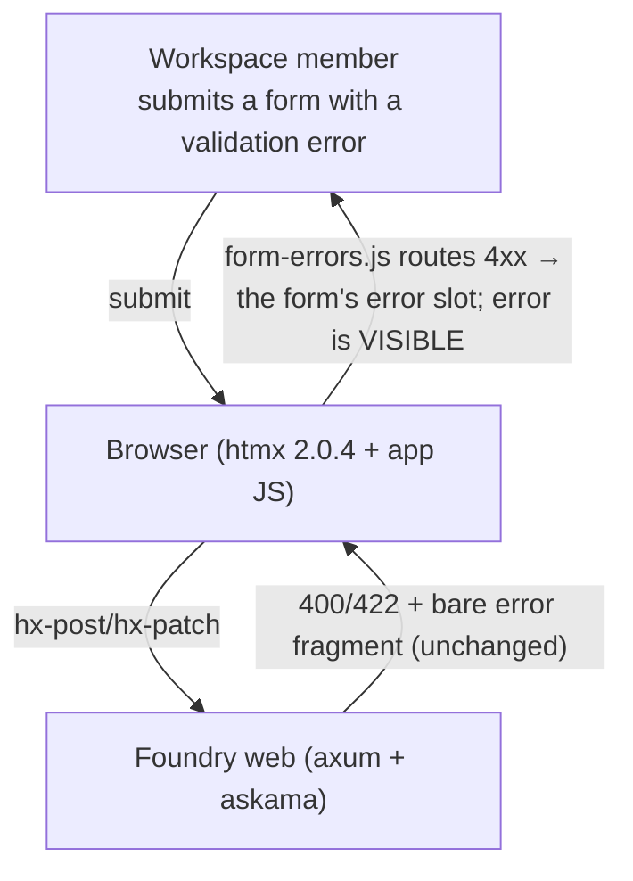
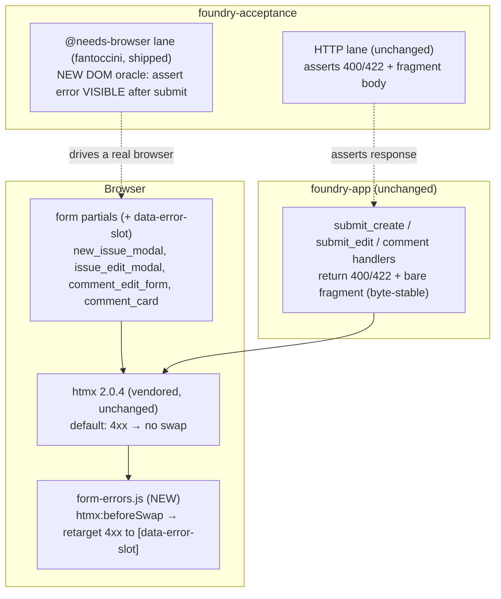
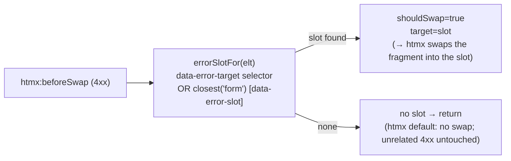

# Architecture — form-error-display-contract

Design for the RCA (`../rca/root-cause-analysis.md`), escalated design-first from `/nw-bugfix`. Ratifies ONE
canonical contract for displaying form validation errors in the browser, fixes the app-wide invisible-error
defect, and — critically — moves the acceptance oracle to the only layer that can see the fix.

## Problem (from the RCA)

htmx 2.0.4 does not swap 4xx bodies; the app ships no override/extension/handler; so validation errors returned
correctly as `400/422 + fragment` are **discarded by the browser**. `board-new-issue` D3's "the error swaps
in, visible" premise was always false. The acceptance suite asserts the HTTP **response body**, never the
**DOM**, so CI is green over it. 5 htmx forms are fully broken (issue create/edit, edit-state, comment
edit/delete); the drag-revert and comment-create edges are adjacent.

## Quality attributes driving this design

| Attribute | Priority | Consequence |
|-----------|----------|-------------|
| **Correctness of the oracle** | Highest | The defect existed *because* the test couldn't see it. The fix is meaningless without a DOM-level (browser-lane) oracle. |
| **Minimal blast radius** | Highest | One scoped mechanism; must NOT hijack the shipped 2xx/OOB flows, the drag revert, or not-found/forbidden fragments. |
| **Reuse over reconstruction** | High | The `[data-*-error]` slot idiom already ships in `csrf-upload.js`; the vanilla-JS document-delegated house style ships in `board-dnd.js`/`keyboard.js`. Invent nothing. |
| **Byte-stable server contract** | High | Handlers already return the right `400/422 + fragment`. Keep them byte-identical so every shipped HTTP oracle stays green; the fix is client-side only. |
| **No new dependency** | Medium | A ~20-line handler beats vendoring htmx's `response-targets` extension (VENDOR.md hash-pinning, supply chain). |

Paradigm: unchanged — vanilla-JS client layer (the `keyboard.js`/`board-dnd.js`/`csrf-upload.js` house idiom)
+ Rust server (unchanged). Implementation agent: `@nw-software-crafter`. No `CLAUDE.md` paradigm change.

## The contract (canonical, app-wide)

**A form that wants its validation error shown declares an error slot; a single global handler routes any 4xx
fragment into that slot.**

1. **Server** (unchanged): a validation failure returns the bare error fragment with its `4xx` status
   (`bad_request_fragment` → 400; API → 422). Byte-identical to today.
2. **Markup**: the form declares where its error goes — an empty `
` inside the form (the
   generalization of `csrf-upload.js`'s `[data-upload-error]`), or an explicit `data-error-target="#sel"`.
3. **Client** (new — `static/js/form-errors.js`): one vanilla IIFE, document-delegated `htmx:beforeSwap`
   listener. On a 4xx whose triggering element resolves to an error slot, it forces the swap into the slot
   (`shouldSwap = true; target = slot`). If no slot resolves, it does nothing — htmx's default (no swap)
   stands, so unrelated 4xx (not-found/forbidden full pages, OOB flows) are untouched.
4. **No-JS**: already satisfied — full-page POST forms re-render with their error (sign-in, project-create, …).
   This contract makes the **htmx/JS** path match the no-JS path.

Because the mechanism is `htmx:beforeSwap`, it works with the forms' existing `hx-post`/`hx-patch` — no form is
rewritten to `fetch` (unlike `csrf-upload.js`, which had to, because multipart can't set the CSRF header).

## C4 — System Context

## C4 — Container

## C4 — Component (the handler)

## Components

### NEW — `crates/foundry-app/static/js/form-errors.js`
One vanilla IIFE (`"use strict"`), external same-origin, `<script defer>` from `base.html` (line 10, beside
`board-dnd.js`/`csrf-upload.js`/`keyboard.js`). A single document-delegated `htmx:beforeSwap` listener:
- Guard: only `xhr.status` in `400..=499`. (5xx stays htmx's default — a server error is not a field error.)
- Resolve the slot from the triggering element (`evt.detail.requestConfig.elt`): an explicit
  `data-error-target="#sel"`, else the element's `closest('form')` `[data-error-slot]`.
- If a slot resolves: `evt.detail.shouldSwap = true; evt.detail.target = slot; evt.detail.isError = false`.
- If not: return — leave htmx's default untouched (this is what keeps the blast radius tiny).

### Markup — form partials gain a slot (byte-additive)
`partials/new_issue_modal.html`, `issue_edit_modal.html`, `comment_edit_form.html`, and the comment-delete
trigger in `comment_card.html` each gain an empty `

` inside the form (for the
modals, inside the `.modal-dialog` so it's visible while the modal is open). The 2xx/OOB success flows and the
`#modal-root` close-on-success behavior are **unchanged** — the handler only intervenes on 4xx.

### Server — unchanged
`bad_request_fragment` and the comment/edit validation arms keep returning `400/422 + bare fragment`,
byte-identical. This is the whole point: every shipped HTTP-lane oracle (the `"Title is required"` /
`"Description is too long"` / `issue-create-error` marker assertions) stays green; only the client changes.

### Test — the oracle moves to the browser (the non-negotiable)
Because the fix is client-side, the HTTP lane **cannot** verify it (it never runs JS). New acceptance
scenarios live in the shipped **`@needs-browser`** fantoccini lane (`support/browser_harness.rs`,
keyboard-shortcut-bindings): drive a real browser, submit an invalid form, assert the error text is **present
in the rendered DOM** and the modal stayed open. This closes RCA Root Cause B — the class of "green over an
invisible DOM" defect — for good.

## Edges (reconciled to the same contract)

- **Board drag-revert** (`board-dnd.js`): today reverts the card on `!ok` but discards the reason. Give it a
  board-level error surface — reuse the shipped OOB `#toast` region (notification-preferences-ui) for the
  transient message ("Couldn't move the issue"), since a drag error is ephemeral, not a form field to correct.
- **Comment-create** (plain POST returning a bare fragment → shell-less page): give it the same `hx-post` +
  `data-error-slot` treatment as the other forms so it joins the contract, rather than rendering a bare page.

## Cross-cutting

- **CSRF**: safer than the pre-existing intent. Swapping only the error slot leaves the form and its hidden
  `_csrf` field intact, so the retry re-submits a valid token — better than replacing `#modal-root`'s
  innerHTML (which risked dropping the token). No CSRF surface changes.
- **Scope guard**: the handler acts ONLY when a slot resolves from the triggering element, so it never hijacks
  `board-dnd.js` (not htmx), the OOB comment/attachment/state success flows, or not-found/forbidden responses.
- **No new route/endpoint/migration**; no server behavior change; latest migration stays `0014`.
- **No new dependency**; `base.html` gains one `<script defer>`.

## Slice plan (for DELIVER)

1. **Slice 01 — the contract + the instrument, proven on one surface (walking skeleton).** `form-errors.js` +
   the `@needs-browser` DOM oracle + issue-create's error slot: submit an empty title in a real browser → the
   modal stays open and "Title is required" is **visible**. Ships the mechanism AND the oracle that proves it.
   Highest learning leverage — if the beforeSwap approach or the browser oracle doesn't hold, it fails here.
2. **Slice 02 — fan out to the remaining htmx forms.** Issue edit + edit-state, comment edit, comment delete:
   each gains a slot + a browser DOM-oracle scenario. Pure application of the proven contract.
3. **Slice 03 — the edges.** Drag-revert message (OOB toast) + comment-create (htmx + slot).

DELIVER may trim to slices 01–02 (the 5 broken forms) and defer slice 03; the contract is defined regardless.
