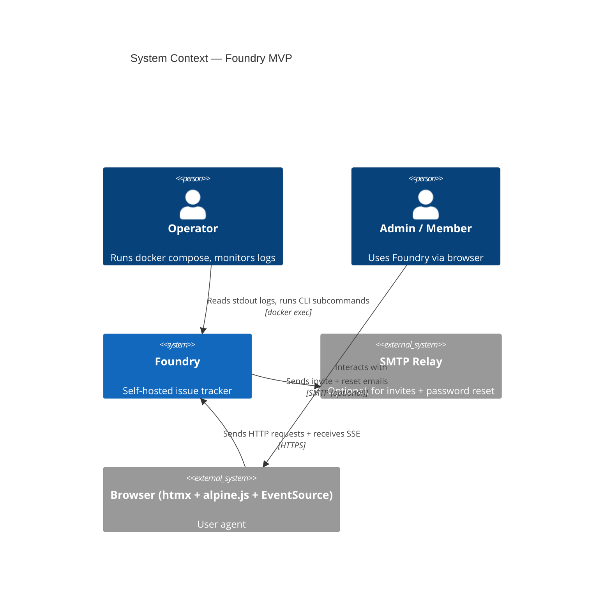
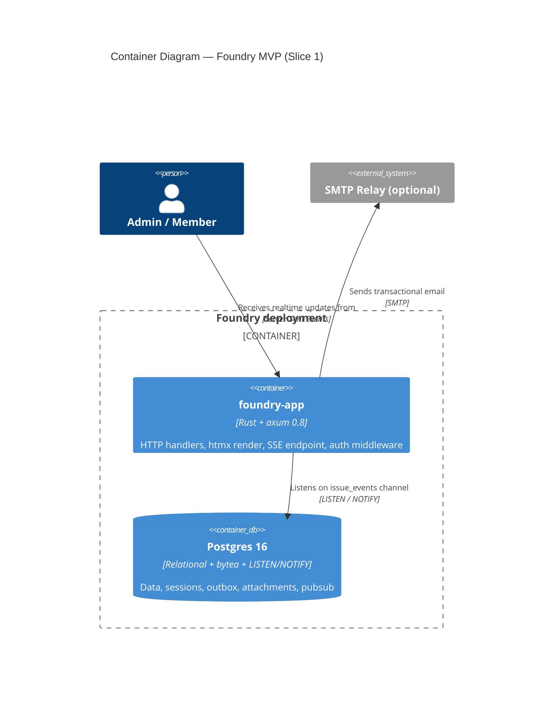
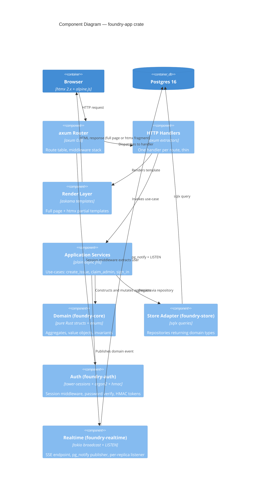

# Foundry Backend MVP — Application Architecture

Owner: solution-architect (Morgan). Companion document: `system-design.md` (system-designer) covers infrastructure (replicas, LB, backups, K8s migration). This document is the application-level view.

## TL;DR

A single Rust binary `foundry` (axum 0.8 + tokio) backed by one Postgres 16. Split across five crates in a Cargo workspace: `foundry-app` (HTTP + htmx render), `foundry-core` (domain types, no I/O), `foundry-store` (sqlx adapter), `foundry-auth` (sessions, password, tokens), `foundry-realtime` (SSE + LISTEN/NOTIFY). Templating is `askama` (compile-checked Jinja). Layered architecture with strict inward dependency: `app -> auth, realtime, store -> core`. Slice 1 ships US-01 / US-05 / US-06 / US-07 / US-08; the workspace shape stays the same as slices 2-4 land.

Five short ADRs accompany this document (`adrs/ADR-001` through `adrs/ADR-005`).

## System Context (C4 Level 1)



Notes:
- SMTP is the only **external integration** in the MVP. It is optional (operator can omit; CLI fallbacks exist for password reset). Despite being optional, it qualifies for **consumer-driven contract testing** in the platform handoff because email delivery failures are silent and high-impact.
- No third-party REST APIs, no OAuth, no analytics. Slice 1's external surface area is deliberately tiny.

## Container Diagram (C4 Level 2)



Today there is one application container. The system-designer's document covers the replica-count strategy (typically 1 - 3 replicas behind any HTTP-aware LB; no sticky sessions because of ADR-004).

## Component Diagram (C4 Level 3) — inside foundry-app



Dependency direction is enforced by the crate graph (see Workspace Shape below). The domain crate has zero I/O dependencies.

## Workspace Shape (5 crates)

```text
foundry/
  Cargo.toml                     # [workspace] members = [...]
  crates/
    foundry-app/                 # [bin] target; HTTP, routing, render, composition root
      Cargo.toml
      src/
        main.rs                  # composition root
        routes/                  # route modules: auth.rs, projects.rs, issues.rs, ...
        templates/               # askama .html templates
        middleware/              # request_id, auth, csrf
    foundry-core/                # [lib] pure domain; no tokio, no sqlx, no axum
      Cargo.toml
      src/
        workspace.rs
        team.rs
        project.rs
        issue.rs
        user.rs
        events.rs                # DomainEvent enum
    foundry-store/               # [lib] sqlx-backed repositories
      Cargo.toml
      src/
        lib.rs                   # Store struct (PgPool wrapper)
        workspaces.rs
        teams.rs
        projects.rs
        issues.rs
        users.rs
        outbox.rs
      migrations/                # sqlx-cli migration files (forward-only SQL)
        0001_init.sql
        0002_*.sql
    foundry-auth/                # [lib] sessions + password + HMAC tokens
      Cargo.toml
      src/
        sessions.rs              # tower-sessions Postgres store wiring
        password.rs              # argon2id hash/verify
        tokens.rs                # bootstrap + invite HMAC
    foundry-realtime/            # [lib] SSE + LISTEN/NOTIFY
      Cargo.toml
      src/
        publisher.rs             # pg_notify wrapper
        listener.rs              # one task per replica
        sse.rs                   # axum SSE handler
```

### Why these five crates (one paragraph each, per the brief)

**foundry-core** exists to *forbid* I/O from the domain. With sqlx and axum out of its dependency graph, a compile error tells you when a handler tries to leak a `sqlx::Row` into a domain function. It also makes test compile times fast: domain tests need only the core crate, no DB. The crate is small (target: <2k LOC) and reads as the system's data dictionary.

**foundry-store** is the only crate that knows about Postgres. It exposes repository functions (`pub async fn create_issue(pool: &PgPool, ...) -> Result<Issue, StoreError>`) returning domain types. Splitting this from `foundry-app` keeps SQL in one place and lets us swap sqlx for a different adapter without touching handlers (the trait abstraction is deferred per "no premature abstraction" — we have one implementer today; we will introduce a trait when slice 3 needs an S3 attachment backend alongside the bytea one).

**foundry-auth** owns the security-sensitive code (password hashing, HMAC, session cookies, brute-force delay). Cordoning it off makes the audit surface small: a security review can read this crate in an afternoon. It depends on `foundry-core` (for `User`, `Session` types) and on the tower-sessions Postgres store wiring (so it touches `sqlx::PgPool` indirectly, which is acceptable — the alternative is wiring tower-sessions in `foundry-app`, which scatters auth concerns).

**foundry-realtime** is the one place that knows about LISTEN/NOTIFY. It exposes a `Publisher` (call `publish(event)` from a service) and an axum `SseHandler`. Keeping it as its own crate lets us replace LISTEN/NOTIFY with a different broker later without touching domain or handlers — but again, no trait abstraction until we have two implementations.

**foundry-app** is the composition root: it wires all the above together in `main.rs`, owns route definitions, owns templates, and is the only crate that depends on axum directly. Handlers are thin: extract -> call application service -> render. Keeping templates here (rather than in a separate `foundry-web` crate) is a taste call — it keeps the "render a page" mental model in one place and makes most user-visible bug fixes single-crate.

### Approachability check

A Rust developer reading `main.rs` should see the full system in one screen: a router with route handlers, a `PgPool`, a `Publisher`, a tower-sessions store. That is the test for ADR-001's claim. If the file grows beyond ~200 lines, we have over-engineered.

## Layered Architecture & Dependency Direction

```text
                         +------------------+
                         |   foundry-app    |  (HTTP, routing, render)
                         +--------+---------+
                                  |
              +-------------------+--------------------+
              |                   |                    |
     +--------v-------+   +-------v--------+   +-------v---------+
     | foundry-auth   |   | foundry-store  |   | foundry-realtime|
     +--------+-------+   +-------+--------+   +--------+--------+
              |                   |                     |
              +-------------------+---------------------+
                                  |
                          +-------v-------+
                          | foundry-core  |   (no I/O)
                          +---------------+
```

Allowed dependencies: any crate may depend on `foundry-core`. `foundry-app` may depend on the other three. The three middle crates do **not** depend on each other (auth never imports store; realtime never imports auth). If a use-case needs both auth and store, the wiring happens in an application service in `foundry-app`.

### Enforcement

Per principle 11 (enforceable architecture rules), we will enforce these dependency rules with **`cargo-deny`'s `bans` section** to forbid `foundry-store` from appearing in `foundry-auth`'s dependency tree, etc. Additionally, **`cargo-modules`** (or a small custom check script in `xtask/`) is run in CI to detect forbidden `use foundry_store::...` statements inside `foundry-core` source files. A pre-commit hook is wired to a `make check-arch` target so the rule is detected before push, not at PR review.

`foundry-core` has a smaller belt-and-suspenders check: its `Cargo.toml` lists only `serde`, `thiserror`, `uuid`, `time`, `secrecy`. No `sqlx`, no `axum`, no `tokio`. The dependency graph itself enforces the rule.

## End-to-end Trace: "User files an issue"

This trace shows the request path for US-08 (the JTBD hot path). It is the canonical example for how handlers, services, domain, and store collaborate.

```mermaid
sequenceDiagram
    autonumber
    participant B as Browser (htmx)
    participant R as axum Router (foundry-app)
    participant M as Session Middleware (foundry-auth)
    participant H as POST /issues handler (foundry-app)
    participant S as create_issue service (foundry-app)
    participant D as Issue::create (foundry-core)
    participant ST as IssueStore (foundry-store)
    participant PG as Postgres
    participant P as Publisher (foundry-realtime)

    B->>R: POST /issues (hx-post, form body, X-CSRF, Cookie)
    R->>M: pass through session middleware
    M->>PG: SELECT session WHERE id = $1
    PG-->>M: session row -> User
    M-->>R: req.extensions.insert(AuthUser)
    R->>H: dispatch with AuthUser, Form, CsrfToken
    H->>H: validate CSRF, parse form
    H->>S: create_issue(user, project_id, payload)
    S->>D: Issue::create(...) returns Issue + DomainEvent::IssueCreated
    S->>ST: store.issues.insert(&issue)
    ST->>PG: BEGIN; INSERT issues; UPDATE projects.next_issue_number; INSERT outbox; COMMIT
    PG-->>ST: row count + assigned issue_key (e.g. AUTH-1)
    ST-->>S: Ok(Issue)
    S->>P: publish(DomainEvent::IssueCreated{project_id, issue_id, ...})
    P->>PG: SELECT pg_notify('issue_events', $payload)
    S-->>H: Ok(Issue)
    H->>H: render askama template "issue_card.html" (PARTIAL, not full page)
    H-->>R: Html(<li id="issue-AUTH-1">...</li>)
    R-->>B: 200 OK, HX-Trigger: issueCreated; body = fragment
    B->>B: htmx swap into #backlog-column; alpine.js fires toast
```

Important properties of this trace:

- **Single transaction** for the write: issue insert + project sequence bump + outbox row are atomic. The `pg_notify` is *outside* the transaction (per Postgres semantics, NOTIFY fires at commit). If commit fails, no notification is sent.
- **Outbox row is inserted in the same transaction.** This means slice 2's realtime story degrades gracefully: if `pg_notify` is lost or a replica restarts mid-listen, we still have the outbox table as the durable record. Slice 2 may add a poll-the-outbox fallback; slice 1 doesn't need it but the column is already there.
- **The handler renders a fragment, not a page.** htmx swaps it into the existing DOM. This is the difference between a full GET to `/projects/auth-v2` (which renders the whole board) and a POST to `/issues` (which renders one `<li>`). See `data-access.md` for how askama makes both paths reuse the same `issue_card.html` partial.
- **No `sqlx::Row` ever leaves `foundry-store`.** The repository function returns `Result<Issue, StoreError>` where `Issue` is from `foundry-core`. Handlers cannot accidentally couple to the database schema.

## Quality Attribute Strategy (ISO 25010 highlights)

| Attribute | Strategy | Evidence in slice 1 |
|---|---|---|
| Performance Efficiency (NFR-PERF-01) | Server-render with askama (compile-time templates, no runtime parse); single round-trip handlers; sqlx prepared statements; connection pool per replica. | Issue card render is a single `INSERT...RETURNING` then a partial render. Target: P95 ≤ 200ms, internal stretch ≤ 50ms. |
| Reliability (NFR-AVAIL-01..03) | Stateless app tier (Postgres sessions). Graceful shutdown (SIGTERM -> `/readyz` 503 -> drain). SSE auto-reconnect by browser default. | tower-sessions Postgres store; axum 0.8 has a clean `Serve::with_graceful_shutdown` pattern. |
| Security (NFR-SEC-01..06) | argon2id; HttpOnly Secure SameSite=Lax cookies; HMAC for one-shot tokens; CSRF double-submit; default-deny authorization in middleware; HTML sanitization via ammonia. | See `auth.md` for full design; `error-and-observability.md` for the authorization middleware. |
| Maintainability | Crate boundary enforcement (above); thin handlers; pure domain; ADRs for every reversibility-relevant choice. | 5 ADRs filed in this design wave. |
| Portability (NFR-PORT-01) | No host volumes for the app container; all state in Postgres named volume; config via env. | docker-compose written without `bind` mounts; K8s manifest port is mechanical. |

## Integration Patterns & API Contracts

- **Browser <-> Foundry**: HTTPS with form-encoded bodies and htmx headers (`HX-Request`, `HX-Target`, `HX-CSRF`). Responses are either full HTML pages or fragments depending on `HX-Request` header. No JSON API in MVP.
- **Foundry <-> Postgres**: sqlx over `tokio-postgres`. Two pools per replica are *not* needed; one pool for queries plus one dedicated single-connection task for `LISTEN issue_events` (a `LISTEN`-ing connection cannot be returned to the pool).
- **Foundry <-> SMTP**: lettre crate with SMTP transport. Synchronous send within a handler is acceptable for slice 1 (admin invite, password reset are low-frequency). If we see issues, move to outbox-driven async send in slice 2 (cost: tiny, contract unchanged).
- **Browser <-> Foundry (SSE)**: `GET /projects/:id/events` with `text/event-stream`. Server filters events by project_id before write.

## Cross-cutting Constraints Carried Forward (slices 2-4)

These are flagged here so slice-1 choices do not foreclose them:

- **Slice 2 SSE fanout**: each replica must own one Postgres LISTEN connection and broadcast locally via `tokio::sync::broadcast`. Slice 1 establishes the outbox row + `pg_notify` call inside `create_issue`. The SSE endpoint and per-replica listener are slice 2; slice 1 has the publisher.
- **Slice 3 backup completeness**: the `issue_attachments` table will store `bytea`. Slice 1 must not introduce a sessions table that is excluded from `pg_dump`, or a side-channel file write. The `foundry-store` discipline ("all state in Postgres") makes this trivial.
- **Slice 3 upgrade safety**: every migration is forward-only and advisory-locked from day one (NFR-MIG-01). The first migration `0001_init.sql` already exercises the pattern.
- **Slice 4 contributor onboarding**: the workspace shape is the README's map. A contributor opening `crates/foundry-core/src/issue.rs` should be able to read the whole domain in under an hour.

## Open Coordination Questions for system-designer

These are application choices with infrastructure implications. The system-designer owns the resolution.

1. **No sticky sessions.** Sessions are validated server-side via Postgres lookup on every request. Any LB strategy that round-robins is fine; affinity is unnecessary. (Implication: cheaper LBs, simpler K8s ingress.)
2. **One LISTEN connection per replica.** Postgres' `max_connections` budget must include `N_replicas * (pool_size + 1)`. With default pool=10 and 3 replicas, that's 33 + system overhead. Postgres default `max_connections=100` is comfortable; document this in the system-designer's capacity section.
3. **SSE long-lived connections.** Each connected browser holds one TCP connection per project page. LBs with idle-timeout < 60s will kill these; need a `keep-alive` heartbeat (every 15s) in the SSE stream, AND the LB needs `read_timeout >= 60s`. We will emit the heartbeat in `foundry-realtime`; system-designer chooses LB defaults to match.
4. **Graceful shutdown window.** SIGTERM -> 15s drain (NFR-AVAIL-02). K8s `terminationGracePeriodSeconds` must be >= 20s. We will not initiate graceful shutdown from the app on its own; we obey signals.
5. **bytea attachments in pg_dump.** A 100 MB bytea will inflate pg_dump output by ~133% (base64 encoding overhead in `pg_dump -Fp`). System-designer should default backup format to `-Fc` (custom, compressed binary). Slice-3 concern; flagged early.
6. **Single binary, no separate worker.** Cron-style cleanup (expired bootstrap tokens, expired sessions, expired reset tokens) runs as a background tokio task **in every replica**, guarded by a Postgres advisory lock so only one replica actually runs the cleanup at a time. System-designer does not need a separate CronJob in K8s.

---

See companion documents:
- `domain-model.md` — slice 1 aggregates and invariants
- `data-access.md` — sqlx strategy, migrations, advisory locks
- `auth.md` — sessions, bootstrap, invites, HMAC tokens
- `realtime-roadmap.md` — what slice 1 sets up for slice 2's SSE
- `error-and-observability.md` — error types, request_id, tracing
- `adrs/ADR-001.md` through `adrs/ADR-005.md` — decision records
