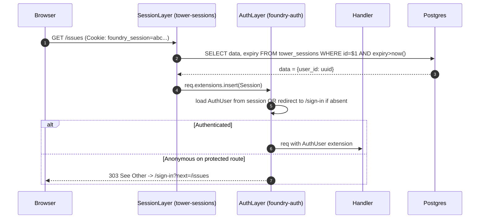

# Foundry MVP — Authentication & Authorization Design

Scope: US-05 (bootstrap + invite), US-06 (sign in). All authentication code lives in the `foundry-auth` crate. Session storage and OIDC delegation (deferred to v0.3) are explicitly addressed at the boundaries so they layer on without restructuring.

## Building Blocks (Crates)

| Concern | Crate | License | Why |
|---|---|---|---|
| Session middleware + cookie | `tower-sessions` 0.13+ | MIT | Mature, axum-native, swappable backends. |
| Session backend | `tower-sessions-sqlx-store` (Postgres feature) | MIT | DIVERGE choice: keeps state in Postgres (no Redis). |
| Password hashing | `argon2` 0.5+ | MIT/Apache-2.0 | Pure-Rust, OWASP-recommended algorithm. |
| Secret material handling | `secrecy` 0.8+ | MIT/Apache-2.0 | Zeroizes on drop, prevents accidental Debug-logging. |
| HMAC tokens | `hmac` + `sha2` | MIT/Apache-2.0 | RustCrypto. Trivial to use; constant-time compare via `subtle`. |
| CSRF | hand-rolled double-submit (~50 LOC) | n/a | tower-csrf exists but is overkill; double-submit cookie + hidden form field is well-trodden. |
| Email (slice-1 invite/reset) | `lettre` 0.11+ with `smtp-transport` | MIT/Apache-2.0 | Battle-tested. |

All licenses pass NFR-SEC-08 (`cargo deny check licenses`).

## Sessions

### Cookie design (NFR-SEC-03)

- **Name**: `foundry_session`
- **Value**: opaque 32-byte URL-safe random token (the session ID). Never contains user data.
- **Flags**: `HttpOnly`, `Secure` (toggle via `SESSION_COOKIE_SECURE` env, default `true`), `SameSite=Lax`.
- **Path**: `/`
- **Max-Age**: 30 days (NFR-SEC-03).
- **Domain**: not set (defaults to the request host, locking to the exact domain).

### Server-side row

`tower-sessions-sqlx-store` manages a `tower_sessions` table:

```text
tower_sessions (
    id TEXT PRIMARY KEY,        -- the cookie value
    data BYTEA NOT NULL,        -- bincode-encoded session data
    expiry_date TIMESTAMPTZ NOT NULL
)
```

We store **only the user_id** in the session data (`{user_id: Uuid}`). Workspace and team memberships are looked up on each request from `workspace_memberships` and `team_memberships`. Rationale: session rotation (e.g., the user is removed from a workspace) takes effect immediately on the next request without needing to invalidate all of that user's sessions.

### Why Postgres (not encrypted cookie, not Redis)

See `adrs/ADR-004.md` for the full comparison. Summary:

- **Encrypted cookies** (no server-side row) mean rotation requires either an extra revocation list or a cookie-secret rotation that logs everyone out. Both undermine NFR-SEC-07's "rotation should not require logout."
- **Redis** adds a second stateful container. NFR-DATA-01 ("all state in Postgres") forbids it; NFR-DEV-01 (10-min onboarding) discourages it.
- **Postgres** has an indexed PK lookup latency of ~1ms with hot cache; well within NFR-PERF-01 budgets.

### Middleware flow



The `AuthLayer` runs after `SessionLayer` and is responsible for:
1. Extracting `user_id` from the session.
2. Loading the `User` row (cached briefly per request, ~1ms).
3. Inserting an `AuthUser { user_id, workspace_role, team_memberships }` into request extensions.
4. For routes marked `protected`, redirecting anonymous users to `/sign-in`.

### Sign-out

`POST /sign-out` deletes the server-side row and clears the cookie. NFR-SEC-03 requires server-side invalidation, not just cookie deletion — the row delete is the canonical "user said goodbye." Replays of the cleared cookie hit the `tower_sessions` lookup, find nothing, are treated as anonymous.

## Password Handling

### Hashing parameters (NFR-SEC-01)

Argon2id with `m=64 MiB, t=3, p=1` (OWASP 2026 recommended minimum). Encoded as a single constant in `foundry-auth/src/password.rs`:

```rust
// crates/foundry-auth/src/password.rs (illustrative)
pub const ARGON2_PARAMS: Params = Params::new(64 * 1024, 3, 1, None).unwrap();
```

`Params` is from the `argon2` crate. Parameter bumps are PRs against this constant; the `0001_init.sql` users.password_hash column stores the full `$argon2id$v=19$m=65536,t=3,p=1$salt$hash` encoded string, so a parameter bump does not invalidate existing hashes — old hashes are accepted via `argon2::PasswordVerifier::verify_password` which reads the parameters from the stored string.

### Verify-then-rehash

On successful sign-in, if the stored hash parameters are below the current `ARGON2_PARAMS`, rehash with the new parameters and update the row. This automates parameter bumps without forcing a global reset.

### Brute-force protection (NFR-SEC-02)

A `signin_attempts` table tracks the last 15 minutes of attempts per email_lower. On sign-in:

1. Count failed attempts for this email in the last 15 minutes.
2. If `count >= 5`, insert an artificial delay of 5 seconds before responding (using `tokio::time::sleep`).
3. Either way, record the attempt outcome.

Delay-not-lockout per NFR-SEC-02 rationale: lockouts enable trivial denial-of-service against legitimate users (an attacker who knows your email locks you out forever).

### Constant-time email check

Whether or not the email exists, the sign-in handler runs the same argon2 verify against a known-bad hash to keep timing within ~50ms of the real path. Otherwise, attackers learn "this email exists" from the response time. Per the OWASP cheat sheet pattern.

### Logging hygiene

Passwords and HMAC keys are wrapped in `secrecy::Secret<T>`. `secrecy::Secret` cannot be printed via `Debug` or `Display` (compile-time error); any panic backtrace shows `Secret([REDACTED])`. NFR-OBS-01's structured logs receive only `user_id`, `email_lower_hash`, never the password.

## Bootstrap Token Flow (US-01 + US-05)

```mermaid
sequenceDiagram
    autonumber
    participant Op as Operator
    participant App as foundry-app (startup)
    participant PG as Postgres
    participant B as Browser

    Op->>App: docker compose up
    App->>App: migrations run, then check if any workspace exists
    alt No workspace yet
        App->>App: generate raw_token = random(32 bytes URL-safe)
        App->>PG: INSERT INTO bootstrap_tokens (id, token_hash, expires_at) VALUES ($id, sha256(raw_token), now()+30min)
        App->>Op: stdout: [BOOTSTRAP] Visit http://host:port/bootstrap?token={raw_token}
    end
    Op->>B: clicks bootstrap link
    B->>App: GET /bootstrap?token=xxx
    App->>App: hash = sha256(token); lookup bootstrap_tokens WHERE token_hash = hash AND used_at IS NULL AND expires_at > now()
    alt Found
        App-->>B: HTML form for admin claim
        B->>App: POST /bootstrap with email, password, display_name, workspace_name
        App->>PG: BEGIN
        App->>PG: UPDATE bootstrap_tokens SET used_at=now() WHERE token_hash=$hash AND used_at IS NULL  -- single-use guard
        App->>PG: assert affected_rows == 1
        App->>PG: INSERT workspaces, users (admin), workspace_memberships (role=admin), teams (General), projects (Sandbox)
        App->>PG: COMMIT
        App-->>B: 303 -> / with session cookie set
    else Not found / used / expired
        App-->>B: 410 Gone with explanatory page
    end
```

Key properties:

- **Raw token is never persisted.** Only `SHA-256(raw)` lives in the DB. Even a Postgres backup leak does not let an attacker reuse it.
- **Single-use is enforced by `UPDATE ... WHERE used_at IS NULL` then asserting one row updated.** This is atomic. Two concurrent claims race; one wins, the other sees zero updated and errors.
- **Token issuance is at first startup only.** A subsequent `docker compose up -d` sees a workspace already exists and emits no new token (US-01 AC). If an admin loses access, the `foundry admin reset-bootstrap` CLI subcommand can mint a new one (slice-3 ops feature).
- **TTL of 30 minutes** balances "operator may step away to coffee" with "leaked token expires soon."

### Why HMAC at all? (the URL itself is the secret)

The bootstrap token is a long random string compared by hash; HMAC adds nothing here. We use a plain random token + SHA-256 lookup. (Contrast with the invite link below, where we *do* want stateless HMAC verification for link-only invites.)

## Invite Flow (US-05)

Two flavors:

### Email invite (SMTP configured)

```mermaid
sequenceDiagram
    autonumber
    participant Ad as Admin
    participant App as foundry-app
    participant PG as Postgres
    participant SMTP as SMTP relay
    participant Inv as Invitee

    Ad->>App: POST /invites {email: "mei@acme.com"}
    App->>PG: INSERT invites (id, workspace_id, invitee_email, expires_at=now()+7d)
    App->>SMTP: send email to mei@acme.com containing link /invites/accept?id={invite_id}&sig={hmac}
    SMTP-->>Inv: email delivered
    Inv->>App: GET /invites/accept?id=...&sig=...
    App->>App: verify hmac(SESSION_SECRET, invite_id || expires_at)
    App->>PG: SELECT * FROM invites WHERE id=$1 AND used_at IS NULL AND expires_at>now()
    App-->>Inv: HTML signup form
    Inv->>App: POST signup
    App->>PG: BEGIN; UPDATE invites SET used_at=now(), used_by=$user_id WHERE id=$1 AND used_at IS NULL; assert one row; INSERT users; INSERT workspace_memberships; COMMIT
    App-->>Inv: 303 -> / with session cookie
```

### Link-only invite (no SMTP, just copy-paste a URL)

The invite row is still created (for audit + single-use enforcement), but the URL is shown to the admin to copy into Slack. Same `sig` verification. Same single-use update guard.

### Why HMAC the URL params (in addition to the DB row)?

The DB row alone is sufficient for security (look up by `id`, check not-used, check not-expired). But the HMAC `sig` lets us **reject obviously tampered URLs without a DB hit** (cheap rate-limit). It is defense-in-depth, not the primary control. Constant-time compare via `subtle` crate.

### Single-workspace constraint

US-05 AC: "Multi-workspace per instance is explicitly out of scope; second-workspace creation returns 409." The bootstrap path explicitly creates the workspace; the invite path does *not* allow workspace creation, only joining the existing workspace.

## CSRF (NFR-SEC-04)

Double-submit cookie pattern, hand-rolled (~50 LOC in `foundry-auth/src/csrf.rs`):

1. On any GET that renders a form, set a cookie `foundry_csrf={random32}` (HttpOnly=FALSE so alpine.js can read it; SameSite=Lax; Secure).
2. The template includes a hidden input `<input type="hidden" name="_csrf" value="{token}">`. For htmx calls, an alpine.js hook reads the cookie and sets `HX-CSRF: {token}` header.
3. CSRF middleware on POST/PUT/PATCH/DELETE compares the cookie value to either the hidden input OR the `HX-CSRF` header (constant-time compare). Reject with 403 on mismatch.

We do not use the `axum-csrf` crate — its API is heavier than needed and it pulls in template-engine-specific helpers we do not want. ~50 LOC of our own is cleaner.

## Authorization Middleware (NFR-SEC-06)

Default-deny. Every route is one of:

- **Public**: `/sign-in`, `/bootstrap`, `/invites/accept`, `/healthz`, `/readyz`. No auth check.
- **Authenticated**: requires a session. Middleware redirects to `/sign-in` if anonymous.
- **Workspace-member**: authenticated + must be a member of the request's workspace (extracted from path).
- **Team-member**: workspace-member + must be a member of the team identified in the path.
- **Admin**: workspace-member with role=`admin`.

Implementation: an `axum::middleware::from_fn` per route group. The route table in `foundry-app/src/main.rs` makes the protection level visible at a glance.

Example (sketch):

```rust
Router::new()
    .nest("/", public_routes())
    .nest("/", authenticated_routes().layer(require_session()))
    .nest("/team/:team_slug", team_routes().layer(require_team_membership()))
    .nest("/admin", admin_routes().layer(require_admin()))
    .layer(session_layer)
    .layer(csrf_layer)
    .layer(request_id_layer)
```

Reading the router tells a reviewer "here is what each path requires."

## Password Reset (NFR-SEC-06 + US-06)

Same pattern as invite-by-email:

- `reset_tokens (token_hash, user_id, expires_at, used_at)` — token hash, not raw.
- 1-hour TTL, single-use, single-row-affected check on consumption.
- If SMTP not configured, `foundry admin reset-password <email>` CLI generates a temp password and prints it to stdout for the admin to convey out-of-band; flagged in `users` as `force_password_change=true` so the next sign-in mandates a change.

## Forward-compat: OIDC mode in v0.3

The `foundry-auth` crate exposes one entry point: `authenticate(req) -> Result<AuthUser>`. In MVP, the only implementation reads the session cookie. In v0.3, an OIDC flow runs in parallel: an OIDC callback handler creates the same kind of session row from the OIDC userinfo claims, then issues the same `foundry_session` cookie. The session backend, cookie shape, and downstream middleware do not change. We add a sign-in screen toggle.

Because session data is server-side and minimal (`{user_id: Uuid}`), nothing in the downstream layers knows or cares whether the user got a session via password or OIDC. This is the payoff for keeping session data thin.

## External Integration Note (for system-designer + platform-architect)

**SMTP** is the one external integration in slice 1 (US-05, US-06). Per principle 10, this should be annotated for **consumer-driven contract testing** in the platform handoff:

> External Integrations Requiring Contract Tests:
> - SMTP relay (SMTP / RFC 5321): Foundry consumes `MAIL FROM`, `RCPT TO`, `DATA` exchanges via the lettre crate.
>   Recommended: pact-rust does not exist mature in 2026; instead use a **GreenMail** or **MailHog** container in the CI acceptance stage and run a contract suite that asserts (a) `Subject` line shape, (b) HTML+plaintext multipart structure, (c) sender header format. Failure mode: email is silently dropped — high-impact, low-detection.

## Probes (Earned Trust — principle 12)

Per principle 12, every adapter that depends on something external must declare a probe. For slice 1:

- **PostgresStore.probe()** — at startup the composition root invokes `store.probe()` which: (a) opens a connection, (b) runs `SELECT 1`, (c) calls `SELECT pg_notify('probe_channel', 'ping')` while a temp LISTEN is subscribed, asserts round-trip <100ms, (d) verifies `_sqlx_migrations` table exists and last migration matches expected version. Failure emits `health.startup.refused {reason: 'postgres_probe_failed', detail: ...}` and exits non-zero. Fault injections to test: stale DB (older schema version), DB-up-but-NOTIFY-disabled (some managed-PG variants), DB-readonly (failover replica).
- **SmtpSender.probe()** — if SMTP is configured (`SMTP_HOST` set), the composition root invokes `smtp.probe()` which: (a) opens a TCP+TLS connection to the configured `SMTP_HOST:PORT`, (b) runs `EHLO`, (c) does NOT send a message. Failure logs `health.startup.warning {reason: 'smtp_probe_failed'}` but does **not** refuse startup — SMTP is optional and the CLI fallback exists. The warning state is exposed via `/readyz` as a structured body field, not a 503.
- **SessionStore.probe()** — already covered by PostgresStore.probe (sessions are a table in the same database).

Probe enforcement (principle 12c): a small custom `xtask/check_probes.rs` AST walker asserts that every type implementing the `Adapter` trait in `foundry-store` and `foundry-auth` exposes a `probe(&self) -> Result<ProbeReport, ProbeError>` method. This runs as a pre-commit hook AND in CI.

This is slice-1 small; the principle scales as adapters are added.
