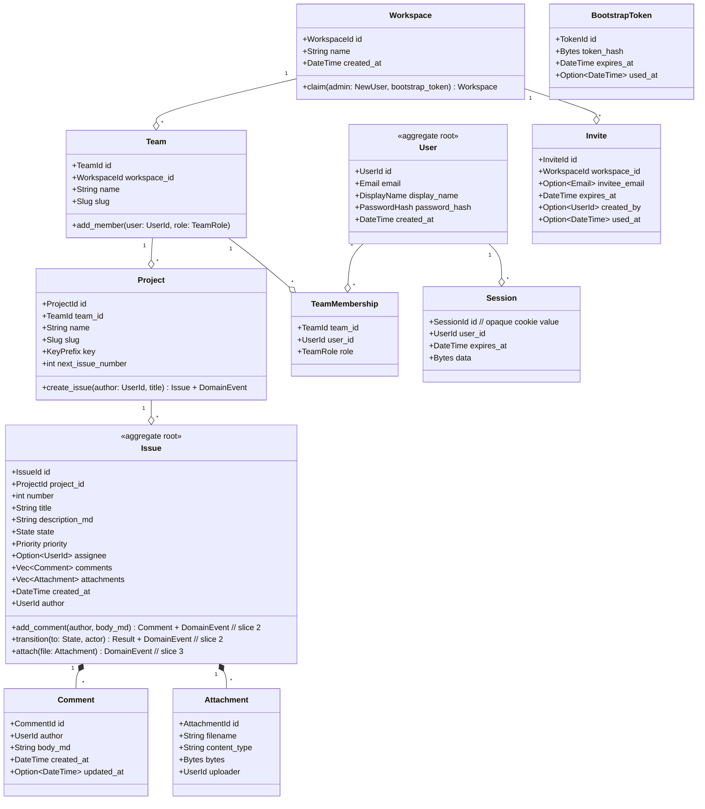

# Foundry MVP — Domain Model (Slice 1)

Scope: aggregates, value objects, invariants needed for US-01, US-05, US-06, US-07, US-08. Forward-compatible with US-09 / US-10 (comments + state transitions) and US-11 (attachments) without redesign.

## Ubiquitous Language

From `stories.md` glossary, restated for the domain layer:

- **Workspace** — top-level tenant. MVP enforces *one workspace per Foundry instance* (US-05 AC). Multi-tenancy is post-v1.
- **Team** — sub-group within a workspace. Has zero or more members. Admins create teams.
- **Project** — named container of issues; belongs to exactly one team. Has a *key prefix* (2-6 uppercase chars) used in issue keys.
- **Issue** — unit of work; belongs to exactly one project. Has a sequential `number` per project, rendered as `{project.key}-{number}`.
- **State** — fixed enum for slice 1: `Backlog | Todo | InProgress | Done | Cancelled`. Custom workflows deferred to v0.4 (out of scope).
- **Priority** — fixed enum: `Urgent | High | Medium | Low | NoPriority`. Default `Medium`.
- **User** — authenticated principal. Has zero or more workspace + team memberships.
- **Session** — server-side row keyed by cookie value; owned by a `User`.
- **Invite** — server-side row for email-based invites; HMAC token for link-based invites is stateless (no row).
- **BootstrapToken** — single-use, signed, 30-min TTL, stored in `bootstrap_tokens` table.

## Aggregate Diagram (Class-style)



## Aggregate Roots vs Value Objects vs Entities

| Type | Classification | Rationale |
|---|---|---|
| `Workspace` | Aggregate root | Owns the team/project/issue tree by reachability; consistency boundary for "is this user allowed in this workspace?" In MVP there is exactly one. |
| `Team` | Entity inside Workspace aggregate (but persisted independently) | Created/named independently; membership decisions don't need to lock the whole workspace. Treated as its own root for persistence and authorization. |
| `Project` | Entity inside Team aggregate (persisted as its own row) | The project's `next_issue_number` is the key consistency invariant — incrementing it must be transactionally safe (see below). |
| `Issue` | **Aggregate root** | Comments and attachments are consistency-bound to the issue: marking an issue deleted should hide its comments transactionally. The issue owns its comment + attachment collections. |
| `Comment` | Entity inside Issue aggregate | Lifecycle (create, edit, soft-delete) goes through `Issue` methods to preserve invariants (e.g., only author or admin can edit). |
| `Attachment` | Entity inside Issue aggregate | Same pattern as comments. The bytea bytes are stored in Postgres but conceptually owned by the issue. |
| `User` | **Aggregate root** | Independent lifecycle; user can exist before joining any team. Password change, email change live here. |
| `Session` | Entity (owned by tower-sessions, not by domain) | Persistence is delegated to `tower-sessions-sqlx-store`. The domain layer references `UserId` only; it does not model Session as a first-class aggregate. |
| `Invite` | Entity inside Workspace aggregate | Lifecycle: create, redeem, expire. |
| `BootstrapToken` | Entity (lives outside any aggregate — instance-level) | Singleton-ish: created at first startup, redeemed once, then irrelevant. Stored as a row for the single-use invariant. |
| `Email`, `Slug`, `KeyPrefix`, `DisplayName`, `PasswordHash` | **Value objects** | Immutable, validated in constructor (`Email::parse(s) -> Result`), no identity. Implemented as newtypes around `String` in `foundry-core`. |
| `IssueId`, `UserId`, `ProjectId`, ... | Value objects (newtype `Uuid`) | UUIDv7 (time-ordered, cache-friendly inserts). Constructors disallow nil UUIDs. |
| `State`, `Priority`, `TeamRole` | Value objects (enums) | Closed sets, no extensibility in MVP. |

### Why `Issue` is the aggregate root (and Project is not its root)

If `Project` were the root, every comment write would need to load the whole project (and all its issues) to mutate one issue. By making `Issue` the root, the consistency boundary shrinks to "this one issue and its comments + attachments." Project participates only at issue creation time (to allocate the next issue number — an explicit transactional dance documented below).

## Invariants (Slice 1)

### Workspace
- **I-W1**: Exactly one workspace exists per Foundry instance for MVP. Creating a second returns `409 Conflict` (US-05 AC). Enforced by a unique partial index on `workspaces(true)` (Postgres trick: `CREATE UNIQUE INDEX ON workspaces ((true))`).
- **I-W2**: A workspace must have at least one admin user at all times. Removing the last admin is rejected at the service layer.

### Team
- **I-T1**: Team `slug` is unique within a workspace.
- **I-T2**: Team membership (`(team_id, user_id)`) is unique.

### Project
- **I-P1**: Project `slug` is unique within a team.
- **I-P2**: Project `key` (prefix) is unique within a workspace. Two teams cannot both have a project with key `AUTH`.
- **I-P3**: `key` matches regex `^[A-Z]{2,6}$`.
- **I-P4**: `next_issue_number >= 1` always.

### Issue
- **I-I1**: `(project_id, number)` is unique. Enforced by Postgres unique index AND by the allocation protocol (below).
- **I-I2**: Title is non-empty, <= 256 chars (validated in `Issue::create`).
- **I-I3**: Issue belongs to exactly one project; project_id is immutable after creation (no cross-project moves in MVP).
- **I-I4**: `state` is one of the closed enum values; transitions enforced by `Issue::transition()` method (slice 2). Slice 1 allows direct construction in `Backlog` state only.
- **I-I5**: `description_md` is bounded (256 KB ceiling) and rendered through `pulldown-cmark` + `ammonia` at display time, never stored as HTML.

### User
- **I-U1**: Email is unique (case-insensitive).
- **I-U2**: `password_hash` is a verified-shape argon2id string at construction time.
- **I-U3**: `display_name` is 1-64 chars, no leading/trailing whitespace.

### BootstrapToken & Invite
- **I-B1**: BootstrapToken is single-use (`used_at IS NULL` is checked then set in the same transaction as admin claim).
- **I-B2**: Invite (email-bound) is single-use (`used_at IS NULL` -> set on signup); link-only invites are stateless HMACs, single-use enforced by including the redeemed user-email in a `used_invites` blocklist row on first use.

## Sequential Issue Number Allocation — the only tricky invariant

US-08 AC requires `issue_keys` to be sequential per project (`AUTH-1`, `AUTH-2`, ...). Allocation must be safe under concurrent writers (two members may create issues simultaneously).

### Approach: row-level update returning the new number

```sql
UPDATE projects
   SET next_issue_number = next_issue_number + 1
 WHERE id = $1
 RETURNING next_issue_number;       -- this is the number for the new issue
```

This statement takes a row-level write lock on the project for the duration of the transaction. Concurrent issue creations on the same project queue, run serially, get distinct numbers. Concurrent creations on *different* projects do not contend.

We deliberately do not use a Postgres `SEQUENCE` per project because (a) you cannot easily create a sequence per row at runtime, and (b) sequences are not transaction-safe under rollback (a rolled-back insert would still consume the number, producing gaps). The row-update approach gives gap-free numbering for committed issues.

The full `create_issue` transaction:

```sql
BEGIN;
  -- 1. authorize: caller is a member of project's team
  -- 2. allocate number
  UPDATE projects SET next_issue_number = next_issue_number + 1
   WHERE id = $1 RETURNING next_issue_number;
  -- 3. insert issue with computed key
  INSERT INTO issues (id, project_id, number, title, ...) VALUES ($id, $1, $n, $title, ...);
  -- 4. publish to outbox for realtime fanout
  INSERT INTO outbox (event_type, payload) VALUES ('issue_created', $json);
COMMIT;
-- 5. after commit, call SELECT pg_notify('issue_events', $compact_payload)
```

## Domain Events (Slice 1 scope, forward-compatible)

Defined in `foundry-core/src/events.rs` as an enum:

```text
DomainEvent =
  | WorkspaceClaimed { workspace_id, admin_user_id, at }
  | UserSignedIn     { user_id, at }
  | InviteCreated    { invite_id, workspace_id, at }
  | InviteRedeemed   { invite_id, new_user_id, at }
  | TeamCreated      { team_id, workspace_id, at }
  | ProjectCreated   { project_id, team_id, at }
  | IssueCreated     { issue_id, project_id, issue_key, at, author }
  -- slice 2:
  | IssueUpdated     { issue_id, project_id, changed_fields, at, actor }
  | IssueCommented   { issue_id, comment_id, project_id, at, author }
  -- slice 3:
  | IssueAttached    { issue_id, attachment_id, at, uploader }
```

Only `IssueCreated` fires `pg_notify` in slice 1 (because only the project board listens). Other events are recorded in the outbox for audit but not notified until consumers exist. This is the "publish before consumer" forward-compatibility hook: services publish all events, the realtime layer chooses which channels to forward to `pg_notify`.

## Why `Comment` and `Attachment` belong inside `Issue` (forward-compat)

Slice 2 adds comments (US-10) and slice 3 adds attachments (US-11). The aggregate boundaries set here keep those slices boundary-stable:

- Adding a comment uses `Issue::add_comment(author, body_md) -> Comment + DomainEvent::IssueCommented`. The service writes the comment row + outbox row in one transaction. The Issue aggregate itself does not need to be re-loaded into memory — the method is a *constructor* on the aggregate root that returns a child entity, not a mutator of in-memory state.
- State transitions in slice 2 add `Issue::transition(to, actor) -> Result<(), TransitionError> + DomainEvent::IssueUpdated`. Allowed transitions are a closed table in the domain crate; the SQL UPDATE in the store is a thin write-through.
- Attachments in slice 3 add `Issue::attach(filename, content_type, bytes) -> Attachment + DomainEvent::IssueAttached`. The bytea write is in the same transaction as the attachment row.

The point: slices 2 and 3 add **methods on existing aggregates and rows to existing tables**. No table rename, no aggregate re-rooting, no migration of existing data.

## What's Deliberately NOT in the Domain (Slice 1)

- **Custom states / workflows** — closed enum only. (US-07 AC; deferred to v0.4.)
- **Labels** — slice 1 stores them as a JSON column on issues (or omits entirely for the demo); first-class Label aggregate deferred until US-08 enhancement.
- **Cross-team issue assignment** — assignee must be a member of the issue's project's team. Deferred per US-08 AC.
- **Nested comment threads** — deferred per US-10 AC.
- **Multi-workspace per instance** — deferred per US-05 AC. Persistent column `workspace_id` is still on every row from day one to make future multi-tenancy mechanical, but the unique-workspace invariant is enforced.
- **Notifications** (slack, email-on-comment, etc.) — out of scope for MVP.

## Persistence Mapping Summary (full SQL in `data-access.md`)

| Aggregate / Entity | Table |
|---|---|
| Workspace | `workspaces` |
| Team | `teams` |
| TeamMembership | `team_memberships` |
| Project | `projects` |
| Issue | `issues` |
| Comment (slice 2) | `comments` |
| Attachment (slice 3) | `issue_attachments` |
| User | `users` |
| Session | `tower_sessions` (managed by tower-sessions-sqlx-store) |
| Invite | `invites` |
| BootstrapToken | `bootstrap_tokens` |
| Outbox | `outbox` (durable record of every DomainEvent) |
| Used invites blocklist | `redeemed_link_invites` (HMAC + email pair) |

All tables include `workspace_id` and `created_at`. Soft-delete (`deleted_at`) is used only where MVP requires it (comments, attachments).
