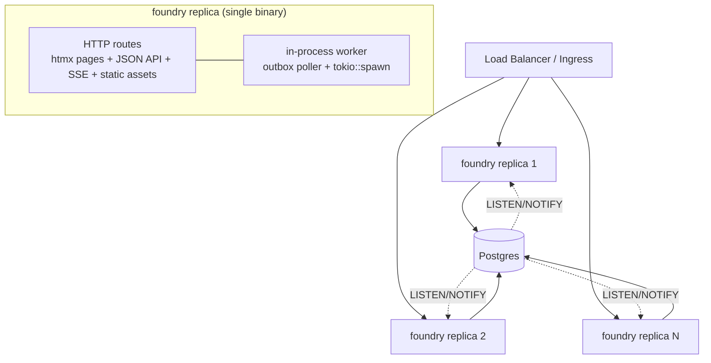
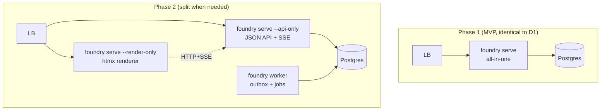
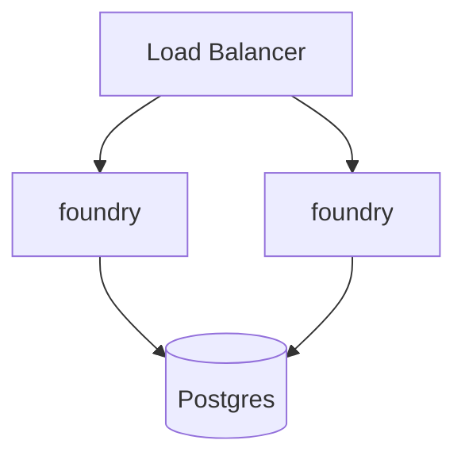
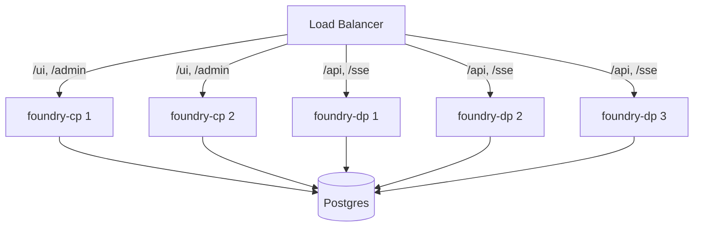
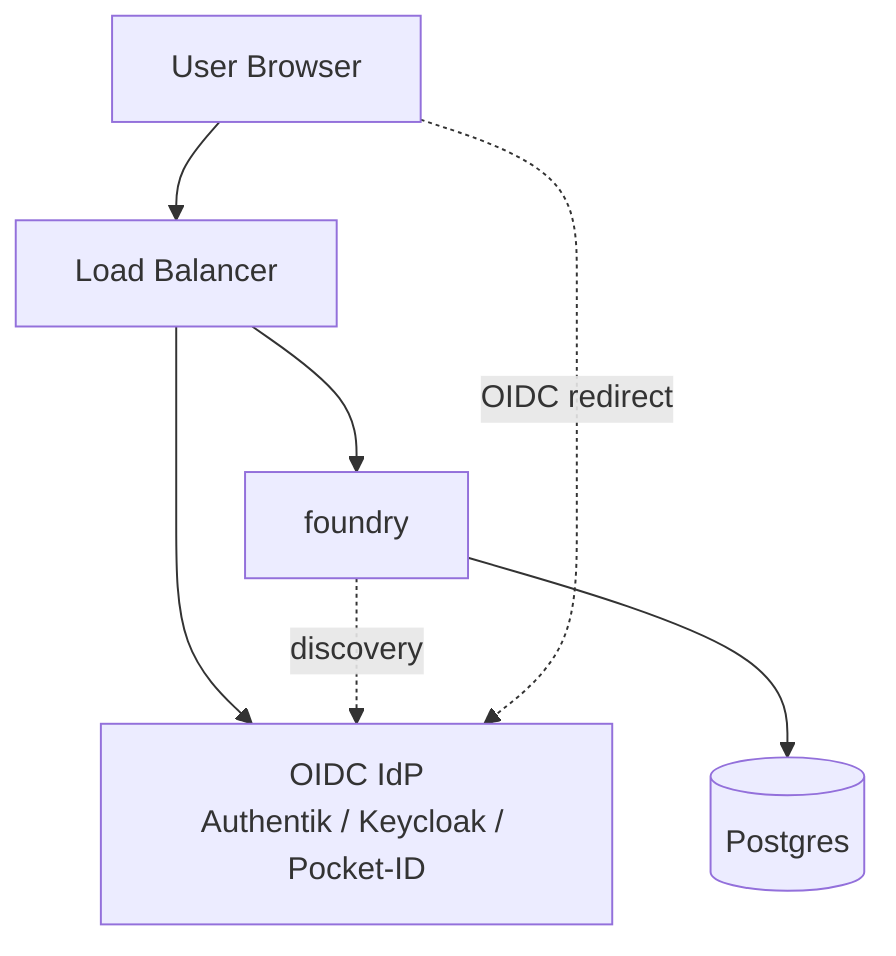

# Design Directions — Foundry Backend MVP

Five structurally distinct directions. Each is a coherent stack where the topology, persistence, frontend, auth, realtime, and background-work choices reinforce each other. Each is then evaluated against the JTBD outcomes in `jtbd.md`.

## HMW Framing

> How might we let a Rust-comfortable team self-host a Linear-feeling issue tracker in under an hour, with a codebase a single developer can understand in a day, and the ability to extend it (including with future agentic workflows) without rewriting the world?

The HMW is deliberately silent on container topology, database, and auth — those are the divergence axes.

## SCAMPER Lenses Used

| Lens | Application |
|------|-------------|
| **S**ubstitute | D1 substitutes "Redis + worker + nginx" with "Postgres for everything." |
| **C**ombine | D3 combines server-render + client-island via web components. |
| **A**dapt | D2 adapts Forgejo's single-binary forge pattern to a pure tracker. |
| **M**odify | D4 amplifies the "control plane vs data plane" split — operator separation. |
| **P**ut to other use | D5 reuses Authentik/Keycloak/Dex as the auth substrate (delegate identity entirely). |
| **E**liminate | D1 and D2 eliminate Redis; D2 eliminates a separate worker container. |
| **R**everse | D5 reverses the default (auth-in-app) to auth-out-of-app via OIDC sidecar. |

---

## Direction D1 — "Boring Monolith"

**One-paragraph pitch**: A single axum binary that serves htmx pages, the JSON API, static assets, SSE realtime, and background work — all in one process. Postgres is the only stateful dependency: it holds business data, sessions (via `tower-sessions-sqlx-store`), the outbox/queue table, and powers realtime fan-out via `LISTEN/NOTIFY`. Two containers in docker-compose: `foundry` (the app) and `postgres`. Multiple replicas behind any L4/L7 load balancer; sessions and queue state live in Postgres so the app tier is fully stateless. This is the "Forgejo for issue tracking, written in Rust" play.

### Stack

| Axis | Choice | Reasoning |
|------|--------|-----------|
| Topology | Single-binary monolith, 2-container deploy (app + postgres) | Lowest setup cost; meets "under an hour" outcome |
| Persistence | Postgres + `sqlx` (compile-time-checked SQL) | Boring, portable SQL; doltgresql swap remains possible |
| Frontend | htmx 2.x + alpine.js islands, `askama` server-rendered templates | Server owns state; minimal JS budget; type-checked templates |
| Auth | `tower-sessions` with Postgres store + `argon2id` password hashing | Stateless app tier without Redis; argon2id is 2026 default |
| Realtime | SSE + Postgres `LISTEN/NOTIFY` → tokio broadcast → per-client SSE | One direction is sufficient for issue updates; no sticky sessions needed |
| Background | `tokio::spawn` for non-durable + `outbox` table polled at 1Hz for durable jobs | No Redis, no apalis dependency; can graduate to river-rs later |
| License | AGPLv3 (or MIT with CLA — see directions.md tradeoff section) | Defensive against SaaS reclone |

### Deployment Topology

### Pros

- Genuinely "under an hour": clone, `docker compose up`, browse to `localhost:3000`, create admin.
- One process to operate, one log stream, one set of metrics, one healthcheck.
- New contributor reads `main.rs` and sees the whole shape on day one.
- Postgres-only state means a single backup story covers everything.
- Pluggable Postgres — point at external RDS/managed PG by changing one env var.

### Cons

- Background work and HTTP serving share the same process; a runaway job can starve request handling. Tokio's cooperative scheduling helps; bounded-concurrency on worker tasks is the mitigation.
- "Single binary serves htmx + API" couples release cadence of frontend and backend. For an MVP this is correct; later we may want to split.
- `LISTEN/NOTIFY` doesn't scale infinitely (one logical connection per listening replica); fine up to dozens of replicas; not millions of clients.

### Risks

- **R1**: Outbox-polling at 1Hz adds baseline DB load. Mitigation: use Postgres `pg_notify` to wake the worker rather than poll. Cost: ~10 lines.
- **R2**: tower-sessions Postgres store hasn't been load-tested by us. Mitigation: it's used in well-known Rust projects (notably Zellij's web mode, several Atuin contributions); 2026 maturity is acceptable.
- **R3**: htmx 2.x → htmx 4 migration eventually required. Mitigation: keep hx-* attributes minimal, use SSE via standard EventSource not htmx-specific extension if possible.

### JTBD Outcome Optimization

- Outcome #1 (under-an-hour setup): **strongly optimized** — 2 containers, no Redis.
- Outcome #2 (data ownership): **strongly optimized** — single Postgres dump = full backup.
- Outcome #3 (contributor productivity day 1): **strongly optimized** — one binary, one repo, sqlx + askama have minimal magic.
- Outcome #4 (Linear-feel speed): **optimized** — Rust + server-render keeps p95 in <50ms range for typical pages; SSE keeps perceived realtime.
- Outcome #5 (agentic workflows): **acceptable** — the JSON API exists; agentic hooks live in the outbox table (an agent reads the outbox, writes back via API).

---

## Direction D2 — "Single-Binary, Two Modes"

**One-paragraph pitch**: One Rust binary, two startup modes selected by flag or env: `foundry serve` (the full monolith of D1) and `foundry serve --api-only` (no htmx templates, no static assets, JSON only). Frontend is still server-rendered htmx, but it can either be served from the same process *or* split into a `foundry --render-only` mode that talks to the API container over HTTP. Same binary, different argv. This buys later "split when you outgrow it" without two codebases.

### Stack

| Axis | Choice | Reasoning |
|------|--------|-----------|
| Topology | Hybrid: one binary, multiple startup modes (`serve`, `serve --api-only`, `serve --render-only`) | Defers split decision without paying its cost today |
| Persistence | Postgres + `sqlx` | Same as D1 |
| Frontend | htmx 2.x + alpine.js islands + `askama` templates | Same as D1 |
| Auth | `tower-sessions` with Postgres store | Same as D1 |
| Realtime | SSE — but render-only mode proxies SSE through; api-only emits events natively | Allows future split |
| Background | Background mode opt-in: `foundry serve --no-worker` + dedicated `foundry worker` mode | Resource isolation when needed |
| License | Same options as D1 | |

### Deployment Topology

### Pros

- Same first-hour experience as D1 — `docker compose up` works.
- Defers the topology debate without committing to the split-now cost.
- The binary stays small (modes share most code; the render-only path skips the API handlers via cargo feature or runtime flag).
- Operators who outgrow MVP can split *without changing source*.

### Cons

- Adds complexity to `main.rs` (mode dispatch, conditional router assembly).
- Render-only mode introduces a network hop for every page load when split — perceptibly slower than D1's all-in-one.
- "Two ways to deploy" is a documentation tax.

### Risks

- **R1**: The hybrid mode subtly grows divergent behavior between modes if not tested. Mitigation: integration tests run both monolith and split topologies in CI.
- **R2**: htmx in render-only mode must propagate the user's session cookie to the API call — adds an auth hop. Mitigation: short-lived signed JWT minted by render-only and consumed by api-only.

### JTBD Outcome Optimization

- Outcome #1: **as good as D1** for first deploy.
- Outcome #3: **slightly worse than D1** — `main.rs` is more complex.
- Outcome #6 (scale-out without ops rewrite): **strongly optimized** — the split path is built in.

---

## Direction D3 — "Web Components Islands"

**One-paragraph pitch**: Same backend as D1, but the frontend story is htmx + a thin **custom-elements** (web components) layer for the interactive bits (issue editor, command palette, drag-and-drop). Alpine.js is removed; instead, ~5-10 vanilla web components encapsulate stateful behavior. Server still renders shells; components hydrate themselves. This bets that custom elements are the durable platform primitive (they survive framework churn) and that we can hit "Linear feel" without React.

### Stack

| Axis | Choice | Reasoning |
|------|--------|-----------|
| Topology | Single-binary monolith (same as D1) | |
| Persistence | Postgres + `sqlx` | |
| Frontend | htmx 2.x + custom web components (no alpine, no React) + `askama` | Bet on platform standards over framework |
| Auth | `tower-sessions` | |
| Realtime | SSE | |
| Background | outbox + tokio | |
| License | AGPLv3 | |

### Deployment Topology

(Identical to D1 — the divergence is purely in frontend strategy.)

### Pros

- Web components are a web-platform standard; survives htmx-version churn better than htmx-specific extensions.
- Smaller dependency surface than alpine.js (we write the components; ~500 lines total).
- More obviously testable in isolation (a `<foundry-issue-editor>` is a unit).
- Differentiator: most htmx projects use alpine; using WCs is a more "we're serious about UX" signal.

### Cons

- Custom-element authoring requires more discipline (lifecycle callbacks, attribute observation, shadow-DOM scoping decisions).
- Smaller community/template body than htmx + alpine.
- Risk of "we built our own framework" — exactly what we want to avoid.

### Risks

- **R1**: We end up reinventing a thin framework. Mitigation: hard cap of 10 components; anything more uses a different mechanism.
- **R2**: Contributor onboarding worsens — fewer Rust devs know WC authoring than alpine. Mitigation: 1-page component template README.

### JTBD Outcome Optimization

- Outcome #4 (Linear-feel speed): **strongly optimized** if executed well — direct DOM control, no framework overhead.
- Outcome #3 (contributor productivity day 1): **slightly worse than D1** — WC authoring is the extra concept.

---

## Direction D4 — "Control Plane / Data Plane Split"

**One-paragraph pitch**: Two binaries from day one — a small **control-plane** binary (htmx UI, auth, admin, migrations, operator dashboard) and a separately-scalable **data-plane** binary (JSON API + realtime + workers). They share a crate of domain types and the same Postgres. The split is justified upfront by the resilience model: you can update the data plane without bouncing the operator dashboard, and you can size them independently. This is the "if we know we'll need this later, build it now" play.

### Stack

| Axis | Choice | Reasoning |
|------|--------|-----------|
| Topology | Two binaries: `foundry-cp` (control) + `foundry-dp` (data) | Explicit, upfront separation |
| Persistence | Postgres + `sqlx` | |
| Frontend | htmx + alpine.js, served by control-plane only | UI is operator-pace, doesn't need data-plane scale |
| Auth | tower-sessions in control-plane; data-plane validates short-lived signed tokens minted by CP | |
| Realtime | SSE served by data-plane | |
| Background | Workers compiled into data-plane | |
| License | AGPLv3 | |

### Deployment Topology

### Pros

- Explicit blast-radius separation: a data-plane rolling deploy doesn't touch the operator UI.
- Data-plane can scale independently of UI; for an API-heavy use case (agentic clients hammering the API), this is real.
- Forces the team to define a clean internal API boundary from day one.

### Cons

- Three containers minimum (cp, dp, pg) → degrades "under an hour" outcome.
- Two binaries means two release artifacts, two version checks, two healthchecks.
- For a 5-50 person team this is premature.

### Risks

- **R1**: Internal API drift between cp and dp. Mitigation: shared types crate; integration tests against the API boundary.
- **R2**: Operator confusion ("which binary do I look at?"). Mitigation: docs.

### JTBD Outcome Optimization

- Outcome #1: **worse than D1** — three containers, not two.
- Outcome #6: **better than D1** — independent scaling.
- Outcome #3: **worse than D1** — two binaries to understand.

---

## Direction D5 — "OIDC-Delegated, Stateless Core"

**One-paragraph pitch**: Foundry doesn't ship a password store at all. Identity is delegated to an OIDC provider (Authentik, Keycloak, Dex, Auth0, or Pocket-ID for the indie path). Sessions are short-lived JWTs validated by signature; no session table; no `tower-sessions`. This sharpens the value prop for the *enterprise self-host* segment of the JTBD — where every shop already runs an IdP and bolting Foundry into it is the *normal* expectation. Indie users get a one-container "Pocket-ID sidecar" recipe in docs.

### Stack

| Axis | Choice | Reasoning |
|------|--------|-----------|
| Topology | Single-binary app + IdP sidecar (Pocket-ID or Authentik) | Enterprise-shaped from day one |
| Persistence | Postgres + `sqlx` | |
| Frontend | htmx + alpine.js; auth flow does the OIDC dance and stores the JWT in an HttpOnly cookie | |
| Auth | `openidconnect` crate; signature-verified JWT in HttpOnly cookie; no session table | |
| Realtime | SSE; per-message auth via cookie | |
| Background | outbox + tokio | |
| License | Apache-2.0 (maximally adoptable to enterprise) | |

### Deployment Topology

### Pros

- Fits the enterprise mental model exactly — "what IdP does Foundry support? OIDC, like everything else."
- Removes our exposure to password-storage bugs (no bcrypt-cost-default-too-low CVE, no password-reset flow to get wrong).
- One fewer table (no `sessions`); JWT signature verification is stateless.
- SSO-ready from day one — big differentiator vs Plane (which has a paywalled SSO add-on).

### Cons

- Indie/hobby self-hosters who just want to spin up a tracker for their 3-person team must run *two* containers (Foundry + IdP). Degrades "under an hour" outcome unless we ship a credible bundled-IdP path.
- JWT revocation is harder than session revocation. Mitigation: short access-token TTL (5min) + refresh; logout = clear cookie.
- More complex first-time auth flow.

### Risks

- **R1**: Indie segment finds this too heavy and chooses Plane. Mitigation: Pocket-ID bundle in docker-compose; one-line `docker compose --profile pocketid up`.
- **R2**: We must validate against the long tail of OIDC providers. Mitigation: pin to the `openidconnect` crate's test matrix.

### JTBD Outcome Optimization

- Outcome #1: **worse than D1** for indie path, **better than D1** for enterprise path.
- Outcome #2: **strongly optimized** — credentials never live in our DB.
- Outcome #5 (agentic workflows): **strongly optimized** — agents authenticate via service-account OIDC tokens, same flow as humans.

---

## Cross-Direction Comparison

| Axis | D1 Boring Monolith | D2 Two-Mode Binary | D3 Web Components | D4 CP/DP Split | D5 OIDC-Delegated |
|------|-------------------|---------------------|--------------------|-----------------|--------------------|
| Containers (MVP) | 2 | 2 | 2 | 3 | 2-3 |
| Background work | outbox + tokio | outbox + tokio (split-able) | outbox + tokio | dp-internal | outbox + tokio |
| Auth | cookie+session in PG | cookie+session in PG | cookie+session in PG | session in CP, JWT to DP | OIDC + JWT cookie |
| Realtime | SSE + LISTEN/NOTIFY | SSE | SSE | SSE in DP | SSE |
| New-contributor mental model | smallest | small + modes | small + WC concept | 2 binaries | small + OIDC concept |
| Enterprise SSO ready | not by default | not by default | not by default | not by default | YES |
| "Hour to running" — indie | 9/10 | 9/10 | 9/10 | 6/10 | 5/10 (4/10 without bundled IdP) |
| "Hour to running" — enterprise | 7/10 | 7/10 | 7/10 | 7/10 | 9/10 |
| Risk of premature complexity | low | medium | medium | high | medium |

## License Trade-off (cross-cutting, not direction-specific)

| License | When it's right | Risk |
|---------|----------------|------|
| **MIT** | Maximum adoption; easy embeds; community-friendly | A well-funded competitor (e.g. Linear itself) can fork, close-source, and out-market. |
| **Apache-2.0** | Same adoption as MIT + explicit patent grant + NOTICE clause. Enterprise-friendly. | Same fork risk as MIT. |
| **AGPLv3** | Defensive against SaaS reclone — anyone offering Foundry as a service must open-source modifications. | Some enterprises auto-reject AGPL; degrades adoption among AGPL-allergic shops. |
| **MPL-2.0** | File-level copyleft — modifications to Foundry files stay open, but combining with proprietary code is fine. Middle ground. | Less recognized than the big three. |
| **Sustainable-use / SSPL / BSL** | Trendy among "open" projects (Sentry-style functional license). | Not OSI-approved; "FOSS-friendly" filter rejects these. |

**Recommendation feeding into recommendation.md**: **AGPLv3** for the project itself + permissively-licensed dependencies + a documented "if you want to embed Foundry without AGPL obligations, the path is dual-licensing v2." This matches the "license-friendly self-host, defensible against SaaS reclone" JTBD framing.

## Diversity Test (3-point)

| Direction | Different mechanism? | Different assumption? | Different cost profile? |
|-----------|---------------------|----------------------|------------------------|
| D1 | Postgres-for-everything | "Operational simplicity beats horizontal flexibility now" | Lowest ops cost |
| D2 | Mode-switchable binary | "Defer the split, don't avoid it" | Slight code-complexity tax for option value |
| D3 | Web components vs alpine | "Platform standards outlive frameworks" | Frontend authoring discipline cost |
| D4 | Pre-split topology | "Independent scale is worth the extra container" | Higher ops cost, lower future-friction |
| D5 | Identity-delegated | "Self-host targets shops that already run an IdP" | Higher first-hour cost for indie, lower for enterprise |

All five differ on at least two of three axes. Diversity test: PASS.

---

The taste evaluation in `recommendation.md` scores these against the four taste filters (approachability, upgrade-ability, boring tech, resilience) plus DVF, and selects one direction.
