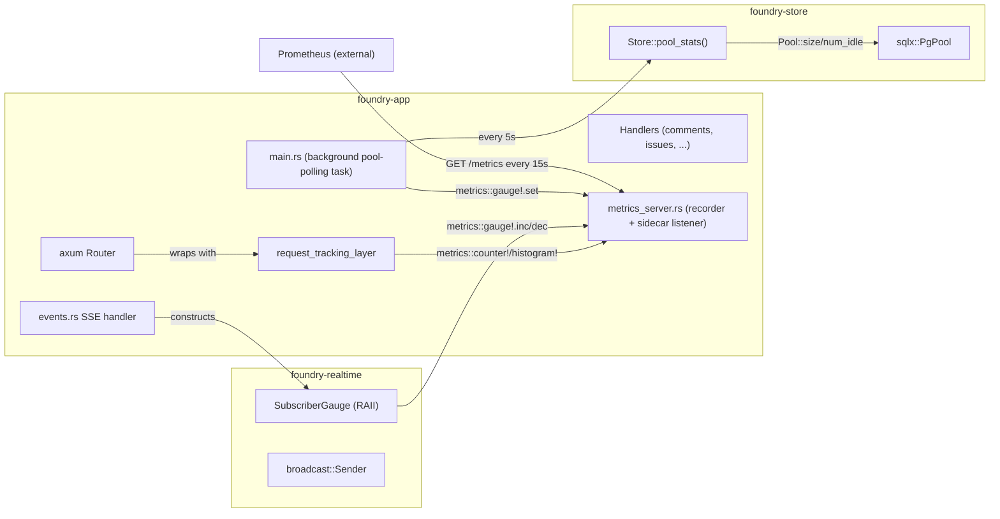

# Design proposals — handler-instrumentation (brownfield instrumentation slice)

**Mode**: propose
**Owner (this wave)**: solution-architect (Morgan)
**Status**: AWAITING USER DECISION on Q1–Q7
**Predecessor design**: `docs/feature/foundry-backend-mvp/design/` (slice 1, esp.
`system/observability-infra.md`) + `docs/feature/foundry-devops/devops/plan.md` +
`docs/evolution/2026-05-25-foundry-devops.md`.
**Layout convention**: legacy per-wave (no `docs/product/`, no `feature-delta.md`)
— mirrors slice-5 `comment-edit-delete` structure verbatim.

---

## 0. What this slice is

A brownfield instrumentation slice that emits the metric series the
already-shipped Grafana "Foundry Overview" dashboard panels reference. The
DEVOPS slice (commit `c7cb715`) wired the `metrics_exporter_prometheus`
recorder + sidecar axum listener on `METRICS_PORT` (default 9090) and shipped
the dashboard pre-provisioned in `observability/grafana-dashboards/foundry-overview.json`.
The recorder is installed but nothing emits the metrics the panels graph —
empty series in production is the explicit "instrument me" signal per the
DEVOPS evolution doc.

The slice's whole job: emit the metric series the dashboard expects, without
inflating handler signatures, blowing up label cardinality, or regressing the
slice-1 architectural promises (`foundry-core` I/O-free; modular monolith;
stateless app per NFR-AVAIL-01; AGPLv3-clean dependency graph).

---

## 0.5. Inherited-spec contradiction found (CRITICAL — flag for user)

**The brief says 3 metric names. The shipped dashboard references 5.** The
3 in the brief are a subset.

| Metric name | Type | Labels used | Where referenced |
|---|---|---|---|
| `http_requests_total` | counter | `status` | Panel 1 ("Request rate by status"), Panel 3 ("Error rate") |
| `http_request_duration_seconds_bucket` | histogram | `le`, `path` | Panel 2 ("Request latency p95 by path") |
| `db_connections_in_use` | gauge | (none) | Panel 5 ("Postgres pool in_use") |
| `db_connection_wait_seconds_bucket` | histogram | `le` | Panel 5 ("Postgres pool wait p95") |
| `sse_subscribers_total` | gauge | (none in query — see Q2) | Panel 4 ("Active SSE subscribers") |

The dashboard query for SSE uses `sum(sse_subscribers_total)` which works
with OR without a `project_id` label (the `sum` collapses it). But the
inherited `observability-infra.md` specifies `project_id` as a label.

**Additional metrics enumerated in `observability-infra.md` but NOT
referenced by the shipped dashboard**:

- `outbox_pending_jobs` (gauge)
- `bootstrap_tokens_unclaimed` (gauge)
- `migration_apply_duration_seconds` (histogram, `migration_id` label)
- `realtime_listen_disconnects_total` (counter)
- `probe_failures_total` (counter, `probe_name` label)

These are "spec exists, dashboard doesn't visualize them yet". Slice-1
discipline says emit only what observably matters now; deferring the
non-dashboard-referenced metrics keeps this slice's scope honest.

**Decision question implicit in this contradiction (Q0)**: do we ship the 5
dashboard-referenced metrics (recommended) or the full 10 from
`observability-infra.md` (over-scope risk: ~3-4× the LOC, and 5 of the 10
have no observable consumer)?

**Recommendation**: ship the 5 dashboard-referenced metrics this slice; file
the remaining 5 as deferred follow-ups. Rationale: matches DEVOPS slice's
explicit "instrument me" signal; the 5 unreferenced metrics have no consumer
that would notice their absence; aligns with slice-1 "smallest thing that
satisfies the AC" discipline.

---

## 1. Reuse Analysis — HARD GATE

Heavy EXTEND skew expected. Every CREATE NEW is challenged.

| Action | Target | Why | LOC delta |
|---|---|---|---|
| EXTEND | `crates/foundry-app/src/metrics_server.rs` | Add `request_tracking_layer()` (tower middleware factory) so the metrics module owns BOTH the recorder install AND the request-tracking middleware. Recommended Q1 = A. | +~60 |
| EXTEND | `crates/foundry-app/src/lib.rs` (`build_router`) | Add `.layer(metrics_server::request_tracking_layer())` near the existing CSRF/session layers. One-line change. | +1 |
| EXTEND | `crates/foundry-app/src/main.rs` | Add a background task that periodically samples `Store::pool_stats()` and updates the `db_connections_in_use` gauge. If Q3 = A (poll-based). | +~25 |
| EXTEND | `crates/foundry-store/src/lib.rs` | Add `Store::pool_stats() -> PoolStats { in_use, idle, size }` — read-only snapshot of `Pool::size()` + `Pool::num_idle()`. + add `pool_acquire_timed()` wrapper if Q3 = B (event-based for `db_connection_wait_seconds`). | +~20 to +~60 |
| EXTEND | `crates/foundry-realtime/src/lib.rs` | Add `SubscriberGauge` guard type that increments on construction and decrements on Drop. SSE handler in `foundry-app/src/events.rs` constructs one per subscription. If Q4 = A. | +~30 |
| EXTEND | `crates/foundry-app/src/events.rs` | Insert one line at SSE-subscription time: `let _gauge = foundry_realtime::SubscriberGauge::new(project_id);` — RAII handle decrements on drop when the SSE stream terminates. | +~3 |
| EXTEND | `crates/foundry-app/src/main.rs` | Extend the existing startup probe sequence to also self-scrape `GET /metrics` after the sidecar listener binds. If Q6 = A. | +~25 |
| EXTEND | `Cargo.toml` (per-crate manifests) | Add `metrics = { workspace = true }` to `foundry-store` and `foundry-realtime` (only `foundry-app` consumes it today). No workspace-level change — `metrics` and `metrics-exporter-prometheus` are already declared per c7cb715. | +2 lines per crate |
| CREATE NEW | none expected (Q5 = C, hybrid) | Per the slice-1 ADR-001 precedent: "slices 2/3/4 add files to existing crates, not new crates" — slice-5 honored it; slice-6 honors it too. The recorder install + middleware factory live in `metrics_server.rs` (already an existing file). | — |

**Total estimated delta (recommended picks)**: ~140 LOC of Rust + tiny manifest
updates. Smaller than slice 5 because no SQL migration, no new HTTP verbs,
no new SSE event types.

If Q5 picks B (new `foundry-metrics` crate): +1 crate, +~200 LOC of plumbing
(facade types, re-exports, Cargo.toml file, workspace member entry). Trade-off
discussed in Q5.

---

## 2. Quality attribute drivers

| Attribute | Priority | Why |
|---|---|---|
| Observability completeness | HIGH | This slice's whole purpose. Dashboard panels are the AC; empty series = failure. |
| Performance (per-request overhead) | HIGH | Slice-1 NFR-PERF-01: P95 ≤ 200ms; US-08 measured P95 = 4ms. Instrumentation must not eat the budget. |
| Cardinality safety | HIGH | Runaway Prometheus labels DoS the TSDB. Per-handler hand-emitted labels are a foot-gun; per-route-template middleware bounds the explosion. |
| Maintainability | HIGH | Per slice-1 ADR-001 taste filter: a Rust dev should grok the workspace in a day. New abstractions need a strong justification. |
| Forward-compat with the deferred 5 metrics | MEDIUM | The chosen pattern should extend cleanly to outbox depth, probe failures, migration latency, listen disconnects without a redesign. |
| Recorder lifecycle correctness | MEDIUM | The `metrics_exporter_prometheus` recorder is process-global; re-init panics. Acceptance harness already deals with this (it skips `install_recorder` per the comment in `metrics_server.rs`). New code must not introduce a second install path. |

---

## Q1 — Recording strategy: where do `http_requests_total` and `http_request_duration_seconds` get emitted?

**Question**: how do per-request counter increments and histogram observations
get triggered? Three families:

| Option | Description | Pros | Cons |
|---|---|---|---|
| **A. Tower middleware layer on the router** | Single `tower::Layer` wired via `.layer()` in `build_router`. The layer extracts `MatchedPath` (axum 0.8 native — see `axum::extract::MatchedPath`), method, and observed status, then emits `metrics::counter!("http_requests_total", "path" => matched, "method" => m, "status" => s).increment(1)` + a histogram observation for `http_request_duration_seconds`. Reads request/response timing from the future boundary. | Zero handler-signature changes. Every current AND future route auto-instrumented. `MatchedPath` collapses `/team/{team}/project/{project}/issues/{id}/comments` to a single route-template label (Q2 cardinality fix). Composes with existing CSRF + session layers in the standard tower stack. axum 0.8 has first-class `MatchedPath` extractor support. | Loses sub-handler granularity (you see "the whole handler took 4ms", not "the DB query took 2ms"). For sub-handler timing you'd add `metrics::histogram!("db_query_duration_seconds")` at the relevant store method. (Acceptable per slice-1 — handlers are thin per ADR-001.) Status code from a panicking handler defaults to 500 only if the panic handler converts it; verify. |
| **B. Per-handler explicit `metrics::counter!` calls** | Every handler in `comments.rs`, `issues.rs`, etc. calls `metrics::counter!(...)` at the top and `metrics::histogram!(...)` after rendering. | Maximum precision — the handler decides exactly what to emit and when. Sub-handler labels (e.g., `is_htmx=true`) are trivial. | Every new handler must remember the call — a forgetfulness foot-gun. Inflates handler bodies. Hard to enforce via static analysis (would need a custom clippy lint or ArchUnit-style import-graph check). Hits every comments/issues handler we already shipped, doubling slice scope. |
| **C. Proc-macro attribute (`#[instrument]`)** | A custom or third-party (`tracing`-style) attribute macro wraps each handler. | Clean call-site. Composes with `tracing::instrument` if we ever want to unify. | Adds a proc-macro dependency or build burden. Macro expansion is opaque to grep. Diagnostics get worse on the handler signature. Doesn't actually solve the "remember to apply it" problem — just relocates it. |

**Recommendation: A (tower middleware layer)**. Rationale:
(a) zero handler changes — preserves the slice-1 "handlers stay thin" property
(ADR-001); (b) every future handler is auto-instrumented — no foot-gun for the
next contributor; (c) `MatchedPath` is the natural cardinality bound (route
template, not concrete URI) — directly solves Q2; (d) the metrics module
(`metrics_server.rs`) becomes the single place that owns ALL request-metric
emission, which is the cleanest possible Conway alignment for the recorder
owner.

**Earned-Trust note (principle 12)**: the middleware is an adapter (driving
port) — its contract is "every request that flows through the router emits
exactly one counter increment and one histogram observation". Probe via the
existing acceptance suite: a scenario that hits 3 distinct endpoints and then
`GET /metrics` and asserts the counter values match. This is the
"probe the substrate lie that the middleware actually fired" pattern.

---

## Q2 — Label cardinality for `http_requests_total` and `http_request_duration_seconds`

**Question**: what label set keeps the time series count bounded?

Prometheus's killer is unbounded cardinality. A label like `user_id` would
mint a new time series per user; with 10K users + 50 routes + 5 status codes
= 2.5M series. A label like `request_id` (UUID) would be infinite. The
canonical safe set is route-template + method + status-class.

The shipped dashboard query is `sum by (status) (rate(http_requests_total[1m]))`
which proves the dashboard expects `status` as a label. The latency panel
queries `sum by (le, path) (rate(http_request_duration_seconds_bucket[5m]))`
which proves `path` is a label.

| Option | Labels | Approx series count (today's 27 routes × …) | Pros | Cons |
|---|---|---|---|---|
| **A. `path` (MatchedPath template) + `method` + `status` (full 3-digit)** | e.g. `path="/team/{team_slug}/project/{project_slug}/issues/{issue_number}/comments"`, `method="POST"`, `status="200"` | 27 routes × ~3 methods/route × ~10 status codes ~= 800 series (counter), + ~10 buckets per histogram entry ~= 8000 series (histogram). Manageable. | Matches the dashboard's expectations verbatim (the dashboard groups by `status` and `path`). Most diagnostic — operator can see "200 vs 500 on this exact route". Future-proof for adding `/admin/...` routes. | 8000 series for the histogram is noticeable on a small Prometheus. Acceptable. |
| **B. `path` + `method` + `status_class` (`2xx`/`3xx`/`4xx`/`5xx`)** | Same but status collapses to `2xx`/`3xx`/`4xx`/`5xx` | ~325 counter series; ~3200 histogram series | Smaller TSDB footprint. | Loses 400-vs-404-vs-410 distinction at the metrics layer (still visible in logs). The dashboard's "Error rate (5xx / total)" panel works either way; the "request rate by status" panel would show "2xx/3xx/4xx/5xx" labels instead of "200/303/404/...". Less granular diagnostic. |
| **C. `path` + `status` only (drop `method`)** | No method label | ~270 counter series | Smallest. | Loses GET-vs-POST distinction — significant for slice-1 design where many routes have both. Cannot answer "is the POST handler slower than the GET handler on this URL?" |

**Recommendation: A (path + method + status)**. Rationale:
(a) matches the dashboard verbatim (no template re-write needed);
(b) ~8000 histogram series is fine for a Prometheus that's already happy
scraping foundry; (c) full status code preserves the 400-vs-404-vs-410
distinction that slice-5 went out of its way to make distinct (ADR-008's
410 Gone semantic); (d) `MatchedPath` provides the cardinality safety — no
concrete `/issues/42` paths ever leak.

**Forbidden labels (call out for the implementation)**: NEVER add
`user_id`, `workspace_id`, `team_id`, `project_id`, `issue_id`, `comment_id`,
`session_id`, `request_id`, IP address, UA. Each would be unbounded. The
middleware should be hard-coded to extract only the safe triple; no
configurability.

**Earned-Trust note**: cardinality is a fundamental safety property. The
implementation should include an architectural test that `parse_label_keys`
on the request middleware returns exactly `{path, method, status}` and no
other keys. This is the "probe the substrate lie that no one snuck a
high-cardinality label in during code review" pattern.

---

## Q3 — DB pool gauge update strategy (`db_connections_in_use`, `db_connection_wait_seconds`)

**Question**: how does the gauge stay current?

sqlx 0.8 exposes pool state read-only via `Pool::size()` (current pool size,
total connections) and `Pool::num_idle()` (currently idle). `in_use = size -
num_idle`. There is NO public event hook for "acquire was called" or
"connection was returned" in stable sqlx — those are internal.

`db_connection_wait_seconds` (histogram) is harder. It needs the timing of
each `Pool::acquire()` call. Two strategies:

| Option | Description | Pros | Cons |
|---|---|---|---|
| **A. Poll-based for both** | Background tokio task in `foundry-app::main` that every N seconds (recommend N=5) reads `pool.size()` + `pool.num_idle()` and updates the gauge. For the wait histogram: skip (no good observable without a wrapper) OR emit a zero-bucket so the dashboard isn't empty. | Zero hot-path overhead. Zero new abstractions. Works with stock sqlx 0.8 — no version pin or feature flag. Background task pattern already used in slice 5 (deferred GC for comments). | The gauge is up to N seconds stale. For a `db_connections_in_use` gauge with a 15s Prometheus scrape interval, 5s polling is fine. `db_connection_wait_seconds` is impossible to observe without wrapping `pool.acquire()` — the histogram is either empty or zero-filled. |
| **B. Event-based via a `Pool` wrapper** | Introduce a `TimedPool` (or `PoolMetrics`) wrapper on the store side. Every method on `Store` that calls `self.pool.acquire()` instead calls `self.pool_metrics.acquire_timed()` which (a) increments `db_connections_in_use`, (b) measures wait time → `db_connection_wait_seconds`, (c) decrements on drop. The acquire-guard returns the original `PoolConnection` so call sites are unchanged except the wrapping. | Real-time accurate. Wait histogram is meaningfully populated. Catches pool exhaustion observably. | Requires wrapping the pool surface. `Store` today does `sqlx::query("...").fetch_one(&self.pool)` which uses an implicit acquire — would have to change to explicit `let mut conn = self.acquire_timed().await?` everywhere. That's ~30 call sites of churn. Or: wrap only the explicit-acquire paths (`Store::migrate`, `update_comment_with_outbox`, etc.) and accept that implicit acquires (single-shot queries) don't show up in wait stats. |
| **C. Poll-based for `in_use`, skip `db_connection_wait_seconds` entirely** | Same as A but explicitly defer the wait histogram. The dashboard panel shows empty until v0.2 ships option B (or sqlx upstream gains hooks). | Smallest scope. Defers the hard part. | Dashboard panel 5 stays half-empty until v0.2 (the "wait p95" line). Honest "we haven't shipped this yet" signal, same posture as the original DEVOPS slice. |

**Recommendation: C for slice scope (poll-based `in_use`, defer `wait_seconds`)
with B as the v0.2 follow-up.** Rationale:
(a) the `db_connection_wait_seconds` panel's value is "pool exhaustion is
happening" — slice-1's load profile (0.25 req/sec from scaling.md) doesn't
exhaust a 10-connection pool, so the histogram would be empty anyway;
(b) option B requires churning the entire `Store` query surface — significant
slice expansion for telemetry that has no consumer right now;
(c) the deferred panel honestly signals "instrument me" the way the DEVOPS
slice did for the rest of the dashboard — same precedent applied recursively;
(d) the poll interval (5s) << scrape interval (15s) so the gauge is at most
one scrape behind reality;
(e) `cargo deny check` stays clean (no `tokio::time::interval` is already a
core tokio capability, no new dep).

**Alternative if user prioritizes completeness**: option B. Acknowledges
~60 LOC of pool-wrapping churn, justified by full panel coverage.

**Earned-Trust note**: the polling task is a driven adapter. Its probe is "the
gauge is non-stale". Add a startup-time assertion that after `pool.acquire()`
+ release, a subsequent `metrics_handle.render()` shows a non-empty
`db_connections_in_use` line. Catches the substrate lie "the polling task
spawned but never ran".

---

## Q4 — SSE subscriber gauge: where to hook (`sse_subscribers_total`)

**Question**: where does the increment/decrement happen?

The SSE handler in `foundry-app/src/events.rs` is the natural inc/dec point
— a subscriber exists for exactly the lifetime of an `sse_stream` Future.
But the subscriber registry (the `broadcast::Sender` in `AppState.realtime_tx`)
lives in `foundry-realtime`. Three options:

| Option | Description | Pros | Cons |
|---|---|---|---|
| **A. RAII guard in `foundry-realtime`** | Add `pub struct SubscriberGauge { project_id: Uuid }` with `new(project_id)` (increments) and `Drop::drop` (decrements). SSE handler does `let _gauge = SubscriberGauge::new(project_id);` near the existing `state.realtime_tx.subscribe()` call. | Drop semantics handle stream termination, panic, and shutdown uniformly. Single line of handler change. Hard-to-misuse — the guard is dropped automatically. Cleanest separation: gauge lives in the realtime crate (where the subscriber concept lives); the app crate just constructs it. | Adds the `metrics` dep to `foundry-realtime` (one-line manifest change). |
| **B. Explicit inc/dec in the SSE handler** | Handler calls `metrics::gauge!("sse_subscribers_total").increment(1.0);` after subscribing, and `decrement(1.0)` in a cleanup arm of the streaming select. | All instrumentation visible in one file. No new types. | Easy to miss the decrement when the stream is cancelled by client disconnect mid-poll. The hand-rolled SSE streaming code (see `events.rs:1-18` rationale) makes the drop point non-obvious. Foot-gun. |
| **C. Tower middleware specific to the SSE route** | A second middleware that only applies to `/events`. Inc on request entry, dec on response future drop. | Familiar pattern. | The SSE handler holds a long-lived `Stream` — middleware sees the request as "complete" when the handler returns, but the stream is still being polled. Decrement fires at the wrong time. Rejected on correctness. |

**Recommendation: A (RAII guard in `foundry-realtime`)**. Rationale:
(a) Drop is the canonical Rust idiom for "this thing exists for as long as
the binding is alive"; (b) subscriber lifetime IS the binding lifetime — the
`BroadcastStream` wraps the `Receiver` which already follows this rule
— our gauge piggybacks on the same model; (c) one-line handler change;
(d) cross-replica aggregation is Prometheus's job (slice-2 ADR: subscriber
count is per-replica), so we just emit per-replica gauges — the `sum()`
in the dashboard handles aggregation.

**Label choice (sub-question)**: the inherited spec says
`sse_subscribers_total{project_id="..."}`. The dashboard query
`sum(sse_subscribers_total)` works with or without the label. **Recommend
keeping `project_id`** so an operator can answer "which project has the most
viewers right now?" — useful for the slice-2 fanout sizing decisions. The
label is bounded by the number of projects (small in MVP, low hundreds in
the long tail), so cardinality is safe.

**Earned-Trust note**: the RAII guard's drop MUST fire even on panic. Rust's
`Drop` guarantees this for any panic-unwound stack. Probe: the existing
acceptance suite for US-09 already opens + closes SSE streams; add an
assertion that `sse_subscribers_total` returns to zero after all subscribers
drop. This is the "probe the substrate lie that Drop actually ran" pattern.

---

## Q5 — Where to host the new instrumentation code

**Question**: do we honor slice-1 ADR-001 "no new crates" or break precedent
for a `foundry-metrics` crate?

The slice-1 ADR-001 says explicitly: "slices 2-4 add files to existing crates,
not new crates." Slice 5 honored this. Slice 6 has three layout options:

| Option | Description | Pros | Cons |
|---|---|---|---|
| **A. Inline `metrics.rs` files per crate** | New file `crates/foundry-app/src/metrics_request_layer.rs`, new file `crates/foundry-store/src/metrics.rs`, new file `crates/foundry-realtime/src/metrics.rs`. Each crate owns its own metric helpers. | Locality — each crate's metrics live next to the code they instrument. No cross-crate facade. | Three new files. Some code duplication (each file imports `metrics::counter!` etc.). The recorder install still lives in `foundry-app::metrics_server`. |
| **B. New `foundry-metrics` workspace crate** | Add `crates/foundry-metrics/` to workspace. Defines facade types (`SubscriberGauge`, `PoolStats`, `RequestTrackingLayer`). Other crates depend on it. | Single place for ALL metric type definitions. Easier to audit cardinality (one file with all label-key strings). Cleanest layering. | Breaks the slice-1 ADR-001 precedent — the first new crate since slice 1. Adds a workspace member + 1 Cargo.toml + a build dependency edge from `foundry-app`, `foundry-store`, `foundry-realtime` -> `foundry-metrics`. Increases workspace compile time. |
| **C. Hybrid: middleware + recorder install stay in `foundry-app::metrics_server`; small helpers inline in `foundry-store` and `foundry-realtime`** | Recorder install + request-tracking middleware live in `metrics_server.rs` (already exists). `Store::pool_stats()` is a method on `Store` — no new file. `SubscriberGauge` is a new ~30-line module in `foundry-realtime`. | Honors the slice-1 ADR-001 precedent (no new crates). Minimum new surface area. Each crate owns the bits it needs (the realtime crate owns the subscriber type — naturally, since it owns the broadcast). | Three files end up using `metrics::*` directly (not a real cost — the `metrics` crate facade is the right level of indirection). |

**Recommendation: C (hybrid)**. Rationale:
(a) honors ADR-001's "no new crates without explicit need" — the case for
`foundry-metrics` is "tidy" not "necessary"; (b) the recorder install already
lives in `metrics_server.rs` — extending that file to also export the
middleware factory is a natural cohesion; (c) `Store::pool_stats()` is a
new method, not a new file — fits the existing `Store` API surface
verbatim; (d) `SubscriberGauge` in `foundry-realtime` is the cohesive home
for "subscriber-lifetime aware" type — the subscriber concept already lives
there; (e) zero workspace.toml change; (f) `cargo deny check` and `xtask
check-arch` are unaffected.

The new crate (option B) becomes the right answer when there's a SECOND
consumer of the metric facade types (e.g., if we ever add a second binary
sharing the recorder). Until then, premature abstraction.

---

## Q6 — Startup-probe extension

**Question**: should the existing `Store::probe()` (or a new `metrics::probe()`)
verify that the recorder is installed + `/metrics` endpoint is reachable at
startup, mirroring the slice-5 "probe the substrate lie" pattern?

Slice 5's `Store::probe()` already does a SELECT 1 round-trip + a
migration-0006 column-existence check. The pattern: probe at startup, refuse
to start on probe failure, structured `health.startup.refused` event.

| Option | Description | Pros | Cons |
|---|---|---|---|
| **A. Add a `metrics_server::probe(handle, addr) -> Result<(), ProbeError>` call to main.rs after `serve()` returns** | Probe self-scrapes `GET http://{metrics_host}:{metrics_port}/metrics` and asserts the response (a) is HTTP 200, (b) is non-empty, (c) contains the `foundry_app_startup_total` line (proves the recorder ACTUALLY received the counter we just emitted). On failure, log a structured error and exit. | Catches the entire class of deploy-time misconfig: wrong `METRICS_PORT`, port-in-use, recorder install silently swallowed, firewall between the app and its own port. Mirrors slice-5 verbatim — known pattern, low novelty cost. Self-scrape latency is negligible (<10ms on localhost). Fires before the main HTTP listener binds, so the failure mode is "container restarts" not "container serves traffic while metrics are broken". | Adds ~25 LOC + ~10ms to startup. If for any reason the probe is too eager (e.g., recorder doesn't render until a counter is emitted), the existing `foundry_app_startup_total.increment(1)` already covers that — done in current code before the probe would run. |
| **B. Defer probe; rely on `metrics_healthz` and operator observation** | The metrics listener already serves `GET /healthz` (returns "ok"). Operators monitoring the dashboard would notice empty series. | Smallest delta — zero code change. | "Operators would notice" is the failure mode this slice exists to avoid (empty series for 3 months was the DEVOPS state). Without an app-side probe, port-conflict misconfig is silent until someone opens Grafana. Rejected on principle — this is exactly the substrate-lie pattern. |

**Recommendation: A (probe at startup)**. Rationale:
(a) the slice-5 precedent says probes are non-optional (principle 12); this
slice ADDS an adapter — the metrics sidecar listener — so it inherits the
"adapters MUST probe" rule; (b) the failure mode caught (silent port
conflict, silent recorder swallow) is exactly the class of bug the DEVOPS
slice's empty-series state demonstrated; (c) ~10ms startup latency is
acceptable for a process that lives for hours/days; (d) the probe code is
self-contained in `metrics_server.rs` — no cross-crate plumbing.

**Earned-Trust note**: this IS the principle-12 application. The metrics
sidecar is a driven adapter (it exposes `/metrics` for Prometheus to consume);
the probe verifies the contract "I can render at least one metric" empirically.

---

## Q7 — Performance budget

**Question**: what per-request overhead does this slice promise?

Slice-1 NFR-PERF-01 = P95 ≤ 200ms; slice-1 US-08 measured P95 = 4ms. There's
196ms of headroom. The tower middleware on every request adds:

- `MatchedPath` lookup: ~100ns (it's a hashtable lookup)
- `Instant::now()` × 2: ~50ns each on Linux
- `metrics::counter!` + `histogram!` emission: ~200-500ns each (the
  `metrics` crate uses lock-free atomics)

Total expected: ≤2µs per request. That's 0.001% of the 200ms budget,
0.05% of the measured 4ms. Negligible.

**Recommendation: budget = ≤10µs P95 added per request**. Rationale: a 5×
safety margin on the expected 2µs covers cache misses, lock contention spikes,
and the histogram bucket-find overhead. Easy to verify in a microbench.
Comfortably within both NFR-PERF-01 (200ms) and the measured slice-1 4ms.

For the polling task (Q3 = C): zero per-request overhead. The task runs
asynchronously, samples `pool.size()` (which is an atomic load), once every
5 seconds. ~100ns of work every 5 seconds = effectively free.

For the SSE gauge (Q4 = A): one atomic inc on subscribe + one atomic dec on
drop, per SSE connection — not per request. ~50ns × 2 per long-lived stream.
Negligible.

**Earned-Trust note**: this budget should ride a slice-6 microbench (criterion
or just a hyperfine + `wrk` shell script) that the platform-architect can run
in CI. The platform-architect handoff should include this recommendation.

---

## 3. Proposed ADRs to write once decisions land

Continuing the existing component-level numbering (slice 1 used ADR-001..005;
slice 5 used ADR-006..009; slice 6 continues with ADR-010+). System-level
ADRs (ADR-101..105) are NOT needed for this slice (no topology change).

| ADR | Title | Captures | Decision required from |
|---|---|---|---|
| ADR-010 | HTTP request metrics via tower middleware | Q1 outcome | User |
| ADR-011 | Bounded label cardinality for `http_*` metrics | Q2 outcome | User |
| ADR-012 | DB pool gauge polling strategy | Q3 outcome | User |
| ADR-013 | Metrics module hosting (hybrid; no new crate) | Q5 outcome (if = C, document the "no new crate" rationale for posterity) | User (only if Q5 ≠ A) |

Q4 (SSE gauge RAII), Q6 (startup probe), Q7 (perf budget) are documented
inline in `architecture.md` because they're implementation patterns that
follow established precedents (RAII Drop, slice-5 probe, slice-1 NFR-PERF-01)
and don't constrain v0.2 evolution.

If user picks Q3 = B (event-based pool wait), ADR-012 expands to cover the
`TimedPool` wrapper rationale and the breaking change to Store's internal
acquire pattern.

---

## 4. Optional C4 diagram (slice-specific)

Slice 1 already documents L1 (System Context) and L2 (Container). Slice 6
doesn't change either — same single binary, same single Postgres, same
sidecar metrics listener on `:9090` (DEVOPS slice already shipped it).

The diagram worth adding to `architecture.md` is a focused L3 component
diagram showing the metric-emission paths:

Key property: the dashed `metrics::*` macro calls converge into the single
`PrometheusHandle` owned by `metrics_server.rs`. The recorder lifecycle
remains single-install (already-correct per the DEVOPS slice).

---

## 5. External integration check (principle 10)

This slice introduces NO new external integrations. Prometheus is already
in the architecture (DEVOPS slice). The metric scrape is a Prometheus-PULL
relationship — Prometheus connects to the sidecar listener; foundry never
connects out to Prometheus. The contract test annotation from slice-1 (SMTP)
remains unchanged; no new annotation needed.

---

## 6. Architecture enforcement (principle 11)

Existing enforcement holds:

- `cargo xtask check-arch` (slice-1 ADR-001) — no changes to crate boundaries.
  The hybrid layout (Q5 = C) keeps the dependency graph identical.
- `cargo deny check` — no new dependencies introduced. `metrics` and
  `metrics-exporter-prometheus` are already declared per c7cb715 commit.
- `cargo sqlx prepare --check` — no new SQL queries.

**New enforcement worth adding** (called out for the platform-architect handoff):
a tiny unit or arch test asserting the request middleware's label key set is
EXACTLY `{path, method, status}` and nothing else. Cardinality regression is
the long-term failure mode for this slice; a static check catches it before
production. Rust implementation: a unit test in `metrics_server.rs` that
calls the middleware once and inspects the emitted-label-keys via a captured
recorder. Cost: ~20 LOC.

---

## 7. Earned Trust (principle 12) — adapter probes

This slice ADDS three new "adapters" in the principle-12 sense:

1. **Request-tracking middleware** — driving-adapter wrapper around every
   handler. Contract: emits one counter increment + one histogram observation
   per request. Probe: acceptance scenario that hits N endpoints + scrapes
   `/metrics` + asserts counter == N.
2. **Pool-polling task** — driven adapter reading `Pool::size()`/`num_idle()`.
   Contract: gauge value matches reality within one poll interval (5s).
   Probe: post-startup self-test that acquires a connection, releases it,
   waits one poll interval, scrapes `/metrics`, asserts gauge non-zero
   during hold + matches expected after release.
3. **SSE subscriber gauge** — driven adapter wrapping the subscribe lifecycle.
   Contract: gauge returns to zero after all subscribers drop. Probe:
   extension of the existing US-09 acceptance scenario.

PLUS the startup probe (Q6 = A) for the metrics-listener itself (probes
the substrate lie that `/metrics` is reachable at process startup).

All probes ride existing acceptance infrastructure (testcontainers + real
HTTP). No new probe framework needed.

---

## 8. Quality-gate self-check before user decisions

- [x] Requirements traced to components — 5 dashboard metrics → middleware
      + Store::pool_stats + SubscriberGauge
- [x] Component boundaries respected — no new crates (Q5 = C recommended)
- [x] Technology choices justified — zero new deps; reuses already-declared
      `metrics` + `metrics-exporter-prometheus`
- [x] Quality attributes addressed — observability (this slice's purpose),
      performance (Q7 budget), cardinality safety (Q2), maintainability
      (Q1 middleware over per-handler)
- [x] Dependency-inversion compliance — `metrics::*` is a facade trait; the
      recorder install is the only concrete implementation; existing
      `foundry-core` I/O-free invariant unaffected
- [x] C4 diagrams — L1/L2 inherited; L3 flowchart provided above
- [x] Integration patterns — extends existing sidecar listener; no new wire
      protocols
- [x] OSS preference validated — `metrics` (MIT/Apache-2.0) +
      `metrics-exporter-prometheus` (MIT/Apache-2.0) — both AGPLv3-compatible,
      both already in workspace deps
- [x] AC behavioural — all options framed around WHAT the system emits
- [x] External integrations — none new (Prometheus scrape is inherited)
- [x] Architectural enforcement — existing `cargo xtask check-arch` +
      proposed cardinality unit-test
- [ ] Peer review — DEFERRED until user decisions on Q0-Q7 land

---

## 9. Constraint contradictions found

1. **Brief says 3 metrics; dashboard references 5; observability-infra.md
   enumerates 10.** Documented in §0.5 above. Recommendation: ship the 5
   dashboard-referenced metrics this slice; defer the other 5 to v0.2
   follow-ups (no consumer would notice their absence today).

2. **`observability-infra.md` specifies `sse_subscribers_total{project_id}`
   but the dashboard query `sum(sse_subscribers_total)` works with OR
   without the label.** No conflict — the label is forward-compatible with
   the dashboard. Recommendation (Q4): keep `project_id` (bounded
   cardinality, useful for "which project has the most viewers" diagnostic
   query).

3. **`observability-infra.md` mentions `probe.metrics.endpoint_reachable`
   as a Principle 9 probe; the DEVOPS slice did NOT implement it.** This
   is exactly the slice-6 opportunity (Q6 = A). Recommendation: implement.

4. **`db_connection_wait_seconds_bucket` is in the dashboard but sqlx 0.8
   has no clean hook for it.** Documented in Q3. Recommendation: defer
   to v0.2 (panel stays half-empty, matching DEVOPS-slice "instrument me"
   precedent for those bits).

---

## 10. Decision-driven invented detail (FLAGGED for user override)

The following specifics were chosen to make the design concrete but are
under the user's authority to override before finalize:

1. **Pool-polling interval = 5 seconds.** Picked to be << the 15s Prometheus
   scrape interval (gauge is at most 1 scrape behind reality). Tune via an
   env var (`METRICS_POOL_POLL_SECONDS`, default 5) if you want.
2. **Histogram bucket boundaries for `http_request_duration_seconds`** —
   `metrics-exporter-prometheus` default is `[0.005, 0.01, 0.025, 0.05,
   0.1, 0.25, 0.5, 1.0, 2.5, 5.0, 10.0]`. Reasonable for web traffic.
   Override via `PrometheusBuilder::set_buckets_for_metric` if the
   slice-1 4ms P95 measurement suggests a finer low-end.
3. **Histogram bucket boundaries for `db_connection_wait_seconds`** — N/A
   if Q3 = C (deferred). If Q3 = B, recommend `[0.0001, 0.0005, 0.001,
   0.005, 0.01, 0.05, 0.1, 0.5, 1.0]` — wait times should be sub-ms in
   a healthy pool, with long-tail observability for exhaustion.
4. **`MatchedPath` fallback** — if no route matches (404 to a path the
   router doesn't know), use the literal label `"<unmatched>"` so 404s
   to random URIs don't mint a series per URI. Cardinality safety.
5. **Startup probe URL** — `http://127.0.0.1:{METRICS_PORT}/metrics`. Hits
   the loopback regardless of `METRICS_HOST` so the probe works in
   containers that bind metrics to `0.0.0.0` but only loopback is reachable
   from the same process.
6. **Probe failure exit behaviour** — `anyhow::bail!` from main, which
   becomes a non-zero exit. Matches the existing `Store::connect` failure
   shape. Container orchestrator restarts the pod; the restart loop
   surfaces the misconfig.
7. **`SubscriberGauge` exposes `new(project_id: Uuid)` (no `Drop` for
   "fire-and-forget" mode).** If the user wants the gauge to ALSO emit a
   counter on subscribe/unsubscribe for cumulative session count, that's
   a follow-on (would need `sse_subscriptions_total{event="subscribed"}`
   plus `event="dropped"` — not in the dashboard, defer).

---

## Next-step instruction for the orchestrator

Collect user picks on Q0–Q7 (Q7 has a default-accept recommendation). For
each picked option, dispatch back to this agent with `execute --finalize`
and the selected options. The finalize pass will:

1. Write `architecture.md` (slice-specific design summary, inherits slice-1
   architecture by reference)
2. Write `wave-decisions.md` (DDD-numbered decision list mirroring slice-5
   shape, Reuse Analysis table, open questions for DISTILL)
3. Write `adrs/ADR-010..ADR-013` (one per decision needing record; see §3
   above for the conditional ADR-013)
4. Invoke `solution-architect-reviewer` for peer-review approval (max 2
   iterations per Morgan persona)
5. Produce DISTILL handoff package for `acceptance-designer`
