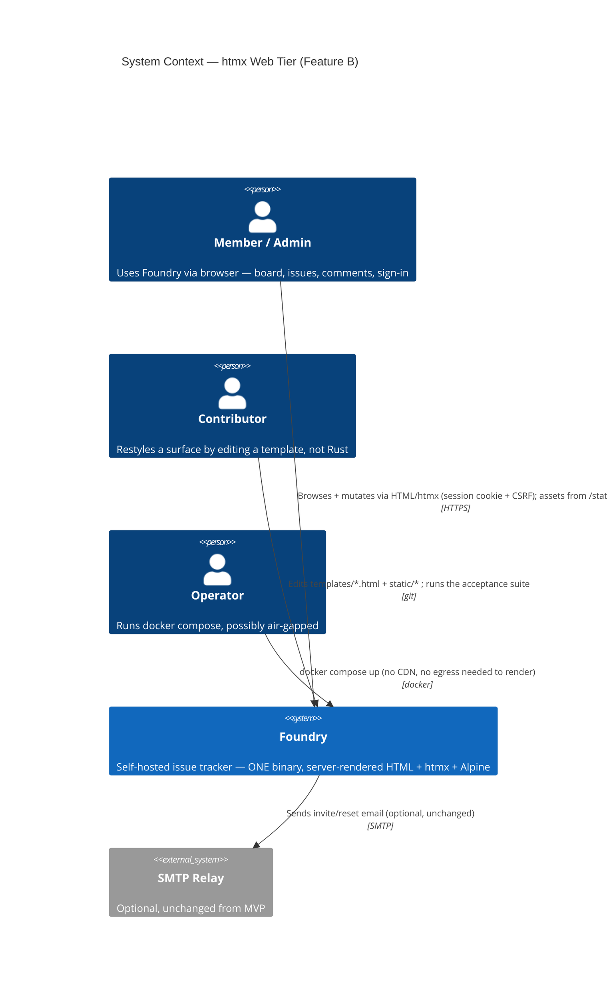
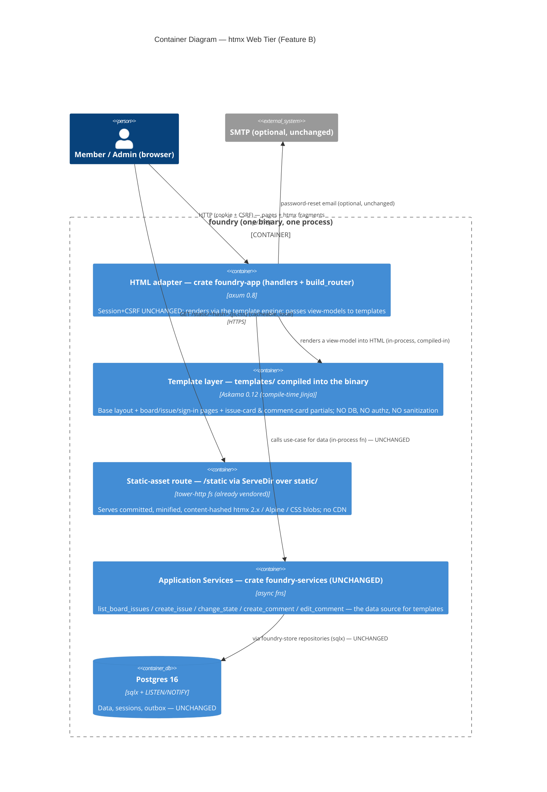
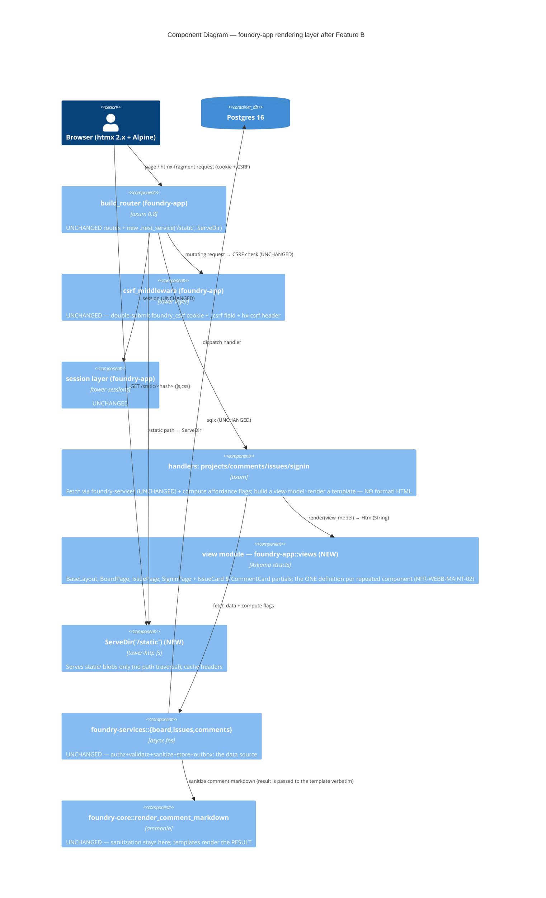

# htmx Web Tier (Feature B) — Application Architecture

Owner: solution-architect (Morgan). Scope: **Feature B only** (DISCUSS DB1-DB8) — replace the
inline `format!()` HTML in `foundry-app` handlers with a real **template engine + a vendored
static-asset pipeline (pure pre-vendored blobs: htmx 2.x, Alpine, CSS — no Node, no bundler, no
CDN)**, and perform the deferred **htmx 1→2 normalization/upgrade** as a dedicated final slice.
Stories US-B01..B06. Companion documents: `template-engine.md`, `render-contract.md`, `assets.md`,
`htmx2-migration.md`, `error-and-observability.md`, `wave-decisions.md`. Interaction mode:
**Propose** — four open questions carry recommendations and await user ratification
(`wave-decisions.md` §"Open decisions awaiting user ratification").

This document MIRRORS `docs/feature/web-tier-extraction/design/architecture.md` (Feature A) and
`docs/feature/foundry-backend-mvp/design/architecture.md` in shape and voice.

## TL;DR

The web tier becomes a **proper driving adapter that renders through a template engine** instead of
`format!` string literals — still inside the one `foundry` binary, still calling the shipped
`foundry-services` seam for data, with **browser auth/CSRF/sessions byte-for-byte unchanged** (only
markup moves). The single load-bearing decision is the **template engine**; the recommendation is
**Askama 0.12** (compile-time-checked, typed, Jinja-like, `.html` files), because it is already the
**workspace-blessed intent** (`[workspace.dependencies] askama = "0.12"` is declared in the root
`Cargo.toml` and named by backend-mvp's architecture) yet **never actually wired** (it is absent from
`Cargo.lock`, confirming `templates/` is empty), it renders inside the ≤200 ms budget with **zero
runtime template I/O** (templates compile into the binary — perfect for the air-gap/one-binary
ethos), and its compile-time type-checking turns "template references a field that does not exist"
into a build error rather than a runtime 500.

The riskiest DISCUSS assumption — "templating will break the substring-asserting acceptance suite" —
is **substantially de-risked by reading the suite**: the acceptance assertions are **`scraper`
CSS-selector + visible-text checks** (`crates/foundry-acceptance/src/support/html_assertions.rs`)
plus a handful of `body.contains("…")` substring checks for error copy and the `data-*` scraper
markers — **NOT byte-for-byte whitespace comparison**. So the render contract Feature B must honor is
**"preserve the asserted DOM structure, the `data-*` markers, the literal error strings, and the
`hx-*`/`hx-swap-oob` targets"**, which a template reproduces faithfully without freezing incidental
whitespace. This reframes Decision 2 (render contract) from "byte-identical" to **"selector-and-
substring-identical"** — the suite is the contract, and the suite reads the DOM, not the bytes.

Static assets are served by **`tower_http::services::ServeDir`** mounted at `/static` — and
`tower-http` **already carries the `fs` feature in the workspace** (`Cargo.toml:35`), so static
serving adds **zero new dependencies**. Assets are committed, minified, pinned blobs with a
**content-hash in the filename** for cache-busting without a build step.

Net new runtime dependencies introduced by Feature B: **ONE — the template engine
(`askama` + `askama_axum`)**, already declared in the workspace manifest. No Node, no bundler, no
CDN, no new runtime service. One binary, one Postgres, `docker compose up` — unchanged.

## What the code actually is today (grounding, not assumption)

Verified by reading the crates (file-path evidence in the Reuse Analysis table below):

- **`templates/` and `static/` are EMPTY.** `crates/foundry-app/templates/` and
  `crates/foundry-app/static/` contain no files (confirmed by glob). The template engine, the
  vendored htmx/Alpine/CSS blobs, and the static-serving route are all genuinely net-new.
- **Every web surface renders via `format!` string literals in handlers.** The board:
  `projects::render_board` (`crates/foundry-app/src/projects.rs:493`) plus
  `projects::render_create_form` (`:453`) and `render_error_fragment` (`:486`). The issue/comment
  surface: `comments::render_issue_page` (`comments.rs:666`), `render_comment_card` (`:766`),
  `render_comment_card_oob` (`:828`), the inline edit-form in `show_edit_form` (`:261`), plus
  `render_attachments_section` (`:722`) and the 400/403/410 fragments (`:617`/`:633`/`:640`/`:650`).
  The issue card: `issues::render_issue_card` (`issues.rs:272`) +
  `render_issue_card_with_column_marker` (`:283`) + the state-change span (`:146`). Sign-in:
  `signin::render_signin_form` (`signin.rs:293`) + `render_forgot_form` (`:315`) + the inline
  `dashboard_root`/`submit_forgot` page strings (`:223`/`:240`).
- **The handlers ALREADY call `foundry-services` for data** (Feature A shipped this). The board:
  `projects::show_board` → `foundry_services::board::list_board_issues`
  (`projects.rs:253`). Issue create: `issues::submit_create` →
  `issue_service::create_issue` (`issues.rs:67`); state change → `change_issue_state` (`:132`).
  Comments: `comments::submit_comment` → `comment_service::create_comment` (`comments.rs:146`);
  `submit_edit_comment` → `edit_comment` (`:299`). **No render path opens a DB pool of its own** —
  Feature B inherits this and must not regress it (NFR-WEBB-BND-01). The data types the templates
  render are `foundry_services::{BoardIssue, CreatedIssue}` (`foundry-services/src/lib.rs:208,219`)
  and `foundry_store::{CommentRow, AttachmentSummary, ProjectRow}`.
- **`build_router` is in `foundry-app`** (`crates/foundry-app/src/lib.rs:166`); the acceptance
  harness calls the SAME `build_router`/`spawn_app` (`test_support`, `:388`). A `/static` route is a
  `.merge()`/`.nest_service()` addition to this router exactly like the existing `attachment_routes`
  sub-router (`:175`) — **no harness-shape change** and no new `AppState` field is required for the
  static route or the engine (Askama renders from compiled-in templates; no runtime config).
- **The CSRF contract is a hand-rolled double-submit middleware** (`csrf.rs`): a non-HttpOnly
  `foundry_csrf` cookie (`build_csrf_cookie`, `:40`), a hidden `_csrf` form field
  (`CSRF_FORM_FIELD`, `:27`), and an `hx-csrf`/`x-csrf-token` header path (`:28-29`), constant-time
  compared (`:69`). Templates must emit the hidden `_csrf` field with the token the handler passes —
  the cookie/header/middleware are UNTOUCHED (NFR-WEBB-COMPAT-03, DB7).
- **htmx directive reality** (refines the DISCUSS "mixed prefixes" framing): the ACTIVE htmx
  directives are bare `hx-*` — `hx-patch`/`hx-target`/`hx-swap` in the edit-form
  (`comments.rs:262`), `hx-get`/`hx-delete` on the card buttons (`:796`/`:805`), and
  `hx-swap-oob="beforeend:…"` in the create-card (`issues.rs:285`) and comment OOB
  (`comments.rs:857`). The `data-hx-fragment`/`data-column`/`data-comment-list`/`data-issue-key`
  attributes are **passive scraper markers the acceptance suite asserts on — NOT htmx directives**
  (DISCUSS DB4; verified — the suite reads them via `scraper`). The htmx-2 migration surface is
  therefore small and centralized after templating.
- **The acceptance suite reads the DOM, not the bytes.**
  `crates/foundry-acceptance/src/support/html_assertions.rs` is built on `scraper` (CSS selectors +
  `text.trim() == expected.trim()`). Step files mix this with `body.contains("…")` for error copy
  (e.g. `us_06_signin.rs:273` asserts `body.contains("Invalid email or password")`) and document-
  order checks (e.g. `us_08_file_issue.rs:407` finds `"Backlog"` then asserts the key appears
  after it). This is the render contract's true shape — see `render-contract.md`.

The architectural consequence: **Feature B is a presentation-adapter refactor, not a new tier.** The
data seam, the auth path, and the router already exist; Feature B introduces a rendering mechanism
(the engine) and an asset-serving mechanism (`ServeDir` over committed blobs), then mechanically
moves the `format!` markup into templates one surface at a time, keeping the suite green at each
slice. The htmx version bump is deferred to one atomic final slice (DB4).

## System Context (C4 Level 1)



Notes:
- **No new external integration.** Feature B serves vendored assets from the binary itself; there is
  **NO CDN and NO external origin** on page render (NFR-WEBB-PERF-03, US-B02). The only external
  system remains optional SMTP (inherited, untouched). There is therefore **no new consumer-driven
  contract-test surface** — see "External Integration Note".
- The **Contributor** is the persona Feature B's primary job (htmx-web-1) serves: a board/comment
  wording change becomes a one-template edit (NFR-WEBB-MAINT-01).

## Container Diagram (C4 Level 2)



There is still exactly **one application container** and one Postgres (NFR-WEBB-BND-04,
NFR-WEBB-INFRA-01). The template layer is **not a runtime service** — Askama compiles templates into
the `foundry-app` crate, so "rendering" is an in-process function call with no template-file I/O at
request time. The `/static` route is a `tower-http` `ServeDir` in the same process; the assets it
serves are committed files in the image. `docker compose up` runs one foundry binary + Postgres,
unchanged.

## Component Diagram (C4 Level 3) — inside foundry-app after Feature B



Dependency direction is **unchanged at the crate level** — Feature B touches only `foundry-app`'s
internal structure (a new `views` module, templates compiled in, a `/static` route) plus the
`static/` and `templates/` directories. No new crate, no reversed edge. The boundary guard's
**web≠DB** half (specified in Feature A's `boundary-guard.md`) finally has its subject: Feature B
introduces no `sqlx` call site in the render path, so the guard stays green.

> **Optional crate-extraction note (NOT recommended for Feature B):** Feature A's
> `architecture.md` §"Cross-cutting Constraints Carried Forward" anticipated Feature B extracting a
> separate `foundry-web` crate to make web≠DB a crate-graph fact. **DESIGN recommends NOT doing that
> extraction in Feature B** — it is orthogonal to the templating job, multiplies blast radius
> (`build_router`/`spawn_app` relocation touches ~4 acceptance `AppState` sites, exactly the cost
> Feature A avoided), and the web≠DB invariant is already enforceable by the existing AST/`cargo-deny`
> guard without it. The templating work is the value; the crate split is deferred (Principle 8,
> simplest solution). Recorded as an open question for the user in `wave-decisions.md`.

## The rendering layer (component decomposition)

The work is concentrated in `crates/foundry-app/`. Proposed structure (HOW the internal module is
shaped is the crafter's; this fixes the boundaries and the one-partial rule):

```text
crates/foundry-app/
  templates/                      # NEW — Askama looks here (askama.toml dirs = ["templates"])
    base.html                     # the ONE base layout (US-B04/B06): <head>, vendored <link>/<script>, header chrome, 
    board.html                    # US-B01 — extends base; renders columns; includes issue_card.html
    issue.html                    # US-B03 — extends base; issue header + attachments + comment thread; includes comment_card.html
    signin.html                   # US-B04 — extends base; sign-in form + error slot + CSRF field
    forgot.html                   # US-B04 — extends base; forgot-password form + CSRF field
    create_form.html              # (carried) project-create form — same base
    partials/
      issue_card.html             # US-B01 — the ONE issue-card definition (full-page + OOB-create + state-change all render this)
      comment_card.html           # US-B03 — the ONE comment-card definition (full-page + htmx-append + edit-rerender + cancel all render this)
      comment_edit_form.html      # US-B03 — the inline edit-form fragment
      oob/                         # OOB wrappers that wrap a partial in <div hx-swap-oob="…">
        issue_card_oob.html
        comment_card_oob.html
      errors/                      # the 400/403/410 + signin/create error fragments (literal copy preserved)
  static/                         # NEW — committed, minified, content-hashed blobs (NO build step)
    vendor/htmx-2.0.4.min.js          (or htmx.<sha>.min.js — see assets.md)
    vendor/alpine-3.14.8.min.js
    css/foundry.<sha>.css
    VENDOR.md                     # provenance: upstream URL + version + sha256 per blob (air-gap audit)
  src/
    views.rs                      # NEW — the Askama view-model structs (one per template); the typed seam between handlers and templates
    (projects.rs / comments.rs / issues.rs / signin.rs — render_* fns DELETED; handlers build a view-model and call views::*)
```

Boundaries (the contract crafter + acceptance-designer execute against):
- **Handlers own data + policy; templates own markup.** A handler fetches via `foundry-services`,
  computes affordance booleans (`can_edit`/`can_delete` — already done in `comments.rs`), and builds
  a `views::*` struct. The template renders flags and pre-sanitized HTML; it makes **no DB call, no
  authz decision, no sanitization** (NFR-WEBB-BND-01/03). `render_comment_markdown` stays in
  `foundry-core`; the template embeds `body_html` verbatim (as the current `format!` does,
  `comments.rs:820`).
- **One definition per repeated component** (NFR-WEBB-MAINT-02): `issue_card.html` and
  `comment_card.html` each have ONE file; the full-page, htmx-append (OOB), edit-rerender, and cancel
  paths all `` it. The OOB variants are thin wrappers that `` the same
  partial inside an `hx-swap-oob` div — **fixing today's `render_comment_card_oob` divergence**
  (which omits Edit/Delete, `comments.rs:841`).
- **The base layout is the single source of head/asset boilerplate** (NFR-WEBB-MAINT-01): every full
  page extends `base.html`; there is no duplicated `<head>` block.

## Reuse Analysis (MANDATORY)

Every component that overlaps existing functionality, classified EXTEND vs CREATE NEW with file-path
evidence. CREATE NEW requires justification ("no existing alternative").

| Concern | Existing component (evidence) | Verdict | Justification |
|---|---|---|---|
| Board data fetch | `foundry_services::board::list_board_issues` (called at `projects.rs:253`) | **EXTEND (reuse as-is)** | Already returns neutral `Vec<BoardIssue>`; the template renders this. No new DB access (NFR-WEBB-BND-01). |
| Issue create/state-change data | `issue_service::create_issue`/`change_issue_state` (`issues.rs:67`/`:132`) | **EXTEND (reuse as-is)** | Returns `CreatedIssue`/`BoardIssue`; the card partial renders it. The OOB create-card uses the SAME partial. |
| Comment create/edit data | `comment_service::create_comment`/`edit_comment` (`comments.rs:146`/`:299`) | **EXTEND (reuse as-is)** | Returns a comment view; the comment-card partial renders it across all paths. |
| Markdown sanitization | `foundry_core::render_comment_markdown` (called `comments.rs:487`) | **EXTEND (reuse as-is)** | Sanitization stays in core; the template embeds the already-sanitized `body_html` verbatim (NFR-WEBB-BND-03). |
| Affordance gating (`can_edit`/`can_delete`) | computed in handler via `is_workspace_admin` + author check (`comments.rs:778-780`) | **EXTEND (reuse as-is)** | Authz decision stays in the handler; the partial renders the boolean flags. No authz in the template. |
| Keyboard carrier (`#kb-items`, j/k nav) | `render_board` hidden `<ul id="kb-items">` (`projects.rs:556`) | **EXTEND (move into template)** | The hidden ASC-sorted carrier moves verbatim into `board.html`; NFR-WEBB-A11Y-01 + the US-12 ordering assertion (`collect_attributes` on `[data-issue-key]`) stay green. |
| CSRF contract | `csrf.rs` middleware + `CSRF_FORM_FIELD` + `build_csrf_cookie` (`csrf.rs:27,40,96`) | **EXTEND (leave untouched; emit field from template)** | Middleware/cookie/header UNCHANGED (DB7, NFR-WEBB-COMPAT-03). The template renders `<input type="hidden" name="_csrf" value="{{ csrf }}">` with the handler-supplied token — exactly what `render_signin_form` does today (`signin.rs:305`). |
| Session + sign-in security | `signin.rs` handlers, `GENERIC_SIGNIN_ERROR`, brute-force delay (`signin.rs:30,86`) | **EXTEND (leave untouched; markup only)** | Handlers, cookie attrs, brute-force delay, non-enumerable error UNCHANGED (NFR-WEBB-COMPAT-04/05). Only `render_signin_form`/`render_forgot_form` markup moves to templates. |
| Router composition | `foundry_app::build_router` (`lib.rs:166`) | **EXTEND** | Add `.nest_service("/static", ServeDir::new("static"))` like the existing `attachment_routes` sub-router (`lib.rs:175`). Harness reuses `build_router`/`spawn_app` unchanged. |
| Static-file serving | `tower-http` with `fs` feature ALREADY in the workspace (`Cargo.toml:35`) | **EXTEND (reuse the vendored dep)** | `ServeDir` is available with **zero new dependency**; path-traversal-safe by construction (serves only under `static/`, satisfying US-B06 scenario 2). |
| Inline `format!` render sites (board/issue/comment/signin) | `render_board`/`render_issue_page`/`render_comment_card`/`render_comment_card_oob`/`render_signin_form`/`render_forgot_form`/`render_issue_card` (file:lines above) | **CREATE NEW (templates, by extraction)** | No existing template alternative — `templates/` is empty. A *move* of markup out of Rust into `.html`, not net-new behavior. The asserted DOM/markers/copy are preserved (render contract). |
| Template engine | `askama = "0.12"` declared in `[workspace.dependencies]` (`Cargo.toml:38`) but **absent from `Cargo.lock`** | **CREATE NEW (wire the already-blessed dep)** | No engine is wired today (`templates/` empty). Askama is the workspace-blessed intent (backend-mvp named it); Feature B wires it. Compile-time-checked, in-binary, ≤200 ms-friendly (`template-engine.md`). Adds `askama` + `askama_axum` to the lock. |
| `views` module (typed view-models) | — (handlers build strings inline) | **CREATE NEW (`foundry-app::views`)** | No existing alternative: Askama needs `#[derive(Template)]` structs as the typed seam between handlers and templates. A new internal module of `foundry-app`; not a new crate. |
| Vendored htmx 2.x / Alpine / CSS | — (`static/` empty; htmx unpinned, unvendored) | **CREATE NEW (committed pinned blobs)** | No existing alternative: nothing is vendored. Pure pre-vendored minified blobs (DB6), content-hashed for cache-busting, served by `ServeDir` (`assets.md`). |
| Asset-resolution / template-presence check | — | **CREATE NEW (compile-time + a small CI check)** | Askama makes a missing template a *compile error* (US-B06 scenario 3 satisfied by construction). A referenced-but-missing `static/` path is caught by a tiny `xtask`/test check (US-B02 scenario 4). See `error-and-observability.md`. |
| htmx 1→2 normalization + pin | active `hx-*` directives scattered as handler strings; unpinned (`static/` empty) | **CREATE NEW (Slice 4 — one atomic bump)** | No existing alternative: nothing is pinned. After Slices 1-3 the directives live in a few partials; Slice 4 normalizes them and pins one htmx 2.x blob with a regression scenario per interaction (`htmx2-migration.md`, DB4). |

**Verdict tally: EXTEND = 9, CREATE NEW = 7.** Every CREATE NEW is a genuinely new capability with no
existing alternative (the templates by extraction, the engine wiring, the `views` module, the
vendored blobs, the resolution check, the htmx-2 bump). The entire data/auth/CSRF/sanitization/authz
core is **100% reused** — Feature B moves *markup*, not behavior, which is the structural guarantee
the render contract rests on (`render-contract.md`).

## Earned Trust — probes for Feature B's new dependencies (Principle 12)

*Every dependency you don't probe is an act of faith you made for the user.* Feature B adds three
substrate assumptions: "the template engine can render every registered template," "every static
asset the layout references actually exists on disk and is served," and "the htmx-2 swap behavior
the markup relies on still fires." Each is demonstrated empirically, not assumed:

- **Template presence is a COMPILE-TIME probe (the strongest form).** Askama parses and type-checks
  every `#[derive(Template)]` at `cargo build`. A template that references a non-existent field, or a
  handler that names a non-existent template, **fails the build** — US-B06 scenario 3 ("a referenced
  missing template fails fast with a clear error") is satisfied by the compiler, not a runtime guard.
  This is Earned Trust applied at the earliest possible moment.
- **Asset-resolution probe (the "stale path" lie — US-B02 scenario 3).** A tiny CI check (an `xtask`
  subcommand or a `#[test]` in `foundry-app`) parses the base layout's vendored `<link>`/`<script>`
  `href`/`src` and asserts each referenced `static/` file exists on disk. A typo
  (`/static/htmx.js` vs the real `/static/vendor/htmx-2.0.4.min.js`) **reds CI**, so the broken-asset
  board never ships. Fault injected by a gold test: rename a blob, assert the check goes red. See
  `error-and-observability.md`.
- **Render-failure is fail-safe (never a half-page).** A template render error maps to a clean
  **500** (and an htmx fragment request to a 500 fragment), never a partially-emitted page — the
  exact posture US-B06 scenario 2 demands. With Askama's compile-time checking the only residual
  runtime failure modes are I/O-free string formatting errors, which are caught and mapped centrally
  (`error-and-observability.md`).
- **htmx-2 behavioral probe (Slice 4 — the "the new version changed swap semantics" lie).** US-B05
  requires a green regression scenario per hx-driven interaction (create-card OOB, comment
  edit/delete/cancel, SSE fragment) AFTER the version bump — the suite *exercises* the new htmx blob
  against the real swaps rather than trusting the changelog. The `data-*` scraper markers are
  asserted byte-stable across the bump (`htmx2-migration.md`).
- **No-egress probe (the "it secretly fetched from a CDN" lie — US-B02 scenario 1).** The acceptance
  harness asserts **zero external-origin requests** on the board render (NFR-WEBB-PERF-03), proving
  the vendored-blob claim empirically on a no-egress host.

The probe question for every Feature B dependency — "what happens if the environment lies?" — is
answered: a mistyped template name refuses to compile; a missing asset reds CI; a render error yields
a clean 500 not a half-page; an htmx-2 swap regression reds the suite; a sneaky CDN fetch reds the
no-egress assertion.

## Quality Attribute Strategy (ISO 25010 highlights)

| Attribute | Strategy | Evidence in Feature B |
|---|---|---|
| Performance Efficiency | Compile-in templates (zero runtime template I/O); static assets cacheable + local; no DB in render path | NFR-WEBB-PERF-01 (≤200 ms, criterion bench on the board vs `format!` baseline); NFR-WEBB-PERF-03; `render-contract.md` §budget. |
| Maintainability | Markup in `templates/` not handlers; ONE base layout; ONE partial per repeated component | NFR-WEBB-MAINT-01/02; `views.rs` typed seam; `architecture.md` §rendering layer. |
| Compatibility | Render contract = asserted DOM + `data-*` markers + literal copy + `hx-*` targets preserved; suite is the net | NFR-WEBB-COMPAT-01/02; `render-contract.md`. |
| Security | Browser auth/CSRF/sessions UNTOUCHED; CSRF `_csrf` field emitted from template; sanitization stays in core; Askama auto-escapes by default (and `body_html` is the deliberate `|safe` exception) | NFR-WEBB-COMPAT-03/04/05; DB7; `csrf.rs` unchanged. |
| Usability / Accessibility | Keyboard carrier preserved; semantic HTML + labelled inputs + WCAG 2.2 AA contrast in the vendored CSS | NFR-WEBB-A11Y-01/02; `assets.md` §CSS. |
| Reliability | Render error → clean 500 not half-page; missing template = compile error; missing asset = red CI | NFR-WEBB; Earned-Trust probes above. |
| Portability | Pure vendored blobs, no Node/CDN; air-gap/reproducible image; one binary | NFR-WEBB-INFRA-01/02; DB6. |
| Testability | Templates render pure view-models (no I/O) — unit-testable; the suite reads the DOM | render contract; `views.rs` is a pure function of its inputs. |

## Integration Patterns & Contracts

- **Browser ↔ Foundry (UNCHANGED transport, new markup source)**: HTML/htmx over HTTPS, session
  cookie + double-submit CSRF, `hx-csrf` header on htmx mutating calls — exactly as MVP/Feature A.
  The bytes that change are the *response markup* (now template-rendered), constrained by the render
  contract (`render-contract.md`).
- **Browser ↔ /static**: `GET /static/<content-hash>.{js,css}` → `ServeDir`, 200 + content-type +
  cache header, no external origin (NFR-WEBB-PERF-03). Cache-busting via the content hash in the
  filename (`assets.md`).
- **Handler ↔ template**: in-process; the handler passes a typed `views::*` view-model; the engine
  returns a `String`/`Html`. No I/O, no network hop.
- **Handler ↔ foundry-services**: UNCHANGED in-process function calls for data.

## External Integration Note (for platform-architect)

Feature B introduces **no new external integration** — assets are served locally; there is **no CDN,
no third-party API, no OAuth, no webhook**. There is therefore **no new consumer-driven contract-test
surface**. The inherited SMTP integration is untouched and its existing contract-test recommendation
(backend-mvp `auth.md`) stands.

The handoff to platform-architect (DEVOPS) should carry: (1) **ONE net-new runtime dependency** —
the template engine (`askama` + `askama_axum`), already declared in `[workspace.dependencies]`;
re-run `cargo deny check` (license MIT/Apache-2.0, in the allowed set). (2) The **`/static`
`ServeDir` route** and the requirement that `static/` blobs ship in the image (Dockerfile `COPY`),
with cache headers — no CDN. (3) The **asset-resolution CI check** (and the htmx-2 regression
scenarios from Slice 4) to add to the existing CI lanes. (4) The criterion render-budget bench
(NFR-WEBB-PERF-01) reusing the backend-mvp NFR-PERF-01 harness. (5) No new env var, no new runtime
service, no Node — `docker compose` topology unchanged.

See companion documents:
- `template-engine.md` — engine options (Askama / Maud / Minijinja), trade-offs for THIS codebase, recommendation
- `render-contract.md` — how templated output stays acceptance-green (selector-and-substring contract), CSRF field emission, one-partial rule, ≤200 ms budget
- `assets.md` — `static/` organization for pure vendored blobs, content-hash cache-busting (no build step), `ServeDir` wiring
- `htmx2-migration.md` — Slice 4 prefix normalization + htmx 2.x pin + breaking-change analysis + regression gating
- `error-and-observability.md` — render-error → clean 500, asset-resolution probe, render-timing metric
- `wave-decisions.md` — DDD decisions, ADRs, reuse tally, tech stack, the 4 open decisions awaiting ratification
