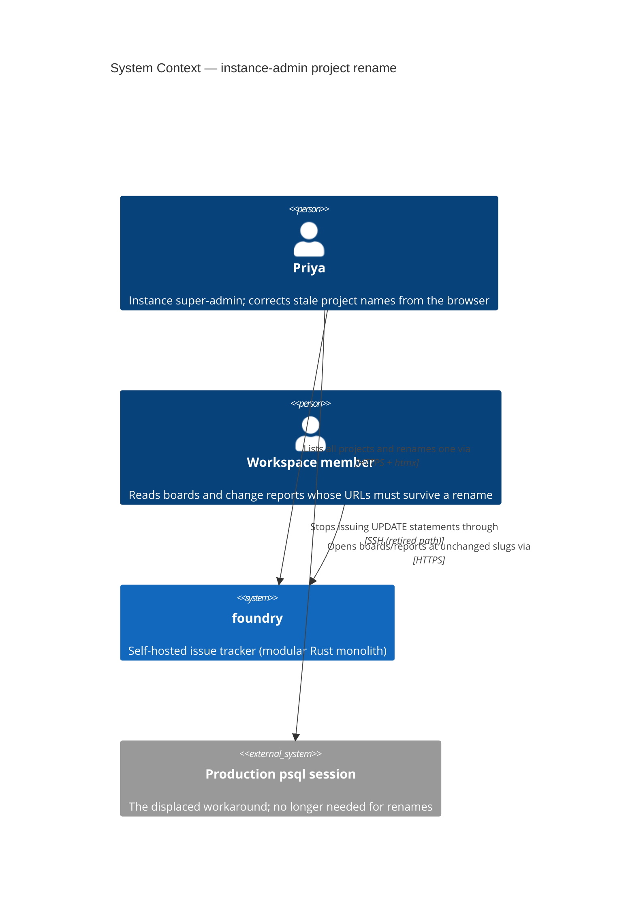
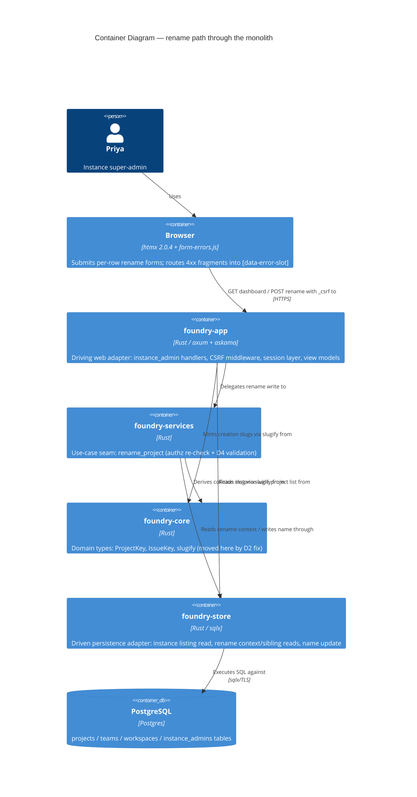

# Architecture Design — instance-admin-project-rename

Wave: DESIGN | Architect: Morgan (nw-solution-architect) | Date: 2026-08-22
Inputs: `feature-delta.md` (D1–D7), slices 01–03, `docs/product/architecture/brief.md`,
codebase reading (`instance_admin.rs`, `projects.rs`, `foundry-store/src/lib.rs`,
`views.rs`, `instance_dashboard.html`, `form-errors.js`, `lib.rs::build_router`,
`migrations/0001_init.sql`).

## 1. Design Summary

Three additive deltas to the shipped instance-admin surface plus one corrective
prerequisite, all inside the existing modular-monolith / ports-and-adapters shape.
**No new technology, no new crate, no DB migration** (verdict in
`data-models.md`).

| # | Delta | Where |
|---|---|---|
| 1 | Instance-wide project listing read (id + team name included) | new `foundry-store` query + `InstanceDashboardPage` extension |
| 2 | Rename write use-case (validate + update `projects.name` only) | new `foundry-services::projects` module + `instance_admin.rs` handler |
| 3 | Per-row htmx rename form with `_csrf` + `[data-error-slot]` | `instance_dashboard.html` + new row partial |
| D2 | Board stops re-deriving slugs from names at render time | `projects.rs::build_board_page` signature change; `slugify` moves to `foundry-core` |

## 2. C4 — System Context (L1)



No new external system is introduced. Keycloak (existing, brief.md) is untouched
by this feature. **No external integrations → no contract-test annotation needed**
for the platform-architect handoff.

## 3. C4 — Container (L2)



A Component (L3) diagram is deliberately omitted: the delta touches four existing
containers with one new module each — L2 plus the flow diagrams below carry the
full information without mixing abstraction levels.

## 4. The D2 Fix — request-path slugs, never render-time derivation

**Defect (verified)**: `crates/foundry-app/src/projects.rs:861-862` —
`build_board_page` computes `team_slug = slugify(team_name)` and
`project_slug = slugify(&project.name)` at render time and bakes them into every
issue card's `edit_url`/`state_url`. After a name-only rename,
`slugify(new_name) != stored slug`, so every card action 404s.

**Fix**: the handler already holds the authoritative slugs. `show_board` receives
`Path((team_slug, project_slug))` and resolves the project **by** that slug
(`find_project_by_slug(team.id, &project_slug)` — `WHERE slug = $2`). The request
slug is therefore provably byte-equal to the stored `projects.slug`. Thread both
path slugs through `render_board` into `build_board_page` and delete the two
derivation lines. No store change, no `ProjectRow` change.

```rust
// crates/foundry-app/src/projects.rs — signature deltas (D2)
fn render_board(
    state: &AppState,
    team_name: &str,
    team_slug: &str,        // NEW: from request path (validated by find_team_by_slug)
    project_slug: &str,     // NEW: from request path (validated by find_project_by_slug)
    project: &foundry_store::ProjectRow,
    issues: &[foundry_services::BoardIssue],
    key_prefix: &ProjectKey,
    nav: crate::nav::NavContext,
) -> Result<String, askama::Error>;

fn build_board_page(
    team_name: &str,
    team_slug: &str,        // NEW — replaces slugify(team_name)
    project_slug: &str,     // NEW — replaces slugify(&project.name)
    project: &foundry_store::ProjectRow,
    issues: &[foundry_services::BoardIssue],
    key_prefix: &ProjectKey,
    nav: crate::nav::NavContext,
) -> crate::views::BoardPage;
```

`BoardPage.team_slug` / `BoardPage.project_slug` (consumed by the template for the
new-issue dialog and card URLs) now carry the request slugs — every downstream URL
is automatically correct.

### 4.1 Full `slugify(` call-site inventory (traced, all crates)

| Site | Role | Affected? | Action |
|---|---|---|---|
| `foundry-app/src/projects.rs:861-862` (`build_board_page`) | Render-time re-derivation from stored **names** | **YES — the D2 defect** | Fixed: use request-path slugs (above) |
| `foundry-app/src/projects.rs:170` (create path) | Mints the slug **once** from the new name at creation | No — slug minting is the intended derivation point | Retarget to `foundry_core::slugify` (below) |
| `foundry-app/src/admin_tokens.rs:284,296` (`resolve_scope`) | Normalizes **user-typed input** (team name/slug) into a lookup key | No — input normalization at lookup time, not re-derivation from a stored name; teams, not projects | Retarget to `foundry_core::slugify` (deduplicates the copy) |
| Report/CSV path (`projects.rs:364-536`) | Uses `Path`-provided `team_slug`/`project_slug` for `board_url`, `csv_url`, CSV filename | No — verified already request-slug-based | None |
| `foundry-acceptance/src/steps/*` (~20 test-local `fn slugify` copies) | Build URLs from names **they themselves seeded**, where slug == slugify(name) by construction | No — creation-time consistent | Untouched (test-local). New rename acceptance tests must capture the slug **before** renaming |

**Regression-class enforcement** (principle: architecture rules erode without
tooling): move `slugify` to `foundry-core` as the single production definition,
and extend `cargo xtask check-arch` with a rule that **fails the build if
`fn slugify(` is defined anywhere under `crates/foundry-app/src`** (use is fine;
redefinition is not). This makes "render paths cannot quietly grow a private
name→slug derivation" a compile-gate, not a convention — the same three-layer
posture the repo already applies to JWT algorithm pins. See
`adr-project-rename-001`.

## 5. Request/Response Flows

### 5.1 Listing (US-IAPR-01) — `GET /admin/instance/workspaces`

```mermaid
sequenceDiagram
  participant B as Browser
  participant H as instance_admin::show_dashboard
  participant S as foundry-store
  B->>H: GET /admin/instance/workspaces (session cookie)
  H->>H: require_instance_admin (fail-closed; None => uniform 404)
  H->>S: list_workspaces()
  H->>S: list_projects_for_instance()  %% NEW: one instance-wide query
  H->>H: group projects by workspace_id (query is name-ordered)
  H-->>B: 200 full page — each workspace row nests data-project-row entries<br/>(or data-project-empty "No projects yet.")
```

One instance-wide query, grouped in the handler against the already-fetched
workspace list (a workspace absent from the project map renders the empty state).
Rejected alternative: N calls to `list_projects_for_workspace` per workspace —
that read lacks the project id and team display name anyway (its tuple shape and
tenant-scoping doc contract would both need breaking), and a per-workspace loop
adds N round-trips to gain nothing. The existing method keeps its single shipped
consumer untouched. Reuse-vs-new justification: **no existing read returns
project id + team name instance-wide; a new, explicitly instance-scoped query is
the minimal delta.**

### 5.2 Rename happy path (US-IAPR-02) — `POST /admin/instance/projects/{project_id}/rename`

```mermaid
sequenceDiagram
  participant B as Browser (htmx)
  participant M as csrf_middleware
  participant H as instance_admin::submit_project_rename
  participant U as foundry-services::projects::rename_project
  participant S as foundry-store
  B->>M: POST .../rename (_csrf field + foundry_csrf cookie)
  M-->>B: 403 before handler if pair invalid (shipped contract)
  M->>H: pass
  H->>H: require_instance_admin (None => uniform 404)
  H->>H: parse {project_id} as Uuid (parse failure => uniform 404, no 400 oracle)
  H->>U: RenameProjectRequest{acting_user_id, project_id, new_name}
  U->>S: is_instance_admin (defence-in-depth, mirrors provision_workspace)
  U->>S: project_rename_context(project_id)  -> (team_id, current name, slug)
  U->>U: trim; unchanged => NoOp (skip validation & write)
  U->>U: D4 validation (empty / >256 chars / duplicate — see 5.3)
  U->>S: update_project_name(project_id, trimmed)
  U-->>H: RenameOutcome::Renamed | NoOp
  H-->>B: 200 bare row fragment (partials/instance_project_row.html)
```

**htmx target/swap strategy**: the row form declares
`hx-post="/admin/instance/projects/{id}/rename"`,
`hx-target="closest [data-project-row]"`, `hx-swap="outerHTML"`. The 200 success
fragment is the **same row partial** the dashboard loop renders (one-partial
rule, the `new_issue_modal.html` precedent), re-rendered with the new name and
carrying the form again (input pre-filled, hidden `_csrf` reusing the request's
cookie token via `ensure_csrf_cookie`). A bare fragment — it MUST NOT extend
`base.html` (double-wrap hazard). No-op renders the identical fragment (quiet
success, D4).

### 5.3 Error flow (US-IAPR-03, D6) — 422 into the row's error slot

```mermaid
sequenceDiagram
  participant B as Browser (htmx + form-errors.js)
  participant H as submit_project_rename
  participant U as rename_project
  B->>H: POST rename ("" | 300 chars | "Sandbox"/"sandbox")
  H->>U: delegate
  U-->>H: Err(EmptyName | NameTooLong | DuplicateName)
  H-->>B: 422 + bare ErrorFragment (error_fragment.html, marker "project-rename-error")
  B->>B: htmx:beforeSwap — form-errors.js resolves elt.closest('form')<br/>.querySelector('[data-error-slot]') => swaps fragment into THIS row's slot
  B->>B: form stays mounted; Priya corrects and resubmits (no reload)
```

Exact message mapping (handler-owned copy, service-owned classification):

| Service error | HTTP | Message (D4/slice-03 verbatim) |
|---|---|---|
| `EmptyName` | 422 | `Project name must not be empty` |
| `NameTooLong` | 422 | `Project name must be at most 256 characters` |
| `DuplicateName` | 422 | `Project name must be unique within the team` |
| `Forbidden` / `NotFound` | 404 | uniform `resource_not_found_page()` (non-enumerable, D5) |
| store/internal | 500 | `internal error` (existing `internal_error` helper) |

Because each row is its own `<form>` with its own `[data-error-slot]`,
`form-errors.js`'s `closest('form')` resolution disambiguates repeated per-row
forms with **zero changes to the script** — confirming slice-03's learning
hypothesis by construction. The `@needs-browser` lane must still verify the DOM
swap (the HTTP lane is byte-blind to it — form-errors.js RCA).

### 5.4 Authorization matrix (D5)

| Caller | GET dashboard | POST rename |
|---|---|---|
| Signed-out | uniform 404 | uniform 404 (CSRF 403 may fire first if no cookie pair — unchanged shipped ordering) |
| Signed-in non-admin (Marco) | uniform 404 | uniform 404, name untouched |
| Instance admin, bad `_csrf` | n/a | refused by middleware before handler |
| Instance admin, unknown/garbage project id | n/a | uniform 404 (no enumeration of project-id space) |

## 6. Integration Points (existing system, reused not rebuilt)

| Integration | Shipped artifact | This feature |
|---|---|---|
| Admin gate | `instance_admin.rs::require_instance_admin` | Reused verbatim on GET + POST |
| Defence-in-depth authz | `provisioning::provision_workspace` pattern | Mirrored inside `rename_project` |
| CSRF | `csrf_middleware` + `ensure_csrf_cookie` + hidden `_csrf` | Reused; rename form is a mutating htmx trigger |
| Uniform 404 | `resource_not_found_page` + router fallback | Reused for every refusal |
| Error fragments | `ErrorFragment` / `error_fragment.html` | Reused with marker `project-rename-error` |
| Inline error routing | `static/js/form-errors.js` (`[data-error-slot]`) | Reused unchanged (per-row forms self-resolve) |
| Row markup idiom | `data-workspace-row` / `data-workspace-empty` | Extended with `data-project-row` / `data-project-empty` |
| Route mount | HTML mount under `csrf_middleware` + `session_layer` (`lib.rs:659-673`) | New route added to the same block — never `/api/v1` |
| Verb-suffix POST route | `/admin/tokens/{jti}/revoke` | Mirrored: `/admin/instance/projects/{project_id}/rename` |
| Arch enforcement | `cargo xtask check-arch` + `deny.toml` | instance_admin stem stays allow-listed (LAYER-1e); new `fn slugify` redefinition check added |

## 7. Quality Attributes (priority: correctness/testability > maintainability)

- **Correctness**: D4 validation is a pure function of `(trimmed_name,
  current_name, siblings)` inside `foundry-services` — unit-testable without
  HTTP or a browser. The D2 fix converts a latent invariant ("slug never derived
  from name after creation") into a threaded parameter plus a build-time check.
- **Testability**: `build_board_page` remains a pure view-model builder (existing
  unit tests extend with a renamed-project case: name "Identity Platform", slug
  "auth-v2" ⇒ card URLs contain "auth-v2"). Rename validation tests need only a
  store double.
- **Security**: non-enumerable 404 on every refusal including malformed project
  ids; CSRF enforced pre-handler; instance-admin checked twice (session gate +
  use-case). No new secret, no new credential class.
- **Maintainability**: one production `slugify` (foundry-core) replaces two
  copies; one row partial serves both full-page and fragment renders.
- **Performance**: two queries per dashboard render, ≤4 per rename, at
  homelab scale (tens of projects) — no caching or pagination warranted (D3).
  No new scalability requirements exist; none are designed for.

## 8. Earned Trust

No new dependency class is introduced: the only substrate touched is the
already-probed Postgres store through existing sqlx pool wiring; the composition
root's "wire then probe then use" invariant is unchanged. The one place this
design *assumes* the environment tells the truth is the check-then-write
uniqueness read — and rather than trust it, the design names the lie window and
bounds its blast radius (TOCTOU analysis in `data-models.md` §4: worst case is a
duplicate *display label*, a state D7 already accepts; identity — slug, key,
URLs — cannot be corrupted by the race). The D2 enforcement check (§4.1) is this
principle applied to our own code: we do not trust future render paths to keep
the no-derivation promise; we probe for it at build time.

## 9. Architecture Enforcement

Style: Modular monolith, ports-and-adapters (unchanged — brief.md)
Language: Rust
Tools: `cargo xtask check-arch` (AST source walk) + `deny.toml` (crate-graph bans), both already in `cargo xtask ci`

Rules to enforce (delta):
- `foundry-services` gains a `projects` module and still never imports `foundry-app` (existing graph rule, unchanged).
- NEW check-arch rule: no `fn slugify(` definition under `crates/foundry-app/src` — production slug derivation exists only in `foundry-core` (D2 regression class).
- `instance_admin.rs` stem remains on the tenant-scoping allow-list; the new instance-wide store read is named `list_projects_for_instance` so its cross-tenant scope is explicit in the signature, and no tenant-scoped module parses workspace ids from requests (DoD).

Mutation-testing gate ≥80% applies unchanged (DELIVER).

## 10. Handoff Notes

- **To acceptance-designer (DISTILL)**: scenarios live in feature-delta; the
  design pins these observable seams — `data-project-row`, `data-project-empty`,
  row-scoped `[data-error-slot]`, marker `project-rename-error`, route
  `POST /admin/instance/projects/{project_id}/rename`, and the three exact 422
  messages. The board-survival scenario must capture the slug before rename and
  assert card `edit_url`/`state_url` against it after.
- **To platform-architect (DEVOPS)**: no infrastructure delta, no migration to
  run, **no external integrations — no contract tests required**. Development
  paradigm: OOP/imperative Rust (nw-software-crafter), unchanged.
- **ADRs**: `adr-project-rename-001-request-slugs-not-derived.md`,
  `adr-project-rename-002-rename-write-placement.md` in
  `docs/product/architecture/`.
