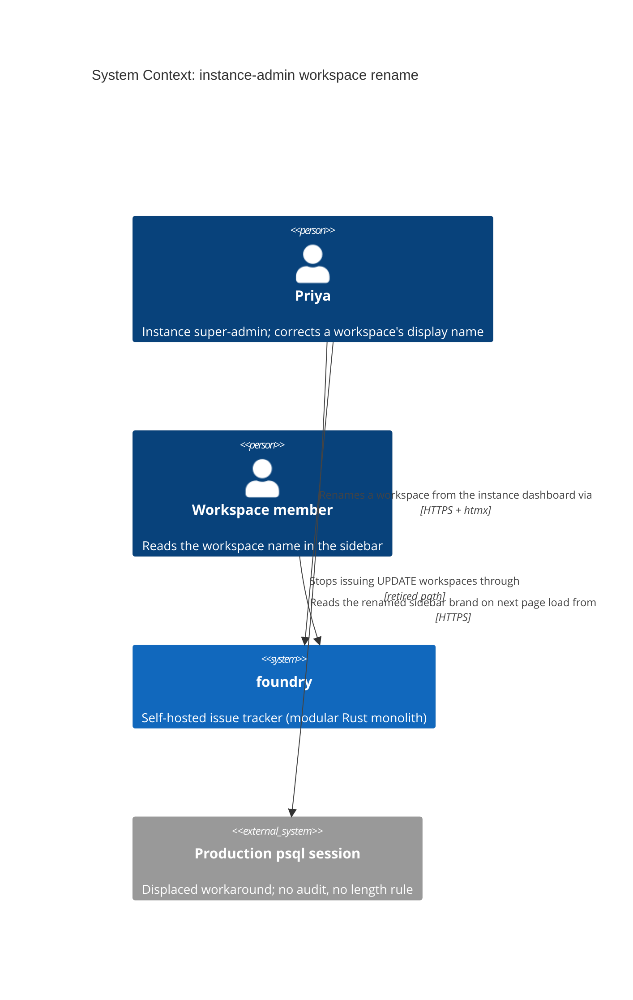
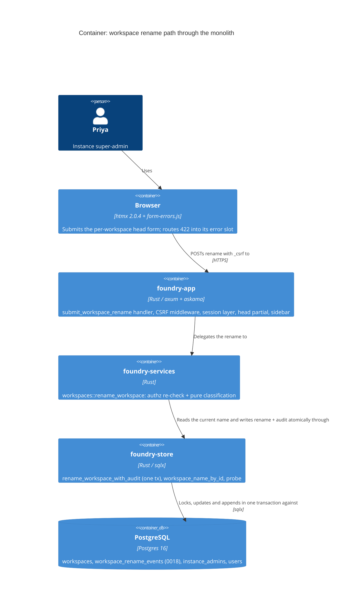

<!-- markdownlint-disable MD024 -->
# Feature Delta: instance-admin-workspace-rename

Instance super-admins can correct a workspace's display name from the instance
dashboard, the name every member reads at the top of the sidebar, with a
validation rule that keeps the sidebar legible and an append-only record of
who renamed what, from what, to what, and when.

## Wave: DISCUSS

### [REF] Prior Wave Consultation

| Artifact | Status | Note |
|---|---|---|
| `docs/product/jobs.yaml` | ✓ | Read. `job-instance-project-rename` is the closest job; a sibling job is appended (see JTBD). |
| `docs/product/personas/persona-instance-operator.yaml` | ✓ | Priya Raman (operator) and Marco (authz foil) reused unchanged; `pains_addressed_to_date` extended. |
| `docs/product/vision.md` | ⊘ | Does not exist (same as the precedent). |
| `docs/product/journeys/` | ✓ | Three journeys exist (theme, card delete, card drag); none covers the instance-admin surface. No SSOT journey created, because the precedent kept its journey inline and Decision 3 is Lightweight. |
| `docs/project-brief.md`, `docs/stakeholders.yaml` | ⊘ | Do not exist. |
| DISCOVER / DIVERGE artifacts for this feature | ⊘ | None. Job grounded in code reading plus the user's locked decisions, not interviews (recorded risk, same as the precedent). |
| Precedent `docs/feature/instance-admin-project-rename/` (feature-delta, slices 01-03) | ✓ | D1, D4 (no-op), D5, D6 and the DELIVER `data-error-target` lesson mirrored below. |
| `docs/evolution/2026-08-22-instance-admin-project-rename.md` | ✓ | Its "workspace rename" and "rename audit events" deferrals are what this feature picks up. |

No contradiction with prior evidence. A measured sidebar width led the user
to lower the length cap from 32 to 24 characters (D3).

### [REF] Persona

**Priya Raman, instance super-admin** (`persona-instance-operator`). She
provisioned every workspace through `/admin/instance/workspaces`, sometimes
under names that were right on the day and wrong a month later. Marco
(`persona-team-member-foil`), signed in but not an instance admin, is the
authorization foil.

Secondary readers of the outcome are the members of the renamed workspace,
who see the name in their sidebar. They take no action in this feature and
are not modelled as a persona.

### [REF] JTBD

**job_id: `job-instance-workspace-rename`** (appended to `docs/product/jobs.yaml`;
sibling of `job-instance-project-rename`).

One-liner: *When a workspace's name no longer says what the workspace is, I
want to correct it from the instance dashboard and keep a record of the
change, so every member's sidebar reads right and I can later answer "who
renamed this, and what was it called before?" without database surgery.*

### [REF] Locked Decisions

| ID | Decision | Rationale / source |
|---|---|---|
| D1 | **Authority**: instance admins only (`require_instance_admin`). Signed-out and non-admin callers get the byte-identical uniform non-enumerable 404 and nothing changes. | User-locked. ADR-002 idiom; mirrors project-rename D5. |
| D2 | **Endpoint**: `POST /admin/instance/workspaces/{workspace_id}/rename`, from a rename form on each workspace row of the existing dashboard, carrying the hidden `_csrf` field and mounted under the CSRF middleware and session layer. A malformed or unknown `workspace_id` gets the uniform 404, not a 400. | User-locked. Mirrors `POST /admin/instance/projects/{project_id}/rename` (`instance_admin.rs:403`). |
| D3 | **Validation**: trim; non-empty; at most **24 characters**, counted as Unicode scalars (same counting as the project limit, `foundry-services/src/projects.rs:83`). Invalid input gets 422 plus an error fragment in the row's `[data-error-slot]`. Copy: "Workspace name must not be empty" / "Workspace name must be at most 24 characters". | User-locked ("small enough that the UI doesn't look ridiculous"). The cap was lowered from 32 to 24 when the user resolved OQ-2. The sidebar text box is about 164px wide (240px sidebar minus 24px padding, 16px brand padding, 26px monogram, 10px gap; `foundry.*.css:968-1000`). That holds roughly 21 average characters at 14px semibold. At 24, a valid name truncates only when it is full of wide glyphs. A cap of 20 would be too tight: "Bailey Family Workspace" is 23 characters. D6 covers the residual case. |
| D4 | **Same name is a quiet success**: if the trimmed submission is byte-equal to the stored name, the request gets 200 with the unchanged row, no error, no write, and **no audit row**. A case-only change ("household" to "Household") counts as a real rename and is audited. | User-locked, including "no audit row for a no-op" (user-confirmed). The log records changes, not attempts, and a no-op row would add noise to "what was it called before?". |
| D5 | **Audit every effective rename** in a new append-only record: actor `user_id`, `workspace_id`, old name, new name, timestamp. The rename and its audit entry succeed or fail together (no rename without its entry, no entry without its rename). Entries are never updated or deleted by the app. | User-locked. No generic audit table exists; the nearest precedent is append-only `issue_change_events` (migration 0013). Storage shape belongs to DESIGN. |
| D6 | **Sidebar safety net**: `.sidebar__workspace` renders on a single line with an ellipsis when it overflows, and carries a `title` attribute holding the full name. This covers names created before the cap and valid names made of wide glyphs (D3), at the desktop width and at the narrow-viewport breakpoint (`foundry.*.css:1236`). | User-locked. `sidebar.html:4` has no truncation today. |
| D7 | **No uniqueness rule.** Two workspaces may share a name, as provisioning already allows today. Workspaces are identified by id. | User-confirmed. A uniqueness rule would make rename stricter than create. |
| D8 | **Display name only.** Workspaces have no slug; ids, memberships, active-workspace sessions, invites and URLs are unchanged. The sidebar monogram is derived from the name (`nav.rs:153`) and changes with it. Members see the new name on their next page load (read per request, `Store::dashboard_greeting`, no cache). Backup manifests taken earlier keep the old `declared_workspace_name` (an informational snapshot, not rewritten). | Code reading. Unlike project rename, there is no D2-style URL hazard. |
| D9 | **Error-slot routing mirrors the shipped project row**: refusals land inside the submitting row's `[data-error-slot]` (via the `data-error-target` child-selector fix) and keep landing on repeated refusals. The form stays mounted and resubmittable without a reload. | Precedent DELIVER lesson 1 (outerHTML swap consumed the slot). |
| D10 | **No DB CHECK in this feature (option A).** The 24-character rule lives in the rename path only, with no CHECK on `workspaces.name`. Provisioning, bootstrap and the admin CLI are unchanged. | User-locked (resolves OQ-1). Mirrors project rename (`projects.name` has no CHECK). The follow-ups, B and then D, are recorded under Out of Scope. |

### [REF] Open Questions

- **OQ-1 (resolved, D10)**: option A was chosen. The options it was weighed against were:
  - B: one shared validator on every write path (rename, provisioning, bootstrap, admin CLI).
  - C: a validated `CHECK (char_length(btrim(name)) BETWEEN 1 AND 24)`, which needs a legacy backfill and would turn paths without app validation into 500s.
  - D: the same CHECK added `NOT VALID`, enforced on new writes only, and safe only after B.
- **OQ-2 (resolved, D3)**: the cap is 24 characters. Ellipsis plus `title` remain as the safety net (D6).
- **OQ-3 (open, for DESIGN): audit rows in per-workspace backup/export?** The rows are keyed by workspace but written from the instance surface. DESIGN decides whether export carries them.

### [REF] Journey (lightweight: happy path plus key error paths)

Emotional arc, **Problem Relief**: mildly embarrassed (every member's sidebar
shows a wrong name) → focused (finds the row) → brief tension (will this break
anyone's session?) → relieved and accountable (name fixed, change on record).

```text
[Trigger]                  [Step 1]                      [Step 2]                         [Goal]
"Bailey Family" became →   Priya opens              →   Renames the row to         →   Row swaps to "Household";
the shared household       /admin/instance/              "Household", submits           members' sidebars read
ops space                  workspaces; each              (htmx + _csrf)                 "H  Household" on next
Feels: embarrassed         workspace row has             Feels: brief tension           page load; audit entry
                           a rename form                                                Bailey Family -> Household
                           Feels: focused                                               Feels: relieved, accountable

Error paths: empty / 25+ chars → 422, reason inside the row's error slot, old name everywhere, no audit entry.
             Marco (not instance admin) → uniform 404, nothing changes, no audit entry.
```

### [REF] Scope Assessment: PASS (1 story, 1 bounded context, estimated 1-1.5 days)

One user outcome, one module cluster (instance-admin surface, one store
write plus an append, one shell template and stylesheet rule). No walking
skeleton is needed, there are no more than 5 integration points, and the
effort is well under 2 weeks. No oversized signal fired.

### [REF] Shared Artifacts

| Artifact | Source of truth | Consumers | Risk |
|---|---|---|---|
| Workspace display name | `workspaces.name` | sidebar brand plus monogram (every app-shell page), dashboard row, `dashboard_root.html`, invite-accept, member-invite, unsubscribe pages, backup manifest at export time | HIGH: must read fresh on next render everywhere |
| Rename audit entry | new append-only record (D5) | none in-app yet (no viewer, out of scope); operator store query; KPI-1/2 instrument | HIGH: must be written atomically with the rename |
| CSRF token | `foundry_csrf` cookie plus hidden `_csrf` | new per-row rename form | HIGH: a missing field is a silent 403 |
| Uniform 404 page | `resource_not_found_page` | rename POST (non-admin, malformed id, unknown id) | MEDIUM: any divergent shape becomes an enumeration oracle |

### [REF] User Stories

#### US-IAWR-01: Correct a workspace's name from the dashboard, with the change on record

`job_id: job-instance-workspace-rename`

##### Elevator Pitch

Before: Priya can only change the name every member reads at the top of the sidebar with `UPDATE workspaces SET name = …` in production psql, which applies no length rule and leaves no record of who changed it or what it said before.
After: on `/admin/instance/workspaces` she submits the Rename form on the "Bailey Family" row (`POST /admin/instance/workspaces/{workspace_id}/rename`) with "Household" → sees the row swap in place to "Household" without a reload, and the next page she opens in that workspace shows the sidebar brand "H  Household".
Decision enabled: whether the workspace now reads correctly to its members or needs another correction. Later, she can also answer who renamed it and from what, using the audit entry instead of guesswork.

##### Problem

Priya provisioned "Bailey Family" for chores, and it has since become the
shared household-operations space. Every member's sidebar still says
"Bailey Family". Her only fix is a hand-typed `UPDATE` against production. It
applies no length rule, so a long name would overflow a 240px sidebar that
has no truncation. It also leaves no trace: with several workspaces and a
second super-admin, nobody can later tell who renamed a workspace or what it
used to be called.

##### Who

- Instance super-admin | on the instance dashboard, browser | wants the label members see to be correct, and wants the change accountable.

##### Domain Examples

1. **Happy path**: Priya renames "Bailey Family" to "Household". The row swaps in place. Members of that workspace see the brand "H  Household" on their next page load. One audit entry records Priya, the workspace, "Bailey Family" → "Household", and the time.
2. **Boundary**: "Canzan Labs Platform Ops" (exactly 24 characters) is accepted. "Canzan Labs Platform Team" (25) gets 422 with "Workspace name must be at most 24 characters", and the name stays unchanged with no audit entry. "Bailey Family Workspace" (23) is accepted.
3. **No-op and case**: submitting " Household " for "Household" is a quiet success with no audit entry (D4). Submitting "household" is a real rename and is audited.
4. **Error**: clearing the field (or entering only spaces) gets 422 with "Workspace name must not be empty", shown inside that row. Priya corrects the input and resubmits without a reload.
5. **Authz**: Marco, signed in but not an instance admin, forges the POST for "Household" and gets the byte-identical uniform 404. The name is unchanged and there is no audit entry.
6. **Legacy long name**: "Canzan Labs Platform Engineering and Site Reliability" (52 characters, provisioned before the cap) shows on one sidebar line ending in an ellipsis, and hovering shows the full name.

##### UAT Scenarios (BDD)

###### Scenario: A stale workspace name is corrected from the dashboard

- Given Priya is signed in as an instance admin and workspace "Bailey Family" exists
- When she submits the rename form on the "Bailey Family" row with "Household"
- Then the row shows "Household" without a full page reload
- And reloading the dashboard still shows "Household"
- And a member of that workspace opening any page sees "Household" with monogram "H" in the sidebar

###### Scenario: Every rename is recorded with who, what, and when

- Given Priya renames workspace "Bailey Family" to "Household"
- Then exactly one audit entry exists for that workspace naming Priya as the actor, "Bailey Family" as the old name, "Household" as the new name, and the time of the rename

###### Scenario: Renaming a workspace to its current name is a quiet success

- Given workspace "Household" exists with no audit entries
- When Priya submits " Household " on its row
- Then the row shows "Household" with no error
- And no audit entry is recorded

###### Scenario: An empty name is refused inside the row

- Given Priya is on the "Household" row
- When she submits an empty or whitespace-only name
- Then the row's error slot shows "Workspace name must not be empty" without a page reload
- And the workspace is still named "Household" and no audit entry is recorded

###### Scenario: A name past 24 characters is refused with the limit stated

- When Priya submits "Canzan Labs Platform Team" (25 characters)
- Then the row's error slot shows "Workspace name must be at most 24 characters"
- And the name and audit record are unchanged
- But submitting "Canzan Labs Platform Ops" (24 characters) succeeds

###### Scenario: Only instance admins can rename a workspace

- Given Marco is signed in but is not an instance admin
- When Marco sends the rename request for "Household" directly, or a malformed workspace id
- Then he receives the same uniform 404 page a never-existed path returns
- And the workspace is still named "Household" and no audit entry is recorded

###### Scenario: A long workspace name stays on one line in the sidebar

- Given workspace "Canzan Labs Platform Engineering and Site Reliability" exists from before the cap
- When a member opens any page in that workspace
- Then the sidebar shows the name on a single line ending in an ellipsis
- And the full name is available as the brand's hover title

##### Acceptance Criteria

- [ ] Each workspace row on the instance dashboard carries a rename form (htmx POST to `/admin/instance/workspaces/{workspace_id}/rename` with hidden `_csrf`). On success the row swaps in place and a reload persists the change (D2).
- [ ] After a rename, every app-shell page in that workspace shows the new name and monogram on the next load. Workspace id, memberships and URLs are unchanged (D8).
- [ ] Each effective rename produces exactly one append-only audit entry (actor user id, workspace id, old name, new name, timestamp), committed together with the rename (D5).
- [ ] A submission whose trimmed value equals the stored name returns 200 with the unchanged row and records no audit entry (D4).
- [ ] Empty or whitespace-only names and names over 24 characters get 422 with the D3 copy, shown inside the submitting row's `[data-error-slot]`. Repeated refusals keep displaying there, the form stays resubmittable without a reload, and nothing is written (D3, D9). Exactly 24 characters is accepted; 25 is refused.
- [ ] Signed-out, non-admin, malformed-id and unknown-id POSTs get the byte-identical uniform 404 and write nothing. A POST without a valid `_csrf` pair is refused by the middleware before the handler runs (D1, D2).
- [ ] `.sidebar__workspace` never wraps or overflows: it truncates to one line with an ellipsis and exposes the full name in `title`, at desktop and narrow-viewport widths (D6).

##### Outcome KPIs

See the KPI table below (KPI-1 to KPI-3).

##### Technical Notes

- New migration (next number after `0017`) for the audit record. Storage shape, FK and retention belong to DESIGN (OQ-3).
- `foundry.*.css` is content-hashed. Editing it re-hashes the asset, and the asset-integrity guard (ADR-CANZAN-THEME-003) must stay green.
- The browser lane (`@needs-browser`) is required for the row swap, the error-slot routing, and the sidebar single-line check. The HTTP lane cannot see any of them.
- Bootstrap, provisioning and admin-CLI name paths are untouched, and there is no DB CHECK (D10).

##### Size

1-1.5 days | 7 scenarios | 1 slice (see the taste-test note in the slice brief)

### [REF] System Constraints

- Mutating htmx triggers carry `_csrf` and mount under `csrf_middleware` plus `session_layer`, not the CSRF-exempt `/api/v1` mount.
- Authz refusals on this surface are the uniform non-enumerable 404, never 401, 403, 400 or a redirect.
- Validation failures get 422 with a bare fragment. Success fragments are bare (no `base.html`, to avoid the double-wrap hazard).
- `instance_admin` stays on the LAYER-1e allow-list. The rename crosses workspaces legitimately but is never reachable by non-super-admins.

### [REF] Outcome KPIs

Objective: workspace names are corrected through the product, within a rule
that keeps the shell legible, and every correction can be traced.

| # | Who | Does What | By How Much | Baseline | Measured By | Type |
|---|-----|-----------|-------------|----------|-------------|------|
| 1 | Instance super-admins | Rename workspaces via the dashboard instead of psql | 100% of workspace renames via UI, each in under 60s | 0% (no UI path) | Audit entry count vs. operator self-report of SQL renames (single-operator instance) | Leading |
| 2 | Instance super-admins | Can answer "who renamed this, from what?" for any rename | 100% of effective renames have exactly 1 audit entry; 0 entries for no-ops and refusals | 0% (no record exists) | Acceptance suite plus a store query comparing entry count to effective renames | Guardrail |
| 3 | Workspace members | See a single-line sidebar brand whatever the name length | 0 wrapped or overflowing brands | Unknown (no truncation CSS; legacy lengths unmeasured) | `@needs-browser` scenario with a 52-character legacy name, desktop and narrow widths | Guardrail |

At homelab scale (single-digit operators), KPIs are verified by the
acceptance suite and store queries, not analytics.

### [REF] DoD

1. All 7 UAT scenarios pass: the HTTP lane for status, fragment, authz and audit; `@needs-browser` for row swap, error slot and sidebar truncation.
2. The audit and rename atomicity is demonstrated: a forced audit-write failure leaves the name unchanged.
3. `check-arch` passes, including the LAYER-1e allow-list and the asset-integrity guard after the CSS change.
4. No new response distinguishes "exists but forbidden" from "never existed".
5. The new migration applies cleanly forward on a database containing existing workspaces, including names longer than 24 characters.
6. Round trip demonstrated: dashboard rename, then the member sidebar shows the new name and monogram, then the audit entry is present.
7. `cargo xtask smoke` passes before each commit and `cargo xtask ci` passes before push.
8. The mutation kill rate is at least 80% on modified files, with an exact 24/25 boundary example (precedent lesson 2).
9. The CHANGELOG, `jobs.yaml` and outcomes registry are updated.

### [REF] Out of Scope

- An in-app audit viewer, audit export, and a retention or purge policy.
- Back-filling audit entries for past renames, and auditing project renames (a separate retrofit).
- Follow-up B (`instance-workspace-name-rule`): apply the same 24-character rule, with the same copy, to provisioning, bootstrap and the admin CLI through one shared validator.
- Follow-up D (only after B lands): `CHECK (char_length(btrim(name)) BETWEEN 1 AND 24) NOT VALID` on `workspaces.name`, enforced on new writes with legacy rows left alone. A validated CHECK (option C) is not planned.
- A workspace-name uniqueness rule (D7).
- Workspace rename by workspace admins or members (a different authz surface).
- Live-refreshing the renaming admin's own sidebar in the same htmx swap; it updates on the next page load (D8).
- Rewriting `declared_workspace_name` in existing backups.
- Workspace deletion or archival.
- Notifying members of a rename.

### [REF] WS Strategy

No walking skeleton (Decision 2: brownfield, isolated extension of the shipped
`/admin/instance/workspaces` surface). One slice, independently demonstrable
on the live dashboard.

### [REF] Driving Ports

1. **`POST /admin/instance/workspaces/{workspace_id}/rename`** (new): form field `name` plus `_csrf`. Responses: 200 with the bare row, 422 with the bare error fragment, or the uniform 404.
2. **`GET /admin/instance/workspaces`** (delta): each workspace row renders a rename form and an error slot.
3. **Every app-shell page** (delta): the sidebar brand gains single-line truncation and a `title`.

The core needs these (shapes and placement belong to DESIGN): a workspace-name
write by id that appends its audit entry atomically, and a single-row read to
re-render the swapped row.

### [REF] Pre-requisites

None outstanding. The dashboard, `require_instance_admin`, the CSRF middleware,
`form-errors.js` with the `data-error-target` idiom, and both test lanes are all
shipped. The only new schema is the audit record.

### [REF] DoR Validation

| DoR Item | US-IAWR-01 | Evidence |
|---|---|---|
| 1. Problem in domain language | PASS | Wrong sidebar label, psql-only fix, no trace |
| 2. Persona specific | PASS | Priya Raman (instance admin), Marco as foil |
| 3. 3+ domain examples, real data | PASS | 6 examples: Bailey Family → Household, the 24/25-character pair, legacy 52-character name |
| 4. UAT 3-7 scenarios G/W/T | PASS (7) | Business-outcome titles |
| 5. AC derived from UAT | PASS | 7 ACs, each traced to at least 1 scenario |
| 6. Right-sized | PASS | 1-1.5 days, 7 scenarios (at the ceiling; see the slice taste test) |
| 7. Technical notes | PASS | Technical Notes, System Constraints, D1-D10 |
| 8. Dependencies tracked | PASS | None outstanding; OQ-1 and OQ-2 resolved; OQ-3 open for DESIGN |
| 9. Outcome KPIs measurable | PASS | KPI-1 to KPI-3 with baselines and instruments |
| JTBD traceability | PASS | `job-instance-workspace-rename` in `jobs.yaml` |
| Elevator Pitch | PASS | Real endpoint, observable row and sidebar output |

DoR status: **PASSED** (D4 and D7 user-confirmed). Per-wave peer review was not invoked (lean run;
the consolidated review runs at the end of DISTILL).

### [REF] Wave Decisions

- Feature type: user-facing. Walking skeleton: none. UX depth: lightweight. JTBD: yes (new sibling job).
- Density: lean (Tier-1 only). The ask-intelligent **compliance trigger fired** ("audit" in the ACs), suggesting `journey-deep-dive`. The user **skipped** it, so the delta stays Tier-1 only.
- Upstream changes: none to DISCOVER (none exists). This closes two deferrals recorded by the project-rename evolution doc (workspace rename, rename audit events), the latter for workspaces only.

## Wave: DESIGN

Architect: Morgan (nw-solution-architect) | Date: 2026-10-05 | Scope: application (Decision 0) | Mode: propose, user said "just pick the best one" (Decision 1) | Paradigm: OOP (CLAUDE.md, unchanged) | Density: lean, Tier-1 only. DESIGN declares no ask-intelligent triggers, so no expansion menu. Rigor `adr-025-scaffolded-red`; per-wave review skipped (no trigger: no contested ADR, no novel pattern, no security-boundary change. The authz surface reuses `require_instance_admin` unchanged).

### [REF] Prior Wave Consultation

| Artifact | Status |
|---|---|
| `docs/product/architecture/brief.md` | ✓ Application Architecture read. No C4 L1/L2 exists in the brief, so the delta diagrams are below. |
| `adr-project-rename-001`, `adr-project-rename-002` | ✓ 002 (services use-case + typed outcomes, handler owns copy) is mirrored. 001 does not apply (workspaces have no slug, D8). |
| `docs/feature/instance-admin-project-rename/design/*`, `docs/evolution/2026-08-22-instance-admin-project-rename.md` | ✓ Mirrored wherever it applies. |
| DISCUSS `feature-delta.md` (D1-D10, US-IAWR-01), `slices/slice-01-rename-with-audit.md` | ✓ Read. No contradiction found. |
| `docs/feature/{id}/discuss/*.md`, `spike/findings.md` | ⊘ Not used. The lean layout keeps DISCUSS in `feature-delta.md`, and no spike was run. |
| `docs/product/outcomes/registry.yaml` | ✓ OUT-1 (project rename) and OUT-7 (lane rename) are the nearest siblings. |

Code read: `instance_admin.rs` (`show_dashboard`:77, `require_instance_admin`:294, `submit_project_rename`:403), `foundry-services/src/projects.rs`, `foundry-store/src/lib.rs` (`TENANT_TABLES`:105, `export_workspace`:909, `probe`:206, `record_issue_change`:2001, `update_project_name`:4057), `verify_export.rs`, `admin_cli.rs` (`KNOWN_FOUNDRY_TABLES`:201), migrations 0001/0011/0013, `instance_dashboard.html`, `partials/instance_project_row.html`, `partials/sidebar.html`, `foundry.6b3e4436.css`:978-1000 and 1230-1260, `static/VENDOR.md`, `xtask/src/check_arch.rs` (LAYER-1e).

### [REF] DDD List (design decisions)

| ID | Decision | Verdict | One-line rationale |
|---|---|---|---|
| DDD-1 | **Where the write lives.** Options: (a) a `foundry_services::workspaces::rename_workspace` use-case over one atomic store method; (b) the handler calls the store directly (`submit_grant` idiom); (c) validation in SQL CHECKs. | **(a)** | Mirrors ADR-PROJECT-RENAME-002: an in-seam `is_instance_admin` re-check for a cross-tenant write, and a pure classifier that can be unit-tested and mutation-tested without HTTP. (b) loses both. (c) is ruled out by D10. |
| DDD-2 | **Atomicity.** Options: (a) one store method runs one transaction: `SELECT name … FOR UPDATE`, then the no-op compare, `UPDATE`, and `INSERT` the audit row, then commit; (b) a single-statement CTE (`WITH old AS (… FOR UPDATE), upd AS (UPDATE …), INSERT …`); (c) the services layer drives a transaction handle; (d) a DB trigger writes the audit row. | **(a)** | It is the shipped `reposition_issue_with_outbox` and `record_issue_change` idiom. (b) is correct but opaque. (c) leaks `sqlx::Transaction` into `foundry-services`. (d) cannot see the actor without a session GUC, and it hides behaviour from the code. |
| DDD-3 | **Same-name detection.** It happens in two places. The use-case reads the current name before classifying, so D4's no-op wins over the 422 gates (an untouched 52-character legacy name resubmitted from the pre-filled form is a quiet 200, as in the project precedent). The store transaction then re-checks the name under the row lock and is **authoritative**. | **Locked** | Whatever the pre-read sees, only the locked read decides whether anything is written. The audit row's `old_name` always comes from the locked read, never from the pre-read, so two concurrent renames serialize and each audit row is exact. |
| DDD-4 | **Audit storage.** Options: (a) a dedicated `workspace_rename_events` table; (b) a generic `instance_admin_audit(kind, payload jsonb)`; (c) widening `issue_change_events`. | **(a)** | It mirrors 0013: typed, append-only, and queryable without JSON. (b) is speculative generality, since project-rename auditing is out of scope and one event kind does not justify a schema with no types. (c) would break 0013's issue-scoped NOT NULLs. |
| DDD-5 | **Table shape (migration `0018_workspace_rename_events.sql`).** Columns: `id UUID PK` (app-minted uuid v7, the 0013 idiom); `workspace_id UUID NOT NULL REFERENCES workspaces(id) ON DELETE CASCADE`; `actor_id UUID NOT NULL REFERENCES users(id)` (no ON DELETE action); `old_name TEXT NOT NULL`; `new_name TEXT NOT NULL`; `created_at TIMESTAMPTZ NOT NULL DEFAULT now()`; `CHECK (old_name <> new_name)`; index `(workspace_id, created_at)`. Purely additive, with no backfill and no CHECK on `workspaces.name` (D10). | **Locked** | The FK semantics copy 0013 exactly: the record lives and dies with its workspace (no deletion path exists, so this is out of scope), and the actor FK refuses to delete a user who appears in the audit. The `old <> new` CHECK enforces D4's "no audit row for a no-op" in the schema as well as in code. |
| DDD-6 | **OQ-3: should audit rows go into the per-workspace export?** Options: (a) exclude them, so `TENANT_TABLES` stays at ten; (b) add an 11th tenant table; (c) export them in a separate, non-verified section. | **(a) Exclude** | See [REF] OQ-3 Resolution and ADR-WORKSPACE-RENAME-002. |
| DDD-7 | **Swap target.** Options: (a) a new bare partial `partials/instance_workspace_head.html` (`[data-workspace-head]`: name span, rename form, error slot) inside the existing `<li data-workspace-row>`, swapped by `outerHTML`; (b) swap the whole `<li>`, which re-renders its nested project rows; (c) swap only the name span with `innerHTML`. | **(a)** | Nested project rows, including any project-rename input or error that is in flight, are untouched, and no project read is needed. One partial serves both the dashboard loop and the 200 fragment (the one-partial rule). (b) clobbers sibling state and costs an instance-wide read. (c) leaves the form un-remounted and diverges from precedent. |
| DDD-8 | **Fragment data source.** The 200 fragment renders from the outcome's name (`Renamed{name}` or `NoOp{name}`) plus `ensure_csrf_cookie`. | **Locked** | The name comes from a committed transaction or a read. This removes the precedent's re-read of the whole listing, and no new single-row store read is needed (Changed Assumption 1). |
| DDD-9 | **Validation.** A pure `classify_workspace_rename(raw, current)` in `foundry-services::workspaces` checks, in order: trim, then no-op, then empty, then over 24 Unicode scalars (`chars().count()`). A `pub` 24-character constant serves follow-up B. The handler owns the D3 copy. | **Locked** | This is the precedent's ordered-check contract, without the uniqueness arm (D7). Making it `pub` lets follow-up B (provisioning, bootstrap, CLI) reuse one validator instead of re-deriving it. |
| DDD-10 | **Sidebar safety net (D6).** The edit point is the `.sidebar__workspace` rule in `crates/foundry-app/static/css/foundry.<hash>.css`, currently `foundry.6b3e4436.css`:997, plus a `title` attribute on `partials/sidebar.html`:4. After the edit the file **must be re-hashed in the same change**: the new name is `foundry.<first 8 hex of sha256>.css`, and all five reference sites follow (`base.html` link, the three cache-test literals in `foundry-app/src/lib.rs`, and the `VENDOR.md` row plus its prose note). `check-arch` R1, R2 and R3 fail the build if any of the five is missed. | **Locked** | The pipeline is hand-authored CSS whose filename is its content hash (ADR-CANZAN-THEME-003). There is no build step, so the rename is manual and the guard is what enforces it. |
| DDD-11 | **Readiness probe.** Extend `Store::probe` to refuse a schema missing `workspace_rename_events` and its columns. Options: (a) extend the probe; (b) rely on `run_migrations` at boot. | **(a)** | Same idiom as the 0006, 0007, 0008 and 0017 probes (Earned Trust: a half-migrated schema fails `/readyz` instead of turning the rename into a 500). |
| DDD-12 | **Naming guard.** The store write must not end in `_in_workspace(`. It is named `rename_workspace_with_audit`. | **Locked** | `check-arch` LAYER-1e treats `*_in_workspace(` as a tenant-scoped call. This write is instance-scoped by design, from the allow-listed `instance_admin.rs`, and its name must say so (as with `list_projects_for_instance`). |

### [REF] OQ-3 Resolution (closed by DDD-6)

**Audit rows are NOT added to the per-workspace export. `TENANT_TABLES` stays at ten.**

1. **Tenant isolation would break.** The actor is an instance admin, and that user is usually not a member of the workspace (ADR-003 of multi-workspace-provisioning: "a super-admin is NOT a workspace member"). The export's `users` predicate is membership-bounded. Exporting `actor_id` would either leave a dangling FK in the archive, which `verify-export` reports as an isolation violation, or force the predicate to widen and leak a non-member's `users` row into a tenant archive.
2. **It is an instance record, not tenant content.** The row records an operator action on the instance surface, and members cannot see it (there is no viewer, D5). It belongs in the whole-instance `pg_dump` backup, which already includes every table automatically and needs no code change.
3. **No per-workspace restore exists.** The per-workspace path is export plus `verify-export` only, and there is no import or restore that FK ordering could break. `admin_cli` restore is whole-instance `pg_restore`.
4. **Precedent.** `issue_change_events` (0013), `notification_unsubscribes` (0014) and `project_lanes` (0015) all shipped after per-workspace-backup and are not in `TENANT_TABLES`. The "ten" invariant and its tests (the `export_workspace_gold` plant-a-row test, `verify_export` completeness, the CLI manifest, and the acceptance steps) stay untouched.
5. `admin_cli::KNOWN_FOUNDRY_TABLES` (the row-count report of the whole-instance backup-verify) is also left unchanged, consistent with 0013. Widening it is a separate decision.

Consequence, recorded for DISTILL: a guard scenario may assert that a per-workspace export taken after a rename still lists exactly ten tables and passes `verify-export`. The manifest's `declared_workspace_name` reflects the name at export time (D8).

### [REF] Component Decomposition

| Component | Path | Change type |
|---|---|---|
| Migration | `crates/foundry-store/migrations/0018_workspace_rename_events.sql` | CREATE (DDD-5) |
| Store atomic write | `crates/foundry-store/src/lib.rs`: `Store::rename_workspace_with_audit(workspace_id, actor_id, new_name) -> Result<WorkspaceRenameWrite, StoreError>`, where `WorkspaceRenameWrite = Renamed{old_name} \| Unchanged \| NotFound` | EXTEND `Store` (new method + outcome enum) |
| Store context read | `crates/foundry-store/src/lib.rs`: a current-name-by-id read (for example `workspace_name_by_id(id) -> Option<String>`), non-locking | EXTEND `Store` |
| Store probe | `crates/foundry-store/src/lib.rs` `Store::probe` | EXTEND (DDD-11) |
| Use-case | `crates/foundry-services/src/workspaces.rs` (new module): `RenameWorkspaceRequest{acting_user_id, workspace_id, new_name}`, `WorkspaceRenameOutcome{Renamed{name}, NoOp{name}}`, `RenameWorkspaceError{Forbidden, NotFound, EmptyName, NameTooLong, Store}`, pure `classify_workspace_rename`, `Services::rename_workspace` delegate | CREATE module (mirrors `projects.rs`) |
| Driving adapter | `crates/foundry-app/src/instance_admin.rs`: `submit_workspace_rename` handler + reuse of `RenameForm`, `require_instance_admin`, `ensure_csrf_cookie`, `resource_not_found_page`, `internal_error` | EXTEND |
| Route | `crates/foundry-app/src/lib.rs` `build_router`: `POST /admin/instance/workspaces/{workspace_id}/rename` beside the project rename route (line ~756), under `csrf_middleware` + `session_layer` | EXTEND |
| View model | `crates/foundry-app/src/views.rs`: `InstanceWorkspaceHeadView{workspace_id, name, csrf}` (Template, the head partial); `InstanceWorkspaceRow` carries the rendered head | EXTEND |
| Templates | `templates/partials/instance_workspace_head.html` (CREATE; `[data-workspace-head]`, `[data-workspace-name]`, form `hx-target="closest [data-workspace-head]"` `hx-swap="outerHTML"` `data-error-target="#workspace-rename-error-{id} > *"`, slot `id="workspace-rename-error-{id}"` with `[data-error-anchor]`); `templates/instance_dashboard.html` (EXTEND: the `<li>` renders the head partial instead of bare `{{ workspace.name }}`) | CREATE + EXTEND |
| Error fragment | shared `ErrorFragment` / `error_fragment.html`, marker `workspace-rename-error` | REUSE (generalize the `rename_error_fragment` helper to take the marker) |
| Sidebar | `templates/partials/sidebar.html`:4 (`title` attribute); `static/css/foundry.<hash>.css` `.sidebar__workspace` and, inside `@media (max-width: 480px)`, the brand bounded to the bar width; re-hash plus five reference sites (DDD-10) | EXTEND |
| Tests (owned by DISTILL/DELIVER) | `foundry-services` unit/proptests for `classify_workspace_rename`; `foundry-store/tests/` transaction and FK tests; acceptance HTTP plus `@needs-browser` | n/a here |

### [REF] Driving Ports

1. `POST /admin/instance/workspaces/{workspace_id}/rename`. Form `name`, `_csrf`. `Path<String>` is parsed to a `Uuid` inside the handler, so a malformed id gets the uniform 404 and no 400 oracle. Responses: 200 bare `instance_workspace_head` fragment (Renamed or NoOp); 422 bare `ErrorFragment` (`workspace-rename-error`); uniform 404 for signed-out, non-admin, malformed id, unknown id, or `Forbidden`/`NotFound` from the use-case; 403 from the middleware for a bad `_csrf` before the handler runs; 500 `internal error` for a store failure.
2. `GET /admin/instance/workspaces` (delta): every `[data-workspace-row]` renders `[data-workspace-head]` containing `[data-workspace-name]`, the rename form, and the error slot.
3. Every app-shell page (delta): `.sidebar__workspace` carries `title="{full name}"` and renders on a single line with an ellipsis.

Authorization matrix: identical to project rename §5.4. The gate is checked twice: the session gate, then `is_instance_admin` inside the use-case.

### [REF] Driven Ports and Adapters

| Port (Store method) | Adapter | Effect | Contract shape |
|---|---|---|---|
| `is_instance_admin(user_id)` | sqlx/Postgres (shipped) | read | pure read |
| `workspace_name_by_id(id)` (new) | sqlx/Postgres | read, non-locking | pure read; `None` maps to NotFound |
| `rename_workspace_with_audit(id, actor, new_name)` (new) | sqlx/Postgres, one transaction | writes `workspaces.name` + inserts one `workspace_rename_events` row | **bounded-change**: mutation set = {`workspaces.name` of row `id`, +1 `workspace_rename_events` row}; universe = `workspaces` ∪ `workspace_rename_events`; `Unchanged` and `NotFound` write nothing. Assertion mechanism: a store test snapshots both tables before and after (exactly one name differs, exactly one event row was added, all other rows are byte-identical), plus FK fault injection (see OQ-D2) |
| `probe()` (extended) | sqlx/Postgres | read | pure read; refusal causes `/readyz` to fail |

The use-case's classifier `classify_workspace_rename` is a **pure function** (it only returns a value). No driving port that only reads exposes a write. There are no external integrations, so **no contract tests are needed**.

### [REF] Technology Choices

No new technology, crate, or dependency. Rust (workspace toolchain, unchanged), axum, askama, sqlx/Postgres 16, htmx 2.0.4, and `form-errors.js` (unchanged; the per-row `data-error-target` idiom already supports a second form per row). uuid v7 (already used by 0013). Enforcement: `cargo xtask check-arch` (LAYER-1e allow-list, R1/R2/R3 asset integrity) and `deny.toml`, both inside `cargo xtask ci`. The `foundry-services` → `foundry-store` direction is unchanged.

### [REF] Decisions Table

| ID | Locked decision |
|---|---|
| DDD-1 | `foundry_services::workspaces::rename_workspace` use-case; the handler maps typed results to copy and status codes |
| DDD-2 | One store transaction does the row lock, the no-op compare, the UPDATE and the audit INSERT |
| DDD-3 | Same-name check: a pre-read for 422 precedence, then the authoritative check under lock; `old_name` comes from the locked read |
| DDD-4 | Dedicated `workspace_rename_events` table |
| DDD-5 | Migration `0018`: columns as listed, workspace FK CASCADE, actor FK with no ON DELETE action, `CHECK (old_name <> new_name)`, index `(workspace_id, created_at)` |
| DDD-6 | OQ-3: excluded from the per-workspace export; `TENANT_TABLES` stays at ten |
| DDD-7 | Swap target is the new `[data-workspace-head]` partial, not the whole `<li>` |
| DDD-8 | The 200 fragment renders from the outcome name; no re-read |
| DDD-9 | Pure ordered classifier (trim, no-op, empty, over 24 scalars); `pub` cap constant |
| DDD-10 | CSS edit + re-hash + five reference sites in one change; `title` on the sidebar span |
| DDD-11 | `Store::probe` refuses a schema without 0018 |
| DDD-12 | Store write named `rename_workspace_with_audit` (never `*_in_workspace`) |

### [REF] Reuse Analysis

| Existing Component | File | Overlap | Decision | Justification |
|---|---|---|---|---|
| `submit_project_rename` + `RenameForm` | `foundry-app/src/instance_admin.rs`:385-447 | Parse id, gate, delegate, map to 200/422/404 | EXTEND (sibling handler in the same file, reusing `RenameForm`) | Same surface and the same gate. A shared generic handler would hide which copy maps to which resource for roughly 30 lines of savings. |
| `require_instance_admin`, `ensure_csrf_cookie`, `resource_not_found_page`, `internal_error`, `html_with_optional_cookie` | `instance_admin.rs`, `bootstrap.rs` | Gate, CSRF, uniform 404, errors | EXTEND (reuse verbatim) | Shipped and correct. |
| `rename_error_fragment` + `ErrorFragment` | `instance_admin.rs`:478, `views.rs` | 422 bare fragment | EXTEND (parameterize the marker) | It differs only by the marker string. |
| `foundry_services::projects` (`classify_rename`, `RenameOutcome`, `RenameProjectError`) | `foundry-services/src/projects.rs` | Ordered trim/no-op/empty/length classification | CREATE NEW module `workspaces.rs` (mirrors the shape) | The project types carry project semantics (`DuplicateName`, a 256 cap, slug collision). Reusing them would put a variant that can never occur into the workspace contract and couple two caps that follow-up B will evolve separately. The shared part is about 6 lines of trim-and-count, which is below the extraction threshold. |
| `update_project_name` / `project_rename_context` | `foundry-store/src/lib.rs`:4019-4068 | Name UPDATE, context read | CREATE NEW (`rename_workspace_with_audit`, `workspace_name_by_id`) | A different table, and the write must be transactional with an audit INSERT. The project method is pool-level and has no audit. |
| `record_issue_change` / `reposition_issue_with_outbox` | `foundry-store/src/lib.rs`:2001, 1806 | Append-only audit inside the mutation's transaction; uuid v7 ids; outcome enum | EXTEND the idiom (same pattern, new table) | This is the proven audit-atomicity precedent. 0013's table cannot hold the row because its issue/project columns are NOT NULL. |
| `issue_change_events` migration 0013 | `migrations/0013_issue_change_events.sql` | Append-only audit schema | CREATE NEW table (copies the conventions) | DDD-4. |
| `instance_project_row.html` | `templates/partials/` | Per-row htmx form + `data-error-target` slot | CREATE NEW partial `instance_workspace_head.html` (same idiom) | A different resource and different markers. The idiom, comment block included, is copied verbatim. |
| `list_workspaces` | `foundry-store/src/lib.rs`:789 | Could re-read for the fragment | NOT USED for the fragment (DDD-8) | The outcome already carries the committed name. |
| `TENANT_TABLES` / `export_workspace` / `verify_export` | `foundry-store/src/lib.rs`:105, 909; `verify_export.rs` | Backup scope | UNCHANGED (DDD-6) | See OQ-3. |
| `Store::probe` | `foundry-store/src/lib.rs`:206 | Schema substrate check | EXTEND | DDD-11. |
| `form-errors.js` | `static/js/form-errors.js` | Error-slot routing | REUSE unchanged | Per-row `closest('form')` plus `data-error-target` already disambiguates. |

Zero unjustified CREATE NEW decisions.

### [REF] C4 System Context (L1, delta)



There is no new external system, and Keycloak is untouched.

### [REF] C4 Container (L2, delta)



L3 is omitted: there is one new module per container, and the L2 diagram plus the transaction contract (DDD-2) carry the full picture.

### [REF] Quality Attributes

- **Correctness and auditability**: atomicity comes from one transaction. The no-op rule is enforced twice: in code, and by `CHECK (old_name <> new_name)` in the schema. `old_name` is the value read under lock. KPI-2's "exactly one entry per effective rename, zero for no-ops or refusals" is structurally true.
- **Security**: there is no new authz path. Every refusal is the uniform 404, and the admin check runs twice. Askama escapes the name in the `title` attribute. The write is instance-scoped by name (DDD-12) and runs from the LAYER-1e allow-listed file.
- **Testability**: the classifier is pure and can be checked with proptests at the exact 24/25 boundary (precedent lesson 2). The store transaction is testable against real Postgres (testcontainers).
- **Performance**: the rename does at most 4 queries, and the dashboard query count is unchanged. Homelab scale, so no caching.
- **Maintainability**: the code mirrors the project-rename shape file for file. The `pub` cap constant is the reuse point for follow-up B.

### [REF] Open Questions (for DISTILL / DELIVER)

- **OQ-D1 (DISTILL)**: the observable for "the row swaps" is now `[data-workspace-head]` / `[data-workspace-name]` inside `[data-workspace-row]` (DDD-7). Check that shipped steps reading the `<li>`'s text still match; the name stays inside the `<li>`. The project-row markers must survive a workspace rename byte-identical (a guard assertion).
- **OQ-D2 (DISTILL)**: DoD 2 "a forced audit-write failure leaves the name unchanged". The actor FK gives a fault-injection seam that needs no production code: a store-level test calls `rename_workspace_with_audit` with a non-existent `actor_id`. The INSERT fails after the UPDATE, and the name must be unchanged with zero event rows. This is not reachable over HTTP (the actor is always a real session user), so the test belongs in `foundry-store/tests/`, not the acceptance lane.
- **OQ-D3 (DISTILL)**: narrow-viewport D6. At ≤480px the sidebar is a wrapping flex row, so the brand must be bounded by the bar width, or a `nowrap` name widens the page. The browser scenario should assert both the ellipsis and no horizontal page overflow at 480px and at desktop width.
- **OQ-D4 (DELIVER)**: other sessions share this worktree. The CSS edit and re-hash must land as one step and one commit, after checking `git log` for a concurrent re-hash. If another session re-hashes first, rebase onto its filename.
- **OQ-D5 (DISTILL)**: the outcomes registry gets a new OUT row at DISTILL, `related: [OUT-1]` (a sibling, not a duplicate). See the Outcome Collision Check.

### [REF] Outcome Collision Check

`nwave-ai outcomes check-delta docs/feature/instance-admin-workspace-rename/feature-delta.md` exited **0** on 2026-10-05: "2 outcomes checked, 0 collisions found across 0 outcomes". The gate passes, and the registry is unchanged at DESIGN. OUT-1 (project rename) is a sibling contract, not a duplicate. The new OUT row added at DISTILL should carry `related: [OUT-1]` (OQ-D5).

### [REF] Changed Assumptions

1. Original (DISCUSS, [REF] Driving Ports): *"The core needs these (shapes and placement belong to DESIGN): a workspace-name write by id that appends its audit entry atomically, and a single-row read to re-render the swapped row."* New: no single-row read is needed to re-render. The 200 fragment renders from the use-case outcome's name (DDD-8). The only new read is the non-locking current-name pre-read that gives D4 precedence over the 422 gates (DDD-3).
2. Original (DISCUSS, US-IAWR-01 AC 1): *"On success the row swaps in place."* New: what swaps is the row's head (`[data-workspace-head]`: name, form, error slot), not the whole `<li data-workspace-row>`. Nested project rows are untouched (DDD-7). The observable behaviour is the same, so no story or AC change is needed and `upstream-changes.md` is not created.
3. Original (DISCUSS, Technical Notes): *"Storage shape, FK and retention belong to DESIGN (OQ-3)."* New: the shape and FKs are locked in DDD-5, and OQ-3 is closed in DDD-6. Retention stays out of scope (append-only, no purge), as DISCUSS Out of Scope already says.

### [REF] Handoff

- **DISTILL (acceptance-designer)**: these seams are pinned: route, `[data-workspace-head]`, `[data-workspace-name]`, `#workspace-rename-error-{id}`, marker `workspace-rename-error`, the two D3 strings verbatim, table `workspace_rename_events` (columns per DDD-5), `.sidebar__workspace[title]`. See OQ-D1 to OQ-D5.
- **DEVOPS (platform-architect)**: one forward-only additive migration (0018), applied by the existing boot-time `run_migrations`, with the probe extended. No infrastructure delta. **No external integrations, so no contract tests are required.** Paradigm OOP (`nw-software-crafter`).
- **ADRs**: `docs/product/architecture/adr-workspace-rename-001-audited-rename-transaction.md`, `docs/product/architecture/adr-workspace-rename-002-rename-audit-not-tenant-export.md`.

## Wave: DISTILL

Acceptance designer: Quinn (nw-acceptance-designer) | Date: 2026-10-05 | Rigor
`adr-025-scaffolded-red` | Density: lean, Tier-1 [REF] only; DISTILL declares no
ask-intelligent triggers, so no expansion menu. `[lang-mode] rust` (cucumber-rs +
`cargo test`). `[policy-mode] inherit` (`docs/architecture/atdd-infrastructure-policy.md`,
two rows appended). `[port-mode]` none: as in every prior feature here, the state
delta is a module-local fail-closed helper (`assert_universe_delta`), not a shared
port. Nothing is committed by DISTILL; DELIVER commits on GREEN.

### [REF] Reconciliation

**Passed — 0 contradictions.** Each DISCUSS decision has a DESIGN counterpart: D1/D2
↔ Driving Port 1 and the authz matrix; D3 ↔ DDD-9; D4 ↔ DDD-3 and the DDD-5 CHECK;
D5 ↔ DDD-2/4/5; D6 ↔ DDD-10; D7 ↔ DDD-9 (no uniqueness arm); D8 ↔ DDD-8 and Changed
Assumption 1; D9 ↔ the DDD-7 partial (`data-error-target`); D10 ↔ DDD-5 (no CHECK on
`workspaces.name`). DESIGN's three Changed Assumptions refine DISCUSS without changing
an observable. There is no DEVOPS section: WARN, default environment matrix. Tier A
only: every scenario is layer 3 (real router, real Postgres, real Chrome, real CLI),
so all are example-based (Mandates 9 and 11). Tier B is not warranted: the longest
journey chains two scenarios and the input space is one string.

### [REF] Scenario list with tags

`.feature` SSOT: `crates/foundry-acceptance/tests/features/instance-admin-workspace-rename.feature`.
Feature tag `@iawr`; every scenario carries `@us-iawr-01`, `@real-io`, `@pending` and
a `@contract-shape:` tag (`bounded-change` = one name moves and one record is added;
`unbounded-preservation` = nothing moves; `pure-function` = a read). Background (the
precedent's steps): Priya is the instance super-admin; "Canzan Labs" with projects
"Auth v2" and "Sandbox"; "Bailey Family" with none; plus Dana, a member of "Bailey
Family".

| # | Scenario | Extra tags | AC / D | Oracle |
|---|---|---|---|---|
| 1 | A stale workspace name is corrected from the dashboard | `@driving_port` | AC1, D2 | 200 bare `[data-workspace-head]` whose `[data-workspace-name]` is exactly "Household", no `<html`; state delta: only this name moves, one record appended (Priya, old, new, time); reloaded dashboard shows it under the same `data-workspace-id` and the list no longer says "Bailey Family"; every other workspace unchanged |
| 2 | Members read the new name in their sidebar on their next page | `@driving_port` | AC2, D8, D6 | Dana's `/`: `.sidebar__workspace` = "Household", `.sidebar__monogram` = "H", `title` = "Household"; her membership and the workspace id are unchanged |
| 3 | Every rename is on record with who, what, and when | `@driving_port @kpi` | AC3, D5, KPI-2 | Exactly 1 record for the workspace; latest names Priya, "Bailey Family" → "Household", `created_at` inside the database-clock window around the request |
| 4 | Changing only the letter case is a real rename and goes on record | `@edge` | D4 | Chains 1 (Pillar 2). 2 records; latest "Household" → "household" |
| 5 | Renaming a workspace to its current name is a quiet success | `@edge` | AC4, D4 | Chains 1. " Household " → 200 head "Household", no `workspace-rename-error`; universe unchanged (no write, no record) |
| 6 | An over-long name from before the limit can be left as it is | `@edge` | DDD-3 | 52-character legacy name resubmitted → 200, no error, universe unchanged (no-op wins over the 422 gate) |
| 7 | Two workspaces may share a name | `@edge` | D7 | "Bailey Family" → "Canzan Labs" accepted; 1 record on the renamed one |
| 8 | A name of up to 24 characters is accepted (3 examples) | `@edge` | AC5, D3 | "Canzan Labs Platform Ops" (24), "Bailey Family Workspace" (23), "Ångström Øresund Société" (24 scalars, 28 bytes) each accepted with one record |
| 9 | Spaces around a name are trimmed before the limit is counted | `@edge` | D3 | "  Canzan Labs Platform Ops  " → stored and recorded trimmed |
| 10 | A name past 24 characters is refused with the limit stated (2 examples) | `@error` | AC5, D3 | "Canzan Labs Platform Team" (25), "Ångström Øresund Sociétés" (25 scalars) → 422 bare `workspace-rename-error` with the D3 copy; universe unchanged; no record |
| 11 | An empty name is refused with the reason stated | `@error` | AC5, D3 | "" → 422 "Workspace name must not be empty"; nothing written |
| 12 | A name of only spaces counts as empty | `@error @edge` | AC5, D3 | "   " → same |
| 13 | A name with markup characters is shown exactly as typed | `@error @security` | D6 (escaping) | `<b>Ops</b> & 'Co'` round-trips as text in the head, the sidebar (monogram "<") and the `title` |
| 14 | Only the instance admin can rename a workspace | `@error @security` | AC6, D1 | Marco's POST → byte-identical never-existed answer; universe unchanged; no record |
| 15 | A signed-out visitor cannot rename a workspace | `@error @security` | AC6, D1 | Valid CSRF pair, no session → byte-identical answer; nothing written |
| 16 | A workspace rename that does not carry the dashboard's matching token is refused | `@error @security` | AC6, D2 | 403 from the middleware; nothing written |
| 17 | A workspace rename aimed at a garbled workspace id is answered like a missing page | `@error @security` | AC6, D2 | "not-a-uuid" → byte-identical answer (no 400 oracle); universe unchanged |
| 18 | A workspace rename aimed at a workspace that does not exist is answered like a missing page | `@error @security` | AC6 | Fresh v7 id → same |
| 19 | Renaming a workspace leaves the projects listed under it exactly as they were | `@guard` | OQ-D1, DDD-7 | The SERVED bytes of every `<li data-project-row>` under the workspace (only the per-sign-in `_csrf` value redacted) are identical before and after; the precedent's own grouping step still finds "Auth v2"/"Sandbox" under "Canzan Platform" and "Chores" under "Bailey Family" |
| 20 | A workspace backup taken after a rename carries the new name and no rename record | `@guard` | ADR-002, D8 | Real `foundry doctor export-workspace <id>`: exit 0; tar entries are exactly `manifest.json` + the ten `TENANT_TABLES`; manifest never mentions `workspace_rename_events`; `declared_workspace_name` = "Household"; `verify-export` exits 0 ending `status: OK` |
| 21 | The workspace row updates in place when the rename succeeds | `@needs-browser @driving_port` | AC1, DDD-7 | Real Chrome: the head under `[data-workspace-id=…]` re-renders "Household"; the precedent's page-lifetime marker survives (no reload); both project rows still present |
| 22 | Refused workspace renames explain themselves inside the row, every time | `@needs-browser @error` | AC5, D9 | Blank → "must not be empty" inside THIS head's `[data-error-slot]`; then 25 characters → "at most 24 characters" in the same slot (a second, different message proves the slot survived the first swap); form still mounted; then "Household" succeeds without reload |
| 23 | A long workspace name stays on one line in the sidebar (2 examples: desktop, phone-sized) | `@needs-browser @edge @kpi` | AC7, D6, OQ-D3, KPI-3 | 52-character name: brand height < 1.5 line-heights, `text-overflow: ellipsis`, overflow clipped, `scrollWidth > clientWidth` (really truncated), brand's right edge inside the page; `title` = full name; `documentElement.scrollWidth <= clientWidth`. Phone = `open_mobile_session` (390px, real mobile emulation, ≤480px breakpoint) |

Examples: **27 across 23 scenarios**. Error/security examples: 10a, 10b, 11, 12, 13,
14, 15, 16, 17, 18, 22 = **11 of 27 = 41%** (target ≥ 40%). Walking skeleton: none
(DISCUSS: brownfield extension); scenarios 1 and 21 are the `@driving_port` demos.
Step reuse (informational, Mandate-12 criterion 4): 96 step lines over 45 distinct
steps (38 new, 7 reused from the precedent) ≈ 2.1×.

### [REF] RED classification (fail-for-the-right-reason gate)

Procedure: `cargo build -p foundry-app --bin foundry` and `cargo test -p
foundry-acceptance --test acceptance --no-run`, then one tag run with `@pending`
present to warm the binary (0 scenarios). The `.feature` was copied to the
scratchpad, `sed -i '' 's/ @pending//'` stripped the tag,
`FOUNDRY_ACCEPTANCE_TAGS=iawr timeout 1200 cargo test -p foundry-acceptance --test
acceptance` ran (HTTP + `@needs-browser`, Docker up), and the file was restored from
the copy (every scenario tag line carries `@pending` again; 0 without). Result:
**27 examples, 27 failed; 170 steps, 143 passed, 27 failed; 0 parsing errors, 0
undefined steps, 0 hook errors. 27 MISSING_FUNCTIONALITY, 0 GREEN_ALREADY, 0 BROKEN.**

| Scenarios | First failing step | Evidence | Class |
|---|---|---|---|
| 1, 6, 7, 8a-c, 9, 13 | `the workspace row she gets back shows …` | status 404, body = the uniform "Not found" page: the route is not mounted | MISSING_FUNCTIONALITY |
| 2, 4, 5, 19, 20 | `Given Priya has renamed workspace …` | same 404 | MISSING_FUNCTIONALITY |
| 3 | `workspace "Household" has exactly 1 rename on record` | `MISSING: the workspace rename record does not exist yet (migration 0018…)` | MISSING_FUNCTIONALITY |
| 10a/b, 11, 12 | `the workspace rename is refused saying …` | 404 instead of 422 | MISSING_FUNCTIONALITY |
| 14, 15, 16, 17, 18 | `… is unchanged with no rename on record` / `no workspace changed and nothing new went on record` | the `MISSING:` record panic. The byte-identical (14, 15, 17, 18) and 403 (16) steps PASS today: an unmounted route answers the same uniform 404, and the middleware 403s before routing. These five are non-vacuous only through the record read; scenarios 1-13 are what prove the route exists | MISSING_FUNCTIONALITY |
| 21, 22 | `she renames / blanks the "Bailey Family" workspace … in her browser` | no `[data-workspace-head]` within 10s | MISSING_FUNCTIONALITY |
| 23 desktop / phone | `the sidebar shows the workspace name on one line ending in an ellipsis` | height 63px vs 21px line (3 lines) / 42px (2 lines): today's brand wraps | MISSING_FUNCTIONALITY |

The steps a pending scenario cannot reach today (backup, project-row guard, member
sidebar, browser project rows, sidebar `title`) were exercised once through a
throwaway probe feature against the current build (deleted afterwards): 4 of 5 green,
the 5th failing only on the missing `title` (D6). The probe caught one step defect,
fixed before the gate: the project-row comparison first re-serialized rows through
an HTML parser, which reorders attributes; it now compares served bytes.

Store scaffolds (`cargo test -p foundry-store --test workspace_rename_with_audit --
--include-ignored`): **10 failed, 0 passed, 0 BROKEN.** Seven panic with `SCAFFOLD:
Store::rename_workspace_with_audit (DDD-2) not yet implemented` (the lock test
surfaces it through the `JoinError`). The migration test fails reading the absent
table (42P01). The shape test sees no columns. The CHECK test gets 42P01 where it
expects 23514. The probe test finds the probe still accepting a schema without the
record. Without `--include-ignored`: 10 ignored, exit 0.

### [REF] Scaffolds (RED-ready, Mandate 7)

`crates/foundry-store/tests/workspace_rename_with_audit.rs`, `SCAFFOLD: true`. Every
test is `#[ignore = "SCAFFOLD: …"]`, and the file compiles today: it reaches the new
table through SQL only and the new store method through the shim
`rename_workspace_with_audit(&Store, workspace_id, actor_id, new_name) -> Result<Write,
String>`, which panics. `Write { Renamed { old_name }, Unchanged, NotFound }` mirrors
DESIGN's `WorkspaceRenameWrite`. DELIVER replaces the shim body with the real call
(or swaps in the real enum) and un-ignores one test at a time.

| Test | Pins |
|---|---|
| `migration_0018_applies_cleanly_over_existing_workspaces_including_legacy_long_names` | DoD 5: staged at 0017 with "Bailey Family" and a 52-character name, then the full set twice; no workspace rewritten, record empty, re-apply a no-op |
| `the_rename_record_has_the_designed_columns_keys_and_index` | DDD-5: six NOT NULL columns and types; FK to `workspaces` CASCADE, FK to `users` NO ACTION; index `(workspace_id, created_at)` |
| `the_rename_record_refuses_an_entry_that_changes_nothing` | DDD-5 CHECK: old = new refused with 23514 exactly; a case-only entry accepted |
| `an_effective_rename_changes_one_name_and_appends_one_record` | Bounded change: `Renamed{old_name}`, exactly one name moves, exactly one record (workspace, actor, old, new) |
| `the_same_name_writes_nothing_and_a_case_change_is_a_rename` | D4: `Unchanged` writes nothing; "bailey family" is `Renamed` |
| `an_unknown_workspace_writes_nothing` | `NotFound`, no write |
| `a_failed_record_write_leaves_the_name_unchanged_and_nothing_on_record` | OQ-D2 / DoD 2: a non-existent `actor_id` fails the INSERT after the UPDATE → `Err`, name rolled back, zero records |
| `the_old_name_on_record_is_the_one_read_under_the_lock` | DDD-3: a holder transaction locks the row and renames it to "Kitchen"; the rename must still be waiting after 500ms, and after the holder commits it records "Kitchen" → "Household" |
| `concurrent_renames_serialize_into_a_chain_of_records` | Two concurrent renames: records chain (second.old = first.new); the stored name equals the last record's new name |
| `the_probe_refuses_a_schema_without_the_rename_record` | DDD-11: the probe accepts the migrated schema and refuses it once the table is dropped |

No production scaffold was written. Every acceptance step drives a shipped or
DESIGN-pinned driving port (HTTP, browser, CLI) or reads Postgres, so no step needs
a placeholder for new API. The new service, store method, handler, route and partial
are reached only through those ports.

### [REF] Test placement

- Acceptance: `crates/foundry-acceptance/tests/features/instance-admin-workspace-rename.feature`
  and `crates/foundry-acceptance/src/steps/feature_instance_admin_workspace_rename.rs`
  (registered in `src/lib.rs` and force-linked in `tests/acceptance.rs`). New
  `iawr_*` fields in `src/world.rs`. This is the precedent's layout
  (`instance-admin-project-rename`).
- Store integration: `crates/foundry-store/tests/workspace_rename_with_audit.rs`
  (the `users_provisioned_at.rs` shim-and-ignore pattern; WHY-NEW-FILE in its header).
- Unit and property tests for `classify_workspace_rename` (`foundry-services`) are
  DELIVER's: the ordered trim / no-op / empty / over-24 contract, with an exact
  24/25 example pair beside any proptest (precedent lesson 2), including a
  multi-byte pair (24 scalars and more than 24 bytes is accepted).

### [REF] Driving-port coverage

| Driving port (DESIGN) | Scenarios |
|---|---|
| `POST /admin/instance/workspaces/{workspace_id}/rename` (200 / 422 / 404 / 403) | 1, 3-18 (HTTP), 21-22 (browser) |
| `GET /admin/instance/workspaces` (`[data-workspace-head]`, form, slot) | 1 (reload), 19 (project rows), 21-22 |
| Every app-shell page (`.sidebar__workspace` + `title`, single line) | 2, 13 (HTTP), 23 (browser, desktop + 390px) |
| `foundry doctor export-workspace` / `verify-export` (guard, unchanged) | 20 |

Adapter coverage: Postgres (`workspaces`, `workspace_rename_events`) is real in every
scenario and every store test. No external or non-deterministic port is involved;
the record's time is checked against the database clock (DDD-5 `DEFAULT now()`).

### [REF] Named faults DELIVER must kill

| Fault | Killed by |
|---|---|
| Route not mounted, or mounted outside CSRF/session layers | 1-13, 21-22 (404 today); 16 (403) |
| Record missing for an effective rename | 1, 3, 4, 7, 8, 9 (delta); store bounded-change test |
| Record written for a no-op (exact or after trim) | 5, 6 (universe unchanged); store D4 test; the CHECK test |
| Case-only change treated as a no-op | 4; store D4 test |
| Rename not transactional (name kept when the record fails) | store `a_failed_record_write_…` |
| `old_name` read outside the row lock | store `the_old_name_on_record_…` (deterministic interleave), `concurrent_renames_…` |
| Record carries the wrong actor, old name, new name, or time | 1, 3, 4, 9 (delta asserts all four) |
| Earlier records altered (not append-only) | 4 (delta: earlier entries must survive unchanged) |
| Cap off by one (`>` vs `>=`) or counted in bytes | 8 (24 accepted, incl. 24 scalars / 28 bytes), 10 (25 refused, incl. multi-byte) |
| Length counted before trim | 9 |
| Length or empty check before the no-op check | 6 (legacy 52-character name resubmitted is a quiet 200) |
| A uniqueness rule added | 7 |
| Unauthorized rename allowed (non-admin, signed-out) | 14, 15 |
| A refusal distinguishable from a never-existed address (400 for a bad id, 403/401) | 14, 15, 17, 18 (byte-identical) |
| Name rendered as markup in the head, the sidebar or `title` | 13 |
| Success answer not bare / wrong swap target (whole `<li>` re-rendered) | 1 (no `<html`), 19 (project rows byte-identical), 21 (project rows still present) |
| `outerHTML` swap consumes the error slot (second refusal silent) | 22 |
| Refusal routed into another row's slot | 22 (slot scoped to this workspace's head) |
| Monogram not following the name; stale cached name | 2, 13 |
| Membership or workspace id changed by a rename | 2, 1 (no workspace created or removed) |
| Sidebar wraps, overflows, or lacks `title`; page scrolls sideways at 480px | 23 (desktop and 390px) |
| Project-row markers changed by the new head partial (OQ-D1) | 19 |
| Rename records leak into the per-workspace export, or export breaks after a rename | 20 |
| Migration rewrites legacy names, back-fills records, or is not idempotent | store migration test |
| Schema shape drift (FK actions, NOT NULLs, index, CHECK) | store shape and CHECK tests |
| Probe accepts a schema without 0018 | store probe test |

### [REF] Pre-requisites

- Shipped and used as-is: the instance dashboard, `require_instance_admin`,
  `csrf_middleware` + `session_layer`, `form-errors.js` with `data-error-target`, the
  uniform 404 page, `foundry doctor export-workspace`/`verify-export`, the browser
  lane (Docker `selenium/standalone-chrome`), and the precedent's steps (Background,
  Marco, the never-existed answer, the dashboard in the browser, the grouping check).
- DELIVER builds: migration 0018 (DDD-5), `Store::rename_workspace_with_audit` and
  `workspace_name_by_id` (DDD-2/3), the probe check (DDD-11), `foundry_services::
  workspaces` (DDD-1/9), the handler and route (Driving Port 1), the
  `instance_workspace_head.html` partial with `[data-workspace-head]`,
  `[data-workspace-name]` and `#workspace-rename-error-{id}` (DDD-7), and the sidebar
  `title` plus the CSS edit and re-hash (DDD-10, OQ-D4).
- OQ-D1 finding: the shipped steps that read the dashboard still match with the head
  partial inside the `<li>`. The precedent's `section_of` anchors on the first
  occurrence of a workspace name inside `[data-workspace-list]` and ends at the next
  OTHER workspace's name, so the name appearing twice (span and input `value`) is
  harmless. Its XPath row and slot lookups are scoped to `[data-project-row]`.
  web-provisioning's `body.contains(ws_name)` is unaffected. Scenario 19 runs the
  precedent's grouping step after a rename as the standing proof.
- Lanes after DISTILL (with `@pending` restored): `FOUNDRY_ACCEPTANCE_TAGS=iawr` → 0
  scenarios (all pending). `FOUNDRY_ACCEPTANCE_TAGS=iapr` → 21/21 scenarios, 132/132
  steps (browser included). `foundry-store --test workspace_rename_with_audit` → 10
  ignored. `cargo clippy -p foundry-store -p foundry-acceptance --all-targets -- -D
  warnings`, `cargo fmt --all -- --check` and `cargo xtask check-arch` are all clean.
- Registry: `OUT-17` (operation, `related: [OUT-1]`) appended to
  `docs/product/outcomes/registry.yaml` (OQ-D5). `nwave-ai outcomes check-delta`
  reports 0 collisions.

### Open items for DELIVER / the orchestrator

- **Un-pend in this order**: 1 (route + head), then 3/5/6 (record, no-op), 8-12
  (rule), 14-18 (authz guards, together with 1), 2/13 (sidebar `title`), 19-20
  (guards), 21-22 (browser), 23 (CSS, its own commit per OQ-D4). Un-ignore the store
  tests as 0018 and the store method land, deleting the shim.
- **No `maxlength` on the rename input.** Scenario 22 types 25 characters to get the
  second refusal; a `maxlength="24"` would truncate the typing and turn the second
  leg into a success. The server rule is the contract (D3). If DELIVER wants
  `maxlength`, it must change scenario 22 to another refusal and say why.
- **Record time is the database's.** DDD-5 uses `DEFAULT now()`, so scenarios 1/3/4/9
  bound `created_at` by the database clock around the request. If DELIVER binds the
  injected `Clock` instead (the keycloak `provisioned_at` precedent), those oracles
  must move to `fake_clock` in the same change.
- **The authz scenarios (14-18) cannot alone prove the route is mounted.** They pass
  their 404/403 steps today. Un-pend them with or after scenario 1, never before.
- DoD items owned by DELIVER: CHANGELOG and `jobs.yaml`; mutation ≥ 80% with the
  24/25 example pair; `cargo xtask smoke` / `ci`.
- The end-of-DISTILL consolidated four-reviewer gate is run by the orchestrator.

## Wave: DELIVER

### [REF] Implementation summary

- **Store:** an instance admin renames a workspace's display name from `/admin/instance/workspaces`.
  `Store::rename_workspace_with_audit` locks the row, re-checks the no-op, then updates the name and
  appends one `workspace_rename_events` row (migration 0018), all in one transaction.
- **Service:** `foundry_services::workspaces` classifies the name: trim, then no-op, then empty, then
  over 24 Unicode scalars. It also re-checks instance-admin authority.
- **Handler:** `submit_workspace_rename` returns the bare head fragment (200), the D3 refusal copy
  (422) or the uniform 404.
- **Sidebar:** the brand carries a `title` and stays on one line with an ellipsis
  (`foundry.6ce0e2c2.css`).

### [REF] Files modified

- **Production:**
  - `crates/foundry-store/migrations/0018_workspace_rename_events.sql` (new)
  - `crates/foundry-store/src/lib.rs`: `WorkspaceRenameWrite`, `rename_workspace_with_audit`, probe
  - `crates/foundry-services/src/workspaces.rs` (new) and `src/lib.rs`
  - `crates/foundry-app/src/instance_admin.rs`: handler, `rename_error_fragment(marker, …)`
  - `crates/foundry-app/src/lib.rs` (route) and `views.rs` (`InstanceWorkspaceHeadView`)
  - Templates: `partials/instance_workspace_head.html` (new), `instance_dashboard.html`,
    `partials/sidebar.html` (`title`), `base.html`
  - `static/css/foundry.6ce0e2c2.css` (renamed from `foundry.6b3e4436.css`) and `static/VENDOR.md`
- **Tests:**
  - `crates/foundry-store/tests/workspace_rename_with_audit.rs` (10) and `probe_schema_scoping.rs`
    (healthy schemas gain the table)
  - `crates/foundry-services/tests/rename_workspace_use_case.rs` (3, new), plus 6 classifier unit
    tests in `workspaces.rs`
  - The acceptance steps `feature_instance_admin_workspace_rename.rs`, fixed twice: the attribute-form
    refusal marker, and the node-identity and row-only checks
- **Docs:** this section, the evolution doc, `CHANGELOG.md`, and `deliver/mutation/mutation-report.md`

### [REF] Scenarios green

27 of 27 examples (23 scenarios) in `instance-admin-workspace-rename.feature`, with zero `@pending`,
as of 2026-10-05. All other lanes:

| Lane | Result |
|---|---|
| iapr | 21/21 |
| Default | 708/708 |
| Browser | 216/217 (one card-pointer-drag timing flake under load; 18/18 on a rerun of its tag) |
| Store suite | 92/92 |

### [REF] DoD check

| # | Item | Result |
|---|---|---|
| 1 | UAT scenarios pass (HTTP and browser) | PASS: 27/27 |
| 2 | A forced audit-write failure leaves the name unchanged | PASS: `a_failed_record_write_leaves_the_name_unchanged_and_nothing_on_record` |
| 3 | check-arch, including LAYER-1e and asset integrity | PASS |
| 4 | No forbidden/never-existed oracle | PASS: scenarios 14–18 byte-identical; a deliberate authz break fails all five |
| 5 | Migration 0018 over legacy long names | PASS: store test; default lane green, including migration-staging scenarios |
| 6 | Round trip: rename → member sidebar → audit entry | PASS: scenarios 1–3 |
| 7 | smoke before commits, ci before push | PASS with a flake rerun: ci 937/938, then us-mt01 8/8. Per-step smoke was blocked by testcontainers port flakes under host load; every failing test passed alone |
| 8 | Mutation ≥ 80% with the 24/25 pair | PASS: 14/14 (100%) |
| 9 | CHANGELOG, jobs.yaml, registry | PASS: jobs and OUT-17 at DISCUSS/DISTILL; CHANGELOG `[Unreleased]` |

### [REF] Quality gates

- **Refactor (L1–L4):** no changes. The code already mirrors the project-rename precedent.
  Sharing the uniform-404 opening would hide the security rule, so it was declined. Wiring check passes.
- **Adversarial review:** APPROVED. One low-severity note: the 500ms lock-test wait could flake on
  slow hosts (recorded under Open / deferred in the evolution doc).
- **Mutation:** 20 mutants, 6 unviable. 14/14 viable killed, 10 by package tests and 4 by the
  acceptance re-check. One structural gap was found and closed by `rename_workspace_use_case.rs`.
- **DES integrity:** all 6 steps have complete traces.
- **CI:** `cargo xtask ci` with `FOUNDRY_XTASK_INCLUDE_DOCKER=1` (2026-10-05): fmt, clippy, check-arch, release build, workspace tests and cargo-deny all green. Acceptance (all tags, including browser and docker-compose): 937/938 scenarios. The one failure was the known sqlx `'\0'` pool flake in a us-mt01 setup step, and `us-mt01` alone then passed 8/8.

### [REF] Pre-requisites

DISTILL scenarios and store scaffolds (`ef95bc6`); DESIGN DDD-1..12 and ADR-WORKSPACE-RENAME-001/002.

### [WHY] Upstream Issues

- **DISTILL step defect, fixed in `023ec2d`:** the "carries no error" check used the bare marker
  `workspace-rename-error`, but the DESIGN-pinned slot id `workspace-rename-error-{id}` contains it.
  Both checks now use the `data-hx-fragment` attribute form.
- **DISTILL guard weakness, fixed in `68d9b19`:** the browser checks for "only the head re-renders"
  and "no other row shows the message" could not fail for the renamed workspace.
- **Roadmap omission:** `probe_schema_scoping.rs` needed the new table in its healthy schemas, as on
  every earlier probe extension.
- **DESIGN naming:** `workspace_name_by_id` was not added, because the existing `Store::workspace_name`
  already is that read.
