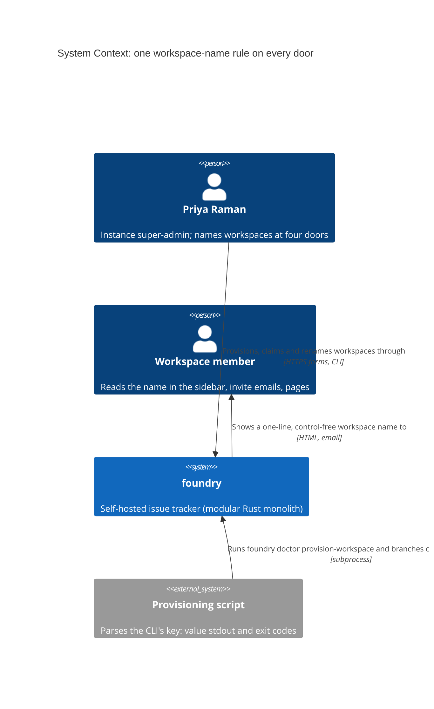
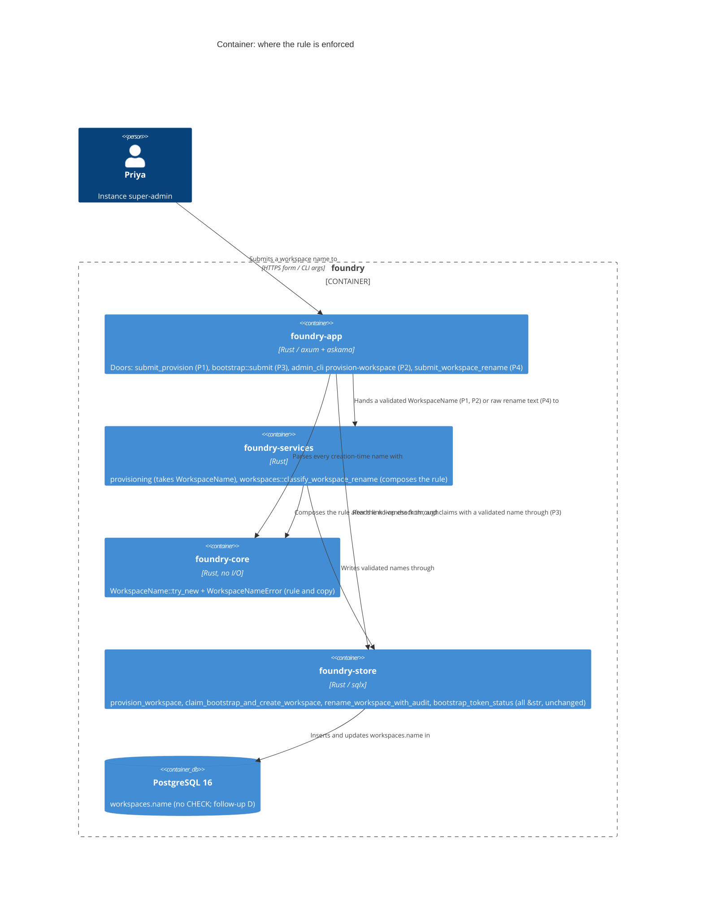

<!-- markdownlint-disable MD024 -->
# Feature Delta: instance-workspace-name-rule

Every door that sets a workspace name (dashboard provisioning, the operator
CLI, the first-run bootstrap claim, and the shipped rename) refuses the same
names for the same reasons, with the same words. The precedent's 24-character
rule spreads from rename to every door, and a new rule refuses control
characters inside a name on all four.

## Wave: DISCUSS

Product owner: Luna (nw-product-owner) | Date: 2026-10-05 | Feature type:
cross-cutting (Decision 1) | Walking skeleton: none (Decision 2) | UX depth:
lightweight (Decision 3) | JTBD: yes, new sibling job (Decision 4) | Density:
lean, Tier-1 [REF] only.

### [REF] Prior Wave Consultation

| Artifact | Status | Note |
|---|---|---|
| `docs/product/jobs.yaml` | ✓ | `job-instance-workspace-rename` is the closest job. A sibling job is appended (see JTBD for why it is not an extension). |
| `docs/product/personas/persona-instance-operator.yaml` | ✓ | Priya Raman and Marco reused unchanged. `also_referenced_by` and `pains_addressed_to_date` extended. |
| `docs/product/architecture/brief.md` ("Names are labels; slugs are identity") | ✓ | A workspace name is a display label with no slug. The paragraph says nothing about a creation-time rule. DELIVER updates it (DoD 9). |
| `docs/product/outcomes/registry.yaml` (OUT-17) | ✓ | OUT-17 pins the rename's `EmptyName`/`NameTooLong` refusals and copy. This feature adds a third refusal to that contract. The new OUT row at DISTILL should carry `related: [OUT-17]`. |
| Precedent `docs/feature/instance-admin-workspace-rename/feature-delta.md` | ✓ | D3 (rule and copy), D4 (no-op precedence), D10 (option A, rule on rename only), Out of Scope (follow-ups B and D), DDD-3, DDD-9 (pub classifier and cap "serves follow-up B") and the DISTILL note "no `maxlength`" are all carried below. |
| `docs/evolution/2026-10-05-instance-admin-workspace-rename.md` (Open / deferred) | ✓ | Lists follow-up B (this feature), follow-up D, and "interior control characters ... a candidate for follow-up B". One claim in it is revised under Changed Assumptions. |
| `docs/product/vision.md`, `docs/project-brief.md`, `docs/stakeholders.yaml` | ⊘ | Do not exist (same as the precedent). |
| `docs/product/journeys/` | ✓ | No journey covers instance administration. None is created (lightweight UX, precedent). |
| DISCOVER / DIVERGE artifacts for this feature | ⊘ | None. The job is grounded in code reading and the user's locked scope, not interviews. This is a recorded risk, as in the precedent. |

No contradiction with prior evidence. One prior claim, that control characters
are "cosmetic", is revised by code reading (see Changed Assumptions).

### [REF] Write-path inventory (code-grounded)

There are exactly three SQL sites in production code that write `workspaces.name`
(`crates/foundry-store/src/lib.rs`): line 1430 (`UPDATE`), and lines 2616 and 3427
(`INSERT`). There are four production entry points:

| # | Entry point (what the operator runs) | Adapter | Service | Store write | Name rule today |
|---|---|---|---|---|---|
| P1 | `POST /admin/instance/workspaces` (the dashboard's Provision form) | `crates/foundry-app/src/instance_admin.rs:198` `submit_provision` (trims at :210) | `crates/foundry-services/src/lib.rs:255` `provisioning::provision_workspace` (no name check) | `Store::provision_workspace` `lib.rs:2603` → INSERT :2616 | Trim only. `"   "` creates a nameless workspace. |
| P2 | `foundry doctor provision-workspace --name … --admin-email … --as …` | `crates/foundry-app/src/main.rs:834-857` (`name.is_empty()` :844, no trim) → `crates/foundry-app/src/admin_cli.rs:606` `run_provision_workspace` (raw name to the service :701, echoed raw `workspace-name: {name}` :730) | same as P1 | same as P1 | None. The name is not even trimmed. |
| P3 | `POST /bootstrap?token=…` (the first-run claim form, `templates/bootstrap_claim.html:9`) | `crates/foundry-app/src/bootstrap.rs:90` `submit` (trims at :137) | none (handler calls the store directly) | `Store::claim_bootstrap_and_create_workspace` `lib.rs:705` → `seed_initial_workspace` :3414 → INSERT :3427 | Trim only. |
| P4 | `POST /admin/instance/workspaces/{workspace_id}/rename` (shipped v0.9.0) | `instance_admin.rs:481` `submit_workspace_rename` (copy at :515-522) | `crates/foundry-services/src/workspaces.rs:87` `rename_workspace`, `:63` `classify_workspace_rename`, cap `:16` | `Store::rename_workspace_with_audit` `lib.rs:1412` → UPDATE :1430 | Trim, no-op, empty, ≤24. No control-character check. |

These were checked and are **not** write paths in scope:

- `Store::create_initial_workspace` (`lib.rs:633`) shares the `seed_initial_workspace` INSERT. It has **no production caller**; only `foundry-acceptance/src/steps/feature_mwt_slice_06_provision_and_prove.rs:109` and store tests call it. It is a latent bypass that DESIGN should note (see OQ-D1).
- No `/api/v1` route writes a workspace name. No migration writes one: 0001 creates the table, and 0009/0018 do not touch names. Keycloak SSO provisioning creates users and memberships, never workspaces.
- Whole-instance restore (`pg_restore`) brings back names verbatim (legacy data). Test fixtures insert names by raw SQL (by design). A hand-typed `psql` UPDATE is closed only by follow-up D.

A name is read and printed at: the sidebar brand and monogram, the dashboard
row, the invite-accept and unsubscribe pages, the member-invite email body
(`member_invites.rs:200`, "You have been invited to join the {workspace_name}
workspace"), CLI stdout (`admin_cli.rs:730`, `:1098`, `:1246`), and the backup
manifest's `declared_workspace_name`.

### [REF] Persona

**Priya Raman, instance super-admin** (`persona-instance-operator`). She names
workspaces at three doors: the dashboard Provision form, `foundry doctor
provision-workspace` from a terminal (often scripted), and once, the bootstrap
claim of a fresh instance. She renames them at the fourth door. **Marco**
(`persona-team-member-foil`) is the authorization foil on the web doors.

### [REF] JTBD

**job_id: `job-instance-workspace-naming`** (appended to `docs/product/jobs.yaml`;
sibling of `job-instance-workspace-rename`).

One-liner: *When I name a workspace, whether provisioning it from the dashboard
or the CLI, claiming a fresh instance, or renaming it later, I want every door
to refuse the same bad names for the same stated reason at the moment I type
them, so no workspace starts life with a label I must later correct, and every
place its name is printed shows one clean line.*

Sibling, not an extension. The rename job's situation is *drift*: "a workspace's
name no longer says what the workspace is". Its distinctive outcome is
*accountability* (the audit record). This job's situation is *creation at any
door*, and its outcome is *one consistent rule*. Folding it into the rename job
would rewrite a validated job story's situation. The two jobs overlap only at
P4, which gains the control-character arm. `relates_to` records that overlap.

### [REF] Locked Decisions

| ID | Decision | Rationale / source |
|---|---|---|
| D1 | **Scope: one rule on all four entry points P1-P4** (inventory above). The rule is: trim, then non-empty, then no control characters (D4), then at most **24 Unicode scalars**. It applies to the trimmed value, and the trimmed value is what is stored. | User-locked scope. Follow-up B from the precedent, plus the new control-character rule. |
| D2 | **One shared rule, one verdict.** The same input gets the same verdict and the same copy on every door. It is built on the precedent's `pub` `WORKSPACE_NAME_MAX_CHARS` and `classify_workspace_rename` (DDD-9). Creation doors have no current name, so they have no no-op arm. The arm order otherwise matches D5. DESIGN decides the shape (for example, a creation validator that the rename classifier also calls) and where the copy lives. | User-locked ("one shared validator"). Today the copy lives only in the rename handler (`instance_admin.rs:515-522`). Four adapters would make four copies unless DESIGN gives the copy one source. |
| D3 | **Copy, byte-identical on every door**: "Workspace name must not be empty" / "Workspace name must not contain control characters" / "Workspace name must be at most 24 characters". | The first and third are the precedent's D3, user-locked. The middle one is new and follows the same pattern. Its wording was confirmed by the user (OQ-2, resolved). |
| D4 | **The control-character set (user-confirmed, OQ-1 resolved).** A name is refused if its trimmed value contains any of: (a) a Unicode control character, general category Cc, which is Rust `char::is_control()` (U+0000-001F, U+007F-009F: NUL, tab, newline, carriage return, escape, DEL, C1); (b) a bidirectional embedding, override or isolate control (U+202A-202E, U+2066-2069), the "Trojan Source" class that visually reorders the text around it in the sidebar, dashboard and terminal; (c) the line and paragraph separators U+2028 and U+2029, which are line breaks in all but name. **Every other format character (Cf) stays allowed**: zero-width joiner U+200D (emoji such as 👨‍👩‍👧), zero-width non-joiner U+200C (Persian and Indic spelling), soft hyphen, and variation selectors. | (a) covers the user's named cases (newline, tab, NUL). Refusing all of Cf would refuse real names, because the family emoji needs ZWJ. Refusing only Cc would let a U+202E override reorder a name in every list it appears in. Zero-width space is not refused: it can make two names look identical, but names are not unique (precedent D7), so that does not create a spoofing target. |
| D5 | **Order of checks**: trim, then (rename only) no-op, then empty, then control characters, then length. | The no-op stays first so D6 holds. Control characters come before length because a pasted multi-line blob is usually also long. The length message would send the operator to shorten a name that still fails, while the control-character message names the actual problem. |
| D6 | **Legacy names are not rewritten, and the no-op still wins.** On rename, a trimmed submission byte-equal to the stored name is a quiet 200 with no write and no audit row, even if the stored name is over 24 characters or contains a control character (a tab, for example). Two facts bound this: **NUL cannot be stored**, because Postgres `text` refuses U+0000, so no legacy name contains it. And a browser strips line breaks from a text input's value, so an untouched form for a legacy name containing a newline arrives without the newline. That is a real rename to the cleaned name, which passes the rule and is audited. This is the browser's behaviour, not this rule's, and it cleans the name. | User asked for a decision. This is consistent with the precedent's D4 and DDD-3: the operator is never forced to fix an unrelated legacy defect in order to leave a name alone. |
| D7 | **A refusal leaves nothing behind.** P1/P2 create no workspace, no first-admin user, no membership and no invite, so the same first-admin email works on the corrected retry. P3 does not consume the bootstrap link and creates nothing, so the same link works on the corrected retry. P4 writes no name and no audit row (shipped). | Fail-closed and retryable. Without this, a refused provision could burn the first-admin email, and a refused claim could burn the only bootstrap link. |
| D8 | **No new oracle; existing refusals keep their precedence.** P1/P4: signed-out and non-admin callers still get the byte-identical uniform 404 *before* the name rule, so a bad name never reveals the surface. P3: a used, expired or unknown link still gets today's byte-identical refusal page whatever the name. The rule runs only for a live link, before the claim. This leaks nothing new, because `GET /bootstrap` already tells a live link from a dead one. P2: the rule is an argument check that **exits 2 before any database connection or authz check**. The rule is public, so checking it early reveals nothing, and a typo is caught without `DATABASE_URL`. | ADR-002 non-enumeration idiom, bootstrap-claim-enumeration-oracle precedent, and the CLI's documented exit-code discipline (`admin_cli.rs:597-605`: 2 = invalid args). |
| D9 | **What each door shows on refusal.** P1: status 422 with the copy. The operator can correct the name and resubmit without retyping the first-admin email. P3: status 422, and the claim page is shown again with the copy. Email, display name and workspace name are kept. **The password is never echoed back** and must be retyped. P2: stderr `foundry doctor provision-workspace: <copy>`, exit 2, nothing on stdout. P4: 422 inside the row's error slot (shipped, with one new copy line). | The P1 form is a plain `method="post"` form with no htmx attributes (`instance_dashboard.html:31`), and success currently navigates to a bare fragment. DESIGN decides the 422 body shape within this observable (OQ-D2). |
| D10 | **The CLI now trims.** `--name "  Globex  "` stores and prints `workspace-name: Globex`. Today it stores the padding. | D1 ("trim" on every door). No shipped scenario passes a padded `--name`. |
| D11 | **No DB CHECK and no project-name change.** Follow-up D (`CHECK … NOT VALID` on `workspaces.name`) is a separate later change. Project names keep today's rule. | User-locked. |
| D12 | **The server is the contract; no client-side enforcement.** No `maxlength` and no input pattern on any of the three name inputs. | Precedent DISTILL note: `maxlength="24"` silently truncates typing and hides the refusal. One rule, enforced and explained in one place. |

### [REF] Open Questions

- **OQ-1 (resolved 2026-10-05, user chose the proposed D4 set): the control-character set.** The proposed default is D4: Cc, plus the nine bidi controls, plus U+2028/2029, with all other Cf allowed. The alternatives are:
  - (i) Cc only, the literal `char::is_control`. This lets a U+202E override through.
  - (ii) All of Cc and Cf. This refuses ZWJ emoji and ZWNJ spellings.
  - Please confirm (D4) or pick (i) or (ii). DISTILL's example table depends on the answer.
- **OQ-2 (resolved 2026-10-05, user chose "Workspace name must not contain control characters"): wording of the new refusal.** The proposal is "Workspace name must not contain control characters", which matches the two shipped lines. A plainer alternative is "Workspace name must not contain line breaks, tabs or other invisible characters". Please confirm one.
- **OQ-D1 (DESIGN): should the rule sit below the adapters?** `Store::create_initial_workspace` has no production caller but shares the INSERT. DESIGN decides whether the shared rule guards the store seam too, or whether an arch guard or a note is enough.
- **OQ-D2 (DESIGN): the 422 shape on P1.** The provision form is plain-POST (D9). DESIGN chooses between re-rendering the dashboard with the error at the form and a bare fragment, so long as the copy is visible and the email is kept.

### [REF] Journey (lightweight: happy path plus key error paths)

Emotional arc, **Prevention instead of repair**: hurried (provisioning for
someone who is waiting) → brief friction (a refusal) → reassured (the reason
is stated in the same words as everywhere else, and nothing was half-made) →
confident (the corrected name lands, and every door behaves the same).

```text
[Door]                         [Types]                                 [Sees]                                          [Next]
Dashboard Provision form  →    "Canzan Labs Platform Engineering" (32) "Workspace name must be at most 24 characters" Shortens to "Canzan Platform Eng",
                                                                        no workspace, no invite created                 same email, provisioned
foundry doctor               --name $'Globex\nstatus: provisioned'     stderr: "...: Workspace name must not contain       Reruns with --name Globex; scripts
provision-workspace                                                     control characters", exit 2, empty stdout       branch on exit 2
/bootstrap?token=…           "Raman Household Operations Center" (33)  Claim page again, 422, copy shown, email and     Same link, "Raman Household",
                                                                        names kept, password empty, link still live     signed in to /dashboard
Workspace row Rename         "House<TAB>hold" (pasted)                  Row error slot: "...must not contain control    Retypes "Household"
                                                                        characters", name unchanged, no audit row
```

### [REF] Scope Assessment: PASS (4 stories, 1 bounded context, estimated 2.5-3.5 days)

There is one rule in one bounded context: workspace naming in
`foundry-services` and its validator. It reaches three driving adapters
(instance-admin HTTP, bootstrap HTTP, operator CLI) plus the shipped rename.
None of the oversized signals fires: at most 10 stories, at most 3 contexts, no
walking skeleton, about 4 integration points, under 2 weeks. The four doors are
independent user outcomes and could ship separately, which is why each door is
its own thin slice rather than a reason to split the feature.

### [REF] Shared Artifacts

| Artifact | Source of truth | Consumers | Risk |
|---|---|---|---|
| The name rule (arms and order, D4/D5) | one shared validator in `foundry-services` (D2) | P1, P2, P3, P4 | HIGH: a second copy of the rule drifts. That drift is the defect this feature fixes. |
| The three refusal strings (D3) | one source (DESIGN, D2) | rename row slot, provision 422, claim page, CLI stderr | HIGH: byte-identity is a KPI (KPI-2). |
| `WORKSPACE_NAME_MAX_CHARS` = 24 | `foundry-services/src/workspaces.rs:16` | all doors | MEDIUM: shipped, reuse as is. |
| Bootstrap link liveness | `bootstrap_tokens` (consumed only by the claim transaction) | P3 | HIGH: a refusal must not consume it (D7). |

### [REF] User Stories

#### US-WNR-01: A pasted name carrying invisible characters is refused at rename, with the reason stated

`job_id: job-instance-workspace-naming`

##### Elevator Pitch

Before: Priya can rename "Household" to a pasted "House<TAB>hold" or to a name carrying a right-to-left override, and it is accepted and shown everywhere. A name containing NUL fails with a bare "internal error" page.
After: on `/admin/instance/workspaces` she submits the Rename form on the "Household" row (`POST /admin/instance/workspaces/{workspace_id}/rename`) with "House<TAB>hold" → sees "Workspace name must not contain control characters" inside that row's error slot, and the name stays "Household".
Decision enabled: retype the name cleanly instead of shipping an invisible character into every member's sidebar and invite email.

##### Problem

Priya copies workspace names out of chat and spreadsheets. A trailing cell
tab, a line break or a bidi override comes along invisibly. The rename door
accepts them today. A NUL turns into a 500, because Postgres refuses the byte
and the handler maps the failure to "internal error". The rename door is the
only one with a rule at all, and it has no arm for this.

##### Who

- Instance super-admin | instance dashboard, browser, sometimes `curl` | wants the label to be exactly what she meant.

##### Domain Examples

1. **Tab**: "House\tHold" pasted onto the "Household" row gets 422 "Workspace name must not contain control characters". The name is unchanged and there is no audit row.
2. **Bidi override**: "Ops\u{202E}gnikcatS" (it renders as "OpsStacking", reversed) gets the same 422.
3. **NUL** (sent with `curl`): "Bailey\u{0}Family" gets the same 422, not "internal error".
4. **Allowed**: "👨‍👩‍👧 Bailey" (12 scalars, contains ZWJ) and "Ångström Øresund Société" (24) are accepted and audited.
5. **Trimmed, not refused**: "\tKitchen\n" submitted for "Household" is stored as "Kitchen". A leading or trailing tab or newline is whitespace, and it is trimmed before any check.
6. **Legacy no-op**: a workspace stored before this rule as "Canzan\tLabs" is resubmitted byte-equal and gets a quiet 200, with no write and no audit row (D6).
7. **Precedence**: a 30-character name containing a tab gets the control-character message, not the length message (D5).

##### UAT Scenarios (BDD)

###### Scenario: A name with a pasted tab is refused inside the row

- Given Priya is signed in as an instance admin and workspace "Household" exists
- When she submits "House\tHold" on its rename form
- Then the row's error slot shows "Workspace name must not contain control characters"
- And the workspace is still named "Household" and no rename is on record

###### Scenario: A name that would display reordered is refused

- When Priya submits "Ops\u{202E}gnikcatS" for "Household"
- Then she gets the same refusal and nothing changes

###### Scenario: A name with a NUL is refused with the reason, not an internal error

- When Priya's request carries "Bailey\u{0}Family"
- Then she gets 422 with "Workspace name must not contain control characters", not a 500

###### Scenario: Emoji, accented and joined names are still accepted

- When Priya renames "Household" to "👨‍👩‍👧 Bailey", then to "Ångström Øresund Société"
- Then each is stored exactly and each has one rename on record

###### Scenario: Tabs and line breaks at either end are trimmed, not refused

- When Priya submits "\tKitchen\n" for "Household"
- Then the workspace is named "Kitchen" and the record reads "Household" → "Kitchen"

###### Scenario: An untouched legacy name with a tab can be left as it is

- Given workspace "Canzan\tLabs" was stored before this rule
- When Priya submits "Canzan\tLabs" unchanged
- Then she gets a quiet success, nothing is written, and no rename is on record

###### Scenario: A long name with a tab is refused for the tab first

- When Priya submits a 30-character name containing a tab
- Then the refusal reads "Workspace name must not contain control characters"

##### Acceptance Criteria

- [ ] A trimmed rename value containing any D4 character gets 422 with the D3 control-character copy in the row's `[data-error-slot]`. Nothing is written and no audit row is added (scenarios 1-3).
- [ ] A NUL in the value is a 422 with the copy, never a 500 (scenario 3).
- [ ] ZWJ emoji, ZWNJ, and accented or CJK names within 24 scalars are accepted and audited (scenario 4).
- [ ] Leading or trailing whitespace controls are trimmed before any check (scenario 5).
- [ ] A byte-equal resubmission of a legacy name that contains a control character is a quiet 200 with no write (scenario 6, D6).
- [ ] The arm order is empty, then control, then length (scenario 7, D5). The shipped empty and 24/25 behaviour is unchanged (the iawr lane stays green).

##### Outcome KPIs

KPI-1, KPI-4 (see the table below).

##### Technical Notes

- Extends the shipped pure classifier in `foundry-services/src/workspaces.rs`. A new refusal variant means a new handler arm and copy.
- OUT-17 grows a third refusal. DISTILL adds the registry row with `related: [OUT-17]`.
- Browser lane: one example in the error slot is enough (the slot idiom is shipped). The NUL and override examples belong to the HTTP lane, because a browser cannot type them.

##### Size

0.5-1 day | 7 scenarios | slice 01

#### US-WNR-02: A first-run claim with an unfit workspace name is refused without burning the link

`job_id: job-instance-workspace-naming`

##### Elevator Pitch

Before: on a fresh instance Priya claims `/bootstrap?token=…` with workspace name "Raman Household Operations Center" (33 characters). It is accepted, so every member's sidebar is truncated from the first page. A blank-after-trim name creates a nameless workspace.
After: she submits the claim form at `/bootstrap?token=…` with "Raman Household Operations Center" → sees the claim page again (422) with "Workspace name must be at most 24 characters", her email, display name and workspace name still filled in, and the password empty. Submitting "Raman Household" with the same link signs her in at `/dashboard`.
Decision enabled: pick a name that fits now, without asking the operator CLI for a new bootstrap link.

##### Problem

The bootstrap claim is a one-time door. The workspace name chosen there is the
first label every member sees. It applies trim only (`bootstrap.rs:137`), and
the store call happens inside the transaction that consumes the link. A rule
added carelessly there would either burn the link on a typo or open a new
answer that distinguishes link states.

##### Who

- First operator of a fresh instance | browser, one-time bootstrap link | wants a working, well-named workspace on the first try.

##### Domain Examples

1. **Too long**: "Raman Household Operations Center" (33) gets 422 with the length copy. The link is still live and nothing is created.
2. **Corrected retry**: the same link with "Raman Household" signs Priya in and redirects to `/dashboard`. The sidebar reads "R  Raman Household".
3. **Blank**: "   " gets 422 "Workspace name must not be empty".
4. **Control character**: "Raman\nHousehold" gets 422 with the control-character copy.
5. **Dead link**: an already-used link with a 33-character name gets today's byte-identical refusal page, not a 422 (D8).

##### UAT Scenarios (BDD)

###### Scenario: An over-long workspace name is refused and the link still works

- Given a live bootstrap link
- When Priya claims with workspace name "Raman Household Operations Center"
- Then the claim page shows "Workspace name must be at most 24 characters" with status 422
- And her email, display name and workspace name are still filled in, and the password is empty
- And no workspace or user exists, and the link is still claimable

###### Scenario: The corrected claim with the same link succeeds

- Given Priya's claim was refused for its workspace name
- When she claims again with the same link and "Raman Household"
- Then she is signed in at /dashboard and the sidebar reads "Raman Household"

###### Scenario: A blank or control-character workspace name is refused

- When Priya claims with "   ", or with "Raman\nHousehold"
- Then the claim page shows the matching copy and nothing is created

###### Scenario: Spaces around the workspace name are trimmed

- When Priya claims with "  Raman Household  "
- Then the workspace is named "Raman Household"

###### Scenario: A dead link answers exactly as before, whatever the name

- Given a bootstrap link that was already used
- When anyone posts a claim to it with a 33-character workspace name
- Then the response is byte-identical to today's refusal for a dead link

##### Acceptance Criteria

- [ ] For a live link, a name that fails the rule gets 422 and the claim page with the D3 copy. Email, display name and workspace name are retained and the password is not. No workspace, user, team, project or `instance_admins` row is created, and the link is not consumed (scenarios 1, 3).
- [ ] The same link then claims successfully with a valid name (scenario 2).
- [ ] The trimmed name is stored (scenario 4).
- [ ] A used, expired or unknown link gets the byte-identical refusal page regardless of the name (scenario 5, D8).

##### Outcome KPIs

KPI-1, KPI-2, KPI-3 (see the table below).

##### Technical Notes

- `bootstrap.rs` calls the store directly, with no service. DESIGN decides how the shared rule is reached here.
- The non-consuming liveness read already exists (`bootstrap_token_status`, used by `GET`). The claim transaction remains the authority, so a link that dies between the check and the claim still gets the refusal page.
- The page is a full page (`base.html`), not htmx.

##### Size

0.5-1 day | 5 scenarios | slice 02

#### US-WNR-03: Provisioning from the dashboard refuses a name the sidebar cannot hold, and creates nothing

`job_id: job-instance-workspace-naming`

##### Elevator Pitch

Before: Priya provisions "Canzan Labs Platform Engineering" (32) from the dashboard and it is accepted, so the new admin's first sidebar is already truncated and the fix is a rename. "   " creates a workspace with an empty name.
After: on `/admin/instance/workspaces` she submits the Provision form (`POST /admin/instance/workspaces`) with "Canzan Labs Platform Engineering" and first admin "dana@canzan.net" → sees "Workspace name must be at most 24 characters", with no new workspace in the list and no invite link. Resubmitting "Canzan Platform Eng" with the same email provisions it.
Decision enabled: choose the final name before an invite goes to Dana, instead of renaming after she has seen it.

##### Problem

The Provision form trims the name and nothing else (`instance_admin.rs:210`).
The service has no name check. The rename door next to it on the same page
refuses what this door accepts, so the dashboard contradicts itself.

##### Who

- Instance super-admin | instance dashboard, browser | provisioning for a person who is waiting for the invite.

##### Domain Examples

1. **Boundary**: "Canzan Labs Platform Ops" (24) is provisioned. "Canzan Labs Platform Engineering" (32) gets 422 with the length copy.
2. **Blank**: "   " gets 422 "Workspace name must not be empty". Today it creates a nameless workspace.
3. **Control character**: "Globex\u{202E}" gets 422 with the control-character copy.
4. **Nothing left behind**: after a refusal for "dana@canzan.net", the retry with "Canzan Platform Eng" and the same email succeeds, because no user row was created.
5. **Authz first**: Marco posts a 40-character name and gets the byte-identical uniform 404, not the length copy.

##### UAT Scenarios (BDD)

###### Scenario: A name up to 24 characters is provisioned

- When Priya provisions "Canzan Labs Platform Ops" with first admin "dana@canzan.net"
- Then the workspace is created and the confirmation shows "Canzan Labs Platform Ops"

###### Scenario: A name past 24 characters is refused and nothing is created

- When Priya provisions "Canzan Labs Platform Engineering" with first admin "dana@canzan.net"
- Then she sees "Workspace name must be at most 24 characters" with status 422
- And no workspace, user, membership or invite was created

###### Scenario: A blank or control-character name is refused

- When Priya provisions "   ", or "Globex\u{202E}"
- Then she sees the matching copy and nothing is created

###### Scenario: The corrected name provisions with the same first-admin email

- Given Priya's provision for "dana@canzan.net" was refused for its name
- When she provisions "Canzan Platform Eng" with "dana@canzan.net"
- Then it succeeds and the workspace list shows "Canzan Platform Eng"

###### Scenario: A non-admin is refused before the name is looked at

- Given Marco is signed in but is not an instance admin
- When Marco posts a provision with a 40-character name
- Then he receives the byte-identical uniform 404 and nothing is created

##### Acceptance Criteria

- [ ] Names that fail the rule get 422 with the D3 copy, visible to the operator, and the first-admin email is kept for the retry (scenarios 2, 3, D9).
- [ ] A refusal creates no workspace, user, membership or invite. The retry with the same email succeeds (scenarios 2, 4, D7).
- [ ] 24 scalars is accepted and 25 is refused, with the trimmed name stored and shown (scenario 1).
- [ ] Signed-out and non-admin callers get the uniform 404 before the rule (scenario 5, D8).

##### Outcome KPIs

KPI-1, KPI-2, KPI-3 (see the table below).

##### Technical Notes

- The rule enters `provisioning::provision_workspace` (shared with P2), which needs new typed refusals. Today the service returns `ServiceError::Internal` or `Forbidden` only.
- The form is plain-POST (OQ-D2). One `@needs-browser` example should prove the refusal is visible on the real page.

##### Size

0.5-1 day | 5 scenarios | slice 03

#### US-WNR-04: The CLI refuses an unfit name before touching the database

`job_id: job-instance-workspace-naming`

##### Elevator Pitch

Before: `foundry doctor provision-workspace --name "   " …` creates a nameless workspace. `--name $'Globex\nstatus: refused'` is accepted and prints a forged `status: refused` line under `workspace-name:`, so a script reading stdout is misled. A 40-character name is accepted.
After: run `foundry doctor provision-workspace --name "Canzan Labs Platform Engineering" --admin-email dana@canzan.net --as priya@canzan.net` → sees on stderr `foundry doctor provision-workspace: Workspace name must be at most 24 characters`, exit code 2, nothing on stdout, nothing created.
Decision enabled: fix the name and rerun. A provisioning script branches on exit 2 (a fixable input error) as distinct from 3 (infrastructure) and 4 (not authorized).

##### Problem

The CLI is the scripted door. It does not trim (`main.rs:841`, `admin_cli.rs:701`)
and checks only for an empty flag. It echoes the raw name into a line-oriented
`key: value` output that scripts parse (`admin_cli.rs:730`), so an embedded
newline forges output lines.

##### Who

- Instance super-admin | terminal, sometimes a provisioning script | needs an answer a script can branch on.

##### Domain Examples

1. **Too long**: `--name "Canzan Labs Platform Engineering"` exits 2 with the length copy on stderr. Nothing is created.
2. **Blank**: `--name "   "` exits 2 with "Workspace name must not be empty".
3. **Forged line**: `--name $'Globex\nstatus: refused'` exits 2 with the control-character copy. stdout is empty.
4. **Trimmed**: `--name "  Globex  "` exits 0, and stdout reads `workspace-name: Globex`.
5. **No database needed**: with `DATABASE_URL` unset, a 32-character name still exits 2 (not 3) with the length copy (D8).

##### UAT Scenarios (BDD)

###### Scenario: An over-long name exits 2 with the reason and creates nothing

- When Priya runs provision-workspace with --name "Canzan Labs Platform Engineering"
- Then it exits 2, stderr ends with "Workspace name must be at most 24 characters", stdout is empty
- And no workspace, user or invite was created

###### Scenario: A blank name exits 2 as empty

- When Priya runs it with --name "   "
- Then it exits 2 with "Workspace name must not be empty"

###### Scenario: A name with a line break cannot forge output lines

- When Priya runs it with a --name containing a newline followed by "status: refused"
- Then it exits 2 with "Workspace name must not contain control characters" and prints nothing on stdout

###### Scenario: Spaces around the name are trimmed in storage and output

- When Priya runs it with --name "  Globex  "
- Then it exits 0, stdout shows "workspace-name: Globex", and the stored name is "Globex"

###### Scenario: A name mistake is caught even without a database

- Given DATABASE_URL is not set
- When Priya runs it with a 32-character --name
- Then it exits 2 with the length copy, not 3

##### Acceptance Criteria

- [ ] Names that fail the rule exit 2 with stderr `foundry doctor provision-workspace: <D3 copy>` and an empty stdout, before any DB connection. Nothing is created (scenarios 1-3, 5).
- [ ] The trimmed name is stored and printed (scenario 4, D10).
- [ ] Exit codes 0, 3 and 4 keep their meanings. The mwt slice 06 lane stays green.

##### Outcome KPIs

KPI-1, KPI-2 (see the table below).

##### Technical Notes

- Reuses the slice-03 service change. The pre-DB check calls the same shared rule (D2); only the call site is new.
- Subprocess acceptance needs a warm `foundry` binary (repo memory: rebuild before CLI lanes).

##### Size

0.5 day | 5 scenarios | slice 04

### [REF] System Constraints

- One rule and one copy source (D2/D3). No door re-derives either.
- Authz and oracle precedence are unchanged (D8). Uniform 404 for web authz; byte-identical bootstrap refusal for dead links.
- A refusal never writes, never consumes a link, and never burns an email (D7).
- No DB CHECK and no client-side `maxlength` (D11, D12).

### [REF] Outcome KPIs

Objective: no workspace gets a name, through any door, that the sidebar
cannot hold or that hides a control character, and every door explains a
refusal in the same words.

| # | Who | Does What | By How Much | Baseline | Measured By | Type |
|---|-----|-----------|-------------|----------|-------------|------|
| 1 | Instance operators | Create or rename workspaces only with names that pass the rule | 0 violating names among workspaces created or renamed after release | Rename door: 0 over-length since v0.9.0, control characters unmeasured. Creation doors: unmeasured. Slice-01 dogfood records the number for existing names. | Store query over `workspaces` (created after the release) plus `workspace_rename_events.new_name`, checking length and D4 characters | Guardrail (north star) |
| 2 | Instance operators | Get the same verdict and copy for the same name at every door | 4 of 4 doors give identical results on a shared input matrix | 1 of 4 (rename, with no control arm) | Acceptance parity matrix: the same names through P1-P4 | Leading |
| 3 | Operators whose name was refused | Retry and succeed with the same email or link | 100%. 0 links consumed and 0 emails burned by a refusal | Not applicable today (no refusal exists on P1-P3) | Acceptance universe deltas (no workspace, user or invite rows; link still claimable) | Guardrail |
| 4 | Instance operators | Never see "internal error" because of a name | 0 name-caused 500s | A NUL causes a 500 on every door | HTTP and CLI scenarios with NUL | Guardrail |

At homelab scale, KPIs are verified by the acceptance suite and store queries,
not analytics (persona: single-digit operators).

### [REF] DoD

1. All UAT scenarios pass: 7 + 5 + 5 + 5 = 22, on the HTTP lane, the CLI subprocess lane and `@needs-browser` where a page must show the refusal. The shipped iawr, iapr, web-provisioning, mwt-slice-06 and us-05 bootstrap lanes stay green.
2. One rule: every door's verdict comes from the shared validator, and the KPI-2 parity matrix passes byte-identically.
3. Nothing is left behind by a refusal: zero new rows across workspaces, users, memberships, invites, teams, projects, `instance_admins` and `workspace_rename_events`, and the bootstrap link is unconsumed.
4. No new oracle: web authz refusals stay byte-identical, and the dead-link bootstrap refusal stays byte-identical for any name.
5. `check-arch` passes. `cargo xtask smoke` passes before each commit, and `FOUNDRY_XTASK_INCLUDE_DOCKER=1 cargo xtask ci` passes before push.
6. Mutation kill rate is at least 80% on modified files, with exact example pairs: 24/25 scalars; a control character in the middle versus at the edges (trimmed); one example per D4 class (Cc, bidi, U+2028); ZWJ accepted; and empty before control before length.
7. Production-data dogfood: a read-only query on the operator's instance lists the existing names that would fail the rule. They are reported and not rewritten, and the count is recorded as the KPI-1 baseline. A same-day provision of a real workspace succeeds through the dashboard.
8. Legacy safety: a database holding over-length and tab-containing legacy names boots, lists and renders unchanged, and the no-op resubmission of each is a quiet 200.
9. Documentation: `CHANGELOG.md` `[Unreleased]`, `jobs.yaml` (done at DISCUSS), an outcomes registry row (DISTILL, `related: [OUT-17]`), and the `brief.md` "Names are labels" paragraph updated to name the shared rule.

### [REF] Out of Scope

- Project names (they keep today's rule). The control-character rule for project names is a follow-up.
- Follow-up D: `CHECK … NOT VALID` on `workspaces.name` (a migration, a separate later change).
- Rewriting, back-filling or reporting legacy names in-product. Dogfood uses a one-off read-only query, and a `foundry doctor` report is a possible follow-up.
- Other names entered at the same doors: user display name at bootstrap, team, project and lane names.
- A uniqueness rule (precedent D7), Unicode normalization (NFC), and confusable or homoglyph detection.
- Converting the Provision form to htmx or redesigning its success page (only the refusal is in scope, OQ-D2).
- Client-side `maxlength`, counters or live validation (D12).
- Whole-instance `pg_restore`, test-fixture SQL and hand-typed `psql` (follow-up D closes the last one).
- Any change to rename audit semantics.

### [REF] WS Strategy

No walking skeleton (Decision 2: brownfield, and the shared validator and the
rename door already ship). Four thin slices, one door each, each independently
demonstrable.

### [REF] Driving Ports

1. `POST /admin/instance/workspaces/{workspace_id}/rename` (delta): a new 422 arm with the control-character copy.
2. `POST /bootstrap?token=…` (delta): 422 and the claim page with the copy and retained fields, for a live link only.
3. `POST /admin/instance/workspaces` (delta): 422 with the copy. `GET /admin/instance/workspaces` may change, depending on OQ-D2.
4. `foundry doctor provision-workspace --name … --admin-email … --as …` (delta): exit 2 with the stderr copy before the DB, and the trimmed name on stdout on success.

The core needs (shapes belong to DESIGN): one creation-time name rule shared
with the rename classifier, and typed refusals the provisioning use-case can
return.

### [REF] Pre-requisites

None outstanding. These are shipped (v0.9.0): `WORKSPACE_NAME_MAX_CHARS` and
`classify_workspace_rename` (pub, DDD-9), the rename row's error slot,
`require_instance_admin`, the uniform 404, `bootstrap_token_status`, and the
CLI's exit-code discipline. No new schema.

### [REF] Story map and slices

Backbone (one door per column): Rename row → Bootstrap claim → Dashboard
Provision → Operator CLI.

| Slice | Story | Door | Est. | Brief |
|---|---|---|---|---|
| 01 | US-WNR-01 | rename (adds the control-character arm to the shared rule) | 0.5-1 d | `slices/slice-01-control-characters-on-rename.md` |
| 02 | US-WNR-02 | bootstrap claim | 0.5-1 d | `slices/slice-02-bootstrap-claim-name-rule.md` |
| 03 | US-WNR-03 | dashboard provisioning | 0.5-1 d | `slices/slice-03-dashboard-provision-name-rule.md` |
| 04 | US-WNR-04 | operator CLI | 0.5 d | `slices/slice-04-cli-provision-name-rule.md` |

Priority rationale:

- 01 goes first. It settles the highest-uncertainty item (the D4 character set, OQ-1), shapes the shared rule that the other three reuse, and lands on a shipped surface.
- 02 is next. It is the riskiest door: a one-time link, an existing enumeration-oracle precedent, and no service seam.
- 03 then carries the service change that 04 reuses.
- 04 is last, because it is cheapest once 03 lands.

Taste tests:

- No slice ships 4 or more new components.
- The shared-rule extension rides inside slice 01's user value instead of shipping as a slice of its own.
- Each slice can disprove something (see the briefs).
- Each slice's dogfood uses the operator's real instance.
- No two slices differ only in scale.

### [REF] DoR Validation

| DoR Item | WNR-01 | WNR-02 | WNR-03 | WNR-04 | Evidence |
|---|---|---|---|---|---|
| 1. Problem in domain language | PASS | PASS | PASS | PASS | Pasted invisible characters, a burned link, a contradicting dashboard, forged CLI lines |
| 2. Persona specific | PASS | PASS | PASS | PASS | Priya Raman (door-specific context); Marco as the foil in 03 |
| 3. 3+ domain examples, real data | PASS (7) | PASS (5) | PASS (5) | PASS (5) | Real names and lengths: 24/25/32/33, U+202E, NUL, ZWJ |
| 4. UAT 3-7 scenarios | PASS (7) | PASS (5) | PASS (5) | PASS (5) | Business-outcome titles |
| 5. AC derived from UAT | PASS | PASS | PASS | PASS | Each AC cites its scenarios |
| 6. Right-sized | PASS | PASS | PASS | PASS | 0.5-1 day each |
| 7. Technical notes | PASS | PASS | PASS | PASS | Per story, plus System Constraints and D1-D12 |
| 8. Dependencies tracked | PASS | PASS (01) | PASS (01) | PASS (01, 03) | OQ-1 and OQ-2 resolved by the user; OQ-D1 and OQ-D2 for DESIGN |
| 9. Outcome KPIs measurable | PASS | PASS | PASS | PASS | KPI-1 to KPI-4 with baselines and instruments |
| JTBD traceability | PASS | PASS | PASS | PASS | `job-instance-workspace-naming` |
| Elevator Pitch | PASS | PASS | PASS | PASS | Real entry points with observable output |

DoR status: **PASSED** (OQ-1 and OQ-2 resolved 2026-10-05). The user confirmed
D4's character set and the new copy as proposed, so US-WNR-01's examples and the
D3 copy stand. Per-wave peer
review was not invoked; the consolidated review runs at the end of DISTILL.

### [REF] Wave Decisions

- Feature type: cross-cutting. Walking skeleton: none. UX depth: lightweight. JTBD: yes, a new sibling job (`job-instance-workspace-naming`).
- Density: lean. Two ask-intelligent triggers fired:
  - **Cross-context complexity** (three driving adapters: instance-admin HTTP, bootstrap HTTP, CLI) suggests `alternatives-considered`.
  - **Compliance** ("audit" appears in US-WNR-01's ACs) suggests `journey-deep-dive`.
  - Neither expansion is rendered. Both are offered to the user in the handoff.
- Upstream changes: none to DISCOVER (none exists). This closes the precedent's follow-up B and its "interior control characters" deferral.

### [REF] Changed Assumptions

1. Original (`docs/evolution/2026-10-05-instance-admin-workspace-rename.md`, Open / deferred): *"Interior control characters (for example a newline inside a name) are accepted, as project rename already accepts them. They are escaped everywhere, so this is cosmetic, not a security issue."*

   New: HTML escaping holds, but two consequences are not cosmetic.
   - A NUL fails at Postgres and surfaces as a 500 on every door (KPI-4).
   - A newline forges lines in two line-oriented outputs. One is the CLI's `key: value` stdout (`admin_cli.rs:730`, `:1098`, `:1246`), which scripts parse. The other is the member-invite email body (`member_invites.rs:200`).

   Only super-admins set names, so this is an integrity and legibility risk, not privilege escalation. That is enough to make the rule a product rule on every door (user-locked).

## Wave: DESIGN

Architect: Morgan (nw-solution-architect) | Date: 2026-10-05 | Scope: application | Mode: propose (orchestrator-dispatched; OQ-1 and OQ-2 user-resolved, D4 set and copy locked) | Paradigm: OOP (CLAUDE.md, unchanged) | Density: lean, Tier-1 [REF] only, no expansion menu (DESIGN declares no ask-intelligent triggers). Per-wave review not invoked: no novel pattern, no new authz path. The one security-relevant change (the bootstrap ordering, DDD-9) is recorded in an ADR and goes to the consolidated end-of-DISTILL review.

### [REF] Prior Wave Consultation

| Artifact | Status |
|---|---|
| DISCUSS above (D1-D12, P1-P4, US-WNR-01..04, OQ-D1/OQ-D2) | ✓ No contradiction. Two DISCUSS assumptions are refined under Changed Assumptions. |
| `docs/product/architecture/brief.md` ("Names are labels", crate graph) | ✓ Updated in this wave (workspace-name paragraph). |
| Precedent `instance-admin-workspace-rename` DESIGN DDD-1..12, `adr-workspace-rename-001/002` | ✓ DDD-3 (pre-read plus locked no-op) and DDD-9 (pure classifier, `pub` cap) are kept. DDD-9's "handler owns the copy" is superseded for workspace names only (DDD-3 below). |
| `docs/feature/{id}/discuss/*`, `spike/findings.md` | ⊘ Lean layout. No spike. |
| `docs/product/outcomes/registry.yaml` | ⊘ Collision check not run here (no shell in this session). DISTILL runs it (OQ-D3). |

Code read: `foundry-services/src/workspaces.rs` (cap :16, classifier :63, proptests :135), `foundry-services/src/lib.rs` (`provisioning` :220-298, `ServiceError` :345), `foundry-app/src/instance_admin.rs` (`show_dashboard` :77, `submit_provision` :198, `submit_workspace_rename` :481, `rename_error_fragment` :560), `foundry-app/src/bootstrap.rs` (`show_form` :61, `submit` :90-188, `render_claim_form` :293, `bootstrap_refusal_page` :315), `main.rs` :834-857, `admin_cli.rs` :584-740, `foundry-store/src/lib.rs` (`create_initial_workspace` :633, `claim_bootstrap_and_create_workspace` :705), `foundry-core/src/lib.rs` (`ProjectKey` :61-101), `admin_tokens.rs` :408 (full-page 422 re-render), `views.rs` (`ProjectCreatePage.error`, `BootstrapClaim` :1087, `InstanceDashboardPage` :1391), templates `instance_dashboard.html`, `bootstrap_claim.html`, `project_create.html`, `xtask/src/check_arch.rs`, `deny.toml`, the crate `Cargo.toml`s.

**Layer check (verified).** `foundry-app` depends on `foundry-services` and `foundry-core` (`Cargo.toml` :28, :32), and `bootstrap.rs`, `admin_cli.rs` and `main.rs` all live in `foundry-app`, so every door can reach either crate. `foundry-services` and `foundry-store` both depend on `foundry-core`. `deny.toml` bans only `foundry-store`, `foundry-api` and `foundry-oidc` outside their wrappers, and `foundry-core` is unbanned. No check-arch rule constrains a `foundry-core` dependency.

### [REF] DDD List (design decisions)

| ID | Decision | Options | Verdict | One-line rationale |
|---|---|---|---|---|
| DDD-1 | **Where the one rule lives** | (a) a value object `WorkspaceName` in `foundry-core`; (b) a free function in `foundry-services::workspaces` beside the classifier; (c) a helper module in `foundry-app` (all four doors are in that crate) | **(a)** | `foundry-core` already holds the house's pure naming rules (`ProjectKey::try_new` with a flat error enum, `slugify`, `lane_slug`), and every crate on a write path can reach it. (b) would work, but it puts a domain invariant in the use-case seam and cannot type anything below that seam. (c) puts the rule in an adapter crate, which is the drift this feature removes. `WORKSPACE_NAME_MAX_CHARS` moves to core. `foundry_services::workspaces` re-exports it so the shipped path stays valid. |
| DDD-2 | **Shape of the rule (parse, don't validate)** | (a) `WorkspaceName::try_new(raw: &str) -> Result<WorkspaceName, WorkspaceNameError>`, which trims and stores the trimmed value. Private field, `as_str()`, `Display`. `WorkspaceNameError` is a flat `Copy` enum `{ Empty, ControlCharacter, TooLong }`; (b) `validate_workspace_name(raw) -> Result<String, WorkspaceNameError>` | **(a)** | (b) returns a `String`, which cannot be told apart from an unchecked one, so a later caller can skip the check silently. (a) makes "an unchecked name reached the provisioning use-case" a compile error (DDD-5). The check order inside `try_new` is D5's: trim, then empty, then control, then more than 24 scalars (`chars().count()`). The forbidden set is exactly D4: `char::is_control()` (Cc), U+202A-202E, U+2066-2069, U+2028, U+2029. Every other Cf is allowed. |
| DDD-3 | **Where the copy lives** | (a) the `Display` of `WorkspaceNameError` in core carries the three D3 strings verbatim, and every door renders `err.to_string()`; (b) one copy function in `foundry-app`; (c) per-handler `match` arms (today's state) | **(a)** | There is one source, and the three doors in `foundry-app` render it into two media: HTML and CLI stderr. Because no door matches a variant to pick copy, a future arm reaches all four doors with no edit, which keeps KPI-2 byte parity. `ServiceError::Validation { message }` (`comments.rs`) already puts copy in the non-adapter layer. This supersedes precedent DDD-9's "handler owns the copy" for workspace names only. Project and lane copy stay with their handlers. |
| DDD-4 | **Rename composes the rule** | (a) `classify_workspace_rename`: trim, then byte-equal no-op, then `WorkspaceName::try_new`. `RenameWorkspaceError::{EmptyName, NameTooLong}` become `InvalidName(WorkspaceNameError)`; (b) keep the two variants and add `ControlCharacter` | **(a)** | The no-op stays first, so D6 holds, including a legacy name that contains a tab. The handler's two copy arms collapse into one `InvalidName(e) => rename_error_fragment(MARKER, &e.to_string())`. (b) would mean a second hand-kept mapping of the rule. Blast radius: `workspaces.rs` and its in-file proptests, plus the one handler. No other crate names those variants (verified by grep). |
| DDD-5 | **Defence in depth on provisioning** | (a) `ProvisionRequest.workspace_name: WorkspaceName` (owned), so the use-case cannot receive an unchecked name and does not re-check; (b) the use-case takes `&str`, re-validates, and returns `ServiceError::Validation`; (c) both | **(a)** | The type is the re-check. It holds for both callers (P1, P2) and for any future one, and it needs no new `ServiceError` arm or mapping. (b) is a runtime copy of a guarantee the compiler can give. The rename keeps its own in-seam classification (DDD-4) because its input is raw form text and its no-op needs the current name. |
| DDD-6 | **Does the store validate?** | (a) no: store signatures stay `&str`; (b) store methods take `&WorkspaceName` | **(a)** | D11 keeps the rule out of the persistence layer. Fixtures and DoD 8's legacy-safety tests must still be able to seed over-length and tab-containing names. (b) would ripple through about 30 test call sites and block those fixtures. The rule's guarantee holds at every production door (DDD-1 to DDD-5, DDD-9, DDD-10). Follow-up D is the persistence-level guard. |
| DDD-7 | **OQ-D1: `Store::create_initial_workspace`** | (a) leave it, label it a test-seeding seam in its doc comment, and add a check-arch clause forbidding production callers; (b) delete it and migrate its 15 test and acceptance call sites; (c) gate it behind `foundry-store`'s `test-support` feature; (d) type its name parameter | **(a)** | It is the shared fixture seeder for 15 call sites in store, services and acceptance tests. (b) is churn for no user value. (c) is unreliable: the feature is empty today, and cargo feature unification in a `--workspace` build would enable it for `foundry-app` too. (d) is rejected by DDD-6. The check-arch clause (DDD-12b) makes "a production door bypasses the rule through this seam" fail the build. |
| DDD-8 | **P1 enforcement and refusal (OQ-D2)** | (a) after `require_instance_admin`, before the service: `try_new(&form.name)`. On `Err`, 422 with the **full dashboard re-rendered**, the copy in an error slot inside `[data-provision-form]`, and name and email retained as submitted; (b) a 422 bare fragment; (c) convert the form to htmx | **(a)** | The form is plain POST, so a bare fragment would navigate the operator to an orphan page with no form to correct. The full-page 422 re-render is the shipped idiom (`admin_tokens.rs`:408 `render_list(page, 422, …)`; `ProjectCreatePage.error` with its `.error` slot). (c) is out of scope. The authz gate runs first, so D8 holds. The page assembly is shared by GET and the 422 path, so the two cannot drift. The success fragment renders the validated name, not `form.name.trim()`. |
| DDD-9 | **P3 enforcement and refusal** | (a) in `bootstrap::submit`, after the token-present check and before the password hash: run the pure check. On `Err`, call the non-consuming `bootstrap_token_status`. `Valid` gives a 422 claim page with the copy, email, display name and workspace name retained, and the password never echoed. Any non-valid state gives today's byte-identical `bootstrap_refusal_page()`. A status read error gives a 500. Nothing is hashed, claimed or written. On `Ok`, the shipped flow runs unchanged, with the validated name passed to the claim transaction; (b) validate inside the claim transaction (new store outcome plus rollback); (c) validate first and answer 422 whatever the link state | **(a)** | The refusal path never reaches the claim transaction, so D7 holds by construction. The happy path gains zero queries. (c) creates a new oracle: a dead link would answer 422 instead of the uniform refusal, which breaks D8. (b) moves the rule into the store (DDD-6). The claim transaction stays authoritative: a link that dies between the status read and a valid retry still gets the refusal page. See ADR-WORKSPACE-NAME-002. |
| DDD-10 | **P2 enforcement and refusal** | (a) in `admin_cli::run_provision_workspace`, after the `--admin-email`/`--as` presence check and **before reading `DATABASE_URL`**: run `try_new`. On `Err`, stderr gets `foundry doctor provision-workspace: {err}`, exit 2, and stdout stays empty. On success, stdout prints `workspace-name: {validated}`. `main.rs` keeps the usage error for an **absent** `--name`. A **present** `--name` (even `""`) goes to the rule; (b) check in `main.rs` | **(a)** | Running before `DATABASE_URL` gives D8's "exit 2, not 3, without a database" (US-WNR-04 scenario 5). The function is already the CLI's tested seam, and `main.rs` stays a dispatcher. Sending `--name ""` to the rule gives the D3 empty copy, which keeps the KPI-2 parity row for `""`. Exit codes 0, 3 and 4 are unchanged. |
| DDD-11 | **Log hygiene on refusals** | Refusals log no raw name | **Locked** | A name refused for a control character is the input that forges lines. Echoing it into `tracing` would move the forgery into the logs. A refusal is an ordinary input error and needs no log line. The bootstrap link-refusal `tracing::info!(?reason)` is unchanged. |
| DDD-12 | **Enforcement (Principle 11)** | One new check-arch rule, `workspace-name-one-source`, with an injected-violation gold test for each clause: **(a)** the literal prefix `"Workspace name must` appears in no `.rs` under `crates/{foundry-app,foundry-services,foundry-api,foundry-store}/src`. Its only production home is `crates/foundry-core/src`, and tests in adapter crates assert through `WorkspaceNameError::X.to_string()`. **(b)** `create_initial_workspace(` has no call site under `crates/{foundry-app,foundry-services,foundry-api}/src`. The compile-time layer is DDD-5's typed port. | **Locked** | (a) catches a re-introduced per-handler copy, the drift behind KPI-2. (b) closes OQ-D1's latent bypass. The rule follows the shape of `check_provisioned_marker_is_never_rewritten`, a scan-derived input set with no maintained list. `foundry-acceptance` is outside the scan, so its expected-string literals are legitimate. |
| DDD-13 | **Test seams and mutation targets** | The pure `WorkspaceName::try_new` in core carries proptests plus exact examples. The rename classifier keeps its proptests (rewritten for `InvalidName`) and gains a legacy-control no-op property. The adapters stay thin, so their wiring is pinned by acceptance tests | **Locked** | See [REF] Test Seams. The precedent's lesson: a proptest range need not sample the boundary, so every boundary gets an exact example. |

### [REF] Contract Shapes (Principle 12)

| Component | Shape | Universe / assertion |
|---|---|---|
| `foundry_core::WorkspaceName::try_new` | pure function (return-only) | proptests and examples on the returned value |
| `foundry_services::workspaces::classify_workspace_rename` | pure function | unchanged idiom (in-file proptests) |
| `provisioning::provision_workspace` | bounded-change (unchanged): workspace, user, membership, invite, all-or-nothing | now unreachable with an unchecked name (type) |
| P1/P2/P3 **refusal paths** | zero-write. P3 does one pure read (`bootstrap_token_status`). P2 makes no DB connection | acceptance universe delta: zero new rows in workspaces, users, memberships, invites, teams, projects, `instance_admins`, `workspace_rename_events`; `bootstrap_tokens.used_at` still NULL; P2 exits 2 with `DATABASE_URL` unset |
| P4 refusal path | zero-write (shipped) | shipped universe assertion plus the new arm |

No new driven adapter and no new external dependency, so no new `probe()` is needed (Earned Trust: nothing new is taken on faith). The existing `Store::probe` is unchanged (no schema delta).

### [REF] Component Decomposition (per slice)

| Slice | Component | Path | Change |
|---|---|---|---|
| 01 | `WorkspaceName`, `WorkspaceNameError` (with `Display` copy), `WORKSPACE_NAME_MAX_CHARS`, the D4 predicate, proptests | `crates/foundry-core/src/lib.rs` (or a sibling module `workspace_name.rs`, re-exported; the crafter's choice) | CREATE (value object; `ProjectKey` idiom) |
| 01 | Classifier composes the rule; `InvalidName(WorkspaceNameError)`; `pub use foundry_core::WORKSPACE_NAME_MAX_CHARS`; proptests adapted | `crates/foundry-services/src/workspaces.rs` | EXTEND |
| 01 | Rename handler: one `InvalidName` arm rendering `e.to_string()` | `crates/foundry-app/src/instance_admin.rs` :515-522 | EXTEND |
| 01 | check-arch `workspace-name-one-source` clause (a) plus its gold test; PASSED banner text | `xtask/src/check_arch.rs` | EXTEND |
| 02 | `submit`: pure check, then liveness read on refusal, then 422 claim page; validated name to the claim | `crates/foundry-app/src/bootstrap.rs` :90-158 | EXTEND |
| 02 | `BootstrapClaim` gains `error: Option<String>`, `email`, `display_name`, `workspace_name` (GET renders them empty); `render_claim_form` takes them | `crates/foundry-app/src/views.rs` :1087, `bootstrap.rs` :293 | EXTEND |
| 02 | Claim template: `.error` slot plus `value` on the three retained inputs; **no `value` on password**; no `maxlength` (D12) | `crates/foundry-app/templates/bootstrap_claim.html` | EXTEND |
| 02 | Doc comment "test-seeding seam; production doors use `WorkspaceName`"; check-arch clause (b) plus its gold test | `crates/foundry-store/src/lib.rs` :625-633, `xtask/src/check_arch.rs` | EXTEND |
| 03 | `ProvisionRequest.workspace_name: WorkspaceName`; the store call passes `as_str()` | `crates/foundry-services/src/lib.rs` :227-289 | EXTEND |
| 03 | `submit_provision`: parse after the gate; 422 full-page re-render; success fragment from the validated name; shared page assembly with `show_dashboard` | `crates/foundry-app/src/instance_admin.rs` :77-122, :198-240 | EXTEND |
| 03 | `InstanceDashboardPage` gains `provision_error: Option<String>`, `provision_name`, `provision_email` | `crates/foundry-app/src/views.rs` :1391 | EXTEND |
| 03 | Provision form: error slot (`[data-provision-error]`, `.error`), `value` on name and email | `crates/foundry-app/templates/instance_dashboard.html` :31-37 | EXTEND |
| 03 (compile) / 04 | CLI call site builds a `WorkspaceName` at its final pre-DB position (OQ-D4) | `crates/foundry-app/src/admin_cli.rs` :606-730 | EXTEND |
| 04 | Absent `--name` gives usage; a present one reaches the rule; trimmed `workspace-name:` echo | `crates/foundry-app/src/main.rs` :841-851, `admin_cli.rs` :607, :730 | EXTEND |
| all | Service, store and acceptance test call sites that build a `ProvisionRequest` | `crates/foundry-services/tests/provision_workspace_use_case.rs`, acceptance steps | EXTEND (construct via `WorkspaceName::try_new(..).unwrap()`) |

No migration, no new crate, no new dependency (`proptest` is already a `foundry-core` dev-dependency).

### [REF] Driving Ports

1. `POST /admin/instance/workspaces/{workspace_id}/rename`: a third 422 copy through the shipped `workspace-rename-error` fragment. Everything else is shipped.
2. `POST /bootstrap?token=…`: live link with a bad name gives a 422 full claim page (`base.html`) with the `.error` copy and the three retained fields. Dead, unknown or expired link gives the byte-identical `bootstrap_refusal_page()` whatever the name. Good name: unchanged (303 to `/dashboard`).
3. `POST /admin/instance/workspaces`: signed-out or non-admin callers get the uniform 404 first. A bad name gives a 422 full dashboard with `[data-provision-form] [data-provision-error]` carrying the copy, the name and email retained, and no list change. Good name: unchanged success fragment showing the validated (trimmed) name.
4. `GET /admin/instance/workspaces`, `GET /bootstrap`: additive markup only (an empty error slot is not rendered; inputs carry empty `value`).
5. `foundry doctor provision-workspace --name … --admin-email … --as …`: bad name gives exit 2, stderr `foundry doctor provision-workspace: <copy>`, empty stdout, no DB contact. Absent `--name` gives the usage line, exit 2 (unchanged). Success prints `workspace-name: <trimmed>`.

### [REF] Driven Ports and Adapters

Unchanged. `Store::provision_workspace`, `Store::claim_bootstrap_and_create_workspace`, `Store::rename_workspace_with_audit` and `Store::bootstrap_token_status` (pure read, newly used on the P3 refusal path) are all called as shipped. No external integration exists, so **no contract tests are needed**.

### [REF] Technology Choices

None new. Rust workspace toolchain, axum, askama, sqlx/Postgres 16, `proptest` 1 (already pinned in `foundry-core` dev-deps), `thiserror` (already a `foundry-core` dependency, used for `Display`). Enforcement: `cargo xtask check-arch` (DDD-12) plus the type at the provisioning port (DDD-5), both run in `cargo xtask ci`.

### [REF] Decisions Table

| ID | Locked decision |
|---|---|
| DDD-1 | The rule is a `foundry-core` value object `WorkspaceName`; the cap moves to core, re-exported from `foundry_services::workspaces` |
| DDD-2 | `try_new(raw)` trims and checks empty, then control (D4 set), then more than 24 scalars; flat `WorkspaceNameError { Empty, ControlCharacter, TooLong }` |
| DDD-3 | The D3 copy is `WorkspaceNameError`'s `Display`; doors render `to_string()` |
| DDD-4 | Rename classifier: trim, then no-op, then `try_new`; `RenameWorkspaceError::InvalidName(WorkspaceNameError)` |
| DDD-5 | `ProvisionRequest.workspace_name: WorkspaceName`; no service re-check, no new `ServiceError` arm |
| DDD-6 | The store stays `&str` and does no validation |
| DDD-7 | `create_initial_workspace` stays as the test-seeding seam; check-arch forbids production callers |
| DDD-8 | P1: parse after the authz gate; 422 full dashboard re-render, error slot in the form, name and email retained |
| DDD-9 | P3: pure check, then on refusal a liveness read: live gives the 422 claim page (no password echo), dead gives the uniform refusal; the happy path is unchanged |
| DDD-10 | P2: rule before `DATABASE_URL`; exit 2 with the prefixed stderr copy; trimmed stdout echo; absent `--name` gives usage, `""` reaches the rule |
| DDD-11 | Refusals never log the raw name |
| DDD-12 | check-arch `workspace-name-one-source`: copy literal only in core; no production `create_initial_workspace(` |
| DDD-13 | Pure core proptests plus exact boundary examples; thin adapters pinned by acceptance tests |

### [REF] Reuse Analysis

| Existing Component | File | Overlap | Decision | Justification |
|---|---|---|---|---|
| `classify_workspace_rename`, `WORKSPACE_NAME_MAX_CHARS` | `foundry-services/src/workspaces.rs` :16, :63 | Trim, empty and length checks on a workspace name | EXTEND (compose the core rule; move the cap, re-export) | DDD-9 of the precedent made it `pub` for exactly this follow-up. Only its check body moves down a layer. |
| `ProjectKey` / `ProjectKeyError` | `foundry-core/src/lib.rs` :47-101 | Validated name value object with a flat error enum | EXTEND the idiom (new sibling type `WorkspaceName`) | No workspace-name type exists. The project key's rule differs (ASCII, 2-6), so the type cannot be reused, only its shape. |
| `foundry_services::projects::classify_rename` | `foundry-services/src/projects.rs` | Name trim and length | NOT REUSED | A different rule (256 cap, uniqueness), and project names are out of scope (D11). |
| `ServiceError::Validation` | `foundry-services/src/lib.rs` :352 | Typed validation refusal | NOT USED | DDD-5: the port's type removes the need for a runtime refusal. |
| `rename_error_fragment` + `ErrorFragment` | `instance_admin.rs` :560, `views.rs` :123 | 422 row-slot fragment | REUSE unchanged | P4's third arm. |
| Full-page 422 re-render (`render_list(page, 422, …)`) + `.error` slot | `admin_tokens.rs` :408; `views.rs` `ProjectCreatePage.error`, `project_create.html` :5 | Re-render a page with inline copy | REUSE idiom for P1 and P3 | The house convention for plain-POST forms. |
| `show_dashboard` page assembly | `instance_admin.rs` :77-122 | Builds `InstanceDashboardPage` | EXTEND (shared by GET and the P1 422 path) | One assembly, so the refusal page cannot drift from the dashboard. |
| `BootstrapClaim` + `bootstrap_claim.html` | `views.rs` :1087, template | Claim page | EXTEND (error plus retained fields) | Same page, as US-WNR-02 requires. |
| `bootstrap_token_status` | `foundry-store` (used by `show_form` :71) | Non-consuming liveness read | REUSE | DDD-9's live/dead split without touching the claim transaction. |
| `bootstrap_refusal_page` | `bootstrap.rs` :315 | Uniform dead-link answer | REUSE byte-identical | D8. |
| `run_provision_workspace` exit-code discipline | `admin_cli.rs` :597-614 | Arg errors exit 2 before infrastructure | EXTEND | The rule is one more arg check. |
| `Store::create_initial_workspace` | `foundry-store/src/lib.rs` :633 | Shares the seed INSERT | UNCHANGED (doc comment plus check-arch clause) | DDD-7. |
| check-arch scan-derived rule pattern | `xtask/src/check_arch.rs` (`check_provisioned_marker_is_never_rewritten`) | Forbid a token outside an allow-list | EXTEND (new rule) | DDD-12. |

Zero unjustified CREATE NEW decisions. The one new type (`WorkspaceName`) has no existing alternative.

### [REF] Test Seams (for DISTILL / DELIVER mutation gate)

Core `WorkspaceName::try_new`, with exact examples (each a mutation-killing pair):

- Length: 24 and 25 ASCII; 24 and 25 multi-byte (`"Ångström Øresund Société"` is 24 scalars in 28 bytes); padding not counted (`" " + 24 + " "` accepted).
- Cc boundaries (interior position): U+001F refused, U+0020 allowed; U+007E allowed, U+007F refused; U+009F refused, U+00A0 allowed (interior NBSP); NUL refused; TAB refused.
- Separators: U+2027 allowed, U+2028 refused, U+2029 refused, U+202A refused.
- Bidi: U+202E refused, U+202F allowed (interior); U+2065 allowed, U+2066 refused, U+2069 refused, U+206A allowed (Cf, not in D4).
- Other Cf allowed: U+200B, U+200C, U+200D (`"👨‍👩‍👧 Bailey"`), U+200E/U+200F, U+FEFF.
- Edges: a control at an edge that is Unicode White_Space is **trimmed, not refused** (`"\tKitchen\n"` becomes `Kitchen`; `"\u{2028}Ops"` becomes `Ops`; `"\u{85}Ops"` becomes `Ops`). A non-whitespace control at an edge is refused (`"\u{1}Ops"`, `"Ops\u{202E}"`).
- Precedence: `"   "` gives Empty; 30 scalars with a tab gives ControlCharacter; 30 clean scalars gives TooLong.
- Copy: each variant's `to_string()` equals its D3 string byte for byte.

Properties: whitespace-only always gives Empty; for a clean name of 1-24 scalars, inserting any scalar from the D4 set at any interior index gives ControlCharacter; the length gate sits at 24 trimmed scalars; `Ok(n)` implies `n.as_str() == raw.trim()`. Rename classifier: a byte-equal legacy name containing a D4 character, or more than 24 scalars, gives NoOp (D6).

### [REF] Quality Attributes / NFRs

- **Security (no new oracle, D8)**: P1 and P4 keep the uniform 404 before the rule. P3 answers a dead link byte-identically for any name, and the extra liveness read happens only on the refusal path, where `GET /bootstrap` already discloses liveness. P2 checks a public rule before authz. DDD-11 prevents log-line forgery.
- **Integrity**: one rule and one copy (DDD-1 to DDD-3), with a compile-time port guarantee (DDD-5) and a build-time single-source guard (DDD-12).
- **Reliability**: refusals write nothing and consume nothing (D7, enforced by placement before every write). The NUL 500 class disappears on all doors (KPI-4).
- **Deployability**: no migration, no schema or probe delta. Rolling-deploy safe. An old replica keeps accepting during the overlap, which is acceptable because the rule is a door rule, not a data invariant (follow-up D).
- **Performance**: the happy paths gain zero queries. The rule is O(n) over at most a form-sized string.

### [REF] C4 System Context (L1, delta)



### [REF] C4 Container (L2, delta)



L3 is omitted: one new type, no subsystem with five or more new components.

### [REF] Open Questions (for DISTILL / DELIVER)

- **OQ-D1 (DISTILL)**: KPI-2 parity matrix input set, through all four doors where the medium allows: `""`, `"   "`, 24 and 25 scalars, `"\tKitchen\n"` (trimmed), interior TAB, NUL, U+202E, interior U+2028, ZWJ emoji. `""` on the CLI now gives the empty copy (DDD-10). A browser cannot send NUL, a bidi override or an interior newline, so those rows belong to the HTTP and CLI lanes (US-WNR-01 note).
- **OQ-D2 (DISTILL)**: Unicode White_Space characters at the edges are trimmed by `str::trim` (the shipped rename's trim): TAB, LF, CR, U+0085, U+2028, U+2029, NBSP. They are refused (U+2028/2029, U+0085) or allowed (NBSP) only in the interior. Scenarios must expect this. It follows from D1 and is not a new product choice.
- **OQ-D3 (DISTILL)**: run `nwave-ai outcomes check-delta` on this file (not run at DESIGN, no shell). Add the OUT row with `related: [OUT-17]`.
- **OQ-D4 (DELIVER)**: DDD-5 changes the provisioning port's type in slice 03, which forces the CLI call site to build a `WorkspaceName` in the same commit. Place that parse at its final position (before `DATABASE_URL`) in slice 03. Slice 04 then adds the `main.rs` absent-versus-present split, the trimmed echo, and its scenarios.
- **OQ-D5 (DISTILL)**: the `GET /bootstrap` and `GET /admin/instance/workspaces` markup changes additively. Confirm no shipped scenario pins those two GET bodies byte for byte. The dead-link refusal page and the uniform 404 must stay byte-pinned.
- **OQ-D6 (DISTILL)**: P1 refusal observables are `[data-provision-form] [data-provision-error]` with the copy, status 422, and the retained `name`/`email` `value`s. P3 refusal observables are status 422, `.error` with the copy, retained `email`, `display_name` and `workspace_name`, and an empty password input.

### [REF] Changed Assumptions

1. Original (DISCUSS, Shared Artifacts): *"The name rule (arms and order, D4/D5) | one shared validator in `foundry-services` (D2)"*. New: the validator is `foundry_core::WorkspaceName` (DDD-1). `foundry-services` composes it (rename) and requires it (provisioning). The cap constant moves to core and is re-exported from its shipped path.
2. Original (DISCUSS, US-WNR-03 Technical Notes): *"The rule enters `provisioning::provision_workspace` (shared with P2), which needs new typed refusals."* New: the use-case gains no refusal. Its port takes a `WorkspaceName`, so the refusal happens at each door's parse (DDD-5). The observable behaviour is the same, so no story or AC changes and `upstream-changes.md` is not created.
3. Original (precedent DESIGN DDD-9): *"The handler owns the D3 copy."* New: for workspace names, the copy is `WorkspaceNameError`'s `Display` (DDD-3). Project and lane copy stay handler-owned.

### [REF] Handoff

- **DISTILL**: the pinned seams are the three D3 strings (from `WorkspaceNameError`), `workspace-rename-error` (shipped), `[data-provision-error]` inside `[data-provision-form]`, the claim page `.error`, and the CLI stderr prefix `foundry doctor provision-workspace: `. See OQ-D1, D2, D3, D5 and D6.
- **DEVOPS**: no infrastructure, migration or probe delta. No external integrations, so no contract tests. Paradigm OOP (`nw-software-crafter`).
- **ADRs**: `docs/product/architecture/adr-workspace-name-001-one-rule-as-core-value-object.md`, `docs/product/architecture/adr-workspace-name-002-bootstrap-name-check-before-claim.md`.

## Wave: DISTILL

Acceptance designer: Quinn (nw-acceptance-designer) | Date: 2026-10-05 | Language: Rust (`[lang-mode] rust`, cucumber-rs 0.21 + proptest 1) | Density: lean, Tier-1 [REF] only | Policy: inherit (no `docs/architecture/atdd-infrastructure-policy.md`; the repo's de facto policy is the precedent's: in-process axum router + real session/CSRF layers + shared Postgres testcontainer with a per-scenario schema; the real `foundry` binary for the CLI; a containerised headless Chrome for `@needs-browser`; no fakes, because every port in scope is driving or driven-internal).

### [REF] Prior Wave Consultation and reconciliation

| Artifact | Status |
|---|---|
| DISCUSS above (D1-D12, P1-P4, US-WNR-01..04, KPI-1..4, DoD) | ✓ |
| DESIGN above (DDD-1..13, Test Seams, Driving Ports, OQ-D1..D6) | ✓ |
| ADR-WORKSPACE-NAME-001, ADR-WORKSPACE-NAME-002, `brief.md` paragraph | ✓ |
| `slices/slice-01..04` | ✓ |
| DEVOPS | ⊘ No DEVOPS wave (DESIGN handoff: no infrastructure, migration or probe delta). Default environment: the shipped lanes. |
| `docs/product/journeys/`, `kpi-contracts.yaml` | ⊘ None for instance administration (as in the precedent); KPIs are taken from DISCUSS. |

Reconciliation passed: 0 contradictions. DESIGN's two Changed Assumptions (the rule lives in `foundry-core`; provisioning gains no runtime refusal) change no observable behaviour, so no story or AC moves.

### [REF] Scenario list

`crates/foundry-acceptance/tests/features/instance-workspace-name-rule.feature`, feature tag `@iwnr`, five `Rule:` blocks (one per story plus KPI-2), 28 scenarios (55 with outline rows). Every scenario carries `@pending`, `@real-io` and a `@contract-shape:` tag. Invisible characters are written as `[TAB]`, `[NEWLINE]`, `[NUL]`, `[SPACE]`, `[NBSP]`, `[ZWJ]`, `[ZWNJ]`, `[U+XXXX]` (feature header; decoded by `decode_invisibles`, unit-tested). RED column: the fail-for-the-right-reason gate below (MF = MISSING_FUNCTIONALITY, GA = GREEN_ALREADY).

| # | Scenario | Tags (besides @iwnr @pending @real-io) | AC / decision | Oracle | RED |
|---|---|---|---|---|---|
| 1 | A name with an invisible character inside it is refused inside the row (5 rows: TAB, U+007F, U+202E, U+2066, U+2028) | @us-wnr-01 @error unbounded-preservation | WNR-01 AC1, D4 | 422 `[data-hx-fragment="workspace-rename-error"]` with the control copy; rename universe unchanged, no record | MF x5 (200, renamed) |
| 2 | A name with a null character is refused with the reason, not an internal error | @us-wnr-01 @error @kpi | WNR-01 AC2, KPI-4 | same | MF (500 "internal error") |
| 3 | Joined, accented and spaced names are still accepted (ZWJ family, ZWNJ, interior NBSP, 24 multi-byte) | @us-wnr-01 @edge bounded-change | WNR-01 AC3 | head shows the exact name; exactly one record appended | GA x4 (guard) |
| 4 | Tabs and line breaks at either end are trimmed, not refused | @us-wnr-01 @edge bounded-change | WNR-01 AC4, OQ-D2 | head shows "Kitchen"; record Household -> Kitchen by Priya | GA (guard) |
| 5 | A name of only spaces and tabs counts as empty | @us-wnr-01 @edge @error | D5 | 422 empty copy; nothing changed | GA (guard) |
| 6 | A long name with a tab is refused for the tab first | @us-wnr-01 @error | WNR-01 AC6, D5 | 422 control copy (not length) | MF (length copy) |
| 7 | An untouched name with a tab from before the rule can be left as it is | @us-wnr-01 @edge @guard | WNR-01 AC5, D6, DDD-4 | 200 head, no error fragment, no record (store fixture seeds the legacy name) | GA (guard) |
| 8 | A pasted tab is explained inside the row on the real page | @us-wnr-01 @needs-browser @error | WNR-01 AC1, D9 | copy inside that row's `[data-error-slot]` only; form still mounted | MF |
| 9 | An over-long workspace name is refused and the link still works | @us-wnr-02 @driving_port @error | WNR-02 AC1, D7, D9 | 422 claim page (form present), one `.error` = length copy; email/display/workspace inputs keep values; password input empty and the password nowhere in the body; naming universe unchanged; link unconsumed | MF (303, claimed) |
| 10 | The corrected claim with the same link succeeds | @us-wnr-02 @driving_port | WNR-02 AC2, KPI-3 | chained Given asserts the 422 + nothing moved; then 303 to /dashboard and the workspace exists with a first instance admin | MF (the Given's refusal) |
| 11 | A blank or invisible-character workspace name is refused on the claim page (3 rows: blank, newline, NUL) | @us-wnr-02 @error @kpi | WNR-02 AC1, KPI-4 | as 9 | MF x3 (303 / 500 for NUL) |
| 12 | Spaces around the workspace name are trimmed | @us-wnr-02 @edge @guard | WNR-02 AC3 | 303 and "Raman Household" exists with a first instance admin | GA (guard) |
| 13 | A dead link answers exactly as before, whatever the name | @us-wnr-02 @error @security @guard | WNR-02 AC4, D8 | for used, expired and never-issued links, four unfit names (33 chars, blank, newline, NUL) each get the byte-identical status+body that link gives an acceptable name (12 comparisons, counted); nothing moved | GA (guard) |
| 14 | A name of exactly 24 characters is provisioned | @us-wnr-03 @driving_port @edge @guard | WNR-03 AC3 | 200 `instance-provisioned` fragment shows the name and first admin; exactly +1 workspace, user, membership, invite | GA (boundary pair of 15) |
| 15 | A name past 24 characters is refused, kept in the form, and nothing is created | @us-wnr-03 @driving_port @error | WNR-03 AC1/2, DDD-8, OQ-D6 | 422 full dashboard (`[data-instance-dashboard]`), one `[data-provision-form] [data-provision-error]` = copy, `name`/`email` inputs keep values; nothing moved | MF (200 provisioned) |
| 16 | A blank or invisible-character name is refused and nothing is created (4 rows: blank, 25 chars, trailing U+202E, NUL) | @us-wnr-03 @error @kpi | WNR-03 AC1/2/3, KPI-4 | as 15 (without retention) | MF x4 (200 / 500 for NUL) |
| 17 | The corrected name provisions with the same first-admin email | @us-wnr-03 @driving_port | WNR-03 AC2, D7 | chained refused Given; then provisioned; dashboard lists it | MF (the Given's refusal) |
| 18 | Spaces around the name are trimmed before it is stored and shown | @us-wnr-03 @edge @guard | WNR-03 AC3, DDD-8 | fragment shows "Globex"; stored "Globex" | GA (guard) |
| 19 | A non-admin is refused before the name is looked at | @us-wnr-03 @error @security @guard | WNR-03 AC4, D8 | Marco, 40 chars: byte-identical never-existed 404; nothing moved | GA (guard) |
| 20 | The refusal is shown in the Provision form on the real page, ready to correct | @us-wnr-03 @needs-browser @error | WNR-03 AC1, D9 | the error slot reads the copy; the inputs still hold what was typed | MF (navigates to the success fragment) |
| 21 | A name the rule refuses exits 2 with the reason and creates nothing (4 rows: 32 chars, blank, `""`, trailing U+202E) | @us-wnr-04 @driving_port @error | WNR-04 AC1, DDD-10 | exit 2, stdout empty, stderr line `foundry doctor provision-workspace: <copy>`; nothing moved | MF x4 (exit 0 / usage for `""`) |
| 22 | A name with a line break cannot forge output lines | @us-wnr-04 @error @security @kpi | WNR-04 AC1, DDD-11 | as 21, and no line equal to "status: refused" on either stream | MF (exit 0, forged line printed) |
| 23 | Spaces around the name are trimmed in storage and in the output | @us-wnr-04 @edge | WNR-04 AC2, D10 | exit 0, stdout line `workspace-name: Globex`; stored "Globex"; exactly +1 of each provisioned row | MF (stores and prints the padding) |
| 24 | A name mistake is caught without a database (2 rows: no DATABASE_URL, unreachable DATABASE_URL) | @us-wnr-04 @error | WNR-04 AC1, D8, DDD-10 | exit 2 with the length copy, empty stdout | MF x2 (exit 3) |
| 25 | Leaving the name out entirely still gets the usage line | @us-wnr-04 @error @guard | DDD-10 | exit 2, usage line, no "Workspace name must" | GA (guard) |
| 26 | Every door refuses the same name in the same words (8 rows: `""`, blank, 25 ASCII, 25 multi-byte, interior TAB, U+202E, interior U+2028, 32 with a tab) | all four stories @kpi @error | KPI-2, D2, D3, OQ-D1 | rename, bootstrap (fresh live link), dashboard and CLI each reduced to `Refused(copy)`; all equal the expected copy; nothing moved at any door | MF x8 (today 1 of 4 doors) |
| 27 | Every door accepts the same name and stores it the same way (5 rows: 24 ASCII, 24 multi-byte, `[TAB]Kitchen[NEWLINE]`, ZWJ family, interior NBSP) | all four stories @kpi @edge bounded-change | KPI-2, D1 | each door `Accepted(stored)` read back from the store | MF x1 (Kitchen: the CLI stores the padding); GA x4 (guards) |
| 28 | A null character is refused in the same words at every web door, never as an internal error | WNR-01..03 @kpi @error | KPI-2, KPI-4 | three web doors `Refused(control copy)`; nothing moved | MF (500 on all three) |

Error/edge share: 22 of 28 scenarios (79%) carry `@error` or `@edge`. Walking skeleton: none (DISCUSS Decision 2). The DISCUSS UAT step "the sidebar reads Raman Household" after the corrected claim is asserted as the stored workspace name plus its first instance admin: `/dashboard` after a claim is the bootstrap landing page, not the app shell.

### [REF] RED classification (pre-DELIVER gate, 2026-10-05)

Procedure: `@pending` stripped from the feature file only; `foundry` rebuilt (`CARGO_PROFILE_RELEASE_BUILD_OVERRIDE_STRIP=false cargo build -p foundry-app --bin foundry`) and warmed; `FOUNDRY_ACCEPTANCE_TAGS=iwnr cargo test -p foundry-acceptance --test acceptance` (Docker up, browser container included). Result: **55 scenarios, 17 passed, 38 failed; 262 steps, 224 passed, 38 failed; 0 parsing errors; 0 hook errors**. `@pending` then restored (28 of 28 scenarios pending, verified).

- **BROKEN: 0.** Every Given/When step passed in all 55 runs (harness, Postgres, sign-in, CSRF, bootstrap minting, the CLI subprocess and the browser container all came up). Each failure is the first outcome step, on a behavioural assertion.
- **MISSING_FUNCTIONALITY: 38.** Evidence per class: rename returns 200 with the name stored (`<span data-workspace-name>House\thold</span>`), or `"internal error"` for NUL, or the length copy for a long name with a tab; bootstrap returns 303 (claimed) or `internal error` for NUL; dashboard returns 200 `instance-provisioned`, or `internal error` for NUL; the CLI exits 0 (`workspace-name: Globex` then a forged `status: refused` line), exits 2 with the usage line for `--name ""`, stores and prints `  Globex  `, or exits 3 (`DATABASE_URL is required`, `could not connect … pool timed out`) when no database is reachable. Parity for `""` today: rename `Refused(empty)`, bootstrap `Accepted("")`, dashboard `Accepted("")`, CLI `Refused("missing required flags. Usage: …")` — the KPI-2 baseline of 1 of 4.
- **GREEN_ALREADY: 17, all guards**, each pinning a behaviour that already holds and that a named DELIVER fault would break: scenario 3 x4 and 27 x4 (ZWJ, ZWNJ, NBSP and multi-byte accepted: kill "refuse all Cf" and a U+009F/U+00A0 off-by-one); 4 and 27-Kitchen-at-three-doors (kill "check controls before trimming"); 5 (kills "control before empty" on an untrimmed value); 7 (kills `try_new` before the no-op, DDD-4); 12 and 18 (kill "store the raw instead of the validated name"); 13 (kills DDD-9 option (c), a 422 oracle for dead links); 14 (24/25 boundary pair with 15); 19 (kills "rule before the authz gate"); 25 (kills "absent `--name` reaches the rule").

Unit and arch scaffolds, run with `--include-ignored`: `cargo test -p foundry-core --test workspace_name` 13 of 13 fail on `SCAFFOLD: WorkspaceName::try_new is not implemented yet (DDD-2)` or the scaffold `Display` panic; `cargo test -p xtask workspace_name_one_source` 6 of 6 fail on `SCAFFOLD: check-arch workspace-name-one-source is not implemented yet (DDD-12)`. Both are RED in the code under test, not BROKEN; without `--include-ignored` both report 0 failed (13 and 6 ignored).

### [REF] Scaffolds

| File | Marker | What DELIVER does |
|---|---|---|
| `crates/foundry-core/tests/workspace_name.rs` | `SCAFFOLD: true`; `mod scaffold` shim with the target API (`WorkspaceName::try_new`, `as_str`, `WorkspaceNameError {Empty, ControlCharacter, TooLong}` + `Display`, `WORKSPACE_NAME_MAX_CHARS`) whose bodies panic; 13 tests `#[ignore = "SCAFFOLD: …"]` | Slice 01: create the value object in `foundry-core`, delete `mod scaffold`, import from `foundry_core`, remove the ignores. 9 exact-example tests (every DDD-13 pair: 24/25 ASCII and multi-byte, padding, U+001F/0020, U+007E/007F, U+009F/00A0, NUL, TAB, CR, ESC, interior U+0085, U+2027/2028/2029/202A, U+202E/202F, U+2065/2066/2069/206A, allowed U+200B/200C/200D/200E/200F/FEFF/00AD, edge whitespace trimmed incl. U+2028/2029/0085/00A0, edge non-whitespace controls refused, precedence, the three `Display` strings) and 4 properties (whitespace-only is Empty; a D4 char at any interior index of a clean 2-24 scalar name is ControlCharacter; the length gate at 24 trimmed scalars; `Ok(n)` implies `n.as_str() == raw.trim()`) |
| `xtask/src/check_arch.rs` (end of file) | `SCAFFOLD: true` on `check_workspace_name_one_source` (panics; `#[cfg_attr(not(test), allow(dead_code))]`, not wired into `run`) and `mod workspace_name_one_source_tests` (6 tests, ignored) | Slice 01 (clause a) / slice 02 (clause b): implement, add to `run` and the PASSED banner, un-ignore. Gold tests: the copy in `foundry-core/src` passes; a copy in app/services/api/store `src` is flagged at `file:line` (4 planted); acceptance and crate `tests/` literals pass; `create_initial_workspace(` calls in app/services `src` are flagged (2 planted); the store's definition and test callers pass; a missing `crates/` fails closed |

The acceptance steps need no production scaffold: every new API is reached only through HTTP and the CLI, so all 28 scenarios compile and run today.

### [REF] Test placement

- Acceptance: `crates/foundry-acceptance/tests/features/instance-workspace-name-rule.feature` and `crates/foundry-acceptance/src/steps/feature_instance_workspace_name_rule.rs` (registered in `src/lib.rs` and force-linked in `tests/acceptance.rs`), World fields `iwnr_*` in `src/world.rs`. Precedent: every instance-admin feature lives there. Nine iawr helpers and the Priya/Marco credentials became `pub(crate)` so the new module drives the rename door through the same code, not a copy.
- Unit (pure value object): `crates/foundry-core/tests/workspace_name.rs` (DESIGN DDD-13: core carries proptests plus exact examples; the crafter may move them in-file).
- Arch: `xtask/src/check_arch.rs`, the `check_provisioned_marker_is_never_rewritten` gold-test idiom.
- Not scaffolded: the rename classifier's in-file proptests in `foundry-services/src/workspaces.rs` (DDD-4 rewrites them against `InvalidName`, a variant that does not exist yet) and the legacy-control NoOp property; DELIVER writes those in slice 01.

### [REF] Driving-port and adapter coverage

| Port | Protocol | Scenarios |
|---|---|---|
| `POST /admin/instance/workspaces/{id}/rename` (P4) | HTTP, real session + CSRF | 1-7, 26-28 |
| `POST /bootstrap?token=…` (P3) | HTTP | 9-13, 26-28 |
| `POST /admin/instance/workspaces` (P1) | HTTP, real session + CSRF | 14-19, 26-28 |
| `foundry doctor provision-workspace` (P2) | real binary, subprocess | 21-27 |
| `GET /admin/instance/workspaces` (page, form, slots) | headless Chrome | 8, 20 |
| Postgres (driven internal, real) | per-scenario schema | all (naming universe read back by SQL) |

No driven-external port is involved, so nothing is faked.

### [REF] Named faults DELIVER must kill

Rule (core): controls checked before trim; all of Cf refused; Cc set off by one at U+001F/0020, U+007E/007F, U+009F/00A0; bidi ranges off by one at U+2029/202A, U+202E/202F, U+2065/2066, U+2069/206A; U+2028/2029 allowed in the interior; length counted in bytes; precedence reordered (control before empty, length before control); `Display` copy drifting from D3. Doors: rename runs the rule before the no-op (scenario 7); P1 checks the name before the authz gate (19), answers with a bare fragment (15, 20), drops the retained name or email (15, 20), or provisions before refusing (15, 16); P3 checks inside the claim transaction and consumes the link (9-11), answers a dead link with a 422 (13), echoes the password (9), or passes the raw name to the claim (12); P2 checks after reading `DATABASE_URL` (24), sends an absent `--name` to the rule (25) or `--name ""` to usage (21), or echoes the raw name (22, 23); any door renders its own copy (26, 28, and check-arch clause a); a production door calls `create_initial_workspace` (check-arch clause b); NUL reaches Postgres (2, 11, 16, 28).

### [REF] Recommended un-pend order

1. **Slice 01**: un-ignore the core scaffold; check-arch clause (a) tests; scenarios 1, 2, 6, then the guards 3, 4, 5, 7; then 8 (`@needs-browser`).
2. **Slice 02**: 9, 11, 10, then the guards 12, 13; check-arch clause (b) tests.
3. **Slice 03**: 15, 16, 17, then the guards 14, 18, 19; then 20 (`@needs-browser`). The typed `ProvisionRequest` forces the CLI parse into this commit (OQ-D4), so 21-24 may already pass; leave them pending until slice 04.
4. **Slice 04**: 21, 22, 23, 24, then the guard 25. Then the parity outlines 26, 27 and 28, which need all four doors.

### [REF] Pre-requisites

Docker running (the shared Postgres testcontainer; the browser container for 8 and 20). A freshly built and warmed `foundry` debug binary before any lane that runs 21-27 (`assert_cmd` uses the prebuilt binary and does not rebuild it). No schema, migration or fixture change.

### [REF] OQ resolutions

- **OQ-D1** (parity input set): scenarios 26-28 use DESIGN's set plus three precedence and boundary rows: `""`, `"   "`, 25 ASCII, 25 multi-byte, interior TAB, U+202E, interior U+2028, 32 with a tab; accepted 24 ASCII, 24 multi-byte, `"\tKitchen\n"`, the ZWJ family, interior NBSP; NUL at the three web doors only, because an OS process argument cannot carry a NUL.
- **OQ-D2**: scenarios 4, 27 and the core edge tests expect edge White_Space (TAB, LF, CR, U+0085, U+2028, U+2029, NBSP) to be trimmed.
- **OQ-D3**: `nwave-ai outcomes check` reported no collisions. Added **OUT-18** (`kind: specification`, `related: [OUT-17]`) to `docs/product/outcomes/registry.yaml`, and an `amended` note plus `related: OUT-18` on OUT-17 (its output shape changes from `{EmptyName, NameTooLong}` to `InvalidName(WorkspaceNameError)` with a third refusal).
- **OQ-D5**: no shipped test pins the `GET /bootstrap` claim page or the dashboard body byte for byte. The dead-link refusal (us-05 and bootstrap-enum-oracle: byte-identity across arms) and the uniform 404 (iapr/iawr, web-provisioning-flow: byte-identity against the never-existed answer) are pinned relatively and are untouched by the markup change. One fragile assertion: `feature_web_provisioning_flow.rs` `dashboard_offers_both_forms` fails if the GET body contains `value=""></` (meant for an empty `_csrf`). If DELIVER renders the provision inputs as `… value="{{ provision_name }}"></label>`, an empty GET value matches it and the `@web-provisioning-flow` lane reds. Keep another attribute after `value` (for example `required`), or narrow that assertion to the `_csrf` input. The iawr `project_rows_identical` guard slices project rows only and is unaffected by the provision form.
- **OQ-D6**: the observables are exactly those in scenarios 9 and 15.

### [REF] Self-review (Mandates, completeness)

- Mandate 8 (state delta): every attempt captures `NamingUniverse` (workspaces by id and name, row counts of nine tables, live bootstrap links) before and asserts it after; refusals are fail-closed, provisions are exact (+1 workspace, user, membership, invite). Renames reuse the iawr universe and record oracle.
- Mandates 9 and 11: layer 3 is example-only; PBT lives only in the core unit scaffold (layer 1).
- Mandate 10: no Tier B; the journeys are short chains (refused, then corrected) over a finite door set.
- Mandate 12 (Rust reading): the domain vocabulary is typed once in the step module (`NamingUniverse`, `ClaimSubmission`, `CliDatabase`, `Door`, `Verdict`); step bodies delegate to door drivers (`priya_claims`, `priya_provisions`, `priya_runs_command`, `offer_at_doors`). Step reuse (informational): 105 step lines over 54 distinct step texts, about 1.9x, near the natural ceiling for four doors with door-specific observables.
- Pillar 1: Gherkin has no HTTP, status-code or table vocabulary; the CLI's own output lines (`workspace-name: Globex`) are the user-visible contract and appear verbatim.
- Completeness (15 items): C1a/C1b boundaries pass (empty, 24/25 at every door via parity, 0/1/many scalars in core); C2a/C2b pass (the link's live/used/expired/never-issued states, scenario 13; the no-op state, 7); C3 passes (empty and many-character names; 0/1 workspace created); C4a passes (refused then corrected, 10 and 17; repeated claim on a dead link, 13); C4b passes (claim on a used link); C5a/C5b pass (four doors by refusal class, 26-28; `--name` absent versus empty, 21 and 25); C6a/C6b/C6c pass (NUL, controls, bidi; each of the three refusals triggered exactly; parity proves no other answer escapes); C7a passes (no database, 24); C7b not applicable (each door is a single request or process, and refusals write nothing); C7c not applicable (the rule is pure; concurrency is the shipped claim transaction's, covered by the bootstrap-enum-oracle lane). Verdict: 15 of 15, COMPLETE (two items by documented non-applicability).

### [REF] Open items

- DDD-11 (refusals never log the raw name) is observable here only on the CLI (scenario 22 checks both streams). The HTTP doors' `tracing` output is not captured by the acceptance harness; DELIVER's review should check that no refusal arm logs the name.
- A browser cannot type a tab, so scenario 8 sets the input's value the way a paste lands, then presses the row's own submit button.
- None of the above needs a user decision.
