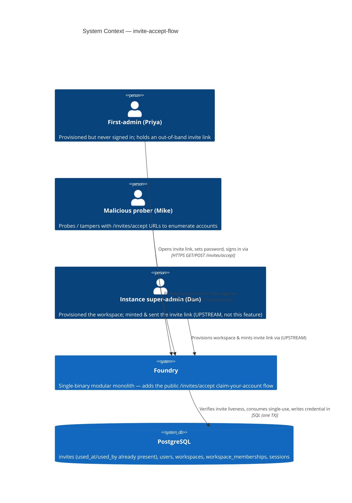
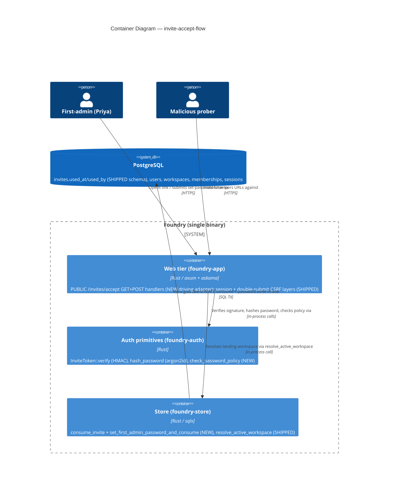
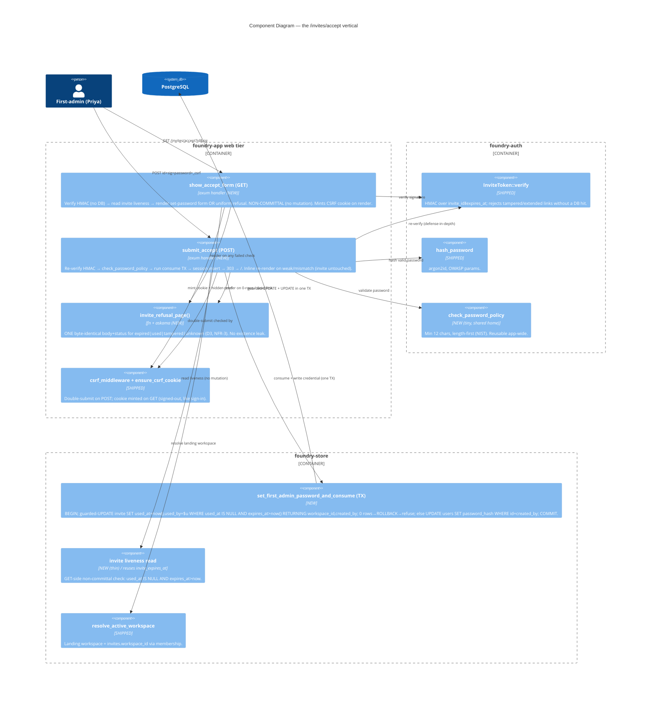

# Architecture — invite-accept-flow

> Morgan (nw-solution-architect), DESIGN wave, Propose mode. Modular monolith + ports-and-adapters
> (inherited). This feature turns the emitted `/invites/accept?id=…&sig=…` link from a DEAD URL into a
> live claim-your-account flow: verify the signed token → render set-password → atomically consume the
> invite + write the password + establish a session → land on the workspace. See `wave-decisions.md`
> for the DDD decisions (D1-D7) and the headline finding (the single-use columns already exist; NO
> migration). Requirements SSOT: `../discuss/`.

## System context and capabilities

A provisioned first-admin (Priya) holds an out-of-band invite link minted by `provision_workspace`
(CLI or web). The link carries `invite_id` + an HMAC `sig` over `invite_id‖expires_at`. This feature
adds the PUBLIC (signed-out-accessible) `/invites/accept` route pair that lets her set her own password
and be signed straight onto her workspace — no separate login step. A hostile prober gets a uniform,
non-enumerable refusal that reveals nothing about whether any account/workspace/invite exists.

The credential-establishment work is genuinely new backend (a single-use consume guard + a one-TX
password-write-and-consume) layered over heavily-reused shipped seams (token verify, argon2id hashing,
session + CSRF, workspace resolution).

## C4 Level 1 — System Context (MANDATORY)

## C4 Level 2 — Container (MANDATORY)

## C4 Level 3 — Component (the accept vertical)

## Request flows

### GET /invites/accept (verify, render — non-committal, D6)

1. `InviteToken::verify(id, expires_at, sig, secret)` — HMAC over `id‖expires_at`. Tampered `sig`,
   swapped `id`, or extended `expires_at` → fail → `invite_refusal_page()`. **No DB hit yet.**
   (`expires_at` is recovered from the row read in step 2 and re-bound through verify; the HMAC is the
   tamper oracle. See Integration checkpoint #1.)
2. Read the invite row (`used_at`, `expires_at`, `workspace_id`). If absent (unknown id), `used_at IS
   NOT NULL` (already used), or `expires_at <= now` (expired) → `invite_refusal_page()` — same body+status.
3. Otherwise render the set-password form naming the workspace; mint the CSRF cookie + hidden `_csrf`
   via `ensure_csrf_cookie`. **No mutation** (invite stays unconsumed; no password written) — AC-01.2.

### POST /invites/accept (validate, consume+write, sign-in — TOCTOU-safe, D2/D6)

1. **CSRF**: shipped `csrf_middleware` checks the double-submit token BEFORE the handler runs; missing/
   mismatched → 403, no consume, no write (NFR-6, AC-02.8).
2. **Re-verify HMAC** (defense-in-depth; rejects a tampered URL without a DB hit).
3. **`check_password_policy`** (min 12; D5/NFR-4) + confirm-match. Fail → re-render the form inline with
   an error; **the consume TX never opens**, so the invite stays live (FR-5, US-03, AC-03.1/03.2/03.4).
4. **`hash_password`** the validated password (argon2id, reused).
5. **`set_first_admin_password_and_consume(id, hash, now)`** — ONE TX:
   - guarded-UPDATE: `UPDATE invites SET used_at = now(), used_by = (the first-admin) WHERE id = $1 AND
     used_at IS NULL AND expires_at > now() RETURNING workspace_id, created_by`.
   - **0 rows** (lost the race / already used / expired in the GET→POST window) → ROLLBACK →
     `invite_refusal_page()` (E7, AC-02.6). The guard is the authoritative single-use + expiry point.
   - **1 row** → `UPDATE users SET password_hash = $hash WHERE id = created_by` (the first-admin) →
     COMMIT. Neither effect happens alone (BR-3, NFR-2).
6. **`session.insert(SESSION_KEY_USER_ID, SessionUser { user_id: created_by, workspace_id })`** then
   `resolve_active_workspace(created_by)` to confirm the landing tenant; **303 → `/`** (auto sign-in,
   decision 3; AC-01.3/01.5). Landed `workspace_id == invites.workspace_id` (FR-3, AC-01.4).

## Component architecture & boundaries

| Component | Layer | Responsibility | Owns |
|---|---|---|---|
| `invites_accept::show_accept_form` / `submit_accept` | driving adapter (web) | HTTP I/O, CSRF cookie, render form/refusal, orchestrate verify→policy→consume→session | WHAT the HTTP surface does |
| `invite_refusal_page()` + templates | driving adapter (web) | The single non-enumerable refusal body+status (D3) | refusal copy |
| `foundry_auth::InviteToken::verify` | driven port (SHIPPED) | HMAC authenticity + bound expiry | token integrity |
| `foundry_auth::hash_password` | driven port (SHIPPED) | argon2id credential hashing | hashing |
| `foundry_auth::check_password_policy` | driven port (NEW, shared) | length-first min-12 policy, reusable app-wide | strength policy |
| `Store::set_first_admin_password_and_consume` | driven adapter (NEW) | atomic single-use consume + credential write, one TX | single-use + atomicity |
| `Store::resolve_active_workspace` | driven adapter (SHIPPED) | landing workspace resolution | tenant landing |
| session + `csrf_middleware` | shipped layers | auto sign-in + double-submit CSRF | session/CSRF |

The software-crafter owns all internal structure (function decomposition, exact SQL parameter binding,
template markup) during GREEN/REFACTOR. The contracts above are the boundary.

## Quality attribute strategies (ISO 25010)

- **Security (first-class)** — STRIDE on the public POST trust boundary:
  - *Spoofing/Tampering*: `InviteToken` HMAC binds `id‖expires_at` (signed token verified server-side);
    a tampered/extended link fails verify before any DB hit (NFR-1).
  - *Elevation / replay*: single-use guarded-UPDATE — a consumed/expired link cannot be replayed
    (NFR-2). Expiry HMAC-bound; cannot be extended.
  - *Information disclosure (enumeration)*: uniform byte-identical refusal across all four reasons
    (D3, NFR-3) — closes the existence oracle the bootstrap flow leaks (see `upstream-changes.md`).
    `tracing` keys on `invite_id` only; no `sig`/password in logs (NFR-5).
  - *CSRF*: shipped double-submit on the public POST; cookie minted on GET (D4, NFR-6).
  - *Brute-force*: out of scope for the token (HMAC space is infeasible to guess); password is
    set-once on a single-use invite, not a repeated login — no rate-limit added in v1.
- **Reliability / fault tolerance**: the consume + write is atomic (one TX); a crash mid-flow leaves
  the invite live and the password unset (fail-safe; retryable). 0-rows is a first-class refusal path.
- **Usability**: inline recoverable errors (weak/mismatch) keep the invite live (US-03); the happy path
  is single-submit with no second login (decision 3).
- **Performance**: NO performance NFR exists for v1 (the DISCUSS NFR list is security-only). The flow is
  a single-TX path on one invite row, exercised once per workspace by a first-admin — there is no
  throughput, latency, or scaling concern to architect. The one notable cost is `hash_password`
  (argon2id, 80-300ms, OWASP params) which already runs on `spawn_blocking` (`foundry-auth/lib.rs:319`),
  so it does not stall the tokio runtime — reused unchanged. Recorded explicitly to close the ISO 25010
  scope rather than leave performance unstated.
- **Maintainability / testability**: ports-and-adapters keeps the consume logic in `foundry-store`
  (unit/integration-testable against real PG16 testcontainers), the policy in `foundry-auth` (pure,
  unit-testable), and the handler thin. The non-enumerability + single-use properties are
  acceptance-probed (revert-reds-it + concurrency @property).

## Integration patterns & API contracts

- **Surface**: server-rendered HTML (htmx idiom), NOT JSON/REST — consistent with the shipped web tier.
  - `GET /invites/accept?id=<uuid>&sig=<urlencoded-hmac>` → 200 set-password form | uniform refusal.
  - `POST /invites/accept` (form: `id`, `sig`, `password`, `confirm`, `_csrf`) → 303 `/` | 200 inline
    error (recoverable) | uniform refusal (terminal) | 403 (CSRF).
- **No external integrations** — the entire flow is in-process over PostgreSQL. No contract-testing
  annotation is owed to platform-architect (no third-party API, webhook, or OAuth provider).
- **Shared-artifact integrity** (from `shared-artifacts-registry.md`): the `sig` rendered into the GET
  form's hidden field is the SAME value POST re-verifies; the consumed `invite_id` is the row
  `insert_invite` created; the landed `workspace_id == invites.workspace_id`.

## Architecture Enforcement

Style: Modular Monolith + Hexagonal (ports-and-adapters). Language: Rust.
Tool: `cargo xtask check-arch` (in-tree, inherited).

Rules to enforce:
- Domain/store has zero inward dependency on the web adapter (handler calls store, never the reverse).
- LAYER-1e tenant-scoping: the new handler uses the `resolve_active_workspace` seam (like `signin`); it
  names no literal workspace id, so it should NOT trip the detector — confirm at DELIVER; one-line
  allow-list fallback if flagged (D7/adr-005).
- The consume + password write live in `foundry-store` behind one TX fn — the handler must not issue the
  guarded-UPDATE itself (keeps the atomicity boundary in the driven adapter).

## Deployment architecture

Unchanged: ONE binary, ONE PostgreSQL, NO Redis/Node/CDN. ZERO new crates. ZERO migration (the
`invites.used_at`/`used_by` columns shipped in `0001_init.sql`). The two new routes register on the
PUBLIC layer of `build_router` (outside the instance-admin gate, under the shipped session + CSRF
layers). No infra change for platform-architect beyond the existing web tier.

## ADRs

- `adr-001-single-use-consume-tx.md` — no migration; reuse shipped `used_at`/`used_by`; the guarded-UPDATE + one-TX consume (OD-1).
- `adr-002-non-enumerable-refusal.md` — the uniform byte-identical refusal; divergence from the bootstrap oracle (NFR-3).
- `adr-003-public-post-csrf-seam.md` — CSRF cookie on the public GET; double-submit on the POST (NFR-6).
- `adr-004-password-policy-placement.md` — min-12 length-first policy with a reusable `foundry-auth` home (NFR-4, OD-2).
- `adr-005-reuse-and-layer1e.md` — reuse verdict + the LAYER-1e allow-list confirmation (D7).
