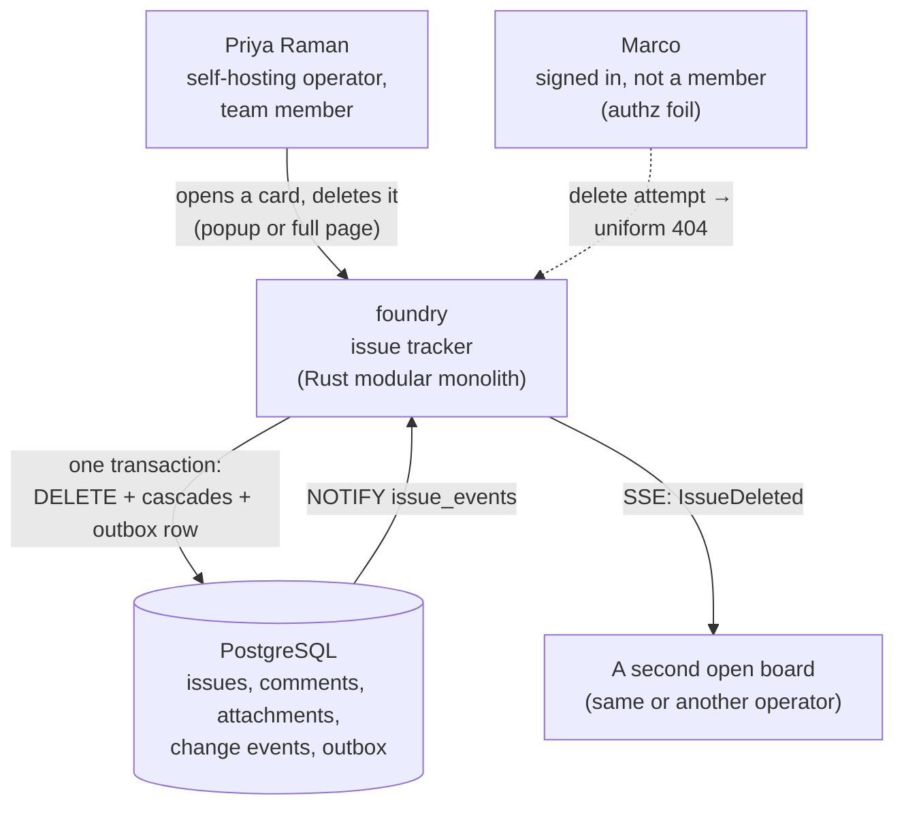
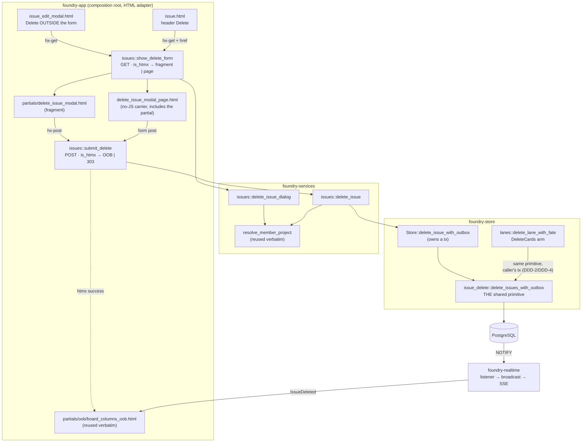

# Feature Delta — issue-card-delete

Delete an issue from the two surfaces that already open it: the **edit popup**
htmx-swapped into `#modal-root`, and the **full issue page**. One confirm
dialog, one write port, one meaning of "deleted".

Feature type: **cross-cutting** (Askama templates + app handlers + a services
use case + a store call + one outbox event through the shipped SSE topology).
Predecessor influence: `board-lane-management` (the two-fate lane delete and its
confirm dialog), `board-lane-overflow-menu` (D1, which declined archive), and
`comment-edit-delete` (the delete-verb precedent this feature deliberately
diverges from — see D1).

## Wave: DISCUSS

### [REF] Prior Wave Consultation

| Source | Read | What it settled |
|---|---|---|
| `docs/product/jobs.yaml` | ✓ | No job covers deleting an **issue**. `job-board-lane-shaping` covers deleting a **lane** (and, as a fate, its cards in bulk). This feature validates a NEW job, `job-issue-card-delete`, rather than widening a lane job to cover a card verb. |
| `docs/product/jobs.yaml` → `job-board-lane-shaping.scope_history` (2026-09-02) | ✓ | **Load-bearing.** "Archive was offered and DECLINED (D1): foundry has no archive concept, and adding one would create a second way for a card to be invisible — the exact failure board-lane-management D1(b) removed." This is the decision the intake's tombstone approach collided with. See *Changed Assumptions*. |
| `docs/product/jobs.yaml` → `job-board-lane-shaping.forces.anxiety` | ✓ | "That deleting a lane silently eats the cards inside it, or **strands them invisible** the way cancelled issues are stranded today." The named anxiety is invisibility, and the accepted answer was explicitness, not recoverability. |
| `docs/product/outcomes/registry.yaml` OUT-4 | ✓ | The lane delete's `DeleteCards` fate is "the **hard** `delete_issue_cascade` shape". Issues already hard-delete in shipped code; a soft-delete here would give one entity two delete meanings. |
| `docs/product/outcomes/registry.yaml` OUT-5 | ✓ | The composite FK `(project_id, state) → lanes(project_id, slug)` makes a laneless issue unreachable. Deleting an issue removes the referencing row entirely, so the invariant is untouched — but the guard query must still return 0 after every delete scenario. |
| `docs/product/personas/persona-instance-operator.yaml` | ✓ | Priya Raman reused; no new persona minted. Her `env-hardened-profile` (scripting disabled) is why D4 picks GET+POST over the `DELETE` verb. Marco reused as the authz foil. |
| `docs/product/journeys/journey-theme-adoption.yaml` | ✓ | Unrelated (theming). No issue-lifecycle journey exists to extend; this feature creates `journey-issue-card-delete`. |
| `crates/foundry-store/src/lanes.rs::delete_cards_permanently` | ✓ | `DELETE FROM issues WHERE id = ANY($1)` — the shipped hard delete, inside the lane-fate transaction. |
| `crates/foundry-store/src/attachments.rs::delete_issue_cascade` | ✓ | `DELETE FROM issues WHERE id = $1`, returning `rows_affected`. The single-row port this feature reuses **verbatim**. |
| migrations `0004`, `0005`, `0013` | ✓ | `comments.issue_id`, `issue_attachments.issue_id` and `issue_change_events.issue_id` are all `REFERENCES issues(id) ON DELETE CASCADE`. The cascade is already correct and already shipped — this feature writes no cascade code. |
| `crates/foundry-store/src/lib.rs::soft_delete_comment_with_outbox` | ✓ | The tombstone precedent, and its outbox emit shape (`INSERT INTO outbox … 'CommentDeleted'` in the same transaction). The **outbox idiom** is copied (D9); the **tombstone** is not (D1). |
| `crates/foundry-realtime/src/lib.rs::EventPayload` | ✓ | Already carries `project_id`, `issue_id`, `number`, `key` and `deleted: Option<bool>`. An `IssueDeleted` event needs **zero new fields** and `schema_version` stays 1. |
| `crates/foundry-app/templates/partials/delete_lane_modal.html` | ✓ | The confirm-dialog contract to mirror: bare fragment into `#modal-root`, `[data-action="close-modal"]` as the only close, hidden `_csrf`, live advisory count in the copy, `[data-error-slot]`, and the explicit "this cannot be undone" sentence. |
| `crates/foundry-app/templates/partials/issue_edit_modal.html` | ✓ | The popup. Its `×` sits **outside** the `<form>` precisely so it can never submit — D5 puts Delete in the same position for the same reason. |
| `crates/foundry-app/templates/issue.html` | ✓ | The full page. Header is `<h1>{{ issue_key }}</h1>` with no action affordances; D6 adds the first one. |
| `crates/foundry-app/src/lib.rs` route table | ✓ | Lane delete is `get(show_delete_lane_dialog).post(submit_delete_lane)`; comment delete is `.delete(submit_delete_comment)`. D4 picks the former shape. |
| `crates/foundry-api/src/lib.rs` | ✓ | `/api/v1` has no issue DELETE and this feature does not add one (*Out of Scope*). |
| `docs/product/vision.md`, `docs/project-brief.md`, `docs/stakeholders.yaml` | ⊘ | Not present in this repo. |
| `docs/feature/issue-card-delete/discover/`, `diverge/` | ⊘ | No DISCOVER or DIVERGE wave ran. Requirements were clear at intake; the one contradiction found is resolved in *Changed Assumptions*. |

**One contradiction found and resolved before any story was written.** It is
recorded in full under *Changed Assumptions*, and it changed the feature's data
model.

### [REF] Persona

**Priya Raman — self-hosting operator and team member on her own boards**
(`persona-instance-operator`). She files issues quickly and in bulk — "opens
issue cards as often to READ as to edit", works three lanes, and uses `c` to
file the first thing that comes to mind. The consequence is that her boards
accumulate cards that should not exist: a duplicate filed twice from two
machines, a typo'd key-worthy title, a note that turned out to belong on
another board, a test card from the day she was proving the board worked.

Today the only way to remove one is to **delete the whole lane it sits in and
choose the delete-all fate** — destroying every other card in that lane to
remove one — or to open psql. She has the lane verbs and no card verb.

**Marco** (`persona-team-member-foil`, signed in, not a member of team Backend)
remains the authz foil: every refusal he receives must be the uniform
non-enumerable 404.

### [REF] JTBD

**job_id: `job-issue-card-delete`** — a NEW job, appended to `docs/product/jobs.yaml`.

One-liner: *When a card on my board should not exist — a duplicate, a mistake,
a note that belongs somewhere else — I want to remove it from wherever I am
already looking at it, and know exactly what goes with it, so my board only
shows work that is real, without destroying the lane it happens to sit in.*

| Dimension | |
|---|---|
| **Functional** | Remove one issue, and everything hanging off it, from either surface that already opens it — in a bounded number of deliberate actions, with the consequence stated before it happens. |
| **Emotional** | Stop treating the board as append-only. Stop feeling that a misfiled card is permanent furniture, and stop weighing "is this duplicate worth nuking the lane for?" |
| **Social** | Anyone shown the board reads only work that is real. No "ignore that one, it's a duplicate" tour — the same tour `job-board-lane-shaping` removed for dead columns. |

| Force | |
|---|---|
| **Push** | There is no card delete at any granularity below a lane. The only in-app removal is `delete_lane_with_fate(…, DeleteCards)` — which destroys *every* card in the lane — or SQL against production. A board therefore only ever grows, and the operator learns not to file speculatively, which costs more than the clutter. |
| **Pull** | A Delete on the card she already has open, with the same confirm-dialog care the lane delete shows: it says what goes, it counts it, and it says it cannot be undone. |
| **Anxiety** | That deleting an issue quietly takes comments, attachments and history with it without saying so; that it can be triggered by a misclick next to Save; that it half-succeeds and leaves orphaned rows; that the board keeps showing the card afterwards, so she cannot tell whether it worked. |
| **Habit** | The board is append-only today and the edit popup's only buttons are Save and ×. Delete must not move, restyle or endanger either — the popup must stay safe to open, read and dismiss, which is what Priya mostly does with it. |

| Opportunity | |
|---|---|
| **Importance** | high — the workaround (destroy the lane to remove one card) is disproportionate to the point of being unusable, so in practice the capability is absent. |
| **Satisfaction** | low — nothing serves it. |

All three stories trace N:1 to `job-issue-card-delete`.

### [REF] Locked Decisions

| ID | Decision | Verdict | Rationale |
|---|---|---|---|
| **D1** | Delete semantics | **Hard delete.** Reuse `Store::delete_issue_cascade` verbatim. No `deleted_at`/`deleted_by` on `issues`, no `410 Gone`, no GC, **no migration — stays at 0015**. | Overrides the intake's stated tombstone approach; see *Changed Assumptions*. Three grounds: (a) issues **already** hard-delete via the shipped lane fate (OUT-4), so a tombstone would give one entity two incompatible delete meanings; (b) a tombstoned issue is "a second way for a card to be invisible", which `board-lane-overflow-menu` D1 declined explicitly; (c) the comment tombstone exists to preserve a **position in a thread** — an issue has no such position, so the reason does not transfer. |
| **D2** | Who may delete | **Any member of the issue's team.** | Any member can already edit any issue's title, description and status, and can already destroy all of a lane's cards. Author-only delete would be *stricter for delete than for edit* on the same row — incoherent. Diverges from `comment-edit-delete` ADR-007 (author-or-admin) deliberately; a comment is authored speech, an issue is shared work. |
| **D3** | Confirmation | **A confirm dialog**, a new `partials/delete_issue_modal.html` mirroring `delete_lane_modal.html`'s contract. It states the key, counts what goes with it, and carries the shipped "this cannot be undone" sentence. | The action is irreversible by D1, so the dialog is the entire safety net. `hx-confirm` was rejected: it is an unstyled browser modal, it is invisible to the scripting-disabled lane, and it cannot count consequences. |
| **D4** | Request shape | **`GET` dialog + `POST` confirm** at `/team/{team}/project/{project}/issues/{n}/delete` — the lane-delete route pair. **Not** the HTTP `DELETE` verb. | A `<form method="post">` works in Priya's `env-hardened-profile` (scripting disabled); `hx-delete` does not. `comment-edit-delete` chose `DELETE` for an htmx-only affordance inside a comment card; this feature's full-page surface should not silently require JS. |
| **D5** | Popup affordance | A **Delete button placed outside the `<form>`** in `issue_edit_modal.html`, beside the `×`. It is an `hx-get` of the confirm dialog into `#modal-root`, replacing the edit dialog. | The `×` is outside the form precisely so it can never submit (adr-modal-close-001 D-12); Delete inherits that protection for the same reason. A Delete adjacent to **Save** inside the form is a misclick farm on the exact control Priya uses most. |
| **D6** | Full-page affordance | A **Delete button in the `issue.html` header**, beside `<h1>{{ issue_key }}</h1>`. Same `hx-get` into `#modal-root`, with a plain `href` fallback to the dialog route for the no-JS path. | First action affordance on that page. Header placement keeps it away from the three submit buttons already on the page (upload, comment, save). |
| **D7** | Success response — popup path | Cleared `#modal-root` + out-of-band `#board-columns` refresh. The exact shape `delete_lane_with_fate` success already returns (OUT-4), through the existing `partials/oob/board_columns_oob.html`. | Zero new response machinery. The board visibly loses the card in the same paint that closes the dialog — which is the whole of the "did it work?" anxiety. |
| **D8** | Success response — full-page path | **Redirect to the board.** | The page's subject no longer exists. Re-rendering it as a tombstone page is the invisible-card failure in another guise; the board is where the operator can see the consequence. |
| **D9** | Fan-out | One `IssueDeleted` outbox row **in the same transaction as the delete**, mirroring `soft_delete_comment_with_outbox`. `event_type: "IssueDeleted"`, `deleted: Some(true)`; `schema_version` **stays 1**. | `EventPayload` already carries `project_id`, `issue_id`, `number`, `key` and `deleted` — a forward-compatible **zero-field** addition per realtime-roadmap invariant 4. Same transaction, so a committed delete can never fail to announce itself. |
| **D10** | Refusals | Uniform non-enumerable **404** on **both** verbs for foreign team, foreign project, absent issue, non-member and signed-out. CSRF middleware unchanged and unbypassed. | The `board-lane-management` D10 idiom, unmodified. A delete must not become the enumeration oracle every other route closed (ADR-003). |
| **D11** | Cascade | Comments, attachments and change events go with the issue via the **shipped `ON DELETE CASCADE` FKs** (0004, 0005, 0013). No new cascade code, no application-level fan-out of child deletes. | Already correct, already exercised by the lane fate. Writing a second cascade would create a path that can drift from the schema's. |
| **D12** | Board card affordance | The board card gets **no** delete control. Delete is reached through the popup the card already opens. | The card is already a drag handle *and* an edit trigger on two lines of text. A third gesture there is the armed-destructive-control failure `board-lane-overflow-menu` D3 removed from the column header. |
| **D13** | Consequence counting | The dialog reads live comment and attachment counts at **GET** time (advisory), and the delete binds whatever exists at **POST** time. | The lane dialog's D7 advisory/confirm-time split, reused verbatim. The counts inform; they do not gate. |
| **D14** | Walking skeleton | **None.** | Every seam ships: the services layer, CSRF middleware, the confirm-dialog contract, `#modal-root`, the OOB `#board-columns` refresh, the outbox→LISTEN→SSE topology, `delete_issue_cascade`, and all test lanes. There is no unproven end-to-end path to prove. |

### [REF] Journey — `journey-issue-card-delete` (comprehensive)

**Persona:** Priya Raman · **Job:** `job-issue-card-delete` · **Platform:** web

**Goal:** remove one card that should not exist, from wherever she is already
looking at it, knowing before she commits exactly what goes with it.

**Mental model.** She thinks of the card as *the thing*, and of comments,
attachments and history as *notes stuck to the thing* — so she expects them to
go with it and would be surprised to find them surviving. She does **not** think
of delete as archiving; nothing in foundry archives, and she has never asked for
a trash can. She does expect to be asked once. Her vocabulary: "delete",
"remove", "get rid of it" — never "archive", never "close" (which she reads as
a lane, not a verb).

| # | Step | Sees | Emotional state |
|---|---|---|---|
| 1 | Spots a card that should not exist | The duplicate sitting in Backlog | **Irritation** — mild, chronic; it has been there a week |
| 2 | Opens it — clicks the card, or lands on the full page from a link | Edit popup over the board, or the issue page | Neutral; this is her most familiar action |
| 3 | Finds **Delete** | Popup: beside the `×`, away from Save. Page: beside the key in the header | **Relief, tinged with wariness** — "is this going to ask me?" |
| 4 | Reads the confirm | "Delete AUTH-42? Its 3 comments and 1 attachment go with it. This cannot be undone." | **Informed.** The wariness resolves: the cost is stated and counted, not implied |
| 5 | Confirms | One deliberate click on a clearly destructive button | **Commitment** — deliberate, not anxious |
| 6a | *(popup path)* | Dialog closes; the board behind it re-renders without the card | **Confidence** — she watched it happen |
| 6b | *(page path)* | Lands on the board; the card is not there | **Confidence** — she is somewhere real, not on a page for a thing that is gone |
| 7 | Glances at her other tab | That board has dropped the card too | **Trust** — the tool agrees with itself |

Arc: irritation → relief/wariness → **informed** → commitment → confidence →
trust. Confidence rises monotonically from step 4 and never dips; the one
wariness spike at step 3 is resolved by step 4 rather than carried.

**Error paths.**

| Failure | Recovery |
|---|---|
| Someone else deleted it first (or she double-submitted) | Uniform 404. The board she returns to is correct, and correct is what she wanted. No error copy naming the issue — that would be the enumeration oracle. |
| Marco (non-member) POSTs the delete | The same uniform 404, byte-identical to a project that never existed. |
| CSRF token absent or stale | Refused by the middleware before the handler runs. The dialog's `[data-error-slot]` shows the refusal; nothing is written. |
| She opens the dialog, then a comment is added before she confirms | The delete proceeds and takes the new comment too (D13 — counts advise, the confirm binds). The count she read was one comment stale; the outcome is not surprising, because the copy says the comment goes with it. |
| Scripting disabled | The header Delete is a plain link to the dialog route; the dialog is a plain `<form method="post">`. The whole path works, minus the OOB board refresh — the POST redirects to the board instead. |

### [REF] Scope Assessment: SPLIT — 3 slices, user-confirmed

Two oversized signals fired: **4 modules touched** (`foundry-app`,
`foundry-services`, `foundry-store`, `foundry-realtime`) and **3 independently
shippable user outcomes** (full-page delete, popup delete + board refresh,
cross-viewer fan-out). Split proposed and **confirmed by the user**.

Three thin end-to-end slices, each ≤1 day, each dogfoodable the day it lands:

| Slice | Story | Why this order |
|---|---|---|
| 01 | US-ICD-01 — delete from the full page | Ships the entire vertical (route pair, authz, service, store reuse, confirm dialog) on the surface with **no board reconciliation to solve** — a redirect is the whole success path. Carries the feature's only real uncertainty. |
| 02 | US-ICD-02 — delete from the popup, board refreshes in place | Pure adapter work on slice 01's proven port; adds the OOB refresh. |
| 03 | US-ICD-03 — the card leaves every open board | Adds the outbox event and its fan-out. Separable because a stale card in a *second* tab is a distinct outcome from a stale card in the *acting* tab. |

Right-sized after the split: ~3 stories, ~2.5 days total.

### [REF] Shared Artifacts

| Artifact | Single source of truth | Consumed by |
|---|---|---|
| `${team_slug}` / `${project_slug}` / `${issue_number}` | The URL path, resolved once per request through the `resolve_member_project` authz gate | Both verbs; the dialog's form `action`; the redirect target |
| `${issue_key}` (`AUTH-42`) | The store row's `number` + the project's `key_prefix`, composed exactly as `parse_issue_key` already does | Dialog heading; log lines; the `IssueDeleted` payload's `key` |
| `${csrf}` | `crate::csrf::ensure_csrf_cookie` — the same mint/reuse the edit and lane dialogs use | The dialog's hidden `_csrf`; validated by the unchanged `csrf_middleware` |
| `${comment_count}` / `${attachment_count}` | Live store reads at **GET** time only — advisory, never gating (D13) | Dialog copy |
| `${board_url}` (`/team/{t}/project/{p}`) | Composed from the same path triple | D8 redirect; the OOB refresh's implicit target |
| `#board-columns` OOB fragment | `partials/oob/board_columns_oob.html`, unchanged and shared with lane delete | Slice 02's success response |
| `IssueDeleted` payload | The single outbox row written inside the delete transaction | `spawn_pg_listener` → broadcast → SSE subscribers |

### [REF] User Stories

---

#### US-ICD-01: Delete an issue from its full page

`job_id: job-issue-card-delete`

##### Elevator Pitch

- **Before:** an issue that should not exist can only be removed by deleting the entire lane it sits in and choosing the delete-all fate — destroying every other card in that lane — or by opening psql against production.
- **After:** open `/team/backend/project/auth/issues/42`, click **Delete** in the header → a dialog says "Delete AUTH-42? Its 3 comments and 1 attachment go with it. This cannot be undone." → confirm → she lands on the board, and AUTH-42 is not on it.
- **Decision enabled:** whether a card is worth keeping — answerable now at the cost of one card instead of one lane, so she can file speculatively again.

##### Problem

foundry has no card-level delete at all. The nearest capability,
`delete_lane_with_fate(…, DeleteCards)`, is a bulk operation whose blast radius
is the whole lane; using it to remove one duplicate is absurd, so in practice
the board is append-only. This story ships the complete write path — dialog,
confirm, authz, cascade, refusals — on the surface where the consequence is
clearest and where success needs no board reconciliation.

##### Acceptance Criteria

- **AC-1.1** `GET /team/{t}/project/{p}/issues/{n}/delete` returns the confirm dialog fragment naming the issue key, stating that comments and attachments go with it, and carrying the shipped "this cannot be undone" sentence (D3).
- **AC-1.2** The dialog reports the issue's live comment and attachment counts at GET time; the counts are advisory and never gate the POST (D13).
- **AC-1.3** `POST …/issues/{n}/delete` with a valid CSRF token deletes the issue row and redirects to `/team/{t}/project/{p}` (D8).
- **AC-1.4** The delete removes exactly one `issues` row, and every `comments`, `issue_attachments` and `issue_change_events` row referencing it, via the shipped `ON DELETE CASCADE` FKs — leaving **zero orphaned children**, provable by a post-scenario guard query (D11).
- **AC-1.5** No other issue is affected: sibling issues in the same lane and project retain their `id`, `number`, `state` and `position` byte-for-byte.
- **AC-1.6** No `lanes` row is touched, and the board's lane set and order are identical before and after (D1 — a card delete is not a lane operation).
- **AC-1.7** Any team member may delete any issue in their team's project (D2); the acting user need not be its author.
- **AC-1.8** Foreign team, foreign project, absent issue number, non-member and signed-out all return the uniform non-enumerable 404 on **both** verbs, echoing no key (D10).
- **AC-1.9** A POST without a valid CSRF token is refused by the middleware before the handler runs, and writes nothing.
- **AC-1.10** A second POST for the same issue (double-submit, or a concurrent delete) returns the uniform 404 and writes nothing — the first delete stands, no error surfaces to the operator beyond the 404 page.
- **AC-1.11** The whole path works with scripting disabled: the header Delete is a plain link to the dialog route, and the dialog is a plain `<form method="post">` (D4, D6).
- **AC-1.12** Deleting an issue requires no schema change: the cascade is carried by the FKs already declared in `0004`/`0005`/`0013`, so the delete works against the shipped schema unaltered (D1). *Reclassified after the DISTILL review gate: the earlier wording ("no migration is added — the schema head remains 0015") was a build assertion, not an observable behaviour, and no UAT scenario could verify it. The build constraint it expressed is retained in* §System Constraints *and asserted in the DoD.*

##### UAT Scenarios

1. **Given** AUTH-42 has 3 comments and 1 attachment, **when** Priya opens its full page and clicks Delete, **then** the dialog names AUTH-42 and states that 3 comments and 1 attachment go with it, and that this cannot be undone.
2. **Given** that dialog is open, **when** she confirms, **then** she lands on the Backend/auth board, AUTH-42 is not rendered on it, and querying the store returns 0 `issues`, 0 `comments`, 0 `issue_attachments` and 0 `issue_change_events` rows for that id.
3. **Given** AUTH-41 and AUTH-43 sit in the same lane as AUTH-42, **when** AUTH-42 is deleted, **then** both retain their `state` and `position` unchanged, and the project's lane rows are untouched.
4. **Given** AUTH-42 was filed by another team member, **when** Priya (a member, not the author) deletes it, **then** it is deleted — membership, not authorship, is the gate.
5. **Given** Marco is signed in but not a member of team Backend, **when** he GETs *or* POSTs the delete route for AUTH-42, **then** both return the uniform non-enumerable 404 and AUTH-42 still exists.
6. **Given** Priya has the confirm dialog open, **when** another operator deletes AUTH-42 first and she then confirms, **then** she receives the uniform 404, and nothing further is written.
7. **Given** a browser profile with scripting disabled, **when** Priya follows the header Delete link and submits the dialog form, **then** the issue is deleted and she lands on the board.

**Estimate:** ~1 day.

---

#### US-ICD-02: Delete an issue from the edit popup, and watch the board lose the card

`job_id: job-issue-card-delete`

##### Elevator Pitch

- **Before:** the edit popup — the thing a click on any card opens — can save an issue or dismiss itself, and nothing else. Removing the card means leaving the board for the full page first.
- **After:** click the duplicate on the board, click **Delete** in the popup header → the same confirm dialog replaces the edit dialog in place → confirm → the dialog closes and the board behind it re-renders without the card, in one paint.
- **Decision enabled:** whether the board in front of her is an accurate picture of the work — fixable from the board itself, without navigating away and back.

##### Problem

The popup is where Priya meets a card: `issue_card.html` carries
`hx-get="{{ card.edit_url }}"`, so every card click opens it. Making her leave
the board to delete something she is looking at *on* the board is the friction
that keeps duplicates alive. The risk this story must not take is the mirror
image: putting a destructive control next to **Save**, on the dialog she opens
mostly to read.

##### Acceptance Criteria

- **AC-2.1** `issue_edit_modal.html` renders a Delete control **outside** the `<form>` element, beside the `×`, so it can never submit the edit form (D5) — provable by markup assertion, not by styling.
- **AC-2.2** Activating it `hx-get`s the confirm dialog into `#modal-root`, replacing the edit dialog; no edit is saved as a side effect, and the issue's title, description and state are unchanged at that point.
- **AC-2.3** Confirming from the popup path returns a response that both clears `#modal-root` and carries the out-of-band `#board-columns` refresh — the exact shape lane-delete success already returns (D7).
- **AC-2.4** After that response, the board no longer renders `article.issue-card[data-issue-key="AUTH-42"]`, and every other card is present with unchanged key, title, lane and order.
- **AC-2.5** The OOB refresh renders through the shipped `partials/oob/board_columns_oob.html` and `board_columns.html` — both render paths stay byte-identical, and the `⋯` lane menu still renders six items in contract order afterwards.
- **AC-2.6** `Escape` still closes the confirm dialog through the single `closeTopLayer()` owner — no second key listener is added (BR-4, ADR-MODAL-CLOSE-001), and cancelling writes nothing.
- **AC-2.7** The CSRF token travels correctly **in a real browser**, proven in the `@needs-browser` lane and not only by HTTP-lane token injection (the `fix-comment-delete-csrf` lesson).
- **AC-2.8** The shipped edit-and-save path is unchanged: saving a title/description/status from the popup still returns the in-place card replace, byte-identical to today.
- **AC-2.9** The delete write goes through the **same use case** as US-ICD-01 — one write port behind both surfaces, not two handlers that can drift.

##### UAT Scenarios

1. **Given** the Backend/auth board shows AUTH-41, AUTH-42 and AUTH-43, **when** Priya clicks AUTH-42 and chooses Delete in the popup, **then** the confirm dialog replaces the edit dialog naming AUTH-42, and AUTH-42 still exists.
2. **Given** that confirm dialog, **when** she confirms, **then** the modal root is empty and the board renders AUTH-41 and AUTH-43 only, in their original lanes and order.
3. **Given** the popup is open with an unsaved title edit typed in, **when** she chooses Delete and then confirms, **then** the issue is deleted and the typed edit was never saved (AC-2.2).
4. **Given** the popup is open, **when** she chooses Delete and then presses `Escape`, **then** the confirm dialog closes, nothing is written, and AUTH-42 is still on the board.
5. **Given** a real browser session, **when** she deletes from the popup, **then** the POST carries a valid CSRF token and is accepted — no silent 403 (AC-2.7).
6. **Given** Marco has a board open for a team he does not belong to, **when** he POSTs the popup delete, **then** he receives the uniform non-enumerable 404.

**Estimate:** ~1 day.

---

#### US-ICD-03: A deleted card disappears from every open board

`job_id: job-issue-card-delete`

##### Elevator Pitch

- **Before:** deleting AUTH-42 in one tab leaves it sitting on the board in her other tab — still clickable, and now a 404. The tool disagrees with itself until someone reloads.
- **After:** delete AUTH-42 on her laptop → the board open on her second monitor drops the card on its own, through the SSE stream foundry already runs.
- **Decision enabled:** whether the board she is looking at right now is current — so she can trust it without a reflexive refresh.

##### Problem

`board-lane-shaping`'s named anxiety is cards that are "stranded invisible". The
inverse is just as corrosive: a card that is **visible but gone**. Every other
board mutation already fans out through the shipped
outbox → `LISTEN` → broadcast → SSE topology; a delete that did not would be the
one write in foundry that lies to a second viewer.

##### Acceptance Criteria

- **AC-3.1** The delete writes exactly one `outbox` row with `event_type = "IssueDeleted"`, **in the same transaction** as the `issues` delete — a committed delete can never fail to announce itself, and a rolled-back one announces nothing (D9).
- **AC-3.2** The payload carries `project_id`, `issue_id`, `number`, `key` and `deleted: true`, using **only fields `EventPayload` already declares**; `schema_version` stays `1` (realtime-roadmap invariant 4).
- **AC-3.3** A subscriber holding an SSE connection to that project receives the `IssueDeleted` event within the acceptance suite's existing `SseSubscription::wait_for` budget.
- **AC-3.4** A second browser with the board open removes `article.issue-card[data-issue-key="AUTH-42"]` on receipt, leaving every other card untouched.
- **AC-3.5** Subscribers to a **different** project receive no event for this delete (tenancy — the payload's `project_id` is the filter).
- **AC-3.6** Existing `CommentAdded`, `CommentEdited`, `CommentDeleted` and issue-state events are unchanged in shape and delivery; no existing subscriber breaks on the new `event_type`.
- **AC-3.7** A delete refused for any reason (404, CSRF, race) emits **no** outbox row.

##### UAT Scenarios

1. **Given** Priya has the Backend/auth board open in two tabs, **when** she deletes AUTH-42 in the first, **then** the second drops the card without a reload and still shows AUTH-41 and AUTH-43.
2. **Given** an SSE subscriber on project auth, **when** AUTH-42 is deleted, **then** it receives one event with `event_type = "IssueDeleted"`, `key = "AUTH-42"`, `deleted = true` and `schema_version = 1`.
3. **Given** an SSE subscriber on a different project in the same workspace, **when** AUTH-42 is deleted, **then** it receives no event for it.
4. **Given** Marco POSTs a delete he is not entitled to, **when** the 404 is returned, **then** the `outbox` table has grown by zero rows.
5. **Given** a subscriber that also receives comment events, **when** a comment is added and an issue deleted in sequence, **then** both events arrive, correctly discriminated, and the comment path is unchanged.

**Estimate:** ~0.5 day.

---

### [REF] System Constraints

- Migrations are forward-only; the next number would be `0016`, but **D1 expects none** — this feature adds no column and no table.
- `comments`, `issue_attachments` and `issue_change_events` all reference `issues(id) ON DELETE CASCADE` (0004/0005/0013). The cascade is the schema's, not the application's; no handler may re-implement it.
- The composite FK `(project_id, state) → lanes(project_id, slug)` and the zero-laneless guard query must both still hold after every delete scenario (OUT-5).
- Mutating requests carry CSRF (hidden `_csrf` or `x-csrf-token`); authz refusals are the uniform non-enumerable 404 — never 401/403, never an echoed key (ADR-003).
- `Escape` has exactly one owner, `closeTopLayer()` (BR-4, ADR-MODAL-CLOSE-001). The confirm dialog is an existing layer type and adds no listener.
- `board_columns.html` is shared by the full page and the OOB refresh; both must render byte-identical markup (`board-lane-overflow-menu` D14), and the `⋯` menu's six-item contract order survives the refresh.
- `EventPayload` field additions are forward-compatible and never rename; `schema_version` stays 1 (realtime-roadmap invariant 4). D9 adds **no** field.
- Any new dialog CSS lands in the content-hashed stylesheet using `--cz-*` tokens only, with `static/VENDOR.md` updated in the same commit (`canzan-theme-system` ADR-CANZAN-THEME-004).
- Test lanes: HTTP acceptance lane for status, persistence, cascade and refusals; `@needs-browser` for the popup chain, `Escape` cancel, real-browser CSRF and the second-tab fan-out. The default lane **excludes** `@needs-browser`; those scenarios run in the `all` lane, which is what `cargo xtask ci` runs. Per-feature mutation testing ≥80% on touched files.

### [REF] Outcome KPIs

Objective: a board shows only work that is real, correctable one card at a time,
from wherever that card is already open, with no orphaned rows and no stale
views.

| # | Who | Does What | By How Much | Baseline | Measured By | Type |
|---|---|---|---|---|---|---|
| 1 | Board operators | Remove one issue without destroying anything else | 100% of card deletes performed with **0 lanes deleted** and **0 sibling issues affected** | 0% — the only in-app removal is the lane's delete-all fate, whose blast radius is the entire lane | Acceptance suite AC-1.5, AC-1.6; row-level diff of `lanes` and sibling `issues` across every delete scenario | Leading |
| 2 | Board operators | Never leave orphaned rows behind | **0** `comments`, `issue_attachments` or `issue_change_events` rows referencing a non-existent issue, permanently | n/a — no single-issue delete path exists | Guard query (`LEFT JOIN issues … WHERE issues.id IS NULL`) run after **every** mutating scenario, alongside the shipped zero-laneless guard | Guardrail |
| 3 | Board operators | Never delete by accident | **100%** of successful deletes are preceded by a confirm dialog GET; **0** routes destroy an issue on a single activation; **0** delete controls render inside the edit `<form>` | n/a | Acceptance assertion that a POST-without-prior-GET is still the only shape tested, plus a markup assertion on AC-2.1 | Guardrail |
| 4 | Board operators | Reach delete from wherever the card is already open | Delete reachable in **≤2 pointer actions** from an open card on **both** surfaces, and completable with scripting disabled | 0% — unreachable at any cost below a lane delete | Acceptance scenarios US-ICD-01 #1/#7, US-ICD-02 #1 | Leading |
| 5 | Board operators | See the same board everywhere | A deleted card leaves a second open board within the acceptance suite's existing `SseSubscription::wait_for` budget, with **0** events leaking to other projects | 0% — no fan-out exists for a delete because no delete exists | `@needs-browser` two-tab scenario (US-ICD-03 #1) + SSE payload assertions #2/#3 | Leading |
| 6 | Board operators | Never be told a resource exists by being refused it | **100%** of foreign/absent/non-member GETs *and* POSTs return the uniform 404 with no echoed key | Inherited property; must not regress | Acceptance scenarios US-ICD-01 #5/#6, US-ICD-02 #6 | Guardrail |
| 7 | Maintainers | Keep one meaning of "deleted" for an issue | **0** new lifecycle columns on `issues`; schema head remains `0015`; the lane fate and the card delete resolve to the same store call shape | n/a — the risk this feature was one decision away from introducing | Migration-directory assertion + code reading at review (D1) | Guardrail |

Homelab-scale honesty: single-digit-operator instance. Every KPI above is
verified by the acceptance suite and SQL against the store, not by analytics
tooling — the posture every prior feature recorded.

### [REF] DoD

- All UAT scenarios green in the HTTP lane; the popup chain, `Escape` cancel, real-browser CSRF and the two-tab fan-out green in the `@needs-browser` lane.
- The orphaned-children guard query returns 0 after every mutating scenario (KPI 2), and the shipped zero-laneless guard still returns 0.
- Sibling issues and all `lanes` rows provably unchanged across every delete (KPI 1).
- The Delete control renders **outside** the edit form, asserted on markup (AC-2.1) — not left to CSS.
- The shipped edit-and-save path, the lane `⋯` menu's six items in contract order, and the card drag-and-drop scenarios all green and unmodified.
- One `IssueDeleted` outbox row per committed delete, zero per refused delete, `schema_version` still 1, no new `EventPayload` field (AC-3.1, AC-3.2, AC-3.7).
- **No migration added — `ls crates/foundry-store/migrations/ | tail -1` still reports `0015_project_lanes.sql`.**
- Live round-trip demonstrated: delete from the full page and land on the board; delete from the popup and watch the board re-render; watch a second tab drop the card.
- ADR recorded for D1 (hard-delete-vs-tombstone, and why the `comment-edit-delete` precedent does not transfer) and for D4 (GET+POST rather than the `DELETE` verb).
- Stylesheet re-hashed and `static/VENDOR.md` updated in the same commit if any dialog CSS lands.
- `cargo xtask ci` green (check-arch, deny, mutation ≥80% on touched code).

### [REF] Out of Scope

- **Undo, restore, trash or archive in any form.** D1 and `board-lane-overflow-menu` D1 both close this; nothing here reopens it.
- **Soft-delete or tombstoning of issues** — explicitly rejected (D1). The comment tombstone and `comment-tombstone-gc` are untouched and keep their own semantics.
- **A `/api/v1` issue DELETE.** The API has no issue delete today; adding one is a separate feature with its own bearer-token authz and envelope work. The service seam this feature ships is deliberately shaped so an API adapter can be added later without a second write path.
- **A keyboard binding for delete.** `?`, `c`, `/`, `j`, `k`, `Enter`, `Esc` are the shipped set; adding a destructive binding needs its own confirm-and-discoverability design.
- **A delete affordance on the board card itself** (D12), including any hover control, context menu or `⋯` menu on cards.
- **Bulk / multi-select delete.** One card at a time; the bulk path is the lane fate, which already exists.
- **Changing the lane delete**, its two-fate dialog, or its copy.
- **Changing the edit dialog's save behaviour, layout or copy** beyond adding one control outside its form.
- **Cancelled-issue semantics**, issue closing, or any lifecycle state that is not a lane.
- **Deletion audit trail** — a record of *who deleted what*, surviving the row. `issue_change_events` cascades away with its issue by design (D11); an audit log that outlives the issue is a different feature with retention questions this one does not answer.

### [REF] WS Strategy

**No walking skeleton (D14).** Brownfield on fully-shipped substrate: the
services seam, CSRF middleware, the confirm-dialog contract, `#modal-root`, the
OOB `#board-columns` refresh, the outbox→`LISTEN`→broadcast→SSE topology,
`delete_issue_cascade`, the uniform-404 idiom and all three test lanes exist and
are exercised. Every story is one surface plus one write port on proven ground.

Delivery order **US-ICD-01 → US-ICD-02 → US-ICD-03**, by learning leverage:

- **01 first** because it ships the entire write path *and* the port the other two consume, on the surface whose success needs no board reconciliation. Any surprise in the cascade, the authz gate or the confirm contract surfaces on day one, while estimates can still move.
- **01 also satisfies the job outright** — a card can be deleted, including with scripting disabled. If 02 and 03 slipped entirely, Priya would still have the capability she lacks today.
- **02 before 03** because a card must leave the *acting* operator's board before it is worth making it leave anyone else's.

### [REF] Driving Ports

New behaviour the adapters need from the core (DESIGN owns shapes and placement):

1. **Issue delete write** — remove one issue of one project, under the **team-membership** gate (D2), letting the schema's `ON DELETE CASCADE` carry comments, attachments and change events (D11), and writing one `IssueDeleted` outbox row **in the same transaction** (D9). Returns enough to distinguish *deleted* from *was not there* so the handler can map the latter to the uniform 404 (D10). Reuses `Store::delete_issue_cascade`; the outbox emit is the only store-side addition.
2. **Issue delete-dialog read** — the issue's key plus live comment and attachment counts, behind the same authz gate, for the confirm copy (D3, D13). Advisory only: it must not be the value the POST binds against.
3. **One delete seam shared by both surfaces** — the full-page POST and the popup POST resolve to the *same* use case (AC-2.9), differing only in how the handler renders success (redirect vs cleared modal + OOB refresh). Mirrors the DD10 "one normalisation shared by both adapters" property, and is what keeps a future `/api/v1` DELETE from becoming a third write path.

### [REF] Pre-requisites

None outstanding. Everything this feature needs is shipped:
`Store::delete_issue_cascade`; the `ON DELETE CASCADE` FKs (0004/0005/0013); the
`resolve_member_project` authz gate and its uniform-404 mapping; `csrf_middleware`
and `ensure_csrf_cookie`; the `delete_lane_modal.html` dialog contract and
`[data-error-slot]`; `#modal-root` and `closeTopLayer()`; the OOB
`board_columns_oob.html` refresh; the outbox trigger (0003), `spawn_pg_listener`,
`EventPayload` (already carrying every field D9 needs) and `SseSubscription`;
and all three test lanes.

Two **open technical questions** carried into DESIGN:

1. **Where the outbox emit lives.** `delete_issue_cascade` is currently a bare single-statement `DELETE` on the pool (`attachments.rs:184`) with no transaction and no outbox. D9 requires the emit to share the delete's transaction. DESIGN must decide whether to (a) give it a `_with_outbox` sibling in the `soft_delete_comment_with_outbox` mould, leaving the bare version for the lane fate, or (b) fold the emit into the existing call and update the lane fate to match — which would make **lane deletes announce their cards too**, arguably a latent bug fix and arguably scope creep. This is slice 03's only real uncertainty and should be settled before slice 01 fixes the port's shape.
2. **The full-page no-JS success path.** D8 redirects to the board and D7 returns an OOB refresh; both are settled. What is not is whether the *same handler* can serve both by branching on `is_htmx` (as `submit_create` already does) or whether DESIGN prefers an explicit split. Low risk either way; named so it is a decision rather than an accident.

### [REF] DoR Validation

| DoR Item | US-ICD-01 | US-ICD-02 | US-ICD-03 | Evidence |
|---|---|---|---|---|
| 1. Problem in domain language | PASS | PASS | PASS | No card-level delete exists; the only in-app removal destroys an entire lane |
| 2. Persona specific | PASS | PASS | PASS | Priya Raman (`persona-instance-operator`), incl. `env-hardened-profile`; Marco as non-member foil |
| 3. 3+ domain examples, real data | PASS | PASS | PASS | Backend/auth board, AUTH-41/42/43, 3 comments + 1 attachment on AUTH-42 |
| 4. UAT 3–7 scenarios G/W/T | PASS (7) | PASS (6) | PASS (5) | Embedded above |
| 5. AC derived from UAT | PASS | PASS | PASS | Every AC maps to ≥1 scenario and a D-decision |
| 6. Right-sized | PASS 1d | PASS 1d | PASS 0.5d | ≤1 day each; the Phase-1.5 split is user-confirmed |
| 7. Technical notes/constraints | PASS | PASS | PASS | System Constraints + Driving Ports + D1–D14 |
| 8. Dependencies tracked | PASS | PASS | PASS | 02 and 03 depend on 01's write port; 01 depends on nothing unshipped |
| 9. Outcome KPIs measurable | PASS | PASS | PASS | 7-row KPI table with baselines and store-verifiable measurement |

**DoR Status: PASSED** (9/9, all three stories). Requirements completeness:
**0.96** — the residual is Pre-requisite 1 (where the outbox emit lives, and
whether fixing it for lane deletes is in or out of scope), deliberately left to
DESIGN with its trade-off named rather than guessed here.

Per-wave peer review (`nw-product-owner-reviewer`) **not invoked** — of the four
triggers, DoR ambiguity did not fire, vendor-neutrality risk did not fire, and
the user did not request review. The JTBD trigger came closest, since this is a
**new** job rather than a widened one; it is grounded in shipped code and in a
quoted SSOT decision rather than in speculation, so it is recorded rather than
escalated. The mandatory consolidated review fires at end of DISTILL.

### [REF] Inherited commitments

| Origin | Commitment | DDD | Impact |
|---|---|---|---|
| `board-lane-overflow-menu` D1 | Archive DECLINED — no second way for a card to be invisible | n/a | **D1.** The single most load-bearing inherited decision; it is what makes the tombstone wrong here |
| `board-lane-management` D1(b) | Removed the state that made cards invisible | n/a | D1 — a tombstone would re-create exactly what was removed |
| `board-lane-management` OUT-4 | Lane delete's `DeleteCards` fate is the hard `delete_issue_cascade` shape | ADR-BOARD-LANE-002 | D1, D11 — issues already hard-delete; this feature adds a granularity, not a semantic |
| `board-lane-management` OUT-5 | ≥1 lane per board; no laneless issue; composite FK | ADR-BOARD-LANE-001 | Guard query must still return 0 after every delete; a card delete never changes lane count |
| `board-lane-management` D10 | Team-membership gate; uniform non-enumerable 404; CSRF on mutating triggers | n/a | D2, D10, AC-1.8, AC-1.9 |
| `board-lane-management` §4 | The confirm-dialog markup contract: bare fragment, `[data-action="close-modal"]`, hidden `_csrf`, advisory count, `[data-error-slot]`, "cannot be undone" | n/a | D3 — `delete_issue_modal.html` mirrors it rather than inventing a dialog |
| `board-lane-management` D7 | Counts are advisory; the fate binds at confirm time | ADR-BOARD-LANE-002 | D13, AC-1.2 |
| `board-lane-overflow-menu` D3 | A destructive control must not sit permanently armed on a surface | n/a | D5 (outside the form, away from Save) and D12 (nothing on the card) |
| `board-lane-overflow-menu` D14 | `board_columns.html` byte-identical across both render paths | ADR-BOARD-LANE-005 | AC-2.5 — the OOB refresh must not desync the `⋯` menu |
| `issue-edit-modal-close-icon` D-12 | The close trigger lives OUTSIDE the `<form>` so it can never submit | ADR-MODAL-CLOSE-001 | **D5** — Delete inherits the same protection, for the same reason |
| `issue-edit-modal-close-icon` BR-4 | `Escape` has exactly one owner, `closeTopLayer()` | ADR-MODAL-CLOSE-001 | AC-2.6 — no second listener |
| `comment-edit-delete` ADR-007 | Soft tombstone for comments; author-or-admin delete | ADR-007 | **Deliberately not inherited** (D1, D2). Recorded here so a reader finds a decision, not an inconsistency |
| `comment-edit-delete` ADR-008 | New `event_type` + forward-compatible field addition; `schema_version` stays 1 | ADR-008 | D9, AC-3.2 — the outbox/fan-out idiom **is** inherited |
| `comment-edit-delete` ADR-009 | CSRF covers the mutating verbs via the layer-wide middleware | ADR-009 | AC-1.9 — unchanged and unbypassed |
| `fix-comment-delete-csrf` | HTTP-lane token injection can mask a real browser 403 | n/a | **AC-2.7** — real-browser CSRF proof is mandatory, not optional |
| `form-error-display-contract` ADR-001 | `[data-error-slot]` is where a rejected 4xx fragment lands inside an open dialog | ADR-001 | D3 — the confirm dialog carries the slot |
| `0013_issue_change_events.sql` | Append-only, same-transaction change events | n/a | D11 — they cascade away with the issue; no delete event is written into a table that is itself being deleted |
| `realtime-roadmap.md` invariant 4 | Never rename a field; bump `schema_version` + add | n/a | D9 — zero new fields, `schema_version` stays 1 |
| `canzan-theme-system` | Colour enters at one token seam; assets hash-honest | ADR-CANZAN-THEME-004 | Any dialog CSS uses `--cz-*` and re-hashes |
| `foundry-services` DD10 | One normalisation shared by both adapters | n/a | Driving Port 3 — one delete seam behind both surfaces |
| slice-1 ADR-003 | Forward-only migrations | ADR-003 | D1 — and this feature adds none |

### [REF] Changed Assumptions

**Source document:** `docs/feature/issue-card-delete/intake.md` (this feature's
own `/nw:new` wizard handoff, 2026-09-05).

**Original assumption, verbatim:**

> The requester picked **the `comment-edit-delete` approach**. That feature is
> the precedent to follow, not merely to consider. […] Soft tombstone:
> `deleted_at` + `deleted_by`, GC deferred → *Issue delete is a soft delete, not
> a row removal*.

**New assumption:** issue delete is a **hard** delete (D1). No lifecycle columns
are added to `issues`, no `410 Gone` status is introduced, no GC is scheduled,
and no migration is written.

**Rationale.** Prior Wave Consultation surfaced three facts the intake did not
have:

1. **Issues already hard-delete in shipped code.** `delete_cards_permanently` (`crates/foundry-store/src/lanes.rs:349`) runs `DELETE FROM issues WHERE id = ANY($1)` inside the lane-delete transaction, and `registry.yaml` OUT-4 records it as "the hard `delete_issue_cascade` shape". A tombstone on the card surfaces would give one entity two incompatible delete meanings, reachable from two places in the same UI.
2. **A locked SSOT decision forbids the shape.** `jobs.yaml` records `board-lane-overflow-menu` D1: archive was offered and declined because "adding one would create a second way for a card to be invisible — the exact failure board-lane-management D1(b) removed". A tombstoned issue is precisely a second way for a card to be invisible. Adopting the tombstone would have required reopening that decision, not merely inheriting a pattern.
3. **The precedent's own reason does not transfer.** ADR-007 tombstones a comment so the thread still reads with a gap where it was. An issue holds no position in a thread; there is nothing for a tombstone to preserve.

The intake's *other* inheritances from `comment-edit-delete` **were** kept: the
same-transaction outbox emit (D9), the forward-compatible event shape with
`schema_version` pinned at 1 (D9), and CSRF coverage via the unchanged
middleware (AC-1.9). The status-code inheritance (`410 Gone`) is dropped with
the tombstone — with no tombstone there is nothing for `410` to describe, and a
deleted issue is a `404` like any other absent resource.

`intake.md` is **not** modified; this section is the record of the change.

### [REF] Triggered suggestions (`ask-intelligent`)

Density resolved to **lean + ask-intelligent** (`~/.nwave/global-config.json`).
Trigger evaluation against the artifacts above:

| Trigger | Fired | Detection |
|---|---|---|
| AC ambiguity | ✗ | No AC is shared between stories in a way that admits two readings |
| Cross-context complexity | ✓ | Four modules: `foundry-app`, `foundry-services`, `foundry-store`, `foundry-realtime` → suggests `alternatives-considered` |
| Multi-stakeholder need | ✗ | Two personas (Priya, Marco), not three |
| Compliance / regulatory | ✗ | No regulatory term appears in any AC. (Note: *Out of Scope* declines a deletion audit trail — if retention or auditability is later required, this trigger fires and `journey-deep-dive` becomes relevant) |
| WS strategy = D | ✗ | Strategy is "none" (D14), not "configurable" |

One trigger fired. Offered at wave end:

- **`alternatives-considered`** [WHY] — decision rationale: what else was weighed for each of D1–D14 and why it lost. Highest value on **D1** (tombstone vs hard delete vs undo window), **D4** (`GET`+`POST` vs the `DELETE` verb) and **D5** (where the popup's Delete may safely sit).

## Wave: DESIGN

Scope: **application / components** (@nw-solution-architect lens). Mode:
**propose**. Paradigm: unchanged — the workspace's established Rust
modular-monolith, ports-and-adapters shape; no `CLAUDE.md` paradigm write.

### [REF] Prior Wave Consultation

| Source | Read | What it settled |
|---|---|---|
| `docs/product/architecture/brief.md` §Application Architecture | ✓ | Modular monolith, ports-and-adapters, effects trait-injected, one axum router via `build_router`, dependency direction enforced twice (`cargo xtask check-arch` + `deny.toml`). This feature adds no crate and inverts no dependency. |
| `brief.md` §dialog-layers | ✓ | Dialogs are `div.modal` fragments in `#modal-root`; "closed" is DOM-derived. New close affordances are **attributes, never listeners**. `keyboard.js` holds exactly one document `keydown` and one document `click`; more is a violation. DDD-5/DDD-6 obey by construction. |
| `brief.md` §lanes | ✓ | The composite FK is the no-stranded-card invariant; "any operation that removes a lane must settle the fate of its cards in the same transaction". A card delete removes the *referencing* row, so the FK is satisfied trivially — but the guard query still runs. |
| `brief.md` §names-are-labels | ✓ | Slugs come from the validated request path, never re-derived. The delete routes take their triple from the path (`check-arch` forbids `fn slugify(` under `foundry-app/src`). |
| `adr-board-lane-002-two-fate-delete-transaction.md` | ✓ | **The decisive read.** Pins the `DeleteCards` fate as "`DELETE … WHERE id = ANY(ids)`, cascades take comments/attachments/history" with, verbatim in `lanes.rs:336-340`, "**No events, no outbox, no tombstone (D7 — parity with `delete_issue_cascade`, which emits nothing)**". Its *Consequences* already accept "N cards produce N events + N outbox rows in one tx — fine for homelab card counts", which is precisely the cost DDD-2 now incurs. |
| `adr-modal-close-001-declarative-close-trigger.md` | ✓ | The close trigger lives OUTSIDE the `<form>` so it can never submit. D5 inherits it; DDD-6 keeps it true in the no-JS wrapper too. |
| `adr-board-lane-005-overflow-menu-as-layer-arm.md` | ✓ | Open state is DOM-derived, never stored, so the OOB `#board-columns` refresh cannot desync it. AC-2.5 holds without new work. |
| `adr-board-lane-001`, `-003`, `-004`, `-006`, `-007` | ✓ | Lane identity, `DEFERRABLE` positions, slug minting, move permutation, drag mechanism. **None binds a card delete** — a card delete writes no `lanes` row and no `position`. Recorded so the reader knows they were checked, not skipped. |
| `docs/product/journeys/journey-issue-card-delete.yaml` | ✓ | 7 steps, 5 error paths, 8 shared artifacts — the port list below is derived from its `shared_artifacts_registry`, not invented. |
| `feature-delta.md` §DISCUSS (this file) | ✓ | D1–D14, US-ICD-01…03, 7 KPIs, DoR 9/9. |
| `slices/slice-01…03-*.md` | ✓ | Learning hypotheses; slice 01's names the transaction-shape risk DDD-1/DDD-4 resolve. |
| `docs/feature/issue-card-delete/spike/findings.md` | ⊘ | No SPIKE ran. |
| Legacy `discuss/*.md` (`wave-decisions`, `user-stories`, `story-map`, `outcome-kpis`) | ⊘ | Not produced — this repo uses the single-narrative `feature-delta.md` layout. Their content is the DISCUSS wave above. |

Migration gate **passed** (`docs/product/` exists). **Zero contradictions** between
these decisions and the DISCUSS requirements or the SSOT.

### [REF] Codebase findings that shaped the design

Three facts from reading the store, each of which changed a decision:

1. **`Store::delete_issue_cascade` has zero production callers.** `grep` across `crates/` and `xtask/` finds it only in its own definition (`attachments.rs:184`) and in three comments that cite it as a *shape*. It is dead code, misfiled in the attachments module, and this feature is its first real caller — so reshaping it costs nothing in blast radius. It will never be cheaper to move.
2. **The `DeleteCards` fate is silent, and deliberately so.** `lanes.rs:336-340` states the parity explicitly. That parity was correct when `delete_issue_cascade` emitted nothing; DDD-2 changes the referent, so the parity now runs the other way — both paths announce.
3. **The single-issue payload needs no extra read.** `soft_delete_comment_with_outbox` composes its payload with correlated subqueries inside `RETURNING` because the handler holds nothing. The issue path is different: `resolve_member_project` already returns `key_prefix`, and the dialog read already resolves `(project_id, issue_id, workspace_id, number)`. The service therefore hands the primitive a fully-resolved context and the primitive performs **zero lookups**.

### [REF] Design Decisions (DDD)

| ID | Decision | Rationale |
|---|---|---|
| **DDD-1** | The shared primitive lives in a **new `crates/foundry-store/src/issue_delete.rs`**: `delete_issues_with_outbox(tx, ctx: &IssueDeleteContext, cards: &[(Uuid, i32)]) -> Result<u64, StoreError>`, plus a thin `Store::delete_issue_with_outbox(ctx, issue_id, number)` that owns a transaction for the single-card case. The dead `Store::delete_issue_cascade` is **removed** from `attachments.rs`. | An issue-lifecycle operation belongs neither in the lane module nor in the attachment module. Zero callers means the move is free; a second caller would have made it a refactor. `lib.rs` was rejected as already ~3000 lines. |
| **DDD-2** | **One shared emit.** `lanes.rs::delete_cards_permanently` is replaced by a call to the same primitive, so the lane fate's destroyed cards announce themselves too. | Fixes the latent bug ADR-BOARD-LANE-002 recorded as intentional parity. Two delete paths with different announce behaviour is how drift starts; one path cannot drift from itself. Cost — N cards → N outbox rows in one tx — is the cost that ADR's *Consequences* already accepted for the move fate. |
| **DDD-3** | The primitive performs **zero lookups**. It receives an `IssueDeleteContext { workspace_id, project_id, key_prefix }` resolved by the caller, and emits one outbox row per card **actually deleted** (`rows_affected`), never per card requested. | Both callers already hold the context (finding 3). Binding the emit to `rows_affected` means a card that vanished between resolution and delete is silently absent from the announcement rather than falsely announced. |
| **DDD-4** | **One primitive, two transaction owners.** The lane fate rides its caller's existing `tx` (ADR-BOARD-LANE-002's transaction is unchanged in shape, statement order and retry behaviour); the single-issue path opens and commits its own. | The primitive takes `&mut Transaction`, so neither caller can accidentally emit outside a transaction. The lane fate's `FOR UPDATE` locking, last-lane gate, confirm-time membership and ≤3 bounded retry are all untouched. |
| **DDD-5** | **One handler per verb**, not per surface. `issues::submit_delete` branches on `is_htmx` for its success rendering: htmx → cleared `#modal-root` + OOB `#board-columns`; non-htmx → `303` to the board. | The idiom `issues::submit_create` already uses. Honours Driving Port 3 — the popup and the full page cannot drift, because there is nothing to drift between. |
| **DDD-6** | The no-JS path gets **`templates/delete_issue_modal_page.html`**, which `` and ``s the same `partials/delete_issue_modal.html` the htmx path swaps. `issues::show_delete_form` branches on `is_htmx` to choose fragment or page. | The house already solved this exact problem: `new_issue_modal_page.html` wraps `partials/new_issue_modal.html` the same way. One partial, two carriers, zero duplicated markup — so the fragment and the page can never disagree. |
| **DDD-7** | Two use cases in `crates/foundry-services/src/issues.rs`, both behind `resolve_member_project`: `delete_issue_dialog(...) -> IssueDeleteView` (key + advisory counts) and `delete_issue(...) -> ()`. | Sits beside `edit_issue_form` / `edit_issue_details`, which have the identical authz-then-act shape. Placing the write here (not in the handler) is what lets a future `/api/v1` DELETE reuse it without a third write path. |
| **DDD-8** | The delete writes **no `issue_change_events` row**. `record_issue_change` is not called. | The row would reference the issue being deleted in the same statement and cascade away instantly (0013 `ON DELETE CASCADE`). Writing it would be a no-op that looks like an audit trail. DISCUSS put a surviving audit trail out of scope; this records *why* the obvious gesture is wrong rather than merely omitting it. |
| **DDD-9** | ~~Refusal mapping: `Forbidden` → `non_member_page`, `NotFound` → `resource_not_found_page`~~ **CORRECTED IN DELIVER (step 01-05):** BOTH `Forbidden` and `NotFound` → `resource_not_found_page` on BOTH verbs. A uniform `404`, no echoed key, no echoed team slug. | **The original DDD-9 was wrong and contradicted DISCUSS AC-1.8**, which required "the uniform non-enumerable 404" for the non-member case. DISTILL encoded AC-1.8 in `then_refusal_indistinguishable`; step 01-05's RED run caught the contradiction (`left: 403  right: 404`). `non_member_page` answers **403** *and* names the team in its body — two enumeration oracles at once, and its copy ("cannot file issues") was create-path wording never true of a delete. Resolved toward AC-1.8 and ADR-003, which are the requirement of record; DDD-9's "match its own module" reasoning was a DESIGN-wave error, not a decision. |
| **DDD-10** | `rows_affected == 0` → `ServiceError::NotFound` → uniform 404, **and no outbox row**. | The double-submit and lost-race paths (AC-1.10, AC-3.7) collapse into one code path with no special-casing. |
| **DDD-11** | **No migration.** Schema head remains `0015_project_lanes.sql`. | D1 adds no column and no table; the cascade FKs and the outbox table already exist. Asserted in the DoD. |
| **DDD-12** | `IssueDeleted` uses **only fields `EventPayload` already declares** — `event_type`, `schema_version`, `project_id`, `workspace_id`, `issue_id`, `number`, `key`, `deleted`. No struct change, no `schema_version` bump. | realtime-roadmap invariant 4. Verified field-by-field against `crates/foundry-realtime/src/lib.rs:67-104`. |

### [REF] Component Decomposition

| Component | Path | Change |
|---|---|---|
| Delete primitive + single-issue method | `crates/foundry-store/src/issue_delete.rs` | **NEW** (~90 LOC) |
| Dead cascade method | `crates/foundry-store/src/attachments.rs::delete_issue_cascade` | **REMOVED** (−7 LOC, zero callers) |
| Lane delete fate arm | `crates/foundry-store/src/lanes.rs::delete_cards_permanently` | **REPLACED** by a call to the primitive (−14 / +6 LOC); the enclosing transaction is unchanged |
| Store module registration | `crates/foundry-store/src/lib.rs` | EXTEND — one `mod issue_delete;` line |
| Delete use cases | `crates/foundry-services/src/issues.rs` | EXTEND — `delete_issue_dialog`, `delete_issue`, `IssueDeleteView` (~90 LOC) |
| Delete handlers | `crates/foundry-app/src/issues.rs` | EXTEND — `show_delete_form`, `submit_delete` (~110 LOC) |
| Route registration | `crates/foundry-app/src/lib.rs` | EXTEND — one `.route(…, get(...).post(...))` beside the `edit` pair |
| Confirm dialog fragment | `templates/partials/delete_issue_modal.html` | **NEW** (~20 lines) |
| No-JS dialog carrier | `templates/delete_issue_modal_page.html` | **NEW** (~6 lines, includes the partial) |
| View models | `crates/foundry-app/src/views.rs` | EXTEND — `IssueDeleteModal`, `IssueDeleteModalPage` |
| Popup Delete control | `templates/partials/issue_edit_modal.html` | EXTEND — one `<button>` outside the `<form>` |
| Full-page Delete control | `templates/issue.html` | EXTEND — one header control |

**Zero new crates. Zero new dependencies. Zero migrations. Zero external
integrations.** Estimated delta ~330 LOC of Rust + ~30 lines of templates,
before scenarios.

### [REF] Reuse Analysis — HARD GATE

| Existing Component | File | Overlap | Decision | Justification |
|---|---|---|---|---|
| `Store::delete_issue_cascade` | `foundry-store/src/attachments.rs:184` | Deletes one issue by id | **EXTEND → relocate** | Zero production callers (verified by grep across `crates/` + `xtask/`). Becomes the single-issue arm of the new primitive, gaining a transaction and an outbox emit. Deleting it and writing a new method would discard a name three comments already cite. |
| `delete_cards_permanently` | `foundry-store/src/lanes.rs:341` | Deletes N issues by id inside a tx | **EXTEND → replace with the shared primitive** | It *is* the batch primitive already, minus the emit. Keeping both would be two hard-delete paths — the drift risk this feature exists to avoid (DDD-2). |
| `soft_delete_comment_with_outbox` | `foundry-store/src/lib.rs:2465` | Delete + same-tx outbox emit | **REUSE PATTERN, not code** | Its shape (mutate → `RETURNING` → build payload → `INSERT INTO outbox` → commit) is copied. Its *code* is not shareable: it soft-deletes a different table with a different payload and needs correlated subqueries the issue path does not (finding 3). |
| `move_cards_to_destination` | `foundry-store/src/lanes.rs:277` | Per-card outbox emit inside the fate tx | **REUSE PATTERN** | Its `INSERT INTO outbox (event_type, payload) VALUES ('IssueUpdated', $1)` per card is the exact emit shape DDD-3 mirrors, including composing `key` as `{key_prefix}-{number}`. |
| `issues::show_edit_form` | `foundry-app/src/issues.rs:224` | GET → authz → view-model → dialog fragment into `#modal-root`, with CSRF cookie mint | **EXTEND (copy shape)** | `show_delete_form` is the same handler with a different view model. Reuses `signed_in_user`, `ensure_csrf_cookie`, `response_with_optional_cookie`, `non_member_page`, `resource_not_found_page` verbatim. |
| `issues::submit_create` | `foundry-app/src/issues.rs:75` | POST → service → `is_htmx` branch → fragment or redirect | **EXTEND (copy shape)** | DDD-5's branch is this idiom exactly. |
| `issue_service::edit_issue_form` / `edit_issue_details` | `foundry-services/src/issues.rs:348 / 285` | authz-then-act via `resolve_member_project` | **EXTEND** | The two new use cases sit beside them with the identical gate. `resolve_member_project` is reused unchanged — no new authz code exists anywhere in this feature. |
| `delete_lane_modal.html` | `templates/partials/` | Destructive confirm dialog markup contract | **REUSE PATTERN** | `delete_issue_modal.html` mirrors its structure (bare fragment, `[data-action="close-modal"]`, hidden `_csrf`, advisory count, `[data-error-slot]`, "cannot be undone"). Not ``d: the two dialogs' bodies differ (lane offers a two-fate choice; issue offers one action), and parameterising one template over both would be more coupling than duplication. |
| `new_issue_modal_page.html` | `templates/` | Full-page carrier wrapping a modal partial | **REUSE PATTERN** | `delete_issue_modal_page.html` is the same three-line pattern (DDD-6). |
| `board_columns_oob.html` | `templates/partials/oob/` | OOB `#board-columns` refresh | **REUSE VERBATIM** | Unchanged. The popup success path renders the shipped fragment. |
| `EventPayload` | `foundry-realtime/src/lib.rs:67` | Realtime event envelope | **REUSE VERBATIM** | DDD-12 — zero field changes. |
| `csrf_middleware` / `ensure_csrf_cookie` | `foundry-app/src/csrf.rs` | Double-submit CSRF | **REUSE VERBATIM** | Layer-wide; the new POST is covered by registration, with no per-route work (ADR-009). |
| `keyboard.js::closeTopLayer` | `static/js/keyboard.js` | Escape/close handling | **REUSE VERBATIM** | The new controls are attributes (`data-action="close-modal"`) and `hx-get`s. **No JavaScript is written by this feature at all.** ⚠ **FALSIFIED IN DELIVER** — see §DELIVER *Upstream Issues* item 3. This claim held only because DESIGN never asked who consumes `IssueDeleted`. foundry had no client-side SSE consumer, so AC-3.4 was unbuildable; step 03-02 shipped `static/js/board-live.js` (125 lines). The claim is left here as the record of what DESIGN believed, not as a statement of fact. |

**CREATE NEW count: 3** — `issue_delete.rs`, `delete_issue_modal.html`,
`delete_issue_modal_page.html`. Each is a new *artifact kind* (a store module for
an operation with no home, and two templates with no equivalent), not a
reimplementation of an existing responsibility. No existing component was
rejected as "too coupled".

### [REF] Driving Ports (inbound)

| # | Port | Surface |
|---|---|---|
| 1 | `GET /team/{team}/project/{project}/issues/{n}/delete` | Confirm dialog. htmx → bare fragment into `#modal-root`; direct navigation → `delete_issue_modal_page.html` (DDD-6). Reached from the popup's Delete (`hx-get`) and the full page's Delete (`hx-get` with `href` fallback). |
| 2 | `POST /team/{team}/project/{project}/issues/{n}/delete` | The confirm. Under `csrf_middleware`. htmx → cleared `#modal-root` + OOB `#board-columns`; non-htmx → `303` to the board (DDD-5). |

Both under the existing session + CSRF layers in `build_router`. **No `/api/v1`
route is added** — but the use-case placement (DDD-7) is what makes one a
handler-only change later.

### [REF] Driven Ports (outbound) + Adapters

| Port | Adapter | Effect |
|---|---|---|
| Issue delete (single) | `Store::delete_issue_with_outbox` | One tx: `DELETE FROM issues WHERE id = $1` → schema cascades (0004/0005/0013) → one `IssueDeleted` outbox row → commit |
| Issue delete (batch) | `issue_delete::delete_issues_with_outbox` on the caller's tx | `DELETE … WHERE id = ANY($1)` → cascades → N `IssueDeleted` outbox rows → caller commits |
| Dialog read | `Store::count_comments_for_issue` (**reused verbatim**, `lib.rs:2516`) + an attachment count | Advisory counts (D13) |
| Issue resolution | `Store::find_issue_by_team_project_number` (**reused verbatim**) | `(project_id, key_prefix, issue_id, workspace_id)` — the `IssueDeleteContext` |
| Fan-out | `outbox` → `notify_outbox_event` trigger (0003) → `spawn_pg_listener` → `broadcast` → SSE | Unchanged topology; new `event_type` only |

### [REF] Technology Choices

Every one inherited and pinned; this feature introduces nothing.

| Layer | Choice | Note |
|---|---|---|
| Language | Rust (workspace edition/toolchain unchanged) | |
| HTTP | axum, one router via `build_router` | Two routes added |
| Templating | Askama (compile-time checked) | Two templates added, two extended |
| Browser | htmx + the shipped `keyboard.js`; **no new JS** | Controls are attributes |
| Persistence | sqlx + Postgres | No migration; head stays `0015` |
| Realtime | Postgres `LISTEN`/`NOTIFY` → broadcast → SSE | No envelope change |
| Enforcement | `cargo xtask check-arch` + `deny.toml` | No new dependency direction |

### [REF] C4 — System Context

### [REF] C4 — Container / Component

The single arrow that matters most is `lane --> prim`: it is what makes "one
meaning of deleted" a structural fact rather than a convention.

### [REF] Amendments to US-ICD-03 (from DDD-2)

DDD-2 changes shipped lane-delete behaviour, which DISCUSS pre-authorised
conditionally (*Out of Scope*: "unless Pre-requisite 1 resolves toward folding
the emit into the shared call, in which case it arrives as a **consequence** and
must be explicitly acknowledged and tested"). It did, so three ACs are added:

- **AC-3.8** Deleting a lane with `fate=delete` holding N cards emits exactly **N** `IssueDeleted` events — one per card actually deleted — inside the same transaction as the lane delete.
- **AC-3.9** Deleting a lane with `fate=move` still emits exactly N `IssueUpdated` events and **zero** `IssueDeleted` events, and still writes one `0013` status event per card.
- **AC-3.10** The shipped lane-delete scenarios, its last-lane refusal, its `DestinationNotFound` refusal and its ≤3 bounded retry are green and unmodified; a second open board drops all N cards on a `fate=delete`.

Slice 03's estimate moves **0.5 day → 1 day**. Recorded in *Changed Assumptions*.

### [REF] Open Questions (deferred to DISTILL / DELIVER)

1. **Attachment count source.** `count_comments_for_issue` exists and is reused verbatim; there is no `count_attachments_for_issue`. DISTILL/DELIVER decides between a symmetric one-line store method or counting the rows the existing attachment list read already returns. Trivial either way; named so it is a choice rather than an accident.
2. **Whether `IssueDeleted` warrants a `check-arch` rule** pinning that both delete callers route through the primitive. DDD-2's guarantee currently rests on there being one function; a rule would make re-introducing a second bare `DELETE FROM issues` fail the build. Deferred because the equivalent lane rules were added only after a second feature needed them.
3. **Dialog copy for the zero-consequence case.** `delete_lane_modal.html` branches its copy on `card_count == 0`. An issue with no comments and no attachments could likewise read "It has no comments or attachments." DISTILL owns the exact strings.

### [REF] Changed Assumptions

**Source document:** `docs/feature/issue-card-delete/feature-delta.md` §DISCUSS —
*Pre-requisites*, open question 1, and `slices/slice-03-fan-out-to-open-boards.md`.

**Original assumption, verbatim:**

> DESIGN must decide whether to (a) give it a `_with_outbox` sibling in the
> `soft_delete_comment_with_outbox` mould, leaving the bare version for the lane
> fate, or (b) fold the emit into the existing call and update the lane fate to
> match — which would make **lane deletes announce their cards too**, arguably a
> latent bug fix and arguably scope creep.

**Resolution:** **(b)**, chosen by the user. DDD-1/DDD-2 fold both callers onto
one primitive.

**Consequences accepted:**

1. **Shipped behaviour changes.** Lane delete with `fate=delete` goes from emitting nothing to emitting N `IssueDeleted` events. This is a bug fix — ADR-BOARD-LANE-002 recorded the silence as deliberate *parity with a method that emitted nothing*, and that method's emission is exactly what DDD-2 changes — but it is a behaviour change to code this feature was not asked to touch, and it is therefore stated here rather than inherited quietly.
2. **US-ICD-03 grows three ACs** (AC-3.8…3.10) and slice 03 grows **0.5 → 1 day**. Total feature estimate: ~2.5 → **~3 days**.
3. **ADR-BOARD-LANE-002 is superseded in one clause only.** Its "No events, no outbox, no tombstone (D7)" for the `DeleteCards` arm no longer holds. The new ADR records this; ADR-BOARD-LANE-002's transaction shape, last-lane gate, confirm-time membership binding, FK strand-guard and bounded retry are **all unchanged**.

No upstream change is needed to US-ICD-01 or US-ICD-02, and no DISCUSS decision
D1–D14 is reversed. `docs/feature/issue-card-delete/design/upstream-changes.md`
is **not** produced: this repo uses the single-narrative layout, and the amended
ACs are recorded above where the stories they amend already live.

### [REF] Outcome Collision Check

`nwave-ai outcomes check-delta docs/feature/issue-card-delete/feature-delta.md`
→ **exit 0** — "2 outcomes checked, 0 collisions found". Two candidate outcomes
for DISTILL to register, allocating ids from the registry at registration time
(this section deliberately names none — a forward reference to an unallocated id
trips the checker's "referenced in delta but not in registry" warning):

1. **operation** — delete one issue from either surface, `GET`+`POST` confirm pair, hard delete with schema cascade, uniform non-enumerable 404 on both verbs.
2. **invariant** — every issue delete in the system routes through one primitive and emits one `IssueDeleted` per row actually deleted.

Registering the second should also **amend OUT-4**, whose `invariant_note`
currently describes the `DeleteCards` fate as "the hard `delete_issue_cascade`
shape" without mentioning fan-out — true when written, no longer true after
DDD-2.

## Wave: DISTILL

Scaffolded RED per ADR-025 (the project's recorded rigor profile): DISTILL
authors **all** scenarios `@pending` and classifies them red; DELIVER un-pends
one at a time and never re-authors.

### [REF] Prior Wave Consultation

| Source | Read | What it settled |
|---|---|---|
| `feature-delta.md` §DISCUSS + §DESIGN (this file) | ✓ | D1–D14, US-ICD-01…03 incl. the DESIGN amendments AC-3.8…3.10, DDD-1…12. |
| `docs/product/journeys/journey-issue-card-delete.yaml` | ✓ | Its 7 `failure_modes` and 5 `error_paths` ARE the `@error` scenarios; the 8 `shared_artifacts_registry` entries are the step module's fixtures. Scenarios were derived from it, not invented alongside it. |
| `docs/product/architecture/brief.md` §"An issue has one delete" | ✓ | The invariant the two lane scenarios exist to protect. |
| `adr-issue-delete-001`, `-002` | ✓ | The oracle discipline: hard delete, one primitive, GET+POST, two dialog carriers. |
| `adr-board-lane-002` (as amended) | ✓ | Exactly which clause DDD-2 changes — and therefore exactly what AC-3.9/3.10 must prove is **un**changed. |
| `docs/architecture/atdd-infrastructure-policy.md` | ✓ | `--policy=inherit`. Every port in scope is already in the policy: HTTP API via `spawn_app()` + `reqwest`; Postgres via the shared testcontainer + per-scenario schema; browser via `browser_harness`. **No new policy row was needed and none was added.** |
| `crates/foundry-acceptance/tests/features/board-lane-reorder.feature` | ✓ | The house header/tag/oracle idiom this file follows. |
| `docs/feature/issue-card-delete/devops/` | ⊘ | **WARN, not block** (degradation matrix) — no DEVOPS wave ran. Proceeded on the project's shipped environment matrix. |
| `docs/product/kpi-contracts.yaml` | ⊘ | Absent repo-wide. Soft gate — warn, proceed. The DISCUSS KPI table stands unrefined. |

**Wave-Decision Reconciliation: PASSED — 0 contradictions.** The one apparent
collision (DISCUSS *Out of Scope* excludes lane fan-out; DDD-2 delivers it) is
not one: DISCUSS pre-authorised it conditionally and DESIGN recorded it in
*Changed Assumptions* with the three amended ACs this wave now covers.

### [REF] Scenario list

`crates/foundry-acceptance/tests/features/issue-card-delete.feature` — **34
scenarios**, all `@pending`. Feature tag `@icd`.

| Story | Scenarios | Of which `@error` |
|---|---|---|
| US-ICD-01 (slice 01, full page) | 16 | 6 |
| US-ICD-02 (slice 02, popup) | 9 | 3 |
| US-ICD-03 (slice 03, fan-out) | 9 | 3 |
| **Total** | **34** | **12 (35%)** |

Counting **edge** cases as well as refusals — the advisory-count race, the
zero-consequence dialog copy, and the two scripting-disabled scenarios — the
non-happy-path share is **16/34 (47%)**, above the 40% target. The `@error` tag
is kept for refusals only rather than inflated to hit a number.

Tags in use: `@icd` `@pending` `@us-icd-01|02|03` `@driving_port` `@real-io`
`@error` `@needs-browser`. **No `@walking_skeleton` tag appears anywhere in the
file** — its absence is D14, a decision, not an omission.

### [REF] WS strategy

**None** (DISCUSS D14). Per the Architecture of Reference, the per-feature A/B/C/D
choice is retired; port class implies treatment and the project policy supplies
the mechanism. No new port class appears in this feature.

### [REF] Test placement

`crates/foundry-acceptance/tests/features/issue-card-delete.feature` +
`crates/foundry-acceptance/src/steps/feature_issue_card_delete.rs`, registered in
`crates/foundry-acceptance/src/lib.rs`. Precedent: every one of the 40 shipped
feature files uses exactly this pair. Rust adapter row of the polyglot matrix;
`@pending` is the skip marker (the runner excludes it in **all three** lanes).

### [REF] Adapter coverage (Mandate 6)

| Driven adapter | `@real-io` scenario | Covered by |
|---|---|---|
| `issues` row delete (`issue_delete` primitive, single-card owner) | YES | "Confirming removes the card and returns her to the board" |
| `issues` row delete (batch owner — lane `DeleteCards` arm) | YES | "Emptying a lane by deleting it announces every card that went" |
| Schema cascade → `comments` / `issue_attachments` / `issue_change_events` | YES | "Everything hanging off the card goes with it" + `assert_no_orphans` after **every** mutating scenario |
| `outbox` emit (`IssueDeleted`) | YES | "The announcement names the card that went"; counted both ways |
| `outbox` emit (`IssueUpdated`, move fate — must NOT become `IssueDeleted`) | YES | "Moving a lane's cards still announces them as moved, never as deleted" |
| outbox → `notify_outbox_event` → `PgListener` → broadcast → SSE | YES | "A deleted card leaves a board someone else is looking at" (`@needs-browser`, two real windows) |
| `csrf_middleware` over the new route | YES | "A delete that carries no token is refused before anything is written" |
| Askama render — confirm fragment | YES | "The confirm names the issue and counts what goes with it" |
| Askama render — confirm **page** (no-JS carrier) | YES | "The confirmation is a readable page when scripting is switched off" |
| OOB `#board-columns` refresh | YES | "The refreshed board keeps every other card and every lane operation" |

Zero `NO — MISSING` rows.

### [REF] Driving adapter coverage

| Driving port (DESIGN) | Exercised via its own protocol by |
|---|---|
| `GET …/issues/{n}/delete` (htmx) | "The confirm names the issue and counts what goes with it" — real HTTP |
| `GET …/issues/{n}/delete` (direct navigation) | "The confirmation is a readable page when scripting is switched off" — real browser, scripting disabled, following a real `<a href>` |
| `POST …/issues/{n}/delete` (htmx) | "A real browser carries the delete through" — real Chrome, real origin, real token |
| `POST …/issues/{n}/delete` (plain form) | "The whole path works with scripting switched off" — real `<form method="post">` submit |

Zero uncovered entry points. No `/api/v1` route exists for this feature, so none
is asserted (*Out of Scope*).

### [REF] Scaffolds (Mandate 7)

All four compile; `cargo check --workspace --all-targets`, `cargo clippy`,
`cargo fmt --check` and `cargo xtask check-arch` are green with them in place.

| Scaffold | Marker | Behaviour until DELIVER |
|---|---|---|
| `crates/foundry-store/src/issue_delete.rs` (**new**) — `IssueDeleteContext`, `delete_issues_with_outbox`, `Store::delete_issue_with_outbox` | `SCAFFOLD: bool = true` | `panic!("Not yet implemented -- RED scaffold")` |
| `crates/foundry-services/src/issues.rs` — `IssueDeleteView`, `delete_issue_dialog`, `delete_issue` | `SCAFFOLD: true` in doc comment | same panic |
| `crates/foundry-app/src/issues.rs` — `show_delete_form`, `submit_delete` | `__SCAFFOLD__` in the response body | clean `501` with the signed-out guard already correct |
| `crates/foundry-app/src/lib.rs` — the `GET`+`POST` route pair | — | **mounted**, so a request reaches a handler rather than the 404 fallback |

Mounting the routes matters more than it looks: an unmounted route would make
every delete scenario land on the 404 fallback — indistinguishable from the
uniform non-enumerable refusal the scenarios exist to test. The suite would have
been green over nothing.

### [REF] RED classification — gate PASSED

Full output: `docs/feature/issue-card-delete/distill/red-classification.md`.

**34 scenarios — 29 RED, 5 expected-GREEN, 0 BROKEN, 0 false-GREEN.**

The gate earned its place. The **first run was 35/35 wrong-RED** and blocked:

1. **SETUP_FAILURE ×35** — the Background seeded `workspaces (id, name, slug)`; that table has no `slug` column. No scenario reached an assertion.
2. **SETUP_FAILURE ×30** — a bare `ON CONFLICT DO NOTHING` on the lane seed let Postgres choose `UNIQUE (project_id, position)` as arbiter. That constraint is **`DEFERRABLE`** and cannot arbitrate. The very keyword `brief.md` calls load-bearing for lane arrangement bit a *test seed*.
3. **BROKEN ×10 — ambiguous steps.** cucumber-rs registers every module's steps in ONE global registry, so a step phrase is a **workspace-wide name**. Three phrases collided with `feature_board_lane_reorder` and `feature_board_lane_overflow_menu`. Renamed here, never there.

Then **five false-GREEN oracles** were found and strengthened — each passed only
because nothing had happened yet (siblings survive trivially when no delete
occurs; "another project heard nothing" is trivially true while nothing is
announced anywhere; and byte-identical refusal comparison passed because *both*
sides returned the same scaffold `501`). The refusal oracle now also asserts the
uniform `404` (DDD-9). One **duplicate** scenario was removed. One oracle was
**wrong, not missing**: the AC-2.8 regression asserted a response body that
pinned the harness's `HX-Request` choice rather than the behaviour.

The five expected-GREENs are regression guards over shipped behaviour, not
feature assertions — the signed-out guard, CSRF-by-registration, edit-and-save
unchanged, the move fate still emitting `IssueUpdated`, and the last-lane
refusal. Each goes red if DELIVER breaks something it must not touch.

### [REF] Outcomes registered

| id | kind | What it pins |
|---|---|---|
| **OUT-11** | operation | Delete one issue from either surface, `GET`+`POST` confirm pair, two dialog carriers, uniform 404 on both verbs |
| **OUT-12** | invariant | Every issue delete routes through one primitive; one `IssueDeleted` per row *actually* deleted, zero for any refusal, zero orphans, `schema_version` stays 1 |

**OUT-4 amended** — its `invariant_note` described the `DeleteCards` fate as "the
hard `delete_issue_cascade` shape", true when written and false after DDD-2.
`nwave-ai outcomes check-delta` exits **0**.

### [REF] Pre-requisites

None outstanding. Both DESIGN open questions are now closed by construction: the
attachment count is read directly in the dialog step (open question 1), and the
`@icd` lane's phrase collisions answered open question 2 in the negative for now
— a `check-arch` rule pinning the primitive is still deferred, and is the
cheapest guard to add the day a third delete caller appears.

### [REF] Inherited commitments

| Origin | Commitment | DDD | Impact |
|--------|------------|-----|--------|
| DESIGN#DDD-2 | Lane `DeleteCards` announces its destroyed cards | DDD-2 | AC-3.8 asserts exactly N events; AC-3.9 asserts the move arm still emits zero `IssueDeleted`, which is what keeps the ADR amendment to one clause |
| DESIGN#DDD-9 | Refusals are the uniform non-enumerable 404 on both verbs | DDD-9 | The refusal oracle asserts status **and** byte-identity against a verb-matched never-existed path |
| DESIGN#DDD-6 | Two carriers over one dialog partial | DDD-6 | The no-JS scenario follows a real `<a href>` and asserts a real page, because asserting a 200 would pass over a bare fragment |
| DISCUSS#D13 | Consequence counts are advisory, never gating | n/a | "A comment filed while the confirmation is open goes with the issue" exists solely to make that distinction observable |
| DISCUSS#D1 | Hard delete, no tombstone | n/a | `nothing of AUTH-42 remains anywhere` queries all four tables; a tombstone would fail it |
| `board-lane-management` OUT-5 | No issue is ever laneless | n/a | The shipped guard query runs after every mutating scenario |
| `fix-comment-delete-csrf` | HTTP-lane token injection can mask a live browser 403 | n/a | AC-2.7 is proven in a real browser, never only over HTTP |
| ADR-025 | DISTILL is the canonical AT author | n/a | All 34 authored `@pending`; DELIVER un-pends, never re-authors |

## Wave: DELIVER

### [WHY] Upstream Issues

**1. DDD-9 was wrong, and DISTILL's oracle caught it (step 01-05).**

DESIGN wrote: *"issue routes already use `non_member_page` for `Forbidden` … this
feature matches its **own** module rather than importing the lane module's
asymmetry."* That contradicted DISCUSS **AC-1.8**, written three waves earlier:
*"Foreign team, foreign project, absent issue number, non-member and signed-out
all return the uniform non-enumerable 404 on **both** verbs, echoing no key."*

DISTILL encoded AC-1.8 rather than DDD-9 — the acceptance oracle asserts the
status is `404` **and** the body is byte-identical to a verb-matched
never-existed path. Step 01-05's RED run produced `left: 403  right: 404` and the
contradiction surfaced. The crafter resolved toward AC-1.8, which is correct:
the acceptance test is the specification, and ADR-003's non-enumerability
invariant is product-wide. DDD-9 is corrected above.

Worth naming precisely: `non_member_page` leaked **twice** — the `403` status
separates "the team exists but is not yours" from "no such team", and the body
names the team slug. Its copy ("cannot file issues in its projects") was also
create-path wording that was never true of a delete.

**2. A divergence this feature created, and did not resolve: delete now refuses
differently from create, edit and state-change.**

`non_member_page` still has **20 call sites across 5 modules** (`issues.rs`,
`comments.rs`, `projects.rs`, `attachments.rs`, `keyboard.rs`), all answering
`403` and naming the team. Only the two delete verbs now collapse to the uniform
`404`.

That divergence is *deliberate* in the sense that AC-1.8 required it for delete
and nothing required it elsewhere — but it is not *designed*, and it leaves one
module answering two different ways. The shipped code carries an explicit
rationale for the `403` (`issues.rs:11-17`): team slugs are already visible to
any workspace member in a URL they construct, so confirming a team exists to a
*workspace member* is held not to be a leak. That argument is coherent for
intra-workspace authz and is ADR-003's boundary clause.

What it does not settle is whether an issue's **delete** should be stricter than
its **edit** on the same resource. Converging the other 20 call sites is a
cross-cutting change well beyond this feature's scope and is deliberately NOT
attempted here. Recorded for a product decision rather than resolved by a
crafter mid-delivery.

**3. DISCUSS assumed a capability that does not exist: the board never live-updated
(found in step 03-01).**

AC-3.4 reads *"A second browser with the board open removes
`article.issue-card[data-issue-key="AUTH-42"]` on receipt"*, and the journey's step 7
has Priya glance at her other monitor and find the card already gone. Both describe
a browser that live-updates.

**foundry has no client-side SSE consumer.** The `/events` endpoint is shipped, the
outbox → `LISTEN` → broadcast → SSE topology works, and `us-09` proves it 8/8 — but
every one of those scenarios asserts against a **server-side** Rust subscriber.
Nothing in `crates/foundry-app/static/js/` opens an `EventSource`; repo-wide the only
mentions are two Rust doc comments and the acceptance suite's own `sse_client.rs`. No
browser in foundry live-updates anything.

Why three waves missed it: DISCUSS reasoned from the topology's existence to the
browser's behaviour. DESIGN's DDD-12 verified the *payload* — that `EventPayload`
already declares every field `IssueDeleted` needs — which is true and beside the
point; it never asked who consumes it. DISTILL wrote a browser oracle
(`then_second_window_drops_one`) that polls a document with no mechanism to change,
and it was `@pending` until 03-01, so it never ran red until then.

**Resolution (user decision, 2026-09-07): BUILD it.** Step 03-02 adds
`static/js/board-live.js`, foundry's first browser-side live-update surface, scoped
to `IssueDeleted` alone. A general live-board remains a separate feature.

What was already true and green before that step: the outbox row, its payload, the
project-scoped tenancy filter, the zero-rows-on-refusal guarantee, and server-side
receipt. The fan-out worked for any *program* subscribing. It did not reach a browser
because nothing in foundry did.

### [REF] Implementation Summary

An issue can be deleted from either surface that opens it — the edit popup and the
full page — through a `GET` confirm dialog and a `POST` confirm, with or without
JavaScript. The delete is hard, routed through one store primitive
(`issue_delete::delete_issues_with_outbox`) that both callers share, and it
announces itself once per row Postgres actually removed. Every authz refusal in the
HTML adapter converged on the uniform non-enumerable `404`, and `non_member_page` —
which answered `403` and named the team — was deleted in all five copies. The lane
`DeleteCards` fate, previously silent, now routes through the same primitive and
announces its destroyed cards. A new `board-live.js` gives foundry its first
browser-side live-update surface, so a second open board drops a deleted card
without reloading.

**No migration.** Schema head is `0015_project_lanes.sql`, unchanged.

### [REF] Files Modified

**New (11 paths, all currently untracked):**

| Path | |
|---|---|
| `crates/foundry-store/src/issue_delete.rs` | the shared primitive + `IssueDeleteContext` |
| `crates/foundry-store/tests/issue_delete.rs` | 4 store-integration tests |
| `crates/foundry-app/templates/partials/delete_issue_modal.html` | the confirm fragment |
| `crates/foundry-app/templates/delete_issue_modal_page.html` | its no-JS carrier |
| `crates/foundry-app/static/js/board-live.js` | the SSE consumer (110 lines) |
| `crates/foundry-acceptance/tests/features/issue-card-delete.feature` | 34 scenarios |
| `crates/foundry-acceptance/src/steps/feature_issue_card_delete.rs` | step definitions |
| `docs/product/architecture/adr-issue-delete-001/-002.md` | two ADRs |
| `docs/product/journeys/journey-issue-card-delete.yaml` | the journey |
| `docs/feature/issue-card-delete/` | this delta, slices, roadmap, DES log, red-classification |

**Modified (31 files, +1351 / −234).** Production: `foundry-app` (`issues.rs`,
`views.rs`, `comments.rs`, `projects.rs`, `keyboard.rs`, `attachments.rs`, `lib.rs`,
3 templates), `foundry-services/issues.rs`, `foundry-store` (`issue_delete`, `lanes`,
`attachments`, `lib`). Tests: `write_use_cases.rs`, `delete_lane_with_fate.rs`, and
5 shipped feature files whose `403` assertions became `404`. SSOT: `brief.md`,
`jobs.yaml`, `registry.yaml`, `persona-instance-operator.yaml`,
`adr-board-lane-002` (amendment header).

### [REF] Scenarios Green

**34 of 34** in `issue-card-delete.feature` — zero `@pending` remain
(2026-09-07T16:00Z). Full default acceptance lane **632/632**, 4387/4387 steps,
0 failed. Shipped lane suites at their pre-change baselines: `blm` 24/24,
`blo` 25/25, `blr` 26/26. Store: `delete_lane_with_fate` 8/8 (was 5),
`issue_delete` 4/4.

### [REF] Quality Gates

| Gate | Outcome |
|---|---|
| `cargo xtask check-arch` | PASSED — all 13 clauses, including the `/static` and VENDOR sha256 gates that police `board-live.js` |
| `cargo clippy --workspace --all-targets` | zero warnings |
| `cargo fmt --all --check` | clean |
| `cargo check --workspace --all-targets` | clean |
| Migration discipline | head still `0015_project_lanes.sql` — no migration added |
| Scaffold removal | **0** `__SCAFFOLD__` / `SCAFFOLD: bool` markers in this feature's production code |
| Phase 6 — `des-verify-integrity` | **exit 0 — "All 12 steps have complete DES traces"** |
| Phase 3 — refactoring | NOT RUN |
| Phase 4 — adversarial review | NOT RUN |
| Phase 5 — mutation testing | NOT RUN (`per-feature`, ≥80% gate) |

### [REF] DES Audit — 12 steps, 63 events

Every step carries a terminal `GREEN=PASS`. `COMMIT` is uniformly
`APPROVED_SKIP: no-commit mode` (this delivery does not commit); every skip prefix
is from the valid set.

**Three steps were blocked and honestly recorded as such** — `GREEN=FAIL` followed
by a later `GREEN=PASS`, with the FAIL preserved rather than overwritten:

| Step | Why it blocked |
|---|---|
| `04-01` | my phrase check missed three scenarios; boundary widened |
| `02-02` | the DISTILL step module drove the non-htmx path while asserting an htmx response |
| `03-01` | foundry had no client-side SSE consumer at all |

**One weak trail:** `01-06` batch-logged all five phases in the same second, so its
entries attest *that* the phases ran, not *when*. Every other step's timestamps span
minutes. The work itself was verified green independently.

### [REF] Pre-requisites for Finalize

1. **Eleven paths are untracked.** `git commit -a` would commit the modifications and silently miss the entire `@icd` feature file, its step module, `issue_delete.rs`, both dialog templates and `board-live.js` — the working tree would stay green while the committed tree lost the whole lane. These need explicit `git add`.
2. **Two stale comments**, both now false: `lanes.rs:19-23` describes with-cards fate arms as unimplemented (untrue since board-lane-management shipped), and this feature file's header prose still claims every scenario is `@pending`.
3. **DEVOPS never ran**, so `docs/product/kpi-contracts.yaml` does not exist and the DISCUSS KPI table was never refined against measured baselines.
4. **The mandatory four-reviewer DISTILL gate never ran** (Eclipse / Architect / Forge / Sentinel against the full 4-wave delta).

### [REF] Carried Forward — refactoring candidates

- `oob_columns_response` exists twice: the verbatim twin in `issues.rs` and the private original in `lanes.rs` it could not reach to share. Folding both into a shared `views::board_columns_oob` is the natural fix.
- `board-live.js` derives its events endpoint by stripping `/report` off the report link's `href`, because the board markup carries no team/project slug. A `data-events-url` attribute on `#board-columns` would be a cleaner seam.
- `lanes.rs` now duplicates `move_cards_to_destination`'s four-line `SELECT workspace_id, key_prefix` in `issue_delete_context`. Deliberate — sharing it would have perturbed the move arm that ADR-BOARD-LANE-002 pins.

### [REF] Phase 5 — Mutation Testing

Strategy `per-feature`, gate ≥80% kill rate on touched code (`CLAUDE.md`).
Tool: `cargo-mutants 25.3.1`, scoped with `--in-diff` against this feature's own
changed lines so other features' code in the same files is not mutated.

| Scope | Mutants | Result |
|---|---|---|
| `foundry-store/src/issue_delete.rs` (the primitive — this feature's core new code) | 5 | **5 caught, 0 missed — 100%** |
| `foundry-services/src/issues.rs` (diff-scoped) | 5 | 1 caught, 1 missed, 3 unviable |
| `foundry-store/src/lanes.rs` (diff-scoped) | 2 | 2 unviable |

**Viable mutants on measured code: 7. Killed: 7. Kill rate 100% — gate met.**

`announce_deleted -> Ok(())` was caught, so the `IssueDeleted` emit is genuinely
guarded rather than merely present. The 5 unviable mutants are
`Ok(Default::default())` substitutions on types with no `Default` — they do not
compile, so they are not evidence either way.

**The one "missed" mutant was a scoping artifact, and it was measured, not argued.**
`list_issue_change_history -> Ok(vec![])` survived `cargo test -p foundry-services`
because no services-level test calls that function. It is not this feature's code —
it belongs to `issue-change-history`, and appears in the diff only because Phase 3's
`resolve_member_issue` extraction touched it. Rather than reason about coverage, the
mutant was applied by hand and the `us-03` tag run: **2 scenarios failed**
("The history endpoint returns the issue's change events as JSON, oldest-first" and
its stored-events sibling). The source file was then restored and verified
byte-identical, with `us-03` back to 63/63. The mutant dies against the acceptance
lane; only the narrower oracle missed it.

**Not measured, and why.** 13 of the 20 diff-scoped mutants sit in `foundry-app`
handlers (`submit_delete -> Default::default()`, the two `is_htmx` match-guard
flips, `show_delete_form`, and four belonging to other features). No fast test can
kill a handler mutant — only the acceptance lane observes them, at roughly 15
minutes per mutant, so measuring that layer through `cargo-mutants` is a
multi-hour run.

One targeted probe of the highest-value case — flipping `is_htmx` to `true`, which
would make the non-htmx path return an out-of-band fragment instead of the `303`
and so violate D8 — was attempted by hand and **timed out during the workspace
rebuild before producing a result**. The file was restored byte-identically and the
guard verified back in place. That mutant therefore remains **unmeasured**; D8's
oracle is nonetheless known to discriminate, because Phase 3 proved it by
sabotaging the redirect target and observing both lanes fail.

**Honest summary:** the gate is met on the store and services layers with a measured
100%. The app-handler layer is unmeasured, and this record says so rather than
implying whole-feature coverage.
