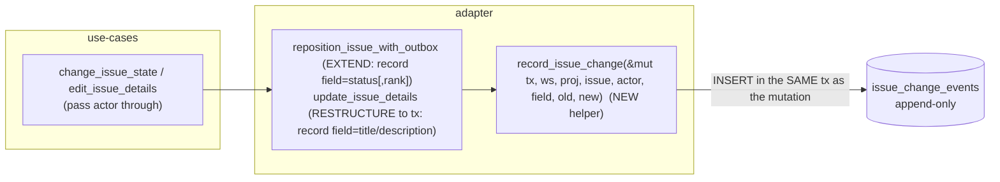
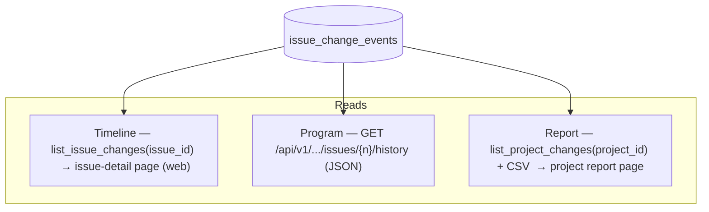
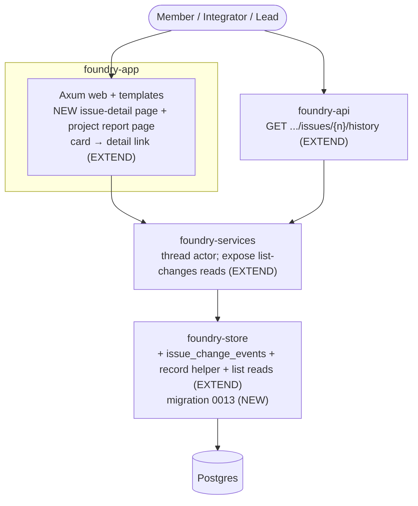

# Architecture — issue-change-history

**Scope**: Application / components (extends the modular monolith; ports-and-adapters).
**Mode**: Propose (store model + timeline home + genesis user-ratified 2026-07-07).
**Paradigm**: unchanged — imperative Rust, ports-and-adapters (`foundry-services` use-cases → `foundry-store`
adapter; `foundry-app` HTTP/web adapter; `foundry-api` JSON adapter). No `CLAUDE.md` paradigm change.

## Problem

Every change to an issue (status, title, description, rank) must become a durable, attributable record —
`actor · field · old → new · when` — surfaced three ways: a human timeline, a program JSON feed, and a project
report. Today the durable outbox (`0003`) records only new-value, notify-shaped, capped events, surfaced nowhere.

## Ratified decisions

| ODD | Decision | ADR |
|-----|----------|-----|
| ODD-1 store | **Dedicated append-only `issue_change_events` table** (per-field old→new), mirroring the `comments` model. NOT the outbox (new-value-only, 8 KB-capped, SSE-coupled, coarse). | ADR-001 |
| ODD-2 capture | A shared store helper `record_issue_change(&mut tx, …, field, old, new)` called **in the same transaction** as each mutation; one row per changed field. `update_issue_details` is restructured to a tx (it has none today) so title/desc changes are captured. | ADR-001 |
| ODD-3 timeline home | A **new issue-detail page** `/team/{t}/project/{p}/issues/{n}` (details + timeline). The card gains a link to it; the existing click→quick-edit-modal is preserved. | ADR-002 |
| ODD-4 report | A **project change-report page** + **CSV export** (`Content-Disposition: attachment`, mirroring the attachments download), reading the `(project_id, created_at)` index. | ADR-002 |
| ODD-5 genesis | **Start empty** — v1 records field *changes* only; no backfill and no "created" event. An unchanged issue shows an empty timeline. `old_value` is nullable for a future creation-event kind. | ADR-001 |
| ODD-6 program envelope | `GET …/issues/{n}/history` → JSON `[{actor, field, old, new, at}]`, oldest→newest, mirroring the `/api/v1` comments route; a reserved `cursor` field for future pagination. | ADR-002 |

## Data model

New table (migration `0013`, first since card-ranking's `0012`):

```
issue_change_events (
  id           UUID PRIMARY KEY,
  workspace_id UUID NOT NULL REFERENCES workspaces(id) ON DELETE CASCADE,
  project_id   UUID NOT NULL REFERENCES projects(id)   ON DELETE CASCADE,  -- denormalized for the report
  issue_id     UUID NOT NULL REFERENCES issues(id)     ON DELETE CASCADE,
  actor_id     UUID NOT NULL REFERENCES users(id),
  field        TEXT NOT NULL CHECK (field IN ('status','title','description','rank')),  -- extend the CHECK per new editable field
  old_value    TEXT,            -- nullable (future creation events); v1 field changes carry both old + new
  new_value    TEXT NOT NULL,
  created_at   TIMESTAMPTZ NOT NULL DEFAULT now()
)
INDEX (issue_id, created_at)     -- timeline (US-01/02) + program feed (US-03)
INDEX (project_id, created_at)   -- project report (US-04)
```

**Invariants**: append-only (no UPDATE/DELETE code path); written in the SAME tx as the mutation (no phantom / no
drop); one row per changed field; `field` is extensible (the CHECK grows when priority/assignee become editable).

## Capture flow (Component view)



Three read surfaces over the one table:



## C4 — Container (deltas annotated)



## Reuse Analysis (HARD GATE)

| Existing Component | File | Overlap | Decision | Justification |
|--------------------|------|---------|----------|---------------|
| `comments` table + index | `migrations/0004_comments.sql` | per-issue append-only sub-record | **MIRROR (new)** | change events are a distinct kind; mirror the `(id, ws, issue, actor, …, created_at)` shape + `(issue_id, created_at)` index |
| `reposition_issue_with_outbox` | `foundry-store/src/lib.rs:1364` | state+rank write, in-tx, reads `old_state` | **EXTEND** | record `field=status` (+`field=rank` slice 02) via the helper in its existing tx |
| `update_issue_state_with_outbox` | `lib.rs:1287` | state write | **EXTEND or RETIRE** | if still called (API PATCH), add capture; if superseded by reposition, delete per dead-code policy — DELIVER confirms callers |
| `update_issue_details` | `lib.rs:1524` | title+desc write, **no tx**, ignores `_actor_id` | **EXTEND (restructure)** | wrap in a tx, read old title/desc, record `field=title`/`description`; `actor_id` now used |
| `insert_issue_with_outbox` | `lib.rs:1169` | create | **REUSE (no change)** | v1 records changes, not creation (start-empty, ODD-5) |
| `foundry-api` `routes()` | `foundry-api/src/lib.rs:248` | `/api/v1` issue sub-resources | **EXTEND** | add `GET .../issues/{n}/history` mirroring the comments GET (auth + non-enumerable 404 JSON) |
| Board card + edit dialog | `projects.rs`, `issue_card.html`, `IssueEditModal` | issue web surface | **EXTEND** | card gains a link to the new detail page; quick-edit modal preserved |
| Attachment download | `foundry-app/src/attachments.rs` (`Content-Disposition`) | file download response | **MIRROR** | report CSV export reuses the attachment-response pattern |
| Migration `0013`; issue-detail page; project report page; `record_issue_change` helper | — | — | **CREATE NEW** | the change-event table, the two new pages, and the shared record helper are inherently new |

Only CREATE NEW are the genuinely-new table, pages, and helper.

## Technology choices

No new dependencies. Postgres table + two btree indexes; sqlx transactions (existing idiom); Askama templates for
the two new pages (existing); the `/api/v1` JSON + attachment-CSV patterns (existing).

## Open questions (deferred to DISTILL/DELIVER)

- Is `update_issue_state_with_outbox` still live (API PATCH) or dead post-card-ranking? DELIVER checks callers;
  capture at whichever state path(s) are live, delete the dead one (dead-code policy).
- Plain-language phrasing map for the human timeline (per field) — DELIVER; the stored `old`/`new` are raw.
- Report dimensions beyond status-flow + per-actor (ODD-4) — DISTILL fixes the minimal set from the ACs.
- Card→detail navigation affordance (whole card vs the key link) so it doesn't collide with the drag gesture +
  the quick-edit modal — DELIVER picks the least-disruptive control.
