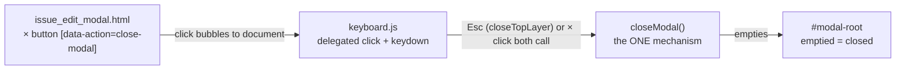

# Feature Delta — issue-edit-modal-close-icon

> DISCUSS wave, lean density (strict lean: no ask-intelligent trigger fired, so no
> expansion menu is offered). Adds a conventional close (×) control to the top right
> of the issue edit dialog (`crates/foundry-app/templates/partials/issue_edit_modal.html`)
> so a pointer user can leave without saving. Strictly ADDITIVE: Esc, Save, and the
> "Open full page" link are unchanged.
>
> Ground truth (read against the tree, 2026-08-22): the edit dialog is a `div.modal`
> (not `<dialog>`) swapped into `#modal-root` by htmx. Its ONLY no-save exits today
> are (1) the Esc key, owned solely by `keyboard.js::closeTopLayer()` which empties
> `#modal-root` (BR-4: Esc has exactly one owner), and (2) navigating away via the
> "Open full page" link. There is NO backdrop-click dismiss, NO Cancel button, and NO
> close icon anywhere in the codebase — the sibling `new_issue_modal.html` lacks one
> too. The feature premise holds: no existing close icon contradicts it.

## Wave: DISCUSS

### [REF] Persona ID

`operator` — the single person who runs this cluster and this tracker (same persona
as `job-sso-signin` / `job-instance-project-rename`). Works the board daily with
both mouse and the shipped keyboard shortcuts (`j`/`k`/`Enter`/`Esc`). Opens issue
cards as often to *read* as to edit. No SSOT persona file is created for a feature
this size — persona referenced inline (D5 below). Research depth: lightweight.

### [REF] JTBD one-liner

When I open an issue's edit dialog just to read it, or start an edit I decide
against, I want a visible, conventional way to close it without saving, so I can
get back to the board without hunting for the Esc key or saving a change I did not
mean to make. (`job-dismiss-edit-dialog` — `docs/product/jobs.yaml`.)

Job dimensions — functional: leave the edit dialog without saving, in one visible
pointer action. Emotional: stop feeling cornered by a dialog whose only labeled
button is Save. Social: anyone shown the board can close a dialog without being
taught the unadvertised Esc handshake.

Four forces — **push**: the dialog offers Save and a full-page link; the only
no-save exit is Esc, which nothing on screen advertises, so a mouse user is stuck.
**pull**: the × every other dialog in every other tool has — one click, top right,
back to the board. **anxiety**: that the × might save half-typed edits, navigate
away like the neighbouring link, or be invisible to keyboard and screen-reader use.
**habit**: keyboard users already press Esc; the × must be additive and Esc must
stay byte-identical.

### [REF] Locked decisions

| ID | Decision | Verdict | Rationale |
|----|----------|---------|-----------|
| D1 | The × lands in the EDIT dialog only; `new_issue_modal.html` is untouched | LOCKED | Feature premise. The new-issue dialog shares the gap; noted in Out of scope as the natural fast-follow, not smuggled in here. |
| D2 | Closing via × discards silently — no unsaved-changes confirmation | LOCKED | Exact parity with what Esc already does today (`keyboard.js::closeModal()` empties the host, edits and all). A confirmation on one exit but not the other would be the real inconsistency. |
| D3 | The × is a button with the accessible name "Close", icon-only visually | LOCKED | It performs an action in place; a link would signify navigation — precisely the anxiety force. Icon-only is acceptable ONLY with an accessible name and a visible focus indicator (WCAG 2.2 AA, Operable/Robust). |
| D4 | The × produces the SAME end state as Esc (an emptied `#modal-root`) and must NOT register a second `Escape` listener | LOCKED | `keyboard.js` BR-4: Esc has exactly one owner, `closeTopLayer()`. The × is a second *trigger* for the same close, never a second *mechanism* racing the first. |
| D5 | No SSOT persona/journey files created | LOCKED | Proportionality: a one-control feature does not justify new `docs/product/personas/` or `journeys/` entries. Persona is referenced inline above. |
| D6 | Focus lands on a live element after close; restoring focus to the triggering card is a DESIGN option, not a requirement | LOCKED | Parity with today's Esc close (which also does not restore focus). The board's shortcuts are document-delegated, so they keep working either way — AC-1.5 pins that observable. |

### [REF] Scope Assessment: PASS — 1 story, 1 module, estimated ≤0.5 day

Elephant Carpaccio early gate. Oversized signals checked: 1 story (threshold >10) —
no. Modules: `foundry-app` templates plus a small static JS/CSS touch — 1 (threshold
>3) — no. New integration points: 0 (threshold >5) — no. Effort ≤0.5 day (threshold
>2 weeks) — no. Independent shippable outcomes: 1 — no. Zero of five signals.
Right-sized; no split.

### [REF] Journey (happy path, lightweight)

| # | Step | Observable output | Emotional state |
|---|------|-------------------|-----------------|
| 1 | Operator clicks the AUTH-7 card on the board (or presses `Enter` on it) | Edit dialog over the board, title field focused | Neutral — familiar dialog |
| 2 | Reads the description; decides no edit is needed | The dialog, unchanged | Deciding |
| 3 | Sees the × in the dialog's top right | A recognisable, conventional exit | Relieved — "I know that button" |
| 4 | Clicks it (or Tabs to it and presses Enter) | Dialog gone, board visible, AUTH-7's card unchanged | Back in flow |

Edge considerations, grounded in the tree:

- **Half-typed edits** are discarded silently on close — D2, Esc parity.
- **Error state showing**: `form-errors.js` routes a 4xx reason into
  `data-error-slot` inside the open dialog; the × must still close cleanly from
  that state rather than trap the operator with a validation error (example 3).
- **Keyboard/a11y**: the control needs an accessible name, Tab reachability inside
  the dialog, Enter/Space activation, a visible focus indicator, and a ≥24×24 px
  target (WCAG 2.2 AA minimums).
- **No-JS**: without JS the dialog never opens (cards open it via `hx-get`; the
  no-JS click path navigates to the full issue page), so the × carries no no-JS
  obligation. Recorded so DESIGN does not invent one.
- **Shared artifact**: the close semantics ("`#modal-root` emptied") have one
  source of truth today — `keyboard.js::closeModal()`. D4 keeps it single-source.

### [REF] User story with elevator pitch

**US-01 — Close the issue edit dialog without saving** (`job_id: job-dismiss-edit-dialog`)

As the operator, I want a close (×) control in the top right of the issue edit
dialog, so that I can back out of an opened issue in one click without saving.

#### Elevator Pitch

Before: the only way out of an issue's edit dialog without saving is the unadvertised Esc key; with a mouse there is no way at all.
After: run `click the × in the top right of the "Edit AUTH-7" dialog at /team/{team}/project/{project}` → sees `the board again — dialog gone, AUTH-7's card unchanged`
Decision enabled: I decide an opened issue needs no edit and back out in one click, instead of saving a no-op or hunting for a key.

#### Domain examples

1. **Happy path** — The operator clicks the AUTH-7 card just to reread its
   description, clicks the ×, and is back on the board; AUTH-7's card is unchanged.
2. **Dirty form** — The operator retitles AUTH-7 to "Rename identity platform",
   thinks better of it, and clicks the ×. The dialog closes, no save request is
   issued, and the card still reads the old title.
3. **Error state** — The operator submits an empty title; the 400 reason renders in
   the dialog's error slot. The × still closes the dialog cleanly instead of
   trapping them in the error state.
4. **Keyboard path** — The operator opened AUTH-7 with `Enter`, Tabs to the ×,
   presses `Enter`; the dialog closes and `j`/`k` still walk the board's cards.

#### UAT scenarios

- **S1 — One click back to the board**: Given the operator has the "Edit AUTH-7"
  dialog open over the board, When they click the close control in the dialog's top
  right, Then the dialog is gone, the board is visible, and AUTH-7's card is
  unchanged. (AC-1.1, AC-1.2)
- **S2 — A discarded edit saves nothing**: Given the operator has typed "Rename
  identity platform" into the open dialog's title field, When they click the close
  control, Then no save request is issued and the card still shows the original
  title. (AC-1.2)
- **S3 — The close control works without a mouse**: Given the dialog is open, When
  the operator Tabs to the close control and presses Enter, Then the dialog closes
  exactly as a click would, And the control exposes the accessible name "Close" and
  shows a visible focus indicator when reached. (AC-1.3, AC-1.6)
- **S4 — The existing exits are untouched**: Given the dialog is open, When the
  operator presses Esc, or saves, or follows "Open full page", Then each behaves
  exactly as before this feature, And closing via the × leaves the operator's
  keyboard shortcuts (`j`, `k`, `c`) working. (AC-1.4, AC-1.5)

#### Acceptance criteria

- AC-1.1 `GET /team/{team_slug}/project/{project_slug}/issues/{n}/edit` renders the
  edit dialog with a close control in the top right of the dialog header, visually
  an × and exposing the accessible name "Close".
- AC-1.2 Activating the control closes the dialog — `#modal-root` is empty, the
  board is interactive again — and issues NO save request: typed-but-unsaved edits
  are discarded and the issue's stored title, description, and state are unchanged.
- AC-1.3 The control is reachable by Tab within the dialog and activates with
  Enter and with Space, closing identically to a pointer click.
- AC-1.4 Esc, Save, and "Open full page" behave exactly as before; closing via the
  × produces the same end state as Esc (D4), including from the 4xx error state
  (error fragment rendered in `data-error-slot`).
- AC-1.5 After closing via the ×, focus rests on a live element and the shipped
  keyboard shortcuts (`j`, `k`, `c`) still function.
- AC-1.6 The control has a click/touch target of at least 24×24 CSS px and a
  visible focus indicator.

#### Technical notes

- The dialogs are `div`s swapped into `#modal-root` by htmx; wiring must survive
  swaps (house idiom: document-delegated listeners, as `keyboard.js` and
  `board-dnd.js` do) and must not add a second `Escape` listener (D4/BR-4).
- Open decisions for DESIGN: **OD-1** wiring mechanism (delegated click listener in
  an existing or new static JS file vs. an htmx attribute) — the ACs pin behaviour,
  not the carrier; **OD-2** whether close restores focus to the triggering card
  (allowed, not required — D6).

### [REF] Definition of Done

1. All ACs green in the acceptance suite through the real router (the shipped
   harness that drives the edit-dialog scenarios today).
2. `cargo xtask smoke` green before each commit; `cargo xtask ci` green before push.
3. No new dead code; no second Escape listener anywhere (D4 held by review/test).
4. `docs/product/jobs.yaml` and this file reflect what shipped; `CHANGELOG.md`
   updated.

### [REF] Out of scope

- A close icon on `new_issue_modal.html` — same gap, natural fast-follow, not this
  feature (D1).
- Backdrop-click dismiss (none exists today; adding it is a new commitment).
- An unsaved-changes confirmation on any exit (D2).
- Focus restoration to the triggering card as a requirement (D6 — DESIGN may add it).
- Any change to Esc handling, `closeTopLayer()`, or the layer stack.

### [REF] Walking Skeleton strategy

Not applicable (brownfield, per wave configuration): this is an isolated
one-template change on a shipped, end-to-end flow. The single slice is itself
end-to-end — render → activate → closed — driven through the existing acceptance
harness. Litmus test: a non-technical reader sees "the operator clicks the × and
the dialog closes." Yes.

### [REF] Driving ports

| Driving port | Protocol | Status | Stories |
|---|---|---|---|
| `GET /team/{team_slug}/project/{project_slug}/issues/{n}/edit` | HTTP GET → htmx fragment into `#modal-root` | shipped, EXTENDED (template gains the control) | US-01 |
| `POST /team/{team_slug}/project/{project_slug}/issues/{n}/edit` | HTTP POST | shipped, regression only — must NOT fire on close | US-01 (S2, S4) |

### [REF] Outcome KPIs

| KPI | Target | Measurement |
|---|---|---|
| Visible no-save exits rendered inside the edit dialog | 1 (from 0) | AC-1.1 acceptance scenario asserts the control renders |
| Pointer actions to leave the dialog without saving | 1 click (from impossible without the keyboard) | Counted in S1 |
| Keyboard cost to close (guardrail) | Esc still closes in exactly 1 keypress | S4 regression scenario stays green |
| Save requests issued by a dismissal | exactly 0 | S2 asserts no POST and unchanged stored fields |

### [REF] Pre-requisites

- None cross-repo. No new dependencies, no migration, no config.
- The existing edit-dialog acceptance scenarios are the regression net S4 leans on.
- OD-1/OD-2 (Technical notes) are the only DESIGN inputs.

### [REF] Definition of Ready validation

| # | DoR item | Verdict | Evidence |
|---|---|---|---|
| 1 | Business value articulated | PASS | `job-dismiss-edit-dialog` with all four forces; the push (mouse user has no exit) is verified against the template and JS, not assumed |
| 2 | User story in LeanUX format with elevator pitch | PASS | US-01: Before / After with the exact UI action and observable output / Decision enabled |
| 3 | Acceptance criteria testable and unambiguous | PASS | 6 ACs, each naming an observable: rendered control + accessible name, emptied `#modal-root`, absence of a POST, unchanged stored fields, key activation, focus/target-size |
| 4 | Dependencies identified | PASS | None cross-repo; OD-1/OD-2 named for DESIGN |
| 5 | Job traceability | PASS | US-01 carries `job_id: job-dismiss-edit-dialog`; no `infrastructure-only` escape used |
| 6 | Sized and sliced | PASS | Scope Assessment PASS (0 of 5 signals); one slice ≤0.5 day, 4 UAT scenarios (3–7 range) |
| 7 | Outcome KPIs measurable | PASS | 4 KPIs, each with a numeric target and a stated measurement |
| 8 | Out-of-scope explicit | PASS | 5 named non-goals, each tied to a locked decision |
| 9 | Technical feasibility grounded | PASS | Read against the tree: `issue_edit_modal.html` structure, `keyboard.js` single-owner Esc (BR-4), `#modal-root` swap semantics, `form-errors.js` 4xx slot, existing `.modal-header` CSS |

### [REF] Wave Decisions

- **D-01** Edit dialog only; new-issue dialog is the recorded fast-follow, not scope (D1).
- **D-02** Silent discard on close — Esc parity, no confirmation dialog (D2).
- **D-03** Button with accessible name "Close", icon-only visually; never a link (D3).
- **D-04** One close mechanism, two triggers: the × reuses the emptied-`#modal-root`
  end state and adds no second Escape listener (D4, keyboard.js BR-4).
- **D-05** No new SSOT persona/journey files — persona inline, proportionate to a
  one-control feature (D5).
- **D-06** Focus-after-close pinned only as "lands on a live element, shortcuts keep
  working"; restore-to-card left to DESIGN (D6).
- **D-07** Telemetry skipped: `scripts/shared/telemetry.py` does not exist in this repo.
- **D-08** Strict lean: ask-intelligent triggers evaluated (AC ambiguity ≥2 stories,
  ≥3 bounded contexts, ≥3 personas, compliance terms, WS strategy D) — none fired;
  no expansion menu emitted.
- **D-09** No DIVERGE artifacts existed for this feature; risk accepted as
  negligible for a single conventional-affordance change (discovery grounded in
  code reading instead).

## Wave: DESIGN

> Lean density. Grounded against the tree 2026-08-22: `issue_edit_modal.html`,
> `keyboard.js` (closeModal/closeTopLayer, BR-4, `data-kb-ready`),
> `form-errors.js`, `foundry.7c858984.css` (`.modal-header` is a plain block;
> the stylesheet is content-hashed with a re-hash procedure in `static/VENDOR.md`).
> C4 note: the SSOT brief's crate graph is the container view for this system and
> is referenced, not duplicated, here (the brief deliberately predates full
> L1/L2 diagrams — see its preamble); a component-level snippet below covers the
> one seam this feature touches.

### [REF] Design Decisions (DDD list, continuing DISCUSS numbering)

- **D-10 — OD-1 CLOSED: the carrier is one document-delegated `click` listener
  added to `keyboard.js`, matching `[data-action="close-modal"]` (via
  `closest()`, so a glyph child still resolves) and calling the EXISTING
  `closeModal()`.** This is the only option that keeps the slice hypothesis
  true — one mechanism (`closeModal()` emptying `#modal-root`), two triggers
  (Esc via `closeTopLayer()`, the × via click). It adds no `Escape` listener
  (BR-4/D-04: a `click` listener cannot race a `keydown`), survives htmx swaps
  (the board-dnd/keyboard house idiom), is CSP-safe (no inline handlers), and
  makes the new-issue fast-follow a template-only change with zero new JS.
  Rejected alternatives in `adr-modal-close-001`. Accepted cost: `keyboard.js`'s
  charter widens from "keyboard dispatch" to "interaction-layer owner" — it
  already owns the layer stack (help/modal/search), so the close mechanism was
  living there anyway; the widening names what is, rather than forking the
  mechanism to preserve a filename's purity.
- **D-11 — OD-2 CLOSED: focus restore to the triggering card is DEFERRED.**
  Esc parity is the feature's spine (D2/D4): today's Esc close does not restore
  focus, AC-1.5 only pins "focus rests on a live element and `j`/`k`/`c` still
  work", and the board's shortcuts are document-delegated so they hold with
  focus on `body` (same end state as Esc: the focused element is removed with
  the host, focus falls to `body`). Restoring focus on the ×-path ONLY would
  make the two triggers diverge — the exact failure D-04 forbids. If restore is
  ever wanted, it belongs inside `closeModal()` so BOTH triggers get it; that is
  a separate feature, recorded beside the new-issue fast-follow.
- **D-12 — Markup contract**: a
  `<button type="button" aria-label="Close" data-action="close-modal">` carrying
  a text × glyph, placed in the `.modal-header` (top right), OUTSIDE the
  `<form>`. `type="button"` + outside-the-form makes an accidental submit
  structurally impossible; a native `<button>` gives Enter AND Space activation
  for free (AC-1.3 needs no key code), and `button` is in `keyboard.js`'s
  `NON_TEXT_INPUT_TYPES`, so shortcuts stay live while it is focused.
  `data-action` extends the existing selector vocabulary
  (`new-issue`, `search`) rather than minting a second attribute scheme.
- **D-13 — Styling**: `.modal-header` becomes a flex row
  (title | full-page link | × pinned right); new `.modal-close` class — ≥24×24
  CSS px hit target (AC-1.6), visible `:focus-visible` indicator, no new icon
  font or SVG asset. The header class is shared with `new_issue_modal.html`;
  flexing a header whose only child is an `<h2>` is visually inert, so D1
  (new-issue dialog untouched) holds behaviorally. No new CSS file.
- **D-14 — CSS re-hash is in-scope for DELIVER**: the stylesheet is
  content-hashed (`foundry.<sha256-prefix-8>.css`). A CSS edit means: re-hash,
  rename, update the `base.html` link, the `static/VENDOR.md` row, and the
  hashed-name literals in `crates/foundry-app/src/lib.rs` cache tests. House
  procedure documented in VENDOR.md; listed here so DELIVER budgets it.
- **D-15 — Probe/readiness (Earned Trust)**: the wiring rides in `keyboard.js`,
  so the existing `data-kb-ready` marker IS the attachment probe — its presence
  means the delegated listeners are live, never merely that the file parsed.
  Browser-lane scenarios MUST wait on `[data-kb-ready]` before clicking the ×,
  exactly as the shipped keyboard scenarios do. No new probe surface needed; no
  new external dependency exists to probe (DOM only, no network/fs/time).
- **D-16 — ADR created** (`docs/product/architecture/adr-modal-close-001-declarative-close-trigger.md`):
  the `[data-action="close-modal"]` contract is architecturally significant
  beyond this feature — it is the pattern every future dialog close affordance
  (starting with the new-issue fast-follow) reuses without touching JS, and it
  is the enforcement-shaped answer to BR-4 (new close triggers CANNOT introduce
  new listeners, because they are attributes, not code).

### [REF] Component decomposition

| File | Change type | What |
|---|---|---|
| `crates/foundry-app/templates/partials/issue_edit_modal.html` | EXTEND | Close button in `.modal-header` per D-12 |
| `crates/foundry-app/static/js/keyboard.js` | EXTEND | One document-delegated `click` listener → existing `closeModal()` (D-10) |
| `crates/foundry-app/static/css/foundry.<hash>.css` | EXTEND + re-hash | `.modal-header` flex, new `.modal-close` (D-13, D-14) |
| `crates/foundry-app/templates/base.html` | EXTEND | New hashed stylesheet href (D-14) |
| `crates/foundry-app/static/VENDOR.md` | EXTEND | Hash row update (D-14) |
| `crates/foundry-app/src/lib.rs` | EXTEND (tests only) | Hashed-name literals in cache-control tests (D-14) |

No Rust handler, route, migration, or config change. `form-errors.js`,
`closeTopLayer()`, and the layer stack are untouched (regression surface only).



### [REF] Driving ports

Unchanged from DISCUSS (the two HTTP ports there stand: GET extended, POST
regression-only). One client-side driving trigger is added:

| Trigger | Protocol | Contract |
|---|---|---|
| Activation of `[data-action="close-modal"]` inside `#modal-root` | DOM click (Enter/Space synthesize it on a native button) | `#modal-root` emptied; no HTTP request issued |

### [REF] Driven ports and adapters

**None new, and none touched.** This feature reaches no store, clock, notifier,
network, or filesystem; its only dependency is the browser DOM, and the
attachment of its listener is observable via the shipped `data-kb-ready` probe
(D-15). No contract-testing annotation applies — there is no external
integration.

### [REF] Technology choices

No additions. Pinned to what ships: askama templates, htmx 2.0.4 (unused by the
new wiring — the close is pure DOM), vanilla-JS IIFE (keyboard.js ADR-001),
hand-authored content-hashed CSS. Zero new dependencies, zero license changes.
Enforcement: dependency direction stays under `cargo xtask check-arch` +
`deny.toml` (untouched); BR-4 stays held by the shipped `@layered` scenario, and
the new declarative-trigger contract makes future violations attribute-shaped
rather than listener-shaped (adr-modal-close-001).

### [REF] Decisions table

| Open decision | Verdict | Where |
|---|---|---|
| OD-1 wiring carrier | Delegated `click` in `keyboard.js` → existing `closeModal()`; selector `[data-action="close-modal"]` | D-10, adr-modal-close-001 |
| OD-2 focus restore to card | DEFERRED — Esc parity; if ever added, inside `closeModal()` for both triggers | D-11 |

### [REF] Reuse Analysis

| Overlapping component | Verdict | Justification |
|---|---|---|
| `keyboard.js::closeModal()` | REUSE as-is | The one close mechanism; the × is a second trigger, never a fork |
| `keyboard.js` IIFE + document delegation idiom | EXTEND | One added `click` listener beside the existing `keydown` one |
| `#modal-root` emptied-host contract | REUSE as-is | Closed state stays DOM-derived (ADR-003 §2) |
| `data-action` selector vocabulary | EXTEND | `close-modal` joins `new-issue`, `search` |
| `data-kb-ready` readiness probe | REUSE as-is | Already means "delegated listeners attached" |
| `.modal-header` CSS | EXTEND | Flex layout; benign to the sibling dialog |
| `.modal-close` CSS class | **CREATE NEW** | Grep-verified: no icon-button class exists anywhere in the stylesheet; smallest possible addition (one class), justified by AC-1.6's target/focus requirements |
| `form-errors.js` / error slot | UNTOUCHED | Regression surface only (S4, AC-1.4) |
| Acceptance harness (browser lane, keyboard steps) | EXTEND | DISTILL adds S1–S4 against the shipped harness |

7 REUSE/EXTEND, 1 CREATE NEW (one CSS class), 1 untouched.

### [REF] Open questions deferred to DISTILL/DELIVER

1. **DISTILL** — exact assertion for AC-1.5's "focus rests on a live element":
   pin it as parity with the Esc path (`document.activeElement` falls to `body`
   after the host empties), then `j`/`k`/`c` presses still act.
2. **DISTILL** — S3 must assert BOTH Enter and Space (native-button freebies are
   still asserted, never assumed — same discipline as the autofocus scenario).
3. **DELIVER** — glyph choice (`&times;` text vs inline SVG): crafter's call
   within D-12's constraints (no new asset, no icon font; text glyph preferred).
4. **DELIVER** — execute the D-14 re-hash procedure and its test-literal updates
   in the same commit as the CSS edit, or the immutable-cache tests red.

## Wave: DEVOPS

> Lean density. Grounded against the tree 2026-08-22: `xtask/src/main.rs`
> (`run_ci`/`run_smoke`), `.github/workflows/ci.yml` (single-job local-parity
> gate), `.forgejo/workflows/{ci,audit,build-and-publish}.yml`, `deploy/k8s/`,
> `crates/foundry-acceptance/tests/acceptance.rs` (tag filter). This feature
> changes NO infrastructure: no route, no migration, no dependency, no config,
> no pipeline edit. Every section below describes the EXISTING platform the
> feature rides, plus the one delivery obligation it inherits from DESIGN (D-14).

### [REF] Environment matrix

| Environment | Where | Role for this feature | Preconditions |
|---|---|---|---|
| `dev-test` | developer workstation (macOS/Linux) | pre-commit `cargo xtask smoke`; pre-push `cargo xtask ci` (full gate incl. S1–S4 in the browser lane) | Docker daemon reachable; PostgreSQL ≥16 client; **version-matched chromedriver + Chrome** (xtask preflight 3 probes and REFUSES — the browser lane never soft-skips) |
| `ci-github` | `.github/workflows/ci.yml`, ubuntu-latest | authoritative full-suite gate: ONE job running the SAME `cargo xtask ci` (local-parity by design) | postgres:16 service; `FOUNDRY_XTASK_INCLUDE_DOCKER=1`; chromedriver+Chrome come **preinstalled version-matched on the ubuntu-latest image** (not installed by the workflow — see contradiction note below) |
| `ci-forgejo` | `.forgejo/workflows/ci.yml`, `runs-on: docker`, rust:1.85-slim | mirror gate, split jobs (lint, build+test, acceptance-all-tags, deny) + weekly `cargo audit` | docker-backend runner with socket mount for the acceptance job; **no chromium in the rust:1.85-slim image — see contradiction note** |
| `prod` | self-hosted k8s (`deploy/k8s/`), image via `build-and-publish.yml` → zot registry | unchanged by this feature; consumes the next image built from `main` | none new |

**Contradiction check (flagged, not fixed here):** (1) the GitHub gate's
browser lane depends *implicitly* on ubuntu-latest shipping a version-matched
chromedriver+Chrome pair — the workflow installs cargo-deny and
postgresql-client-16 but not the browser tooling; the xtask preflight would
fail loudly if the runner image ever dropped it. (2) The Forgejo mirror's
`acceptance` job runs `FOUNDRY_ACCEPTANCE_TAGS=all` inside rust:1.85-slim,
which contains no chromium/chromedriver and bypasses xtask's preflight (it
invokes `cargo test -p foundry-acceptance` directly) — the `@needs-browser`
scenarios (including this feature's S1–S4) cannot pass there without a
customized runner image. The GitHub mirror is therefore the authoritative
browser-lane gate, consistent with the Forgejo file's own header ("rely on
the GitHub mirror for full-suite coverage"). The acceptance-verified KPI
claims below are anchored to `dev-test` (pre-push) and `ci-github`.

### [REF] CI/CD pipeline outline (existing, unchanged)

`cargo xtask ci` is the single source of truth — CI runs exactly this command,
so local-green and CI-green cannot drift. Stages in order, stop on first red:

1. **Preflights** (docker lane on): seed `.env` from `.env.example`; `pg_dump` ≥16; chromedriver+Chrome MAJOR-version match (probe-and-refuse, never skip)
2. `cargo fmt --all -- --check`
3. `cargo clippy --all-targets --release -- -D warnings`
4. `xtask check-arch` (AST boundary guard + cargo-deny dependency-direction layer)
5. `cargo build --all --release`
6. `cargo test --workspace --exclude foundry-acceptance --release`
7. `cargo deny check`
8. `cargo sqlx prepare --workspace --check` (conditional: only when `.sqlx/` exists)
9. `cargo test -p foundry-acceptance --release` with `FOUNDRY_ACCEPTANCE_TAGS=all` — **includes the `@needs-browser` fantoccini lane** (real headless Chrome via a lane-wide chromedriver process against InProcHarness's real origin, ADR-007). This is where this feature's S1–S4 execute.

`cargo xtask smoke` (pre-commit) = stages 2, 3, 4, 6 — a strict verbatim
subset of `ci`. Side pipelines: `build-and-publish.yml` (Forgejo) builds the
distroless image and pushes SHA/`main`/`v*` tags to zot on push to main;
`audit.yml` runs `cargo audit` weekly and on lockfile changes. Nothing in this
feature touches any of these files.

### [REF] Monitoring contracts

The DISCUSS KPIs are UX-count contracts, **verified by acceptance tests, not
runtime telemetry**. The instrument is the existing `@needs-browser`
acceptance lane; no new metrics, dashboards, or alerts are created for a
close button, and no `docs/product/kpi-contracts.yaml` entry is added — that
file does not exist in this repo, and this feature is not the reason to mint
it (zero runtime-instrumentation delta).

| Outcome KPI (DISCUSS) | Target | Verified by |
|---|---|---|
| Visible no-save exits rendered inside the edit dialog | 1 (from 0) | S1 / AC-1.1 — scenario asserts the `[data-action="close-modal"]` control renders with accessible name "Close" |
| Pointer actions to leave the dialog without saving | 1 click | S1 / AC-1.2 — one click empties `#modal-root`, board interactive |
| Keyboard cost to close (guardrail) | Esc closes in exactly 1 keypress, unchanged | S4 / AC-1.4 — existing Esc regression scenario stays green (plus the shipped `@layered` BR-4 scenario) |
| Save requests issued by a dismissal | exactly 0 | S2 / AC-1.2 — asserts no POST issued and stored title/description/state unchanged |

KPI status flips to MET when S1–S4 are green in stage 9 on `dev-test`
(pre-push) and `ci-github`; there is no post-deploy measurement window
because there is nothing to measure at runtime.

### [REF] Deployment strategy

This feature rides the existing release path unchanged: commit lands on
`main` behind a green `cargo xtask ci`, the Forgejo `build-and-publish`
pipeline builds the distroless image and pushes it to zot
(`sha` + `main` tags), and the self-hosted k8s deployment picks up the next
image. No migration, no config change, no new route, no feature flag needed.
**Rollback = `git revert` of the single feature commit** and the next image
build — the revert is total and safe because the change is additive template
+ static-asset only; the content-hashed stylesheet means the old and new CSS
are distinct immutable URLs, so neither direction of the swap can serve a
stale cached stylesheet.

### [REF] Mutation testing strategy

Per-feature (project's established practice): run after refactoring during
the delivery, **scoped to the files this feature modifies**, kill-rate gate
≥80%. Scope reality for this feature: the only Rust production file touched
is `crates/foundry-app/src/lib.rs`, and its delta is **test-code literals
only** (the hashed-CSS-name strings in the immutable-cache tests, D-14) —
`cargo mutants` scoped to that file's delta yields no new production mutants,
so the gate is satisfied vacuously. The behavioral surface of the feature
lives in the template (`issue_edit_modal.html`), `keyboard.js`, and the CSS —
none of which cargo-mutants can mutate; their mutation-equivalent safety net
is S1–S4 plus the shipped keyboard/`@layered` scenarios in the browser lane
(a listener deleted or a selector broken turns those scenarios red).

### [REF] Observability stack

Existing and unchanged — no new metrics, logs, traces, alerts, or dashboards;
this feature emits nothing at runtime that the current stack does not already see.

### [REF] Branching strategy

Trunk-based on `main` (existing project pattern). Feature work commits behind
`cargo xtask smoke`; the full `cargo xtask ci` is the mandatory pre-push gate;
finalize does not push. CI triggers on push/PR to `main` in both mirrors;
release images cut from `main` and `v*` tags.

### [REF] Coexistence matrix

Things that must not break, and what holds each one:

| Must not break | Held by |
|---|---|
| `keyboard.js` Esc single-owner layer (BR-4: exactly one `Escape` listener, `closeTopLayer()`) | D-04/D-10 (the × adds a `click` listener only); shipped `@layered` scenario; S4 |
| htmx swap lifecycle: dialogs swapped into `#modal-root`, wiring must survive swaps | document-delegated listener idiom (D-10); existing keyboard/board-dnd scenarios |
| CSS content-hash immutable-cache tests in `crates/foundry-app/src/lib.rs` | D-14 executed in the SAME commit as the CSS edit (re-hash, rename, `base.html` href, `VENDOR.md` row, test literals) |
| `@needs-browser` fantoccini lane (chromedriver preflight, `data-kb-ready` wait discipline) | xtask preflight 3; D-15 — new scenarios wait on `[data-kb-ready]` before clicking the × |
| `form-errors.js` 4xx error-slot flow (× must close cleanly from the error state) | AC-1.4 / S4; `form-errors.js` untouched |
| `new_issue_modal.html` visual/behavioral state (D1: untouched) | D-13 — flexing `.modal-header` is inert for an `<h2>`-only header; existing new-issue scenarios |

### [REF] Pre-requisites

DESIGN constraints the platform must satisfy — all already satisfied by the
existing setup except the first, which is a DELIVER-time obligation:

- **D-14 re-hash in the same commit as the CSS edit**: re-hash
  `foundry.<sha256-prefix-8>.css`, rename the file, update the `base.html`
  link, the `static/VENDOR.md` row, and the hashed-name literals in the
  `crates/foundry-app/src/lib.rs` cache tests — split across commits, the
  intermediate commit is red on the immutable-cache tests and breaks
  trunk-based `main`.
- Browser lane availability where the KPIs are verified: version-matched
  chromedriver+Chrome on `dev-test` and `ci-github` (preflight-enforced).
- New acceptance scenarios follow the `data-kb-ready` wait discipline (D-15)
  before interacting with the ×.
- No infrastructure, pipeline, or deployment change is required or permitted
  for this feature.

## Wave: DISTILL

> Lean density. Reconciliation gate: **passed — 0 contradictions.** The three wave
> sections above were checked pairwise (this feature has no separate wave-decisions
> files; the sections ARE the decisions). DISCUSS D2/D4/D6 vs DESIGN D-10/D-11/D-12:
> consistent — D-10 and D-11 *resolve* OD-1/OD-2, they do not contradict. DESIGN
> D-14 vs DEVOPS coexistence matrix (same-commit re-hash): consistent. DEVOPS's two
> flagged runner contradictions (implicit ubuntu-latest chromedriver; Forgejo slim
> image cannot run `@needs-browser`) are resolved *within* DEVOPS — the GitHub
> mirror is the authoritative browser gate — and are platform facts, not cross-wave
> behaviour contradictions. Tier A only. Host language: Rust (`[lang-mode] rust`);
> this repo's shipped cucumber-rs `.feature` + step-module idiom IS the
> infrastructure policy (no `atdd-infrastructure-policy.md` bootstrap, no
> `state_delta` port — the 14 shipped features are the stronger local precedent,
> exactly as the keycloak-sso DISTILL ruled for the polyglot matrix's Rust row).

### [REF] Scenario list with tags

`.feature` SSOT: `crates/foundry-acceptance/tests/features/issue-edit-modal-close-icon.feature`
(10 scenarios, all `@pending`, all `@needs-browser @us-01 @real-io`;
`@driving_port` at feature level).

| # | Scenario | Extra tags | UAT / ACs |
|---|---|---|---|
| 1 | The edit dialog offers a visible way out in its top right | — | S1 / 1.1, 1.6 (target size) |
| 2 | One click on the close control returns Mei to the board | — | S1 / 1.2 |
| 3 | A discarded edit saves nothing | `@edge` | S2 / 1.2 (zero-save oracle) |
| 4 | Mei reaches the close control with Tab and activates it with Enter | `@a11y` | S3 / 1.3, 1.6 (focus indicator) |
| 5 | Space activates the close control exactly as Enter does | `@a11y` | S3 / 1.3 |
| 6 | Closing with a click leaves Mei exactly where Esc would | — | S4 / 1.5 (Esc-parity focus + `j`/`k`/`c`) |
| 7 | Esc still closes the dialog in a single keypress | `@scoped` | S4 / 1.4 (BR-4 guard) |
| 8 | Saving from the dialog still works with the close control present | `@scoped` | S4 / 1.4 |
| 9 | The close control still works from the validation-error state | `@error` | S4 / 1.4 (4xx `data-error-slot` state) |
| 10 | The full page link beside the close control still navigates | `@scoped` | S4 / 1.4 |

Non-happy-path ratio: 1 `@error` + 1 `@edge` + 3 `@scoped` regression guards =
**5 of 10 (50%)** (target ≥ 40%). Every AC (1.1–1.6) and every UAT scenario
(S1–S4) maps to at least one row; every KPI in the DEVOPS monitoring-contracts
table is verified by its named scenario (S1→1,2; S2→3; S4 guardrail→7).
DESIGN open questions 1 and 2 are answered in the file: focus is pinned as
Esc-parity (scenario 6, per D-11), and S3 asserts BOTH Enter and Space
(scenarios 4 and 5 — native-button freebies asserted, never assumed).

### [REF] Walking Skeleton

**No new walking skeleton — deliberate.** The edit-dialog e2e path is shipped and
green (`issue-edit-dialog.feature` HTTP lane + `form-error-display-contract.feature`
slice 02 browser lane); the × rides that path rather than re-proving it. The DISCUSS
WS section already ruled the slice itself end-to-end (render → activate → closed)
through the existing harness. Litmus: a non-technical reader sees "the operator
clicks the × and the dialog closes" in scenario 2.

### [REF] Adapter coverage (driven)

**No new driven adapters — none to cover** (DESIGN: "None new, and none touched").
The feature's only dependency is the browser DOM; listener attachment is observable
via the shipped `data-kb-ready` probe (D-15), which every scenario waits on before
interacting. The store reads in scenarios 3, 8, 9 ride the existing real
testcontainers Postgres oracle (`in the store`, the shipped issue-edit-dialog
phrasing).

### [REF] Driving adapter coverage

The real browser clicking the real rendered page IS the user's actual invocation
path — a real Chrome via fantoccini/chromedriver against the production router.

| Driving trigger (DESIGN) | Protocol | Scenario(s) |
|---|---|---|
| `GET …/issues/{n}/edit` (shipped, EXTENDED — template gains the control) | HTTP GET → fragment into `#modal-root`, rendered in a real browser | all 10 (the open step) |
| Activation of `[data-action="close-modal"]` (NEW) | real DOM click | 2, 3, 6, 9 |
| Activation of `[data-action="close-modal"]` (NEW) | real Enter / Space keypress on the focused native button | 4, 5 |
| `Escape` (shipped, regression) | real keypress | 7 |
| `POST …/issues/{n}/edit` (shipped, regression — must NOT fire on close) | absence asserted (no-save oracle) + real save in 8 | 3, 8, 9 |
| "Open full page" link (shipped, regression) | real navigation | 10 |

Zero uncovered entry points.

### [REF] Scaffolds (RED-ready)

Per this repo's **browser-lane DISTILL precedent** (`c1d1682` pwa-mobile-rendering,
and form-error-display): the `.feature` file alone is the scaffold; step definitions
are DELIVER work. Rationale: unlike keycloak-sso's DISTILL (which shipped step defs
because a new in-process provider double was needed), this feature needs **zero new
harness support** — `new_session()`, `wait_for_kb_ready()`, the store oracle, and
the sign-in/board steps all exist. Several step phrases are deliberately reused
verbatim from wired modules (`a workspace "Acme" exists…`, `the "Sandbox" project
has an issue "GEN-1" titled…`, `Mei is viewing the "Sandbox" board in a real
browser`, `Mei presses "…"`) — cucumber-rs matches step text globally, so those
bind for free when DELIVER un-@pends.

| Artifact | Kind | Status |
|---|---|---|
| `crates/foundry-acceptance/tests/features/issue-edit-modal-close-icon.feature` | Tier-A Gherkin, 10 scenarios, all `@pending` | **created** |
| Step module / support / world / acceptance.rs | — | **untouched** (DELIVER adds `feature_issue_edit_modal_close.rs` when wiring) |
| Production files | — | **zero touched** (matching the pwa/form-error DISTILL commits, which touched zero production files) |

**No Rust panic-stub scaffolds**: the repo's convention (keycloak-sso DISTILL,
verbatim) is that no production stub is committed; an un-@pended scenario fails at
an assertion — absent control, dialog still open — which is RED, and undefined
steps are converted to FAILURES (not skips) by `acceptance.rs`'s
`fail_on_skipped()`, so a half-wired scenario can never pass vacuously.

### [REF] Test placement

`crates/foundry-acceptance/tests/features/<feature>.feature`, browser-lane
scenarios `@needs-browser` (in the `all` lane = `cargo xtask ci` stage 9, excluded
from the fast default lane) — the established precedent of
`keyboard-shortcut-bindings`, `form-error-display-contract`, and
`pwa-mobile-rendering`. The polyglot matrix's generic Rust row does not apply;
the cucumber-rs idiom is the stronger local precedent (ruled once in keycloak-sso's
DISTILL, inherited here).

### [REF] RED classification (fail-for-the-right-reason gate)

Verified by execution, 2026-08-22:

```
FOUNDRY_ACCEPTANCE_TAGS=issue-edit-modal-close-icon \
  cargo test -p foundry-acceptance --test acceptance
→ Finished `test` profile … Running tests/acceptance.rs
  [Summary] 0 features / 0 scenarios / 0 steps   (exit 0)
```

This proves: (a) the acceptance crate still compiles untouched, (b) the new
`.feature` file **parses** (cucumber parses every file in `tests/features/` before
filtering; a Gherkin error is a `parsing_error` that panics the binary even when
the filter selects nothing), (c) the `@pending` exclusion holds in every lane —
the shipped suite is not broken. A live browser run was not possible for the new
scenarios by construction: their steps are unwired, and `@pending` is the repo's
declared skip-for-DELIVER marker.

Prospective classification for DELIVER's un-@pend gate (recorded here, no
separate red-classification file — lean layout):

| Scenarios | On un-@pend + step wiring, before production change | Class |
|---|---|---|
| 1, 2, 3, 4, 5, 6, 9 | Fail at the assertion: no close control in the rendered header / dialog still open after activation | **MISSING_FUNCTIONALITY** (correct RED) |
| 7, 8, 10 | Pass immediately — they exercise shipped Esc / Save / full-page behaviour | **REGRESSION_GUARD** (expected green-on-wire; not a suspect GREEN) |

Any other failure mode (undefined step → `fail_on_skipped` failure, harness error)
is a test bug and blocks the un-@pend, per the gate.

### [REF] Pre-requisites

- **DESIGN**: D-12 markup contract (`<button type="button" aria-label="Close"
  data-action="close-modal">` in `.modal-header`, outside the form), D-10 delegated
  click listener in `keyboard.js` → existing `closeModal()`, D-13 `.modal-close`
  CSS, D-14 re-hash executed in the SAME commit as the CSS edit.
- **DEVOPS environment**: version-matched chromedriver + Chrome on `dev-test` and
  `ci-github` (xtask preflight 3, probe-and-refuse). The Forgejo mirror cannot run
  these scenarios (no chromium in rust:1.85-slim) — GitHub mirror is the
  authoritative gate, per the DEVOPS contradiction note.
- **D-15 wait discipline**: every scenario waits on `[data-kb-ready]`
  (`wait_for_kb_ready`, `browser_harness.rs`) before touching the ×.
- One scenario un-@pended at a time (repo convention; scenario 1 first).

### [REF] Outcomes registry

**Registered: OUT-6** (`kind: invariant`) — the declarative close-trigger contract
of adr-modal-close-001: activation of any `data-action="close-modal"` element
inside `#modal-root` empties the host via the ONE mechanism, issues no HTTP
request, and registers no listener. Judged registry-worthy because the ADR
explicitly makes it the pattern every future dialog reuses and states the contract
"is held by the acceptance scenarios" — the registry is where that promise is
findable. The CLI **works in this install now** (the keycloak-sso DISTILL found it
broken); IDs OUT-1..5 were left free for keycloak-sso's five queued rows, hence
OUT-6. `nwave-ai outcomes check-delta` → 0 collisions.

### Open decisions for DELIVER

- **OD-3** Glyph: `&times;` text vs inline SVG — crafter's call within D-12 (text
  glyph preferred, no new asset).
- **OD-4** Whether the no-save oracle in scenario 3 additionally instruments the
  browser for outgoing requests or relies solely on the store read-back + card
  text. The scenario pins the observable ("no save request was sent" + stored
  fields unchanged); the store read-back is the load-bearing half.

## Wave: DELIVER

> Executed 2026-08-22 in NO-COMMIT mode (user decision: the working tree was
> shared with the parallel `instance-admin-project-rename` feature, whose source
> later landed as `eb244e1`..`cd97471` mid-delivery). All verification ran; git
> commit/push are deferred to the user. Legacy 5-phase DES contract (this repo's
> validator); COMMIT phases logged SKIPPED/APPROVED_SKIP accordingly.

### [REF] Implementation summary

The edit dialog's header is now a flex row carrying a `<button type="button"
aria-label="Close" data-action="close-modal">` with a text × glyph, outside the
form (D-12). One document-delegated click listener in `keyboard.js` resolves
`[data-action="close-modal"]` via `closest()` and calls the existing
`closeModal()` (D-10) — one mechanism, two triggers; no second Escape listener
(BR-4 held, verified by review grep and scenario 7). Focus restore stays
deferred (D-11). New `.modal-close` class: 28px target, `:focus-visible`
outline (D-13). Stylesheet re-hashed `7c858984` → `8ce38566` with base.html,
VENDOR.md, and the three lib.rs cache-test literals rotated in the same
changeset (D-14).

### [REF] Files modified

Production: `templates/partials/issue_edit_modal.html` (button),
`static/js/keyboard.js` (one delegated listener, ~19 lines),
`static/css/foundry.8ce38566.css` (renamed; header flex + `.modal-close`),
`templates/base.html` (href), `static/VENDOR.md` (hash row + prose),
`crates/foundry-app/src/lib.rs` (test literals only).
Tests: NEW `crates/foundry-acceptance/src/steps/feature_issue_edit_modal_close.rs`
(+ registration in `src/lib.rs`, force-link in `tests/acceptance.rs`);
`tests/features/issue-edit-modal-close-icon.feature` fully un-@pended;
harness: `support/browser_harness.rs` gained `press_key()` (W3C key actions —
the shipped send-keys dispatch silently blurred a focused element; latent gap
exposed by the suite's first focused-control keypress) + the missing
`"Space"` chord; `steps/keyboard_shortcut_bindings.rs:640` delegates to it
(kb lane 39/39 green proves semantics preserved).
Docs: `CHANGELOG.md` under [Unreleased].

### [REF] Scenarios green count

**10 of 10** (88/88 steps), real headless Chrome, 2026-08-22 — zero `@pending`
remain. Regression guards 7/8/10 were green-on-wire as classified; 9 green via
the same click path from the 4xx error state. Step 02-02 hardened the module's
`When Mei clicks the close control` to carry the bounded `#modal-root`-empty
proof, closing an Always-Green-Theater hole (the globally-bound
"Then the dialog closes" polls the new-issue selector and is vacuous here).

### [REF] DoD check

1. All ACs green through the real router — **PASS** (10/10 browser lane).
2. `cargo xtask smoke` green — **PASS**; full `cargo xtask ci` before push —
   **DEFERRED to pre-push** (no-commit mode; ALSO: host chromedriver 152 vs
   Chrome 151 skew means preflight 3 will refuse until the pair is matched —
   lane runs used a matched Chrome-for-Testing chromedriver 151.0.7922.138
   from the session scratchpad).
3. No new dead code; no second Escape listener — **PASS** (Phase-4 review, 0 defects).
4. jobs.yaml + this file reflect what shipped; CHANGELOG updated — **PASS**.

### [REF] Demo evidence

The Elevator Pitch "After" is a UI action, not a CLI command; its demo proof is
scenario 2 ("One click on the close control returns Mei to the board") executed
in a real Chrome against the production router: click the × in the "Edit GEN-1"
dialog → `#modal-root` empty, board interactive, card unchanged. Lane output:
`1 feature, 10 scenarios (10 passed), 88 steps (88 passed)`.

### [REF] Quality gates

| Gate | Outcome |
|---|---|
| Roadmap review (Sentinel) | approved, 0 blockers |
| 4 steps DES-traced | `des-verify-integrity` exit 0, all 4 complete |
| Post-step acceptance | 10/10 in `dev-test`; `ci-github` runs the same command on push |
| Phase 3 refactor L1-L6 | 2 cleanups (L1 import idiom, L2 JS-args helper) in the step module; all other files no-change-needed; 10/10 re-verified |
| Phase 4 adversarial review | APPROVED, 0 defects, no testing theater |
| Phase 5 mutation (per-feature) | vacuously satisfied — only Rust production delta is test literals; behavioral surface held by the browser lane |
| Phase 6 integrity | exit 0 |

### [REF] Pre-requisites / carried notes

- **Pre-push obligations (user)**: commit this feature's delta (source + docs;
  the parallel feature's untracked docs are interleaved in `docs/` — stage
  paths deliberately), fix the host chromedriver/Chrome version skew
  (upgrade Chrome to 152 or pin chromedriver 151), then run full
  `cargo xtask ci`.
- Flake observed once, not ours: `foundry-services::provision_workspace_use_case::
  non_super_admin_is_refused…` under workspace-parallel execution; green in
  isolation and on re-run. Also one transient Postgres protocol flake in us-07
  (re-ran green 21/21).
- Fast-follow candidates (recorded upstream): close icon on
  `new_issue_modal.html` (template-only now, per adr-modal-close-001);
  focus-restore inside `closeModal()` for both triggers.
