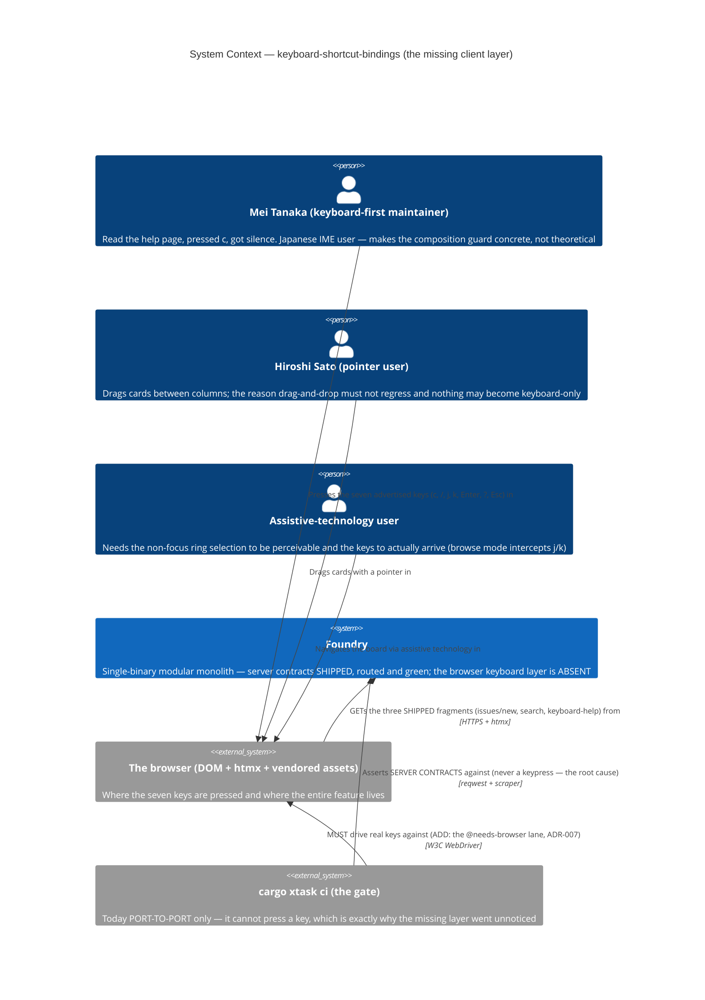
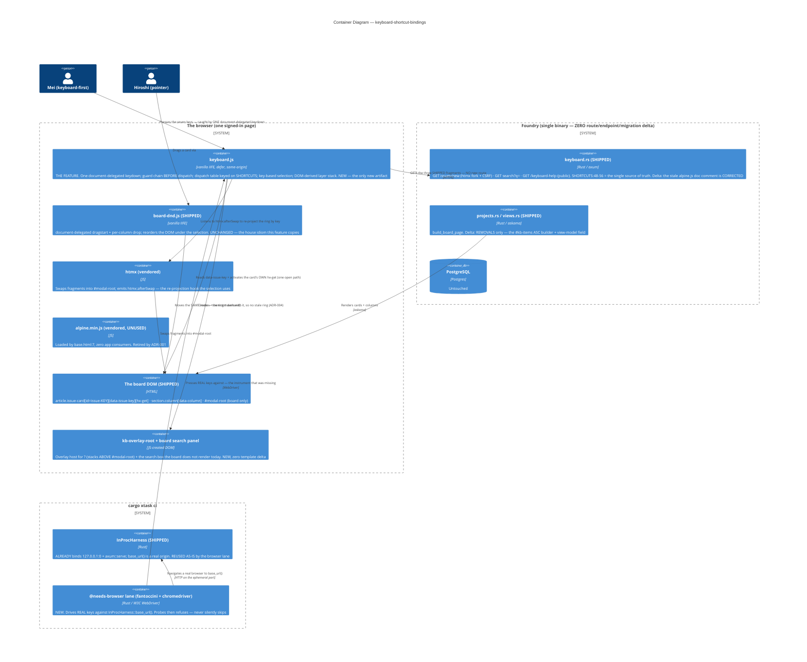
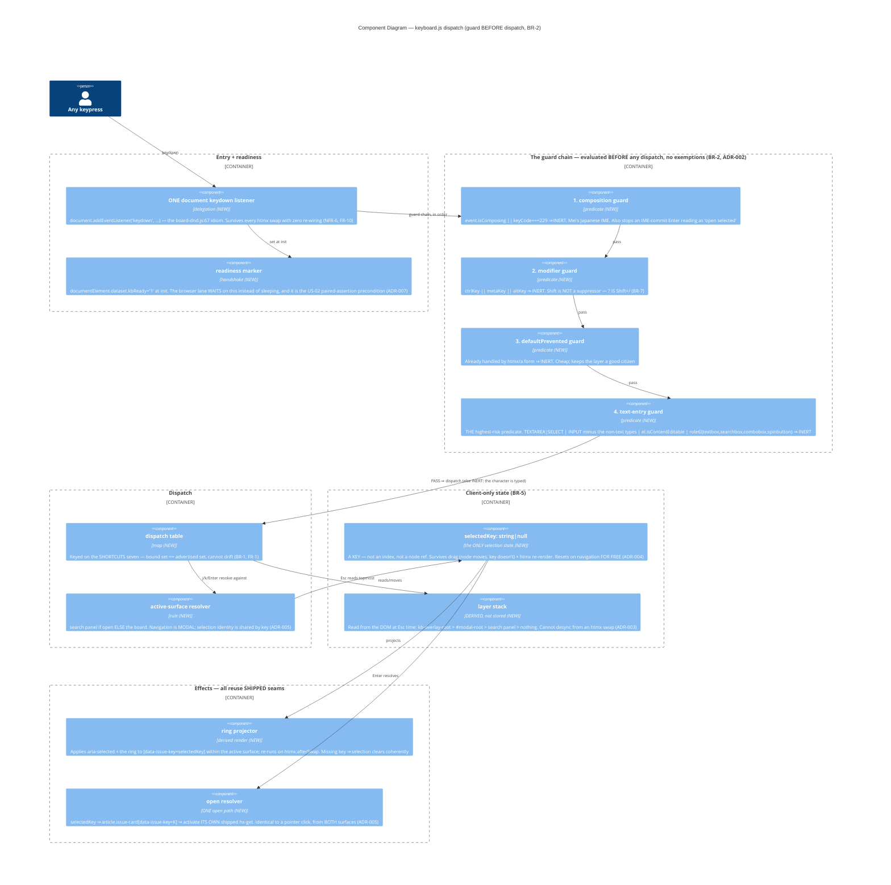

# Architecture — keyboard-shortcut-bindings (the missing client layer)

> Morgan (nw-solution-architect), DESIGN wave, Propose mode, application/component scope. Paradigm
> inherited, NOT re-decided: Rust ports-and-adapters modular monolith on the server; **vanilla
> document-delegated IIFE JS** in the web tier (`board-dnd.js`, `csrf-upload.js`). This feature adds the
> browser-side keyboard layer that `keyboard.rs`'s own module doc already describes — and that was never
> written. Requirements SSOT: `../discuss/`. ODD-1..9 are resolved here and in `adr-001..008`; the per-ODD
> resolution index is in `wave-decisions.md`; DISCUSS deltas are in `upstream-changes.md`.
>
> **Honest brownfield truth (verified `file:line`, and it corrects three inputs).**
> 1. **The harness already serves on a real TCP port.** `InProcHarness::spawn` →
>    `spawn_app_with_listener` → `spawn_app` → `TcpListener::bind("127.0.0.1:0")` + `axum::serve`
>    (`foundry-app/src/lib.rs:698-759`), exposed as `harness.base_url()` (`support/harness.rs:442-444`).
>    "In-process" means *same OS process*, **not** *no socket*. The premise that a browser needs new
>    serving plumbing is **false** — a WebDriver session can point at `base_url()` today. This makes ODD-9
>    substantially cheaper than DISCUSS assumed (ADR-007, `upstream-changes.md` §1).
> 2. **The repo already made — and recorded — the decision that caused this bug.**
>    `tests/features/us-12-keyboard-nav.feature:18-23`: *"Pure browser interaction … lives in alpine.js and
>    is OUT of automated scope per the JTBD-backend-MVP no-Playwright decision."* ODD-9 **reverses** that
>    decision. The root cause is not an oversight; it is a documented trade that has now come due
>    (ADR-007, `upstream-changes.md` §2).
> 3. **The `#kb-items` delta is wider and sharper than DISCUSS mapped**: **two** feature files (not one),
>    two unit tests that are **not** deletable whole, and one line whose naive removal leaves a test
>    **passing vacuously** (`projects.rs:1110`). Verified site-by-site in ADR-008.

## System context and capabilities

Foundry's help overlay advertises **seven** keyboard shortcuts — `c`, `/`, `j`, `k`, `Enter`, `?`, `Esc` —
as a shipped constant (`SHORTCUTS`, `keyboard.rs:48-56`) rendered into a real `<dl>` the user reads
(`partials/keyboard_help.html:3`). **None are bound.** The entire client-side keyboard layer was never
written: `static/js/` contains exactly `board-dnd.js` and `csrf-upload.js`; there is no `keyboard.js`; the
only `keydown` in the tree is inside the vendored `alpine.min.js`.

The server side is complete, routed, and green. `keyboard.rs`'s module doc opens *"Three routes that back
the alpine.js keyboard-shortcut handlers"* — handlers that do not exist. The suite is **port-to-port**
(reqwest + `scraper`): it proves the server contracts and **never presses a key**. So the product is 100%
green to the suite and 100% absent to the user.

This feature adds **one artifact**: `static/js/keyboard.js` — a vanilla, document-delegated, guarded
dispatch layer — plus the CSS it needs, plus **the instrument that would have caught the gap** (a real
browser lane in `cargo xtask ci`). Capabilities delivered: (a) `?` renders the shipped public
`/keyboard-help` fragment as an in-place overlay; (b) `Esc` closes the topmost layer only, selection
intact; (c) `c` drives the shipped htmx new-issue path; (d) `/` reveals + focuses a search box on the
board and suppresses its own slash; (e) `j`/`k` walk a key-based selection over visible cards with a ring
+ `scrollIntoView`; (f) `Enter` opens the selected card via that card's own shipped `hx-get`; (g) a
guard chain that makes all seven safe to press. **Zero new routes, endpoints, or migrations.**

## C4 Level 1 — System Context (MANDATORY)



## C4 Level 2 — Container (MANDATORY)



## C4 Level 3 — Component (the dispatch layer — the subsystem this feature IS)



## Resolved contracts

### The guard chain (ODD-4, ADR-002) — THE crux

Evaluated once, in order, before **any** dispatch. No shortcut is exempt (BR-2). Falling off the end is
the only path to dispatch.

| # | Guard | Verdict |
|---|-------|---------|
| 1 | `event.isComposing === true \|\| event.keyCode === 229` | INERT — IME composition (Mei) |
| 2 | `event.ctrlKey \|\| event.metaKey \|\| event.altKey` | INERT — `Cmd+C` copies. **`shiftKey` is NOT here** (BR-7) |
| 3 | `event.defaultPrevented` | INERT — someone already owns this key |
| 4 | `isTextEntry(event.target)` | INERT — the character is typed |

```
isTextEntry(el):
  el is an element?                                   else false
  TEXTAREA | SELECT                                 → true
  INPUT and type ∉ {button submit reset checkbox
                   radio file image range color
                   hidden}                          → true    // default type is "text"
  el.isContentEditable === true                     → true    // covers INHERITED contenteditable
  role ∈ {textbox, searchbox, combobox, spinbutton}  → true
  otherwise                                          → false
```

`isContentEditable` (not `getAttribute`) is deliberate: it is true for **descendants** of an editable
region, so a nested `<b>` inside a rich-text field is covered without an ancestor walk. `keyCode === 229`
is belt-and-braces beside `isComposing`: the legacy composition sentinel, still the reliable signal on
some IME/browser pairs — and it is what stops an IME-commit `Enter` from being read as "open selected".

### The overlay host + the layer stack (ODD-3 + ODD-8, ADR-003)

**`#modal-root` is not the answer, and BR-4 proves it.** It exists only at `board.html:13` and htmx swaps
it with `innerHTML`. Rendering `?` into it would **destroy an open new-issue modal** — but US-07 requires
*"one Esc closes help; the new-issue modal is still open"*. Help and modals must therefore live in
**separate containers**. ODD-3 is not a free choice; the locked layering forces it.

- `keyboard.js` creates `<div id="kb-overlay-root">` and appends it to `document.body` on first use, on
  **any** page. `#modal-root` is untouched (board-only, htmx's target, exactly as shipped). Zero template
  delta; a global `?` gains a mount everywhere; DOM order + a z-index puts help above modals naturally.
- **The stack is DERIVED from the DOM at `Esc` time, never stored.** A stored array is precisely what an
  htmx swap replacing `#modal-root` would desync (the ODD-5 worry). Precedence, one layer per press:
  `kb-overlay-root` has content → clear it; else `#modal-root` has content → clear it; else search panel
  open → close it; else **no-op** (never navigate, never touch selection).
- **ODD-8 — the full-page `/keyboard-help` links (`sidebar.html:13`, `dashboard_root.html:32`) STAY.**
  Confirmed, not overturned. They are the no-JS path (NFR-4), the route is public by design
  (`keyboard.rs:19-24`), and removing them would make help keyboard-only — a BR-6 violation. The
  dead-code policy does **not** apply: they have live consumers.

### Key-based selection (ODD-5, ADR-004)

`selectedKey: string | null`. Not an index (a drag or a re-render silently re-points it at a **different
issue** — the user acts on the wrong card: disqualifying). Not a node reference (an htmx re-render detaches
it: an invisible ring and an `hx-get` on an orphan).

- The ring is **derived**, never stored: project `aria-selected` + the ring class onto
  `[data-issue-key=selectedKey]` within the active surface; re-project on `htmx:afterSwap`. Key still
  present → re-ringed. Key gone → selection clears coherently (no stale ring, no dangling index).
- **Drag needs zero code and zero change to `board-dnd.js`**: it moves the *same node*; the key is
  unchanged and the ring class rides along. NFR-8 coexistence falls out of the representation.
- **`Esc` never clears selection for free** (BR-5, AC-07.3): `Esc` clears *containers*; selection is a
  detached string.
- **"Resets on navigation" is free**: a real navigation reloads the page and the variable is gone. It is a
  property of the representation, not code to write — and it is why selection can never reach the server.

### Search surface + Enter resolution (ODD-6, ADR-005)

Locked: **board only**; the "issue list" is dropped (verified: `…/issues` is POST-only, `lib.rs:487-490`).
Recorded as an amendment to D2 in `upstream-changes.md` §3.

- **The box**: `keyboard.js` injects a `hidden` search panel into the board plus a pointer-clickable
  "Search" control beside "New issue" (`board.html:5-6`) — so `/` is an **accelerator, not the only
  path** (BR-6). `/` reveals + focuses it and **`preventDefault()`s its own keypress** so the field is
  empty (FR-7 — the classic bug). `Esc` hides it and restores the board. Zero template delta.
- **Navigation is MODAL, selection identity is SHARED.** j/k walk the search panel's `li.search-result`
  rows when it is open, else the board's `article.issue-card` — never a merged sequence (results overlay
  the board; a merged order would jump the ring to a card the user cannot see, breaking D-4's "selection
  follows the eyes"). But `selectedKey` is one key, so selecting `AUTH-2` in results and pressing `Esc`
  leaves the ring on `AUTH-2`'s **board card**. Cross-surface continuity falls out of ADR-004 for free.
- **`Enter` resolves through the board card, always.** `li.search-result` carries **only** `.key` +
  `.title` — **no `hx-get`, no `edit_url`** (`partials/search_results.html:4`, view-model
  `keyboard.rs:233-239`). DISCUSS did not catch this; US-06's "activate the card's own `hx-get`" is
  **unimplementable on a search result** as shipped. Resolution: `Enter` maps `selectedKey` →
  `article.issue-card[data-issue-key=K]` → activate **that** card's shipped `hx-get`. This works from
  both surfaces *because the search panel overlays the board rather than replacing it*, preserves "exactly
  one open path" (AC-06.5), and needs **zero server delta** — the alternative (adding `edit_url` to the
  search view-model) would have breached D10.
  **Named edge**: the board renders only `{backlog, todo, in_progress, done}` (`projects.rs:49,933-941`)
  while search returns every issue (`list_issues_by_project`). An issue in any other state is findable but
  has no card → `Enter` is a **no-op**, consistent with "no selection ⇒ no-op" (FR-9).

### Selection accessibility (ODD-7, ADR-006) — answered, with a named residual

The finding that decides it: **in screen-reader browse mode, single letters are quick-nav keys** (`j`/`k`
are consumed by NVDA/JAWS before any listener runs). A live region cannot fix this — the keys **never
arrive**. So an announcement-only mechanism is **not adequate**, and that is a real result, not a
preference.

Keys reach the page only in focus mode, which requires DOM focus on a composite widget. Resolution — and
it **honors D-4**, because a single `tabindex="0"` on one container is not the roving-tabindex rewrite D-4
rejected (no tab order across N cards; no fight with drag):

- `keyboard.js` applies, and re-applies on `htmx:afterSwap`: `role="listbox"` + `tabindex="0"` +
  `aria-label="Issues"` + `aria-activedescendant="issue-{key}"` on the board region; `role="group"` +
  label per column; `role="option"` + `aria-selected` per card. **Cards already carry `id="issue-{key}"`**
  (`issue_card.html:1`) — `aria-activedescendant`'s hard prerequisite is met by the shipped markup.
- `listbox`/`option` (not `grid`) because the interaction *is* linear single-select: j/k next/prev, one
  selection, no 2D arrow navigation. A card's accessible name computes from its `.key` + `.title` spans —
  *"AUTH-2 Session cookie not cleared on sign-out"* — which is exactly the right announcement.
- **No live region.** `aria-activedescendant` already announces; adding a region double-announces.
- The ring: `outline` + offset on `[aria-selected="true"]`, ≥3:1 non-text contrast (WCAG 2.1 AA 1.4.11)
  **plus** a non-colour cue (weight/border), so it never relies on colour alone (NFR-7).
- **Accepted cost — ratified, not buried (Option A, user, 2026-07-15; D-4 stands)**: an AT user must Tab
  to the board **once** before j/k arrive. Sighted keyboard users are unaffected (the document listener
  fires immediately). **KPI-4 is met *conditionally on that Tab*** — the qualifier *"once the board is
  focused"* must travel with every KPI-4 claim, and slice 05 must put *"Tab to the board, then `j`/`k`"*
  into the help overlay's own copy. Eliminating the cost would require roving tabindex — considered and
  rejected; the trade-off is retained in ADR-006 for whoever revisits it.

### The browser lane (ODD-9, ADR-007) — the root-cause fix

**`fantoccini` is the right pick and I defend it**: W3C WebDriver (so chromedriver *or* geckodriver — no
Chrome lock-in, unlike CDP-only `headless_chrome`), async/tokio (matches the harness), minimal surface, MIT/
Apache-2.0, actively maintained. `thirtyfour` is a reasonable higher-level alternative rejected only for
surface area. **Two honest limits, named not hidden**: (a) WebDriver `send_keys` cannot produce real IME
composition — the ODD-4 composition clause must be probed with JS-dispatched `CompositionEvent` +
`isComposing` via `client.execute()`, which exercises our guard truthfully but is *not* a real IME; (b)
clipboard reads are not viable headless — `Cmd+C` must assert **non-activation** (no modal) and
`defaultPrevented === false`, not "the text was copied". Neither is disqualifying; both are recorded so
DISTILL does not write an unimplementable AC.

- **Composition with `InProcHarness`: reuse it as-is.** It already serves a real origin
  (`base_url()`); the browser lane adds a WebDriver session pointed at it. One app-construction path — no
  divergence between what the port-to-port suite and the browser lane exercise.
- **Lane `@needs-browser`**: excluded from the default fast loop (beside `@docker-compose`/`@needs-pgclient`,
  `acceptance.rs:245-252`), **included in `all`** — which is what `cargo xtask ci` runs. CI must install
  chromedriver exactly as it installs `postgresql-client-16`. Per AGENTS.md it lives in `cargo xtask ci`,
  never `ci.yml` alone. Prerequisite check mirrors `pg_dump_at_least_16()` (`xtask/src/main.rs:335-358`).
  **Trap to fix**: `run_steps` injects `FOUNDRY_ACCEPTANCE_TAGS` by *label substring* (`main.rs:250-257`) —
  a second acceptance step needs per-step env, not a label match.
- **Earned Trust — probe, then refuse, never skip.** This is the whole point. The bug exists because the
  instrument didn't. A lane that *silently skips* on a missing/skewed chromedriver **recreates the exact
  failure mode**. So the lane probes (session up, key round-trips, `[data-kb-ready]` appears) and on
  failure **fails loudly and actionably**. Never `#[ignore]`, never a silent pass.
- **The probe that matters most**: the harness emits `Secure` on the session cookie over plain HTTP and
  the code says so — *"the test only inspects the header text, not whether the browser would send the
  cookie back"* (`harness.rs:401-406`). reqwest doesn't care; **a real browser does**. It happens to work
  (Chrome/Firefox treat `127.0.0.1` as a trustworthy origin), but that is an assumption about a substrate
  that is free to lie. **Probe it explicitly at lane start** — sign in, navigate, assert still signed in —
  so it fails as one clear diagnostic instead of every scenario failing mysteriously at sign-in.
- **Waits are conditions, never sleeps**: `[data-kb-ready]` before any key; `#modal-root [data-modal]`
  after `c`; `document.activeElement` for focus. One chromedriver **process** per lane, one **session**
  per scenario — the same built-once/isolated-per-scenario shape AGENTS.md mandates for compose images.

### Retiring `#kb-items` (ODD-1, ADR-008)

Confirmed: **delete it whole**, per AGENTS.md. Zero browser consumers, always; hidden + `aria-hidden` so it
can carry neither a ring nor the a11y story; ASC-across-columns where the visible board is
column-grouped-DESC. Verified site-by-site — and the map is **wider than DISCUSS had it**; the full delta,
including two traps, is in ADR-008.

## Component architecture & boundaries

| Component | Layer | Responsibility | Status |
|---|---|---|---|
| `static/js/keyboard.js` | web (client) | The whole feature: one delegated `keydown`, guard chain, dispatch table, selection, layer stack, hosts | **NEW — the only new artifact** |
| guard chain | client predicate | Composition → modifier → defaultPrevented → text-entry, before dispatch (BR-2) | NEW (ADR-002) |
| `selectedKey` + ring projector | client state | Key-based ephemeral selection; ring derived, re-projected on swap | NEW (ADR-004) |
| layer stack | client rule | DOM-derived Esc precedence, topmost-only | NEW (ADR-003) |
| `#kb-overlay-root` + search panel | client DOM | JS-created hosts — a global `?` mount + the board search box | NEW (ADR-003/005) |
| ARIA composite projection | client a11y | `listbox`/`option` + `aria-activedescendant`, re-applied on swap | NEW (ADR-006) |
| ring / overlay / panel CSS | static asset | WCAG 2.1 AA, non-colour-alone; **triggers the hand-maintained re-hash** | EXTENDED |
| `base.html:6-9` | template | One `<script src="/static/js/keyboard.js" defer>`; Alpine tag **removed** | EXTENDED (ADR-001) |
| `keyboard.rs:1-30` doc | server doc | The stale "alpine.js handlers" comment **corrected** (R9) | EXTENDED (removal-equivalent) |
| `#kb-items` carrier/builder/field/tests/assertions | server + tests | **DELETED WHOLE** across 9 sites, 2 feature files | **REMOVED** (ADR-008) |
| `BrowserHarness` + `@needs-browser` lane | test infra | Real keys vs `InProcHarness::base_url()`; probe-then-refuse | NEW (ADR-007) |
| `show_keyboard_help` / `show_new_issue_modal` / `search_issues` / routes / `issue_card.html` / `#modal-root` / `board-dnd.js` | server + client | The seams this feature drives | **UNCHANGED** |

Software-crafter owns all internal structure (function decomposition, the exact CSS, the panel's markup,
wait helpers) during GREEN/REFACTOR. The contracts above are the boundary.

## Reuse-vs-new analysis (verdict: 14 REUSE · 5 EXTEND · 6 CREATE-NEW · 9 DELETE · **0 new route, 0 migration**)

| # | Component | File / seam | Decision | Justification |
|---|---|---|---|---|
| 1 | `SHORTCUTS` | `keyboard.rs:48-56` | **REUSE (SSOT)** | The dispatch table is keyed on it, so bound == advertised by construction (BR-1) |
| 2 | `show_keyboard_help` + bare `role="dialog"` fragment | `keyboard.rs:259-279`, `keyboard_help.html:1`, route `lib.rs:536` | **REUSE** | Built for exactly this overlay; public by design so `?` works even pre-sign-in |
| 3 | `show_new_issue_modal` + `HX-Request` fork + `ensure_csrf_cookie` | `keyboard.rs:62-110,94,96-104` | **REUSE** | `c` drives the htmx branch; the fork IS the no-JS guarantee; **zero client CSRF work** |
| 4 | `search_issues` + `filter_matches` + empty state | `keyboard.rs:160-231`, `search_results.html:4` | **REUSE** | Exact-key, substring and `data-empty` semantics honoured as-is |
| 5 | `issue_card.html` `hx-get`→`#modal-root` + `id="issue-KEY"` + `data-issue-key` | `issue_card.html:1` | **REUSE** | The one open path for `Enter`; the `id` is `aria-activedescendant`'s prerequisite (ADR-006) |
| 6 | `#modal-root` | `board.html:13` | **REUSE (untouched)** | Stays htmx's board-local modal target; help gets its OWN host instead (ADR-003) |
| 7 | `board-dnd.js` delegation idiom + its drag behaviour | `board-dnd.js:17,67,149-154` | **REUSE (unchanged)** | The house pattern copied; key-based selection means drag needs **no** change (NFR-8) |
| 8 | `htmx:afterSwap` | vendored htmx | **REUSE** | The re-projection hook for ring + ARIA (NFR-6) |
| 9 | Full-page `/keyboard-help` links | `sidebar.html:13`, `dashboard_root.html:32` | **REUSE (keep)** | ODD-8 confirmed — the no-JS path (NFR-4, BR-6) |
| 10 | `InProcHarness` + `base_url()` + testcontainers Postgres | `support/harness.rs:239-444` | **REUSE AS-IS** | **Already a real origin** — the browser lane needs no new serving plumbing (ADR-007) |
| 11 | `pg_dump_at_least_16()` prerequisite pattern | `xtask/src/main.rs:335-358` | **REUSE (mirror)** | The chromedriver check copies it verbatim in shape |
| 12 | Lane-exclusion + `all` arms | `acceptance.rs:180-189,245-252` | **REUSE (extend)** | `@needs-browser` joins the exclusion list and the `all` lane |
| 13 | CSS content-hash re-hash procedure | `navigation-bar-linear-ui/design/adr-004`, `base.html:5`, `lib.rs:284` | **REUSE (inherited)** | The ring needs CSS ⇒ re-hash. Established manual discipline + asset probe; **not re-decided here** |
| 14 | Harness identities Mei / Hiroshi | `us_12_keyboard_nav.rs:58-64` | **REUSE** | Concrete, runnable examples |
| 15 | `base.html` script block | `base.html:6-9` | **EXTEND** | +`keyboard.js`, −`alpine.min.js` (ADR-001) |
| 16 | The stylesheet | `static/css/foundry.<hash>.css` | **EXTEND** | Ring + overlay + panel rules; triggers #13 |
| 17 | `keyboard.rs` module doc | `keyboard.rs:1-30` | **EXTEND (correct)** | R9 — it documents handlers that never existed |
| 18 | `run_steps` env injection | `xtask/src/main.rs:250-257` | **EXTEND (fix)** | Per-step env; the label-substring match cannot carry two acceptance lanes |
| 19 | `us-12-keyboard-nav.feature` module doc + `@manual` drill | `:18-23`, `:87-95` | **EXTEND / RETIRE** | The no-Playwright decision is reversed; the drill is superseded by the lane (slice 05) |
| 20 | `keyboard.js` | — | **CREATE-NEW** | ADR-001..006 — the feature |
| 21 | `#kb-overlay-root` + search panel | — | **CREATE-NEW** | ADR-003/005 |
| 22 | `BrowserHarness` (+ probe) | — | **CREATE-NEW** | ADR-007 |
| 23 | `@needs-browser` lane + chromedriver preflight | — | **CREATE-NEW** | ADR-007 |
| 24 | Browser step defs + `.feature` | — | **CREATE-NEW** | ADR-007; **must** be registered in `acceptance.rs:34-122` or the steps silently vanish |
| 25 | `fantoccini` dep | workspace `Cargo.toml:102-109` | **CREATE-NEW (1 dep)** | ADR-007; must clear `deny.toml` |
| 26 | `#kb-items` — 9 sites, 2 feature files | see ADR-008 | **DELETE** | ODD-1 + AGENTS.md dead-code policy |

## Technology stack & rationale (OSS-first)

- **Vanilla ES5-compatible JS, no framework, no build step** (inherited house idiom) — `board-dnd.js` /
  `csrf-upload.js`. Zero dependencies, zero bundler, CSP-safe by construction. (ADR-001)
- **Alpine.js — REMOVED**, not adopted. Vendored and loaded (`base.html:7`) with **zero** app consumers
  (verified: no `x-data`/`x-on:`/`@click`/`x-model` anywhere in `templates/`). Per AGENTS.md it is dead
  carry. (ADR-001)
- **`fantoccini`** (MIT/Apache-2.0) + **chromedriver** (host-installed, BSD-3) — W3C WebDriver, async,
  driver-agnostic. Lands in `[workspace.dependencies]` beside the acceptance stack
  (`Cargo.toml:102-109`); must clear `deny.toml`. (ADR-007)
- **Reused, unchanged**: htmx (vendored), axum/askama/sqlx/tokio, cucumber, testcontainers, reqwest,
  `scraper`.

**Net: ONE new runtime artifact (`keyboard.js`, zero dependencies), ONE new dev-dependency
(`fantoccini`), ONE host prerequisite (chromedriver), ZERO new crates in the app, ZERO routes, ZERO
migrations.**

## Integration patterns & API contracts

- **Client → server (driving)**: three **shipped** GETs, unchanged — `…/issues/new` (HX-Request fork),
  `…/search?q=`, `/keyboard-help` (public). The client reads `project_context` off the board's **own**
  `hx-get` (`board.html:6`) rather than reconstructing URLs, so it cannot disagree with the button.
- **CSRF**: none needed on the `c` path — the server mints the cookie on the GET (`keyboard.rs:94`) and
  the fragment carries the hidden `_csrf` (`new_issue_modal.html:4`). Unlike `board-dnd.js` /
  `csrf-upload.js`, this layer writes **no** CSRF code. If DELIVER finds itself writing some, something
  has gone wrong.
- **No new external integration.** The layer talks only to Foundry's own same-origin routes. **No
  contract-test annotation is owed to platform-architect.** The one new *external* dependency is a
  **build/test-time** substrate (chromedriver/Chrome), whose contract is enforced by the ADR-007 probe —
  which is the correct instrument for a driver binary, not a consumer-driven contract.

## Quality attribute strategies (ISO 25010)

- **Functional correctness (BR-1, FR-1)**: the dispatch table is keyed on `SHORTCUTS` — the same constant
  that renders the help `<dl>`. Bound set and advertised set **cannot drift**; a `@property` enumerates the
  overlay's `dt[data-shortcut]` values and asserts each is bound (KPI-5).
- **Usability — the highest-risk guarantee (NFR-2, R2)**: the guard chain is **structural** (one chain,
  before dispatch, no exemptions), not seven scattered `if`s. `Enter`-in-a-form and `/`-in-the-search-box
  are *consequences* of BR-2, not special cases — a design property worth stating.
- **Accessibility (NFR-7, KPI-4)**: answered explicitly via a focusable ARIA composite +
  `aria-activedescendant`, with the browse-mode finding that rules out live-region-only. The one-time
  Tab-to-the-board cost was escalated and is **ratified as accepted** (Option A, 2026-07-15; D-4 stands),
  so **KPI-4 is met conditionally on that Tab** and is always claimed with that qualifier (ADR-006).
- **Reliability / compatibility (NFR-6, NFR-8, FR-10)**: document-level delegation ⇒ swaps need no
  re-wiring; key-based selection ⇒ drag and htmx re-render cannot corrupt it; `board-dnd.js` is unchanged.
- **Compatibility — no-JS (NFR-4, BR-6)**: pure progressive enhancement. The server-side `HX-Request` fork
  is untouched; the "New issue" button and the sidebar help link keep working. **Named honest limit**:
  search remains JS-only — the search route returns a *bare fragment with no full-page fork*, so it has no
  no-JS path **today** and this feature does not create one (nothing regresses; the pointer path is
  preserved via the injected control). A full-page search fork is a recommended follow-up, out of scope.
- **Security (NFR-5)**: external same-origin `defer` script, no inline handlers, no CDN, no `eval`.
  Dropping Alpine removes the tree's only `unsafe-eval`-shaped dependency. Selection never reaches the
  server (BR-5).
- **Maintainability / testability (NFR-1)**: every AC is browser-observable and every scenario reds on
  `main` — **except** US-02's deliberately inverted revert-reds-it paired assertions (D15), preserved
  exactly as DISCUSS specified. The `[data-kb-ready]` marker doubles as the paired assertion's
  "the layer is live" precondition.

## Architecture Enforcement (for software-crafter)

Style: modular monolith + ports-and-adapters (server, inherited, untouched); vanilla document-delegated
IIFE (client, inherited). Tools: `cargo xtask check-arch` (in-tree) + `cargo xtask ci` + targeted litmuses.

- **Guard before dispatch is structural** — the dispatch table is unreachable except through the chain. A
  `@property` (`@paired-assertion`, do not split) proves the layer is live **then** that typing is inert.
- **Bound == advertised** — a `@property` reads the overlay's `dt[data-shortcut]` set and asserts equality
  with the bound set. Both derive from `SHORTCUTS`.
- **Zero server delta** — an assertion that this feature adds no route/endpoint/migration; the removals are
  proved by a **grep litmus: `kb-items`/`kb_items` returns zero hits** (AC-05.6).
- **No inline handlers / no CDN** — a litmus over rendered HTML.
- **The lane refuses, never skips (Earned Trust)** — a missing/skewed chromedriver **fails** `cargo xtask
  ci` with an actionable hint. The lane's own probe (session + key round-trip + `[data-kb-ready]` + the
  **`Secure`-cookie-in-a-real-browser** check) runs before the suite.
- **Delegation, not per-element binding** — the `@htmx-swap` scenario (file via `c`, then `j`/`Enter`) reds
  if anything re-wires per element.
- **The vacuous-test trap (ADR-008)** — `projects.rs:1110` slices the page at `id="kb-items"`; deleting the
  carrier without repointing `visible` at the full HTML leaves the test **passing for the wrong reason**.

## Deployment architecture

Unchanged: ONE binary, ONE PostgreSQL, no new infra, no migration (latest remains
`0014_notification_unsubscribes`). The runtime delta is **one static JS file** and **one re-hashed
stylesheet** served by the shipped `/static` handler under the existing `immutable` cache policy — so the
re-hash (`base.html:5` + `lib.rs:284`, per the inherited procedure) must land as **one atomic commit** or
an intermediate state links a non-existent file.

The only new operational requirement is a **developer/CI prerequisite**: Chrome + a version-matched
chromedriver on `PATH`, checked by `cargo xtask ci` with an install hint (`brew install --cask
chromedriver` / `apt-get install -y chromium-driver`), exactly as the PostgreSQL 16 client is today.
**Production is untouched.** Platform-architect owes: chromedriver provisioning in the CI image, and
nothing else.

## ADRs

- `adr-001-vanilla-dispatch-layer.md` — ODD-2: vanilla document-delegated IIFE; **drop Alpine** (zero
  consumers); correct the stale "alpine.js" doc (R9).
- `adr-002-guard-predicate.md` — ODD-4 (**the crux**): the exact four-step chain, the `isTextEntry`
  predicate, IME `isComposing` + `keyCode 229`, Shift excluded as a suppressor.
- `adr-003-overlay-host-and-layer-stack.md` — ODD-3 + ODD-8: a JS-created `#kb-overlay-root` (forced by
  BR-4's layering), the DOM-derived Esc stack, and keeping the no-JS help links.
- `adr-004-key-based-selection.md` — ODD-5: `selectedKey` by issue-key; ring as derived state; drag +
  swap coherence for free.
- `adr-005-search-surface-and-enter-resolution.md` — ODD-6: board-only, the injected search panel, modal
  navigation with shared selection identity, and `Enter`-via-the-board-card (the missing `hx-get`).
- `adr-006-selection-accessibility.md` — ODD-7: the browse-mode finding, `aria-activedescendant` on a
  focusable composite, why not a live region, and the ratified Tab cost (Option A; D-4 stands).
- `adr-007-browser-e2e-harness.md` — ODD-9: fantoccini defended, `InProcHarness` reused as-is, the
  `@needs-browser` lane, probe-then-refuse, and the reversal of the no-Playwright decision.
- `adr-008-retire-kb-items.md` — ODD-1: the verified 13-site deletion, the two traps DISCUSS missed.
</invoke>
