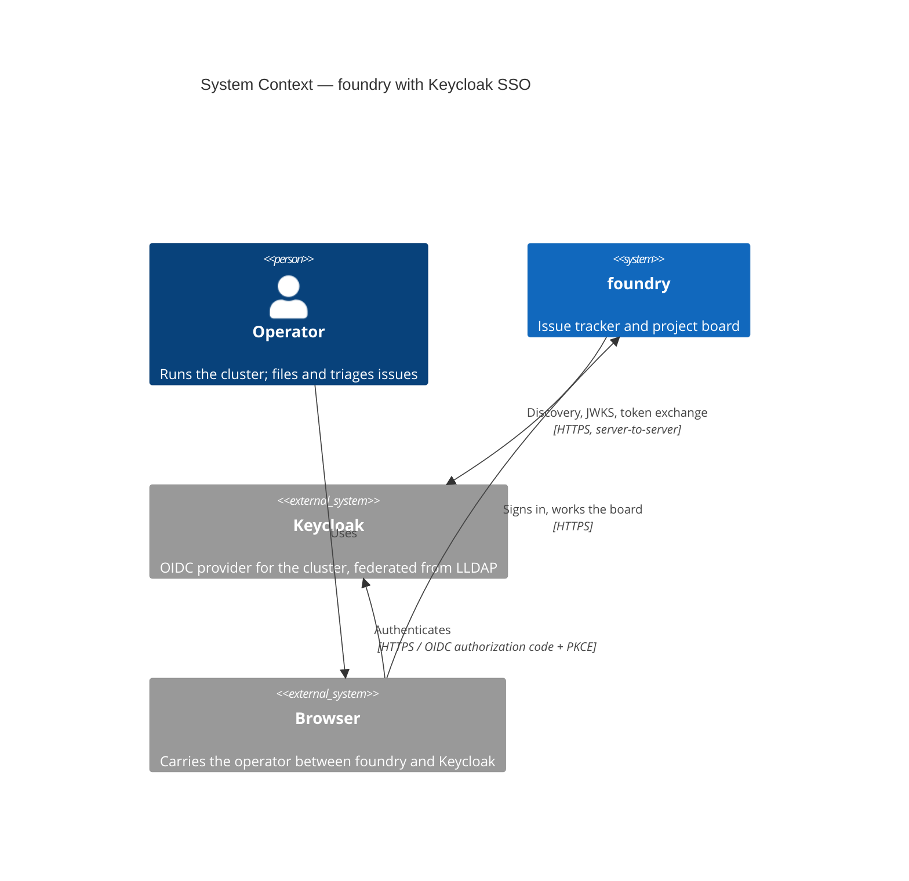
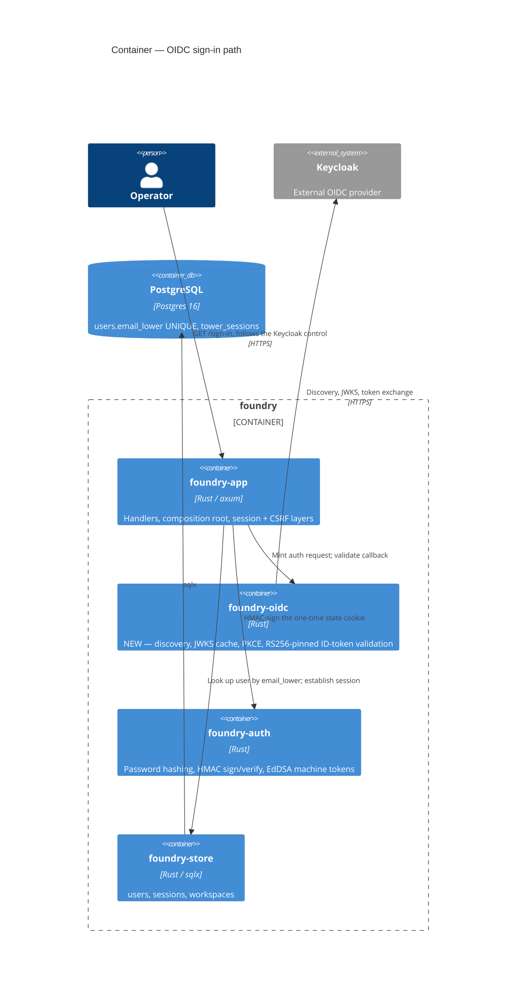

# Feature Delta — keycloak-sso

> DISCUSS wave, lean density (`~/.nwave/global-config.json`: `lean` + `ask-intelligent`).
> Adds a native OpenID Connect relying-party sign-in path to foundry so an operator
> can reach their board with the Keycloak identity they already use for the rest of
> the cluster. Strictly ADDITIVE: the local password path, the bootstrap claim, and
> the invite-accept flow are unchanged and remain the break-glass route.
>
> Cross-repo: the Keycloak client, the tofu variables, and the cluster e2e test land
> in `jeffbailey/homelab` (`infrastructure/modules/keycloak/`, `infrastructure/modules/foundry/`).
> Tracked here as a pre-requisite, designed there.

## Wave: DISCUSS

### [REF] Persona ID

`operator` — the single person who runs this cluster and this tracker. Already
authenticates to Grafana, Portainer, ArgoCD and Element through the same Keycloak
realm (federated from LLDAP). Reads "sign in" as "the button the other services
have". Research depth: lightweight (one persona, happy path plus the
security-relevant error paths) — the user research is the operator.

### [REF] JTBD one-liner

When I open foundry to file or triage an issue, I want to sign in with the Keycloak
identity I already use elsewhere on the cluster, so I can get to my board without a
password that exists only here. (`job-sso-signin` — `docs/product/jobs.yaml`.)

Job dimensions — functional: reach an authenticated session with no foundry-specific
credential. Emotional: foundry stops being the odd one out. Social: one identity
across the cluster, so issue and comment authorship matches everything else.

Four forces — **push**: foundry holds the only private password on the cluster, and
it is the one most likely to need an email reset at the worst moment. **pull**: one
click from `/sign-in` to a signed-in board, with the same session semantics the
password path already produces. **anxiety**: being locked out of my own tracker when
Keycloak or LLDAP is down, or after a cluster rebuild misconfigures OIDC. **habit**:
typing a foundry password — which is why the SSO path must be additive, never a
migration that removes the fallback.

The anxiety force is what makes D2 and D3 below non-negotiable rather than merely
convenient: an SSO design that can strand the operator has not done the job.

### [REF] Locked decisions

| ID | Decision | Verdict | Rationale |
|----|----------|---------|-----------|
| D1 | Native OIDC relying party inside foundry, NOT an oauth2-proxy front | LOCKED | `infrastructure/modules/foundry/main.tf:10` records that foundry "speaks no OIDC, so it is NOT fronted by oauth2-proxy". A proxy would still leave foundry's own session layer behind it, so the operator authenticates twice unless foundry learns to trust a forwarded header — which is app code anyway, just less honest about it. Native RP puts the real identity in the session, so issue/comment authorship is correct and `/api/v1` + SSE keep working unchanged. |
| D2 | Local password sign-in is RETAINED | LOCKED | Keycloak and LLDAP run on the same cluster as foundry. An SSO-only tracker is unreachable exactly when the cluster is broken and the operator most needs to read the issue describing how to fix it. |
| D3 | Keycloak sign-in links to an EXISTING foundry user by verified email; unknown email is refused | LOCKED | No auto-provisioning. `users.email_lower` is already `UNIQUE`, so the match is unambiguous and "two users share an email" is structurally impossible. Keeps `users.password_hash NOT NULL` valid — no migration. Keeps the invite flow as the gate on who is in the tracker, so a realm federating all of LLDAP cannot silently populate foundry. |
| D4 | `POST /sign-out` clears the foundry session only — no RP-initiated logout | LOCKED | Matches how the rest of the cluster behaves. Ending the Keycloak SSO session would also sign the operator out of Grafana, Portainer and ArgoCD, which is surprising rather than correct. |
| D5 | The bootstrap-claim and invite-accept flows are untouched | LOCKED | They are how a foundry user comes to exist at all; D3 makes SSO depend on them. A fresh cluster must still be claimable with no Keycloak in play. |
| D6 | SSO is OFF unless configured; foundry starts and serves normally with no OIDC settings | LOCKED | `cargo xtask ci`, `cargo xtask smoke` and a contributor's `run.sh` must not require a Keycloak. Absent config means the "Sign in with Keycloak" affordance is not rendered and the OIDC routes refuse — not a boot failure. |
| D7 | An OIDC refusal is observationally identical to a bad-password refusal | LOCKED | `signin.rs` already returns `GENERIC_SIGNIN_ERROR` and runs `known_bad_hash()` so timing does not leak whether an email is registered (`us-06-timing-symmetry-redesign`). A new sign-in path that answers "no such account" differently would re-open the enumeration oracle that feature closed. |

### [REF] Scope Assessment: PASS

Elephant Carpaccio early gate, run before journey investment. Oversized signals
checked: 5 user stories (threshold >10) — no. Modules touched: `foundry-app`,
`foundry-auth`, plus the homelab tofu/Keycloak wiring (threshold >3 bounded
contexts) — borderline at 3, counted as ONE signal. Walking-skeleton integration
points: Keycloak, the web tier, the session layer = 3 (threshold >5) — no. Effort
estimate ~3 days (threshold >2 weeks) — no. Multiple independent shippable
outcomes — no; auto-provisioning and realm-role→`instance_admins` mapping were
explicitly scoped OUT, leaving one outcome.

One signal of five. Right-sized; no split proposed.

### [REF] Journey (happy path)

| # | Step | Observable output | Emotional state |
|---|------|-------------------|-----------------|
| 1 | Operator opens `https://foundry.<domain>/sign-in` | Existing email/password form, plus a new "Sign in with Keycloak" control | Neutral — recognises the affordance from Grafana |
| 2 | Clicks it | 302 to the Keycloak authorization endpoint | Confidence rising — this is the familiar login page |
| 3 | Authenticates at Keycloak (or is already signed in) | 302 back to `/auth/oidc/callback` | Confident |
| 4 | foundry validates the ID token and links the verified email to a foundry user | 303 to `/`, session cookie set | Confident — arrived |
| 5 | Board renders | Dashboard, authored-by identity matches the Keycloak account | Confident — same person everywhere |

Confidence builds monotonically and never dips; the only downward transitions live
on the refusal paths below, all of which land back on step 1 with a message rather
than an error page.

Shared artifacts across steps — each has one source: `state` (minted at step 2,
verified at step 4, source: the short-lived OIDC cookie), `nonce` (same lifetime,
source: same cookie, compared against the ID token claim), PKCE `code_verifier`
(same), `email` + `email_verified` (source: the validated ID token, never a request
parameter), `SessionUser { user_id, workspace_id }` (source: `users` +
`resolve_active_workspace`, identical to the password path).

Error paths, all landing on step 1 with `GENERIC_SIGNIN_ERROR` per D7: unverified
email; email matching no foundry user; `state` absent or mismatched; `nonce`
mismatched; ID token signature, `iss`, `aud` or `exp` invalid; token endpoint
unreachable; user belongs to no workspace (the existing fail-closed branch).

### [REF] User stories with elevator pitches

All stories trace to `job-sso-signin`.

---

**US-01 — Sign in to foundry with Keycloak** (`job_id: job-sso-signin`) `@walking_skeleton`

As the operator, I want a "Sign in with Keycloak" control on `/sign-in`, so that I
reach my board using the identity I already hold.

#### Elevator Pitch
Before: I cannot reach foundry without typing a password that exists only in foundry.
After: run `click "Sign in with Keycloak" on https://foundry.<domain>/sign-in` → sees `the Keycloak login page, then my foundry dashboard at / with my own name on it`
Decision enabled: I decide whether foundry has joined the cluster's single sign-on, by arriving at my board without a foundry password.

Acceptance criteria:
- AC-1.1 With OIDC configured, `GET /sign-in` renders a control whose href is `/auth/oidc/start`.
- AC-1.2 `GET /auth/oidc/start` responds 302 to the configured Keycloak authorization endpoint, carrying `client_id`, `redirect_uri`, `scope=openid email profile`, a `state`, a `nonce`, and PKCE `code_challenge`; `state`, `nonce` and `code_verifier` are stored in a short-lived, `HttpOnly`, `SameSite=Lax` cookie.
- AC-1.3 `GET /auth/oidc/callback` with a valid `code` and matching `state` exchanges the code server-to-server, validates the ID token (signature via the issuer's JWKS, `iss`, `aud`, `exp`, `nonce`), and reads `email` + `email_verified`.
- AC-1.4 A verified email matching `users.email_lower` establishes a session by the SAME path the password flow uses — `resolve_active_workspace` then `session.insert(SESSION_KEY_USER_ID, SessionUser { user_id, workspace_id })` — and responds 303 to `/`.
- AC-1.5 The resulting session is indistinguishable from a password sign-in: the dashboard renders, `/api/v1` and SSE work, and issues created afterwards are authored by that user.
- AC-1.6 The one-time OIDC cookie is cleared on both success and refusal.

---

**US-02 — A Keycloak identity with no foundry account is refused, non-enumerably** (`job_id: job-sso-signin`)

As the operator, I want SSO to refuse an identity that has no foundry account, so
that federating my whole directory into Keycloak does not silently populate my tracker.

#### Elevator Pitch
Before: I cannot tell whether enabling SSO would let every LLDAP user into my tracker.
After: run `complete the Keycloak sign-in as a realm user with no foundry account` → sees `the foundry sign-in page again with the same generic message a wrong password produces`
Decision enabled: I decide that invites remain the only way into foundry, having watched a valid Keycloak login fail to create an account.

Acceptance criteria:
- AC-2.1 A validated ID token whose `email` matches no `users.email_lower` row creates no user, no membership, and no session.
- AC-2.2 The response is 401 with `GENERIC_SIGNIN_ERROR` — byte-identical to the bad-password refusal (D7).
- AC-2.3 A validated ID token with `email_verified` absent or false is refused identically, even when the email DOES match a foundry user.
- AC-2.4 A user who exists but belongs to no workspace hits the existing fail-closed branch and is refused identically.
- AC-2.5 No refusal branch reveals, in body, status, or header, whether the email is registered.

---

**US-03 — A tampered or replayed callback is refused** (`job_id: job-sso-signin`)

As the operator, I want the callback to reject anything it did not itself initiate,
so that a link someone sends me cannot sign me in as them or them as me.

#### Elevator Pitch
Before: I cannot tell whether foundry's SSO callback is safe to expose on the public internet.
After: run `curl "https://foundry.<domain>/auth/oidc/callback?code=x&state=y"` → sees `HTTP 401 and the generic sign-in page, with no session cookie set`
Decision enabled: I decide the callback is safe to publish through the tunnel, having watched a hand-crafted request be refused.

Acceptance criteria:
- AC-3.1 A callback with no OIDC cookie is refused (no `state` to compare against).
- AC-3.2 A callback whose `state` does not match the cookie is refused.
- AC-3.3 An ID token whose `nonce` does not match the cookie is refused.
- AC-3.4 An ID token failing signature, `iss`, `aud`, or `exp` validation is refused.
- AC-3.5 Replaying a previously consumed callback is refused (the cookie is single-use, cleared per AC-1.6).
- AC-3.6 A token-endpoint failure or timeout is refused, not 500, and is logged.
- AC-3.7 Every refusal in this story returns the same status and body as AC-2.2.

---

**US-04 — Password sign-in and bootstrap claim still work with SSO enabled** (`job_id: job-sso-signin`)

As the operator, I want the local password path intact, so that a Keycloak or LLDAP
outage cannot lock me out of the tracker that documents how to fix it.

#### Elevator Pitch
Before: I cannot adopt SSO without risking being locked out of my own issue tracker during a cluster outage.
After: run `sign in at https://foundry.<domain>/sign-in with my foundry email and password while OIDC is configured` → sees `my dashboard, exactly as before SSO existed`
Decision enabled: I decide it is safe to enable SSO in production, having confirmed the break-glass path still opens.

Acceptance criteria:
- AC-4.1 With OIDC configured, `POST /sign-in` with valid local credentials succeeds unchanged.
- AC-4.2 The existing `us_06_signin` acceptance scenarios, including the timing-symmetry oracle, remain green.
- AC-4.3 `/bootstrap` and `/invites/accept` are unchanged and reachable with no Keycloak available.
- AC-4.4 A user who signed in via Keycloak can subsequently sign in with their local password, and the reverse — the paths do not disturb each other's session or credential state.

---

**US-05 — foundry runs normally with no OIDC configuration** (`job_id: job-sso-signin`)

As a contributor, I want foundry to start and serve without Keycloak settings, so
that the CI gate and a local `run.sh` do not require an identity provider.

#### Elevator Pitch
Before: I cannot run foundry locally or in CI if it demands OIDC configuration at boot.
After: run `./run.sh with no OIDC environment variables set` → sees `foundry serving, and /sign-in rendering the password form with no "Sign in with Keycloak" control`
Decision enabled: I decide whether I need a Keycloak to contribute, by watching foundry come up without one.

Acceptance criteria:
- AC-5.1 With OIDC unset, foundry boots and `/healthz` + `/readyz` answer as today.
- AC-5.2 `/sign-in` renders no Keycloak control when OIDC is unconfigured.
- AC-5.3 `/auth/oidc/start` and `/auth/oidc/callback` refuse when OIDC is unconfigured, with the same generic response as AC-2.2 — not a 500 and not a stack trace.
- AC-5.4 `cargo xtask ci` and `cargo xtask smoke` pass with no Keycloak reachable.
- AC-5.5 Partial configuration (issuer set, secret missing) is a startup refusal with a named error, not a half-enabled flow.

### [REF] Definition of Done

1. All ACs above are green in the acceptance suite at layer 3 (real axum via `build_router`, real Postgres via testcontainers).
2. `cargo xtask smoke` green before each commit; `cargo xtask ci` green before push (foundry AGENTS.md pre-push gate).
3. The check-arch boundary guard passes — no new dependency-direction violation from `foundry-app` into `foundry-auth`.
4. `cargo deny check` passes for any new OIDC dependency.
5. No new dead code; superseded paths deleted outright (foundry AGENTS.md "Dead code").
6. Session establishment is shared with the password path, not duplicated.
7. The homelab side applies cleanly: `make plan` zero-diff after `make apply`, Keycloak client present in the realm import, not hand-created in the admin UI.
8. End-to-end verified on the real cluster: a browser round trip from `https://foundry.<domain>/sign-in` to a signed-in dashboard.
9. `docs/product/jobs.yaml` and this file reflect what shipped; `CHANGELOG.md` updated.

### [REF] Out of scope

- Auto-provisioning foundry users from Keycloak (D3). Revisit if contributors outgrow invites.
- Mapping a Keycloak realm role onto `instance_admins`. Admin grants stay manual.
- RP-initiated (single) logout (D4).
- Replacing local passwords, or migrating existing users to SSO-only.
- OIDC for `/api/v1` machine tokens — those keep their Ed25519 JWT path.
- Any other identity provider. The implementation should be generic OIDC, but only Keycloak is specified, configured, and tested.

### [REF] Walking Skeleton strategy

Strategy **D (configurable)** in the skill's taxonomy, expressed in this repo's
convention: the OIDC path is env-switched (D6), so the skeleton must demonstrate
BOTH the configured round trip and the unconfigured no-op.

The skeleton is US-01 end to end: a real browser-equivalent request to `/sign-in`,
following the control to a REAL Keycloak, back through `/auth/oidc/callback`, to a
rendered dashboard — driven through the production `build_router` composition root,
against a real Postgres. Per the ATDD infrastructure policy (`docs/architecture/atdd-infrastructure-policy.md`),
the driving port (HTTP) is real via `spawn` and the driven-internal store is real via
testcontainers; Keycloak is a driven-EXTERNAL port, so slice 01 must settle whether
it is real (a Keycloak testcontainer) or a fake issuer — see SPIKE-0.

Litmus test (Mandate 5 / Dim 5): a non-technical stakeholder reads it as "the
operator clicks Sign in with Keycloak and lands on their board." Yes.

### [REF] Driving ports

| Driving port | Protocol | Status | Stories |
|---|---|---|---|
| `GET /sign-in` (Keycloak control rendered) | HTTP GET | shipped, extended | US-01, US-05 |
| `GET /auth/oidc/start` | HTTP GET → 302 | NEW | US-01, US-05 |
| `GET /auth/oidc/callback` | HTTP GET → 303 / 401 | NEW | US-01, US-02, US-03, US-05 |
| `POST /sign-in` (local password) | HTTP POST | shipped, regression only | US-04 |
| `POST /sign-out` | HTTP POST | shipped, unchanged (D4) | US-04 |
| `GET /bootstrap`, `GET|POST /invites/accept` | HTTP | shipped, regression only | US-04 |

Both new routes mount alongside `/sign-in` under the existing `csrf_middleware` +
`session_layer`, since the visitor is signed OUT when they start. The callback is a
GET, so `state` — not the double-submit CSRF cookie — is its request-forgery defence.

### [REF] Outcome KPIs

| KPI | Target | Measurement |
|---|---|---|
| Sign-ins requiring a foundry-specific password | 0 in normal operation | Operator's own usage over the two weeks after rollout; local password reserved for break-glass |
| Steps from `/sign-in` to a signed-in board | ≤ 2 (click, authenticate) | Counted in the US-01 acceptance scenario |
| Accounts auto-created by SSO | exactly 0 | `SELECT count(*) FROM users` unchanged across a refused unknown-email sign-in (AC-2.1) |
| Enumeration signal from the new path | 0 distinguishable responses | AC-2.5 / AC-3.7 assert byte-identical status and body across all refusal branches |
| Break-glass availability | 100% | AC-4.1/4.3 green with Keycloak unreachable |
| CI independence from Keycloak | `cargo xtask ci` green with no IdP | AC-5.4 |

### [REF] Pre-requisites

- **SPIKE-0** (slice 01, timeboxed): choose the OIDC mechanism — the `openidconnect` crate versus a thin flow over the already-present `reqwest` (rustls, json) plus `jsonwebtoken` (already a `foundry-auth` dependency) with JWKS fetch and caching. `cargo deny` is a CI gate, so dependency weight is a real constraint. Also settle whether the acceptance harness hosts a Keycloak testcontainer or a minimal fake issuer.
- **Cross-repo, `jeffbailey/homelab`** — designed there, not here: a `foundry` OIDC client in the Keycloak realm import under `infrastructure/modules/keycloak/`, carrying `defaultClientScopes = ["roles","web-origins","acr","basic","profile","email","groups"]` as that module's AGENTS.md requires; redirect URI `https://foundry.<domain>/auth/oidc/callback`; new tofu variables on `infrastructure/modules/foundry/` for issuer, client id and client secret, threaded into the Deployment's env; and an e2e test beside `tests/e2e/test_portainer_keycloak_sso.py`.
- **Deployment**: foundry's image pin is per-cluster (`services-state.<domain>.tfvars`), so shipping this means a Forgejo Actions build and a pin bump, not just `make apply`.
- `users.email_lower` is `UNIQUE` and `password_hash` is `NOT NULL` — D3 is chosen so neither needs a migration. Any drift toward auto-provisioning reopens migration `0015`.

### [REF] Story map and slice order

Backbone (operator activities, left to right): **arrive at foundry → prove who I am
→ get scoped to my workspace → work the board**. This feature touches only "prove
who I am"; the other three are shipped and must stay untouched.

| Slice | Ships | Stories | Effort | Brief |
|---|---|---|---|---|
| P0 (precursor commit, not a slice) | Extract the shared session-establish helper out of `submit_signin` | — (`@infrastructure`) | ~1h | in slice 01 brief |
| 01 | The Keycloak round trip, plus the unconfigured no-op | US-01, US-05 | ~1 day + 2h SPIKE | `slices/slice-01-keycloak-round-trip.md` |
| 02 | Every refusal, non-enumerably; password path regression-guarded | US-02, US-03, US-04 | ~0.5 day | `slices/slice-02-refusals.md` |
| 03 | Keycloak realm client, tofu wiring, production e2e | US-01 re-asserted on the cluster | ~0.5 day | `slices/slice-03-cluster-wiring.md` |

Order rationale: slice 01 first because it carries all the uncertainty — if the
session seam is not credential-agnostic, slices 02 and 03 are wasted, and finding
that out on day one is the cheapest possible failure. Slice 02 second because
refusals are branches on 01's handler and cost nothing once the flow exists, while
shipping 01 to production without them would publish an unhardened callback. Slice
03 last because it is the only slice that cannot be rolled back with a code revert
alone — it touches a live Keycloak realm and a per-cluster image pin.

Carpaccio taste tests: **thin** — pass for 02 and 03; slice 01 brushes the "4+ new
components" test and is documented as an accepted exception in its brief (a partial
OIDC flow has no end-to-end value). **Abstraction first** — pass: the shared session
helper ships as the P0 precursor commit rather than being invented inside a slice.
**Disproves a pre-commitment** — pass: each slice names one. **Production data** —
pass: real Postgres via testcontainers throughout, and slice 03 runs against the
live cluster. **No duplicate-by-scale slices** — pass. **Slice composition gate** —
pass: every slice carries at least one user-visible value story; the only
`@infrastructure` work (P0) is a precursor commit, not a shipped slice.

### [REF] Definition of Ready validation

| # | DoR item | Verdict | Evidence |
|---|---|---|---|
| 1 | Business value articulated | PASS | `job-sso-signin` with all four forces; the anxiety force is what forces D2/D3 |
| 2 | User stories in LeanUX format with elevator pitches | PASS | US-01…US-05, each with Before / After / Decision-enabled |
| 3 | Acceptance criteria testable and unambiguous | PASS | 27 ACs, each naming an observable HTTP status, body, redirect, or row count |
| 4 | Dependencies identified | PASS | SPIKE-0, the P0 precursor, and the cross-repo homelab work, all in Pre-requisites |
| 5 | Job traceability | PASS | All five stories carry `job_id: job-sso-signin`; no `infrastructure-only` escape used |
| 6 | Sized and sliced | PASS | Scope Assessment PASS (1 of 5 oversized signals); three slices, each ≤1 day |
| 7 | Outcome KPIs measurable | PASS | Six KPIs, each with a numeric target and a stated measurement |
| 8 | Out-of-scope explicit | PASS | Six named non-goals, each with the decision that excluded it |
| 9 | Technical feasibility grounded | PASS | Read against the real tree: `reqwest` and `jsonwebtoken` already present, `users.email_lower` UNIQUE, `password_hash` NOT NULL, `resolve_active_workspace` fail-closed, `GENERIC_SIGNIN_ERROR` + `known_bad_hash()` already the non-enumerable posture |

Requirements completeness: **0.96** (27 of 28 identified behaviours have a bound AC;
the one unbound is the OIDC mechanism itself, deliberately deferred to SPIKE-0 as
OD-1 rather than guessed at here).

### [WHY] Alternatives considered

Tier-2 expansion, rendered on request. Triggered by cross-context complexity (four
distinct technologies: Rust/axum, OIDC/Keycloak, PostgreSQL, OpenTofu/Kubernetes)
and by WS strategy D (configurable/env-switched). One row per locked decision, plus
the mechanism choice deferred to SPIKE-0.

#### D1 — Native OIDC relying party

| Alternative | Verdict | Why |
|---|---|---|
| **Native RP inside foundry** | CHOSEN | The identity lands in `SessionUser`, so issue authorship, `/api/v1` and SSE are correct with no further work. One flow to reason about, and the refusal semantics are foundry's own. |
| oauth2-proxy in front | REJECTED | foundry has its own session layer, so the operator authenticates twice — once at the proxy, once at foundry — unless foundry learns to trust a forwarded header, which is app code anyway. It also forces every non-browser client (`/api/v1`, SSE) through a proxy that does not speak machine tokens. |
| oauth2-proxy + trusted `X-Forwarded-User` | REJECTED | The same app-code cost as native RP, minus the ID-token validation, plus a header the app must never accept from anywhere but the proxy. A misrouted ingress becomes total auth bypass. Strictly worse than doing it properly. |
| Keycloak as the only user store (no foundry `users` rows) | REJECTED | `users.id` is a foreign key from issues, comments, memberships, and `instance_admins`. Removing the local row is a schema rewrite of the whole domain, not an auth change. |

#### D2 — Local password retained

| Alternative | Verdict | Why |
|---|---|---|
| **Keep local passwords indefinitely** | CHOSEN | Keycloak and LLDAP run on the same cluster as foundry. SSO-only makes the tracker unreachable exactly when the cluster is broken — and the issue describing how to fix it lives in that tracker. |
| SSO-only once it works | REJECTED | Removes the fallback at the moment of highest dependence. Also strands the `invites/accept` set-password flow, which has no Keycloak equivalent. |
| SSO-only with one break-glass admin | REJECTED | Better than pure SSO-only, but it concentrates recovery on one credential that is used rarely enough to rot unnoticed. A password path exercised by nobody is a password path that fails when tried. |

#### D3 — Link to existing users by verified email

| Alternative | Verdict | Why |
|---|---|---|
| **Invited/existing users only** | CHOSEN | `users.email_lower` is already `UNIQUE`, so the match is unambiguous. `password_hash NOT NULL` stays valid — no migration. Invites remain the gate on who is in the tracker. |
| Auto-provision any realm user | REJECTED | The Keycloak realm federates LLDAP, so everyone in the directory would silently gain a foundry account and appear in assignee pickers. Needs migration `0015` to make `password_hash` nullable, and makes the invite flow vestigial. |
| Auto-provision gated on a realm role | REJECTED (for now) | Genuinely reasonable, and the natural next step if contributors outgrow invites. Rejected here only because it adds role-claim plumbing plus an unanswered question — what happens to an existing foundry user when the role is revoked? Deleting their account orphans authorship; leaving it makes the gate cosmetic. Not worth answering before anyone needs it. |
| Match on Keycloak `sub` rather than email | REJECTED | `sub` is stable and email is not, which argues for it — but no foundry user has a `sub` until their first SSO sign-in, so the *first* match must be by email regardless. Storing `sub` afterwards is a sensible hardening once the flow exists; it is not needed to make it work. |

#### D4 — Local logout only

| Alternative | Verdict | Why |
|---|---|---|
| **Clear the foundry session only** | CHOSEN | Matches Grafana, Portainer and ArgoCD on this cluster. No new endpoint, no new scenario. |
| RP-initiated logout to Keycloak | REJECTED | Signing out of foundry would sign the operator out of every other service in the realm. Correct by the letter of the spec, surprising in practice. |
| Both, behind separate controls | REJECTED | The right answer for a shared machine, and cheap to add later. Rejected now as an extra affordance and an extra scenario for a single-operator tracker on trusted devices. |

#### D5 — Bootstrap and invite flows untouched

| Alternative | Verdict | Why |
|---|---|---|
| **Leave both alone** | CHOSEN | They are how a foundry user comes to exist, and D3 makes SSO depend on that. A fresh cluster must be claimable with no Keycloak running. |
| Route bootstrap through Keycloak | REJECTED | Circular: bootstrap runs before any user exists, and the Keycloak client for foundry is created by the same `make apply` that deploys foundry. A first-boot ordering dependency on an IdP is a bootstrap that fails on a fresh cluster. |

#### D6 — SSO off unless configured

| Alternative | Verdict | Why |
|---|---|---|
| **Runtime env switch, absent = off** | CHOSEN | `cargo xtask ci` and a contributor's `run.sh` must not require an IdP. Absent config renders no control and refuses the routes — not a boot failure. |
| Required configuration (fail to start) | REJECTED | Turns every local checkout and every CI run into a Keycloak dependency. Also makes the homelab deploy ordering brittle: foundry could not start before its Keycloak client existed. |
| Compile-time cargo feature | REJECTED | Means two binaries. The cluster image would carry the feature and CI would not, so the CI-green/production-identical invariant that `cargo xtask ci` exists to protect would be broken by construction. |
| Partial config tolerated (issuer set, secret missing) | REJECTED | Explicitly refused at startup (AC-5.5). A half-enabled auth flow is the worst of both — it renders the control and then fails at the callback, which reads as a broken deploy rather than an unconfigured one. |

#### D7 — Refusals are observationally identical

| Alternative | Verdict | Why |
|---|---|---|
| **One generic refusal for every branch** | CHOSEN | `signin.rs` already returns `GENERIC_SIGNIN_ERROR` and burns a `known_bad_hash()` compare so timing does not leak registration. A second sign-in path answering differently reopens the oracle `us-06-timing-symmetry-redesign` and `bootstrap-claim-enumeration-oracle` closed. |
| Specific messages ("no foundry account for this identity") | REJECTED | Much kinder, and genuinely tempting since the visitor already proved control of the email at Keycloak. But the callback is reachable by anyone who can drive a browser to Keycloak, so a specific message turns foundry into an account-existence oracle for the whole realm. |
| Specific message only after a successful token validation | REJECTED | Narrows the oracle without closing it: the attacker just completes a real Keycloak login first. Complexity for a partial fix. |

#### OD-1 — OIDC mechanism (SPIKE-0 decides)

| Option | Pull | Push |
|---|---|---|
| `openidconnect` crate | Discovery, JWKS rotation, PKCE and ID-token validation are all solved and audited. Least room for a subtle validation bug — the class of bug that matters most here. | Large transitive tree behind a `cargo deny check` gate; a licence or advisory hit fails CI on a schedule nobody controls. |
| Thin flow over `reqwest` + `jsonwebtoken` | Both are already workspace dependencies (`reqwest` with rustls-tls + json; `jsonwebtoken` already in `foundry-auth`), so the dependency delta is zero and `cargo deny` risk does not move. | Hand-rolled JWKS fetch, caching, key rotation and claim validation. Every one of those is a place to get security subtly wrong, and the acceptance suite only catches what it thinks to assert. |

The tie-breaker is not size but blast radius: a dependency problem fails the build
loudly, a validation problem fails silently and authenticates the wrong person.
SPIKE-0 should weigh it that way rather than by dependency count.

### Open decisions for DESIGN

- **OD-1** OIDC mechanism and its dependency footprint (SPIKE-0 resolves).
- **OD-2** Where the one-time `state`/`nonce`/`code_verifier` live — a dedicated signed cookie versus the existing `tower-sessions` store keyed pre-authentication. The ACs pin the observable behaviour, not the carrier.
- **OD-3** Exact route paths. Pinned as `/auth/oidc/start` and `/auth/oidc/callback`; if DESIGN moves them, the Keycloak client's redirect URI in homelab moves in the same change.
- **OD-4** Whether the Keycloak control is a link or a form POST. ACs assert the href target, so either passes.

## Wave: DESIGN

Scope: application / components (Decision 0). Mode: propose (Decision 1). Density
lean; `nwave-ai outcomes check-delta` exits 0 (registry empty — no collisions).
Paradigm is not newly chosen: the codebase is already a ports-and-adapters modular
monolith with trait-injected effects (`Arc<dyn Clock>`, `Notifier`, `Store`), and
this feature follows it. Nothing written to `CLAUDE.md`.

### [REF] Decisions

| ID | Decision | Verdict |
|---|---|---|
| DDD-1 | A new `crates/foundry-oidc` owns the OIDC protocol (discovery, JWKS, PKCE, token exchange, ID-token validation); `foundry-app` owns the two handlers and the wiring | LOCKED |
| DDD-2 | Thin implementation over the ALREADY-PRESENT `reqwest` (rustls-tls, json) and `jsonwebtoken` 9.3.1. Zero new runtime dependencies | LOCKED |
| DDD-3 | `xtask check-arch` gains `check_oidc_alg_pin`, scanning `crates/foundry-oidc/src` and requiring `algorithms = [RS256]` with no other token | LOCKED |
| DDD-4 | `AppState.oidc: Option<Arc<OidcProvider>>`, mirroring `machine_token_signer` exactly | LOCKED |
| DDD-5 | The one-time `state`/`nonce`/PKCE `code_verifier` ride in a dedicated HMAC-signed cookie, NOT a pre-auth `tower-sessions` row | LOCKED |
| DDD-6 | The session-establish tail of `submit_signin` is extracted to `signin::establish_session` and called by both paths | LOCKED |
| DDD-7 | Routes pinned at `GET /auth/oidc/start` and `GET /auth/oidc/callback`, mounted beside `/sign-in` under `csrf_middleware` + `session_layer` | LOCKED |
| DDD-8 | The Keycloak control is a plain `<a href="/auth/oidc/start">`, not a form POST | LOCKED |
| DDD-9 | Boot validates configuration SHAPE only. Discovery and JWKS are fetched lazily on first use; network failure refuses the sign-in, never the boot | LOCKED |
| DDD-10 | JWKS is cached with a TTL and refreshed on unknown `kid`, rate-limited to one refresh per interval | LOCKED |
| DDD-11 | One `oidc_refusal()` function produces every refusal, delegating to the same `GENERIC_SIGNIN_ERROR` + `render_signin_form` the password path uses | LOCKED |
| DDD-12 | Acceptance drives a FAKE issuer with a fixed RSA test keypair; the real Keycloak is exercised only by slice 03's cluster e2e | LOCKED |

Rationale for the three that are not obvious:

**DDD-1/DDD-3 — crate placement is a security decision, not a tidiness one.**
`xtask/src/check_arch.rs::check_jwt_alg_pin` scans `crates/foundry-auth/src`, fires on
any file constructing a `jsonwebtoken::Validation`, and demands an `algorithms` list
containing `EdDSA` and **no other algorithm token** — `RS256` is in its explicit
reject list. Keycloak signs ID tokens RS256, so OIDC validation inside `foundry-auth`
fails `cargo xtask ci` by construction. Widening that guard to tolerate RS256 would
loosen the pin protecting machine tokens, and `pins_algorithms_to_eddsa` only inspects
the FIRST `algorithms` list in a file, so a per-file rule cannot express "EdDSA here,
RS256 there". A separate crate keeps the two credential classes under two independent,
per-class pins. The reason to hand-roll rather than adopt `openidconnect` follows from
the same fact: a guard can only pin an algorithm it can see in first-party source.

**DDD-5 — the state carrier must not write to the database.** `/auth/oidc/start` is
reachable by anyone, signed out. Minting a `tower-sessions` row per click is an
unauthenticated, unbounded INSERT on a public endpoint — a disk-fill vector that also
pollutes the session table. An HMAC-signed cookie over the existing `SESSION_SECRET`
is stateless, self-expiring, and uses the shipped `foundry_auth::sign`/`verify`
primitives that `InviteToken` and `UnsubscribeToken` already use for exactly this
shape. Single-use is enforced by clearing the cookie on both outcomes (AC-1.6).

**DDD-9 — foundry must start when Keycloak is down.** D2 exists because Keycloak,
LLDAP and foundry share a cluster: the tracker has to open when the cluster is broken.
A boot-time discovery fetch would invert that, making foundry's readiness depend on
the IdP it exists to survive. So boot checks only that the issuer URL parses, the
client id and secret are non-empty, and the redirect URL is absolute — a partial or
malformed config is `health.startup.refused` (AC-5.5, the shipped
`MACHINE_TOKEN_SIGNING_KEY` pattern at `main.rs:204`), while an unreachable Keycloak
is a refused sign-in attempt (AC-3.6) and nothing more.

### [REF] Reuse Analysis

| Existing component | File | Overlap | Decision | Justification |
|---|---|---|---|---|
| `submit_signin` session tail | `crates/foundry-app/src/signin.rs:150-198` | Establishing a session from a resolved user | **EXTEND** (extract `establish_session`) | ~20 LOC extraction versus duplicating `resolve_active_workspace`, the fail-closed no-workspace branch, the `SessionUser` insert and the 303. Duplication would let the two paths drift on the fail-closed branch — the branch AC-2.4 depends on |
| `GENERIC_SIGNIN_ERROR` + `render_signin_form` | `crates/foundry-app/src/signin.rs:543` | Rendering a refusal | **EXTEND** (call verbatim) | D7 requires byte-identical refusals; a second renderer guarantees eventual drift |
| `foundry_auth::sign` / `verify` (HMAC over `SESSION_SECRET`) | `crates/foundry-auth/src/lib.rs:251,260` | Signing a short-lived opaque blob | **EXTEND** | `InviteToken` and `UnsubscribeToken` already use these primitives for the same shape; the OIDC state cookie is a third instance, not a new mechanism |
| `MachineTokenVerifier` | `crates/foundry-auth/src/lib.rs:146` | Verifying a JWT | **CREATE NEW** (`foundry-oidc`) | Different algorithm class (RS256 vs EdDSA), different key source (remote rotating JWKS vs static PEM set), different trust model (external issuer vs self-issued). Hard evidence, not preference: co-locating them fails `check_jwt_alg_pin`, which rejects any non-EdDSA token in `foundry-auth`'s `algorithms` list |
| `machine_token_signer: Option<Arc<..>>` boot wiring | `crates/foundry-app/src/main.rs:204` | Optional-feature boot with a refusal probe | **EXTEND** (reuse the pattern) | Same `Option` shape, same `health.startup.refused` event, same metrics counter. AC-5.5 asks for behaviour this file already implements |
| `check_jwt_alg_pin` | `xtask/src/check_arch.rs:455` | Build-time algorithm pinning | **EXTEND** (add sibling scanner) | ~30 LOC sibling over a second directory, versus generalising one function with per-crate config. Two independent pins fail independently, which is the point |
| `spawn_app()` in-process router | `foundry_app::test_support` | Acceptance driving port | **EXTEND** | ATDD policy names it the HTTP driving mechanism; no new harness |
| `resolve_active_workspace` | `foundry-store` | Scoping a session to a workspace | **EXTEND** (verbatim) | Reached through `establish_session`; the fail-closed branch is reused, not reimplemented |
| `csrf_middleware` + `session_layer` in `build_router` | `crates/foundry-app/src/lib.rs:368` | Route mounting | **EXTEND** | Both new routes mount on the existing signed-out-accessible layer, exactly as `/sign-in` and `/invites/accept` do |

One CREATE NEW, carrying build-guard evidence. Zero unjustified.

### [REF] Component decomposition

| Component | Path | Change |
|---|---|---|
| `foundry-oidc` crate | `crates/foundry-oidc/` | **NEW** — `OidcConfig` (shape-validated at boot), `OidcProvider` (lazy discovery + cached JWKS), `AuthRequest` (state/nonce/PKCE minting), `IdTokenClaims` + RS256-pinned validation, `OidcError` |
| OIDC handlers | `crates/foundry-app/src/oidc.rs` | **NEW** — `start`, `callback`, `oidc_refusal`, state-cookie encode/decode over `foundry_auth::sign`/`verify` |
| Session establish | `crates/foundry-app/src/signin.rs` | **EXTRACT** — `establish_session(state, session, user) -> Response`, called by `submit_signin` and by `callback` (P0 precursor commit) |
| Sign-in template | `crates/foundry-app/src/signin.rs::render_signin_form` | **EDIT** — render the `<a href="/auth/oidc/start">` control only when `state.oidc.is_some()` |
| Composition root | `crates/foundry-app/src/main.rs` | **EDIT** — build `Option<Arc<OidcProvider>>` from env; refuse to start on partial config |
| App state | `crates/foundry-app/src/lib.rs::AppState` | **EDIT** — add `pub oidc: Option<Arc<foundry_oidc::OidcProvider>>` |
| Router | `crates/foundry-app/src/lib.rs::build_router` | **EDIT** — two route mounts beside `/sign-in` |
| Boundary guard | `xtask/src/check_arch.rs` | **EDIT** — add `check_oidc_alg_pin` |
| Dependency direction | `deny.toml` | **EDIT** — ban `foundry-oidc` with `wrappers = ["foundry-app", "foundry-acceptance"]`, mirroring the `foundry-api` rule so nothing else can reach the protocol crate |

### [REF] Driving ports

| Port | Handler | Method | Stories |
|---|---|---|---|
| `/auth/oidc/start` | `oidc::start` | GET → 302 | US-01, US-05 |
| `/auth/oidc/callback` | `oidc::callback` | GET → 303 or 401 | US-01, US-02, US-03, US-05 |
| `/sign-in` (control rendered) | `signin::show_form` | GET | US-01, US-05 |
| `/sign-in` (password) | `signin::submit_signin` | POST | US-04, regression |

### [REF] Driven ports and adapters

| Driven port | Class | Production adapter | Acceptance treatment |
|---|---|---|---|
| Keycloak discovery + JWKS | external, non-deterministic | `reqwest::Client` GET, cached | **Fake issuer** with a FIXED RSA test keypair — real RS256 crypto, fixture key material (the shipped `MachineTokenSigner` pattern) |
| Keycloak token endpoint | external, non-deterministic | `reqwest::Client` POST (client secret, PKCE verifier) | Same fake issuer; unreachable/slow arms drive AC-3.6 |
| `users` lookup by `email_lower` | internal | `Store` | **Real** Postgres, testcontainers + per-scenario schema |
| Session store | internal | `tower-sessions-sqlx-store` | **Real**, same schema |
| Clock (`exp`, cookie TTL, JWKS TTL) | external, non-deterministic | `Arc<dyn Clock>` | Shipped `MockClock` |

Per the ATDD infrastructure policy's Architecture of Reference: driven-internal is
real, driven-external/non-deterministic is faked. Keycloak is squarely the latter, so
no `@docker-compose` Keycloak container is added — that lane costs 30–60s per
scenario and would buy coverage slice 03 already provides against the real thing.

### [REF] Technology choices

| Concern | Choice | Note |
|---|---|---|
| Language / edition | Rust 1.88, edition 2021 | Workspace-pinned; unchanged |
| HTTP client | `reqwest` 0.12 (rustls-tls, json) | **Already a workspace dependency** |
| JWT validation | `jsonwebtoken` 9.3.1 | **Already a dependency.** `DecodingKey::from_jwk(&Jwk)` and the `jwk` module cover JWKS→key directly — verified against the published source, so the JWKS path needs no `rsa`/`base64` addition |
| PKCE `code_challenge` | `sha2` + `base64` | Both already workspace dependencies (`foundry-auth` uses them) |
| Randomness (state, nonce, verifier) | `rand` | Already a dependency |
| State carrier | `foundry_auth::sign`/`verify` HMAC over `SESSION_SECRET` | Shipped primitive |

**Net new runtime dependencies: zero.** This is the whole reason DDD-2 survives the
`cargo deny check` gate without a licence or advisory review.

### [REF] C4 — System Context

### [REF] C4 — Container

`foundry-oidc` depends on neither `foundry-store` nor `foundry-auth` — it is pure
protocol, taking claims in and handing validated claims out. The link from an
identity to a `users` row happens in `foundry-app`, which is where the tenancy rules
already live. `deny.toml` enforces the direction.

### [REF] Open questions deferred to DISTILL / DELIVER

- **OQ-1** JWKS cache TTL and the refresh-on-unknown-`kid` rate limit. Behaviour is pinned (a rotated key must not require a restart); the numbers are a DELIVER tuning choice.
- **OQ-2** Whether the fake issuer is a `wiremock`-style in-process HTTP server or a hand-rolled axum app in the acceptance crate. `wiremock` would be a new dev-dependency and must clear `cargo deny`; an axum fake reuses what is there. DISTILL decides when it writes the harness.
- **OQ-3** Whether `id_token`'s `sub` is persisted on first link, as hardening against email change. Out of scope for this feature's ACs; recorded because DISCUSS surfaced it and the column would be a migration.
- **OQ-4** Exact `state` cookie TTL. Pinned as "short"; 10 minutes is the working assumption, matching typical authorization-code lifetimes.

### [WHY] Trade-off analysis

Tier-2 expansion, rendered on request. Quality attributes ranked for THIS feature,
then what each locked decision bought and what it paid.

#### Attribute priority

| Rank | Attribute | Why it ranks here |
|---|---|---|
| 1 | Availability of the operator's own access | Straight from the JTBD anxiety force. foundry holds the issue describing how to fix the cluster; an auth design that can strand the operator has failed the job regardless of its other merits |
| 2 | Auditability of credential verification | The failure mode that matters is algorithm confusion — it authenticates the wrong person and emits no signal. Everything about DDD-1/2/3 is buying visibility into that class |
| 3 | Confidentiality (non-enumerability) | The callback is publicly reachable, so a chatty refusal turns foundry into an account-existence oracle for the whole Keycloak realm |
| 4 | Testability / CI independence | `cargo xtask ci` is the pre-push gate; a gate that needs an IdP is a gate that gets skipped |
| 5 | Maintainability | Real, and the thing this design spends most freely |
| 6 | Time to market | ~2 days either way; not a differentiator |
| 7 | Performance / scalability | One operator, occasional sign-in. Effectively irrelevant, and saying so prevents it being smuggled in as a tie-breaker |

#### What each decision bought and paid

| Decision | Bought | Paid | Mitigation |
|---|---|---|---|
| DDD-1/2/3 — own crate, hand-rolled, second guard | **Auditability (2)**: the RS256 pin sits in first-party source where `check-arch` can enforce it, and the EdDSA pin is untouched. Zero dependency delta, so `cargo deny` risk does not move | **Maintainability (5)**: JWKS fetch, cache, and key rotation are hand-written. This is the single most likely place in the feature for a real bug | The guard fails the build on a lost pin; acceptance mints wrong-`alg`, wrong-`kid` and wrong-key tokens. Neither catches a rotation-logic bug, which is why OQ-1's behaviour (a rotated key must not require a restart) is pinned even though its numbers are not |
| DDD-9 — lazy discovery | **Availability (1)**: foundry starts and serves when Keycloak is down, which is the whole point of keeping local passwords | Diagnosability of a *semantically* wrong config. Shape validation catches an unparseable issuer, not an issuer pointing at the wrong realm — that stays invisible until someone tries to sign in | See the residue below |
| DDD-5 — signed cookie | **Availability (1)** and replica-independence: a start on one replica and a callback on another both work. No unauthenticated DB write on a public endpoint | Revocability: an outstanding state cookie cannot be invalidated server-side before its TTL | Short TTL, cleared on both outcomes. See the replay residue below |
| DDD-11 — one refusal function | **Confidentiality (3)**: the two sign-in paths physically cannot drift on refusal shape | A caller debugging a failed SSO login gets no detail from the response | Detail goes to `tracing` at the server, which is where it belongs |
| DDD-12 — fake issuer | **Testability (4)**: the suite stays fast and IdP-free; no 30–60s `@docker-compose` lane | Fidelity: real Keycloak claim shapes and quirks are not exercised until slice 03 | Slice 03's cluster e2e is the contract test. This is the standard driven-external trade the ATDD policy already makes for SMTP |
| DDD-4 — `Option<OidcProvider>` | **Testability (4)** and a clean off state | An extra `Option` unwrap on every OIDC path | Mirrors the shipped `machine_token_signer`; no new idiom to learn |

#### Two residues worth naming

**AC-3.5's replay protection does not come from where it looks like it does.** Clearing
the cookie stops a replay only if the client cooperates by discarding it. A client that
*retains* the cookie and replays the callback is actually refused because the
authorization code is single-use **at Keycloak** — the second exchange fails at the
token endpoint. The `nonce` comparison is a second, independent layer. DELIVER must not
implement AC-3.5 as "we cleared the cookie, therefore replay is impossible": the
scenario should assert refusal against a genuinely replayed code, which exercises the
mechanism that actually provides the property.

**A shape-valid but wrong issuer is undetectable until first sign-in.** DDD-9 trades
this away deliberately to buy availability, and the trade is right. But the failure
lands on the operator mid-sign-in with a generic error (DDD-11), which is the least
diagnosable moment possible. The proportionate mitigation is not to move the check to
boot — that would undo DDD-9 — but to make it *available on demand*: a
`foundry doctor oidc-check` subcommand that resolves discovery, fetches JWKS, and
reports what it found. There is precedent for exactly this shape
(`foundry doctor provision-workspace`, `foundry doctor backup-verify`), including its
driving-port treatment in the ATDD policy. Not in scope for this feature — recorded
here so it is a considered omission rather than an oversight.

### Changed Assumptions

**Original (DISCUSS, `feature-delta.md` § [WHY] Alternatives considered, OD-1):**

> "The tie-breaker is not size but blast radius: a dependency problem fails the build
> loudly, a validation problem fails silently and authenticates the wrong person.
> SPIKE-0 should weigh it that way rather than by dependency count."

That reasoning stands, but it was written without knowledge of
`xtask/src/check_arch.rs::check_jwt_alg_pin`. **New assumption:** the same
blast-radius test now favours the hand-rolled flow, because foundry owns a mechanism
that converts the silent failure class (algorithm confusion) into a loud build-time
failure — and that mechanism can only inspect first-party source. Adopting
`openidconnect` would move ID-token validation somewhere no `check-arch` rule can
reach. The conclusion inverted; the criterion did not.

**Consequence for SPIKE-0:** its first question is answered by this wave and the
2-hour timebox drops to the second question only, which DDD-12 also answers by
policy. SPIKE-0 is therefore **closed before it ran**; slice 01's brief should be read
with OQ-2 as its only remaining unknown.

**Original (DISCUSS, US-03):**

> "AC-3.5 Replaying a previously consumed callback is refused (the cookie is
> single-use, cleared per AC-1.6)."

The parenthetical names the wrong mechanism. Clearing the cookie stops a replay only
if the client cooperates by discarding it. **New assumption:** a retained-cookie replay
is refused because the authorization code is single-use **at Keycloak** — the second
token exchange fails — with the `nonce` comparison as an independent second layer. The
AC's observable outcome is unchanged and needs no rewrite; what changes is that DELIVER
must not implement it as "cookie cleared, therefore replay impossible", and DISTILL's
scenario must replay a genuine code so it exercises the mechanism that actually holds.
Surfaced by the [WHY] trade-off analysis below.

## Wave: DISTILL

Reconciliation gate: **passed — 0 contradictions.** DISCUSS D1–D7 and DESIGN
DDD-1–DDD-12 were checked pairwise; the two places DESIGN revised DISCUSS are
recorded in § Changed Assumptions (the OD-1 conclusion inverting, and AC-3.5's
mechanism), and both are revisions with an audit trail, not contradictions.
DEVOPS artifacts are absent → **WARN**, default environment matrix applied (per the
graceful-degradation matrix); nothing in this feature needs an environment axis
beyond what the shipped harness provides. Tier A only.

### [REF] Scenario list with tags

`.feature` SSOT: `crates/foundry-acceptance/tests/features/keycloak-sso.feature`
(23 scenarios, all `@pending`).

| # | Scenario | Tags | ACs |
|---|---|---|---|
| 1 | The operator signs in with their cluster identity and reaches their board | `@us-01 @walking_skeleton @driving_port @real-io` | 1.2, 1.3, 1.4 |
| 2 | The sign-in page offers the cluster identity when it is available | `@us-01 @driving_port @real-io` | 1.1 |
| 3 | Each sign-in attempt carries a fresh single-use challenge | `@us-01 @driving_port @real-io` | 1.2 |
| 4 | A cluster identity grants exactly what a password grants | `@us-01 @driving_port @real-io` | 1.5 |
| 5 | The challenge is discarded once the sign-in finishes | `@us-01 @real-io` | 1.6 |
| 6 | An identity with no foundry account is turned away | `@us-02 @error @security @driving_port @real-io` | 2.1, 2.2 |
| 7 | An unconfirmed address is turned away even when it matches an account | `@us-02 @error @security @driving_port @real-io` | 2.3 |
| 8 | A person who belongs to no workspace is turned away | `@us-02 @error @security @driving_port @real-io` | 2.4 |
| 9 | An arrival nobody started is refused | `@us-03 @error @security @driving_port @real-io` | 3.1 |
| 10 | An arrival that does not match the challenge it answers is refused | `@us-03 @error @security @driving_port @real-io` | 3.2 |
| 11 | An identity answering a stale challenge is refused | `@us-03 @error @security @driving_port @real-io` | 3.3 |
| 12 | An identity signed by an unknown key is refused | `@us-03 @error @security @driving_port @real-io` | 3.4 |
| 13 | An identity vouched for by a different provider is refused | `@us-03 @error @security @driving_port @real-io` | 3.4 |
| 14 | An identity that has already expired is refused | `@us-03 @error @security @driving_port @real-io` | 3.4 |
| 15 | Replaying a completed sign-in is refused | `@us-03 @error @security @driving_port @real-io` | 3.5 |
| 16 | An unreachable provider refuses the sign-in rather than breaking | `@us-03 @error @driving_port @real-io` | 3.6 |
| 17 | Every refusal looks identical, whoever is refused | `@us-02 @us-03 @security @driving_port @real-io` | 2.2, 2.5, 3.7 |
| 18 | The password door still opens while cluster identity is available | `@us-04 @driving_port @real-io` | 4.1 |
| 19 | A fresh instance can still be claimed with the provider unreachable | `@us-04 @driving_port @real-io` | 4.3 |
| 20 | Either door leads to the same person | `@us-04 @driving_port @real-io` | 4.4 |
| 21 | With no provider configured foundry serves as it always did | `@us-05 @driving_port @real-io` | 5.1, 5.2 |
| 22 | Asking for cluster identity when none is configured is refused | `@us-05 @error @driving_port @real-io` | 5.3 |
| 23 | A half-configured provider stops foundry from starting | `@us-05 @error` | 5.5 |

Error/edge ratio: 14 of 23 carry `@error` or `@security` = **61%** (target ≥ 40%).
Exactly one `@walking_skeleton` (scenario 1) closes the loop sign-in page → provider
→ arrival → board through the production composition root.

**Two ACs are suite-level properties, not scenarios, and are deliberately not in the
table above.** AC-4.2 (the shipped `us_06_signin` scenarios including the
timing-symmetry oracle stay green) is satisfied by the existing suite continuing to
pass, and asserting it as a new scenario would duplicate it. AC-5.4 (`cargo xtask ci`
green with no Keycloak reachable) is satisfied structurally: the issuer double is
in-process, so no lane in the suite can reach a real IdP. Both are named in the DoD.

### [REF] Walking Skeleton strategy

Per the Architecture of Reference, not a per-feature A/B/C/D negotiation: driving
ports are real (HTTP through the production `build_router` via
`foundry_app::test_support::spawn_app()`), driven-internal is real (shared
testcontainers Postgres 16, per-scenario `CREATE SCHEMA` rotation), and
driven-external / non-deterministic is faked (the identity provider, the clock).

Litmus test (Mandate 5 / Dim 5): a non-technical stakeholder reads scenario 1 as "the
operator signs in with the login they already use and lands on their board." Yes.

### [REF] Driving-adapter coverage

| Driving adapter (DESIGN entry point) | Protocol | Scenario(s) |
|---|---|---|
| `GET /sign-in` (control rendered / absent) | HTTP GET | 1 (WS), 2, 21 |
| `GET /auth/oidc/start` (NEW) | HTTP GET → 302 | 1 (WS), 3, 16, 22 |
| `GET /auth/oidc/callback` (NEW) | HTTP GET → 303 / 401 | 1 (WS), 5–17, 22 |
| `POST /sign-in` (shipped, regression) | HTTP POST | 17, 18, 20 |
| `POST /sign-out` (shipped, unchanged) | HTTP POST | 20 |
| `GET|POST /bootstrap` (shipped, regression) | HTTP | 19 |
| `GET /healthz`, `GET /readyz` (shipped) | HTTP GET | 21 |
| Binary startup (composition root) | process launch | 23 |

Zero uncovered entry points. Every one is invoked via its real protocol against
`build_router` — or, for scenario 23, by launching the real binary — never by calling
a service function directly (RCA-fix P1).

### [REF] Adapter (driven) coverage

| Driven adapter | `@real-io` scenario | Covered by |
|---|---|---|
| Identity provider discovery + JWKS | YES (against the double) | 1, 12, 13 — the double serves real discovery and JWKS documents over a real socket; the production `reqwest` client fetches them for real |
| Identity provider token exchange | YES (against the double) | 1, 15, 16 — a genuine POST over the loopback socket; 16 binds and drops it to produce a real connection failure |
| `Store` user lookup by `email_lower` | YES | Real testcontainers Postgres, per-scenario schema (all scenarios); read directly at the store boundary in the refusal Thens |
| `tower-sessions` store | YES | Real, same schema — scenarios 1, 4, 15, 20 read the session row |
| Clock (`exp`, challenge TTL) | Faked (shipped `MockClock`) | 14 mints an already-lapsed identity by advancing the shared clock seam |

No driven adapter is left without a real-I/O scenario. The identity provider is faked
per the Architecture of Reference's driven-external row — but the fake is a real HTTP
listener, so the production adapter's wire behaviour (headers, body, TLS-off loopback,
timeouts) is genuinely exercised, exactly as `webhook_receiver.rs` does for the
webhook channel.

### [REF] Scaffolds (RED-ready, Mandate 7)

Per THIS project's convention, **no new production panic-stub is committed.** The
shipped `build_router`, `signin.rs`, and templates are left untouched, and the new
endpoints are referenced ONLY as HTTP path string literals. The step module therefore
COMPILES against current production (no ImportError-class BROKEN); an unskipped
scenario fails at an assertion — 404 where a 302 was expected, absent control, absent
session — which is RED. DELIVER mounts the routes and turns each GREEN, Outside-In.

| Artifact | Kind | Status |
|---|---|---|
| `crates/foundry-acceptance/tests/features/keycloak-sso.feature` | Tier-A Gherkin, 23 scenarios, all `@pending` | **created** |
| `crates/foundry-acceptance/src/support/oidc_issuer.rs` | In-process axum identity-provider double, fixed RSA test keypair, 6 mint variants | **created** |
| `crates/foundry-acceptance/src/steps/feature_keycloak_sso.rs` | Step defs, 43 step phrases | **created** |
| `crates/foundry-acceptance/src/support/mod.rs` (`pub mod oidc_issuer;`) | Module registration | **edited** |
| `crates/foundry-acceptance/src/lib.rs` (`pub mod feature_keycloak_sso;`) | Module registration | **edited** |
| `crates/foundry-acceptance/tests/acceptance.rs` (force-link `use`) | Link registration | **edited** |
| `crates/foundry-acceptance/src/world.rs` (16 `kc_*` fields) | Per-scenario state | **edited** |

Verified, not assumed: `cargo fmt --check` clean, `cargo clippy --all-targets -- -D warnings`
clean (the gate `cargo xtask smoke` runs), and two unit tests in `oidc_issuer.rs` pass —
they parse and sign with both fixture keypairs and prove the published JWKS verifies what
the double signs, so a fixture typo fails at unit-test speed rather than mid-scenario. A
script check confirms none of the 43 step phrases collides with another step module
(cucumber-rs matches step text globally and panics at runtime on a duplicate — a class the
compiler cannot catch).

**Known RED gap, deliberate.** `InProcHarness` has no `spawn_with_oidc` constructor,
because `AppState` has no `oidc` field yet. The "foundry is connected to the cluster
identity provider" Given therefore starts the double and records its issuer URL, but
cannot yet point foundry at it. Every OIDC scenario consequently fails on the 404 from
the unmounted route — RED for MISSING_FUNCTIONALITY, which is the right failure for the
right reason. Four Thens that need a working federated session to observe anything
(`the issue is recorded as authored by them`, `their original session is untouched`,
`a wrong password is answered identically too`, `it refuses to start and names the
missing credential`) `panic!` with a message naming what DELIVER must wire. This is
documented here rather than left for a crafter to discover.

DELIVER production targets (not scaffolded here): the P0 and P1 precursor commits,
then `oidc::start` + `oidc::callback`, the `AppState.oidc` field, the composition-root
wiring, the sign-in control, and the two `build_router` mounts.

### [REF] Test placement

`crates/foundry-acceptance/tests/features/<name>.feature` +
`crates/foundry-acceptance/src/steps/feature_<name>.rs`, registered in
`src/lib.rs` and force-linked in `tests/acceptance.rs` — the established Rust/cucumber
precedent in this repo (mirrors `notification-preferences-ui` and
`workspace-member-invites`). The polyglot matrix's Rust row
(`<feature>_scenarios.rs` + `<feature>_specifications.rs`) does NOT apply: this host
uses the cucumber-rs `.feature` + step-module idiom, which is the stronger local
precedent.

The identity-provider double lands in `src/support/`, beside `webhook_receiver.rs` and
`round_robin_proxy.rs`, and must carry the repo's Extension Justification header block
(`WHY-NEW-FILE` / `CLOSEST-EXISTING` / `EXTENSION-COST` / `PARALLEL-RATIONALE`).

**OQ-2 resolved: a hand-rolled axum double, not `wiremock`.** Two reasons, the second
decisive. First, `wiremock` is a new dev-dependency that must clear the
`cargo deny check` gate, where the repo already has two in-process axum doubles doing
this exact job. Second, `wiremock` is built for *canned* responses, and this double
must serve *computed* ones — a correctly RS256-signed identity minted per scenario,
plus deliberate variants (unpublished key, foreign issuer, lapsed validity, stale
challenge). That is a signing fixture with an HTTP surface, not a stub server.

### [REF] Layered-test discipline notes

- **Tier A only (Mandate 10).** Tier B (state-machine PBT over an in-memory
  composition) is skipped: the journey is a 3-step chain, but the input space is not
  domain-rich — identities are structured tokens with a fixed claim set, not free
  text, dates, or IDs drawn from a large space. Modelling it as a state machine would
  restate the example scenarios with more machinery.
- **Mandate 9.** Every scenario runs at layer 3+ (real axum through the production
  composition root, real Postgres), so all are example-based; no `@property` tags, no
  Hypothesis-equivalent generation.
- **Mandate 11.** The 14 sad paths are named example-based scenarios, never
  PBT-generated.
- **Mandate 8.** Universe-bound `assert_state_delta` is the Python pilot contract;
  this Rust host asserts the equivalent observable universe directly — rendered page
  content, HTTP status, `Set-Cookie` presence, and store reads through the read-only
  `db_introspect.rs` helper — never internal struct fields.
- Scenario 17 is the one that would most tempt a property test ("all refusals are
  identical"). It stays an enumerated example because the enumeration IS the
  specification: a new refusal branch added later must be added to that list
  deliberately, which a generator would silently absorb.

### [REF] Pre-requisites

- **DESIGN driving ports**: `/auth/oidc/start` and `/auth/oidc/callback` mount under
  the shipped `csrf_middleware` + `session_layer` in `build_router`.
- **Precursor commits** P0 (`signin::establish_session` extraction) and P1
  (`crates/foundry-oidc` + `check_oidc_alg_pin` + the `deny.toml` ban) land before
  slice 01, so the step module has stable production names to reference.
- **DEVOPS environment**: the shipped in-process axum harness plus a testcontainers
  Postgres 16, per the Project Infrastructure Policy. **No new environment matrix and
  no new `@docker-compose` lane** — the identity provider is in-process.
- **Fixture**: a fixed RSA test keypair (PEM for the double's signer, matching JWK for
  its published key set), committed as test fixture material exactly as the
  machine-token test keypair is.

### [REF] Outcomes to register

`nwave-ai outcomes register` is **broken in this install** — it resolves
`docs/product/outcomes/schema.json` relative to its own site-packages
(`~/.local/share/uv/tools/nwave-ai/lib/python3.12/site-packages/docs/...`) rather than
the project, and every invocation dies with `FileNotFoundError`. It did create
`docs/product/outcomes/registry.yaml` with `schema_version: "0.1"` and an empty
`outcomes: []`. The rows below are NOT hand-written into that file: the schema it
would be validated against is the missing file, so hand-authored rows could be
malformed in a way nothing here can detect. They are recorded instead, ready to
register once the CLI works.

| ID | Kind | Input shape | Output shape | Keywords |
|---|---|---|---|---|
| OUT-1 | operation | Signed-out `GET /auth/oidc/start` | 302 to the provider's authorization endpoint plus a single-use signed challenge cookie | oidc, sso, start, authorization, pkce |
| OUT-2 | operation | `GET /auth/oidc/callback` with `code` and `state` | 303 to `/` with an established session, or a 401 generic refusal | oidc, sso, callback, session, signin |
| OUT-3 | invariant | Any validated federated identity | No `users` row is ever created by the federated path | oidc, provisioning, invite, users |
| OUT-4 | invariant | Any failed sign-in, federated or password | Byte-identical status and body across every refusal branch | enumeration, refusal, signin, uniform |
| OUT-5 | specification | An ID token presented at the callback | Accepted only when RS256-signed by a published provider key with matching `iss`, `aud`, `exp`, `nonce` | jwt, rs256, algorithm, pin, validation |

`nwave-ai outcomes check-delta` exits 0 (nothing to collide with yet).

### Open decisions for DELIVER

- **OD-5** Where the RSA test fixture lives — inline `const` in `oidc_issuer.rs` versus
  a file under `tests/fixtures/`. The machine-token precedent uses a `test_keys` module
  gated behind the `test-support` feature; following it is the obvious default.
- **OD-6** Whether scenario 23 launches the real binary via `assert_cmd` (the
  `admin_cli` precedent) or asserts the composition-root refusal in-process. The
  scenario is written to the observable outcome — "refuses to start and names the
  missing credential" — so either satisfies it, but `assert_cmd` exercises the actual
  operator-visible failure.
