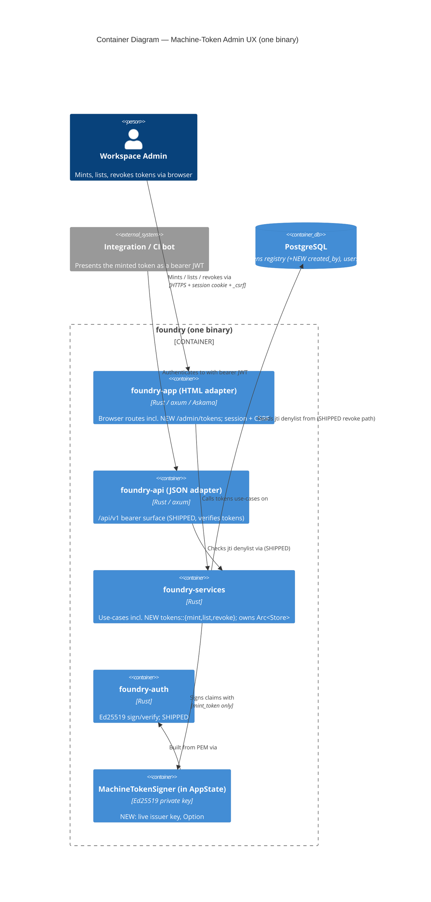
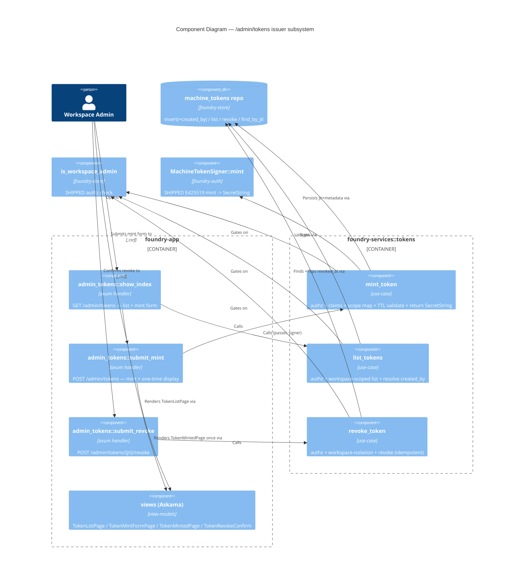

# Machine-Token Admin UX — Architecture

Component decomposition + C4 (Container + Component) + the MANDATORY Reuse Analysis table for the
admin surface that turns Foundry into a token ISSUER. Decisions and ADRs: `wave-decisions.md`.

## What this feature adds (one paragraph)

A workspace admin can **mint**, **list**, and **revoke** machine tokens from the product. The
binary gains a live `MachineTokenSigner` (Ed25519 private key) in `AppState`; new Askama screens
under `/admin/tokens` (browser session + CSRF) drive three new `foundry_services::tokens`
use-cases over the SHIPPED `machine_tokens` repo, `MachineTokenSigner::mint`, the per-request `jti`
denylist, and `is_workspace_admin`. One forward-only migration adds the `created_by` audit column.
**No new crates, no new runtime services.**

## Surface → component map

| Surface (route / action) | Story | Handler (foundry-app, NEW) | Use-case (foundry-services::tokens, NEW) | Reused primitive |
|---|---|---|---|---|
| `GET /admin/tokens` (list + mint form) | US-MT02, US-MT06 | `admin_tokens::show_index` | `list_tokens` | `Store::list_machine_tokens`, `is_workspace_admin` |
| `POST /admin/tokens` (mint) | US-MT01, US-MT04 | `admin_tokens::submit_mint` | `mint_token` | `MachineTokenSigner::mint`, `Store::insert_machine_token` (+`created_by`), `is_workspace_admin` |
| (response) one-time value view | US-MT01 | `admin_tokens` renders `TokenMintedPage` | (return value of `mint_token`) | `SecretString` (drop after render) |
| `POST /admin/tokens/{jti}/revoke` | US-MT03 | `admin_tokens::submit_revoke` | `revoke_token` | `Store::revoke_machine_token`, `Store::find_machine_token_by_jti`, `is_workspace_admin` |
| (next API call refused) | US-MT03 | (none — SHIPPED) | (SHIPPED `auth::resolve_active_token`) | per-request `jti` denylist |
| boot: load signer | US-MT00 | `main.rs` (EXTEND) | — | `from_pkcs8_pem`, `MachineTokenVerifier::self_test` |
| migration | US-MT00 | `0008_machine_tokens_created_by.sql` (NEW) | — | (forward-only per ADR-003) |

Authz (`is_workspace_admin`) is enforced in the **use-case** (DD3), so every entry point inherits
it (US-MT05). The handler ALSO checks before rendering the surface, so a non-admin never sees the
page chrome (defense in depth, mirrors `comments.rs`).

## Component decomposition

- **`foundry-app::admin_tokens`** (NEW driving adapter, HTML): three handlers following
  `projects.rs` verbatim — `signed_in_user` → resolve workspace from session → read
  `state.machine_token_signer` → call `services.{list,mint,revoke}_token(…)` → render Askama
  view-model or map `ServiceError` to a page/fragment. Mounted INSIDE session + CSRF (admin-routes.md).
- **`foundry-app::views`** (EXTEND): new view-models `TokenListPage`, `TokenMintFormPage`,
  `TokenMintedPage` (the one-time display), `TokenRevokeConfirm` + reuse `ErrorFragment`.
- **`AppState.machine_token_signer: Option<Arc<MachineTokenSigner>>`** (NEW field): the issuer
  capability, `None` on verifier-only binaries (signer.md).
- **`foundry_services::tokens`** (NEW use-case module): `mint_token` / `list_tokens` /
  `revoke_token` — authz, claims construction, scope mapping, TTL validation, one-time-secret
  return (token-admin-services.md).
- **`foundry-store`** (EXTEND): `insert_machine_token` gains `created_by`; the rest reused as-is.
  Migration `0008` (data-and-migration.md).
- **`foundry-auth`** (REUSE): mint primitive + claim set + boot self-test, unchanged.

## C4 Level 2 — Container

## C4 Level 3 — Component (the NEW admin issuer subsystem)

## Reuse Analysis (MANDATORY) — 7 EXTEND/REUSE, 5 CREATE NEW

| Capability | Verdict | Evidence (file) |
|---|---|---|
| Ed25519 mint primitive (`from_pkcs8_pem`, `mint`) | **REUSE** | `crates/foundry-auth/src/lib.rs:113,124` |
| Claim set `MachineTokenClaims` | **REUSE** | `crates/foundry-auth/src/lib.rs:66-90` |
| Boot keypair self-test probe (`self_test`) | **EXTEND** (retain signer on pass) | `foundry-auth/src/lib.rs:201`; `foundry-app/src/main.rs:199-216` |
| `machine_tokens` repo | **EXTEND** (`insert` +`created_by`) | `crates/foundry-store/src/lib.rs:1380-1467` |
| Per-request `jti` denylist (revocation effectiveness) | **REUSE** (unchanged) | `crates/foundry-services/src/lib.rs:256` |
| `is_workspace_admin` | **REUSE** | `foundry-store/src/lib.rs:1031`; `comments.rs:107` |
| Web tier (view-models, session, CSRF, base.html, error fragment, render-failure seam) | **EXTEND** | `foundry-app/src/{projects.rs,views.rs,csrf.rs,lib.rs:196-330}` |
| `foundry_services::tokens` use-cases | **CREATE NEW** | beside `board`/`issues`/`comments` |
| Askama admin screens + view-models | **CREATE NEW** | pattern: `projects.rs`/`views.rs` |
| Admin route handlers (`admin_tokens.rs`) | **CREATE NEW** | pattern: `projects.rs` |
| `0008_machine_tokens_created_by.sql` | **CREATE NEW** | pattern: `0006_*.sql` |
| `AppState.machine_token_signer` field | **CREATE NEW** | beside `machine_token_verifier` (`lib.rs:70`) |

## Quality attributes (ISO 25010 highlights)

- **Security** (dominant): one live private key (signer.md threat delta), one-time secret never
  persisted/logged (DD7), admin-only non-enumerable authz (US-MT05), revocation effective next
  request (reused denylist), CSRF + session preserved (NFR-MT-SEC-07), no secret column ever
  (NFR-MT-DATA-02).
- **Reliability**: mint is all-or-nothing render (reuse `force_board_render_failure` seam,
  NFR-MT-REL-01); revoke idempotent (NFR-MT-REL-02); reads workspace-isolated (NFR-MT-REL-03).
- **Maintainability/testability**: use-cases are server-free-testable (the seam); no new crate edge,
  so the existing boundary guard covers it.
- **Performance**: mint = sign + one INSERT + one render; revoke = one UPDATE; ≤200ms p95
  (NFR-MT-PERF-01), no change to the verify path.

## Earned-Trust note (principle 12)

The single external dependency this feature deepens is the **signing key material**. The
wire-then-probe-then-use invariant is ALREADY enforced by `MachineTokenVerifier::self_test`
(foundry-auth:201) at boot (main.rs:199-216): a signing key that does not round-trip with the
configured public key causes `health.startup.refused`. DD1 EXTENDS that path to RETAIN the signer
only after it passes — so the issuer never serves a mint surface backed by a key that cannot
produce verifiable tokens. No new probe is invented; the existing one is the gate. See
`signer.md` §"Earned-Trust posture".
