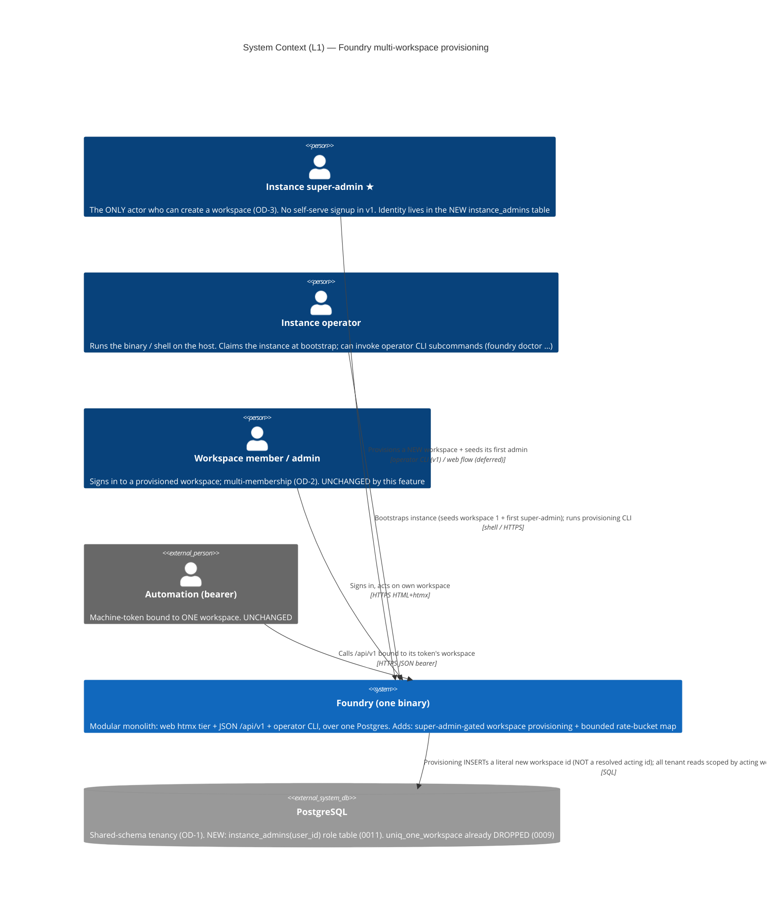
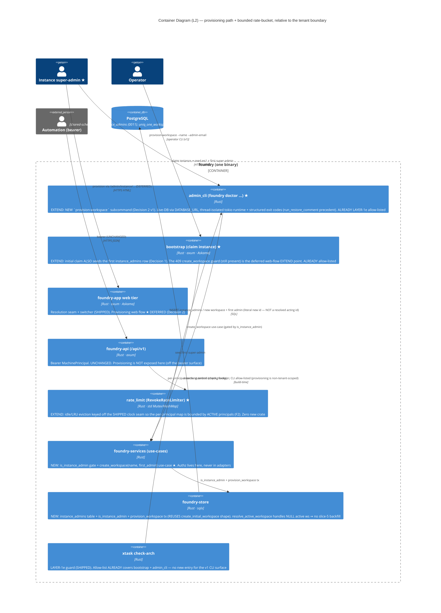
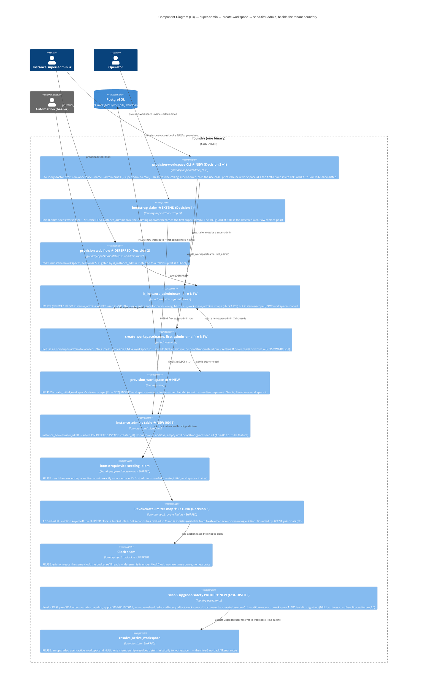

# Multi-Workspace Provisioning — Architecture (DESIGN)

> Morgan (nw-solution-architect), DESIGN wave, application/component scope, **Propose** mode.
> Feature: the deferred slices 5-6 of the shipped `multi-workspace-tenancy` isolation core, now
> their own feature. Three pieces:
> 1. **Slice 5** — prove a REAL pre-feature single-workspace install upgrades forward-only with
>    ZERO data loss; the existing workspace becomes workspace 1; sessions/tokens/sign-in keep
>    resolving. (The `0009` guard-drop already shipped; this is the upgrade-safety PROOF + any
>    backfill needed — DESIGN finding: **none needed**, see §5/ADR-004.)
> 2. **Slice 6a** — an instance super-admin (OD-3, ratified) creates a NEW workspace + seeds its
>    first admin. NO self-serve. FIRMS the deferred parent ADR-004.
> 3. **Slice 6b** — add a std-only LRU/idle eviction policy to the per-principal revoke
>    rate-bucket map (`crates/foundry-app/src/rate_limit.rs`) so it stays bounded under many
>    tenants while preserving throttle correctness (residual F2).
>
> Inherited and respected: the parent's modular monolith + ports-and-adapters, **ZERO new
> crates**, the shipped resolution seam / `ActingWorkspace` / LAYER-1e guard, the
> `attachments.rs` non-enumerable idiom, the bootstrap seeding transaction, the shipped clock
> seam. Ratified inputs designed-to: OD-1 shared-schema+`workspace_id`, OD-2 multi-membership,
> **OD-3 instance super-admin only**, OD-4 forward-only-no-data-touch, OD-5 whole-instance backup.

## 0. Grounding findings (read the shipped code, not assumed)

| Finding | Source | Consequence for this design |
|---|---|---|
| The single-workspace DB index is GONE | `migrations/0009_multi_workspace.sql:12` (`DROP INDEX IF EXISTS uniq_one_workspace`) | A second `workspaces` row is already insertable. Provisioning is now purely an authz + seeding concern, not a schema change. |
| The **application-level 409 guard is STILL PRESENT** | `bootstrap.rs:301-333` `create_workspace` returns 409 for any second workspace via `workspace_count()` | The evolution doc's "removes the application 409 guard" was aspirational — the handler still hard-409s. **This is the EXTEND/replace point** (Reuse #6). |
| `resolve_active_workspace` already handles a NULL active workspace | `lib.rs:419-436` — `ORDER BY (w.id = u.active_workspace_id) DESC, w.id`; single membership auto-resolves; zero ⇒ `None` (fail-closed) | **Slice 5 needs NO backfill migration**: an upgraded user with `active_workspace_id IS NULL` and one membership resolves deterministically to workspace 1. NULL-resolves-fine. |
| `create_initial_workspace` is one atomic tx seeding ws+user+membership(admin)+team+project | `lib.rs:307-377` | The provisioning use-case REUSES this transaction shape (Reuse #5); the new tenant gets the same seeded scaffold as workspace 1. |
| The LAYER-1e allow-list **already exempts `bootstrap` and `admin_cli`** | `check_arch.rs:387-396` (`is_tenant_scoping_allowlisted`) | If provisioning lands in `bootstrap.rs` or `admin_cli.rs`, **no new allow-list entry is needed**. A NEW file (e.g. `instance_admin.rs`) WOULD need one. This drives Decision 2 toward the existing files. |
| `admin_cli.rs` is the operator-CLI home (`foundry doctor …`) with a live-DB sqlx pattern | `admin_cli.rs:235-371` `run_restore_comment` (thread-isolated tokio runtime, `DATABASE_URL`, structured exit codes) | A `foundry doctor provision-workspace` subcommand has a complete, allow-listed precedent — the smallest provisioning attack surface. Drives Decision 1+2. |
| `instance_admins` does NOT exist; only per-workspace `admin`/`member` | `0001_init.sql:26-32` `workspace_memberships.role CHECK (role IN ('admin','member'))` | The instance super-admin role is genuinely CREATE NEW (Reuse #7). |
| The rate-bucket map is `Mutex<HashMap<Uuid,BucketState>>`, no eviction, 100%-mutation-hardened | `rate_limit.rs:106` + the module's own residual note (lines 30-47) | Eviction is an EXTEND of a hardened module (Reuse #8); the module ITSELF documents the behaviour-preserving eviction rule: "a bucket idle longer than `C/R` seconds has fully refilled to `C` and is indistinguishable from a fresh one." Drives Decision 5. |

## 1. System context (C4 L1) — MANDATORY

The provisioning actor (instance super-admin) is the only NEW actor relative to the shipped
milestone. Everything inside the boundary is the one binary; PostgreSQL is the one store.

## 2. Container (C4 L2) — MANDATORY

The provisioning path is deliberately a **non-tenant-scoped** action: creating workspace B does
not act *within* any acting workspace, so it sits beside (not inside) the resolution seam and is
allow-listed off the LAYER-1e guard. The recommended v1 surface is the operator CLI
(`admin_cli.rs`), already allow-listed; the web flow is deferred. Authz (`is_instance_admin`)
lives in `foundry-services`/`foundry-store`, never in an adapter — the dependency-direction guard
holds.

## 3. Component (C4 L3) — the provisioning path + the bounded rate-bucket — MANDATORY

New/changed components starred (★). The provisioning path converges on ONE use-case
(`create_workspace`) gated by ONE authz function (`is_instance_admin`), which reuses the shipped
atomic seeding transaction. The path sits OUTSIDE the per-request acting-workspace resolution
seam (it creates a workspace rather than acting within one).

## 4. Reuse Analysis table — MANDATORY (default EXTEND)

Default is EXTEND/REUSE; every CREATE NEW carries evidence that no existing component can be
extended.

| # | Existing component | File | Overlap | Decision | Justification |
|---|---|---|---|---|---|
| 1 | `create_workspace` 409 guard (still present) | `foundry-app/src/bootstrap.rs:301-333` | Workspace provisioning call-site | **EXTEND (v1 = gate via CLI; replace 409 in deferred web flow)** | The 409 is the literal existing provisioning handler. v1 provisions via the CLI; the web `create_workspace` 409 is replaced (gated by `is_instance_admin`) only when the deferred web flow lands. Extending the existing call-site is correct — it IS the provisioning seam. |
| 2 | `create_initial_workspace` atomic seeding tx | `foundry-store/src/lib.rs:307-377` | Atomic ws+user+admin-membership+team+project insert | **REUSE (as the shape) / EXTEND** | The new `provision_workspace` tx mirrors this exact transaction (workspace + first admin + seeded team/project). A near-clone with a parameterised "seed-via-invite-or-direct" choice; no new seeding mechanism. |
| 3 | Bootstrap-token / invite seeding idiom | `foundry-app/src/bootstrap.rs:234-297`, `invites` table (`0001_init.sql:93`) | Seed a workspace's first admin | **REUSE** | The new tenant's first admin is seeded by the SAME idiom that seeds workspace 1's first admin (invite link, or direct user creation). No new mechanism. |
| 4 | `is_workspace_admin(workspace_id, user_id)` | `foundry-store/src/lib.rs:1128` | Role-membership authz via `EXISTS (SELECT 1 …)` | **REUSE (as the shape for is_instance_admin)** | `is_instance_admin(user_id)` mirrors this `EXISTS` shape exactly, but instance-scoped (no workspace arg). Same idiom, new table. |
| 5 | `admin_cli.rs` operator-CLI home + live-DB sqlx pattern | `foundry-app/src/admin_cli.rs:235-371` (`run_restore_comment`) | Operator subcommand: parse args → live DB via `DATABASE_URL` → structured exit codes (thread-isolated tokio runtime) | **EXTEND** | The `provision-workspace` subcommand reuses the entire `run_restore_comment` scaffold (UUID/arg parse, `Store::connect`, thread-isolated runtime, exit-code contract). ALREADY LAYER-1e allow-listed — zero new guard entry. The smallest provisioning attack surface. |
| 6 | LAYER-1e allow-list (`is_tenant_scoping_allowlisted`) | `xtask/src/check_arch.rs:387-396` | Build-time tenant-scoping guard exemption | **REUSE (no change for v1)** | `bootstrap` AND `admin_cli` are ALREADY allow-listed. Provisioning a workspace is legitimately non-tenant-scoped (literal new id, not a resolved acting id), so the v1 CLI surface needs **no new allow-list entry**. A NEW provisioning file would. |
| 7 | `resolve_active_workspace` | `foundry-store/src/lib.rs:419-436` | Resolve an upgraded user's workspace post-migration | **REUSE** | An upgraded user (`active_workspace_id IS NULL`, exactly one membership) resolves deterministically to workspace 1. This is precisely why **slice 5 needs NO backfill migration** — NULL resolves fine. |
| 8 | `RevokeRateLimiter` map | `foundry-app/src/rate_limit.rs:106` | Bounded per-tenant in-memory resource | **EXTEND** | Add idle/LRU eviction so the map is bounded by ACTIVE principals (F2). Keep `user_id` key + token-bucket semantics + the 100%-mutation tests. The module ITSELF documents the behaviour-preserving rule (idle > `C/R` ⇒ refilled to `C` ⇒ indistinguishable from fresh). A new module would discard a hardened one — extension is mandatory. |
| 9 | The shipped clock seam | `foundry-app/src/clock.rs` (read via `ClockedRevokeGuard`) | Deterministic time for eviction | **REUSE** | Eviction reads the SAME clock the refill reads — deterministic under `MockClock`, no new time source, no new crate. |
| 10 | `instance_admins` role / `is_instance_admin` | — (does not exist; `0001_init.sql:29` only has per-workspace `admin`/`member`) | Instance-level provisioning authority | **CREATE NEW** | No instance-level role exists today. OD-3 ratified a NEW role above workspace-admin. Minimal: one table (`0011`) + one `EXISTS`-shaped authz function. No existing component to extend (FIRMS parent ADR-004). |
| 11 | Forward-only migration `0011_instance_admins.sql` | — (new migration file; latest is `0010`) | Schema change (the role table) | **CREATE NEW** | A migration is by definition a new forward-only file (ADR-003 / parent ADR-006). It edits no prior migration; adds one table; no data rewrite. (FIRMS the migration half of parent ADR-006 + this feature's ADR-003.) |

**Verdict counts: REUSE/EXTEND = 9** (5 REUSE: #2-as-shape*, #3, #4-as-shape, #6, #7, #9 — and
4 EXTEND: #1, #2, #5, #8). **CREATE NEW = 2** (#10 the instance-admin role+function, #11 the
`0011` migration file — both genuinely have no existing component to extend). The feature is
overwhelmingly inheritance: provisioning reuses the bootstrap seeding tx + the operator-CLI
scaffold + the authz idiom; eviction extends a hardened module over the shipped clock; slice 5 is
a PROOF over already-shipped resolution with **no backfill**. The genuinely-new surface is the
super-admin role table + its authz function and the `0011` migration that creates it.

## 5. The five central decisions (one line each; full ADRs in `adr-00{1..5}-*.md`)

| # | Decision | Recommended | ADR |
|---|---|---|---|
| 1 | How the FIRST super-admin comes to exist | **Bootstrap claim seeds workspace 1 AND the first `instance_admins` row** — the operator who claims the instance becomes the first super-admin (reuses the one "claim the instance" entry; the seeded admin == the seeded super-admin in v1). A `--grant-super-admin` CLI exists for later promotion | ADR-001 |
| 2 | Provisioning surface | **CLI-first for v1**: `foundry doctor provision-workspace …` (smallest attack surface, off the bearer surface, ALREADY LAYER-1e allow-listed, reuses `run_restore_comment` scaffold). Web `/admin/instance/…` flow DEFERRED | ADR-002 |
| 3 | `instance_admins` schema + `is_instance_admin` seam | **NEW `instance_admins(user_id PK)` table + `is_instance_admin(user_id)` authz in services/store** (mirrors `is_workspace_admin`'s `EXISTS` shape). Provisioning is non-tenant-scoped ⇒ stays OFF the LAYER-1e guard via the existing `admin_cli`/`bootstrap` allow-list (no new entry for v1) | ADR-003 |
| 4 | Migration-guarantee approach (slice 5) | **A real-snapshot upgrade-safety PROOF** (seed pre-0009 schema+data, apply 0009/0010/0011, assert row-level before/after equality + ws id unchanged + carried session/token still resolves to workspace 1). **NO backfill migration** — `resolve_active_workspace` already maps NULL active ws + sole membership ⇒ workspace 1 | ADR-004 |
| 5 | Rate-bucket eviction (F2) | **std-only idle eviction keyed off the shipped clock**: on each `consume`, opportunistically evict buckets whose `last_refill` is older than the idle window (`= C/R` seconds, the refill-to-full horizon ⇒ behaviour-preserving), with an LRU size-cap fallback. NO new crate (`lru`/`dashmap` forbidden) | ADR-005 |

## 6. Quality attributes (ISO 25010)

- **Security** (defining): provisioning is super-admin-gated (`is_instance_admin`, fail-closed —
  a non-super-admin is refused, NFR-MWT-REL-01 / parent NFR-MWT-SEC-04); it is kept OFF the
  bearer `/api/v1` surface (no mint-like creation on the bearer path); creating B never reads or
  writes A; the migration touches NO existing row (forward-only, ADR-004). The new role is the
  minimal additive surface (one table + one `EXISTS`).
- **Reliability**: slice-5 PROOF gives an *empirical* upgrade-safety guarantee against a REAL
  pre-feature snapshot (Earned Trust — the migration contract is probed, not assumed); the green
  acceptance suite stays green (single-workspace = one-membership special case).
- **Performance / resource-bounding**: the rate-bucket map becomes bounded by ACTIVE principals
  under many tenants (NFR-MWT-PERF-01); eviction is behaviour-preserving (idle > `C/R` ⇒ already
  refilled to `C`), so throttle correctness for active principals is unchanged (NFR-MWT-PERF-02).
- **Maintainability**: every new rule is enforced (the LAYER-1e guard already covers the v1
  surface; the eviction preserves the 100%-mutation test discipline). Zero new crates keeps the
  dependency surface flat.
- **Testability**: provisioning is a use-case the CLI drives (testable through the driving port);
  the eviction is a pure-arithmetic extension of a module with a 100%-mutation harness; the
  slice-5 proof is a real-snapshot acceptance test (real DB, real before/after).

## 7. Architecture enforcement

Style: **Modular monolith + ports-and-adapters** (in force). Language: **Rust**.
Tool: **`cargo xtask check-arch`** (the project's own AST + cargo-deny guard).

Rules to enforce:
- Existing (must stay green): api≠HTML, api≠ad-hoc-authz, api≠mint, JWT alg pinned to `[EdDSA]`,
  dependency direction (adapter → services → store), and the SHIPPED LAYER-1e tenant-scoping rule.
- **This feature adds NO new check-arch rule for v1**: provisioning lands in `admin_cli.rs`
  (and the first-super-admin seed in `bootstrap.rs`), both ALREADY on the LAYER-1e allow-list
  (`check_arch.rs:387-396`) because a workspace-creating action is legitimately non-tenant-scoped
  (it handles a *literal new* workspace id, not a resolved acting id). **If the deferred web flow
  later lands in a NEW file, that file MUST be added to `is_tenant_scoping_allowlisted`** —
  flagged in ADR-003.
- `is_instance_admin` authz MUST live in `foundry-services`/`foundry-store`, never in an adapter
  (the dependency-direction guard already enforces this).

## 8. External integrations

**None.** No third-party API, webhook, or OAuth provider. Provisioning is an internal operator
action; the rate-bucket is in-process. No consumer-driven contract tests are owed to
platform-architect for this feature.

## 9. Constraints honored

ONE binary · ONE Postgres · NO Redis · NO Node runtime · NO CDN · **ZERO new crates** (eviction
uses `std` + the shipped clock, NOT `lru`/`dashmap`). foundry-api stays HTML-free and off
`foundry_store::Store`; provisioning is NOT exposed on the bearer surface. The browser
auth/CSRF/session contract and the machine-token verify path are byte-for-byte unchanged. The
migration is forward-only and rewrites no row. The `foundry-acceptance` suite green-before stays
green-after.
</content>
</invoke>
