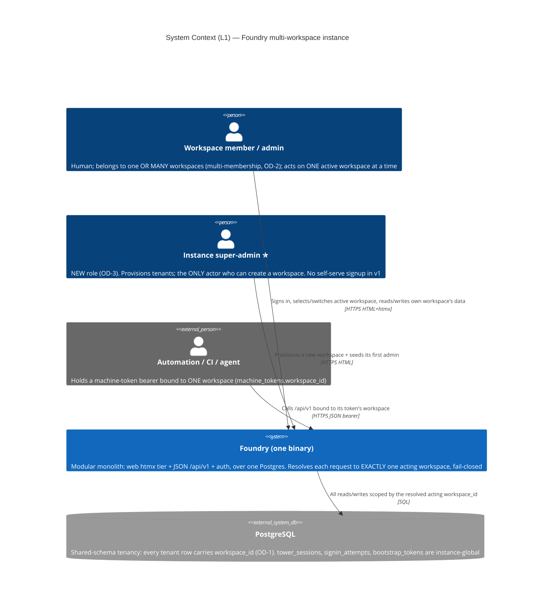
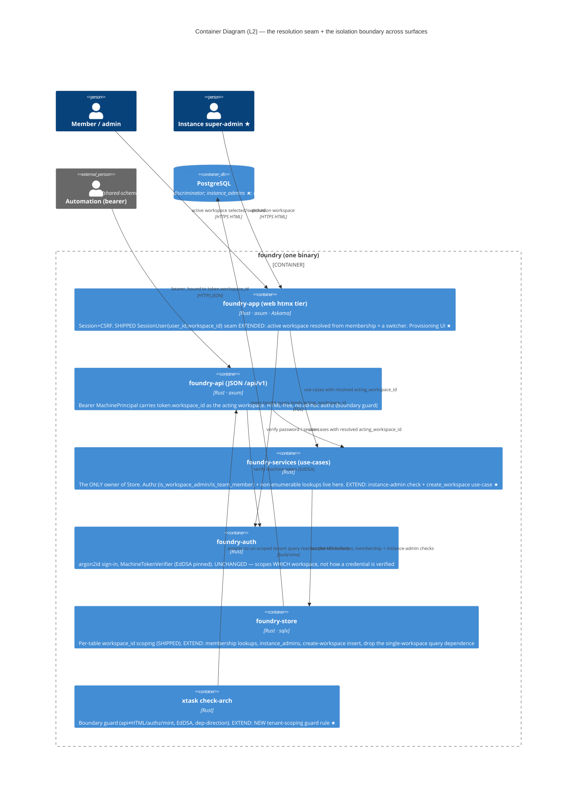
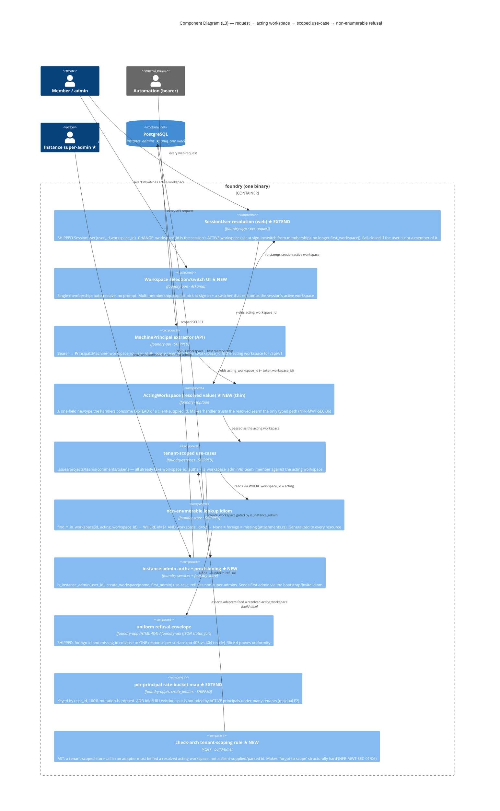

# Multi-Workspace Tenancy — Architecture (DESIGN)

> Morgan (nw-solution-architect), DESIGN wave, application/component scope, **Propose** mode.
> Feature: make Foundry's tenancy REAL — multiple `workspaces` rows coexist in one instance with
> genuine per-tenant data isolation across every surface (web htmx tier · JSON `/api/v1` ·
> machine-token auth · sign-in/sessions). Today exactly ONE workspace can exist
> (`uniq_one_workspace`, `0001_init.sql:15`) AND a hard-coded application guard (`bootstrap.rs`
> `create_workspace` → 409) forbids a second. The schema is ALREADY multi-tenant-shaped: every
> tenant table FKs to `workspaces(id)`, every read binds `workspace_id`, the non-enumerable lookup
> idiom is shipped (`attachments.rs`), and the **resolution seam already exists** — at sign-in
> `SessionUser { user_id, workspace_id }` is written to the session and read per-request.
>
> This feature is therefore **overwhelmingly EXTEND, not CREATE NEW**: it removes two guards,
> generalizes the resolution seam from "the sole workspace" to "the membership-resolved active
> workspace", and proves the boundary with real A/B fixtures. Style: the modular monolith +
> ports-and-adapters already in force; this feature adds ZERO new crates.
>
> Ratified DISCUSS inputs designed-to: OD-1 shared-schema + `workspace_id`; OD-2 multi-membership;
> OD-3 instance super-admin only; OD-4 forward-only, no data touch; OD-5 whole-instance backup v1.

## 1. System context (C4 L1) — MANDATORY

The actors and the one external trust boundary (machine-token bearers). The instance super-admin
is a NEW actor introduced by this feature (OD-3). Everything inside the boundary is ONE binary.

## 2. Container (C4 L2) — MANDATORY

The three driving adapters (web, API, the existing extractors) reach `foundry-store` ONLY through
`foundry-services` (the cargo-deny dependency-direction guard, LAYER 2, holds). The **resolution
seam** (★ EXTEND) is the spine: it is where each request becomes exactly one `acting_workspace_id`.

## 3. Component (C4 L3) — the resolution seam + isolation boundary — MANDATORY

New/changed components are starred (★). Everything else is SHIPPED and reused. The seam yields
EXACTLY one `acting_workspace_id` per request, fail-closed; both the web and API legs converge on
the SAME shipped, workspace-scoped use-cases and the SAME non-enumerable refusal envelope.

## 4. Reuse Analysis table — MANDATORY (default EXTEND)

Per the brief's required overlaps plus everything DESIGN touches. Default is EXTEND; every
CREATE NEW carries evidence that extension is impossible or would force an un-scoped path.

| # | Existing component | File | Overlap | Decision | Justification |
|---|---|---|---|---|---|
| 1 | Per-table `workspace_id` store scoping | `foundry-store/src/lib.rs` (issues/projects/teams/comments) | Tenant-scoped reads/writes | **REUSE (as-is)** | Every tenant query already binds `workspace_id`; the feature feeds them the *resolved* workspace instead of the sole one. Zero query rewrite for the scoped paths. |
| 2 | `find_attachment_in_workspace(id, requester_workspace_id)` non-enumerable idiom | `foundry-store/src/attachments.rs:110` | `WHERE id=$1 AND workspace_id=$2` → None ≡ foreign ≡ missing | **REUSE + GENERALIZE** | The canonical isolation pattern. Generalized as the uniform refusal contract every resource lookup adopts (Slice 4). No new mechanism — a naming/coverage discipline. |
| 3 | `is_workspace_admin(workspace_id, user_id)` | `foundry-store/src/lib.rs:1051` | Per-tenant admin authz | **REUSE (as-is)** | Already parameterized by workspace; evaluated against the *acting* workspace. An A-admin reaching B fails because they are not a member-admin of B. |
| 4 | `is_team_member(team_id, user_id)` | `foundry-store/src/lib.rs:556` | Per-team membership authz | **REUSE (as-is)** | Team is already workspace-owned; membership cannot cross tenants. No change. |
| 5 | `MachinePrincipal` extractor + `Principal::Machine{ workspace_id }` | `foundry-api/src/lib.rs:496,583` | API request → acting workspace | **REUSE (as-is)** | `token.workspace_id` is ALREADY the authoritative acting workspace for `/api/v1`. The API resolution seam is shipped; the feature only proves it refuses cross-tenant calls (Slice 3). |
| 6 | `SessionUser{ user_id, workspace_id }` + the per-request session→user→workspace resolution | `foundry-app/src/signin.rs:140`, `session.rs` | **The web resolution seam** | **EXTEND** | Already a session-carried active-workspace claim. CHANGE: `workspace_id` comes from membership selection (not `first_workspace()`), and resolution fail-closes if the user is no longer a member. ~Localized change at one seam — extending is strictly cheaper and safer than a new seam. |
| 7 | `first_workspace()` (`SELECT … FROM workspaces LIMIT 1`) | `foundry-store/src/lib.rs:389` | Resolves "the" workspace at sign-in | **EXTEND → membership lookup** | This is the single query that depends on "there is one workspace." Replace its call-site with a membership-driven resolution (`memberships_for_user`). The function may stay for the migration default (one membership) but is no longer the resolution authority. |
| 8 | `create_workspace` handler (hard-coded 409 single-workspace guard) | `foundry-app/src/bootstrap.rs:289` | Workspace provisioning | **EXTEND (remove guard) + gate** | **An application-level second guard beyond the DB index** (see upstream-changes.md). Replace the 409 with the real provisioning flow gated by `is_instance_admin` (OD-3). Extending the existing handler is correct; it is already the provisioning call-site. |
| 9 | Bootstrap-token / invite seeding idiom | `foundry-app/src/bootstrap.rs`, `invites` table | Seed a workspace's first admin | **REUSE** | New-tenant provisioning seeds its first admin via the same idiom that seeds workspace 1's first admin. No new seeding mechanism. |
| 10 | `tower_sessions` Postgres store + 30-day cookie + double-submit CSRF | `foundry-app/src/session.rs`, `csrf.rs` | Session machinery | **REUSE (as-is)** | Session stays thin (`user_id` + active `workspace_id`); switching re-stamps the active workspace. Auth/CSRF contract unchanged. |
| 11 | argon2id sign-in + brute-force delay + non-enumerable sign-in error | `foundry-app/src/signin.rs`, `foundry-auth` | Sign-in security contract | **REUSE (as-is)** | Resolution is added AFTER verification; the security contract is untouched (NFR-MWT-DATA-02). |
| 12 | `foundry_services::tokens::{list_tokens, revoke_token}` | `foundry-services/src/tokens.rs` | Workspace-scoped token list/revoke + non-enumerable NotFound | **REUSE (as-is)** | Already workspace-scoped + 100%-mutation-hardened; a foreign jti is already non-enumerable. Slice 3 proves it across a real second tenant. |
| 13 | Per-principal rate-bucket `HashMap` (revoke-storm guardrail) | `foundry-app/src/rate_limit.rs` | Bounded per-tenant in-memory resource | **EXTEND** | Add idle/LRU eviction so the map is bounded by ACTIVE principals, not historical (residual F2). Keep `user_id` key + throttle semantics; mirror the shipped 100%-mutation tests. New module would discard a hardened one — extension is mandatory. |
| 14 | `check-arch` boundary guard | `xtask/src/check_arch.rs` | Architectural enforcement | **EXTEND (new LAYER-1e rule)** | Add a tenant-scoping AST rule (see ADR-002). The crate, the AST-walk infrastructure (`rust_sources`/`strip_comment`/per-line NAMING), and the gold-test discipline already exist; the new rule is one detector + one gold test, mirroring the shipped no-mint rule. |
| 15 | `instance_admins` role / `is_instance_admin` | — (does not exist) | Instance-level provisioning authority | **CREATE NEW** | No instance-level role exists today (only per-workspace `admin`/`member`). OD-3 ratified a NEW role above workspace-admin. Minimal: one table + one authz function (see ADR-004). No existing component to extend. |
| 16 | Forward-only migration `0002_*` (drop `uniq_one_workspace`) | — (new migration file) | Schema change | **CREATE NEW** | A migration is by definition a new forward-only file (ADR-003 discipline); it edits no prior migration. Drops one index + creates `instance_admins`. No data rewrite (see ADR-006). |

**Verdict counts: REUSE/EXTEND = 14** (8 reuse-as-is: #1,#3,#4,#5,#9*,#10,#11,#12 — #9 reuse; 6 extend:
#2 generalize, #6,#7,#8,#13,#14) · **CREATE NEW = 2** (#15 the instance-admin role, #16 the
migration file — both genuinely have no existing component to extend). The feature is
overwhelmingly inheritance: the schema, the scoping, the non-enumerable idiom, the authz, the API
resolution seam, and even the WEB resolution seam (a session-carried workspace claim) all already
ship. The genuinely-new surface is the instance-admin role, the migration, the switcher UI, and
the two enforcement/eviction extensions.

## 5. The six central decisions (one line each; full ADRs in `adr-00{1..6}-*.md`)

| # | Decision | Recommended | ADR |
|---|---|---|---|
| 1 | Request→workspace resolution | **Hybrid: session-carried active workspace (web) + token.workspace_id claim (API)** — EXTEND the shipped `SessionUser` seam; never trust a client-supplied workspace id; fail-closed | ADR-001 |
| 2 | Isolation enforcement seam | **Scoped use-cases fed a resolved `ActingWorkspace` newtype + a NEW check-arch tenant-scoping AST rule** | ADR-002 |
| 3 | Non-enumerability contract | **Generalize `find_*_in_workspace` → None; per surface ONE refusal (web 404 page / API existing JSON 404 envelope); no 403-vs-404 oracle** | ADR-003 |
| 4 | Instance super-admin role | **NEW `instance_admins` table + `is_instance_admin`; provisioning via an `/admin/instance/...` web flow; bootstrap seeds workspace 1 + first super-admin** | ADR-004 |
| 5 | Multi-membership sign-in + selection | **Single-membership auto-resolves; multi-membership picks at sign-in + a switcher; session carries the active workspace; no resolvable workspace ⇒ refuse** | ADR-005 |
| 6 | Forward-only migration | **`0002` drops `uniq_one_workspace`, creates `instance_admins`; existing workspace stays workspace 1, id unchanged, no data rewrite; pre-drop un-scoped-query audit** | ADR-006 |

## 6. Quality attributes (ISO 25010)

- **Security** (the defining attribute): tenant isolation is fail-closed (ADR-001/002), uniform
  non-enumerable refusal (ADR-003, NFR-MWT-SEC-02), per-tenant authority cannot cross tenants
  (#3/#4, NFR-MWT-SEC-04), the machine-token binding is the acting workspace (#5, NFR-MWT-SEC-05),
  resolution happens at one auditable seam structurally enforced by a NEW guard (ADR-002,
  NFR-MWT-SEC-06). The new attack surface — provisioning — is super-admin-gated (ADR-004).
- **Reliability**: forward-only, no-rewrite migration (ADR-006); the green acceptance suite stays
  green (single-workspace is the one-membership special case of multi-workspace).
- **Performance**: resolution is a session read (web) or a claim read (API) — no material per-request
  cost (NFR-MWT-PERF-02); the rate-bucket map is bounded under many tenants (#13, NFR-MWT-PERF-01).
- **Maintainability**: every architectural rule is enforced (boundary guard + the new tenant-scoping
  guard, Principle 11); the non-enumerable idiom is one pattern reused everywhere.
- **Testability**: real two-workspace (A/B) fixtures replace synthetic uuids (#12/US-MWT08); the
  resolution seam is a value the use-cases consume, so isolation is testable through the driving
  ports.

## 7. Architecture enforcement

Style: **Modular monolith + ports-and-adapters** (in force). Language: **Rust**.
Tool: **`cargo xtask check-arch`** (the project's own AST + cargo-deny guard) — EXTENDED.

Rules to enforce:
- Existing (must stay green): api≠HTML, api≠ad-hoc-authz, api≠mint, JWT alg pinned to `[EdDSA]`,
  dependency direction (adapter → services → store only).
- **NEW (ADR-002, proposed)**: a tenant-scoped store call reached from a driving adapter must be
  fed a *resolved acting workspace*, never a client-supplied or path-parsed workspace id — the
  "forgot to scope / trusted the client" footgun becomes a build-time failure.

## 8. External integrations

**None.** No third-party API, webhook, or OAuth provider. The `/api/v1` surface is *consumed by*
external machine clients over the SHIPPED bearer contract; it consumes no external service. No
consumer-driven contract tests are owed to platform-architect for this feature.

## 9. Constraints honored

ONE binary · ONE Postgres · NO Redis · NO Node runtime · NO CDN · **ZERO new crates**. foundry-api
stays HTML-free and off `foundry_store::Store`. The browser auth/CSRF/session contract and the
machine-token verify path (EdDSA, `jti` denylist, `iss`/`aud`) are byte-for-byte unchanged —
this feature scopes WHICH workspace a principal acts on, not how a credential is verified. The
`foundry-acceptance` suite green-before stays green-after (one-workspace = one-membership special
case).
