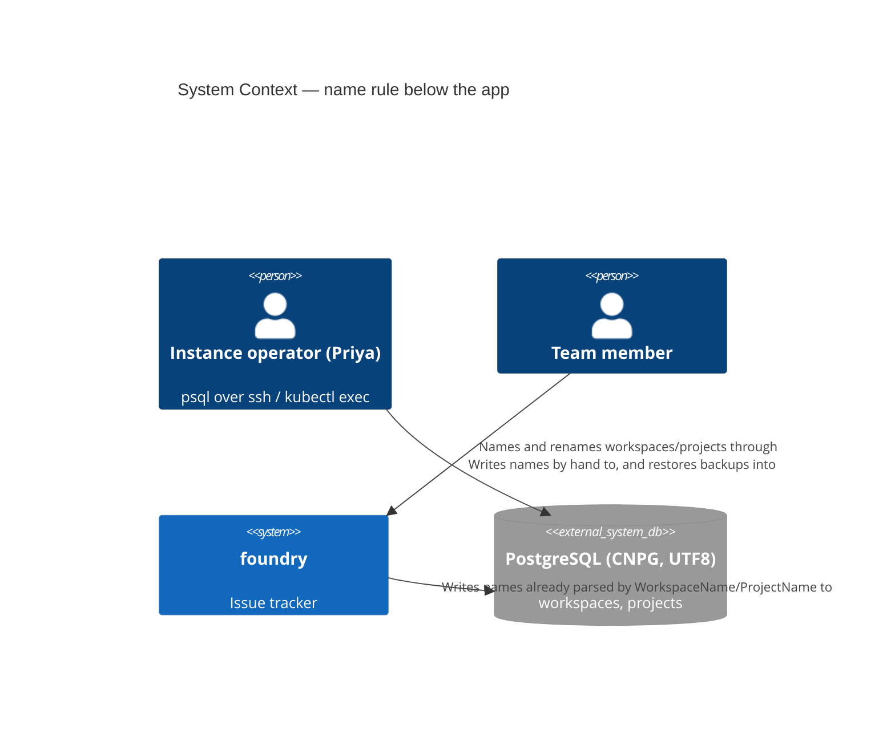
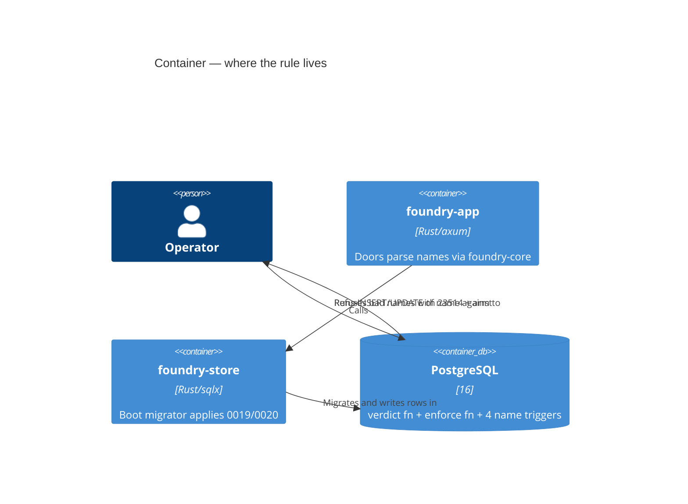

<!-- markdownlint-disable MD024 -->
# Feature Delta: name-db-checks

The database enforces the pure workspace-name and project-name rules that every
app door already enforces, for new name writes only. A hand-typed `psql` UPDATE,
a script or a hand-made restore can no longer give a workspace or project a name
the app would refuse. Names stored before the change are left alone and keep
working. This is "follow-up D" from instance-admin-workspace-rename (D10),
instance-workspace-name-rule (D11) and project-name-rule (D12, Out of Scope).

## Wave: DISCUSS

Product owner: Luna (nw-product-owner) | Date: 2026-10-08 | Feature type: backend
/ data integrity, user-protecting (Decision 1) | Walking skeleton: none
(Decision 2) | UX depth: lightweight (Decision 3) | JTBD: yes, new sibling job
(Decision 4) | Density: lean, Tier-1 [REF] only.

### [REF] Prior Wave Consultation

| Artifact | Status | Note |
|---|---|---|
| `docs/product/jobs.yaml` | ✓ | `job-instance-workspace-naming` and `job-project-naming` are the nearest. A sibling `job-name-rule-below-the-app` is appended (see JTBD). |
| `docs/product/personas/persona-instance-operator.yaml` | ✓ | Priya Raman reused. Her characteristic "comfortable in a terminal" and the rename jobs' "psql habit" ground the actor. `also_referenced_by` and `pains_addressed_to_date` extended. |
| `docs/product/architecture/brief.md` ("Names are labels; slugs are identity") | ✓ | It states one rule per object at the app doors. DELIVER adds one sentence: the pure arms are also enforced by the database for new writes (DoD 9). |
| `docs/product/outcomes/registry.yaml` (OUT-17, OUT-18, OUT-19) | ✓ | OUT-18 and OUT-19 pin the app rules. The DB rule must equal their pure arms (D3). The new OUT row at DISTILL carries `related: [OUT-18, OUT-19]`. OUT-17 is untouched. |
| `docs/feature/instance-admin-workspace-rename/feature-delta.md` (D10, options C/D, Out of Scope) | ✓ | Option D: "`CHECK (char_length(btrim(name)) BETWEEN 1 AND 24) NOT VALID` … safe only after B". B shipped in v0.10.0. That sketch is refined here: `btrim` trims spaces only, and the set has grown (D2, D3). |
| `docs/feature/instance-workspace-name-rule/feature-delta.md` (D4, D6, D11, Out of Scope, write-path inventory) | ✓ | D4 set, D6 legacy no-op, D11 ("no DB CHECK, follow-up D") carried. Its inventory listed `pg_restore`, fixtures and `psql` as the remaining bypasses. This feature closes `psql` and keeps the other two working on purpose. |
| `docs/feature/project-name-rule/feature-delta.md` (D3, D8, D12, D16, Out of Scope) | ✓ | D12 ("no DB CHECK … fixtures must still seed legacy names") and D16 (legacy `slug = ''` left alone) bind the fixture decision (D8 here). |
| `adr-workspace-name-001` / `-002` | ✓ | 001: "Neutral: the store remains able to write any name. Until follow-up D …". Amended at DELIVER. 002: bootstrap-only; its seeded constants pass the rule. |
| `adr-project-name-001` / `-002` | ✓ | 001 item 8: "Store unchanged … no DB CHECK; no migration". Its consequence ("the guarantee is every production door, not every row") is narrowed here to "every new row". Amended at DELIVER. 002 is about slug minting, untouched. |
| `docs/evolution/2026-10-06-instance-workspace-name-rule.md`, `2026-10-07-project-name-rule.md` | ✓ | Both list follow-up D as open. Neither records a dogfood count of legacy names, so the production baseline is **unknown** (OQ-3). |
| `crates/foundry-store/migrations/0001_init.sql` (tables), `0018_workspace_rename_events.sql` (latest) | ✓ | `workspaces.name` and `projects.name` are `TEXT NOT NULL` with no CHECK. 0018 says "no CHECK on `workspaces.name` (D10)". The next migration is 0019. |
| `crates/foundry-core/src/name_chars.rs` | ✓ | `is_refused_name_char`: `char::is_control` (Cc) or U+202A-202E, U+2066-2069, U+2028, U+2029. The rules trim with `str::trim` and count `chars()`. |
| `docs/product/vision.md`, `docs/project-brief.md`, `docs/stakeholders.yaml`, `docs/product/journeys/` | ⊘ | Do not exist (same as the precedents). No journey created (lightweight). |
| DISCOVER / DIVERGE artifacts | ⊘ | None. Grounded in code reading and the recorded follow-up. This is a recorded risk, as in the precedents. |

No contradiction with prior evidence. One prior sketch is refined (Changed
Assumptions). One prior consequence is narrowed: the ADRs' "every door, not every
row" becomes "every door and every new row".

### [REF] Write and UPDATE inventory (code-grounded)

**Production writes of the name** (`crates/foundry-store/src/lib.rs`):
workspaces: UPDATE :1438 (rename), INSERTs in `provision_workspace` and
`seed_initial_workspace`. projects: UPDATE :4149 (rename), INSERTs in
`insert_project` and `seed_initial_workspace`. Since v0.10.0 and v0.11.0, every
one of them gets a value that has already passed `WorkspaceName` or `ProjectName`,
or is the bootstrap constant ("Sandbox"), which passes. `create_initial_workspace` is
test-support only (check-arch `workspace-name-one-source`).

**Every production UPDATE of these tables, any column** (risk 2):

| Table | Site | Columns written | Runs when | Legacy-row hazard under a row-level CHECK |
|---|---|---|---|---|
| workspaces | `lib.rs:1438` | `name` | effective rename only. The no-op writes nothing. | None. The new name has passed the rule. |
| projects | `lib.rs:4149` | `name` | effective rename only | None. |
| projects | `lib.rs:1746` (`insert_issue_attempt`) | `next_issue_number` | **every new issue** | **Show-stopper.** Postgres checks a CHECK against the new row version on every UPDATE, whichever columns changed. NOT VALID only skips the scan at ADD time. A legacy project named "Homelab\tOps" would refuse every new issue with 23514, and the user would see a 500. |

No `ON CONFLICT … DO UPDATE`, and no FK `ON UPDATE` action, targets either table.
**Test-side UPDATEs** of `projects.next_issue_number` (fixtures, all on fixture
projects): `feature_mwt_slice_01_coexist.rs:351`, `us_08_file_issue.rs:162`,
`feature_instance_admin_project_rename.rs:446`, `keyboard_shortcut_bindings.rs:591`,
`:2781`, `us_03_backup_restore.rs:856`, `feature_board_lane_management.rs:360`. Plus
one test-side `workspaces` name UPDATE: `crates/foundry-store/tests/workspace_rename_with_audit.rs:406`
("Kitchen", valid).

**Restore and import** (risk 3): whole-instance restore is `pg_restore --clean
--if-exists` of a `pg_dump -Fc` archive (RELEASING.md, `support/pg_backup.rs`,
`foundry doctor backup-verify` at `admin_cli.rs:147`). There is no per-workspace
import: `export-workspace` is read-only.

**Migrations** (risk 4) run at boot under `MIGRATION_LOCK_ID`
(`Store::migrate`, `lib.rs:183`). Rolling back across an additive migration is
documented as safe for 0017 and 0018 (CHANGELOG v0.7.0, v0.9.0).

**Fixtures that would break under the new rule** (risk 1). These are all the
sites in the repo. About 60 other fixture sites write valid names ("Acme",
"Sandbox", "Globex Core", …) and are unaffected. No scripts or xtask code write
these tables.

| # | Site | Table | Name written | Arm broken | Kind | Proposed handling |
|---|---|---|---|---|---|---|
| F1 | `crates/foundry-acceptance/src/steps/feature_instance_admin_project_rename.rs:218` (`seed_workspace`, step at :378-381) ← `instance-admin-workspace-rename.feature:93`, `:231` (and `:232`, Lena's membership on it) | workspaces | "Canzan Labs Platform Engineering and Site Reliability" (53) | length | Legacy premise (iawr DDD-3 no-op, long-name ellipsis) | Legacy seam (D8 b). The step is the generic "exists with no projects", so DISTILL gives the legacy rows their own step wording ("was named before the rule existed", as project-name-rule does), and the generic step stays strict. |
| F2 | `crates/foundry-acceptance/src/steps/feature_instance_workspace_name_rule.rs:550` (step :547) ← `instance-workspace-name-rule.feature:111` | workspaces | "Canzan\tLabs" | control | Legacy premise (iwnr D6) | Legacy seam. |
| F3 | `crates/foundry-acceptance/src/steps/feature_project_name_rule.rs:593` (`seed_old_project` :582, step :701-705) ← `project-name-rule.feature:126` | projects | "Homelab\tOps" | control | Legacy premise (pnr D8) | Legacy seam. |
| F4 | same :593 ← `project-name-rule.feature:127` | projects | "Ops\u{202E}spoH" | control (bidi) | Legacy premise | Legacy seam. |
| F5 | same :593 ← `project-name-rule.feature:128` | projects | 300 × "x" | length | Legacy premise | Legacy seam. |
| F6 | same :593 ← `project-name-rule.feature:270` | projects | 300 × "a" (LNG) | length | Legacy premise | Legacy seam. |
| F7 | `crates/foundry-acceptance/src/support/compose_harness.rs:221` (from `us_01_install.rs:92`, `us-01-install.feature:32`, @real-io compose) | workspaces | `'pre-claimed-foundry-at-<8 hex>'` (31) | length | **Incidental** (it only needs *a* workspace to exist) | Give it a valid name (for example `pre-claimed-<8 hex>`, 20) (D8 c). |
| F8 | `crates/foundry-store/tests/workspace_rename_with_audit.rs:103` (`LEGACY_NAME` :35, 53 characters) | workspaces | as F1 | length | Legacy premise, **already staged correctly**: it migrates to 0017, inserts, then runs every migration (:178-197) | None. This is the model for D8 b. |

Not violating, but legacy-shaped: `feature_project_name_rule.rs:711` seeds "Ωμέγα" with
`slug = ''` (`project-name-rule.feature:277`, `:370`). The name is valid, so it is
unaffected. Staged-migration helpers already exist: `support/test_migration.rs`
`stage_subset(max_version)` (:109), used by `feature_mwt_slice_05_migration_guarantee.rs:93`
and `feature_board_lane_management.rs:2147`. There is also a per-test
`staged_migrations(through)` in `workspace_rename_with_audit.rs:86` and
`users_provisioned_at.rs:73`.

**Today, no scenario files an issue on a legacy-violating project.** So the risk-2
hazard (`lib.rs:1746`) is **not covered by any test**. A plain CHECK on `projects`
would pass the whole current suite and fail in production. US-NDC-02 scenario 3
adds that probe.

### [REF] Persona

**Priya Raman** (`persona-instance-operator`) at the psql prompt. She reaches
production's database over ssh and `kubectl exec … psql`. She uses it to repair
rows the app has no screen for, and the rename jobs record psql as her habit for
names. **The operator restoring a backup** is Priya too (single-digit-operator
instance). No second persona.

### [REF] JTBD

**job_id: `job-name-rule-below-the-app`** (appended to `docs/product/jobs.yaml`;
sibling of `job-instance-workspace-naming` and `job-project-naming`).

One-liner: *When I work beneath the app, repairing a row in psql, running a
script, or restoring a backup, I want the database itself to refuse a workspace
or project name every app door refuses, and to say which rule it broke, so a
name written by hand can never become the one label the app would not have
allowed, while names already stored keep working.*

Sibling, not an extension. Both existing jobs are about naming *at an app door*
(their actors are the super-admin and a team member), and each covers one object.
This job's situation is *below every door*, its actor holds database credentials,
and it covers both objects with one guarantee. Extending both would rewrite two
validated job stories to add a door neither describes. No infrastructure-only
escape valve is needed: the refusal is observable to a real user at a real entry
point (the psql prompt), and the legacy guarantee protects what members see.

### [REF] Locked Decisions

| ID | Decision | Rationale / source |
|---|---|---|
| D1 | **Scope: the pure arms of both rules, at the database, for new name writes.** Workspaces: non-empty, stored trimmed, no D4 character, at most **24** characters. Projects: the same, at most **256**. **Uniqueness stays in the app** (project-name-rule D6). No slug, key-prefix, lane, team or user-name rule. No app door changes behaviour. | User-locked scope. |
| D2 | **The stored value must already be trimmed, using exactly `str::trim`'s whitespace** (Unicode White_Space: U+0009-000D, U+0020, U+0085, U+00A0, U+1680, U+2000-200A, U+2028, U+2029, U+202F, U+205F, U+3000). A name that starts or ends with any of them is refused. Postgres `btrim(name)` is **not** this rule, because it trims U+0020 only. "Non-empty" is then simply `name <> ''`, because an all-whitespace name fails "trimmed". | The user asked for a decision. The app stores only `try_new`'s trimmed output, so the database rule is "a value the app could have stored". It refuses nothing the app writes, and it catches the typical psql slip (`' Globex'`, a pasted trailing NBSP). Checking `btrim(name) <> ''` alone would let `' Globex'` in. Matching `btrim` instead of `str::trim` would refuse nothing extra but would let NBSP or U+3000 padding in. |
| D3 | **Parity: the database is never stricter than the app, and is exactly as strict for the pure arms.** For every string `s`: the database accepts `s` as a workspace name iff `WorkspaceName::try_new(s)` is `Ok` and its value is byte-equal to `s`. The same holds for projects with `ProjectName`'s pure arms. Characters are counted as code points (`char_length` in a UTF8 database equals `chars().count()`). The refused set is `name_chars::is_refused_name_char`'s, code point for code point. | If the database were stricter, a name the app accepted would become a 500 at the INSERT or UPDATE. If it were looser, the rule would have a hole. Both are defects. The proof is a property test against real Postgres (KPI-2). DESIGN must confirm the database encoding is UTF8 on dev and prod (OQ-D1). |
| D4 | **New writes only; legacy rows are never scanned or rewritten in this feature.** The rule is added unvalidated. No backfill and no repair. VALIDATE is a later, separate step (D11). | Precedent D6 (workspaces), D8 and D16 (projects): legacy names are left alone. The production count is unknown (OQ-3). |
| D5 | **The refusal names its reason.** One named refusal per arm, so the psql error itself says which rule was broken (for example `workspaces_name_not_empty`, `workspaces_name_trimmed`, `workspaces_name_no_control_chars`, `workspaces_name_max_24_chars`, and the same four for `projects`, with `_max_256_chars`). SQLSTATE is 23514 (check_violation). DESIGN finalises the names. A comment on each says "mirrors foundry_core::WorkspaceName" or "ProjectName". | Persona: the operator at the prompt reads Postgres's error, not app copy. Precedent idiom: "the reason is stated". One anonymous combined check would say only "violates check constraint". |
| D6 | **Legacy rows keep working on every app path.** A row stored before the change still boots, lists, renders, exports, gives a quiet no-op on a byte-equal rename, renames to a valid name, and (projects) **takes new issues**. Any write that does not set a new name must not be refused because of the old one. | The job's anxiety force. Inventory: `lib.rs:1746` writes `projects` on every new issue. **This is why OQ-1 exists**: a row-level CHECK on `projects` breaks this decision for any legacy-violating project. On `workspaces` the only UPDATE writes the name, so a row-level CHECK satisfies D6 today. |
| D7 | **App paths are unchanged, and a database refusal reaching the app is a bug signal, not a new user message.** By D3 it is unreachable from any door. If it ever fires, it surfaces as today's internal error. No new copy, no new mapping. | Keeps the change additive. The app rule remains the user-facing contract (OUT-18, OUT-19). |
| D8 | **Test fixtures.** (a) **Legacy-premise scenarios keep their premise.** They pin user-locked behaviour (iwnr D6, pnr D8, D16, iawr DDD-3), so they are not rewritten to valid names. (b) They seed legacy rows through **one** test-support-only seam, named for what it does ("a row that predates the rule"). In the scenario's own schema (the acceptance harness gives each scenario one), it writes the row the way history did: with the rule absent, then restored unvalidated. DESIGN picks the mechanics (for example drop, insert, re-add unvalidated in one transaction, or migrate to 0018, insert, migrate on). The seam is gated like `create_initial_workspace` (check-arch). (c) **Incidental fixtures** that break the rule only by accident get valid names. The only one is F7, the 31-character `pre-claimed-…` name. They do not use the legacy seam. (d) `session_replication_role = replica` is **rejected**: it skips triggers and rules, not CHECK constraints, and it needs superuser. | Risk 1. A legacy row is exactly "a row written before the rule existed", so seeding it that way is faithful. One named seam keeps legacy seeding visible and greppable, not scattered. |
| D9 | **Restore keeps working with legacy rows.** A `pg_restore --clean --if-exists` of a dump holding legacy names (taken before or after the upgrade) succeeds, and so does `backup-verify`. Premise to be **proven, not assumed** (slice 03): `pg_dump` writes not-yet-validated CHECK constraints (and triggers) after the table data, so COPY loads legacy rows before the rule exists. A pre-0019 dump restores a pre-0019 schema, and the next boot applies 0019. | Risk 3. If the premise is false, every operator with a legacy name loses restore, so it is the slice-03 learning hypothesis. |
| D10 | **Rolling deploy and rollback.** The migration scans no rows and takes only a brief table lock. During the overlap, v0.11.0 replicas already enforce both app rules (workspaces since v0.10.0, projects since v0.11.0), so they never trip the database rule. **Rollback floor: v0.11.0.** It ignores the constraints, just as v0.8.0 ignored 0018. Rolling back further to a binary without the app rule makes a bad name submitted at that old door a 500 instead of a stored bad name. That is acceptable and stated in the CHANGELOG. The migration is forward-only. The undo is a documented `DROP CONSTRAINT` (or the OQ-1 equivalent). | Risk 4. Mirrors the 0017 and 0018 migration notes. |
| D11 | **VALIDATE is a follow-up**, gated on a legacy count of 0 on the instance. It is not in this feature, and no `foundry doctor` legacy report is added. Dogfood counts legacy names with a one-off read-only query over the documented ssh path (`kubectl -n databases exec pg-1 -c postgres -- psql -d foundry -At -c "BEGIN READ ONLY; …; COMMIT;"`). DISCUSS does not run it. | Risk 5. Validating needs zero violators on every instance. That is unknown, and a failing VALIDATE inside a boot migration would be an outage. |
| D12 | **Two migrations, one per slice** (0019 workspaces, 0020 projects), so each slice ships alone. DESIGN may merge them if both ship together. | Carpaccio: slice 02 is blocked on OQ-1, and slice 01 should not wait for it. |

### [REF] Open Questions

- **Resolutions (user, 2026-10-08).**
  - **OQ-1 → option (a′):** enforce both rules with a trigger on INSERT and on UPDATE OF name, firing
    only when the name actually changes, on BOTH `workspaces` and `projects`. It raises SQLSTATE 23514
    with the arm's name. There are no plain CHECK constraints, so legacy rows keep every capability,
    including taking new issues, and no future UPDATE of another column can trip the rule. D5's
    "named constraint per rule" becomes "named arm in the trigger's error". DESIGN settles the shape.
  - **OQ-3 → run, read-only, on both instances.** Run inside `BEGIN READ ONLY` via
    `kubectl exec … psql` (dev: `databases/postgresql-0`; prod: CNPG `pg-1` over the documented ssh
    path). The results:

    | Instance | Workspaces (total / empty / edge whitespace / refused char / over 24) | Projects (total / empty / edge whitespace / refused char / over 256 / `slug = ''`) |
    |---|---|---|
    | dev | 1 / 0 / 0 / 0 / 0 | 1 / 0 / 0 / 0 / 0 / 0 |
    | prod | 1 / 0 / 0 / 0 / 0 | 1 / 0 / 0 / 0 / 0 / 0 |

    KPI-1's baseline is therefore 0 on both instances. The edge-whitespace arm used the regex
    `^\s|\s$`, an approximation of `str::trim`; DESIGN's parity test settles the exact set.
  - **OQ-D1 (facts for DESIGN):** both databases are UTF8 (`pg_database.encoding`).

- **OQ-1 (resolved, see above; was: user, blocks slice 02): how to enforce the project rule, given risk 2.** A plain `CHECK … NOT VALID` on `projects.name` is re-checked on **every** UPDATE of the row. `insert_issue_attempt` (`lib.rs:1746`) UPDATEs `next_issue_number` on every new issue. So any project whose stored name already breaks the rule (a tab, over 256, leading or trailing space, empty) would refuse every new issue (a 500) the moment the migration lands, which breaks D6. The options are:
  - **(a) Recommended: enforce on the name write only.** The project rule fires on INSERT and on an UPDATE that sets a new name. In Postgres this is a `BEFORE INSERT OR UPDATE OF name` trigger with a `WHEN (NEW.name IS DISTINCT FROM OLD.name)` guard, which raises SQLSTATE 23514 with the arm's name, so the psql experience matches a CHECK (D5). Legacy projects take issues forever, and `pg_restore` loads data before triggers (D9). Cost: it is not literally a CHECK, it is invisible to `\d`'s check list, and it is one PL/pgSQL function to keep in parity (KPI-2 covers it).
  - **(a′) The same trigger shape on `workspaces` too, for uniformity.** Today a CHECK is safe there (the only UPDATE writes the name). But the first future feature that UPDATEs another `workspaces` column (an archive flag, a plan, a setting) would re-arm this exact trap for legacy workspaces, silently. Recommend (a′) **if** you want one mechanism and no latent trap. Otherwise keep the CHECK on workspaces and add a check-arch or doc guard.
  - **(b) Literal `CHECK … NOT VALID` on `projects`, after a repair.** First count the violators on dev and prod (OQ-3). If any exist, rename them through the dashboard (the app door, audited), then ship. Residual: any other instance that upgrades with a violating project silently loses issue creation for it. The CHANGELOG would have to tell operators to run the count query before upgrading. This matches the original follow-up D wording, but D6 holds only operationally.
  - **(c) Workspaces only now, projects deferred.** Slice 02 drops, and the project psql door stays open.
  - (Rejected) Moving `next_issue_number` to its own table makes the CHECK safe, but it is a schema change out of proportion with this feature. A CHECK that exempts rows by `created_at` lets a legacy row be renamed by hand to a bad name, so it is not a rule.
- **OQ-2 (DESIGN, not user): the legacy seam's mechanics** (D8 b). One option is to drop, insert and re-add unvalidated in one transaction in the scenario schema. The other is the staged migrator that F8 already uses (`stage_subset(18)`, insert, migrate on). The staged route is the more faithful of the two, but it costs a fresh migration run per legacy scenario. F1-F6 are five scenarios plus one outline.
- **OQ-3 (resolved, see above): run the read-only legacy count on dev and prod before slice 02 is designed?** The query counts names failing each arm per table, plus `slug = ''` projects. The count decides how much OQ-1 (b) costs. It goes over the ssh path you authorized for read-only checks. DISCUSS did not run it.
- **OQ-D1 (DESIGN): database encoding.** D3's `char_length` equals `chars().count()` only in a UTF8 database, and the `\u` ranges need UTF8. Confirm dev and prod (CNPG defaults to UTF8). Decide whether the migration should refuse to apply on a non-UTF8 database.

### [REF] Journey (lightweight)

Emotional arc, **guard rails under the trapdoor**: hurried (a repair at the
prompt) → brief friction (refused) → reassured (the error names the rule, and
nothing changed) → confident (the corrected statement lands, and legacy rows
she never touched still work).

```text
[Where]                     [Types]                                               [Sees]                                                        [Next]
psql over ssh          →    UPDATE workspaces SET name = E'House\tHold' WHERE …   ERROR: new row for relation "workspaces" violates check       Retypes 'Household';
                                                                                  constraint "workspaces_name_no_control_chars" (23514)          UPDATE 1
psql over ssh               UPDATE projects SET name = repeat('x', 300) WHERE …    ERROR: … "projects_name_max_256_chars" (23514)                 Shortens, or uses the
                                                                                                                                                 dashboard rename
New-issue dialog            "Replace UPS battery" on legacy "Homelab\tOps" (OPS)  OPS-8 created, board shows it                                Nothing to do (D6)
pg_restore --clean          backup holding "Canzan Labs Platform Engineering      exit 0; workspace listed unchanged                             Carries on (D9)
                            Group"
```

### [REF] Scope Assessment: PASS (3 stories, 1 bounded context, about 2.5 days)

There is one context: store schema and migrations, plus test-support fixtures.
No app door changes. No oversized signal fires: 3 stories, 1 context, no walking
skeleton, 2 tables, well under 2 weeks. Fixture repair is the main effort driver
(see the inventory).

### [REF] Shared Artifacts

| Artifact | Source of truth | Consumers | Risk |
|---|---|---|---|
| The refused-character set | `foundry_core::name_chars::is_refused_name_char` | both DB rules (as a regex class), both app rules | HIGH: a second hand-kept copy in SQL. KPI-2's parity test is the drift detector. DESIGN may add a check-arch clause tying the SQL ranges to the Rust ranges. |
| The trim set | Rust `str::trim` (Unicode White_Space) | both DB "trimmed" arms | HIGH: Postgres has no built-in equivalent (`btrim` is spaces only). |
| `WORKSPACE_NAME_MAX_CHARS` = 24, `PROJECT_NAME_MAX_CHARS` = 256 | `foundry-core` | DB length arms | MEDIUM: shipped constants. Same drift detector. |
| Arm names (D5) | the migration(s) | psql operator, CHANGELOG, DISTILL scenarios | LOW. |
| The legacy seam (D8) | one test-support helper | every legacy-premise scenario | MEDIUM: a second ad-hoc bypass would hide which fixtures are legacy. |

### [REF] User Stories

#### US-NDC-01: A hand-typed workspace rename that breaks the rule is refused by the database, which names the rule

`job_id: job-name-rule-below-the-app`

##### Elevator Pitch

Before: in psql over ssh, Priya runs `UPDATE workspaces SET name = E'House\tHold' WHERE id = '…'` (or a 38-character name, or `' Globex'`). It succeeds, and every member's sidebar shows a name no app door would accept.
After: she runs `psql -d foundry -c "UPDATE workspaces SET name = E'House\tHold' WHERE id = '…'"` → sees `ERROR: new row for relation "workspaces" violates check constraint "workspaces_name_no_control_chars"`, and the workspace is still "Household".
Decision enabled: retype the value cleanly (or use the dashboard rename, which explains the rule), knowing the database will not keep a name the app would refuse.

##### Problem

The workspace rule lives only in the app doors. `workspaces.name` is plain
`TEXT NOT NULL`, so the psql path the rename job names as Priya's habit has no
rule at all. A 38-character name breaks the 240px sidebar. A tab or a bidi override
travels into invite emails and CLI output.

##### Who

- Instance operator | psql over ssh and `kubectl exec` on production | repairing quickly, wants the same guard rails as the app.

##### Domain Examples

1. **Tab**: `UPDATE … SET name = E'House\tHold'` on "Household" fails with 23514 (`…_no_control_chars`). The name is unchanged.
2. **Too long**: `'Canzan Labs Platform Engineering Group'` (38) fails with `…_max_24_chars`. `'Canzan Labs Platform Ops'` (24) succeeds.
3. **Padded**: `' Globex'` and `'Globex' || U&'\00A0'` (trailing NBSP) fail with `…_trimmed`. `''` fails with `…_not_empty`.
4. **Bidi**: `'Ops' || U&'\202E' || 'gnikcatS'` fails with `…_no_control_chars`.
5. **Allowed**: "👨‍👩‍👧 Bailey" (ZWJ) and "Ångström Øresund Société" (24) are accepted. So is "Canzan​Labs" (ZWSP is allowed, as in the app).
6. **Legacy untouched**: a workspace stored before the upgrade as "Canzan Labs Platform Engineering Group" still lists and renders. Resubmitting it unchanged on the dashboard is a quiet 200, and renaming it to "Canzan Labs" works.

##### UAT Scenarios (BDD)

###### Scenario: A hand-typed name with a tab is refused, and the refusal names the rule

- Given workspace "Household" exists
- When the operator updates its name in the database to "House\tHold"
- Then the database refuses with a check violation naming "control characters"
- And the workspace is still named "Household"

###### Scenario: Each broken rule is refused under its own name

- When the operator writes, in turn, "", " Globex", a 25-character name and "Ops\u{202E}x" as a workspace name in the database
- Then each write is refused with the check violation for its rule (not empty, trimmed, at most 24, control characters)

###### Scenario: Names the app accepts are accepted by the database

- When the operator writes "👨‍👩‍👧 Bailey", then "Ångström Øresund Société", as a workspace name in the database
- Then both are stored exactly

###### Scenario: The database and the app agree on every name

- Given a large generated set of candidate names, including edge whitespace, every refused character class, allowed format characters and 23 to 25 characters
- When each is judged by the app's workspace rule and by the database
- Then the two verdicts agree for every name

###### Scenario: A legacy over-long name keeps working after the upgrade

- Given workspace "Canzan Labs Platform Engineering Group" was stored before the upgrade
- When the upgrade is applied and Priya opens the instance dashboard
- Then the workspace is listed unchanged, and resubmitting its name unchanged is a quiet success
- And renaming it to "Canzan Labs" succeeds and is on record

##### Acceptance Criteria

- [ ] A database write of a workspace name that breaks an arm fails with 23514 and the arm-named constraint. Nothing changes (scenarios 1, 2).
- [ ] Every name `WorkspaceName::try_new` accepts unchanged is accepted by the database (scenario 3).
- [ ] Parity: 0 disagreements between app and database over the generated set and the example table (scenario 4, D3).
- [ ] Applying the migration to a database holding legacy names succeeds without scanning them. They still list, render, give a quiet no-op, and rename to a valid name (scenario 5, D4, D6).
- [ ] Every shipped workspace lane stays green, with legacy premises seeded through the one legacy seam (D8).

##### Outcome KPIs

KPI-1, KPI-2, KPI-3.

##### Technical Notes

- Migration 0019 (D12). Constraint names per D5. No app code change except test-support (D8).
- Parity harness: generated names through `WorkspaceName::try_new` and through a real Postgres. The same harness serves US-NDC-02.

##### Size

1 day | 5 scenarios | slice 01

#### US-NDC-02: A hand-typed project name that breaks the rule is refused, and legacy projects still take new issues

`job_id: job-name-rule-below-the-app`

##### Elevator Pitch

Before: in psql, Priya runs `UPDATE projects SET name = E'Sand\tbox' WHERE key_prefix = 'SBX'` and it succeeds, so the board heading and the new-issue picker carry a tab.
After: she runs `psql -d foundry -c "UPDATE projects SET name = E'Sand\tbox' WHERE key_prefix = 'SBX'"` → sees `ERROR: … violates check constraint "projects_name_no_control_chars"` (SQLSTATE 23514), and the project is still "Sandbox". On the legacy project "Homelab\tOps", filing "Replace UPS battery" still gives OPS-8.
Decision enabled: correct the statement or use the dashboard rename, trusting that the guard did not break the legacy boards she left alone.

##### Problem

`projects.name` has no rule below the app. Unlike workspaces, project rows are
written on every new issue (`next_issue_number`, `lib.rs:1746`). So a guard that
re-checks the whole row would turn every legacy project with an odd name into a
board that can no longer take issues.

##### Who

- Instance operator at psql | repairing project rows | must not break legacy boards.
- Team members filing issues on a legacy project | the new-issue dialog | unaware of the guard.

##### Domain Examples

1. **Tab**: `E'Sand\tbox'` on "Sandbox" (SBX) is refused (`…_no_control_chars`).
2. **Too long**: `repeat('x', 257)` is refused (`…_max_256_chars`). `repeat('日', 256)` is accepted.
3. **Padded INSERT**: a hand INSERT with name `'Homelab Ops '` is refused (`…_trimmed`).
4. **Legacy keeps working**: "Homelab\tOps" (OPS, stored before the upgrade, last issue OPS-7). Priya files "Replace UPS battery" → OPS-8. The board, the report and the dashboard row render as before.
5. **Legacy rename**: the byte-equal resubmission of "Homelab\tOps" is a quiet no-op. Renaming it to "Homelab Ops" works.

##### UAT Scenarios (BDD)

###### Scenario: A hand-typed project name with a tab is refused, naming the rule

- Given project "Sandbox" (SBX) exists in team Backend
- When the operator updates its name in the database to "Sand\tbox"
- Then the database refuses with a check violation naming "control characters"
- And the project is still named "Sandbox"

###### Scenario: Over-long and padded project names are refused by the database

- When the operator writes a 257-character name, then "Homelab Ops " (trailing space), as a project name
- Then each is refused under its own rule name, and a 256-character name of "日" is accepted

###### Scenario: A legacy project with a tab in its name still takes new issues

- Given project "Homelab\tOps" (OPS) was named before the upgrade and its last issue is OPS-7
- When Priya files "Replace UPS battery" on its board
- Then the issue is created as OPS-8 and appears on the board

###### Scenario: A legacy project name can still be left alone or corrected

- Given project "Homelab\tOps" was named before the upgrade
- When Priya resubmits "Homelab\tOps" unchanged, then renames it to "Homelab Ops"
- Then the first is a quiet success with no write, and the second renames the project

###### Scenario: The database and the app agree on every project name

- Given a large generated set of candidate names, including 255 to 257 characters
- When each is judged by the app's project rule (empty, control, length) and by the database
- Then the verdicts agree for every name

##### Acceptance Criteria

- [ ] A database write of a project name that breaks an arm fails with 23514 and the arm-named constraint (scenarios 1, 2).
- [ ] A legacy-violating project accepts new issues, renders, gives a quiet no-op and renames to a valid name (scenarios 3, 4, D6).
- [ ] Parity: 0 disagreements (scenario 5).
- [ ] Uniqueness is not enforced by the database. A case-duplicate written in psql is accepted (D1).
- [ ] The iapr, project-name-rule, us-07 and us-08 lanes stay green, with legacy premises (including `slug = ''` rows) seeded through the legacy seam (D8).

##### Outcome KPIs

KPI-1, KPI-2, KPI-3.

##### Technical Notes

- **Blocked on OQ-1.** The ACs are shape-neutral, but scenario 3 fails under a plain row-level CHECK.
- Migration 0020 (D12).

##### Size

1 day | 5 scenarios | slice 02

#### US-NDC-03: Restoring a backup that holds legacy names still works, and the upgrade can be rolled back

`job_id: job-name-rule-below-the-app`

##### Elevator Pitch

Before: nothing guarantees that a backup holding legacy names will restore once the database has name rules, and no operator note says how to roll the upgrade back.
After: run `pg_restore --clean --if-exists -d foundry foundry.dump` on a backup holding "Canzan Labs Platform Engineering Group" and "Homelab\tOps" → sees exit 0, then both listed unchanged on `/admin/instance/workspaces`. `foundry doctor backup-verify foundry.dump` prints `status: OK`.
Decision enabled: upgrade, and keep taking backups, without first repairing legacy names. Roll back to v0.11.0 if needed.

##### Problem

A guard that refuses legacy rows at restore time would turn a routine recovery
into data loss. The CHANGELOG is the operator's only upgrade guide.

##### Who

- Instance operator | restoring after an incident, or verifying nightly backups | cannot afford a refused restore.

##### Domain Examples

1. **Post-upgrade dump** with "Canzan Labs Platform Engineering Group" (38) and "Homelab\tOps" restores with exit 0. Both names are byte-identical afterwards, and a psql write of `E'House\tHold'` is still refused.
2. **Pre-upgrade dump** (schema at 0018) restores. The next boot applies the rule, and the legacy rows are untouched.
3. **backup-verify** on example 1's dump exits 0 with `status: OK`.
4. **Rollback**: the v0.11.0 binary boots against the migrated database, `/readyz` returns 200, and it provisions "Globex" and creates "Homelab Ops".

##### UAT Scenarios (BDD)

###### Scenario: A backup holding legacy names restores after the upgrade

- Given a backup taken after the upgrade holds workspace "Canzan Labs Platform Engineering Group" and project "Homelab\tOps"
- When the operator restores it over the instance
- Then the restore succeeds and both names are unchanged
- And a hand-typed bad name is still refused afterwards

###### Scenario: A backup from before the upgrade restores, and the rule returns on the next boot

- Given a backup taken before the upgrade holds the same legacy names
- When the operator restores it and the instance boots
- Then the legacy names are unchanged and a hand-typed bad name is refused

###### Scenario: Verifying a backup with legacy names reports it healthy

- When the operator runs backup-verify on that backup
- Then it reports "status: OK" and exits 0

###### Scenario: The upgrade can be rolled back to the previous release

- Given the upgrade has been applied
- When the previous release (v0.11.0) starts against the database
- Then it becomes ready and creates a workspace and a project with valid names

##### Acceptance Criteria

- [ ] Post- and pre-upgrade dumps holding legacy names restore with exit 0, with names byte-identical. The rule holds after the restore (scenarios 1, 2, D9).
- [ ] `backup-verify` exits 0 on them (scenario 3).
- [ ] v0.11.0 boots and serves against the migrated database (scenario 4, D10).
- [ ] CHANGELOG `[Unreleased]` "Migration notes" covers: what is added and that no row is scanned or rewritten; the brief lock; rolling-deploy safety; the rollback floor (v0.11.0) and the older-binary caveat; the read-only legacy-count query; VALIDATE as a later step; and the undo statement.

##### Outcome KPIs

KPI-3.

##### Technical Notes

- us-03 harness (Docker, `FOUNDRY_XTASK_INCLUDE_DOCKER=1`). The rollback check may reuse the us-04 rolling-upgrade harness. Note the known us-04 flake (repo memory).

##### Size

0.5 day | 4 scenarios | slice 03

### [REF] System Constraints

- The database rule is never stricter than the app (D3). A divergence is a release blocker.
- No legacy row is scanned, rewritten or blocked from unrelated writes (D4, D6).
- No app door changes behaviour or copy (D7). Uniqueness stays in the app (D1).
- Legacy seeding in tests goes through one named, test-support-only seam (D8).

### [REF] Outcome KPIs

Objective: no name written after the upgrade, through any client, breaks the
rule, and no legacy row loses any capability.

| # | Who | Does What | By How Much | Baseline | Measured By | Type |
|---|-----|-----------|-------------|----------|-------------|------|
| 1 | Anyone writing names below the app (psql, scripts) | Cannot add a rule-breaking name | The count of rule-breaking names per table never rises above the count recorded at upgrade | Unknown: no dogfood count was ever recorded (OQ-3) | Read-only count query per arm, at upgrade and at each later dogfood | Guardrail (north star) |
| 2 | Every app door | Never meets a database refusal for a name it accepted | 0 app/database disagreements over at least 10,000 generated names per table, plus the example table | Not applicable (no database rule) | Property-based parity test against real Postgres | Leading |
| 3 | Operators and members using legacy rows | Keep every capability | 100% of legacy behaviours pass: list, render, no-op, rename, new issue, restore, backup-verify, rollback | All work today | Legacy-guard and restore scenarios | Guardrail |
| 4 | Instance operators | See no name-caused 500 | 0 database name refusals logged from app paths after release | 0 (no rule) | Internal-error logs naming the constraint (a homelab log check) | Guardrail |

### [REF] DoD

1. All UAT scenarios pass: 5 + 5 + 4 = 14. Shipped lanes stay green: iawr, iwnr, iapr, project-name-rule, web-provisioning, mwt slices, us-03, us-04, us-05, us-07, us-08. Run the Docker lane with `FOUNDRY_XTASK_INCLUDE_DOCKER=1`.
2. Parity (KPI-2): a property test plus an example table, against real Postgres, for both tables. It covers every White_Space code point at each edge, each refused range at its bounds (U+001F/0020, U+007E/007F/009F/00A0, U+2029/202A, U+202E/202F, U+2065/2066, U+2069/206A), ZWJ/ZWNJ/ZWSP/BOM allowed, and 23/24/25 and 255/256/257 characters including multi-byte characters.
3. Migration tests: the constraints (or the OQ-1 equivalent) exist under the D5 names and are unvalidated. They apply cleanly to a database holding legacy rows. A re-run boot is a no-op.
4. Legacy guard (D6): list, render, no-op, rename and new issue on legacy rows, for both tables.
5. Restore and rollback (D9, D10) as in US-NDC-03.
6. Fixtures: every legacy-premise site uses the one seam (check-arch gates it to test-support). Every incidental violator has a valid name. No `session_replication_role`.
7. `cargo xtask check-arch` and `cargo xtask smoke` pass before each commit. `FOUNDRY_XTASK_INCLUDE_DOCKER=1 cargo xtask ci` passes before push. Mutation kill rate is at least 80% on modified Rust files (the seam and any parity helper).
8. Dogfood: the read-only legacy count on dev and prod (ssh path, D11) is recorded as the KPI-1 baseline. A same-day psql write of a bad name on dev is refused with the named constraint, run inside a transaction that is rolled back.
9. Documentation: CHANGELOG `[Unreleased]` migration notes (US-NDC-03 AC). `brief.md` "Names are labels" gains the database sentence. ADR-WORKSPACE-NAME-001 and ADR-PROJECT-NAME-001 get amended notes on their "no DB CHECK" consequences. An outcomes registry row is added at DISTILL (`related: [OUT-18, OUT-19]`). `jobs.yaml` and the persona were done at DISCUSS.

### [REF] Out of Scope

- Uniqueness at the database (a unique index on lower(name) or similar).
- VALIDATE and any repair or rewrite of legacy names. A `foundry doctor` legacy report (D11).
- Rules for slugs (including legacy `slug = ''`), key prefixes, team, lane or user display names.
- App-side mapping of 23514 to user copy (D7).
- Unicode normalisation and confusables.
- The workspace rename audit table (`workspace_rename_events` keeps any `old_name`).

### [REF] WS Strategy

No walking skeleton (Decision 2). The app rules ship already. Three thin slices:
the workspace rule (independent), the project rule (blocked on OQ-1), and
restore and rollback proof.

### [REF] Driving Ports

1. psql (or any SQL client) as the operator: INSERT and UPDATE on `workspaces.name` and `projects.name` (new refusal, SQLSTATE 23514, arm-named).
2. `pg_restore --clean --if-exists` and `foundry doctor backup-verify` (unchanged, legacy-safe).
3. App doors (unchanged): the dashboard provision and rename, the bootstrap claim, the CLI provision, project create and rename, and the new-issue dialog on legacy projects.

### [REF] Pre-requisites

- v0.10.0 (workspace app rule) and v0.11.0 (project app rule) shipped. They are the rollback floor (D10).
- OQ-1 answered before slice 02 DESIGN. OQ-3 run (or waived) before slice 02.

### [REF] Story Map and Slices

| Activity → | Write a name below the app | Use legacy rows | Recover |
|---|---|---|---|
| Slice 01 | US-NDC-01 workspace rule | workspace legacy guard | |
| Slice 02 | US-NDC-02 project rule | project legacy guard (new issue) | |
| Slice 03 | | | US-NDC-03 restore, verify, rollback, notes |

Priority: **01** first (independent, and it holds the highest-uncertainty
learning, the D3 parity, plus most fixture churn). **03** second if OQ-1 is still
open (it also tests the D9 premise for workspaces alone). **02** once OQ-1 is
answered. Briefs: `docs/feature/name-db-checks/slices/slice-0{1,2,3}-*.md`.

### [REF] DoR

| # | Item | Status | Evidence |
|---|---|---|---|
| 1 | Problem in domain language | PASS | Each story's Problem section (psql door has no rule; legacy issue numbering; restore) |
| 2 | Persona | PASS | Priya at the psql prompt over ssh; team members on legacy boards |
| 3 | 3+ domain examples, real data | PASS | 6 / 5 / 4 examples ("Household", "Homelab\tOps" OPS-7→OPS-8, "Canzan Labs Platform Engineering Group") |
| 4 | 3-7 UAT scenarios | PASS | 5 / 5 / 4 |
| 5 | AC from UAT | PASS | each AC cites its scenarios |
| 6 | Right-sized | PASS | 1 / 1 / 0.5 day |
| 7 | Technical notes | PASS | migrations 0019/0020, parity harness, harness lanes |
| 8 | Dependencies tracked | **PASS with a block**: US-NDC-02 is blocked on OQ-1 (and informed by OQ-3). US-NDC-01 and US-NDC-03 are ready. |
| 9 | Outcome KPIs | PASS | KPI-1..4 with targets and methods |
| — | job_id + Elevator Pitch | PASS | all three stories |

### [REF] Changed Assumptions

- instance-admin-workspace-rename, Out of Scope: "Follow-up D … `CHECK (char_length(btrim(name)) BETWEEN 1 AND 24) NOT VALID`". New: `btrim` trims U+0020 only, while the app trims all White_Space. The rule since then also refuses D4 characters and requires the stored value to be trimmed (D2, D3). And because a CHECK is re-checked on every UPDATE of a row, "enforced on new writes only" holds only for tables whose sole UPDATE writes the name. That is true for `workspaces` today, but not for `projects` (OQ-1).
- ADR-PROJECT-NAME-001 / ADR-WORKSPACE-NAME-001 consequence "the guarantee is every door, not every row" becomes "every door and every new name write". It is amended at DELIVER and does not change here.

## Wave: DESIGN

Architect: Morgan (nw-solution-architect) | Date: 2026-10-08 | Mode: propose
(autonomous, subagent) | Scope: application (store schema + test-support) |
Paradigm: OOP (unchanged, CLAUDE.md) | Density: lean, Tier-1 [REF] only. Peer
review: skipped per nw-design (no trigger; the consolidated review runs at the end
of DISTILL). Outcome collision check: deferred to DISTILL, which adds the OUT row
(`related: [OUT-18, OUT-19]`). There was no shell in this session.

### [REF] Prior Wave Consultation

✓ DISCUSS section (D1-D12, F1-F8, the UPDATE inventory, Resolutions 2026-10-08) · ✓ slices 01-03 ·
✓ `foundry-core` `name_chars.rs`, `workspace_name.rs`, `project_name.rs` · ✓ migrations
0003 (the plpgsql trigger precedent) and 0018 (style) · ✓ `Store::migrate`, `run_migrations`,
`run_migrator_timed`, `run_migrations_from_dir` (`Migrator::run`) and `Store::probe` in `foundry-store/src/lib.rs` ·
✓ `support/test_migration.rs` (`stage_subset`) · ✓ `tests/workspace_rename_with_audit.rs`
(the F8 staged model) · ✓ `admin_cli.rs` backup-verify, `support/pg_backup.rs` ·
✓ `check_arch.rs` `workspace-name-one-source` · ✓ ADR-WORKSPACE-NAME-001, ADR-PROJECT-NAME-001 ·
✓ brief "Names are labels" · ⊘ `discuss/`, `spike/` dirs (lean layout, none).
No contradiction with DISCUSS. The shape changes are listed under Changed Assumptions.

### [REF] Decisions (DDD)

| ID | Decision | One-line rationale |
|---|---|---|
| DDD-1 | **One shared pure verdict function**, `foundry_name_rule_violation(name text, max_chars int) RETURNS text`, `IMMUTABLE`. It returns NULL when the name passes; otherwise the arm suffix (`not_empty`, `no_control_chars`, `max_<N>_chars`, `trimmed`). A NULL input returns NULL, and `NOT NULL` keeps owning it. | It is the functional core in SQL. Parity can be tested in bulk, arm for arm, without INSERTs. The caps are the only difference between the tables, so they are a parameter. |
| DDD-2 | **Rust's order exactly.** Trim first. Then, on the trimmed value: empty, refused char, `char_length > cap`. If all pass and trimmed ≠ input, the verdict is `trimmed` (D2). So the database arm equals `try_new`'s error arm whenever Rust refuses, and is `trimmed` exactly when Rust accepts a value that differs from the input. | This is stronger than D3's accept/refuse parity, and it costs nothing extra. Examples: `' Glo\tbex'` is `no_control_chars` in both, and an edge U+2028 is `trimmed` (Rust trims it) while an interior one is `no_control_chars`. |
| DDD-3 | **Explicit code-point sets, no classes.** Trim is `btrim(name, <25 White_Space points>)`: U+0009-000D, 0020, 0085, 00A0, 1680, 2000-200A, 2028, 2029, 202F, 205F, 3000. Refused is one bracket of `\u` escapes: U+0001-001F, 007F-009F, 2028-202E (contiguous = 2028, 2029, 202A-202E), 2066-2069. No `\s`, no `[[:space:]]`, no `n`/`w` regex flags. U+0000 is out of scope: `text` cannot store it, and the generators exclude it. | D2/D3. `btrim` with a set argument is multibyte-aware and needs no regex for the trim. Each regex range mirrors a `name_chars` range textually. |
| DDD-4 | **One trigger function, `foundry_enforce_name_rule()`** (plpgsql, `SET search_path FROM CURRENT`, cap from `TG_ARGV[0]`). It raises `ERRCODE 'check_violation'` with `CONSTRAINT = <table>_name_<arm>`, `MESSAGE = new row for relation "<table>" violates check constraint "<arm name>"` (native wording), `TABLE`/`COLUMN`/`SCHEMA` set, and a one-line `HINT` naming the mirrored Rust type. There is no `DETAIL` row dump. | D5. psql shows exactly the journey's line, and sqlx's `constraint()` returns the arm. `FROM CURRENT` keeps the trigger bound under any caller `search_path` (pg_restore uses `''`). |
| DDD-5 | **Two triggers per table:** `<t>_name_rule_on_insert` (`BEFORE INSERT … FOR EACH ROW`) and `<t>_name_rule_on_rename` (`BEFORE UPDATE OF name … FOR EACH ROW WHEN (OLD.name IS DISTINCT FROM NEW.name)`). | OQ-1 (a′). Postgres forbids `OLD` in an INSERT trigger's WHEN. An UPDATE that does not list `name` (`next_issue_number`, `lib.rs:1746`) never fires. Neither does a same-value write. The rule is visible in `\d`. |
| DDD-6 | **Arm names (final):** `workspaces_name_not_empty`, `workspaces_name_trimmed`, `workspaces_name_no_control_chars`, `workspaces_name_max_24_chars`, and the same four for `projects` with `projects_name_max_256_chars`. | D5's names, unchanged. |
| DDD-7 | **Migrations: 0019 `workspace_name_rule`** (encoding guard, both functions, self-check, workspace triggers `'24'`) and **0020 `project_name_rule`** (project triggers `'256'`, self-check at 256). Kept as two files even if both ship together. **Bodies are re-runnable:** `CREATE OR REPLACE FUNCTION`, then `DROP TRIGGER IF EXISTS` and `CREATE TRIGGER`. A `COMMENT ON` each object says "mirrors foundry_core::WorkspaceName" or "ProjectName". | D12. A pre-0019 dump restored with `--clean` over a newer schema leaves the functions behind (they are not in its archive), and the next boot must re-apply over them. Re-runnable bodies also make re-arming after an undo trivial. |
| DDD-8 | **Earned Trust at apply time (0019).** Encoding guard: `RAISE` if `current_setting('server_encoding') <> 'UTF8'` (OQ-D1). Self-check `DO` block: assert the verdict for the substrate's traps: edge NBSP or U+0085 gives `trimmed`; U+180E and U+FEFF are allowed; edge U+2028 gives `trimmed` and interior gives `no_control_chars`; U+009F is refused; interior NBSP and U+202F are allowed; 24 and 25 astral characters give NULL and `max_24_chars`; `''` and all-White_Space give `not_empty`. 0020 asserts 256 and 257. | A Postgres whose regex, `btrim` or `char_length` semantics differ refuses the migration. The migration is transactional, so the new replica never becomes ready and old replicas keep serving. Installing a stricter or looser rule would be worse. Dev and prod are UTF8, so the guard is inert there. |
| DDD-9 | **`Store::probe` unchanged.** | The binary reads and writes nothing the rule adds. The documented undo is to drop the triggers, and a probe on them would turn that undo into an outage. The guarantee is instead checked by the migration tests (the triggers exist and are enabled) and by the dogfood psql refusal (DoD 8). |
| DDD-10 | **Legacy seam (OQ-2): disable the two name triggers in one transaction.** One `foundry-store` function behind `#[cfg(feature = "test-support")]` writes a row "that predates the rule". It takes a **closed enum** `{Workspaces, Projects}` plus the caller's write. Within one transaction: `ALTER TABLE <t> DISABLE TRIGGER <t>_name_rule_on_insert` (and `_on_rename`) by name, then the write, then `ENABLE` both, then commit. It never uses `DISABLE TRIGGER ALL`, which would skip FKs and needs superuser. foundry-store reaches it in its own tests through a self dev-dependency with `test-support` (the foundry-app precedent). | The ALTER is transactional and serialised by its lock, so no other session sees the rule absent. That is a faithful "rule absent, then restored". The acceptance harness migrates each scenario schema before any Given runs, so staging per scenario would need lifecycle re-plumbing. The test role owns the tables. A release build does not contain the seam. |
| DDD-11 | **Rejected bypasses, made explicit.** No GUC switch: any role can `SET` a custom placeholder, so it would be a production one-liner at the guarded prompt. No `session_replication_role`: it needs superuser and skips FK triggers. Triggers keep the default `ENABLE` (origin), so a superuser in replica mode, or the table owner via DISABLE or DROP, can still bypass. That is accepted: the rule guards slips, not a hostile DBA, and DROP is the documented undo. | The security trade-off for OQ-2. |
| DDD-12 | **check-arch `name-rule-legacy-seam`** (with injected-violation gold tests, the `OneSourceRule` idiom). (a) The seam has no call under `crates/{foundry-app,foundry-services,foundry-api}/src`. (b) `DISABLE TRIGGER` and `session_replication_role` appear in no `.rs` under `crates/` except the seam's file. | D8: one greppable seam, and no second ad-hoc bypass. The layers: compile time (the feature gate), structural (check-arch), behavioural (the migration and legacy tests). |
| DDD-13 | **Fixtures.** F1, F2 (slice 01) and F3-F6 (slice 02) seed through the seam. F1 gets its own legacy step wording (DISTILL), and the generic "exists with no projects" step stays strict. F7: `pre-claimed-<8 hex>` (20 characters). F8 and the new store-level 0019/0020 apply tests keep the **staged** model: `staged_migrations("0018")`, insert, then `run_migrations`. `seed_old_project` (pnr) routes all its callers through the seam, including the valid "Ωμέγα" `slug = ''` rows, which are harmless. | D8 b/c. Any other 23514 a full-suite run surfaces is classified, before it is fixed, as legacy-premise (seam) or incidental (valid name) (OQ-D3). |
| DDD-14 | **Restore and rollback proofs (slice 03).** (1) A post-0020 `pg_dump -Fc` with legacy rows (seeded via the seam) restores with `--clean --if-exists`: exit 0, names byte-identical, the 4 triggers present with `tgenabled = 'O'`, and a bad write refused. (2) A pre-0019 dump (schema staged to 0018, legacy rows inserted plainly) restores over a post-0020 schema, and the next boot (`run_migrations`) re-applies 0019/0020 cleanly over the leftover functions. (3) `backup-verify` on (1) gives `status: OK`. (4) Rollback simulation at store level: a **boot-path** migrator (`run_migrator_timed`, through a test-support entry point taking a staged dir up to 0018) over a 0020 schema is a no-op success, `Store::probe` passes, and the unchanged store writes valid names. **Not tested:** a data-only `pg_restore -a`. Its COPY fires the triggers, it is not the documented path, and the CHANGELOG names `--disable-triggers`. | D9 and D10. `pg_dump` puts functions in pre-data, table data in data, and triggers in post-data, and creating a trigger scans no rows. `run_migrations_from_dir` uses `Migrator::run`, which errors on applied-but-unknown versions. That is not what an old binary's boot does, so the simulation must use the boot loop. |
| DDD-15 | **Rollback floor v0.11.0, forward-only.** The undo, in the CHANGELOG: `DROP TRIGGER IF EXISTS` ×4, then `DROP FUNCTION IF EXISTS foundry_enforce_name_rule(), foundry_name_rule_violation(text, integer)`. Re-arm: delete `_sqlx_migrations` rows 19 and 20, then reboot (the bodies are re-runnable). Rolling deploy: `CREATE TRIGGER` takes a brief SHARE ROW EXCLUSIVE lock per table and scans no rows. v0.11.0 replicas write only valid names. | D10. The old binary's boot loop ignores 19 and 20. Its probe checks only up to 0018. |
| DDD-16 | **Parity tests live in foundry-store against real Postgres** (testcontainers `postgres:16-alpine`, the existing dev-deps `proptest` and `foundry-core`). (a) Bulk: ≥10,000 generated names per table per run, judged in batches (`unnest(…) WITH ORDINALITY`) by the verdict function at the table's cap. The expected value is mapped from `WorkspaceName::try_new` or `ProjectName::try_new` (each table's own type). The comparison is arm-exact, and a failure prints the escaped code points. (b) Shell: the DoD-2 example table through real INSERT and UPDATE on both tables checks SQLSTATE 23514, `constraint()`, no row change, byte-exact acceptance, an UPDATE of another column on a legacy row, a same-value name UPDATE on a legacy row, and enforcement under `SET search_path = ''` with schema-qualified statements. | KPI-2 and DoD 2. The generator alphabet is weighted toward all 25 White_Space points at the edges and in the interior; every refused point except NUL; the boundary neighbours (U+001F/0020, 007E/007F, 009F/00A0, 2027-202F, 2065-206A); ZWJ, ZWNJ, ZWSP, LRM, RLM, soft hyphen, U+180E and BOM; multi-byte and astral letters; and lengths cap−2 to cap+2 before padding. |

### [REF] Component decomposition

| Component | Path | Change | Contract shape |
|---|---|---|---|
| Verdict function | `crates/foundry-store/migrations/0019_workspace_name_rule.sql` | CREATE NEW | pure function (return-only, IMMUTABLE) |
| Enforce trigger function + workspace triggers + encoding guard + self-check | same file | CREATE NEW | guard: returns NEW unchanged or raises. Mutation set ∅ |
| Project triggers + 256 self-check | `crates/foundry-store/migrations/0020_project_name_rule.sql` | CREATE NEW | as above |
| Legacy seam + `NameRuleTable` enum | `crates/foundry-store/src/` (a test-support module), `Cargo.toml` (self dev-dep) | CREATE NEW | bounded-change: {one caller row; the 2 triggers' enable state, restored before commit} |
| Boot-path migrator entry for staged dirs | `crates/foundry-store/src/lib.rs` (test-support, wraps `run_migrator_timed`) | EXTEND | bounded-change: schema of the given pool |
| Parity tests | `crates/foundry-store/tests/name_rule_parity.rs` | CREATE NEW | test |
| Migration / legacy / restore-shape tests | `crates/foundry-store/tests/name_rule_in_database.rs` | CREATE NEW | test |
| check-arch rule | `xtask/src/check_arch.rs` (`name-rule-legacy-seam`) | EXTEND | static check |
| Fixtures F1, F2, F7 / F3-F6 | acceptance steps + `support/compose_harness.rs` | EXTEND | test |
| Restore + rollback scenarios | `steps/us_03_backup_restore.rs` (or a new steps file, DISTILL) | EXTEND | test |

### [REF] Driving ports

1. Any SQL client (psql) runs INSERT or `UPDATE … SET name` on `workspaces` and `projects`. The new refusal is 23514 with the arm named.
2. `pg_restore --clean --if-exists` and `foundry doctor backup-verify` are unchanged and legacy-safe.
3. The boot migrator (`Store::migrate`) applies 0019 and 0020, and may refuse (DDD-8).
4. The app doors are unchanged (D7).

### [REF] Driven ports + adapters

No new Rust port. The "adapter" is Postgres itself: the triggers live in the store's schema.
Its probe is DDD-8, the apply-time encoding guard and self-check. The test-only seam is not a
port.

### [REF] C4 (L1 + L2)





### [REF] Technology choices

PostgreSQL 16 (dev/prod CNPG, tests `postgres:16-alpine`; PostgreSQL License). plpgsql
(built in; precedent 0003). sqlx migrations (MIT/Apache-2.0), unchanged runner. proptest
(MIT/Apache-2.0, existing dev-dep). No new dependency.

### [REF] Reuse Analysis

| Existing component | File | Overlap | Decision | Justification |
|---|---|---|---|---|
| `is_refused_name_char`, `str::trim`, caps | `foundry-core/src/name_chars.rs`, `workspace_name.rs`, `project_name.rs` | The rule itself | EXTEND (mirror plus a doc pointer to 0019) | The database cannot call Rust. The SQL copy is pinned by parity tests (DDD-16). Assertion: an arm-exact property test over ≥10k names per table. |
| 0003 outbox trigger | `migrations/0003_outbox_notify.sql` | plpgsql trigger in a migration | EXTEND (pattern) | The same idiom. `CREATE OR REPLACE FUNCTION` is already its style. |
| `staged_migrations` / `stage_subset` | `tests/workspace_rename_with_audit.rs`, `support/test_migration.rs` | Seeding legacy rows before a migration | REUSE for store-level apply tests and the pre-0019 dump | Already the F8 model. |
| `run_migrations_from_dir` | `foundry-store/src/lib.rs` | Running a staged set | NOT reused for rollback | It uses `Migrator::run`, which errors on unknown applied versions. The boot loop does not. A thin test-support entry over `run_migrator_timed` is needed (EXTEND, about 10 LOC). |
| `create_initial_workspace` seam + `OneSourceRule` check | `lib.rs:641`, `check_arch.rs:4206+` | A test-only bypass that is gated by check-arch | EXTEND the idiom (new rule entry, shared scan helpers) | A new seam with a different bypass: disabling triggers, not skipping the parse. |
| us-03 `pg_backup` harness, backup-verify shim | `support/pg_backup.rs` | Dump and restore | REUSE | Restore scenarios run on it unchanged. |
| `Store::probe` | `lib.rs:206` | Substrate checks | NOT EXTENDED | DDD-9. |
| Domain type / CHECK constraints | — | Alternative mechanism | REJECTED | ADR-NAME-DB-001. |

### [REF] Per-slice file plan

- **Slice 01 (workspaces):** NEW `migrations/0019_workspace_name_rule.sql`; NEW test-support
  seam + enum in `foundry-store/src` and the `Cargo.toml` self dev-dep; NEW
  `tests/name_rule_parity.rs` (workspaces half) and `tests/name_rule_in_database.rs`, which
  covers 0019 applying staged over legacy rows, a re-run being a no-op, the triggers existing
  and being enabled, the shell examples, a legacy no-op and rename, and `search_path = ''`.
  EXTEND `xtask/src/check_arch.rs` (`name-rule-legacy-seam` plus gold tests). Fixtures:
  F1 (`feature_instance_admin_project_rename.rs` gets a legacy step, and
  `instance-admin-workspace-rename.feature:93,231` gets the legacy wording, DISTILL),
  F2 (`feature_instance_workspace_name_rule.rs:550`) and F7 (`compose_harness.rs:221`). Add a
  doc pointer to 0019 in `name_chars.rs` and `workspace_name.rs`.
- **Slice 02 (projects):** NEW `migrations/0020_project_name_rule.sql`; EXTEND the parity
  file (projects half, `ProjectName`) and `name_rule_in_database.rs` (an UPDATE of
  `next_issue_number` on a legacy row through `insert_issue_attempt`, and a legacy rename);
  fixtures F3-F6 via `seed_old_project` (`feature_project_name_rule.rs:582`); acceptance for
  US-NDC-02 scenario 3 (OPS-8 on legacy "Homelab\tOps"). Add a doc pointer in
  `project_name.rs`.
- **Slice 03 (restore/rollback):** EXTEND `foundry-store/src/lib.rs` with the test-support
  boot-path migrator entry; rollback simulation in `name_rule_in_database.rs`; us-03
  scenarios (post-0020 dump, pre-0019 dump plus boot, backup-verify) on `pg_backup.rs`;
  CHANGELOG `[Unreleased]` migration notes. These notes cover the additions, that no row is
  scanned, the brief lock, rolling-deploy safety, the floor v0.11.0, the read-only count
  query, VALIDATE as not applicable (there is no CHECK), and the undo and re-arm SQL of
  DDD-15. They also say that a data-only restore needs `--disable-triggers`. At DELIVER,
  amend ADR-WORKSPACE-NAME-001 and ADR-PROJECT-NAME-001.

### [REF] Open questions (for DISTILL/DELIVER)

- **OQ-D2 (DISTILL):** where the "operator writes in the database" scenarios of US-NDC-01 and US-NDC-02 run: acceptance (raw SQL on the scenario pool, the closest stand-in for psql) or store tests only. Recommendation: acceptance for scenarios 1-2 and the legacy guards, and store tests for parity.
- **OQ-D3 (DELIVER):** the fixture inventory is confirmed only by a full-suite run after 0019 (both lanes, `FOUNDRY_XTASK_INCLUDE_DOCKER=1`). Every 23514 a fixture hits is classified (DDD-13) before it is fixed. Dynamic names (`format!`) in about 60 seeding sites were not individually audited.
- **OQ-D4 (DELIVER):** the parity batching mechanics: one proptest case holding a 10k Vec versus a seeded `TestRunner` loop. Either is fine if failures print escaped code points and the count is ≥10k per table per run.
- **OQ-D5 (DELIVER, optional dogfood):** a real v0.11.0 binary or image booting against a migrated dev database. DESIGN judges the store-level simulation (DDD-14 4) sufficient. The dogfood psql refusal (DoD 8) runs inside `BEGIN … ROLLBACK`.
- **OQ-D6 (DELIVER):** the one-line HINT text per table (operator-facing, psql only, not app copy, so D7 holds).

### [REF] Changed Assumptions

- DISCUSS D5: "One named refusal per arm … named constraint". The rule is not stored as
  constraints: the arm name travels in the error's `CONSTRAINT` field and in the native-style
  message. psql shows the same line, but `\d` lists triggers and `pg_constraint` holds nothing
  for the rule (ADR-NAME-DB-001).
- DoD 3: "the constraints … exist under the D5 names and are unvalidated" becomes "the two
  functions and the four triggers exist and are enabled. There is no validation step, because
  triggers never scan." D11 ("VALIDATE is a follow-up") becomes not applicable, so the
  follow-up is dropped.
- D8 (b): "drop, insert, re-add unvalidated" becomes "disable the table's two name triggers,
  insert, enable, all in one transaction" (DDD-10). D8 (d): `session_replication_role` stays
  rejected, but the reason changes. It now *would* bypass the triggers. It is rejected because
  it needs superuser and skips FKs, and check-arch bans it (DDD-12).
- D10 and slice 03: "DROP CONSTRAINT as the undo" becomes `DROP TRIGGER` and `DROP FUNCTION`,
  plus a re-arm path (DDD-15).

## Wave: DISTILL

Acceptance designer: Quinn (nw-acceptance-designer) | Date: 2026-10-08 | Language: Rust (`[lang-mode] rust`, cucumber-rs 0.21 + proptest 1) | Density: lean, Tier-1 [REF] only | Policy: inherit (no `docs/architecture/atdd-infrastructure-policy.md`; the repo's de facto policy, as in every precedent: in-process axum router + real session/CSRF layers + shared Postgres testcontainer with a per-scenario schema migrated by the shipped migrations; the us-03 `postgres:16-alpine` client container and restore target; per-test `postgres:16-alpine` containers for store tests; no fakes, because every port in scope is driving or driven-internal) | State-delta port: the step modules' typed universes, the repo's established Rust reading of Mandate 8 (no `tests/common/state_delta.rs`, as in the precedents).

### [REF] Prior Wave Consultation and reconciliation

| Artifact | Status |
|---|---|
| DISCUSS above (D1-D12, F1-F8, UPDATE inventory, Resolutions 2026-10-08: OQ-1 → (a′), OQ-3 → 0/0, OQ-D1 → UTF8) | ✓ |
| DESIGN above (DDD-1..16, component plan, OQ-D2..D6, Changed Assumptions) | ✓ |
| ADR-NAME-DB-001, `slices/slice-01..03`, `brief.md` | ✓ |
| Code: `name_chars.rs`, `workspace_name.rs`, `project_name.rs`; `Store::migrate` / `run_migrations` / `run_migrator_timed` / `run_migrations_from_dir` / `insert_issue_attempt` / `update_project_name` / `rename_workspace_with_audit`; `support/test_migration.rs`; `tests/workspace_rename_with_audit.rs` (F8); us-03 steps, feature and `pg_backup.rs`; iwnr/pnr/iapr/iawr step modules; check-arch `OneSourceRule` | ✓ |
| DEVOPS | ⊘ No DEVOPS wave. Default environment: the shipped lanes (Docker; `FOUNDRY_XTASK_INCLUDE_DOCKER=1` for `@needs-pgclient`). |
| `docs/product/journeys/`, `kpi-contracts.yaml` | ⊘ None (as in the precedents); KPIs taken from DISCUSS. |

Reconciliation passed: 0 contradictions. DESIGN's Changed Assumptions (no constraints, arm in the error's `CONSTRAINT` field; triggers never scan, so no VALIDATE step; the seam disables two triggers by name; DROP TRIGGER/FUNCTION as the undo) follow from the user's OQ-1 (a′) resolution, and the scenarios are written against them.

### [REF] Scenario list

`crates/foundry-acceptance/tests/features/name-db-checks.feature`, feature tag `@ndc`, one Background (Priya, "Canzan Labs" / "Backend" / AUTH + SBX, "Household"), three `Rule:` blocks (one per story), **21 scenarios (57 with outline rows)**. Every scenario carries `@pending`, `@real-io`, a story tag and a `@contract-shape:` tag; the restore rule's scenarios also carry `@needs-pgclient` (rule tags are not seen by the lane filter, so they sit on each scenario). Names use the iwnr/pnr marks (`[TAB]`, `[NBSP]`, `[U+XXXX]`, `[N×c]`), expanded by the shared pnr `expand_name`; an empty example cell is the empty name. RED column: the gate below (MF = MISSING_FUNCTIONALITY, GA = GREEN_ALREADY guard).

| # | Scenario | Tags | Rows | RED |
|---|---|---|---|---|
| 1 | A hand-typed workspace rename that breaks the rule is refused under the rule's name, and nothing changes | us-ndc-01 driving_port error | 9 | MF 9 |
| 2 | The reason given is the first rule the name breaks, in the app's order | us-ndc-01 error | 6 | MF 6 |
| 3 | A hand-added workspace whose name breaks the rule is refused, and nothing is added | us-ndc-01 error | 4 | MF 4 |
| 4 | A workspace name the app would accept is stored exactly as typed | us-ndc-01 edge guard | 7 | GA 7 |
| 5 | A hand-added workspace with a fit name is stored exactly as typed | us-ndc-01 edge guard | 2 | GA 2 |
| 6 | A workspace stored before the upgrade keeps its name when it is rewritten unchanged by hand | us-ndc-01 edge guard | 1 | MF (seam) |
| 7 | A workspace stored before the upgrade cannot be renamed by hand to another name that breaks the rule | us-ndc-01 error | 1 | MF (seam) |
| 8 | A workspace stored before the upgrade is renamed on the dashboard to a fit name, and the rename is on record | us-ndc-01 edge | 1 | MF (seam) |
| 9 | A hand-typed project rename that breaks the rule is refused under the rule's name, and nothing changes | us-ndc-02 driving_port error | 8 | MF 8 |
| 10 | A hand-added project whose name breaks the rule is refused, and nothing is added | us-ndc-02 error | 3 | MF 3 |
| 11 | A project name the app would accept is stored exactly as typed, even beside a sibling of the same name | us-ndc-02 edge guard | 4 | GA 4 |
| 12 | A hand-added project with a fit name is stored exactly as typed | us-ndc-02 edge guard | 2 | GA 2 |
| 13 | A project stored before the upgrade with a tab in its name still takes new issues | us-ndc-02 driving_port edge guard kpi | 1 | MF (seam) |
| 14 | A project stored before the upgrade can be left as it is at the dashboard | us-ndc-02 edge guard | 1 | MF (seam) |
| 15 | A project stored before the upgrade is renamed on the dashboard to a fit name | us-ndc-02 edge | 1 | MF (seam) |
| 16 | A project stored before the upgrade keeps its name when it is rewritten unchanged by hand | us-ndc-02 edge guard | 1 | MF (seam) |
| 17 | A project stored before the upgrade cannot be renamed by hand to another name that breaks the rule | us-ndc-02 error | 1 | MF (seam) |
| 18 | A backup holding names from before the upgrade restores, and the rule still holds afterwards | us-ndc-03 needs-pgclient driving_port edge guard | 1 | MF (seam) |
| 19 | Verifying a backup that holds names from before the upgrade reports it healthy | us-ndc-03 needs-pgclient driving_adapter edge guard | 1 | MF (seam) |
| 20 | After a refused hand-typed name, the corrected name lands (file position: after 3) | us-ndc-01 error | 1 | MF |
| 21 | A hand-typed project rename that also moves the issue counter is refused as a whole (file position: after 10) | us-ndc-02 error | 1 | MF |

Error/edge share: every scenario carries `@error` or `@edge`; 9 of 21 carry `@error` (43%), and 34 of 57 rows are refusals or refusal-then-correction (60%). Scenarios 20 and 21 were added after the acceptance review (below); they are numbered last so the references in this section stay stable. Walking skeleton: none (DISCUSS Decision 2). `@driving_port` marks the first scenario of each port: the operator's SQL session (1, 9), the board's new-issue door on a legacy project (13), restore (18); `@driving_adapter` marks backup-verify (19). Contract shapes: refusals and legacy guards `unbounded-preservation` (nothing moves); accepted writes, the issue and the dashboard renames `bounded-change`.

DISCUSS → scenario trace: US-NDC-01 sc. 1 → 1; sc. 2 → 1-3; sc. 3 → 4-5; sc. 4 (parity) → store `name_rule_parity.rs`; sc. 5 → 6-8 (+ the shipped iawr F1 scenarios, now on the legacy step). US-NDC-02 sc. 1-2 → 9-10; sc. 3 → 13; sc. 4 → 14-15; sc. 5 → store parity; AC "case-duplicate accepted" → 11 (`auth v2`). US-NDC-03 sc. 1 → 18; sc. 2 (pre-upgrade dump + boot) and sc. 4 (rollback) → store `name_rule_in_database.rs` (DDD-14 2 and 4: the acceptance harness migrates every scenario schema fully before any Given, so a schema at 0018 is not reachable there); sc. 3 → 19.

### [REF] RED classification (pre-DELIVER gate, 2026-10-08)

Procedure: `@pending` stripped from `name-db-checks.feature` only; `foundry` rebuilt (`cargo build -p foundry-app --bin foundry`) and warmed (`target/debug/foundry --version || true`, build fatal; scenario 19 runs the binary); `FOUNDRY_ACCEPTANCE_TAGS=ndc cargo test -p foundry-acceptance --test acceptance` (Docker up, the us-03 client container included). Result: **55 scenarios, 15 passed, 40 failed; 265 steps, 225 passed, 40 failed; 0 parsing errors; 0 hook errors**. `@pending` then restored (19 of 19 tag lines; `grep -cE '^[[:space:]]*@pending'`). Scenarios 20 and 21 (added after review) were gated the same way on their own: **2 scenarios, 2 failed; 9 steps, 7 passed, 2 failed**: 20's Given (`the rename to " Globex" must have been refused by the rule; it answered Accepted(1)`) and 21's refusal (`Accepted(1)`), both MISSING_FUNCTIONALITY; `@pending` restored (21 of 21). Totals: 57 rows, 42 MF, 15 GA, 0 BROKEN.

- **BROKEN: 0.** Harness, Postgres, sign-in, the Background and every When came up in all 55 runs. Every failure is one assertion or the declared seam scaffold.
- **MISSING_FUNCTIONALITY: 40.** 30 rows (scenarios 1, 2, 3, 9, 10): the operator's write is answered `Accepted(1)` where the rule's refusal is due (no trigger exists). 10 scenarios (6-8, 13-19) stop in their "stored before the upgrade" Given on `SCAFFOLD: the legacy seam (name-db-checks DDD-10) does not exist yet` — the seam is this feature's own deliverable.
- **GREEN_ALREADY: 15, all guards** (scenarios 4, 5, 11, 12): the database stores every name the app accepts today because there is no rule; each row pins "never stricter than the app" (D3) against a named fault below.
- **Seam probe (BROKEN check past the scaffold).** To prove the 10 seam-blocked scenarios fail for the right reason after the seam lands, the placeholder was temporarily replaced by a plain INSERT (how history wrote those rows before 0019), the lane re-run, and the placeholder restored byte for byte (`cmp`): **55 scenarios, 22 passed, 33 failed; 293 steps, 260 passed, 33 failed; 0 parse/hook errors.** The 33: the 30 rows above, 7 and 17 (`Accepted(1)` for another bad name on a legacy row), and 18 (`after a restore the four name triggers must exist and be enabled` — none exist yet). Passing, i.e. guards once the seam exists: 6, 8, 13 (OPS-8 filed and on the board), 14, 15, 16, 19 (`status: OK`). Every downstream step (the board POST/GET, the pnr/iawr dashboard steps, the us-03 dump, restore, replica and CLI) ran.

Store and arch scaffolds, run with `--include-ignored`: `cargo test -p foundry-store --test name_rule_parity` 5 of 5 fail on `SCAFFOLD: migration 0019 has not installed foundry_name_rule_violation(text, integer) yet`; its 2 pure guards (the literal expectations equal the app rule's own verdicts; the generator reaches every arm of both rules at ≥1%) pass and are not ignored. `cargo test -p foundry-store --test name_rule_in_database` 14 of 14 fail on `SCAFFOLD: migrations 0019/0020 have not installed the name rule yet` (or, for the encoding test, `SCAFFOLD: migration 0019_workspace_name_rule.sql does not exist yet`) — the staged-at-0018 path, the SQL_ASCII database staged to 0018, and the pre-0019 `pg_dump`/`pg_restore --clean --if-exists`/boot path all ran to that gate, so their harness is proven; its pure `do_blocks` cutter test passes. `cargo test -p xtask name_rule_legacy_seam -- --include-ignored` 6 of 6 fail on `SCAFFOLD: check-arch name-rule-legacy-seam is not implemented yet`. Without `--include-ignored` each reports 0 failed. No proptest-regressions file was written (the parity generator uses a `TestRunner` directly). Only the containers these runs started were created, and none was left behind.

### [REF] Scaffolds

| File | Marker | What DELIVER does |
|---|---|---|
| `crates/foundry-acceptance/src/steps/feature_name_db_checks.rs` | `__SCAFFOLD__` / `SCAFFOLD: true` on `seed_through_legacy_seam` only (every other step is real) | Replace the body with the DDD-10 seam call (closed `NameRuleTable`, the row's INSERT). It must not be a plain INSERT after 0019 |
| `crates/foundry-store/tests/name_rule_parity.rs` | `SCAFFOLD: true`; 5 tests `#[ignore = "SCAFFOLD: slice NN …"]`, each gated by `require_rule_installed` | Un-ignore: workspaces in slice 01, projects in slice 02. Bulk: ≥10,000 generated names per table (`TestRunner`, DDD-16 alphabet: all 25 White_Space points at edges and inside, every refused point, the boundary neighbours, 8 allowed format characters, 1-4-byte letters, core lengths 0-6 and cap−2..cap+2), judged in batches of 1,000 by `unnest … WITH ORDINALITY`, arm for arm against `WorkspaceName`/`ProjectName`; failures print escaped code points. Exact pairs (literal AND app AND database): every White_Space point at each edge, inside and alone; U+0001/001F/0020, 007E/007F/009F/00A0, 2027/2028/2029/202A/202E/202F, 2065/2066/2069/206A; 8 allowed format points at both edges and inside; precedence; cap−1/cap/cap+1 of x, é, 日, 😀, padded. NULL → NULL; `provolatile = 'i'` |
| `crates/foundry-store/tests/name_rule_in_database.rs` | `SCAFFOLD: true`; 14 tests ignored; placeholders `seam_insert_workspace` / `seam_insert_project` (DDD-10) and `previous_release_boot` (DDD-14 4) that panic | Slice 01/02: replace the seam placeholders (self dev-dep with `test-support`); un-ignore the apply (staged 0018 → 0019/0020, no rewrite, rerun no-op, versions 19+20 once), trigger-shape (BEFORE INSERT / BEFORE UPDATE OF name WHEN `(old.name IS DISTINCT FROM new.name)`, cap `'24'`/`'256'`, COMMENTs, no `current_setting` in bodies or WHEN), refusal-contract (every arm × INSERT/UPDATE × table: 23514, CONSTRAINT, TABLE, COLUMN, SCHEMA, native MESSAGE, HINT naming the type, no DETAIL), fit-names/uniqueness, legacy capability (issue via `Store::insert_issue_with_outbox`, other column, same-value writes, store no-op), legacy-to-bad/fit, empty `search_path`, SQL_ASCII refusal, self-check drift (each `DO` block of 0019/0020 must refuse an always-NULL verdict function), seam (exact row, triggers re-enabled after success and failure, FK still enforced) tests. Slice 03: add the boot-path entry over `run_migrator_timed` and replace `previous_release_boot`; un-ignore the post-0020 dump (seam rows, in-container `pg_dump`/`pg_restore`), pre-0019 dump + boot, rollback (probe, provision "Globex", insert "Homelab Ops") and undo/re-arm tests |
| `xtask/src/check_arch.rs` (end of file) | `SCAFFOLD: true` on `check_name_rule_legacy_seam` (panics; not wired into `source_violations`) and `mod name_rule_legacy_seam_tests` (6 tests, ignored) | Slice 01: implement over the shared scan helpers; (a) seam call in app/services/api `src` flagged at `file:line` (multi-line call included; comments and longer identifiers not); (b) `DISABLE TRIGGER` (any case) and `session_replication_role` in any `.rs` under `crates/` except the seam file flagged, comments and tests included; `.sql`, `.md` and `xtask/` not this rule's; missing `crates/` fails. Wire it and add its phrase to the PASSED banner |

Working names (DISTILL's choice, DESIGN named neither): the seam `seed_row_predating_name_rule`, its file `crates/foundry-store/src/name_rule_legacy_seam.rs`, the enum `NameRuleTable { Workspaces, Projects }`. If DELIVER renames, change the check-arch constants, the gold tests, the step placeholder and the store placeholders together.

### [REF] Test placement

- Acceptance: `crates/foundry-acceptance/tests/features/name-db-checks.feature` + `src/steps/feature_name_db_checks.rs` (registered in `src/lib.rs`, force-linked in `tests/acceptance.rs`), World fields `ndc_before`, `ndc_write`, `ndc_filed` in `src/world.rs`. Reuses, unchanged: iapr Background/Priya/seed helpers, iawr `resolve` and dashboard rename steps, pnr `expand_name` and rename steps, us-03 backup/restore/backup-verify steps.
- Store (parity, wiring, migrations, seam, restore, rollback, undo): `crates/foundry-store/tests/name_rule_parity.rs`, `crates/foundry-store/tests/name_rule_in_database.rs` (the `workspace_rename_with_audit.rs` precedent; real Postgres per test; `pg_dump`/`pg_restore` run inside that container through `ContainerAsync::exec`, so no host client is needed).
- Arch: `xtask/src/check_arch.rs`, the `project_name_one_source_tests` idiom.
- Fixture F1 (DDD-13, DISTILL's part): `instance-admin-workspace-rename.feature:93` and `:231` now say `Given workspace "Canzan Labs Platform Engineering and Site Reliability" was named before the rule existed` (the iwnr legacy step), so the generic "exists with no projects" step stays strict. The iawr lane is green on the new wording today (raw insert); it moves to the seam with F2.

### [REF] Driving-port and adapter coverage

| Port | Protocol | Scenarios / tests |
|---|---|---|
| Operator SQL session: `UPDATE … SET name` | parameterised SQL on the scenario schema | 1, 2, 4, 6, 7, 9, 11, 16, 17, 18 (restored instance); store refusal/fit/legacy/search_path tests |
| Operator SQL session: `INSERT` | as above | 3, 5, 10, 12; store refusal/fit tests |
| `POST /team/{team}/project/{slug}/issues` + board GET (legacy project) | HTTP, real session + CSRF | 13 |
| `POST /admin/instance/workspaces/{id}/rename`, `POST /admin/instance/projects/{id}/rename` (legacy rows) | HTTP | 8, 14, 15 |
| `pg_dump -Fc` + `pg_restore --clean --if-exists` | us-03 client container → restore target; in-container for store tests | 18; store post-0020 and pre-0019 dump tests |
| `foundry doctor backup-verify` | the real binary as a subprocess | 19 |
| Boot migrator (`run_migrations` / the old release's boot loop) | store | store apply, SQL_ASCII, pre-0019 + boot, rollback, undo/re-arm tests |
| Postgres (driven internal, real) | per-scenario schema / per-test container | all |

No driven-external port is involved, so nothing is faked.

### [REF] Named faults DELIVER must kill

- **The rule on every UPDATE** (no `OF name`, or a row-level `CHECK … NOT VALID`): a legacy project's new issue becomes a 500 — 13; store `writes_that_do_not_change_a_legacy_name_never_meet_the_rule` (issue through `Store::insert_issue_with_outbox`); the triggerdef check.
- **No `WHEN (OLD.name IS DISTINCT FROM NEW.name)`**: an unchanged rewrite of a legacy name is refused — 6, 16; store same-value writes.
- **The verdict read from OLD, or legacy rows exempted from new names**: 7, 17, 8, 15; store `a_legacy_row_renamed_to_another_bad_name…`.
- **`\s`, `[[:space:]]`, `btrim(name)` or a regex trim instead of the explicit 25-point set**: rows `Globex[NBSP]`, `[U+3000]Globex`, `[U+205F]Sandbox`, `[SPACE][NBSP]` (looser), `[U+FEFF]Globex` and `Canzan[U+200B]Labs` (stricter); parity exact pairs for all 25 points plus U+180E/FEFF; bulk parity.
- **A stricter-than-app arm**: refusing any Cf (ZWJ, ZWNJ, ZWSP, BOM), interior NBSP/U+202F, or counting bytes (`octet_length`) — rows of 4, 5, 11, 12 (`Ångström Øresund Société` is 24 characters but 28 bytes; `[24×😀]`, `[256×日]`, `[256×😀]`); exact length pairs; bulk parity.
- **A looser arm / off-by-one ranges**: U+007F-009F, U+2028-202E, U+2066-2069 bounds — rows `Kit[U+009F]chen`, `Home[U+0085]lab`, `Ops[U+202E]…`, `Ops[U+2066]Board`, `Glo[U+2028]bex`; exact boundary pairs.
- **Precedence reordered** (control or length before trim, `trimmed` before control, empty before trim): 2; exact precedence pairs.
- **The rule skipped when the statement also sets other columns** (a WHEN or function that compares more than the name, or a trigger on a narrower column list): 21.
- **Database uniqueness** (a unique index on name or lower(name)): 4 (`Canzan Labs`), 11 (`auth v2`); store fit/uniqueness test.
- **The refusal contract drifting** (another SQLSTATE, arm name, message wording, missing TABLE/COLUMN/SCHEMA/HINT, a DETAIL row dump): every refusal step (`assert_refused_under`, `assert_refused`).
- **The seam reachable from production** (a call in app/services/api, or no `#[cfg(feature = "test-support")]`): check-arch clause (a); the feature gate (a release build cannot link it).
- **A GUC bypass** (`current_setting(…)` in a function body or WHEN): store trigger-shape test; DDD-11.
- **A second bypass** (`DISABLE TRIGGER` or `session_replication_role` in any other `.rs`): check-arch clause (b).
- **The seam disabling all triggers, or leaving them disabled** (after commit, or after a failed write): store seam test (FK still enforced; four triggers `'O'` after success and failure).
- **No `SET search_path FROM CURRENT`**: store empty-search_path test.
- **No encoding guard / a no-op self-check**: store SQL_ASCII and drift tests.
- **Non-re-runnable bodies** (`CREATE FUNCTION` without `OR REPLACE`, `CREATE TRIGGER` without the preceding `DROP … IF EXISTS`): store pre-0019 dump + boot and undo/re-arm tests.
- **Triggers created before the data in a dump** (pre-data placement) or not restored: 18; store post-0020 dump test.
- **A probe that requires the triggers** (DDD-9: the undo would become an outage): store undo/re-arm test.

### [REF] Recommended un-pend order

1. **Slice 01 (workspaces)**: the seam + `NameRuleTable` (self dev-dep) → store seam test; migration 0019 → store apply/trigger-shape/refusal/fit/legacy/search_path/SQL_ASCII/drift tests (workspace halves; the four-trigger assertions need 0020 too — run them once slice 02 lands, or narrow them per slice while un-pending) and parity (workspaces: bulk, exact, purity); check-arch rule + gold tests; switch F2 (`feature_instance_workspace_name_rule.rs` legacy step) to the seam and F7 to `pre-claimed-<8 hex>`; then scenarios 1, 2, 3, then the guards 4, 5, then 6, 7, 8.
2. **Slice 02 (projects)**: migration 0020 → the projects halves of the store tests and parity; switch F3-F6 (`seed_old_project`) to the seam; then scenarios 9, 10, the guards 11, 12, then 13 (the risk-2 probe), 14, 15, 16, 17.
3. **Slice 03 (restore, rollback)**: the boot-path entry → store post-0020 dump, pre-0019 dump + boot, rollback, undo/re-arm; then scenarios 18 and 19 (`@needs-pgclient`, the `all` lane: `FOUNDRY_XTASK_INCLUDE_DOCKER=1`); CHANGELOG migration notes.

Burn-down: `grep -cE '^[[:space:]]*@pending' crates/foundry-acceptance/tests/features/name-db-checks.feature` — 21 now, 0 at the end. Scenario 20 un-pends with 1-3 (slice 01), 21 with 9-10 (slice 02).

### [REF] Fixture sites DELIVER must switch

| # | Site | Change | Slice |
|---|---|---|---|
| F1 | `instance-admin-workspace-rename.feature:93`, `:231` | Done at DISTILL: now the iwnr legacy step (below). No step code of its own | 01 (with F2) |
| F2 | `feature_instance_workspace_name_rule.rs` `legacy_workspace` (`workspace "…" was named before the rule existed`, :550) | Body → the seam (`NameRuleTable::Workspaces`); also serves F1 | 01 |
| F3-F6 | `feature_project_name_rule.rs` `seed_old_project` (:582; both legacy steps, all callers, including the valid "Ωμέγα" `slug = ''` rows) | Body → the seam (`NameRuleTable::Projects`) | 02 |
| F7 | `support/compose_harness.rs:221` | Valid name `pre-claimed-<8 hex>` (incidental; not the seam) | 01 |
| F8 | `crates/foundry-store/tests/workspace_rename_with_audit.rs` | None (staged model) | — |
| New | `feature_name_db_checks.rs::seed_through_legacy_seam`; `name_rule_in_database.rs::seam_insert_workspace` / `seam_insert_project` | Placeholder → the seam | 01/02 |

Test-side UPDATEs of `projects.next_issue_number` (the DISCUSS list) need no change: the rule fires only on `UPDATE OF name`. OQ-D3 stands: every other 23514 a full-suite run surfaces (both lanes, `FOUNDRY_XTASK_INCLUDE_DOCKER=1`) is classified legacy-premise (seam) or incidental (valid name) before it is fixed.

### [REF] Outcomes registry

Added **OUT-20** (`kind: invariant`, `feature: name-db-checks`, `related: [OUT-18, OUT-19]`, 6 keywords, artifact the `.feature`) to `docs/product/outcomes/registry.yaml`, appended by hand in the OUT-18/19 shape (the `register` command re-flows every entry). `nwave-ai outcomes check` on its shapes: NO COLLISIONS.

### [REF] Self-review (Mandates, completeness)

- Mandate 1: acceptance enters through the operator's SQL session (the DESIGN driving port 1), the board and dashboard doors, the us-03 dump/restore and the CLI; store tests enter through migrations, SQL and the store's public writes. Mandate 8: every write captures `NameUniverse` (every workspace; every project's name, address, key prefix and counter; the issue count) after the Givens; refusals are fail-closed, accepted writes are exactly one row under exactly the typed name, a filed issue moves exactly one counter and adds one issue. Mandates 9/11: acceptance is example-only (layer 3); PBT is confined to the store parity file (layer 2 by cost); sad paths are named examples. Mandate 10: no Tier B (the chain is short; the generative space is covered by the parity file).
- Mandate 12 (Rust reading): typed vocabulary (`NameRuleTable`, `NameUniverse`, `ProjectRow`, `WriteKind`, `DbAnswer`, `DbWrite`, `LegacyRow`); step bodies delegate to `operator_renames`, `rename_by_hand`, `answer_of`, the universe and the oracles. Step reuse (informational): 73 step lines over 34 distinct step shapes, 2.1×; 18 new step definitions, the rest reused (iapr, iawr, pnr, us-03).
- Pillar 1: "at the database prompt", "stored before the upgrade", "refuses it under the rule …"; the arm name is the operator-facing contract (D5), quoted as psql prints it, like the us-03 CLI name. Pillar 2: within each rule the legacy scenarios chain on one Given ("stored before the upgrade") and the refusal/accept outlines share one When.
- Completeness (15 items): C1a (empty and all-White_Space names), C1b (24/25, 256/257, multi-byte and astral; every range bound) pass; C2a (row states: fit / legacy-violating / new; write kinds: insert, name-changing update, same-value update, other-column update) and C2b (each write kind on a legacy row) pass; C3 (0/1/many rows: an insert adds one; refusals add none; the restore carries many) passes; C4a (a same-value rewrite; re-running the migrations; undo then re-arm) and C4b (rename of a legacy row that never passed the rule) pass; C5a/C5b (the two tables × two write kinds; the cap is the only difference, parity at both caps) pass; C6a/C6b/C6c (malformed: control, bidi, separators, padding, NUL excluded by `text`; each of the four arms per table triggered; the refusal is one closed contract and anything else is `DbAnswer::Other`, a failure) pass; C7a (non-UTF8 database) and C7b (the migration's own transaction on refusal; a failed seam write) pass; C7c gap (no concurrent-writer test: the rule is row-local and the seam's ALTER is serialised by its lock, DDD-10; the acceptance harness runs scenarios concurrently on separate schemas). Verdict: 14 of 15, COMPLETE (C7c documented).

### [REF] Lanes at hand-off (`@pending` restored, 2026-10-08)

| Lane | Result |
|---|---|
| ndc | 0 scenarios (all 21 pending) |
| iawr | 27/27 (before and after the F1 wording change) |
| iwnr | 61/61 |
| pnr | 74/74 |
| us-03 (tag selection, `@needs-pgclient` included) | 72/72 |
| `cargo test -p foundry-store --test name_rule_parity` / `--test name_rule_in_database` | 2 passed, 5 ignored / 1 passed, 14 ignored |
| `cargo test -p xtask` | 61 passed, 6 ignored |
| `cargo xtask check-arch` | PASSED (the new rule is not wired yet) |
| `cargo fmt --all -- --check`; `cargo clippy -p foundry-acceptance -p foundry-store -p xtask --all-targets -- -D warnings` | clean |

### [REF] End-of-DISTILL review (2026-10-08, four reviewers in parallel)

| Reviewer | Wave | Verdict | Findings and resolution |
|---|---|---|---|
| nw-product-owner-reviewer | DISCUSS | approved | DoR 9/9; all 14 DISCUSS UAT scenarios traced; 0 contradictions with DESIGN/DISTILL (OQ-1 (a′) is a recorded user decision). |
| nw-solution-architect-reviewer | DESIGN | approved | 0 findings; every DDD pinned by a scenario, store test or check-arch rule. |
| nw-platform-architect-reviewer | DEVOPS (none) | conditionally approved | 0 blockers. High: KPI-4 needs a stated measurement (a log search for `<table>_name_` refusals reaching the app). Medium: the CHANGELOG notes must state that 0019/0020 apply under `Store::migrate`'s `MIGRATION_LOCK_ID` advisory lock, give a pre-upgrade UTF8 check (`SELECT pg_encoding_to_char(encoding) FROM pg_database WHERE datname = current_database()`), and give the read-only legacy-count query as a post-upgrade step. **All four are DELIVER action items for slice 03's CHANGELOG notes**; no code change. |
| nw-acceptance-designer-reviewer | DISTILL | conditionally approved | High: error share 37% by scenario (< 40%) → **resolved**: scenarios 20 and 21 added (43%). Low: `@driving_port` used on first-per-port scenarios only → **resolved**: the convention is stated in the feature header. |

### [REF] Open items

- DDD-14 (2) and (4) are store-level only: the acceptance harness migrates every scenario schema to the latest version before any Given, so a schema at 0018 and an old binary are not reachable there. OQ-D5 (a real v0.11.0 image against a migrated dev database) stays an optional dogfood.
- The HINT text (OQ-D6) is asserted only as "names the mirrored type" (`WorkspaceName` / `ProjectName`), so DELIVER is free to word it.
- The trigger-shape assertion reads `pg_get_triggerdef` text (`BEFORE UPDATE OF name ON`, `(old.name IS DISTINCT FROM new.name)`, `foundry_enforce_name_rule('24')`): Postgres 16's rendering. A Postgres upgrade that changes the rendering moves this test, not the rule.
- None of the above needs a user decision.

## Wave: DELIVER

### [REF] Implementation summary

- **The rule in the database:** migrations 0019 (functions plus workspaces triggers, UTF8 guard,
  self-check) and 0020 (projects triggers, self-check at 256/257). They enforce the app's name rule on
  every new name write: `BEFORE INSERT`, and `BEFORE UPDATE OF name` WHEN the name changes. A
  violation raises SQLSTATE 23514 with CONSTRAINT `<table>_name_<arm>`, SCHEMA and a HINT, and no
  DETAIL.
- **The legacy seam:** a test-support store seam (`seed_row_predating_name_rule`) seeds legacy rows
  for the scenarios that need them. check-arch keeps it out of production code.
- **The boot entry:** a test-support boot-path entry proves the previous release still boots.

### [REF] Files modified

- **Migrations:** `crates/foundry-store/migrations/0019_workspace_name_rule.sql`, `0020_project_name_rule.sql`.
- **Store:** `src/name_rule_legacy_seam.rs` (new), `src/lib.rs` (the test-support module and
  `run_boot_migrations_from_dir`), `Cargo.toml` (self dev-dependency), `deny.toml` (the wrapper for
  that self edge).
- **xtask:** `check_arch.rs` (`name-rule-legacy-seam`, with a shared `call_sites` helper).
- **Acceptance:**
  - `feature_name_db_checks.rs`, plus fixture switches in `feature_instance_workspace_name_rule.rs`
    and `feature_project_name_rule.rs`;
  - `compose_harness.rs` (F7 name; the port is re-resolved on every health poll);
  - the `.feature`, at 0 `@pending`.
- **Tests:** `crates/foundry-store/tests/name_rule_parity.rs` (7), `name_rule_in_database.rs` (15).
- **Docs:** CHANGELOG, the ADR amendments, brief, the evolution doc, `deliver/mutation/mutation-report.md`.

### [REF] Scenarios green

| Lane | Result |
|---|---|
| ndc | 57/57 (338 steps) |
| pnr | 74/74 |
| iawr | 27/27 |
| iwnr | 61/61 |
| us-03 | 72/72 |
| us-04 | 38/38 |
| us-08 | 10/10 |
| Default (at 02-03) | 894/894 |
| Full CI | 1130/1130 |

### [REF] Quality gates

- **Refactor:** none beyond the per-step L1 tidy-ups. The Rust surface is two test-only helpers.
- **Adversarial review:** APPROVED. Parity, write paths, the seam's transactional behaviour, the
  migrations, the error contract and the CHANGELOG were checked against the SQL.
- **Mutation:** Rust 100% (27/27, 3/3, 1/1). The SQL hand-mutation table (22 rows) is all killed or
  equivalent.
- **DES integrity:** all 9 steps complete.
- **CI:** `cargo xtask ci` with `FOUNDRY_XTASK_INCLUDE_DOCKER=1` (2026-10-09): all gates green. That covers fmt, clippy, check-arch, the release build, workspace tests, cargo-deny, and acceptance on all tags including browser and docker-compose: 1130/1130 scenarios, 7638 steps, with no flakes.

### [WHY] Upstream Issues

- **Oracle strength:** the refusal oracle didn't check SCHEMA, HINT or the absence of DETAIL. The
  legacy-project Given leaked the "every UPDATE" fault into setup. Both fixed in `5d8a855`.
- **Boot entry:** the rollback test only checked Ok (`7fb29e9`).
- **UTF8 guard:** the test didn't distinguish the guard from a conversion error (`a46a331`).
- **Roadmap:** smoke lines lacked the strip override; the warm-up exits 2 by design.
- **Deviations:** the `deny.toml` wrapper for the store's self dev-dependency, and the compose
  harness port fix.
