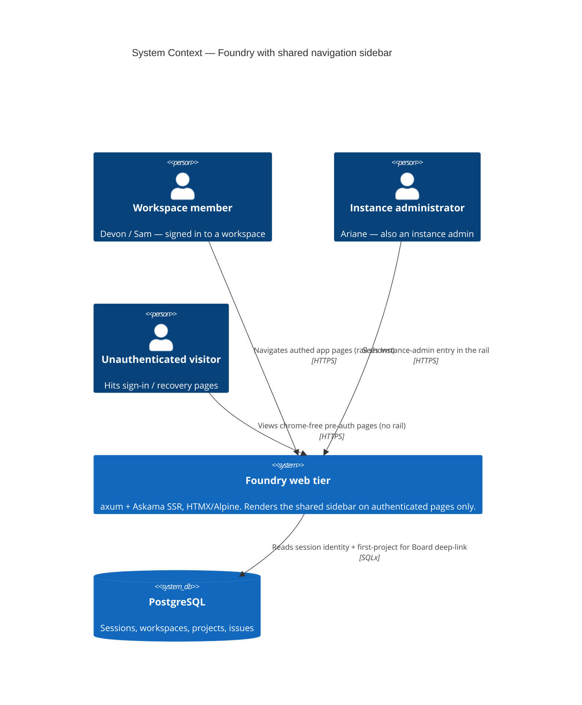
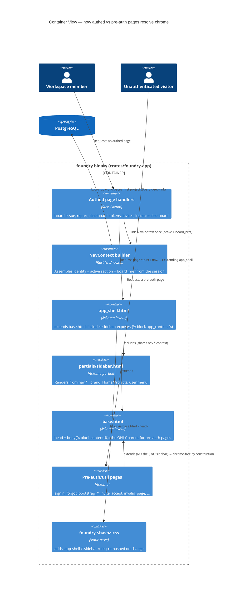
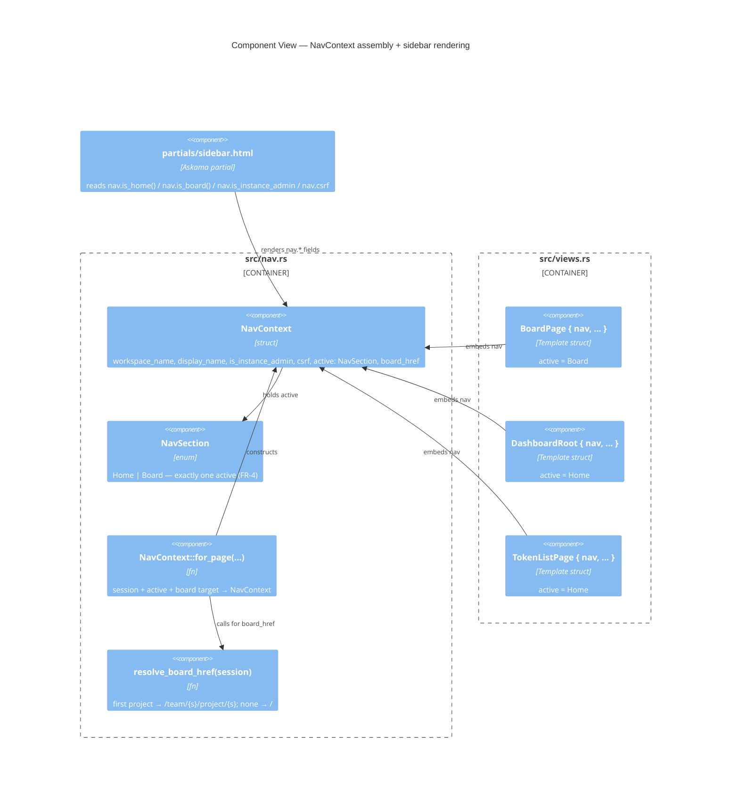
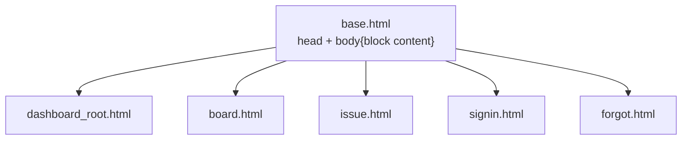
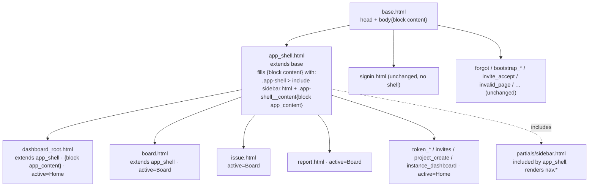

# Architecture Design — navigation-bar-linear-ui

Owner: solution-architect (Morgan). DESIGN wave. Interaction mode: **Propose** (discovery
decisions delegated to the orchestrator; this document authors the design around the
authoritative decisions recorded in the task brief and grounds every claim in the real
`crates/foundry-app` tree).

Companion artifacts: `component-boundaries.md`, `technology-stack.md`, `data-models.md`,
and ADRs `adr-001`…`adr-004` in this folder.

> **ADR location note.** This repo has **no** global `docs/adrs/`. Every feature keeps its
> ADRs at `docs/feature/{id}/design/adr-*.md` with **per-feature** numbering starting at
> `adr-001` (verified across 12 prior features; consistent with the project's legacy
> multi-file wave layout). These ADRs therefore live beside this file as `adr-001`…`adr-004`,
> not under `docs/adrs/`.

---

## 1. System context and the change in one paragraph

Foundry's web tier (`crates/foundry-app`, an axum binary that is also the composition root)
renders **server-side Askama templates** (ADR-B01) with HTMX + Alpine progressive enhancement.
Today `templates/base.html` is a bare shell — `<head>` plus `<body>…</body>`
— and navigation is scattered ad-hoc per page (the board offers only "Change report"/"New issue";
the dashboard hosts a "Quick actions" list). This feature introduces **one shared Linear-style
left sidebar** on **authenticated app pages only**, consolidating identity, primary navigation
(Home / Projects), and account actions (keyboard help, sign-out, instance admin) into a single
consistent surface. Pre-auth and utility pages stay chrome-free. The change is **presentation-tier
only**: no new crate, no DB migration, no new runtime dependency; the ports-and-adapters
store/domain layers are untouched.

## 2. Quality-attribute drivers (why the design is shaped this way)

| Driver (ISO 25010) | This feature's concern | Design response |
|---|---|---|
| Maintainability / modularity | Nav markup must live in ONE place, not be copy-pasted into 12 templates | App-shell template inheritance (ADR-001) + one `sidebar.html` partial |
| Maintainability / testability | The "exactly one active item" and "admin-absent-for-non-admins" invariants must be unit-assertable without a browser | Server-authoritative `NavContext`/`NavSection` value object (ADR-002); active state is a typed enum set by the handler, not template path-sniffing |
| Reliability / no regression | Pre-auth pages must render byte-for-byte unchanged; dashboard Quick-actions links must not be orphaned | Chrome is **structural** — pre-auth pages keep ``; the shell is a *different* parent, so exclusion cannot be forgotten (ADR-001). Dashboard template is edited only additively (US-05 guard) |
| Security / integrity | Sign-out stays CSRF-safe; admin entry must be absent (not hidden) for non-admins | Reuse existing `POST /sign-out` + `_csrf`; `` omits the element from rendered HTML (FR-6) |
| Usability / accessibility | WCAG 2.1 AA for the nav landmark | `<nav aria-label="Primary">`, `aria-current="page"` on the active item, `:focus-visible` rings in CSS |
| Performance efficiency | No render-budget regression (≤200 ms P95 inherited from Feature B) | Askama compiles the shell + partial into the binary; a shared partial adds a fixed, tiny amount of buffer writes — no runtime template I/O, no new query on the hot path except one cheap "first project" lookup for the Board deep-link (ADR-003) |

No architecture-pattern menu is presented: this is a view-composition change inside an existing
adapter. The only genuine decisions are *how chrome is scoped* (ADR-001), *how shared context is
carried* (ADR-002), *what "Projects" links to* (ADR-003), and *how the hashed asset is rolled*
(ADR-004).

## 3. C4 Level 1 — System Context

## 4. C4 Level 2 — Container / view-composition

The "containers" here are the web adapter's rendering units (Askama is compiled into the single
`foundry` binary, so these are logical rendering layers, not deployment units).

## 5. C4 Level 3 — Component (view/context-assembly slice)

## 6. Template inheritance — before / after

**Before** — every page is a direct child of the bare shell; no shared chrome:

**After** — an intermediate `app_shell.html` owns the sidebar; authed pages re-parent to it and
rename their block to `app_content`; pre-auth pages stay on `base.html` (chrome-free is structural):

The include shares the page struct's context, so `sidebar.html` reads the `nav` field that every
authed page struct embeds. Askama renders `` against the **same** context struct — no
separate view-model is threaded to the partial.

## 7. How the design satisfies the acceptance criteria (traceability)

| AC / scenario | Mechanism |
|---|---|
| AC-01 sidebar on authed pages | `app_shell.html` inheritance; every migrated page struct embeds `nav` |
| AC-02 absent on pre-auth/util | Those templates keep ``; the shell is a different parent — no flag to forget (NFR-3) |
| AC-03 active-state, exactly one | `NavSection` is a single enum value per page; `is_home()`/`is_board()` drive the class + `aria-current` |
| AC-04 primary nav targets | Home → `/`; Projects → `nav.board_href` (ADR-003 deep-link) |
| AC-05 user menu / CSRF sign-out | `sidebar.html` footer reuses `POST /sign-out` + hidden `_csrf = {{ nav.csrf }}` |
| AC-06 instance-admin gating | `` → element absent from HTML for non-admins |
| AC-07 dashboard Quick actions preserved | `dashboard_root.html` edited additively only; Invites/Tokens links untouched (US-05) |
| AC-08 accessibility | `<nav aria-label="Primary">`, `aria-current="page"`, `:focus-visible` in CSS |
| AC-09 visual quality | `.sidebar` rules (~220–260 px, quiet surface, right border, tinted active) appended to the hashed CSS (ADR-004) |

## 8. External integrations

**None.** This feature consumes no third-party API, webhook, or OAuth provider. No consumer-driven
contract tests are warranted. The only cross-boundary read is an internal SQLx lookup (first project
for the Board deep-link), already covered by the existing store test seam.

## 9. Development paradigm & handoff

Paradigm: **imperative/OOP Rust**, consistent with the existing web adapter → DELIVER uses
`nw-software-crafter`. No functional-core rewrite. The project root `CLAUDE.md` (context-policy file)
is deliberately **not** modified.

## 10. Biggest risk (carried into DISTILL/DELIVER)

**Context fan-out.** The rail hard-requires `display_name`, `workspace_name`, `is_instance_admin`,
`csrf`, and `active_section` on **every** migrated page, but several authed handlers (notably
`BoardPage`) do not thread all of these today. `NavContext` reduces this to "embed one `nav` field
and build it once," but the compile-time nature of Askama means a page that extends `app_shell.html`
**without** a `nav` field is a hard build error — which is the good failure mode. The residual risk
is a handler that *builds `NavContext` with a wrong `active`* (e.g. a board sub-route defaulting to
Home); mitigated by the DISTILL acceptance scenario "exactly one item current" run across the full
authed page set (AC-03.3).
</content>
</invoke>
