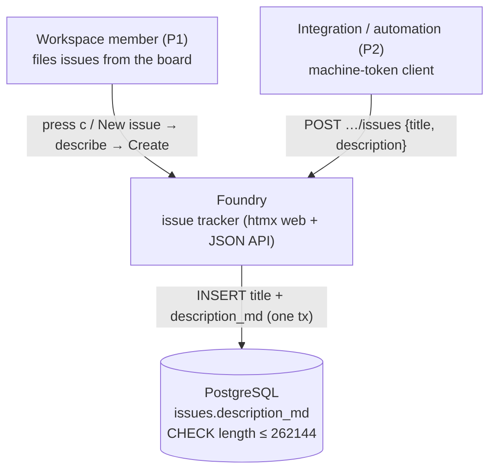
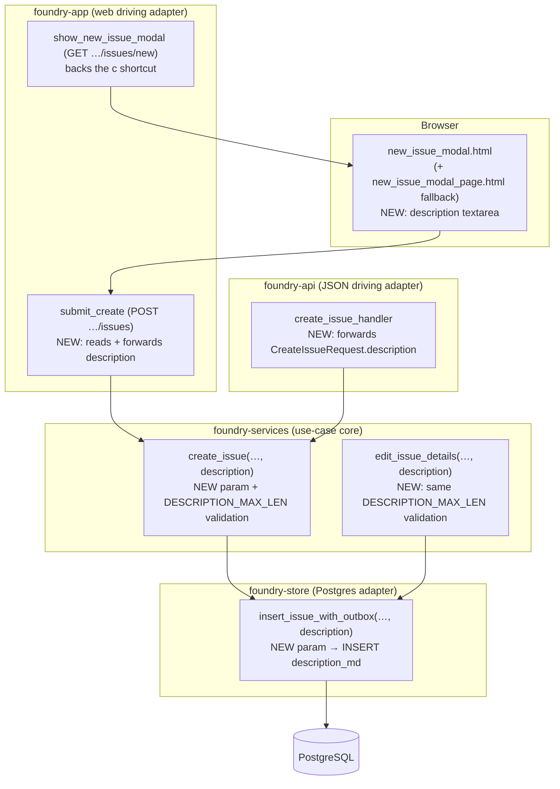
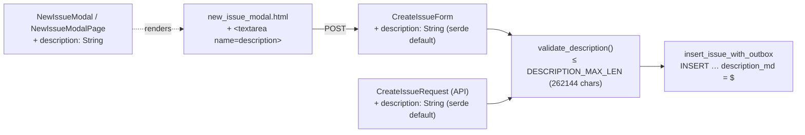

# Architecture — new-issue-dialog-description

Design for the DISCUSS requirements (`../discuss/`). Ratified ODD-1..4 (2026-07-17). This threads one field
(`description`) through the shipped create pipeline and converts one DB-level rejection into an application
validation error. **No migration** (latest stays `0014`); **no new component**; every change mirrors a
shipped pattern.

## Quality attributes driving this design

| Attribute | Priority | Consequence |
|-----------|----------|-------------|
| **Consistency (web/API parity)** | Highest | One shared service validates + persists; NFR-WEB-API-CON-02 (`create_issue_handler` docs). |
| **Backward compatibility** | Highest | Empty description = today's bytes for every existing call-site + API client. |
| **Maintainability** | High | One partial serves both create surfaces (NFR-WEBB-MAINT-02); mirror `edit_issue_details`, don't invent. |
| **Testability** | High | Every layer already has a test seam; the bound is deterministic and boundary-testable. |

Paradigm: unchanged — the project's established ports-and-adapters layering (app/api driving adapters →
`foundry-services` use-cases → `foundry-store` Postgres adapter). Implementation agent: `@nw-software-crafter`.
No `CLAUDE.md` paradigm change.

## C4 — System Context

The only external contract that changes is the request bodies (web form + JSON): both gain an **optional**
`description`. The response contracts are unchanged (OOB card on web; `{key,number,title,state}` on API).

## C4 — Container

Bold "NEW" nodes are the only edits. `create_s` and `edit_s` share the new validation helper — that shared
seam is the whole point (D2).

## C4 — Component (the create thread)

## Components (all NEW edits mirror a shipped shape; nothing net-new)

### Store — `crates/foundry-store/src/lib.rs`
- **`insert_issue_with_outbox(…, description: &str)`** (`:1359`) — add a `description: &str` param; include
  `description_md` in the existing INSERT within the same tx. No new query, no migration. Every current
  call-site passes `""` until its own slice wires a real value → byte-identical behavior. The column's DB
  CHECK (`length ≤ 262144`) remains the last line of defense; the service bound (below) keeps it from ever
  firing on the app path.

### Service — `crates/foundry-services/src/issues.rs`
- **`const DESCRIPTION_MAX_LEN: usize = 262144;`** beside `TITLE_MAX_LEN` (`:30`). Value **matches the DB
  CHECK** so the app rejects exactly what the DB would (ADR-002). Counted with `chars().count()`, mirroring
  the title rule.
- **`create_issue(…, description: &str)`** (`:49`) — add the param; after title validation, validate the
  description length; pass it to `insert_issue_with_outbox`. On over-length: `ServiceError::Validation {
  code: "description_too_long", message: "Description is too long" }`.
- **`edit_issue_details(…)`** (`:174`) — apply the SAME description validation before
  `update_issue_details` (D2). This **converts today's DB-CHECK 500 into a clean 422/validation error** for
  over-long edits (see ADR-002 §"what changes"). The edit path already receives `description_md`; only the
  guard is new.

### Web — `crates/foundry-app/src/issues.rs` (+ `views.rs`, `keyboard.rs`, templates)
- **`CreateIssueForm { …, #[serde(default)] description: String }`** (`issues.rs:62`) — mirror `EditIssueForm`
  (`:269`).
- **`submit_create`** (`:70`) — forward `form.description` to `issue_service::create_issue`. Happy path
  unchanged: the OOB Backlog card (`render_issue_card_with_column_marker`) does **not** render the
  description, so the card markup is byte-identical. The `description_too_long` branch reuses the existing
  `ServiceError::Validation` arm → `bad_request_fragment` (see §"Error behavior" for what the browser does
  with it).
- **`views::NewIssueModal` + `views::NewIssueModalPage`** (`views.rs:79`, `:99`) — each gains
  `description: String`. Both `` the single `new_issue_modal.html` (NFR-WEBB-MAINT-02), so both
  must carry the field the partial now reads. `show_new_issue_modal` (`keyboard.rs:116`) and the fallback
  renderer pass `description: String::new()` on the empty GET.
- **`partials/new_issue_modal.html`** — add `<label>Description <textarea name="description">{{ description }}</textarea></label>`
  between the title input and the submit button, mirroring `issue_edit_modal.html:7`. The `{{ description }}`
  binding is `""` on the normal open; it exists so a future re-render can echo input (not needed now — see
  Error behavior).

### API — `crates/foundry-api/src/lib.rs`
- **`CreateIssueRequest { title, #[serde(default)] description: String }`** (`:85`) — optional; omitting it is
  byte-compatible for existing clients (ADR-001 §serde).
- **`create_issue_handler`** (`:378`) — pass `request.description` to the shared service. Response body
  (`IssueJson { key, number, title, state }`) is **unchanged** — AC-02.2's read-back equality is served by
  the persisted value, not by widening the create response (an api-contract change we explicitly avoid).

## Error behavior (verified, and why no work is needed here)

The vendored htmx is **2.0.4** with default `responseHandling` (`{code:"[45]..",swap:false,error:true}`) and
**no app override**, no `response-targets` extension, no `htmx:responseError` handler. `bad_request_fragment`
returns **400** (asserted at `feature_board_new_issue.rs:292`). Therefore, on any validation error the browser
**does not swap** the response: the modal stays open, **the typed title + description are preserved**, and the
error body is discarded (message not shown). Consequences for this feature:

- **AC-01.6 (typed description survives a title error): satisfied with zero code** — htmx's non-swap already
  preserves it. The `{{ description }}` echo binding is defensive only.
- The **`description_too_long` → 400** fragment behaves exactly like the shipped `title_required` fragment:
  correct at the HTTP layer, invisible in the browser. The **JSON API path shows the error fine** (422 body).
- The **invisible-error-in-browser** behavior is an **app-wide, pre-existing defect** (`board-new-issue` D3
  claims errors are visible; they are not under this htmx config). It is **out of scope** here and deferred to
  its own `/nw:root-why` bugfix (`upstream-changes.md` §Discovered). This feature ships errors that behave
  identically to every other form — no regression, no new surface.

## Cross-cutting

- **Tenancy**: unchanged — `resolve_member_project` authz on create is untouched; foreign project → uniform
  404. No new `check-arch` LAYER-1e line.
- **CSRF**: unchanged — the modal keeps its hidden `_csrf` double-submit field.
- **No-JS fallback**: both `new_issue_modal.html` (htmx) and `new_issue_modal_page.html` (full page) carry the
  textarea; a plain POST creates with the description via `submit_create`'s non-htmx branch.
- **No migration / no outbox change**: `description_md` and its CHECK ship; `insert_issue_with_outbox` already
  emits `IssueCreated`, unchanged. Per `issue-change-history` ODD-5, creating with a description is **not** a
  timeline event — verified consistent, covered by scenarios.

## Slice plan (unchanged from DISCUSS, narrowed)

Three slices: **01** web create field (store→service→web→templates), **02** API parity, **03** the shared
bound (create + edit, converting the edit 500→422). No slice 04 — the error-visibility defect is deferred.
Order 01 → 02 → 03; 02 and 03 depend on 01's service param.
