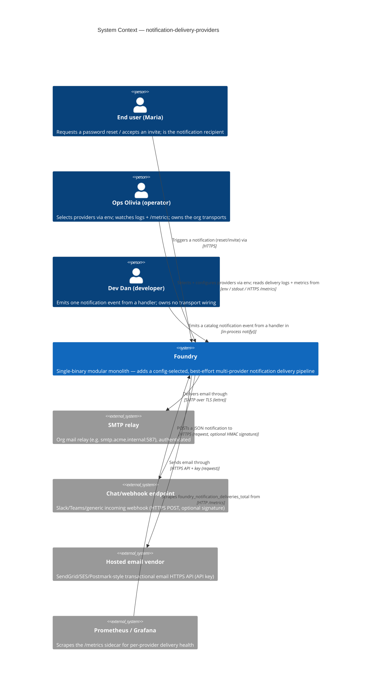
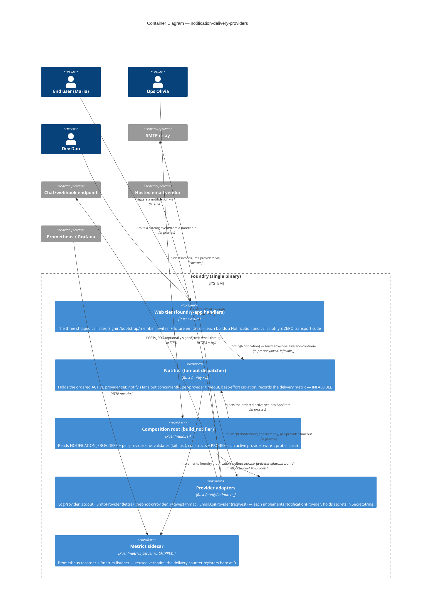
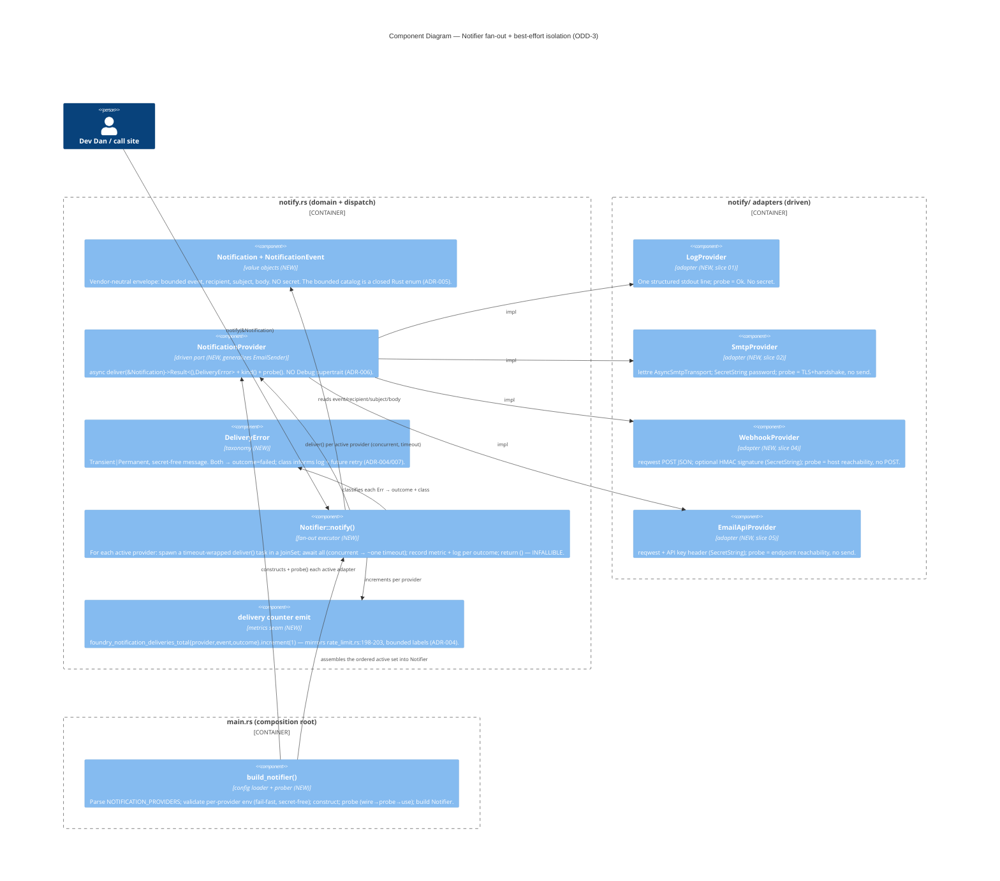

# Architecture — notification-delivery-providers

> Morgan (nw-solution-architect), DESIGN wave, Propose mode, application/component scope. Modular monolith
> + ports-and-adapters via Rust traits, env-config at the composition root (inherited, in force — NOT
> re-decided). This feature **generalizes the shipped single `EmailSender` port
> (`crates/foundry-app/src/email.rs:19-22`, only prod impl `NoopEmailSender`) into a pluggable
> `NotificationProvider` port + a config-selected registry + a concurrent, best-effort fan-out
> dispatcher**, and realizes four transport adapters (log, smtp, webhook, email_api) across six thin
> slices (v1 = 01–03). Requirements SSOT: `../discuss/`. Open decisions ODD-1..8 are resolved here and in
> `adr-001..007`; per-ODD resolution index in `wave-decisions.md`. Honest brownfield truth (verified): there
> is **no real email transport today** — `main.rs:265` wires `Arc::new(NoopEmailSender)`, `lettre` is a
> declared-but-unused dep, and the "env-gated SMTP" the `email.rs:1-5` module-doc promises was never built.
> "Preserve existing behavior" = preserve the **best-effort/non-fatal contract** of the three call sites
> (today a no-op), not a real send that does not yet exist.

## System context and capabilities

Foundry emits three person-facing notifications today — password-reset (`signin.rs:235`), bootstrap
workspace-invite (`bootstrap.rs:258`), workspace member-invite (`member_invites.rs:189`) — all through the
single `AppState.email: Arc<dyn EmailSender>` handle (`lib.rs:92`) whose only production implementation is
`NoopEmailSender` (silently drops). **Ops Olivia** cannot route notifications through the transports her org
already runs (SMTP relay, chat webhook, hosted email vendor), and cannot see that anything fired.
**Dev Dan** would have to hand-wire each transport at his call site and risk a slow/broken transport
stalling or failing his request.

This feature turns the one hard-wired no-op sender into an **observable, config-selectable, multi-channel
delivery pipeline**: a vendor-neutral `NotificationProvider` port; a registry that selects the ACTIVE
providers from `NOTIFICATION_PROVIDERS` + per-provider env at the composition root; a concurrent fan-out
dispatcher that delivers one emitted notification to ALL active providers with **best-effort per-provider
isolation** (a failing/slow provider can never fail nor stall the originating request, nor sink the other
providers); a bounded per-provider Prometheus counter; and a bounded notification catalog with two new
first-consumer events. It is the **operator/developer-facing delivery abstraction only** — recipient/per-user
*preferences* are carved out to the successor feature `recipient-notification-preferences` (OUT OF SCOPE).

## C4 Level 1 — System Context (MANDATORY)



## C4 Level 2 — Container (MANDATORY)



## C4 Level 3 — Component (the fan-out dispatcher — the one subsystem that warrants it, NFR-3 crux)



## Resolved `NotificationProvider` port (ODD-1, ADR-001; secret-safe per ODD-8, ADR-006)

The port is a **structured, vendor-neutral envelope**, NOT email-centric `send(to,subject,body)` — because
(a) the `event` discriminator is needed by the metric (`event` label, NFR-4) and cannot be reconstructed
from `to/subject/body`, and (b) the webhook/chat provider needs structure. It carries the **already-rendered
email-shaped `subject`/`body`** the three shipped call sites already produce, so email-shaped adapters
(smtp/email_api/log) read them directly and backwards-compat (NFR-5) is exact; the webhook serializes the
whole struct to JSON.

```rust
// crates/foundry-app/src/notify.rs  (NEW module; generalizes email.rs)
use async_trait::async_trait;

/// Bounded provider-kind label (log|smtp|webhook|email_api). Bounded ⇒ safe as a
/// Prometheus label value (ADR-004 / ADR-011).
#[derive(Debug, Clone, Copy, PartialEq, Eq)]
pub enum ProviderKind { Log, Smtp, Webhook, EmailApi }
impl ProviderKind { pub fn as_str(&self) -> &'static str { /* "log" | "smtp" | ... */ } }

/// The bounded notification catalog (ADR-005). Adding an event = one variant + one
/// as_str() arm; keeps the `event` metric label closed (BR-7 / R6).
#[derive(Debug, Clone, Copy, PartialEq, Eq)]
pub enum NotificationEvent {
    PasswordReset, WorkspaceInvite, MemberInvite,
    MemberRemoved, PasswordChanged, // NEW (US-06)
}
impl NotificationEvent { pub fn as_str(&self) -> &'static str { /* "password_reset" | ... */ } }

/// The vendor-neutral envelope the notifier hands every provider. Bounded `event`
/// (metric + routing) + recipient + the rendered email-shaped subject/body. NEVER
/// carries a secret or a raw token.
#[derive(Debug, Clone)]
pub struct Notification {
    pub event: NotificationEvent,
    pub recipient: String,
    pub subject: String,
    pub body: String,
}

/// A provider's classification of a failed delivery (ADR-004). Message is
/// operator-safe and NEVER contains a secret. Both arms → outcome="failed".
#[derive(Debug)]
pub enum DeliveryError { Transient(String), Permanent(String) }

/// The driven port every transport adapter implements.
/// NO `Debug` supertrait (ADR-006): the trait object is never `{:?}`-formatted,
/// so a secret-holding adapter cannot leak by default; secrets live in
/// `secrecy::SecretString` inside each adapter.
#[async_trait]
pub trait NotificationProvider: Send + Sync + 'static {
    fn kind(&self) -> ProviderKind;
    async fn deliver(&self, notification: &Notification) -> Result<(), DeliveryError>;
    /// Earned-Trust readiness probe (ADR-006 §Probe): prove this adapter can honor
    /// its contract in THIS environment (config complete; transport reachable)
    /// WITHOUT side-effecting the channel. Run once at startup (wire→probe→use).
    async fn probe(&self) -> Result<(), DeliveryError>;
}
```

## Fan-out dispatcher model (ODD-3/ODD-4, ADR-003) — one sentence

`Notifier::notify(&Notification)` fans out to every active provider **concurrently** — one timeout-wrapped
`deliver()` task per provider in a `tokio::task::JoinSet` — awaits the set (concurrent ⇒ wall-time ≈ a single
`NOTIFICATION_DELIVERY_TIMEOUT_MS`, default 5000, regardless of N), records `{provider,event,outcome}` +
one structured log line per provider, and **returns `()` — infallible**: a provider that errors, times out,
or panics is contained in its own task and counted `failed`, so it can neither fail the request (notify never
returns `Err`), stall it beyond one timeout, nor block the other providers (they run concurrently). Call
sites replace `if let Err(e) = state.email.send(..).await {..}` with a bare `state.notifier.notify(&n).await;`
— the isolation the three call sites do by hand today moves *inside* the dispatcher, generalized to N providers.

## Config schema (ODD-2, ADR-002)

Read with direct `std::env::var` at the composition root (`main.rs`), house 12-factor style — no config
file, no figment (BR-5).

| Provider | Activation | Required env | Optional env (secret) | Notes |
|---|---|---|---|---|
| (selection) | `NOTIFICATION_PROVIDERS` | — | — | comma list, trimmed+lowercased, ORDERED; unset/empty ⇒ zero providers ⇒ Noop-equivalent (BR-1); unknown name ⇒ fail-fast (NFR-1) |
| `log` | listed | — | — | no config; always constructible |
| `smtp` | listed | `SMTP_HOST`, `SMTP_USERNAME`, `SMTP_PASSWORD`*, `SMTP_FROM` | — | `SMTP_PORT` default 587; `SMTP_PASSWORD` in `SecretString` |
| `webhook` | listed | `WEBHOOK_URL` | `WEBHOOK_SIGNING_SECRET`* | HMAC-SHA256 signature header when secret set |
| `email_api` | listed | `EMAIL_API_URL`, `EMAIL_API_KEY`*, `EMAIL_API_FROM` | — | key sent as credential header only |
| (fan-out) | — | — | — | `NOTIFICATION_DELIVERY_TIMEOUT_MS` default 5000; `NOTIFICATION_PROBE_STRICT` default false (ADR-006 §Probe) |

*`SecretString` (secrecy 0.10, shipped). "Listed" → "active" **only if** required env validates AND the
startup probe passes. The active set is an ordered `Vec<Arc<dyn NotificationProvider>>` inside `Notifier`
(deterministic order = list order, for stable logs/tests).

## Notification catalog (ODD-6, ADR-005)

Closed Rust enum `NotificationEvent` (above) — **NOT** aligned with the realtime `EventPayload.event_type:
String` (`foundry-realtime/src/lib.rs:66-105`). The realtime envelope is stringly-typed for forward-compat
over an SSE bus with **no cardinality constraint**; the notification `event` is a Prometheus label with a
**hard cardinality bound** (ADR-011, R6). We mirror the envelope's *forward-compat discipline* (a struct
carrying a discriminator + payload, never rename a field) but with a **closed enum** discriminator so the
label domain is compile-time bounded (BR-7). The three shipped events + `member_removed` + `password_changed`
are the v1 catalog.

## Component architecture & boundaries

| Component | Layer | Responsibility | Owns | Status |
|---|---|---|---|---|
| `Notification` + `NotificationEvent` + `ProviderKind` | domain value objects | the vendor-neutral envelope + bounded catalog + bounded kind | WHAT a notification IS | NEW |
| `NotificationProvider` | driven port | the transport-agnostic delivery + probe contract | the delivery boundary | NEW (generalizes `EmailSender`) |
| `DeliveryError` | domain value object | secret-free failure classification | outcome + retry class | NEW |
| `Notifier::notify` | dispatcher (domain-side) | concurrent, timeout-bounded, isolated fan-out + metric/log | fan-out + isolation semantics (NFR-3) | NEW |
| `LogProvider` | driven adapter | one structured stdout line; trivial probe | the log transport | NEW (slice 01) |
| `SmtpProvider` | driven adapter | `lettre` async SMTP send; TLS-handshake probe | the SMTP transport | NEW (slice 02) |
| `WebhookProvider` | driven adapter | `reqwest` JSON POST + optional HMAC; reachability probe | the webhook transport | NEW (slice 04) |
| `EmailApiProvider` | driven adapter | `reqwest` vendor-API send; reachability probe | the hosted-API transport | NEW (slice 05) |
| `build_notifier()` | composition root | parse+validate env (fail-fast), construct, probe (wire→probe→use), assemble | provider selection + startup safety | NEW (in `main.rs`) |
| delivery counter seam | metrics | register-at-0 + emit `foundry_notification_deliveries_total` | per-provider observability | NEW (reuses shipped `metrics` facade) |
| `AppState.notifier: Arc<Notifier>` | DI field | the handle every call site emits through | notifier injection | GENERALIZES `AppState.email` (`lib.rs:92`) |
| three call sites (`signin.rs:235`, `bootstrap.rs:258`, `member_invites.rs:189`) | driving adapters | build a `Notification`, call `notify()` | emit sites | EXTENDED (route through notifier) |
| `NoopEmailSender` behavior | — | the "no active providers" default | backwards-compat | PRESERVED (empty active set = Noop-equivalent) |
| `FakeEmailSender` / `set_failing()` (`email.rs:38-89`) | test double | the failure-injection seam | isolation testability | REUSED (generalized to a recording/failing provider double) |

Software-crafter owns all internal structure (module decomposition, exact `lettre`/`reqwest` calls, the
`JoinSet` wiring, the `as_str()` bodies, template markup) during GREEN/REFACTOR. The contracts above are the
boundary.

## Reuse-vs-new analysis (verdict: 15 REUSE/EXTEND · 8 CREATE-NEW · 0 RETIRE · 0 MIGRATION · **0 NEW CRATE**)

| # | Component | File / crate | Decision | Justification |
|---|---|---|---|---|
| 1 | `EmailSender` port shape (async, Result, call shape) | `email.rs:19-22` | **GENERALIZE** | Becomes `NotificationProvider`; async/Result kept, `Debug` supertrait DROPPED (ADR-006), `send(to,subject,body)` → structured `deliver(&Notification)` (ADR-001). |
| 2 | `NoopEmailSender` behavior | `email.rs:26-34` | **PRESERVE (as semantics)** | Empty active set = today's silent-drop default (BR-1, NFR-5). The struct itself may be retired once `AppState.notifier` replaces `AppState.email`. |
| 3 | `FakeEmailSender` + `set_failing()` | `email.rs:38-89` | **REUSE (generalize)** | The recording + failure-injection double for isolation tests (NFR-3, R7); generalized to record `Notification`s. |
| 4 | `AppState.email` DI field | `lib.rs:92` | **GENERALIZE** | → `AppState.notifier: Arc<Notifier>`; every call site reads the notifier (not the mailer). |
| 5 | Port re-export | `lib.rs:63` | **EXTEND** | Export `NotificationProvider`, `Notifier`, `Notification`, `NotificationEvent`, `ProviderKind`, `DeliveryError`. |
| 6 | Injection point (`email: Arc::new(NoopEmailSender)`) | `main.rs:265` | **EXTEND** | Replace with `notifier: build_notifier(..)?` alongside the env reads at `main.rs:242-262`. |
| 7 | Three best-effort call sites | `signin.rs:235`, `bootstrap.rs:258`, `member_invites.rs:189` | **EXTEND** | Build a `Notification`, call `notify()` (infallible); slice 01 routes signin, slice 03 routes the other two. |
| 8 | `lettre` 0.11 (`tokio1`, `tokio1-rustls-tls`, `smtp-transport`, `builder`) | `Cargo.toml:85-90` | **REUSE (realize)** | Declared-but-unused; features already cover async tokio rustls SMTP — the `SmtpProvider` realizes it. No feature change. |
| 9 | `reqwest` 0.12 (`rustls-tls`, `json`) | `Cargo.toml:104` | **REUSE** | Already a workspace dep — the webhook + email_api adapters reuse it. **NO new HTTP client** (corrects the DISCUSS "verify what HTTP client the repo uses"). |
| 10 | `hmac` 0.12 + `sha2` 0.10 | `Cargo.toml:61-62` | **REUSE** | The webhook HMAC-SHA256 signature (US-04). Already present (foundry-auth HMAC, bootstrap Sha256). |
| 11 | `secrecy::SecretString` 0.10 | `Cargo.toml:68` | **REUSE** | Wrap every provider secret (SMTP password, signing secret, API key). Already used for `SESSION_SECRET`/signer. |
| 12 | `metrics` facade + `metrics-exporter-prometheus` sidecar + `/metrics` | `metrics_server.rs:45-77` | **REUSE (verbatim)** | The delivery counter registers + exposes here; NO new dashboard/exporter infra. |
| 13 | Labelled-counter emission pattern | `rate_limit.rs:98,198-203` | **REUSE (mirror)** | `metrics::counter!(NAME, k=>v,..).increment(1)` — the exact delivery-metric shape. |
| 14 | Register-at-0 + `describe_counter!` idiom | `main.rs:355-369` | **REUSE (mirror)** | The delivery family registers at 0 (bounded cross-product of active providers × catalog × outcomes) so it is present on first scrape. |
| 15 | ADR-011 bounded-label rule + fail-closed cardinality test | `metrics_server.rs:99-108,374-428` | **REUSE (mirror)** | The delivery counter obeys the bounded triple; the cardinality unit test is mirrored (ADR-004). |
| 16 | Earned-Trust probe idiom (`health.startup.refused`, `PROBE_FAILURES_TOTAL{probe_name}`, `PROBE_NAMES`) | `main.rs:38,46,178-232,320-324` | **REUSE (extend)** | Each active provider is probed at startup exactly like the store/metrics/machine_token probes; `PROBE_NAMES` gains the bounded `notification_<kind>` set (ADR-006). |
| 17 | `build_router(state)` | `lib.rs:293` | **REUSE (unchanged)** | Consumes the already-constructed `AppState`; the notifier is injected upstream in `main.rs`. |
| 18 | `NotificationProvider` port | — | **CREATE-NEW** | ADR-001. |
| 19 | `Notification`+`NotificationEvent`+`ProviderKind`+`DeliveryError` | — | **CREATE-NEW** | ADR-001/004/005. |
| 20 | `Notifier` fan-out dispatcher | — | **CREATE-NEW** | ADR-003. |
| 21–24 | `LogProvider`, `SmtpProvider`, `WebhookProvider`, `EmailApiProvider` | — | **CREATE-NEW** | one per slice 01/02/04/05. |
| 25 | `build_notifier()` config loader + prober | — | **CREATE-NEW** | ADR-002/006. |
| 26 | delivery counter const + register-at-0 | — | **CREATE-NEW** | ADR-004. |

## Technology stack & rationale (OSS-first; every dep already in-tree)

- **Rust / async-trait / tokio** (inherited) — the port is `#[async_trait]`, dispatch is `tokio` (`JoinSet`
  + `tokio::time::timeout`). No new runtime.
- **SMTP: `lettre` 0.11** (MIT/Apache-2.0), `Cargo.toml:85-90`, **declared-but-unused** — realized behind
  the port with its async `AsyncSmtpTransport<Tokio1Executor>` (rustls TLS). The declared feature set already
  covers this; **no feature change, no new crate**.
- **HTTP (webhook + email_api): `reqwest` 0.12** (MIT/Apache-2.0), `Cargo.toml:104`, **already a workspace
  dep** — reused for both HTTP adapters. Deliberately **no second HTTP client** (no hyper-direct, no ureq):
  reusing `reqwest` avoids a redundant transitive TLS stack. (The `metrics_server.rs` probe hand-rolls an
  HTTP/1.1 GET to avoid a *production-side* reqwest dep in the DEVOPS slice; here reqwest is already required
  by the acceptance stack and is the right production client for arbitrary vendor APIs.)
- **Webhook signing: `hmac` 0.12 + `sha2` 0.10** (MIT/Apache-2.0), `Cargo.toml:61-62`, already present —
  HMAC-SHA256 over the JSON body, keyed by `WEBHOOK_SIGNING_SECRET`.
- **Secrets: `secrecy` 0.10** (MIT/Apache-2.0), `Cargo.toml:68`, already present — `SecretString` wraps every
  provider secret (ADR-006).
- **Observability: `metrics` 0.23 + `metrics-exporter-prometheus` 0.15** (MIT/Apache-2.0), shipped — reused
  verbatim (ADR-004).

**Net: ZERO new crates, ZERO migration.** The entire feature is adapters + a dispatcher + config over
already-present dependencies.

## Integration patterns & API contracts

- **In-process (driving)**: call sites → `Notifier::notify(&Notification)` — an `await`, infallible,
  fire-and-continue call. No JSON/REST surface is added inside Foundry; there is **no new user-facing form**
  (NFR-7 N/A).
- **Outbound (driven, external)** — three real external integrations, the highest-risk boundary:
  - **SMTP relay** (`SmtpProvider` via `lettre`) — SMTP-over-TLS to `SMTP_HOST:SMTP_PORT`.
  - **Webhook endpoint** (`WebhookProvider` via `reqwest`) — HTTPS POST of `{event,recipient,subject,body}`
    JSON to `WEBHOOK_URL`, optional `X-Foundry-Signature: sha256=<hmac>` header.
  - **Hosted email vendor** (`EmailApiProvider` via `reqwest`) — HTTPS POST to `EMAIL_API_URL` with the key
    as a credential header.
- **Contract-testing annotation owed to platform-architect** (see `wave-decisions.md` Handoff): the webhook
  + hosted-email-API + SMTP transports are external boundaries whose wire contracts can drift; consumer-driven
  contract tests / recorded-interaction tests are recommended in the CI acceptance stage. The Earned-Trust
  startup probe (ADR-006) is the *runtime* half; contract tests are the *build-time* half.

## Quality attribute strategies (ISO 25010)

- **Reliability / fault tolerance (first-class, NFR-3, the crux)** — best-effort per-provider isolation is
  structural: concurrent `JoinSet` tasks + per-provider `tokio::time::timeout` + an infallible `notify()`.
  One provider refused/5xx/timeout/**panic** is contained in its task, counted `failed`, and cannot fail,
  stall (beyond one timeout), or block the others. Maps to the @property failure-isolation criterion.
- **Security / confidentiality (NFR-2, R3)** — five defense-in-depth layers (ADR-006): (1) the port has NO
  `Debug` supertrait so the trait object is never `{:?}`-formatted; (2) secrets in `SecretString` (redacts on
  Debug); (3) `DeliveryError` messages are hand-built and secret-free; (4) metric labels are bounded enums
  (no value path from a secret to a label); (5) the revert-reds-it no-leak @property litmus. Secrets are read
  once at the composition root, wrapped immediately, exposed only at transport-request construction.
- **Security / startup integrity (NFR-1, R4)** — fail-fast config validation: a listed-but-misconfigured or
  unknown provider aborts startup non-zero with a provider-named, secret-free error → `health.startup.refused`
  (ADR-002/006). Unlisted ⇒ inactive, never constructed.
- **Performance efficiency (R2)** — no throughput NFR exists; the concern is *bounded latency* on the emit
  path. Fan-out is decoupled from user-visible work (the call site has already produced its response body)
  and bounded by one concurrent timeout window; a hung provider adds at most `NOTIFICATION_DELIVERY_TIMEOUT_MS`
  and is counted `failed`. No caching/CDN/indexing applies (delivery is fire-and-continue, not a hot read).
- **Observability (NFR-4, R6)** — `foundry_notification_deliveries_total{provider,event,outcome}`, bounded
  labels, register-at-0, on the shipped `/metrics` sidecar; a fail-closed cardinality test (ADR-004). Plus one
  structured log line per delivery (`provider`,`event`,`recipient`,`outcome`,`class`) — never a secret.
- **Maintainability / testability (R1, R7)** — ports-and-adapters keeps the domain (`Notification`,
  `Notifier`) transport-free and unit-testable with a recording/failing double (reused `FakeEmailSender`
  seam); each adapter is integration-testable against a real transport; the isolation, non-leakage,
  fan-out-completeness, and fail-fast properties are acceptance-probed (revert-reds-it litmus). The shipped
  `FakeEmailSender`-based acceptance coverage passes unchanged (NFR-5) because `notify()` awaits the bounded
  fan-out (the fake records synchronously within the same await window — see ADR-003 §Alternatives on why
  spawn-detach was rejected for exactly this reason).
- **Portability / operability** — env-only config (12-factor), one binary, no new infra; unset config =
  Noop-equivalent so an un-configured deploy behaves exactly as today.
- **Accessibility (NFR-7)** — N/A: no new user-facing surface. Recorded so the omission is intentional.

## Architecture Enforcement (for software-crafter)

Style: Modular Monolith + Hexagonal (ports-and-adapters). Language: Rust. Tool: `cargo xtask check-arch`
(in-tree, inherited) + the mirrored cardinality unit test + a secret-leak structural check.

Rules to enforce:
- The domain side (`Notification`, `NotificationEvent`, `Notifier`) has **zero dependency on any adapter or
  transport crate** (`lettre`/`reqwest`/`hmac` are imported only inside `notify/` adapters). Dependencies
  point inward: adapters depend on the port; the dispatcher depends on the port; the port depends on nothing.
- **Bounded metric labels** — mirror `metrics_server.rs:374-428`: a scoped-recorder unit test asserts the
  emitted `foundry_notification_deliveries_total` label KEY set is EXACTLY `{provider,event,outcome}` and
  fails closed on any added label (ADR-004).
- **Secret non-leakage (structural)** — a `check_arch`/pre-commit AST check that no `notify/` adapter
  `Debug`-formats `self` and no code path interpolates an exposed secret into a log/error/metric; paired with
  the behavioral no-leak @property test (ADR-006, principle 11/12).
- **Probe presence (Earned Trust)** — every `impl NotificationProvider` MUST implement a non-trivial `probe()`
  (config + reachability as applicable); `build_notifier` MUST probe every constructed provider before it
  enters the active set (wire→probe→use). A provider that skips its probe is a review-blocking violation
  (ADR-006 §Self-application).

## Deployment architecture

Unchanged: ONE binary, ONE PostgreSQL, the SHIPPED `/metrics` sidecar. **ZERO new crates, ZERO migration,
ZERO new infra.** New behavior is opt-in per env: with `NOTIFICATION_PROVIDERS` unset the app boots and
behaves byte-for-byte as today (Noop-equivalent). Active providers are constructed + probed at boot; a
config lie fails the boot fast (NFR-1); a substrate/network lie is surfaced as `health.startup.degraded` by
default (best-effort) or refuses the boot under `NOTIFICATION_PROBE_STRICT=true` (ADR-006). No change is owed
to platform-architect except the contract-test recommendation for the three external transports.

## ADRs

- `adr-001-provider-port-shape.md` — ODD-1: structured vendor-neutral `Notification` envelope + the
  `NotificationProvider` port (async `deliver` + `kind` + `probe`); why not email-centric `send(to,subject,body)`.
- `adr-002-registry-and-env-config.md` — ODD-2: `NOTIFICATION_PROVIDERS` + per-provider env schema, the
  ordered active-set registry, fail-fast validation at the composition root.
- `adr-003-fanout-execution-and-isolation.md` — ODD-3 + ODD-4: concurrent `JoinSet` + per-provider timeout +
  infallible `notify()`; the `DeliveryError` Transient|Permanent taxonomy; why await-bounded, not spawn-detach.
- `adr-004-observability-contract.md` — ODD-5: `foundry_notification_deliveries_total{provider,event,outcome}`,
  bounded labels, register-at-0 cross-product, the mirrored fail-closed cardinality test.
- `adr-005-event-catalog.md` — ODD-6: the closed `NotificationEvent` enum; why NOT aligned with the realtime
  stringly-typed `EventPayload`; the two new v1 events.
- `adr-006-secret-handling-and-debug.md` — ODD-8: drop the `Debug` supertrait + `SecretString`; the
  Earned-Trust startup probe contract (config-strict / network-soft) + three-layer enforcement.
- `adr-007-durability-and-retry-stance.md` — ODD-7: ratify best-effort at-most-once for v1; the
  Transient|Permanent class is the only retry seam left; the `outbox` (`main.rs:29`) is the deferred backing.
