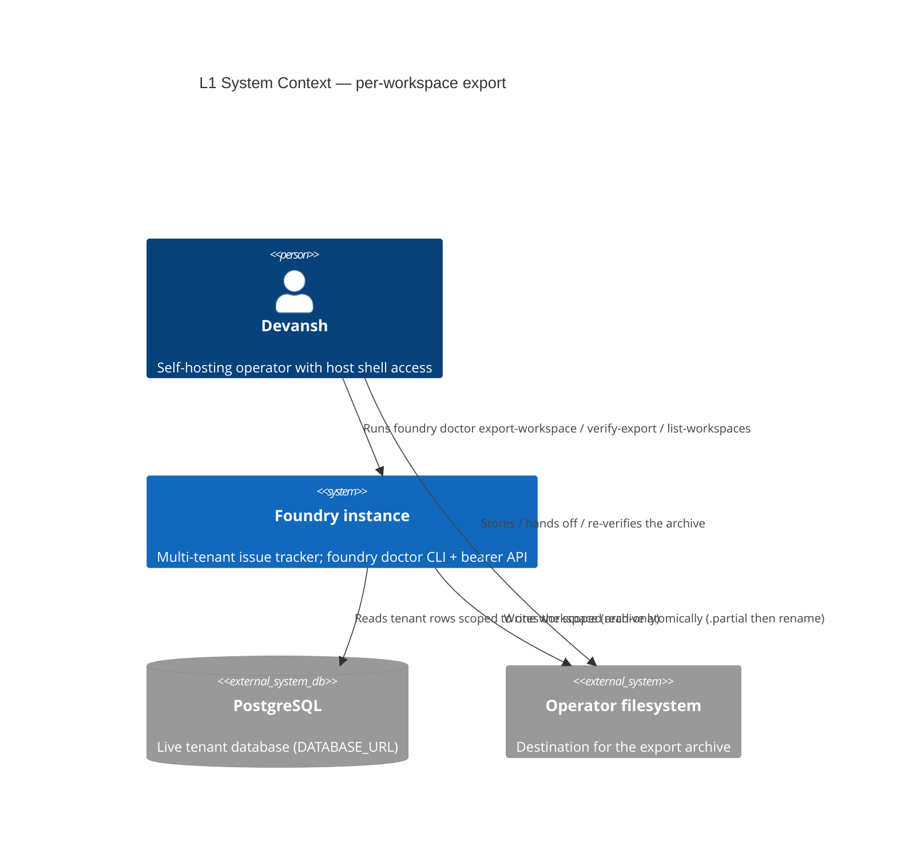
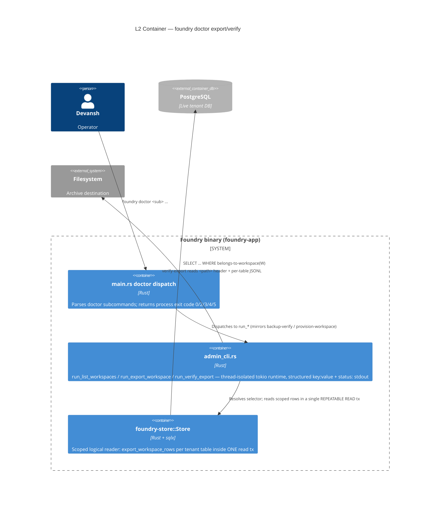
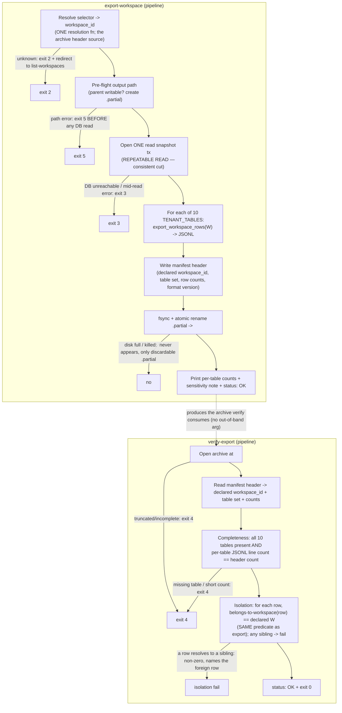

# Application Architecture: per-workspace-backup (EXPORT only)

> DESIGN wave, Propose mode. Paradigm: Rust, ports-and-adapters (ESTABLISHED — not re-litigated here).
> Brownfield: every decision is grounded in shipped code (`admin_cli.rs`, `foundry-store`, the
> slice-05 `TENANT_TABLES` idiom, `check_arch.rs`). Scope: per-workspace **export + verify**.
> Per-workspace **restore/import is OUT** (deferred — DD-MWT-09 sibling-clobber risk).

## 1. System context and capabilities

The feature adds three operator-CLI subcommands under the SHIPPED `foundry doctor` surface, OFF the
bearer API:

| Subcommand | Capability | Story |
|------------|------------|-------|
| `foundry doctor list-workspaces` | List every workspace (id + name) so the operator can name a target. | US-PWB-01 |
| `foundry doctor export-workspace <id\|name-selector> <out-path>` | Write an isolation-scoped logical archive of exactly one workspace across the 10 tenant tables; print per-table row counts + `status: OK`. | US-PWB-01 / US-PWB-02 |
| `foundry doctor verify-export <path>` | Read the archive's self-describing header and confirm (a) completeness (all 10 tables present) and (b) isolation (every row resolves to the declared workspace, zero siblings), from the path alone. | US-PWB-02 / US-PWB-03 |

The defining property (the crux, NFR-PWB-ISO-01): an export contains **ALL** of the target
workspace's tenant data and **NONE** of any sibling's.

### Architectural style

No new style. This is a new **driving adapter** (a CLI subcommand family) plus two **driven
operations** (a scoped logical reader, a file writer) layered onto the shipped modular-monolith +
ports-and-adapters Rust workspace. The reader reuses the shipped `Store`/sqlx seam exactly as
`restore-comment` / `provision-workspace` do. Zero new crates (constraint confirmed).

## 2. C4 Level 1 — System Context



The bearer API and web surface are deliberately NOT connected to this capability
(NFR-PWB-SURF-01 — off-bearer; the `check_arch` boundary guard stays green).

## 3. C4 Level 2 — Container



## 4. Component diagram — the export + verify pipeline (L3)

This subsystem warrants L3: the export is a small pipe-and-filter pipeline whose stages map directly
to the failure-path exit codes and the two HIGH-risk shared artifacts (the scope predicate, the
tenant-table set).



## 5. The scoping predicate (the isolation crux) — authoritative per-table table

Grounded in the SHIPPED schema (`0001_init.sql` + `0004`/`0007`/`0008`/`0009`/`0010`/`0011`). The
selection predicate (export `WHERE`) and the verify isolation predicate are the **SAME definition**
per table. "belongs to W" is defined column-by-column below.

| # | Table | Reaches workspace via | Scope predicate (export `WHERE` == verify isolation check) |
|---|-------|------------------------|------------------------------------------------------------|
| 1 | `workspaces` | self (PK) | `id = W` (exactly one row) |
| 2 | `workspace_memberships` | direct column | `workspace_id = W` |
| 3 | `teams` | direct column | `workspace_id = W` |
| 4 | `team_memberships` | **transitive** (no `workspace_id`) | `team_id IN (SELECT id FROM teams WHERE workspace_id = W)` |
| 5 | `projects` | direct column | `workspace_id = W` |
| 6 | `issues` | direct column | `workspace_id = W` |
| 7 | `invites` | direct column | `workspace_id = W` |
| 8 | `comments` | direct column (denormalized) + `issue_id` | `workspace_id = W` (verify ALSO confirms `issue_id` resolves to an issue with `workspace_id = W` — the FK-chain cross-check, AC-02.3) |
| 9 | `machine_tokens` | direct column | `workspace_id = W` |
| 10 | `users` | **membership special case** (global identity, no `workspace_id`) | `id IN (SELECT user_id FROM workspace_memberships WHERE workspace_id = W)` |

### Two findings that sharpen the DISCUSS assumptions

1. **DISCUSS called `comments` and `team_memberships` "transitive only".** The shipped schema gives
   `comments` a **denormalized `workspace_id`** (`0004_comments.sql:21`). So only **`team_memberships`**
   is genuinely transitive-only (via `team_id`). The export still scopes `comments` by its direct
   column; the verify ADDITIONALLY walks `comment.issue_id -> issues.workspace_id` to prove the
   transitive chain agrees (AC-02.3 demands a transitive isolation check — `comments` is where it
   bites even though the direct column exists, because a denormalized `workspace_id` that disagrees
   with the issue's is itself a corruption verify must catch).

2. **The `users` special case (OD-PWB-1, RATIFIED).** `users` is a global identity table with no
   `workspace_id`. The export includes the `users` rows that are MEMBERS of W (predicate #10) plus
   the `workspace_memberships` edges for W (#2). A multi-membership user (member of Acme AND Globex)
   appearing in a Globex export is **NOT a sibling violation** — isolation applies to
   workspace-OWNED resources (rows 2-9), never to shared user identities. Verify therefore checks
   isolation on rows 1-9 strictly; for `users` it confirms each archived user **is a member of W**
   (predicate #10 holds), and does NOT fail just because that user also belongs elsewhere. This is
   the ONE place the isolation rule is "membership-bounded" rather than "owned-by-W". (ADR-001.)

### Isolation boundary (what verify asserts)

- For tables 1-9: **every** archived row's resolved workspace == declared W, and **no** archived row
  resolves to any other workspace. A planted Acme row in a Globex archive reds here (AC-02.4 /
  NFR-PWB-ISO-01 falsifiability).
- For table 10 (`users`): every archived user satisfies predicate #10 (is a member of W). A user
  who is NOT a member of W is a violation; a user who is ALSO a member of a sibling is NOT.
- Cross-check: `comments.issue_id`, `team_memberships.team_id`, `projects.team_id`,
  `issues.project_id`, `machine_tokens.user_id` referenced rows must themselves be present in the
  archive and in-scope — verify confirms referential closure (no dangling FK to an unincluded row),
  which is what makes the archive self-contained for W.

## 6. Archive format + manifest header schema (OD-PWB-3, RATIFIED)

**Decision: a directory-shaped custom archive** (NOT `pg_dump`). `pg_dump` cannot scope by a column,
so a logical SELECT-based export is mandatory; the container is therefore ours to define. Chosen
shape — a **single tar archive** (`.dump` by operator convention, but tar internally) containing:

```
<archive root>/
  manifest.json                 # the self-describing header (read first by verify)
  tables/workspaces.jsonl       # one JSON object per row, to_jsonb(t.*) idiom (slice-05)
  tables/users.jsonl
  tables/workspace_memberships.jsonl
  tables/teams.jsonl
  tables/team_memberships.jsonl
  tables/projects.jsonl
  tables/issues.jsonl
  tables/invites.jsonl
  tables/comments.jsonl
  tables/machine_tokens.jsonl
```

### `manifest.json` schema

```json
{
  "format_version": 1,
  "declared_workspace_id": "0190a1b2-....-globex",
  "declared_workspace_name": "Globex LLC",
  "exported_at": "2026-06-16T12:34:56Z",
  "tenant_tables": ["workspaces","users","workspace_memberships","teams",
                    "team_memberships","projects","issues","invites",
                    "comments","machine_tokens"],
  "row_counts": { "workspaces": 1, "users": 7, "teams": 3, "...": 0 }
}
```

- **`declared_workspace_id`** is the header field that makes `verify-export <path>` round-trip with
  NO out-of-band argument (NFR-PWB-INT-01). Verify reads it, then re-applies the SAME scope predicate
  (Section 5) against every archived row.
- **`tenant_tables`** in the manifest is written FROM the shared constant (OD-PWB-2) and re-checked
  by verify against ITS copy of the same constant — a manifest listing 9 tables fails completeness.
- **`row_counts`** lets verify detect truncation cheaply (manifest says `issues: 412`, the JSONL has
  300 lines -> exit 4) WITHOUT trusting the count blindly — the isolation pass still reads every row.
- Why JSONL + `to_jsonb(t.*)`: it is the EXACT shipped idiom from
  `feature_mwt_slice_05_migration_guarantee.rs::snapshot_tenant_tables` (`SELECT to_jsonb(t.*)::text`).
  Reusing it means the export reader and the shipped migration-guarantee proof speak the same
  whole-row language; verify can diff/parse rows identically. (ADR-002.)

### Why tar (not a bare directory, not pg_dump custom)

- A bare directory is not "a file at the output path" — the ACs assert `a file exists at <path>` and
  atomicity via rename. A single tar file renames atomically; a directory tree does not.
- `pg_dump -Fc` is the whole-instance tool and cannot column-scope. Reusing it would force a
  dump-then-filter dance with no isolation guarantee. Rejected.
- tar is in `std`-adjacent crates already common in the Rust ecosystem (the `tar` crate, MIT/Apache);
  no new heavyweight dependency. (Software-crafter picks the exact crate; design pins the container
  SHAPE, not the crate.)

## 7. Export consistency + the store-fn design (ADR-003)

- The export reads all 10 tables inside **ONE transaction at `REPEATABLE READ`** so the archive is a
  single consistent cut — a concurrent write mid-export cannot make `issues` reflect a comment that
  `comments` does not (referential closure, Section 5). Read-only; the tx never writes.
- New scoped store fn per table: `Store::export_workspace_rows(&mut tx, table, W) -> Vec<String>`
  (whole-row JSONL), OR a single `export_workspace(&self, W) -> WorkspaceExport` that runs all 10
  inside the tx. **Recommended: one `export_workspace` fn** owning the tx + the 10 scoped SELECTs,
  so the predicate lives in ONE place in `foundry-store` (not scattered across 10 call sites) and
  is unit-testable at the store seam. The predicate strings ARE the shared artifact
  `workspace_scope_predicate`.
- The reader lives in `foundry-store` (the shipped seam), invoked from `admin_cli.rs` exactly as
  `provision-workspace` invokes `Services` / `Store`.

## 8. Quality attribute strategies (ISO 25010)

| Attribute | Strategy |
|-----------|----------|
| **Security (confidentiality)** | Archive contains `users.password_hash` + `machine_tokens` rows by necessity — an operator-trust artifact (NFR-PWB-SEC-01). CLI prints the at-rest sensitivity note on success (AC-03.6). No secret logged to stdout/stderr beyond the note. At-rest encryption is the operator's responsibility (same posture as the whole-instance dump). |
| **Reliability (recoverability)** | Atomic write: `<out>.partial` -> fsync -> rename (NFR-PWB-ATOM-01). A killed/disk-full export leaves no `<out>` (AC-03.3). Output-path errors fail BEFORE any DB read (exit 5, AC-03.2). |
| **Functional correctness (the crux)** | Selection predicate == isolation predicate, ONE definition (Section 5). Falsifiability: a planted sibling row reds verify (AC-02.4). |
| **Maintainability (modularity)** | Reuses the shipped `foundry doctor` scaffold + `Store` seam; zero new crates. The tenant-table set is ONE constant (OD-PWB-2) gold-tested so a future tenant table cannot be silently omitted. |
| **Integrity / verifiability** | Self-describing manifest header -> verify round-trips from the path alone (NFR-PWB-INT-01). |
| **Performance** | Single-pass per table, one tx; row counts are O(rows). No optimization architecture needed — operator-cadence batch job, not a hot path. |
| **Observability** | Diagnostics and failure messages go to **stderr** (mirrors `admin_cli.rs`); operator-readable progress + per-table counts + `status: OK` go to **stdout** (greppable in cron, same as `backup-verify`). The only persisted state is the manifest header + the exit code — no hidden state, no DB-side audit log in v1 (a possible additive follow-up, ADR-006). A run is fully reconstructable from its exit code + stdout `status:` line. |

## 9. Failure-path / exit-code contract (mirrors admin_cli.rs)

| Code | Meaning | Where |
|------|---------|-------|
| 0 | success (`status: OK`) | export + verify happy path |
| 2 | invalid argument: unknown workspace (redirect to `list-workspaces`), missing args | export resolve stage |
| 3 | DB / infra failure: DATABASE_URL unreachable, mid-read DB error | export read stage |
| 4 | archive truncated / incomplete | verify only |
| 5 | output-path error (parent missing / unwritable); fails before any DB read | export pre-flight stage |

## 10. Architecture enforcement (LAYER-1e / check_arch — RESOLVED)

The export reader scopes by a **CLI-supplied** workspace id (operator-trusted, off the bearer
surface), NOT a request-parsed id. The shipped `check_app_tenant_scoping` LAYER-1e detector
(`xtask/src/check_arch.rs`) only walks `crates/foundry-app/src` and **allow-lists `admin_cli` by file
stem** (`is_tenant_scoping_allowlisted`). Since the new code lives in `admin_cli.rs`, it is ALREADY
exempt — **no new allow-list line is needed**, provided the export code stays in `admin_cli.rs` (or
in `foundry-store`, which LAYER-1e does not scan). This is the deliberate, documented exemption:
the operator CLI is the trusted instance-scoped surface. (ADR-006.)

`Style: Modular monolith + ports-and-adapters (Rust). Enforcement: cargo xtask check-arch (LAYER-1e
tenant-scoping, allow-listed for admin_cli) + cargo-deny dependency direction + the OD-PWB-2 gold
test.`

## 11. Gold-test table-set guard (OD-PWB-2, the second HIGH-risk artifact — ADR-005)

ONE shared constant `TENANT_TABLES` (the 10 tables) read by BOTH export and verify. A gold test
plants one row in EACH of the 10 tenant tables for a target workspace, exports, and asserts the
export count AND the verify completeness check see all 10 — mirroring `check_arch.rs`'s
plant-a-violation discipline. Omitting a table from the constant reds the gold test. The constant is
DELIBERATELY distinct from `admin_cli.rs::run_backup_verify`'s list (which includes
`issue_attachments`/`session`/`outbox` and omits `invites`/`machine_tokens`) — see `upstream-changes.md`.

## 12. Migration: NONE (confirmed)

The feature is **read-only**. It adds no column, table, or index. No migration `0012` is created.
(Confirmed against the read-only business rule and the SELECT-only store-fn design.)

## 13. External integrations

None. The only external dependency is the live PostgreSQL the instance already owns (via the shipped
`Store::connect` seam) and the operator's local filesystem. No third-party API, no contract tests
required. The handoff to platform-architect carries no external-integration annotation.
