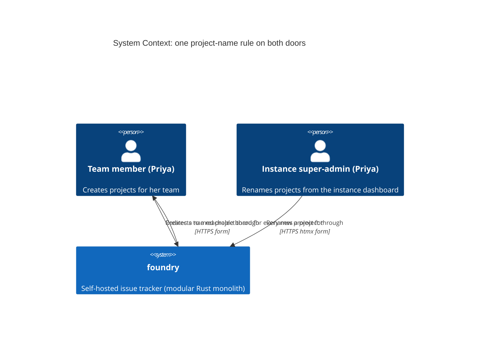
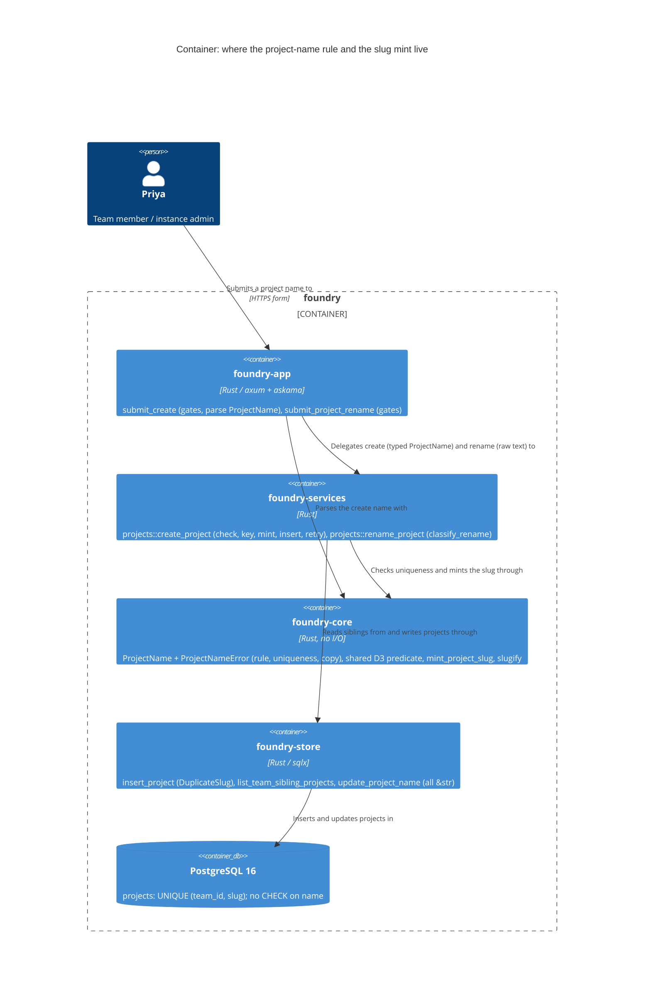

<!-- markdownlint-disable MD024 -->
# Feature Delta: project-name-rule

Every path that sets a project name (the team-member create form and the
instance-admin rename) refuses the same names for the same reasons, in the same
words. The 256-character limit and the "unique within the team" meaning move
from rename to create. A new rule refuses control characters on both, using the
workspace rule's character set exactly. A project whose name has no ASCII letter
or digit (such as "日本語ボード" or "🚀") gets a working board URL instead of an
empty slug.

## Wave: DISCUSS

Product owner: Luna (nw-product-owner) | Date: 2026-10-06 | Feature type:
cross-cutting (Decision 1) | Walking skeleton: none, brownfield (Decision 2) |
UX depth: lightweight (Decision 3) | JTBD: yes, new sibling job (Decision 4) |
Density: lean, Tier-1 [REF] only.

### [REF] Prior Wave Consultation

| Artifact | Status | Note |
|---|---|---|
| `docs/product/jobs.yaml` | ✓ | `job-instance-project-rename` and `job-instance-workspace-naming` are the nearest jobs. A sibling job `job-project-naming` is appended (see JTBD for why). |
| `docs/product/personas/persona-instance-operator.yaml` | ✓ | Priya Raman (who already creates "Reading List" / READ and "Homelab Ops" / OPS) and Marco reused. `also_referenced_by` and `pains_addressed_to_date` extended. |
| `docs/product/architecture/brief.md` ("Names are labels; slugs are identity") | ✓ | Project slug is minted once at create by `foundry_core::slugify` and never re-derived. Its last paragraph says "Project names keep their own rule". DELIVER updates it (DoD 9). |
| `docs/product/outcomes/registry.yaml` (OUT-1, OUT-17, OUT-18) | ✓ | OUT-1 pins the project rename's three refusals and copy. OUT-18 is the workspace rule this feature mirrors. The new OUT row at DISTILL carries `related: [OUT-1, OUT-18]`, and OUT-1 gets an `amended` note. |
| Precedent `docs/feature/instance-workspace-name-rule/feature-delta.md` | ✓ | DISCUSS D1-D12 (esp. D4 set, D5 order, D6 legacy no-op, D7 nothing left behind, D8 precedence, D12 no `maxlength`), DESIGN DDD-1..3 (value object in `foundry-core`, copy as `Display`), DDD-11 (no raw name in logs), Changed Assumptions ("cosmetic" claim revised). All carried below. |
| Precedent `docs/feature/instance-admin-project-rename/feature-delta.md` | ✓ | D1 (display name only), D4 (rule and uniqueness), D6 (422 into the row slot), D7 (create-path duplicate residual, out of scope there). |
| `adr-project-rename-001` / `-002` | ✓ | 001: slugs are identity, minted once, never derived. 002: rename is a services use-case; uniqueness is check-then-write in the app; TOCTOU accepted; "the designated fix if a future wave closes D7" is serialization, which this feature does NOT need (D6 below). |
| `adr-workspace-name-001` / `-002` | ✓ | 001 amended the "handler owns the copy" convention for workspace names only and said "Project and lane copy keep the convention". This feature asks DESIGN to extend 001 to project names (D4). 002 is bootstrap-specific; relevant only to the seeded "Sandbox" project (W3). |
| `docs/evolution/2026-10-06-instance-workspace-name-rule.md` | ✓ | Open/deferred: "Project names still accept control characters; the same rule could follow as its own change." This feature is that change. |
| `docs/evolution/2026-08-22-instance-admin-project-rename.md` | ✓ | Open/deferred: "D7 residual: create path can still mint a duplicate display name post-rename." This feature closes it (D6). |
| `docs/product/vision.md`, `docs/project-brief.md`, `docs/stakeholders.yaml`, `docs/product/journeys/` | ⊘ | Do not exist (same as both precedents). No journey created (lightweight UX). |
| DISCOVER / DIVERGE artifacts for this feature | ⊘ | None. The job is grounded in code reading and the user's locked scope. Recorded risk, as in both precedents. |

No contradiction with prior evidence. Two prior statements change (see Changed
Assumptions): the project-rename D7 residual is closed, and ADR-WORKSPACE-NAME-001's
"project copy keeps the per-handler convention" is lifted for project names.

### [REF] Write-path inventory (code-grounded)

Production SQL that writes `projects.name` (`crates/foundry-store/src/lib.rs`):
**two INSERTs (:1576, :3462) and one UPDATE (:4149)**. The other production
`UPDATE projects` (:1746) touches `next_issue_number` only. Every other
`INSERT INTO projects` is in a test or acceptance fixture.

| # | Entry point (what the user runs) | Who may run it | Adapter | Service | Store write | Name rule today |
|---|---|---|---|---|---|---|
| W1 | `POST /team/{team_slug}/projects` (form at `GET /team/{team_slug}/projects/new`, plain POST; htmx-aware when `HX-Request: true`) | Any signed-in **member of that team** (any team role) in the acting workspace. Not admin-only. | `crates/foundry-app/src/projects.rs:104` `submit_create`: trim :154, empty :157, `slugify` :171, slug pre-check :179-195, key :200, insert :212-243 | none (handler calls the store) | `Store::insert_project` `lib.rs:1558` → INSERT :1576, plus `seed_creation_lanes` :1589 in the same transaction | Trim, non-empty, then **slug collision only** (pre-check plus `UNIQUE (team_id, slug)`). **No length cap** (confirmed: 300 characters are accepted today). No control-character check. A NUL reaches Postgres and returns a 500. |
| W2 | `POST /admin/instance/projects/{project_id}/rename` (row form on `/admin/instance/workspaces`, htmx) | Instance super-admin only | `crates/foundry-app/src/instance_admin.rs:485` `submit_project_rename` (copy :518-529) | `crates/foundry-services/src/projects.rs:111` `rename_project` → `classify_rename` :69 (private), cap `MAX_NAME_SCALARS` :96, `collides_with_sibling` :100 | `Store::update_project_name` `lib.rs:4144` → UPDATE :4149 | Trim, no-op, empty, at most 256 scalars, unique (case-insensitive name OR slug, self excluded). No control-character check. A NUL returns a 500. |
| W3 | `POST /bootstrap?token=…` (first-run claim) | Holder of a live bootstrap link | `crates/foundry-app/src/bootstrap.rs:142-158` passes the **constant** `"Sandbox"` / `"sandbox"` / `"GEN"` | none | `Store::claim_bootstrap_and_create_workspace` `lib.rs:713` → `seed_initial_workspace` :3422 → INSERT :3462 | Not user input. The constant must satisfy the rule (D13). |

These were checked and are **not** project-name write paths:

- `/api/v1` has **no** project create or rename route. Its routes are issues, history, comments and tokens only (`crates/foundry-api/src/lib.rs:312-340`).
- **No** `foundry doctor` subcommand creates or renames a project (`crates/foundry-app/src/main.rs:800-993`: backup-verify, restore-comment, provision-workspace, grant-super-admin, list-workspaces, list-users, export-workspace, verify-export, reset-password, add-test-user).
- Workspace provisioning (`Store::provision_workspace`) creates no project.
- `Store::create_initial_workspace` (`lib.rs:641`) shares the W3 INSERT. It has no production caller, and check-arch already forbids one (`workspace-name-one-source` clause b).
- The per-workspace export is read-only (there is no import). Migrations write no project names.
- Whole-instance `pg_restore`, test fixtures and hand-typed `psql` bring in names verbatim. Those are legacy data (D8). A DB CHECK is out of scope.

**Slug minting today (verified by code reading).** The slug is minted only on W1, at
`projects.rs:171`, as `slugify(trimmed name)`:

- `foundry_core::slugify` (`foundry-core/src/lib.rs:273-291`) keeps ASCII `[A-Za-z0-9]`, lower-cased. Every other run of characters, including all non-ASCII letters, emoji, punctuation and control characters, collapses to one hyphen, and leading and trailing hyphens are stripped.
- So a name with no ASCII letter or digit mints the **empty slug `""`**. Examples: "日本語ボード", "🚀", "---", "Ωμέγα".
- `projects.slug` is `TEXT NOT NULL` with `UNIQUE (team_id, slug)` and no shape CHECK (`0001_init.sql:56`, `:60`), so `""` is stored.
- Create then redirects to `/team/backend/project/` (`projects.rs:225`).
- Every project-scoped route takes the slug as a path segment, `/team/{team_slug}/project/{project_slug}[/…]` (`foundry-app/src/lib.rs:569-705`, 17 routes: board, report, issues, lanes, events, comments). The `/api/v1/teams/{team_slug}/projects/{project_slug}/…` routes (`foundry-api/src/lib.rs:314-338`) take it the same way.
- axum 0.8.9 routes through matchit 0.8.4, where a `{param}` segment does not match an empty segment. So **no board, report or API route can reach an empty-slug project**: it is created, listed, and unreachable. DISTILL pins this observable with a "before" scenario.
- A second such name in the same team derives `""` again. The slug pre-check (`projects.rs:179`) finds the first project and refuses with "Project name must be unique within the team", even though the names differ.
- Rename never mints or touches a slug (ADR-PROJECT-RENAME-001). However, its slug arm (`collides_with_sibling`, `foundry-services/src/projects.rs:100`) compares `slugify(new) == ""` against a sibling's stored `""`, so it has the same false-duplicate defect.

A project name is printed at: the board heading, the change-report heading, the
instance-dashboard project row, the new-issue dialog's project picker, and the
sidebar. All of these are HTML (escaped). The CSV export filename uses the slug, not the
name. No CLI output and no email body prints a project name today.

### [REF] Persona

**Priya Raman** (`persona-instance-operator`) at two doors. As a **member of team
Backend** in workspace Canzan Labs, she creates small boards ("Homelab Ops" / OPS,
"Reading List" / READ) through the create form. As **instance super-admin**, she
corrects project names from the instance dashboard. **Marco**
(`persona-team-member-foil`) is the authorization foil: he is not on team Backend
and not an instance admin.

### [REF] JTBD

**job_id: `job-project-naming`** (appended to `docs/product/jobs.yaml`; sibling
of `job-instance-project-rename` and `job-instance-workspace-naming`).

One-liner: *When I name a project, whether creating a board for my team or
correcting a name from the instance dashboard, I want both doors to refuse the
same bad names for the same stated reason and to mean the same thing by "unique
within the team", so no project starts life with a name the other door would
refuse, and the team never sees two projects it cannot tell apart.*

Sibling, not an extension:

- **Not `job-instance-workspace-naming`.** That job's object is the workspace,
  and its actor is always the instance super-admin. The create door here is a
  **team member's** door. Folding projects in would rewrite that job's situation
  and actor.
- **Not `job-instance-project-rename`.** That job's situation is *drift* (a name
  that no longer fits). This job's situation is *creation, at either door*, and
  its outcome is *one consistent rule*. The two jobs overlap only at W2, which
  gains the control-character arm.

`relates_to` on the new job records both overlaps.

### [REF] Locked Decisions

| ID | Decision | Rationale / source |
|---|---|---|
| D1 | **Scope: one rule on both user doors, W1 (create) and W2 (rename).** W3 is a constant (D13). There is no API or CLI door (inventory). | User-locked: "one rule, all paths". Code reading found two user doors, not four. |
| D2 | **The rule** (applied to the trimmed value; the trimmed value is what is stored): non-empty; no control character (D3); at most **256 Unicode scalars**; unique within the team (D6). | User-locked. 256 is today's rename cap (`projects.rs:96`), and create **does not enforce it today** (confirmed: create has no length check, and `projects.name` is `TEXT NOT NULL` with no CHECK, `0001_init.sql:55`). |
| D3 | **The control-character set is exactly the workspace rule's D4 set**: Unicode Cc (`char::is_control`), the bidi embedding, override and isolate controls U+202A-202E and U+2066-2069, and U+2028/2029. Every other format character (Cf) stays allowed (ZWJ, ZWNJ, soft hyphen, variation selectors, ZWSP, LRM/RLM, BOM). **One definition of the set serves both name rules** (DESIGN picks the shape), so the workspace and project sets cannot drift. | User-locked ("exactly the workspace rule's D4 set"). Rationale is the precedent's: refusing all Cf would refuse "👨‍👩‍👧" and ZWNJ spellings, and refusing only Cc lets a U+202E reorder the name on every board heading. |
| D4 | **Copy, byte-identical on both doors, from one source**: "Project name must not be empty" / "Project name must not contain control characters" / "Project name must be at most 256 characters" / "Project name must be unique within the team". The first, third and fourth ship today (`instance_admin.rs:518-529`; create ships the first and fourth at `projects.rs:165`, `:188`, `:238`). The second is new and follows the shipped pattern. DESIGN picks the single source, following ADR-WORKSPACE-NAME-001's pattern where it fits. That ADR said "project copy keeps the per-handler convention"; this feature lifts that for project names. | User-locked pattern. Today, "must not be empty" and "must be unique within the team" are each hand-kept in two adapter files. Without one source, a fifth hand copy would be added. Not an open question: the wording follows the shipped lines and the user-confirmed workspace wording. |
| D5 | **Check order.** **Create**: trim, then empty, then control, then length, then uniqueness. After the name passes, the key-prefix checks run as today (shape 422, then duplicate key 409). Then the slug is minted (D7, D15), and the insert runs. **Rename**: trim, then no-op (byte-equal), then empty, then control, then length, then uniqueness. | Precedent D5: the pure arms run in the workspace order, and control comes before length so a pasted multi-line blob is told its real problem. Uniqueness comes last, because it alone needs the siblings and because "unique" is meaningless advice for a name that is refused anyway. Name before key keeps create's shipped precedence ("name duplication as the more actionable error", `projects.rs:173-178`). |
| D6 | **One meaning of "unique within the team" on both doors, which closes the project-rename D7 residual.** A name is refused when, within the same team, the trimmed name case-insensitively (Unicode `to_lowercase`) equals another project's name, **or** `slugify(name)` is non-empty and equals another project's **stored** slug. Rename excludes the project itself. The slug arm is skipped when `slugify(name)` is empty (see D15): an empty derived slug identifies nothing, so it cannot be a collision. Create gains the name arm; today it checks the slug only. Check-then-write stays (ADR-PROJECT-RENAME-002). The `UNIQUE (team_id, slug)` index still backstops the slug arm under a race. The name arm's race window is accepted, as ADR-002 accepted it for rename. | User-locked ("uniqueness KEPT as today: case-insensitive name OR slug, self excluded"). Today the two doors disagree: after "Auth v2" (slug `auth-v2`) is renamed "Identity Platform", create accepts a second "identity platform" (slug `identity-platform`). One rule means one definition. Closing D7 needs no serialization machinery, because it is a missing arm, not a race. |
| D7 | **Slugs.** Create mints the slug once, from the **validated** trimmed name and the validated key prefix, **after** the rule and the key checks pass, so a refused create mints nothing. A non-empty `slugify(name)` is used as today. An empty one gets the D15 fallback. A control character cannot reach a slug: `slugify` keeps only ASCII letters and digits, and every other character collapses to a hyphen. Rename never touches the slug (ADR-PROJECT-RENAME-001). Legacy slugs are unchanged. | The user asked how slugs interact. The rule decides the name, and the slug is derived from what the rule accepted. Side effect worth recording: an allowed invisible character (ZWSP, soft hyphen) inside a name acts as a separator in the slug, so "Auth\u{200B}v2" collides with "Auth v2" via the slug arm and is refused. |
| D8 | **Legacy names are not rewritten, and the rename no-op still wins.** A trimmed rename submission byte-equal to the stored name is a quiet 200 with no write, even if the stored name is over 256 scalars, contains a tab or a bidi control, or case-duplicates a sibling. NUL cannot be stored (Postgres `text`), so no legacy name contains it. A browser strips line breaks from a text input, so an untouched rename form for a legacy name containing a newline arrives without it. That is a real rename to the cleaned name. It passes the rule only if the cleaned name is also unique (D6), and otherwise gets the uniqueness copy. | User-locked. Precedent D6 / ADR-PROJECT-RENAME-002 no-op. |
| D9 | **A refusal leaves nothing behind.** Create inserts no project row and no lane rows, and allocates no key prefix, so the same key prefix works on the corrected retry. Rename writes nothing. | Fail-closed and retryable (precedent D7). |
| D10 | **Authorization precedence is unchanged; the rule runs only for an authorized caller.** **Create**: a signed-out caller is redirected to `/sign-in`; an unknown team gets today's team-not-found 404; a signed-in non-member gets the uniform `resource_not_found_page` 404; then the rule runs. **Rename**: the CSRF middleware runs first; then a non-admin gets the uniform 404 (`require_instance_admin`); then a malformed id gets the uniform 404; then the service's in-seam admin re-check and an unknown project id get the uniform 404; then the rule runs. So an unknown project id with a bad name still answers 404, never 422. | ADR-002 non-enumeration idiom. No new oracle: the rule is public, and it runs only after the caller is shown to be allowed. |
| D11 | **What each door shows on refusal (shipped shapes, new copy only).** Create, plain POST: 422 with the create form re-rendered, the copy in the form's error slot, and name and key prefix retained. Create, htmx: 422 with the bare error fragment. Rename: 422 with the `project-rename-error` fragment in the row's `[data-error-slot]`. | Shipped idioms (`projects.rs:691` `name_error_response`; `instance_admin.rs:518`). No new UI. |
| D12 | **No DB CHECK, no store validation, no client-side enforcement.** Store signatures stay `&str`, and fixtures must still seed legacy names. No `maxlength` or input pattern on either name input. | User-locked (no DB CHECK). Precedent D12 / DDD-6: `maxlength` silently truncates and hides the refusal. |
| D13 | **The bootstrap "Sandbox" constant is not a door, but it must pass the rule.** A test pins that the seeded name passes the shared rule. DESIGN may route it through the rule's type. | Inventory W3. Seeding is a write path, so "all paths" includes it, but it has no user input to refuse. |
| D14 | **Refusals log no raw name.** | Precedent DDD-11: a control-character name is the input that forges lines, and echoing it into `tracing` moves the forgery into the logs. |
| D15 | **Every new project gets a non-empty, team-unique slug, so the redirect lands on a working board** (user, OQ-1 resolved as option c). When `slugify(name)` is empty, the slug is the project's **key prefix, lower-cased**: "日本語ボード" with key "JP" gets `/team/backend/project/jp`. If that slug is already a stored slug in the team, append `-2`, then `-3` and so on, taking the lowest free suffix: `jp-2`. The fallback **never refuses**. A name-derived (non-empty) slug that collides is still refused by D6's slug arm, as today. Slugs remain identity: minted once at create and never changed by rename (ADR-PROJECT-RENAME-001). The URL form is confirmed by OQ-3. | Code reading (inventory, "Slug minting today"). The key prefix is already the project's short identity (`^[A-Z]{2,6}$`, `UNIQUE (workspace_id, key_prefix)`, so unique within a team, and it appears in every issue key such as JP-7). It is ASCII, readable and stable, and it is validated before the slug is minted. A collision happens only when a sibling's slug happens to equal the lower-cased key (for example a project named "JP" with key "JPX"). The suffix covers that case without a refusal the operator cannot act on. Alternatives (OQ-3): `project-N`; a UUID fragment; transliteration (a new dependency, and still empty for emoji); a percent-encoded Unicode slug (changes the slug alphabet every URL builder relies on). |
| D16 | **No data rewrite or migration.** Existing empty-slug projects, if any, are left alone: rename never touches slugs, and no backfill runs. Dogfood (DoD 7) counts `slug = ''` on the operator's instance. If the count is above zero, it goes to the user as a follow-up decision (a one-off repair is safe in principle, because no URL to such a project has ever worked, so none can be bookmarked). Thanks to D6's empty-slug skip and D15's suffix, a legacy `""` sibling neither blocks nor collides with new creates. | User preference: no data rewrite unless required. The fix is required only for new creates, and the legacy rows are inert. |
| D17 | **Residual, accepted: a fallback slug can later refuse a name.** After "日本語ボード" takes `jp`, creating a project named "JP" (slug `jp`) in the same team gets "Project name must be unique within the team", although no visible project is named "JP". This is the same class as a renamed project keeping its old slug (shipped behaviour, D6's slug arm), and it is rare (a team's name would have to equal another project's key prefix). | Changing the slug arm into "suffix instead of refuse" would rewrite the user-locked uniqueness meaning (D6). |

### [REF] Open Questions

- **OQ-1 (resolved 2026-10-06, the user chose option c): fix slug minting in this feature.** Names with no ASCII letter or digit get a usable, team-unique slug at create (D15, D16, D17; US-PNR-04, slice 04). The rejected alternatives were (a) leaving it as a follow-up and (b) a create-only "must contain a letter or digit" refusal.
- **OQ-2 (resolved 2026-10-06, the user said yes): close D7.** Create uses rename's uniqueness check: a case-insensitive name match OR a slug collision within the team (D6; US-PNR-03, slice 03).
- **OQ-3 (resolved 2026-10-06: the user confirmed the key-prefix URL with `-2`, `-3`… on collision): what the fallback URL looks like.** D15 locks the recommendation: the **lower-cased key prefix, with `-2`, `-3`… on collision**. "日本語ボード" with key "JP" gets `/team/backend/project/jp`. The alternatives are:
  - (i) `project-N`, where N is the lowest free number in the team (`/project/project-1`). It carries no meaning and collides with names like "Project 1".
  - (ii) A short id fragment from the project UUID (`/project/p-0192ab3c`). Always unique, but opaque, and it differs from the issue keys users already know.
  - (iii) Transliteration ("日本語ボード" → `nihongo-bodo`). Needs a new dependency, is language-dependent, and is still empty for "🚀".
  - (iv) Percent-encoded Unicode slugs (`/project/%E6%97%A5…`). This changes the slug alphabet that every URL builder, the `UNIQUE (team_id, slug)` meaning and the CSV filename rely on, so it is a much larger change.

  Please confirm the key-prefix form, or pick one of (i)-(iv).
- **OQ-D1 (DESIGN): the shape of the one rule and the one copy source.** For example, a `foundry-core` `ProjectName` value object for the pure arms (empty, control, length) with copy as `Display`, plus a uniqueness check that both doors call with the team's siblings. Also: where the uniqueness copy lives, and how the D3 predicate is shared with `WorkspaceName`.
- **OQ-D2 (DESIGN): W1 has no service seam.** Create calls the store directly. DESIGN decides whether create moves behind a `foundry-services` use-case (as rename did, ADR-PROJECT-RENAME-002) or keeps a thin handler that calls the shared rule. Either way, the D10 precedence and the D11 shapes are the observable contract.
- **OQ-D3 (DESIGN): rename runs its pure arms after two store reads** (context and siblings). DESIGN may move the pure arms earlier, provided D10 holds: an unknown id with a bad name still gives 404.
- **OQ-D4 (DESIGN): where the D15 mint lives, and how its race is handled.** It could be a pure `foundry-core` function of the name, the validated key and the team's stored slugs (beside `slugify`). If a concurrent create takes the fallback slug between the read and the INSERT, the `UNIQUE (team_id, slug)` violation currently maps to `ProjectInsertError::DuplicateName`, which shows "Project name must be unique within the team". For a fallback slug that copy is wrong. DESIGN picks a retry with the next suffix, or accepts the race as ADR-PROJECT-RENAME-002 does. Either way, a single-operator create must never see that copy for a fallback slug.

### [REF] Journey (lightweight: happy path plus key error paths)

Emotional arc, **Prevention instead of repair**. It runs from hurried (a new board
for something she is about to track), to brief friction (a refusal), to reassured
(the reason is stated in the same words the other door uses, and nothing was
half-made), to confident (the corrected name lands, and the team sees one
"Identity Platform", not two).

```text
[Door]                          [Types]                                   [Sees]                                             [Next]
/team/backend/projects/new  →   name: 300-char pasted ticket text,        Form again, 422: "Project name must be at most     Shortens to "Homelab Ops",
(create form)                   key: OPS                                  256 characters", name + key kept, no project        same key OPS, lands on board
/team/backend/projects/new      "identity platform", key IDP              422 "Project name must be unique within the team"   Realises the board already exists
                                (Backend already has "Identity Platform"   (today: accepted, a lookalike second project)      and opens it
                                 with slug auth-v2)
Instance dashboard row          "Sand<TAB>box" (pasted) on "Sandbox"       Row slot: "Project name must not contain           Retypes "Sandbox Experiments"
Rename (super-admin)                                                      control characters", name unchanged
/team/backend/projects/new      "日本語ボード", key JP                       Today: redirect to /team/backend/project/ → 404,   After: lands on /team/backend/project/jp,
                                                                          project stranded                                  board heading "日本語ボード"
```

### [REF] Scope Assessment: PASS (4 stories, 1 bounded context, estimated 2-3.5 days)

There is one rule in one bounded context: project naming and slug minting, with
the validator and the mint in `foundry-core` / `foundry-services`. It reaches two
driving adapters (`projects.rs` create, `instance_admin.rs` rename) and one seed
constant. No oversized signal fires: 4 stories, 1 context, no walking skeleton,
2 integration points, under a week.

### [REF] Shared Artifacts

| Artifact | Source of truth | Consumers | Risk |
|---|---|---|---|
| The pure name rule (empty, control, length, and their order) | one shared rule (OQ-D1) | W1, W2, W3 test | HIGH: a second copy drifts. That drift is what this feature removes. |
| The D3 character set | one definition shared with `WorkspaceName` (D3) | project rule, workspace rule | HIGH: two hand-kept sets would diverge silently. |
| The uniqueness definition (D6) | one shared check (OQ-D1); today it lives only in `collides_with_sibling` (`foundry-services/src/projects.rs:100`) | W1, W2 | HIGH: closes D7 only if both doors call it. |
| The four refusal strings (D4) | one source (OQ-D1) | create form slot, create htmx fragment, rename row slot | HIGH: byte-identity is KPI-2. |
| `foundry_core::slugify` | `foundry-core/src/lib.rs:273` | create mint, uniqueness slug arm | MEDIUM: shipped, unchanged. |
| Project slug minting (D15: name slug, else key-prefix fallback with suffix) | one mint function (OQ-D4) | create only | HIGH: slugs are identity. A second mint path, or a mint at render time, would break URLs (ADR-PROJECT-RENAME-001). |
| 256 cap | `MAX_NAME_SCALARS`, `foundry-services/src/projects.rs:96` | both doors | MEDIUM: moves to the shared rule, value unchanged. |

### [REF] User Stories

#### US-PNR-01: A pasted project name carrying invisible characters is refused at rename, with the reason stated

`job_id: job-project-naming`

##### Elevator Pitch

Before: Priya can rename "Sandbox" to a pasted "Sand<TAB>box" or to a name carrying a right-to-left override, and it is accepted and shown on the board heading and in the new-issue picker. A NUL sent with `curl` gets a bare "internal error".
After: on `/admin/instance/workspaces` she submits the Rename form on the "Sandbox" row (`POST /admin/instance/projects/{project_id}/rename`) with "Sand\tbox" → sees "Project name must not contain control characters" in that row's error slot, and the name stays "Sandbox".
Decision enabled: retype the name cleanly instead of shipping an invisible character onto every team member's board heading.

##### Problem

Priya copies names out of chat and spreadsheets. A trailing cell tab, a line
break, or a bidi override comes along invisibly. The project rename door accepts
all of them. A NUL becomes a 500, because Postgres refuses the byte and the
service maps the failure to "internal error". The workspace rename on the same
page already refuses these characters (v0.10.0), so the dashboard contradicts
itself.

##### Who

- Instance super-admin | instance dashboard, browser, sometimes `curl` | wants the label to be exactly what she meant.

##### Domain Examples

1. **Tab**: "Sand\tbox" on the "Sandbox" (SBX, team Backend) row gets 422 with the control-character copy. The name is unchanged.
2. **Bidi override**: "Ops\u{202E}spoH" (renders reversed) gets the same 422.
3. **NUL** (with `curl`): "Identity\u{0}Platform" gets the same 422, not a 500.
4. **Allowed**: "Café Roadmap 👨‍👩‍👧" (contains ZWJ) is accepted. Its slug is unchanged.
5. **Trimmed, not refused**: "\tSandbox Experiments\n" is stored as "Sandbox Experiments".
6. **Legacy no-op**: a project stored before this rule as "Homelab\tOps" is resubmitted byte-equal and gets a quiet 200 with no write (D8).
7. **Precedence**: a 300-scalar name containing a tab gets the control copy, not the length copy. A tab-containing name whose slug collides with a sibling also gets the control copy, not the uniqueness copy (D5).

##### UAT Scenarios (BDD)

###### Scenario: A project name with a pasted tab is refused inside the row

- Given Priya is signed in as an instance admin and project "Sandbox" exists in team Backend
- When she submits "Sand\tbox" on its rename form
- Then the row's error slot shows "Project name must not contain control characters"
- And the project is still named "Sandbox" on the dashboard and its board

###### Scenario: A name that would display reordered is refused

- When Priya submits "Ops\u{202E}spoH" for "Sandbox"
- Then she gets the same refusal and nothing changes

###### Scenario: A NUL in the name is refused with the reason, not an internal error

- When Priya's rename request carries "Identity\u{0}Platform"
- Then she gets 422 with "Project name must not contain control characters", not a 500

###### Scenario: Emoji and accented names are still accepted, and the board URL is unchanged

- When Priya renames "Sandbox" to "Café Roadmap 👨‍👩‍👧"
- Then the row shows "Café Roadmap 👨‍👩‍👧" and `/team/backend/project/sandbox` still serves the board

###### Scenario: An untouched legacy name with a tab can be left as it is

- Given project "Homelab\tOps" was stored before this rule
- When Priya submits "Homelab\tOps" unchanged
- Then she gets a quiet success and nothing is written

###### Scenario: The reason given is the first one that applies

- When Priya submits a 300-character name containing a tab
- Then the refusal reads "Project name must not contain control characters"

##### Acceptance Criteria

- [ ] A trimmed rename value containing any D3 character gets 422 with the D4 control copy in the row's `[data-error-slot]`, and nothing is written (scenarios 1-3).
- [ ] A NUL is a 422, never a 500 (scenario 3).
- [ ] ZWJ emoji, ZWNJ and accented names within 256 scalars are accepted. The slug and URLs are unchanged (scenario 4).
- [ ] Leading and trailing whitespace controls are trimmed before any check.
- [ ] A byte-equal legacy name containing a D3 character is a quiet 200 with no write (scenario 5, D8).
- [ ] The order is empty, then control, then length, then uniqueness (scenario 6, D5). The shipped empty, 256/257 and duplicate behaviour is unchanged (the iapr lane stays green).

##### Outcome KPIs

KPI-1, KPI-2, KPI-3.

##### Technical Notes

- Extends the shipped classifier (`foundry-services/src/projects.rs:69`). The copy moves to the one source (D4, OQ-D1).
- Browser lane: one example in the row slot is enough. NUL and bidi belong to the HTTP lane (a browser cannot type them).
- OUT-1 gets an `amended` note at DISTILL.

##### Size

0.5-1 day | 6 scenarios | slice 01

#### US-PNR-02: Creating a project refuses a name the rename door would refuse, and creates nothing

`job_id: job-project-naming`

##### Elevator Pitch

Before: as a member of team Backend, Priya creates a project whose name is a 300-character pasted ticket description, or "Homelab\tOps" with a pasted tab, and both are accepted. Neither name could be set through the rename door. A NUL gets "internal error".
After: on `/team/backend/projects/new` she submits the form (`POST /team/backend/projects`) with that 300-character name and key prefix "OPS" → sees the create form again (422) with "Project name must be at most 256 characters", her name and key prefix still filled in, and no new project. Submitting "Homelab Ops" with the same key "OPS" lands her on `/team/backend/project/homelab-ops`.
Decision enabled: pick a name that fits before the board exists, instead of asking an instance admin to rename it afterwards.

##### Problem

The create form trims and checks for empty, and nothing else (`projects.rs:154-169`).
It has no length cap and no control-character check. So the team-member door
accepts names that the admin door refuses, and the first person to notice is the
admin who has to fix them. A NUL in the name reaches Postgres and returns a 500.

##### Who

- Team member (any role) on the team | browser create form, occasionally htmx | creating a board for work she is about to track.

##### Domain Examples

1. **Boundary**: a 256-character name with key "OPS" is created. 257 characters gets 422 with the length copy. A 256-character name built from "日" (3 bytes each) is also accepted, because the count is in scalars, not bytes.
2. **Control character**: "Homelab\tOps" gets 422 with the control copy. "Reading\u{2028}List" gets the same.
3. **Blank**: "   " gets 422 "Project name must not be empty" (shipped, now from the one source).
4. **Nothing left behind**: after a refusal with key "OPS", the retry "Homelab Ops" with "OPS" succeeds, because no project row and no lane rows were written.
5. **Authz first**: Marco, who is not on team Backend, posts a 300-character name and gets the byte-identical uniform 404, not the length copy.
6. **Name before key**: a 300-character name with key "ops" (lowercase, invalid) gets the length copy, not the key copy (D5).

##### UAT Scenarios (BDD)

###### Scenario: A name up to 256 characters creates the project

- Given Priya is signed in and is a member of team Backend
- When she creates a project with a 256-character name and key prefix "OPS"
- Then she lands on the new project's board

###### Scenario: A name past 256 characters is refused and nothing is created

- When Priya creates a project with a 257-character name and key prefix "OPS"
- Then she sees "Project name must be at most 256 characters" with status 422
- And her name and key prefix are still filled in, and no project or lane was created

###### Scenario: A name with a control character is refused

- When Priya creates "Homelab\tOps", or sends "Homelab\u{0}Ops"
- Then she sees "Project name must not contain control characters" with status 422, never a 500

###### Scenario: The corrected name succeeds with the same key prefix

- Given Priya's create with key "OPS" was refused for its name
- When she creates "Homelab Ops" with key "OPS"
- Then she lands on `/team/backend/project/homelab-ops`

###### Scenario: A non-member is refused before the name is looked at

- Given Marco is signed in but is not on team Backend
- When Marco posts a create to team Backend with a 300-character name
- Then he receives the byte-identical uniform 404 and nothing is created

###### Scenario: A name problem is reported before a key problem

- When Priya creates a 300-character name with key prefix "ops"
- Then the refusal reads "Project name must be at most 256 characters"

##### Acceptance Criteria

- [ ] Names that fail the pure arms get 422 with the D4 copy. Plain POST re-renders the form with name and key retained. htmx gets the bare fragment (D11) (scenarios 2, 3).
- [ ] 256 scalars is accepted and 257 is refused, counted on the trimmed value. The trimmed name is stored, and the slug is minted from it (scenario 1, D7).
- [ ] A refusal writes no project and no lane rows. The same key works on retry (scenarios 2, 4, D9).
- [ ] NUL is a 422, never a 500 (scenario 3).
- [ ] Signed-out, unknown-team and non-member callers get today's responses, before the rule (scenario 5, D10).
- [ ] The name arms come before the key arms (scenario 6, D5). The us-07 and us-r01 lanes stay green.

##### Outcome KPIs

KPI-1, KPI-2, KPI-3.

##### Technical Notes

- Create has no service seam (OQ-D2). The copy at `projects.rs:165`, `:188`, `:238` moves to the one source.
- One `@needs-browser` example proves the refusal is visible on the real form.
- D13: the bootstrap "Sandbox" constant gets a test that it passes the rule. This lands in this slice, because it is the slice that introduces the rule on a creation path.

##### Size

1 day | 6 scenarios | slice 02

#### US-PNR-03: Creating a project refuses a name the team already uses, whatever its slug

`job_id: job-project-naming`

##### Elevator Pitch

Before: team Backend's "Auth v2" (slug `auth-v2`) was renamed "Identity Platform". Priya creates "identity platform" with key "IDP" and it is accepted, because create compares slugs only. The new-issue picker and the dashboard now list two projects nobody can tell apart.
After: she submits `POST /team/backend/projects` with "identity platform" and key "IDP" → sees 422 "Project name must be unique within the team", and no second project.
Decision enabled: open the existing "Identity Platform" board instead of splitting the team's work across two lookalike projects.

##### Problem

Rename checks uniqueness by name and by slug. Create checks the slug only
(`projects.rs:179-195`). Once a rename makes a project's name and slug diverge,
create can mint a second project with the same display name. The project-rename
feature recorded this as residual D7 and deliberately left it open. With one rule
on both doors, the gap closes.

##### Who

- Team member on the team | browser create form | making a board without knowing one already exists under a newer name.

##### Domain Examples

1. **Name arm only**: Backend has "Identity Platform" (slug `auth-v2`). Creating "identity platform" (slug `identity-platform`) gets 422 with the uniqueness copy. Today it is accepted.
2. **Slug arm only (shipped)**: creating "Auth V2!" (slug `auth-v2`) gets 422 with the uniqueness copy.
3. **Another team is fine**: team Frontend creating "Identity Platform" is accepted. Uniqueness is team-scoped.
4. **Invisible separator**: "Identity\u{200B}Platform" (ZWSP, allowed by D3) slugs to `identity-platform`. That does not collide with `auth-v2`, but it case-insensitively differs from "Identity Platform" only by the ZWSP, so it is accepted. This is a recorded residual (confusables are out of scope).
5. **Precedence**: a 300-scalar name that equals a sibling case-insensitively gets the length copy, not the uniqueness copy (D5).

##### UAT Scenarios (BDD)

###### Scenario: A name the team already uses under a different slug is refused

- Given team Backend has project "Identity Platform" whose URL is `/team/backend/project/auth-v2`
- When Priya creates "identity platform" with key prefix "IDP"
- Then she sees "Project name must be unique within the team" with status 422
- And team Backend still has exactly one project named "Identity Platform" (any case)

###### Scenario: A name whose slug the team already uses is still refused

- When Priya creates "Auth V2!" with key prefix "AV2"
- Then she sees the same uniqueness refusal

###### Scenario: The same name in another team is accepted

- Given team Frontend has no project named "Identity Platform"
- When a Frontend member creates "Identity Platform" with key prefix "IDF"
- Then it is created

###### Scenario: Both doors agree on what "unique" means

- Given team Backend has "Identity Platform" (slug `auth-v2`) and "Sandbox"
- When "sandbox" is submitted at the create form and as a rename of "Identity Platform"
- Then both doors answer 422 with "Project name must be unique within the team"

##### Acceptance Criteria

- [ ] Create refuses a trimmed name that case-insensitively equals a sibling's name, or whose non-empty slug equals a sibling's stored slug, in the same team, with 422 and the D4 copy. Nothing is written (scenarios 1, 2, D6).
- [ ] Other teams are unaffected (scenario 3).
- [ ] Create and rename give the same verdict and copy for the same name against the same siblings (scenario 4, KPI-2).
- [ ] Length and control refusals take precedence over uniqueness (D5).

##### Outcome KPIs

KPI-2, KPI-4.

##### Technical Notes

- Create needs the team's sibling `(name, slug)` pairs. The read exists: `Store::list_team_sibling_projects` (`lib.rs:4127`). For create it has no self to exclude, so DESIGN picks the variant.
- The `UNIQUE (team_id, slug)` race fallback (`ProjectInsertError::DuplicateName`) stays.
- CHANGELOG: this is a behaviour change on the create form (OQ-2, confirmed by the user).
- The slug arm is skipped for an empty derived slug (D6). Slice 04 relies on this, and this slice's shared check carries it on both doors.

##### Size

0.5 day | 4 scenarios | slice 03

#### US-PNR-04: A project named without Latin letters or digits gets a board you can open

`job_id: job-project-naming`

##### Elevator Pitch

Before: Priya creates "日本語ボード" with key "JP" under team Backend. It is accepted, but its slug is empty, so the redirect to `/team/backend/project/` reaches no board, and no board, report or API URL can reach it. A second project named "🚀" in the same team is refused as "must be unique within the team", although nothing else is called "🚀".
After: she submits `POST /team/backend/projects` with "日本語ボード" and key "JP" → lands on `/team/backend/project/jp`, whose board is headed "日本語ボード". "🚀" with key "RKT" then lands on `/team/backend/project/rkt`.
Decision enabled: name the board in her own language or with an emoji, and start filing issues on it straight away instead of renaming it to something Latin.

##### Problem

`slugify` keeps only ASCII letters and digits, so a name made entirely of other
characters mints the empty slug. Every project route needs a non-empty slug
segment, so the project is created and then stranded. A second such name
collides on `""` and gets a duplicate refusal it cannot act on. Nothing in the
name rule is wrong here. The defect is in how the slug is minted.

##### Who

- Team member on the team | browser create form | names boards in Japanese, Greek or with emoji.

##### Domain Examples

1. **CJK name**: "日本語ボード", key "JP" → `/team/backend/project/jp`. The board heading and the dashboard row show "日本語ボード". Issue keys are JP-1, JP-2, and so on.
2. **Emoji name next to it**: "🚀", key "RKT" → `/team/backend/project/rkt`. It is not refused as a duplicate of "日本語ボード".
3. **Fallback collides**: Backend has "Ops" (key "OPN", slug `ops`). Creating "🛠" with key "OPS" (free in the workspace) finds `ops` taken and mints `ops-2`. It is not refused.
4. **Mixed name keeps today's slug**: "Ωmega 2" slugifies to `mega-2` (non-empty), so the fallback is not used, exactly as today.
5. **Rename leaves it alone**: renaming "日本語ボード" to "Japanese Board" keeps `/team/backend/project/jp` (ADR-PROJECT-RENAME-001).

##### UAT Scenarios (BDD)

###### Scenario: A project named in Japanese lands on its own board

- Given Priya is signed in and is a member of team Backend
- When she creates "日本語ボード" with key prefix "JP"
- Then she lands on `/team/backend/project/jp` and the board is headed "日本語ボード"
- And the board's report page at `/team/backend/project/jp/report` opens

###### Scenario: Two projects without Latin letters can live in one team

- Given team Backend has "日本語ボード" at `/team/backend/project/jp`
- When Priya creates "🚀" with key prefix "RKT"
- Then she lands on `/team/backend/project/rkt`, not a duplicate-name refusal

###### Scenario: The fallback address takes the next free number when its first choice is used

- Given team Backend has project "Ops" whose address is `/team/backend/project/ops`
- When Priya creates "🛠" with key prefix "OPS"
- Then she lands on `/team/backend/project/ops-2`

###### Scenario: Names with Latin letters keep today's addresses

- When Priya creates "Ωmega 2" with key prefix "OMG"
- Then she lands on `/team/backend/project/mega-2`

###### Scenario: Renaming such a project keeps its address

- Given "日本語ボード" lives at `/team/backend/project/jp`
- When Priya, as instance admin, renames it "Japanese Board"
- Then `/team/backend/project/jp` still serves the board, now headed "Japanese Board"

##### Acceptance Criteria

- [ ] A create whose `slugify(name)` is empty mints the lower-cased key prefix as the slug, or the lowest free `-N` suffix when the team already holds that slug. The redirect, board, report and `/api/v1` project routes all resolve (scenarios 1-3, D15).
- [ ] Such a create is never refused as a duplicate because of an empty derived slug (scenario 2, D6).
- [ ] A non-empty `slugify(name)` is minted exactly as today (scenario 4).
- [ ] Rename never changes a slug (scenario 5).
- [ ] No existing row is rewritten. Dogfood records the count of existing `slug = ''` projects (D16).

##### Outcome KPIs

KPI-5.

##### Technical Notes

- `slugify` itself is unchanged. The fallback wraps it at the single mint point (`projects.rs:171` today; OQ-D4).
- The key prefix is validated before the mint (D5), so the fallback always has a valid `[A-Z]{2,6}` input.
- The fallback suffix is chosen against the team's stored slugs (the same sibling read slice 03 uses). For the race, see OQ-D4.
- **OQ-3** (URL form) was confirmed by the user on 2026-10-06; DISTILL can fix these examples.

##### Size

0.5-1 day | 5 scenarios | slice 04

### [REF] System Constraints

- One rule, one character-set definition (shared with workspaces), one uniqueness definition, one copy source (D2-D4, D6).
- Authz precedence is unchanged, and the rule runs only for authorized callers (D10).
- A refusal never writes (D9). Refusals never log the raw name (D14).
- No DB CHECK, no store validation, no client-side `maxlength` (D12).
- Slugs are minted once, at create, by one mint function, from the validated name (or the validated key prefix when the name yields none). Every new slug is non-empty and team-unique. Slugs never change on rename (D7, D15, ADR-PROJECT-RENAME-001).
- No data rewrite or migration (D16).

### [REF] Outcome KPIs

Objective: no project gets a name, through either door, that the other door
would refuse; a team never gains two projects it cannot tell apart; and every
new project has a board you can open.

| # | Who | Does What | By How Much | Baseline | Measured By | Type |
|---|-----|-----------|-------------|----------|-------------|------|
| 1 | Team members and instance admins | Create or rename projects only with names that pass the pure rule | 0 violating names among projects created after the release. The count of violating names overall never rises above the slice-01 dogfood baseline. | Rename: no control check. Create: no length or control check. The violating-name count on the operator's instance is recorded at slice-01 dogfood. | Store query over `projects` (length > 256, or any D3 character), split by `created_at` before and after the release. There is no project-rename audit, so renames are covered by the overall count. | Guardrail (north star) |
| 2 | Same | Get the same verdict and copy for the same name at both doors | 2 of 2 doors identical on a shared input matrix | The doors disagree on length (create accepts 257+) and on the name arm of uniqueness. Neither refuses control characters. Two copy strings are hand-kept in two files. | Acceptance parity outline, with the same names through W1 and W2 | Leading |
| 3 | Same | Never see "internal error" because of a name | 0 name-caused 500s | A NUL is a 500 on both doors | HTTP scenarios with NUL at both doors | Guardrail |
| 4 | Team members | Never gain a second project with a case-insensitively equal name in one team | 0 new same-team case-insensitive duplicates after release | Unmeasured. Slice-03 dogfood records the count. | Store query: `GROUP BY team_id, lower(name) HAVING count(*) > 1`, compared with the baseline | Guardrail |
| 5 | Team members | Reach the board of every project they create, whatever script its name uses | 0 projects with an empty slug created after release. 100% of creates redirect to a board that answers 200. | Every create whose name has no ASCII letter or digit lands on an unreachable URL, and a second one is refused as a duplicate. The legacy `slug = ''` count is recorded at slice-04 dogfood. | Store query `count(*) WHERE slug = '' AND created_at > release`, plus acceptance scenarios following the redirect | Guardrail |

At homelab scale, the KPIs are verified by the acceptance suite and store queries,
not analytics (persona: a single-digit-operator instance).

### [REF] DoD

1. All UAT scenarios pass: 6 + 6 + 4 + 5 = 21, on the HTTP lane, plus `@needs-browser` for one visible refusal per door. The shipped neighbour lanes stay green: us-07, us-r01, iapr (21), iwnr (61), form-error-display, us-05 bootstrap.
2. One rule: both doors' verdicts come from the shared rule and the shared uniqueness check, and the KPI-2 parity outline passes byte-identically. The D3 set has a single definition used by both `WorkspaceName` and the project rule.
3. Nothing is left behind: a refused create adds zero `projects` and `lanes` rows, and a refused rename leaves the row byte-identical.
4. No new oracle: signed-out, unknown-team, non-member and non-admin answers are byte-identical to today's and come before the rule. An unknown project id with a bad name answers 404.
5. `cargo xtask check-arch` passes (including any single-source guard DESIGN adds for the `"Project name must` literal). `cargo xtask smoke` passes before each commit, and `FOUNDRY_XTASK_INCLUDE_DOCKER=1 cargo xtask ci` passes before push.
6. Mutation kill rate is at least 80% on modified files, with these exact example pairs:
   - Length: 256/257 scalars, ASCII; 256/257 of "日" (multi-byte); padding not counted.
   - Cc and separators: U+001F refused / U+0020 allowed; U+007E allowed / U+007F refused; U+009F refused / U+00A0 allowed (interior); NUL and TAB refused; U+2027 allowed / U+2028 refused; U+2029 refused.
   - Bidi: U+202A refused; U+202E refused / U+202F allowed; U+2065 allowed / U+2066 refused; U+2069 refused / U+206A allowed.
   - Other Cf: U+200B, U+200C, U+200D, U+FEFF allowed.
   - Edges: an edge tab or newline is trimmed, not refused; an edge U+0001 or U+202E is refused.
   - Precedence: "   " gives empty; 300 scalars plus a tab gives control; 300 clean scalars gives length; 300 scalars case-equal to a sibling gives length; a tab name whose slug collides gives control; a duplicate name with a bad key gives the name copy.
   - Uniqueness: the name arm alone (diverged sibling, `auth-v2`); the slug arm alone ("Auth V2!"); self excluded on rename (case-only self rename is written); another team accepted.
   - Uniqueness, empty-slug skip: "🚀" next to a sibling with stored slug `""` is accepted, while "Auth V2!" next to `auth-v2` is refused (the skip guard must be on the empty case only).
   - Slug mint: `slugify` non-empty → used verbatim ("Ωmega 2" → `mega-2`); empty → key lower-cased ("JP" → `jp`); `jp` taken → `jp-2`; `jp` and `jp-2` taken → `jp-3`; `jp-2` taken but `jp` free → `jp` (lowest free, not "next after max"); the suffix starts at 2, never 1; a 6-letter key ("AUTHWS" → `authws`).
   - Rename no-op: byte-equal legacy with a tab, and with over 256 scalars, gives no-op.
   - Copy: each string byte-equal.
7. Production-data dogfood: a read-only query on the operator's instance counts existing project names that would fail length, D3 or same-team case-insensitive uniqueness, and existing projects with `slug = ''`. They are reported, not rewritten, and recorded as the KPI-1, KPI-4 and KPI-5 baselines. If the empty-slug count is above zero, it goes to the user (D16). A same-day create of a real project through the form succeeds, including one named without Latin letters, whose board opens.
8. Legacy safety: a database holding over-256, tab-containing and case-duplicate legacy names, and a legacy `slug = ''` project, boots, lists and renders unchanged. The byte-equal no-op rename of each is a quiet 200, and a new non-Latin create in the same team as the `""` project succeeds.
9. Documentation:
   - `CHANGELOG.md` `[Unreleased]` `### Changed` lists the behaviour changes on the web create form and the rename door:
     - create now refuses names over 256 characters;
     - both doors refuse control characters;
     - create refuses a case-insensitive duplicate of a renamed sibling;
     - a NUL is now a 422 instead of a 500;
     - a project whose name has no ASCII letter or digit now gets its key prefix as its URL (for example `/team/backend/project/jp`, or `-2` on collision) instead of an empty, unreachable slug. A second such project in a team is no longer refused as a duplicate. Existing projects keep their slugs. This is listed under `### Fixed`.
   - **There is no breaking API or CLI change**: no `/api/v1` route and no `foundry doctor` subcommand writes a project name. The entry says so explicitly.
   - `jobs.yaml` and the persona (done at DISCUSS).
   - An outcomes registry row (DISTILL, `related: [OUT-1, OUT-18]`) and an `amended` note on OUT-1.
   - The `brief.md` "Names are labels; slugs are identity" paragraph names the shared project rule and the D15 fallback mint, as the one place a slug is minted.
   - The evolution doc closes the project-rename D7 residual.

### [REF] Out of Scope

- Changing `slugify` itself, transliteration, or Unicode slugs (D15, OQ-3 alternatives). Changing the slug of any existing project, including repairing legacy `slug = ''` rows (D16; a follow-up only if dogfood finds any).
- A shape CHECK on `projects.slug` (no DB CHECK, D12).
- A DB CHECK or unique index on `projects.name` (user-locked).
- Rewriting, back-filling or in-product reporting of legacy names (dogfood uses a one-off read-only query).
- Unicode normalization (NFC), confusable or homoglyph detection, and lookalikes built with allowed Cf characters (US-PNR-03 example 4).
- Serializing the uniqueness check against concurrent creates (the ADR-PROJECT-RENAME-002 race stays accepted).
- Key-prefix rules, team names, lane names, issue titles.
- A project-rename audit record.
- Changing the create form to htmx-only or redesigning it. Client-side `maxlength`, counters or live validation (D12).
- The existing difference between `team_not_found_page` (echoes the slug) and the uniform 404 on create (D10 keeps both byte-identical).

### [REF] WS Strategy

No walking skeleton (Decision 2: brownfield; both doors and the rename classifier
ship today). Four thin slices, each independently demonstrable on a shipped
surface.

### [REF] Driving Ports

1. `POST /admin/instance/projects/{project_id}/rename` (delta): a new 422 arm with the control copy. Copy now comes from the one source. Everything else is shipped.
2. `POST /team/{team_slug}/projects` (delta): new 422 arms for control and length, and a widened uniqueness arm. Plain POST re-renders the form with name and key retained; htmx gets the bare fragment. The success redirect is unchanged for names with an ASCII letter or digit. For other names, it now goes to the key-prefix slug (D15) instead of `/team/{team_slug}/project/`.
5. `GET /team/{team_slug}/project/{project_slug}[/…]` and `/api/v1/teams/{team_slug}/projects/{project_slug}/…`: unchanged routes, now reachable for new non-Latin-named projects.
3. `GET /team/{team_slug}/projects/new`: unchanged (no `maxlength`).
4. `POST /bootstrap?token=…`: no observable change. The seeded "Sandbox" is pinned to pass the rule (D13).

The core needs (DESIGN owns the shapes): one pure project-name rule sharing the
D3 predicate with `WorkspaceName`, one uniqueness check over a team's siblings
that both doors call, one copy source for the four strings, and one slug mint
for create (OQ-D4).

### [REF] Pre-requisites

None outstanding. These ship today: v0.10.0's `WorkspaceName` and its D3
predicate, `foundry_core::slugify`, `classify_rename` and
`list_team_sibling_projects`, the create form's 422 re-render and htmx fragment,
the row error slot, `require_instance_admin`, the uniform 404, and both test
lanes. No schema change.

### [REF] Story map and slices

Backbone (one door per column): Rename row → Create form (rule) → Create form (uniqueness) → Create form (slug mint).

| Slice | Story | Door | Est. | Brief |
|---|---|---|---|---|
| 01 | US-PNR-01 | rename (adds the control arm; establishes the one rule and the one copy source) | 0.5-1 d | `slices/slice-01-control-characters-on-project-rename.md` |
| 02 | US-PNR-02 | create (empty, control and length via the one rule; seed constant pinned) | 1 d | `slices/slice-02-create-form-name-rule.md` |
| 03 | US-PNR-03 | create and rename (one uniqueness definition, with the empty-slug skip; closes D7) | 0.5 d | `slices/slice-03-create-form-team-uniqueness.md` |
| 04 | US-PNR-04 | create (key-prefix fallback slug with suffix; board reachable) | 0.5-1 d | `slices/slice-04-fallback-slug-for-non-latin-names.md` |

Priority rationale:

- 01 goes first. It lands on the shipped surface with the smallest blast radius, and it settles how the D3 predicate is shared with `WorkspaceName` and where the copy lives (OQ-D1). 02 and 03 reuse both.
- 02 is next. It carries the highest user-visible change (the length and control arms on a member door) and resolves OQ-D2 (the create seam).
- 03 then puts both doors on one uniqueness check (OQ-2 confirmed). That check already carries the empty-slug skip, so 04 does not have to edit uniqueness at all.
- 04 is last. It needs the validated key that 02 orders before the mint, and the shared sibling read and skip from 03. It is the highest-uncertainty slice (a new identity mint), but it is self-contained and touches only the mint point, so landing it last costs little. It waits on OQ-3 for its examples. If OQ-3 is answered early, 04 may swap with 03, provided it adds the empty-slug skip to create's slug pre-check itself.

Taste tests:

- No slice ships 4 or more new components.
- The shared rule rides inside slice 01's user value, not as a slice of its own.
- Each slice can disprove something (see the briefs).
- Each slice's dogfood uses the operator's real instance.
- No two slices differ only in scale.

### [REF] DoR Validation

| DoR Item | PNR-01 | PNR-02 | PNR-03 | PNR-04 | Evidence |
|---|---|---|---|---|---|
| 1. Problem in domain language | PASS | PASS | PASS | PASS | Pasted invisible characters; a member door laxer than the admin door; lookalike projects after a rename; a board you cannot open |
| 2. Persona specific | PASS | PASS | PASS | PASS | Priya as super-admin (01) and as a Backend member (02-04); Marco as the foil |
| 3. 3+ domain examples, real data | PASS (7) | PASS (6) | PASS (5) | PASS (5) | Sandbox/SBX, Identity Platform/`auth-v2`, Homelab Ops/OPS, 日本語ボード/JP, 🚀/RKT, 🛠/OPS → `ops-2`, 256/257, U+202E, NUL, ZWJ, ZWSP |
| 4. UAT 3-7 scenarios | PASS (6) | PASS (6) | PASS (4) | PASS (5) | Business-outcome titles |
| 5. AC derived from UAT | PASS | PASS | PASS | PASS | Each AC cites its scenarios or decisions |
| 6. Right-sized | PASS | PASS | PASS | PASS | 0.5-1 day each |
| 7. Technical notes | PASS | PASS | PASS | PASS | Per story, plus System Constraints and D1-D17 |
| 8. Dependencies tracked | PASS | PASS (01) | PASS (02) | PASS (02, 03, OQ-3) | OQ-1, OQ-2 and OQ-3 resolved by the user; OQ-D1 to OQ-D4 for DESIGN |
| 9. Outcome KPIs measurable | PASS | PASS | PASS | PASS | KPI-1 to KPI-5 with baselines and instruments |
| JTBD traceability | PASS | PASS | PASS | PASS | `job-project-naming` |
| Elevator Pitch | PASS | PASS | PASS | PASS | Real entry points with observable output |

DoR status: **PASSED** (OQ-1, OQ-2 and OQ-3 resolved 2026-10-06). The user
confirmed D15's key-prefix URL, so slice 04's examples stand. Per-wave peer review was not invoked; the consolidated review runs
at the end of DISTILL.

### [REF] Wave Decisions

- Feature type: cross-cutting. Walking skeleton: none. UX depth: lightweight. JTBD: yes, a new sibling job (`job-project-naming`).
- Density: lean. One ask-intelligent trigger fired:
  - **AC ambiguity** (US-PNR-02 and US-PNR-03 share the create door's precedence AC) suggests `gherkin-scenarios`.
  - It is not rendered. It is offered at handoff.
- Upstream changes: none to DISCOVER (none exists). This closes the project-rename D7 residual and the workspace-rule evolution doc's "project names still accept control characters" item. By the user's choice (OQ-1 → c), it also fixes empty-slug minting at create.

### [REF] Changed Assumptions

1. Original (`docs/feature/instance-admin-project-rename/feature-delta.md`, D7): *"Residual gap accepted: after a rename, the create path could still create a second project whose name equals the renamed project's new name (create checks slug collision only). Changing the create path is OUT of scope."*

   New: create adopts rename's uniqueness definition (D6), so the residual closes. The ADR-PROJECT-RENAME-002 race stays accepted, because closing D7 is a missing arm, not a race.

2. Original (`docs/product/architecture/adr-workspace-name-001-one-rule-as-core-value-object.md`, Alternatives): *"Project and lane copy keep the convention."* (per-handler copy).

   New: project-name copy gets one source (D4). There are now two adapter files and four strings, two of which are already duplicated today. Lane copy is untouched.

3. Original (`docs/product/architecture/brief.md`, "Names are labels; slugs are identity"): *"its `slug` … is immutable URL identity, minted exactly once at creation by `foundry_core::slugify` and never derived again."*

   New: the slug is still minted exactly once at creation and never derived again. It is minted by one create-time function: `slugify(name)` when that is non-empty, otherwise the lower-cased key prefix with the lowest free `-N` suffix (D15). `slugify` alone can mint `""`, which no route can serve.

## Wave: DESIGN

Architect: Morgan (nw-solution-architect) | Date: 2026-10-06 | Scope: application | Mode: propose (orchestrator-dispatched; OQ-1/2/3 user-resolved, D1-D17 locked) | Paradigm: OOP (CLAUDE.md, unchanged) | Density: lean, Tier-1 [REF] only, no expansion menu (DESIGN declares no ask-intelligent triggers). Per-wave review not invoked: no new authz path, no external dependency; the one novel element (a bounded retry around an identity mint, DDD-10) is recorded in ADR-PROJECT-NAME-002 and goes to the consolidated end-of-DISTILL review.

### [REF] Prior Wave Consultation

| Artifact | Status |
|---|---|
| DISCUSS above (inventory W1-W3, D1-D17, US-PNR-01..04, OQ-D1..D4; OQ-1/2/3 resolved) | ✓ No contradiction. One DISCUSS assumption is refined (Changed Assumptions 1). |
| `slices/slice-01..04` | ✓ Read 02 and 04 in full; 01 and 03 as summarised in the story map. Slice 02's "rule before the slug mint and uniqueness" holds (DDD-6). |
| Precedent `instance-workspace-name-rule` DESIGN DDD-1..13 | ✓ DDD-1/2/3 (value object in core, `Display` = copy), DDD-4 (rename composes the rule after the no-op), DDD-5 (typed port), DDD-11 (no raw name in logs), DDD-12 (one-source check-arch) all reused. |
| `adr-workspace-name-001/002`, `adr-project-rename-001/002`, `adr-board-lane-004` | ✓ 001 amended (predicate moves; project copy convention lifted). Rename-001 amended (the mint wraps `slugify`). Rename-002's "the designated seam for future project mutations" is taken up (DDD-5). Lane-004 forbids suffixing for **lane** slugs (refuse inline); project slugs differ by user decision (D15), and the two minters stay separate. |
| `docs/product/architecture/brief.md` | ✓ Updated in this wave ("Names are labels" gains the project-name paragraph). |
| `docs/product/outcomes/registry.yaml` | ⊘ Collision check not run (no shell in this session). DISTILL runs it (OQ-D2). |
| `docs/feature/{id}/discuss/*`, `spike/findings.md` | ⊘ Lean layout. No spike. |

Code read: `foundry-core/src/lib.rs` (`ProjectKey` :47-104, `slugify` :273-291, `lane_slug` :324), `foundry-core/src/workspace_name.rs` (whole; predicate :65-71), `foundry-services/src/projects.rs` (whole; `classify_rename` :69, cap :96, `collides_with_sibling` :100, `rename_project` :111, proptests :163), `foundry-app/src/projects.rs` (`submit_create` :104-244; error helpers :643-728), `foundry-app/src/instance_admin.rs` (`submit_project_rename` :485-532; in-file copy test :659/:672), `foundry-app/src/bootstrap.rs` :140-159, `foundry-store/src/lib.rs` (`insert_project` :1558-1629, `find_project_by_slug` :1634, `ProjectInsertError` :3365, `list_team_sibling_projects` :4127, `update_project_name` :4144), `xtask/src/check_arch.rs` (`workspace-name-one-source` :4205-4321). `ProjectInsertError` is named in two files only (store, `foundry-app/src/projects.rs`). The only production `insert_project(` call is `foundry-app/src/projects.rs:214`.

### [REF] DDD List (design decisions)

| ID | Decision | Options | Verdict | One-line rationale |
|---|---|---|---|---|
| DDD-1 | **OQ-D1a: one D3 predicate** | (a) move `is_refused` out of `workspace_name.rs` into one crate-private function in a neutral core module (for example `name_chars.rs`) that both `WorkspaceName` and `ProjectName` call; (b) make the workspace module's function `pub(crate)` and call it from `project_name.rs`; (c) a second copy plus a parity test | **(a)** | One definition, owned by neither type, so a workspace-only change cannot silently move the project set. (b) works but hides a shared rule inside one consumer. (c) detects drift instead of preventing it. A core parity property (DDD-13) is the behavioural layer on top. `WorkspaceName`'s behaviour is unchanged (iwnr lane stays green). |
| DDD-2 | **OQ-D1b: the value object** | (a) `foundry_core::ProjectName::try_new(raw) -> Result<ProjectName, ProjectNameError>`: trim (`str::trim`), then Empty, then ControlCharacter (DDD-1 predicate), then TooLong (`chars().count() > PROJECT_NAME_MAX_CHARS`, 256). Private field, `as_str()`, `Display`; (b) a validator returning `String` | **(a)** | The `WorkspaceName` / `ProjectKey` idiom. A `ProjectName` parameter makes "create received an unchecked name" a compile error (DDD-5). The cap constant moves from `foundry-services` (:96, private) to core. |
| DDD-3 | **OQ-D1c: one uniqueness definition** | (a) a pure `ProjectName` method over the team's sibling `(name, slug)` pairs, returning `Err(ProjectNameError::NotUnique)` when `to_lowercase` names are equal, or when the name's derived slug is **non-empty** and equals a sibling's stored slug; (b) keep `collides_with_sibling` private in services and add a create copy; (c) a services `pub fn` | **(a)** | Both doors call the same function (closes D7, KPI-2). The derived slug has one statement, a `ProjectName` accessor wrapping `slugify`, which the mint (DDD-9) also uses, so "empty derived slug" means the same thing in the skip and in the fallback. (b) is two definitions. (c) works, but the check is pure domain over plain data, and core already owns `slugify`. |
| DDD-4 | **OQ-D1d: one copy source** | (a) `ProjectNameError { Empty, ControlCharacter, TooLong, NotUnique }`, flat `Copy`, `Display` = the four D4 strings verbatim (`"Project name must be at most {PROJECT_NAME_MAX_CHARS} characters"`); `try_new` never yields `NotUnique`, the sibling check yields only `NotUnique`; (b) two error types; (c) handler copy (today) | **(a)** | D2 defines uniqueness as part of the rule, so one refusal enum matches the domain, and every door has **one** render arm (`e.to_string()`). (b) splits the copy over two `Display`s. A proptest pins that `try_new` never returns `NotUnique`. Lifts ADR-WORKSPACE-NAME-001's "project copy keeps the convention" (ADR-PROJECT-NAME-001). |
| DDD-5 | **OQ-D2: the create seam** | (a) new `foundry_services::projects::create_project` + `Services::create_project`, taking a handler-parsed `ProjectName`; (b) thin handler calling core functions; (c) the service takes raw text and parses | **(a)** | Create becomes read, check, key parse, mint, insert-with-retry (DDD-10). That loop is logic: in a handler it is testable only through HTTP, and the mint point would sit in an adapter. (c) would put the pure arms after a store read for no gain and lose the type guarantee. Rename-002 named `foundry_services::projects` the seam for future project mutations. See ADR-PROJECT-NAME-001. |
| DDD-6 | **Create order and precedence (D5, D10)** | Handler: signed-out redirect → `find_team_by_slug` (team-not-found 404) → `is_team_member` (uniform 404) → **`ProjectName::try_new` (422)** → `create_project`. Use-case: sibling read → sibling check (422 `NotUnique`) → `ProjectKey::try_new` (422 key copy, handler-owned as today) → mint → insert (409 duplicate key; DDD-10 on slug) | **Locked** | Every D10 gate stays byte-identical and first. Pure arms run before any non-authz read. Name before key holds (D5). No in-seam membership re-check: create is not a cross-tenant write (the reason for rename's re-check); the handler's gate is byte-pinned. Request carries `workspace_id`, `team_id`, `name: ProjectName`, `key_prefix` (handler-trimmed, as today). Outcome carries the minted slug for the redirect. |
| DDD-7 | **Service error shapes** | Rename: `RenameProjectError { Forbidden, NotFound, InvalidName(ProjectNameError), Store }` (replaces `EmptyName`/`NameTooLong`/`DuplicateName`). Create: `CreateProjectError { InvalidName(ProjectNameError), InvalidKey(ProjectKeyError), DuplicateKey, FallbackSlugContention, Store }` | **Locked** | Each handler renders names with one arm, `InvalidName(e) => <shipped slot>(e.to_string())`. Key copy stays with `key_error_message` (key rules are out of scope). `FallbackSlugContention` maps to `internal_error` (DDD-10). |
| DDD-8 | **OQ-D3: move rename's pure arms before the reads?** | (a) no: keep admin re-check → context read (404) → siblings read → `classify_rename` (trim → no-op → `try_new` → sibling check); (b) pure arms before the context read; (c) pure arms between the two reads | **(a)** | (b) breaks D10 (an unknown id with a bad name would answer 422) and D8 (the no-op needs the current name, and must win over every arm). (c) is legal and saves one read on refusals only, which is invisible at this scale and would split the pure classifier's inputs. The classifier stays one pure function of `(raw, current, siblings)`; the 2 reads are unchanged. |
| DDD-9 | **OQ-D4a: the slug mint** | (a) pure `foundry_core::mint_project_slug(name: &ProjectName, key: &ProjectKey, team_slugs)` → a slug tagged `Derived` or `KeyFallback`; fallback = first of `k`, `k-2`, `k-3`… not among `team_slugs` (`k` = key lower-cased); (b) mint inside the service; (c) extend `slugify` | **(a)** | Pure, total, never refuses, never `""`; exhaustively example-tested in core. Taking validated types means it cannot run before the rule and key checks (D7). The tag tells the use-case how to read a unique-index violation (DDD-10). (c) changes `slugify`, which rename's slug arm and `admin_tokens::resolve_scope` use (out of scope). The taken set is the slug column of the same sibling read the check used (no new store method). `Derived` needs no taken set: the sibling check already refused a non-empty derived collision. |
| DDD-10 | **OQ-D4b: the fallback race** | (a) bounded retry: on the slug unique violation for a `KeyFallback` slug, re-read siblings, re-run the sibling check, re-mint, re-insert; at most 3 attempts in total; exhaustion → `FallbackSlugContention` → 500 (logged, no name); (b) accept the race; (c) per-team serialization | **(a)** | (b) would show the uniqueness copy for a unique name, which OQ-D4 forbids. (c) moves domain code into a store transaction for a window that needs two same-team fallback creates within milliseconds. Re-running the check makes a genuine concurrent same-name create get the true refusal. Each attempt is its own transaction, so D9 holds. A `Derived` slug's violation keeps today's meaning (`NotUnique`). See ADR-PROJECT-NAME-002. |
| DDD-11 | **Store deltas** | (a) `ProjectInsertError::DuplicateName` renamed `DuplicateSlug`; `list_team_sibling_projects(team_id, exclude)` reused for create with the fresh `project_id` as `exclude` (it excludes nothing, the row does not exist yet); no new method, no migration; (b) a new `list_team_project_slugs` read | **(a)** | The variant reports the slug index; the use-case decides its meaning. Two files name it. The existing read already returns exactly `(name, slug)`. No schema change, `Store::probe` unchanged. |
| DDD-12 | **Enforcement (Principle 11)** | New check-arch rule `project-name-one-source`, sharing the workspace rule's scan helper (parameterised by rule id and prefix): **(a)** the literal `"Project name must` appears in no `.rs` under `crates/{foundry-app,foundry-services,foundry-api,foundry-store}/src` (comments and in-file `#[cfg(test)]` included, as for workspaces); **(b)** `insert_project(` has no call site under `crates/{foundry-app,foundry-api}/src` (the one mint point is `create_project`). One injected-violation gold test per clause | **Locked** | (a) catches a re-introduced handler copy (KPI-2). (b) catches a door that inserts with its own slug. Compile-time layer: `create_project`'s `ProjectName` parameter. Behavioural layer: the DDD-1 parity property. `foundry-acceptance` stays outside the scan. |
| DDD-13 | **Logging (D14)** | Refusals log nothing. `FallbackSlugContention` logs one `warn` with team id and attempt count, never the name or slug | **Locked** | Precedent DDD-11. `internal_error("insert_project", …)` for other DB errors is unchanged; with NUL now refused before the store, no DB error can carry a control-character name. |
| DDD-14 | **D13 bootstrap constant** | (a) a core test pins `ProjectName::try_new("Sandbox")` is `Ok` and `mint_project_slug` of ("Sandbox", "GEN", no siblings) is `Derived("sandbox")`; the seed stays `&str`; (b) route the seed through the types | **(a)** | The seed is a constant, not a door; (b) would type the store (D12). The pin covers both the name and the mint. |
| DDD-15 | **Rolling deploy** | No migration; old and new replicas coexist | **Locked** | During the overlap an old replica still accepts lax names and can mint `""`; both are inert under the new code (the sibling check skips `""`, the mint compares stored slugs). The rule is a door rule, not a data invariant (D12). |

### [REF] Contract Shapes (Principle 12)

| Component | Shape | Universe / assertion |
|---|---|---|
| D3 predicate, `ProjectName::try_new`, sibling check, `mint_project_slug` | pure function (return-only) | proptests and exact examples on the returned value |
| `classify_rename` | pure function | in-file proptests (adapted to `InvalidName`) |
| `rename_project` | bounded-change (unchanged): one `projects.name` | refusal: row byte-identical |
| `create_project` | bounded-change: one `projects` row plus its seeded `lanes`, all-or-nothing per attempt | refusal and exhausted retry: zero new `projects` and `lanes` rows; every existing `projects.slug` unchanged (slice 04 universe check) |

No new driven adapter and no new external dependency, so no new `probe()` (nothing new is taken on faith). The `UNIQUE (team_id, slug)` index is the existing substrate the retry depends on; its behaviour is exercised by DDD-10's stale-read test.

### [REF] Component Decomposition (per slice)

| Slice | Component | Path | Change |
|---|---|---|---|
| 01 | Shared D3 predicate (moved, not changed); `WorkspaceName` calls it | `crates/foundry-core/src/name_chars.rs` (name is the crafter's), `workspace_name.rs` | CREATE module (move) / EXTEND |
| 01 | `ProjectName`, `ProjectNameError` (4 variants, `Display` copy), `PROJECT_NAME_MAX_CHARS`, sibling check, derived-slug accessor; proptests incl. predicate parity | `crates/foundry-core/src/project_name.rs`, re-exported from `lib.rs` | CREATE (value object; `WorkspaceName` idiom) |
| 01 | `classify_rename` composes the rule; `RenameProjectError::InvalidName`; cap and `collides_with_sibling` removed; doc comments lose the quoted copy | `crates/foundry-services/src/projects.rs` | EXTEND |
| 01 | Rename handler: one `InvalidName(e)` arm; in-file test asserts via `to_string()` | `crates/foundry-app/src/instance_admin.rs` :517-529, :659-672 | EXTEND |
| 01 | Create handler's three literals → `ProjectNameError::{Empty,NotUnique}.to_string()` (copy only; behaviour unchanged) | `crates/foundry-app/src/projects.rs` :165, :188, :238 | EXTEND |
| 01 | check-arch `project-name-one-source` clause (a) + gold test; helper parameterised | `xtask/src/check_arch.rs` | EXTEND |
| 02 | `create_project` use-case + `Services::create_project`, `CreateProjectRequest`, `CreateProjectError`; today's slug-only pre-check moves in unchanged (replaced in 03) | `crates/foundry-services/src/projects.rs` | EXTEND (module) |
| 02 | `submit_create`: parse `ProjectName` after the gates, delegate, render shipped shapes | `crates/foundry-app/src/projects.rs` :154-243 | EXTEND |
| 02 | `DuplicateName` → `DuplicateSlug` | `crates/foundry-store/src/lib.rs` :1607, :1617, :3369 | EXTEND |
| 02 | check-arch clause (b) + gold test | `xtask/src/check_arch.rs` | EXTEND |
| 02 | D13 pin (name half) | `crates/foundry-core/src/project_name.rs` tests | EXTEND |
| 03 | Use-case: sibling read + core sibling check replace `find_project_by_slug`; empty-slug skip active on both doors | `crates/foundry-services/src/projects.rs` | EXTEND |
| 04 | `mint_project_slug` + tagged result; D13 pin (mint half) | `crates/foundry-core/src/lib.rs` beside `slugify` (or `project_name.rs`) | CREATE function |
| 04 | Use-case: mint after key parse; DDD-10 retry; `FallbackSlugContention`; handler maps it to `internal_error` | `crates/foundry-services/src/projects.rs`, `crates/foundry-app/src/projects.rs` | EXTEND |

No migration, no new crate, no new dependency (`proptest`, `thiserror` already in `foundry-core`).

### [REF] Driving Ports

1. `POST /admin/instance/projects/{project_id}/rename`: a new 422 arm (control copy) in `project-rename-error`; NUL is 422 not 500; everything else shipped.
2. `POST /team/{team_slug}/projects`: new 422 arms (control, length, widened uniqueness) in the shipped shapes (plain POST re-render with name and key retained; htmx bare fragment). Success redirect to the minted slug (unchanged for names with an ASCII letter or digit).
3. `GET /team/{team_slug}/project/{project_slug}[/…]`, `/api/v1/teams/{team_slug}/projects/{project_slug}/…`: unchanged routes, newly reachable for fallback slugs.
4. `POST /bootstrap?token=…`, `GET /team/{team_slug}/projects/new`: no observable change.

### [REF] Driven Ports and Adapters

`Store::insert_project` (error variant renamed), `list_team_sibling_projects` (new caller), `update_project_name`, `project_rename_context`, `is_instance_admin`: all as shipped. No external integration, so **no contract tests are needed**.

### [REF] Technology Choices

None new. Rust workspace toolchain, axum, askama, sqlx/Postgres 16, `thiserror`, `proptest` 1. Enforcement: `cargo xtask check-arch` (DDD-12) plus the typed `ProjectName` port, both in `cargo xtask ci`.

### [REF] Decisions Table

| ID | Locked decision |
|---|---|
| DDD-1 | One crate-private D3 predicate in a neutral core module, called by `WorkspaceName` and `ProjectName` |
| DDD-2 | `ProjectName::try_new`: trim → Empty → ControlCharacter → TooLong (> 256 scalars); cap const in core |
| DDD-3 | One sibling check on `ProjectName` (case-insensitive name, or non-empty derived slug = stored slug) |
| DDD-4 | `ProjectNameError { Empty, ControlCharacter, TooLong, NotUnique }`; `Display` = D4 copy |
| DDD-5 | Create is `foundry_services::projects::create_project`, taking a `ProjectName` |
| DDD-6 | Handler gates (unchanged) → parse → use-case: siblings → check → key → mint → insert |
| DDD-7 | `RenameProjectError::InvalidName`; `CreateProjectError { InvalidName, InvalidKey, DuplicateKey, FallbackSlugContention, Store }` |
| DDD-8 | Rename's reads stay before its pure classifier |
| DDD-9 | Pure `mint_project_slug(name, key, team_slugs)` → `Derived` or `KeyFallback` (lowest free `-N` from 2) |
| DDD-10 | Fallback slug violation → re-read, re-check, re-mint; ≤ 3 attempts; exhaustion → 500 |
| DDD-11 | `ProjectInsertError::DuplicateSlug`; reuse `list_team_sibling_projects`; no migration |
| DDD-12 | check-arch `project-name-one-source`: copy literal only in core; no `insert_project(` in app/api |
| DDD-13 | Refusals log nothing; contention logs team id and attempts only |
| DDD-14 | Bootstrap "Sandbox"/"GEN" pinned to pass the rule and mint `sandbox` |
| DDD-15 | Rolling-deploy safe; legacy `""` rows inert |

### [REF] Reuse Analysis

| Existing Component | File | Overlap | Decision | Justification |
|---|---|---|---|---|
| `WorkspaceName` D3 predicate | `foundry-core/src/workspace_name.rs` :65 | The exact control set | EXTEND (move to a shared module) | D3 demands one definition. |
| `WorkspaceName` / `ProjectKey` idiom | `foundry-core` | Value object + flat error with `Display` copy | EXTEND idiom (new sibling type `ProjectName`) | No project-name type exists; the rule differs (256, uniqueness). Only the shape is reused. |
| `classify_rename`, `MAX_NAME_SCALARS`, `collides_with_sibling` | `foundry-services/src/projects.rs` :69, :96, :100 | Trim, empty, length, uniqueness | EXTEND (compose the core rule; cap and check move to core) | The check body moves down a layer; the no-op and the classifier stay. |
| `rename_project` / `Services` delegation | `foundry-services/src/projects.rs` :111, :147 | Project use-case seam | EXTEND (add `create_project` beside it) | ADR-PROJECT-RENAME-002's designated seam. |
| `slugify` | `foundry-core/src/lib.rs` :273 | Derives the slug | REUSE unchanged (wrapped by the mint) | Out of scope to change (OQ-3). |
| `lane_slug` | `foundry-core/src/lib.rs` :324 | Slug minting | NOT REUSED | Different alphabet and CHECK, and lanes refuse rather than suffix (ADR-BOARD-LANE-004). |
| `list_team_sibling_projects` | `foundry-store/src/lib.rs` :4127 | Team `(name, slug)` read | REUSE (fresh id as `exclude`) | Exactly the needed projection. |
| `find_project_by_slug` pre-check | `foundry-app/src/projects.rs` :179 | Create's slug-only uniqueness | REPLACED (slice 03) | Subsumed by the sibling check. `find_project_by_slug` stays for the board route. |
| `insert_project` + 23505 mapping | `foundry-store/src/lib.rs` :1558 | Insert + slug/key violation | EXTEND (rename variant) | The retry needs to know it was the slug index. |
| `name_error_response`, `key_error_response`, `duplicate_key_response`, `rename_error_fragment` | `foundry-app/src/projects.rs` :654-728, `instance_admin.rs` | 422/409 shapes | REUSE unchanged | D11: shipped shapes, new copy only. |
| `workspace-name-one-source` scan | `xtask/src/check_arch.rs` :4241 | Copy-literal guard | EXTEND (parameterise; second rule) | Same mechanism, different owner type. |

Zero unjustified CREATE NEW. New items: `ProjectName` (no alternative type), `mint_project_slug` (no create-time mint exists beyond the inline `slugify` call it wraps), `create_project` (no create seam exists).

### [REF] Test Seams (for DISTILL / DELIVER mutation gate)

Core `ProjectName::try_new` (exact pairs; DoD 6): 256/257 ASCII; 256/257 of "日"; `" " + 256 + " "` accepted. D3 boundaries reuse the workspace list at an interior position: U+001F/U+0020, U+007E/U+007F, U+009F/U+00A0, NUL, TAB, U+2027/U+2028, U+2029, U+202A, U+202E/U+202F, U+2065/U+2066, U+2069/U+206A; U+200B, U+200C, U+200D, U+FEFF allowed. Edges: `"\tX\n"` trimmed; `"\u{1}X"`, `"X\u{202E}"` refused. Precedence: `"   "` → Empty; 300 + TAB → ControlCharacter; 300 clean → TooLong. Copy: each variant's `to_string()` byte-equal to D4.

Properties: predicate parity (for every scalar `c`, `WorkspaceName::try_new("a{c}b")` and `ProjectName::try_new("a{c}b")` agree on `ControlCharacter`); `try_new` never yields `NotUnique`; `Ok(n)` ⇒ `n.as_str() == raw.trim()`.

Sibling check: name arm alone (`("Identity Platform", "auth-v2")` vs "identity platform"); slug arm alone ("Auth V2!" vs `auth-v2`); empty-slug skip ("🚀" vs a sibling with stored `""` → accepted, paired with "Auth V2!" vs `auth-v2` → refused, so the guard sits on the empty case only); empty sibling list accepted.

Mint: "Ωmega 2" → `Derived("mega-2")`; "日本語ボード" + JP, no siblings → `KeyFallback("jp")`; `{jp}` → `jp-2`; `{jp, jp-2}` → `jp-3`; `{jp-2}` → `jp` (lowest free); never `jp-1` (`{jp, jp-1}` → `jp-2`); "AUTHWS" → `authws`; a legacy `""` sibling is ignored; "Sandbox" + GEN → `Derived("sandbox")`.

Rename classifier: byte-equal legacy with a TAB, and with 300 scalars → NoOp; a TAB name whose slug collides → `InvalidName(ControlCharacter)`; case-only self rename → Write.

Use-case (services integration test, real Postgres): DDD-10 retry driven deterministically by handing the internal insert step a **stale** sibling set that omits an existing `jp` → lands on `jp-2`, never `NotUnique`; a `Derived` collision on insert → `InvalidName(NotUnique)`; exhaustion with 3 stale-forced conflicts → `FallbackSlugContention`, zero rows written. The crafter keeps that internal step callable from an in-crate test.

### [REF] Quality Attributes / NFRs

- **Security (no new oracle, D10)**: gates unchanged and first; an unknown project id with a bad name answers 404 (DDD-8). Refusals log no name (DDD-13).
- **Integrity**: one rule, predicate, uniqueness and copy (DDD-1..4); typed create port (DDD-5); build-time guards (DDD-12); every new slug non-empty and team-unique (DDD-9/10).
- **Reliability**: refusals write nothing; NUL 500s disappear on both doors (KPI-3).
- **Deployability**: no migration, schema or probe delta; rolling-deploy safe (DDD-15).
- **Performance**: create's happy path keeps one pre-insert read (the sibling list replaces `find_project_by_slug`); rule is O(n) over a form string; the mint is O(siblings).

### [REF] C4 System Context (L1, delta)



### [REF] C4 Container (L2, delta)



L3 omitted: no subsystem gains five or more new components.

### [REF] Open Questions (for DISTILL / DELIVER)

- **OQ-D1 (DISTILL)**: KPI-2 parity matrix through both doors: `""`, `"   "`, 256 and 257 scalars, `"\tX\n"` (trimmed), interior TAB, NUL, U+202E, interior U+2028, ZWJ emoji, a case-equal sibling name, a slug-equal sibling. NUL, bidi and interior U+2028 belong to the HTTP lane only.
- **OQ-D2 (DISTILL)**: run `nwave-ai outcomes check-delta` on this file; add the OUT row with `related: [OUT-1, OUT-18]` and OUT-1's `amended` note.
- **OQ-D3 (DISTILL)**: the DDD-10 race is not drivable deterministically over HTTP. Cover it at the services seam (Test Seams); acceptance covers only the sequential `-2`/`-3` scenarios.
- **OQ-D4 (DELIVER)**: slice 01's check-arch clause (a) flags the quoted copy in `foundry-services/src/projects.rs` doc comments (:45-51) and `instance_admin.rs` in-file tests (:659, :672). Rewrite both in the same commit (assert via `ProjectNameError::X.to_string()`).
- **OQ-D5 (DELIVER)**: slice 02 moves create into the use-case with today's slug-only pre-check; slice 03 swaps it for the sibling check. If slice 04 is pulled before 03, it must bring the sibling read and the empty-slug skip with it (DISCUSS story-map note).
- **OQ-D6 (DISTILL)**: create's 422 re-render retains the trimmed name as typed, not the parsed value; scenarios should expect the trimmed text in the `value`.

### [REF] Changed Assumptions

1. Original (DISCUSS, Scope Assessment): *"with the validator and the mint in `foundry-core` / `foundry-services`"*. New: the validator, the uniqueness check and the mint are all pure `foundry-core`; `foundry-services` owns only the orchestration (`create_project`, `rename_project`) and the DDD-10 retry. No story or AC changes, so `upstream-changes.md` is not created.

### [REF] Handoff

- **DISTILL**: pinned seams are the four `ProjectNameError` strings, `project-rename-error` (shipped), the create form's error slot and htmx fragment (shipped), the redirect `Location` to the minted slug. See OQ-D1, D2, D3, D6.
- **DEVOPS**: no infrastructure, migration or probe delta. No external integrations, so no contract tests. Paradigm OOP (`nw-software-crafter`).
- **ADRs**: `docs/product/architecture/adr-project-name-001-one-rule-and-create-use-case.md`, `docs/product/architecture/adr-project-name-002-fallback-slug-mint.md`.

### [REF] Review resolutions (end-of-DISTILL architect review, 2026-10-06)

- **The shared predicate's home (DDD-1).** It lives in a new `foundry_core::name_chars` module as
  `pub(crate) fn is_refused_name_char(c: char) -> bool`. `workspace_name.rs` and `project_name.rs` both
  call it. `pub(crate)` is visible to every module in `foundry-core`, so nothing needs `pub`. The
  agreement property test pins the shared behaviour.
- **Self-exclusion on rename (DDD-3).** `ProjectName::ensure_unique_among(siblings)` checks exactly the
  siblings it is given. Excluding the project being renamed is the caller's job, and
  `Store::list_team_sibling_projects` already takes that exclusion id. Create passes the new project's
  id, as DDD-11 says. The method's doc comment states this, and the byte-equal no-op scenarios (D8)
  would fail if a caller forgot.
- **Slug-vs-key unique violation (DDD-10/11).** The store tells the two unique indexes apart by
  Postgres's auto-generated constraint names, as it did before this feature. The bounded retry relies
  on that, and the services retry tests pin it. Naming the constraints explicitly needs a migration,
  so it is recorded as a follow-up, not done here.

## Wave: DISTILL

Acceptance designer: Quinn (nw-acceptance-designer) | Date: 2026-10-06 | Language: Rust (`[lang-mode] rust`, cucumber-rs 0.21 + proptest 1) | Density: lean, Tier-1 [REF] only | Policy: inherit (no `docs/architecture/atdd-infrastructure-policy.md`; the repo's de facto policy, as in both precedents: in-process axum router + real session/CSRF layers + shared Postgres testcontainer with a per-scenario schema; a containerised headless Chrome for `@needs-browser`; no fakes, because every port in scope is driving or driven-internal).

### [REF] Prior Wave Consultation and reconciliation

| Artifact | Status |
|---|---|
| DISCUSS above (W1-W3, D1-D17, US-PNR-01..04, KPI-1..5, DoD; OQ-1/2/3 resolved) | ✓ |
| DESIGN above (DDD-1..15, Test Seams, Driving Ports, OQ-D1..D6) | ✓ |
| ADR-PROJECT-NAME-001, ADR-PROJECT-NAME-002, `brief.md` paragraph | ✓ |
| `slices/slice-01..04` | ✓ |
| Precedents: `instance-workspace-name-rule` (feature, steps, DISTILL section), `instance-admin-project-rename` (iapr feature + steps), `us-07` / `us-r01` project-create features + steps | ✓ |
| DEVOPS | ⊘ No DEVOPS wave (DESIGN handoff: no infrastructure, migration or probe delta). Default environment: the shipped lanes. |
| `docs/product/journeys/`, `kpi-contracts.yaml` | ⊘ None (as in both precedents); KPIs taken from DISCUSS. |

Reconciliation passed: 0 contradictions. DESIGN's Changed Assumption (the validator, uniqueness check and mint are pure `foundry-core`; services owns orchestration and the retry) moves no observable behaviour.

### [REF] Scenario list

`crates/foundry-acceptance/tests/features/project-name-rule.feature`, feature tag `@pnr`, four `Rule:` blocks (one per story; the KPI-2 parity outlines sit in the US-PNR-03 rule, which is the first slice where both doors share the whole rule), **31 scenarios (74 with outline rows)**. Every scenario carries `@pending`, `@real-io`, a story tag and a `@contract-shape:` tag. Names use the iwnr invisible marks (`[TAB]`, `[NUL]`, `[U+XXXX]` …, decoded by the shared `decode_invisibles`) plus a new repeat mark `[N×c]` (`[257×a]`, `[256×日]`), expanded by `expand_name` (unit-tested in the step module). RED column: the gate below (MF = MISSING_FUNCTIONALITY, GA = GREEN_ALREADY guard).

| # | Scenario | Tags (besides @pnr @pending @real-io) | AC / decision | Oracle | RED |
|---|---|---|---|---|---|
| 1 | A project name with an invisible character inside it is refused inside the row (TAB, U+007F, U+202E, U+2066, U+2028) | @us-pnr-01 @error unbounded-preservation | PNR-01 AC1, D3 | 422 `project-rename-error` fragment with the control copy (iapr Then); project universe unchanged | MF x5 (200, renamed) |
| 2 | A null character in the new name is refused with the reason, not an internal error | @us-pnr-01 @error @kpi | PNR-01 AC2, KPI-3 | same | MF (500 "internal error") |
| 3 | Joined, accented, long and padded names are accepted and the board stays where it was (ZWJ family, ZWNJ, `[TAB]…[NEWLINE]` trimmed, 256 × 日) | @us-pnr-01 @edge @guard bounded-change | PNR-01 AC3/AC4 | 200 row, no error; only that project's name changed to the trimmed value; board at the address read before the rename is headed with it | GA x4 |
| 4 | The reason given is the first one that applies (300 + TAB, `Auth[TAB]V2`, blank, 257 ASCII, 257 × 日, `auth V2`) | @us-pnr-01 @error | PNR-01 AC6, D5 | 422 with the first applicable copy; universe unchanged | MF x2 (length copy; uniqueness copy), GA x4 |
| 5 | An untouched name from before the rule can be left as it is (TAB, U+202E, 300 scalars, case-duplicate `sandbox`) | @us-pnr-01 @edge @guard | PNR-01 AC5, D8, DDD-8 | 200 row showing the legacy name, no error; universe unchanged | GA x4 |
| 6 | A rename aimed at a project that does not exist is answered like a missing page, whatever the name | @us-pnr-01 @error @security @guard | D10, DDD-8 | byte-identical never-existed 404; universe unchanged | GA |
| 7 | A non-admin's rename is answered like a missing page before the name is looked at | @us-pnr-01 @error @security @guard | D10 | same, as Marco | GA |
| 8 | A pasted tab is explained inside the row on the real page | @us-pnr-01 @needs-browser @error | PNR-01 AC1, D11 | copy inside the "Auth v2" row's `[data-error-slot]`; form still mounted | MF (row renamed to `Auth\tPlatform`) |
| 9 | A name of up to 256 characters creates the project and opens its board (256 a, `A`+255 × 日, padded 256) | @us-pnr-02 @driving_port @edge @guard bounded-change | PNR-02 AC2 | redirect `Location` = `/team/backend/project/<stored slug>`; exactly one project (+ its lanes) added, nothing else moved; board answers 200 headed with the trimmed name | GA x3 (boundary pair of 10) |
| 10 | A name past 256 characters is refused, kept in the form, and nothing is created (257 a, `A`+256 × 日, padded 257) | @us-pnr-02 @driving_port @error | PNR-02 AC1/AC2/AC3, D9, OQ-D6 | 422 create page, exactly one `p.error` = length copy; `name` input holds the trimmed name, `key_prefix` holds OPS; universe unchanged | MF x3 (303, created) |
| 11 | A blank or invisible-character name is refused and nothing is created (TAB, U+2028, U+202E, NUL, blank) | @us-pnr-02 @error @kpi | PNR-02 AC1/AC4, KPI-3 | 422 create page with the copy; universe unchanged | MF x4 (303; 500 for NUL), GA x1 (blank) |
| 12 | A refusal sent from the page without reloading it comes back as the bare message | @us-pnr-02 @error | PNR-02 AC1, D11 | 422 bare `[data-hx-fragment="project-create-error"]` = copy, no `<html`; universe unchanged | MF (303) |
| 13 | The corrected name succeeds with the same key prefix | @us-pnr-02 @driving_port | PNR-02 AC3, D9 | chained Given asserts the 422 and nothing moved; then lands on `/team/backend/project/homelab-ops` headed "Homelab Ops" | MF (the Given's refusal: 303) |
| 14 | A caller who may not create in the team gets today's answer, whatever the name (Marco non-member, signed-out visitor, Priya to an unknown team) | @us-pnr-02 @error @security @guard | PNR-02 AC5, D10 | for 4 unfit names (300 chars, TAB, NUL, blank) each answer (status, `Location`, body) is byte-identical to the answer for "Homelab Ops" (12 comparisons, counted); universe unchanged | GA x3 |
| 15 | A name problem is reported before a key problem (300 / TAB / `Sandbox` / blank, each with key `ops`) | @us-pnr-02 @error | PNR-02 AC6, D5 | 422 with the name copy, not the key copy; universe unchanged | MF x2 (key copy), GA x2 |
| 16 | The refusal is shown in the create form on the real page, ready to correct | @us-pnr-02 @needs-browser @error | PNR-02 AC1, D11, D12 | `p.error` reads the length copy in Chrome; inputs still hold the typed name and key | MF (navigates to the new board) |
| 17 | A name the team already uses under a different address is refused (`identity platform` after the Auth v2 → Identity Platform rename) | @us-pnr-03 @driving_port @error | PNR-03 AC1, D6 | 422 uniqueness copy; universe unchanged; team holds exactly one "Identity Platform" in any case | MF (303, lookalike created) |
| 18 | A name whose address the team already uses is still refused (`Auth V2!`) | @us-pnr-03 @error @guard | PNR-03 AC1 | 422 uniqueness copy | GA |
| 19 | The same name in another team is accepted | @us-pnr-03 @edge @guard bounded-change | PNR-03 AC2 | lands on `/team/frontend/project/identity-platform` | GA |
| 20 | A long name that repeats a sibling's is refused for its length first (legacy 300 × a, create 300 × A) | @us-pnr-03 @error | PNR-03 AC4, D5 | 422 length copy | MF (303). Turns GREEN at slice 02. |
| 21 | A name with no address of its own is not a duplicate of an old project that has none either (rename Sandbox → 🚀 beside a legacy `""`) | @us-pnr-03 @edge bounded-change | slice 03 AC6, D6 skip | 200; only the name changed; board at `sandbox` headed 🚀 | MF (uniqueness copy) |
| 22 | Both doors refuse the same name in the same words (11 rows: `""`, blank, 257 ASCII, `A`+256 × 日, TAB, U+202E, U+2028, NUL, 150+TAB+150, `identity platform`, `Auth V2!`) | US-PNR-01..03 @kpi @error | KPI-2, OQ-D1 | create (Backend, key PAR) and rename (Sandbox) each reduced to `Refused(copy)`; both equal the expected copy; universe unchanged | MF x8 (create accepts; NUL 500 at both), GA x3 |
| 23 | Both doors accept the same name and store it the same way (`[TAB]Kitchen Board[NEWLINE]`, ZWJ family, 256 a, interior NBSP) | US-PNR-01..03 @kpi @edge bounded-change | KPI-2, D2 | create (Frontend) and rename (Sandbox) each `Accepted(stored name read back)` | GA x4 |
| 24 | A project named in Japanese lands on its own board | @us-pnr-04 @driving_port @kpi bounded-change | PNR-04 AC1, KPI-5, D15 | lands on `/team/backend/project/jp` headed 日本語ボード; report at `/jp/report` headed "Change report — 日本語ボード" | MF (stored slug `""`, redirect to `/team/backend/project/`) |
| 25 | Two projects without Latin letters can live in one team | @us-pnr-04 @driving_port | PNR-04 AC2, D6 | Given lands on `jp` (chain); 🚀 RKT lands on `rkt` | MF (Given) |
| 26 | The fallback address takes the next free number when its first choice is used ("Ops" OPN, then 🛠 OPS) | @us-pnr-04 @edge | PNR-04 AC1 | lands on `ops-2` | MF |
| 27 | The fallback address takes the lowest free number, never "-1" (JP + JP 2 → `jp-3`; JP 2 + Ops → `jp`) | @us-pnr-04 @edge | PNR-04 AC1, DoD 6 | lands on the named address | MF x2 |
| 28 | Names with Latin letters or digits keep today's addresses (`Ωmega 2` → `mega-2`, `Café Roadmap` → `caf-roadmap`) | @us-pnr-04 @edge @guard | PNR-04 AC3 | lands on the named address | GA x2 |
| 29 | Renaming such a project keeps its address | @us-pnr-04 | PNR-04 AC4 | only the name changed; `/team/backend/project/jp` headed "Japanese Board" | MF (Given) |
| 30 | An old project with no address does not block a new one | @us-pnr-04 @edge | PNR-04 AC2, D16 | 🚀 RKT lands on `rkt` beside a legacy `""` | MF (422 uniqueness copy) |
| 31 | A name that spells a fallback address already taken is refused (D17 residual pinned) | @us-pnr-04 @error @edge | D17 | 422 uniqueness copy; universe unchanged | MF (Given) |

Error/edge share: 27 of 31 scenarios carry `@error` or `@edge` (17 `@error`, 55%). Walking skeleton: none (DISCUSS Decision 2, brownfield). `@driving_port` marks the first scenario of each door. The DISCUSS "before" scenario for today's unreachable empty-slug board is not kept: scenario 24 pins the fixed behaviour instead.

### [REF] RED classification (pre-DELIVER gate, 2026-10-06)

Procedure: `@pending` stripped from the feature file only; `foundry` rebuilt (`CARGO_PROFILE_RELEASE_BUILD_OVERRIDE_STRIP=false cargo build -p foundry-app --bin foundry`) and warmed (no `@pnr` scenario runs the binary; done for lane hygiene); `FOUNDRY_ACCEPTANCE_TAGS=pnr cargo test -p foundry-acceptance --test acceptance` (Docker up, browser container included). Result: **74 scenarios, 34 passed, 40 failed; 355 steps, 315 passed, 40 failed; 0 parsing errors; 0 hook errors**. `@pending` then restored (31 of 31 tag lines; `grep -cE '^[[:space:]]*@pending'`).

- **BROKEN: 0.** Harness, Postgres, sign-in, CSRF, the rename-door Givens, the legacy seeds and the browser container came up in all 74 runs. Every failure is one behavioural assertion. Four failures sit in a Given that encodes this feature's own behaviour (13: "Priya's create … was refused"; 25, 29, 31: "Priya has created 日本語ボード"); each fails on the assertion it states, not on setup.
- **MISSING_FUNCTIONALITY: 40.** Evidence by class: rename answers 200 with the row showing `Sand\tbox`, `Ops\u{202e}spoH` etc., or `internal error` for NUL, or the length / uniqueness copy where the control copy is due; rename refuses 🚀 beside a legacy `""` with the uniqueness copy; create answers 303 (created) for 257 scalars, TAB, U+2028, U+202E, a lookalike `identity platform`, and 300 × A beside a 300 × a sibling, `internal error` for NUL, the key copy for a bad name with key `ops`, and stores 日本語ボード / 🛠 under the empty slug (the redirect goes to `/team/backend/project/`), so `jp`, `rkt`, `ops-2`, `jp-3` are never reached; 🚀 beside a legacy `""` gets 422 uniqueness. Parity today: for `[257×a]` create `Accepted`, rename `Refused(length)`; for `identity platform` create `Accepted`, rename `Refused(unique)` (the KPI-2 baseline).
- **GREEN_ALREADY: 34, all guards**, each pinning shipped behaviour a named DELIVER fault would break: 3 x4 and 23 x4 (kill "refuse all Cf", the U+009F/00A0 off-by-one, "check controls before trimming", "count bytes not scalars", "store the raw instead of the trimmed name"); 4 x4 (kill reordered precedence: blank before control, 257 at the boundary, multi-byte length, the case-insensitive arm on rename); 5 x4 (kill `try_new` before the no-op, DDD-8); 6, 7 and 14 x3 (kill "rule before the authz gate", D10, a 422 oracle for outsiders); 9 x3 (the 256/257 boundary pair of 10, padding not counted); 11 blank and 22 `""` / blank (kill "control before empty"); 15 `Sandbox` / blank (kill "key before name"); 18 and 22 `Auth V2!` (kill an empty-slug skip that swallows the non-empty arm); 19 (kill a workspace-wide uniqueness scope); 28 x2 (kill "always use the key prefix").

Unit, service and arch scaffolds, run with `--include-ignored`: `cargo test -p foundry-core --test project_name` 23 of 23 fail on `SCAFFOLD: foundry_core::ProjectName is not implemented yet (DDD-2/3/4)` (or the mint scaffold message once the rule exists); `cargo test -p foundry-services --test create_project_use_case` 6 of 6 fail on the scaffold panic before any container starts (the name is parsed first, so the gate leaves no container behind); `cargo test -p xtask project_name_one_source` 7 of 7 fail on `SCAFFOLD: check-arch project-name-one-source is not implemented yet (DDD-12)`. All RED in the code under test, none BROKEN; without `--include-ignored` each reports 0 failed. The proptest-regressions file the deliberate failures wrote was deleted.

### [REF] Scaffolds

| File | Marker | What DELIVER does |
|---|---|---|
| `crates/foundry-core/tests/project_name.rs` | `SCAFFOLD: true`; `mod scaffold` shim with the DESIGN API (`ProjectName::try_new` / `as_str` / `derived_slug` / `ensure_unique_among`, `ProjectNameError {Empty, ControlCharacter, TooLong, NotUnique}` + `Display`, `PROJECT_NAME_MAX_CHARS`, `MintedSlug {Derived, KeyFallback}`, `mint_project_slug(&ProjectName, &ProjectKey, &[String])`) whose bodies panic; 23 tests `#[ignore = "SCAFFOLD: slice NN …"]` | Create the types in core, delete the shim, import from `foundry_core`, un-ignore per slice. The two method names are placeholders; the behaviour is the contract. Exact pairs: 256/257 ASCII and 日, padding; U+001F/0020, U+007E/007F, U+009F/00A0, NUL, TAB, LF; U+2027/2028, 2029; U+202A, U+202E/202F, U+2065/2066, U+2069/206A; U+200B/200C/200D/FEFF/00AD allowed; edge trim vs edge U+0001 / U+202E; precedence; the four `Display` strings; D13 name half (slice 02) and mint half (slice 04); uniqueness name arm alone, slug arm alone (incl. ZWSP), empty-slug skip paired with a non-empty match and with the name arm, empty siblings; `derived_slug`; mint `mega-2` verbatim, `jp`, `jp-2`, `jp-3`, `{jp-2}` → `jp`, `{jp, jp-1}` → `jp-2`, `authws`, a legacy `""` ignored, `ops-2`. Properties: D3 predicate parity with `WorkspaceName` for every scalar (DDD-1); `try_new` never `NotUnique`; `Ok(n)` ⇒ `n == raw.trim()`; the length gate at 256 trimmed scalars; a fallback is non-empty, free, never `-1`, and the lowest free candidate |
| `crates/foundry-services/tests/create_project_use_case.rs` | `SCAFFOLD: true`; `mod scaffold` shim (`create_project`, `create_project_with_sibling_reads(store, request, scripted sibling lists)`, `CreateProjectRequest`, `CreatedProject`, `CreateProjectError {InvalidName, InvalidKey, DuplicateKey, FallbackSlugContention, Store}`); real Postgres testcontainer per test (the `rename_project_use_case` harness); 6 tests ignored | OQ-D3 seam: `create_project_with_sibling_reads` is the DESIGN "internal step handed a stale sibling set"; keep it callable from a test (an in-crate `#[cfg(test)]` module, or `#[doc(hidden)] pub`). 1a Latin create → `Derived` + lanes (slice 02); 1b → `KeyFallback("jp")` (slice 04); stale read → retry lands on `jp-2`, never `NotUnique`; three stale reads over `jp`, `jp-2`, `jp-3` → `FallbackSlugContention`, zero rows; a `Derived` collision → `InvalidName(NotUnique)`, zero rows; a concurrent same-name create seen on the re-read → `InvalidName(NotUnique)` |
| `xtask/src/check_arch.rs` (end of file) | `SCAFFOLD: true` on `check_project_name_one_source` (panics; `#[cfg_attr(not(test), allow(dead_code))]`, not wired into `source_violations`) and `mod project_name_one_source_tests` (7 tests, ignored) | Slice 01: clause (a) — parameterise the workspace scan helper; the copy in `foundry-core/src` passes; a copy in app/services/api/store `src` is flagged at `file:line`, doc comments and in-file `#[cfg(test)]` included (4 planted); acceptance and crate `tests/` literals pass; workspace and key copy are not this rule's. Slice 02: clause (b) — `insert_project(` called from app/api `src` is flagged (2 planted, one multi-line); the store definition, the services caller, store tests and `//` comment lines pass; a missing `crates/` fails closed. Then wire the rule and its PASSED-banner phrase |

The acceptance steps need no production scaffold: every new API is reached only through HTTP, so all 31 scenarios compile and run today.

### [REF] Test placement

- Acceptance: `crates/foundry-acceptance/tests/features/project-name-rule.feature` + `crates/foundry-acceptance/src/steps/feature_project_name_rule.rs` (registered in `src/lib.rs`, force-linked in `tests/acceptance.rs`), World fields `pnr_*` in `src/world.rs`. 23 iapr helpers and constants became `pub(crate)` (visibility only) so the new module drives the rename door, the seeds and the never-existed answer through the same code. The iwnr `decode_invisibles` is reused, not copied.
- Unit (pure rule, uniqueness, mint): `crates/foundry-core/tests/project_name.rs` (the `workspace_name.rs` precedent).
- Service (create orchestration and the DDD-10 retry, real Postgres): `crates/foundry-services/tests/create_project_use_case.rs`.
- Arch: `xtask/src/check_arch.rs`, the `workspace_name_one_source_tests` idiom.
- Not scaffolded: `classify_rename`'s in-file proptests in `foundry-services/src/projects.rs` (DDD-7 rewrites them against `InvalidName`, a variant that does not exist yet). DELIVER rewrites them in slice 01 and adds: byte-equal legacy with a TAB and with 300 scalars → NoOp; a TAB name whose slug collides → `InvalidName(ControlCharacter)`; case-only self rename → Write.

### [REF] Driving-port and adapter coverage

| Port | Protocol | Scenarios |
|---|---|---|
| `POST /admin/instance/projects/{project_id}/rename` | HTTP, real session + CSRF | 1-7, 21, 22, 23, 29 |
| `POST /team/{team_slug}/projects` (plain) | HTTP, real session + CSRF | 9-11, 13-15, 17-20, 22-28, 30, 31 |
| `POST /team/{team_slug}/projects` (`HX-Request: true`) | HTTP | 12 |
| `GET /team/{team_slug}/project/{slug}` and `/report` | HTTP | 3, 9, 13, 19, 21, 24-30 |
| `GET /admin/instance/workspaces`, `GET /team/{team_slug}/projects/new` | headless Chrome | 8, 16 |
| Postgres (driven internal, real) | per-scenario schema | all (project universe read back by SQL) |
| `/api/v1/teams/{team}/projects/{slug}/…` | not exercised | Same `{project_slug}` path-segment matching as the board route; KPI-5 is proven on the board and report. Open item below. |
| `POST /bootstrap` ("Sandbox"/GEN constant, D13) | core pin | `project_name.rs` D13 tests; the shipped us-05 lane covers the door |

No driven-external port is involved, so nothing is faked.

### [REF] Named faults DELIVER must kill

Rule (core): controls checked before trim; all of Cf refused; the Cc / bidi / separator boundaries off by one (each pair above); length counted in bytes or before trimming; precedence reordered (control before empty, length before control, uniqueness before length); `try_new` answering `NotUnique`; a second D3 predicate that drifts from `WorkspaceName`'s; `Display` drifting from D4. Uniqueness: name arm missing on create (17, 22); case-sensitive name compare; empty-slug skip missing (21, 30) or swallowing the non-empty arm (18, 22 `Auth V2!`); uniqueness scoped to the workspace (19). Mint: always the key prefix (28); suffix starting at 1 or at "max + 1" (27); a fallback that refuses or reuses a taken address (26, 30); `""` ever stored (24, KPI-5); rename re-minting the address (29); a `Derived` collision retried into a suffix, or a lost fallback race shown as the uniqueness copy (services scaffold). Doors: create checks the name after the authz gates (14) or after the key (15); refused create writes a project or lanes, or burns the key prefix (10, 11, 13); create answers a full page to htmx or a bare fragment to a plain POST (10, 12); the re-render drops the name or key, or keeps the untrimmed name (10); rename runs the rule before the no-op (5) or before the lookup (6); NUL reaches Postgres (2, 11, 22); a door states its own copy (22, check-arch a); a door inserts with its own slug (check-arch b).

### [REF] Recommended un-pend order

1. **Slice 01**: core slice-01 tests (rule pairs, copy, predicate parity, derived slug, properties); check-arch clause (a) tests; scenarios 1, 2, 4, then the guards 3, 5, 6, 7; then 8 (`@needs-browser`).
2. **Slice 02**: core D13 name half; services 1a; check-arch clause (b); scenarios 10, 11, 12, 13, 15, then 20 (it goes GREEN here: the cap arrives before uniqueness), then the guards 9, 14; then 16 (`@needs-browser`).
3. **Slice 03**: core uniqueness tests; scenarios 17, 21, then the guards 18, 19; then the parity outlines 22 and 23 (they need both doors on the whole rule).
4. **Slice 04**: core mint tests + D13 mint half + the fallback property; services 1b, then the four retry tests; scenarios 24, 25, 26, 27, 30, 29, 31, then the guard 28.

Burn-down: `grep -cE '^[[:space:]]*@pending' crates/foundry-acceptance/tests/features/project-name-rule.feature` — 31 now, 0 at the end. (The header comment mentions "@pending" mid-line, which this pattern does not count.)

### [REF] Shipped tests DELIVER must update

| Test | Why it moves | When |
|---|---|---|
| `crates/foundry-app/src/instance_admin.rs` `response_helper_tests::rename_error_fragment_is_a_422_with_marker_and_copy` (:659, :672) | quotes `"Project name must not be empty"`; check-arch clause (a) flags it. Assert via `ProjectNameError::Empty.to_string()` | slice 01 (DESIGN OQ-D4) |
| `crates/foundry-services/src/projects.rs` doc comments (:45-51) and `classify_rename_properties` (:163-361: `EmptyName` :211, `NameTooLong` :236/:359, `DuplicateName` :286/:300) | the variants become `InvalidName(ProjectNameError)`; the quoted copy is flagged by clause (a); `MAX_NAME_SCALARS` and `collides_with_sibling` move to core | slice 01 |
| `crates/foundry-app/src/instance_admin.rs` `submit_project_rename` arms (:518-529) | three copy arms collapse to one `InvalidName(e)` arm | slice 01 |
| `crates/foundry-app/src/projects.rs` :165, :188, :238 literals and the `ProjectInsertError::DuplicateName` arm (:231) | copy from the one source; variant renamed `DuplicateSlug` (DDD-11); the only `insert_project(` call (:214) moves into `create_project` (clause b) | slices 01-02 |
| `crates/foundry-store/src/lib.rs` `ProjectInsertError::DuplicateName` (:1607, :1617, :3369) | renamed `DuplicateSlug` | slice 02 |
| `us-07-project-create.feature` "Duplicate project name within the same team is rejected" and the I-P3 key outline | regression net, should stay green unchanged: the dup-name step checks only that the body mentions "name" and "unique"; key rows use the valid name "Probe" | every slice |
| `instance-admin-project-rename.feature` (iapr, 21) | regression net, stays green unchanged (copy and shipped arms identical; 256-char accept and "Sandbox!" slug refusal hold) | every slice |
| `instance-workspace-name-rule.feature` (iwnr, 61) and `crates/foundry-core/tests/workspace_name.rs` | must stay green when the D3 predicate moves (DDD-1) | slice 01 |
| `us-r01-project-create.feature`, `feature_board_lane_management.rs` "Reading List" create, `feature_remaining_surfaces.rs` empty-key htmx create | unaffected (valid names; key copy unchanged); listed so DELIVER reruns them after slice 02 | slice 02 |

No shipped test asserts today's empty-slug create, a >256 create or a control-character create, so none has to be deleted.

### [REF] Pre-requisites

Docker running (the shared Postgres testcontainer; per-test containers for the services scaffold; the browser container for 8 and 16). No schema, migration or fixture change.

### [REF] OQ resolutions

- **OQ-D1** (parity input set): scenarios 22-23 use DESIGN's set (`""`, `"   "`, 256/257, `"\tX\n"`, interior TAB, NUL, U+202E, interior U+2028, ZWJ emoji, a case-equal sibling name, a slug-equal sibling) plus multi-byte 257, 150+TAB+150 (precedence) and interior NBSP. The rename target is "Sandbox", not "Identity Platform": the latter would make the case-equal row a valid self-rename. All rows run on the HTTP lane; the browser examples (8, 16) carry one refusal per door.
- **OQ-D2**: `nwave-ai outcomes check` reported AMBIGUOUS against OUT-18 only (Tier-2 0.44, the sibling workspace rule, expected); `check-delta` reports 0 collisions. Added **OUT-19** (`kind: specification`, `related: [OUT-1, OUT-18]`) to `docs/product/outcomes/registry.yaml`, and an `amended` note plus `related: [OUT-19]` on OUT-1. The registry schema caps keywords at 6. The `register` command re-flows every entry when it rewrites the file, so the row was appended by hand in the tool's own output shape to keep the diff to the new row.
- **OQ-D3**: the race is covered at the services seam (scaffold above); acceptance covers only the sequential `-2` / `-3` / lowest-free scenarios (26, 27).
- **OQ-D6**: scenario 10 expects the trimmed name in the re-rendered `value` (row 3: padded input, trimmed retained).

### [REF] Self-review (Mandates, completeness)

- Mandate 1: steps enter only through the two doors, the board/report GETs and the browser. Mandate 8: every attempt captures `ProjectUniverse` (every project's team, name, address, key prefix and issue counter; lanes per project; issue count) after the Givens and before the attempt; refusals are fail-closed, creates are exactly +1 project with its lanes, renames change exactly one name. Mandates 9/11: layer 3 is example-only; PBT lives only in the core scaffold (layer 1). Mandate 10: no Tier B (short chains over a finite door set; the generative space is covered in core).
- Mandate 12 (Rust reading): typed vocabulary in the step module (`ProjectUniverse`, `ProjectRecord`, `CreateAttempt`, `Caller`, `Door`, `Verdict`); step bodies delegate to door drivers (`priya_creates`, `send_create`, `offer_at_both_doors`, the iapr `priya_renames_project`). Step reuse (informational): 110 step lines over 44 distinct step shapes, 2.5x; 34 new step definitions plus 7 reused iapr steps.
- Pillar 1: no HTTP, status-code or table vocabulary in Gherkin; "address" is the user-visible URL path, quoted as the browser shows it.
- Completeness (15 items): C1a/C1b pass (blank and `""`; 256/257 ASCII and multi-byte at both doors; 0/1/2 taken addresses); C2a/C2b pass (address states present / absent-legacy / fallback-taken; legacy no-op, unknown id, non-admin, non-member, unknown team); C3 passes (no siblings, one, many; 0/1 project created); C4a passes (refused then corrected with the same key, 13; repeated create of a taken name, 31; byte-equal rename, 5); C4b passes (rename of a project that does not exist, 6); C5a/C5b pass (plain vs live-form create, 10/12, the flag changes only the shape); C6a/C6b/C6c pass (NUL, controls, bidi, empty; each of the four refusals plus contention, duplicate key and invalid key triggered; parity reduces every answer to Refused/Accepted/Other with Other a failure); C7a gap (no degraded-resource scenario: a store outage is today's generic 500, unchanged by this feature); C7b passes (each retry attempt is its own transaction; the exhausted retry writes nothing, services scaffold); C7c passes (deterministic stale-read race tests at the services seam). Verdict: 14 of 15, COMPLETE (C7a documented).

### [REF] Open items

- `/api/v1` project routes for a fallback address (PNR-04 AC1) are not exercised by an acceptance scenario; they share the board's `{project_slug}` segment matching. DELIVER may add one `@pnr` API read with a machine token if the reviewer asks; no user decision needed.
- D14 / DDD-13 (refusals never log the raw name; contention logs team id and attempt count only) is not observable through the acceptance harness, which does not capture `tracing`. DELIVER's review should check that no refusal arm logs the name.
- The create page's refusal slot is a bare `p.error` (no data attribute); the steps require exactly one on the page. If DELIVER adds a marker (for example `data-create-error`), narrow `CREATE_ERROR_CSS` in the same commit.
- A browser cannot type a tab, so scenario 8 sets the input's value the way a paste lands, then presses the row's own submit button (the iwnr idiom).
- None of the above needs a user decision.
