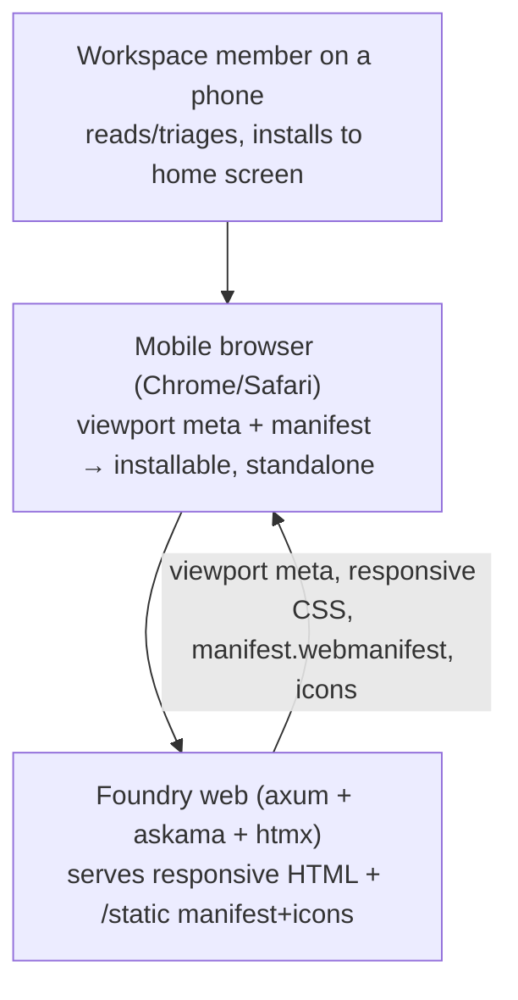
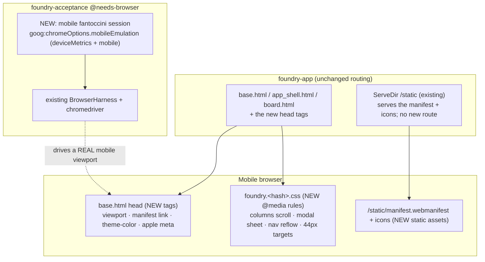
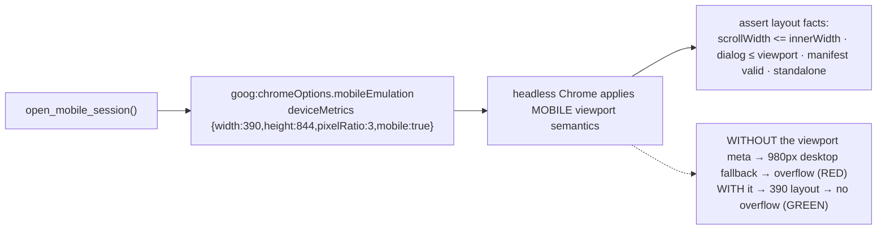

# Architecture — pwa-mobile-rendering

Design for the DISCUSS requirements (`../discuss/`). Makes Foundry render on a phone and install to the home
screen, verified in the existing fantoccini `@needs-browser` lane (NOT Playwright — D-TOOL). All changes are
head tags, CSS, and static assets; **no new route, no migration** (latest stays `0014`); no Node.

## Quality attributes driving this design

| Attribute | Priority | Consequence |
|-----------|----------|-------------|
| **Test faithfulness** | Highest | A mobile test must exercise REAL mobile viewport semantics (the viewport-meta effect), else it's green over nothing. → chromedriver `mobileEmulation`, not a narrow desktop window (ADR-003). |
| **Reuse / no new toolchain** | Highest | fantoccini lane, `ServeDir` static assets, the hashed-CSS file. No Node, no build step, no new route. |
| **Desktop non-regression** | High | Responsive rules are `@media`-bounded; desktop layout + every shipped `@needs-browser` scenario stay byte-identical (ADR-001). |
| **Progressive enhancement** | High | Viewport/manifest are additive; no-JS + htmx behaviour + all shipped oracles preserved. |
| **Lean scope** | High | Installable + responsive; **no service worker, no offline** in v1 (ADR-002 / ODD-3 resolved). |

Paradigm: unchanged — server-rendered askama/htmx + vanilla assets + a Rust fantoccini helper.
`@nw-software-crafter`. No `CLAUDE.md` paradigm change.

## Layout hierarchy (verified in-tree)

```
base.html            <head> (viewport meta, manifest link, theme-color, apple meta) + <body>
  └─ app_shell.html  .app-shell (flex row) = partials/sidebar.html + .app-shell__content
       └─ board.html .board (columns strip) > .column* ; #modal-root (dialogs)
```

Responsive rules target `.app-shell` (sidebar reflow), `.board`/`.column` (columns scroll), `.modal-dialog`
(sheet). The viewport meta lives once in `base.html` and covers every page (authed + pre-auth).

## C4 — System Context



## C4 — Container



## C4 — Component (the fantoccini mobile oracle — the load-bearing test mechanism)



## Components (all reuse; no new route/migration)

### base.html `<head>` — additive tags
- `<meta name="viewport" content="width=device-width, initial-scale=1">` (US-01, the precondition).
- `<link rel="manifest" href="/static/manifest.webmanifest">`, `<meta name="theme-color" content="…">`,
  `<meta name="apple-mobile-web-app-capable" content="yes">`, `…status-bar-style…`,
  `<link rel="apple-touch-icon" href="/static/icons/apple-touch-icon.png">` (US-03).

### Stylesheet `static/css/foundry.<hash>.css` — additive `@media` rules (ADR-001)
Mobile breakpoint (≤ ~640px): `.app-shell` reflows to a column (sidebar → compact top bar, CSS-only, no new
JS); `.board` gets `overflow-x: auto` so the columns strip scrolls WITHIN its container while the page does
not; `.modal-dialog` becomes a full-width scrollable sheet (≤ viewport, body scrolls); primary controls sized
≥ ~44px. Desktop (> breakpoint) unchanged. **The hash rotates in `base.html` AND `lib.rs:297`** (D5).

### Static assets — served by the existing `ServeDir` `/static`
- `static/manifest.webmanifest` (verify `ServeDir`/mime_guess serves `application/manifest+json`; if not,
  fall back to `manifest.json` — browsers accept the linked manifest regardless of exact content-type).
- `static/icons/…` — 192, 512, maskable, apple-touch-icon (ADR-002 / ODD-4).
- Cache policy from the existing path-aware `static_cache_control` (non-hashed → revalidate; fine).
- **No service worker in v1** (ADR-002 / ODD-3).

### Test — `crates/foundry-acceptance` (fantoccini, ADR-003)
- NEW `open_mobile_session()` in `browser_harness.rs`: same as `open_session` but injects
  `goog:chromeOptions.mobileEmulation` and does NOT resize to the desktop window afterward. Emulated
  deviceMetrics govern the layout viewport, so the viewport-meta effect is faithfully exercised.
- NEW step glue `feature_pwa_mobile.rs` (registered + force-linked): mobile-window scenarios asserting layout
  facts (overflow, dialog/columns, tap-target box sizes) + manifest facts (linked, 200, valid JSON, icons
  served, standalone, theme-color). Reuse sign-in/board/dialog helpers.

## Resolved ODDs (see ADRs for detail)

| ODD | Resolution |
|-----|-----------|
| ODD-1 columns | **Horizontal-scroll the `.board` strip** (`overflow-x:auto`), columns keep a min-width. Page never overflows; kanban mental model kept. (ADR-001) |
| ODD-2 nav | **CSS-only reflow**: `.app-shell` column-direction at mobile, sidebar → compact horizontal top bar. No new JS in v1 (a drawer is a follow-up). (ADR-001) |
| ODD-3 service worker | **None in v1.** Modern Chrome's install prompt no longer requires a SW (manifest + HTTPS + icons suffice); iOS uses the apple meta. No SW = no offline/htmx-caching gotchas. (ADR-002) |
| ODD-4 icons | 192 + 512 + maskable + apple-touch-icon under `/static/icons`; DELIVER generates from a simple Foundry mark. (ADR-002) |
| ODD-5 modal | **Full-width scrollable sheet** (`.modal-dialog` 100% width, `max-height:100vh`, body scrolls). (ADR-001) |

## Cross-cutting

- **CSS hash-rotation (D5)**: every CSS change rotates `foundry.<hash>.css` in `base.html` AND `lib.rs:297`;
  the shipped immutable-URL check stays green.
- **HTTPS for install**: the OS install prompt needs HTTPS (or localhost) — dev is HTTP, so the real prompt is
  a prod/localhost dogfood; the fantoccini lane asserts the *layout facts* (manifest served + valid +
  standalone + theme-color), not the OS prompt.
- **Desktop non-regression**: `@media`-bounded rules; the mobile emulation is a SEPARATE session type, so
  existing desktop `@needs-browser` scenarios are untouched.
- **No-JS / htmx / all shipped oracles preserved**; no new route, no migration.

## Slice plan (unchanged from DISCUSS)

1. **Slice 01** — viewport meta + no-overflow + the `open_mobile_session()` oracle (walking skeleton). Store:
   base.html + minimal CSS + the harness helper + step glue.
2. **Slice 02** — responsive `@media` rules (columns scroll, modal sheet, nav reflow, tap targets) + scenarios.
3. **Slice 03** — manifest + icons + theme-color + apple meta + scenarios. No SW.

Order 01 → 02 → 03; 02/03 depend on 01's viewport + the mobile oracle.
