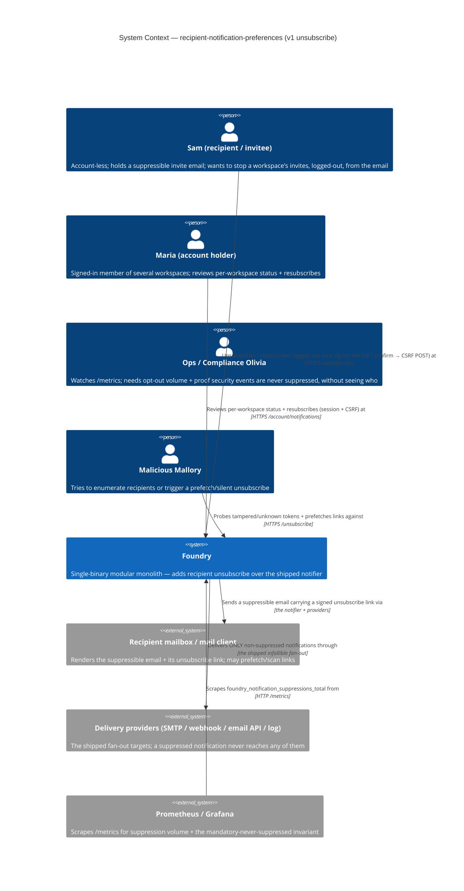
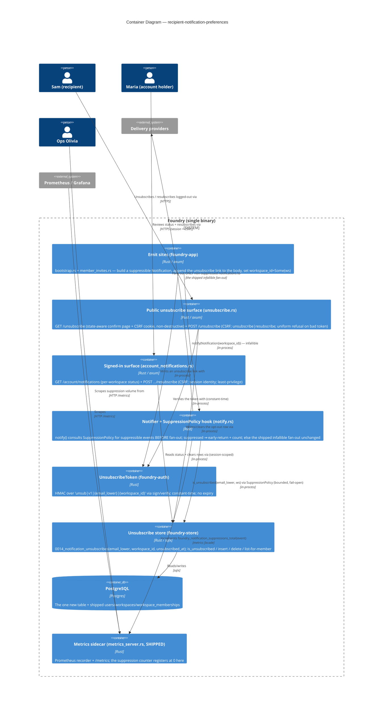
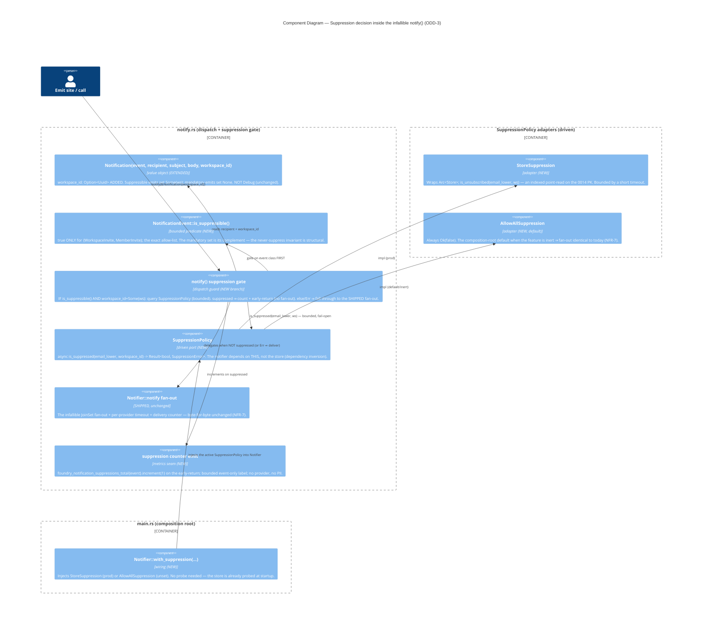

# Architecture — recipient-notification-preferences (v1 = recipient unsubscribe)

> Morgan (nw-solution-architect), DESIGN wave, Propose mode, application/component scope. Modular monolith
> + ports-and-adapters via Rust traits, env-config at the composition root (inherited, in force — NOT
> re-decided). This feature is the **named successor** the just-shipped `notification-delivery-providers`
> carved recipient preferences out to. It adds a **recipient unsubscribe mechanism** over the shipped
> notifier: a signed `UnsubscribeToken`, one migration (`0014_notification_unsubscribes`), a public
> unsubscribe route (logged-out) + confirmation page, a signed-in status/resubscribe surface, a
> **suppression hook inside `Notifier::notify`** behind a driven `SuppressionPolicy` port, and a PII-free
> sibling suppression counter. Requirements SSOT: `../discuss/`. Open decisions ODD-1..7 are resolved here
> and in `adr-001..006`; the per-ODD resolution index is in `wave-decisions.md`.
>
> Honest brownfield truth (verified `file:line`): the shipped `Notification` struct carries **no
> `workspace_id`** (`notify.rs:117-122`); both suppressible emit sites already have workspace context in
> scope (`bootstrap.rs:226` `user.workspace_id`; `member_invites.rs` admin workspace) — so threading it onto
> `Notification` is additive and grounded (ODD-3). `foundry_auth::sign`/`verify` are constant-time free
> functions (`foundry-auth/src/lib.rs:251,260`) directly reusable; `InviteToken` binds a DB `invite_id` PK
> (`:354-390`), so we reuse the **primitives**, not the struct.

## System context and capabilities

Foundry's notifier reliably delivers today, but there is **no way for a recipient to opt out of anything**,
and **many recipients are account-less invitees** identified only by email (`Notification.recipient`). A
recipient who keeps getting `workspace_invite` / `member_invite` reminders has no lever short of a blunt
inbox filter that would also bury a `password_reset`.

This feature builds the unsubscribe mechanism end-to-end and proves it on the two **suppressible** events,
holding the three **mandatory** security events exempt:

- **Suppressible (opt-out-able)**: `workspace_invite`, `member_invite`.
- **Mandatory (never suppressed)**: `password_reset`, `password_changed`, `member_removed`.

Capabilities added: (a) a signed unsubscribe **link** in suppressible emails that works logged-out; (b) a
public **GET → confirm → CSRF-POST** unsubscribe/resubscribe flow with the shipped uniform non-enumerable
refusal for any bad token; (c) a `(email_lower, workspace_id)` **opt-out table** (`0014`); (d) a
**suppression hook** inside the infallible `Notifier::notify` behind a `SuppressionPolicy` driven port; (e) a
signed-in **`/account/notifications`** status + resubscribe surface (least-privilege, session identity); (f)
a PII-free **`foundry_notification_suppressions_total{event}`** counter on the shipped `/metrics` sidecar.

## C4 Level 1 — System Context (MANDATORY)



## C4 Level 2 — Container (MANDATORY)



## C4 Level 3 — Component (the suppression-decision path — the one subsystem that warrants it, ODD-3 crux)



## Resolved contracts

### UnsubscribeToken (ODD-1, ADR-001)

A self-contained HMAC over a **domain-separated, versioned** payload — NOT the `InviteToken` struct (which
binds a DB `invite_id` PK and an `expires_at`). We reuse the constant-time primitives `foundry_auth::sign` /
`verify` (`lib.rs:251,260`, URL-safe base64, `SESSION_SECRET`).

- **Payload**: `"unsub|v1|{email_lower}|{workspace_id}"`. The `unsub` prefix is **domain separation** (an
  `InviteToken` signature can never be replayed as an unsubscribe, and vice-versa); `v1` is a rotation seam.
- **Secret**: `SESSION_SECRET` (`state.session_secret`) — the same signing root `InviteToken` uses. No new
  config key (a dedicated `UNSUBSCRIBE_SECRET` was rejected — marginal benefit, extra surface).
- **Expiry**: **none.** An unsubscribe link must work indefinitely (a recipient may act on a months-old
  email; an expired link that then delivers more mail is user-hostile). Blast radius is low: the token only
  stops/starts mail to the holder's own address for one workspace, is idempotent, and harms no one else.
- **Rotation**: rotating `SESSION_SECRET` invalidates outstanding links (verify-fail → uniform refusal).
  Accepted (rotation is rare + deliberate; the recipient falls back to a fresh email link or the signed-in
  page). Documented, not mitigated.
- **Placement**: `UnsubscribeToken::{new(email_lower, workspace_id, secret), verify(email_lower,
  workspace_id, sig, secret)}` in `foundry-auth`, beside `InviteToken` (house pattern).

### Route + link contract (ODD-2, ADR-002)

- **Link** (in the email body, suppressible only): `{public_url}/unsubscribe?t={b64url(email_lower|workspace_id)}&sig={sig}`.
  The `t` param is base64url of the pair (log-hygiene obfuscation, **not** confidentiality — the real control
  is that it is the recipient's own address in their own inbox); `sig` is the token. Host = the shipped
  `public_url` (`main.rs:122`) the invite links already use.
- **`GET /unsubscribe`** — decode `t`, verify `sig` (constant-time). On failure → the **uniform
  non-enumerable refusal** (modelled on `invite_refusal_page`, `invites_accept.rs:332-339`; fixed 200,
  byte-identical body). On success → a **state-aware confirm page**: if the pair is currently subscribed it
  offers **Unsubscribe**; if already unsubscribed it offers **Resubscribe** (ODD-6). The GET is
  **non-destructive** (renders only) and mints the CSRF cookie via `ensure_csrf_cookie` (`csrf.rs:54`).
- **`POST /unsubscribe`** — CSRF-checked (shipped `csrf_middleware`, `csrf.rs:137`). Re-verifies the token
  from hidden fields, then **writes** (`action=unsubscribe`) or **clears** (`action=resubscribe`) the row.
  Idempotent (BR-8). Bad token → uniform refusal, no state change.
- Both routes join the **public cluster** at `lib.rs:371-374` (beside `/invites/accept`), so they sit under
  the shipped `csrf_middleware` + `session_layer` (`lib.rs:536-540`) with **no session required**.
- **RFC 8058**: v1 does **not** emit `List-Unsubscribe-Post` one-click headers. A one-click POST is CSRF-exempt
  by construction (mail-client-initiated) and would need a token-as-authorization CSRF carve-out — a distinct
  security design that conflicts with NFR-5's "both POSTs under CSRF." Emitting a plain `List-Unsubscribe:
  <https-url>` (GET form, browser-opens the confirm page, prefetch-safe) is a **low-risk deferred
  enhancement** (needs an optional `Notification.list_unsubscribe_url` header on email-shaped providers).
  Reconciliation: v1 chooses in-body link + GET-confirm + CSRF-POST — prefetch-safe (NFR-2) AND CSRF-guarded
  (NFR-5); "one-click silent POST" is explicitly out of v1.

### Suppression hook + workspace threading (ODD-3, ADR-003) — THE crux

- `Notification` gains `workspace_id: Option<Uuid>` (`notify.rs:117-122`). Suppressible emits set `Some(ws)`
  (both sites already have it in scope); mandatory emits set `None`.
- `NotificationEvent::is_suppressible()` → `true` **only** for `{WorkspaceInvite, MemberInvite}`.
- `Notifier` gains `suppression: Arc<dyn SuppressionPolicy>` (a **driven port**). `notify()` gains ONE guard
  at the top, BEFORE the shipped fan-out:
  1. `if !notification.event.is_suppressible()` → skip entirely (mandatory events are **structurally**
     never checked — NFR-3 by construction).
  2. else if `Some(ws) = workspace_id` → `is_suppressed(recipient_lowercased, ws)` (bounded by a short
     timeout): `Ok(true)` ⇒ increment `foundry_notification_suppressions_total{event}` and **early-return**
     (no provider ever sees it, FR-3); `Ok(false)` ⇒ fall through; `Err(_)` ⇒ **fail-open**: log at `warn`,
     fall through to deliver.
- **Single enforcement point** (the notifier) — a new suppressible emit site can't forget the rule (the
  DISCUSS alternative "filter at each emit site" was rejected for exactly this). **Dependency inversion**:
  the notifier depends on `SuppressionPolicy`, not the store.
- **Infallible + await-bounded preserved**: the lookup is fallible internally but the error never propagates
  (fail-open), and the bounded timeout keeps `notify()` await-bounded. `notify()` still returns `()`. The
  lookup bound should be short relative to the shipped per-provider `DEFAULT_DELIVERY_TIMEOUT_MS` (5000,
  `notify.rs:33`) — a design-recommended ~50–100 ms for the indexed point-read; the exact value is the
  crafter's (composition-root wired, testable).
- **Fail-open rationale (R5)**: today every suppressible event is delivered; a store blip must be "no worse
  than today" — deliver. Fail-closed would silently drop invites during an outage (a worse regression than an
  occasional un-honored opt-out). Fail-open never risks a mandatory event (they never reach the lookup), so
  the safety invariant is independent of the fail stance. (Contrast the member-removal `find_user_by_email`
  which fails **closed** to protect enumeration — different concern, different direction.)
- **NFR-7 exactness**: the default `AllowAllSuppression` returns `Ok(false)` and the guard early-returns only
  on `Ok(true)`, so with an empty table (or the inert default) the fan-out is byte-for-byte unchanged.

### Unsubscribe state schema + email keying (ODD-4 + ODD-7 key, ADR-004)

```sql
-- crates/foundry-store/migrations/0014_notification_unsubscribes.sql
-- Per-(recipient-email, workspace) opt-out for suppressible notifications.
-- Default state = NO ROW = subscribed (opt-out model, BR-7). Presence of a row
-- = muted. email_lower matches users.email_lower / find_user_by_email(email_lower);
-- there is deliberately NO FK to users — many recipients are account-less invitees.
CREATE TABLE notification_unsubscribes (
    email_lower     TEXT        NOT NULL,
    workspace_id    UUID        NOT NULL REFERENCES workspaces(id) ON DELETE CASCADE,
    unsubscribed_at TIMESTAMPTZ NOT NULL DEFAULT now(),
    PRIMARY KEY (email_lower, workspace_id)
);
```

- **Composite PRIMARY KEY `(email_lower, workspace_id)`** — the natural identity. It (a) enforces
  uniqueness so unsubscribe is idempotent (`INSERT ... ON CONFLICT DO NOTHING`), and (b) IS the covering
  index for the suppression point-read (`WHERE email_lower=$1 AND workspace_id=$2`). No surrogate `id`
  (unlike `reset_tokens`, which needs a single-use token id — here the pair is the identity).
- **`email_lower TEXT`**, normalized via `to_ascii_lowercase()` at every write/read, matching the shipped
  `users.email_lower` / `find_user_by_email` (`store lib.rs:930`). The token binds `email_lower` too, so the
  write path and the suppression read use identical normalization (R8 closed).
- **FK `workspace_id → workspaces(id) ON DELETE CASCADE`** (mirrors `0013`): deleting a workspace removes its
  opt-out rows (no orphan suppression). **No FK on email** — that is the deliberate account-less keying
  (BR-2): a row may exist with no `users` row.
- **Account reconciliation (R8)**: an account-less invitee who later signs up with the same email inherits
  their prior opt-outs automatically — the signed-in page reads by `email_lower`, which equals the new
  account's email. No backfill/migration.
- **Store methods** (method-on-`Store`, mirroring `insert_reset_token`, `lib.rs:980`):
  `is_unsubscribed(email_lower, ws) -> bool`, `insert_unsubscribe(email_lower, ws)` (ON CONFLICT DO NOTHING),
  `delete_unsubscribe(email_lower, ws)`, and for US-05 `workspaces_for_member(user_id) -> Vec<(Uuid, String)>`
  (JOIN `workspaces`↔`workspace_memberships`, mirroring `resolve_active_workspace`, `lib.rs:811`) +
  `list_unsubscribed_workspace_ids(email_lower) -> HashSet<Uuid>`.

### Suppression observability (ODD-5, ADR-005)

- **Sibling counter** `foundry_notification_suppressions_total{event}` — **NOT** a widened
  `DeliveryOutcome::Suppressed`. Rationale: a suppression is provider-**independent** (it is never handed to
  any provider), so it has no `provider` dimension; forcing it onto the `{provider,event,outcome}` delivery
  counter is a category error (you'd invent a fake provider or emit N counts for one suppression). Keeping
  `DeliveryOutcome` binary `{delivered,failed}` leaves the shipped register-at-0 cross-product + cardinality
  guard **untouched** (NFR-7 exactness).
- **Label = `event` only** (∈ `NotificationEvent::ALL`, bounded snake_case). **No `workspace`** label
  (workspace_id is unbounded cardinality + semi-identifying) — omitted despite NFR-4's "at most workspace."
  **No PII** ever (no email, no token).
- **Register-at-0** over the full `NotificationEvent::ALL` catalog so mandatory events show a permanent
  `…{event="password_reset"} 0` — the never-suppressed invariant is **observable** (US-07 AC). The increment
  fires only on the suppressible early-return, so mandatory series stay pinned at 0 structurally.
- Mirrors the shipped bounded-label discipline (`metrics_server.rs`) + a fail-closed cardinality unit test
  asserting the label key set is exactly `{event}`.

### Resubscribe + multi-workspace (ODD-6 + ODD-7, ADR-006)

- **Account holders** (Maria): `GET /account/notifications` lists every workspace they belong to
  (`workspaces_for_member`) with a Subscribed/Muted status (`list_unsubscribed_workspace_ids`), and
  `POST /account/notifications/resubscribe` (CSRF, session identity) clears the row for their own
  `(email_lower, workspace_id)`. Least-privilege: identity from `SessionUser` (`session.rs`), never
  client-supplied email (NFR-6); a member sees/changes only their own state.
- **Account-less recipients** (Sam): the public `GET /unsubscribe` confirm page is **state-aware** — when
  the pair is already unsubscribed it offers a token-authorized **Resubscribe** (the same token proves
  control of the pair and authorizes both directions), reachable any time from the same email link. This
  gives symmetric undo without an account (R7 closed).
- **Multi-workspace independence (ODD-7, FR-9)** is a **corollary of the composite key**: the token binds one
  `(email_lower, workspace_id)`, so a Northwind link cannot verify for Contoso; the row and the suppression
  read are per-pair; muting one leaves the other with no row = subscribed. The settings page renders each
  workspace's status independently. No separate mechanism.

## Component architecture & boundaries

| Component | Layer | Responsibility | Status |
|---|---|---|---|
| `UnsubscribeToken::{new,verify}` | domain (foundry-auth) | HMAC over `unsub\|v1\|email_lower\|workspace_id`; constant-time; no expiry | NEW (beside `InviteToken`, reuses `sign`/`verify`) |
| `Notification.workspace_id: Option<Uuid>` | domain value object | carries workspace context for the suppression gate | EXTENDED (`notify.rs:117-122`) |
| `NotificationEvent::is_suppressible()` | domain predicate | the bounded suppressible allow-list `{WorkspaceInvite, MemberInvite}` | NEW |
| `SuppressionPolicy` | driven port | `is_suppressed(email_lower, ws) -> Result<bool, _>` | NEW |
| `StoreSuppression` | driven adapter | indexed point-read on the `0014` PK, bounded | NEW |
| `AllowAllSuppression` | driven adapter | inert default `Ok(false)` (NFR-7) | NEW |
| `Notifier::notify` suppression gate | dispatcher | suppressible-only, bounded, fail-open, early-return + count | EXTENDED (`notify.rs:237`) |
| `foundry_notification_suppressions_total{event}` | metrics seam | PII-free suppression count + register-at-0 | NEW |
| `0014_notification_unsubscribes` + `Store` methods | store | opt-out persistence keyed on `(email_lower, workspace_id)` | NEW (migration + methods) |
| `unsubscribe.rs` (`GET`/`POST /unsubscribe`) | driving adapter | public token-verified confirm/mutate + uniform refusal | NEW (public cluster) |
| `account_notifications.rs` (`GET` + `POST .../resubscribe`) | driving adapter | signed-in status + resubscribe, least-privilege | NEW (beside `/account/password`) |
| nav link → `/account/notifications` | web | account/nav surface entry (`nav.rs`) | EXTENDED |

Software-crafter owns all internal structure (module decomposition, exact sqlx/axum wiring, template markup,
the `as_str()` bodies, the timeout value) during GREEN/REFACTOR. The contracts above are the boundary.

## Reuse-vs-new analysis (verdict: 12 REUSE/EXTEND · 10 CREATE-NEW · 1 MIGRATION · **0 NEW CRATE**)

| # | Component | File / seam | Decision | Justification |
|---|---|---|---|---|
| 1 | `foundry_auth::sign` / `verify` (constant-time, URL-safe b64) | `foundry-auth/src/lib.rs:251,260` | **REUSE** | The exact HMAC primitives for `UnsubscribeToken` (NFR-1); no new crypto. |
| 2 | `InviteToken` struct | `foundry-auth/src/lib.rs:354-390` | **MODEL, NOT REUSE** | It binds a DB `invite_id` PK + expiry; the unsubscribe token is self-contained (email+ws, no row, no expiry) — reuse the primitives, add a sibling `UnsubscribeToken`. |
| 3 | Uniform non-enumerable refusal (`invite_refusal_page`/`invalid_page`) | `invites_accept.rs:332-339` | **REUSE (mirror)** | A tampered/unknown unsubscribe token yields the identical fixed-200 byte-identical refusal (NFR-1, FR-5, US-03). |
| 4 | `Notification` struct | `notify.rs:117-122` | **EXTEND** | Add `workspace_id: Option<Uuid>` (ODD-3); still not `Debug`. |
| 5 | `NotificationEvent` closed enum | `notify.rs:46-77` | **EXTEND** | Add `is_suppressible()`; the mandatory set is its complement (NFR-3 structural). No new variant. |
| 6 | `Notifier::notify` infallible fan-out | `notify.rs:237-307` | **EXTEND** | Add ONE suppression gate before the fan-out; the fan-out body is unchanged (NFR-7). |
| 7 | `DeliveryOutcome` binary + `delivery_zero_series` + cardinality guard | `notify.rs:160-177,837-851` | **REUSE (unchanged)** | Suppression is a sibling counter, NOT a new outcome — the delivery counter is untouched (ODD-5). |
| 8 | metric register-at-0 + `describe_counter!` idiom | `notify.rs:837`, `main.rs` register-at-0 | **REUSE (mirror)** | The suppression counter registers at 0 over `NotificationEvent::ALL` so mandatory series show 0 (US-07). |
| 9 | Both suppressible emit sites | `bootstrap.rs:266` (`user.workspace_id:226`), `member_invites.rs:204` | **EXTEND** | Append the unsubscribe link to the body + set `workspace_id: Some(ws)`. |
| 10 | Mandatory emit sites | `signin.rs:255,360`, `member_invites.rs:292` | **EXTEND (minimal)** | Set `workspace_id: None`; no link. Never checked. |
| 11 | CSRF (`csrf_middleware`, `ensure_csrf_cookie`) | `csrf.rs:137,54`, layer `lib.rs:536-539` | **REUSE** | Both POSTs (public confirm + signed-in resubscribe) ride the shipped double-submit (NFR-5). |
| 12 | Session (`SessionUser`, `Session` extractor) | `session.rs` | **REUSE** | Identity for the signed-in surface (NFR-6); the public path uses no session. |
| 13 | Public route cluster + uniform 404 fallback | `lib.rs:371-374,535-540` | **REUSE (extend)** | `/unsubscribe` GET+POST join beside `/invites/accept` under CSRF+session layers. |
| 14 | Authed `/account/password` neighbour | `lib.rs:415-418` | **REUSE (extend)** | `/account/notifications` registers here. |
| 15 | `public_url` (`FOUNDRY_PUBLIC_URL`) | `main.rs:122` | **REUSE** | The unsubscribe link host = the invite link host. |
| 16 | `reset_tokens` shape + `insert_reset_token` method pattern | `0002_sessions_and_reset.sql:20-28`, `store lib.rs:980` | **MODEL** | The `0014` table + its `Store` methods follow this shape (composite key, not surrogate). |
| 17 | `find_user_by_email` + `workspace_memberships` + `resolve_active_workspace` JOIN | `store lib.rs:930,811`, `workspace_memberships` | **REUSE (extend)** | `workspaces_for_member` mirrors the JOIN; `email_lower` normalization matched. |
| 18 | `SuppressionPolicy` port | — | **CREATE-NEW** | ADR-003 (dependency inversion for the notifier). |
| 19 | `StoreSuppression` + `AllowAllSuppression` | — | **CREATE-NEW** | ADR-003 (prod + inert default). |
| 20 | `UnsubscribeToken` | — | **CREATE-NEW** | ADR-001. |
| 21 | `0014_notification_unsubscribes` migration + 4 `Store` methods | — | **CREATE-NEW (1 MIGRATION)** | ADR-004. |
| 22 | `unsubscribe.rs` (public GET+POST) + confirm/refusal templates | — | **CREATE-NEW** | ADR-002. |
| 23 | `account_notifications.rs` (GET + resubscribe POST) + template | — | **CREATE-NEW** | ADR-006. |
| 24 | `foundry_notification_suppressions_total` const + register-at-0 | — | **CREATE-NEW** | ADR-005. |

## Technology stack & rationale (OSS-first; every dep already in-tree)

- **Rust / async-trait / tokio** (inherited) — `SuppressionPolicy` is `#[async_trait]`; the lookup timeout
  reuses `tokio::time::timeout`. No new runtime.
- **HMAC: `hmac` 0.12 + `sha2` 0.10** (MIT/Apache-2.0), already present — reused via `foundry_auth::sign`.
- **Persistence: `sqlx` + PostgreSQL** (inherited) — one additive migration, indexed point-read.
- **Secrets: `secrecy::SecretString`** (already present) — `SESSION_SECRET` signing root, unchanged.
- **Observability: `metrics` + `metrics-exporter-prometheus`** (shipped) — one sibling counter, reused verbatim.
- **Web: `axum` + `askama` templates + `tower_http`** (inherited) — two new HTML surfaces.

**Net: ZERO new crates, ONE migration.** The feature is a token + a table + two routes + a dispatch gate +
a counter over already-present dependencies.

## Integration patterns & API contracts

- **In-process (driving)**: emit sites → `Notifier::notify(&Notification{workspace_id})` (infallible,
  unchanged shape aside from one field). Public + signed-in routes are internal axum handlers.
- **No new external integration.** The suppression path reads the local Postgres store; the unsubscribe link
  is delivered through the **already-annotated** provider transports (SMTP / webhook / email API), whose
  contract-test recommendation is owned by the predecessor's handoff — **no new external boundary is
  introduced here**, so no additional contract-test annotation is owed to platform-architect.

## Quality attribute strategies (ISO 25010)

- **Security / integrity (NFR-1, NFR-3 — the crux)**: (a) constant-time HMAC verify + domain-separated
  payload defeats tampering/replay; (b) the uniform 200 refusal defeats enumeration (byte-identical across
  every invalid reason); (c) the **never-suppress invariant is structural** — `is_suppressible()` gates the
  lookup, so mandatory events (the allow-list complement) are never checked, provable by an ArchUnit-style
  allow-list test + a never-suppress `@property`; (d) fail-open never endangers a mandatory event.
- **Security / prefetch-safety (NFR-2)**: GET renders only + mints the CSRF cookie; state changes only on the
  CSRF POST. A scanner prefetch leaves state unchanged (revert-reds-it litmus).
- **Security / CSRF + least-privilege (NFR-5, NFR-6)**: both POSTs under the shipped double-submit; the
  signed-in surface derives identity from `SessionUser`, never client input, scoped to the member's own
  memberships.
- **Reliability (NFR-7, R5)**: additive suppression gate + inert `AllowAllSuppression` default ⇒ byte-for-byte
  unchanged delivery with an empty table; the bounded, fail-open lookup preserves the infallible + await-bounded
  `notify()` contract.
- **Privacy / observability (NFR-4)**: `event`-only bounded label, register-at-0 including the always-0
  mandatory series; a fail-closed cardinality test; no email/token/workspace in any label or line.
- **Maintainability / testability**: `SuppressionPolicy` is trivially faked; the token, refusal, suppression
  gate, and idempotence are unit- + acceptance-testable behind ports; the single enforcement point keeps the
  rule in one place.
- **Usability / accessibility (NFR-8)**: the two new HTML surfaces use semantic markup, labelled controls,
  keyboard-operable confirm/resubscribe, status as text (not colour) — an automated a11y check gates them.

## Architecture Enforcement (for software-crafter)

Style: Modular Monolith + Hexagonal (ports-and-adapters). Language: Rust. Tool: `cargo xtask check-arch`
(in-tree, inherited) + mirrored unit tests.

Rules to enforce:
- **Dependency inversion**: `Notifier` depends on `SuppressionPolicy` (a port), never on `foundry-store`
  directly; the store dependency lives only in `StoreSuppression`. `Notification`/`NotificationEvent` depend
  on nothing outward.
- **Suppressible allow-list is bounded + exact**: a unit test asserts `is_suppressible()` is true for exactly
  `{WorkspaceInvite, MemberInvite}` and false for all else — adding a mandatory event can never make it
  suppressible (NFR-3). A never-suppress `@property`: any mandatory event under any unsubscribe config is
  delivered, never counted suppressed.
- **Bounded suppression label**: a scoped-recorder test asserts the emitted
  `foundry_notification_suppressions_total` label key set is exactly `{event}` and fails closed on any added
  label (ODD-5).
- **Infallible notify() preserved**: `notify()` returns `()`; the suppression lookup error is swallowed
  (fail-open) and the call is bounded by a timeout — a test injects a failing/slow `SuppressionPolicy` and
  asserts delivery still occurs and `notify()` returns.
- **Prefetch-safety (Earned Trust)**: an acceptance GET of a valid link asserts **no** row is written; only
  the CSRF POST mutates. The revert-reds-it litmus guards it.

## Deployment architecture

Unchanged: ONE binary, ONE PostgreSQL, the SHIPPED `/metrics` sidecar. **ZERO new crates, ONE additive
migration (`0014`), ZERO new infra.** With an empty `notification_unsubscribes` table the app behaves
byte-for-byte as it does post `notification-delivery-providers` (NFR-7). The `0014` migration runs in the
shipped ordered migration set (`sqlx::migrate!`); the FK cascade ties opt-out lifetime to the workspace. No
change is owed to platform-architect (no new external boundary; the transport contract-test recommendation
already lives in the predecessor's handoff).

## ADRs

- `adr-001-unsubscribe-token-and-expiry.md` — ODD-1: self-contained HMAC token (`unsub|v1|email|ws`), no
  expiry, `SESSION_SECRET`, reuse `sign`/`verify`; why not the `InviteToken` struct.
- `adr-002-get-safety-and-rfc8058.md` — ODD-2: GET→confirm→CSRF-POST, uniform refusal, prefetch-safety; why
  RFC 8058 one-click POST is deferred, `List-Unsubscribe` header recommended.
- `adr-003-suppression-hook-and-workspace-threading.md` — ODD-3: `workspace_id` onto `Notification`, the
  `SuppressionPolicy` port, the suppressible-only bounded fail-open gate inside infallible `notify()`.
- `adr-004-unsubscribe-state-schema-and-keying.md` — ODD-4 + ODD-7(key): the `0014` composite-key table,
  email-keying, account reconciliation, per-workspace independence.
- `adr-005-suppression-observability.md` — ODD-5: sibling `foundry_notification_suppressions_total{event}`,
  event-only bounded label, register-at-0; why not a widened `DeliveryOutcome`.
- `adr-006-resubscribe-and-multiworkspace.md` — ODD-6 + ODD-7(UX): signed-in resubscribe + token-authorized
  account-less undo via the state-aware confirm page; multi-workspace listing.
