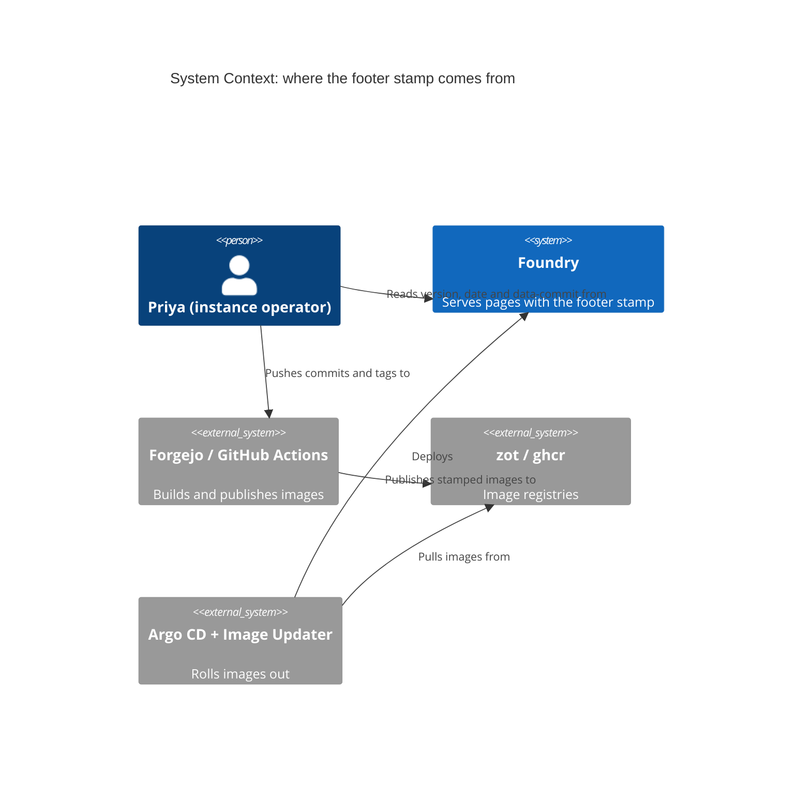
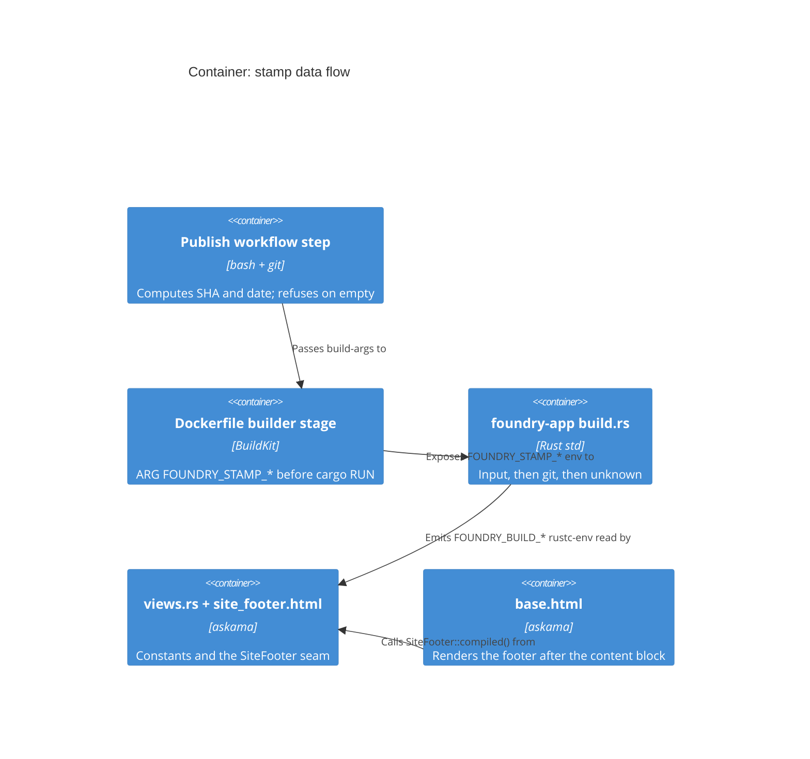

# Feature Delta — release-version-footer

Show the running release version at the bottom of every page, so an operator
can confirm a deploy landed without shelling into the cluster. Shipped together
with the v0.5.0 release, whose tag is also the end-to-end test of the homelab
delivery path (Forgejo mirror → zot → Argo CD Image Updater; homelab
`modules/foundry`, ADR-059).

Process: **lean by user decision (2026-09-26)** — one story, one acceptance
scenario, one TDD step plus the release chore. No DESIGN wave, no ADR.

## Wave: DISCUSS

### [REF] Persona / JTBD

`persona-instance-operator` (Priya). Job: *when I push a release tag, I want to
see which release the instance is actually serving, so I know the rollout
finished without checking Argo CD or the pod image.*

### [REF] Locked Decisions

| ID | Decision |
|---|---|
| D1 | A site-wide footer in `base.html`, on every page including sign-in (visible without an account). |
| D2 | The text is `Foundry v<version>`, where `<version>` is the `foundry-app` crate version compiled into the binary (`env!("CARGO_PKG_VERSION")`). The crates are bumped together at release, so it equals the git tag without the build pipeline passing anything in. |
| D3 | Muted, small, non-interactive; uses existing `--cz-*` tokens only; does not change any page's layout or scroll (the board's full-height layout included). A CSS change carries the D18 stylesheet re-hash. |
| D4 | Release is **v0.5.0** (minor: adds the footer and slice 01 of `card-pointer-drag`, mouse drag on Pointer Events). |

### [REF] User Story US-RVF-01

As Priya, I want the version the server is running shown at the bottom of every
page, so I can tell a release has deployed.

#### Elevator Pitch
Before: after tagging a release she cannot tell from the app whether the new image is serving.
After: open `https://foundry.<domain>/sign-in` → sees `Foundry v0.5.0` at the bottom of the page.
Decision enabled: the rollout is done (or still pending) — no need to inspect Argo CD.

#### Acceptance Criteria
- AC-1: every server-rendered full page (signed-out sign-in page and a signed-in board page at least) contains the footer text `Foundry v` followed by exactly the binary's crate version.
- AC-2: the footer appears once per page, below the main content, and is not rendered inside htmx fragment/OOB responses.
- AC-3: no existing acceptance scenario or layout check regresses.

### [REF] Out of Scope

Git SHA or build date in the footer; an API endpoint for the version; changing the release pipeline.

## Wave: DELIVER

> Finalized 2026-10-04 from `deliver/roadmap.json`, `deliver/execution-log.json` (2 steps),
> commits `0cd73c3`, `8f06528` and `00dc174`, and the CHANGELOG v0.5.0 entry. The work was delivered
> 2026-09-26 and tagged **v0.5.0**. Evolution record:
> `docs/evolution/2026-09-26-release-version-footer.md`.

### [REF] Implementation summary

`base.html` renders `<footer class="site-footer">Foundry v{{ crate::views::RELEASE_VERSION }}</footer>`
as the immediate next sibling of the content block. That puts it on every full page, signed in or out
(D1). `views::RELEASE_VERSION` is `env!("CARGO_PKG_VERSION")` of `foundry-app` (D2), and no page
struct changed. htmx fragments never extend `base.html`, so they carry no footer.

The styling is `.site-footer`: 11px, `--cz-muted`, right-aligned, and existing tokens only (D3).
`.app-shell + .site-footer` pulls the footer up 16px into the shell's bottom padding, with
`pointer-events: none`, so no authed page gains a scrollbar. The stylesheet was re-hashed `438142d2` →
`f9143163` (D18).

Step 01-02 (`8f06528`) bumped every crate 0.4.0 → 0.5.0 and closed the CHANGELOG (D4).

### [REF] Files modified

- **Production (`0cd73c3`):**
  - `crates/foundry-app/templates/base.html`: footer and stylesheet href.
  - `crates/foundry-app/src/views.rs`: `RELEASE_VERSION`.
  - `crates/foundry-app/static/css/foundry.438142d2.css` → `foundry.f9143163.css`: +22 lines.
  - `crates/foundry-app/static/VENDOR.md`: hash row and notes.
  - `crates/foundry-app/src/lib.rs`: only the three cache-policy test literals.
- **Tests (`0cd73c3`):**
  - NEW `crates/foundry-acceptance/tests/features/release-version-footer.feature`.
  - NEW `crates/foundry-acceptance/src/steps/feature_release_version_footer.rs`.
  - Registration in `src/lib.rs` and `tests/acceptance.rs`.
- **Release (`8f06528`):** every `crates/*/Cargo.toml`, `Cargo.lock` and `CHANGELOG.md`.
- **Docs (`00dc174`):** `RELEASING.md` (crate bump convention and "Verifying a deployment"), plus
  this file, `roadmap.json`, `execution-log.json` and `.develop-progress.json`.

### [REF] Scenarios green count

There are 3 scenarios in `release-version-footer.feature` (`@rvf`, HTTP lane): sign-in page, board
page, and new-issue modal fragment. The `0cd73c3` message records the `rvf` lane green. The scenario
and step counts were not recorded. The preamble above says "one acceptance scenario"; three shipped.
0 new unit tests (RED_UNIT SKIPPED, NOT_APPLICABLE).

### [REF] DoD check

DISCUSS defines no separate DoD, so this checks the acceptance criteria of US-RVF-01:

1. **AC-1, the footer reads exactly the crate version on sign-in and board: PASS.** Scenarios 1 and 2
   assert this, with the oracle reading `foundry-app/Cargo.toml`.
2. **AC-2, the footer appears once, below the content, and not in fragments: PASS for the asserted
   cases.** The oracle checks that the footer occurs once, as the last content child of `<body>`, and
   that the new-issue modal fragment has none. OOB responses (named in the roadmap 01-01 criterion) are
   not separately asserted.
3. **AC-3, no regression: PASS as recorded.** The rvf, canzan-theme-system, pwa-mobile-rendering, cdf,
   cpd, kb and blr lanes are green. No full-suite `cargo xtask ci` run is recorded.

### [REF] Demo evidence

On 2026-10-04 the footer read `Foundry v0.7.0` on https://foundry.unintelligent-design.us/sign-in
(dev) and https://foundry.jeffbailey.us/sign-in (prod). It was used to verify the v0.6.0 through
v0.7.0 rollouts, which is the Elevator Pitch's "After" in use.

### [REF] Quality gates

| Gate | Outcome |
|---|---|
| Roadmap review | approved by the orchestrator (lean path by user decision, 2026-09-26) |
| DES phases | 01-01: PREPARE, RED_ACCEPTANCE, GREEN, COMMIT PASS; RED_UNIT SKIPPED. 01-02: PREPARE, GREEN, COMMIT PASS; RED_ACCEPTANCE, RED_UNIT SKIPPED |
| Lanes (01-01) | rvf, canzan-theme-system, pwa-mobile-rendering, cdf, cpd, kb, blr green |
| Static | check-arch, fmt, clippy `-D warnings` pass; xtask smoke pass (01-01) |
| 01-02 smoke | roadmap criterion; the execution log records GREEN PASS, and no explicit smoke result is recorded |
| Peer review | not recorded |
| Mutation (per-feature) | not recorded. The Rust production delta is one `env!` constant plus test literals |
| DES integrity check | not recorded |

### [REF] Pre-requisites / carried notes

- **Gap: no DESIGN or DISTILL section in this file.** The waves were skipped on the lean path, and
  the user chose on 2026-10-04 not to back-fill them. The `.feature` file was authored inside step
  01-01, as its header records.
- `00dc174` wrote the verify path as `/signin`. `c2980f1` (2026-09-27) corrected RELEASING.md to
  `/sign-in`.
- No follow-ups are recorded. The out-of-scope items (git SHA or build date, a version endpoint,
  pipeline changes) remain out of scope.

## Wave: DISCUSS — increment 2026-10-04 (build stamp)

> Lightweight increment by user decision (2026-10-04): match canzan-lift's build stamp. Feature type:
> cross-cutting (build + UI). Walking skeleton: no. This section **narrows** the US-RVF-01 out-of-scope
> line "Git SHA or build date in the footer … changing the release pipeline": both are now in scope
> for US-RVF-02. A version API endpoint stays out. D1-D4 and AC-1..3 remain the record of what shipped
> in v0.5.0. Where AC-4 below rewrites the footer's exact text, it supersedes AC-1's "exactly the crate
> version" wording.
> Slice brief: `slices/slice-02-build-stamp.md`.

### [REF] Persona / JTBD

- **Persona:** `persona-instance-operator` (Priya Raman). She verifies every rollout from `/sign-in`
  (Demo evidence above: v0.6.0 through v0.7.0).
- **job_id:** `job-confirm-release-serving`. This is the job US-RVF-01 states in prose: *when I push a
  release tag, I want to see which release the instance is actually serving, so I know the rollout
  finished without checking Argo CD or the pod image.* It was registered in `docs/product/jobs.yaml`
  on 2026-10-04 (P1 resolved), with US-RVF-01 and US-RVF-02 in its `scope_history`.
- **Why the job widens.** `Foundry v0.7.0` names a *release*, not a *build*. Forgejo's
  `build-and-publish.yml` builds an image on every push to `main` as well as on `v*` tags. Every build
  between two tags therefore reads the same `v0.7.0`. So does a rebuilt or re-pulled image. The footer
  cannot tell Priya that the pod is serving yesterday's `:main` image rather than the commit she just
  pushed. canzan-lift hit exactly this, and an operator debugged a previous-day binary that the page
  never flagged (canzan-lift `build.rs` header).

### [REF] Locked Decisions (continue from D4)

| ID | Decision |
|---|---|
| D5 | The footer text is `Foundry v<version> · <commit date>`, for example `Foundry v0.7.0 · 2026-10-04`. The `Foundry ` prefix stays (it is the shipped oracle's anchor and the operator's habit). The separator is ` · ` (U+00B7 with a space on each side), as in canzan-lift. |
| D6 | **Version stays `CARGO_PKG_VERSION`.** D2 holds, and there is no `FOUNDRY_STAMP_VERSION` input. Foundry bumps every crate at release (RELEASING.md step 3), so the crate version equals the tag. canzan-lift needed a tag build-arg only because its `Cargo.toml` is never bumped. The version therefore always has a value and can never render as `vunknown`. |
| D7 | **The date is the commit date, not the build time.** It is `git log -1 --format=%cd --date=short`, formatted `YYYY-MM-DD`. Rebuilding the same commit produces the same stamp, so reproducible builds do not drift. The value is printed as-is: never parsed, never compared to a clock, never shown as "N days ago". |
| D8 | **The SHA lives only in an attribute.** `data-commit="<short sha>"` sits on the same `<footer>` element and is not painted. The value comes from `git rev-parse --short=7 HEAD`. That is 7 hex characters, longer only when git must lengthen it to stay unambiguous. build.rs and both workflows use the same command, so the values agree. |
| D9 | **Precedence, per field.** (1) `FOUNDRY_STAMP_SHA` / `FOUNDRY_STAMP_DATE` when set and not blank. Values are trimmed, and blank counts as absent because a Dockerfile `ARG X=` with no `--build-arg` arrives as empty. (2) `git` in a checkout. (3) The literal placeholder `unknown`. Inputs are named `STAMP` and the compiled outputs `FOUNDRY_BUILD_SHA` / `FOUNDRY_BUILD_DATE`, following canzan-lift's naming split. The stamp is baked by a new `crates/foundry-app/build.rs`. |
| D10 | **The build never fails because of the stamp.** None of these break the build: no `git` on PATH, not a repository, a shallow clone, or a Docker context without `.git`. Each falls back to `unknown`, and no git result is unwrapped. **Zero new crates:** no `vergen` and no `[build-dependencies]`. The script uses `std::process::Command` only (canzan-lift precedent). |
| D11 | **The stamp never goes stale.** The script declares `rerun-if-changed` on `build.rs`, `HEAD`, the ref HEAD points at, and `packed-refs`. Each path is resolved through `git rev-parse --git-path`, so worktrees and gitdir files work, and a path is registered only if it exists. It also declares `rerun-if-env-changed` on both `FOUNDRY_STAMP_*` inputs. A commit followed by an incremental build re-stamps, and so does setting or unsetting an input. |
| D12 | **The pipeline hands the commit in.** The Dockerfile declares `ARG FOUNDRY_STAMP_SHA=` / `ARG FOUNDRY_STAMP_DATE=` in the builder stage, just before the `cargo build` RUN, so the ARGs do not bust the cache for the earlier layers. `.forgejo/workflows/build-and-publish.yml` (the production path, per canzan-infrastructure `argocd/apps/foundry/app.yaml`) and `.github/workflows/release.yml` (ghcr) both compute the values with D7/D8's exact commands and pass them as build-args. Each refuses to publish if either value is empty: an image that reads `unknown` in production is the canzan-lift RCA failure. This applies to `main` and tag builds alike. |
| D13 | **The UI surface is the footer only.** There is no `foundry --version` today (no CLI version flag exists), and none is added. `/healthz`, `/readyz` and the metrics listener are unchanged. There is no version API endpoint (US-RVF-01's out-of-scope line still holds). |
| D14 | **The layout and render contract are unchanged.** The footer stays the immediate next sibling of the content block (`.app-shell + .site-footer`), appears once per full page, never appears in fragments, and adds no scrollbar. No CSS change is expected. If one turns out to be needed, it carries the D18 stylesheet re-hash. The shipped `@rvf` exact-text oracle is amended to the D5 shape, not deleted. |

### [REF] User Story US-RVF-02

`job_id: job-confirm-release-serving`

As Priya, I want the footer to also tell me which commit the server was built from, so I can tell
that the build serving now is the one I just pushed, not merely the same release number.

#### Elevator Pitch
Before: the footer says `Foundry v0.7.0` for every build between two tags, and for an old image too, so it cannot tell her which commit is serving.
After: open `https://foundry.<domain>/sign-in` → sees `Foundry v0.7.0 · 2026-10-04`, with the short SHA in the footer's `data-commit` attribute (one inspect away).
Decision enabled: the operator can tell which commit is serving and can spot a stale or dev build. If the date or SHA does not match her push, the rollout has not landed or picked the wrong image.

#### Domain examples
1. **Happy path, release:** Priya tags v0.8.0 on commit `817c16d`, committed 2026-10-04. The Forgejo
   mirror builds the image. Once it rolls out, `https://foundry.jeffbailey.us/sign-in` reads
   `Foundry v0.8.0 · 2026-10-04` with `data-commit="817c16d"`.
2. **Stale `main` image:** the dev instance (`foundry.unintelligent-design.us`) runs `:main`. Priya
   pushes a fix on 2026-10-06. The footer still reads `Foundry v0.8.0 · 2026-10-04` with an older
   `data-commit`, so Image Updater has not rolled yet.
3. **Degraded build:** someone runs `docker build .` locally without build-args. The build succeeds,
   and the page reads `Foundry v0.8.0 · unknown` with `data-commit="unknown"`. That is honest, not
   blank and not a wrong SHA.
4. **Local checkout:** `cargo run` on a laptop after committing `ae5b675` reads that commit's date
   and SHA. Committing again and rebuilding updates both.

#### Acceptance Criteria (testable)
- **AC-4: release build.** On the signed-out sign-in page and a signed-in board page, the footer
  text is exactly `Foundry v<foundry-app crate version> · <YYYY-MM-DD>`. Its `data-commit` equals the
  short SHA of the commit the binary was compiled from. *Oracle:* the crate version comes from
  `Cargo.toml` (rvf precedent), and the SHA and date come from git at test time with D7/D8's
  commands. The test never reads the production constant.
- **AC-5: precedence.** When `FOUNDRY_STAMP_SHA` / `FOUNDRY_STAMP_DATE` are set and not blank, they
  win over git. Whitespace-only counts as absent. When both inputs and git are unavailable, the field
  is `unknown`. Covered by unit examples on the pure precedence function: explicit, blank, absent with
  git, and absent without git.
- **AC-6: degraded rendering.** With both fields `unknown`, the footer reads `Foundry v<version> ·
  unknown` with `data-commit="unknown"`. It is never empty, never ends in a bare ` · `, and is never
  `vunknown`. Interpolated values are HTML-escaped.
- **AC-7: no stale stamp.** In a checkout, a new commit followed by `cargo build` changes the
  stamp. Setting and then unsetting `FOUNDRY_STAMP_SHA` also changes it each time. Verified once by
  a manual demo recorded in DELIVER, plus review of the rerun directives against D11.
- **AC-8: published images carry the commit.** Both publish workflows pass the two build-args and
  fail the job when either is empty. After the next tag, the production `/sign-in` footer's
  `data-commit` equals the tag's commit, and its date equals that commit's date (operator check).
- **AC-9: no regression.** The footer appears once per full page, as the immediate next sibling
  of the content, with no scrollbar on the board. htmx fragments carry no footer. The amended `@rvf`
  scenarios plus the canzan-theme-system, pwa-mobile-rendering and blr lanes stay green. At 320px
  width the footer stays on one line.
- **AC-10: runbook.** RELEASING.md "Verifying a deployment" says to check the footer date and
  `data-commit` against the pushed commit, not just the version.

#### Outcome KPI
- **Who:** Priya, single-operator instance (dev and prod).
- **Does what:** identifies the serving commit from one `/sign-in` load, with no `kubectl` and no
  Argo CD.
- **By how much:** 100% of images published after this slice show a non-`unknown` date and SHA on
  both instances.
- **Measured by:** her post-release check per RELEASING.md (the persona notes there is no analytics).
- **Baseline:** 0%. Today the footer cannot tell two builds of the same version apart.

### [REF] Definition of Done
- AC-4..AC-10 pass. The `@rvf` lane is green with the oracle amended to D5, and the precedence and
  degraded unit examples are green.
- check-arch, fmt, `clippy -D warnings` and xtask smoke pass. No new crate appears in `Cargo.lock`.
- A `docker build` with build-args shows the real stamp, and one without them shows `unknown`. Both
  results are recorded.
- The AC-7 manual demo is recorded. RELEASING.md is updated. The views.rs `RELEASE_VERSION` doc
  comment is still accurate (the version is still crate-derived).
- After the next release tag, the prod footer is checked (AC-8) and recorded in this file's DELIVER
  section.

### [REF] Out of Scope
- `foundry --version`, `/healthz` and version API changes (D13).
- Showing the SHA as visible text. Branch name or a dirty flag.
- A tag-derived version, or marking `main` builds as `v0.8.0+<sha>` (see OQ-2).
- `docker-compose.yml` and other local image builds. They may read `unknown`, which is honest.
- Re-stamping already-published images. v0.7.0 stays unstamped, and the next tag fixes it.

### [REF] Driving ports
- **HTTP:** `GET /sign-in` and any full page that extends `base.html` (askama, compile-time).
  Fragments are the negative case.
- **Build-time:** `cargo build` of `foundry-app` with the `FOUNDRY_STAMP_SHA` / `FOUNDRY_STAMP_DATE`
  environment inputs and a git checkout, or neither.
- **Pipeline:** `docker build --build-arg FOUNDRY_STAMP_*` from the two publish workflows.

### [REF] Pre-requisites
- **P1: RESOLVED 2026-10-04.** `job-confirm-release-serving` is registered in
  `docs/product/jobs.yaml` (`validated_by` this file; `scope_history` names US-RVF-01 and
  US-RVF-02). It has been added to `persona-instance-operator`'s `pains_addressed_to_date`, and
  this file has been added to the persona's `also_referenced_by`.
- P2: the Forgejo mirror's checkout must contain HEAD's commit object. Any `actions/checkout` depth
  satisfies `rev-parse` and `log -1`, and this is already true on both runners.
- P3: no upstream feature dependency. Precedent code: canzan-lift `build.rs`, and in
  `src/ui/render.rs` the functions `build_stamp_footer_of`, `version_label` and
  `answered_or_unknown`, plus `docs/feature/fix-build-stamp-unknown-in-container/rca.md`.

### [REF] Open questions — all resolved 2026-10-04
- **OQ-1: RESOLVED (approved by the orchestrator).** Register the job in `jobs.yaml` and the
  persona as a standard DISCUSS SSOT update. Done; see P1. DoR item 8 now passes.
- **OQ-2: RESOLVED (recommendation accepted).** Untagged `main` builds do NOT mark their version
  (no canzan-lift-style `0.1.0+<sha>`). The date and `data-commit` already separate them, and D6
  keeps the version equal to the tag. This stays out of scope for this slice. Revisit only if the
  dev instance's `v0.x.y` misleads in practice.
- **OQ-3: RESOLVED (user decision, relayed by the orchestrator).** This ships in the next minor
  release, **v0.8.0**.

## Wave: DESIGN — increment 2026-10-04 (build stamp, US-RVF-02)

> **First DESIGN section in this file.** The v0.5.0 slice skipped DESIGN (lean path, see the DELIVER
> gap note), so numbering starts at DDD-1. Scope is application level, propose mode, lean Tier-1
> [REF]. No ADR: every choice applies a precedent the user has already approved (canzan-lift
> `build.rs` and its RCA) inside one crate. Paradigm: OOP per CLAUDE.md, with the effect split below.
> Peer review was skipped (per-wave review is optional; the consolidated review runs at the end of
> DISTILL).
>
> Inputs: ✓ this file (DISCUSS D1-D14, AC-1..AC-10, DELIVER gaps) · ✓ `slices/slice-02-build-stamp.md`
> · ✓ `docs/product/architecture/brief.md` (it has no footer or build section, and no ADR covers builds
> or the footer) · ✓ `crates/foundry-app/{Cargo.toml,src/views.rs,templates/base.html}` ·
> ✓ `Dockerfile`, `.dockerignore` · ✓ `.forgejo/workflows/{build-and-publish,ci}.yml` ·
> ✓ `.github/workflows/{release,ci}.yml` · ✓ `xtask/src/{main,check_arch}.rs` ·
> ✓ `crates/foundry-acceptance/{src/steps/feature_release_version_footer.rs,tests/features/release-version-footer.feature,src/support/harness.rs}`
> · ✓ `RELEASING.md` · ✓ canzan-lift `build.rs`, `src/ui/render.rs` (stamp functions and tests),
> `src/ui/mod.rs` (`include!` test seam), `Dockerfile`, `.forgejo/workflows/build-and-publish.yml`,
> `docs/feature/fix-build-stamp-unknown-in-container/rca.md`.

### [REF] Facts from the codebase that shape the design

- `foundry-app` has **no `build.rs`** today. The only build script in the workspace is
  `foundry-store/build.rs` (a single `rerun-if-changed=migrations`). Nothing reads `FOUNDRY_BUILD_*`
  or `FOUNDRY_STAMP_*` anywhere.
- `.dockerignore` excludes `.git/`, so **the container build can never ask git**. This is the
  canzan-lift RCA precondition. The Dockerfile's builder `RUN` uses a `/work/target` cache mount, so
  build-script output survives between image builds.
- The `@rvf` lane runs foundry-app **in-process** (`harness.rs` → `foundry_app::test_support::spawn_app_with_listener`).
  The test build of foundry-app runs build.rs in the checkout, so the lane sees a freshly compiled
  git stamp. It is not subject to the prebuilt-binary caveat of the CLI lanes.
- Every CI and xtask cargo build runs inside a checkout. This covers `cargo xtask ci` (GitHub
  `ci.yml`), plus `cargo build --all --release`, `cargo test --workspace --release` and
  `cargo test -p foundry-acceptance --release` (Forgejo `ci.yml`). In all of them build.rs reaches
  git and stamps the real commit. The `@docker-compose` lane builds an image without build-args, so
  that image reads `unknown`. No scenario asserts the footer there (slice OUT).
- `[profile.release] strip = "symbols"` does not affect a build script, which is an executable, not
  a proc-macro dylib. The `release-build-sqlx-macros-strip` caveat does not apply.
- Askama 0.12 already resolves `{{ crate::views::RELEASE_VERSION }}` by path. `|safe` already has a
  precedent for values that were escaped earlier (`partials/comment_card.html` `body_html`).
- The Forgejo workflow's "Compute tags" step already derives `sha=${GITHUB_SHA::12}` for the zot
  tag. The ghcr tag is `sha-<7>` (metadata-action). Neither is the stamp, but both share a prefix
  with `data-commit`.

### [REF] DDD list

| ID | Decision | Rationale (one line) |
|---|---|---|
| DDD-1 | **build.rs location and outputs.** A new `crates/foundry-app/build.rs` (auto-detected; no `build =` key, no `[build-dependencies]`) emits exactly two `cargo:rustc-env` outputs: `FOUNDRY_BUILD_SHA` and `FOUNDRY_BUILD_DATE`. It emits no version output (D6). | The stamp belongs to the binary that renders it. One crate keeps the blast radius to foundry-app. |
| DDD-2 | **Precedence lives in one pure function.** Per field, `stamp(explicit, from_git)` returns: the explicit input trimmed, if non-blank; else git's answer; else `unknown`. The git thunk runs only when needed. `given(key)` reads the raw env var and maps unset or non-UTF-8 to absent. Trimming happens only inside `stamp`, so the blank-as-absent rule exists in exactly one place (D9). | canzan-lift `stamp`, ported verbatim in shape. It is a pure function over its inputs, so AC-5 is four unit examples. |
| DDD-3 | **Git commands, identical everywhere.** SHA: `git rev-parse --short=7 HEAD`. Date: `git log -1 --format=%cd --date=short`. build.rs, both workflows and the `@rvf` oracle use these exact argument vectors. `--date=short` prints the date in the commit's own timezone, so a runner's or laptop's `TZ` cannot shift it. | D7/D8. A single source of truth for "what the stamp means". It departs from canzan-lift's bare `--short` on purpose (D8 pins 7). |
| DDD-4 | **Nothing can fail the build (D10).** `git()` turns every failure into absent: spawn error, non-zero exit, non-UTF-8 output, empty output. git's stderr is inherited, not captured, so `cargo build -vv` still shows why. Nothing in the file uses `unwrap`, `expect` or `?` on a git or env result. | canzan-lift property (2), copied. |
| DDD-5 | **`unknown` placeholder, machine-pinned on both sides.** build.rs has its own `UNKNOWN = "unknown"`. `views.rs` gets `BUILD_FIELD_UNKNOWN = "unknown"`. A unit test asserts they are equal through the `include!` seam (DDD-12). | canzan-lift states "MUST stay in step" in a comment. Here a test enforces it. |
| DDD-6 | **Rerun directives (D11).** Always: `rerun-if-changed=build.rs`, `rerun-if-env-changed=FOUNDRY_STAMP_SHA`, `rerun-if-env-changed=FOUNDRY_STAMP_DATE`. When git answers: (a) `HEAD` via `git rev-parse --git-path HEAD`; (b) the branch ref, via `git symbolic-ref --quiet HEAD` → `--git-path <ref>` (skipped on a detached HEAD, where `HEAD` holds the SHA); (c) `packed-refs` via `--git-path packed-refs`. Each path is canonicalised to an absolute path and registered **only if it exists**. A missing path would make cargo rerun the script on every build. A linked worktree's `.git` *file* is not registered: `--git-path` already resolves through it to the per-worktree `HEAD` and the common-dir refs, which are the files that change. | Any `rerun-if-changed` replaces cargo's default heuristic, so the list must be complete. Registering only `.git/HEAD` is the classic bug, because a commit on a branch changes the ref, not `HEAD`. In the container, `rerun-if-env-changed` is the only trigger (no `.git`, cache-mounted `target/`), which makes it mandatory. |
| DDD-7 | **Template values: a constant pair beside `RELEASE_VERSION`.** `views.rs` gains `BUILD_SHA = env!("FOUNDRY_BUILD_SHA")` and `BUILD_DATE = env!("FOUNDRY_BUILD_DATE")`, next to the unchanged `RELEASE_VERSION = env!("CARGO_PKG_VERSION")` (D6). The `RELEASE_VERSION` doc comment stays accurate. The new constants are documented as compile-time strings that are printed and never parsed (D7). | Keeps D2's "read by path, no page struct carries a version field". No handler or page struct changes. |
| DDD-8 | **One pure render seam over explicit values.** A small askama template struct in `views.rs`, `SiteFooter { version, sha, date }`, with template `partials/site_footer.html`. It is built by `SiteFooter::of(version, sha, date)`, which applies `answered_or_unknown` (blank → `unknown`) to `sha` and `date`, and by `SiteFooter::compiled()` = `of(RELEASE_VERSION, BUILD_SHA, BUILD_DATE)`. `base.html` replaces its footer line with `{{ crate::views::SiteFooter::compiled()\|safe }}` in the same position. The version is not normalised: it is `CARGO_PKG_VERSION` and can never be blank, so `vunknown` cannot occur (AC-6). | This is the analogue of canzan-lift's `build_stamp_footer_of`. The exact HTML, the degraded form and escaping all become unit-testable without touching the environment. |
| DDD-9 | **Exact HTML.** `<footer class="site-footer" data-commit="{sha}">Foundry v{version} · {date}</footer>`, attributes in that order. The separator is a literal U+00B7 with one ASCII space on each side, written as a character in the template, not as `&middot;`. Degraded form: `<footer class="site-footer" data-commit="unknown">Foundry v0.8.0 · unknown</footer>`. Release example: `data-commit="817c16d">Foundry v0.8.0 · 2026-10-04`. | D5, D8 and AC-6. Byte-shape parity with canzan-lift apart from the class name and the `Foundry ` prefix. |
| DDD-10 | **Escaping.** All three fields are interpolated with askama's default HTML escaping inside `site_footer.html`, in both attribute and text positions. The single `\|safe` in `base.html` applies only to `SiteFooter`'s own escaped `Display` output. That is the only `\|safe` this feature adds, and the hostile-input unit example (DDD-12) is what justifies it. | The renderer does not trust machine-written input (canzan-lift component-boundaries §4). The pattern matches the existing `body_html\|safe` precedent. |
| DDD-11 | **Dockerfile.** In the builder stage, add `ARG FOUNDRY_STAMP_SHA=` and `ARG FOUNDRY_STAMP_DATE=` immediately before the `RUN --mount=… cargo build` instruction: after `COPY xtask ./xtask`, never above the apt or COPY layers. Rewrite the comment above them: no `.git` reaches the context (`.dockerignore`), so the commit must be handed in. Without build-args the image honestly reads `unknown`. A changed value invalidates only the cargo `RUN`. Inside it, the target cache mount plus `rerun-if-env-changed` re-runs build.rs and recompiles foundry-app alone, while dependencies stay cached. | D12 cache safety. A docs-only commit (excluded by `.dockerignore`) now correctly rebuilds that one layer, because the image tagged with the new SHA must say that SHA. |
| DDD-12 | **Unit tests reach build.rs through `include!`.** Cargo never runs tests written inside a build script. A `#[cfg(test)]` module in foundry-app's lib target compiles **the same file** (`include!(concat!(env!("CARGO_MANIFEST_DIR"), "/build.rs"))`, with `#[allow(dead_code)]`) and drives `stamp`. The AC-5 examples are explicit, blank or whitespace-only, absent with git, and absent without git. The AC-6 and escaping examples target `SiteFooter::of`: the exact release HTML, the exact degraded HTML, and hostile `<`, `"` and `&` in each field coming out escaped with no hole and no bare ` · `. The DDD-5 equality is also asserted here. `stamp` and `UNKNOWN` are `pub(crate)` only so this seam can reach them. | canzan-lift `src/ui/mod.rs` precedent: what is tested is exactly what cargo executes. No copy and no shared crate. |
| DDD-13 | **Workflows compute, refuse, pass.** In both `.forgejo/workflows/build-and-publish.yml` (EXTEND the existing "Compute tags" step) and `.github/workflows/release.yml` (a new step in the `build` matrix job, after `actions/checkout`; the `merge` job does not build): run the DDD-3 commands under `set -euo pipefail`. If either value is empty, emit `::error::build stamp is empty (sha='…' date='…')` and `exit 1`. Otherwise write `stamp_sha` / `stamp_date` to `GITHUB_OUTPUT` and pass both as `build-args:` (`FOUNDRY_STAMP_SHA=…`, `FOUNDRY_STAMP_DATE=…`) to `docker/build-push-action`. There is no branch or tag condition, so the guard covers `main`, `v*` tags and GitHub's `workflow_dispatch` alike. The zot `${GITHUB_SHA::12}` tag and the ghcr `sha-<7>` tag stay unchanged. | D12 and AC-8. An image reading `unknown` in production is the canzan-lift RCA failure, so publishing is refused rather than allowed to degrade. |
| DDD-14 | **CI and xtask builds need no change.** They all build inside a checkout (see Facts), so build.rs stamps from git. No workflow or xtask code sets `FOUNDRY_STAMP_*` for cargo. The inputs exist only as Docker build-args. | Confirmed by reading `xtask/src/main.rs` and both `ci.yml` files. |
| DDD-15 | **`@rvf` acceptance oracle (AC-4).** Version: the existing `running_release_version()` read from `foundry-app/Cargo.toml`. SHA and date: the step runs the DDD-3 git commands itself (`std::process::Command`, `current_dir` = foundry-acceptance's `CARGO_MANIFEST_DIR`, which is inside the same repository as foundry-app). If git cannot answer, the expected value is `unknown`. Assertions: footer text trimmed == `Foundry v{ver} · {date}`; the footer's `data-commit` == the expected SHA; the existing checks stay (`Foundry v` occurs once, the footer is a top-level `<body>` child after the content, nothing but `#kb-overlay-root` and scripts follows it). **Precondition guard:** if `FOUNDRY_STAMP_SHA` or `FOUNDRY_STAMP_DATE` is set and non-blank in the test process, the step fails and names the variable. The oracle is git by contract; explicit-input precedence is covered by AC-5's unit examples, so the oracle never re-implements `stamp`. The oracle never reads `foundry_app::views::*`. | Following the canzan-lift RCA, the check asserts the VALUE, not the class. An independent oracle avoids circularity, and the release bump needs no test edit. |
| DDD-16 | **RELEASING.md "Verifying a deployment" (AC-10).** Replace the paragraph. The footer reads `Foundry vX.Y.Z · YYYY-MM-DD` (version from `CARGO_PKG_VERSION`, date = the commit date of the build), and the footer's `data-commit` holds the short SHA (view source, or inspect the element). After a push or tag, the rollout has landed when **both** the date and `data-commit` match the pushed commit (`git log -1 --format='%h %cd' --date=short <ref>`), not just the version. `unknown` means an image built without build-args and is never expected from either publish workflow. Note that `:main` builds between tags share a version, so on the dev instance the SHA is the signal. | AC-10. Gives Priya one command to compare against. |
| DDD-17 | **No CSS change (D14).** The `.site-footer` and `.app-shell + .site-footer` selectors match the same element, and the extra attribute is not styled. The text grows by about 13 characters at 11px (well under 320px). AC-9's 320px one-line check is the verification. If it fails, the fix carries the D18 re-hash and the `check-arch` R1-R3 rules enforce it. | D14. Existing guards already cover a forced CSS change. |

### [REF] Effect isolation / contract shapes

| Unit | Contract shape | Universe | Assertion mechanism |
|---|---|---|---|
| `build.rs::stamp` | pure-function (return-only) | `(Option<&str>, thunk)` → `String` | AC-5 unit examples via `include!` |
| `build.rs::given`, `git`, `emit_rerun_directives`, `main` | imperative shell (reads env, spawns git, writes cargo directives to stdout) | env vars `FOUNDRY_STAMP_*`; git read-only commands; stdout only, no file writes | AC-7 manual demo + review against DDD-6 |
| `views::BUILD_SHA` / `BUILD_DATE` / `BUILD_FIELD_UNKNOWN` | compile-time constants | — | DDD-5 equality test; `@rvf` value oracle |
| `views::SiteFooter::of` / askama render | pure-function | explicit `(version, sha, date)` → escaped HTML | DDD-12 exact-HTML, degraded and hostile examples |
| Workflow stamp step | bounded-change (writes `GITHUB_OUTPUT` only) | two outputs | fails the job on empty values; AC-8 post-tag operator check |

Every git command is read-only (`rev-parse`, `symbolic-ref`, `log`). build.rs writes nothing to disk.

### [REF] Earned trust: what proves the stamp is honest

| Environment lie | Probe that catches it |
|---|---|
| The container has no `.git`, and build-args were silently dropped | The workflow refuses to publish on empty values (DDD-13). The AC-8 post-tag check compares the prod `data-commit` to the tag commit. The DoD `docker build` with and without args records both results. |
| A cached `target/` keeps a stale build-script output | `rerun-if-env-changed` (container) and ref, `HEAD` and `packed-refs` watches (checkout), DDD-6. The AC-7 manual demo exercises a commit and the toggling of an input. |
| A worktree or gitdir file makes `.git/HEAD` point at nothing | `--git-path` resolution plus canonicalisation (DDD-6) |
| The renderer receives a blank or hostile value | `SiteFooter::of` normalises and escapes it (DDD-8, DDD-10), covered by DDD-12 |
| The footer element renders while the stamp inside it is wrong | The `@rvf` oracle compares values, not the class (DDD-15) |

### [REF] Component decomposition

| Component | Path | Change |
|---|---|---|
| Build-stamp script | `crates/foundry-app/build.rs` | CREATE NEW |
| Stamp constants and footer seam | `crates/foundry-app/src/views.rs` (`BUILD_SHA`, `BUILD_DATE`, `BUILD_FIELD_UNKNOWN`, `SiteFooter`) | EXTEND |
| Footer partial | `crates/foundry-app/templates/partials/site_footer.html` | CREATE NEW (one element) |
| Base layout | `crates/foundry-app/templates/base.html` (footer line → `SiteFooter::compiled()\|safe`, same sibling position; comment cites US-RVF-02) | EXTEND |
| Build-script unit tests | `#[cfg(test)]` module in foundry-app's lib target (`include!` seam) | CREATE NEW (test module) |
| Container build | `Dockerfile` (two ARGs before the cargo `RUN`, comment) | EXTEND |
| Production publish | `.forgejo/workflows/build-and-publish.yml` ("Compute tags" step + `build-args`) | EXTEND |
| ghcr publish | `.github/workflows/release.yml` (`build` job stamp step + `build-args`) | EXTEND |
| Acceptance steps | `crates/foundry-acceptance/src/steps/feature_release_version_footer.rs` (oracle per DDD-15) | EXTEND |
| Acceptance feature | `crates/foundry-acceptance/tests/features/release-version-footer.feature` (DISTILL-owned; see Interactions) | EXTEND |
| Runbook | `RELEASING.md` "Verifying a deployment" | EXTEND |
| Not touched | CSS / `VENDOR.md`, `/healthz`, `/readyz`, metrics, CLI, `docker-compose.yml`, xtask, both `ci.yml` | — |

### [REF] Driving ports

- **HTTP:** `GET /sign-in` and every full page that extends `base.html` render `SiteFooter::compiled()`.
  htmx fragments do not extend `base.html` and are the negative case (unchanged).
- **Build-time:** `cargo build` / `cargo test` of `foundry-app`, with optional env inputs
  `FOUNDRY_STAMP_SHA` / `FOUNDRY_STAMP_DATE` and an optional git checkout.
- **Pipeline:** `docker build --build-arg FOUNDRY_STAMP_SHA=… --build-arg FOUNDRY_STAMP_DATE=…`,
  invoked by the two publish workflows.

### [REF] Driven ports + adapters

| Port (effect) | Adapter | Used by |
|---|---|---|
| Read build inputs | `std::env::var` (`given`) | build.rs |
| Ask the VCS | `std::process::Command::new("git")` (`git`), read-only, stderr inherited | build.rs, `@rvf` oracle, workflow shell |
| Tell cargo | `println!("cargo:rustc-env=…")` / `cargo:rerun-if-*` | build.rs |
| Deliver to the binary | `env!("FOUNDRY_BUILD_*")` constants | `views.rs` |

There are no runtime driven ports: the stamp is fixed at compile time, so a serving binary does
no I/O for it.

### [REF] C4 (L1 + L2, build-time flow)

### [REF] Technology choices

- Rust std only (`std::env`, `std::process::Command`, `std::path::Path::canonicalize`). **Zero new
  crates** and no `[build-dependencies]`. `vergen` and `built` were rejected under D10, and the
  canzan-lift precedent is about 60 lines.
- askama 0.12 (existing workspace pin) for the footer partial.
- git CLI (already required by every developer and CI checkout). No new action or tool in either
  workflow.

### [REF] Reuse Analysis

| Existing component | File | Overlap | Decision | Justification |
|---|---|---|---|---|
| `RELEASE_VERSION` | `crates/foundry-app/src/views.rs` | Compile-time build identity read by path from `base.html` | EXTEND | The new constants sit beside it with the same by-path access; D6 keeps the value unchanged. |
| Footer line | `crates/foundry-app/templates/base.html` | Renders the footer | EXTEND | Same element, class and position (D14). Only its source moves into the `SiteFooter` seam. |
| `foundry-store/build.rs` | `crates/foundry-store/build.rs` | Only other build script | No overlap (different crate and concern) | It watches migrations. A build script belongs to its own package and cannot be shared. |
| canzan-lift `build.rs` + `render.rs` stamp fns | `../canzan-lift/` | Same precedence, rerun and render logic | CREATE NEW (copied pattern, not a shared crate) | A build script cannot depend on a workspace crate without `[build-dependencies]` (D10 forbids them). The two repositories have separate workspaces. A shared crate would be a cross-repo dependency for about 60 lines. Divergences are deliberate: no `CANZAN_STAMP_VERSION` (D6), `--short=7` (D8), askama instead of maud, the `Foundry ` prefix. |
| `@rvf` steps | `crates/foundry-acceptance/src/steps/feature_release_version_footer.rs` | Footer oracle | EXTEND | `running_release_version()` and the placement checks are reused. Only the exact-text expectation and the `data-commit` assertion change. |
| Forgejo "Compute tags" step | `.forgejo/workflows/build-and-publish.yml` | Already derives commit identity into `GITHUB_OUTPUT` | EXTEND | Add two outputs and the empty guard to the existing step rather than adding a parallel one. |
| `.github/workflows/release.yml` `build` job | same | Builds the image | EXTEND | Add a stamp step and `build-args`. The `merge` job is untouched. |

### [REF] Interactions

- **`@rvf` exact-text assertion.** The step definitions *must* change, because
  `page_shows_release_once_below_content` expects `Foundry v<ver>` exactly and will go red on the
  D5 text. The Gherkin *should* change too, though nothing forces it to pass: the Then phrase "shows
  the running release version once" would silently carry a `data-commit` assertion, which hides
  AC-4. The header comment also cites only D1-D3 and says the file was "authored inside DELIVER step
  01-01". Recommendation for DISTILL: reword the Then phrase to name the build stamp (for example,
  "the page shows the running release and build stamp once, below the main content"), and update
  the header to cite US-RVF-02 / D5-D14 and the git-based oracle. The fragment scenario and its step
  stay as they are: they check for no `Foundry v` and no `<footer>`, which still holds. AC-5 and
  AC-6 are unit examples (DDD-12), not Gherkin.
- **CSS.** None expected (DDD-17, D14).
- **CHANGELOG.** DELIVER adds an Unreleased entry for v0.8.0 (OQ-3).

### [REF] Decisions table

| DDD | Locked |
|---|---|
| DDD-1 | `crates/foundry-app/build.rs` emits `FOUNDRY_BUILD_SHA`, `FOUNDRY_BUILD_DATE` |
| DDD-2 | pure `stamp(explicit, from_git)`: trimmed non-blank input > git > `unknown` |
| DDD-3 | `git rev-parse --short=7 HEAD`; `git log -1 --format=%cd --date=short` everywhere |
| DDD-4 | every git/env failure → absent; no unwrap/expect/`?` |
| DDD-5 | `unknown` in build.rs and views.rs, equality unit-tested |
| DDD-6 | rerun on build.rs, both env inputs, `--git-path` HEAD / branch ref / packed-refs, if present, canonicalised |
| DDD-7 | `views::BUILD_SHA` / `BUILD_DATE` beside `RELEASE_VERSION` |
| DDD-8 | `SiteFooter::of` / `compiled()` askama seam; `base.html` renders it with `\|safe` in place |
| DDD-9 | `<footer class="site-footer" data-commit="…">Foundry v… · …</footer>` |
| DDD-10 | askama escaping in the partial; single justified `\|safe` |
| DDD-11 | Dockerfile ARGs immediately before the cargo `RUN` |
| DDD-12 | `include!` build.rs into a lib `#[cfg(test)]` module; AC-5/AC-6/escape examples |
| DDD-13 | both publish workflows compute, refuse on empty for every trigger, pass build-args |
| DDD-14 | CI/xtask unchanged; checkout builds stamp from git |
| DDD-15 | `@rvf` oracle: Cargo.toml + git at test time (`unknown` if git cannot answer); fails if `FOUNDRY_STAMP_*` set |
| DDD-16 | RELEASING.md verifies date + `data-commit`, with a git one-liner |
| DDD-17 | no CSS change; AC-9 320px check verifies |

### [REF] Contradictions with DISCUSS

None. D5, D6, D8 and D13 are applied as written. Observations, with no decision changed:

- The slice brief sketches the template as `Foundry v{{ RELEASE_VERSION }} · {{ date }}` inline in
  `base.html`. DDD-8 moves the element into a `SiteFooter` partial rendered at the same position.
  This is an implementation shape that serves the slice's own "pure label/placeholder function"
  line. The rendered output and D14's sibling contract are identical.
- D8 says "longer only when git must lengthen it". Uniqueness is judged against the local object
  store. In rare cases a shallow CI clone could print 7 characters where a full clone prints 8. The
  operator's comparison is a prefix match either way, and build.rs and the `@rvf` oracle always run
  in the same clone, so the oracle is unaffected.

### [REF] Open questions (for DISTILL / DELIVER)

- **OQ-D1 (DELIVER).** Confirm that askama 0.12 accepts the associated-function call
  `crate::views::SiteFooter::compiled()` in an expression. Fallback: a free `pub fn site_footer() ->
  SiteFooter` in `views.rs`, with the same semantics.
- **OQ-D2 (DISTILL).** The final wording of the amended `@rvf` Then phrase and header (Interactions
  above).
- **OQ-D3 (DELIVER).** The `include!` seam must pass `clippy -D warnings`: `fn main` inside a test
  module is dead code, hence `#[allow(dead_code)]` as in canzan-lift. The crafter chooses the module
  location inside foundry-app's lib target.
- **OQ-D4 (DELIVER, risk).** The Forgejo `runs-on: docker` job image must have `git` on PATH. If it
  does not, `actions/checkout@v4` falls back to a REST tarball with no `.git`, and the stamp step
  fails the job by design. P2 asserts that git is present. The first `main` push after merge is
  the real check, and a red job there is the guard working, not a regression.
- **OQ-D5 (DISTILL, accepted risk).** The `@rvf` oracle reads git at test time, but the binary was
  compiled earlier. A commit landing between the two (see the "concurrent foundry sessions" note)
  reds the lane with a clear value diff. Accepted: a rerun fixes it, and the diff names both values.
- **OQ-D6 (DELIVER).** Record the DoD evidence: a `docker build` with build-args showing the real
  stamp, one without showing `unknown`, and the AC-7 demo (commit → rebuild re-stamps; set and unset
  `FOUNDRY_STAMP_SHA` → re-stamps each time).
