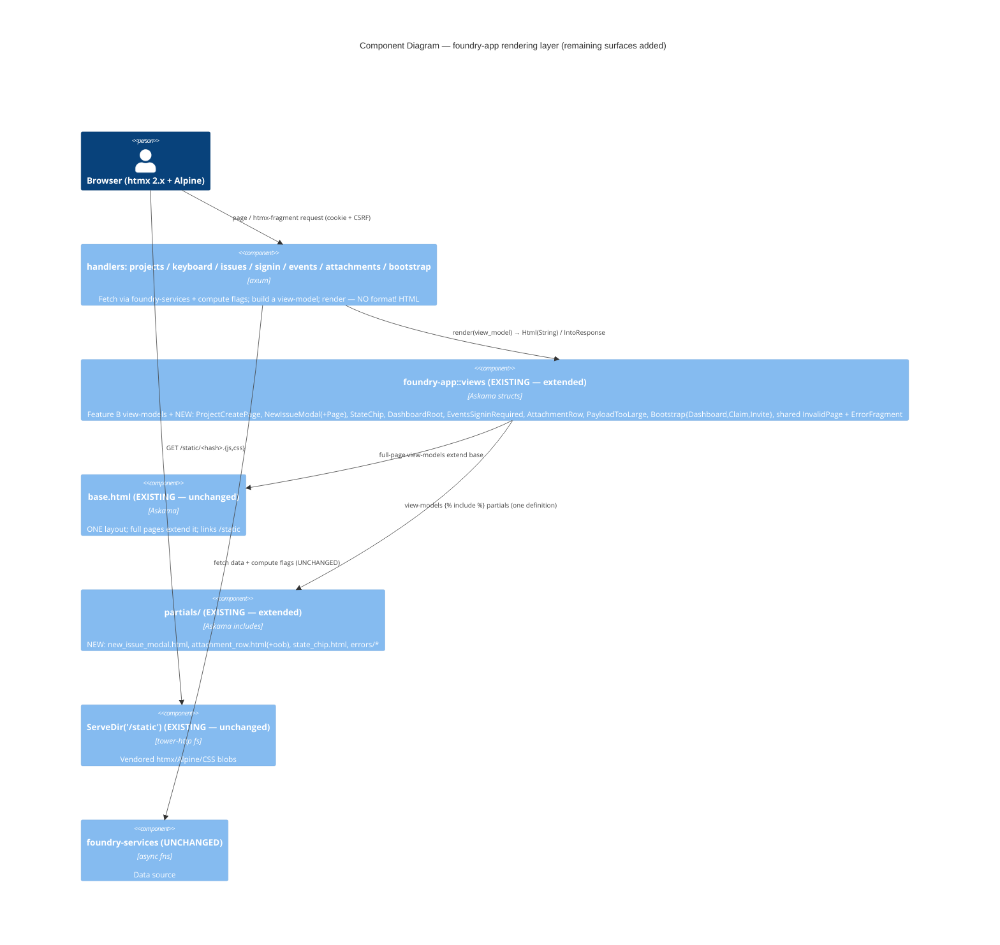

# Remaining-Surfaces Templating — Application Architecture

Owner: solution-architect (Morgan). Scope: the **deferred move-only follow-up to Feature B**
(`htmx-web-tier`). This feature **INHERITS Feature B's architecture wholesale** — Askama 0.12 engine,
the ONE `base.html`, the `foundry-app::views` typed view-model module, the vendored `/static` assets,
and the selector-and-substring-identical render contract (ADR-B01..B07, all unchanged). There are
**ZERO new architectural decisions, ZERO new dependencies, ZERO new infrastructure**. The deliverable
is a set of **new template files + view-model structs** that move the last inline `format!()` render
sites out of the handlers. Companion documents: `render-contract.md`, `wave-decisions.md`. DISCUSS
source: `../discuss/{stories.md, story-map.md, nfrs.md, wave-decisions.md, out-of-scope.md}`.

LEGACY per-feature layout under `docs/feature/remaining-surfaces-templating/design/` (NOT
`docs/product/` SSOT), mirroring Feature B.

## TL;DR

Feature B introduced the rendering mechanism (engine + base layout + view module + asset route) and
migrated the high-traffic surfaces (board, issue/comment page, sign-in, forgot). It **deferred** the
remaining surfaces. This feature finishes that cut: each remaining inline `format!()` becomes a new
`.html` template (full pages extend `base.html`; htmx fragments stay BARE) driven by a new `views.rs`
struct. No engine, no infra, no dependency is added — the work is purely "create the template file +
the view struct, delete the `format!()`, keep the suite green." The single high-leverage micro-move
is the shared `invalid_page` helper (`bootstrap.rs:356`, reused across **7 modules**, ~17 call sites)
becoming ONE shared `invalid_page.html` — restyling every not-found/error path at once.

## Surface → template / view-model map (the deliverable)

Verified against the current code (file:line evidence). Classification per the inherited
fragment-vs-full-page rule (Feature B render-contract.md §"The one-partial rule" / NFR-WEBB-COMPAT-02):
**full pages extend `base.html` and link `/static`; bare fragments are htmx-swapped and MUST NOT
extend `base.html`** (double-wrap hazard).

| Story | Current render site (file:line) | New template (`crates/foundry-app/templates/`) | `views.rs` view-model | Shape |
|---|---|---|---|---|
| US-R01 | `projects.rs::render_create_form` (`:466`) | `project_create.html` (extends `base.html`) | `ProjectCreatePage { team_name, action, csrf, error, raw_name, raw_key }` | **Full page** |
| US-R01 | `projects.rs::render_error_fragment` (`:499`) | `partials/errors/project_create_error.html` (or shared `error_fragment.html`) | `views::ErrorFragment { fragment_marker, message }` | **Bare fragment** |
| US-R02 | `keyboard.rs::render_modal_fragment` (`:108`) | `partials/new_issue_modal.html` (the ONE partial) | `NewIssueModal { action, csrf, project_name }` | **Bare fragment** |
| US-R02 | `keyboard.rs::render_modal_full_page` (`:124`) | `new_issue_modal_page.html` (extends `base.html`; `` the partial) | `NewIssueModalPage { action, csrf, project_name, team_slug }` | **Full page** |
| US-R02 (optional) | `keyboard.rs::render_search_fragment` (`:226`) | `partials/search_results.html` | `SearchResults { matches: Vec<SearchHit>, empty }` | **Bare fragment** |
| US-R02 (optional) | `keyboard.rs::show_keyboard_help` (`:248`) | `partials/keyboard_help.html` | `KeyboardHelp { shortcuts: Vec<(key,label)> }` | **Bare fragment** |
| US-R03 | `issues.rs::bad_request_fragment` (`:253`) | shared `error_fragment.html` (reuse US-R01) | `views::ErrorFragment { fragment_marker="issue-create-error", message }` | **Bare fragment** |
| US-R03 | `issues.rs` state-change `` (`:147`) | `partials/state_chip.html` | `StateChip { normalized }` | **Bare fragment** |
| US-R04 | `signin.rs::dashboard_root` signed-in body (`:243`) | `dashboard_root.html` (extends `base.html`) | `DashboardRoot {}` (or empty) | **Full page** (signed-out 303 redirect unchanged in handler) |
| US-R04 | `events.rs::unauthorized_response` (`:138`) | `events_signin_required.html` (extends `base.html`) | `EventsSigninRequired {}` | **Full page** (401 status preserved) |
| US-R05 | `attachments.rs::render_attachment_row_oob` (`:385`) | `partials/attachment_row.html` (the ONE partial) + `partials/oob/attachment_row_oob.html` wrapper | `AttachmentRow { filename, size_label }` | **Bare fragment** (OOB wrapper includes the partial) |
| US-R05 | `attachments.rs::bad_request_fragment` (`:369`) | shared `error_fragment.html` (reuse) | `views::ErrorFragment { fragment_marker="attachment-upload-error", message }` | **Bare fragment** |
| US-R05 | `attachments.rs::payload_too_large` (`:353`) | `payload_too_large.html` (extends `base.html`) | `PayloadTooLarge { limit_mb }` | **Full page** (413 status preserved) |
| US-R05 | `attachments.rs::not_found_page` (`:349`) | renders via shared `invalid_page.html` (already delegates to `invalid_page`) | `views::InvalidPage` (shared) | **Full page** |
| US-R06 | `bootstrap.rs::dashboard` (`:205`) | `bootstrap_dashboard.html` (extends `base.html`) | `BootstrapDashboard { signed_in }` | **Full page** |
| US-R06 | `bootstrap.rs::render_claim_form` (`:338`) | `bootstrap_claim.html` (extends `base.html`) | `BootstrapClaim { token }` (action `/bootstrap?token={token}`) | **Full page** |
| US-R06 | `bootstrap.rs::create_invite` invite-link body (`:286`) | `bootstrap_invite.html` (extends `base.html`) | `BootstrapInvite { invite_url }` | **Full page** |
| US-R06 (high-leverage) | `bootstrap.rs::invalid_page` (`:356`, reused by **7 modules**, ~17 call sites) | `invalid_page.html` (extends `base.html`) | `views::InvalidPage { heading, message }` | **Full page** (one template restyles every not-found/error path) |

**Note on the brief's `signin.rs::invalid_page`:** verified in code the helper actually lives at
`bootstrap.rs:356` (`pub(crate) fn invalid_page`) and is imported across `attachments.rs`,
`projects.rs`, `keyboard.rs`, `issues.rs`, `comments.rs`, and `bootstrap.rs` itself. The architecture
treats it as ONE shared template regardless of its file home — that is the point of the move.

## Component decomposition (C4) — these surfaces JOIN the existing rendering layer

No topology change. Feature B's container/component picture stands; this feature only adds template
files + view structs inside the already-existing `templates/` dir and `foundry-app::views` module.

Dependency direction is **unchanged**. No new crate, no reversed edge, no new `sqlx` call site in any
render path — the boundary guard's web≠DB invariant (Feature A `boundary-guard.md`) stays green by
construction. The htmx-2 bump is NOT carried (Feature B's Slice 4 did it); the only active `hx-*` on
these surfaces are the attachment OOB swap (`hx-swap-oob="beforeend:[data-attachment-list]"`) and the
state-change span — both move AS-IS on the already-pinned htmx 2.x (nfrs.md §"NOT in scope").

## Reuse Analysis (MANDATORY)

Every surface reuses Feature B's shipped engine + base + render contract + assets. The ONLY genuinely
new artifacts are template files and view structs — those ARE the feature's deliverable, not new
architecture.

| Concern | Existing component (evidence) | Verdict | Justification |
|---|---|---|---|
| Template engine | Askama 0.12 + `askama_axum`, wired by Feature B (ADR-B01) | **EXTEND (reuse as-is)** | Already in `Cargo.lock`; this feature adds zero deps. |
| Base layout | `templates/base.html` (Feature B) | **EXTEND (reuse as-is)** | Full pages ``; links the existing `/static`. |
| View-model module | `foundry-app::views` (Feature B) | **EXTEND (add structs)** | New `#[derive(Template)]` structs added; same typed seam, same module. |
| Static assets / `/static` route | vendored blobs + `ServeDir` (ADR-B03) | **EXTEND (reuse as-is)** | No new asset, no route change; pages link the existing stylesheet/JS. |
| Render contract | selector-and-substring-identical (ADR-B02) | **EXTEND (reuse as-is)** | Same contract; every `data-*`/`hx-*`/copy reproduced byte-stable. |
| One-partial rule | `issue_card.html`/`comment_card.html` (Feature B, NFR-WEBB-MAINT-02) | **EXTEND (apply to new partials)** | `new_issue_modal.html` (fragment+full-page) and `attachment_row.html` (full+OOB) follow it. |
| Board/issue/comment data fetch | `foundry-services` (UNCHANGED) | **EXTEND (reuse as-is)** | Handlers already fetch; templates render. No DB in render path (NFR-WEBB-BND-01). |
| CSRF contract | `csrf.rs` + `CSRF_FORM_FIELD` (DB7) | **EXTEND (untouched; emit field)** | Templates emit `_csrf` field with the handler-supplied token; middleware unchanged (US-R01/R02/R06). |
| Session / auth flow | `signin.rs`/`bootstrap.rs` handlers (UNCHANGED) | **EXTEND (untouched; markup only)** | Signed-out 303 redirect (US-R04), 401 (events), `/bootstrap` CSRF exemption (US-R06) unchanged. |
| Sanitization / authz | `foundry-core` + handler flags (NFR-WEBB-BND-03) | **EXTEND (reuse as-is)** | Stays out of templates. |
| Asset-resolution / template-presence probe | Feature B's compile-time check + CI asset probe | **EXTEND (reuse as-is)** | New templates are compile-checked by Askama for free; no new probe. |
| **The new template files** (project_create, new_issue_modal, state_chip, dashboard_root, events_signin_required, attachment_row, payload_too_large, bootstrap_*, invalid_page, error_fragment) | — (these `format!()` sites have no template today) | **CREATE NEW (the deliverable)** | A *move* of markup out of Rust into `.html`; no new behavior. The asserted DOM/markers/copy preserved (render-contract.md). NOT new architecture — new files using the inherited engine. |
| **The new view-model structs** | — (handlers build strings inline) | **CREATE NEW (the deliverable)** | Askama needs `#[derive(Template)]` structs; added to the existing `views` module. NOT a new module/crate. |

**Verdict tally: EXTEND = 11, CREATE NEW = 2** — and both CREATE NEW rows are *template files + view
structs* (the feature's whole output), not architecture. **Zero new infrastructure, zero new engines,
zero new dependencies, zero new external integrations.** The data/auth/CSRF/sanitization/authz core is
100% reused; only markup moves.

## Earned Trust (Principle 12) — inherited, nothing new to probe

This feature adds **no new substrate dependency**. The three Feature B probes cover it unchanged:
- **Template presence = compile-time** (Askama type-checks every new `#[derive(Template)]` at
  `cargo build`; a missing/typo'd template or field is a build error — strongest posture).
- **Asset resolution** — these pages link the SAME vendored `/static` assets Feature B already
  probes; no new asset path to verify.
- **Render-failure fail-safe** — a render error maps to a clean 500 (or 500 fragment), never a
  half-page, via Feature B's central mapping.
- **htmx swap behavior** — the two active `hx-*` here (attachment OOB, state chip) move AS-IS on the
  already-probed htmx 2.x; no version bump (US-B05 is done in Feature B).

"What happens if the environment lies?" is answered identically to Feature B; this feature introduces
no new lie surface.

## External Integration Note (for platform-architect)

**No new external integration.** No CDN, no third-party API, no OAuth, no webhook, no new runtime
dependency, no new env var, no new service. `docker compose` topology unchanged. The inherited SMTP
recommendation (backend-mvp `auth.md`) stands untouched. Handoff carries only: a set of new template
files + view structs compiled into the existing binary; re-run `cargo deny check` is **not** required
(no dependency change). The existing CI lanes (acceptance suite + Feature B's asset/compile probes)
cover this feature with no new gate.
