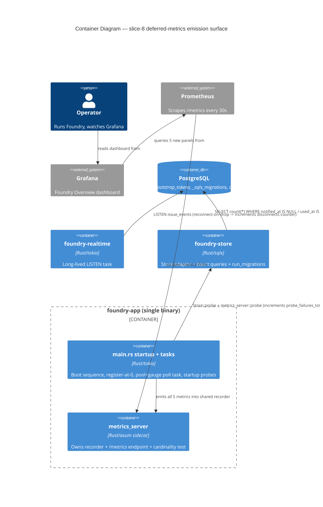

# Application Architecture — slice-8-deferred-metrics (slice 8)

Owner: solution-architect (Morgan). Slice-specific design summary.
Inherits the entire slice-1..7 architecture by reference; does NOT
restate the 5-crate workspace, dependency direction, advisory-lock
pattern, metrics-recorder lifecycle, the slice-6 instrumentation
patterns, or the slice-7 background-task pattern.

**Mode**: propose. **Status**: PROPOSED — picks on D1–D6 awaiting user
confirmation in `proposals.md`; this document reflects the recommended
picks. ADRs ADR-018 (gauge poll hosting), ADR-019 (counter call-site
emission), ADR-020 (migration timing strategy) capture the binding
decisions.

## 0. What this slice is

Closes slice-6 D0's deferred-metrics signal: the slice-1
`observability-infra.md` metric catalog (lines 159-176) enumerates 5
metrics that **nothing emits today** (zero code + zero dashboard
references). Slice 7 already shipped 2 of the original deferred family
(`comments_tombstones_*`), reducing the catalog from "5 deferred" to "3
deferred + 2 shipped". This slice ships the remaining 5 metrics in the
catalog that still have no emitter:

| Metric | Type | Labels | Emission style |
|---|---|---|---|
| `outbox_pending_jobs` | gauge | (none) | periodic poll (DB state) |
| `bootstrap_tokens_unclaimed` | gauge | (none) | periodic poll (DB state) |
| `migration_apply_duration_seconds` | histogram | `migration_id` | timing wrapped around migration apply |
| `realtime_listen_disconnects_total` | counter | (none) | `.increment(1)` at the reconnect call-site |
| `probe_failures_total` | counter | `probe_name` | `.increment(1)` at probe-failure call-site |

This is the "instrument me" recursive pattern slice 6 established:
panels-first (DEVOPS) → emitters-later. Slice 8 also adds one Grafana
panel per metric so the catalog and the dashboard converge for v0.x.

Zero new crates. Zero new dependencies. Zero new database migrations.
Zero new external integrations.

## 1. Inheritance — the prior-art that shapes this slice

- **Register-at-0 at startup (slice-6 ADR-014 / D4, slice-7 ADR-016)** —
  every metric is registered with an initial value in `main.rs` BEFORE
  its emitter starts, so Grafana never shows "no data". `main.rs` lines
  194, 230-231 show the precedent (`gauge!(...).set(0.0)`,
  `counter!(...).absolute(0)`). All 5 slice-8 metrics inherit this.
- **Bounded label cardinality (slice-6 ADR-011 / D2)** — unlabelled
  metrics stay exactly 1 series; labels only when bounded. The
  `metrics_server.rs` cardinality unit test
  (`request_tracking_layer_emits_exactly_path_method_status`) asserts
  the request-metric label set statically. Slice 8 adds an analogous
  bound assertion for the two NEW labelled metrics (see §
  Architecture enforcement).
- **Poll-task pattern (slice-6 ADR-012, slice-7 ADR-015)** — gauges
  that reflect DB state are refreshed on a `tokio::time::interval` poll
  loop. Two precedents exist in `main.rs`: the 5s pool-stats poll task
  (lines 196-219) and the daily GC task that also polls the
  `comments_tombstones_pending` gauge (lines 282-349). The slice-7 GC
  tick already does a "do work + poll a gauge" pattern.
- **Counter-on-event pattern (slice-6 ADR-010)** — counters increment
  at the event call-site, not on a poll. `http_requests_total`
  increments inside the middleware; the GC counter increments after a
  successful sweep.
- **`count_pending_tombstones` (slice-7)** — the canonical
  "count pending rows" store method
  (`crates/foundry-store/src/lib.rs:1242`). The two new gauge-feeding
  count queries (`count_pending_outbox`, `count_unclaimed_bootstrap_tokens`)
  land next to it with the same shape (pure read, no lock, returns
  `Result<u64, StoreError>`).
- **Schema facts already in place (no migration needed)**:
  - `outbox` table (`0001_init.sql:104-111`) has
    `notified_at TIMESTAMPTZ` (nullable) + a purpose-built partial
    index `idx_outbox_pending ON outbox (id) WHERE notified_at IS NULL`.
    "Pending" = `WHERE notified_at IS NULL`.
  - `bootstrap_tokens` table (`0001_init.sql:85-91`) has `used_at` +
    `expires_at`. "Unclaimed" = `WHERE used_at IS NULL AND expires_at > now()`.
- **PgListener reconnect path (slice-2)** —
  `crates/foundry-realtime/src/lib.rs:139-147`: the `run_pg_listener`
  outer loop's `Err(err)` arm is exactly one LISTEN-connection drop.
  This is the `realtime_listen_disconnects_total` increment site.
- **Probe surface** — there is currently NO `foundry doctor` probe-family
  subcommand emitting `probe_failures_total`. The only probes today are
  `Store::probe()` and `metrics_server::probe()`, both called from
  `main.rs` at startup. The slice-6 startup metrics probe already emits
  a structured `health.startup.refused` log on failure
  (`metrics_server.rs:296`). The counter wraps THESE existing probe
  call-sites — see D5 + ADR-019.

## 2. Reuse Analysis — HARD GATE

Default EXTEND. Every CREATE NEW is challenged. Slice-8 footprint is
heavily EXTEND — all five emitters attach to existing tasks / call-sites.

| Action | Target | Why | LOC delta |
|---|---|---|---|
| EXTEND | `crates/foundry-store/src/lib.rs` § (next to `count_pending_tombstones`, line 1242) | Add `Store::count_pending_outbox() -> Result<u64, StoreError>` (`SELECT count(*) FROM outbox WHERE notified_at IS NULL`, uses `idx_outbox_pending`) + `Store::count_unclaimed_bootstrap_tokens(now) -> Result<u64, StoreError>` (`SELECT count(*) FROM bootstrap_tokens WHERE used_at IS NULL AND expires_at > $1`). Pure reads, no lock, mirror `count_pending_tombstones`. | +~30 |
| EXTEND | `crates/foundry-app/src/main.rs` — slice-6 pool-poll task (lines 196-219) | Fold the two new DB-state gauges into the EXISTING 5s pool-poll loop (D1 = A). Each tick already reads pool stats; add two store reads + two `gauge!(...).set(...)`. No new `tokio::spawn`, no new cadence. Register-at-0 next to line 194. | +~25 |
| EXTEND | `crates/foundry-realtime/src/lib.rs` — `run_pg_listener` Err arm (lines 139-147) | Add `metrics::counter!("realtime_listen_disconnects_total").increment(1)` inside the reconnect-on-error branch, before the backoff sleep. One line + a comment. Register-at-0 happens in `main.rs`. | +~3 |
| EXTEND | `crates/foundry-app/src/main.rs` — startup probe sequence (lines 356-371) | Wrap the existing `Store::probe()` + `metrics_server::probe()` calls so that on `Err` the counter `probe_failures_total{probe_name=...}` increments before the error propagates. Register-at-0 for the bounded set of probe_names. | +~20 |
| EXTEND | `crates/foundry-store/src/lib.rs` — `run_migrations` (line 1349) | Wrap per-migration apply timing. `sqlx::migrate!` runs the whole set opaquely; to time per-`migration_id` the function iterates the migrator's known migrations and records a `histogram!("migration_apply_duration_seconds", "migration_id" => ...)` observation around each apply. See ADR-020 for the strategy (the constraint is that `sqlx::migrate!().run()` is a single opaque call). | +~25 |
| EXTEND | `crates/foundry-app/src/main.rs` — register-at-0 block (near lines 194, 230-231) | Register all 5 new metrics at 0 before their emitters run. Histogram has no register-at-0 (it has no "current value"); gauges + counters do. | +~10 |
| EXTEND | `crates/foundry-app/src/metrics_server.rs` — cardinality unit test | Extend the existing cardinality test (or add a sibling) to assert `migration_apply_duration_seconds` carries exactly `{migration_id}` and `probe_failures_total` carries exactly `{probe_name}`. Documents + enforces the bound. | +~30 |
| EXTEND | `observability/grafana-dashboards/foundry-overview.json` | Add 5 panels (one per metric) matching the existing panel JSON shape (timeseries / stat). | +~90 lines JSON |
| EXTEND | `docs/feature/foundry-backend-mvp/design/system/observability-infra.md` | Annotate the 5 catalog rows (lines 160-164) as "shipped slice 8"; close the slice-6 D0 deferred list (3 deferred → 0 deferred). | +~5 lines |
| CREATE NEW | none | All work attaches to existing tasks / call-sites / files. ADR-001 "no new crates" + slice-6 D5 / slice-7 D3 "no new files unless cohesion requires" both hold. No second poll task is created — the DB-state gauges piggyback the slice-6 pool poll. | — |

**Total estimated delta**: ~140 LOC of Rust + ~30 lines of test + ~90
lines of dashboard JSON + ~5 lines of catalog doc. Comparable to slice
6 (~190 LOC) and slice 7 (~240 LOC). The dominant design lever is D1:
piggyback the gauges on the existing 5s pool poll (chosen) vs spawn a
dedicated cleanup-cadence poll task.

## 3. Quality attribute drivers

| Attribute | Priority | Why |
|---|---|---|
| Observability completeness | HIGH | The whole point: close the 5-metric gap so the operator dashboard story is complete for v0.x. The slice-6/7 precedent treats "silent failure invisible for months" as the failure mode to prevent. |
| Operational simplicity | HIGH | Reuse the existing poll cadence + call-sites rather than introducing new background tasks or new wire surfaces. Drives D1, D2. |
| Bounded cardinality (cost control) | HIGH | Two metrics carry labels (`migration_id`, `probe_name`). Both must be provably bounded so Prometheus series count stays predictable. Drives D6 + the enforcement test. |
| Self-monitoring (Principle 9/12) | MEDIUM | `probe_failures_total` is the recursive self-application: a metric that observes whether the substrate-honesty probes are still passing. Drives D5. |
| Performance (hot-path neutrality) | MEDIUM | The two counters are at cold paths (reconnect, startup); the gauges ride an existing 5s tick. No request-hot-path cost. Drives D1, D3, D5. |

## 4. Emission mechanism per metric

### 4.1 `outbox_pending_jobs` (gauge) — D1 = A (piggyback pool poll)

Driven by a `SELECT count(*) FROM outbox WHERE notified_at IS NULL`
(uses `idx_outbox_pending`). Refreshed on each tick of the EXISTING
slice-6 5s pool-poll loop. Register-at-0 at startup.

**Honest caveat (open question for DISTILL)**: the outbox is currently
fire-and-forget — the COMMIT-time trigger (`0003_outbox_notify.sql`)
fires `pg_notify` but **nothing ever sets `notified_at`** (the
`PgListener` consumes the NOTIFY channel, it does not mark rows). So
today `notified_at` is always NULL and this gauge equals the **total
outbox row count**, which is itself a meaningful unbounded-growth
signal (no one prunes the outbox). The metric is still correct against
its stated purpose ("outbox depth — background-processing backlog");
the semantics question (should slice-8 also start writing `notified_at`,
or should the gauge be documented as total-rows?) is surfaced in §
Open Questions, not resolved here. Recommended default: ship the gauge
as `WHERE notified_at IS NULL` (forward-compatible — the day a
consumer marks rows, the gauge becomes a true backlog without a metric
rename).

### 4.2 `bootstrap_tokens_unclaimed` (gauge) — D1 = A (piggyback pool poll)

Driven by `SELECT count(*) FROM bootstrap_tokens WHERE used_at IS NULL
AND expires_at > now()`. Same 5s poll tick. Register-at-0 at startup.
Purpose: "operator hasn't claimed admin yet" — a non-zero value is a
deploy-time prompt; a value that stays non-zero past expiry self-clears
(the `expires_at > now()` filter).

### 4.3 `migration_apply_duration_seconds` (histogram, `migration_id`) — D4 = B, ADR-020

`run_migrations` currently calls `sqlx::migrate!("./migrations").run(pool)`
— a single opaque call with no per-migration hook. To emit
per-`migration_id` timing, the function iterates the migrator's
`iter()` (the `sqlx::migrate::Migrator` exposes the ordered migration
set) and times each individual apply, recording one histogram
observation labelled with the migration version/description. Emitted
once per migration **that actually runs** (already-applied migrations
are skipped — no observation). `migration_id` is bounded by the number
of migration files (currently 7); see D6. NO register-at-0 (histograms
have no "current value"); the panel shows "no data" until the first
migration applies, which is acceptable — migrations are a boot-time
one-shot, and the histogram is consulted for the NFR-MIG-03 release-
notes latency prediction, not for live alerting.

### 4.4 `realtime_listen_disconnects_total` (counter) — D2, ADR-019

`.increment(1)` inside `run_pg_listener`'s `Err(err)` reconnect arm
(`foundry-realtime/src/lib.rs:140`), before the backoff sleep. Each
LISTEN-connection drop is exactly one increment. Register-at-0 in
`main.rs`. Unlabelled — bounded at 1 series. Purpose: "should be
near-zero" — a rising rate is the operator's signal that the realtime
connection is flapping.

### 4.5 `probe_failures_total` (counter, `probe_name`) — D5, ADR-019

`.increment(1)` at each existing startup-probe call-site in `main.rs`
when the probe returns `Err`, labelled with the probe name. The probe
names are a closed, code-defined set (see D6). Today the bounded set is
`{store, metrics}` (the two existing `main.rs` probes). Register-at-0
for each known `probe_name` at startup so Grafana shows the full set as
flat-zero lines (the desired "all probes passing" baseline). On a probe
failure the counter ticks AND the process refuses to start (slice-6
ADR-014 posture is preserved — the counter increments just before the
error propagates, so the final `/metrics` scrape before exit, or the
next replica's scrape, records the failure). This is the recursive
Principle 9 self-monitoring metric.

## 5. Component diagram (C4 Level 2 — Container) — slice-8 emission surface

Properties the diagram makes obvious:

1. **No new background task** — the two DB-state gauges fold into the
   existing 5s pool-poll loop (D1 = A). The only `tokio::spawn` count in
   `main.rs` is unchanged.
2. **Emission is spread across three crates** but all flows into the one
   process-global recorder owned by `metrics_server`. No new wire
   protocol, no new port, no inter-crate call added (the realtime crate
   already depends on `metrics` per the slice-6 Cargo.toml additions).
3. **Two counters sit at cold paths** (reconnect, startup) — zero
   request-hot-path cost. The two gauges ride an existing tick — zero
   additional cadence. Only the histogram adds boot-time work (one
   `Instant` per migration).
4. **`probe_failures_total` is self-referential** — it observes the
   health of the same probe machinery that gates startup, closing the
   Principle 9 recursive loop.

## 6. Store method additions

Two new pure-read methods on the existing `Store` adapter, next to
`count_pending_tombstones` (`crates/foundry-store/src/lib.rs:1242`).
Signatures shape only — internals are software-crafter territory.

| Method | Signature shape | Notes |
|---|---|---|
| `Store::count_pending_outbox` | `() -> Result<u64, StoreError>` | `SELECT count(*) FROM outbox WHERE notified_at IS NULL`. Uses `idx_outbox_pending`. Pure read, no lock. Feeds `outbox_pending_jobs`. |
| `Store::count_unclaimed_bootstrap_tokens` | `(now: OffsetDateTime) -> Result<u64, StoreError>` | `SELECT count(*) FROM bootstrap_tokens WHERE used_at IS NULL AND expires_at > $1`. `now` passed in for testability (mirrors `claim_bootstrap_token`'s injected `now`). Feeds `bootstrap_tokens_unclaimed`. |

`run_migrations` gains per-migration timing (ADR-020). No new method —
the existing function is extended to iterate + time.

## 7. Quality attributes addressed

| Attribute | Mechanism |
|---|---|
| Observability completeness (HIGH) | All 5 catalog metrics emit + each gets a Grafana panel; slice-6 D0 deferred list closes to 0. |
| Operational simplicity (HIGH) | Gauges reuse the existing 5s poll loop; counters reuse existing call-sites; no new tasks/ports/migrations. |
| Bounded cardinality (HIGH) | 3 metrics unlabelled (1 series each); `migration_id` bounded by file count (~7); `probe_name` bounded by the code-defined probe set (~2). Enforced by extended cardinality test. |
| Self-monitoring (MEDIUM) | `probe_failures_total` observes the probe machinery (Principle 9 recursion). |
| Performance (MEDIUM) | Counters at cold paths; gauges on existing tick; histogram boot-time only. Zero request-hot-path overhead — no NFR-PERF-05 budget consumed. |

## 8. External integration check (principle 10)

NONE new. All emission is internal (same Postgres, same metrics
sidecar, same realtime LISTEN). Prometheus + Grafana are existing
PULL-scrape consumers, not new integrations — no contract test
annotation needed. The existing SMTP annotation from slice 1 remains.

## 9. Architecture enforcement (principle 11)

- `cargo xtask check-arch` — no crate-boundary changes (realtime
  already depends on `metrics`).
- `cargo deny check` — zero new dependencies.
- `cargo sqlx prepare --check` — two new count queries added to the
  offline cache.
- **Cardinality enforcement (extended)**: the slice-6
  `metrics_server.rs` cardinality unit test is extended (or a sibling
  test added) to assert the two NEW labelled metrics carry exactly
  their declared label key — `migration_apply_duration_seconds` →
  `{migration_id}`, `probe_failures_total` → `{probe_name}`. The three
  unlabelled metrics need no per-metric test (the absence of labels is
  trivially the bound), but the test fixture should assert no labels
  leak onto them either. This preserves the slice-6 D2 invariant for
  the new label-bearing series.

## 10. Earned Trust (principle 12) — probes for the new emitters

No new adapters and no new ports. All five emitters ride
already-probed adapters:

- The two gauges call new methods on the already-probed `Store`
  adapter (`Store::probe()` validates Postgres reachability at boot).
- The two counters increment process-local atomic state (infallible).
- The histogram times the migration apply on the already-probed Store.

The substrate lies relevant to THIS slice's correctness are exercised
by acceptance scenarios (DISTILL authors them), not by new probe code:

1. **Outbox-pending arithmetic lie** — insert N rows with
   `notified_at IS NULL` and M with `notified_at` set; assert the gauge
   reads N (probes the `WHERE notified_at IS NULL` filter).
2. **Unclaimed-token arithmetic lie** — insert an unclaimed token, a
   used token, and an expired token; assert the gauge reads 1.
3. **Listen-disconnect lie** — drop the LISTEN connection (kill/restart
   the testcontainers Postgres or sever the connection); assert the
   counter increments by exactly 1 per reconnect and the task survives.
4. **Probe-failure lie** — force a startup probe to fail (e.g., bind
   `METRICS_PORT` before boot, slice-6 ADR-014 precedent); assert
   `probe_failures_total{probe_name="metrics"}` registers the failure
   AND the process refuses to start.
5. **Migration-timing lie** — apply a migration set against a fresh
   schema; assert one `migration_apply_duration_seconds` observation
   per applied `migration_id`, and zero observations for an
   already-migrated schema (the histogram only fires on real applies).

**Self-application note (Principle 12)**: `probe_failures_total` IS the
probe-that-verifies-probes. The slice's own enforcement is the
cardinality test (structural) + scenario 4 (behavioral) — a single-layer
bypass on either is caught by the other.

## 11. ADRs created

- `adrs/ADR-018-deferred-gauges-piggyback-pool-poll.md` — captures D1
  (host the two DB-state gauges on the existing slice-6 5s pool poll vs
  a dedicated cadence) + D3 (cadence inheritance). Establishes "reuse
  the nearest existing poll loop for new DB-state gauges unless cadence
  genuinely diverges".
- `adrs/ADR-019-counter-call-site-emission-and-probe-self-monitoring.md`
  — captures D2 (`realtime_listen_disconnects_total` at the reconnect
  arm) + D5 (`probe_failures_total` wrapping the existing startup
  probes, with the bounded `probe_name` set). The Principle 9 recursive
  self-monitoring decision.
- `adrs/ADR-020-migration-timing-via-migrator-iteration.md` — captures
  D4: how to obtain per-`migration_id` timing given `sqlx::migrate!`'s
  opaque single-call API. Documents the rejected alternatives (no
  timing / coarse whole-set timing / sqlx fork).

D6 (label-cardinality bounds for `migration_id` + `probe_name`) is
captured inline in `wave-decisions.md` + enforced by the cardinality
test; it extends the existing slice-6 ADR-011 invariant rather than
creating a new ADR.
