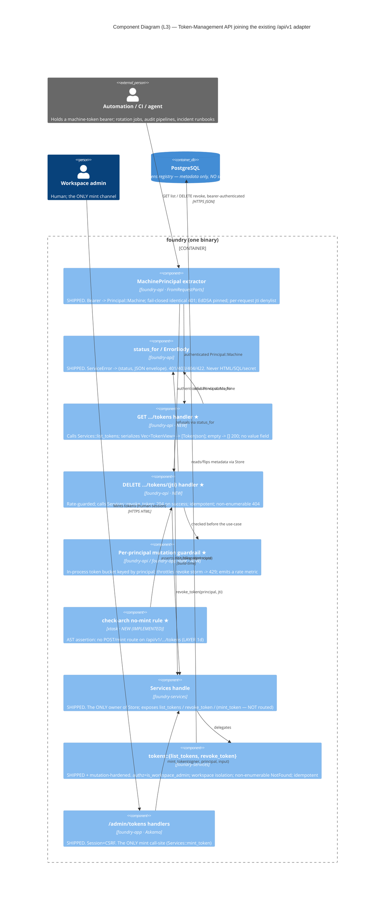

# Token-Management API — Architecture (DESIGN)

> Morgan (nw-solution-architect), DESIGN wave, application/component scope.
> Feature: a JSON token-management API under `/api/v1` — **GET list + DELETE revoke** of
> machine tokens (**NO mint via API**, ratified Q-AUTHZ option c). Bearer-authenticated.
> This is a **pure adapter feature**: it adds two routes + their serde response shapes + a
> rate guardrail to the EXISTING `foundry-api` driving adapter, over the SHIPPED,
> mutation-hardened `list_tokens` / `revoke_token` use-cases. No new crate, no migration,
> no use-case change.

## 1. System context (what this feature touches)

The token-management use-cases (`foundry_services::tokens::{list_tokens, revoke_token}`) are
SHIPPED and 100% mutation-hardened. They already enforce, with NO change required by this feature:

- **authz** — `is_workspace_admin(workspace_id, user_id)` on the bound principal (→ `Forbidden`);
- **workspace isolation** — `list_tokens` is workspace-scoped; `revoke_token` returns a
  **non-enumerable `NotFound`** for an unknown OR cross-workspace `jti`;
- **idempotent revoke** — `revoked_at` re-stamp; effective on the credential's NEXT `/api/v1`
  request via the SHIPPED per-request denylist (`token_auth::authenticate`);
- **no token value on any read path** — `TokenView` has no `value` field by construction.

`Services` (the core handle) ALREADY exposes `list_tokens(&principal)` and
`revoke_token(&principal, jti)` (`crates/foundry-services/src/lib.rs:156,165`). The foundry-api
adapter reaches them through its existing `State<Services>` seam — exactly as the issue/comment
handlers do — so **foundry-api never names `foundry_store::Store`** (boundary guard holds).

The genuinely new bits, and ONLY these:

1. **`GET /api/v1/teams/{team}/projects/{project}/tokens`** handler → `Services::list_tokens`.
2. **`DELETE /api/v1/teams/{team}/projects/{project}/tokens/{jti}`** handler → `Services::revoke_token`.
3. **Two serde response shapes** (`TokenJson` for the list array; no body for the 204 revoke).
4. **The per-principal rate guardrail** on the mutation route (DELETE) + its metric.
5. **(IMPLEMENTED, ship `a23cc2b`) a new `check-arch` LAYER-1d guard rule** asserting no MINT route
   is exposed on `/api/v1/.../tokens`.

## 2. Component (C4 L3) — MANDATORY

The token-mgmt routes join the existing `/api/v1` adapter as a peer of the issue/comment routes,
over the same `Services` seam. New components are starred (★); everything else is SHIPPED + reused.

Note the asymmetry the C4 makes visible: the **mint edge exists only from the human session UI**
(`adminUi -> Services::mint_token`). No bearer-reachable component touches `mint_token`. The
no-mint guard makes that absence enforceable, not merely conventional (Principle 12 — every
dependency probed; here the "dependency" is the invariant that mint stays off the bearer surface).

## 3. Reuse Analysis table — MANDATORY

| Element | Verdict | Where | Notes |
|---|---|---|---|
| `tokens::list_tokens(store, principal)` use-case | **REUSE (as-is)** | `foundry-services/src/tokens.rs:215` | authz + workspace scope + no-value `TokenView`. No change. |
| `tokens::revoke_token(store, principal, jti)` use-case | **REUSE (as-is)** | `foundry-services/src/tokens.rs:270` | authz + non-enumerable NotFound + idempotent re-stamp. No change. |
| `Services::list_tokens` / `Services::revoke_token` wrappers | **REUSE (as-is)** | `foundry-services/src/lib.rs:156,165` | Already on the handle the adapter holds. No new Services method. |
| `MachinePrincipal` / `token_auth::authenticate` extractor | **REUSE (as-is)** | `foundry-api/src/lib.rs:334,413` | Bearer → `Principal::Machine`; fail-closed identical 401; per-request denylist; EdDSA pinned. |
| `status_for` + `ErrorBody`/`ErrorDetail` + `ApiError` | **REUSE (as-is)** | `foundry-api/src/lib.rs:114,138` | 401/403/404/422 envelope. No new error shape. |
| `is_workspace_admin` authz gate | **REUSE (as-is)** | inside the use-cases | The v1 Q-AUTHZ model IS this gate; no adapter-side authz (boundary guard forbids it). |
| Per-request `jti` denylist (revoke effectiveness) | **REUSE (as-is)** | `Services::resolve_active_token` → `token_auth` | Revoke is "dead on next call" with no new mechanism. |
| `routes<S>()` router + `State<Services>` seam | **EXTEND** | `foundry-api/src/lib.rs:169` | Add 2 routes to the existing `Router`; same generic bounds. |
| `GET .../tokens` handler | **CREATE NEW** | `foundry-api` | Mirrors `list_issues_handler`. |
| `DELETE .../tokens/{jti}` handler | **CREATE NEW** | `foundry-api` | New verb shape (204). |
| `TokenJson` serde response shape | **CREATE NEW** | `foundry-api` | Mirrors `TokenView` (no value). See `api-contract.md`. |
| Per-principal rate guardrail + metric | **CREATE NEW** | `foundry-api` + `AppState` | In-process token bucket; see `rate-guardrail.md`. |
| `check-arch` no-mint LAYER-1d rule | **CREATE NEW (IMPLEMENTED, `a23cc2b`)** | `xtask/src/check_arch.rs` | AST assertion `check_api_no_mint_route` + gold test; see `no-mint-boundary.md`. |

**Verdict count: REUSE/EXTEND = 9 (8 reuse-as-is + 1 extend) · CREATE NEW = 5** (2 routes,
1 serde shape, 1 guardrail, 1 guard rule). The walking-skeleton intuition holds — this feature
is overwhelmingly inheritance; the new surface is two thin handlers and two guardrails.

## 4. Quality attributes (ISO 25010)

- **Security** (the defining attribute): no mint surface for bearer tokens (NFR-TMA-SEC-08, made
  enforceable by the no-mint guard); non-enumerable refusals reused from the use-cases
  (SEC-03); no value on any read path (SEC-02); revoke effective next request (SEC-04);
  attributable via `minted_by` (SEC-05); abuse-bounded by the guardrail (SEC-07). The escalation
  is workspace-confined by the SHIPPED isolation.
- **Reliability**: idempotent revoke (REL-01) and workspace isolation (REL-02) inherited unchanged;
  no regression to the existing `/api/v1` surface (REL-03) — the new routes are additive.
- **Performance**: LIST/REVOKE ≤200 ms p95 server-side (PERF-01); the guardrail is an O(1)
  in-memory check, no DB round-trip on the hot path.
- **Maintainability**: the routes are peers of the issue/comment routes (one pattern to learn);
  the boundary guard + no-mint guard keep the rules enforced, not eroding (Principle 11).

## 5. Constraints honored

ONE binary, ONE Postgres, NO Redis, NO new crate, NO migration. foundry-api stays HTML-free and
off `foundry_store::Store` (boundary guard LAYER 1+2 stay green). Token routes mount on `/api/v1`
OUTSIDE session+CSRF (bearer-only, CSRF-exempt by construction). The browser `/admin/tokens` path
is byte-for-byte unchanged.

## 6. External integrations

None. This surface is consumed BY external machine clients (CI / agents) over the SHIPPED bearer
contract; it consumes no third-party API. No consumer-driven contract tests are owed to
platform-architect for this feature. (The contract STABILITY the API publishes to its own
consumers is covered by the in-repo contract assertions in US-TMA04.)
</content>
</invoke>
