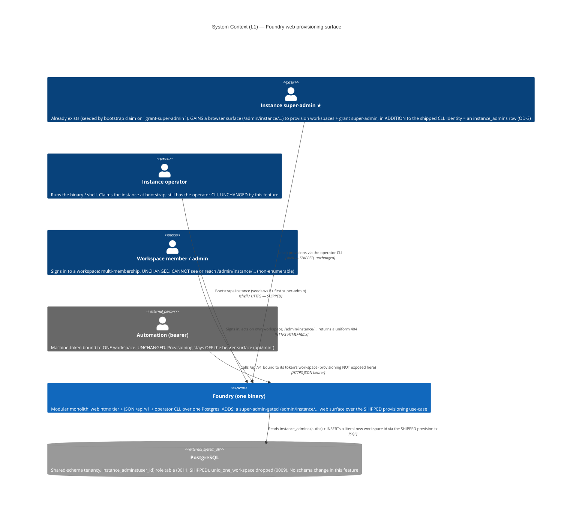
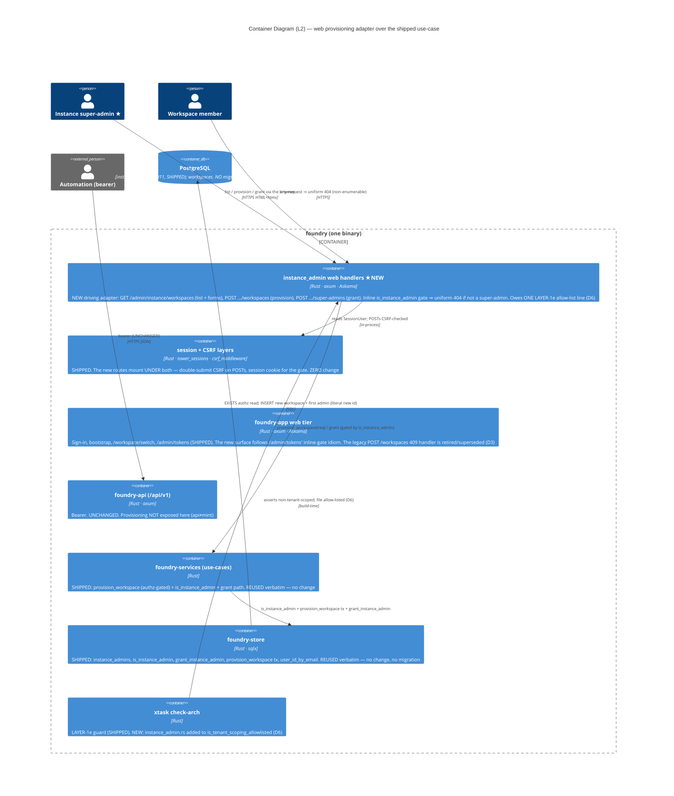
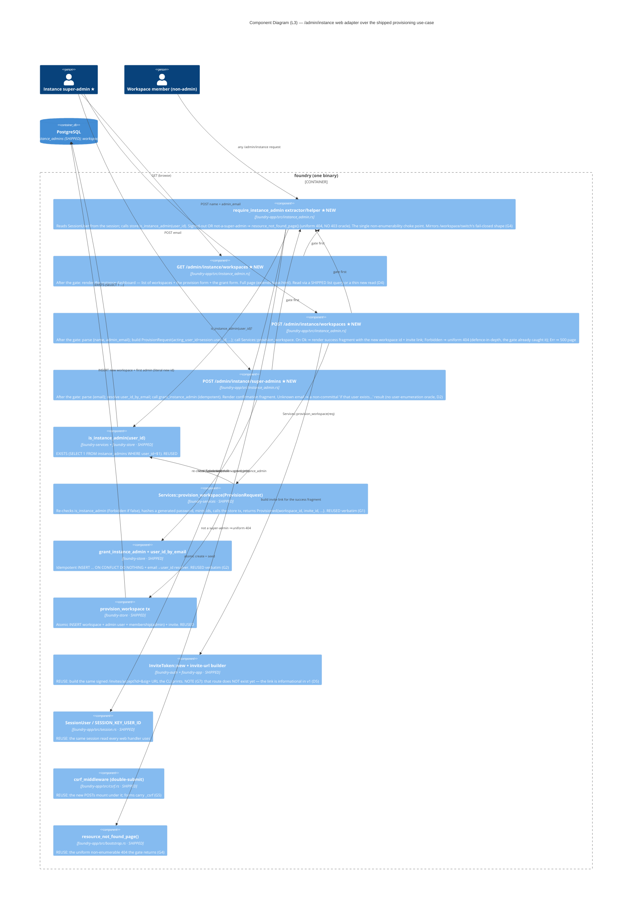

# Web Provisioning Flow — Architecture (DESIGN)

> Morgan (nw-solution-architect), DESIGN wave, application/component scope, **Propose** mode.
> Feature: the **deferred web provisioning surface** of the shipped `multi-workspace-provisioning`
> feature (its ADR-002 D2 deferred the web flow to here; the parent `multi-workspace-tenancy`
> ADR-004 originally sketched it as option (d)). This feature REALISES that web flow.
>
> **It is a NEW DRIVING ADAPTER (web), not new domain logic.** The provisioning use-case
> (`Services::provision_workspace`), the authz gate (`is_instance_admin`), the grant
> (`grant_instance_admin`), the `instance_admins` table (`0011`), and the atomic
> `Store::provision_workspace` transaction ALL SHIPPED. This feature adds the browser surface
> (`/admin/instance/…`) that drives them, reusing the shipped session + double-submit-CSRF
> machinery and the shipped non-enumerable refusal idiom.
>
> Inherited and respected: modular monolith + ports-and-adapters, Rust, **ZERO new crates**, the
> shipped session/CSRF middleware, the `/admin/tokens` + `/workspace/switch` web idioms, the
> `resource_not_found_page` non-enumerable boundary, the LAYER-1e tenant-scoping guard, the
> shipped clock seam. Ratified inputs designed-to: OD-3 (instance super-admin only, no self-serve).

## 0. Grounding findings (read the shipped code, not assumed)

| # | Finding | Source | Consequence for this design |
|---|---|---|---|
| G1 | **The provisioning use-case is fully shipped and authz-gated.** `Services::provision_workspace(ProvisionRequest)` checks `is_instance_admin(acting_user_id)` and returns `ServiceError::Forbidden` when false (fail-closed), then runs the atomic create+seed tx. | `foundry-services/src/lib.rs:227-270` | The web handler is a THIN adapter: read session user → build `ProvisionRequest` → call the use-case → map `Ok`/`Forbidden`/`Err` to HTML responses. **No new domain or store logic** (Reuse #1). |
| G2 | **The grant use-case is shipped + idempotent.** `Store::grant_instance_admin(user_id)` is `INSERT … ON CONFLICT DO NOTHING`; `is_instance_admin` is the EXISTS predicate. The CLI `grant-super-admin` drives it. | `foundry-store/src/lib.rs:1162-1185`, `admin_cli.rs:574-671` | A web "grant super-admin" action is a thin adapter over `grant_instance_admin`. It needs a **resolve-user-by-email** step (already exists: `user_id_by_email`). The store seam is reused verbatim (Reuse #2). |
| G3 | **The web auth idiom is inline session-extract, NOT middleware.** Every handler reads `session.get::<SessionUser>(SESSION_KEY_USER_ID)`; there is no auth layer. `/admin/tokens` (the closest precedent) checks the session inline and returns a generic page on failure. | `bootstrap.rs:23-39`, `signin.rs`, `admin_tokens.rs` | The instance-admin gate is an **inline check in a shared extractor/helper**, mirroring `/workspace/switch`'s fail-closed shape, NOT a new middleware tier (Decision D2). |
| G4 | **`/workspace/switch` is the membership-guarded, non-enumerable precedent.** `set_active_workspace` returns `Ok(false)` for a non-member ⇒ handler returns `resource_not_found_page()` — the SAME uniform 404 a foreign-resource reach returns. No 403-vs-404 oracle. | `session.rs:138-191`, `bootstrap.rs:382-388` | The instance-admin gate copies this exactly: a non-super-admin (or signed-out) user hitting `/admin/instance/…` gets the **uniform 404**, so the surface is non-enumerable (Decision D2). |
| G5 | **CSRF is double-submit, applied as a router layer to ALL non-safe methods.** `csrf_middleware` compares the `foundry_csrf` cookie against the `_csrf` form field / `hx-csrf` header; mismatch ⇒ 403. Forms embed `<input type="hidden" name="_csrf" value="{{ csrf }}">`. | `csrf.rs:96-173`, `views.rs` | Provisioning POSTs (create-workspace, grant) inherit CSRF for free by mounting UNDER the existing `csrf_middleware` layer. Each form view carries a `csrf: String` field (Reuse #4). |
| G6 | **The `bootstrap.rs:301` `create_workspace` 409 guard is STILL PRESENT** (parent upstream Finding 2): it hard-409s any second workspace via `workspace_count()`, ignoring identity. | `bootstrap.rs:301-333` | This is the **replace point**. The new web provisioning POST does NOT reuse this handler's body; it routes to a NEW `/admin/instance/workspaces` handler that gates on `is_instance_admin` and calls the use-case. The legacy `POST /workspaces` 409 handler is left as harmless defence-in-depth OR retired — see Decision D3. |
| G7 | **There is NO `/invites/accept` route — the emitted invite link is a dead URL today.** Both `bootstrap::create_invite` and the CLI `provision-workspace` print `"{public_url}/invites/accept?id=…&sig=…"`, but no route, no `consume_invite` store fn, and no password-set handler exist. | `bootstrap.rs:275`, `admin_cli.rs:505`; absence confirmed in router (`lib.rs:234-388`) + `signin.rs` + `store/lib.rs` | The provisioned admin cannot actually sign in via the link in v1. A real invite-accept flow is a **substantial new vertical** (route + token verify + password-set form + a consume-invite store tx) — LARGER than the admin surface itself. Decision D5 recommends it stays a **further follow-up** (OUT of this v1). |
| G8 | **The LAYER-1e allow-list keys off file STEM and already exempts `bootstrap`, `admin_cli`, `signin`, `session`.** A NEW handler file is NOT exempt; if it ever made a `*_in_workspace(` call fed a parsed id, the build fails. | `check_arch.rs:387-396` | A new `instance_admin.rs` handler file owes a **one-line allow-list entry** IF (and only if) it names a literal/parsed workspace id. Provisioning creates a literal new id, so the entry is added pre-emptively per D6 — recorded so DELIVER doesn't rediscover it. |
| G9 | **`Services` and the session machinery are already wired into `AppState` + `FromRef`.** `AppState` carries `store`, `session_secret`, `public_url`, `clock`, `email`; `FromRef<AppState> for Services` exists. | `lib.rs:62-204` | The web handler needs **no new state field**. It extracts `Services` (or `State<AppState>`) exactly as `/admin/tokens` does. |

## 1. System context (C4 L1) — MANDATORY

The instance super-admin — already a shipped actor (created by the bootstrap claim / `grant-super-admin`) — gains a SECOND surface (the browser) alongside the shipped CLI. No new actor, no new external system. Everything inside the boundary is the one binary; PostgreSQL is the one store.

## 2. Container (C4 L2) — MANDATORY

The web provisioning path is a NEW driving adapter (`instance_admin` web handlers) that sits BESIDE the resolution seam (it provisions a workspace rather than acting within one) and converges on the SHIPPED `Services::provision_workspace` / `grant_instance_admin`. It is mounted under the SHIPPED session + CSRF layers. Authz lives in services/store; the adapter only reads the session and maps results to HTML.

## 3. Component (C4 L3) — the web provisioning adapter — MANDATORY

The adapter is three handlers sharing one gate helper. Each handler is a thin map from session+form to a SHIPPED use-case call to an HTML response. New/changed components starred (★); everything below `is_instance_admin` is SHIPPED and reused.

## 4. Reuse Analysis table — MANDATORY (default EXTEND/REUSE)

Default is REUSE/EXTEND; every CREATE NEW carries evidence that no existing component can be extended. This feature is **almost entirely REUSE** — the backend shipped; the only genuinely new artifact is the thin web adapter file (and its templates + one allow-list line).

| # | Existing component | File | Overlap | Decision | Justification |
|---|---|---|---|---|---|
| 1 | `Services::provision_workspace(ProvisionRequest)` (authz-gated) | `foundry-services/src/lib.rs:227-270` | The provisioning use-case | **REUSE (verbatim)** | Shipped, gated, mutation-hardened (incl. the gate-inversion mutant). The web handler builds `ProvisionRequest{acting_user_id = session.user_id, …}` and calls it. No domain change. |
| 2 | `grant_instance_admin` + `user_id_by_email` + `is_instance_admin` | `foundry-store/src/lib.rs:1162-1185` | The grant + authz store seam | **REUSE (verbatim)** | The web grant action resolves email→id and calls the idempotent grant. The CLI already drives the same pair (`admin_cli.rs:574-671`). |
| 3 | `Store::provision_workspace` tx | `foundry-store/src/lib.rs:1212-1259` | Atomic create+seed | **REUSE** | Driven only through the use-case (#1); the adapter never calls it directly. |
| 4 | `csrf_middleware` (double-submit) | `foundry-app/src/csrf.rs:96-173` | State-changing POST protection | **REUSE** | The new routes mount UNDER the shipped layer; each form view carries `csrf: String` rendered into `<input name="_csrf">`. |
| 5 | Session extract idiom (`SessionUser` / `SESSION_KEY_USER_ID`) | `foundry-app/src/session.rs`, `bootstrap.rs:23-39` | Read the signed-in user | **REUSE** | The gate reads the session exactly as `/admin/tokens` and `/workspace/switch` do. |
| 6 | `/workspace/switch` fail-closed + `resource_not_found_page()` | `session.rs:138-191`, `bootstrap.rs:382-388` | Non-enumerable refusal | **REUSE (as the shape)** | The instance-admin gate copies the membership-guard's exact response shape (uniform 404, no 403 oracle) for the surface boundary. |
| 7 | `/admin/tokens` inline-gated web admin surface | `foundry-app/src/admin_tokens.rs` | Browser admin route group idiom | **REUSE (as the shape)** | The closest precedent for a session-gated, CSRF-protected, htmx admin page. `/admin/instance/…` mirrors its structure. |
| 8 | Askama `base.html` + page/fragment template idiom | `templates/*`, `views.rs` | HTML rendering | **REUSE (as the shape)** | New templates (`instance_workspaces.html` page + success/confirmation fragments) follow the shipped `extends base.html` + `partials/` htmx idiom. |
| 9 | `InviteToken::new` + invite-url builder | `foundry-auth`, `bootstrap.rs:267-280`, `admin_cli.rs:499-521` | Signed invite link | **REUSE** | The success fragment shows the SAME signed `/invites/accept?…` URL the CLI prints. (Dead link in v1 per G7 — informational; D5.) |
| 10 | `build_router` route registration | `foundry-app/src/lib.rs:234-388` | Mount the new routes | **EXTEND** | Add three `.route(...)` lines for `/admin/instance/workspaces` (GET+POST) and `/admin/instance/super-admins` (POST), in the route block BEFORE the csrf+session layers. |
| 11 | `bootstrap::create_workspace` (the 409 guard, `POST /workspaces`) | `foundry-app/src/bootstrap.rs:301-333` | The legacy single-workspace web POST | **RETIRE / SUPERSEDE (D3)** | The new `/admin/instance/workspaces` POST is the real provisioning path. The legacy `POST /workspaces` 409 is superseded; D3 recommends RETIRING the route (it served the pre-multi-workspace MVP and now only hard-409s). See ADR-003. |
| 12 | `instance_admin.rs` web handler file + its templates | — (does not exist) | The web driving adapter | **CREATE NEW** | A driving adapter for a new surface has no existing file to extend without entangling unrelated handlers. One focused module (≈3 handlers + 1 gate helper) + 2-3 templates. The smallest new surface that realises the deferred web flow. |
| 13 | LAYER-1e allow-list entry for `instance_admin` | `xtask/src/check_arch.rs:387-396` | Build-time tenant-guard exemption | **EXTEND (one line) (D6)** | Provisioning handles a *literal new* workspace id (non-tenant-scoped). The new file's stem MUST be added to `is_tenant_scoping_allowlisted`, exactly as ADR-003 of the parent feature foresaw ("a future web surface in a new file owes one allow-list line"). |

**Verdict counts: REUSE/EXTEND = 11** (9 REUSE: #1-9; 2 EXTEND: #10 router, #13 allow-list) **· RETIRE = 1** (#11) **· CREATE NEW = 1** (#12 the adapter file + templates). The feature is overwhelmingly REUSE: the entire provisioning backend, the authz gate, the session/CSRF machinery, and the non-enumerable refusal idiom all ship. The single genuinely-new artifact is the thin web adapter that wires the browser to the shipped use-case.

## 5. The decisions (one line each; full ADRs in `adr-00{1..5}-*.md`)

| # | Decision | Recommended | ADR |
|---|---|---|---|
| D1 | Routes / screens (v1 scope) | **One page `GET /admin/instance/workspaces` (list + provision form + grant form) + `POST /admin/instance/workspaces` (provision) + `POST /admin/instance/super-admins` (grant).** htmx fragment responses for the POST results, full page for GET — matching `/admin/tokens`. Minimal but coherent. | adr-001 |
| D2 | Web authz + non-enumerability | **Inline `require_instance_admin` gate** (read session → `is_instance_admin` → uniform 404 via `resource_not_found_page()` on signed-out OR non-admin). NO new middleware tier; mirrors `/workspace/switch`. Grant action gives a non-committal result for unknown emails (no user-enumeration oracle). | adr-002 |
| D3 | The `bootstrap.rs:301` 409 guard migration | **RETIRE the legacy `POST /workspaces` route**; the new `/admin/instance/workspaces` POST is the sole web provisioning path (gated, real creation). The legacy handler only hard-409s a pre-multi-workspace MVP. (Alternative kept: leave it as inert defence-in-depth.) | adr-003 |
| D4 | Reuse vs new | **The web layer is a thin driving adapter over the SHIPPED `Services::provision_workspace` / `grant_instance_admin`.** No new domain/store logic, no migration. The only new read may be a workspace-list query for the dashboard (thin, non-tenant-scoped). | adr-004 |
| D5 | First-admin onboarding / invite-accept scope | **Invite-accept (`/invites/accept` + password-set) is OUT of this v1 — a further follow-up.** The web success fragment shows the same signed invite link the CLI emits (informational). Building the real accept vertical (route + token verify + password-set + consume-invite tx) is larger than this whole feature and is its own increment. **Flagged for ratification.** | adr-005 |
| D6 | LAYER-1e (D7 lineage) allow-list | **Add `instance_admin` to `is_tenant_scoping_allowlisted`** (`check_arch.rs:394`) — one line — because the provisioning INSERT names a literal new workspace id (non-tenant-scoped), exactly as the parent ADR-003 foresaw. | adr-002/004 |

## 6. Quality attributes (ISO 25010)

- **Security** (defining): the surface is super-admin-gated by the SHIPPED, mutation-hardened
  `is_instance_admin` (fail-closed). It is **non-enumerable** — signed-out and not-a-super-admin
  both get the uniform `resource_not_found_page()` 404 (no 403-vs-404 oracle, consistent with the
  shipped tenancy boundary, parent NFR-MWT-SEC-02). Provisioning POSTs are CSRF-protected by the
  shipped double-submit layer. The path stays OFF the `/api/v1` bearer surface (`api≠mint`). The
  use-case RE-checks the gate (defence-in-depth) even though the adapter already gated. The grant
  action avoids a user-enumeration oracle for unknown emails.
- **Reliability**: zero schema change, zero new domain logic ⇒ the existing acceptance suite stays
  green; provisioning correctness is already proven (the parent's 15 scenarios + 100% mutation on
  the gate). Creating workspace B never reads/writes A (inherited NFR-MWT-REL-01, held by the
  use-case).
- **Maintainability**: one focused adapter module; every rule enforced (LAYER-1e guard extended by
  one allow-list line; the gate reuses the shipped non-enumerable idiom). ZERO new crates keeps the
  dependency surface flat.
- **Usability**: a non-shell operator can now provision from the browser (the gap the CLI-first v1
  left open). Full-page GET = no-JS fallback; htmx fragments for snappy POST feedback (matching the
  shipped web tier's progressive-enhancement contract).
- **Testability**: the adapter is driven through the HTTP port (real session, real CSRF, real DB
  via testcontainers — the shipped acceptance idiom). The gate's non-enumerability is provable by a
  revert-reds-it litmus (a signed-in non-admin and a signed-out user both get byte-identical 404s).

## 7. Architecture enforcement

Style: **Modular monolith + ports-and-adapters** (in force). Language: **Rust**.
Tool: **`cargo xtask check-arch`** (the project's own AST + cargo-deny guard).

Rules to enforce:
- Existing (must stay green): api≠HTML, api≠ad-hoc-authz, api≠mint, JWT alg pinned to `[EdDSA]`,
  dependency direction (adapter → services → store), and the SHIPPED LAYER-1e tenant-scoping rule.
- **This feature adds ONE allow-list line** (D6): `instance_admin` joins `signin`/`bootstrap`/
  `admin_cli`/`session` in `is_tenant_scoping_allowlisted` (`check_arch.rs:394`), because the
  provisioning path legitimately names a *literal new* workspace id and must not trip — nor be
  forced through — the LAYER-1e detector. This is the explicit realisation of the parent ADR-003's
  recorded "a future web surface in a new file owes one allow-list line."
- Authz (`is_instance_admin`) MUST stay in `foundry-services`/`foundry-store` (it already is); the
  adapter only READS the gate result, never re-implements authz (the dependency-direction guard +
  the api≠ad-hoc-authz rule already enforce this).

### Earned-Trust (probe-don't-assume) commitments for DISTILL/DELIVER
- **Non-enumerability is PROBED, not assumed**: an acceptance scenario asserts that a signed-in
  non-super-admin AND a signed-out user receive byte-identical 404s on every `/admin/instance/…`
  route (status + body), with a revert-reds-it litmus (removing the gate must re-RED the assertion).
- **The CSRF guard is PROBED**: a provisioning POST with a missing/mismatched `_csrf` is refused
  (403), exercising the shipped double-submit middleware on the new route.
- **The gate is PROBED at the use-case too**: even with the adapter gate bypassed (test-injected),
  `Services::provision_workspace` refuses a non-super-admin (the shipped gate-inversion mutant
  already guards this; the web scenario confirms the defence-in-depth still fires).

## 8. External integrations

**None.** No third-party API, webhook, or OAuth provider. Provisioning is an internal super-admin
action over the in-process use-case; email (invite delivery) uses the SHIPPED `EmailSender` seam
(already in `AppState`), not a new integration. No consumer-driven contract tests are owed to
platform-architect for this feature.

## 9. Constraints honored

ONE binary · ONE Postgres · NO Redis · NO Node runtime · NO CDN · **ZERO new crates** · **ZERO new
migration** (the `0011 instance_admins` table already shipped). foundry-api stays HTML-free and off
the provisioning path; provisioning is NOT exposed on the bearer surface (`api≠mint`). The browser
auth/CSRF/session contract is reused byte-for-byte (the new routes mount under the SHIPPED layers).
The `foundry-acceptance` suite green-before stays green-after. The only new artifact is the thin
`instance_admin.rs` adapter + its templates + one router block + one LAYER-1e allow-list line.
</content>
</invoke>
