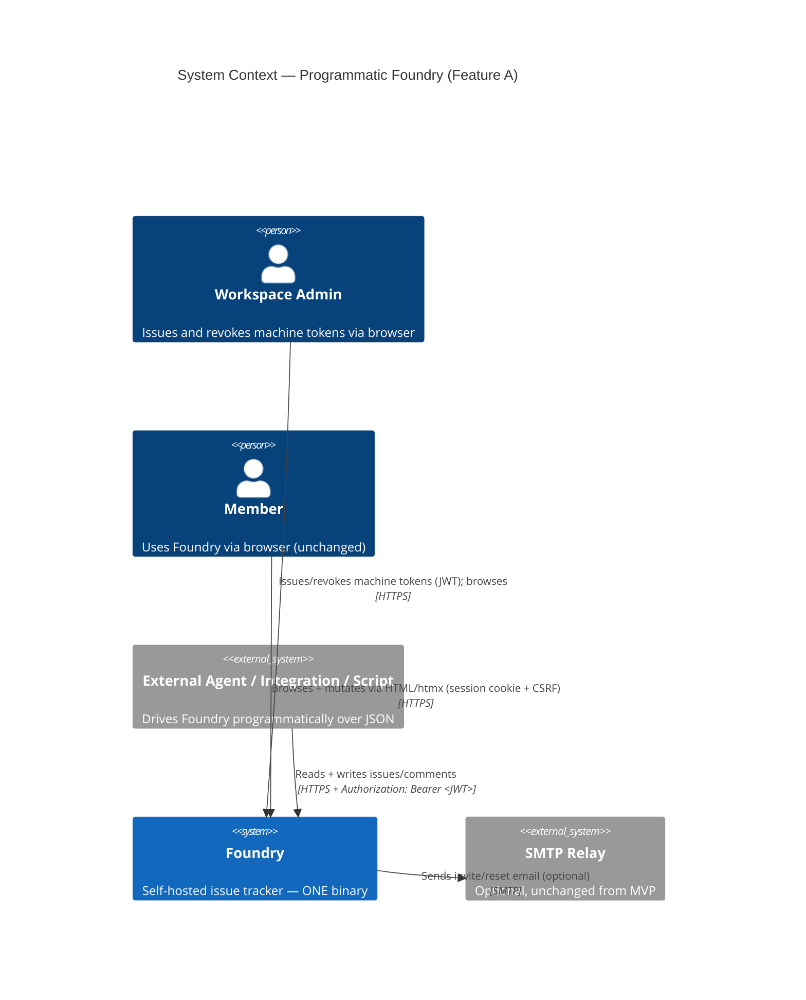
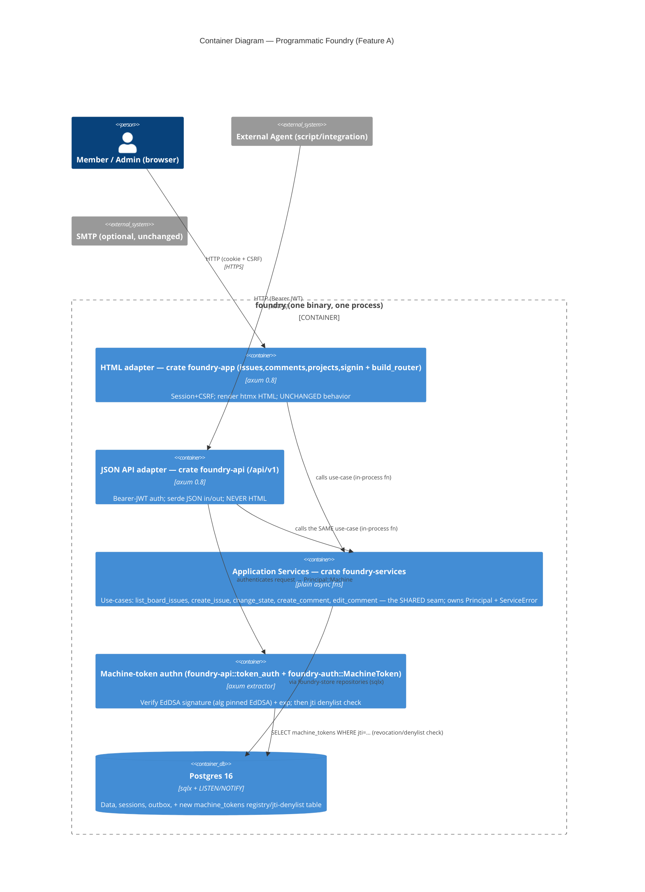
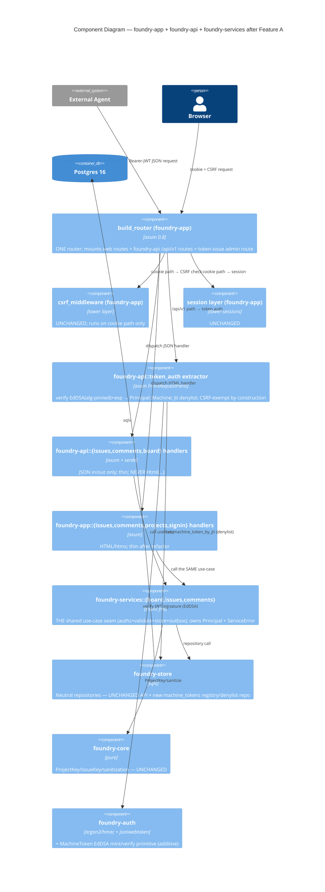

# Programmatic Foundry (Feature A) — Application Architecture

Owner: solution-architect (Morgan). Scope: **Feature A only** (DISCUSS D9) — a first-class JSON
API (read + write) authenticated by a machine token, the web/api/core separation that makes it
possible, and a CI-enforced boundary guard. Stories US-W05a, US-W05b, US-W05c, US-W06.
Companion documents: `api-contract.md`, `auth.md`, `boundary-guard.md`,
`error-and-observability.md`, `wave-decisions.md`.

This document MIRRORS `docs/feature/foundry-backend-mvp/design/architecture.md` in shape and
voice. Interaction mode: **Propose**. **The four open questions were RATIFIED 2026-05-31; two
overrode the recommendation** (machine token → JWT/Ed25519; topology → a new `foundry-api` crate).
This document is amended to the ratified choices; the ratification record lives in
`wave-decisions.md`.

## TL;DR

The JSON API is a **new driving-adapter crate (`foundry-api`) compiled INTO the existing one
binary**, a peer of the existing HTML handlers in `foundry-app`, both calling a **new shared
application-service crate (`foundry-services`)** over the already-neutral `foundry-store`. The
riskiest DISCUSS assumption — "core is secretly HTML-shaped" — is **disproven by the code**:
`foundry-store` already returns data rows (`IssueRow`, `CommentRow`), never HTML; HTML lives only in
`foundry-app` handler `format!` sites. The real gap is that the **use-case orchestration** (auth-check
→ validate → store-write → outbox) is currently inlined in each handler, not in a shared layer.
Feature A's load-bearing refactor is to lift that orchestration into the **`foundry-services` crate**
that BOTH the HTML handlers and `foundry-api` call — that is what makes rule-parity
(NFR-WEB-API-CON-02) a structural fact AND makes the dependency-direction boundary a Cargo-graph fact
(the adapter crates depend on `foundry-services`, never on `foundry-store` directly).

Ratified topology: **a new `foundry-api` crate now** (ADR-W01, OVERRODE the module recommendation),
which forced the shared seam into a **new `foundry-services` crate** (ADR-W07). Machine tokens:
**bearer JWT signed with Ed25519 (EdDSA), verified per request against a configured public key, with
a Postgres `jti` denylist for instant revocation** (ADR-W02, OVERRODE the opaque-token
recommendation; introduces ONE new dep, `jsonwebtoken`). Contract surface: **dedicated `/api/v1/…`
path prefix** (ADR-W03, unchanged). Boundary guard: **a custom `xtask check-arch` AST check + a real
`cargo-deny` crate-graph dep-direction rule + injected-violation gold test** (ADR-W06,
`boundary-guard.md`).

Seven ADRs accompany this design: ADR-W01 (topology — new crate), ADR-W02 (machine-token mechanism —
JWT/Ed25519), ADR-W03 (contract surface + versioning), ADR-W04 (shared application-service seam /
core neutrality), ADR-W05 (token registry + `jti` denylist + migration), ADR-W06 (boundary-guard
mechanism), ADR-W07 (location of the `services` seam — a new crate). They are embedded in
`wave-decisions.md` (MADR-style) rather than as separate files, mirroring how backend-mvp keeps
ADRs close to the wave record.

## What the code actually is today (grounding, not assumption)

Verified by reading the crates (file-path evidence in the Reuse Analysis table below):

- **`foundry-store` is ALREADY presentation-neutral.** Every repository method returns a data
  struct or a unit — e.g. `list_issues_by_project(project_id) -> Vec<IssueRow>`
  (`crates/foundry-store/src/lib.rs:702`), `insert_issue_with_outbox(...) -> Result<i32, …>`
  (`:633`), `insert_comment_with_outbox(...)` (`:859`). There is **zero `format!`-HTML and zero
  `serde`-JSON** on these paths. NFR-WEB-BND-05's premise is satisfied at the store layer today.
- **`foundry-core` is value objects + sanitization only.** `ProjectKey`, `IssueKey`, marker IDs,
  and `render_comment_markdown` (`crates/foundry-core/src/markdown.rs:58`). It holds **no
  use-case orchestration** — no "create issue" service. Sanitization (NFR-WEB-BND-03) already
  lives here.
- **The orchestration lives in `foundry-app` handlers, inlined with HTML.** `issues::submit_create`
  (`crates/foundry-app/src/issues.rs:46`) does, in one function: session extraction →
  `find_team_by_slug` → `is_team_member` → `find_project_by_slug` → title validation →
  `insert_issue_with_outbox` → `Html(render_issue_card_with_column_marker(...))`. The board read
  `projects::show_board` (`crates/foundry-app/src/projects.rs:208`) calls
  `store.list_issues_by_project` then `render_board(...)`.
- **It is one axum binary** composed by `foundry_app::build_router(state)`
  (`crates/foundry-app/src/lib.rs:138`). The **acceptance harness calls the SAME
  `build_router`** via `foundry_app::test_support::spawn_app`/`spawn_app_with_listener`
  (`crates/foundry-acceptance/src/support/harness.rs:21,292`), constructing `AppState { … }` as a
  struct literal in ~4 sites (`harness.rs:267`, `multi_replica_harness.rs:236,387`,
  `steps/us_03_backup_restore.rs:980`). This is the blast-radius surface for any new required
  `AppState` field (see §Composition & harness blast radius).
- **Auth is tower-sessions over a Postgres `session` table** (`crates/foundry-app/src/session.rs`)
  + a hand-rolled double-submit CSRF middleware (`crates/foundry-app/src/csrf.rs`). `foundry-auth`
  already owns argon2id + HMAC `sign`/`verify` + `BootstrapToken` (random + SHA-256 at rest) and is
  the natural home for the NEW `MachineToken` JWT-mint/verify primitive
  (`crates/foundry-auth/src/lib.rs`). Config arrives via `std::env::var` + `dotenvy::dotenv()`
  (`crates/foundry-app/src/main.rs:99,151`); `SESSION_SECRET` (required, ≥32 bytes,
  `SecretString` in `AppState`) is the exact precedent the Ed25519 key config follows.
- **`xtask` already exists** and its header explicitly anticipates `check-arch` / `check-probes`
  subcommands (`xtask/src/main.rs:8`). `cargo-deny` runs in CI (`.github/workflows/ci.yml` job
  `deny`; `deny.toml` present). The boundary guard plugs into infrastructure that is already there.

The architectural consequence: **the seam Feature A needs is not "make store neutral" (done) — it
is "give the orchestration a name and a single home so two adapters can share it."** With the
ratified crate split, that home is the **new `foundry-services` crate** (ADR-W04 + ADR-W07) — it
could not stay inside `foundry-app`, because then the new `foundry-api` crate would have to depend on
`foundry-app`, reversing the intended direction. The JSON API never re-implements
authz/validation/outbox; it calls the same `foundry-services` function the HTML handler calls. This
is how NFR-WEB-API-CON-02 (rule-parity) becomes a compile-time fact AND how the dependency-direction
boundary becomes a `cargo-deny` fact.

## System Context (C4 Level 1)



Notes:
- The **External Agent** is the new actor Feature A serves (the confirmed primary driver, D7). It
  authenticates with a machine token, never a browser session.
- **No new external integration** is introduced. The machine token is an internal credential; the
  only external system remains optional SMTP (inherited, untouched). There is therefore **no new
  consumer-driven-contract-test surface** added by Feature A — see "External Integration Note".

## Container Diagram (C4 Level 2)



There is still exactly **one application container** and one Postgres (NFR-WEB-BND-04,
NFR-WEB-INFRA-01). `web` (`foundry-app`) and `api` (`foundry-api`) are two driving-adapter CRATES in
the same process; `svc` (`foundry-services`) is the shared use-case crate; calls between them are
in-process function calls (NFR-WEB-PERF-02 — 0 ms inter-tier latency). The crate split is a
compile-time organization, not a runtime topology change — `docker compose up` runs one foundry
binary + Postgres, unchanged.

## Topology — a new `foundry-api` crate (ADR-W01, RATIFIED 2026-05-31)

> **The user OVERRODE the proposed recommendation.** The prior recommendation (an `api` module inside
> `foundry-app`, crate split deferred) is preserved below for the record, followed by the ratified
> decision and its forced sub-decision (where the shared seam lives — ADR-W07).

The three options weighed (full trade-offs in `wave-decisions.md` ADR-W01):

- **Option A — new `foundry-api` crate** as a driving adapter alongside `foundry-app`. Strongest
  compile-time boundary: api≠HTML and the dependency direction become crate-graph facts enforceable
  by `cargo-deny`. The objection that "`foundry-api` would have to depend on `foundry-app`" is
  resolved by hoisting the shared orchestration into a **new `foundry-services` crate** (ADR-W07) —
  so both adapter crates depend *downward* on `foundry-services`, never sideways on each other.
  **THIS IS THE RATIFIED CHOICE.**
- ~~**Option B / 3b — `api` module inside `foundry-app`** (was RECOMMENDED). Smallest blast radius;
  the acceptance harness picks it up with zero changes; api≠HTML enforced by an AST check rather than
  the crate graph.~~ **Superseded by user ratification 2026-05-31** — the user preferred the
  crate-graph-enforced boundary over the smaller blast radius.
- **Option C — split `foundry-app` into `foundry-web` + `foundry-api` now** (the full end-state).
  Still deferred: Feature A creates `foundry-api` + `foundry-services` but leaves the HTML handlers
  in `foundry-app` (it does not yet extract a separate `foundry-web`). Feature B performs the
  symmetric `foundry-web` extraction — now a mechanical move, since the shared seam already lives
  outside the adapters.

**Ratified decision: Option A — a new `foundry-api` crate now, with the shared seam in a new
`foundry-services` crate (ADR-W07).** Honest blast-radius cost is recorded in §Composition & harness
blast radius below; the api≠HTML and dependency-direction invariants are now compile-/cargo-enforced
(the user's stated reason for the override).

## Component Diagram (C4 Level 3) — the crates after Feature A



Dependency direction after Feature A, **at the crate level** (the override made this crate-graph
enforceable):
```text
foundry (bin) → foundry-app, foundry-api
foundry-app   → foundry-services          (NOT → foundry-store directly)
foundry-api   → foundry-services, foundry-auth   (NOT → foundry-store directly)
foundry-services → foundry-store, foundry-core, foundry-auth
foundry-store → foundry-core ; foundry-auth → foundry-core
```
The new crates are `foundry-api` (JSON adapter, incl. `token_auth`) and `foundry-services` (the
shared seam, incl. `Principal` + `ServiceError`). `foundry-store` gains a `machine_tokens`
registry/denylist repository module; `foundry-auth` gains a `MachineToken` EdDSA mint/verify
primitive (and the `jsonwebtoken` dep). **The adapter crates must NOT depend on `foundry-store`
directly — `cargo-deny` enforces this** (ADR-W06 layer 2). No reversed edge; the graph is acyclic
(this is the disqualifying property that ruled out folding `services` into `foundry-core` — ADR-W07).

## Composition & harness blast radius (honest accounting)

The crate split + JWT verifier touch the composition root and the acceptance harness. Smallest
change that keeps the suite green:

- **`AppState` gains one required field**: `machine_token_verifier: Arc<MachineTokenVerifier>` (holds
  the parsed Ed25519 public key(s) + the `EdDSA`-pinned `Validation`), built at boot from
  `MACHINE_TOKEN_PUBLIC_KEY(S)` exactly as `session_secret` is built from `SESSION_SECRET`
  (`main.rs:151,178`). Adding a required field to the `AppState` struct literal forces every
  construction site to set it — **the ~4 acceptance sites** (`harness.rs:267`,
  `multi_replica_harness.rs:236,387`, `steps/us_03_backup_restore.rs:980`) plus `main.rs`. The
  acceptance sites set a **test keypair** (a fixed Ed25519 keypair, like the fixed `session_secret`
  test value already there). This is the entire `AppState` blast radius.
- **`build_router` stays in `foundry-app`** and gains the `/api/v1` route group by calling
  `foundry_api::routes(state.clone())` and `.merge()`-ing it (the JSON routes are a sub-router, like
  the existing `attachments::build_routes`). `foundry-app` adds a dependency on `foundry-api` for
  this single composition call. The harness still calls `build_router`/`spawn_app` **unchanged** —
  so once the new `AppState` field is supplied, the existing suite exercises the merged router with
  no harness-shape change. (Alternative considered: move `build_router` into the binary. Rejected —
  it would relocate `test_support::spawn_app` and touch every harness call site, a far larger blast
  radius than adding one field.)
- **The orchestration move** (handlers → `foundry-services`) is a pure move-and-call; the HTML
  handlers keep byte-identical responses (NFR-WEB-COMPAT-02). The acceptance suite is the regression
  net (NFR-WEB-COMPAT-01).

Net: one new required `AppState` field across ~5 construction sites, one `foundry-app → foundry-api`
composition dependency, and the service-extraction refactor. `build_router`/`spawn_app` signatures
are unchanged.

## The shared application-service seam (core neutrality — ADR-W04)

This is the heart of Feature A. Today `issues::submit_create` (HTML) owns the create-issue
use-case. To let `foundry-api` (a separate crate) create an issue with **identical** rules, we lift
the use-case into the **`foundry-services` crate** (ADR-W07) that both adapter crates call:

```text
crates/foundry-services/src/
  lib.rs         // re-exports; Principal; ServiceError
  board.rs       // list_board_issues(store, principal, team_slug, project_slug) -> Result<BoardView, ServiceError>
  issues.rs      // create_issue(...), change_issue_state(...)
  comments.rs    // create_comment(...), edit_comment(...)
  error.rs       // ServiceError (the single source of truth; mapped to HTTP/JSON in foundry-api, to HTML in foundry-app)
```

`foundry-services` depends on `foundry-store` (repositories + authz queries + outbox), `foundry-core`
(`ProjectKey`/`render_comment_markdown`), and `foundry-auth` (the `Principal` machinery). Crucially it
is depended-upon by BOTH `foundry-app` and `foundry-api`, and depends on NEITHER — the acyclic shape
that the module-inside-`foundry-app` design did not need but the crate split requires.

A service function takes a **`Principal`** (the authenticated actor — see below), the store, and
typed inputs; it performs authz (`is_team_member` / `is_workspace_admin`), validation (title
non-empty, body length), core sanitization (`render_comment_markdown`), and the store write +
outbox — then returns a **neutral domain result** (e.g. `CreatedIssue { key, number, state }`),
never HTML and never JSON. The HTML handler renders that result with `format!`/askama; the API
handler serializes it with serde. **One use-case, two presentations** — the literal proof of
NFR-WEB-BND-05 and the enforcement point for NFR-WEB-API-CON-02.

`Principal` unifies the two auth sources so a service cannot tell (or care) whether the caller is a
human or a machine:

```text
// in foundry-services
enum Principal { Human { user_id, workspace_id }, Machine { user_id, workspace_id, jti, scope } }
```

Both carry `user_id` + `workspace_id`; authorization is computed from those exactly as today
(`is_team_member`, `is_workspace_admin`). The machine token's `sub` claim **is a real user_id** (the
admin who issued it, or a designated principal), so "same authorization as a human with equivalent
access" (US-W05b AC) is automatic — the token cannot exceed its bound principal's membership. The
`Machine` variant carries the JWT's `jti` (for audit/last-used) and `scope` (team-level), an
additional *narrowing* filter checked in the token-auth extractor, never a *widening* — see
`auth.md`.

Refactor discipline (keeps NFR-WEB-COMPAT-01 green): the service extraction is a **pure
move-and-call** — the HTML handlers keep their exact response bytes (render contract
NFR-WEB-COMPAT-02), they just obtain the data from `foundry_services::*` instead of inline store
calls. US-W05a is the walking-skeleton proof: `foundry_services::board::list_board_issues` is
extracted first, the existing board handler is rewired to call it (behavior byte-identical), and the
new `GET /api/v1/...issues` (in `foundry-api`) calls the very same function.

## Reuse Analysis (MANDATORY)

Every component that overlaps existing functionality, classified EXTEND vs CREATE NEW with
file-path evidence. CREATE NEW requires justification ("no existing alternative").

| Concern | Existing component (evidence) | Verdict | Justification |
|---|---|---|---|
| Board read query | `Store::list_issues_by_project` (`foundry-store/src/lib.rs:702`) | **EXTEND (reuse as-is)** | Already neutral, returns `Vec<IssueRow>`. The JSON board endpoint and the HTML board call this identical method (NFR-WEB-BND-05 proof). |
| Issue create + outbox | `Store::insert_issue_with_outbox` (`:633`) | **EXTEND (reuse as-is)** | Same write+outbox path for API and UI (NFR-WEB-API-CON-02). No new write logic. |
| Issue state change + outbox | `Store::update_issue_state_with_outbox` (`:737`) | **EXTEND (reuse as-is)** | API PATCH-state reuses this exactly. |
| Comment create/edit/delete + outbox | `Store::{insert,update,soft_delete}_comment_with_outbox` (`:859`/`:1034`/`:1102`) | **EXTEND (reuse as-is)** | API comment writes reuse these; same outbox → same SSE fan-out. |
| Markdown sanitization | `foundry_core::render_comment_markdown` (`foundry-core/src/markdown.rs:58`) | **EXTEND (reuse as-is)** | API comment writes call the SAME sanitizer (NFR-WEB-BND-03; US-W05c scenario 4). |
| Authorization checks | `Store::{is_team_member,is_workspace_admin}` (`:512`/`:1007`) | **EXTEND (reuse as-is)** | Authz decisions stay in store/service, not the API tier (NFR-WEB-API-SEC-02). |
| Use-case orchestration | inlined in `issues.rs`/`comments.rs`/`projects.rs` handlers | **CREATE NEW (`foundry-services` CRATE) — by extraction** | No existing *shared* home. Today each use-case is glued to HTML in one handler; the API crate cannot reuse it without lifting it out. With the crate split it must be a standalone crate (ADR-W07), not a `foundry-app` module. A *refactor-extract*, not net-new logic; rule-parity (NFR-WEB-API-CON-02) is unachievable otherwise. |
| `MachineToken` JWT mint/verify type | — (no machine credential exists) | **CREATE NEW (`foundry_auth::MachineToken`, EdDSA)** | No existing alternative: bootstrap/invite/reset tokens are single-use, short-TTL, human-claim tokens. The machine token is a long-lived, revocable, scope-bound **Ed25519-signed JWT** (ADR-W02). Additive to `foundry-auth`; uses the NEW `jsonwebtoken` dep. The prior opaque-token/SHA-256 reuse of `BootstrapToken` no longer applies (override). |
| JWT dependency | — (`jsonwebtoken` not in `Cargo.lock`) | **CREATE NEW (`jsonwebtoken = "9"`)** | The ONE net-new runtime dependency Feature A introduces (ADR-W02 override). EdDSA support; default `ring` backend already vendored via rustls. License MIT (in the allowed set). See tech-stack in `wave-decisions.md` + `upstream-changes.md` CHG-2. |
| Machine-token persistence | `bootstrap_tokens`/`reset_tokens` tables (one-shot) | **CREATE NEW (`machine_tokens` registry/jti-denylist table + repo)** | No existing alternative: a `jti`-keyed registry/denylist needs `revoked_at`, `scope`, `last_used_at`, expiry, admin listing. **Stores no secret/hash** — the JWT is the secret. New forward-only migration `0007_machine_tokens.sql`; new `Store` methods (`find_machine_token_by_jti`, …). See `auth.md` + ADR-W05. |
| JSON adapter (handlers, extractor, error envelope) | — (no JSON tier exists; handlers are HTML-only) | **CREATE NEW (`foundry-api` CRATE)** | No existing alternative: there is no JSON API today (DISCUSS confirms 0 endpoints). A driving-adapter crate (ratified topology, ADR-W01); calls `foundry_services::*`; depends on `foundry-auth` for JWT verify. |
| Ed25519 key config seam | — (`SESSION_SECRET` is the precedent, `main.rs:151`) | **CREATE NEW (`MachineTokenVerifier` in `AppState`)** | No existing alternative: a JWT verifier needs the Ed25519 public key(s) + an `EdDSA`-pinned `Validation` at boot. Sourced from env exactly as `SESSION_SECRET` (ADR-W02 key-mgmt sub-decision). |
| Router composition | `foundry_app::build_router` (`foundry-app/src/lib.rs:138`) | **EXTEND** | `build_router` (still in `foundry-app`) `.merge()`s `foundry_api::routes(state)` + the admin token-issue route. Acceptance harness reuses `build_router`/`spawn_app` unchanged once the new `AppState` field is supplied (§Composition & harness blast radius). |
| Session + CSRF middleware | `session.rs`, `csrf.rs` | **EXTEND (leave untouched; scope around)** | The machine-token path is mounted so CSRF/session layers do not gate it (`auth.md`); browser path byte-for-byte unchanged (NFR-WEB-API-SEC-01, NFR-WEB-COMPAT-03/04). |
| Boundary CI guard | `xtask` (anticipates `check-arch`, `xtask/src/main.rs:8`) + `cargo-deny` (`deny.toml`, CI `deny` job) | **EXTEND** | Add `xtask check-arch` subcommand + a `cargo-deny bans` **crate-graph dep-direction rule** (now real: adapter crates must not depend on `foundry-store`). Wire into existing `xtask ci` + CI `lint-format`. No new CI infrastructure. See `boundary-guard.md` + ADR-W06. |
| Startup probe pattern | `Store::probe` + `record_probe_result` in `main.rs` (`:456`) | **EXTEND** | The `machine_tokens` table existence becomes a column-check inside the existing `store` probe (Earned Trust; see below). No new probe wiring. |

**Verdict tally (post-ratification): EXTEND = 9, CREATE NEW = 6.** *(Was EXTEND = 11 / CREATE NEW =
4. The two `foundry-auth` rows that EXTENDED the `BootstrapToken` random+SHA-256 pattern and the
HMAC/constant-time path are removed — the JWT credential does not reuse them; they remain in
`foundry-auth` for argon2/bootstrap/invite, untouched, and are simply no longer Feature-A
components. CREATE NEW rose by reclassifying the JSON adapter and the `services` seam from modules to
CRATES, and by adding the `jsonwebtoken` dependency and the Ed25519 key-config seam as new
capabilities.)* Every CREATE NEW is a genuinely new capability with no existing alternative (the
`foundry-api` crate, the `foundry-services` crate, the JWT credential type, its registry/denylist
table, the `jsonwebtoken` dep, the key-config seam). The write/read/authz/sanitization/outbox core
is **still 100% reused** — the mechanical guarantee behind rule-parity is unchanged by the override.

## Earned Trust — probes for Feature A's new dependencies (Principle 12)

Feature A's JWT/Ed25519 choice adds the `jsonwebtoken` dependency and two new *substrate
assumptions*: "the `machine_tokens` `jti`-registry exists and is readable" AND "the configured
Ed25519 key material is present and parseable." Per Principle 12 both must be demonstrated
empirically at startup, not assumed.

- **Extend `Store::probe()`** (`foundry-store/src/lib.rs:139`) to assert the `machine_tokens`
  table + its `jti`, `revoked_at`, `scope_team_id`, `workspace_id`, `user_id`, `expires_at` columns
  exist in `current_schema()` — mirroring the existing migration-0006 column check. (Note: the
  column set changed from the prior design — there is **no `token_hash` column**; the lookup key is
  `jti`.) Fault injected by the gold test: boot against a pre-0007 schema → probe fails →
  `health.startup.refused {reason:'store_probe_failed', detail:'machine_tokens missing columns'}` and
  non-zero exit (the exact posture `record_probe_result("store", …)` enforces in `main.rs:456`).
- **NEW key-material probe (Earned Trust for the JWT key — wire-then-probe-then-use)**: at
  composition the `MachineTokenVerifier` is built by PARSING the configured Ed25519 public key(s);
  if any binary is configured to ISSUE, its private key is parsed too. The probe additionally
  **signs a throwaway claim set and verifies it with the public key** — proving the keypair actually
  round-trips in THIS environment (the "the env handed me a malformed/mismatched key" lie). On
  failure the binary refuses to start with `health.startup.refused {reason:'machine_token_key',
  detail:'…'}` and non-zero exit, exactly like the store probe. This is the JWT-specific application
  of Principle 12's "every dependency you don't probe is an act of faith."
- **Token-auth extractor is fail-closed by construction**: a missing/malformed/bad-signature/
  wrong-alg/expired/unknown-`jti`/revoked token yields `401`, and a valid-but-out-of-scope token
  yields `403`; it **never** falls through to an unauthenticated success. The behavioral gold-test
  (boundary guard CI lane) exercises: no header; malformed JWT; **signature that does not verify**;
  **`alg` other than `EdDSA` (and `alg:none`) → rejected** (alg-confusion probe); expired `exp`;
  valid signature but `jti` absent from the registry (forged/withdrawn); valid + `jti` present but
  `revoked_at IS NOT NULL`; valid token but cross-team scope. Each must refuse with no data leak
  (US-W05b scenarios 2-5).
- **Boundary-guard self-probe** (Principle 12 self-application): `boundary-guard.md` specifies that
  CI deliberately injects a violation (an `Html(...)` return inside `foundry-api`, AND a
  `foundry-api → foundry-store` dep edge) on a throwaway branch and asserts the guard goes red —
  proving the guard actually bites (US-W06 "injected-violation test in CI proves it bites").

The probe question for every Feature A dependency — "what happens if the environment lies?" — is
answered: a half-migrated DB refuses startup; a malformed/mismatched signing key refuses startup; a
forged/wrong-alg/revoked token refuses the request; a silently-disabled guard is caught by its own
injected-violation test.

## Quality Attribute Strategy (ISO 25010 highlights)

| Attribute | Strategy | Evidence in Feature A |
|---|---|---|
| Functional Suitability | API writes go through the same services → same authz/validation/sanitization/outbox as the UI | NFR-WEB-API-CON-02; paired API-vs-UI acceptance scenarios (US-W05c). |
| Security | Token = Ed25519-signed JWT (alg pinned `EdDSA`, `alg:none` rejected); no secret at rest (only `jti` metadata); revocable via `jti` denylist; scope-narrowing only; authz in core; browser model untouched | `auth.md`; NFR-WEB-API-SEC-01..03; `jsonwebtoken` (EdDSA) + asymmetric key (verifier holds only the public key). |
| Performance Efficiency | In-process calls (0 inter-tier hop); token auth = one EdDSA signature verify (sub-ms) + one indexed `SELECT` on `jti` (PK, ~1 ms, same budget as session lookup) | NFR-WEB-PERF-02; `machine_tokens` PK on `jti`. |
| Reliability | API-created changes ride the SAME outbox → SSE consumers see them identically; fail-closed token auth; startup probe refuses a half-migrated DB OR a malformed signing key | NFR-WEB-API-CON-02; Earned-Trust store + key-material probes. |
| Maintainability | One use-case = one service function = one home (`foundry-services` crate); boundary guard makes api≠HTML a CI fact AND the dep-direction a `cargo-deny` crate-graph fact | `foundry-services` crate; `boundary-guard.md` (NFR-WEB-BND-01/02). |
| Compatibility | Additive surface: existing acceptance suite stays green; render contract byte-stable; one binary/one Postgres | NFR-WEB-COMPAT-01..04; NFR-WEB-INFRA-01. |
| Testability | Service functions are pure-ish async fns testable without HTTP; token-auth extractor unit-testable; guard self-tested | ports-and-adapters: services are the testable core of the use-cases. |

## Integration Patterns & API Contracts

- **Agent ↔ Foundry (NEW)**: HTTPS, `GET/POST/PATCH /api/v1/…`, `Authorization: Bearer <JWT>`,
  `Content-Type: application/json`, JSON request/response bodies, JSON error envelope. No cookies,
  no CSRF. Full contract in `api-contract.md`.
- **Browser ↔ Foundry (UNCHANGED)**: HTML/htmx, session cookie + double-submit CSRF, exactly as
  MVP.
- **Foundry ↔ Postgres**: sqlx, unchanged, plus one indexed lookup on `machine_tokens(jti)` (PK)
  per API request (the denylist check) and one `INSERT`/`UPDATE` on token issue/revoke.
- **api → services → store**: in-process function calls only (NFR-WEB-BND-04), across crate
  boundaries but within one binary. No socket appears between tiers in a request trace.

## External Integration Note (for platform-architect)

Feature A introduces **no new external integration** — the machine token is an internal credential,
not a third-party service, OAuth provider, or webhook. There is therefore **no new consumer-driven
contract-test surface** to add. The inherited SMTP integration is untouched and its existing
contract-test recommendation (backend-mvp `auth.md`) stands.

The handoff to platform-architect should instead carry: (1) the new forward-only migration
`0007_machine_tokens.sql` (advisory-locked like every migration, NFR per data-access.md); (2) the
boundary-guard CI step (AST + the new `cargo-deny` crate-graph dep-direction rule) to add to the
`lint-format` job and the injected-violation scheduled check; (3) the extended `store` startup probe
+ the NEW Ed25519 key-material startup probe; (4) the ONE net-new dependency `jsonwebtoken = "9"`
(re-run `cargo deny check`); (5) the new env vars `MACHINE_TOKEN_PUBLIC_KEY(S)` (verify) and
`MACHINE_TOKEN_SIGNING_KEY` (issue) — deployment/secret-management surface, parallel to
`SESSION_SECRET`.

## Cross-cutting Constraints Carried Forward (to Feature B)

Flagged so Feature A choices do not foreclose the deferred web-tier track:

- The `foundry-services` seam Feature A extracts is **exactly** what Feature B's `foundry-web`
  templates will consume — `foundry_services::board::list_board_issues` already returns a neutral
  `BoardView`, so the template engine renders the same data the JSON endpoint serializes. Feature A
  pays the neutrality cost once; Feature B reuses it (the DISCUSS sequencing rationale).
- **The crate split the user ratified moves Feature B much closer to the end-state.** Feature A
  already creates `foundry-api` + `foundry-services` as crates; Feature B's job shrinks to extracting
  a symmetric `foundry-web` crate out of `foundry-app` and reducing the binary to a thin composition
  root — a mechanical lift, since the shared seam already lives outside the adapters.
- The boundary guard's web≠DB half is specified now (`boundary-guard.md`) but only *bites* once
  Feature B introduces `foundry-web`; the api≠HTML half + the api≠store crate-graph rule bite from
  Feature A's first slice.

---

See companion documents:
- `api-contract.md` — JSON contract surface, resource shapes, status codes, error envelope, versioning
- `auth.md` — machine-token mechanism (JWT/Ed25519), issuance/jti-denylist/scope/key-mgmt/rotation, CSRF coexistence
- `boundary-guard.md` — US-W06 CI enforcement mechanism (AST + crate-graph dep-direction)
- `error-and-observability.md` — API error mapping (incl. JWT verify/denylist) + metrics/tracing
- `wave-decisions.md` — DDD decisions, ADR-W01..W07, reuse tally, tech stack, ratification record
