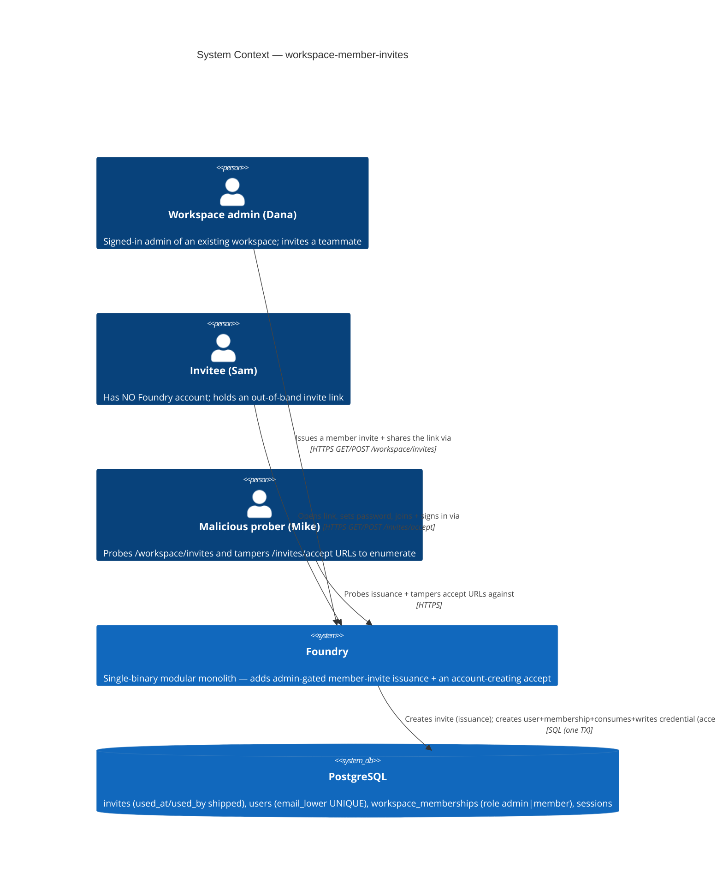
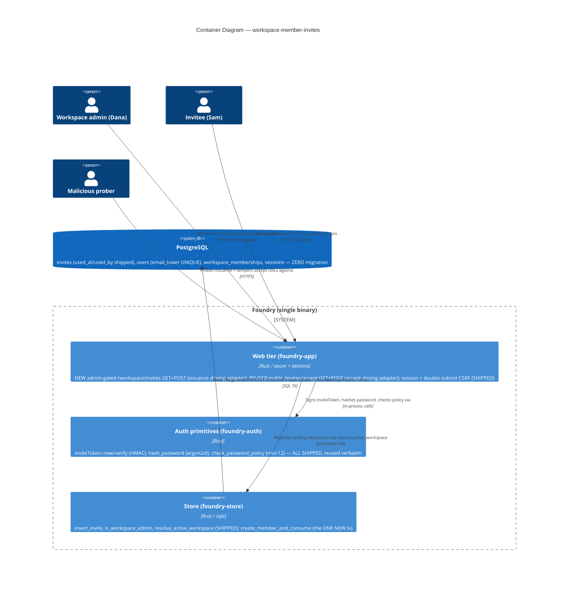
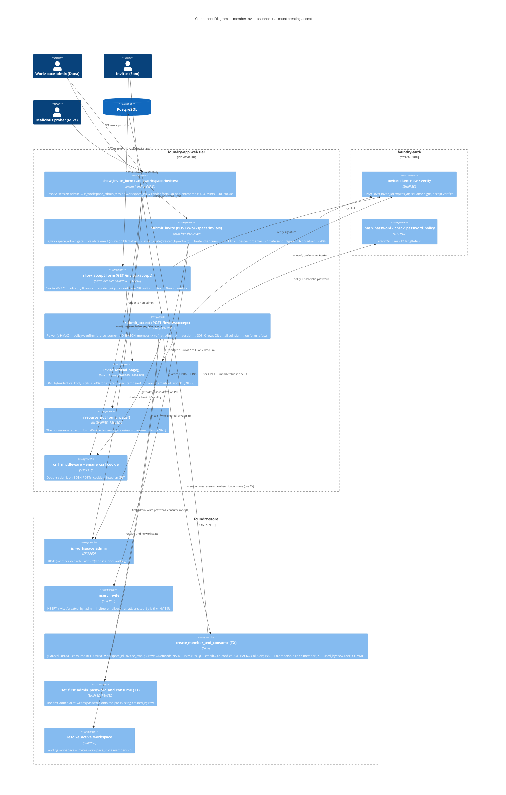

# Architecture — workspace-member-invites

> Morgan (nw-solution-architect), DESIGN wave, Propose mode, application/component scope. Modular
> monolith + ports-and-adapters (inherited, in force). This feature GENERALIZES the shipped first-admin
> `invite-accept-flow` to general workspace members. It adds (1) an admin-gated member-invite ISSUANCE
> surface (`/workspace/invites`) and (2) an account-CREATING accept path — one new store tx,
> `create_member_and_consume`, that on the same atomic single-use guard creates the user + adds a
> `member`-role membership + consumes the invite + writes the password. See `wave-decisions.md` for the
> DDD decisions (D1–D8), the reuse table, and the resolved open decisions. Requirements SSOT:
> `../discuss/`. Template generalized: `docs/feature/invite-accept-flow/design/`.

## System context and capabilities

A workspace **admin** (Dana) needs to bring a teammate (Sam) into HER workspace. Today there is no
admin-facing invite surface — only the instance super-admin can mint the first-admin invite via
`provision_workspace`. This feature adds the admin-gated `/workspace/invites` form that mints an
`invites` row (reusing `insert_invite`) and emits the SAME signed `/invites/accept?id&sig` link the
shipped flow already serves.

The invitee (Sam) has **no Foundry account**. The shipped accept path writes a password onto the
pre-existing `created_by` user; the member case has no such user. So accept gains ONE new store
transaction — `create_member_and_consume` — that, on the SAME atomic 0-or-1-row consume guard, CREATES
the user (email = `invites.invitee_email`), ADDS a `member`-role `workspace_memberships` row, consumes
the invite, and writes the argon2id password — then auto-signs-in onto `invites.workspace_id`.

Everything else is reused verbatim: the signed `InviteToken`, the `invites` schema (incl. `used_at`/
`used_by`), the accept GET handler, the uniform non-enumerable `invite_refusal_page()`, `is_workspace_admin`,
`check_password_policy` (min-12), `hash_password`, session + double-submit CSRF, and
`resolve_active_workspace`. The genuinely-new backend is small but real: one issuance handler, one
account-creating consume tx (with a unique-email-collision → uniform-refusal arm), and two thin templates.

## C4 Level 1 — System Context (MANDATORY)

## C4 Level 2 — Container (MANDATORY)

## C4 Level 3 — Component (the issuance + account-creating accept paths)

## Request flows

### GET /workspace/invites (issuance form — admin-gated, non-enumerable)

1. Resolve the signed-in user from the session (`SessionUser{user_id, workspace_id}`). Signed-out →
   `resource_not_found_page()` (NFR-1, indistinguishable from a non-admin).
2. `is_workspace_admin(session.workspace_id, session.user_id)` — false → `resource_not_found_page()`
   (the route does not admit to existing; mirrors `/admin/tokens`, `/admin/instance/*`).
3. True → mint the CSRF cookie (`ensure_csrf_cookie`) + render the one-email-field form naming the
   workspace. No mutation.

### POST /workspace/invites (issue — admin-gated, CSRF-screened)

1. **CSRF**: shipped `csrf_middleware` screens the double-submit token BEFORE the handler runs;
   missing/mismatched → refused, no invite created (NFR-6, AC-03.9).
2. Resolve session user; `is_workspace_admin(session.workspace_id, user_id)` again (defense-in-depth on
   the state-changing leg) — false/signed-out → `resource_not_found_page()` (NFR-1).
3. **Validate email** present + well-formed. Blank/malformed → re-render the form inline with an error;
   NO invite created (FR-3, AC-04.3).
4. `invite_id = uuid::now_v7()`; `expires_at = now + 7 days`; `insert_invite(invite_id,
   session.workspace_id, email, created_by = session.user_id, expires_at)` — `created_by` is the
   **inviting admin** (the natural member/first-admin discriminator — see D3).
5. `InviteToken::new(invite_id, expires_at, session_secret)`; build
   `{public_url}/invites/accept?id&sig` (single source `AppState.public_url`, trailing slash trimmed).
6. Best-effort `email.send(invitee_email, invite_url)`; a send failure is logged at `warn` and does NOT
   fail the request (FR-2, AC-01.4).
7. Render the "invite sent" fragment showing the link (so Dana can paste it out-of-band).

### GET /invites/accept (reused verbatim — non-committal)

Identical to the shipped flow: `InviteToken::verify` (HMAC, no DB) → `invite_accept_view` (advisory
liveness: `used_at IS NULL AND expires_at > now`) → render the set-password form naming the workspace,
or `invite_refusal_page()`. No mutation. The only copy nuance is "join as a member" (a display string;
the handler need not know the role to render — see D3).

### POST /invites/accept (validate, DISPATCH, create+join+consume, sign-in — TOCTOU-safe)

1. **CSRF** (shipped middleware) → missing → refused, no consume, no account (NFR-6, AC-03.9).
2. **Re-verify HMAC** (defense-in-depth; rejects a tampered URL with no DB write).
3. **`check_password_policy`** (min-12) + confirm-match — BEFORE any tx. Fail → re-render inline; NO tx
   opens, invite stays live, NO account created (FR-8, US-04, AC-04.1/04.2/04.5).
4. **`hash_password`** the validated password (argon2id, reused, `spawn_blocking`).
5. **DISPATCH on the invite-kind discriminator (D3)**: read the invite's `invitee_email` + `created_by`
   (a load-bearing EXTENSION to `invite_accept_view`, which today returns only `(expires_at, used_at,
   workspace_name)` — see ADR-003) and whether `invitee_email` already maps to a user.
   - **First-admin invite** (the consumer IS `created_by` — a pre-existing user): run the SHIPPED
     `set_first_admin_password_and_consume(id, hash, now)` — unchanged. (Preserves the shipped flow.)
   - **Member invite** (the invitee has no account; `created_by` is the inviting admin): run the NEW
     `create_member_and_consume(id, hash, now)`:
     - guarded-UPDATE: `UPDATE invites SET used_at = now(), used_by = NULL WHERE id = $1 AND used_at IS
       NULL AND expires_at > now() RETURNING workspace_id, invitee_email`. **0 rows** (lost race /
       used / expired) → ROLLBACK → `invite_refusal_page()` (A-E7, AC-03.5/03.6). The guard is the
       authoritative single-use + expiry point.
     - **1 row** → `INSERT INTO users (id = uuid::now_v7(), email_lower, email_display, display_name,
       password_hash)`. On the `users.email_lower` UNIQUE violation (the email already maps to a user —
       OD-1 / A-E9) → ROLLBACK → `invite_refusal_page()` (byte-identical, NOT a 500 — AC-03.8). The
       invite is NOT consumed (the tx rolls back wholesale).
     - `INSERT INTO workspace_memberships (workspace_id, user_id, role) VALUES (.., 'member')`.
     - `UPDATE invites SET used_by = new_user_id WHERE id = $1` (now that the user exists, satisfy the
       `used_by REFERENCES users(id)` FK).
     - COMMIT. Returns `Consumed { workspace_id, user_id = new_user_id }`. None of {consume, user,
       membership, password} happens without the others (BR-3, NFR-2, AC-02.3).
6. **`session.insert(SESSION_KEY_USER_ID, SessionUser { user_id, workspace_id })`** then
   `resolve_active_workspace(user_id)` to confirm the landing tenant; **303 → `/`** (auto sign-in).
   Landed `workspace_id == invites.workspace_id`, role `member` (FR-6, AC-02.4/02.5/02.6).

## Component architecture & boundaries

| Component | Layer | Responsibility | Owns | Status |
|---|---|---|---|---|
| `member_invites::show_invite_form` / `submit_invite` | driving adapter (web) | admin-gate, email validation, insert+sign+emit, "invite sent" fragment | WHAT the issuance HTTP surface does | NEW |
| `invites_accept::submit_accept` | driving adapter (web) | re-verify, policy, DISPATCH kind, session, 303 | accept orchestration | EXTENDED (add member arm) |
| `invites_accept::show_accept_form` | driving adapter (web) | non-committal GET form/refusal | accept GET | SHIPPED, reused |
| `Store::invite_accept_view` | driven adapter | advisory liveness read; EXTENDED to also surface `invitee_email` + `created_by` for the POST kind dispatch (D3) | accept read | SHIPPED, EXTENDED |
| `invite_refusal_page()` | driving adapter (web) | the single non-enumerable refusal body+status (D5) | refusal copy | SHIPPED, reused (no change) |
| `resource_not_found_page()` | driving adapter (web) | the non-enumerable issuance 404 (NFR-1) | issuance refusal | SHIPPED, reused |
| `foundry_auth::InviteToken::new/verify` | driven port | HMAC authenticity + bound expiry | token integrity | SHIPPED |
| `foundry_auth::hash_password` / `check_password_policy` | driven port | argon2id + min-12 | hashing + strength | SHIPPED |
| `Store::is_workspace_admin` | driven adapter | the issuance authz predicate | admin authz | SHIPPED |
| `Store::insert_invite` | driven adapter | the issuance invite row (created_by = inviter) | invite issuance | SHIPPED |
| `Store::create_member_and_consume` | driven adapter | atomic create-user + member-membership + consume + password, ONE TX, collision→Collision | single-use + atomic account creation + collision mapping | NEW |
| `Store::set_first_admin_password_and_consume` | driven adapter | the first-admin arm (unchanged) | first-admin consume | SHIPPED |
| `Store::resolve_active_workspace` | driven adapter | landing workspace resolution | tenant landing | SHIPPED |
| session + `csrf_middleware` | shipped layers | auto sign-in + double-submit CSRF | session/CSRF | SHIPPED |

The software-crafter owns all internal structure (function decomposition, exact SQL binding, template
markup, the `ConsumeOutcome`/`MemberConsumeOutcome` enum shape) during GREEN/REFACTOR. The contracts
above are the boundary.

## Quality attribute strategies (ISO 25010)

- **Security (first-class)** — STRIDE on TWO trust boundaries (the admin-gated issuance POST and the
  public account-creating accept POST):
  - *Spoofing / elevation (issuance)*: `is_workspace_admin` on BOTH the GET and the POST; a non-admin or
    signed-out caller gets the byte-identical non-enumerable 404 (`resource_not_found_page`) — no
    401/403/redirect oracle (NFR-1, AC-03.1). A member can never reach issuance (AC-02.6).
  - *Tampering (accept)*: `InviteToken` HMAC binds `id‖expires_at`; a tampered/extended link fails verify
    before any DB hit (reused).
  - *Elevation / replay (accept)*: the single-use guarded-UPDATE — a consumed/expired link cannot be
    replayed; expiry is HMAC-bound AND re-checked inside the tx (NFR-2, D6 reused).
  - *Information disclosure (enumeration)*: the uniform byte-identical `invite_refusal_page()` across
    {expired, used, tampered, unknown, **email-collision**} (D5, NFR-3, AC-03.2/03.8). The email
    collision is caught INSIDE the tx and mapped to the SAME refusal — never a DB-constraint 500 (the
    `risk` row the DISCUSS flagged HIGH). `tracing` keys on `invite_id` only; no `sig`/password in logs
    (NFR-5, AC-03.10).
  - *CSRF*: shipped double-submit on BOTH state-changing POSTs (NFR-6, AC-03.9).
  - *Privilege scope*: the new membership MUST be `role='member'` (CHECK-constrained to admin|member);
    a wrong role is a privilege breach (validated by AC-02.6 — the new member 404s on issuance).
- **Reliability / fault tolerance**: create-user + membership + consume + password is ONE TX; a crash
  mid-flow leaves the invite live, no orphan user, no orphan membership (fail-safe, retryable). 0-rows
  and email-collision are first-class refusal paths (rollback wholesale).
- **Usability**: inline recoverable errors (weak/mismatch password, blank email) keep the invite/form
  live (US-04); the invitee happy path is single-submit with no second login (auto sign-in).
- **Performance**: NO performance NFR exists for v1 (the DISCUSS NFR list is security-only). Issuance is
  one INSERT; accept is a single-TX path exercised once per invitee. `hash_password` (argon2id,
  80–300ms) already runs on `spawn_blocking` (reused) so it does not stall the tokio runtime. The one
  new cost — the email-collision pre-check vs the UNIQUE-constraint catch — is resolved in favor of the
  constraint catch (no extra round-trip, no TOCTOU; see D4). Recorded to close the ISO 25010 scope.
- **Usability / accessibility (NFR-7, non-gating)**: the two new forms (issuance + the reused
  set-password page) inherit the shipped `InviteAcceptPage` template + admin web tier, which set the
  WCAG 2.1 AA baseline (label association, focus order, error-message association). v1 makes no NEW
  accessibility regression; conformance verification is deferred to DISTILL/DELIVER acceptance review,
  not gated at DESIGN (per DISCUSS NFR-7). Recorded so it is not silently dropped.
- **Maintainability / testability**: ports-and-adapters keeps the consume+create logic in `foundry-store`
  (integration-testable against real PG16 testcontainers), the authz predicate (`is_workspace_admin`)
  pure-ish and reused, and the handlers thin. The non-enumerability (issuance 404 + accept refusal),
  single-use-under-concurrency, and email-collision→refusal properties are acceptance-probed
  (revert-reds-it litmus + concurrency @property + collision @scenario).

## Integration patterns & API contracts

- **Surface**: server-rendered HTML (htmx idiom), NOT JSON/REST — consistent with the shipped web tier.
  - `GET /workspace/invites` (admin-gated) → 200 issuance form | non-enumerable 404.
  - `POST /workspace/invites` (form: `email`, `_csrf`) → 200 "invite sent" fragment | 200 inline error
    (blank/bad email) | non-enumerable 404 (non-admin) | CSRF-refused.
  - `GET /invites/accept?id&sig` (public) → 200 set-password form | uniform refusal (reused).
  - `POST /invites/accept` (form: `id`, `sig`, `password`, `confirm`, `_csrf`) → 303 `/` | 200 inline
    error (recoverable) | uniform refusal (terminal: dead link / lost race / email-collision) |
    CSRF-refused.
- **No external integrations**: the entire flow is in-process over PostgreSQL + the shipped best-effort
  email seam (already present, reused; a send failure is non-fatal). No third-party API, webhook, or
  OAuth provider — **no contract-testing annotation is owed to platform-architect**.
- **Shared-artifact integrity** (from `shared-artifacts-registry.md`): the `sig` emitted by issuance ==
  the `sig` rendered on the accept GET == the `sig` the POST re-verifies; the consumed `invite_id` is the
  row `insert_invite` created; the new `users.email_lower` == `invites.invitee_email` (lower-cased,
  exactly one); the new `membership` is `role='member'` for `invites.workspace_id`; landed `workspace_id
  == invites.workspace_id`.

## Architecture Enforcement

Style: Modular Monolith + Hexagonal (ports-and-adapters). Language: Rust.
Tool: `cargo xtask check-arch` (in-tree, inherited).

Rules to enforce:
- The store (`foundry-store`) has zero inward dependency on the web adapter (handlers call the store,
  never the reverse).
- The create-user + membership-insert + consume + password write live in `foundry-store` behind ONE TX
  fn (`create_member_and_consume`) — the handler must NOT issue the guarded-UPDATE or the INSERTs itself
  (keeps the atomicity boundary in the driven adapter).
- **LAYER-1e**: the issuance handler resolves the acting workspace from the SESSION
  (`SessionUser.workspace_id`, the trusted resolution seam) and passes it to `is_workspace_admin` — it
  parses NO workspace id from request input, and `is_workspace_admin` is NOT a `*_in_workspace(` call, so
  the detector neither inspects nor flags it. **NO new allow-list line is needed** for either new file
  (`member_invites.rs`); the accept extension stays in `invites_accept.rs` (already verified clean, D7 of
  the shipped flow). Confirm at DELIVER against the real `check_arch` run; the one-line fallback (add
  `member_invites` to `is_tenant_scoping_allowlisted`) is the cheap, reversible escape hatch if a future
  refactor introduces a parsed-id scoped call.

## Deployment architecture

Unchanged: ONE binary, ONE PostgreSQL, NO Redis/Node/CDN. **ZERO new crates. ZERO migration** — the
`invites.used_at`/`used_by` columns shipped in `0001_init.sql`; `users.email_lower` is already `UNIQUE`
(the OD-1 collision guard); `workspace_memberships.role` already `CHECK (role IN ('admin','member'))`
(no role migration). The two new issuance routes register on the SHARED web layer (UNDER session + CSRF,
alongside `/admin/tokens` and `/workspace/switch`), gated INSIDE the handler by `is_workspace_admin`. The
accept routes already register (public). No infra change for platform-architect.

## ADRs

- `adr-001-issuance-surface-and-authz.md` — the admin-gated `/workspace/invites` GET+POST; `is_workspace_admin`
  on both legs; non-enumerable 404; reuses `insert_invite` as-is (created_by = inviter); LAYER-1e no-line.
- `adr-002-member-accept-tx-and-collision.md` — the NEW `create_member_and_consume` one-TX create-user +
  member-membership + consume + password; the `users.email_lower` UNIQUE-violation → uniform refusal
  mapping (NOT a 500); no migration.
- `adr-003-accept-route-kind-discriminator.md` — how ONE `/invites/accept` route serves first-admin AND
  member invites: dispatch on the data-derived discriminator (consumer-is-created_by vs new-user), no
  schema column added.
- `adr-004-no-migration-collision-strategy.md` — no migration; the UNIQUE-constraint-catch (vs a
  pre-check SELECT) for the email collision; reuse `used_at`/`used_by`, the `member` role CHECK.
