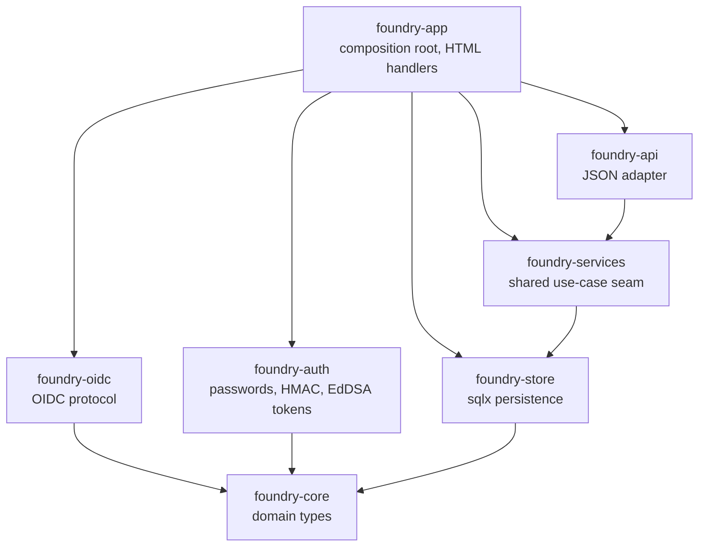

# Architecture Brief

Product-level SSOT for foundry's architecture. Bootstrapped by the `keycloak-sso`
DESIGN wave (2026-08-21). This repo predates the SSOT model — 43 features carry their
architecture in `docs/feature/<id>/design/` or their own `feature-delta.md`, and no
migration guide exists here. This file therefore starts with the section this wave
owns and grows as later waves land; earlier features are deliberately NOT
retro-summarised, because an invented summary of shipped architecture is worse than
a missing one. Their design documents remain authoritative for their own subjects.

## Application Architecture

foundry is a modular-monolith Rust workspace in a ports-and-adapters shape. Effects
are trait-injected (`Arc<dyn Clock>`, `Notifier`, `Store`), the composition root is
`crates/foundry-app/src/main.rs`, and the driving surface is one axum router assembled
by `build_router`. Dependency direction is enforced twice: an AST source-walk
(`cargo xtask check-arch`) and a cargo-graph ban list (`deny.toml`), both run inside
`cargo xtask ci`.

### Authentication surfaces

foundry authenticates three distinct credential classes, deliberately kept apart:

| Class | Credential | Verified by | Algorithm pin |
|---|---|---|---|
| Human, local | Password (argon2) + `tower-sessions` cookie | `foundry-auth` | n/a |
| Human, federated | Keycloak ID token → linked to an existing `users` row | `foundry-oidc` | RS256 only |
| Machine | Self-issued Ed25519 JWT | `foundry-auth` | EdDSA only |

The separation is enforced at build time, not by convention. `check_jwt_alg_pin`
scans `crates/foundry-auth/src` and fails the build unless every `jsonwebtoken`
`Validation` there pins `algorithms` to EdDSA alone; `check_oidc_alg_pin` does the
symmetric job for `crates/foundry-oidc/src` with RS256. Housing both classes in one
crate would make the two pins inexpressible in one file-scoped rule, so the crate
boundary IS the security boundary. See `adr-oidc-001-crate-placement.md`.

All three converge on one seam: `signin::establish_session` resolves the active
workspace (failing closed when the user belongs to none) and writes
`SessionUser { user_id, workspace_id }`. Everything downstream — the board, `/api/v1`,
SSE, authorship — reads that struct and is indifferent to which credential produced
it. New authentication paths extend this seam; they never mint sessions themselves.

### Federated identity is additive, never a migration

Keycloak sign-in links to a foundry user that already exists, matched on the UNIQUE
`users.email_lower` and gated on the token's `email_verified` claim. It provisions
nothing. The local password path stays permanently available, because Keycloak, LLDAP
and foundry share a cluster and the tracker must open when that cluster is broken.

The same reasoning shapes startup: configuration SHAPE is validated at boot (a partial
config is `health.startup.refused`), but discovery and JWKS are fetched lazily, so an
unreachable Keycloak refuses a sign-in attempt rather than a boot. foundry's readiness
never depends on the identity provider it exists to outlive.
See `adr-oidc-003-lazy-discovery.md`.

### Crate graph

`foundry-oidc` reaches neither `foundry-store` nor `foundry-auth`: it takes protocol
input and returns validated claims. Binding a claim to a user happens in
`foundry-app`, where the tenancy rules already live. `deny.toml` bans `foundry-oidc`
outside `foundry-app` and `foundry-acceptance`, mirroring the existing `foundry-api`
rule.
