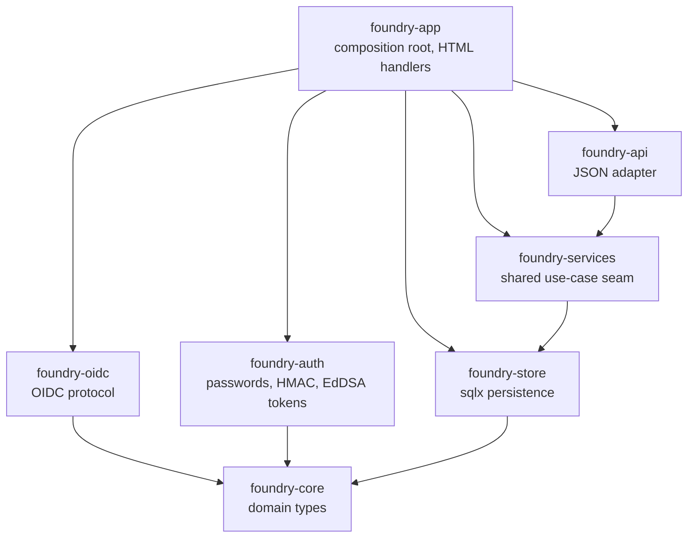
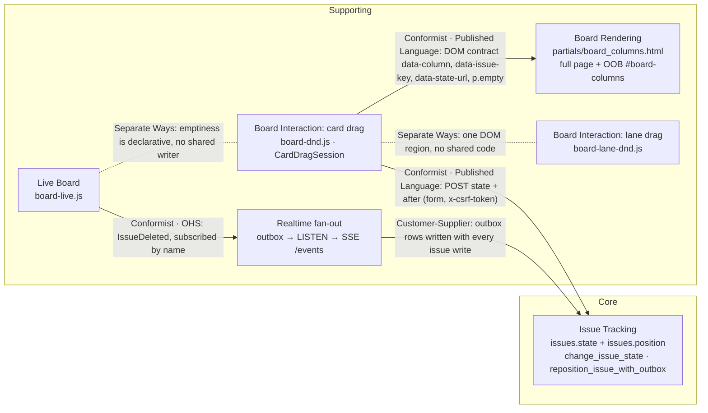
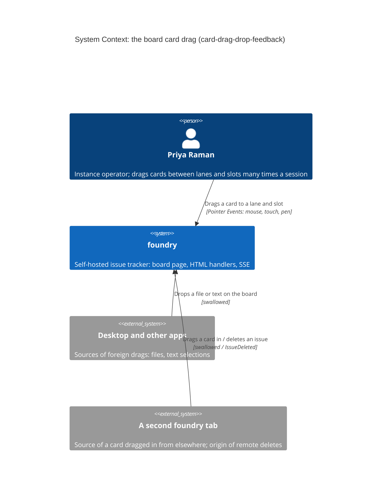
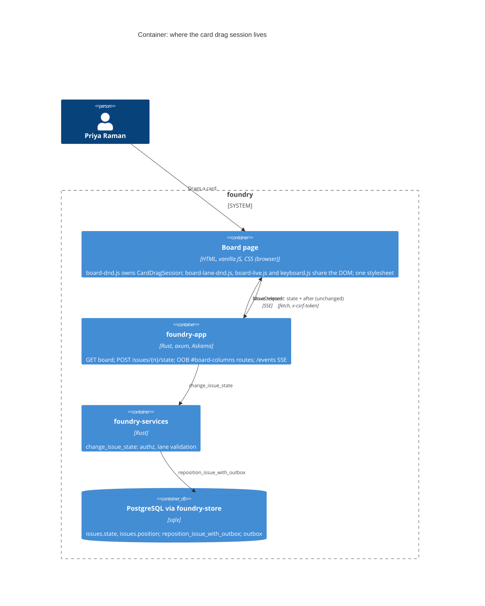
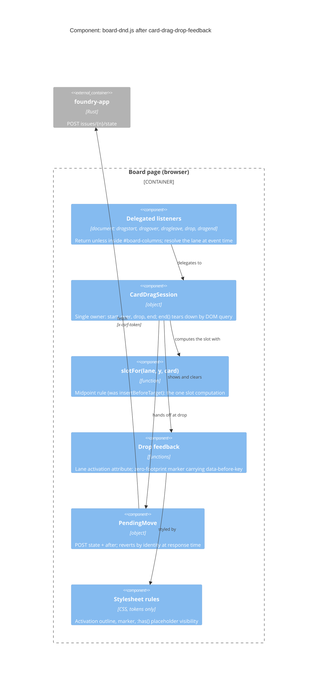

# Architecture Brief

Product-level SSOT for foundry's architecture. Bootstrapped by the `keycloak-sso`
DESIGN wave (2026-08-21). This repo predates the SSOT model — 43 features carry their
architecture in `docs/feature/<id>/design/` or their own `feature-delta.md`, and no
migration guide exists here. This file therefore starts with the section this wave
owns and grows as later waves land; earlier features are deliberately NOT
retro-summarised, because an invented summary of shipped architecture is worse than
a missing one. Their design documents remain authoritative for their own subjects.

## Application Architecture

foundry is a modular-monolith Rust workspace in a ports-and-adapters shape. Effects
are trait-injected (`Arc<dyn Clock>`, `Notifier`, `Store`), the composition root is
`crates/foundry-app/src/main.rs`, and the driving surface is one axum router assembled
by `build_router`. Dependency direction is enforced twice: an AST source-walk
(`cargo xtask check-arch`) and a cargo-graph ban list (`deny.toml`), both run inside
`cargo xtask ci`.

### Authentication surfaces

foundry authenticates three distinct credential classes, deliberately kept apart:

| Class | Credential | Verified by | Algorithm pin |
|---|---|---|---|
| Human, local | Password (argon2) + `tower-sessions` cookie | `foundry-auth` | n/a |
| Human, federated | Keycloak ID token → linked to an existing `users` row | `foundry-oidc` | RS256 only |
| Machine | Self-issued Ed25519 JWT | `foundry-auth` | EdDSA only |

The separation is enforced at build time, not by convention. `check_jwt_alg_pin`
scans `crates/foundry-auth/src` and fails the build unless every `jsonwebtoken`
`Validation` there pins `algorithms` to EdDSA alone; `check_oidc_alg_pin` does the
symmetric job for `crates/foundry-oidc/src` with RS256. Housing both classes in one
crate would make the two pins inexpressible in one file-scoped rule, so the crate
boundary IS the security boundary. See `adr-oidc-001-crate-placement.md`.

All three converge on one seam: `signin::establish_session` resolves the active
workspace (failing closed when the user belongs to none) and writes
`SessionUser { user_id, workspace_id }`. Everything downstream — the board, `/api/v1`,
SSE, authorship — reads that struct and is indifferent to which credential produced
it. New authentication paths extend this seam; they never mint sessions themselves.

### Federated identity is additive, never a migration

Keycloak sign-in links to a foundry user that already exists, matched on the UNIQUE
`users.email_lower` and gated on the token's `email_verified` claim. It provisions
nothing. The local password path stays permanently available, because Keycloak, LLDAP
and foundry share a cluster and the tracker must open when that cluster is broken.

The same reasoning shapes startup: configuration SHAPE is validated at boot (a partial
config is `health.startup.refused`), but discovery and JWKS are fetched lazily, so an
unreachable Keycloak refuses a sign-in attempt rather than a boot. foundry's readiness
never depends on the identity provider it exists to outlive.
See `adr-oidc-003-lazy-discovery.md`.

### Names are labels; slugs are identity

A project's `name` is a mutable display label; its `slug` (and `key_prefix`,
and every issue key minted from it) is immutable URL identity, minted exactly
once at creation by `foundry_core::slugify` and never derived again. Render
paths take slugs from the validated request path or stored columns — never from
`slugify(name)` at render time (the latent defect the instance-admin-project-rename
wave removed from `build_board_page`). Enforced in `cargo xtask check-arch`:
defining `fn slugify(` under `crates/foundry-app/src` fails the build.
See `adr-project-rename-001-request-slugs-not-derived.md` and
`adr-project-rename-002-rename-write-placement.md`.

### Dialog layers close by one mechanism, many declarative triggers

Dialogs are `div.modal` fragments htmx-swaps into `#modal-root`; "closed" is a
DOM-derived state — the host is empty — never a stored flag. The one close
mechanism is `keyboard.js::closeModal()`, and `Escape` has exactly one owner,
`closeTopLayer()` (BR-4): a second `Escape` listener anywhere would race it and
peel two layers per press. New close affordances therefore never register
listeners — they are attributes. Any element inside `#modal-root` carrying
`data-action="close-modal"` is a close trigger, resolved by one
document-delegated click listener in `keyboard.js` (delegation is the house
idiom because it survives htmx swaps). Adding a close control to a future
dialog is a template-only change, and BR-4 is unviolable by construction of the
pattern. The same discipline extends beyond dialogs: the board's per-column
overflow menu is an *arm* of `closeTopLayer()`, not a component with listeners of
its own, and its open state is derived from the DOM rather than stored — a stored
handle would be left detached by the out-of-band `#board-columns` refresh and
turn `Escape` into a silent no-op. `keyboard.js` holds exactly one document
`keydown` and one document `click` listener; more than that is a violation.
From card-pointer-drag, `cargo xtask check-arch` enforces the board half of this:
no `static/js/board-*.js` may contain a `keydown` listener. The rule carries an
injected-violation gold test (ADR-BOARD-CARD-004).
See `adr-modal-close-001-declarative-close-trigger.md` and
`adr-board-lane-005-overflow-menu-as-layer-arm.md`.

### Lanes are per-project data; the lane FK is the no-stranded-card invariant

Board lanes are rows (`lanes`: per-project `slug`, `label`, `position`), not
constants; `issues.state` holds the lane slug and a composite FK
`(project_id, state) → lanes(project_id, slug)` makes "every issue has a lane
its board renders" a schema fact, not a test assertion. Consequences every
future feature inherits: any path that writes `issues.state` must name one of
the project's lanes (validated through the single
`foundry_services::issues::validate_project_lane` seam — the DD10 property);
any operation that removes a lane must settle the fate of its cards in the
same transaction, because the FK blocks the lane delete while cards reference
it; a feature moving issues across projects must move lane membership in the
same statement. Lane slugs are immutable identity, labels mutable display —
the names-are-labels invariant extends to lanes. No adapter may hold a static
lane list (`cargo xtask check-arch` rule; exemptions: the store creation seed
and the `humanize_state` historical-label fallback).
Lanes are also *shaped in place*: a lane's label is renameable, a lane may be
inserted at any position, and a lane may be **moved** to any other position.
Three further consequences follow.

**The `DEFERRABLE` keyword on `UNIQUE (project_id, position)` is a precondition
for lane arrangement, not a convenience.** It makes the constraint checked at
end-of-*statement*, which is the only reason a mid-board insert can shift later
positions with a plain `UPDATE` and no migration. For a *move* the dependence is
stronger still: all three shapes a reasonable engineer would write — a single
`CASE` permutation, a sentinel park, or `SET CONSTRAINTS … DEFERRED` — fail
against a non-deferrable constraint, the last with `constraint "…" is not
deferrable` (all measured). **Any migration that drops that keyword silently
breaks lane insert and lane move, by four routes, while every existing test
stays green.** Until the `check-arch` rule pinning it exists, ADR-BOARD-LANE-003
and -006 are the only guards.

**Insert's shuffle does not generalise to a move.** Insert shifts safely because
it *vacates* the target slot; a move has no vacancy, so the intervening shift
collides with the mover still occupying its old slot. A move is therefore one
`UPDATE … SET position = CASE …` statement applying the whole permutation, inside
a `FOR UPDATE` transaction that resolves both the mover and its destination
neighbour by identity. Without that lock the race is **silent** — no error, every
invariant intact, and a board arranged as nobody asked (measured); this is a
worse failure than insert's loud duplicate-key, and is why the move's concurrency
oracle must assert the resulting *order*, never merely the absence of an error.

And lane slugs are minted by `foundry_core::lane_slug`, never by `slugify` — the
latter emits hyphens, which `lanes_slug_check` (`^[a-z][a-z0-9_]*$`) rejects.
Lane *arrangement* writes zero issue rows and zero change events in every form:
rename, insert and move are all lane-set operations only.
See `adr-board-lane-001-issues-linkage-state-fk.md`,
`adr-board-lane-002-two-fate-delete-transaction.md`,
`adr-board-lane-003-deferrable-position-shuffle.md`,
`adr-board-lane-004-lane-slug-mint.md` and
`adr-board-lane-006-lane-move-permutation.md`.

Both board drags run on **Pointer Events, in two hand-authored modules that share
conventions and no code**: lanes in `board-lane-dnd.js`, and cards in `board-dnd.js`
(card-pointer-drag; before it, cards used native HTML5 drag-and-drop). HTML5
drag-and-drop survives on the board for one job only, swallowing foreign drags.
Both modules listen for `pointerdown` on `document`, so the boundary no longer
rests on different event families. It rests on two legs:

- **Origin.** A gesture beginning on `.issue-card` is a card move, and one beginning on `[data-lane-drag]` is a lane move. Neither element contains the other.
- **The lift rules.** A press that never lifts is a click or a tap.

`board-lane-reorder.feature`'s card-vs-lane guard and card-pointer-drag's
card-side scenario are the standing proof. A drag library (SortableJS) was
evaluated and rejected. It would sort the DOM live, against the zero-footprint
marker, and it binds per list, against replace-proofing, not merely against the
dependency posture. See `adr-board-lane-007-pointer-events-lane-drag.md`
(superseded in part) and `adr-board-card-004-pointer-events-card-drag.md`.

### An issue has one delete, through one primitive that always announces itself

Deleting an issue is a **hard** delete — there is no tombstone, no archive and
no trash anywhere in foundry, and a card that is gone is gone from every
surface at once. `comments`, `issue_attachments` and `issue_change_events` all
reference `issues(id) ON DELETE CASCADE` (0004/0005/0013), so the cascade is a
schema fact and no adapter re-implements it; an application-level child-delete
fan-out would be a second cascade able to drift from the first.

The load-bearing property is that **exactly one primitive performs it**.
`foundry_store::issue_delete::delete_issues_with_outbox` takes a caller's
transaction, deletes by id set, and writes one `IssueDeleted` outbox row per row
*actually* deleted. Both callers route through it: the single-card delete (which
owns its own transaction) and the lane delete's `DeleteCards` fate (which rides
the fate transaction of ADR-BOARD-LANE-002, otherwise unchanged). One function
cannot drift from itself, which is what makes "one meaning of deleted" a
structural fact rather than a convention. Consequences every future feature
inherits: a new removal surface adds a *caller*, never a second `DELETE FROM
issues`; the emit binds to `rows_affected`, so a card that vanished mid-flight
is silently absent from the announcement rather than falsely announced; and the
announcement is atomic with the write, so a committed delete can never fail to
announce itself and a rolled-back one announces nothing. The `IssueDeleted`
payload uses only fields `EventPayload` already declares, so `schema_version`
stays 1.

Why hard and not soft: issues already hard-deleted through the shipped lane
fate, so a tombstone would have created a second delete meaning for one entity;
and `board-lane-overflow-menu` D1 declined archive precisely because it "would
create a second way for a card to be invisible". The comment tombstone
(`comment-edit-delete` ADR-007) is deliberately **not** the precedent here — it
exists to preserve a comment's position in a thread, and an issue holds no such
position. That divergence is a decision, not an inconsistency.

Destructive web actions reach the write as a **`GET` dialog + `POST` confirm**
pair under the layer-wide `csrf_middleware` — never an HTTP `DELETE` verb, which
no HTML form can emit and which therefore cannot serve the scripting-disabled
profile. A confirm dialog is mandatory and **counts** its consequences rather
than merely warning, because with no undo the dialog is the entire safety net.
Its body is authored once as a `#modal-root` fragment and carried two ways — the
fragment for htmx, and a `` page that ``s
the same partial for a direct navigation (the shape `new_issue_modal_page.html`
established). One handler per verb branches on `is_htmx` for *rendering only*,
so two surfaces share one use case and cannot drift.
See `adr-issue-delete-001-one-hard-delete-primitive.md` and
`adr-issue-delete-002-get-post-confirm-not-delete-verb.md`.

### The board updates itself for one event, and only one

`static/js/board-live.js` is foundry's first browser-side live-update surface. It
opens an `EventSource` on the board's `/events` endpoint and removes a card's
`article.issue-card[data-issue-key]` node when an `IssueDeleted` frame names it.
Everything else about the realtime topology is unchanged and was already shipped:
the outbox row, the `notify_outbox_event` trigger (0003), `spawn_pg_listener`, the
broadcast channel and the SSE handler. What did not exist until now was any browser
that consumed them — every prior realtime scenario asserted against a *server-side*
subscriber, so "the board live-updates" had never been true.

Three properties keep it safe to load from `base.html`, which every page extends.
It subscribes by event **name** (`addEventListener("IssueDeleted", …)`), so the four
other event types are never delivered to it and it cannot half-handle them. It
holds **no node reference** — every frame re-queries the DOM — so the out-of-band
`#board-columns` refresh cannot leave it pointing at a detached subtree, the same
failure ADR-BOARD-LANE-005 records for the lane menu. And it **exits before
constructing an `EventSource`** when the board markup is absent, so a page that is
not a board opens no connection and registers no listener.

It is deliberately narrow. Cards appearing, moving or retitling in place is a
general live-board, and that is a separate feature.

### Colour enters the stylesheet at one seam; assets are hash-honest by construction

foundry's presentation tier is one hand-authored stylesheet with no build step, and
until the canzan-theme-system wave nothing watched it. 46 colour literals had
accumulated across 30 rules outside the token block, three unrelated accent hues
coexisted, and `.site-header` survived 43 features as dead CSS with no markup behind
it. The response is structural, not editorial: **colour values appear in exactly
three regions of `foundry.<hash>.css` — `:root`, and the two dark blocks — and
nowhere else.** Every other rule names a `--cz-*` token, so a palette is a
re-binding of names rather than a second stylesheet to keep in sync. The two dark
blocks (`@media (prefers-color-scheme: dark) { :root:not([data-theme="light"]) }`
and `:root[data-theme="dark"]`) are duplicated because CSS cannot express "either"
across a media query and an attribute selector; they may differ in values and never
in the *set of names* they declare, since divergence breaks dark-by-device only —
invisible to whoever introduced it. Theme state is device-local (`localStorage`,
`data-theme` stamped on `<html>` before first paint); nothing is persisted
server-side and no schema carries a preference.

The same wave closed a promise outstanding since the htmx-web-tier design:
`assets.md` Decision #4a chose content-hashed filenames as the cache key and
accepted its one failure mode — a forgotten rename — on the strength of an
"asset-resolution probe" that was never built, and was re-requested by two later
features. `cargo xtask check-arch` therefore gains five rules, all deriving their
input set by scanning rather than from any maintained list, so the guard cannot
itself go stale: **R1** every `/static/…` reference in `crates/foundry-app` resolves
on disk; **R2** every `<stem>.<8hex>.<ext>` filename equals its own sha256 prefix
(the check that makes `Cache-Control: immutable` honest — it catches a file edited
without being renamed, which R1 cannot see); **R3** every `VENDOR.md` row's recorded
sha256 recomputes; **S1** no colour literal outside the three token regions; **S2**
those three regions declare identical name sets. Each carries an injected-violation
gold test, so the guards are shown to bite rather than assumed to.

Consequences every future feature inherits: a new served asset is enrolled in the
guard the moment something references it, and needs no registration; a re-hash that
updates four of its five sites reds the fast pre-commit loop rather than shipping a
stale immutable URL; a new colour must be a token or it does not build. And
`VENDOR.md` now carries **three** row shapes, not one — vendored-verbatim,
authored-in-tree, and **derived**, for assets that come from a named upstream but
are not byte-identical to it (the axis-instanced, subset webfonts). A derived row
records a reproducible *recipe* as its provenance and separates two claims of
different strength: integrity (the committed blob matches its recorded hash —
unconditional, machine-checked by R3) and provenance (re-derivation from the pinned
input with the pinned toolchain — expected, explicitly **not** guaranteed
byte-for-byte, with a compressor-independent intermediate hash as the stable audit
anchor). The recipe itself lives at `tools/fonts/derive-fonts.sh` and is run
**offline, by hand, never as a build step** (DB6 stands): it is hermetic
(`SOURCE_DATE_EPOCH` + `--no-recalc-timestamp` + `--no-optimize`) and reproduces
byte-for-byte across host and container for all three families. Removing either
determinism flag silently breaks the audit while every test stays green.
See `adr-canzan-theme-001-font-axis-instancing-and-subsetting.md`,
`adr-canzan-theme-002-derived-asset-provenance-model.md`,
`adr-canzan-theme-003-asset-integrity-guard-in-check-arch.md` and
`adr-canzan-theme-004-token-seam-and-dark-block-parity.md`.

### Crate graph



`foundry-oidc` reaches neither `foundry-store` nor `foundry-auth`: it takes protocol
input and returns validated claims. Binding a claim to a user happens in
`foundry-app`, where the tenancy rules already live. `deny.toml` bans `foundry-oidc`
outside `foundry-app` and `foundry-acceptance`, mirroring the existing `foundry-api`
rule.

## Domain Model

Owned by @nw-ddd-architect. Bootstrapped by the `card-drag-drop-feedback` DESIGN wave
(2026-09-13). Like the section above, it records what a wave actually modelled and
does not retro-model shipped server contexts. The user accepted the decisions recorded
here on 2026-09-13.

### The board card drag session (browser tier)

**Subdomain: Supporting.** Every tracker lets you drag a card to a lane and a slot,
so this is not a differentiator. It is built in-house because a drag library's model
(live DOM sorting, per-list binding) contradicts this context's marker and
replace-proof contracts. SortableJS was evaluated and rejected on that ground
(ADR-BOARD-CARD-004). The
**core** subdomain, issue tracking, is upstream. It owns an issue's lane
(`issues.state`, under the lane FK) and its order (`issues.position`, gap-free
`0..N-1`, kept by `reposition_issue_with_outbox`).

**Bounded context: Board Interaction.** This is the board page's browser tier. It owns
the transient drag session, lane activation, the insertion marker and placeholder
visibility, and **no persistent data**. It holds two drag modules on one input
model, Pointer Events for mouse, touch and pen: the card drag (`board-dnd.js`) and
the lane drag (`board-lane-dnd.js`). They share a DOM region and conventions
(threshold, edge scroll, `pointerId` filter, the `closeTopLayer()` arm pattern),
and no code (ADR-BOARD-CARD-004). HTML5 drag-and-drop remains only as the foreign
swallow. The vocabulary keeps them apart too. The lane drag shows a
**drop indicator** between columns; the card drag shows a **marker** between cards.



Arrows point downstream → upstream. The DOM contract is a **Published Language**. The
server's partial is its only author, rendered byte-identically by the full page and
the OOB refresh, and every board script conforms to it rather than translating it.

**The session, against Vernon's rules.** `CardDragSession` is a transient process
object. It is not a persisted aggregate: one root with value properties (card key,
origin lane slug, origin neighbour keys, the lifting `pointerId`, lifted or not) plus
the dragged card node for the life of one drag.

- *Rule 1, true invariants only:* its sole invariant is "at most one drag, and every ending leaves nothing behind", so nothing else sits inside it.
- *Rule 2, small:* one root, value properties, no child entities.
- *Rule 3, reference by identity:* lanes by slug and cards by key, re-resolved from the live document at event time. The dragged card is the one held reference, and only for one drag.
- *Rule 4, eventual consistency outside the boundary:* the server's order is reached by an optimistic move reconciled against the POST outcome. The pending move reverts by identity, so it survives a replace or a remote delete (ADR-BOARD-CARD-001).

The server-side invariant (gap-free positions) stays the issue aggregate's, untouched.

*Restated in pointer terms by card-pointer-drag (DESIGN 2026-09-25,
ADR-BOARD-CARD-004). The card-drag-drop-feedback HTML5 version is in git history
and that feature's delta.*

```mermaid
stateDiagram-v2
  [*] --> Idle
  Idle --> Idle: foreign dragover / drop inside #board-columns (claimed, dropEffect none, nothing else)
  Idle --> Pending: pointerdown on .issue-card inside #board-columns (primary button for mouse)
  Pending --> Idle: touch/pen moves past tolerance before the hold (the browser scrolls)
  Pending --> Idle: release before lifting (click or tap opens the card), or pointercancel (hold abandoned)
  Pending --> Carrying: lift (mouse past 6 px; touch/pen held 350 ms within 10 px)
  Carrying --> Aiming: pointermove over a lane, resolved from the point (activate lane, place marker)
  Aiming --> Aiming: pointermove (lane or slot changed, so update; edge auto-scroll)
  Aiming --> Carrying: pointermove off every lane (clear feedback)
  Aiming --> Idle: pointerup on the lane (land at the marker's slot, hand off a PendingMove, clear, arm click guard)
  Carrying --> Idle: pointerup off every lane, Escape arm, pointercancel, or card detached (revert, clear, arm click guard)
  Aiming --> Idle: Escape arm, pointercancel, or card detached (revert, clear, arm click guard)
  note right of Idle
    A PendingMove outlives the session: 2xx keeps the move;
    non-2xx or a network error reverts by identity.
  end note
```

**Invariants** (each is a named oracle in the feature's acceptance suite):

1. Only a **lift** (a primary-button mouse press past the movement threshold, or a touch/pen hold within tolerance) that began on an `.issue-card` inside `#board-columns` opens a session. A native `dragstart` on an own card is prevented and never opens one. Nothing else ever activates a lane, shows a marker, moves a card or sends a request.
2. At most one session exists, driven only by the pointer that lifted it (`pointerId`). A new `pointerdown` ends any stale session first.
3. Every ending (drop, Escape arm, `pointercancel`, release off every lane, card detached by a replace, refused or failed POST) leaves **zero** activated lanes, **zero** markers and **zero** carried ghosts. No drag ever opens the card's dialog: the next `click` is consumed once, and the guard is reset on the next `pointerdown`. Teardown is an idempotent DOM query, never a stored handle.
4. No listener is bound to a node inside `#board-columns`. Lanes, the active lane and the marker are resolved **from the point** (`elementFromPoint`) in the live document at event time, never from `event.target`, which touch captures to the origin card (ADR-BOARD-CARD-001, -004).
5. The marker, the landing slot and the POST's `after` derive from one slot computation, and the drop lands at the live marker's slot (ADR-BOARD-CARD-002).
6. A lane displays its placeholder if and only if it holds no card. This is a CSS fact, not a script's job (ADR-BOARD-CARD-003).
7. A foreign drag inside `#board-columns` is claimed and swallowed: `dragover` and `drop` are `defaultPrevented` and never acted on. Outside `#board-columns` the card drag does nothing.
8. The move request is byte-identical to the shipped one (`state`, `after` omitted at the top, `x-csrf-token`).

**Ubiquitous language: Board Interaction (card drag).**

| Term | Meaning | Not to be confused with |
|---|---|---|
| Card | `article.issue-card[data-issue-key]`, one issue on the board | — |
| Lane | `section.column[data-column=<slug>]`; the slug is identity, the label is display | a *status* (historical name for the same slug) |
| Board replace | Any in-place swap of `#board-columns`: the popup delete, lane edit, insert or delete (OOB), or a lane move from the ⋯ menu (`applyBoard`). A lane-header drag is not one: it moves the existing lane nodes (card-drag-drop-feedback DISTILL Upstream Issue #1) | a reload, which re-runs every script; a lane-header drag, which rearranges without replacing |
| Drag session | The one in-flight card drag, opened by a lift on a card on this page | the lane drag's gesture object |
| Lift | The moment a press becomes a drag: a mouse past the movement threshold, or a touch/pen **hold** (350 ms within 10 px, subject to device feel) | a click or tap (release before the lift) |
| Hold | A touch or pen pointer staying still on a card until the lift; moving first means scroll | the OS long-press (callout, menu), which the lift pre-empts |
| Carried ghost | The fixed, non-hit-testable clone that follows the pointer; the origin card stays dimmed in its slot until the drop | the marker (the slot), the lane drag's column |
| Click guard | The one-shot suppression of the `click` after a lifted release, reset on the next `pointerdown` | a disabled card |
| Origin | The card's lane slug and neighbour keys when the session opened | — |
| Foreign drag | Any drag with no session: a file, a text selection, a card from another tab | — |
| Swallow | Claim a foreign drag inside the board without acting on it: no move, no request, no navigation | *refuse* (a server answer) |
| Activated lane | The lane under a session's pointer, marked `data-card-drop-target` | *selected card* (`.kb-selected`, keyboard) |
| Slot | The position the card would take: "before card K", or "the end" | an index (never used: stale on any concurrent change) |
| Marker | The one `[data-card-drop-marker]` element showing, and recording, the slot | *drop indicator* (the lane drag's column rule) |
| After key | `data-issue-key` of the card immediately above the slot; omitted at the top | *before* slug (the lane move's wire field) |
| Placeholder | The server's "No issues yet — press c…" line, displayed exactly when a lane holds no card | an empty-state string elsewhere (`report.html`, `issue.html`) |
| Pending move | The POST in flight after a drop; reverts by identity on refusal | the session, which has already ended |

**ES/CQRS: neither.** The session is ephemeral browser state with no history of
value, and the server's move already writes its change event and outbox row.

**C4: System Context.**



**C4: Container.**



**C4: Component** (inside `board-dnd.js`). It earns its place because five
collaborators replace three module variables, and the teardown owner must be
unambiguous.



**Shipped component inventory.** This was recorded at the card-drag-drop-feedback
DELIVER finalize (2026-09-14, commit `3ee56fa`). The files at that point were
`board-dnd.js` sha256 `bfd0f143…` and the stylesheet `foundry.f7c36a08.css`.
**Everything below shipped, and nothing is deferred.**

| Design element | Shipped as | Where | Invariants |
|---|---|---|---|
| Delegated listeners | Five `document` listeners (`dragstart`, `dragover`, `drop`, `dragleave`, `dragend`). Each returns unless `boardOf(target)` (`closest('#board-columns')`) holds, then resolves the lane with `closest(LANE)` | `board-dnd.js` `init()` | 1, 4, 7 |
| `CardDragSession` | `CardDragSession(card)` with `landingIn(lane, y)`, `dropInto(lane, before)` and the idempotent `end()`. The listeners open and advance it, and `endSession()` is the one teardown caller | `board-dnd.js` | 2, 3 |
| Origin as identity | `Origin(card)`: the card key, origin lane slug, and next and previous keys. `restore()` re-resolves them at response time and skips the revert when the card has left the live board | `board-dnd.js` | 3, 8; DDD-7 |
| `PendingMove` | **Not a separate object.** It is the `fetch` promise inside `dropInto`, whose non-2xx and `.catch` arms call `Origin.restore()`. The body is built by `moveBody(slug, after)`, byte-identical to the shipped one | `board-dnd.js` | 8 |
| `slotFor` | `slotFor(lane, y, card)` walks `otherCards(lane, card)`, the single own-slot skip, which `slotMidline` shares. `neighbourAbove` and `neighbourBelow` use `nearestCard`. The hooks are `CARD`, `LANE`, `KEY` and `BEFORE_KEY` | `board-dnd.js` | 5 |
| Drop feedback | `activate(lane)` writes `data-card-drop-target`. `showMarker` and `keepOneMarkerIn` keep exactly one `[data-card-drop-marker][data-before-key]`, and `slotMidline` places it in the gap | `board-dnd.js` | 3, 5 |
| Stylesheet rules | `.column[data-card-drop-target]`: `--cz-bg` surface with a 2px inset `--cz-muted` outline. `.column [data-card-drop-marker]`: `--cz-black`, absolute, `pointer-events: none`. The pair `.column > .empty { display: none }` and `.column:not(:has(> .issue-card)) > .empty { display: block }` | `static/css/foundry.f7c36a08.css:373, 391, 409, 413` | 6; D6, D8 |
| Placeholder source | `<p class="empty">`, rendered in every lane before its cards | `templates/partials/board_columns.html` | 6 |
| Unchanged by design | `board-live.js`, `board-lane-dnd.js`, `keyboard.js`, `board.html`, `oob/board_columns_oob.html`, and the `/state` handler, service and store | — | DDD-5, DDD-10, DDD-12 |

The C4 Component view above shows `start` and `over` as methods of the session, and a
`PendingMove` object. In the shipped code the listeners do the start and over work, and
the pending move is `dropInto`'s promise plus `Origin`, as the table records. The
behaviour and invariants are as designed.

One accepted DELIVER deviation touches invariant 7 (slice-02 delivery notes). While a
session exists, a `dragover` off `#board-columns` clears activation before it returns, so
the page header goes dark. Foreign drags off the board are still left to the browser's
default.

See `adr-board-card-001-replace-proof-drag-session.md`,
`adr-board-card-002-dragover-activation-and-slot-marker.md` and
`adr-board-card-003-placeholder-shown-by-css.md` (all accepted 2026-09-13), which build on
`adr-board-lane-005-overflow-menu-as-layer-arm.md` rule 2 and
`adr-board-lane-007-pointer-events-lane-drag.md`.

**card-pointer-drag (DESIGN 2026-09-25, ADR-BOARD-CARD-004 accepted).** The
state diagram, invariants 1-4 and the ubiquitous language above are already
restated in pointer terms. The C4 Component view and the shipped inventory
above record the card-drag-drop-feedback build and stay until card-pointer-drag's
DELIVER finalize replaces them with the shipped pointer build. The designed
shape, whose full C4 Component is in
`docs/feature/card-pointer-drag/feature-delta.md` §DESIGN:

- **Only the listener layer changes.** Delegated `document` listeners for `pointerdown/move/up/cancel`, a non-passive `touchmove` guard (active only while lifted), `contextmenu` during a hold, and a capture-phase `click` guard. `CardDragSession`, `Origin`, `slotFor`, activation, the marker, `dropInto` and `moveBody` are kept.
- **Lift rule:** mouse past 6 px; touch/pen held 350 ms within 10 px. Cards keep `touch-action: auto`, `user-select: none` and `-webkit-touch-callout: none`. Cards keep `draggable="true"` with own-card `dragstart` prevented; invariant 7's HTML5 swallow is unchanged.
- **Carried ghost** (fixed clone, `pointer-events: none`); the origin stays dimmed in its slot, so no card moves before the drop. Edge auto-scroll works horizontally on the board (48/14) and vertically on the page, and never changes what the marker addresses.
- **Escape** reaches a card drag through a new `closeTopLayer()` arm, found by `html[data-card-dragging]` and placed above the lane-drag arm. It dispatches `foundry:cancel-card-drag`, which reverses the CDF note that "`keyboard.js` gains no arm". `check-arch` forbids a `keydown` listener in any `board-*.js`.
- **Test driver:** trusted W3C Actions (mouse, touch, key) for card drags; synthetic `DragEvent`s for foreign drags only.
- **Provisional on the real-device checklist** (iOS Safari, Android Chrome) before the touch slice. If WebKit ignores the post-lift `touchmove` guard, the mechanism question returns to the user.
